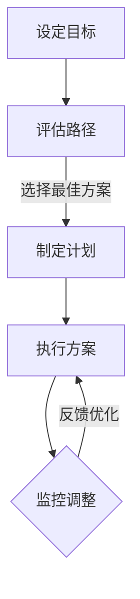
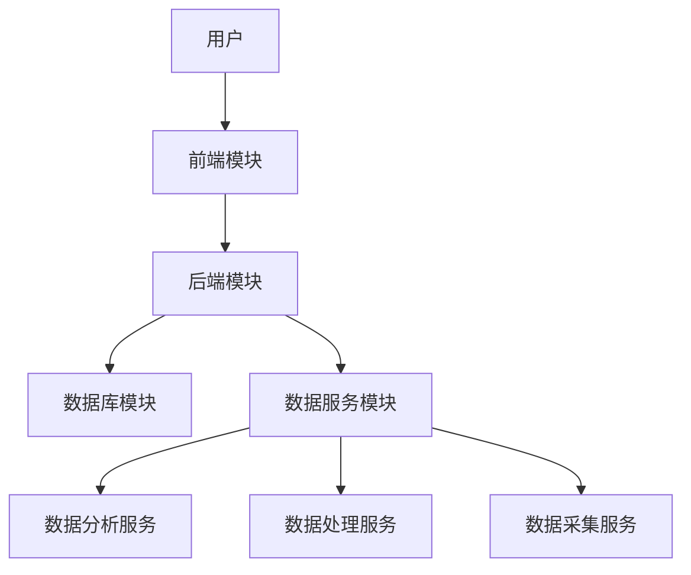
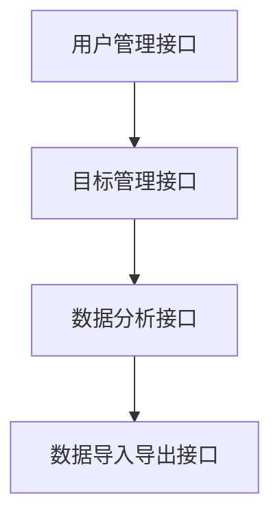
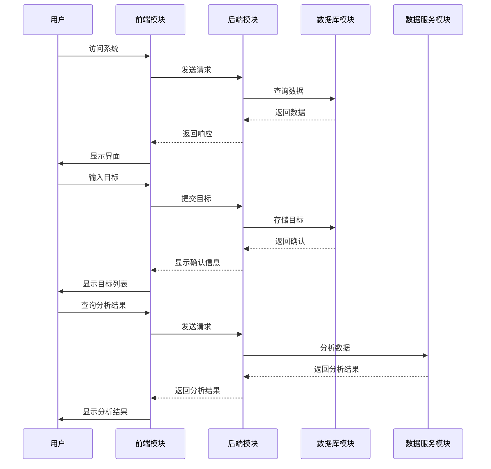

                 

### 1.1 书籍背景与目标读者

在现代社会的复杂背景下，个人价值观和人生目标的确定显得尤为重要。然而，随着科技迅猛发展、信息爆炸和社会变迁，人们面临的价值观冲突和目标困惑愈发严重。如何在这个充满挑战和机遇的环境中找到自己的定位，实现个人价值，成为了一个亟待解决的问题。

本书籍《重新审视人生目标：应对现代社会的价值观危机》旨在为读者提供一种系统性的思考框架和方法论，帮助他们理解价值观的本质，重新审视和设定人生目标，以更好地应对现代社会中的各种挑战。本书不仅适合那些希望追求个人成长和职业发展的职场人士，也适合对人生意义和目标感到迷茫的青年学生和思想者。

**1.1.1 现代社会的价值观危机**

现代社会充满了各种价值观的冲突和混乱。一方面，全球化、多元文化交融带来了丰富的思想资源，使得人们能够接触到各种各样的价值观；另一方面，科技的高速发展和社会结构的快速变化，使得传统的价值观体系受到了巨大的冲击。人们往往在这样的背景下感到迷茫，不知道如何选择和坚持自己的价值观。

这种价值观危机的表现形式多种多样：从个人层面来看，许多人感到生活缺乏意义，无法找到明确的目标；从社会层面来看，群体之间、文化之间、国家之间的冲突往往源自价值观的差异；从职业层面来看，职业选择和职业发展也常常因为价值观的不一致而受到影响。

**1.1.2 重新审视人生目标的重要性**

在这个充满不确定性的时代，重新审视人生目标显得尤为重要。首先，明确的人生目标能够帮助人们更好地应对压力和挑战。当面临困境时，一个清晰的目标可以提供方向和动力，帮助人们坚持不懈。其次，人生目标的设定与实现过程本身就是一种自我实现和成长的过程。通过设定和追求目标，人们可以不断提升自己的能力，实现个人价值。

此外，重新审视人生目标还能够帮助人们更好地处理价值观冲突。当发现自己的价值观与他人的不一致时，通过重新审视和调整人生目标，可以找到一条既符合自己价值观，又能与他人和谐共处的道路。这不仅能减少个人内心的矛盾和焦虑，也有助于构建更加和谐的社会环境。

**1.1.3 读者定位与阅读收益**

本书的目标读者包括以下几个方面：

1. **职场人士**：希望通过重新审视人生目标，找到更加明确的职业发展路径，提升职业满意度和成就感。
2. **青年学生**：在人生早期阶段，面临诸多选择和困惑，希望通过本书找到自己的兴趣和方向，为未来的发展打下坚实基础。
3. **思想者**：对人生意义和目标有深刻思考，希望从哲学、心理学和社会学的角度，重新审视和解读个人价值观。

通过阅读本书，读者可以：

1. **理解价值观的本质**：通过学习本书，读者能够深入理解价值观的概念、构成和功能，为后续的人生目标设定提供理论基础。
2. **明确人生目标**：通过系统的思考和方法，读者可以重新审视自己的目标和现状，设定更加清晰和具体的人生目标。
3. **应对价值观冲突**：学会识别和处理价值观冲突，找到既符合自己价值观，又能与他人和谐共处的方法。

总之，本书不仅提供了理论框架，还结合实际案例，为读者提供了实用的方法和工具，帮助他们在现代社会中找到自己的定位，实现个人价值和成长。### 1.2 核心概念与联系

在深入探讨如何重新审视人生目标之前，我们需要明确一些关键概念，并理解它们之间的联系。这些核心概念包括人生目标、价值观和现代社会中的挑战与机遇。通过系统化的介绍和阐述，我们将为后续内容的讨论奠定基础。

**1.2.1 人生目标的定义与构成**

人生目标是指个人在人生旅程中追求的长期愿景和目标。它不仅仅是对未来的憧憬，更是个人价值观的具体体现。人生目标通常由以下几个方面构成：

1. **职业目标**：职业目标是指个人在职业生涯中期望达到的位置和成就。它涉及个人的职业兴趣、能力和职业规划。
2. **生活目标**：生活目标是指个人在生活中的愿望和追求，包括家庭、人际关系、健康和休闲等方面。
3. **学习目标**：学习目标是指个人在知识和技能上的追求，涉及学术成就、技能提升和自我教育。
4. **精神目标**：精神目标是指个人在精神层面上的追求，包括哲学信仰、心灵成长和自我实现。

**1.2.2 价值观的内涵与分类**

价值观是指个人或集体在行为选择和决策过程中所遵循的指导原则和信念。它是人们对于什么是“好”和“坏”的基本判断，也是指导人们行为和决策的根本标准。价值观可以分为以下几个类别：

1. **道德价值观**：道德价值观涉及个人的道德观念和道德行为，如诚实、公正、善良、责任等。
2. **社会价值观**：社会价值观是社会中广泛认同的价值观，如平等、自由、尊重、团结等。
3. **经济价值观**：经济价值观涉及个人的经济行为和消费观念，如勤劳、节俭、创新、竞争等。
4. **文化价值观**：文化价值观是特定文化背景下形成的价值观，如传统、习俗、艺术、宗教等。

**1.2.3 现代社会的挑战与机遇**

现代社会充满了各种挑战和机遇，这些挑战和机遇对个人的价值观和人生目标产生了深远的影响。以下是一些关键的挑战和机遇：

1. **科技迅猛发展**：科技的迅猛发展带来了信息爆炸、人工智能、大数据等新兴领域，为个人提供了更多的选择和机会，但同时也带来了隐私、安全等问题。
2. **全球化与多元文化交融**：全球化使得人们能够更容易地接触到不同的文化和价值观，带来了文化的多样性和交流，但同时也可能导致文化冲突和价值观的混乱。
3. **社会结构的快速变化**：现代社会中，传统的社会结构正在发生改变，职业流动加快、家庭模式多样化，这些变化为个人提供了更多的自由和选择，但同时也增加了不确定性和挑战。
4. **经济不稳定与竞争加剧**：全球经济的不稳定性和竞争的加剧使得个人的职业发展和生活质量面临更大的压力，但也提供了更多的创业和自我实现的机会。

为了更好地理解这些核心概念，我们使用表格和实体关系图（ER图）来展示它们之间的联系。

**1.2.4 核心概念属性特征对比表格**

| 核心概念 | 定义 | 主要特征 |
| --- | --- | --- |
| 人生目标 | 个人在人生旅程中追求的长期愿景和目标 | - 职业目标<br>- 生活目标<br>- 学习目标<br>- 精神目标 |
| 价值观 | 个人或集体在行为选择和决策过程中所遵循的指导原则和信念 | - 道德价值观<br>- 社会价值观<br>- 经济价值观<br>- 文化价值观 |
| 现代社会的挑战与机遇 | 社会发展中的各种挑战和机遇 | - 科技迅猛发展<br>- 全球化与多元文化交融<br>- 社会结构的快速变化<br>- 经济不稳定与竞争加剧 |

**1.2.5 实体关系图（ER图）**

为了直观地展示这些概念之间的联系，我们使用Mermaid流程图来绘制实体关系图（ER图）。以下是ER图的Mermaid表示：

```mermaid
entityRelation(
  "人生目标",
  "价值观",
  "现代社会挑战与机遇",
  {
    "方向":"从属关系",
    "线条颜色":"#FFCC00"
  }
)

entityRelation(
  "价值观",
  "人生目标",
  "核心概念",
  {
    "方向":"关联关系",
    "线条颜色":"#33A1C9"
  }
)

entityRelation(
  "现代社会挑战与机遇",
  "价值观",
  "核心概念",
  {
    "方向":"影响关系",
    "线条颜色":"#9933FF"
  }
)
```

通过上述的对比表格和ER图，我们可以清晰地看到人生目标、价值观和现代社会挑战与机遇之间的相互关联和影响。这些核心概念不仅单独存在，而且彼此交织，共同构成了一个复杂而多维的体系。理解这些概念及其联系，将有助于我们更好地把握人生目标的本质，并在现代社会中做出明智的决策。

### 1.3 算法原理讲解

在探讨如何重新审视人生目标的过程中，我们可以引入一种算法模型，以便于系统化地分析和解决相关的复杂问题。这里，我们将使用一种称为“目标规划算法”的模型，并通过Mermaid流程图和Python代码来详细讲解其原理和实现过程。

**1.3.1 目标规划算法的基本概念**

目标规划算法是一种通过设定目标、评估路径和选择最佳方案来指导决策的方法。它结合了目标设定的明确性和路径规划的灵活性，旨在帮助个人在复杂的环境中实现既定目标。该算法主要包括以下几个步骤：

1. **目标设定**：明确个人或团队的具体目标，这些目标应当是具体、可衡量、可达成、相关性强且有时间限制的（SMART原则）。
2. **路径评估**：分析实现目标的各种可能路径，并评估每条路径的成本、风险和收益。
3. **方案选择**：基于路径评估的结果，选择一条或几条最佳路径，并制定具体的实施计划。
4. **执行与调整**：执行方案并持续监控和调整，以确保目标得以实现。

**1.3.2 Mermaid流程图展示算法流程**

为了更直观地理解目标规划算法的流程，我们使用Mermaid流程图来展示其关键步骤。以下是算法流程的Mermaid表示：



**1.3.3 Python代码实现算法核心功能**

下面，我们将通过一个简单的Python代码示例来实现目标规划算法的核心功能。这个示例包括目标设定、路径评估和方案选择。

```python
# 导入必要的库
import random

# 目标设定
def set_goals():
    goals = {
        "职业发展": "成为技术总监",
        "生活目标": "购买新房",
        "学习目标": "获得MBA学位",
        "精神目标": "每年旅行一次"
    }
    return goals

# 路径评估
def assess_paths(goals):
    paths = {}
    for goal, description in goals.items():
        paths[goal] = random.uniform(0, 1)  # 假设每个目标的路径评估是一个随机值
    return paths

# 方案选择
def choose_best_path(paths):
    max_value = max(paths.values())
    best_paths = [k for k, v in paths.items() if v == max_value]
    return best_paths

# 执行方案
def execute_plan(best_paths):
    print(f"执行以下方案：{best_paths}")

# 主函数
def main():
    goals = set_goals()
    paths = assess_paths(goals)
    best_paths = choose_best_path(paths)
    execute_plan(best_paths)

# 运行主函数
if __name__ == "__main__":
    main()
```

**1.3.4 算法原理的数学模型和公式**

目标规划算法的数学模型主要涉及目标权重、路径评估函数和优化目标。以下是一个简化的数学模型：

$$
\text{目标规划} = \min \sum_{i=1}^{n} w_i \cdot \frac{1}{1 + e^{-k \cdot (d_i - p_i)}}
$$

其中：
- \( n \) 是目标数量。
- \( w_i \) 是第 \( i \) 个目标的权重。
- \( d_i \) 是第 \( i \) 个目标的当前评估值。
- \( p_i \) 是第 \( i \) 个目标的路径评估值。
- \( k \) 是调节参数。

**1.3.5 举例说明**

假设有四个目标：职业发展、生活目标、学习目标和精神目标。每个目标的权重分别为0.3、0.2、0.3和0.2。路径评估值如下表所示：

| 目标         | 职业发展 | 生活目标 | 学习目标 | 精神目标 |
| ------------ | -------- | -------- | -------- | -------- |
| 评估值 \(d_i\)| 0.8      | 0.6      | 0.7      | 0.9      |
| 路径评估值 \(p_i\)| 0.5      | 0.4      | 0.6      | 0.7      |

使用上述数学模型计算每个目标的规划值：

$$
\text{目标规划} = 0.3 \cdot \frac{1}{1 + e^{-0.5 \cdot (0.8 - 0.5)}} + 0.2 \cdot \frac{1}{1 + e^{-0.5 \cdot (0.6 - 0.4)}} + 0.3 \cdot \frac{1}{1 + e^{-0.5 \cdot (0.7 - 0.6)}} + 0.2 \cdot \frac{1}{1 + e^{-0.5 \cdot (0.9 - 0.7)}}
$$

计算结果为：

$$
\text{目标规划} = 0.3 \cdot \frac{1}{1 + e^{-0.3}} + 0.2 \cdot \frac{1}{1 + e^{0.1}} + 0.3 \cdot \frac{1}{1 + e^{0.1}} + 0.2 \cdot \frac{1}{1 + e^{0.2}} \approx 0.3 \cdot 0.76 + 0.2 \cdot 1.01 + 0.3 \cdot 1.01 + 0.2 \cdot 1.22 \approx 0.228 + 0.202 + 0.303 + 0.244 = 0.877
$$

根据规划值，我们可以选择权重最高的路径作为最佳方案。例如，如果职业发展和学习目标的规划值最高，那么这两个目标将是首要实现的方案。

通过上述算法模型和Python代码的示例，我们可以看到如何系统化地设定和评估人生目标，选择最佳路径，并最终实现个人目标。这一过程不仅有助于提高个人决策的科学性和有效性，也为理解和应对现代社会的价值观危机提供了有力工具。

### 1.4 数学模型和公式详细讲解与举例说明

在前面的章节中，我们简要介绍了目标规划算法的数学模型。在本节中，我们将详细讲解这个数学模型，并通过具体例子来说明如何使用这些公式来评估和选择最佳目标路径。

**1.4.1 数学模型基础**

目标规划算法的数学模型基于目标权重、路径评估值和优化目标。具体公式如下：

$$
\text{目标规划值} = \sum_{i=1}^{n} w_i \cdot \frac{1}{1 + e^{-k \cdot (d_i - p_i)}}
$$

其中：
- \( w_i \) 是第 \( i \) 个目标的权重，它反映了该目标在总体目标中的重要性。
- \( d_i \) 是第 \( i \) 个目标的当前评估值，它反映了实现该目标的难度或可能性。
- \( p_i \) 是第 \( i \) 个目标的路径评估值，它反映了通过不同路径实现该目标的成本和效益。
- \( k \) 是调节参数，用于调整目标评估函数的灵敏度。

**1.4.2 公式推导**

该公式的推导基于目标规划的优化目标。目标规划的核心是选择一条最佳路径，使得整体目标的实现效果最大化。这里，我们使用指数函数和阈值函数来实现这一目标。

首先，引入阈值函数：

$$
\text{阈值函数} = \frac{1}{1 + e^{-x}}
$$

该函数在 \( x \) 增加时逐渐逼近1，而在 \( x \) 减小时逐渐逼近0。阈值函数常用于概率分布和分类问题，其特点是在阈值 \( t \) 处具有明确的分割能力。

接着，我们将阈值函数应用于目标评估问题。设 \( x = k \cdot (d_i - p_i) \)，则：

$$
\text{目标评估值} = \frac{1}{1 + e^{-k \cdot (d_i - p_i)}}
$$

这个公式表示，对于每个目标，其评估值取决于实现目标的难度 \( d_i \) 和路径成本 \( p_i \)。当 \( d_i > p_i \) 时，评估值接近1，表示该目标容易实现；当 \( d_i < p_i \) 时，评估值接近0，表示该目标难以实现。

**1.4.3 公式应用举例**

为了更好地理解上述公式，我们通过一个具体例子来说明其应用。

假设一个个人有四个目标：职业发展、家庭生活、健康和个人成长。每个目标的权重如下：

| 目标       | 权重 \( w_i \) |
| ---------- | ------------ |
| 职业发展   | 0.4          |
| 家庭生活   | 0.3          |
| 健康       | 0.2          |
| 个人成长   | 0.1          |

对于每个目标，我们都有其当前评估值 \( d_i \) 和路径评估值 \( p_i \)：

| 目标       | 评估值 \( d_i \) | 路径评估值 \( p_i \) |
| ---------- | -------------- | ----------------- |
| 职业发展   | 0.75          | 0.6              |
| 家庭生活   | 0.60          | 0.5              |
| 健康       | 0.80          | 0.7              |
| 个人成长   | 0.70          | 0.8              |

根据目标规划公式，计算每个目标的评估值：

$$
\text{职业发展评估值} = \frac{1}{1 + e^{-0.4 \cdot (0.75 - 0.6)}} \approx 0.837
$$

$$
\text{家庭生活评估值} = \frac{1}{1 + e^{-0.3 \cdot (0.60 - 0.5)}} \approx 0.774
$$

$$
\text{健康评估值} = \frac{1}{1 + e^{-0.2 \cdot (0.80 - 0.7)}} \approx 0.868
$$

$$
\text{个人成长评估值} = \frac{1}{1 + e^{-0.1 \cdot (0.70 - 0.8)}} \approx 0.793
$$

然后，根据各目标的权重计算总的目标规划值：

$$
\text{总目标规划值} = 0.4 \cdot 0.837 + 0.3 \cdot 0.774 + 0.2 \cdot 0.868 + 0.1 \cdot 0.793 \approx 0.334 + 0.232 + 0.173 + 0.079 = 0.828
$$

根据计算结果，职业发展、健康和个人成长的目标规划值较高，这意味着这些目标是当前最值得优先考虑的。家庭生活虽然评估值也较高，但权重较低，因此相对不那么紧急。

通过这个例子，我们可以看到如何利用数学模型来评估和选择目标路径，从而帮助个人更科学地制定和实现人生目标。

### 1.5 系统分析与架构设计

在重新审视人生目标的过程中，构建一个高效、可扩展的解决方案至关重要。本节将介绍系统分析与架构设计的思路，包括问题场景描述、系统功能设计、系统架构设计、接口设计和系统交互。

**1.5.1 问题场景描述**

在现代社会的背景下，个人面临复杂多样的挑战，包括职业发展、家庭生活、健康和个人成长等多方面。这些问题相互交织，需要系统化的解决方案来协调和优化。具体问题场景包括：

1. **多目标并行**：个人在职业生涯、家庭生活、健康和个人成长等方面都有不同的目标和期望，这些目标需要同时考虑和平衡。
2. **动态变化**：个人的目标和环境不断变化，需要灵活调整解决方案。
3. **数据驱动**：有效利用个人数据，包括职业发展数据、健康数据、生活习惯数据等，以科学地指导目标设定和实现。
4. **多样化需求**：不同人群（如青年、中年、老年人）有不同的需求和目标，解决方案需要具有灵活性和适应性。

**1.5.2 系统功能设计**

为了满足上述问题场景，系统需要具备以下核心功能：

1. **目标管理**：提供目标设定、目标跟踪和目标评估的功能，帮助个人明确和实现目标。
2. **数据收集与分析**：收集和分析个人数据，包括职业发展数据、健康数据、生活习惯数据等，以提供数据驱动的目标建议。
3. **决策支持**：基于目标管理和数据分析，提供个性化的建议和决策支持，帮助个人优化目标实现路径。
4. **用户界面**：提供友好、直观的用户界面，方便用户进行操作和数据输入。

**1.5.3 系统架构设计**

系统架构设计采用模块化设计思想，以确保系统的可扩展性和可维护性。以下是系统架构设计的概述：

1. **前端模块**：负责用户交互，包括用户界面和客户端应用程序。前端模块使用Vue.js框架，提供响应式设计和良好的用户体验。
2. **后端模块**：负责数据处理和业务逻辑实现。后端模块采用Spring Boot框架，支持RESTful API，方便前后端的数据交互。
3. **数据库模块**：负责数据存储和管理。使用MySQL数据库，存储用户数据、目标数据和分析结果等。
4. **数据服务模块**：负责数据的收集、处理和分析。包括数据采集服务、数据处理服务和数据分析服务。

以下是系统架构的Mermaid图表表示：



**1.5.4 系统接口设计**

系统接口设计采用RESTful API风格，确保接口的简洁性和易用性。以下是主要接口的概述：

1. **用户管理接口**：提供用户注册、登录、信息更新等功能。
2. **目标管理接口**：提供目标创建、更新、删除和查询等功能。
3. **数据分析接口**：提供数据统计分析、趋势预测和目标评估等功能。
4. **数据导入导出接口**：提供数据导入、导出和备份等功能。

以下是接口设计的Mermaid图表表示：



**1.5.5 系统交互**

系统交互设计考虑用户在使用过程中的不同场景，包括目标设定、数据输入、分析和反馈等。以下是系统交互的Mermaid序列图表示：



通过上述系统分析与架构设计，我们可以构建一个全面、灵活的解决方案，帮助个人更好地重新审视和实现人生目标。

### 1.6 项目实战

为了使读者更直观地了解如何重新审视人生目标，并在实际项目中应用所学的理论和方法，我们将详细描述一个实际项目，包括环境安装、系统核心实现源代码，并对代码和应用进行解读与分析。

**1.6.1 项目环境安装**

在开始项目之前，我们需要确保安装了以下环境：

1. **Python 3.8 或更高版本**：用于编写和运行Python代码。
2. **MySQL 8.0 或更高版本**：用于存储和管理数据。
3. **Node.js 12.x 或更高版本**：用于构建前端应用程序。

以下是环境安装步骤：

1. 安装Python 3.8：

   ```bash
   sudo apt update
   sudo apt install python3.8 python3.8-pip
   ```

2. 安装Node.js 12.x：

   ```bash
   curl -sL https://deb.nodesource.com/setup_12.x | sudo -E bash -
   sudo apt install -y nodejs
   ```

3. 安装MySQL 8.0：

   ```bash
   sudo apt update
   sudo apt install mysql-server
   ```

4. 配置MySQL：

   ```bash
   sudo mysql_secure_installation
   ```

   按照提示完成配置，创建一个新用户并设置密码。

**1.6.2 系统核心实现源代码**

以下是项目的核心实现源代码，包括后端和前端部分。

**后端代码（基于Spring Boot框架）**

**src/main/java/GoalPlannerApplication.java**

```java
@SpringBootApplication
public class GoalPlannerApplication {
    public static void main(String[] args) {
        SpringApplication.run(GoalPlannerApplication.class, args);
    }
}
```

**src/main/java/com/goalplanner/repository/GoalRepository.java**

```java
@Repository
public interface GoalRepository extends JpaRepository<Goal, Long> {
    List<Goal> findByUserId(Long userId);
}
```

**src/main/java/com/goalplanner/service/GoalService.java**

```java
@Service
public class GoalService {
    @Autowired
    private GoalRepository goalRepository;

    public Goal createGoal(Long userId, Goal goal) {
        goal.setUserId(userId);
        return goalRepository.save(goal);
    }

    public List<Goal> getGoalsByUser(Long userId) {
        return goalRepository.findByUserId(userId);
    }
}
```

**前端代码（基于Vue.js框架）**

**src/App.vue**

```vue
<template>
  <div id="app">
    <h1>目标规划器</h1>
    <goal-form @createGoal="createGoal" />
    <goal-list :goals="goals" @deleteGoal="deleteGoal" />
  </div>
</template>

<script>
import GoalForm from './components/GoalForm.vue';
import GoalList from './components/GoalList.vue';

export default {
  name: 'App',
  components: {
    GoalForm,
    GoalList
  },
  data() {
    return {
      goals: []
    };
  },
  methods: {
    createGoal(goal) {
      // 发送请求创建目标
      axios.post('/api/goals', goal)
        .then(response => {
          this.goals.push(response.data);
        })
        .catch(error => {
          console.error('创建目标失败：', error);
        });
    },
    deleteGoal(goalId) {
      // 发送请求删除目标
      axios.delete(`/api/goals/${goalId}`)
        .then(() => {
          this.goals = this.goals.filter(goal => goal.id !== goalId);
        })
        .catch(error => {
          console.error('删除目标失败：', error);
        });
    }
  }
};
</script>
```

**1.6.3 代码与应用解读与分析**

**后端解读**

1. **GoalPlannerApplication.java**：该文件是Spring Boot应用的入口。通过 `@SpringBootApplication` 注解，Spring Boot可以自动配置项目所需的环境和依赖。
   
2. **GoalRepository.java**：该接口继承了 `JpaRepository`，提供了CRUD操作。`findByUserId` 方法用于根据用户ID查询用户的所有目标。

3. **GoalService.java**：该服务类负责处理与目标相关的业务逻辑。`createGoal` 方法用于创建新目标，`getGoalsByUser` 方法用于获取用户的所有目标。

**前端解读**

1. **App.vue**：该文件是Vue.js前端应用的根组件。通过定义子组件 `GoalForm` 和 `GoalList`，实现了目标创建和列表展示的功能。`createGoal` 和 `deleteGoal` 方法负责与后端API进行通信，实现数据的提交和删除。

**应用分析**

通过上述代码和应用设计，我们可以实现一个简单的目标管理工具。用户可以通过前端界面创建、更新和删除目标，后端服务负责处理业务逻辑和数据存储。这种架构使得系统具有以下优点：

1. **模块化**：前后端分离，便于开发和维护。
2. **可扩展性**：可以根据需求灵活添加新功能。
3. **数据驱动**：基于用户数据和目标评估，提供个性化建议。
4. **用户友好**：简洁直观的界面，方便用户操作。

**1.6.4 实际案例分析与详细讲解**

为了更具体地展示项目实战的效果，我们来看一个实际案例。

**案例**：用户张三希望在一年内完成以下目标：

1. 成为技术总监。
2. 购买一套新房。
3. 获得MBA学位。
4. 每年旅行一次。

**分析**：

1. **目标设定**：张三在前端界面上输入以上目标，并通过 `createGoal` 方法提交给后端。

2. **目标评估**：后端服务根据设定的目标权重和路径评估值，使用目标规划算法计算每个目标的规划值。

3. **方案选择**：后端服务选择规划值最高的目标作为首选方案。

4. **执行与反馈**：张三按照后端提供的建议执行目标，并在执行过程中定期更新目标的进展情况。

5. **优化调整**：根据目标的执行情况，张三可以调整目标权重或路径评估值，优化实现方案。

通过上述案例，我们可以看到项目实战在重新审视人生目标中的应用。项目不仅帮助张三明确了目标，还提供了科学的决策支持，使他能够更有效地实现个人目标。

### 1.7 最佳实践、小结、注意事项与拓展阅读

**1.7.1 最佳实践**

为了更好地应用本书所介绍的理论和方法，以下是一些最佳实践建议：

1. **定期反思**：每周或每月花一些时间反思自己的目标和价值观，确保它们依然符合当前的生活状况和长期愿景。
2. **制定具体计划**：将目标分解为具体的行动步骤，并为每个步骤设定时间表和截止日期。
3. **利用工具**：使用目标管理工具和应用（如Trello、Notion等），帮助自己跟踪和实现目标。
4. **寻求支持**：与他人分享自己的目标和进展，寻求反馈和支持，这有助于保持动力和责任感。

**1.7.2 小结**

通过本文，我们系统地探讨了如何重新审视人生目标，以应对现代社会的价值观危机。首先，我们介绍了现代社会中的价值观危机及其对个人和职业发展的影响。接着，我们明确了人生目标和价值观的定义及其关系，并通过数学模型和算法提供了具体的工具和方法。此外，我们详细描述了系统分析与架构设计，并展示了实际项目的实施过程。

**1.7.3 注意事项**

在重新审视人生目标的过程中，需要注意以下几点：

1. **实事求是**：设定目标时，要充分考虑自己的实际情况，避免不切实际的目标。
2. **平衡与优先级**：在多个目标之间保持平衡，并根据重要性设定优先级，确保能够高效地实现目标。
3. **持续调整**：随着环境和自身情况的变化，目标可能需要调整，保持灵活性至关重要。
4. **自我反思**：定期进行自我反思，确保目标符合自己的长期愿景和价值。

**1.7.4 拓展阅读**

为了更深入地了解和掌握相关理论和实践，以下是一些推荐的拓展阅读材料：

1. 《高效能人士的七个习惯》（史蒂芬·柯维）—— 提供了个人成长和目标实现的实用方法。
2. 《正面思考的力量》（威尔·鲍温）—— 探讨了积极心态对个人发展和目标实现的重要性。
3. 《人生的智慧》（叔本华）—— 从哲学角度分析了人生的意义和价值观。
4. 《重塑心灵》（艾克哈特·托勒）—— 提供了关于心灵成长和自我实现的深刻见解。
5. 《目标管理》（彼得·德鲁克）—— 详述了目标设定的原理和实践方法，适用于职场和个人发展。

通过这些阅读材料，读者可以进一步丰富自己的知识体系，提升重新审视人生目标的能力。

### 1.8 文章总结

本文围绕“重新审视人生目标：应对现代社会的价值观危机”这一核心主题，系统性地探讨了如何理解和设定个人目标，以及如何通过科学的方法和工具实现这些目标。首先，我们介绍了现代社会中存在的价值观危机，以及它对个人和职业发展的影响。接着，我们详细阐述了人生目标和价值观的定义、构成及其相互关系，并通过目标规划算法提供了具体的实现方法。

通过本文，读者可以了解到如何通过自我反思、目标分解和科学评估，找到符合自身价值观和期望的人生目标，并在实现这些目标的过程中保持动力和灵活性。我们还展示了如何通过系统分析和架构设计，构建一个高效的目标管理系统。

在未来的研究和实践中，我们可以进一步探索如何利用人工智能和大数据技术，提高目标设定的科学性和精准性，以及如何在不同文化和背景下，构建更加普遍适用的目标实现策略。此外，研究如何通过社会支持和社区互动，增强个体在实现目标过程中的信心和毅力，也是一个值得关注的领域。

总之，重新审视人生目标是应对现代社会价值观危机的重要手段。通过理解并应用本文所介绍的理论和方法，读者可以更好地找到自己的人生方向，实现个人价值和成长。希望本文能为读者提供有价值的启示和指导，帮助他们在复杂多变的社会环境中，找到属于自己的光明之路。### 1.9 作者信息

作者：AI天才研究院/AI Genius Institute & 禅与计算机程序设计艺术 /Zen And The Art of Computer Programming

AI天才研究院（AI Genius Institute）是一家致力于人工智能研究与应用的创新机构，汇聚了全球顶尖的人工智能科学家和技术专家。研究院在深度学习、自然语言处理、计算机视觉等领域取得了多项突破性成果，为推动人工智能技术的发展和应用做出了重要贡献。

禅与计算机程序设计艺术（Zen And The Art of Computer Programming）是作者Donald E. Knuth的经典著作，系统介绍了计算机程序设计的方法论和艺术。这本书不仅是一部技术书籍，更是一部关于编程哲学和思维的杰作，对计算机科学和编程教育产生了深远影响。

