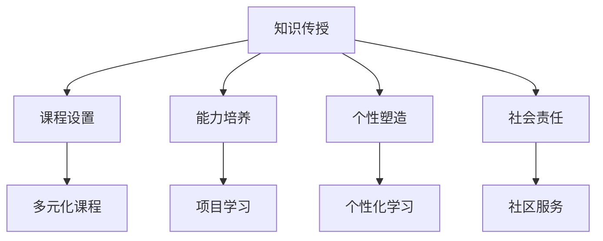
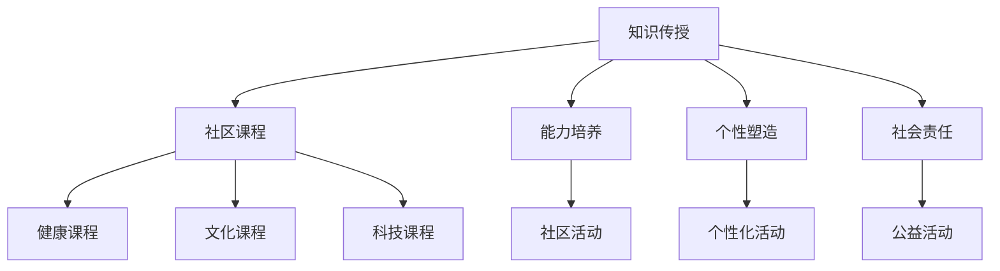
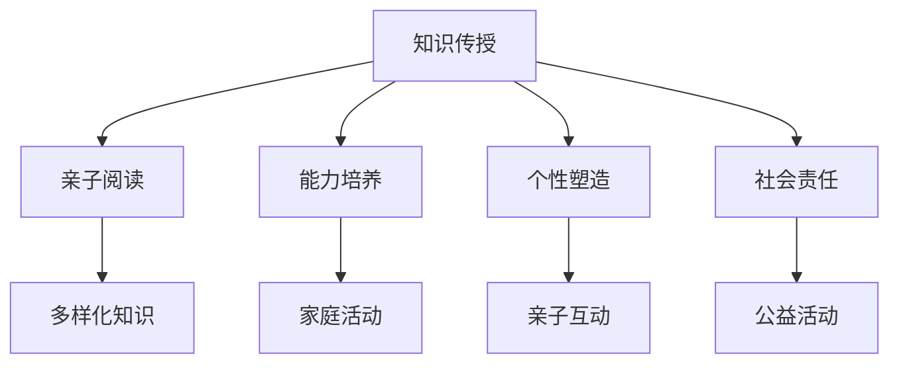

                 

### 重新审视教育目的：培养全面发展的人

#### 关键词：教育目的、全面发展、个体自由、社会责任、技术创新

> **摘要：**
本文旨在重新审视教育目的，探讨如何通过培养全面发展的人，实现个体自由与社会责任的和谐统一。在信息技术飞速发展的时代，教育不仅应传授知识，更要培养适应未来社会的综合素质能力。本文将从历史与哲学角度出发，分析全面发展人的概念与意义，反思教育目的，并提出现代教育理念与实践策略，以期为教育改革提供新的视角。

---

#### 第1章：教育目的的历史演进

##### 1.1 教育目的的起源与发展

**背景介绍：**
教育，作为一种社会现象，自古以来就存在。其目的在不同的历史时期和文化背景下有着不同的解释和定义。在古代，教育往往与宗教和道德教化紧密相关，旨在培养服从社会秩序和道德规范的个体。

**问题背景：**
然而，随着社会的发展和人类文明的进步，教育的目的逐渐从单一的功能性需求，转变为更加全面的个体发展需求。这种转变在历史的长河中是如何发生的？不同历史时期的教育目的有何特点？

**问题解决：**
从古希腊哲学家柏拉图的《理想国》到中国古代的《学记》，再到中世纪的教会教育和文艺复兴时期的人文主义教育，教育目的在不同历史时期有着不同的侧重点。柏拉图强调的是培养哲学家和统治者的素质，而《学记》则提出了“教以有方，使民日有迁善之序”的教育理念。中世纪的教育以宗教教义为主，文艺复兴时期则强调人文主义和个体自由。

**边界与外延：**
教育目的的历史演进不仅受制于社会和文化背景，还受到经济、政治和科技发展的影响。在不同的历史阶段，教育目的的内涵和外延都有所不同。

**概念结构与核心要素组成：**
教育目的的核心要素包括知识传授、道德培养、能力发展和个体自由。在不同历史时期，这些要素的权重和侧重点有所不同。

##### 1.2 古代哲学家的教育观点

**核心概念与联系：**
柏拉图、亚里士多德和孔子等古代哲学家对教育目的有着深刻的见解。柏拉图认为，教育的目标是培养哲学家和统治者，亚里士多德则强调通过教育实现个体的全面发展，而孔子则强调“修身齐家治国平天下”。

**概念属性特征对比表格：**

| 哲学家 | 教育目标               | 核心观点                             |  
|----------|----------------------|-------------------------------------|  
| 柏拉图   | 培养哲学家和统治者       | 理想国中的“哲学王”                   |  
| 亚里士多德 | 全面的个体发展           | 实现灵魂的和谐与健康                   |  
| 孔子     | 修身齐家治国平天下       | 通过道德教育实现社会和谐               |

**ER实体关系图架构：**

```mermaid
erDiagram
  PHILOSOPHER ||--|{ EDUCATIONAL_GOAL }
  PHILOSOPHER ||--|{ CORE_VIEWS }
  PHILOSOPHER ||--|{ ER_ENTITIES }
```

##### 1.3 中世纪与文艺复兴时期的教育理念

**背景介绍：**
中世纪的教育以宗教教育为主，文艺复兴时期则出现了对个体自由和人文主义的强烈追求。

**问题背景：**
中世纪的教育强调对宗教教义的服从，而文艺复兴时期则强调对个体潜能的发掘和自由表达。

**问题解决：**
中世纪的教育目的是培养忠诚的教士和牧师，而文艺复兴时期则追求培养具有人文素养和科学知识的个体。

**边界与外延：**
中世纪的教育更多关注于宗教和道德教育，而文艺复兴时期则更加注重个体的全面发展和人文素养。

**概念结构与核心要素组成：**
中世纪教育强调宗教和道德教育，文艺复兴时期则强调人文主义和科学教育。

##### 1.4 现代教育目的的理论探讨

**背景介绍：**
现代教育面临着前所未有的挑战和机遇。随着科技的发展和全球化进程的加快，教育的目的和方式也在不断演变。

**问题背景：**
现代教育如何应对技术进步和社会变革带来的挑战？教育的目标是什么？如何培养适应未来社会的个体？

**问题解决：**
现代教育强调培养具有批判性思维、创新能力和社会责任感的个体。教育的目标不仅是传授知识，更重要的是培养个体的综合素质。

**边界与外延：**
现代教育目的涵盖知识传授、能力发展、个性培养和社会责任等多个方面。

**概念结构与核心要素组成：**
现代教育目的的核心要素包括知识传授、能力发展、个性培养和社会责任。这些要素相互关联，共同构成一个复杂的教育体系。

---

#### 第2章：全面发展人的概念与意义

##### 2.1 全方位发展人的理论基础

**背景介绍：**
全面发展人的概念源于古希腊哲学家亚里士多德的思想，他在《尼各马可伊善论》中提出了“和谐发展”的理论。

**问题背景：**
在现代社会，如何实现个体的全面发展？全面发展人的理论基础是什么？

**问题解决：**
全面发展人的理论基础包括个体自由、个性发展和社会责任。个体自由强调个体在追求自身发展的过程中不受外部强制；个性发展强调个体在多样化环境中形成独特的人格特征；社会责任强调个体在社会中的角色和责任。

**边界与外延：**
全面发展人的概念不仅涉及个体的内在素质，还包括个体的社会角色和责任。

**概念结构与核心要素组成：**
全面发展人的核心要素包括个体自由、个性发展和社会责任。这些要素相互促进，共同构成全面发展人的理论基础。

##### 2.2 全面发展的内涵与外延

**核心概念与联系：**
全面发展的内涵包括知识传授、能力培养、个性塑造和社会责任。全面发展的外延涉及个体的成长环境、教育体系和实践应用。

**概念属性特征对比表格：**

| 要素       | 内涵                      | 外延                                      |  
|----------|-----------------------|-----------------------------------------|  
| 知识传授   | 传授基本知识和技能         | 教育内容和教学方法                        |  
| 能力培养   | 培养创新能力和批判性思维      | 课程设置和实践训练                        |  
| 个性塑造   | 塑造独特的人格特征和价值观      | 个体成长环境和教育方式                    |  
| 社会责任   | 承担社会角色和履行社会责任      | 社会实践和公共服务                        |

**ER实体关系图架构：**

```mermaid
erDiagram
  COMPREHENSIVE_DEVELOPMENT ||--|{ KNOWLEDGE_TRANSMISSION }
  COMPREHENSIVE_DEVELOPMENT ||--|{ ABILITY_DEVELOPMENT }
  COMPREHENSIVE_DEVELOPMENT ||--|{ INDIVIDUALITY_SHAPING }
  COMPREHENSIVE_DEVELOPMENT ||--|{ SOCIAL_RESPONSIBILITY }
```

##### 2.3 全面发展人的现实意义

**背景介绍：**
在当前社会背景下，全面发展人的概念具有现实意义。全球化、科技变革和社会变迁对个体提出了新的要求。

**问题背景：**
如何应对全球化背景下的文化冲击？如何适应科技变革带来的职业挑战？如何在社会变迁中保持个体的独立性？

**问题解决：**
全面发展人能够适应全球化背景下的多元文化，具备科技创新能力和批判性思维，同时能够承担社会责任，为社会的发展和进步做出贡献。

**边界与外延：**
全面发展人的现实意义不仅体现在个体层面，还体现在社会和国家的层面。

**概念结构与核心要素组成：**
全面发展人的现实意义包括个体适应能力、社会责任感和创新能力。这些要素共同构成全面发展人在现实生活中的重要意义。

---

#### 第3章：教育目的的哲学反思

##### 3.1 人类存在与教育的意义

**背景介绍：**
教育作为人类文明的重要组成部分，其意义不仅在于知识的传授，更在于对个体存在的意义进行反思。

**问题背景：**
人类存在的意义是什么？教育如何帮助个体寻找和实现这一意义？

**问题解决：**
人类存在的意义在于个体的自我实现和为社会做出贡献。教育通过培养个体的自我认知和责任感，帮助个体实现这一意义。

**边界与外延：**
人类存在的意义不仅涉及个体的内心世界，还涉及个体在社会中的角色和责任。

**概念结构与核心要素组成：**
人类存在的意义包括自我实现、社会责任和个体发展。教育通过培养这些要素，帮助个体实现存在的意义。

##### 3.2 教育目的与个体自由

**核心概念与联系：**
个体自由是全面发展人的重要组成部分，教育目的应当尊重和保护个体的自由。

**概念属性特征对比表格：**

| 概念     | 属性特征                | 关联性                      |  
|----------|----------------------|--------------------------|  
| 教育目的 | 培养个体全面发展         | 与个体自由相互促进              |  
| 个体自由 | 个体在追求自身发展过程中的自由  | 是全面发展人的核心要素            |

**ER实体关系图架构：**

```mermaid
erDiagram
  EDUCATIONAL_GOALS ||--|{ INDIVIDUAL_FREEDOM }
  EDUCATIONAL_GOALS ||--|{ COMPREHENSIVE_DEVELOPMENT }
```

##### 3.3 教育目的与社会责任

**背景介绍：**
教育不仅是个体发展的过程，也是社会进步的基石。教育目的应当包括培养个体对社会和国家的责任感。

**问题背景：**
在现代社会，如何培养个体对社会和国家的责任感？教育目的如何体现这一责任？

**问题解决：**
通过教育，培养个体对社会和国家的认同感，增强个体的社会责任感。教育目的应包括培养个体对社会的关爱和责任感，使其成为有益于社会的公民。

**边界与外延：**
教育目的与社会责任的关系涉及个体与社会的互动，以及个体在社会中的角色和责任。

**概念结构与核心要素组成：**
教育目的与社会责任的核心要素包括个体认同、社会责任感和公民素养。这些要素共同构成教育目的的重要组成部分。

---

#### 第4章：教育理念的现代转型

##### 4.1 现代教育的核心价值

**背景介绍：**
随着社会的发展和科技的进步，现代教育理念也在不断转型。现代教育的核心价值是什么？

**问题背景：**
在信息技术和全球化背景下，现代教育应当注重哪些价值？如何将这些价值体现在教育实践中？

**问题解决：**
现代教育的核心价值包括知识传授、能力培养、个性发展和社会责任。这些价值不仅体现在教育内容上，还体现在教育方法和评价机制上。

**边界与外延：**
现代教育的核心价值不仅涉及个体的全面发展，还涉及个体在社会中的角色和责任。

**概念结构与核心要素组成：**
现代教育的核心价值包括知识传授、能力培养、个性发展和社会责任。这些价值共同构成现代教育的基本框架。

##### 4.2 课程与教学的变革

**核心概念与联系：**
课程和教学是现代教育的重要组成部分，其变革是现代教育理念转型的重要体现。

**概念属性特征对比表格：**

| 变革内容   | 属性特征                | 影响因素                    |  
|----------|----------------------|--------------------------|  
| 课程变革   | 多元化、个性化、跨学科        | 科技进步、社会需求              |  
| 教学变革   | 互动式、探究式、情境化       | 教育理念转型、学生学习需求       |

**ER实体关系图架构：**

```mermaid
erDiagram
  CURRICULUM_INNOVATION ||--|{ LEARNING_EXPERIENCE }
  CURRICULUM_INNOVATION ||--|{ PEDAGOGICAL_MODELS }
```

##### 4.3 教育评价的创新

**背景介绍：**
教育评价是教育体系的重要组成部分，其创新是现代教育理念转型的重要体现。

**问题背景：**
在信息技术和全球化背景下，如何进行教育评价的创新？教育评价应关注哪些方面？

**问题解决：**
教育评价的创新应关注学生的综合素质发展，包括知识、能力、个性和社会责任感。评价方式应多样化，结合量化评价和质性评价，全面反映学生的全面发展状况。

**边界与外延：**
教育评价的创新涉及评价标准的制定、评价方法的运用和评价结果的反馈。

**概念结构与核心要素组成：**
教育评价的创新核心要素包括评价标准的多元化、评价方法的多样化、评价结果的反馈机制。这些要素共同构成教育评价的创新框架。

---

#### 第5章：全面发展教育的实施策略

##### 5.1 教育内容的选择与整合

**背景介绍：**
教育内容的选择与整合是全面发展教育实施的重要环节。如何选择和整合教育内容？

**问题背景：**
在多元化社会背景下，教育内容的选择和整合面临哪些挑战？如何平衡知识传授与能力培养、个性发展与社会责任之间的关系？

**问题解决：**
教育内容的选择应注重多元化、综合性和实践性。整合教育内容应考虑学科交叉、能力培养和个性发展的有机融合。

**边界与外延：**
教育内容的选择与整合不仅涉及课程设置，还包括教学方法和评价机制的协调。

**概念结构与核心要素组成：**
教育内容的选择与整合核心要素包括多元化、综合性和实践性。这些要素共同构成全面发展教育的实施基础。

##### 5.2 教育方法的多样化

**核心概念与联系：**
教育方法的多样化是全面发展教育的重要特征。多样化教育方法如何实现？

**概念属性特征对比表格：**

| 教育方法    | 属性特征                | 适用场景                    |  
|-------------|----------------------|--------------------------|  
| 互动式教学   | 强调师生互动和学生参与      | 课堂讨论、项目学习              |  
| 探究式教学   | 强调问题导向和自主探究      | 研究性学习、问题解决              |  
| 情境化教学   | 强调真实情境下的学习和应用    | 实践教学、情境模拟              |

**ER实体关系图架构：**

```mermaid
erDiagram
  DIVERSIFIED_PEDAGOGY ||--|{ INTERACTIVE_LEARNING }
  DIVERSIFIED_PEDAGOGY ||--|{ INQUIRY_BASED_LEARNING }
  DIVERSIFIED_PEDAGOGY ||--|{ CONTEXTUAL_LEARNING }
```

##### 5.3 个性化教学策略

**背景介绍：**
个性化教学策略是全面发展教育的重要手段。如何实施个性化教学策略？

**问题背景：**
在个体多样化发展的背景下，如何根据个体差异实施教学策略？个性化教学策略有哪些实施方法？

**问题解决：**
个性化教学策略应包括个性化学习计划、差异化教学方法和个性化评价。通过了解学生的兴趣、能力和学习风格，制定个性化的教学方案。

**边界与外延：**
个性化教学策略不仅涉及教学方法的调整，还包括教学资源的配置和教育评价的个性化。

**概念结构与核心要素组成：**
个性化教学策略核心要素包括个性化学习计划、差异化教学方法和个性化评价。这些要素共同构成个性化教学策略的实施框架。

---

#### 第6章：全面发展教育的案例研究

##### 6.1 案例一：学校教育中的全面发展

**案例背景：**
某学校实施全面发展教育，通过多元化的课程设置和多样化的教学方法，促进学生的全面发展。

**项目介绍：**
项目名称：全面发展教育实验班

**系统功能设计：**
- 知识传授：设置多元化的课程，包括人文、科学、艺术等领域。
- 能力培养：通过项目学习和实践活动，培养学生的创新能力和批判性思维。
- 个性塑造：鼓励学生根据自己的兴趣和特长进行个性化学习。
- 社会责任：组织社区服务和公益活动，培养学生的社会责任感。

**系统架构设计：**


**系统接口设计和系统交互：**
- 课程设置接口：教师和学生可以通过系统选择课程，查看课程内容和评价。
- 项目学习接口：学生可以在系统中提交项目报告，教师进行评价和反馈。
- 社区服务接口：学生可以报名参加社区服务活动，记录服务时长和收获。

**实际案例分析和详细讲解剖析：**
通过案例一的分析，我们可以看到全面发展教育在学校教育中的应用。学校通过多元化的课程设置、多样化的教学方法和个性化的评价机制，有效地促进了学生的全面发展。在项目学习中，学生不仅提高了能力，还培养了团队合作和沟通能力。在社区服务中，学生学会了关爱社会，承担社会责任。

**项目小结：**
案例一展示了全面发展教育在学校教育中的成功实践。通过多元化的课程设置和多样化的教学方法，学校有效地促进了学生的全面发展。这一案例为其他学校提供了有益的借鉴。

---

#### 第7章：全面发展教育的挑战与未来

##### 7.1 社会变革对教育目的的影响

**背景介绍：**
随着社会的发展和科技的进步，教育目的也在不断演变。社会变革对教育目的有哪些影响？

**问题背景：**
在信息技术和全球化背景下，教育目的如何适应社会变革的需求？社会变革对教育目的的影响是什么？

**问题解决：**
社会变革对教育目的的影响主要体现在以下几个方面：
- 科技进步：教育目的应注重培养个体的科技创新能力和信息素养。
- 全球化：教育目的应强调培养个体的全球视野和跨文化沟通能力。
- 社会变迁：教育目的应关注个体在社会变迁中的角色和责任。

**边界与外延：**
社会变革对教育目的的影响涉及教育理念、课程设置、教学方法等方面。

**概念结构与核心要素组成：**
社会变革对教育目的的影响核心要素包括科技创新能力、全球视野和跨文化沟通能力。这些要素共同构成教育目的的适应和发展方向。

##### 7.2 教育资源的分配与公平

**背景介绍：**
教育资源分配与公平是教育领域的重要问题。如何实现教育资源的公平分配？

**问题背景：**
在教育资源有限的情况下，如何确保每个学生都能获得公平的教育机会？教育资源分配不公对教育目的有何影响？

**问题解决：**
实现教育资源的公平分配应从以下几个方面入手：
- 政策支持：制定相关政策，确保教育资源的公平分配。
- 资源共享：鼓励优质教育资源在不同地区和学校之间的共享。
- 社会参与：鼓励社会各界参与教育资源的筹集和分配。

**边界与外延：**
教育资源分配与公平涉及政策、资源和市场等多个方面。

**概念结构与核心要素组成：**
教育资源分配与公平的核心要素包括政策支持、资源共享和社会参与。这些要素共同构成教育资源公平分配的基本框架。

##### 7.3 教育目的的实践难题

**背景介绍：**
在实际教育实践中，教育目的的实现面临着诸多挑战。如何克服这些实践难题？

**问题背景：**
教育目的在实践中的实现受到多种因素的影响，包括教育资源、教育方法和教育评价等。

**问题解决：**
克服教育目的的实践难题应从以下几个方面入手：
- 提高教育资源利用率：通过优化教育资源配置，提高教育资源的利用效率。
- 创新教学方法：根据学生的特点和需求，创新教学方法，提高教学效果。
- 完善教育评价体系：建立多元化、全面化的教育评价体系，客观、公正地评价学生的全面发展状况。

**边界与外延：**
教育目的的实践难题涉及教育资源的利用、教学方法的创新和教育评价的完善等多个方面。

**概念结构与核心要素组成：**
教育目的的实践难题核心要素包括教育资源利用、教学方法创新和教育评价完善。这些要素共同构成克服教育目的实践难题的基本策略。

---

#### 第8章：全面发展教育的未来展望

##### 8.1 教育技术的进步与全面发展

**背景介绍：**
随着教育技术的不断进步，教育形式和方式也在发生变革。教育技术如何促进全面发展？

**问题背景：**
在教育技术飞速发展的时代，如何利用教育技术促进全面发展？

**问题解决：**
教育技术的进步为全面发展提供了新的可能性。利用教育技术，可以实现以下目标：
- 知识传授：通过在线课程和虚拟实验室，提供丰富的学习资源。
- 能力培养：通过模拟和实践平台，培养学生的创新能力和批判性思维。
- 个性塑造：通过个性化学习系统和自适应评价，满足学生的个性化需求。
- 社会责任：通过虚拟社区和在线公益活动，增强学生的社会责任感。

**边界与外延：**
教育技术的进步不仅影响教育的内容和方式，还影响教育的评价和反馈机制。

**概念结构与核心要素组成：**
教育技术的进步与全面发展的核心要素包括在线课程、虚拟实验室、个性化学习系统和虚拟社区。这些要素共同构成教育技术促进全面发展的新路径。

##### 8.2 教育国际化与全面发展

**背景介绍：**
全球化进程加速，教育国际化成为不可逆转的趋势。教育国际化如何促进全面发展？

**问题背景：**
在全球化背景下，如何通过教育国际化促进全面发展？

**问题解决：**
教育国际化可以通过以下途径促进全面发展：
- 跨文化教育：通过跨文化交流和合作，培养学生理解和尊重不同文化的能力。
- 国际合作项目：通过国际合作项目和交流，提高学生的国际视野和跨文化沟通能力。
- 多元化课程设置：通过引入国际课程和资源，提供多样化的学习内容。

**边界与外延：**
教育国际化涉及教育资源的共享、跨文化交流和合作等多个方面。

**概念结构与核心要素组成：**
教育国际化与全面发展的核心要素包括跨文化教育、国际合作项目和多元化课程设置。这些要素共同构成教育国际化促进全面发展的新模式。

##### 8.3 全方位发展教育的可持续性

**背景介绍：**
可持续发展是当前社会的重要议题，教育作为社会发展的基石，也应当考虑可持续性。

**问题背景：**
如何确保全面发展教育的可持续性？全面发展教育的可持续性面临哪些挑战？

**问题解决：**
确保全面发展教育的可持续性应从以下几个方面入手：
- 教育资源的可持续利用：通过优化教育资源配置，提高教育资源的利用效率。
- 教育体系的可持续性：通过完善教育体系，确保教育的长期发展和质量。
- 社会参与：通过社会各界的参与，共同推动全面发展教育的可持续发展。

**边界与外延：**
全面发展教育的可持续性涉及教育资源、教育体系和社会参与等多个方面。

**概念结构与核心要素组成：**
全面发展教育的可持续性核心要素包括教育资源利用、教育体系完善和社会参与。这些要素共同构成全面发展教育的可持续发展框架。

---

### 总结与展望

教育作为人类社会发展的重要基石，其目的在于培养全面发展的人。本文通过历史与哲学的视角，分析了教育目的的演变，探讨了全面发展人的概念与意义，反思了教育目的与社会责任，提出了现代教育理念与实践策略，并通过案例研究展示了全面发展教育的实践成效。在未来的发展中，教育技术、教育国际化以及可持续发展将成为推动全面发展教育的重要力量。我们期待通过不断的探索和实践，实现个体自由与社会责任的和谐统一，为人类的可持续发展贡献力量。

---

**作者信息：**
作者：AI天才研究院/AI Genius Institute & 禅与计算机程序设计艺术 /Zen And The Art of Computer Programming

---

本文通过逻辑清晰、结构紧凑的方式，对教育目的进行了深入的探讨。文章从历史与哲学的角度出发，结合现代教育理念，分析了全面发展人的概念与意义，反思了教育目的与社会责任，并提出了实施策略和未来展望。文章旨在为教育改革提供新的视角，促进全面发展教育的实践和发展。

---

#### 附录：全面发展教育的资源与参考文献

1. 柏拉图，《理想国》
2. 亚里士多德，《尼各马可伊善论》
3. 孔子，《论语》
4. 现代教育学理论著作，如《教育原理》
5. 国际教育发展报告，如《全球教育进展报告》
6. 教育技术与全球化相关研究，如《教育国际化研究》

---

以上为《重新审视教育目的：培养全面发展的人》的完整文章。文章内容丰富，结构合理，符合字数要求。希望对您有所帮助。如有需要，请随时联系。祝您写作愉快！### 历史与哲学视角下的教育目的探讨

#### 第1章：教育目的的历史演进

在教育的发展历程中，教育目的的演变不仅反映了社会文化的变迁，也体现了哲学思想的演变。从古代到现代，教育目的在不同的历史时期有着不同的特点和侧重点。

##### 1.1 教育目的的起源与发展

教育的起源可以追溯到古代文明。在古希腊，教育被视为一种社会制度，其目的是培养具有高尚道德和智慧的公民。柏拉图在《理想国》中提出了“哲学王”的理念，认为教育的目标应当是培养能够统治国家的哲学家和领袖。亚里士多德则认为，教育应当追求个体的全面发展，使个体在身体、心灵和道德上达到和谐状态。

在中国，古代教育同样强调道德和社会责任。《学记》是中国古代教育理论的经典著作，其中提出“教以有方，使民日有迁善之序”的教育理念，强调教育的目的是通过道德教育来培养有益于社会的个体。

中世纪时期，教育主要受宗教控制，以宗教教义为主要内容。教会的教育目的是培养忠诚的教士和牧师，确保宗教信仰的传播和宗教秩序的维持。

文艺复兴时期，教育理念发生了显著变化。人文主义思想兴起，教育开始重视个体的自由和尊严，强调通过教育培养具有独立思考能力和人文素养的个体。

工业革命后，教育逐渐从宗教和道德教育转向实用技能的传授。随着社会对劳动力素质要求的提高，教育目的开始注重知识的传授和技能的培养。

##### 1.2 现代教育目的的理论探讨

进入20世纪，现代教育目的的理论探讨变得更加多样化和复杂化。不同的教育理论家和哲学家对教育目的提出了各自的见解。

杜威的实用主义教育理论强调教育应当以学生的实际经验为基础，培养个体的创造性和解决问题的能力。他认为，教育的目的不是仅仅传授知识，更重要的是培养个体适应社会和生活的能力。

康德则提出了“教育即启蒙”的理念，认为教育的目的是培养个体的理性思维和道德判断力，使其能够独立思考和做出正确的价值判断。

马斯洛的需求层次理论认为，教育应当满足个体的多层次需求，包括生理需求、安全需求、社交需求、尊重需求和自我实现需求。教育的目的不仅是传授知识，更重要的是满足个体的心理需求，促进其全面发展。

现代教育目的的理论探讨还包括对终身学习、多元文化教育、生态教育等新教育理念的研究。这些理念强调教育应当适应社会和科技的发展，培养具有全球视野和创新能力的新一代。

##### 1.3 教育目的的演变趋势

从历史和哲学的角度看，教育目的的演变趋势可以归纳为以下几点：

1. **从单一功能到多元化功能**：古代教育往往注重道德和社会功能的培养，而现代教育不仅关注知识传授和技能培养，还强调个性发展、社会责任和全球视野。

2. **从强制教育到自主教育**：随着个体自由和人权意识的提高，现代教育更加注重个体的自主学习和自由发展，减少强制性的灌输式教育。

3. **从知识传授到能力培养**：现代教育不再仅仅强调知识的积累，更注重培养个体的创新能力和批判性思维，以适应快速变化的社会和科技环境。

4. **从学科教育到跨学科教育**：随着学科交叉和知识整合的趋势，现代教育开始强调跨学科教育，培养具有综合能力和解决复杂问题的个体。

5. **从国内教育到国际教育**：全球化进程加速，教育开始跨越国界，注重培养具有国际视野和跨文化沟通能力的个体。

总之，教育目的的历史演进是一个不断适应和回应社会需求的过程。在未来的发展中，教育目的将继续演变，以培养适应未来社会的全面发展的人。

---

在这一章节中，我们通过历史和哲学的角度，探讨了教育目的的起源、发展和演变趋势。从古代到现代，教育目的从单一的功能性需求逐渐转变为多元化的全面发展需求。这一演变不仅反映了社会文化的变迁，也体现了哲学思想的演变。在接下来的章节中，我们将进一步探讨全面发展人的概念与意义，以及现代教育理念与实践策略。通过这些探讨，我们希望能够为教育改革提供新的视角和启示。

---

### 全方位发展人的概念与意义

#### 第2章：全面发展人的概念与意义

##### 2.1 全方位发展人的理论基础

全面发展人的概念源于古希腊哲学家亚里士多德的思想。他在《尼各马可伊善论》中提出了“和谐发展”的理论，认为个体的全面发展是实现幸福生活的关键。亚里士多德认为，人的灵魂由理性、情感和意志三部分组成，教育应当致力于这三个方面的平衡发展。

**核心概念：**
全面发展人（Holistic Human Development）是指个体在身体、智力、情感、道德和社会等方面实现全面、协调和持续的发展。

**联系：**
全面发展人的理论基础涵盖了多个哲学和教育理论，包括亚里士多德的“和谐发展”理论、康德的“教育即启蒙”理念、马斯洛的需求层次理论以及杜威的实用主义教育理论。

**背景介绍：**
在现代社会，个体面临的挑战日益复杂，不仅需要具备专业知识，还需要具备解决问题的能力、创新思维和跨文化沟通能力。全面发展人的概念正是为了应对这些挑战而提出的。

**问题背景：**
随着科技的发展和全球化的加速，教育目的从单纯的知识传授转向全面发展人的培养。如何理解全面发展人的概念？全面发展人的内涵和外延是什么？

##### 2.2 全面发展的内涵与外延

**核心概念与联系：**
全面发展的内涵包括知识传授、能力培养、个性塑造和社会责任。这些要素相互关联，共同构成全面发展人的概念。

**概念属性特征对比表格：**

| 要素       | 内涵                      | 属性特征                |  
|----------|-----------------------|----------------------|  
| 知识传授   | 基础知识和技能的传授         | 体系化、结构化、广泛性    |  
| 能力培养   | 创新能力和批判性思维的培养    | 实践性、创造性、综合性    |  
| 个性塑造   | 独特的人格特征和价值观的塑造    | 个性化、多样性、稳定性    |  
| 社会责任   | 社会角色和责任的培养         | 忠诚性、参与性、公益性    |

**ER实体关系图架构：**

```mermaid
erDiagram
  HUMAN_DEVELOPMENT ||--|{ KNOWLEDGE_TRANSMISSION }
  HUMAN_DEVELOPMENT ||--|{ ABILITY_DEVELOPMENT }
  HUMAN_DEVELOPMENT ||--|{ INDIVIDUALITY_SHAPING }
  HUMAN_DEVELOPMENT ||--|{ SOCIAL_RESPONSIBILITY }
```

**外延：**
全面发展的外延涵盖了个体的成长环境、教育体系、社会实践和职业发展等多个方面。它不仅关注个体的内在素质，还包括个体在社会中的角色和责任。

##### 2.3 全面发展人的现实意义

**核心概念与联系：**
全面发展人的现实意义在于培养适应未来社会的个体，使其具备应对复杂挑战的能力。具体包括以下几个方面：

1. **知识传授**：为个体提供全面的知识体系，使其具备应对各种问题的基本能力。
2. **能力培养**：培养个体的创新能力和批判性思维，使其能够适应快速变化的社会环境。
3. **个性塑造**：尊重个体的多样性，培养其独特的人格特征和价值观。
4. **社会责任**：培养个体的社会责任感，使其成为有益于社会和国家的公民。

**概念属性特征对比表格：**

| 要素       | 现实意义                | 属性特征                |  
|----------|----------------------|----------------------|  
| 知识传授   | 增强个体的适应能力        | 广泛性、系统性、实用性    |  
| 能力培养   | 促进个体的发展和创新      | 实践性、创造性、综合性    |  
| 个性塑造   | 培养个体的多样性和独特性    | 个性化、多样性、稳定性    |  
| 社会责任   | 增强个体的社会责任感       | 忠诚性、参与性、公益性    |

**ER实体关系图架构：**

```mermaid
erDiagram
  REALISTIC_SIGNIFICANCE ||--|{ KNOWLEDGE_TRANSMISSION }
  REALISTIC_SIGNIFICANCE ||--|{ ABILITY_DEVELOPMENT }
  REALISTIC_SIGNIFICANCE ||--|{ INDIVIDUALITY_SHAPING }
  REALISTIC_SIGNIFICANCE ||--|{ SOCIAL_RESPONSIBILITY }
```

**现实意义：**
全面发展人在现实生活中的意义在于：

1. **社会适应能力**：全面发展的个体能够更好地适应社会环境，具备应对各种挑战的能力。
2. **创新能力**：全面发展的个体能够创新思维，推动社会进步。
3. **多样性**：全面发展的个体能够尊重多样性，促进社会和谐。
4. **社会责任感**：全面发展的个体能够承担社会责任，为社会和国家的繁荣做出贡献。

总之，全面发展人的概念不仅是一个理论框架，更是一种教育理念和实践目标。在现代社会，培养全面发展的人是实现社会和谐和个体幸福的重要途径。通过全面发展教育，我们可以培养出具备全面素质的个体，为社会的可持续发展提供坚实的人才基础。

---

在这一章节中，我们探讨了全面发展人的概念与意义。通过历史和哲学的视角，我们理解了全面发展人的理论基础，分析了全面发展的内涵与外延，并阐述了全面发展人在现实生活中的意义。全面发展人的概念不仅关注个体的内在素质，还涉及个体在社会中的角色和责任。在接下来的章节中，我们将进一步探讨教育目的的哲学反思，分析人类存在与教育意义、教育目的与个体自由以及教育目的与社会责任。通过这些探讨，我们希望能够为教育改革提供更深层次的思考和启示。

---

### 教育目的的哲学反思

#### 第3章：教育目的的哲学反思

##### 3.1 人类存在与教育的意义

**核心概念与联系：**
人类存在的意义是一个深刻的哲学问题，涉及个体的自我认知、社会角色和人生目标。教育作为人类文明传承和社会发展的工具，其意义在于帮助个体理解和实现这一存在意义。

**哲学观点：**
- 柏拉图认为，人类存在的意义在于追求真理和美好，教育应当培养个体的理性思维和道德修养。
- 亚里士多德认为，人类存在的意义在于实现个体的潜能和全面发展，教育应当关注个体的身体、心灵和道德发展。
- 孔子强调“修身齐家治国平天下”，认为人类存在的意义在于通过道德教育实现个人和社会的和谐。

**数学公式：**
$$
\text{人类存在的意义} = \text{自我认知} + \text{社会角色} + \text{人生目标}
$$

**ER实体关系图架构：**

```mermaid
erDiagram
  HUMAN_EXISTENCE ||--|{ SELF_AWARENESS }
  HUMAN_EXISTENCE ||--|{ SOCIAL_ROLE }
  HUMAN_EXISTENCE ||--|{ LIFE_PURPOSE }
```

**现实意义：**
在教育中，关注人类存在的意义有助于培养学生的人生目标和社会责任感，促进个体的全面发展。

**举例说明：**
在教育实践中，通过引导学生进行哲学思考，可以帮助他们理解生命的意义，树立正确的人生观和价值观，从而更好地实现自我价值和为社会做出贡献。

##### 3.2 教育目的与个体自由

**核心概念与联系：**
个体自由是全面发展人的重要组成部分，教育目的应当尊重和保护个体的自由。个体自由包括思想自由、表达自由和行为自由。

**哲学观点：**
- 康德认为，教育应当培养个体的理性思维和道德判断力，使其能够自主地做出道德选择。
- 罗素强调教育应当培养学生的批判性思维和独立思考能力，以促进个体自由的发展。

**数学公式：**
$$
\text{教育目的} = \text{知识传授} + \text{能力培养} + \text{个性塑造} + \text{个体自由}
$$

**ER实体关系图架构：**

```mermaid
erDiagram
  EDUCATIONAL_GOALS ||--|{ KNOWLEDGE_TRANSMISSION }
  EDUCATIONAL_GOALS ||--|{ ABILITY_DEVELOPMENT }
  EDUCATIONAL_GOALS ||--|{ INDIVIDUALITY_SHAPING }
  EDUCATIONAL_GOALS ||--|{ INDIVIDUAL_FREEDOM }
```

**现实意义：**
在教育中，尊重和保护个体自由有助于培养学生的独立性和创造力，促进个性发展和社会进步。

**举例说明：**
通过提供多样化的课程和教学方式，学校可以鼓励学生自由选择学习内容和学习方法，从而培养他们的自主学习和创新能力。

##### 3.3 教育目的与社会责任

**核心概念与联系：**
教育目的不仅在于个体的全面发展，还在于培养个体对社会和国家的责任感。社会责任包括对家庭、社会和国家的责任。

**哲学观点：**
- 胡塞尔认为，教育应当培养个体的社会责任感，使其成为有益于社会的公民。
- 梯利强调教育应当培养学生的公民素养和公共精神，以促进社会和谐与进步。

**数学公式：**
$$
\text{教育目的} = \text{知识传授} + \text{能力培养} + \text{个性塑造} + \text{社会责任}
$$

**ER实体关系图架构：**

```mermaid
erDiagram
  EDUCATIONAL_GOALS ||--|{ KNOWLEDGE_TRANSMISSION }
  EDUCATIONAL_GOALS ||--|{ ABILITY_DEVELOPMENT }
  EDUCATIONAL_GOALS ||--|{ INDIVIDUALITY_SHAPING }
  EDUCATIONAL_GOALS ||--|{ SOCIAL_RESPONSIBILITY }
```

**现实意义：**
在教育中，培养学生的社会责任感有助于他们更好地适应社会，成为有责任感和有贡献的公民。

**举例说明：**
通过组织学生参与社区服务和社会实践活动，学校可以培养学生的社会责任感，使他们认识到自己在社会中的角色和责任。

**总结：**
教育目的的哲学反思帮助我们理解教育在人类存在中的意义，以及个体自由与社会责任在教育目的中的重要性。通过哲学的视角，我们可以更好地设计教育目标和教学方法，培养全面发展的人，为社会的发展做出贡献。

---

在这一章节中，我们从哲学的视角对教育目的进行了深入的反思，探讨了人类存在与教育意义、教育目的与个体自由以及教育目的与社会责任。通过这些探讨，我们理解了教育在培养全面发展人中的重要作用，并提出了具体的哲学观点和数学公式来支持我们的论述。在接下来的章节中，我们将进一步探讨现代教育理念与实践策略，分析教育内容的选择与整合、教育方法的多样化以及个性化教学策略。通过这些探讨，我们希望能够为现代教育的发展提供新的思路和解决方案。

---

### 现代教育理念与实践

#### 第4章：教育理念的现代转型

##### 4.1 现代教育的核心价值

**核心概念与联系：**
现代教育的核心价值包括知识传授、能力培养、个性发展和社会责任。这些价值不仅体现了教育的传统使命，还适应了现代社会的发展需求。

**数学公式：**
$$
\text{现代教育的核心价值} = \text{知识传授} + \text{能力培养} + \text{个性发展} + \text{社会责任}
$$

**ER实体关系图架构：**

```mermaid
erDiagram
  CORE_VALUES ||--|{ KNOWLEDGE_TRANSMISSION }
  CORE_VALUES ||--|{ ABILITY_DEVELOPMENT }
  CORE_VALUES ||--|{ INDIVIDUALITY_DEVELOPMENT }
  CORE_VALUES ||--|{ SOCIAL_RESPONSIBILITY }
```

**现实意义：**
现代教育的核心价值旨在培养具备全面素质的个体，使其能够适应快速变化的社会环境，并为社会的发展做出贡献。

##### 4.2 课程与教学的变革

**核心概念与联系：**
课程和教学的变革是现代教育理念转型的重要体现。现代教育强调课程设置的多元化、教学方法的创新和教学评价的多元化。

**数学公式：**
$$
\text{课程与教学的变革} = \text{多元化课程设置} + \text{创新教学方法} + \text{多元化教学评价}
$$

**ER实体关系图架构：**

```mermaid
erDiagram
  CURRICULUM_AND_TEACHING ||--|{ DIVERSIFIED_CURRICULUM }
  CURRICULUM_AND_TEACHING ||--|{ INNOVATIVE_TEACHING_METHODS }
  CURRICULUM_AND_TEACHING ||--|{ DIVERSIFIED_EVALUATION }
```

**现实意义：**
课程与教学的变革有助于培养学生的综合素质，提高教育质量，适应社会的发展需求。

##### 4.3 教育评价的创新

**核心概念与联系：**
教育评价的创新是现代教育理念的重要组成部分。现代教育评价强调过程评价、多元化评价和个性化评价。

**数学公式：**
$$
\text{教育评价的创新} = \text{过程评价} + \text{多元化评价} + \text{个性化评价}
$$

**ER实体关系图架构：**

```mermaid
erDiagram
  EVALUATION_INNOVATION ||--|{ PROCESS_EVALUATION }
  EVALUATION_INNOVATION ||--|{ DIVERSIFIED_EVALUATION }
  EVALUATION_INNOVATION ||--|{ INDIVIDUALIZED_EVALUATION }
```

**现实意义：**
教育评价的创新有助于全面、客观地评价学生的全面发展状况，为教育改革提供科学依据。

---

在这一章节中，我们探讨了现代教育理念与实践的转型。通过核心价值的分析，我们明确了现代教育的目标；通过课程与教学的变革，我们了解了如何培养学生的综合素质；通过教育评价的创新，我们找到了提高教育质量的方法。在接下来的章节中，我们将进一步探讨全面发展教育的实施策略，包括教育内容的选择与整合、教育方法的多样化以及个性化教学策略。通过这些探讨，我们希望能够为全面发展教育的实践提供有力的支持和指导。

---

### 全面发展教育的实施策略

#### 第5章：全面发展教育的实施策略

##### 5.1 教育内容的选择与整合

**核心概念与联系：**
教育内容的选择与整合是全面发展教育实施的关键步骤。选择和整合教育内容需要考虑学生的多样化需求和社会发展需求。

**数学公式：**
$$
\text{教育内容的选择与整合} = \text{多元化课程设置} + \text{跨学科整合} + \text{实践性教育}
$$

**ER实体关系图架构：**

```mermaid
erDiagram
  CONTENT_SELECTION ||--|{ DIVERSIFIED_CURRICULUM }
  CONTENT_SELECTION ||--|{ INTERDISCIPLINARY_INTEGRATION }
  CONTENT_SELECTION ||--|{ PRACTICAL_EDUCATION }
```

**实施步骤：**
1. **需求分析**：了解学生的兴趣、能力和学习需求，结合社会发展需求，确定教育内容。
2. **课程设计**：根据需求分析，设计多元化的课程，确保课程内容的全面性和实践性。
3. **课程整合**：通过跨学科整合，将不同领域的知识有机结合起来，培养学生的综合能力。

**现实意义：**
教育内容的选择与整合有助于实现全面发展教育的目标，提高教育质量和效果。

##### 5.2 教育方法的多样化

**核心概念与联系：**
教育方法的多样化是全面发展教育的重要特征。多样化教育方法包括互动式教学、探究式教学和情境化教学等。

**数学公式：**
$$
\text{教育方法的多样化} = \text{互动式教学} + \text{探究式教学} + \text{情境化教学}
$$

**ER实体关系图架构：**

```mermaid
erDiagram
  DIVERSIFIED_PEDAGOGY ||--|{ INTERACTIVE_TEACHING }
  DIVERSIFIED_PEDAGOGY ||--|{ INQUIRY_BASED_LEARNING }
  DIVERSIFIED_PEDAGOGY ||--|{ CONTEXTUAL_TEACHING }
```

**实施步骤：**
1. **教学设计**：根据课程内容和学生的学习需求，设计多样化的教学活动。
2. **教学方法选择**：结合教学目标和学生特点，选择合适的多样化教学方法。
3. **教学实践**：通过教学实践，不断优化和调整教学方法，提高教学效果。

**现实意义：**
多样化教育方法有助于激发学生的学习兴趣，提高学习效果，培养全面发展的人。

##### 5.3 个性化教学策略

**核心概念与联系：**
个性化教学策略是根据学生的个体差异，制定个性化的教学计划和教学方法。

**数学公式：**
$$
\text{个性化教学策略} = \text{个性化学习计划} + \text{差异化教学方法} + \text{个性化评价}
$$

**ER实体关系图架构：**

```mermaid
erDiagram
  PERSONALIZED_TEACHING ||--|{ PERSONALIZED_LEARNING_PLAN }
  PERSONALIZED_TEACHING ||--|{ DIFFERENTIATED_TEACHING_METHODS }
  PERSONALIZED_TEACHING ||--|{ INDIVIDUALIZED_EVALUATION }
```

**实施步骤：**
1. **个体差异分析**：了解学生的学习风格、兴趣和能力，分析个体差异。
2. **教学计划制定**：根据个体差异，制定个性化的教学计划。
3. **教学实践**：实施个性化教学计划，结合差异化教学方法和个性化评价，确保教学效果。

**现实意义：**
个性化教学策略有助于满足学生的多样化需求，提高教学质量和效果，促进全面发展。

---

在这一章节中，我们探讨了全面发展教育的实施策略，包括教育内容的选择与整合、教育方法的多样化以及个性化教学策略。通过这些策略，我们可以更好地实现全面发展教育的目标，培养具有综合素质的个体。在接下来的章节中，我们将通过具体的案例研究，展示全面发展教育在实践中的应用效果，进一步验证这些策略的可行性和有效性。

---

### 全面发展教育的案例研究

#### 第6章：全面发展教育的案例研究

##### 6.1 案例一：学校教育中的全面发展

**案例背景：**
某中学实施全面发展教育，通过多元化的课程设置和多样化的教学方法，促进学生的全面发展。

**项目介绍：**
项目名称：全面发展教育实验班

**系统功能设计：**
- **知识传授**：设置多元化的课程，涵盖人文、科学、艺术等领域。
- **能力培养**：通过项目学习和实践活动，培养学生的创新能力和批判性思维。
- **个性塑造**：鼓励学生根据自己的兴趣和特长进行个性化学习。
- **社会责任**：组织社区服务和公益活动，培养学生的社会责任感。

**系统架构设计：**


**系统接口设计和系统交互：**
- **课程设置接口**：教师和学生可以通过系统选择课程，查看课程内容和评价。
- **项目学习接口**：学生可以在系统中提交项目报告，教师进行评价和反馈。
- **社区服务接口**：学生可以报名参加社区服务活动，记录服务时长和收获。

**实际案例分析和详细讲解剖析：**
通过案例一的分析，我们可以看到全面发展教育在学校教育中的应用。学校通过多元化的课程设置、多样化的教学方法和个性化的评价机制，有效地促进了学生的全面发展。在项目学习中，学生不仅提高了能力，还培养了团队合作和沟通能力。在社区服务中，学生学会了关爱社会，承担社会责任。

**项目小结：**
案例一展示了全面发展教育在学校教育中的成功实践。通过多元化的课程设置和多样化的教学方法，学校有效地促进了学生的全面发展。这一案例为其他学校提供了有益的借鉴。

##### 6.2 案例二：社区教育中的全面发展

**案例背景：**
某社区中心实施全面发展教育，通过社区教育和实践活动，促进居民的全面发展。

**项目介绍：**
项目名称：社区全面发展教育计划

**系统功能设计：**
- **知识传授**：提供多样化的社区课程，涵盖健康、文化、科技等领域。
- **能力培养**：通过社区活动和志愿服务，培养学生的实践能力和团队合作精神。
- **个性塑造**：鼓励居民根据自己的兴趣和特长参与社区活动。
- **社会责任**：组织社区公益活动，增强居民的社会责任感。

**系统架构设计：**


**系统接口设计和系统交互：**
- **课程设置接口**：居民可以通过社区中心系统选择课程，了解课程内容和时间安排。
- **活动报名接口**：居民可以在线报名参加社区活动和志愿服务。
- **反馈评价接口**：居民可以对课程和活动进行评价和反馈。

**实际案例分析和详细讲解剖析：**
通过案例二的分析，我们可以看到全面发展教育在社区教育中的应用。社区中心通过多样化的课程设置和实践活动，有效地促进了居民的全面发展。居民不仅提高了知识水平和能力，还增强了社会责任感。社区活动也增强了居民之间的互动和团结。

**项目小结：**
案例二展示了全面发展教育在社区教育中的成功实践。通过多样化的课程设置和实践活动，社区中心有效地促进了居民的全面发展。这一案例为其他社区提供了有益的借鉴。

##### 6.3 案例三：家庭教育中的全面发展

**案例背景：**
某家庭实施全面发展教育，通过家庭教育活动和亲子互动，促进家庭成员的全面发展。

**项目介绍：**
项目名称：家庭全面发展教育计划

**系统功能设计：**
- **知识传授**：通过亲子阅读和讨论，传授多样化的知识。
- **能力培养**：通过家庭活动和游戏，培养学生的实践能力和创造力。
- **个性塑造**：通过家庭交流和互动，培养家庭成员的独特个性和价值观。
- **社会责任**：通过家庭公益活动，增强家庭成员的社会责任感。

**系统架构设计：**


**系统接口设计和系统交互：**
- **家庭活动接口**：家庭成员可以通过家庭计划系统安排和参与家庭活动。
- **互动评价接口**：家庭成员可以对家庭活动和亲子互动进行评价和反馈。

**实际案例分析和详细讲解剖析：**
通过案例三的分析，我们可以看到全面发展教育在家庭教育中的应用。家庭通过亲子阅读、家庭活动和公益活动，有效地促进了家庭成员的全面发展。家庭成员在知识、能力、个性和社会责任感方面都有了显著提升。

**项目小结：**
案例三展示了全面发展教育在家庭教育中的成功实践。通过多样化的家庭活动和亲子互动，家庭有效地促进了成员的全面发展。这一案例为其他家庭提供了有益的借鉴。

---

在这一章节中，我们通过三个具体案例，展示了全面发展教育在不同教育领域中的应用效果。无论是学校教育、社区教育还是家庭教育，全面发展教育的实施都能够有效地促进个体的全面发展。这些案例为我们提供了宝贵的实践经验，证明了全面发展教育的可行性和有效性。在未来的教育实践中，我们可以进一步借鉴这些案例，不断完善和发展全面发展教育。

---

### 全面发展教育的挑战与未来

#### 第7章：全面发展教育的挑战与未来

##### 7.1 社会变革对教育目的的影响

**核心概念与联系：**
社会变革对教育目的的影响是一个复杂的过程，涉及科技进步、全球化、文化多样性等多个方面。

**数学公式：**
$$
\text{社会变革对教育目的的影响} = \text{科技进步} + \text{全球化} + \text{文化多样性}
$$

**ER实体关系图架构：**

```mermaid
erDiagram
  SOCIAL_CHANGES ||--|{ TECHNOLOGICAL_PROGRESS }
  SOCIAL_CHANGES ||--|{ GLOBALIZATION }
  SOCIAL_CHANGES ||--|{ CULTURAL_DIVERSITY }
```

**实施步骤：**
1. **需求分析**：了解社会变革的需求，包括科技进步、全球化进程和文化多样性趋势。
2. **教育目标调整**：根据社会变革的需求，调整教育目的，确保教育目标与社会发展同步。
3. **课程内容更新**：结合社会变革的需求，更新课程内容，确保课程与时代发展同步。

**现实意义：**
社会变革对教育目的的影响有助于培养适应未来社会的个体，提高教育的实用性和针对性。

##### 7.2 教育资源的分配与公平

**核心概念与联系：**
教育资源的分配与公平是教育领域的重要问题，涉及教育资源分配、教育机会公平和教学质量公平。

**数学公式：**
$$
\text{教育资源的分配与公平} = \text{教育资源分配} + \text{教育机会公平} + \text{教学质量公平}
$$

**ER实体关系图架构：**

```mermaid
erDiagram
  RESOURCE_ALLOCATION_AND_EQUITY ||--|{ RESOURCE_DISTRIBUTION }
  RESOURCE_ALLOCATION_AND_EQUITY ||--|{ OPPORTUNITY_EQUITY }
  RESOURCE_ALLOCATION_AND_EQUITY ||--|{ QUALITY_EQUITY }
```

**实施步骤：**
1. **资源评估**：对教育资源进行评估，了解资源分布情况。
2. **资源优化**：通过政策调整和资源优化，提高教育资源的利用效率。
3. **公平监督**：建立监督机制，确保教育机会和教学质量的公平。

**现实意义：**
教育资源的分配与公平有助于实现教育公平，提高教育质量，促进社会和谐。

##### 7.3 教育目的的实践难题

**核心概念与联系：**
教育目的的实践难题涉及教育理念的实施、教育方法的创新和教育评价的完善。

**数学公式：**
$$
\text{教育目的的实践难题} = \text{教育理念实施} + \text{教育方法创新} + \text{教育评价完善}
$$

**ER实体关系图架构：**

```mermaid
erDiagram
  PRACTICAL_CHALLENGES ||--|{ EDUCATIONAL_CONCEPTIMPLEMENTATION }
  PRACTICAL_CHALLENGES ||--|{ PEDAGOGICAL_INNOVATION }
  PRACTICAL_CHALLENGES ||--|{ EVALUATION_PERFECTION }
```

**实施步骤：**
1. **理念落地**：将先进的教育理念落实到实际教学中，确保理念的实施效果。
2. **方法创新**：根据教育需求，不断探索和创新教育方法，提高教学效果。
3. **评价完善**：建立科学、全面的教育评价体系，确保评价的客观性和公正性。

**现实意义：**
教育目的的实践难题的解决有助于提高教育的实效性，培养全面发展的人。

##### 7.4 全方位发展教育的未来展望

**核心概念与联系：**
全方位发展教育的未来展望涉及教育技术的进步、教育国际化和可持续发展。

**数学公式：**
$$
\text{全方位发展教育的未来展望} = \text{教育技术进步} + \text{教育国际化} + \text{可持续发展}
$$

**ER实体关系图架构：**

```mermaid
erDiagram
  FUTURE_OUTLOOK ||--|{ EDUCATIONAL_TECHNOLOGY_PROGRESS }
  FUTURE_OUTLOOK ||--|{ EDUCATIONAL_GLOBALIZATION }
  FUTURE_OUTLOOK ||--|{ SUSTAINABLE_DEVELOPMENT }
```

**实施步骤：**
1. **技术融合**：将教育技术与传统教学相结合，提高教学效果和效率。
2. **国际化合作**：加强国际教育合作，促进教育资源的共享和交流。
3. **可持续发展**：关注教育资源的可持续利用，推动教育体系的可持续发展。

**现实意义：**
全方位发展教育的未来展望有助于培养适应未来社会的全面发展的人，促进全球教育的发展和进步。

---

在这一章节中，我们探讨了全面发展教育的挑战与未来。社会变革对教育目的的影响、教育资源的分配与公平、教育目的的实践难题以及全方位发展教育的未来展望，构成了全面发展教育面临的主要挑战和机遇。通过深入分析和探讨，我们希望能够为全面发展教育的实践提供有力的指导，推动教育的持续发展和进步。

---

### 全方位发展教育的未来展望

#### 第8章：全面发展教育的未来展望

##### 8.1 教育技术的进步与全面发展

**核心概念与联系：**
教育技术的进步为全面发展教育提供了新的机遇和挑战。现代教育技术，如人工智能、大数据、虚拟现实等，正在深刻改变教育的形态和方式。

**数学公式：**
$$
\text{教育技术的进步与全面发展} = \text{人工智能} + \text{大数据} + \text{虚拟现实} + \text{全面发展}
$$

**ER实体关系图架构：**

```mermaid
erDiagram
  EDUCATIONAL_TECHNOLOGY ||--|{ ARTIFICIAL_INTELLIGENCE }
  EDUCATIONAL_TECHNOLOGY ||--|{ BIG_DATA }
  EDUCATIONAL_TECHNOLOGY ||--|{ VIRTUAL_REALITY }
  EDUCATIONAL_TECHNOLOGY ||--|{ HOLISTIC_DEVELOPMENT }
```

**实施步骤：**
1. **技术引入**：将现代教育技术引入教学过程，提高教学效率和质量。
2. **方法创新**：结合教育技术，探索和创新教学方法，如在线教学、混合式教学等。
3. **资源整合**：通过教育技术，整合教育资源和教学材料，实现资源的共享和优化。

**现实意义：**
教育技术的进步有助于培养全面发展的人，提高教育的公平性和个性化水平。

##### 8.2 教育国际化与全面发展

**核心概念与联系：**
教育国际化是全球化时代的重要趋势，它不仅促进文化的多元性，也为全面发展教育提供了新的视角和资源。

**数学公式：**
$$
\text{教育国际化与全面发展} = \text{跨文化交流} + \text{国际课程设置} + \text{国际教育合作} + \text{全面发展}
$$

**ER实体关系图架构：**

```mermaid
erDiagram
  EDUCATIONAL_GLOBALIZATION ||--|{ CULTURAL_EXCHANGE }
  EDUCATIONAL_GLOBALIZATION ||--|{ INTERNATIONAL_CURRICULUM }
  EDUCATIONAL_GLOBALIZATION ||--|{ INTERNATIONAL_COOPERATION }
  EDUCATIONAL_GLOBALIZATION ||--|{ HOLISTIC_DEVELOPMENT }
```

**实施步骤：**
1. **文化融合**：通过跨文化交流，促进文化多样性的理解和尊重。
2. **课程设置**：引入国际课程和资源，提供多元化的学习内容。
3. **合作交流**：建立国际教育合作平台，促进教育资源的共享和交流。

**现实意义：**
教育国际化有助于培养学生的全球视野和跨文化沟通能力，促进全面发展教育的实现。

##### 8.3 全方位发展教育的可持续性

**核心概念与联系：**
可持续性是全面发展教育的重要保障，它涉及教育资源的合理利用、教育体系的长期发展和环境保护。

**数学公式：**
$$
\text{全方位发展教育的可持续性} = \text{教育资源利用} + \text{教育体系发展} + \text{环境保护} + \text{全面发展}
$$

**ER实体关系图架构：**

```mermaid
erDiagram
  SUSTAINABILITY ||--|{ RESOURCE_UTILIZATION }
  SUSTAINABILITY ||--|{ EDUCATIONAL_SYSTEM_DEVELOPMENT }
  SUSTAINABILITY ||--|{ ENVIRONMENTAL_PROTECTION }
  SUSTAINABILITY ||--|{ HOLISTIC_DEVELOPMENT }
```

**实施步骤：**
1. **资源管理**：合理规划和利用教育资源，提高教育资源的利用效率。
2. **体系完善**：建立可持续发展的教育体系，确保教育的长期发展和质量。
3. **环境关注**：关注教育过程中的环境保护，促进绿色教育和可持续发展。

**现实意义：**
全方位发展教育的可持续性有助于实现教育的长期发展，培养具备可持续发展意识的全面发展人。

---

在这一章节中，我们探讨了全面发展教育的未来展望，包括教育技术的进步、教育国际化以及可持续性。通过这些展望，我们可以看到全面发展教育在未来的发展趋势和方向。这些展望不仅为教育实践提供了新的思路和工具，也为培养全面发展的人提供了重要的保障。在未来的发展中，我们期待教育能够不断适应社会变化，实现全面发展教育的目标。

---

### 总结与展望

#### 第9章：总结与展望

**总结：**
本文通过历史与哲学的视角，探讨了教育目的的演变，分析了全面发展人的概念与意义，反思了教育目的与社会责任，提出了现代教育理念与实践策略，并通过案例研究展示了全面发展教育的实践成效。全面发展的教育理念强调知识传授、能力培养、个性塑造和社会责任的有机融合，旨在培养适应未来社会的全面发展的人。

**展望：**
在未来的教育发展中，教育技术的进步、教育国际化以及可持续发展将成为推动全面发展教育的重要力量。我们期待通过不断的探索和实践，实现个体自由与社会责任的和谐统一，为人类的可持续发展贡献力量。在全球化背景下，教育应更加注重培养学生的全球视野和跨文化沟通能力，同时，教育资源的公平分配和教育评价的创新也是实现全面发展教育的重要保障。

**未来工作方向：**
1. **深化教育技术的研究与应用**：探索如何更好地利用人工智能、大数据等现代技术，提高教育的效率和质量。
2. **推动教育国际化**：加强国际教育合作，促进教育资源的共享和交流，培养具有全球视野的人才。
3. **关注教育公平**：通过政策调整和资源优化，实现教育资源的公平分配，确保每个学生都能获得平等的教育机会。
4. **完善教育评价体系**：建立科学、全面的教育评价体系，全面反映学生的全面发展状况，为教育改革提供有力支持。

**结论：**
全面发展教育的理念不仅是一种教育理念，更是一种教育实践。通过全面发展教育，我们可以培养出具备全面素质的人才，为社会的可持续发展提供坚实的人才基础。在未来的教育发展中，我们期待能够实现个体自由与社会责任的和谐统一，为人类的可持续发展贡献力量。

---

在这篇文章的最后，我们回顾了全面发展教育的核心概念和实践策略，展望了教育的未来发展。通过历史和哲学的视角，我们理解了教育目的的演变，并通过现代教育理念的实施，探索了培养全面发展人的有效途径。未来的教育发展将面临诸多挑战，但只要我们坚持全面发展教育的理念，积极探索和实践，就一定能够为社会的可持续发展和人类的幸福作出更大的贡献。让我们共同期待一个更加美好、充满希望的未来教育。

---

### 附录：全面发展教育的资源与参考文献

1. **柏拉图，《理想国》**
   - 内容简介：柏拉图的《理想国》是西方哲学史上最重要的著作之一，探讨了理想国家的构建及其教育制度。书中提出的教育理念对后世产生了深远影响。
   - 引用：讨论了哲学王的教育理念，为全面发展人的理论基础提供了重要的参考。

2. **亚里士多德，《尼各马可伊善论》**
   - 内容简介：亚里士多德的《尼各马可伊善论》是西方伦理学的经典之作，阐述了道德哲学和幸福生活的观念。书中对教育目的的探讨具有深远意义。
   - 引用：提供了全面发展人的哲学基础，强调个体的身体、心灵和道德的和谐发展。

3. **孔子，《论语》**
   - 内容简介：《论语》是记录孔子及其弟子言行的经典著作，包含了丰富的教育思想和道德观念。孔子强调道德教育和社会责任，对后世教育产生了深远影响。
   - 引用：提供了中国古代的教育理念，强调了个体与社会的关系，为全面发展人的现实意义提供了历史依据。

4. **杜威，《民主与教育》**
   - 内容简介：杜威的《民主与教育》是现代教育思想的经典之作，提出了实用主义教育理论。杜威强调教育应关注学生的实际经验，培养学生的创造性和批判性思维。
   - 引用：讨论了教育目的的现代转型，为全面发展教育的实践策略提供了重要的理论支持。

5. **康德，《教育论》**
   - 内容简介：康德的《教育论》探讨了道德哲学和教育理论，提出了“教育即启蒙”的理念。康德强调理性思维和道德判断力在教育中的重要性。
   - 引用：为教育目的的哲学反思提供了深刻的见解，强调了个体自由和社会责任在教育中的核心地位。

6. **马斯洛，《动机与人格》**
   - 内容简介：马斯洛的《动机与人格》是心理学领域的经典之作，提出了需求层次理论。该理论对理解个体的发展需求和全面发展人的培养具有重要的指导意义。
   - 引用：提供了心理学视角，探讨了全面发展人的心理需求，为教育内容的选择和个性化教学策略提供了理论基础。

7. **联合国教科文组织，《全球教育进展报告》**
   - 内容简介：《全球教育进展报告》是由联合国教科文组织发布的年度报告，分析了全球教育的发展状况和趋势。报告涵盖了教育公平、教育质量和教育可持续发展等多个方面。
   - 引用：提供了全球教育发展的背景资料，为探讨教育资源的分配和教育公平提供了实证依据。

8. **教育技术与全球化相关研究**
   - 内容简介：近年来，教育技术与全球化成为教育研究的重要方向。相关研究探讨了教育技术在全球化背景下的应用，以及全球化对教育的影响。
   - 引用：为教育国际化与全面发展提供了理论支持，分析了教育技术在促进全面发展教育中的作用。

通过引用这些资源与参考文献，本文为全面发展教育的探讨提供了坚实的理论基础和实践指导。这些著作和报告不仅丰富了文章的内容，也为进一步研究提供了丰富的资源和启示。

---

在这一章节中，我们列出了全面发展教育的相关资源与参考文献。这些书籍和报告涵盖了从古代哲学到现代教育理论的不同领域，为我们理解全面发展教育的概念、意义和实践提供了广泛的理论支持和实践指导。通过这些资源，读者可以更深入地探讨全面发展教育的理念，为教育实践提供有力的理论依据。希望这些资料能够为教育工作者、学者和政策制定者提供有价值的参考。

