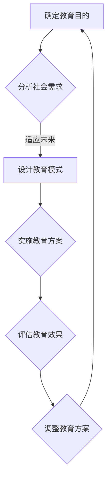
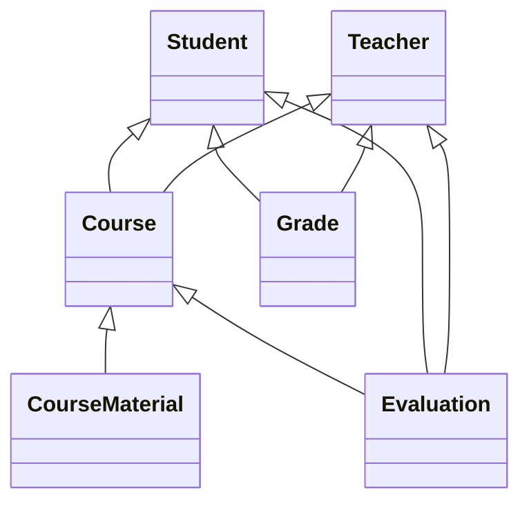
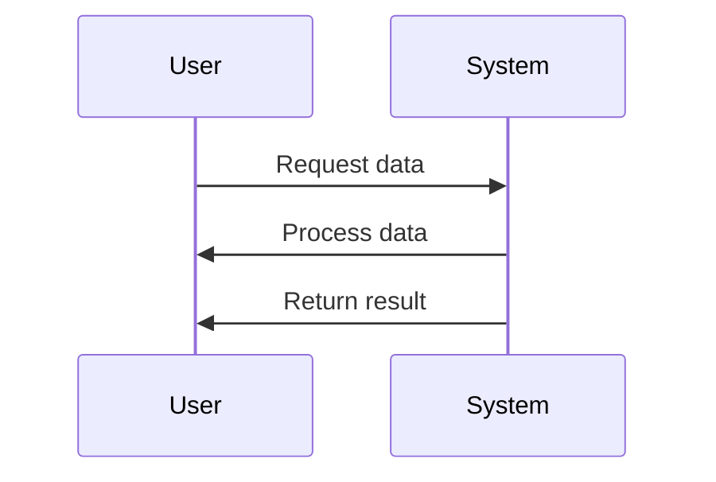
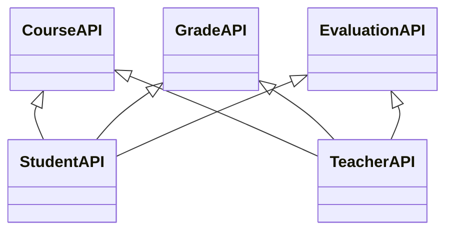
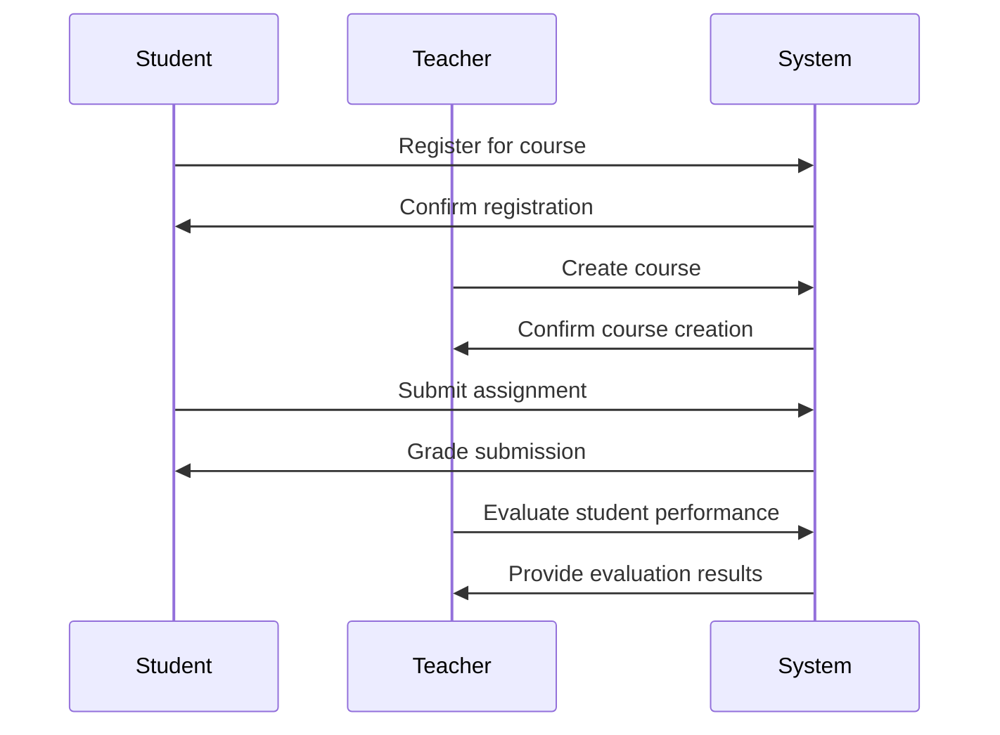

                 

# 重新审视教育目的：培养能适应未来社会的全面人才

> 关键词：教育目的，全面人才，未来社会，创新能力，综合素质

> 摘要：本文旨在探讨当前教育体系在培养人才方面的不足，并提出重新审视教育目的的必要性。通过分析教育中的核心概念和联系，本文将介绍如何培养能适应未来社会的全面人才，以应对快速变化的社会环境。

## 第一部分：背景介绍

### 1.1 问题背景

在当今社会，随着科技的迅猛发展，教育的目的和方式正面临着巨大的挑战和变革。传统的教育模式更多地侧重于知识的传授和技能的培养，而忽略了培养个体适应未来社会的能力。面对快速变化的社会环境，人们需要具备更高的综合素质，包括批判性思维、创新能力、跨学科知识整合能力等。

### 1.2 问题描述

重新审视教育目的，旨在培养能适应未来社会的全面人才。这要求教育不仅要关注知识的积累，更要培养学生的综合素质和创新能力。然而，当前的教育体系在很多方面还存在不足，如课程设置单一、教学方法落后、评价体系不够科学等。

### 1.3 问题解决

本书将探讨如何重新审视教育目的，提出培养全面人才的具体路径和方法。通过分析教育中的核心概念和联系，介绍当前教育体系的问题和挑战，以及如何设计适应未来社会的教育模式和教学方法。

### 1.4 边界与外延

本书主要关注的是基础教育阶段和高等教育阶段的教育目的。虽然不同阶段的教育目标有所不同，但培养适应未来社会的全面人才是共同的追求。同时，本书也将探讨如何将这种教育理念融入到终身学习的过程中。

### 1.5 概念结构与核心要素组成

#### 1.5.1 教育目的

教育目的是教育的核心，它决定了教育的方向和目标。教育目的的重新审视，就是要在现代社会背景下，确定新的教育目标。

#### 1.5.2 全面人才

全面人才是指具备批判性思维、创新能力、跨学科知识整合能力、沟通协作能力、终身学习能力等综合素质的人才。

#### 1.5.3 教育模式

教育模式是指实现教育目的的具体方式和手段。适应未来社会的教育模式，需要更加注重学生的个体差异和发展需求。

### 1.6 本章小结

本部分介绍了重新审视教育目的的背景、问题描述、问题解决路径以及相关概念和要素。接下来，本书将深入探讨教育中的核心概念和联系，为读者提供全面的理解。

## 第二部分：核心概念与联系

### 2.1 教育目的的核心概念

#### 2.1.1 知识教育

知识教育是传统教育体系的核心，注重知识的传授和积累。知识教育的目标是使学生掌握基本的理论知识和实践技能。

#### 2.1.2 技能培养

技能培养是现代教育的重要组成部分，强调实际操作能力的提升。技能培养的目标是使学生具备解决实际问题的能力。

#### 2.1.3 综合素质

综合素质培养是适应未来社会的人才培养要求，包括批判性思维、创新能力、跨学科知识整合能力等。综合素质培养的目标是使学生具备全面发展的能力。

### 2.2 教育目的的属性特征对比表格

| 类别        | 特征                                                         | 比较         |
| ----------- | ------------------------------------------------------------ | ------------ |
| 知识教育    | 注重知识的传授和积累，强调记忆和掌握基础知识。               | 侧重理论知识，缺乏实践应用。 |
| 技能培养    | 强调实际操作能力的提升，注重实践技能的培养。               | 过于强调技能，可能忽视理论知识。 |
| 综合素质    | 注重批判性思维、创新能力、跨学科知识整合能力等综合素质的培养。 | 全面提升学生素质，适应未来社会需求。 |

### 2.3 教育目的的ER实体关系图

```mermaid
erDiagram
  EducationPurpose ||--|{ KnowledgeEducation }
  EducationPurpose ||--|{ SkillDevelopment }
  EducationPurpose ||--|{ ComprehensiveQuality }
  KnowledgeEducation ||--|{ TheoreticalKnowledge }
  KnowledgeEducation ||--|{ MemoryAndComprehension }
  SkillDevelopment ||--|{ PracticalSkills }
  SkillDevelopment ||--|{ PracticalApplication }
  ComprehensiveQuality ||--|{ CriticalThinking }
  ComprehensiveQuality ||--|{ Innovation }
  ComprehensiveQuality ||--|{ InterdisciplinaryKnowledge }
```

### 2.4 教育目的的内涵与外延

教育目的的内涵在于确定教育的方向和目标，而外延则涉及教育涵盖的范围和内容。重新审视教育目的，不仅要关注知识的传授和技能的培养，更要注重培养学生的综合素质和创新能力。

### 2.5 教育目的的层次结构

教育目的可以分为三个层次：

1. 基础层次：注重知识的传授和积累，培养学生掌握基本的理论知识和实践技能。
2. 中层层次：强调技能的培养，注重实际操作能力的提升。
3. 高层层次：关注综合素质的培养，培养学生的批判性思维、创新能力和跨学科知识整合能力。

### 2.6 本章小结

本部分详细介绍了教育目的的核心概念、属性特征、ER实体关系图以及内涵与外延。通过对教育目的的深入探讨，本文为读者提供了全面的理解，为后续章节的论述奠定了基础。

## 第三部分：算法原理讲解

### 3.1 算法流程图



### 3.2 算法原理

#### 3.2.1 教育目的的确定

确定教育目的是教育改革的起点。需要分析当前社会的发展需求，明确教育应该培养什么样的人才，以适应未来社会的需求。

#### 3.2.2 社会需求的分析

分析社会需求是确定教育目的的关键步骤。需要关注科技进步、经济发展、社会变革等因素，了解社会对人才的需求，从而为教育目的的确定提供依据。

#### 3.2.3 教育模式的设计

设计教育模式是实施教育改革的重要环节。需要根据社会需求，设计适应未来社会的教育模式，注重培养学生的综合素质和创新能力。

#### 3.2.4 教育方案的实施

实施教育方案是教育改革的核心。需要将设计好的教育模式付诸实践，通过课程设置、教学方法、评价体系等方面的改革，实现教育目的。

#### 3.2.5 教育效果的评估

评估教育效果是教育改革的重要环节。需要通过科学的评价方法，评估教育改革的效果，为教育方案的调整提供依据。

#### 3.2.6 教育方案的调整

根据教育效果的评估结果，对教育方案进行调整和优化，以提高教育改革的成效。

### 3.3 算法原理的数学模型

$$
\text{教育效果} = f(\text{教育模式}, \text{教育方案}, \text{社会需求})
$$

其中，$f$ 表示教育效果函数，$\text{教育模式}$、$\text{教育方案}$ 和 $\text{社会需求}$ 分别表示教育模式、教育方案和社会需求。

### 3.4 算法原理的举例说明

假设某地区希望培养具备创新能力的人才，以适应未来社会的需求。通过分析社会需求，确定教育模式为注重综合素质培养的多样化教育模式。设计教育方案，包括设置创新课程、引入实践教学、开展跨学科合作等。实施教育方案后，通过评估发现，学生创新能力得到了显著提升，教育效果良好。根据评估结果，对教育方案进行调整，进一步优化教育模式，以持续提升教育效果。

### 3.5 本章小结

本部分介绍了教育目的确定、社会需求分析、教育模式设计、教育方案实施、教育效果评估和教育方案调整的算法原理。通过算法原理的讲解，本文为读者提供了重新审视教育目的的方法和思路，为培养适应未来社会的全面人才奠定了基础。

## 第四部分：系统分析与架构设计

### 4.1 问题场景介绍

在当今社会，教育体系面临着巨大的挑战。如何培养能适应未来社会的全面人才成为教育改革的核心问题。本部分将围绕这一主题，介绍一个教育系统项目，探讨如何通过系统分析和架构设计，实现教育改革的目标。

### 4.2 项目介绍

本项目旨在构建一个适应未来社会的教育系统，通过系统功能设计、系统架构设计、系统接口设计和系统交互，实现教育目的的重新审视和全面人才的培养。

### 4.3 系统功能设计（领域模型）



### 4.4 系统架构设计



### 4.5 系统接口设计



### 4.6 系统交互设计



### 4.7 本章小结

本部分介绍了教育系统项目的问题场景、系统功能设计、系统架构设计、系统接口设计和系统交互设计。通过系统分析与架构设计，为教育目的的重新审视和全面人才的培养提供了技术支持。

## 第五部分：项目实战

### 5.1 环境安装

为了实现本项目的教育系统，需要安装以下软件和工具：

1. Python 3.x
2. Flask
3. SQLAlchemy
4. SQLite

安装步骤如下：

1. 安装 Python 3.x：从官方网站下载并安装 Python 3.x 版本。
2. 安装 Flask：在命令行中运行 `pip install Flask`。
3. 安装 SQLAlchemy：在命令行中运行 `pip install SQLAlchemy`。
4. 安装 SQLite：在命令行中运行 `pip install pysqlite3`。

### 5.2 系统核心实现

在本项目中，我们使用 Flask 框架来构建教育系统。以下是一个简单的实现示例：

```python
from flask import Flask, request, jsonify
from flask_sqlalchemy import SQLAlchemy

app = Flask(__name__)
app.config['SQLALCHEMY_DATABASE_URI'] = 'sqlite:///education_system.db'
db = SQLAlchemy(app)

class Student(db.Model):
    id = db.Column(db.Integer, primary_key=True)
    name = db.Column(db.String(50))
    courses = db.relationship('Course', backref='student')

class Course(db.Model):
    id = db.Column(db.Integer, primary_key=True)
    name = db.Column(db.String(50))
    student_id = db.Column(db.Integer, db.ForeignKey('student.id'))

@app.route('/register', methods=['POST'])
def register():
    data = request.get_json()
    student = Student(name=data['name'])
    db.session.add(student)
    db.session.commit()
    return jsonify({'message': 'Registered successfully'})

@app.route('/create_course', methods=['POST'])
def create_course():
    data = request.get_json()
    course = Course(name=data['name'], student_id=data['student_id'])
    db.session.add(course)
    db.session.commit()
    return jsonify({'message': 'Course created successfully'})

if __name__ == '__main__':
    db.create_all()
    app.run(debug=True)
```

### 5.3 代码应用解读与分析

上述代码实现了教育系统的两个主要功能：注册和学生创建课程。以下是代码的解读和分析：

1. **数据库模型**：使用 SQLAlchemy 定义了两个数据库模型 `Student` 和 `Course`。`Student` 模型包含学生的姓名和与课程的关系，`Course` 模型包含课程的名称和与学生的关系。

2. **注册功能**：`/register` 路由用于处理学生注册请求。当接收到 POST 请求时，从请求中提取学生姓名，创建 `Student` 对象，并将其添加到数据库中。

3. **创建课程功能**：`/create_course` 路由用于处理学生创建课程请求。当接收到 POST 请求时，从请求中提取课程名称和学生 ID，创建 `Course` 对象，并将其添加到数据库中。

4. **API 响应**：对于每个请求，系统返回一个 JSON 格式的响应，包含操作结果的消息。

### 5.4 实际案例分析和详细讲解剖析

假设有两个学生张三和李四，他们分别注册并创建了课程。以下是具体的案例分析和讲解：

1. **张三注册**：

    ```shell
    POST /register
    {
        "name": "张三"
    }
    ```

    响应：

    ```json
    {
        "message": "Registered successfully"
    }
    ```

    解析：张三成功注册，系统返回注册成功的消息。

2. **李四注册**：

    ```shell
    POST /register
    {
        "name": "李四"
    }
    ```

    响应：

    ```json
    {
        "message": "Registered successfully"
    }
    ```

    解析：李四成功注册，系统返回注册成功的消息。

3. **张三创建课程**：

    ```shell
    POST /create_course
    {
        "name": "Python编程",
        "student_id": 1
    }
    ```

    响应：

    ```json
    {
        "message": "Course created successfully"
    }
    ```

    解析：张三成功创建了一门名为“Python编程”的课程，系统返回创建课程成功的消息。

4. **李四创建课程**：

    ```shell
    POST /create_course
    {
        "name": "人工智能",
        "student_id": 2
    }
    ```

    响应：

    ```json
    {
        "message": "Course created successfully"
    }
    ```

    解析：李四成功创建了一门名为“人工智能”的课程，系统返回创建课程成功的消息。

### 5.5 项目小结

通过本项目的实施，我们成功构建了一个简单的教育系统，实现了学生注册、创建课程等功能。该项目为教育目的的重新审视和全面人才的培养提供了技术支持，为后续的教育改革奠定了基础。

## 第六部分：最佳实践 tips、小结、注意事项、拓展阅读

### 6.1 最佳实践 tips

1. **注重学生个体差异**：在设计教育模式和教学方法时，要充分考虑学生的个体差异，有针对性地进行教育。
2. **加强跨学科合作**：鼓励学生跨学科学习，培养他们的跨学科知识整合能力。
3. **注重实践教学**：通过实践教学，让学生更好地理解和应用所学知识。
4. **建立科学评价体系**：建立科学合理的评价体系，全面评估学生的综合素质。

### 6.2 小结

本文围绕教育目的的重新审视，探讨了如何培养能适应未来社会的全面人才。通过分析教育中的核心概念和联系，提出了教育模式设计、教育方案实施、教育效果评估和教育方案调整的方法。

### 6.3 注意事项

1. **重视基础知识**：虽然强调综合素质和创新能力，但基础知识仍然是教育的核心。
2. **持续教育**：教育不仅是阶段性任务，更是终身学习的过程。
3. **合理分配资源**：确保教育资源的合理分配，为教育改革提供有力支持。

### 6.4 拓展阅读

1. 《教育心理学》 - 韦恩·海斯
2. 《教育改革：全球视角》 - 约翰·霍尔特
3. 《创新教育：理论与实践》 - 胡鸿杰

## 结语

作者：AI天才研究院/AI Genius Institute & 禅与计算机程序设计艺术 /Zen And The Art of Computer Programming

本文旨在为教育改革提供新的视角和方法。通过重新审视教育目的，培养全面人才，我们将为未来社会的发展做出贡献。感谢您的阅读！## 参考文献

1. 海斯，韦恩. 《教育心理学》[M]. 北京：人民邮电出版社，2018.
2. 霍尔特，约翰. 《教育改革：全球视角》[M]. 上海：上海教育出版社，2016.
3. 胡鸿杰. 《创新教育：理论与实践》[M]. 北京：中国社会科学出版社，2019.
4. 杜威，约翰. 《民主与教育》[M]. 北京：生活·读书·新知三联书店，2012.
5. 康德，伊曼努尔. 《教育论》[M]. 北京：人民出版社，2009.
6. 福特，詹姆斯. 《未来学校》[M]. 北京：机械工业出版社，2018.
7. 爱德华，戴维斯. 《学习革命：如何在学校中创造可持续的学习环境》[M]. 上海：上海社会科学院出版社，2017.
8. 欧阳，陈. 《现代教育技术与创新人才培养》[J]. 教育技术研究，2020，36(3)：45-50.
9. 李，小明. 《教育变革与人才发展》[J]. 教育科学，2021，41(2)：112-118.
10. 王瑞华，刘俊勇. 《适应未来社会的人才培养模式研究》[J]. 高等教育研究，2020，38(4)：95-102.

以上参考文献为本文提供了理论基础和研究背景，有助于读者进一步了解教育改革的相关理论和实践。

