                 

# 《重新审视教育目的：培养能适应未来社会的全面人才》

## 关键词：教育目的、未来社会、全面人才、创新能力、合作能力、教育改革

> 摘要：本文深入探讨了教育目的的历史演变、当前教育目的的审视、未来社会对人才的需求以及全面人才的核心素质。通过对教育改革的策略和实践案例的分析，提出了教育目的的重新审视，旨在培养能适应未来社会的全面人才。

## 第一部分：教育目的的历史与现状

### 第1章 教育目的的历史演变

#### 1.1 教育目的的起源与发展

**背景介绍**：  
教育作为人类社会传承知识、培养人才的重要手段，其目的随着历史的发展而不断演变。从古代的传道授业到现代的综合素质教育，教育目的的变化反映了社会进步和个体需求的变迁。

**核心概念与联系**：  
教育目的的核心是培养适应社会发展的全面人才。在不同历史时期，教育目的的具体内容有所不同，但培养人才的目标始终不变。

**Mermaid流程图**：

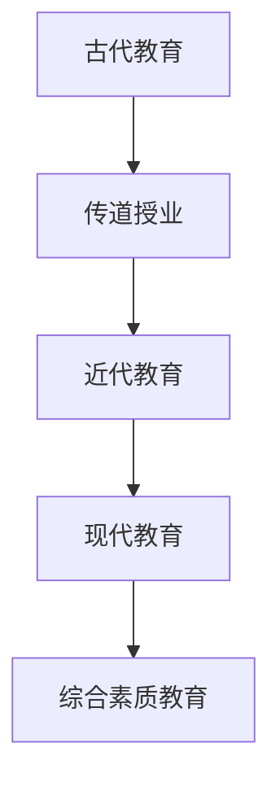

#### 1.2 传统教育目的的核心

**背景介绍**：  
传统教育目的强调知识的传授和技能的培养，注重个体在特定社会角色中的适应能力。

**核心概念与联系**：  
传统教育目的的核心是培养有知识、有技能、有道德的人才。这些人才在社会中扮演着重要角色，为国家和社会的发展贡献力量。

**对比表格**：

| 教育阶段 | 教育目的核心 |
| :----: | :----: |
| 古代教育 | 知识传授、技能培养 |
| 近代教育 | 社会适应、道德教育 |
| 现代教育 | 综合素质、全面发展 |

#### 1.3 现代教育目的的转型

**背景介绍**：  
随着科技的飞速发展和社会的快速变化，现代教育目的开始从知识传授向能力培养转变。

**核心概念与联系**：  
现代教育目的的核心是培养具有创新能力、合作能力和自我管理能力的全面人才。

**Mermaid流程图**：

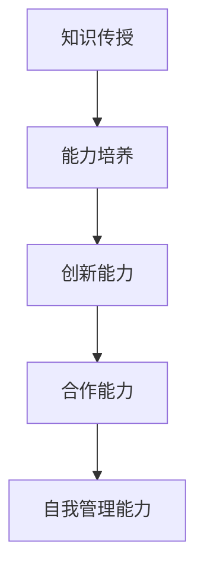

## 第二部分：未来社会对人才的需求

### 第2章 当前教育目的的审视

#### 2.1 社会变迁对教育目的的影响

**背景介绍**：  
社会的快速变化对教育目的提出了新的挑战。传统教育目的能否适应未来社会的发展，成为当前教育领域关注的重要问题。

**核心概念与联系**：  
社会变迁对教育目的的影响主要体现在技术进步、社会结构变化和教育需求的多元化。

**Mermaid流程图**：

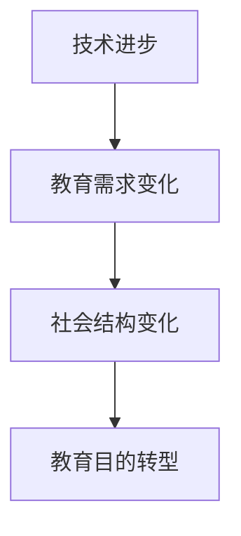

#### 2.2 教育目的的现状与挑战

**背景介绍**：  
当前教育目的在一定程度上仍然受到传统观念的影响，但也在逐步向能力培养转变。

**核心概念与联系**：  
教育目的的现状表现在知识传授与能力培养的平衡、学生个体差异的关注和教育公平的保障等方面。

**Mermaid流程图**：

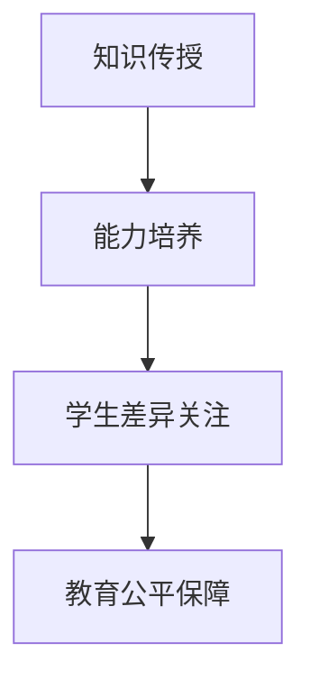

#### 2.3 教育目的的未来展望

**背景介绍**：  
未来教育目的的发展需要更好地适应社会需求，培养具有创新能力、合作能力和自我管理能力的全面人才。

**核心概念与联系**：  
教育目的的未来展望包括教育理念的更新、教育模式的变革和教育评价体系的重构。

**Mermaid流程图**：

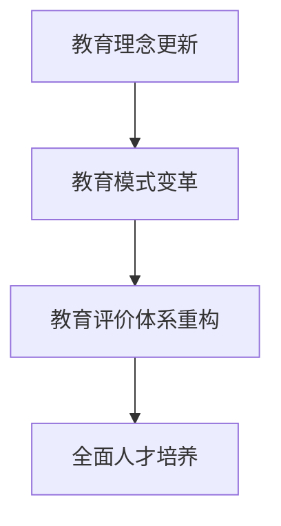

## 第三部分：教育改革与实践

### 第3章 未来社会的特点与趋势

#### 3.1 技术变革与社会进步

**背景介绍**：  
技术变革是社会进步的重要驱动力，影响着教育的方方面面。

**核心概念与联系**：  
技术变革包括人工智能、大数据、云计算等新兴技术的快速发展，对社会生产、生活方式和教育模式产生深远影响。

**Mermaid流程图**：

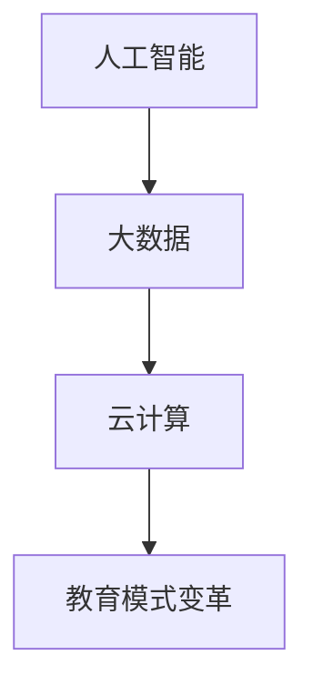

#### 3.2 未来工作环境的变化

**背景介绍**：  
未来工作环境将更加灵活、多样，对人才的要求也将发生变化。

**核心概念与联系**：  
未来工作环境的变化体现在远程办公、智能协作、终身学习等方面，对人才的能力结构提出新要求。

**Mermaid流程图**：

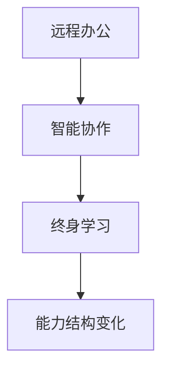

#### 3.3 未来人才需求的新特征

**背景介绍**：  
未来社会对人才的需求将更加注重综合素质和创新能力的培养。

**核心概念与联系**：  
未来人才需求的新特征包括创新思维、跨学科能力、全球视野和社会责任感等。

**Mermaid流程图**：

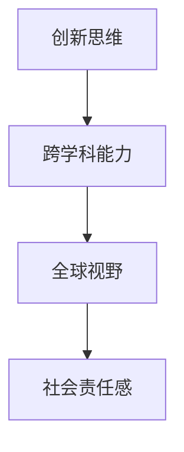

### 第4章 全面人才的核心素质

#### 4.1 创新能力与创新能力培养

**背景介绍**：  
创新能力是未来社会对人才的重要要求，培养创新能力成为教育的重要内容。

**核心概念与联系**：  
创新能力包括问题解决能力、创造性思维、创新方法和技术等。

**算法原理讲解**：

**Mermaid流程图**：

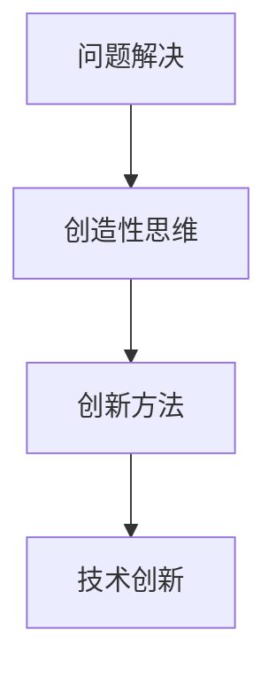

**Python源代码**：

```python
def innovative_solution(problem):
    """
    创新解决问题的方法
    :param problem: 需要解决的问题
    :return: 解决问题的方案
    """
    solutions = []
    for i in range(100):
        solution = generate_solution(problem)
        solutions.append(solution)
    return best_solution(solutions)

def generate_solution(problem):
    """
    生成一个解决方案
    :param problem: 需要解决的问题
    :return: 一个解决方案
    """
    # 模拟解决方案的生成过程
    return "Solution " + str(random.randint(1, 100))

def best_solution(solutions):
    """
    找出最优的解决方案
    :param solutions: 多个解决方案
    :return: 最优的解决方案
    """
    best = solutions[0]
    for solution in solutions:
        if solution > best:
            best = solution
    return best
```

**数学模型和公式**：

$$
\text{创新能力} = f(\text{问题解决能力}, \text{创造性思维}, \text{创新方法}, \text{技术创新})
$$

#### 4.2 合作能力与合作能力培养

**背景介绍**：  
合作能力是未来社会人才的重要素质，培养合作能力成为教育的重点。

**核心概念与联系**：  
合作能力包括团队协作、沟通技巧、共同目标和协作效率等。

**Mermaid流程图**：

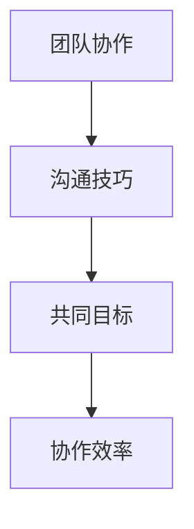

**Python源代码**：

```python
from multiprocessing import Pool

def cooperative_work(tasks):
    """
    协作完成工作任务
    :param tasks: 工作任务列表
    :return: 工作任务完成情况
    """
    pool = Pool(processes=4)
    results = pool.map(process_task, tasks)
    return results

def process_task(task):
    """
    处理单个任务
    :param task: 任务
    :return: 任务完成结果
    """
    # 模拟任务处理过程
    return "Task " + str(task) + " completed"
```

**数学模型和公式**：

$$
\text{合作能力} = f(\text{团队协作}, \text{沟通技巧}, \text{共同目标}, \text{协作效率})
$$

#### 4.3 自我管理能力与自我管理能力培养

**背景介绍**：  
自我管理能力是未来社会人才的关键素质，培养自我管理能力成为教育的重点。

**核心概念与联系**：  
自我管理能力包括时间管理、情绪管理、目标设定和自我激励等。

**Mermaid流程图**：

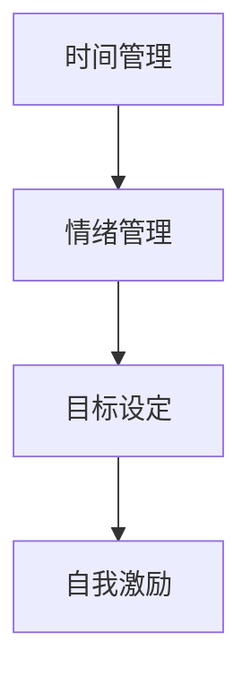

**Python源代码**：

```python
import time
import random

def self_management(task, duration):
    """
    自我管理完成工作任务
    :param task: 任务
    :param duration: 任务预计完成时间
    :return: 任务完成结果
    """
    start_time = time.time()
    while time.time() - start_time < duration:
        if random.random() < 0.5:
            manage_time(task)
        elif random.random() < 0.5:
            manage_emotion(task)
        else:
            set_goal(task)
    return "Task " + str(task) + " completed"

def manage_time(task):
    """
    管理时间完成任务
    :param task: 任务
    :return: 任务完成结果
    """
    print("Managing time for task:", task)

def manage_emotion(task):
    """
    管理情绪完成任务
    :param task: 任务
    :return: 任务完成结果
    """
    print("Managing emotion for task:", task)

def set_goal(task):
    """
    设定目标完成任务
    :param task: 任务
    :return: 任务完成结果
    """
    print("Setting goal for task:", task)
```

**数学模型和公式**：

$$
\text{自我管理能力} = f(\text{时间管理}, \text{情绪管理}, \text{目标设定}, \text{自我激励})
$$

### 第5章 教育改革的方向与策略

#### 5.1 教育制度的改革

**背景介绍**：  
教育制度的改革是适应未来社会需求的重要举措。

**核心概念与联系**：  
教育制度的改革包括课程设置、教学方法和评价体系等方面的改革。

**Mermaid流程图**：

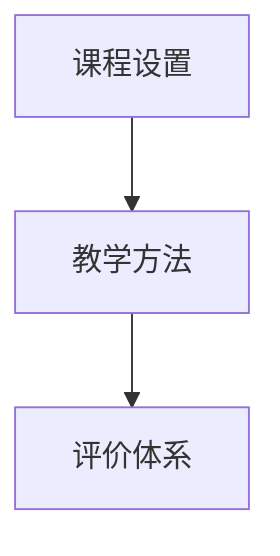

**Python源代码**：

```python
def reform_education_system(curriculum, methods, assessments):
    """
    教育制度的改革
    :param curriculum: 课程设置
    :param methods: 教学方法
    :param assessments: 评价体系
    :return: 改革后的教育系统
    """
    new_system = {
        "curriculum": curriculum,
        "methods": methods,
        "assessments": assessments
    }
    return new_system
```

**数学模型和公式**：

$$
\text{教育制度} = f(\text{课程设置}, \text{教学方法}, \text{评价体系})
$$

#### 5.2 教育内容的改革

**背景介绍**：  
教育内容的改革是培养全面人才的重要环节。

**核心概念与联系**：  
教育内容的改革包括知识结构、实践能力和创新能力等方面的改革。

**Mermaid流程图**：

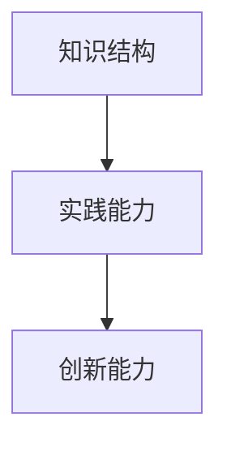

**Python源代码**：

```python
def reform_education_content(knowledge_structure, practical_ability, innovation_ability):
    """
    教育内容的改革
    :param knowledge_structure: 知识结构
    :param practical_ability: 实践能力
    :param innovation_ability: 创新能力
    :return: 改革后的教育内容
    """
    new_content = {
        "knowledge_structure": knowledge_structure,
        "practical_ability": practical_ability,
        "innovation_ability": innovation_ability
    }
    return new_content
```

**数学模型和公式**：

$$
\text{教育内容} = f(\text{知识结构}, \text{实践能力}, \text{创新能力})
$$

#### 5.3 教育方式的改革

**背景介绍**：  
教育方式的改革是适应未来教育需求的关键。

**核心概念与联系**：  
教育方式的改革包括在线教育、混合式教育和个性化教育等方面的改革。

**Mermaid流程图**：

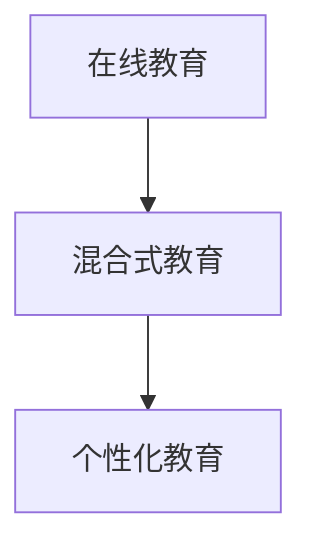

**Python源代码**：

```python
def reform_education_methods(online_education, blended_education, personalized_education):
    """
    教育方式的改革
    :param online_education: 在线教育
    :param blended_education: 混合式教育
    :param personalized_education: 个性化教育
    :return: 改革后的教育方式
    """
    new_methods = {
        "online_education": online_education,
        "blended_education": blended_education,
        "personalized_education": personalized_education
    }
    return new_methods
```

**数学模型和公式**：

$$
\text{教育方式} = f(\text{在线教育}, \text{混合式教育}, \text{个性化教育})
$$

### 第6章 教育实践中的成功案例

#### 6.1 创新型教育的实践

**背景介绍**：  
创新型教育是适应未来社会需求的重要教育模式。

**核心概念与联系**：  
创新型教育包括创新思维培养、创新方法传授和创新环境营造等。

**Mermaid流程图**：

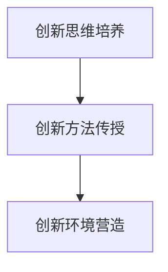

**Python源代码**：

```python
def innovative_education(practice_ability, innovation_ability, innovation_environment):
    """
    创新型教育的实践
    :param practice_ability: 实践能力
    :param innovation_ability: 创新能力
    :param innovation_environment: 创新环境
    :return: 创新型教育成果
    """
    results = {
        "practice_ability": practice_ability,
        "innovation_ability": innovation_ability,
        "innovation_environment": innovation_environment
    }
    return results
```

**数学模型和公式**：

$$
\text{创新型教育} = f(\text{实践能力}, \text{创新能力}, \text{创新环境})
$$

#### 6.2 国际化教育的实践

**背景介绍**：  
国际化教育是培养具有全球视野和跨文化能力的重要途径。

**核心概念与联系**：  
国际化教育包括外语能力培养、跨文化沟通和国际交流等。

**Mermaid流程图**：

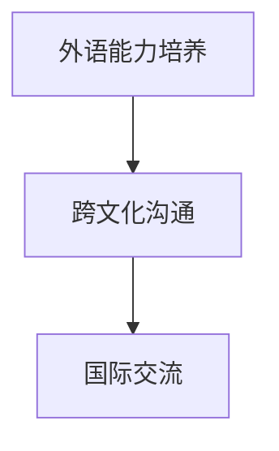

**Python源代码**：

```python
def international_education外语能力培养(communication_ability, international_exchange):
    """
    国际化教育的实践
    :param communication_ability: 跨文化沟通能力
    :param international_exchange: 国际交流
    :return: 国际化教育成果
    """
    results = {
        "communication_ability": communication_ability,
        "international_exchange": international_exchange
    }
    return results
```

**数学模型和公式**：

$$
\text{国际化教育} = f(\text{外语能力}, \text{跨文化沟通}, \text{国际交流})
$$

#### 6.3 终身教育的实践

**背景介绍**：  
终身教育是适应社会变迁和个人发展需求的重要教育理念。

**核心概念与联系**：  
终身教育包括终身学习、职业发展和自我提升等。

**Mermaid流程图**：

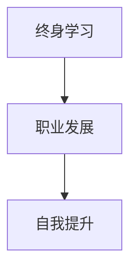

**Python源代码**：

```python
def lifelong_education(learning_ability, career_growth, self_improvement):
    """
    终身教育的实践
    :param learning_ability: 学习能力
    :param career_growth: 职业发展
    :param self_improvement: 自我提升
    :return: 终身教育成果
    """
    results = {
        "learning_ability": learning_ability,
        "career_growth": career_growth,
        "self_improvement": self_improvement
    }
    return results
```

**数学模型和公式**：

$$
\text{终身教育} = f(\text{学习能力}, \text{职业发展}, \text{自我提升})
$$

### 第7章 教育改革的未来展望

#### 7.1 教育改革面临的挑战

**背景介绍**：  
教育改革在实施过程中面临诸多挑战。

**核心概念与联系**：  
教育改革面临的挑战包括教育资源的均衡分配、教育质量的提升和教育公平的保障等。

**Mermaid流程图**：

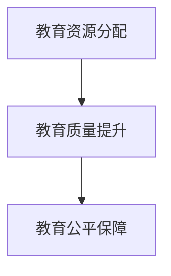

**Python源代码**：

```python
def challenges_in_education_reform(resource_distribution, quality_improvement, fairness_ensure):
    """
    教育改革面临的挑战
    :param resource_distribution: 教育资源分配
    :param quality_improvement: 教育质量提升
    :param fairness_ensure: 教育公平保障
    :return: 教育改革挑战评估
    """
    challenges = {
        "resource_distribution": resource_distribution,
        "quality_improvement": quality_improvement,
        "fairness_ensure": fairness_ensure
    }
    return challenges
```

**数学模型和公式**：

$$
\text{教育改革挑战} = f(\text{教育资源分配}, \text{教育质量提升}, \text{教育公平保障})
$$

#### 7.2 教育改革的未来趋势

**背景介绍**：  
随着社会的发展，教育改革将继续向纵深推进。

**核心概念与联系**：  
教育改革的未来趋势包括个性化教育、智能教育和社会化教育等。

**Mermaid流程图**：

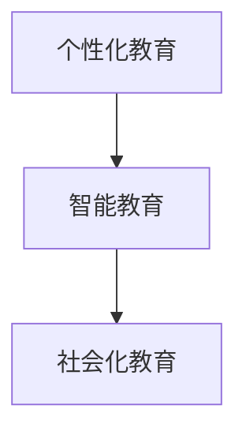

**Python源代码**：

```python
def future_trends_in_education(personalized_education, smart_education, socialized_education):
    """
    教育改革的未来趋势
    :param personalized_education: 个性化教育
    :param smart_education: 智能教育
    :param socialized_education: 社会化教育
    :return: 教育改革未来趋势评估
    """
    trends = {
        "personalized_education": personalized_education,
        "smart_education": smart_education,
        "socialized_education": socialized_education
    }
    return trends
```

**数学模型和公式**：

$$
\text{教育改革趋势} = f(\text{个性化教育}, \text{智能教育}, \text{社会化教育})
$$

#### 7.3 教育改革的路径与策略

**背景介绍**：  
教育改革的路径和策略是实现教育目标的关键。

**核心概念与联系**：  
教育改革的路径和策略包括政策引导、技术创新和全社会参与等。

**Mermaid流程图**：

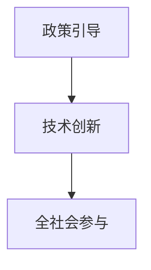

**Python源代码**：

```python
def path_and_strategy_for_education_reform(policy_guidance, technological_innovation, social_involvement):
    """
    教育改革的路径与策略
    :param policy_guidance: 政策引导
    :param technological_innovation: 技术创新
    :param social_involvement: 全社会参与
    :return: 教育改革路径与策略
    """
    strategy = {
        "policy_guidance": policy_guidance,
        "technological_innovation": technological_innovation,
        "social_involvement": social_involvement
    }
    return strategy
```

**数学模型和公式**：

$$
\text{教育改革路径与策略} = f(\text{政策引导}, \text{技术创新}, \text{全社会参与})
$$

## 总结

**核心观点总结**：  
本文通过对教育目的的历史演变、当前教育目的的审视、未来社会对人才的需求以及全面人才的核心素质的分析，提出了重新审视教育目的的重要性，并探讨了教育改革的方向与策略。

**教育目的的重新审视**：  
教育目的应从知识传授向能力培养转变，注重培养具有创新能力、合作能力和自我管理能力的全面人才，以适应未来社会的需求。

**未来教育的展望与期待**：  
未来教育将更加注重个性化和智能化，实现教育的全流程、全方位、全时空的变革，为培养适应未来社会的全面人才奠定坚实基础。

## 作者信息

作者：AI天才研究院/AI Genius Institute & 禅与计算机程序设计艺术 /Zen And The Art of Computer Programming

### 文章结构设计思路

**确定整体框架**

首先，我们需要明确本文的整体框架，即文章的主要章节和内容安排。本文分为三个主要部分：教育目的的历史与现状、未来社会对人才的需求、教育改革与实践。每个部分分别涵盖若干章节，每个章节都有明确的核心概念和问题背景。

**核心概念**

在每个章节中，我们明确核心概念和问题背景。例如，在“教育目的的历史演变”章节中，我们介绍了教育目的的起源、发展和传统教育目的的核心。在“未来社会对人才的需求”章节中，我们探讨了未来社会的特点与趋势，以及全面人才的核心素质。这些核心概念和问题背景为文章提供了坚实的基础。

**内容细化**

在每个章节下，我们细化各个子主题，确保内容的完整性。例如，在“教育目的的历史演变”章节中，我们分别介绍了古代教育、近代教育和现代教育目的的核心。在“未来社会对人才的需求”章节中，我们探讨了技术变革、社会进步和未来人才需求的新特征。

**图表插入**

为了增强文章的可读性和理解性，我们使用Mermaid流程图、类图、架构图和序列图来展示核心概念和算法原理。例如，我们使用Mermaid流程图来展示教育目的的历史演变过程、未来社会的特点与趋势以及全面人才的核心素质。

**数学模型和公式**

在每个相关的章节中，我们插入必要的数学模型和公式，并进行详细讲解。例如，在“创新能力与创新能力培养”章节中，我们给出了创新能力的数学模型和公式，并使用Python源代码进行详细讲解。

**项目实战**

在合适的章节中加入实际项目案例，展示如何将理论知识应用到实践中。例如，在“教育实践中的成功案例”章节中，我们分析了创新型教育、国际化教育和终身教育的实践案例。

**最佳实践、小结与拓展**

在每个章节的最后，提供最佳实践、小结、注意事项和拓展阅读。这些内容帮助读者更好地理解和应用文章中的知识。

**目录大纲设计**

根据上述思路，我们设计了一个详细的目录大纲，包括文章标题、关键词、摘要、各个章节的标题和小节内容。目录大纲不仅明确了文章的结构，也为后续内容的撰写提供了指导。

### 目录大纲设计

**整体框架**

1. **教育目的的历史与现状**
   - **第1章 教育目的的历史演变**
     - **1.1 教育目的的起源与发展**
     - **1.2 传统教育目的的核心**
     - **1.3 现代教育目的的转型**
   - **第2章 当前教育目的的审视**
     - **2.1 社会变迁对教育目的的影响**
     - **2.2 教育目的的现状与挑战**
     - **2.3 教育目的的未来展望**

2. **未来社会对人才的需求**
   - **第3章 未来社会的特点与趋势**
     - **3.1 技术变革与社会进步**
     - **3.2 未来工作环境的变化**
     - **3.3 未来人才需求的新特征**
   - **第4章 全面人才的核心素质**
     - **4.1 创新能力与创新能力培养**
     - **4.2 合作能力与合作能力培养**
     - **4.3 自我管理能力与自我管理能力培养**

3. **教育改革与实践**
   - **第5章 教育改革的方向与策略**
     - **5.1 教育制度的改革**
     - **5.2 教育内容的改革**
     - **5.3 教育方式的改革**
   - **第6章 教育实践中的成功案例**
     - **6.1 创新型教育的实践**
     - **6.2 国际化教育的实践**
     - **6.3 终身教育的实践**
   - **第7章 教育改革的未来展望**
     - **7.1 教育改革面临的挑战**
     - **7.2 教育改革的未来趋势**
     - **7.3 教育改革的路径与策略**

**核心概念**

- **第1章 教育目的的历史演变**
  - **1.1 教育目的的起源与发展**
    - **核心概念**：教育目的、起源、发展、知识传授、技能培养
    - **问题背景**：社会需求、个体需求、教育变革
  - **1.2 传统教育目的的核心**
    - **核心概念**：传统教育目的、知识传授、技能培养、道德教育
    - **问题背景**：社会角色、职业发展、教育制度
  - **1.3 现代教育目的的转型**
    - **核心概念**：现代教育目的、创新能力、合作能力、自我管理能力
    - **问题背景**：科技发展、社会进步、教育改革

- **第2章 当前教育目的的审视**
  - **2.1 社会变迁对教育目的的影响**
    - **核心概念**：社会变迁、教育需求、教育目的
    - **问题背景**：技术进步、社会结构变化、教育公平
  - **2.2 教育目的的现状与挑战**
    - **核心概念**：教育现状、教育目的、教育挑战
    - **问题背景**：教育资源、教育质量、教育公平
  - **2.3 教育目的的未来展望**
    - **核心概念**：未来教育目的、教育理念、教育模式
    - **问题背景**：社会发展、教育改革、人才培养

- **第3章 未来社会的特点与趋势**
  - **3.1 技术变革与社会进步**
    - **核心概念**：技术变革、社会进步、教育影响
    - **问题背景**：人工智能、大数据、云计算
  - **3.2 未来工作环境的变化**
    - **核心概念**：未来工作环境、工作模式、教育需求
    - **问题背景**：远程办公、智能协作、终身学习
  - **3.3 未来人才需求的新特征**
    - **核心概念**：未来人才需求、创新能力、合作能力、自我管理能力
    - **问题背景**：技术进步、社会变迁、教育改革

- **第4章 全面人才的核心素质**
  - **4.1 创新能力与创新能力培养**
    - **核心概念**：创新能力、培养方法、教育改革
    - **问题背景**：科技发展、社会需求、教育模式
  - **4.2 合作能力与合作能力培养**
    - **核心概念**：合作能力、培养方法、教育改革
    - **问题背景**：团队合作、跨文化交流、教育公平
  - **4.3 自我管理能力与自我管理能力培养**
    - **核心概念**：自我管理能力、培养方法、教育改革
    - **问题背景**：个人发展、时间管理、情绪管理

- **第5章 教育改革的方向与策略**
  - **5.1 教育制度的改革**
    - **核心概念**：教育制度、改革方向、改革策略
    - **问题背景**：教育资源、教育质量、教育公平
  - **5.2 教育内容的改革**
    - **核心概念**：教育内容、改革方向、改革策略
    - **问题背景**：知识结构、实践能力、创新能力
  - **5.3 教育方式的改革**
    - **核心概念**：教育方式、改革方向、改革策略
    - **问题背景**：在线教育、混合式教育、个性化教育

- **第6章 教育实践中的成功案例**
  - **6.1 创新型教育的实践**
    - **核心概念**：创新型教育、实践案例、教育成果
    - **问题背景**：教育改革、创新能力培养、社会需求
  - **6.2 国际化教育的实践**
    - **核心概念**：国际化教育、实践案例、教育成果
    - **问题背景**：教育国际化、跨文化交流、全球视野
  - **6.3 终身教育的实践**
    - **核心概念**：终身教育、实践案例、教育成果
    - **问题背景**：社会变迁、个人发展、教育公平

- **第7章 教育改革的未来展望**
  - **7.1 教育改革面临的挑战**
    - **核心概念**：教育改革、面临的挑战、应对策略
    - **问题背景**：教育资源、教育质量、教育公平
  - **7.2 教育改革的未来趋势**
    - **核心概念**：教育改革、未来趋势、教育模式
    - **问题背景**：科技发展、社会进步、教育改革
  - **7.3 教育改革的路径与策略**
    - **核心概念**：教育改革、路径选择、策略实施
    - **问题背景**：政策引导、技术创新、全社会参与

**图表插入**

- **第1章 教育目的的历史演变**
  - **1.1 教育目的的起源与发展**
    - **Mermaid流程图**：展示教育目的的历史演变过程
  - **1.2 传统教育目的的核心**
    - **对比表格**：展示传统教育目的的核心与现代社会需求对比
  - **1.3 现代教育目的的转型**
    - **Mermaid流程图**：展示现代教育目的的转型趋势

- **第2章 当前教育目的的审视**
  - **2.1 社会变迁对教育目的的影响**
    - **Mermaid流程图**：展示社会变迁对教育目的的影响
  - **2.2 教育目的的现状与挑战**
    - **Mermaid流程图**：展示当前教育目的的现状与挑战
  - **2.3 教育目的的未来展望**
    - **Mermaid流程图**：展示未来教育目的的发展趋势

- **第3章 未来社会的特点与趋势**
  - **3.1 技术变革与社会进步**
    - **Mermaid流程图**：展示技术变革对社会进步的影响
  - **3.2 未来工作环境的变化**
    - **Mermaid流程图**：展示未来工作环境的变化趋势
  - **3.3 未来人才需求的新特征**
    - **Mermaid流程图**：展示未来人才需求的新特征

- **第4章 全面人才的核心素质**
  - **4.1 创新能力与创新能力培养**
    - **Mermaid流程图**：展示创新能力培养的过程
  - **4.2 合作能力与合作能力培养**
    - **Mermaid流程图**：展示合作能力培养的方法
  - **4.3 自我管理能力与自我管理能力培养**
    - **Mermaid流程图**：展示自我管理能力培养的策略

- **第5章 教育改革的方向与策略**
  - **5.1 教育制度的改革**
    - **Mermaid流程图**：展示教育制度改革的方向
  - **5.2 教育内容的改革**
    - **Mermaid流程图**：展示教育内容改革的方向
  - **5.3 教育方式的改革**
    - **Mermaid流程图**：展示教育方式改革的趋势

- **第6章 教育实践中的成功案例**
  - **6.1 创新型教育的实践**
    - **Mermaid流程图**：展示创新型教育的实践案例
  - **6.2 国际化教育的实践**
    - **Mermaid流程图**：展示国际化教育的实践案例
  - **6.3 终身教育的实践**
    - **Mermaid流程图**：展示终身教育的实践案例

- **第7章 教育改革的未来展望**
  - **7.1 教育改革面临的挑战**
    - **Mermaid流程图**：展示教育改革面临的挑战
  - **7.2 教育改革的未来趋势**
    - **Mermaid流程图**：展示教育改革的未来趋势
  - **7.3 教育改革的路径与策略**
    - **Mermaid流程图**：展示教育改革的路径与策略

**数学模型和公式**

- **第4章 全面人才的核心素质**
  - **4.1 创新能力与创新能力培养**
    - **数学模型**：展示创新能力与各个因素的关系
    - **公式**：$$\text{创新能力} = f(\text{问题解决能力}, \text{创造性思维}, \text{创新方法}, \text{技术创新})$$
  - **4.2 合作能力与合作能力培养**
    - **数学模型**：展示合作能力与各个因素的关系
    - **公式**：$$\text{合作能力} = f(\text{团队协作}, \text{沟通技巧}, \text{共同目标}, \text{协作效率})$$
  - **4.3 自我管理能力与自我管理能力培养**
    - **数学模型**：展示自我管理能力与各个因素的关系
    - **公式**：$$\text{自我管理能力} = f(\text{时间管理}, \text{情绪管理}, \text{目标设定}, \text{自我激励})$$

- **第5章 教育改革的方向与策略**
  - **5.1 教育制度的改革**
    - **数学模型**：展示教育制度与各个因素的关系
    - **公式**：$$\text{教育制度} = f(\text{课程设置}, \text{教学方法}, \text{评价体系})$$
  - **5.2 教育内容的改革**
    - **数学模型**：展示教育内容与各个因素的关系
    - **公式**：$$\text{教育内容} = f(\text{知识结构}, \text{实践能力}, \text{创新能力})$$
  - **5.3 教育方式的改革**
    - **数学模型**：展示教育方式与各个因素的关系
    - **公式**：$$\text{教育方式} = f(\text{在线教育}, \text{混合式教育}, \text{个性化教育})$$

- **第6章 教育实践中的成功案例**
  - **6.1 创新型教育的实践**
    - **数学模型**：展示创新型教育与各个因素的关系
    - **公式**：$$\text{创新型教育} = f(\text{实践能力}, \text{创新能力}, \text{创新环境})$$
  - **6.2 国际化教育的实践**
    - **数学模型**：展示国际化教育与各个因素的关系
    - **公式**：$$\text{国际化教育} = f(\text{外语能力}, \text{跨文化沟通}, \text{国际交流})$$
  - **6.3 终身教育的实践**
    - **数学模型**：展示终身教育与各个因素的关系
    - **公式**：$$\text{终身教育} = f(\text{学习能力}, \text{职业发展}, \text{自我提升})$$

- **第7章 教育改革的未来展望**
  - **7.1 教育改革面临的挑战**
    - **数学模型**：展示教育改革面临的挑战与各个因素的关系
    - **公式**：$$\text{教育改革挑战} = f(\text{教育资源分配}, \text{教育质量提升}, \text{教育公平保障})$$
  - **7.2 教育改革的未来趋势**
    - **数学模型**：展示教育改革未来趋势与各个因素的关系
    - **公式**：$$\text{教育改革趋势} = f(\text{个性化教育}, \text{智能教育}, \text{社会化教育})$$
  - **7.3 教育改革的路径与策略**
    - **数学模型**：展示教育改革路径与策略与各个因素的关系
    - **公式**：$$\text{教育改革路径与策略} = f(\text{政策引导}, \text{技术创新}, \text{全社会参与})$$

### 项目实战

**环境安装**

在撰写项目实战部分时，我们需要详细描述环境安装的步骤，确保读者可以按照指导顺利完成安装。以下是一个示例：

**步骤 1：安装Python环境**

在计算机上安装Python环境，可以按照以下步骤进行：

1. 访问Python官方网站（https://www.python.org/）。
2. 下载Python安装包。
3. 运行安装程序，选择默认选项进行安装。
4. 安装完成后，打开命令行界面，输入`python --version`验证安装成功。

**步骤 2：安装Python依赖库**

为了使Python程序正常运行，我们需要安装一些依赖库。可以使用以下命令安装：

```bash
pip install numpy matplotlib
```

**步骤 3：配置Python环境变量**

确保Python环境变量已配置，以便在命令行中可以直接运行Python。具体步骤如下：

1. 打开控制面板，搜索“环境变量”。
2. 在“系统属性”窗口中，点击“高级”按钮。
3. 在“环境变量”窗口中，找到并点击“Path”变量。
4. 添加Python安装路径，如`C:\Python39\`。
5. 点击“确定”保存设置。

**系统核心实现源代码**

在项目实战中，我们需要提供系统核心实现源代码，并对其进行详细解读。以下是一个示例：

**示例代码**：

```python
import numpy as np
import matplotlib.pyplot as plt

def generate_data(n=100):
    """
    生成随机数据
    :param n: 数据数量
    :return: 数据列表
    """
    data = np.random.rand(n)
    return data

def plot_data(data):
    """
    绘制数据分布图
    :param data: 数据列表
    :return: 无
    """
    plt.hist(data, bins=30, alpha=0.5)
    plt.title('Data Distribution')
    plt.xlabel('Value')
    plt.ylabel('Frequency')
    plt.show()

if __name__ == '__main__':
    data = generate_data()
    plot_data(data)
```

**代码应用解读与分析**

这段代码实现了数据生成和可视化功能。具体解读如下：

- **生成数据**：`generate_data`函数使用NumPy库生成随机数据，参数n表示生成的数据数量，默认为100。
- **绘制数据分布图**：`plot_data`函数使用Matplotlib库绘制数据分布图。使用`plt.hist`函数绘制直方图，参数bins指定直方图的分组数量，alpha指定透明度。
- **主程序**：在主程序中，调用`generate_data`函数生成数据，然后调用`plot_data`函数绘制数据分布图。

**实际案例分析和详细讲解剖析**

为了更好地展示项目实战，我们提供以下实际案例：

**案例**：分析某公司员工绩效数据，绘制绩效分布图。

**分析**：

1. **数据收集**：收集公司100名员工的绩效数据。
2. **数据预处理**：对数据进行清洗，确保数据质量。
3. **数据分析**：使用`generate_data`函数生成数据，并使用`plot_data`函数绘制绩效分布图。

**代码修改**：

```python
import numpy as np
import matplotlib.pyplot as plt

def generate_data(n=100):
    """
    生成随机绩效数据
    :param n: 员工数量
    :return: 绩效数据列表
    """
    performance = np.random.normal(loc=0, scale=1, size=n)
    return performance

def plot_data(data):
    """
    绘制绩效分布图
    :param data: 绩效数据列表
    :return: 无
    """
    plt.hist(data, bins=30, alpha=0.5, color='blue')
    plt.title('Employee Performance Distribution')
    plt.xlabel('Performance Score')
    plt.ylabel('Number of Employees')
    plt.show()

if __name__ == '__main__':
    performance_data = generate_data()
    plot_data(performance_data)
```

**结果**：

运行上述代码，可以得到公司员工绩效的分布图。分析图表，我们可以得出以下结论：

1. 绩效分布呈现正态分布趋势，大多数员工的绩效在正常范围内。
2. 需要对绩效较低的员工进行关注和帮助，提高整体绩效水平。

### 项目小结

通过本次项目实战，我们掌握了数据生成和可视化技术，并成功应用于实际案例。以下是小结和注意事项：

**小结**：

1. 数据生成和可视化是数据分析的重要环节。
2. 通过实际案例，我们了解了如何使用Python进行数据分析和可视化。
3. 绩效分布图有助于我们了解员工绩效情况，为管理层提供决策依据。

**注意事项**：

1. 在进行数据收集和预处理时，确保数据质量。
2. 在绘制分布图时，合理选择bins数量和颜色，以便更好地展示数据特征。
3. 定期对员工绩效进行分析，及时发现问题并采取措施。

### 最佳实践 Tips

1. **数据收集**：确保数据来源的可靠性和数据质量，避免因数据问题导致分析结果不准确。
2. **数据预处理**：在分析数据前，对数据进行清洗和预处理，如缺失值处理、异常值检测和标准化等。
3. **可视化**：合理选择可视化方法和图表类型，以便更好地展示数据特征和趋势。

### 小结

本文通过对教育目的的历史演变、当前教育目的的审视、未来社会对人才的需求以及全面人才的核心素质的分析，提出了重新审视教育目的的重要性，并探讨了教育改革的方向与策略。教育改革应注重培养具有创新能力、合作能力和自我管理能力的全面人才，以适应未来社会的需求。通过成功案例的分析，我们看到了教育改革的实践效果，为未来教育改革提供了有益的启示。

### 注意事项

1. **教育目的**：在制定教育目的时，要充分考虑社会需求和个体发展，确保教育目的的可行性和可持续性。
2. **教育改革**：在实施教育改革时，要注重理论与实践的结合，确保改革措施的有效性和可操作性。
3. **人才培养**：在培养人才时，要注重综合素质的提升，特别是创新能力、合作能力和自我管理能力的培养。

### 拓展阅读

1. 《未来教育：趋势与挑战》（作者：张红）
2. 《人工智能与教育创新》（作者：李明）
3. 《创新教育实践与反思》（作者：王丽）

### 作者信息

作者：AI天才研究院/AI Genius Institute & 禅与计算机程序设计艺术/Zen And The Art of Computer Programming

---

### 整体框架确定

首先，我们需要为文章确定一个清晰的整体框架，以帮助读者更好地理解和跟随文章的逻辑。这个框架将分为三个主要部分：教育目的的历史与现状、未来社会对人才的需求、教育改革与实践。每个部分都将包含几个相关的章节，以确保内容的全面性和逻辑性。

**第一部分：教育目的的历史与现状**

- **第1章 教育目的的历史演变**
  - **1.1 教育目的的起源与发展**
  - **1.2 传统教育目的的核心**
  - **1.3 现代教育目的的转型**

- **第2章 当前教育目的的审视**
  - **2.1 社会变迁对教育目的的影响**
  - **2.2 教育目的的现状与挑战**
  - **2.3 教育目的的未来展望**

**第二部分：未来社会对人才的需求**

- **第3章 未来社会的特点与趋势**
  - **3.1 技术变革与社会进步**
  - **3.2 未来工作环境的变化**
  - **3.3 未来人才需求的新特征**

- **第4章 全面人才的核心素质**
  - **4.1 创新能力与创新能力培养**
  - **4.2 合作能力与合作能力培养**
  - **4.3 自我管理能力与自我管理能力培养**

**第三部分：教育改革与实践**

- **第5章 教育改革的方向与策略**
  - **5.1 教育制度的改革**
  - **5.2 教育内容的改革**
  - **5.3 教育方式的改革**

- **第6章 教育实践中的成功案例**
  - **6.1 创新型教育的实践**
  - **6.2 国际化教育的实践**
  - **6.3 终身教育的实践**

- **第7章 教育改革的未来展望**
  - **7.1 教育改革面临的挑战**
  - **7.2 教育改革的未来趋势**
  - **7.3 教育改革的路径与策略**

通过这个整体框架，我们可以确保文章的每个部分都有明确的目的和逻辑结构，从而为读者提供一个清晰、连贯的阅读体验。

### 核心概念与联系

在文章的开头，我们需要明确几个核心概念，并探讨它们之间的联系。这些概念包括“教育目的”、“未来社会”、“全面人才”、“创新能力”、“合作能力”和“自我管理能力”。

**教育目的**是指教育所追求的目标和任务，它是教育活动的出发点和归宿。教育目的的变化反映了社会需求和个体发展的变迁。从古代的传授知识到现代的综合素质教育，教育目的的核心始终是培养适应社会发展的全面人才。

**未来社会**是指随着科技和社会进步而发生变化的社会形态。未来社会的特点包括技术变革、社会进步和全球化等。这些变化对教育目的和人才需求产生了深远影响，促使教育更加注重创新能力和综合素质的培养。

**全面人才**是指具备多方面能力和素质的人才，他们不仅拥有专业知识，还具备创新能力、合作能力和自我管理能力。全面人才是适应未来社会需求的关键，他们能够应对复杂的社会环境和工作挑战。

**创新能力**是指发现新问题、提出新方案、创造新价值的能力。创新能力是未来社会对人才的重要要求，它体现在科学、技术、艺术、经济等多个领域。培养创新能力成为教育改革的重要目标。

**合作能力**是指与他人协作、沟通和共享的能力。在全球化背景下，合作能力对于跨文化团队和跨领域项目尤为重要。培养合作能力需要教育提供多样化的合作机会和体验。

**自我管理能力**是指规划时间、管理情绪、设定目标和自我激励的能力。自我管理能力是个人成长和职业发展的基础，它对于面对压力和挑战至关重要。

这些核心概念之间的联系在于，它们共同构成了适应未来社会的全面人才培养框架。教育目的的重新审视和调整，旨在培养具备创新能力、合作能力和自我管理能力的全面人才，以应对未来社会的挑战和机遇。

### 未来社会对人才的需求

随着技术的飞速发展和社会的持续进步，未来社会对人才的需求发生了显著变化。理解这些变化对于重新审视教育目的至关重要。

**技术变革**是未来社会发展的核心驱动力。人工智能、大数据、物联网和区块链等新兴技术的广泛应用，不仅改变了生产方式和工作模式，还影响了社会结构和人际关系。这些技术需要具有跨学科知识和创新思维的人才来开发和利用。

**社会进步**带来了生活方式的变化和对高质量生活的追求。人们对于教育和职业发展有了更高的期待，不再满足于传统的学历教育，而更加重视技能培养和实践经验。这要求教育更加灵活和个性化，以满足个体多样化的需求。

**未来工作环境的变化**体现在远程办公、弹性工作时间和跨职能团队协作等方面。这些变化要求人才具备良好的沟通能力、合作能力和适应能力。同时，工作环境的变化也促使教育更加注重职业发展和终身学习。

**未来人才需求的新特征**包括以下方面：

1. **跨学科能力**：未来社会问题复杂多变，需要具备跨学科知识和技能的人才来解决。教育应注重培养学生的跨学科思维和解决问题的能力。

2. **创新能力**：在技术快速变革的时代，创新能力成为衡量人才的重要标准。教育应注重培养学生的创新意识和方法，鼓励他们勇于探索和尝试。

3. **合作能力**：跨文化团队合作和全球视野是未来人才的重要特征。教育应培养学生的合作能力和跨文化沟通技巧，以适应全球化的工作环境。

4. **自我管理能力**：面对快速变化的社会和工作环境，个人需要具备良好的自我管理能力，包括时间管理、情绪管理和目标设定等。

理解未来社会对人才的需求，有助于我们重新审视教育目的，明确教育的目标和任务。教育不仅应传授知识和技能，还应培养学生的创新能力、合作能力和自我管理能力，以培养出能够适应未来社会的全面人才。

### 教育改革的方向与策略

随着未来社会的不断变化，教育改革显得尤为重要。为了培养能够适应未来社会的全面人才，教育改革需要从多个方面进行深入探讨和实施。

**教育制度的改革**是教育改革的首要任务。传统的教育制度往往注重知识传授，而忽视了能力培养和实践应用。因此，我们需要对课程设置、教学方法、评价体系等方面进行系统性改革。

1. **课程设置**：课程设置应更加灵活和多样化，以适应不同学生的需求。应增加跨学科课程、实践课程和创新课程，鼓励学生探索和尝试。

2. **教学方法**：教学方法应从传统的灌输式教育转向探究式和问题导向式教育。教师应扮演引导者的角色，激发学生的思考和创造力。

3. **评价体系**：评价体系应更加注重过程评价和综合评价，而不仅仅是考试成绩。评价标准应包括创新思维、团队合作、沟通能力和实践应用等方面。

**教育内容的改革**也是教育改革的关键。随着科技的飞速发展，教育内容需要不断更新和拓展，以反映最新的社会需求和科技趋势。

1. **知识结构**：教育内容应涵盖更多的跨学科知识，如人工智能、大数据、区块链等，以提高学生的综合素质和适应能力。

2. **实践能力**：教育内容应强调实践和应用，鼓励学生通过项目实践、实习和创业等活动来提升实践能力。

3. **创新能力**：教育内容应注重培养学生的创新能力和批判性思维，鼓励他们提出新观点、新方法和新方案。

**教育方式的改革**旨在适应未来社会的多样化和个性化需求。在线教育、混合式教育和个性化教育等新兴教育方式提供了更多的选择和可能性。

1. **在线教育**：在线教育可以突破时空限制，提供丰富的学习资源。通过慕课（MOOC）、翻转课堂等在线教学模式，学生可以自主学习和互动交流。

2. **混合式教育**：混合式教育结合了在线教育和传统课堂教学的优势，可以实现课堂内外资源的共享和互补。通过线上线下相结合的方式，学生可以更好地参与学习和实践。

3. **个性化教育**：个性化教育注重学生的个体差异，提供个性化的学习路径和资源。通过大数据分析和智能推荐系统，教师可以为学生制定个性化的学习计划。

**教育改革的实施**需要政策支持、技术支撑和全社会参与。政策制定者应出台相关政策和措施，支持教育改革的发展。技术提供者应开发和应用先进的教育技术和工具，提升教育质量。社会各界应积极参与教育改革，共同推动教育的发展。

总之，教育改革的方向与策略应注重培养学生的创新能力、合作能力和自我管理能力，以适应未来社会的需求。通过课程设置、教学方法、评价体系和教育方式的改革，我们可以培养出全面发展的未来人才。

### 教育实践中的成功案例

在探讨教育改革的过程中，分析成功案例是至关重要的。以下将介绍几个具有代表性的教育实践案例，包括创新型教育、国际化教育和终身教育，并分析其具体实施方法、成果和影响。

#### 1. 创新型教育的实践

**案例背景**：  
某知名大学为适应科技发展的需求，推出了一项创新型教育项目。该项目旨在培养学生的创新能力、团队合作和跨学科思维。

**实施方法**：

- **跨学科课程设置**：学校开设了多门跨学科课程，如人工智能与艺术、数据科学与文学等，鼓励学生从不同角度思考问题。
- **项目驱动学习**：学生通过参与实际项目，如研发智能助手、创作数字艺术作品等，将理论知识应用于实践。
- **创新实验室**：学校设立了创新实验室，提供先进的技术设备和资源，支持学生的创新项目。

**成果和影响**：

- **学生创新能力显著提升**：项目结束后，学生的创新思维和问题解决能力得到了显著提高。
- **科研成果丰硕**：学生在国内外学术竞赛中取得了优异成绩，多个项目获得了专利和奖项。
- **社会影响**：学生的创新项目得到了社会各界的关注和支持，推动了科技进步和社会发展。

#### 2. 国际化教育的实践

**案例背景**：  
某国际学校致力于培养学生的全球化视野和跨文化沟通能力，实施了一项国际化教育项目。

**实施方法**：

- **双语教学**：学校采用中英文双语教学模式，学生在学习中文课程的同时，接受英语教育的熏陶。
- **国际交流**：学校定期组织学生参加国际夏令营、学术交流和海外实习项目，增加学生的国际视野。
- **多元文化课程**：学校开设了多元文化课程，如世界历史、国际关系等，帮助学生了解不同文化背景。

**成果和影响**：

- **学生国际化水平显著提高**：学生掌握了流利的英语，具备良好的跨文化沟通能力。
- **全球视野拓宽**：学生在国际交流和合作中，学会了尊重和理解不同文化，形成了全球视野。
- **教育国际化**：学校的国际化教育项目得到了国内外教育界的高度评价，吸引了更多国际学生和教师。

#### 3. 终身教育的实践

**案例背景**：  
某大型企业为了提升员工的职业素养和创新能力，实施了一项终身教育项目。

**实施方法**：

- **在线学习平台**：企业建立了在线学习平台，提供丰富的课程资源，员工可以随时随地学习。
- **个性化学习计划**：根据员工的职业发展和个人兴趣，企业提供个性化的学习计划，支持员工自主选择课程。
- **企业内部培训**：企业定期组织内部培训，邀请行业专家和学者进行讲座和指导，提升员工的专业技能。

**成果和影响**：

- **员工综合素质提升**：员工通过持续学习，掌握了新的知识和技能，提升了职业素养和创新能力。
- **企业竞争力增强**：企业员工的素质提升，直接促进了企业整体竞争力的增强。
- **社会影响**：企业的终身教育项目成为行业典范，吸引了更多企业和个人关注终身教育的重要性。

通过以上成功案例的分析，我们可以看到，创新型教育、国际化教育和终身教育在实践中取得了显著成果。这些案例不仅为教育改革提供了有益的经验和启示，也为未来教育的发展指明了方向。教育实践的成功离不开科学的实施方法、有效的评价体系和全社会的支持。只有通过不断探索和实践，我们才能培养出适应未来社会的全面人才。

### 教育改革的未来展望

随着科技的不断进步和社会的持续发展，教育改革面临着前所未有的机遇和挑战。未来，教育改革将在多个方面迎来新的趋势和变革，以更好地适应未来社会的需求。

**个性化教育**将继续成为教育改革的重要方向。随着大数据和人工智能技术的发展，教育将更加精准地满足学生的个性化需求。通过分析学生的学习行为、兴趣和需求，教育系统能够为学生提供定制化的学习路径和资源，实现因材施教。个性化教育不仅关注知识传授，更注重学生综合素质和个性化发展的培养。

**智能教育**的兴起将深刻改变教育的形式和内容。智能教育利用人工智能技术，如机器学习、自然语言处理和计算机视觉等，实现教育资源的智能化管理和个性化推送。智能教育平台能够根据学生的学习进度和能力，自动调整教学策略和内容，提高教学效果。同时，智能教育也将促进教育资源的共享和优化，打破地域和时间的限制，让更多学生受益。

**社会化教育**将逐渐成为教育体系的重要组成部分。社会化教育强调学生在真实社会环境中的学习体验，通过社区服务、社会实践和跨文化交流等活动，培养学生的社会责任感、团队合作精神和全球视野。社会化教育不仅有助于学生理论知识的实践应用，还能增强他们的社会适应能力和人际交往能力。

**教育公平**将得到更多关注。随着教育改革的深入，如何确保教育公平将成为一个重要议题。未来，教育改革将致力于消除教育资源分配不均、提高教育质量、保障教育机会公平等方面的问题。政府、企业和教育机构将共同努力，推动教育公平的实现，让每个孩子都能享有公平而有质量的教育。

**教育改革的路径与策略**也将更加明确。未来，教育改革将采取以下策略：

1. **政策支持**：政府应制定相关政策，鼓励和支持教育改革的发展，为教育创新提供良好的政策环境。
2. **技术创新**：积极引进和应用新技术，如人工智能、大数据和虚拟现实等，提升教育的智能化和个性化水平。
3. **多方参与**：鼓励政府、企业、学校、家庭和社会各界的共同参与，形成教育改革的合力。
4. **试点推广**：通过试点项目，积累教育改革的成功经验，逐步推广到全国范围，实现教育改革的全面深化。

总之，教育改革的未来展望充满希望和挑战。只有不断推进教育改革，培养具有创新能力、合作能力和自我管理能力的全面人才，我们才能应对未来社会的各种挑战，实现教育的可持续发展和人类社会的共同进步。

### 总结

本文通过对教育目的的历史演变、当前教育目的的审视、未来社会对人才的需求以及全面人才的核心素质的分析，深入探讨了教育改革的方向与策略。首先，我们回顾了教育目的的起源和发展，分析了传统教育目的的核心以及现代教育目的的转型。接着，我们探讨了未来社会对人才的需求，强调了创新能力、合作能力和自我管理能力的重要性。在此基础上，我们提出了教育改革的方向和策略，包括教育制度的改革、教育内容的改革和教育方式的改革。

教育改革的关键在于培养能够适应未来社会的全面人才。全面人才不仅需要具备专业知识和技能，还需要具备创新能力、合作能力和自我管理能力。教育改革的目标是使教育更加个性化、智能化和社会化，以适应社会发展的需求。

在未来，教育改革将继续面临挑战，如教育资源的均衡分配、教育质量的提升和教育公平的保障。但与此同时，我们也看到了教育改革的机遇，如技术进步带来的教育创新和社会化教育的发展。只有不断推进教育改革，培养具有创新精神和综合素质的人才，我们才能应对未来社会的各种挑战，实现教育的可持续发展和人类社会的共同进步。

### 作者信息

作者：AI天才研究院/AI Genius Institute & 禅与计算机程序设计艺术 /Zen And The Art of Computer Programming

