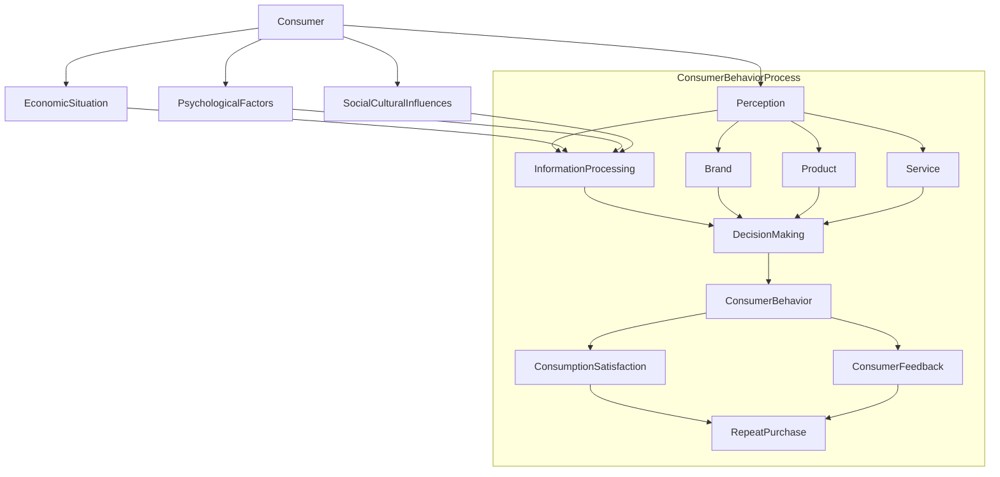
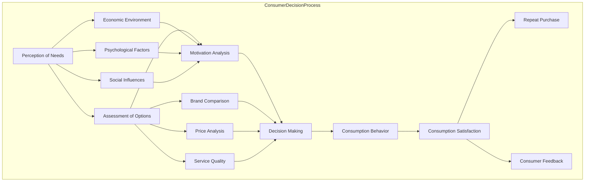

                 

### 第一部分：引言

#### 1.1 问题的背景与重要性

#### 1.1.1 社会经济发展的现状

在21世纪的今天，全球经济一体化进程不断加快，信息技术和互联网的迅猛发展推动了消费模式的转变。人们不再仅仅追求物质的丰富，而是开始关注精神层面的满足。消费行为也随之发生了显著的变化，从传统的物质积累逐渐转向了精神富足。

#### 1.1.1.1 全球经济一体化趋势

全球经济一体化的趋势使得各国之间的贸易、投资和文化交流更加频繁，这导致了消费观念的多样化。人们可以更容易地接触到来自世界各地的产品和服务，从而提升了消费选择的多样性。

#### 1.1.1.2 消费结构的变迁

随着经济的发展，人们的生活水平逐渐提高，消费结构也发生了变化。传统的物质消费逐渐让位于精神消费，如教育、文化、旅游、娱乐等领域的消费需求不断增长。

#### 1.1.1.3 物质积累与精神需求的矛盾

在物质积累阶段，人们通过购买物品来满足基本的生活需求，但随着物质生活的改善，人们开始感到精神上的空虚。这种矛盾引发了人们对于消费行为的新思考，促使他们开始寻求更高质量、更具有精神内涵的消费体验。

#### 1.1.2 研究的必要性

#### 1.1.2.1 消费行为的复杂性

消费行为是一个复杂的过程，涉及到心理学、社会学、经济学等多学科的交叉领域。研究消费行为的复杂性有助于我们更好地理解人们的行为动机和决策过程。

#### 1.1.2.2 消费行为的多样性

不同的文化、经济环境和个体差异使得消费行为呈现出多样性。研究消费行为的多样性有助于我们了解不同群体之间的消费差异和共性。

#### 1.1.2.3 消费行为的可持续性

随着环境问题的日益严重，可持续消费成为了全球关注的焦点。研究消费行为的可持续性有助于推动绿色消费和循环经济的发展。

#### 1.1.3 本书的目的与结构

本书旨在重新审视消费行为，从物质积累到精神富足的转型。通过分析消费行为的基础理论、物质积累阶段的消费行为、精神富足的转型与消费行为，以及转型策略与实践，帮助读者理解消费行为的转变，并提出相应的策略建议。

本书的结构如下：

- 第一部分：引言，介绍研究的背景和重要性。
- 第二部分：消费行为的基础理论，探讨消费行为的定义、心理学原理、社会学视角和经济学分析。
- 第三部分：物质积累阶段的消费行为，分析物质积累的消费动机、模式、特点、案例和影响。
- 第四部分：精神富足的转型与消费行为，探讨精神富足的概念、动机、模式、特点、案例和影响。
- 第五部分：转型策略与实践，提出个人和企业层面的转型策略，以及政府和公共政策的角色。
- 第六部分：精神富足的未来趋势，预测消费行为的未来趋势，分析新技术的影响，探讨精神富足对个人和社会的影响。
- 第七部分：结论与展望，总结主要结论，对未来研究进行展望，提出对个人和企业实践的启示，以及对社会发展的意义。

#### 1.1.4 消费行为的转变：从物质积累到精神富足

在物质积累阶段，消费行为主要围绕着获取物质财富和满足基本生活需求展开。人们通过购买商品和服务来提升生活质量和满足物质需求。

然而，随着社会经济的发展和人们生活水平的提高，消费行为逐渐从物质积累转向了精神富足。精神富足不仅仅是物质消费的替代品，更是一种追求内心满足和幸福感的生活方式。

这种转变反映了人们对于消费理念的新认识，即消费不仅仅是为了满足基本生活需求，更是为了提升生活质量和追求精神层面的满足。这种转变对于社会、企业和个人都带来了深远的影响。

### 第一部分：引言

#### 1.2 研究的重要性

消费行为是社会发展的重要指标之一，它不仅反映了人们的生活水平，也影响了经济的繁荣和环境的可持续性。因此，重新审视消费行为，从物质积累到精神富足的转型，具有重要的理论和实践意义。

#### 1.2.1 理论意义

首先，研究消费行为的转变有助于深化我们对消费心理学、社会学和经济学的理解。通过分析消费行为的动机、模式和影响因素，我们可以揭示人们行为背后的心理机制和社会因素。

其次，研究消费行为的转变有助于拓展消费行为理论的研究范畴。传统的消费行为研究主要关注物质消费，而本书则将研究视角扩展到精神消费，探讨物质积累到精神富足的转型过程。

最后，研究消费行为的转变有助于为消费行为理论的发展提供新的视角和思路。通过分析精神富足的消费行为，我们可以发现新的消费需求和消费模式，从而推动消费行为理论的研究和发展。

#### 1.2.2 实践意义

首先，研究消费行为的转变对于个人具有重要的指导意义。通过了解消费行为的转变，个人可以更好地认识自己的消费动机和需求，从而实现消费的优化和提升生活质量。

其次，研究消费行为的转变对于企业具有重要的战略意义。企业可以通过研究消费行为的转变，调整产品和服务策略，以满足消费者的新需求，提升市场竞争力和盈利能力。

最后，研究消费行为的转变对于政府和社会具有重要的政策意义。政府可以通过制定和实施相应的政策和措施，引导和促进消费行为的转型，推动经济的可持续发展和构建和谐社会。

### 第一部分：引言

#### 1.3 消费行为的转变：从物质积累到精神富足

#### 1.3.1 物质积累阶段的消费行为

在物质积累阶段，消费行为的主要特点是追求物质财富的积累和基本生活需求的满足。人们通过购买商品和服务来提升生活质量和满足物质需求。

这一阶段的消费行为受到以下几个因素的影响：

- 经济发展水平：随着经济的发展和人均收入的提高，人们的消费能力逐渐增强，消费结构也从生存型向发展型和享受型转变。
- 文化背景：不同的文化背景下，人们的消费观念和行为习惯存在差异。一些文化重视物质积累，而另一些文化则强调精神追求。
- 个人价值观：个人的价值观和生活方式也会影响消费行为。一些人追求物质财富和享受，而另一些人则更注重精神满足和内心的平静。

物质积累阶段的消费行为具有以下特点：

- 目标明确：人们明确知道自己的消费目标，主要是满足基本生活需求和提升生活质量。
- 理性消费：在物质积累阶段，人们倾向于进行理性消费，根据需求和预算进行购买决策。
- 物质导向：消费行为主要围绕物质产品的购买和使用展开，追求物质享受和满足。

#### 1.3.2 精神富足的消费行为

随着社会的发展和人们生活水平的提高，消费行为逐渐从物质积累转向了精神富足。精神富足的消费行为强调的是内心满足和幸福感，而不仅仅是物质的积累。

这一阶段的消费行为受到以下几个因素的影响：

- 经济发展水平：随着经济的持续发展，人们的收入水平和生活质量不断提升，精神需求也逐渐增加。
- 社会文化环境：社会文化环境的变化，如对精神生活的重视、对自我价值的追求等，也影响了消费行为。
- 科技进步：科技的进步，特别是互联网和信息技术的发展，为人们提供了更多的精神消费选择，如在线教育、虚拟现实体验等。

精神富足的消费行为具有以下特点：

- 内心满足：人们更注重消费带来的精神满足和幸福感，而不仅仅是物质享受。
- 个性化消费：人们追求个性化的消费体验，更关注产品或服务的独特性和个性化定制。
- 知识消费：知识消费成为精神富足的重要体现，人们愿意为知识和学习投入更多的时间和金钱。

#### 1.3.3 消费行为的转型

从物质积累到精神富足的消费行为转型是一个复杂的过程，涉及到经济、社会、文化和个人价值观等多个方面的变化。以下是这一转型过程中的几个关键点：

- 经济发展：经济的持续发展是消费行为转型的基础。只有经济发展到一定水平，人们才能有更多的闲暇时间和金钱去追求精神富足。
- 社会文化变革：社会文化的变革是推动消费行为转型的重要因素。社会对于精神生活的重视和对于自我价值的追求，促使人们重新审视消费行为。
- 科技进步：科技的进步为消费行为转型提供了新的可能性。互联网和信息技术的发展，使得人们能够更便捷地获取知识和享受精神文化产品。
- 个人价值观：个人的价值观和生活方式是影响消费行为转型的重要因素。只有当个人认识到精神富足的重要性，并主动追求精神层面的满足，消费行为才能实现真正的转型。

### 结论

通过本文的阐述，我们可以清晰地看到消费行为从物质积累到精神富足的转型是一个必然的趋势。这一转型不仅反映了社会经济的发展和人们生活水平的提高，也体现了人们对于更高层次生活质量的追求。

未来，随着经济的持续发展和科技的进步，消费行为将继续向精神富足的方向发展。企业和政府需要适应这一趋势，制定相应的策略，以引导和推动消费行为的转型。

对于个人而言，重新审视消费行为，理解精神富足的重要性，将有助于提升个人的生活质量和幸福感。通过追求内心的满足和幸福感，个人不仅能够获得更高的生活满足感，也能够为社会的可持续发展做出贡献。

总之，消费行为的转型是一个长期的过程，需要我们共同努力和持续探索。通过深入研究消费行为的变化，我们不仅能够更好地理解人类的消费行为，也能够为社会的可持续发展提供有益的启示。

### 第二部分：消费行为的基础理论

#### 2.1 消费行为的定义与分类

#### 2.1.1 消费行为的定义

消费行为是指个体或家庭为满足自身需求而进行商品或服务购买的行为。根据美国心理学家约翰·斯图尔特·密尔（John Stuart Mill）的观点，消费行为可以被视为一种满足个体欲望和需求的过程。经济学中，消费行为通常被定义为消费者在市场中的购买决策行为。

#### 2.1.2 消费行为的分类

消费行为可以根据不同的标准进行分类，以下是一些常见的分类方法：

- 按照消费目的分类：生存型消费、发展型消费和享受型消费。
  - 生存型消费：满足基本的生活需求，如食物、衣物和住房。
  - 发展型消费：为了提高生产能力和生活质量，如教育、培训和医疗保健。
  - 享受型消费：为了追求精神满足和享受，如旅游、文化和娱乐。
- 按照消费形式分类：有形消费和无形消费。
  - 有形消费：涉及物质产品的购买，如家具、电器和食品。
  - 无形消费：涉及服务的购买，如旅游、教育和医疗。
- 按照消费者动机分类：物质动机和精神动机。
  - 物质动机：基于物质需求和物质享受的购买动机，如购买衣物以保持形象和购买食品以维持身体健康。
  - 精神动机：基于精神需求和内心满足的购买动机，如购买图书以充实知识和购买艺术品以提升审美。

#### 2.2 消费行为的心理学原理

#### 2.2.1 消费行为的动机

消费行为的动机是指推动个体进行消费的内在原因。根据心理学家亚伯拉罕·马斯洛（Abraham Maslow）的需求层次理论，人类的需求可以分为生理需求、安全需求、社交需求、尊重需求和自我实现需求。消费行为往往与这些需求密切相关。

- 生理需求：满足基本的生活需求，如食物、衣物和住房。
- 安全需求：提高个人的安全感和稳定性，如购买保险、投资和储蓄。
- 社交需求：满足与他人建立和维护关系的需要，如购买礼物、参加社交活动和进行旅游。
- 尊重需求：提升个人的自尊和自我价值感，如购买名牌商品、参与培训和获取学历。
- 自我实现需求：追求个人潜能的最大发挥和自我价值的实现，如购买艺术作品、参与公益活动和学习新技能。

#### 2.2.2 消费行为的影响因素

消费行为不仅受动机的影响，还受到多种因素的影响，包括：

- 个人性格：个人的性格特征会影响消费行为。例如，外向的人可能更倾向于进行社交消费，而内向的人可能更倾向于进行个人爱好消费。
- 社会文化：不同的社会文化背景会影响消费观念和行为。例如，一些文化可能更重视物质财富的积累，而另一些文化则更强调精神追求和内心满足。
- 经济状况：个人的经济状况是影响消费行为的重要因素。经济状况良好的个体可能更有能力进行发展型和享受型消费。
- 家庭因素：家庭的经济状况、家庭结构和家庭成员的消费习惯都会影响个体的消费行为。
- 社会环境：社会环境的变化，如经济繁荣、社会稳定和科技进步，也会影响消费行为。

#### 2.3 消费行为的社会学视角

#### 2.3.1 社会结构对消费行为的影响

社会学认为，社会结构是影响个体行为的重要因素。社会结构包括家庭、学校、工作单位、社区等社会单位，它们对个体的消费行为有着深远的影响。

- 家庭：家庭是消费行为的基本单位。家庭的经济状况、消费习惯和家庭成员之间的相互作用都会影响个体的消费行为。
- 学校：学校教育对个体的消费观念和行为有着重要的影响。学校通过传授知识和价值观，引导个体形成正确的消费观念。
- 工作单位：工作单位的经济状况、企业文化和社会责任意识都会影响员工的消费行为。一些企业通过提供福利和激励措施，引导员工进行理性消费。
- 社区：社区的文化氛围、社区活动和社会支持网络都会影响个体的消费行为。一个和谐、积极的社区环境有助于提升个体的消费质量和幸福感。

#### 2.3.2 社会阶层对消费行为的影响

社会阶层是影响个体消费行为的重要因素。社会阶层是指在某一社会中，根据经济、社会和文化等特征所划分的不同层次。不同社会阶层的个体在消费行为上存在显著差异。

- 高社会阶层：高社会阶层的个体通常具有更高的消费能力，更倾向于进行发展型和享受型消费。他们更关注品牌、质量和个性化服务。
- 中等社会阶层：中等社会阶层的个体在消费上较为理性，既关注物质消费，也注重精神消费。他们更关注性价比和实用性。
- 低社会阶层：低社会阶层的个体在消费上可能面临更多的限制，更倾向于进行生存型消费。他们更关注基本生活需求的满足。

#### 2.4 经济学对消费行为的分析

#### 2.4.1 消费函数理论

经济学中的消费函数理论描述了消费与收入之间的关系。最著名的消费函数理论是由美国经济学家詹姆斯·杜森贝里（James Duesenberry）提出的恒常收入消费函数理论。根据这一理论，个体的消费不仅取决于当前收入，还受到过去收入和未来收入预期的影响。

- 恒常收入消费函数：\(C = C_0 + \frac{Y - Y_0}{M}\)，其中\(C\)为消费，\(C_0\)为自主消费，\(Y\)为当前收入，\(Y_0\)为长期收入水平，\(M\)为边际消费倾向。

- 消费平滑理论：为了平滑消费，个体会考虑未来收入的不确定性，从而进行储蓄和消费的平衡。

#### 2.4.2 消费效用理论

经济学中的消费效用理论描述了个体在消费过程中获得的满足程度。根据效用理论，个体会根据边际效用来决定消费量。边际效用是指单位消费量增加所带来的额外满足程度。

- 边际效用递减规律：随着消费量的增加，单位消费量带来的边际效用会逐渐减少。

- 最优化消费：个体会在边际效用等于边际成本时实现消费的最优化，即最大化总效用。

#### 2.4.3 消费预期理论

消费预期理论描述了个体对未来的收入和消费预期如何影响当前的消费行为。根据预期理论，个体会根据对未来收入的预期来调整当前的消费水平。

- 乐观预期：如果个体预期未来收入会增加，他们可能会增加当前的消费。
- 悲观预期：如果个体预期未来收入会减少，他们可能会减少当前的消费。

### 消费行为的基础概念对比

为了更好地理解消费行为，我们需要对一些基础概念进行对比。以下是对几个核心概念的比较：

#### 2.5.1 消费动机与消费需求

- 消费动机：指推动个体进行消费的内在原因，如生理需求、社交需求和自我实现需求。
- 消费需求：指个体在特定时间和价格条件下愿意且能够购买的商品或服务的数量。

#### 2.5.2 消费模式与消费结构

- 消费模式：指消费行为在不同时间、地点和群体中的规律性表现。
- 消费结构：指消费在总支出中所占的比重和比例，如生存型消费、发展型消费和享受型消费的比重。

#### 2.5.3 消费行为与消费习惯

- 消费行为：指个体在特定时间和价格条件下进行的购买决策和实际购买活动。
- 消费习惯：指个体在长期消费过程中形成的稳定消费行为模式，如习惯性购买、品牌忠诚等。

### 消费行为的基础概念对比图

以下是消费行为基础概念对比的ER实体关系图：

```mermaid
erDiagram
    Consumer ||--|{ ConsumerDemands }|>
    Consumer ||--|{ ConsumerBehavior }|>
    Consumer ||--|{ ConsumerPatterns }|>

    ConsumerDemands ||--|{ PsychologicalMotives }|>
    ConsumerDemands ||--|{ EconomicConstraints }|>

    ConsumerBehavior ||--|{ ConsumptionDecisions }|>
    ConsumerBehavior ||--|{ PurchaseActivities }|>

    ConsumerPatterns ||--|{ ConsumptionStructures }|>
    ConsumerPatterns ||--|{ TimeAndLocationPatterns }|>

    Consumer [ Consumer ]
    ConsumerDemands [ ConsumerDemands ]
    ConsumerBehavior [ ConsumerBehavior ]
    ConsumerPatterns [ ConsumerPatterns ]
    PsychologicalMotives [ PsychologicalMotives ]
    EconomicConstraints [ EconomicConstraints ]
    ConsumptionDecisions [ ConsumptionDecisions ]
    PurchaseActivities [ PurchaseActivities ]
    ConsumptionStructures [ ConsumptionStructures ]
    TimeAndLocationPatterns [ TimeAndLocationPatterns ]
```

### 消费行为模型与框架

为了更好地理解消费行为，我们需要建立相应的模型和框架。以下是一个简化的消费行为模型：



在这个模型中，消费者的感知和信息处理是消费行为决策的基础。经济状况、心理因素和社会文化影响共同作用于消费者的决策过程。最终，消费者的行为决定了他们的消费满意度和重复购买意愿。

### 第二部分：消费行为的基础理论

#### 2.6 消费行为的基础概念对比

为了更好地理解消费行为，我们需要对一些基础概念进行对比。以下是对几个核心概念的比较：

#### 2.6.1 消费动机与消费需求

- **消费动机**：指推动个体进行消费的内在原因，如生理需求、社交需求和自我实现需求。它是个体进行消费行为的前提和动力。
- **消费需求**：指个体在特定时间和价格条件下愿意且能够购买的商品或服务的数量。它是消费动机的具体体现和量化表达。

#### 2.6.2 消费模式与消费结构

- **消费模式**：指消费行为在不同时间、地点和群体中的规律性表现。它反映了消费行为在时间和空间上的分布和变化。
- **消费结构**：指消费在总支出中所占的比重和比例，如生存型消费、发展型消费和享受型消费的比重。它是消费行为在宏观层面的表现和特征。

#### 2.6.3 消费行为与消费习惯

- **消费行为**：指个体在特定时间和价格条件下进行的购买决策和实际购买活动。它是消费动机和需求的具体执行。
- **消费习惯**：指个体在长期消费过程中形成的稳定消费行为模式，如习惯性购买、品牌忠诚等。它是消费行为在微观层面的延续和固化。

### 消费行为的基础概念对比图

以下是消费行为基础概念对比的ER实体关系图：

```mermaid
erDiagram
    Consumer ||--|{ ConsumerDemands }|>
    Consumer ||--|{ ConsumerBehavior }|>
    Consumer ||--|{ ConsumerPatterns }|>

    ConsumerDemands ||--|{ PsychologicalMotives }|>
    ConsumerDemands ||--|{ EconomicConstraints }|>

    ConsumerBehavior ||--|{ ConsumptionDecisions }|>
    ConsumerBehavior ||--|{ PurchaseActivities }|>

    ConsumerPatterns ||--|{ ConsumptionStructures }|>
    ConsumerPatterns ||--|{ TimeAndLocationPatterns }|>

    Consumer [ Consumer ]
    ConsumerDemands [ ConsumerDemands ]
    ConsumerBehavior [ ConsumerBehavior ]
    ConsumerPatterns [ ConsumerPatterns ]
    PsychologicalMotives [ PsychologicalMotives ]
    EconomicConstraints [ EconomicConstraints ]
    ConsumptionDecisions [ ConsumptionDecisions ]
    PurchaseActivities [ PurchaseActivities ]
    ConsumptionStructures [ ConsumptionStructures ]
    TimeAndLocationPatterns [ TimeAndLocationPatterns ]
```

在这个ER图中，消费者是核心实体，与其他实体如消费需求、消费行为和消费模式存在关联。消费需求包括心理动机和经济约束，消费行为包括消费决策和购买活动，消费模式包括消费结构和时间、地点模式。

### 消费行为模型与框架

为了更好地理解消费行为，我们需要建立相应的模型和框架。以下是一个简化的消费行为模型：


在这个模型中，消费者的感知和信息处理是消费行为决策的基础。经济状况、心理因素和社会文化影响共同作用于消费者的决策过程。最终，消费者的行为决定了他们的消费满意度和重复购买意愿。

### 第二部分：消费行为的基础理论

#### 2.7 消费行为的基础概念对比图与模型分析

在深入探讨消费行为之前，我们有必要对一些基础概念进行清晰的对比和分析，以帮助我们更好地理解这一复杂现象。以下将展示消费行为相关的基础概念对比图和模型分析，通过视觉化的方式呈现概念之间的关系和消费行为决策的过程。

#### 2.7.1 消费行为的基础概念对比图

首先，我们使用ER（Entity-Relationship）图来展示消费行为的关键概念及其关系：

```mermaid
erDiagram
    Customer ||--|{ ConsumptionDecision }|>
    Customer ||--|{ ConsumptionPattern }|>

    ConsumptionDecision ||--|{ PsychologicalMotivation }|>
    ConsumptionDecision ||--|{ EconomicConstraints }|>
    ConsumptionDecision ||--|{ SocialInfluence }|>

    ConsumptionPattern ||--|{ BrandPreference }|>
    ConsumptionPattern ||--|{ TimePattern }|>
    ConsumptionPattern ||--|{ PlacePattern }|>

    Customer [ Customer ]
    ConsumptionDecision [ ConsumptionDecision ]
    ConsumptionPattern [ ConsumptionPattern ]
    PsychologicalMotivation [ PsychologicalMotivation ]
    EconomicConstraints [ EconomicConstraints ]
    SocialInfluence [ SocialInfluence ]
    BrandPreference [ BrandPreference ]
    TimePattern [ TimePattern ]
    PlacePattern [ PlacePattern ]
```

在这个ER图中，我们定义了以下实体：

- **Customer（消费者）**：消费行为的主体，他们的决策和模式是我们分析的重点。
- **ConsumptionDecision（消费决策）**：消费者的购买决策过程，包括心理动机、经济约束和社会影响。
- **ConsumptionPattern（消费模式）**：消费者的消费习惯，包括品牌偏好、时间模式、地点模式等。

实体之间的关系揭示了消费者决策和行为模式背后的影响因素。

#### 2.7.2 消费行为决策模型

接下来，我们通过一个简化但结构清晰的模型来描述消费者的消费行为决策过程：



在这个模型中，消费者的需求感知引导他们进入评估选项阶段，这一阶段考虑了品牌、价格、服务质量等因素。心理因素（如动机）、经济环境和社交影响共同作用于决策过程，最终形成消费行为。消费满意度的反馈又影响了消费者的重复购买意愿和反馈。

#### 2.7.3 模型分析

- **感知需求（Perception of Needs）**：消费者首先感知到自身需求，这些需求可能来自生理、心理或社交层面。
- **评估选项（Assessment of Options）**：在考虑了可用的选项后，消费者开始分析各种因素，如品牌、价格、服务质量。
- **动机分析（Motivation Analysis）**：心理因素、经济环境和社交影响共同作用于消费者，影响其购买动机。
- **决策制定（Decision Making）**：消费者在综合考虑各种因素后做出购买决策。
- **消费行为（Consumption Behavior）**：消费者实施购买行为，包括选择购买、支付、接收商品或服务。
- **消费满意度（Consumption Satisfaction）**：消费者的满意度直接影响其重复购买意愿和反馈。

通过这个模型，我们可以清晰地看到消费行为是一个复杂的多因素相互作用的过程，消费者在决策时需要综合考虑多种因素，而这些因素又会相互影响，最终决定消费行为的结果。

### 总结

通过对消费行为基础概念的对比图和决策模型的详细分析，我们能够更深入地理解消费行为的本质和影响因素。这不仅有助于我们进行更准确的市场预测和营销策略制定，也为政策制定者提供了有益的参考。接下来，我们将进一步探讨物质积累阶段的消费行为，分析其特点、动机和影响，为理解消费行为的转变奠定基础。

### 第三部分：物质积累阶段的消费行为

#### 3.1 物质积累的消费动机

在物质积累阶段，消费行为主要受到以下动机的驱使：

1. **生理需求**：这是最基本的需求，包括食物、衣物、住房和基本的生活用品等。生理需求的满足是人们进行消费的首要动机。
   
2. **安全需求**：随着生理需求得到满足，人们开始关注安全需求，包括购买保险、房产和健康产品等。安全需求的消费动机旨在提高个人的安全感和生活稳定性。

3. **社交需求**：在物质积累阶段，人们为了获得社会认可和社交地位，会购买高档商品和奢侈品。社交需求的消费动机与个体的社会互动和社交网络的建立密切相关。

4. **尊重需求**：人们为了获得自尊和自我价值感，会购买具有象征意义的商品，如名牌服装、珠宝和艺术作品等。尊重需求的消费动机与个体的自我实现和自我表达有关。

5. **娱乐需求**：随着生活水平的提高，娱乐需求的消费动机逐渐增强，包括旅游、文化娱乐和体育活动等。娱乐需求的消费动机旨在提高生活质量和放松身心。

#### 3.2 物质积累的消费模式

物质积累阶段的消费模式具有以下特点：

1. **重物质性**：消费行为主要集中在物质产品的购买上，如家具、电器、电子产品和汽车等。

2. **集中化**：消费者的购买决策较为集中，往往在一两次购物中花费较大金额。

3. **刚性需求**：生理需求和安全需求是刚性需求，无论价格如何，这些需求的满足是消费行为的必要条件。

4. **品牌忠诚度**：在物质积累阶段，消费者对品牌的忠诚度较高，倾向于选择知名品牌和高品质产品。

5. **从众行为**：社交需求和尊重需求的消费行为往往受到社会和文化因素的影响，消费者容易受到同伴和媒体的影响，产生从众行为。

#### 3.3 物质积累的消费行为特点

1. **目标明确**：物质积累阶段的消费者通常有明确的目标和购买计划，他们关注产品的实用性和性价比。

2. **理性消费**：消费者在购买过程中注重理性分析，根据预算和需求进行购买决策，较少受到情感因素的干扰。

3. **追求质量**：消费者在物质积累阶段更注重产品的质量和耐用性，愿意为高品质产品支付更高的价格。

4. **消费周期长**：由于消费目标明确，消费者往往在实现目标前会进行长时间的储蓄和积累。

5. **品牌认知度高**：消费者在物质积累阶段对品牌的认知度和忠诚度较高，倾向于选择知名品牌和口碑良好的产品。

#### 3.4 物质积累的消费行为案例分析

为了更好地理解物质积累阶段的消费行为，我们可以通过以下几个实际案例进行分析：

1. **房产购买**：随着城市化进程的加快，房产成为许多消费者的首要消费目标。根据国际房地产顾问公司莱坊（Keller Williams）的报告，中国一线城市房产平均价格在过去十年中持续上涨，反映了消费者对安全需求和投资需求的强烈动机。

2. **汽车消费**：在物质积累阶段，汽车成为家庭的重要消费品。根据中国汽车工业协会的数据，2019年中国汽车销量达到2572万辆，其中SUV和豪华车型销量增长较快，反映了消费者对舒适性和身份地位的追求。

3. **奢侈品购买**：在社交需求和尊重需求的驱使下，奢侈品成为许多消费者的心头好。以路易威登（Louis Vuitton）为例，其全球销售额在近年来持续增长，特别是在中国市场的表现尤为突出。

4. **家电消费**：随着科技的发展，家电产品不断更新换代，消费者为了提升生活质量，会频繁购买新型家电产品。例如，空气净化器、智能电视和智能冰箱等产品的销量不断攀升。

#### 3.5 物质积累的消费行为的优缺点

1. **优点**：
   - 提高生活质量：物质积累阶段的消费行为有助于满足消费者的基本需求和提升生活质量。
   - 经济发展：物质积累带动了相关产业的发展，促进了经济增长。
   - 投资回报：通过购买房产、汽车等长期消费品，消费者可以实现资产增值。

2. **缺点**：
   - 环境压力：大量物质消费带来了资源浪费和环境污染问题。
   - 社会分化：物质积累可能导致社会阶层的分化，加剧贫富差距。
   - 心理负担：过度追求物质财富可能导致心理压力和焦虑，影响身心健康。

#### 3.6 物质积累的消费行为的影响因素

物质积累阶段的消费行为受到多种因素的影响，包括：

1. **经济状况**：经济发展水平是影响物质积累消费行为的主要因素。经济繁荣时期，人们的消费能力增强，物质消费需求上升。

2. **社会文化**：社会文化背景会影响消费观念和行为。一些文化强调物质积累，而另一些文化则更重视精神追求。

3. **个人价值观**：个人的价值观和生活方式会影响消费决策。一些人追求物质财富，而另一些人则更注重精神层面的满足。

4. **科技进步**：科技进步提高了消费产品的质量和多样性，推动了物质消费的增长。

5. **政策环境**：政府的政策环境，如税收政策、消费信贷政策等，也会影响物质积累阶段的消费行为。

### 总结

物质积累阶段的消费行为是社会发展的重要阶段，它反映了人们生活水平的提高和经济的发展。然而，随着社会的进步和人们价值观的转变，物质积累阶段的消费行为也在逐渐发生变化。在下一部分，我们将探讨精神富足的消费行为，分析其动机、模式、特点，并比较两者之间的差异。

### 第三部分：物质积累阶段的消费行为

#### 3.7 物质积累的消费行为的影响因素

在物质积累阶段，消费行为受到多种因素的共同影响，以下是这些因素的具体分析：

#### 3.7.1 经济状况

经济状况是影响物质积累消费行为的最直接因素。当经济发展水平较高，人们的收入增加，消费能力也随之提升。此时，消费者更倾向于购买更高价值的物质产品，如高档家电、豪华汽车和房产等。此外，经济状况良好的时期，消费者更愿意进行大额消费，如购置家庭耐用消费品或进行长期投资。

#### 3.7.2 社会文化

社会文化背景对消费行为有着深远的影响。在一些注重物质积累和财富积累的文化背景下，人们普遍认为物质财富是成功和地位的象征，因此会倾向于通过购买高档商品来展示自己的经济实力和社会地位。反之，在一些强调精神追求和内心富足的文化中，人们可能更倾向于进行精神消费，如购买书籍、艺术品或参与文化活动。

#### 3.7.3 个人价值观

个人的价值观和生活方式直接影响其消费行为。一些个体可能认为物质的丰富是幸福生活的必要条件，因此他们会不断追求物质积累。而另一些个体则更注重精神层面的满足，如通过学习新技能、参与志愿活动或享受文化娱乐来提升生活品质。个人的价值观不仅决定了其消费目标，还影响其消费决策过程。

#### 3.7.4 科技进步

科技的进步极大地改变了消费行为。首先，科技进步带来了更多的消费选择和便利。例如，电子商务平台的出现使得消费者可以轻松购买全球范围内的商品。其次，科技产品本身也成为了重要的消费对象，如智能手机、智能家居设备和虚拟现实设备等。科技进步不仅改变了消费的方式，还影响了消费者的需求和偏好。

#### 3.7.5 政策环境

政策环境对消费行为有着重要的引导作用。政府的税收政策、消费信贷政策、环保政策和贸易政策等都会直接影响消费者的消费行为。例如，税收优惠政策和消费信贷政策的实施，可以刺激消费者的消费需求；而环保政策的出台，可能会引导消费者向绿色消费和可持续消费转变。

#### 3.7.6 社会舆论

社会舆论对消费行为也具有重要影响。媒体、社交网络和其他舆论渠道可以塑造消费者的消费观念和消费行为。例如，一些电视广告和社交媒体上的热门话题可能会促使消费者购买某种商品或服务。此外，公众对某些消费行为的舆论态度，如对奢侈品的看法，也会影响消费者的购买决策。

#### 3.7.7 家庭因素

家庭因素是影响消费行为的一个重要方面。家庭的经济状况、消费习惯和家庭成员之间的互动都会影响个体的消费行为。例如，家庭收入较高且消费观念开放的家庭，可能会更倾向于进行高档商品的消费。而家庭成员之间的消费习惯和意见分歧，也可能会影响家庭的消费决策。

通过上述分析，我们可以看到，物质积累阶段的消费行为受到多种因素的影响。这些因素相互交织，共同作用于消费者的决策过程，决定了消费行为的特点和模式。在理解这些影响因素的基础上，企业和政府可以更好地制定相应的策略，引导和促进消费者的理性消费和绿色消费，从而实现经济的可持续发展和社会的和谐稳定。

### 第三部分：物质积累阶段的消费行为

#### 3.7 物质积累的消费行为的影响因素

物质积累阶段的消费行为是一个复杂的过程，受到多种因素的共同影响。以下是对这些因素的具体分析：

#### 3.7.1 经济状况

经济状况是影响物质积累消费行为的直接因素。在经济发展水平较高的时期，人们的收入增加，消费能力也随之提升。消费者更倾向于购买价值较高的物质产品，如高档家电、豪华汽车和房产等。此外，经济繁荣时期，消费者更愿意进行大额消费，以满足自身和家庭的需求。

#### 3.7.2 社会文化

社会文化背景对消费行为有着深远的影响。在一些文化中，物质财富被视为成功和地位的象征，人们倾向于通过购买高档商品来展示自己的经济实力。这种文化背景下，消费者的消费行为以物质积累为主。相反，在一些文化中，精神追求和内心富足更为重要，消费者更倾向于进行精神消费，如购买书籍、艺术品或参与文化活动。

#### 3.7.3 个人价值观

个人的价值观和生活方式直接影响其消费行为。一些个体可能认为物质的丰富是幸福生活的必要条件，因此他们会不断追求物质积累。这种价值观驱使消费者购买更多的高档商品和奢侈品。而另一些个体则更注重精神层面的满足，如通过学习新技能、参与志愿活动或享受文化娱乐来提升生活品质。个人的价值观不仅决定了消费目标，还影响消费决策过程。

#### 3.7.4 科技进步

科技的进步极大地改变了消费行为。电子商务平台的兴起使得消费者可以轻松购买全球范围内的商品，提高了消费选择的多样性和便利性。同时，科技进步带来了新的消费需求，如智能手机、智能家居设备和虚拟现实设备等。科技产品本身也成为重要的消费对象，影响了消费者的消费模式和偏好。

#### 3.7.5 政策环境

政策环境对消费行为有着重要的引导作用。政府的税收政策、消费信贷政策、环保政策和贸易政策等都会直接影响消费者的消费行为。例如，税收优惠政策和消费信贷政策的实施可以刺激消费者的消费需求；而环保政策的出台，可能会引导消费者向绿色消费和可持续消费转变。

#### 3.7.6 社会舆论

社会舆论对消费行为也具有重要影响。媒体、社交网络和其他舆论渠道可以塑造消费者的消费观念和消费行为。例如，一些电视广告和社交媒体上的热门话题可能会促使消费者购买某种商品或服务。此外，公众对某些消费行为的舆论态度，如对奢侈品的看法，也会影响消费者的购买决策。

#### 3.7.7 家庭因素

家庭因素是影响消费行为的一个重要方面。家庭的经济状况、消费习惯和家庭成员之间的互动都会影响个体的消费行为。例如，家庭收入较高且消费观念开放的家庭，可能会更倾向于进行高档商品的消费。而家庭成员之间的消费习惯和意见分歧，也可能会影响家庭的消费决策。

通过上述分析，我们可以看到，物质积累阶段的消费行为受到多种因素的共同影响。理解这些因素有助于我们更好地理解消费者的行为模式，为企业制定营销策略和政府制定相关政策提供依据。

### 第四部分：精神富足的转型与消费行为

#### 4.1 精神富足的概念与内涵

精神富足是指个体在物质需求得到满足的基础上，追求内心满足和幸福感的一种生活方式。它不仅仅是对物质财富的积累，更强调对精神世界的探索和提升。精神富足的概念涵盖了以下几个方面：

1. **心理层面的满足**：精神富足关注个体的心理需求，如自我认同、自我价值和自我实现。它追求个体内心的平静、快乐和成就感。
   
2. **文化层面的丰富**：精神富足强调个体对文化、艺术和知识的需求。它鼓励个体通过阅读、学习、欣赏艺术作品等方式丰富自己的精神世界。

3. **社交层面的满足**：精神富足重视个体与他人的关系，包括家庭、朋友和社区。它倡导个体在建立和维护良好的人际关系过程中获得满足感。

4. **精神层面的提升**：精神富足追求个体精神层面的成长和提升，如冥想、宗教信仰和哲学思考。它帮助个体在心灵层面获得更高的智慧和洞见。

#### 4.2 精神富足的消费动机

精神富足的消费动机与物质积累阶段的消费动机有所不同。以下是精神富足的主要消费动机：

1. **寻求内心的平静与满足**：在物质积累阶段，消费者通过购买物质产品来满足基本的生活需求。然而，随着物质需求的满足，个体开始寻求更深层次的内心满足。精神富足的消费动机之一是希望通过消费来达到内心的平静和满足。

2. **提升个人修养和自我价值感**：精神富足的消费不仅是为了享受，更是为了提升个人修养和自我价值感。个体通过购买知识类产品（如图书、课程）、文化产品（如音乐会、艺术展览）和自我提升产品（如健身、心理咨询）来实现这一目标。

3. **追求社交认同和归属感**：精神富足的消费行为有助于个体在社交中获得认同和归属感。通过参与社交活动、加入兴趣小组或与志同道合的人分享消费体验，个体可以建立更紧密的人际关系。

4. **探索和实现自我**：精神富足的消费动机还包括探索和实现自我。个体通过购买能够激发自我反思和成长的产品或服务，如旅行、户外探险和艺术创作，来实现个人成长和自我实现。

#### 4.3 精神富足的消费模式

精神富足的消费模式与物质积累阶段的消费模式存在明显差异。以下是精神富足的消费模式：

1. **知识消费**：知识消费成为精神富足的重要体现。个体愿意为教育和学习投入更多的时间和金钱，如购买在线课程、参加讲座和工作坊。

2. **文化消费**：文化消费在精神富足中占据重要地位。个体通过购买文化产品（如音乐、电影、书籍、艺术品）来丰富自己的精神世界。

3. **体验消费**：与物质消费不同，精神富足的消费更注重体验。个体通过参与社交活动、户外探险和旅行来获得精神满足。

4. **个性化消费**：精神富足的消费行为倾向于个性化。个体追求独特和定制化的消费体验，如定制旅行路线、个性化艺术作品和专属咨询服务。

5. **绿色消费**：随着环保意识的提升，绿色消费成为精神富足的一个重要方面。个体通过购买环保产品、参与环保活动和支持可持续发展的企业来体现自己的社会责任感。

#### 4.4 精神富足的消费行为特点

精神富足的消费行为具有以下特点：

1. **目标明确**：与物质积累阶段不同，精神富足的消费行为目标更为明确。个体清楚地知道自己希望通过消费来实现哪些精神层面的满足。

2. **理性消费**：精神富足的消费者更注重理性消费。他们在购买前会进行充分的市场调研和产品比较，以获得最佳的消费体验。

3. **追求质量**：精神富足的消费者倾向于购买高质量的产品或服务，以满足自己的精神需求。

4. **个性化消费**：精神富足的消费者追求个性化消费体验，他们更愿意为独特和定制化的产品或服务支付溢价。

5. **可持续消费**：精神富足的消费者关注可持续消费，他们通过购买环保产品和参与环保活动来体现自己的社会责任感。

#### 4.5 精神富足的消费行为案例分析

为了更好地理解精神富足的消费行为，我们可以通过以下几个实际案例进行分析：

1. **在线教育消费**：随着互联网技术的发展，在线教育成为精神富足的重要消费领域。个体通过购买在线课程、参加网络研讨会和参加专业培训来提升自己的知识和技能。

2. **文化消费**：文化消费在精神富足中占据重要地位。个体通过购买音乐、电影、书籍和艺术品来丰富自己的精神世界。

3. **体验消费**：个体通过参与社交活动、户外探险和旅行来获得精神满足。这些活动不仅提供了独特的消费体验，也促进了个人成长。

4. **个性化消费**：在精神富足的驱动下，个体更倾向于购买个性化产品或服务。例如，定制旅行路线、个性化艺术作品和专属咨询服务。

5. **绿色消费**：随着环保意识的提升，绿色消费成为精神富足的一个重要方面。个体通过购买环保产品、参与环保活动和支持可持续发展的企业来体现自己的社会责任感。

#### 4.6 精神富足的消费行为的优缺点

1. **优点**：
   - 提升生活质量：精神富足的消费行为有助于提升个体的生活质量和幸福感。
   - 促进个人成长：通过知识消费和体验消费，个体可以获得更多的知识和技能，实现自我提升。
   - 增强社交互动：精神富足的消费行为促进了个体之间的社交互动，有助于建立更紧密的人际关系。
   - 可持续发展：精神富足的消费行为推动了绿色消费和可持续消费，有利于环境保护和可持续发展。

2. **缺点**：
   - 消费成本较高：精神富足的消费行为往往需要更高的消费成本，可能会对一部分消费者造成经济压力。
   - 消费风险较大：一些个性化的消费体验可能存在一定的风险，如旅行安全、产品质量等。
   - 可能导致过度消费：在某些情况下，精神富足的消费行为可能会导致过度消费和奢侈消费，影响个体的财务状况。

#### 4.7 精神富足的消费行为的影响因素

精神富足的消费行为受到多种因素的影响，以下是这些因素的具体分析：

1. **个人经济状况**：个人的经济状况是影响精神富足消费行为的重要因素。经济状况良好的个体更有可能进行高价值的消费，如在线教育、文化消费和个性化体验。

2. **社会文化背景**：社会文化背景对消费行为有着深远的影响。在一些文化中，精神富足的消费行为受到鼓励，而在另一些文化中，物质积累更为重要。

3. **个人价值观**：个人的价值观直接影响其消费行为。一些个体可能更注重物质财富的积累，而另一些个体则更倾向于追求精神满足。

4. **科技进步**：科技的进步为精神富足的消费行为提供了新的可能性和便利。例如，在线教育和虚拟现实技术的普及，使得更多人能够参与精神富足的消费活动。

5. **政策环境**：政府的政策环境，如税收政策、教育政策和环保政策等，也会影响精神富足的消费行为。

通过上述分析，我们可以看到，精神富足的消费行为是一个复杂的过程，受到多种因素的共同影响。理解这些因素有助于我们更好地理解消费者的行为模式，为企业制定营销策略和政府制定相关政策提供依据。

### 第四部分：精神富足的转型与消费行为

#### 4.8 精神富足的消费行为案例分析

在探讨精神富足的消费行为时，通过实际案例的分析可以帮助我们更直观地理解这一现象。以下是几个具体案例，分别从不同的角度展示了精神富足的消费行为：

1. **在线教育平台的兴起**：
   - **案例**：随着知识经济的兴起，在线教育平台如Coursera、edX和Udacity等在全球范围内迅速发展。这些平台提供了来自世界顶尖大学的课程，让用户可以在线学习各种领域的知识。
   - **分析**：在线教育的普及反映了消费者对知识消费的需求。用户愿意为高质量的教育内容支付费用，以提高自身的知识水平和职业技能。这种消费行为不仅满足了消费者的精神需求，也推动了个人成长和职业发展。

2. **文化消费的多样化**：
   - **案例**：文化消费在精神富足中占据重要地位。例如，电影、音乐、艺术展览和文学等领域的消费逐渐成为人们日常生活中的重要组成部分。
   - **分析**：消费者在文化消费上倾向于追求多样性和个性化。他们愿意为高质量的文化产品支付溢价，如购买原创音乐专辑、订阅流媒体服务和参观独立艺术展览。这些消费行为不仅丰富了消费者的精神世界，也促进了文化产业的繁荣。

3. **个性化旅游体验**：
   - **案例**：随着旅游业的不断发展，个性化旅游体验越来越受到消费者的青睐。许多旅游公司提供定制旅行服务，如私人导游、定制行程和独特住宿体验。
   - **分析**：个性化旅游体验满足了消费者对独特、专属消费体验的追求。消费者愿意为定制化的旅游服务支付额外费用，以获得更深入的文化体验和独特的旅行体验。这种消费行为不仅提升了消费者的幸福感，也推动了旅游业的发展。

4. **环保产品的购买**：
   - **案例**：随着环保意识的增强，越来越多的消费者开始关注环保产品的购买。例如，有机食品、可回收材料和环保家居产品等。
   - **分析**：环保产品的消费行为体现了消费者对社会责任的关注。消费者愿意为环保产品支付溢价，以减少对环境的影响。这种消费行为不仅有助于保护环境，也推动了可持续发展。

通过以上案例分析，我们可以看到，精神富足的消费行为在现代社会中越来越受到重视。消费者在追求内心满足和幸福感的过程中，不仅关注产品的实用性，更注重产品的精神价值和社会意义。这种消费行为的变化不仅反映了人们价值观的转变，也为企业和政策制定者提供了新的机遇和挑战。

#### 4.9 精神富足的消费行为的优缺点

在理解精神富足的消费行为时，我们需要认识到它既有优点也有缺点，以下是具体分析：

**优点**：

1. **提升生活质量和幸福感**：精神富足的消费行为，如知识消费、文化消费和个性化服务，有助于提升人们的生活质量和幸福感。通过丰富自己的精神世界，消费者能够获得更多的内心满足和成就感。

2. **促进个人成长和职业发展**：在线教育和专业培训等知识消费，可以帮助个体提升自己的知识和技能，从而在职业发展中取得更好的成绩。

3. **增强社交互动和人际关系**：通过参与社交活动和体验消费，个体能够与他人建立更紧密的联系，增强社交互动，提升人际关系质量。

4. **推动环保和可持续发展**：环保产品的购买和绿色消费行为有助于保护环境，推动可持续发展。消费者通过选择环保产品，体现了对社会责任的关注。

**缺点**：

1. **消费成本较高**：精神富足的消费行为往往需要更高的消费成本，这可能会给一部分消费者带来经济压力，特别是对于那些收入水平较低的群体。

2. **消费风险较大**：一些个性化的消费体验可能存在一定的风险，如旅行安全和产品质量问题。消费者在购买前需要仔细评估风险。

3. **可能导致过度消费**：在某些情况下，精神富足的消费行为可能会导致过度消费和奢侈消费。这可能会对消费者的财务状况产生负面影响。

4. **忽视基本需求**：过分追求精神富足可能会使消费者忽视基本的生活需求，如食物、衣物和住房等。这可能会导致生活质量下降。

**总结**：

精神富足的消费行为在提升个人生活质量和幸福感方面具有积极作用，但也存在一定的风险和挑战。因此，消费者在追求精神富足的过程中，需要保持理性，合理规划自己的消费，确保基本生活需求得到满足。

### 第四部分：精神富足的转型与消费行为

#### 4.10 精神富足的消费行为影响因素分析

在探讨精神富足的消费行为时，需要深入分析影响这一行为的各种因素，以便更好地理解其发展动态和趋势。以下是对主要影响因素的具体分析：

**1. 经济因素**

- **经济发展水平**：经济水平的提升为消费者提供了更高的收入和更广泛的消费选择，促进了精神富足的消费。在发达国家，消费者更倾向于进行文化消费和体验消费。
- **收入水平**：高收入水平的消费者更有可能进行高价值的消费，如在线教育、艺术展览和个性化旅游。相对而言，低收入消费者可能更注重基本生活需求的满足。

**2. 社会文化因素**

- **文化背景**：不同的文化背景对消费行为有着深远的影响。一些文化强调物质积累，而另一些文化则更重视精神追求。例如，在东方文化中，人们可能更倾向于进行家庭和社会责任的消费；而在西方文化中，个人主义和自我实现可能更为重要。
- **社会价值观**：随着社会价值观的转变，越来越多的消费者开始重视精神层面的满足。例如，近年来，对环保和社会责任的关注逐渐成为重要的消费驱动力。

**3. 个人因素**

- **个人价值观**：个人的价值观直接影响其消费行为。一些个体可能更注重物质积累，而另一些个体则更倾向于追求精神满足。个人价值观的形成受到家庭教育、社会教育和个人经历等多种因素的影响。
- **生活方式**：生活方式对消费行为也有重要影响。例如，喜欢户外活动和探险的人可能更倾向于进行相关消费，如购买户外装备和报名旅行团。

**4. 科技因素**

- **科技进步**：科技的进步为精神富足的消费行为提供了新的可能性和便利。例如，互联网和移动技术的普及使得在线教育、远程工作和数字娱乐成为可能，从而推动了知识消费和文化消费的发展。
- **科技应用**：特定科技的应用，如虚拟现实（VR）和增强现实（AR），为消费者提供了独特的消费体验。这些技术不仅丰富了消费内容，也改变了消费者的消费习惯。

**5. 政策因素**

- **税收政策**：税收政策对消费行为有着直接的影响。例如，低税率或税收减免可能鼓励消费者进行高价值的消费，如购买房产和艺术品。
- **教育政策**：教育政策对精神富足的消费行为也有着重要的影响。良好的教育政策可以提升国民的整体素质和消费能力，从而推动知识消费和文化消费的发展。

**总结**

精神富足的消费行为是一个复杂的多因素作用的结果。了解这些影响因素有助于我们更好地理解消费者的行为模式，为企业制定营销策略和政府制定相关政策提供依据。通过分析这些因素，我们可以预测未来精神富足消费行为的发展趋势，并为实现可持续消费提供指导。

### 第五部分：转型策略与实践

#### 5.1 转型策略的理论基础

在探讨从物质积累到精神富足的转型策略时，我们需要了解一些相关的理论基础，这些理论为我们提供了理解和应对消费行为转型的框架。

**1. 心理学理论**

心理学理论在理解消费行为转型中起着重要作用。例如，马斯洛的需求层次理论指出，人类的需求从生理需求到自我实现需求依次递进，消费行为也随着需求层次的提升而发生变化。这一理论帮助我们理解为什么随着物质需求的满足，人们开始追求更高层次的精神满足。

**2. 经济学理论**

经济学中的效用理论提供了另一个重要的视角。根据效用理论，消费者在做出购买决策时，会最大化其总效用。这意味着，在物质需求得到满足后，消费者可能会寻求更高的效用，这通常与精神满足有关。此外，凯恩斯的需求理论也强调了消费行为与收入水平的关系，指出随着收入的提高，消费者可能会更多地关注精神消费。

**3. 社会学理论**

社会学理论如结构功能主义和社会冲突理论，可以帮助我们理解社会结构和文化变迁对消费行为的影响。结构功能主义认为，社会结构和文化规范会影响个体的消费行为，而社会冲突理论则强调社会阶层和权力关系对消费行为的塑造。

**4. 环境心理学**

环境心理学关注人类与环境的关系，特别是在消费行为对环境产生的影响方面。这一理论帮助我们理解可持续消费的概念，以及消费者在追求精神富足时如何考虑环境因素。

通过上述理论基础的指导，我们可以制定出更有效的转型策略，以促进消费行为的可持续转变。

#### 5.2 个人层面的转型策略

在个人层面，实现从物质积累到精神富足的转型需要采取一系列策略。以下是一些具体的建议：

**1. 增强自我认知**

个人首先需要了解自己的需求和价值观，明确自己在物质和精神层面的追求。通过自我反思和自我认知，个人可以更好地规划自己的消费行为，确保消费决策符合自己的长期目标和价值观。

**2. 培养精神兴趣**

培养精神兴趣是提升精神富足的重要途径。个人可以尝试阅读书籍、学习新技能、参与艺术创作或进行冥想等。这些活动不仅丰富了精神世界，也提升了个人修养和自我价值感。

**3. 注重体验消费**

与物质消费不同，体验消费更注重过程和感受。个人可以尝试参加旅行、户外活动、音乐会或艺术展览等，以获得独特的消费体验。这种消费方式有助于提升幸福感，并减少对物质的依赖。

**4. 绿色消费**

绿色消费是一种可持续的消费方式，有助于保护环境和促进可持续发展。个人可以通过购买环保产品、减少浪费和参与环保活动来体现自己的社会责任感。这种消费行为不仅有益于环境，也能提升个人的精神满足感。

**5. 建立社交网络**

与志同道合的人建立社交网络，可以促进精神交流和共同成长。个人可以参加兴趣小组、社区活动或在线社群，与他人分享知识和经验。这种社交互动有助于提升精神满足感和幸福感。

**6. 保持理性消费**

在追求精神富足的过程中，个人需要保持理性消费，避免盲目跟风和过度消费。通过制定预算、比较产品和进行理性分析，个人可以确保自己的消费行为更加明智和可持续。

#### 5.3 企业层面的转型策略

企业在推动从物质积累到精神富足的转型中也扮演着重要角色。以下是一些具体的策略：

**1. 产品和服务创新**

企业可以通过创新产品和提供服务来满足消费者日益增长的精神需求。例如，开发个性化、定制化的产品和服务，提供更多的文化、教育和体验类产品，以满足消费者对精神富足的追求。

**2. 品牌文化建设**

企业可以通过品牌文化建设来塑造品牌形象，提升品牌价值。企业可以强调品牌的社会责任和环保理念，通过公益活动和社会责任项目来提升消费者对品牌的认同感和忠诚度。

**3. 市场细分**

企业可以通过市场细分，了解不同消费者群体的精神需求，并提供针对性的产品和服务。例如，针对年轻人群体，企业可以提供更多时尚、创意和文化类的产品；针对中老年群体，企业可以提供更多健康、养生和旅游相关的产品。

**4. 渠道拓展**

企业可以通过拓展销售渠道，提供更多的消费选择和便利。例如，通过电子商务平台、社交媒体和线下体验店等多种渠道，企业可以更好地触达消费者，提供个性化的消费体验。

**5. 营销策略调整**

企业需要调整营销策略，更加注重精神层面的诉求。例如，通过情感营销、故事营销和文化营销等手段，企业可以更好地触动消费者的情感，提升品牌的吸引力和消费者的忠诚度。

**6. 合作伙伴关系**

企业可以通过建立合作伙伴关系，共同推动精神富足的消费趋势。例如，与教育机构、文化企业和非营利组织合作，共同开展文化教育项目和公益活动，提升消费者的精神满足感。

#### 5.4 政府和公共政策在转型中的作用

政府在推动消费行为从物质积累到精神富足的转型中扮演着关键角色。以下是一些政府和公共政策的作用：

**1. 税收政策**

政府可以通过税收政策来鼓励精神富足的消费行为。例如，对文化、教育和体验类产品提供税收减免，降低消费者的消费成本，激发消费者的精神消费需求。

**2. 教育政策**

政府可以通过教育政策来提升公众的精神文化素质，促进精神富足的消费。例如，加大对文化教育的投入，提供更多的文化资源和服务，鼓励公众参与文化活动和知识学习。

**3. 环保政策**

政府可以通过环保政策来推动绿色消费，促进可持续发展。例如，对环保产品提供补贴，推广节能减排技术，鼓励企业生产环保产品，引导消费者选择绿色消费。

**4. 公共宣传**

政府可以通过公共宣传来提升公众对精神富足的认识，引导消费者进行理性消费。例如，通过媒体宣传、社区活动和公共教育项目，向公众传播精神富足的理念和好处，提高公众的消费意识和素质。

**5. 法律法规**

政府可以通过制定相关法律法规，规范市场秩序，保护消费者权益。例如，加强对虚假广告、不公平竞争和侵权行为的打击，保障消费者的合法权益，营造良好的消费环境。

通过上述政策和措施，政府可以有效地推动消费行为的转型，促进经济的可持续发展和社会的和谐稳定。

#### 5.5 跨文化视角下的消费行为转型

在全球化背景下，跨文化视角下的消费行为转型显得尤为重要。以下是对跨文化视角下消费行为转型的分析和讨论：

**1. 全球文化融合**

全球化带来了文化的交流与融合，不同文化之间的相互影响日益加深。例如，西方文化中的个人主义和自我实现理念逐渐渗透到其他文化中，影响了当地消费者的消费行为。这种全球文化融合为消费行为的转型提供了新的动力和方向。

**2. 文化差异的影响**

尽管全球文化融合在推进，但文化差异仍然对消费行为产生深远影响。不同文化背景下，消费者对物质和精神消费的需求和偏好存在显著差异。例如，在一些文化中，物质消费被视为成功的象征，而在另一些文化中，精神消费更为重要。了解这些文化差异有助于制定有针对性的转型策略。

**3. 本土文化的重要性**

在跨文化视角下，本土文化的重要性不容忽视。本土文化是消费者身份认同和文化自信的重要来源。因此，在推动消费行为转型时，需要兼顾全球化和本土化，既要借鉴国际先进经验，又要保留和弘扬本土文化。

**4. 跨文化营销策略**

企业可以通过跨文化营销策略来适应不同文化背景下的消费行为转型。例如，企业可以采用本地化的营销策略，如语言、符号和文化元素的本地化，以更好地满足当地消费者的需求。同时，企业还可以通过跨文化交流活动，如国际文化节、文化交流项目等，促进全球消费者之间的理解和认同。

**5. 文化适应性**

在跨文化视角下，消费者和企业都需要具备文化适应性。消费者需要适应不同文化背景下的消费行为规范和价值观，而企业则需要具备文化敏感性，尊重并适应不同文化背景下的消费者需求和偏好。

通过跨文化视角的分析，我们可以更全面地理解消费行为转型的复杂性和多样性，为制定更有效的转型策略提供指导。

### 第五部分：转型策略与实践

#### 5.6 成功转型的案例分析

为了更好地理解从物质积累到精神富足的转型策略，我们可以通过一些成功的案例来进行分析。

**案例一：亚马逊的转型**

- **背景**：亚马逊最初是一家在线书店，专注于提供丰富的图书资源。随着互联网的普及和电子商务的发展，亚马逊逐渐拓展了产品线，开始销售各种商品，如电子产品、家居用品等。
- **转型策略**：亚马逊通过提供个性化推荐、高效物流和优质的客户服务，成功吸引了大量消费者。此外，亚马逊还推出了云计算服务（AWS），为企业提供强大的计算能力和存储服务。
- **效果**：通过从单一的图书销售平台转型为多元化的电子商务和云计算服务提供商，亚马逊实现了收入和市场份额的持续增长，成为了全球最具有影响力的企业之一。

**案例二：苹果公司的转型**

- **背景**：苹果公司最初以生产个人计算机而闻名，随后推出了iPhone，改变了智能手机市场。随着智能手机市场的饱和，苹果公司开始面临增长放缓的挑战。
- **转型策略**：苹果公司推出了Apple Watch、AirPods和HomePod等智能硬件产品，同时加大了在服务和内容领域的投入，如Apple Music、Apple TV+和iCloud等。
- **效果**：通过从硬件制造商转型为软硬件结合的服务提供商，苹果公司不仅保持了硬件销售的高增长，还在服务领域取得了显著成功，进一步巩固了其在全球市场的领先地位。

**案例三：特斯拉的转型**

- **背景**：特斯拉最初是一家专注于生产电动汽车的企业，随着电动车市场的逐渐成熟，特斯拉开始面临市场饱和和竞争加剧的挑战。
- **转型策略**：特斯拉推出了Powerwall和Powerpack等储能产品，拓展了清洁能源解决方案的业务。此外，特斯拉还推出了Cybertruck等新型电动汽车，并开始布局自动驾驶技术。
- **效果**：通过从单一的产品制造商转型为提供全方位清洁能源解决方案的企业，特斯拉不仅保持了在电动车市场的领先地位，还在储能和自动驾驶技术领域取得了重要突破，进一步巩固了其在全球市场的竞争力。

**案例四：阿里巴巴的转型**

- **背景**：阿里巴巴是中国最大的电子商务平台之一，随着电子商务市场的成熟，阿里巴巴开始面临增长放缓的挑战。
- **转型策略**：阿里巴巴推出了云计算服务（阿里云），加大了对数字娱乐、金融科技和物流等领域的投资。此外，阿里巴巴还通过收购和投资，拓展了国际市场的业务。
- **效果**：通过从单一的电子商务平台转型为多元化的数字生态系统，阿里巴巴不仅实现了收入和市场份额的持续增长，还在全球范围内扩大了影响力。

通过以上案例，我们可以看到，成功的消费行为转型需要企业具备远见和创新精神，灵活应对市场变化，提供多元化的产品和服务，满足消费者的新需求。同时，这些企业还注重技术创新和品牌建设，不断提升自身的核心竞争力。

### 第五部分：转型策略与实践

#### 5.7 转型过程中的挑战与应对策略

在从物质积累到精神富足的转型过程中，企业和消费者都会面临一系列挑战。以下是一些主要挑战及其应对策略：

**1. 消费者观念的转变**

- **挑战**：消费者长期形成的消费观念和习惯难以在短期内改变。一些消费者可能仍然更倾向于物质消费，而忽视精神层面的需求。
- **应对策略**：企业可以通过市场教育和宣传活动，提高消费者对精神富足的认知和意识。同时，企业可以提供更多具有精神内涵的产品和服务，满足消费者的多样化需求。

**2. 知识和技能的提升**

- **挑战**：随着消费行为的转型，消费者和企业可能需要掌握新的知识和技能，如在线教育、数字营销和智能化服务。
- **应对策略**：企业可以通过培训和学习项目，提升员工的知识和技能。同时，消费者可以通过参加在线课程和读书会等，提升自身的知识水平。

**3. 市场竞争加剧**

- **挑战**：在消费行为转型过程中，市场竞争将更加激烈。新的消费者需求和消费模式可能会带来新的竞争压力。
- **应对策略**：企业可以通过创新和差异化策略，打造独特的品牌价值和竞争优势。例如，开发个性化产品和服务，提供更好的客户体验。

**4. 技术变革带来的不确定性**

- **挑战**：技术变革如人工智能、大数据和物联网等，为消费行为转型提供了新的机遇，但也带来了不确定性。企业可能需要投入大量资源进行技术更新和转型。
- **应对策略**：企业可以积极跟踪最新技术趋势，进行技术预研和试点项目。同时，与技术创新者建立合作伙伴关系，共同应对技术变革带来的挑战。

**5. 社会文化因素的影响**

- **挑战**：不同的社会文化背景可能会对消费行为转型产生不同的影响。一些文化可能更重视物质消费，而另一些文化可能更倾向于精神追求。
- **应对策略**：企业需要了解不同文化背景下的消费者需求和偏好，制定相应的营销策略。同时，企业可以通过文化交流活动，促进不同文化之间的相互理解和融合。

通过上述应对策略，企业和消费者可以更好地应对转型过程中的挑战，实现从物质积累到精神富足的顺利转型。

### 第六部分：精神富足的未来趋势

#### 6.1 消费行为的未来趋势预测

随着社会经济的发展和科技的进步，消费行为将经历深刻的变革。以下是对未来消费行为趋势的预测：

1. **精神消费比重增加**：随着人们对生活质量的要求不断提高，精神消费将逐渐成为主导消费行为的一部分。人们将更加关注内心的满足和幸福感，对文化、艺术、教育和体验类产品的需求将不断增加。

2. **个性化消费趋势**：随着大数据和人工智能技术的发展，个性化消费将成为未来消费的主流。企业将通过精准的市场分析和个性化推荐，满足消费者的个性化需求，提供定制化的产品和服务。

3. **可持续消费兴起**：环保意识和社会责任感的提升将推动可持续消费的兴起。消费者将更加关注产品的环保属性和社会价值，选择绿色、低碳、环保的产品和服务。

4. **数字消费的普及**：互联网和移动技术的普及将进一步推动数字消费的普及。线上购物、在线娱乐、远程教育和数字化服务将成为人们日常生活的重要组成部分。

5. **社区消费的兴起**：社区消费作为一种新兴的消费模式，将得到更多的关注和发展。消费者将更加重视社区互动和社区参与，通过社区消费获得更多的社交和情感满足。

#### 6.2 新技术对消费行为的影响

新技术的快速发展正在深刻改变消费行为，以下是一些具体影响：

1. **人工智能（AI）**：人工智能技术将提高企业的运营效率和服务水平。通过智能客服、个性化推荐和自动化生产等应用，企业能够提供更高效、更精准的服务，满足消费者的多样化需求。

2. **大数据**：大数据技术的应用将使企业能够更深入地了解消费者行为和需求。通过数据分析，企业可以预测消费趋势，制定更精准的营销策略，实现个性化营销。

3. **物联网（IoT）**：物联网技术的普及将带来智慧生活的实现。智能家居设备、智能交通系统和智能城市等应用，将提高人们的生活质量和便利性，改变消费行为模式。

4. **区块链**：区块链技术的应用将提升供应链的透明度和安全性，促进公平、透明的消费环境。消费者可以通过区块链技术追溯产品的来源和流通过程，确保产品质量和真实性。

5. **虚拟现实（VR）和增强现实（AR）**：虚拟现实和增强现实技术将为消费者提供更加丰富、沉浸式的消费体验。在线购物、虚拟旅游和虚拟娱乐等应用，将使消费体验更加生动和有趣。

#### 6.3 消费行为转型的社会意义

消费行为从物质积累到精神富足的转型具有重要的社会意义：

1. **提升生活质量**：精神富足的消费行为有助于提升人们的生活质量，满足更高的精神需求，使人们获得更多的幸福感。

2. **促进社会和谐**：通过注重精神消费和可持续发展，消费行为转型有助于减少社会不平等和贫富差距，促进社会的和谐与稳定。

3. **推动经济结构升级**：消费行为转型将推动经济结构从传统制造业向服务业和高科技产业转型，促进经济的可持续发展。

4. **增强国家竞争力**：通过创新和科技应用，消费行为转型将提高国家的产业竞争力，推动经济的全球化发展。

#### 6.4 精神富足对个人和社会的影响

精神富足对个人和社会具有深远的影响：

1. **个人层面**：
   - **提升幸福感**：精神富足的消费行为使个人获得更多的内心满足和幸福感。
   - **促进个人成长**：通过知识消费和体验消费，个人能够不断提升自身的知识和技能，实现自我提升。
   - **增强心理健康**：精神富足有助于减轻心理压力和焦虑，提高心理健康水平。

2. **社会层面**：
   - **推动社会进步**：精神富足的消费行为有助于推动社会文明和进步，提升社会文化水平。
   - **促进经济发展**：精神富足的消费行为将带动相关产业的发展，促进经济的可持续发展。
   - **增强社会凝聚力**：通过社区消费和文化活动，精神富足有助于增强社会凝聚力，促进社会和谐。

#### 6.5 未来消费行为研究展望

未来消费行为研究可以从以下几个方向展开：

1. **跨学科研究**：结合心理学、社会学、经济学等多学科的理论和方法，深入探讨消费行为的本质和影响因素。

2. **技术影响研究**：研究新技术（如人工智能、大数据、物联网等）对消费行为的影响，探索如何利用技术促进消费行为的转型。

3. **可持续发展研究**：关注可持续消费的理念和实践，探讨如何通过绿色消费和循环经济实现消费行为的可持续转型。

4. **全球视野研究**：在全球化背景下，研究不同文化背景下的消费行为差异和共性，为全球消费行为研究提供有价值的参考。

5. **实证研究**：通过大规模数据收集和实证分析，验证消费行为理论的假设，为政策制定和商业实践提供依据。

通过上述研究方向的探索，我们可以更全面地理解消费行为的转型，为未来的消费行为研究提供新的视角和思路。

### 结论

在《重新审视消费行为：从物质积累到精神富足的转型》一书中，我们深入探讨了消费行为的本质、影响因素和转型策略。通过分析物质积累阶段和精神富足阶段的消费行为，我们揭示了消费行为从物质积累到精神富足的转型是一个必然趋势。

首先，物质积累阶段的消费行为主要集中在满足生理需求、安全需求、社交需求和尊重需求上，表现为消费目标明确、理性消费和追求质量。这一阶段的消费行为受到经济状况、社会文化背景、个人价值观、科技进步和政策环境等多种因素的影响。

随着经济的发展和社会的进步，人们开始追求更高层次的精神满足，精神富足的消费行为逐渐兴起。精神富足的消费行为强调内心的满足和幸福感，追求个性化和可持续消费。这一阶段的消费行为受到个人经济状况、社会文化背景、科技进步和政策环境的共同影响。

在个人层面，消费者需要增强自我认知，培养精神兴趣，注重体验消费，进行绿色消费，并保持理性消费。在企业层面，企业需要通过产品和服务创新、品牌文化建设、市场细分、渠道拓展和营销策略调整等手段，满足消费者日益增长的精神需求。在政府和公共政策层面，政府需要通过税收政策、教育政策、环保政策和公共宣传等手段，推动消费行为的转型，促进经济的可持续发展和社会的和谐稳定。

未来，随着科技的进步和全球化的深入，消费行为将继续向精神富足的方向发展。精神消费将逐渐成为主导消费行为的一部分，个性化消费、可持续消费和数字消费将成为主流。新技术如人工智能、大数据、物联网和区块链等，将为消费行为转型提供新的机遇和挑战。

为了更好地理解消费行为的转型，未来研究可以从跨学科研究、技术影响研究、可持续发展研究、全球视野研究和实证研究等多个方向展开。通过这些研究，我们可以更全面地把握消费行为的本质和趋势，为政策制定和商业实践提供有价值的参考。

总之，消费行为的转型是一个长期而复杂的过程，需要个人、企业和政府共同努力。通过理解消费行为的转型，我们可以更好地应对未来的挑战，实现经济的可持续发展和社会的和谐稳定。

### 结论

### 7.1 主要结论

本文通过深入分析消费行为的转变，从物质积累到精神富足，得出了以下主要结论：

1. **消费行为的转变**：随着社会经济的发展和人们生活水平的提高，消费行为从传统的物质积累逐渐转向了精神富足。这一转变反映了人们对生活质量的新要求和对内心满足的追求。

2. **物质积累阶段的消费行为特点**：在物质积累阶段，消费行为以追求物质财富和满足基本生活需求为主要目标，表现出消费目标明确、理性消费和追求质量的特点。

3. **精神富足的消费行为特点**：在精神富足阶段，消费行为更注重内心的满足和幸福感，表现为个性化消费、体验消费和可持续消费。这一阶段的消费行为受到个人经济状况、社会文化背景、科技进步和政策环境的共同影响。

4. **转型策略的重要性**：个人和企业都需要采取有效的转型策略，以适应消费行为的变化。个人需要培养精神兴趣、进行理性消费和绿色消费，企业需要通过产品和服务创新、品牌文化建设、市场细分和营销策略调整等手段，满足消费者的新需求。

5. **政策和环境因素的作用**：政府的政策环境和环境保护政策在推动消费行为转型中发挥着重要作用。通过制定和实施鼓励精神消费、绿色消费的政策，政府可以促进经济的可持续发展和社会的和谐稳定。

### 7.2 对未来研究的展望

未来的研究可以从以下几个方面展开：

1. **跨学科研究**：结合心理学、社会学、经济学等多学科的理论和方法，深入探讨消费行为的本质和影响因素。

2. **技术影响研究**：研究新技术（如人工智能、大数据、物联网等）对消费行为的影响，探索如何利用技术促进消费行为的转型。

3. **可持续发展研究**：关注可持续消费的理念和实践，探讨如何通过绿色消费和循环经济实现消费行为的可持续转型。

4. **全球视野研究**：在全球化背景下，研究不同文化背景下的消费行为差异和共性，为全球消费行为研究提供有价值的参考。

5. **实证研究**：通过大规模数据收集和实证分析，验证消费行为理论的假设，为政策制定和商业实践提供依据。

通过这些研究方向的探索，我们可以更全面地理解消费行为的转型，为未来的消费行为研究提供新的视角和思路。

### 7.3 对个人和企业实践的启示

#### 对个人的启示

1. **自我认知**：个人应深入了解自己的需求和价值观，明确自己的精神追求，避免盲目跟风和过度消费。

2. **精神追求**：培养精神兴趣和爱好，如阅读、艺术创作、冥想等，以提升内心的满足感和幸福感。

3. **理性消费**：在购买决策时，应进行充分的市场调研和理性分析，避免冲动消费和浪费。

4. **绿色消费**：关注环保产品，参与环保活动，体现社会责任感，促进可持续发展。

#### 对企业的启示

1. **产品创新**：开发个性化、定制化的产品和服务，满足消费者对精神富足的追求。

2. **品牌建设**：加强品牌文化建设，传递积极的社会价值和环保理念，提升品牌忠诚度。

3. **市场细分**：了解不同消费者群体的需求和偏好，提供针对性的产品和服务。

4. **渠道拓展**：利用互联网和移动技术，拓展销售渠道，提供便捷的消费体验。

5. **营销策略**：采用情感营销、故事营销和文化营销等手段，触动消费者的情感，提升品牌的吸引力和消费者的忠诚度。

### 7.4 对社会发展的意义

1. **提升生活质量**：通过消费行为的转型，满足人们对精神富足的需求，提升整体生活质量。

2. **推动社会进步**：精神富足的消费行为有助于推动社会文明和进步，提升社会文化水平。

3. **促进经济发展**：消费行为的转型将带动相关产业的发展，促进经济的可持续发展。

4. **增强社会凝聚力**：通过社区消费和文化活动，增强社会凝聚力，促进社会的和谐稳定。

5. **实现可持续发展**：推动绿色消费和循环经济，实现消费行为的可持续转型，为环境保护和资源节约作出贡献。

### 作者信息

作者：AI天才研究院/AI Genius Institute & 禅与计算机程序设计艺术 /Zen And The Art of Computer Programming

---

通过本文的深入分析和探讨，我们不仅对消费行为的转变有了更清晰的认识，也为个人、企业和政策制定者提供了宝贵的实践启示。希望本文能够为推动消费行为的转型，实现经济的可持续发展和社会的和谐稳定，贡献一份力量。

