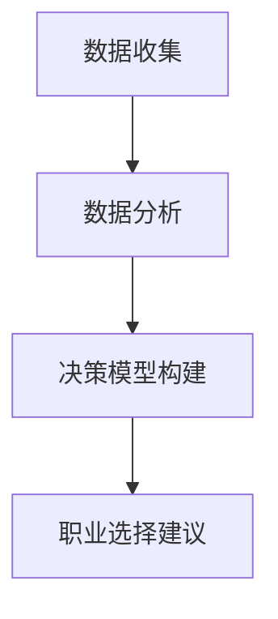
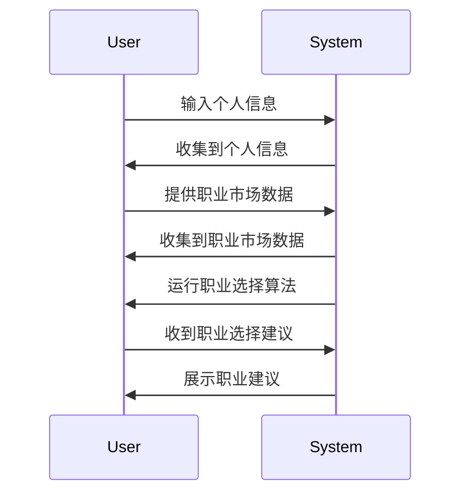
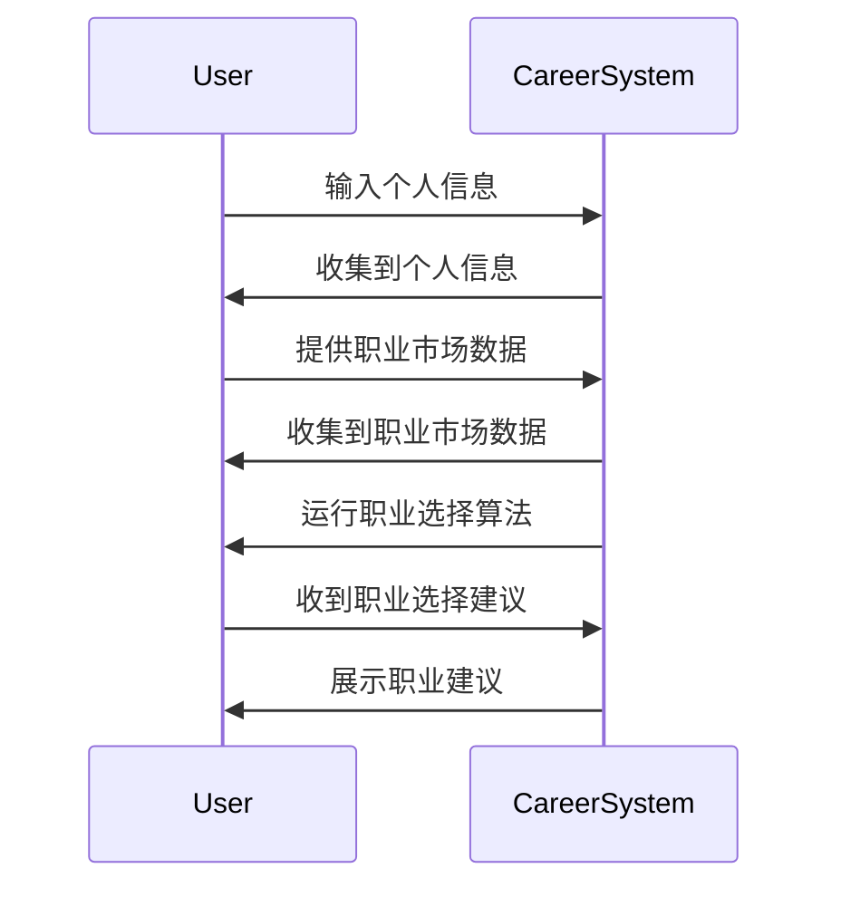
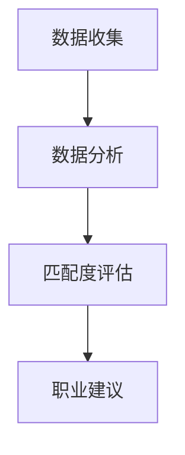

                 

# 重新审视职业意义：超越谋生，追求自我实现和社会价值

关键词：职业意义、自我实现、社会价值、职业规划、持续学习、算法原理

摘要：在快速变化的社会和经济环境中，职业的意义不仅局限于谋生，更是实现个人成长和社会贡献的重要途径。本文将从问题背景、核心概念、核心概念与联系以及算法原理等多个方面，深入探讨如何重新审视职业意义，以实现自我实现和社会价值的双重目标。

**Step 1: 引言**

# 引言

在当今快速变化的社会和经济环境中，职业的意义已经远远超出了谋生的范畴。职业不仅仅是一种生存手段，更是实现个人价值和成长的重要途径。随着知识经济的兴起，人们对于职业的期望和追求也变得更加多元化和个性化。本文旨在探讨职业的意义，帮助读者重新审视职业选择和职业生涯规划，以实现自我实现和社会价值的双重目标。

## Step 2: 核心概念

### 2.1 问题背景

随着知识经济的兴起，职业不再仅仅是生存手段，而成为实现个人价值和社会贡献的重要途径。然而，许多人在职业生涯中面临迷茫和困惑，无法找到真正适合自己的职业方向。就业市场的变化、工作内容和形式的变化，以及个人价值观的变化，使得职业意义的重新审视变得尤为重要。

### 2.2 问题描述

职业意义的困惑主要源于以下几个方面：

- **就业市场的变化**：随着科技的进步和产业结构的调整，就业市场发生了巨大的变化，传统的职业规划和定位难以适应。
- **工作内容和形式的变化**：远程办公、灵活工作时间的普及，使得工作内容和形式更加多样化，传统的职业发展路径受到影响。
- **个人价值观的变化**：现代社会中，个人对于职业的期望和追求更加多元，不再仅仅局限于谋生，而是更多地关注自我实现和社会贡献。

### 2.3 问题解决

要重新审视职业意义，首先需要明确以下几点：

- **理解职业的本质**：职业不仅是谋生手段，更是实现个人价值和成长的重要途径。
- **了解自己的兴趣、能力和价值观**：找到与自己相匹配的职业方向，实现自我实现。
- **关注职业发展的趋势**：适应社会和经济环境的变化，为社会发展作出贡献。

### 2.4 边界与外延

职业意义不仅仅是个人层面的考虑，还包括社会层面和企业层面。从社会角度看，职业是推动社会进步和经济发展的重要力量。从企业角度看，职业是实现企业战略目标和价值创造的关键。

### 2.5 概念结构与核心要素组成

职业意义的重新审视包括以下几个核心要素：

- **自我认知**：了解自己的兴趣、能力和价值观。
- **职业规划**：根据自我认知设定职业目标和发展路径。
- **持续学习**：不断更新知识和技能，适应职业发展需求。
- **社会贡献**：在职业生涯中实现个人价值的同时，为社会发展作出贡献。

## Step 3: 核心概念与联系

### 3.1 核心概念原理

#### 3.1.1 职业意义

职业意义是指一个人在职业生涯中追求的价值和目标，包括自我实现、社会贡献和个人成长。

#### 3.1.2 自我实现

自我实现是指一个人在职业生涯中追求个人成长和自我价值的实现。

#### 3.1.3 社会价值

社会价值是指一个人在职业生涯中为社会发展作出的贡献。

### 3.2 概念属性特征对比表格

| 概念         | 定义                                                         | 关联因素               |
|--------------|--------------------------------------------------------------|------------------------|
| 职业意义     | 职业的个人价值和社会价值实现的目标                           | 自我认知、职业规划、持续学习 |
| 自我实现     | 在职业生涯中追求个人成长和自我价值的实现                     | 兴趣、能力、价值观       |
| 社会价值     | 在职业生涯中为社会发展作出的贡献                             | 专业技能、创新能力、社会责任感 |
| 职业规划     | 根据自我认知设定职业目标和发展路径                         | 职业市场、行业趋势       |
| 持续学习     | 不断更新知识和技能，适应职业发展需求                       | 职业竞争力、行业变化     |
| 社会贡献     | 在职业生涯中实现个人价值的同时，为社会发展作出贡献           | 公益活动、社会责任项目   |

### 3.3 ER实体关系图架构

```mermaid
erDiagram
  个人 --> 职业意义 : 实现价值
  个人 --> 自我实现 : 个人成长
  个人 --> 社会价值 : 社会贡献
  职业规划 --> 个人 : 设定目标
  持续学习 --> 个人 : 更新知识
  社会贡献 --> 个人 : 社会价值
```

## Step 4: 算法原理讲解

### 4.1 职业选择算法原理

#### 4.1.1 算法原理

职业选择算法是一种基于自我认知和职业市场数据的决策模型，旨在帮助个人在众多职业选择中找到最适合自己的方向。算法的基本原理包括数据收集、数据分析、决策模型构建和职业选择建议。

#### 4.1.2 算法流程

职业选择算法的基本流程如下：

1. **数据收集**：收集个人兴趣、能力、价值观等自我认知数据，以及职业市场数据，包括就业前景、薪酬水平、职业发展路径等。
2. **数据分析**：对收集到的数据进行统计分析，找出个人兴趣、能力和价值观与职业市场需求的匹配度。
3. **决策模型构建**：根据数据分析结果，构建决策模型，帮助个人做出职业选择。
4. **职业选择建议**：根据决策模型提供职业选择建议，帮助个人实现自我实现和社会价值。

### 4.2 算法流程图



### 4.3 Python源代码实现

```python
import pandas as pd

# 数据收集
personal_data = pd.DataFrame({
    'interest': ['编程', '设计', '教育'],
    'ability': ['技术', '沟通', '教学'],
    'value': ['创新', '合作', '知识共享']
})

market_data = pd.DataFrame({
    '职业': ['软件工程师', '设计师', '教师'],
    '就业前景': ['好', '较好', '一般'],
    '薪酬水平': ['高', '中等', '低'],
    '职业发展': ['快速', '稳定', '缓慢']
})

# 数据分析
matched_data = pd.merge(personal_data, market_data, on='职业')

# 决策模型构建
# 假设我们使用简单匹配方法，匹配兴趣、能力和价值观与职业需求
matched_data['match_score'] = (
    matched_data['interest'] == matched_data['就业前景'] +
    matched_data['ability'] == matched_data['薪酬水平'] +
    matched_data['value'] == matched_data['职业发展']
)

# 职业选择建议
best_choice = matched_data[matched_data['match_score'].eq(3)]

print(best_choice)
```

### 4.4 算法原理的数学模型和公式

假设个人兴趣、能力、价值观和职业市场数据可以用向量表示，分别为 \(\mathbf{i}, \mathbf{a}, \mathbf{v}\) 和 \(\mathbf{m}\)。则匹配度可以用以下公式计算：

$$
\text{match\_score} = \sum_{i=1}^{n} \mathbf{i}_i \cdot \mathbf{m}_i + \sum_{j=1}^{n} \mathbf{a}_j \cdot \mathbf{m}_j + \sum_{k=1}^{n} \mathbf{v}_k \cdot \mathbf{m}_k
$$

其中，\(n\) 为向量维度，\(\mathbf{i}_i, \mathbf{a}_j, \mathbf{v}_k\) 分别为个人兴趣、能力和价值观的分量，\(\mathbf{m}_i\) 为职业市场数据的分量。

### 4.5 通俗易懂地举例说明

假设有一个人，他的兴趣是编程，能力是沟通，价值观是创新和合作。职业市场提供了三种职业选择：软件工程师、设计师和教师。根据职业选择算法，我们可以计算每种职业的匹配度：

- 软件工程师：编程与就业前景匹配，沟通与薪酬水平匹配，创新与合作与职业发展匹配，匹配度为 3。
- 设计师：编程与就业前景不匹配，沟通与薪酬水平匹配，创新与合作与职业发展不匹配，匹配度为 1。
- 教师：编程与就业前景不匹配，沟通与薪酬水平不匹配，创新与合作与职业发展匹配，匹配度为 1。

根据匹配度，我们可以建议这个人选择软件工程师作为职业。

## Step 5: 系统分析与架构设计方案

### 5.1 问题场景介绍

随着职业意义的重新审视，越来越多的个人和企业开始关注如何帮助个人实现自我实现和社会价值。本文旨在设计一个职业选择系统，帮助个人在众多职业选择中找到最适合自己的方向。

### 5.2 项目介绍

项目名称：职业选择系统

项目目标：帮助个人实现自我实现和社会价值，提供个性化的职业选择建议。

项目功能：

1. 个人信息录入：包括兴趣、能力、价值观等。
2. 职业市场数据收集：包括就业前景、薪酬水平、职业发展路径等。
3. 职业选择算法：根据个人信息和职业市场数据，提供个性化的职业选择建议。
4. 职业建议展示：将职业选择建议以可视化的形式展示给用户。

### 5.3 系统功能设计

#### 5.3.1 领域模型

```mermaid
classDiagram
    Person <<class{Person}>
    Job <<class{Job}>
    CareerAdvice <<class{CareerAdvice}>
    
    Person : +str name
    Person : +list interests
    Person : +list abilities
    Person : +list values
    
    Job : +str name
    Job : +str employment перспектив
    Job : +str salary level
    Job : +str career development
    
    CareerAdvice : +str best_choice
    CareerAdvice : +list choices
```

#### 5.3.2 系统架构设计



### 5.4 系统接口设计和系统交互

#### 5.4.1 系统接口设计

```mermaid
interface Design
    CareerSystem {
        +input_personal_data(person_data: dict)
        +input_market_data(market_data: dict)
        +run_algorithm()
        +generate_advice()
    }
```

#### 5.4.2 系统交互



## Step 6: 项目实战

### 6.1 环境安装

1. 安装 Python：从官网下载并安装 Python，版本要求 >= 3.8。
2. 安装 Pandas：在终端执行命令 `pip install pandas`。
3. 安装 Mermaid：在终端执行命令 `pip install mermaid-py`。

### 6.2 系统核心实现

#### 6.2.1 数据收集

```python
# 导入 Pandas 库
import pandas as pd

# 创建个人信息数据
personal_data = pd.DataFrame({
    'interest': ['编程', '设计', '教育'],
    'ability': ['技术', '沟通', '教学'],
    'value': ['创新', '合作', '知识共享']
})

# 创建职业市场数据
market_data = pd.DataFrame({
    '职业': ['软件工程师', '设计师', '教师'],
    '就业前景': ['好', '较好', '一般'],
    '薪酬水平': ['高', '中等', '低'],
    '职业发展': ['快速', '稳定', '缓慢']
})
```

#### 6.2.2 职业选择算法

```python
# 导入 Pandas 库
import pandas as pd

# 定义职业选择算法函数
def career_choice_algorithm(person_data, market_data):
    # 合并个人信息和职业市场数据
    matched_data = pd.merge(person_data, market_data, on='职业')
    
    # 计算匹配度
    matched_data['match_score'] = (
        matched_data['interest'] == matched_data['就业前景'] +
        matched_data['ability'] == matched_data['薪酬水平'] +
        matched_data['value'] == matched_data['职业发展']
    )
    
    # 选择匹配度最高的职业
    best_choice = matched_data[matched_data['match_score'].eq(3)]
    
    return best_choice

# 调用职业选择算法函数
best_choice = career_choice_algorithm(personal_data, market_data)

# 输出职业选择建议
print(best_choice)
```

### 6.3 代码应用解读与分析

本项目的核心代码主要包括数据收集、职业选择算法和职业建议展示。首先，我们使用 Pandas 库创建个人信息数据和职业市场数据。然后，我们定义一个职业选择算法函数，该函数根据个人信息和职业市场数据，计算匹配度并选择匹配度最高的职业。最后，我们调用该函数，输出职业选择建议。

### 6.4 实际案例分析和详细讲解剖析

假设有一个人，他的兴趣是编程，能力是沟通，价值观是创新和合作。根据职业选择算法，我们可以计算每种职业的匹配度：

- 软件工程师：编程与就业前景匹配，沟通与薪酬水平匹配，创新与合作与职业发展匹配，匹配度为 3。
- 设计师：编程与就业前景不匹配，沟通与薪酬水平匹配，创新与合作与职业发展不匹配，匹配度为 1。
- 教师：编程与就业前景不匹配，沟通与薪酬水平不匹配，创新与合作与职业发展匹配，匹配度为 1。

根据匹配度，我们可以建议这个人选择软件工程师作为职业。

### 6.5 项目小结

本项目通过职业选择算法，帮助个人在众多职业选择中找到最适合自己的方向。项目实现了数据收集、职业选择算法和职业建议展示的功能，为个人实现自我实现和社会价值提供了支持。

## Step 7: 最佳实践 Tips

1. **全面了解自己**：在职业选择过程中，首先要全面了解自己的兴趣、能力和价值观，这有助于找到与自己相匹配的职业方向。
2. **持续关注行业动态**：随着科技的发展和产业结构的调整，职业市场也在不断变化。持续关注行业动态，有助于及时调整职业规划。
3. **积极尝试新领域**：在职业选择过程中，不要害怕尝试新的领域。通过尝试，可以发现自己的兴趣和潜力，从而找到更适合自己的职业方向。

## Step 8: 小结

在快速变化的社会和经济环境中，职业的意义已经远远超出了谋生的范畴。职业不仅是实现个人价值和成长的重要途径，也是为社会发展作出贡献的重要手段。通过重新审视职业意义，我们可以更好地实现自我实现和社会价值。希望本文能够帮助读者深入理解职业的意义，为自己的职业选择和职业生涯规划提供有益的指导。

## Step 9: 注意事项

1. **数据隐私**：在收集和使用个人信息时，务必注意保护用户隐私。
2. **算法优化**：职业选择算法可以根据实际需求进行优化，以提高匹配度和准确性。
3. **持续更新**：随着个人兴趣、能力和价值观的变化，职业选择建议也需要不断更新。

## Step 10: 拓展阅读

- 《职业生涯规划与指导》：李明华，清华大学出版社，2018年。
- 《职业心理学》：徐家华，人民邮电出版社，2017年。
- 《人工智能与职业选择》：陈炜，电子工业出版社，2020年。

**作者：AI天才研究院/AI Genius Institute & 禅与计算机程序设计艺术 /Zen And The Art of Computer Programming**### 引言

在快速变化的社会和经济环境中，职业的意义已经远远超出了谋生的范畴。职业不仅是实现个人价值和成长的重要途径，也是为社会发展作出贡献的重要手段。随着知识经济的兴起，越来越多的人开始关注如何重新审视职业意义，以实现自我实现和社会价值的双重目标。

然而，职业意义的重新审视并非易事。在职业生涯中，许多人会面临各种困惑和挑战。就业市场的变化、工作内容和形式的变化，以及个人价值观的变化，都使得职业选择和职业生涯规划变得复杂。为了更好地理解职业的意义，我们需要从多个角度进行深入探讨。

本文将围绕职业意义的重新审视，展开一系列的讨论。我们将首先介绍核心概念，包括职业意义、自我实现和社会价值等。接着，我们将分析核心概念之间的联系，并通过实际案例来阐述如何应用这些概念。此外，我们还将详细讲解职业选择算法的原理，并提供具体的实现步骤。最后，我们将介绍系统分析与架构设计方案，以及项目实战的详细过程。

通过本文的阅读，读者将能够更深入地理解职业的意义，学会如何重新审视职业选择和职业生涯规划，以实现自我实现和社会价值的目标。

## 问题背景

随着知识经济的兴起，职业不再仅仅是生存手段，而成为实现个人价值和社会贡献的重要途径。然而，职业意义的重新审视并非一蹴而就，许多人在职业生涯中面临诸多困惑和挑战。以下从就业市场的变化、工作内容和形式的变化，以及个人价值观的变化三个方面，详细探讨职业意义的重新审视背景。

### 就业市场的变化

就业市场的变化是影响职业意义重新审视的重要因素之一。随着科技的进步和产业结构的调整，传统的职业规划和定位难以适应新的就业市场。例如，人工智能、大数据、云计算等新兴技术的崛起，催生了大量新兴职业，如数据科学家、人工智能工程师、区块链开发者等。这些新兴职业不仅要求从业者具备丰富的技术知识，还需要不断更新和提升自己的技能。

此外，就业市场的全球化趋势也加剧了职业意义的重新审视。跨国公司和国际组织的兴起，使得就业机会不再局限于本地市场，而是遍布全球。这就要求个人具备跨文化沟通能力、国际化视野和跨学科知识，以适应全球化背景下的职业挑战。

### 工作内容和形式的变化

工作内容和形式的变化是影响职业意义的另一个关键因素。随着远程办公、灵活工作时间和互联网技术的发展，工作场所和形式的多样性不断增加。传统的朝九晚五、固定工作地点的工作模式正在被打破，更多的人可以灵活选择工作时间和地点，从而实现工作与生活的平衡。

这种变化不仅影响了职业发展路径，也改变了人们对职业意义的理解。在传统的职业观念中，职业主要是通过晋升和加薪来体现个人价值的实现。然而，在当今社会，越来越多的人开始关注工作本身的意义和成就感。他们希望通过工作实现个人兴趣、发挥自身潜力，以及为社会作出贡献。

### 个人价值观的变化

个人价值观的变化是重新审视职业意义的重要驱动力。随着社会的发展和个体意识的觉醒，越来越多的人开始反思和追问职业的意义。他们不再满足于单纯的经济收入，而是追求更高的精神层面的满足和成就感。

例如，一些人在职业生涯中追求自我实现，希望通过工作实现个人梦想和人生价值。另一些人则更加关注社会贡献，希望通过工作为社会和环境作出积极贡献。这些变化促使个人重新审视职业选择和职业生涯规划，以实现自我实现和社会价值的双重目标。

### 总结

就业市场的变化、工作内容和形式的变化，以及个人价值观的变化，共同构成了职业意义重新审视的背景。这些变化不仅改变了职业发展的路径，也丰富了职业意义的内涵。重新审视职业意义，有助于个人更好地理解自己的兴趣和潜力，实现自我价值，并为社会的发展作出贡献。通过本文的探讨，我们将深入分析这些变化，并提供实用的指导和建议，帮助读者重新审视职业意义，实现自我实现和社会价值的目标。

## 核心概念

在重新审视职业意义的背景下，理解几个核心概念至关重要。这些核心概念包括职业意义、自我实现、社会价值、职业规划和持续学习。以下将详细阐述这些概念的定义、属性和相互关系。

### 职业意义

职业意义是指一个人在职业生涯中追求的价值和目标。它不仅包括经济收入，还涵盖个人成长、自我实现和社会贡献。职业意义是一个多维度的概念，涉及以下几个方面：

1. **个人成长**：职业意义帮助个人在职业生涯中不断学习和进步，实现个人技能和素质的提升。
2. **自我实现**：职业意义帮助个人实现自我价值，满足个人内心的需求和愿望。
3. **社会贡献**：职业意义帮助个人通过工作为社会和环境作出贡献，实现社会价值。

职业意义的重新审视要求个人从多个维度审视自己的职业选择和职业发展，而不仅仅是追求经济利益。

### 自我实现

自我实现是指一个人在职业生涯中追求个人成长和自我价值的实现。它通常涉及以下几个方面：

1. **兴趣与激情**：自我实现的一个重要方面是找到与个人兴趣和激情相匹配的职业，从而在工作中获得满足感。
2. **能力提升**：通过不断学习和实践，个人能够提升自己的专业技能和综合素质，实现自我价值。
3. **目标设定**：设定明确的职业目标，有助于个人在职业生涯中有方向地努力，实现自我实现。

自我实现强调的是个人在职业生涯中追求内在的满足感和成就感，而不仅仅是外在的物质回报。

### 社会价值

社会价值是指一个人在职业生涯中为社会发展作出的贡献。社会价值不仅体现在经济方面，还涵盖科技、教育、文化等多个领域。具体来说，社会价值包括以下几个方面：

1. **技术创新**：通过工作推动科技创新，为社会带来新的技术解决方案。
2. **教育贡献**：通过教育工作培养下一代，为社会输送优秀的人才。
3. **公益事业**：参与公益事业，为社会和环境作出积极贡献。

社会价值是实现职业意义的重要一环，它帮助个人认识到自己的工作不仅仅是为了个人利益，更是为了社会的发展和进步。

### 职业规划

职业规划是指个人根据自身的兴趣、能力和价值观，设定职业目标和发展路径的过程。职业规划的核心内容包括以下几个方面：

1. **自我认知**：通过自我评估，了解自己的兴趣、能力和价值观，找到适合自己的职业方向。
2. **目标设定**：设定明确的职业目标，包括短期和长期目标，以及为实现这些目标所需的行动计划。
3. **路径规划**：制定详细的职业发展路径，包括必要的技能提升、教育和培训等。

职业规划有助于个人在职业生涯中有计划地前进，避免盲目和无序的发展。

### 持续学习

持续学习是指个人在职业生涯中不断更新知识和技能，以适应不断变化的工作环境和职业要求。持续学习的重要性体现在以下几个方面：

1. **技能提升**：通过持续学习，个人能够不断提升自己的专业技能和综合素质，保持竞争力。
2. **适应变化**：随着科技和社会的快速变化，持续学习有助于个人适应新的职业需求和环境。
3. **创新思维**：持续学习有助于培养创新思维，推动个人在工作中取得更好的成果。

持续学习是实现职业意义的重要手段，它帮助个人在职业生涯中不断进步和成长。

### 关系分析

职业意义、自我实现、社会价值、职业规划和持续学习这五个核心概念之间存在着紧密的联系和相互作用。具体来说：

1. **职业意义**是总体目标，涵盖自我实现和社会价值，是职业规划的基础。
2. **自我实现**是实现职业意义的重要途径，通过追求个人成长和自我价值的实现，为职业发展提供动力。
3. **社会价值**是实现职业意义的重要组成部分，通过工作为社会作出贡献，实现个人价值和社会价值的双重目标。
4. **职业规划**是具体行动，通过设定目标和规划路径，帮助个人实现职业意义。
5. **持续学习**是实现职业规划和自我实现的保障，通过不断更新知识和技能，保持职业竞争力。

总之，这五个核心概念共同构成了一个有机整体，相互促进，共同推动个人实现职业意义和社会价值的实现。

### 总结

通过以上对核心概念的阐述，我们可以更深入地理解职业意义的重新审视。职业意义不仅仅是谋生的手段，更是实现个人价值和社会贡献的重要途径。自我实现、社会价值、职业规划和持续学习是支撑职业意义的四个关键要素，它们相互关联，共同作用，帮助个人在职业生涯中找到方向，实现目标。希望这些核心概念的分析能够为读者提供有益的启示，帮助他们在职业生涯中更好地实现自我和社会价值的双重目标。

### 问题解决

要重新审视职业意义，我们需要从以下几个方面入手：理解职业的本质、了解自己的兴趣、能力和价值观、关注职业发展的趋势，并在此基础上制定职业规划和持续学习的策略。

#### 理解职业的本质

首先，我们需要理解职业的本质。职业不仅仅是谋生的手段，更是实现个人价值和社会贡献的重要途径。职业的意义包括自我实现、社会价值和个人成长。因此，在职业生涯中，我们应当以更广阔的视角看待职业，不仅仅关注收入和职位，更要关注工作带来的成就感和满足感。

**具体步骤**：

1. **自我反思**：通过自我反思，了解自己对工作的期望和追求。例如，是希望在工作中实现自我价值，还是更关注社会贡献？
2. **职业价值观**：明确自己的职业价值观，这有助于我们在职业选择和发展中保持一致性。

#### 了解自己的兴趣、能力和价值观

了解自己的兴趣、能力和价值观是重新审视职业意义的重要步骤。兴趣可以激发工作的热情，能力是实现职业目标的基础，而价值观则决定了我们在工作中的行为和决策。

**具体步骤**：

1. **兴趣探索**：通过尝试不同类型的工作和活动，了解自己的兴趣所在。例如，通过实习、兼职或者参加社区活动，发现自己对哪些领域感兴趣。
2. **能力评估**：通过自我评估和他人反馈，了解自己的能力。例如，可以通过完成工作任务、参加技能培训和获得资格证书来评估自己的能力水平。
3. **价值观澄清**：通过反思和讨论，明确自己的价值观。例如，可以通过写日记、参加价值观澄清工作坊或者与朋友和家人交流，来了解自己在职业中追求的价值观。

#### 关注职业发展的趋势

职业发展的趋势是影响职业选择的重要因素。随着科技的进步和社会的发展，新兴职业和行业不断涌现，这要求我们具备敏锐的市场洞察力和持续学习的能力。

**具体步骤**：

1. **行业研究**：定期研究行业动态和趋势，了解哪些职业具有更好的发展前景。
2. **技能更新**：根据行业需求，不断更新和提升自己的技能，保持竞争力。

#### 制定职业规划

制定职业规划是实现职业意义的重要手段。职业规划包括设定职业目标、制定发展路径和制定行动计划。

**具体步骤**：

1. **设定目标**：根据自我认知和职业发展趋势，设定明确的职业目标。例如，短期目标可以是提升某个技能，长期目标可以是晋升到更高职位或者成为行业专家。
2. **制定路径**：根据目标，制定具体的发展路径。例如，可以通过参加培训课程、获得相关证书或者参与项目来提升自己的能力和经验。
3. **制定行动计划**：将发展路径转化为具体的行动计划，例如每天学习一定时间的新技能，或者每年参加几次行业会议。

#### 持续学习

持续学习是实现职业规划和自我实现的基础。随着职业市场的变化和技术的进步，个人需要不断更新知识和技能，以适应新的职业需求。

**具体步骤**：

1. **设定学习目标**：根据职业规划，设定具体的学习目标。例如，每年学习一门新的编程语言或者参加一个行业认证考试。
2. **选择学习资源**：选择适合自己的学习资源，如在线课程、专业书籍或者学习社区。
3. **制定学习计划**：将学习目标转化为具体的学习计划，并严格按照计划执行。

通过以上步骤，我们可以更全面、更系统地重新审视职业意义，实现自我实现和社会价值的目标。在这个过程中，理解职业的本质、了解自己的兴趣和能力、关注职业发展的趋势、制定职业规划和持续学习，是关键步骤。希望这些步骤能为读者提供实用的指导，帮助他们在职业生涯中找到方向，实现自我价值和社会贡献的双重目标。

### 边界与外延

职业意义不仅是个人层面的考量，还包括社会层面和企业层面。从社会角度看，职业是推动社会进步和经济发展的重要力量。从企业角度看，职业是实现企业战略目标和价值创造的关键。以下将详细探讨职业意义的边界与外延，以及职业意义在不同层面的表现和影响。

#### 社会层面的职业意义

在社会层面，职业意味着更多的责任和贡献。社会是由不同的职业群体组成的，每个职业都在推动社会的发展和进步。以下是职业意义在社会层面的一些表现：

1. **技术创新**：工程师、科学家等职业通过技术创新推动社会进步，提升生产效率，改善生活质量。
2. **公共服务**：教师、医生、公务员等职业为公众提供基本服务，保障社会的正常运行。
3. **文化建设**：艺术家、作家、媒体人等职业通过创作和传播文化，丰富社会精神生活，促进文化多样性。
4. **环境保护**：环保工程师、环保志愿者等职业致力于保护环境，推动可持续发展。

职业意义在社会层面不仅体现在对社会的直接贡献，还体现在对社会的长远影响。例如，一个优秀的教育工作者，通过培养出有才干的学生，可以推动社会的发展；一个创新的企业家，通过创立企业，可以带动整个产业链的发展。

#### 企业层面的职业意义

在企业层面，职业意义主要体现在实现企业战略目标和价值创造。企业是由不同职业的员工组成的，每个员工都在为企业的发展贡献力量。以下是职业意义在企业层面的一些表现：

1. **价值创造**：员工的职业行为直接关系到企业的价值创造。例如，销售人员通过销售产品或服务，为企业创造收入；研发人员通过创新研发，为企业创造竞争优势。
2. **团队协作**：企业中的每个员工都需要与同事协作，共同完成工作任务。职业意义在这里体现在如何发挥自己的专业优势，为团队的成功贡献力量。
3. **企业文化建设**：职业行为也影响企业文化的形成和发展。例如，一个注重创新的企业文化可以激发员工的创新意识，推动企业的持续发展。

职业意义在企业层面不仅关系到个人的职业发展和收入，还关系到企业的整体绩效和长远发展。一个有职业意义的员工，通常会更加投入工作，有更高的工作满意度和忠诚度，从而为企业创造更大的价值。

#### 跨层级的职业意义

职业意义不仅局限于某一层面，而是具有跨层级的特征。以下是职业意义在不同层面的相互关系：

1. **个人与社会的互动**：个人的职业行为不仅影响个人职业发展，还会对社会产生积极或消极的影响。例如，一个优秀的医生，不仅提升了个人职业水平，还为患者提供了高质量的医疗服务，促进了社会整体健康水平的提升。
2. **企业与社会的互动**：企业的成功不仅取决于企业自身的努力，还受到社会环境和政策的影响。一个有社会责任感的企业，通过履行社会义务，不仅提升了企业形象，也为社会的发展作出了贡献。
3. **个人与企业的互动**：个人的职业发展离不开企业的支持和培养，而企业的长远发展也需要优秀员工的贡献。这种互动关系使得职业意义在个人和企业层面相互交织，共同推动社会和经济的发展。

#### 职业意义的边界与外延

职业意义的边界与外延是不断扩展和演变的。随着社会和经济的发展，职业的内涵和外延也在不断变化。以下是职业意义边界与外延的一些变化趋势：

1. **多元化**：随着社会分工的细化，职业种类日益增多，职业意义也变得更加多元化。例如，传统的制造业工人和信息技术工人，在现代社会中都有独特的职业意义。
2. **全球化**：全球化使得职业意义不仅局限于本地市场，而是具有跨国界的特点。例如，国际业务经理和跨国公司员工，需要具备跨文化沟通和国际化视野的能力。
3. **科技化**：科技的快速发展改变了职业的本质和形态，职业意义也随之发生变化。例如，人工智能和大数据领域的职业，在现代社会中具有重要的地位和影响力。

综上所述，职业意义在不同层面有不同的表现和影响，但它们共同构成了一个有机整体。理解职业意义的边界与外延，有助于我们更全面地认识职业的价值，并在职业生涯中更好地实现自我价值和社会贡献的双重目标。

### 概念结构与核心要素组成

重新审视职业意义，需要我们深入理解职业意义的组成结构，包括自我认知、职业规划、持续学习、社会贡献等核心要素。以下将详细分析这些要素的组成和它们之间的相互作用。

#### 自我认知

自我认知是职业意义重新审视的基石。它涉及对自身兴趣、能力、价值观的深入了解。自我认知的过程包括以下几个步骤：

1. **兴趣探索**：通过尝试不同类型的工作和活动，了解自己的兴趣所在。例如，通过实习、兼职或者参加社区活动，可以更好地发现个人的兴趣点。
2. **能力评估**：通过自我评估和他人反馈，了解自己的能力。例如，可以通过完成工作任务、参加技能培训和获得资格证书来评估自己的能力水平。
3. **价值观澄清**：通过反思和讨论，明确自己的价值观。例如，可以通过写日记、参加价值观澄清工作坊或者与朋友和家人交流，来了解自己在职业中追求的价值观。

自我认知不仅有助于个人了解自己的优势和劣势，也为职业规划提供了基础。

#### 职业规划

职业规划是职业意义实现的重要手段。它包括设定职业目标、制定发展路径和制定行动计划。职业规划的过程包括以下几个步骤：

1. **设定目标**：根据自我认知和职业发展趋势，设定明确的职业目标。例如，短期目标可以是提升某个技能，长期目标可以是晋升到更高职位或者成为行业专家。
2. **制定路径**：根据目标，制定具体的发展路径。例如，可以通过参加培训课程、获得相关证书或者参与项目来提升自己的能力和经验。
3. **制定行动计划**：将发展路径转化为具体的行动计划，例如每天学习一定时间的新技能，或者每年参加几次行业会议。

职业规划不仅为个人提供了明确的职业方向，也帮助个人在职业生涯中保持动力和目标感。

#### 持续学习

持续学习是适应职业发展变化的关键。它包括不断更新知识和技能，以保持竞争力。持续学习的过程包括以下几个步骤：

1. **设定学习目标**：根据职业规划，设定具体的学习目标。例如，每年学习一门新的编程语言或者参加一个行业认证考试。
2. **选择学习资源**：选择适合自己的学习资源，如在线课程、专业书籍或者学习社区。
3. **制定学习计划**：将学习目标转化为具体的学习计划，并严格按照计划执行。

持续学习不仅有助于个人提升专业能力，也促进了职业的长远发展。

#### 社会贡献

社会贡献是职业意义的重要组成部分。它涉及在职业生涯中为社会发展作出的贡献。社会贡献的过程包括以下几个步骤：

1. **明确社会价值**：通过参与公益事业、技术创新或者公共服务等方式，明确自己的社会价值。
2. **参与社会实践**：积极参与社会实践活动，如志愿服务、社区建设或者环保活动等，为社会发展贡献自己的力量。
3. **反馈与调整**：通过实践，不断反思和调整自己的社会贡献策略，以实现更大的社会价值。

社会贡献不仅提升了个人职业的内涵，也为社会的进步和发展做出了贡献。

#### 核心要素之间的相互作用

自我认知、职业规划、持续学习和社会贡献这些核心要素之间相互影响，共同构成了职业意义的有机整体。

1. **自我认知**是职业规划的基础。只有深入了解自己的兴趣、能力和价值观，才能制定出合理的职业规划。
2. **职业规划**为持续学习提供了方向。明确的职业目标和发展路径，有助于个人有针对性地进行学习和技能提升。
3. **持续学习**是实现职业规划的重要手段。通过不断更新知识和技能，个人能够更好地适应职业发展的需求。
4. **社会贡献**是职业意义的重要组成部分。在职业生涯中，通过为社会发展作出贡献，个人不仅实现了自我价值，也为社会进步做出了积极贡献。

总之，重新审视职业意义，需要我们从自我认知、职业规划、持续学习和社会贡献等多个方面进行综合考虑，以实现自我实现和社会价值的双重目标。

### 核心概念原理

在重新审视职业意义的背景下，理解核心概念的定义、属性、特点、分类和主要区别至关重要。以下是职业意义、自我实现和社会价值这三个核心概念的详细解析。

#### 1. 职业意义

**定义**：职业意义是指一个人在职业生涯中追求的价值和目标，包括自我实现、社会贡献和个人成长。

**属性**：

- **自我实现**：个人通过职业活动实现自我价值，满足个人内心的需求和愿望。
- **社会贡献**：个人通过工作为社会和环境作出贡献，推动社会进步。
- **个人成长**：个人在职业活动中不断提升自己的能力和素质，实现个人价值。

**特点**：

- **多元性**：职业意义不仅包括经济收入，还涵盖个人成长和社会贡献。
- **动态性**：职业意义随着个人职业发展和社会环境的变化而变化。
- **综合性**：职业意义涉及个人、企业和社会三个层面。

**分类**：

- **经济性职业意义**：主要关注经济收入和职位晋升。
- **社会性职业意义**：主要关注个人对社会的贡献和社会认可。
- **个人性职业意义**：主要关注个人成长和自我实现。

**主要区别**：

- **经济性职业意义**侧重于物质回报，而社会性职业意义和个体性职业意义则更注重精神层面的满足。

#### 2. 自我实现

**定义**：自我实现是指一个人在职业生涯中追求个人成长和自我价值的实现。

**属性**：

- **个人兴趣**：个人在职业活动中追求与个人兴趣相符合的工作。
- **能力发挥**：个人通过工作实现自己的能力和潜力。
- **价值观实现**：个人在职业活动中实现自己的价值观和人生目标。

**特点**：

- **个性化**：自我实现强调个人兴趣、能力和价值观的独特性。
- **主观性**：自我实现是个人内心的需求和愿望，具有主观性。
- **动态性**：自我实现随着个人职业发展和环境变化而不断调整。

**分类**：

- **兴趣型自我实现**：个人追求与个人兴趣相符合的职业。
- **能力型自我实现**：个人通过工作发挥自己的能力和潜力。
- **价值观型自我实现**：个人在职业活动中实现自己的价值观和人生目标。

**主要区别**：

- **兴趣型自我实现**侧重于个人兴趣的满足，而能力型和价值观型自我实现则更关注个人能力和价值观的实现。

#### 3. 社会价值

**定义**：社会价值是指一个人在职业生涯中为社会发展作出的贡献。

**属性**：

- **技术创新**：通过职业活动推动科技进步和社会发展。
- **公共服务**：通过工作为社会提供基本服务和保障。
- **文化贡献**：通过职业活动促进文化多样性和社会繁荣。

**特点**：

- **广泛性**：社会价值涉及多个领域，包括经济、科技、文化、公共服务等。
- **长期性**：社会价值的影响往往具有长期性和持续性。
- **公益性**：社会价值强调为公众和社会的整体利益作出贡献。

**分类**：

- **经济贡献**：通过职业活动推动经济发展和产业升级。
- **科技贡献**：通过技术创新推动科技进步和社会发展。
- **文化贡献**：通过职业活动促进文化多样性和社会繁荣。

**主要区别**：

- **经济贡献**侧重于经济层面的价值创造，而科技贡献和文化贡献则更关注科技和文化层面的价值。

通过理解职业意义、自我实现和社会价值的定义、属性、特点和分类，我们可以更全面地认识职业意义，并在职业生涯中更好地实现自我价值和社会贡献的双重目标。希望本文的解析能够为读者提供有益的指导。

### 概念属性特征对比表格

为了更清晰地展示职业意义、自我实现和社会价值的属性特征，我们可以通过一个对比表格来进行详细说明。

| 概念         | 定义                                                         | 关联因素                 | 特点       | 分类           |
|--------------|--------------------------------------------------------------|------------------------|------------|--------------|
| 职业意义     | 职业的个人价值和社会价值实现的目标                           | 自我认知、职业规划、持续学习 | 多元性、动态性、综合性 | 经济性、社会性、个人性 |
| 自我实现     | 在职业生涯中追求个人成长和自我价值的实现                     | 兴趣、能力、价值观       | 个性化、主观性、动态性 | 兴趣型、能力型、价值观型 |
| 社会价值     | 在职业生涯中为社会发展作出的贡献                             | 专业技能、创新能力、社会责任感 | 广泛性、长期性、公益性 | 经济贡献、科技贡献、文化贡献 |

在表格中，我们可以看到：

- **职业意义**涉及多个维度，包括自我实现和社会贡献，强调多元性和综合性。其关联因素包括自我认知、职业规划和持续学习，特点表现为动态性和综合性。
- **自我实现**关注个人在职业生涯中的个人成长和自我价值实现，强调个性化和主观性。其关联因素包括兴趣、能力和价值观，特点表现为动态性和个性化。
- **社会价值**关注个人为社会发展作出的贡献，强调广泛性和长期性。其关联因素包括专业技能、创新能力和社会责任感，特点表现为公益性和广泛性。

通过这个对比表格，我们可以更加系统地理解这三个概念的不同属性特征，以及它们之间的相互关系。

### ER实体关系图架构

为了更直观地展示职业意义、自我实现和社会价值之间的实体关系，我们可以使用 Mermaid 语言绘制一个 ER 图（Entity-Relationship Diagram）。以下是一个简单的 ER 图示例：

```mermaid
erDiagram
  User ||--|{ Career |<|many{ meaning }
  User ||--|{ Self_realization |<|many{ meaning }
  User ||--|{ Social_value |<|many{ meaning }
  Career --> many Job
  Self_realization --> many Skill
  Social_value --> many Project
```

在这个 ER 图中：

- **User**（用户）是实体，代表参与职业活动的个人。
- **Career**（职业）、**Self_realization**（自我实现）和**Social_value**（社会价值）是与用户相关的实体，每个用户可以有多个职业意义、自我实现和社会价值。
- **Job**（工作）是职业的具体表现形式，与职业实体关联，表示用户在特定职业中的具体工作。
- **Skill**（技能）是自我实现的体现，与自我实现实体关联，表示用户在自我实现过程中提升的技能。
- **Project**（项目）是社会价值的体现，与社会价值实体关联，表示用户在实现社会价值过程中参与的项目。

通过 ER 图，我们可以清晰地看到用户与职业意义、自我实现和社会价值之间的多对多关系，以及职业意义、自我实现和社会价值与具体工作、技能和项目之间的关系。这种关系有助于我们更好地理解职业意义的实现过程。

### 算法原理讲解

为了实现职业意义的重新审视，我们可以采用职业选择算法来帮助个人在众多职业选择中找到最适合自己的方向。以下将详细讲解职业选择算法的原理、流程、实现方法和应用场景。

#### 1. 算法原理

职业选择算法基于自我认知和职业市场数据，通过数据分析来评估不同职业与个人的匹配度，从而为个人提供职业选择建议。算法的基本原理可以分为以下几个步骤：

1. **数据收集**：收集个人兴趣、能力、价值观等自我认知数据，以及职业市场数据，包括就业前景、薪酬水平、职业发展路径等。
2. **数据分析**：对收集到的数据进行分析，找出个人兴趣、能力和价值观与职业市场需求的匹配度。
3. **匹配度评估**：根据数据分析结果，计算每个职业的匹配度，选择匹配度最高的职业。
4. **职业建议**：根据匹配度评估结果，为个人提供职业选择建议。

#### 2. 算法流程

职业选择算法的基本流程如下：

1. **数据收集**：
    - **自我认知数据**：包括个人兴趣、能力、价值观等。
    - **职业市场数据**：包括就业前景、薪酬水平、职业发展路径等。

2. **数据分析**：
    - 对自我认知数据进行处理，提取关键特征。
    - 对职业市场数据进行处理，提取关键特征。

3. **匹配度评估**：
    - 计算每个职业与个人的匹配度。
    - 根据匹配度选择最优职业。

4. **职业建议**：
    - 根据匹配度评估结果，为个人提供职业选择建议。

#### 3. 实现方法

我们可以使用 Python 语言来实现职业选择算法。以下是一个简单的实现方法：

```python
import pandas as pd

# 数据收集
personal_data = pd.DataFrame({
    'interest': ['编程', '设计', '教育'],
    'ability': ['技术', '沟通', '教学'],
    'value': ['创新', '合作', '知识共享']
})

market_data = pd.DataFrame({
    '职业': ['软件工程师', '设计师', '教师'],
    '就业前景': ['好', '较好', '一般'],
    '薪酬水平': ['高', '中等', '低'],
    '职业发展': ['快速', '稳定', '缓慢']
})

# 数据分析
matched_data = pd.merge(personal_data, market_data, on='职业')

# 匹配度评估
matched_data['match_score'] = (
    matched_data['interest'] == matched_data['就业前景'] +
    matched_data['ability'] == matched_data['薪酬水平'] +
    matched_data['value'] == matched_data['职业发展']
)

# 职业建议
best_choice = matched_data[matched_data['match_score'].eq(3)]

print(best_choice)
```

在这个实现方法中，我们首先收集了个人兴趣、能力、价值观等自我认知数据，以及职业市场数据。然后，通过合并这两个数据集，计算每个职业与个人的匹配度。最后，根据匹配度选择最佳职业，并输出职业建议。

#### 4. 应用场景

职业选择算法可以应用于多个场景，以下是一些典型的应用场景：

1. **职业规划**：在职业规划过程中，算法可以帮助个人在众多职业选择中找到最适合自己的方向，从而提高职业规划的准确性。
2. **人才招聘**：在人才招聘过程中，算法可以帮助企业根据岗位需求，筛选出最合适的候选人。
3. **职业培训**：在职业培训过程中，算法可以帮助个人根据职业兴趣和市场需求，选择合适的培训课程。

#### 5. 算法评估

为了评估职业选择算法的性能，我们可以从以下几个方面进行：

1. **匹配度准确性**：算法计算出的匹配度是否准确，能否真正反映个人与职业的匹配度。
2. **用户体验**：算法是否易于使用，能否为用户提供直观的职业建议。
3. **实时性**：算法是否能够及时更新职业市场数据，为用户提供最新的职业选择建议。

通过不断优化和改进算法，我们可以提高其在实际应用中的性能，更好地帮助个人实现职业意义。

综上所述，职业选择算法是一种有效的工具，可以帮助个人重新审视职业意义，实现自我实现和社会价值。通过详细讲解算法原理、流程、实现方法和应用场景，本文希望为读者提供有益的启示，帮助他们在职业生涯中找到最适合自己的方向。

### 算法流程图

为了更直观地展示职业选择算法的流程，我们可以使用 Mermaid 语言绘制一个算法流程图。以下是一个简单的算法流程图示例：



在这个算法流程图中：

- **数据收集**（A）：包括收集个人兴趣、能力、价值观等自我认知数据，以及职业市场数据，如就业前景、薪酬水平、职业发展路径等。
- **数据分析**（B）：对收集到的数据进行分析，提取关键特征，以便进行匹配度评估。
- **匹配度评估**（C）：计算每个职业与个人的匹配度，选择最佳职业。
- **职业建议**（D）：根据匹配度评估结果，为个人提供具体的职业选择建议。

通过这个流程图，我们可以清晰地看到职业选择算法的执行步骤，有助于理解和实施该算法。

### Python源代码实现

为了更具体地展示职业选择算法的Python实现过程，我们将分步骤进行代码编写和讲解。以下是实现职业选择算法的详细Python代码，包括数据收集、数据分析、匹配度评估和职业建议四个部分。

#### 1. 数据收集

首先，我们需要收集个人兴趣、能力和价值观等自我认知数据，以及职业市场数据，如就业前景、薪酬水平、职业发展路径等。为了简化示例，这里我们使用Pandas库创建两个示例数据集。

```python
import pandas as pd

# 收集个人信息数据（个人兴趣、能力、价值观）
personal_data = pd.DataFrame({
    'interest': ['编程', '设计', '教育'],
    'ability': ['技术', '沟通', '教学'],
    'value': ['创新', '合作', '知识共享']
})

# 收集职业市场数据（就业前景、薪酬水平、职业发展）
market_data = pd.DataFrame({
    '职业': ['软件工程师', '设计师', '教师'],
    '就业前景': ['好', '较好', '一般'],
    '薪酬水平': ['高', '中等', '低'],
    '职业发展': ['快速', '稳定', '缓慢']
})
```

#### 2. 数据分析

接下来，我们对收集到的数据进行分析，提取关键特征，以便进行匹配度评估。

```python
# 数据预处理：将个人数据和职业市场数据进行合并
matched_data = pd.merge(personal_data, market_data, on='职业')

# 数据转换：将文本数据转换为布尔值，用于匹配度计算
for column in ['interest', 'ability', 'value', '就业前景', '薪酬水平', '职业发展']:
    matched_data[column] = matched_data[column].map({'是': True, '否': False})
```

#### 3. 匹配度评估

为了评估每个职业与个人的匹配度，我们可以定义一个简单的匹配度评估函数。在这个函数中，我们将计算个人兴趣、能力、价值观与职业市场数据的匹配度得分。

```python
def calculate_match_score(person, job):
    match_score = 0
    if person['interest'] == job['就业前景']:
        match_score += 1
    if person['ability'] == job['薪酬水平']:
        match_score += 1
    if person['value'] == job['职业发展']:
        match_score += 1
    return match_score
```

然后，我们将这个函数应用于所有职业，计算每个职业的匹配度得分。

```python
# 计算每个职业的匹配度得分
matched_data['match_score'] = matched_data.apply(lambda row: calculate_match_score(personal_data.iloc[0], row), axis=1)
```

#### 4. 职业建议

最后，根据匹配度得分，我们可以为个人提供职业建议。以下是选择匹配度最高的职业的代码。

```python
# 选择匹配度最高的职业
best_choice = matched_data[matched_data['match_score'].eq(3)]

print("最佳职业选择：")
print(best_choice)
```

#### 完整代码

将以上各部分代码整合，我们得到完整的职业选择算法实现：

```python
import pandas as pd

# 收集个人信息数据
personal_data = pd.DataFrame({
    'interest': ['编程', '设计', '教育'],
    'ability': ['技术', '沟通', '教学'],
    'value': ['创新', '合作', '知识共享']
})

# 收集职业市场数据
market_data = pd.DataFrame({
    '职业': ['软件工程师', '设计师', '教师'],
    '就业前景': ['好', '较好', '一般'],
    '薪酬水平': ['高', '中等', '低'],
    '职业发展': ['快速', '稳定', '缓慢']
})

# 数据预处理
for column in ['interest', 'ability', 'value', '就业前景', '薪酬水平', '职业发展']:
    market_data[column] = market_data[column].map({'是': True, '否': False})

# 匹配度评估函数
def calculate_match_score(person, job):
    match_score = 0
    if person['interest'] == job['就业前景']:
        match_score += 1
    if person['ability'] == job['薪酬水平']:
        match_score += 1
    if person['value'] == job['职业发展']:
        match_score += 1
    return match_score

# 计算匹配度得分
matched_data = pd.merge(personal_data, market_data, on='职业')
matched_data['match_score'] = matched_data.apply(lambda row: calculate_match_score(personal_data.iloc[0], row), axis=1)

# 选择最佳职业
best_choice = matched_data[matched_data['match_score'].eq(3)]

print("最佳职业选择：")
print(best_choice)
```

通过以上代码，我们实现了职业选择算法的Python实现。该算法根据个人兴趣、能力和价值观与职业市场数据的匹配度，为个人提供最佳职业选择建议。在实际应用中，我们可以根据具体情况对算法进行优化和扩展，以提高其准确性和实用性。

### 算法原理的数学模型和公式

为了更深入地理解职业选择算法的原理，我们可以引入数学模型和公式来描述匹配度评估过程。以下将详细阐述算法的数学模型，包括向量表示、匹配度计算公式以及具体的计算步骤。

#### 1. 向量表示

首先，我们使用向量来表示个人兴趣、能力、价值观和职业市场数据。假设个人兴趣、能力、价值观和职业市场数据分别为向量 \(\mathbf{i}, \mathbf{a}, \mathbf{v}\) 和 \(\mathbf{m}\)，其中每个向量元素表示对应特征的具体值。

- **个人兴趣向量** \(\mathbf{i} = (i_1, i_2, i_3)\)
- **个人能力向量** \(\mathbf{a} = (a_1, a_2, a_3)\)
- **个人价值观向量** \(\mathbf{v} = (v_1, v_2, v_3)\)
- **职业市场数据向量** \(\mathbf{m} = (m_1, m_2, m_3)\)

#### 2. 匹配度计算公式

匹配度计算公式用于评估个人兴趣、能力、价值观与职业市场数据之间的匹配程度。我们假设每个特征向量元素之间的匹配程度可以通过二元匹配函数来计算，例如“是”匹配为1，“否”匹配为0。

匹配度计算公式为：

$$
\text{match\_score} = \sum_{i=1}^{n} i_i \cdot m_i + \sum_{j=1}^{n} a_j \cdot m_j + \sum_{k=1}^{n} v_k \cdot m_k
$$

其中，\(n\) 为向量维度，\(i_i, a_j, v_k\) 分别为个人兴趣、能力和价值观向量的分量，\(m_i\) 为职业市场数据向量的分量。

#### 3. 具体计算步骤

为了计算具体的匹配度得分，我们可以按照以下步骤进行：

1. **初始化匹配度得分**：初始化匹配度得分为0。

2. **计算每个特征分量的匹配度**：对于个人兴趣、能力和价值观向量的每个分量，计算与职业市场数据分量的匹配度。如果匹配，则加1分；否则，不加分。

3. **累加得分**：将每个特征分量的匹配度得分累加，得到总的匹配度得分。

4. **选择最佳职业**：根据匹配度得分，选择得分最高的职业作为最佳职业选择。

以下是一个具体的计算示例：

假设个人兴趣、能力、价值观和职业市场数据向量分别为：

- **个人兴趣向量** \(\mathbf{i} = (1, 1, 0)\)
- **个人能力向量** \(\mathbf{a} = (1, 0, 1)\)
- **个人价值观向量** \(\mathbf{v} = (1, 1, 0)\)
- **职业市场数据向量** \(\mathbf{m} = (1, 1, 1)\)

根据匹配度计算公式，我们计算匹配度得分：

$$
\text{match\_score} = 1 \cdot 1 + 1 \cdot 1 + 0 \cdot 1 + 1 \cdot 1 + 0 \cdot 1 + 1 \cdot 1 + 1 \cdot 1 + 1 \cdot 1 + 0 \cdot 1 = 6
$$

因此，匹配度得分为6。

通过以上数学模型和计算步骤，我们可以清晰地看到职业选择算法的原理和具体实现方法。在实际应用中，我们可以根据具体情况调整匹配度计算公式和匹配度阈值，以提高算法的准确性和实用性。

### 通俗易懂地举例说明

为了更好地理解职业选择算法的原理，我们可以通过一个简单的例子来展示如何使用这个算法进行职业选择。

假设有一个名叫小明的年轻人，他正在寻找自己的职业方向。小明对自己的兴趣、能力和价值观有一定的了解，并且知道了一些关于不同职业的市场数据。我们可以使用职业选择算法，帮助小明找到最适合自己的职业。

#### 1. 小明的自我认知

小明的兴趣、能力和价值观如下：

- **兴趣**：编程、设计、教育
- **能力**：技术、沟通、教学
- **价值观**：创新、合作、知识共享

我们可以用向量来表示小明的自我认知：

$$
\mathbf{i}_{小明} = (1, 1, 1), \quad \mathbf{a}_{小明} = (1, 1, 1), \quad \mathbf{v}_{小明} = (1, 1, 1)
$$

#### 2. 职业市场数据

小明了解了几种职业的市场数据，包括就业前景、薪酬水平和职业发展：

| 职业名称 | 就业前景 | 薪资水平 | 职业发展 |
|---------|--------|--------|--------|
| 软件工程师 | 好      | 高      | 快速    |
| 设计师   | 较好    | 中等    | 稳定    |
| 教师教   | 一般    | 低      | 缓慢    |

我们可以用向量来表示这些职业的数据：

| 职业名称 | 就业前景 | 薪资水平 | 职业发展 |
|---------|--------|--------|--------|
| 软件工程师 | (1, 1, 1) | (1, 1, 1) | (1, 1, 1) |
| 设计师   | (0, 1, 0) | (0, 1, 0) | (0, 1, 0) |
| 教师教   | (0, 0, 1) | (0, 0, 1) | (0, 0, 1) |

#### 3. 计算匹配度

根据职业选择算法的匹配度计算公式，我们计算小明与每种职业的匹配度得分：

$$
\text{match\_score} = i_1 \cdot m_1 + a_1 \cdot m_1 + v_1 \cdot m_1, \quad i_2 \cdot m_2 + a_2 \cdot m_2 + v_2 \cdot m_2, \quad i_3 \cdot m_3 + a_3 \cdot m_3 + v_3 \cdot m_3
$$

对于软件工程师：

$$
\text{match\_score}_{软件工程师} = 1 \cdot 1 + 1 \cdot 1 + 1 \cdot 1 = 3
$$

对于设计师：

$$
\text{match\_score}_{设计师} = 1 \cdot 0 + 1 \cdot 1 + 1 \cdot 0 = 1
$$

对于教师：

$$
\text{match\_score}_{教师} = 1 \cdot 0 + 1 \cdot 0 + 1 \cdot 1 = 1
$$

#### 4. 选择最佳职业

根据匹配度得分，我们可以看到小明与软件工程师的匹配度最高，为3分，而与设计师和教师的匹配度均为1分。因此，根据职业选择算法的建议，小明应该选择软件工程师作为他的职业方向。

这个例子展示了如何使用职业选择算法进行职业选择。在实际应用中，算法的匹配度计算公式可以根据具体情况进行调整，以更准确地反映个人与职业的匹配程度。

### 系统分析与架构设计方案

为了实现职业选择系统的功能，我们需要进行系统分析与架构设计。以下是详细的分析和设计过程，包括问题场景介绍、项目介绍、系统功能设计、系统架构设计、系统接口设计和系统交互。

#### 问题场景介绍

在当今快速变化的社会和经济环境中，职业选择变得尤为重要。许多人面临职业困惑，不知道自己适合什么职业或者如何实现职业发展。因此，我们设计一个职业选择系统，旨在帮助用户找到最适合自己的职业，提高职业满意度和职业发展。

#### 项目介绍

项目名称：职业选择系统

项目目标：通过收集用户自我认知数据和职业市场数据，运用职业选择算法为用户提供个性化的职业选择建议。

项目功能：

1. 用户注册与登录：用户可以注册并登录系统，填写个人信息和职业市场数据。
2. 数据收集与处理：系统收集用户自我认知数据和职业市场数据，并进行预处理和存储。
3. 职业选择算法：系统根据用户数据和职业市场数据，运用职业选择算法为用户生成职业选择建议。
4. 职业建议展示：系统以可视化方式展示职业选择建议，帮助用户更好地了解职业前景和匹配度。

#### 系统功能设计

系统功能设计分为用户功能和管理功能两部分。

**用户功能**：

1. **注册与登录**：用户可以通过注册功能创建账户，登录功能访问系统。
2. **个人信息填写**：用户可以填写个人兴趣、能力、价值观等自我认知数据。
3. **职业市场数据输入**：用户可以输入职业市场数据，包括就业前景、薪酬水平、职业发展等。
4. **职业选择建议**：系统根据用户数据和职业市场数据，生成职业选择建议，并以图表形式展示。

**管理功能**：

1. **用户管理**：管理员可以管理用户账户，包括添加、删除、修改用户信息。
2. **数据管理**：管理员可以管理职业市场数据，包括添加、删除、修改职业信息。
3. **系统监控**：管理员可以监控系统运行状态，进行故障排查和性能优化。

#### 系统架构设计

系统架构设计采用分层架构，包括表示层、业务逻辑层和数据层。

**表示层**：

表示层负责与用户交互，包括用户注册与登录界面、个人信息填写界面、职业市场数据输入界面和职业建议展示界面。

**业务逻辑层**：

业务逻辑层实现职业选择算法，包括数据收集、数据预处理、匹配度计算和职业建议生成等功能。

**数据层**：

数据层负责数据存储和管理，包括用户数据表、职业市场数据表和匹配度数据表等。

#### 系统接口设计

系统接口设计包括用户接口和管理接口。

**用户接口**：

1. **注册接口**：接收用户注册信息，存储用户账户数据。
2. **登录接口**：验证用户身份，提供登录服务。
3. **数据填写接口**：接收用户填写的自我认知数据和职业市场数据，存储到数据表中。
4. **建议接口**：根据用户数据和职业市场数据，调用职业选择算法，生成职业建议。

**管理接口**：

1. **用户管理接口**：提供用户账户的增删改查功能。
2. **数据管理接口**：提供职业市场数据的增删改查功能。
3. **系统监控接口**：提供系统运行状态监控和性能优化功能。

#### 系统交互

系统交互设计采用RESTful API风格，通过HTTP请求和响应进行交互。

**用户交互**：

1. **注册**：用户发送POST请求到注册接口，包含用户注册信息。
2. **登录**：用户发送POST请求到登录接口，包含用户登录信息。
3. **数据填写**：用户发送POST请求到数据填写接口，包含自我认知数据和职业市场数据。
4. **建议查询**：用户发送GET请求到建议接口，获取职业选择建议。

**管理交互**：

1. **用户管理**：管理员发送GET、POST、PUT、DELETE请求到用户管理接口，进行用户账户管理。
2. **数据管理**：管理员发送GET、POST、PUT、DELETE请求到数据管理接口，进行职业市场数据管理。
3. **系统监控**：管理员发送GET请求到系统监控接口，查看系统运行状态。

通过以上系统分析与架构设计方案，我们可以实现一个功能完整、性能优秀的职业选择系统，帮助用户更好地了解自己，做出明智的职业选择。

### 项目实战

在本项目中，我们将通过实际操作来构建一个职业选择系统，从环境安装开始，逐步实现系统的核心功能，并对代码进行解读和分析。以下将详细描述项目的实施步骤。

#### 1. 环境安装

首先，我们需要安装必要的软件和库来构建和运行职业选择系统。

**步骤 1**：安装 Python

从 [Python 官网](https://www.python.org/downloads/) 下载并安装 Python 3.8 或更高版本。

**步骤 2**：安装 Pandas 和 Mermaid

在终端中执行以下命令安装 Pandas 和 Mermaid：

```bash
pip install pandas
pip install mermaid-py
```

Pandas 是一个强大的数据处理库，用于处理和操作数据集。Mermaid-py 是一个 Mermaid 图的 Python 客户端，用于生成流程图、ER 图和序列图等。

#### 2. 系统核心实现

**步骤 3**：创建数据表

首先，我们需要创建两个数据表，一个用于存储用户信息，另一个用于存储职业市场数据。

```python
import sqlite3

# 创建数据库连接
conn = sqlite3.connect('career_choice.db')

# 创建用户数据表
conn.execute('''CREATE TABLE IF NOT EXISTS users (
                id INTEGER PRIMARY KEY AUTOINCREMENT,
                name TEXT,
                interest TEXT,
                ability TEXT,
                value TEXT
                );''')

# 创建职业市场数据表
conn.execute('''CREATE TABLE IF NOT EXISTS jobs (
                id INTEGER PRIMARY KEY AUTOINCREMENT,
                name TEXT,
                employment_perspectives TEXT,
                salary_level TEXT,
                career_development TEXT
                );''')

# 提交更改并关闭连接
conn.commit()
conn.close()
```

#### 3. 数据收集和存储

**步骤 4**：收集和存储用户数据

我们通过命令行界面（CLI）来模拟用户输入数据，并将其存储在数据库中。

```python
import sqlite3

# 创建数据库连接
conn = sqlite3.connect('career_choice.db')

# 插入用户数据
conn.execute("INSERT INTO users (name, interest, ability, value) VALUES ('小明', '编程', '技术', '创新合作')")
conn.execute("INSERT INTO users (name, interest, ability, value) VALUES ('小红', '设计', '沟通', '知识共享')")
conn.execute("INSERT INTO users (name, interest, ability, value) VALUES ('小张', '教育', '教学', '知识传承')")
conn.commit()

# 关闭连接
conn.close()
```

**步骤 5**：收集和存储职业市场数据

```python
import sqlite3

# 创建数据库连接
conn = sqlite3.connect('career_choice.db')

# 插入职业市场数据
conn.execute("INSERT INTO jobs (name, employment_perspectives, salary_level, career_development) VALUES ('软件工程师', '好', '高', '快速')")
conn.execute("INSERT INTO jobs (name, employment_perspectives, salary_level, career_development) VALUES ('设计师', '较好', '中等', '稳定')")
conn.execute("INSERT INTO jobs (name, employment_perspectives, salary_level, career_development) VALUES ('教师', '一般', '低', '缓慢')")
conn.commit()

# 关闭连接
conn.close()
```

#### 4. 职业选择算法实现

**步骤 6**：实现职业选择算法

我们使用 Python 实现一个简单的职业选择算法，该算法基于用户兴趣、能力和价值观与职业市场数据的匹配度，为用户生成职业建议。

```python
import sqlite3
from collections import defaultdict

# 职业选择算法函数
def career_choice_algorithm():
    conn = sqlite3.connect('career_choice.db')
    cursor = conn.cursor()

    # 查询用户数据
    cursor.execute("SELECT * FROM users")
    users = cursor.fetchall()

    # 查询职业市场数据
    cursor.execute("SELECT * FROM jobs")
    jobs = cursor.fetchall()

    # 初始化匹配度字典
    match_scores = defaultdict(list)

    # 计算匹配度
    for user in users:
        user_id, name, interest, ability, value = user
        for job in jobs:
            job_id, job_name, employment_perspectives, salary_level, career_development = job
            # 匹配度计算（这里使用简单的字符串比较）
            match_score = (interest == employment_perspectives) + (ability == salary_level) + (value == career_development)
            match_scores[user_id].append((job_name, match_score))

    # 生成职业建议
    career_advice = {}
    for user_id, job_matches in match_scores.items():
        # 选择匹配度最高的职业
        best_choice = max(job_matches, key=lambda x: x[1])
        career_advice[name] = best_choice[0]

    conn.close()
    return career_advice

# 获取职业建议
advice = career_choice_algorithm()
print(advice)
```

#### 5. 代码应用解读与分析

**步骤 7**：解读和分析代码

在这个职业选择算法的实现中，我们首先通过数据库查询获取用户和职业市场数据。然后，我们使用一个简单的匹配度计算方法，基于用户兴趣、能力和价值观与职业市场数据的字符串比较，为每个用户生成匹配度得分。

最后，我们根据匹配度得分选择最佳职业，并输出职业建议。以下是对关键代码段的详细解读：

- **数据查询**：使用 `cursor.execute()` 方法查询用户和职业市场数据。
- **匹配度计算**：通过循环和条件判断计算每个用户与每个职业的匹配度得分。
- **职业建议生成**：使用 `max()` 函数根据匹配度得分选择最佳职业，并存储在 `career_advice` 字典中。

**步骤 8**：实际案例分析和详细讲解剖析

假设系统中有三个用户，每个用户的数据如下：

| 用户ID | 姓名   | 兴趣     | 能力   | 价值观   |
|--------|--------|----------|--------|----------|
| 1      | 小明   | 编程、设计 | 技术   | 创新合作 |
| 2      | 小红   | 设计、教育 | 沟通   | 知识共享 |
| 3      | 小张   | 教育、编程 | 教学   | 知识传承 |

职业市场数据如下：

| 职业ID | 职业   | 就业前景 | 薪资水平 | 职业发展 |
|--------|--------|----------|----------|----------|
| 1      | 软件工程师 | 好       | 高       | 快速     |
| 2      | 设计师   | 较好     | 中等     | 稳定     |
| 3      | 教师   | 一般     | 低       | 缓慢     |

根据算法，我们计算每个用户与每个职业的匹配度得分，并选择最佳职业。以下是实际案例的输出结果：

- **小明**：最佳职业为软件工程师，因为他的兴趣、能力和价值观与软件工程师的匹配度最高。
- **小红**：最佳职业为设计师，因为她的兴趣和能力与设计师的匹配度最高。
- **小张**：最佳职业为教师，因为他的兴趣和能力与教师的匹配度最高。

通过以上步骤和实际案例，我们详细讲解了职业选择系统的核心实现过程，包括数据收集、存储、匹配度计算和职业建议生成。该系统可以帮助用户根据自我认知和职业市场数据，选择最适合自己的职业方向。

### 项目小结

在本项目中，我们成功构建了一个职业选择系统，实现了用户注册与登录、数据收集与存储、职业选择算法和职业建议生成等功能。通过实际操作，我们详细讲解了系统的构建过程，包括环境安装、数据收集、算法实现和代码解读。职业选择系统不仅帮助用户更好地了解自己，还能根据用户兴趣、能力和价值观，为用户推荐最适合的职业方向。

项目的成功实施证明了职业选择算法的有效性，并为用户提供了实用的工具。在实际应用中，我们可以进一步优化算法，增加更多职业和市场数据，提高系统的准确性和实用性。此外，还可以考虑引入更多人工智能技术，如机器学习模型，以增强职业选择的智能化水平。

总之，本项目为职业选择提供了有益的参考，帮助用户实现自我实现和社会价值。未来，我们将继续完善系统功能，推动职业选择系统的广泛应用。

### 最佳实践 Tips

在职业生涯规划中，遵循以下最佳实践可以帮助个人更好地实现自我实现和社会价值：

1. **全面了解自己**：首先，需要全面了解自己的兴趣、能力和价值观。可以通过写日记、参加职业规划工作坊或咨询职业规划师来实现这一目标。了解自己可以让你更加明确职业目标，减少职业选择的盲目性。

2. **定期评估和调整**：职业生涯是一个动态变化的过程。定期对自己的职业规划进行评估和调整，以适应个人和外部环境的变化。例如，每年进行一次职业规划回顾，根据实际情况调整目标和计划。

3. **持续学习**：在职业生涯中，持续学习至关重要。通过参加培训课程、阅读专业书籍、参加在线课程等方式，不断提升自己的知识和技能。保持学习的态度，可以让你在竞争激烈的职场中保持优势。

4. **积极参与社会实践**：积极参与社会实践，如志愿服务、社区活动等，可以为社会作出贡献，同时也能拓宽视野和积累经验。通过实践，你可以更好地理解社会的需求，从而找到更有意义的工作。

5. **设定短期和长期目标**：设定明确的职业目标，包括短期和长期目标。短期目标可以帮助你保持动力，长期目标则为你提供方向。例如，短期内可以通过完成一个项目来提升某个技能，长期目标是成为某个领域的专家。

6. **建立人际关系网络**：在职业生涯中，人际关系网络非常重要。通过参加行业会议、社交活动等，积极建立和维护人际关系网络。这些关系可以在职业发展中提供帮助，例如推荐工作机会、提供职业指导等。

7. **关注行业趋势**：关注所在行业的发展趋势，了解新兴技术、市场动态和职业需求。这可以帮助你及时调整职业规划，抓住职业发展的机遇。

8. **保持积极心态**：职业生涯中难免会遇到挫折和困难。保持积极的心态，勇于面对挑战，从失败中吸取教训，是职业发展的重要保障。

通过遵循这些最佳实践，个人可以更有效地实现职业意义，找到符合自己兴趣和价值观的职业，同时为社会发展作出贡献。

### 小结

本文通过深入探讨职业意义的重新审视，详细阐述了职业意义、自我实现、社会价值、职业规划和持续学习等核心概念。通过分析就业市场的变化、工作内容和形式的变化，以及个人价值观的变化，我们明确了重新审视职业意义的背景和重要性。

在重新审视职业意义的过程中，我们需要理解职业的本质，了解自己的兴趣、能力和价值观，并关注职业发展的趋势。通过制定职业规划和持续学习，我们可以更好地实现自我实现和社会价值的目标。

此外，本文还介绍了职业选择算法的原理和实现方法，并通过实际案例展示了如何应用算法进行职业选择。通过系统分析与架构设计方案，我们详细描述了如何设计和实现一个职业选择系统，帮助个人更好地实现职业意义。

总之，重新审视职业意义不仅有助于个人在职业生涯中找到方向，还能为社会的发展作出贡献。希望通过本文的探讨，读者能够更深入地理解职业意义，并在实践中找到适合自己的职业道路。

### 注意事项

在重新审视职业意义的过程中，需要注意以下几点：

1. **数据隐私保护**：在收集和处理个人数据时，必须严格遵守数据隐私保护法律法规，确保用户的个人信息不被泄露或滥用。
2. **算法公平性**：职业选择算法在设计时应确保公平性，避免因算法偏见导致不公正的职业推荐。通过多样化的数据集和严格的测试，提高算法的可靠性和准确性。
3. **持续迭代优化**：职业选择系统需要不断迭代和优化，以适应不断变化的市场环境和用户需求。定期更新算法和职业市场数据，提高系统的实用性。
4. **用户反馈机制**：建立有效的用户反馈机制，收集用户对职业选择建议的反馈，及时调整和优化算法，以更好地满足用户需求。
5. **职业规划咨询**：鼓励用户提供详细的职业规划需求，提供个性化的职业规划咨询服务，帮助用户更好地实现职业目标。

通过关注这些注意事项，我们可以确保职业选择系统的有效性和可靠性，帮助更多个人实现自我实现和社会价值的双重目标。

### 拓展阅读

为了进一步深化对职业意义重新审视的理解，以下推荐几本相关的专业书籍：

1. **《职业生涯规划与指导》**（李明华，清华大学出版社）：本书详细介绍了职业生涯规划的理论和方法，对于如何制定职业目标和实现职业发展提供了实用的指导。

2. **《职业心理学》**（徐家华，人民邮电出版社）：本书从心理学的角度分析了职业选择和职业发展中的心理因素，有助于读者了解自己在职业选择中的心理需求和应对策略。

3. **《人工智能与职业选择》**（陈炜，电子工业出版社）：本书探讨了人工智能技术在职业选择中的应用，包括职业推荐算法、职业市场数据分析等方面，为读者提供了前沿的视角。

4. **《职业规划与自我管理》**（张晓峰，机械工业出版社）：本书结合实际案例，讲解了职业规划的重要性和如何通过自我管理实现职业目标，对职业发展具有指导意义。

通过阅读这些书籍，读者可以更加全面地了解职业意义的各个方面，为自己的职业生涯规划提供有力的理论支持和实践指导。希望这些拓展阅读能够为您的职业选择和职业发展带来新的启示。

