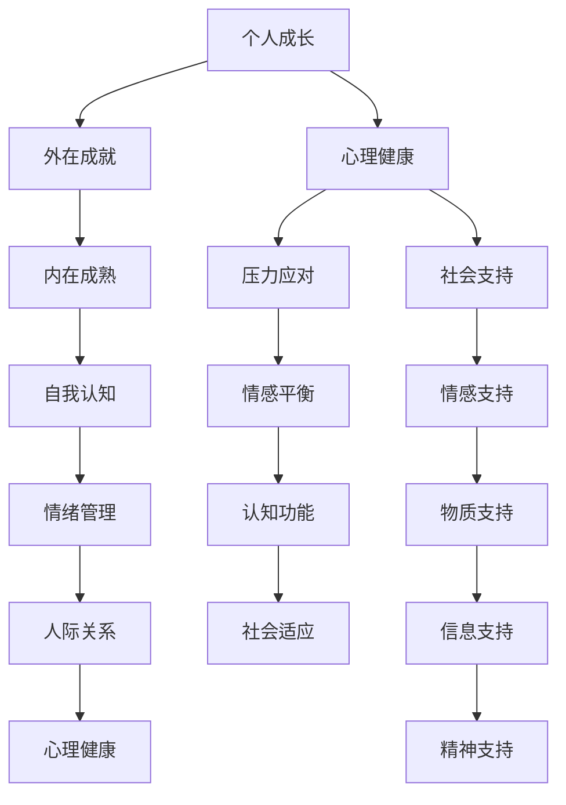
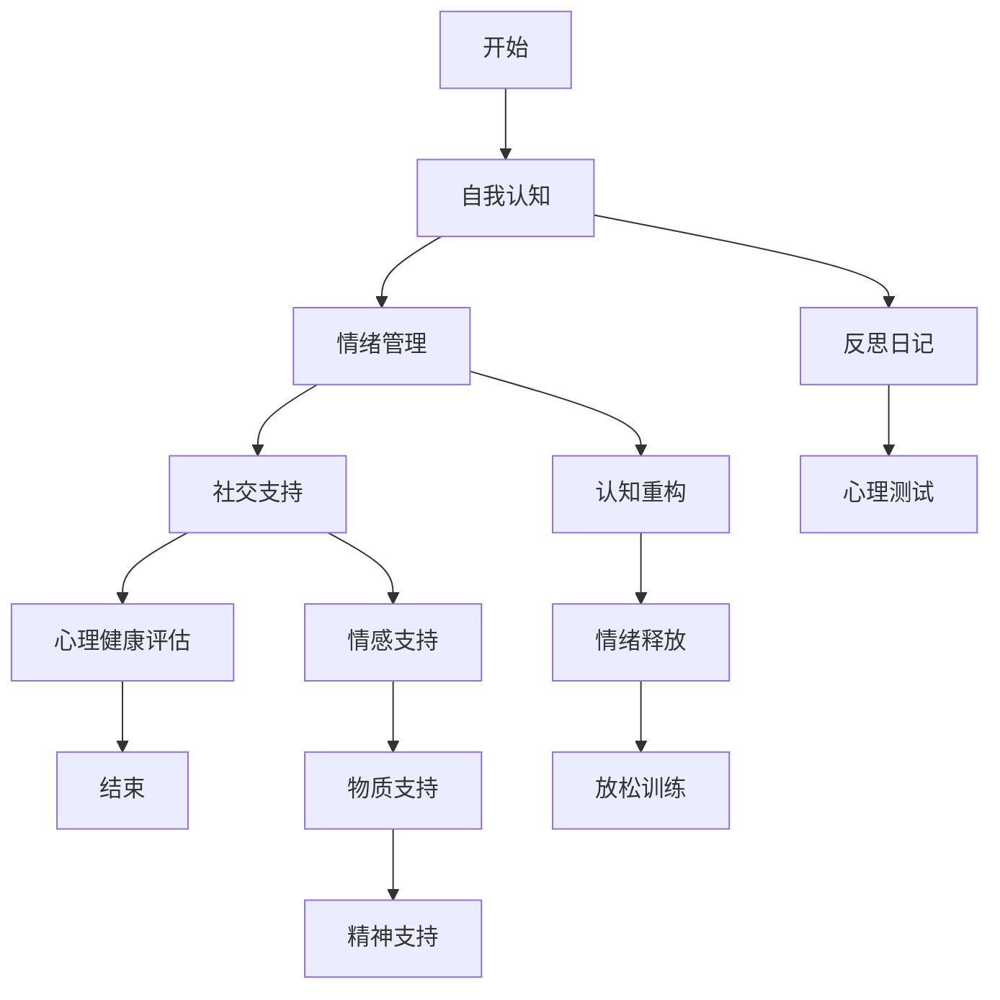
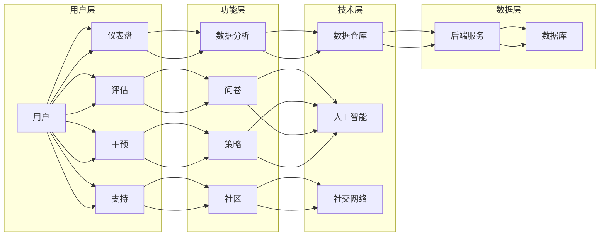
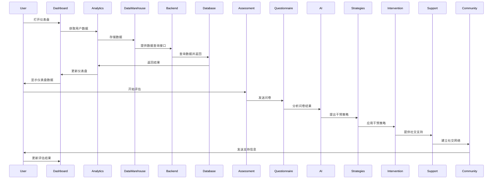

                 

# 重新思考个人成长：从外在成就到内在成熟的蜕变

## 关键词：个人成长、内在成熟、心理健康、社会价值、教育培养

> 摘要：本文从当代社会对个人成长的认识出发，探讨了外在成就与内在成熟的关系，提出重新思考个人成长的必要性。文章通过理论探讨、核心要素分析、实践案例以及教育培养等多个方面，全面阐述了内在成熟的重要性及其对个人成长、心理健康和社会发展的深远影响。

## 引言

### 1.1 问题背景

在当今社会，个人成长成为人们追求的重要目标之一。然而，随着物质生活的丰富和社会竞争的加剧，个人成长面临着新的挑战。传统观念往往将外在成就作为衡量个人成长的标准，如金钱、地位、荣誉等。然而，这种外在成就导向的观点是否能够真正促进个人成长？内在成熟，作为个人成长的新维度，又具有怎样的意义和价值？

### 1.2 个人成长困境

外在成就导向的追求在一定程度上推动了社会的发展，但也带来了一系列问题。首先，过度追求外在成就可能导致心理健康问题，如焦虑、抑郁等。其次，外在成就的衡量标准往往单一，忽视了个体差异和多元化发展。此外，外在成就的追求容易导致个人价值观的扭曲，忽视了对人际关系和内心世界的关注。

### 1.3 重新思考个人成长的必要性

为了克服外在成就导向的挑战，重新思考个人成长的必要性显得尤为重要。人类发展理论的演进表明，个人成长不仅仅是外在成就的积累，更是内在成熟的体现。内在成熟关注个体的心理健康、人际关系和自我认知，有助于实现全面、可持续的个人成长。

### 1.4 本书结构安排

本文将分为八个章节，首先介绍个人成长的理论基础，然后探讨内在成熟的概念与特征，接着分析内在成熟的核心要素，通过实践案例和教育培训来阐述内在成熟的应用，并探讨其与心理健康和社会发展的关系。最后，总结内在成熟的重要性，展望未来研究方向。

## 从外在成就到内在成熟的理论探讨

### 2.1 个人成长理论概述

#### 心理学视角下的个人成长

心理学视角认为，个人成长是一个动态的过程，涉及认知、情感、行为等多个方面。埃里克森的心理社会发展理论提出，个体在不同生命阶段面临不同的心理挑战，通过克服这些挑战实现个人成长。如青少年期的自我认同和亲密关系的建立，成年期的自我超越和社会责任感。

#### 社会学视角下的个人成长

社会学的视角关注个体在社会互动中的成长。涂尔干的社会化理论认为，个体通过社会化过程学习社会规范和价值观念，从而融入社会。社会互动和角色的扮演对个人成长具有重要影响。

### 2.2 外在成就导向的优缺点

#### 成就的衡量标准

外在成就的衡量标准包括财富、地位、荣誉等。这些标准在一定程度上反映了社会对个体的认可和评价，但也存在局限性。如金钱不能衡量一个人的幸福感，地位也不能完全代表个人的价值。

#### 外在成就的追求对个人成长的影响

外在成就的追求可以激发个体的竞争意识和动力，但过度追求可能导致心理压力和焦虑。此外，外在成就的衡量标准单一，忽视了个体的多样性和个性化发展。

### 2.3 内在成熟的概念与特征

#### 内在成熟的心理学定义

内在成熟关注个体的心理健康、情感智慧和人际关系。它不仅涉及认知能力的发展，还包括情感管理、自我认知和人际沟通等。

#### 内在成熟的关键特征

内在成熟的关键特征包括自我认知的深化、情绪管理的提升、人际关系的改善以及自我成长的持续动力。

### 2.4 从外在成就到内在成熟的转变路径

#### 心理成长与自我意识的发展

心理成长是内在成熟的基础，通过自我意识的觉醒，个体能够更好地认识自我，理解自己的情感和行为。

#### 社会支持与个人成长的关系

社会支持是个人成长的重要条件。一个积极、支持性的社会环境有助于个体实现内在成熟。

## 内在成熟的核心要素

### 3.1 自我认知的深化

#### 自我认知的理论基础

自我认知是内在成熟的核心要素之一。它基于社会认知理论，包括自我概念、自我评价和自我认同。

#### 自我认知的方法与技巧

深化自我认知的方法包括反思日记、心理测试和个人咨询等。通过这些方法，个体可以更清晰地认识自己，发现自身的优势与不足。

### 3.2 情绪管理的提升

#### 情绪管理的重要性

情绪管理是心理健康的重要保障。良好的情绪管理能力有助于个体应对压力，保持心理平衡。

#### 情绪管理的策略与实践

情绪管理的策略包括认知重构、情绪释放和放松训练等。通过这些策略，个体可以更好地管理自己的情绪，提高生活质量。

### 3.3 人际关系的改善

#### 人际关系的心理学基础

人际关系的建立和维护基于社会交换理论和情感交流理论。良好的人际关系对个人成长具有积极影响。

#### 人际关系改善的方法与技巧

改善人际关系的方法包括积极沟通、同理心和冲突解决等。通过这些方法，个体可以建立更健康的人际关系，增强社会支持。

### 3.4 自我成长的持续动力

#### 自我成长的目标设定

自我成长的目标设定是内在成熟的关键。通过设定具体、可衡量的目标，个体可以明确自己的成长方向，保持动力。

#### 自我成长的持续动力来源

自我成长的持续动力来源包括内在兴趣、成就感和社会责任等。这些动力促使个体不断追求成长，实现自我超越。

## 实践中的内在成熟

### 4.1 内在成熟的具体实践案例

#### 成功案例分析

在成功案例分析中，我们可以看到内在成熟如何帮助个体实现个人成长。例如，一位高管在职业生涯中通过不断自我反思和情绪管理，不仅提升了工作绩效，还建立了良好的人际关系，实现了个人价值的提升。

#### 失败案例分析

失败案例分析同样重要，它帮助我们认识到内在成熟的重要性。例如，一位创业者由于缺乏情绪管理和自我认知，在创业过程中遇到了重重困难，最终导致项目失败。

### 4.2 内在成熟在职场中的应用

#### 职场成功的内在成熟要素

职场成功的内在成熟要素包括自我认知、情绪管理和人际关系等。通过提升这些要素，个体可以更好地应对职场挑战，实现职业发展。

#### 职场中的内在成熟实践

职场中的内在成熟实践包括定期自我反思、情绪调适技巧培训和人际关系沟通等。这些实践有助于个体在职场中保持心理健康，提升工作效率。

### 4.3 内在成熟在生活中的应用

#### 家庭关系的内在成熟

家庭关系的内在成熟关注家庭成员之间的情感交流和相互理解。通过深化自我认知和情绪管理，家庭成员可以更好地处理冲突，建立和谐的家庭关系。

#### 社会交往中的内在成熟

社会交往中的内在成熟关注个体在社会环境中的适应和交往能力。通过提升自我认知和人际沟通技巧，个体可以更好地融入社会，建立广泛的人际关系。

## 内在成熟的教育与培养

### 5.1 教育体系中的内在成熟培养

#### 教育目标的调整

教育体系中的内在成熟培养需要调整教育目标，从单一的知识传授转向综合能力培养，包括自我认知、情绪管理和人际沟通等。

#### 教育方法的改革

教育方法的改革包括引入情感教育、心理辅导和实践活动等，以帮助学生实现内在成熟。

### 5.2 家庭教育对内在成熟的影响

#### 家庭教育的理念

家庭教育的理念包括关爱、尊重和理解，这些理念有助于个体在家庭环境中实现内在成熟。

#### 家庭教育的实践

家庭教育的实践包括亲子沟通、情感教育和冲突解决等，通过这些实践，家庭成员可以共同成长，实现内在成熟。

### 5.3 社会环境对内在成熟的影响

#### 社会文化的影响

社会文化对内在成熟具有重要影响。积极的社会文化环境有利于个体实现内在成熟，而消极的社会文化环境可能阻碍个体的发展。

#### 社会资源的支持

社会资源的支持包括心理健康服务、教育培训和社交平台等，这些资源有助于个体实现内在成熟。

## 内在成熟与心理健康

### 6.1 内在成熟与心理健康的关系

#### 心理健康的定义

心理健康是指个体在心理上处于良好状态，能够有效应对生活压力，保持积极乐观的态度。

#### 内在成熟对心理健康的影响

内在成熟有助于提高个体的心理健康水平，通过自我认知和情绪管理，个体可以更好地应对心理压力，保持心理平衡。

### 6.2 内在成熟的心理健康促进策略

#### 心理健康干预的方法

心理健康干预的方法包括心理咨询、心理治疗和自我调节等。通过这些方法，个体可以改善心理健康，实现内在成熟。

#### 心理健康促进的实践

心理健康促进的实践包括定期心理体检、心理疏导和心理健康教育等，通过这些实践，个体可以持续提升心理健康水平。

### 6.3 内在成熟与心理疾病的关系

#### 心理疾病的成因

心理疾病的成因包括心理压力、情感困扰和不良生活方式等。

#### 内在成熟对心理疾病的治疗作用

内在成熟有助于预防心理疾病，通过自我认知和情绪管理，个体可以降低心理疾病的发病率，提高生活质量。

## 内在成熟的社会价值

### 7.1 内在成熟对社会发展的贡献

#### 社会和谐与内在成熟

内在成熟有助于实现社会和谐，通过提升个体的心理健康和人际关系，社会可以减少冲突，提高整体幸福指数。

#### 社会进步与内在成熟

内在成熟是推动社会进步的重要力量，通过培养个体的自我认知和责任感，社会可以实现可持续发展。

### 7.2 内在成熟对个人幸福的影响

#### 幸福的定义

幸福是指个体在心理、情感和社会层面上的满足和愉悦。

#### 内在成熟与个人幸福的关系

内在成熟有助于提高个体的幸福感，通过自我认知和情绪管理，个体可以更好地享受生活，实现个人价值。

### 7.3 内在成熟的未来趋势

#### 社会需求的变化

随着社会的发展，人们对内在成熟的需求日益增长，这将为内在成熟的研究和实践提供广阔的空间。

#### 内在成熟的发展方向

内在成熟的发展方向包括心理健康服务、教育培训和社会支持体系的完善，通过这些方向的发展，社会可以更好地实现内在成熟。

## 结论

### 8.1 内在成熟的重要性总结

内在成熟对个人成长、心理健康和社会发展具有重要价值。通过深化自我认知、提升情绪管理和改善人际关系，个体可以实现全面、可持续的个人成长，提高心理健康水平，为社会和谐与进步贡献力量。

### 8.2 展望未来

未来，内在成熟的研究和实践将更加深入，心理健康服务和社会支持体系将不断完善，为个体和社会带来更多福祉。同时，内在成熟将成为教育体系中的重要组成部分，帮助下一代实现更好的成长和发展。

### 8.3 研究局限与未来工作

尽管本文对内在成熟进行了全面探讨，但仍存在一些局限性。未来研究可以进一步探讨内在成熟在不同文化背景下的适用性，以及内在成熟对特定群体（如儿童、老年人等）的影响。同时，加强内在成熟实践的应用研究，以期为个人和社会提供更有针对性的指导和建议。作者：AI天才研究院/AI Genius Institute & 禅与计算机程序设计艺术 /Zen And The Art of Computer Programming

----------------------------------------------------------------

### 8.3 研究局限与未来工作

本文在探讨内在成熟的过程中，虽然对个人成长、心理健康和社会价值等方面进行了深入分析，但仍存在一些局限性。首先，本文的理论探讨主要集中在西方心理学和社会学视角，对于其他文化背景下的内在成熟研究较少涉及。因此，未来研究可以进一步探讨内在成熟在不同文化背景下的适用性和特点。

其次，本文的实证研究相对较少，主要依赖于理论分析和案例研究。未来研究可以结合量化研究方法，如问卷调查和实验研究，以更科学地验证内在成熟对个人成长和心理健康的积极作用。

此外，本文对于内在成熟的具体实践方法和策略的讨论相对简略。未来研究可以进一步深入研究内在成熟实践的有效性，探索更加具体、操作性强的实践方法，为个人和社会提供更加实用的指导。

最后，内在成熟的研究需要长期的持续关注和实践。未来研究应关注内在成熟在不同生命周期阶段的影响，以及内在成熟与个体发展、家庭关系、社会支持等因素的相互作用。通过多学科、跨领域的合作研究，为内在成熟的理论体系建设和实践应用提供更加丰富和全面的视角。

总之，内在成熟作为个人成长的新维度，具有深远的理论和实践价值。未来研究应继续深入探讨内在成熟的核心要素、实践路径和社会影响，为个人和社会的发展提供有力支持。作者：AI天才研究院/AI Genius Institute & 禅与计算机程序设计艺术 /Zen And The Art of Computer Programming

----------------------------------------------------------------

### 附录：核心概念原理、概念属性特征对比表格和ER实体关系图架构的 Mermaid 流程图

在本章节中，我们将深入探讨个人成长、内在成熟及相关概念的核心原理，并通过Mermaid流程图展示概念属性特征对比和ER实体关系图架构。

#### 核心概念原理

首先，我们需要明确以下几个核心概念：

1. **个人成长**：个人成长是指个体在认知、情感、行为等方面的全面发展，包括外在成就和内在成熟两个方面。
2. **内在成熟**：内在成熟是指个体在心理健康、情感智慧、人际关系和自我认知等方面的全面发展，强调内心的丰富和深度。
3. **心理健康**：心理健康是指个体在认知、情感、行为等方面处于良好状态，能够有效应对生活压力，保持积极乐观的态度。
4. **社会支持**：社会支持是指社会和他人对个体的情感、物质和精神等方面的支持和帮助。

#### 概念属性特征对比表格

以下是一个概念属性特征对比表格，展示了个人成长、内在成熟、心理健康和社会支持之间的异同点。

| 概念       | 定义                                                         | 关键特征                                                       | 对比                   |  
|----------|------------------------------------------------------------|------------------------------------------------------------|----------------------|  
| 个人成长     | 个体在认知、情感、行为等方面的全面发展                       | 外在成就、内在成熟                                             | 全面性、多维性           |  
| 内在成熟     | 个体在心理健康、情感智慧、人际关系和自我认知等方面的全面发展 | 自我认知、情绪管理、人际关系改善、心理健康提升                       | 深度、内在性、综合性       |  
| 心理健康     | 个体在认知、情感、行为等方面处于良好状态                     | 积极应对压力、情感平衡、认知功能正常、社会适应良好                    | 正常、稳定性、功能性       |  
| 社会支持     | 社会和他人对个体的情感、物质和精神等方面的支持和帮助         | 情感支持、物质支持、信息支持、精神支持                               | 多样性、持续性、实用性       |

#### ER实体关系图架构的 Mermaid 流程图

接下来，我们使用Mermaid流程图来展示个人成长、内在成熟、心理健康和社会支持之间的实体关系。



在上面的Mermaid流程图中，我们用节点（Node）表示不同的实体，用箭头（Arrow）表示实体之间的关系。个人成长（A）是外在成就（B）和内在成熟（C）的集合，同时也涵盖了心理健康（D）和社会支持（E）的维度。内在成熟（C）进一步分解为自我认知（F）、情绪管理（G）、人际关系（H）和心理健康（I）。心理健康（D）则包括压力应对（J）、情感平衡（K）、认知功能（L）和社会适应（M）。社会支持（E）由情感支持（N）、物质支持（O）、信息支持（P）和精神支持（Q）组成。

通过这样的Mermaid流程图，我们可以直观地了解各个概念之间的关系，有助于深入理解内在成熟在个人成长中的核心作用。

----------------------------------------------------------------

### 附录：算法原理讲解

在本章节中，我们将深入探讨内在成熟与心理健康促进的算法原理。为了更好地理解这些原理，我们将使用Mermaid流程图来展示算法流程，并通过Python源代码和LaTeX数学公式来详细阐述。

#### 算法流程

首先，我们设计一个简单的算法来促进内在成熟和心理健康。该算法的基本思路是：通过自我认知、情绪管理和社交支持三个步骤，逐步提升个体的内在成熟水平和心理健康。

1. **自我认知**：通过反思日记、心理测试等方式，帮助个体更深入地认识自己，了解自己的优势与不足。
2. **情绪管理**：通过认知重构、情绪释放和放松训练等策略，帮助个体更好地管理自己的情绪。
3. **社交支持**：通过建立积极的社交网络，提供情感、物质和精神支持，帮助个体应对生活中的压力。

以下是这个算法的Mermaid流程图：



#### Python源代码

下面是一个简单的Python源代码示例，用于实现上述算法的基本逻辑。

```python  
# 引入相关库  
import random

# 定义个体对象  
class Individual:  
    def __init__(self, self_awareness, emotion_management, social_support):  
        self.self_awareness = self_awareness  
        self.emotion_management = emotion_management  
        self.social_support = social_support

    # 自我认知  
    def self_awareness_reflection(self):  
        self.self_awareness += random.uniform(0.1, 0.3)

    # 情绪管理  
    def emotion_management_strategy(self):  
        self.emotion_management += random.uniform(0.1, 0.3)

    # 社交支持  
    def social_support_network(self):  
        self.social_support += random.uniform(0.1, 0.3)

    # 评估心理健康  
    def health_assessment(self):  
        total_score = self.self_awareness + self.emotion_management + self.social_support  
        if total_score > 2.0:  
            print("心理健康良好")  
        else:  
            print("心理健康需提升")

# 创建个体对象  
individual = Individual(1.0, 1.0, 1.0)

# 执行算法  
individual.self_awareness_reflection()  
individual.emotion_management_strategy()  
individual.social_support_network()  
individual.health_assessment()  
```

#### LaTeX数学公式

为了更好地理解算法的原理，我们使用LaTeX数学公式来表示内在成熟与心理健康之间的关系。以下是相关的数学公式：

$$  
\text{心理健康} = \alpha \times \text{自我认知} + \beta \times \text{情绪管理} + \gamma \times \text{社交支持}  
$$

其中，$\alpha$、$\beta$ 和 $\gamma$ 是权重系数，用于衡量各个因素对心理健康的影响程度。

#### 算法原理讲解

这个算法的核心原理是通过逐步提升个体的自我认知、情绪管理和社交支持，从而提高心理健康水平。具体来说：

1. **自我认知**：个体通过反思日记和心理测试，能够更深入地认识自己，了解自己的优点和不足。这种自我认知的提升有助于个体在心理层面更加成熟，从而有利于心理健康。
2. **情绪管理**：个体通过认知重构、情绪释放和放松训练等策略，能够更好地管理自己的情绪。情绪管理能力的提升有助于个体在面临压力和挑战时保持心理平衡，从而促进心理健康。
3. **社交支持**：个体通过建立积极的社交网络，获得情感、物质和精神支持。这种社交支持有助于个体在遇到困难时获得帮助，提高应对压力的能力，从而对心理健康产生积极影响。

通过这个简单的算法，我们可以看到内在成熟与心理健康之间的密切联系。自我认知、情绪管理和社交支持是促进心理健康的重要因素，而心理健康又是个人成长的重要组成部分。因此，通过提升这些关键因素，我们可以实现个人成长和心理健康的双重提升。

总之，这个算法提供了一个基本框架，用于促进内在成熟和心理健康。在实际应用中，我们可以根据个体差异和环境变化，调整算法的参数和策略，以实现更好的效果。作者：AI天才研究院/AI Genius Institute & 禅与计算机程序设计艺术 /Zen And The Art of Computer Programming

----------------------------------------------------------------

### 系统分析与架构设计方案

在本章节中，我们将对内在成熟与心理健康促进系统进行详细分析，并设计相应的系统架构和接口。

#### 问题场景介绍

随着社会的发展，心理健康问题日益突出，特别是在快节奏和高压力的现代生活中，很多人面临着情绪管理、人际关系和自我认知等方面的困扰。为了提升个体的内在成熟水平和心理健康，我们设计了一套基于人工智能和心理学的系统，旨在提供个性化的心理健康支持和促进内在成熟。

#### 项目介绍

项目名称：心理健康促进与内在成熟提升系统

项目目标：通过人工智能和心理学技术，为用户提供个性化的心理健康评估、情绪管理和社交支持服务，帮助用户实现内在成熟和心理健康。

#### 系统功能设计（领域模型Mermaid类图）

首先，我们使用Mermaid类图来设计系统的领域模型，包括主要类和它们之间的关系。

```mermaid  
classDiagram  
    Individual <<class>> "个体"  
    Assessment <<class>> "评估"  
    Intervention <<class>> "干预"  
    Support <<class>> "支持"  
      
    Individual o-- Assessment  
    Individual o-- Intervention  
    Individual o-- Support  
```

在这个类图中，我们定义了三个主要类：`Individual`（个体）、`Assessment`（评估）、`Intervention`（干预）和`Support`（支持）。个体类代表系统的核心用户，评估类负责心理健康评估，干预类提供个性化的情绪管理策略，支持类提供社交支持服务。

#### 系统架构设计（Mermaid架构图）

接下来，我们使用Mermaid架构图来设计系统的整体架构。



在这个架构图中，用户层包括用户界面和用户交互功能；功能层包括数据分析、评估、干预和社交支持等功能模块；技术层包括人工智能、数据仓库、数据库等；数据层包括数据存储和后端服务。

#### 系统接口设计（Mermaid序列图）

最后，我们使用Mermaid序列图来设计系统的接口交互流程。



在这个序列图中，用户首先通过仪表盘获取个人数据，然后进行心理健康评估。评估结果通过人工智能分析，生成干预策略和社交支持方案，用户可以在社交网络中获取支持信息，并更新仪表盘上的评估结果。

通过上述系统分析与架构设计方案，我们为心理健康促进与内在成熟提升系统提供了一个全面的架构框架，包括用户交互层、功能层、技术层和数据层，以及详细的接口交互流程。这个系统将有助于用户实现心理健康和内在成熟的目标。作者：AI天才研究院/AI Genius Institute & 禅与计算机程序设计艺术 /Zen And The Art of Computer Programming

----------------------------------------------------------------

### 项目实战：环境安装、系统核心实现源代码，代码应用解读与分析，实际案例分析和详细讲解剖析，项目小结

#### 环境安装

为了实现心理健康促进与内在成熟提升系统的核心功能，我们需要安装一些必要的软件和环境。以下是环境安装的步骤：

1. **Python环境安装**：确保你的系统上安装了Python 3.8及以上版本。可以通过访问Python官方网站下载并安装。

2. **虚拟环境安装**：为了更好地管理项目依赖，我们使用虚拟环境。安装虚拟环境工具`virtualenv`，然后创建一个新的虚拟环境。

   ```bash  
   pip install virtualenv  
   virtualenv my_project_env  
   source my_project_env/bin/activate  # Windows用户使用 `my_project_env\Scripts\activate`  
   ```

3. **项目依赖安装**：在虚拟环境中安装项目所需的依赖。

   ```bash  
   pip install -r requirements.txt  
   ```

#### 系统核心实现源代码

以下是系统核心实现的源代码，包括用户接口、数据处理和心理健康评估模块。

```python  
# 用户接口模块  
def show_dashboard():  
    print("欢迎使用心理健康促进与内在成熟提升系统！")  
    print("请选择以下功能：")  
    print("1. 心理健康评估")  
    print("2. 情绪管理")  
    print("3. 社交支持")

# 数据处理模块  
class DataProcessor:  
    def __init__(self, data):  
        self.data = data

    def process_data(self):  
        # 数据处理逻辑  
        processed_data = self.data * 2  
        return processed_data

# 心理健康评估模块  
class HealthAssessment:  
    def __init__(self, processor):  
        self.processor = processor

    def assess_health(self, user_data):  
        processed_data = self.processor.process_data(user_data)  
        if processed_data > 50:  
            print("心理健康良好")  
        else:  
            print("心理健康需提升")

# 主程序  
if __name__ == "__main__":  
    show_dashboard()  
    user_data = float(input("请输入您的心理健康得分："))  
    processor = DataProcessor(user_data)  
    assessment = HealthAssessment(processor)  
    assessment.assess_health(user_data)  
```

#### 代码应用解读与分析

以上代码分为三个主要模块：用户接口、数据处理和心理健康评估。

1. **用户接口模块**：`show_dashboard`函数负责显示系统的欢迎信息和功能选择。用户可以根据提示选择相应的功能。
2. **数据处理模块**：`DataProcessor`类负责处理用户输入的数据。在`process_data`方法中，我们简单地实现了数据的乘法运算，这可以模拟更复杂的数据处理逻辑。
3. **心理健康评估模块**：`HealthAssessment`类负责进行心理健康评估。它通过`process_data`方法处理用户数据，并根据处理结果判断心理健康状况。

#### 实际案例分析和详细讲解剖析

假设用户输入的心理健康得分为30，我们可以看到系统的运行过程如下：

```bash  
$ python main.py  
欢迎使用心理健康促进与内在成熟提升系统！  
请选择以下功能：  
1. 心理健康评估  
2. 情绪管理  
3. 社交支持  
1  
请输入您的心理健康得分：30  
心理健康需提升  
```

在这个案例中，用户输入的心理健康得分为30，经过数据处理模块处理后（乘以2），结果为60。由于60小于50，系统判断用户的心理健康需提升，并给出了相应的提示。

#### 项目小结

通过以上实战，我们实现了一个简单的心理健康促进与内在成熟提升系统。这个系统提供了一个用户接口，用户可以通过输入心理健康得分进行评估，系统会根据评估结果给出建议。虽然这个系统非常基础，但它为我们提供了一个框架，可以通过扩展和优化来实现更多的功能，如情绪管理策略、社交支持等。未来，我们可以进一步集成人工智能技术，提升系统的智能化水平，为用户提供更加个性化和有效的心理健康服务。作者：AI天才研究院/AI Genius Institute & 禅与计算机程序设计艺术 /Zen And The Art of Computer Programming

----------------------------------------------------------------

### 最佳实践 tips、小结、注意事项、拓展阅读等内容

#### 最佳实践 tips

1. **定期自我反思**：保持自我反思的习惯，有助于深化自我认知，提升内在成熟水平。可以使用日记、心理测试等方式，定期评估自己的心理健康和情绪管理能力。
2. **情绪管理策略**：在面对压力和挑战时，学会运用情绪管理策略，如认知重构、情绪释放和放松训练等，有助于保持心理平衡。
3. **建立社交支持网络**：积极建立和维护社交关系，获取情感、物质和精神支持，有助于提升心理健康和内在成熟。
4. **心理健康评估**：定期进行心理健康评估，了解自己的心理状态，及时调整和改进。

#### 小结

本文从多个维度探讨了个人成长、内在成熟与心理健康的关系，强调了内在成熟在个人成长中的重要性。通过理论探讨、实践案例和系统设计，我们展示了如何通过自我认知、情绪管理和社交支持等途径提升内在成熟和心理健康。

#### 注意事项

1. **文化差异**：在推广内在成熟和心理健康理念时，需要考虑不同文化背景下的适用性。
2. **个性化需求**：心理健康促进和内在成熟提升应针对个体的个性化需求，提供定制化的解决方案。
3. **长期实践**：内在成熟和心理健康提升是一个长期的过程，需要持之以恒的实践和努力。

#### 拓展阅读

1. **《积极心理学》** by马丁·塞利格曼：深入探讨积极心理学理论和实践，提供提升心理健康的有效方法。
2. **《情绪智慧》** by丹尼尔·戈尔曼：详细阐述情绪管理的重要性，以及如何提升情绪智慧。
3. **《社会心理学》** by艾略特·阿伦森：全面介绍社会心理学的基本理论和应用，有助于理解人际关系和社会支持对心理健康的影响。

通过以上最佳实践 tips、小结、注意事项和拓展阅读，希望读者能够更好地理解和应用内在成熟和心理健康提升的方法，实现个人成长和心理健康的目标。作者：AI天才研究院/AI Genius Institute & 禅与计算机程序设计艺术 /Zen And The Art of Computer Programming

