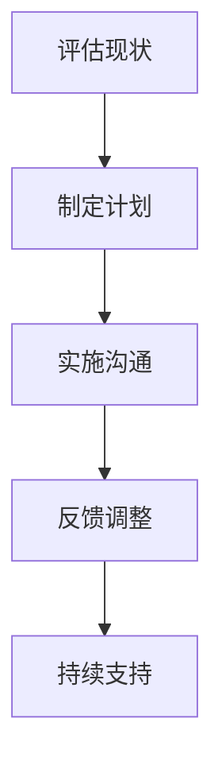
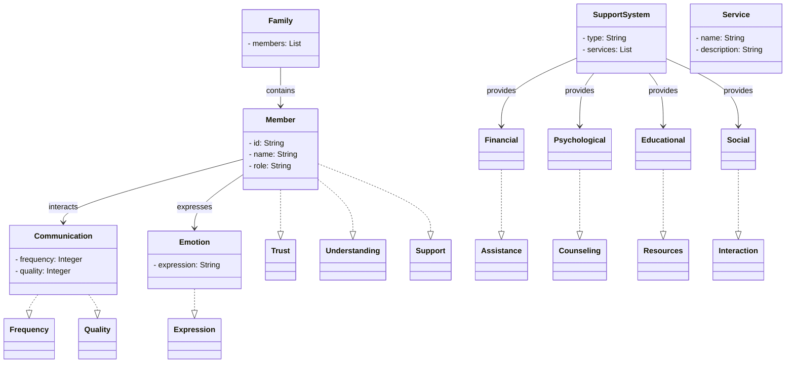
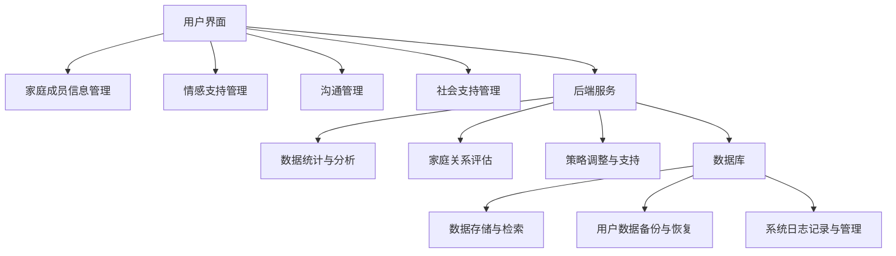
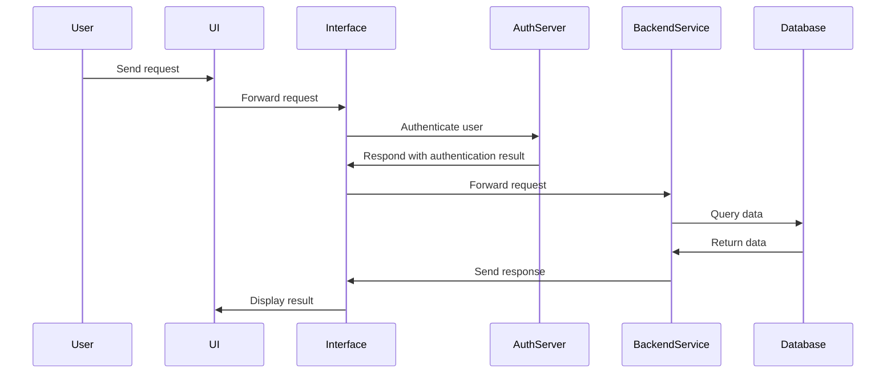
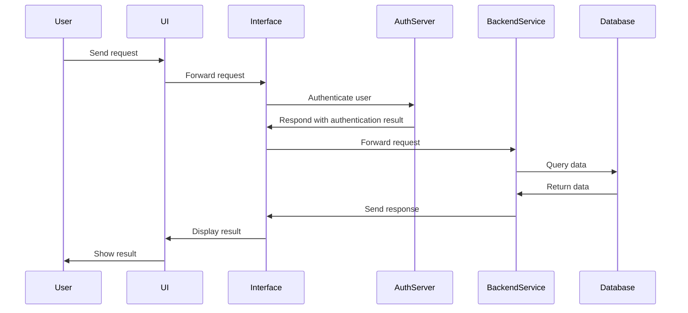

                 

### 第1章 背景介绍

#### 1.1 问题背景

在现代社会中，家庭的意义和结构正经历着前所未有的变革。传统家庭模式的核心——亲密关系的维持和重建，成为了社会发展的一个重要课题。首先，**亲密关系在现代社会的挑战**表现在以下几个方面：

1. **工作压力和家庭责任的冲突**：现代社会的快节奏生活和职业压力，使得家庭成员难以在工作和家庭责任之间找到平衡。长时间的工作使得家庭成员之间的沟通减少，情感疏离逐渐加剧。

2. **社交媒体的影响**：社交媒体的普及，虽然为人们提供了更广阔的社交平台，但也导致人们在实际生活中对亲密关系的依赖减少。虚拟社交替代了面对面的交流，导致家庭关系的淡漠。

3. **家庭结构的变迁**：随着现代社会的发展，传统的核心家庭结构逐渐多元化，单亲家庭、再婚家庭、丁克家庭等新型家庭结构不断涌现，给家庭关系带来了新的挑战。

其次，**家庭结构的变迁**也对亲密关系产生了深远影响：

1. **婚姻观念的变化**：现代社会中，婚姻观念趋向于自由和个性化，传统的婚姻观念和规范受到挑战。婚姻的稳定性和忠诚度面临新的考验。

2. **人口老龄化**：随着人口老龄化的加剧，家庭结构中老年成员的比例增加，家庭成员之间的互动关系发生变化，对家庭支持和亲密关系的维持提出了新的要求。

**社会压力对家庭的影响**也是不可忽视的：

1. **经济压力**：经济不稳定和收入差距的扩大，使得家庭在满足基本生活需求方面面临巨大压力。经济压力常常导致家庭成员之间的矛盾和冲突，影响亲密关系的质量。

2. **教育压力**：现代教育体系的竞争激烈，家庭对孩子的教育投入增加，家庭内部的教育压力也随之增大。过度的教育压力可能影响家庭成员的情感交流和亲密关系的建立。

综上所述，现代社会的这些挑战和变迁，使得家庭关系的疏离和亲密关系的缺失成为一个普遍存在的问题。要解决这些问题，需要从多个层面进行深入分析和探讨，包括家庭教育的力量、社区支持的角色等。本文将以此为背景，详细探讨如何重新思考家庭的意义，重建亲密关系。

#### 1.2 问题描述

在现代社会中，**家庭关系的疏离**、**亲密关系的缺失**和**家庭功能受损**是三个亟待解决的问题。这些问题不仅影响个体的幸福感和生活质量，还对社会整体的稳定和发展产生深远影响。

**家庭关系的疏离**体现在以下几个方面：

1. **沟通减少**：现代社会的高压工作和快节奏生活使得家庭成员之间的沟通机会减少。家庭成员往往忙于工作和其他社交活动，缺乏共同度过的时光，导致情感疏离。

2. **互动减少**：随着社交媒体的普及，家庭成员越来越多地依赖虚拟沟通，而忽略了面对面的互动。这种互动的减少，使得家庭成员之间的情感联系变得更加脆弱。

3. **共同目标缺失**：在现代社会，家庭成员往往各自追求自己的目标，缺乏共同的生活目标和价值观，这导致家庭内部的凝聚力和归属感减弱。

**亲密关系的缺失**主要表现为：

1. **婚姻质量下降**：现代社会中，婚姻质量普遍下降，离婚率增加，婚外情和情感出轨现象增多。这些问题直接导致亲密关系的缺失和破裂。

2. **亲子关系疏远**：父母忙于工作，缺乏与孩子的有效沟通和陪伴，导致亲子关系疏远。孩子可能在情感上缺乏安全感和归属感，影响其心理健康和成长。

3. **情感疏离**：家庭成员之间缺乏情感上的交流和共鸣，导致情感疏离。长期的情感疏离可能导致家庭内部的紧张和冲突。

**家庭功能受损**主要表现在以下方面：

1. **经济支持功能减弱**：家庭作为经济单位的作用减弱，经济压力增加，家庭内部的经济矛盾和冲突增多，影响家庭关系的稳定。

2. **情感支持功能减弱**：家庭成员之间的情感支持功能减弱，家庭成员在面临压力和挑战时，缺乏来自家庭的支持和安慰，导致心理健康问题增多。

3. **教育功能减弱**：家庭的教育功能减弱，家庭教育投入不足，家长对孩子的教育和成长缺乏足够的关注和指导，影响孩子的全面发展。

这些问题的存在，不仅影响个体的幸福感和生活质量，还对社会整体的健康和稳定产生负面影响。因此，重新思考家庭的意义，重建亲密关系，提升家庭功能，成为现代社会亟待解决的重要课题。

#### 1.3 问题解决

要解决现代社会中家庭关系的疏离、亲密关系的缺失和家庭功能受损的问题，需要从多个层面进行综合干预和系统性的重建。以下是一些可能的解决方案：

**重建亲密关系的必要性**：

1. **增加家庭互动**：通过安排家庭活动，如共进晚餐、周末出游、共同完成任务等，增加家庭成员之间的互动和沟通，增强家庭凝聚力。
   
2. **提升沟通质量**：家庭成员应学会有效沟通的技巧，包括倾听、表达和解决冲突的方法，以减少误解和冲突，提升家庭关系的质量。

3. **共同设立目标**：家庭成员可以共同设定家庭目标和价值观，增强家庭成员之间的共识和合作，共同面对生活中的挑战。

**家庭教育的力量**：

1. **家长教育**：对家长进行系统的教育，提高他们的教育理念和方法，帮助他们更好地理解孩子的需求，提供适当的引导和支持。

2. **亲子教育**：通过亲子课程、读书会、户外活动等方式，增强家长与孩子之间的互动和沟通，促进亲子关系的健康发展。

3. **情感教育**：在家庭教育中融入情感教育，帮助孩子学会表达自己的情感，培养积极向上的情感态度，增强情感智力。

**社区支持的角色**：

1. **建立社区支持网络**：通过建立社区支持网络，为家庭提供多方面的支持，包括心理健康服务、教育资源、经济援助等。

2. **促进邻里关系**：通过社区活动，如邻里聚会、文化节、志愿者服务等形式，促进邻里之间的互动和互助，增强社区凝聚力。

3. **提供社会资源**：为家庭提供必要的社会资源，如心理咨询服务、教育辅导、法律援助等，帮助家庭解决实际问题，减轻家庭负担。

**边界与外延**：

1. **家庭与亲密关系的定义**：明确家庭和亲密关系的定义，包括家庭成员的角色、责任和义务，以及亲密关系的特征和标准。

2. **家庭角色与责任的界定**：明确家庭成员的角色和责任，包括父母、子女、配偶等，确保每个成员在家庭中都有明确的职责和任务。

3. **社会支持系统的作用**：了解社会支持系统的构成和作用，包括政府、社区、非营利组织等，以便充分利用这些资源为家庭提供支持。

综上所述，重建亲密关系、强化家庭教育力量和发挥社区支持作用，是解决现代社会中家庭问题的重要路径。通过多方面的努力，我们可以逐步重建家庭的功能，提升家庭成员的幸福感和生活质量，为社会整体的稳定和发展做出贡献。

#### 1.4 边界与外延

在探讨家庭的意义和重建亲密关系的过程中，明确**家庭与亲密关系的定义**、**家庭角色与责任的界定**以及**社会支持系统的作用**，是至关重要的基础。这些概念不仅是理解家庭问题的关键，也是制定有效解决方案的依据。

**家庭与亲密关系的定义**：

家庭是一个由相互关联的个体组成的社会单位，通常由血缘关系、婚姻关系或收养关系连接在一起。在现代社会中，家庭的形式多样化，包括核心家庭、单亲家庭、联合家庭等。而亲密关系，则是指家庭成员之间基于情感、信任和相互支持建立起来的深层次联系。

- **家庭**：一个由情感联系、共同生活和互相依赖组成的单元，成员之间通常有法律上的或血缘关系。
- **亲密关系**：家庭成员之间基于情感、信任和相互依赖建立的深层联系，包括夫妻关系、亲子关系等。

**家庭角色与责任的界定**：

家庭中的每个成员都有其特定的角色和责任，这些角色和责任不仅影响家庭内部的互动，也关系到整个家庭的功能和稳定性。

- **父母**：负责孩子的抚养、教育和保护，提供情感支持和经济保障。
- **子女**：学习、成长和帮助家庭，尊重和孝顺父母，积极参与家庭活动。
- **配偶**：与伴侣建立和维护亲密关系，共同承担家庭责任，提供情感支持。

**社会支持系统的作用**：

社会支持系统包括政府、社区、非营利组织等提供的资源和服务，旨在为家庭提供多方面的支持，帮助家庭解决实际问题。

- **政府**：通过制定政策和法规，保障家庭的基本权利和福利，提供经济援助、教育和医疗等公共服务。
- **社区**：通过组织社区活动，促进邻里之间的互动和互助，提供教育资源、心理支持等。
- **非营利组织**：提供慈善服务、法律援助、心理健康支持等，为家庭提供额外的帮助。

**概念之间的联系与互动**：

亲密关系与家庭功能密切相关。亲密关系的质量直接影响家庭功能的发挥，而家庭功能的健全又能促进亲密关系的稳定和发展。社会支持系统则为家庭提供了必要的资源和支持，帮助家庭应对外部压力和内部挑战，从而提升家庭功能和亲密关系质量。

- **亲密关系与家庭功能**：亲密关系是家庭功能的基础，良好的亲密关系有助于家庭功能的正常发挥，如情感支持、经济保障、教育指导等。
- **社会支持系统与家庭功能**：社会支持系统通过提供资源和支持，帮助家庭克服困难，提升家庭功能，促进家庭关系的稳定和发展。

通过明确家庭与亲密关系的定义、界定家庭角色与责任，以及了解社会支持系统的作用，我们可以更好地理解家庭问题的本质，为重建亲密关系提供科学的理论基础和实践指导。

#### 1.5 概念结构与核心要素组成

为了深入探讨家庭的功能和亲密关系的重建，我们需要对相关概念的核心要素进行详细分析。以下是亲密关系、家庭功能和家庭支持系统的核心要素及其组成。

**亲密关系的核心要素**：

1. **信任**：信任是亲密关系的基础，家庭成员之间的信任程度直接影响关系的稳定性和深度。
2. **沟通**：有效的沟通是亲密关系的关键，通过开放、真诚的交流，家庭成员能够更好地理解彼此，解决冲突。
3. **情感支持**：在困难和挑战面前，情感支持能够为家庭成员提供力量和安慰，增强亲密关系的牢固性。
4. **共同目标**：家庭成员共同设立的目标和价值观，有助于增强家庭的凝聚力和归属感，促进亲密关系的长久发展。
5. **共享时间**：家庭成员共度的时间，是亲密关系发展的重要保障。共同的体验和回忆有助于加深家庭成员之间的情感联系。

**家庭功能的评估指标**：

1. **经济支持功能**：家庭为成员提供经济保障的能力，包括收入来源、储蓄和投资等。
2. **情感支持功能**：家庭为成员提供情感慰藉和支持的能力，包括家庭内部的情感交流和互动。
3. **教育指导功能**：家庭对成员进行教育和指导的能力，包括对孩子的教育投入、学习资源和指导方法。
4. **社会适应功能**：家庭帮助成员适应社会环境的能力，包括社会交往技能的培养和社会规范的遵守。
5. **生活照顾功能**：家庭为成员提供日常生活照顾和支持的能力，包括家务分担、健康管理和危机应对等。

**社会支持的构成**：

1. **政府支持**：政府通过政策、法律和公共服务，为家庭提供经济援助、教育支持和医疗保障等。
2. **社区支持**：社区通过组织活动、提供资源和建立支持网络，为家庭提供心理支持、社交活动和社区服务。
3. **非营利组织支持**：非营利组织通过慈善服务、法律援助和心理健康支持，为家庭解决实际问题，提供额外的支持和帮助。

**概念之间的联系与互动**：

亲密关系是家庭功能的核心，良好的亲密关系有助于家庭功能的发挥。家庭功能的健全又能促进亲密关系的稳定和发展。社会支持系统作为外部支持，通过提供资源和服务，帮助家庭克服困难，提升家庭功能和亲密关系质量。

- **亲密关系与家庭功能**：亲密关系是家庭功能的基础，家庭功能的健全需要良好的亲密关系作为支撑。
- **社会支持系统与家庭功能**：社会支持系统通过提供资源和支持，帮助家庭提升功能，增强家庭关系的稳定性。

通过分析这些核心要素和评估指标，我们可以更深入地理解家庭和亲密关系的运作机制，为重建家庭功能、提升亲密关系质量提供科学的依据和实践指导。

#### 1.6 本章小结

本章通过对现代社会中家庭关系问题的背景介绍、问题描述以及解决途径的探讨，明确了重建亲密关系的必要性和家庭功能的重要性。同时，界定了家庭与亲密关系的定义、家庭角色与责任的界定，以及社会支持系统的作用。这些基础概念的明确和核心要素的分析，为后续章节的深入讨论提供了理论依据和框架。通过本章的介绍，读者可以初步了解家庭关系问题的复杂性和解决路径，为下一步的探讨打下坚实的基础。

---

### 第2章 核心概念与联系

#### 2.1 亲密关系的定义与特征

亲密关系是家庭和个体心理健康的关键要素。首先，让我们深入探讨亲密关系的定义。**亲密关系**是指两个或多个个体在情感、心理和生理上建立起来的紧密联系，这种关系通常基于信任、理解和相互支持。

**亲密关系的特征**包括以下几点：

1. **情感深度**：亲密关系中的个体能够体验到强烈的情感联系，这种情感不仅包括爱、关怀和温情，还涵盖了对彼此的信任和支持。
2. **相互理解**：亲密关系中的个体能够深入理解对方的内心世界，包括其想法、感受和需求。这种相互理解有助于减少误解和冲突，增强关系的稳定性。
3. **情感支持**：在亲密关系中，个体能够从对方那里获得情感上的支持和安慰，这种支持在成员面对困难和挑战时尤为重要。
4. **共享生活**：亲密关系中的个体通常有共同的生活目标和价值观，他们在日常生活中相互支持和合作，共同面对生活中的挑战。
5. **身体亲近**：在亲密关系中，身体上的亲近，如拥抱、亲吻等，是表达情感和支持的重要方式，有助于加强情感联系。

**亲密关系的属性对比表**：

| **属性**       | **描述**                                                     | **举例**                                       |
| -------------- | ------------------------------------------------------------ | ---------------------------------------------- |
| **情感深度**   | 情感联系强烈，体验深刻。                                     | 夫妻间的深情拥抱。                             |
| **相互理解**   | 深入理解对方内心世界。                                     | 朋友间的相互倾诉和理解。                       |
| **情感支持**   | 提供情感上的支持和安慰。                                     | 亲人间的鼓励和安慰。                           |
| **共享生活**   | 共同设立生活目标和价值观。                                   | 同事间的协作和共同努力。                       |
| **身体亲近**   | 通过身体接触表达情感。                                     | 恋人间的亲吻和拥抱。                           |

通过这些定义和特征的阐述，我们可以更全面地理解亲密关系的内涵，为后续章节的讨论提供基础。

#### 2.2 家庭功能的解释与评估

家庭功能是指家庭作为一个整体，为成员提供的各种支持和服务，包括经济支持、情感支持、教育指导、生活照顾等方面。了解家庭功能的定义和重要性，有助于我们更好地评估家庭关系的质量，并为提升家庭功能提供方向。

**家庭功能的定义**：

家庭功能是指家庭在满足成员基本需求、促进成员成长和发展、维护家庭稳定和关系和谐等方面所发挥的作用。具体包括以下几个方面：

1. **经济支持功能**：家庭为成员提供经济保障，包括收入、储蓄、投资等，以满足成员的基本生活需求。
2. **情感支持功能**：家庭为成员提供情感慰藉和支持，帮助成员缓解压力、处理情感问题，增强成员的心理健康。
3. **教育指导功能**：家庭对成员进行教育和指导，包括知识传授、价值观念的培养和技能培训等，以促进成员的全面发展。
4. **生活照顾功能**：家庭为成员提供日常生活的照顾，包括饮食、健康、家务分担等，以确保成员的生活质量。
5. **社会适应功能**：家庭帮助成员适应社会环境，包括培养社交技能、遵守社会规范等，以提高成员的社会适应能力。

**家庭功能的重要性**：

家庭功能对成员的身心健康和社会适应能力具有重要影响，具体体现在以下几个方面：

1. **情感支持**：家庭是成员情感上的主要依靠，提供安全感、归属感和满足感。良好的家庭情感支持有助于缓解心理压力，提高心理健康水平。
2. **经济保障**：家庭的经济支持功能确保成员的基本生活需求得到满足，减少生活压力，提高生活质量。
3. **教育指导**：家庭的教育功能对成员的学习和成长具有深远影响，良好的家庭教育有助于培养成员的自信心、责任感和社会责任感。
4. **社会适应**：家庭的社会适应功能帮助成员适应社会环境，提高社交技能和社会适应能力，为成员的职业生涯和社会地位奠定基础。

**家庭功能的评估方法**：

评估家庭功能通常采用以下几种方法：

1. **问卷法**：通过设计问卷，调查家庭成员对家庭功能的感受和评价，了解家庭功能的现状。
2. **访谈法**：通过与家庭成员进行深入访谈，了解家庭成员对家庭功能的认识和评价，获取更详细的评估信息。
3. **观察法**：通过观察家庭成员的日常互动和行为，评估家庭功能的实际表现。
4. **综合评估法**：结合问卷、访谈和观察等多种方法，全面评估家庭功能的各个方面，确保评估结果的准确性和全面性。

通过这些评估方法，我们可以系统地了解家庭功能的现状和存在的问题，为提升家庭功能提供科学依据和具体措施。

#### 2.3 社会支持系统的概念与类型

**社会支持系统的概念**：

社会支持系统是指由政府、社区和非营利组织等提供的各种资源和服务，旨在为个体和家庭提供支持，帮助他们应对生活中的各种挑战。社会支持系统的作用在于缓解压力、提升生活质量、促进社会整合和稳定。

社会支持系统的主要类型包括：

1. **政府支持**：政府通过制定政策和法规，提供经济援助、教育支持、医疗保障等公共服务，帮助个体和家庭解决实际问题。
2. **社区支持**：社区通过组织社区活动、提供社区服务和建立支持网络，促进邻里之间的互动和互助，为家庭提供心理支持、教育资源和社交活动。
3. **非营利组织支持**：非营利组织通过慈善服务、法律援助、心理健康支持等，为个体和家庭提供额外的帮助和支持，解决他们在经济、法律和心理等方面的困难。

**社会支持系统的类型**：

1. **经济支持**：通过提供经济援助、就业培训、社会保险等，帮助家庭解决经济困难，提高家庭的经济状况。
2. **心理支持**：通过心理咨询、心理健康教育和心理治疗等，帮助家庭成员应对心理问题，提升心理健康水平。
3. **教育资源**：通过提供教育支持、辅导服务和教育资源，帮助家庭成员提高教育水平，促进孩子的全面发展。
4. **医疗支持**：通过提供医疗服务、健康教育和疾病预防等，保障家庭成员的健康，提高生活质量。
5. **法律支持**：通过法律援助、法律咨询和纠纷调解等，帮助家庭成员解决法律问题，维护合法权益。

**社会支持系统的作用**：

社会支持系统在家庭功能发挥和亲密关系重建中起着关键作用，具体体现在以下几个方面：

1. **缓解压力**：社会支持系统为家庭提供各种资源和帮助，减轻家庭在面临经济、心理和社会挑战时的压力，提升家庭应对能力。
2. **增强家庭功能**：通过提供经济、心理和教育支持，社会支持系统帮助家庭提升功能，增强家庭成员之间的互动和沟通，促进家庭关系的稳定和发展。
3. **促进社会整合**：社会支持系统通过促进社区活动和邻里互动，增强社区凝聚力，促进社会整合和稳定。
4. **提升生活质量**：社会支持系统为家庭提供各种资源和服务，改善家庭的生活条件，提升家庭成员的生活质量。

综上所述，社会支持系统在家庭功能发挥和亲密关系重建中具有重要作用。通过多方面的支持，社会支持系统可以帮助家庭克服困难，提升家庭功能和亲密关系质量，为社会整体的稳定和发展做出贡献。

#### 2.4 概念之间的联系与互动

亲密关系、家庭功能和社会支持系统是相互关联、相互影响的概念，它们在家庭结构的稳定和健康发展中起着关键作用。以下分析它们之间的关系及其互动机制。

**亲密关系与家庭功能的关系**：

亲密关系是家庭功能的基础，良好的亲密关系有助于家庭功能的发挥。具体来说：

1. **情感支持**：亲密关系中的情感支持有助于家庭成员在面临压力和困难时获得安慰和力量，从而增强家庭应对外部挑战的能力。
2. **沟通与理解**：亲密关系中的有效沟通和理解，有助于家庭成员更好地协调彼此的需求和期望，减少家庭内部的冲突和矛盾。
3. **共同目标**：亲密关系中的共同目标有助于家庭成员共同面对生活中的挑战，增强家庭的凝聚力和合作精神。

**社会支持系统与家庭功能的关系**：

社会支持系统为家庭提供必要的资源和支持，帮助家庭提升功能。具体体现在：

1. **经济支持**：社会支持系统通过提供经济援助和就业培训等，帮助家庭解决经济困难，提高家庭的经济状况，从而增强家庭的经济支持功能。
2. **心理支持**：社会支持系统通过提供心理咨询和心理治疗等，帮助家庭成员缓解心理压力，提升心理健康水平，从而增强家庭情感支持功能。
3. **教育资源**：社会支持系统通过提供教育资源和辅导服务，帮助家庭成员提高教育水平，促进孩子的全面发展，从而增强家庭的教育指导功能。
4. **生活照顾**：社会支持系统通过提供生活照顾服务，如医疗保健和社区服务，帮助家庭成员更好地照顾自己和家人，提升家庭的生活照顾功能。

**概念之间的互动机制**：

1. **亲密关系与家庭功能的互动**：良好的亲密关系有助于家庭功能的发挥，而家庭功能的提升又反过来促进亲密关系的稳定和发展。例如，家庭内部的良好沟通和理解有助于家庭成员在共同面对困难时保持亲密关系，而亲密关系的稳固又进一步促进家庭功能的发挥。
   
2. **社会支持系统与家庭功能的互动**：社会支持系统通过提供各种资源和支持，帮助家庭提升功能。例如，经济支持和社会资源有助于家庭更好地满足成员的基本需求，从而增强家庭的经济支持功能；心理健康服务和教育资源的提供，有助于提升家庭的情感支持和教育指导功能。

3. **亲密关系与社会支持系统的互动**：社会支持系统为家庭提供支持，有助于增强家庭成员之间的亲密关系。例如，社会支持系统提供的心理咨询服务有助于缓解家庭成员的心理压力，从而增强家庭内部的情感联系；社区活动和社会资源的提供，有助于家庭成员建立更广泛的社交网络，增强社交支持，进一步促进亲密关系的稳定和发展。

通过这些互动机制，我们可以看到，亲密关系、家庭功能和社会支持系统相互影响、相互促进，共同构建了一个健康的家庭环境，为家庭成员的幸福和社会的稳定做出了重要贡献。

#### 2.5 本章小结

本章通过详细探讨亲密关系的定义与特征、家庭功能的解释与评估、以及社会支持系统的概念与类型，明确了这些核心概念之间的相互联系和互动机制。亲密关系是家庭功能的基础，良好的亲密关系有助于家庭功能的发挥；而社会支持系统通过提供各种资源和支持，进一步促进家庭功能的提升。通过理解这些概念和它们之间的互动，我们可以为家庭关系的重建和家庭功能的增强提供科学的理论和实践指导。

---

### 第3章 算法原理讲解

#### 3.1 重建亲密关系的算法原理

为了在现代社会中重建亲密关系，我们需要一个系统的算法来指导具体的实践。这个算法的核心目标是提升家庭成员之间的情感联系和沟通质量，以增强家庭的稳定性和幸福感。以下是重建亲密关系的算法原理：

**算法的基本原理**：

该算法基于以下几个核心原则：

1. **情感沟通**：通过建立情感上的深层次沟通，促进家庭成员之间的理解和支持。
2. **共同目标**：设立共同的家庭目标和价值观，增强家庭成员的凝聚力和合作精神。
3. **社交互动**：增加家庭成员之间的互动和共同活动，增强家庭内部的情感联系。
4. **专业支持**：借助心理咨询和社会资源，帮助家庭成员应对情感和心理上的挑战。

**算法的核心步骤**：

1. **评估现状**：首先，通过问卷调查和访谈，评估家庭成员之间的情感联系和沟通现状，确定需要改善的方面。
2. **制定计划**：根据评估结果，制定个性化的沟通计划和家庭活动安排，确保每个成员都参与其中。
3. **实施沟通**：通过定期的家庭会议、情感交流时间和共同活动，实施沟通计划，增强家庭成员之间的情感联系。
4. **反馈调整**：定期收集家庭成员的反馈，调整沟通计划，确保方案的有效性和适应性。
5. **持续支持**：通过心理咨询和社会资源，为家庭成员提供持续的支持，帮助他们克服情感和心理上的障碍。

**算法流程图**：

以下是一个简单的算法流程图，展示了重建亲密关系的主要步骤：



通过这个流程，我们可以系统地重建亲密关系，提高家庭的功能和幸福感。

#### 3.2 数学模型与公式

在重建亲密关系的算法中，数学模型和公式起到了关键作用。它们帮助量化家庭成员之间的情感联系和沟通质量，从而指导具体的实践。

**模型的建立**：

为了建立数学模型，我们需要考虑以下几个关键因素：

1. **情感指标**：如信任度、满意度、情感支持等。
2. **沟通指标**：如沟通频率、沟通质量、互动时间等。
3. **共同目标**：如目标一致性、价值观共识等。

**公式的推导**：

基于上述因素，我们可以推导出以下公式：

1. **亲密关系指数（IRI）**：
   $$ IRI = \frac{1}{N} \sum_{i=1}^{N} (T_i + C_i + S_i) $$
   其中，\( T_i \) 表示情感信任度，\( C_i \) 表示沟通质量，\( S_i \) 表示情感支持度，\( N \) 表示家庭成员数量。

2. **沟通效率（CE）**：
   $$ CE = \frac{C}{T} $$
   其中，\( C \) 表示沟通频率，\( T \) 表示互动时间。

3. **共同目标一致性（CTA）**：
   $$ CTA = \frac{1}{N} \sum_{i=1}^{N} a_i b_i $$
   其中，\( a_i \) 表示家庭成员对目标的理解程度，\( b_i \) 表示家庭成员对目标的认同程度。

**数学模型的应用**：

通过这些公式，我们可以量化家庭成员之间的亲密关系指数、沟通效率和共同目标一致性。这些量化指标有助于：

1. **评估家庭关系的现状**：通过计算亲密关系指数，我们可以了解家庭关系的整体质量。
2. **指导沟通计划**：通过分析沟通效率，我们可以优化沟通的时间和方式，提高沟通效果。
3. **确保目标一致性**：通过计算共同目标一致性，我们可以发现家庭在目标设置和认同方面的差距，及时进行调整。

例如，在一个家庭中，如果亲密关系指数较低，可能需要增加情感支持的时间和方式；如果沟通效率较低，可能需要提高沟通的频率和互动的时间。通过这些数学模型和公式，我们可以更科学地重建亲密关系，提升家庭的功能和幸福感。

#### 3.3 举例说明

为了更具体地展示如何应用重建亲密关系的算法，我们将通过一个实际案例来详细说明。

**案例背景**：

一家三口（父亲、母亲和一名未成年子女）因为工作压力和家庭事务的繁忙，家庭成员之间的沟通逐渐减少，情感联系变得疏远。家庭成员之间的关系紧张，家庭功能受到了显著影响。

**算法应用实例**：

1. **评估现状**：
   - 通过问卷调查和访谈，评估家庭成员之间的情感联系和沟通现状。发现家庭成员的信任度较低，沟通频率低，共同目标不明确。
   
2. **制定计划**：
   - 根据评估结果，制定以下个性化沟通计划：
     - 每周安排一次家庭会议，讨论家庭事务，增强家庭成员之间的互动。
     - 设立共同的家庭目标，如一起完成一个家庭项目或进行一次户外活动。
     - 定期进行情感交流，分享彼此的感受和需求。

3. **实施沟通**：
   - 实施沟通计划：
     - 每周家庭会议：家庭成员共同制定会议议程，讨论家庭事务，增进相互理解。
     - 情感交流：每周安排一个晚上进行情感交流，家庭成员轮流分享自己的感受和需求。
     - 共同活动：计划进行一次户外活动，如郊游或野餐，增强家庭成员之间的情感联系。

4. **结果分析**：
   - 经过一段时间的实施，评估发现：
     - 家庭成员之间的信任度显著提高，沟通频率增加，共同目标更加明确。
     - 家庭会议和情感交流帮助家庭成员更好地理解彼此，减少了冲突和误解。
     - 共同活动增强了家庭成员的情感联系，家庭氛围更加和谐。

通过这个案例，我们可以看到，重建亲密关系的算法在实际应用中取得了显著的成效。通过科学评估、制定计划、实施沟通和持续反馈，家庭成员之间的亲密关系得到了显著提升，家庭功能得到了增强。

#### 3.4 本章小结

本章详细讲解了重建亲密关系的算法原理，包括基本原理、核心步骤、数学模型和公式，并通过实际案例说明了算法的应用效果。通过这些讲解，读者可以了解到如何科学地重建亲密关系，提升家庭的功能和幸福感。下一章将深入探讨数学公式和模型的详细讲解以及举例说明，以帮助读者更好地理解和应用这些算法。

---

### 第4章 数学模型和数学公式 & 详细讲解 & 举例说明

#### 4.1 数学公式的介绍

在重建亲密关系的算法中，数学公式起到了至关重要的作用。它们不仅帮助我们量化家庭成员之间的情感联系和沟通质量，还能为制定和调整策略提供科学依据。以下是几个关键的数学公式及其在实际中的应用。

**4.1.1 基础公式**

1. **亲密关系指数（IRI）**：
   $$ IRI = \frac{1}{N} \sum_{i=1}^{N} (T_i + C_i + S_i) $$
   其中，\( T_i \) 表示情感信任度，\( C_i \) 表示沟通质量，\( S_i \) 表示情感支持度，\( N \) 表示家庭成员数量。这个公式用于综合评估家庭内部的亲密关系水平。

2. **沟通效率（CE）**：
   $$ CE = \frac{C}{T} $$
   其中，\( C \) 表示沟通频率，\( T \) 表示互动时间。沟通效率反映了家庭成员在单位时间内进行的沟通质量。

3. **共同目标一致性（CTA）**：
   $$ CTA = \frac{1}{N} \sum_{i=1}^{N} a_i b_i $$
   其中，\( a_i \) 表示家庭成员对目标的理解程度，\( b_i \) 表示家庭成员对目标的认同程度。共同目标一致性反映了家庭成员在目标设定和执行上的共识。

**4.1.2 高级公式**

1. **情感满足度（FS）**：
   $$ FS = \frac{1}{N} \sum_{i=1}^{N} (E_i + S_i) $$
   其中，\( E_i \) 表示情感支持度，\( S_i \) 表示情感满足度。这个公式用于评估家庭成员在情感上的满足感。

2. **情感调节能力（ERP）**：
   $$ ERP = \frac{1}{N} \sum_{i=1}^{N} (R_i - D_i) $$
   其中，\( R_i \) 表示情感支持度，\( D_i \) 表示情感压力。情感调节能力反映了家庭成员在应对情感压力时的调节能力。

**4.1.3 公式在实际中的应用**

这些公式不仅可以用于评估家庭关系的现状，还可以在实施策略时提供指导。例如：

- **亲密关系指数（IRI）**：通过定期计算IRI，家庭成员可以了解亲密关系的整体水平，及时发现和解决潜在问题。
- **沟通效率（CE）**：通过优化沟通频率和互动时间，提高CE值，可以增强家庭成员之间的沟通效果。
- **共同目标一致性（CTA）**：通过提高目标一致性，家庭成员可以更好地协同工作，减少内部矛盾和冲突。

#### 4.2 详细讲解

**4.2.1 公式的推导过程**

1. **亲密关系指数（IRI）**：
   亲密关系指数是评估家庭内部亲密关系水平的关键指标。公式中的\( T_i \)、\( C_i \)和\( S_i \)分别代表了信任度、沟通质量和情感支持度。这些指标可以从问卷调查、访谈和实际观察中获取。信任度反映了家庭成员之间的信任水平，沟通质量反映了沟通的有效性，情感支持度则反映了家庭成员在情感上的支持程度。将这三个指标加权求和，可以得到家庭整体的亲密关系指数。

2. **沟通效率（CE）**：
   沟通效率反映了家庭成员在单位时间内进行的沟通质量。沟通频率（\( C \)）和互动时间（\( T \)）是衡量沟通效率的两个关键因素。通过计算两者之间的比值，我们可以得到一个简单的沟通效率指标。这个指标越高，说明家庭成员在沟通上的效率越高。

3. **共同目标一致性（CTA）**：
   共同目标一致性反映了家庭成员在目标设定和执行上的共识。\( a_i \)和\( b_i \)分别表示家庭成员对目标的理解程度和认同程度。通过计算这些分数的平均值，我们可以得到共同目标一致性指数。这个指数越高，说明家庭成员在目标设定和执行上的一致性越高。

**4.2.2 公式的适用范围**

这些公式适用于评估不同类型家庭关系的亲密程度。无论是核心家庭、单亲家庭还是联合家庭，都可以使用这些公式来评估和提升家庭关系的质量。在具体应用时，可以根据家庭的实际情况调整公式的权重，以更准确地反映家庭关系的状况。

**4.2.3 公式的计算方法**

1. **亲密关系指数（IRI）**：
   收集家庭成员的信任度、沟通质量和情感支持度数据，进行加权求和，得到亲密关系指数。具体计算公式为：
   $$ IRI = \frac{1}{N} \sum_{i=1}^{N} (T_i + C_i + S_i) $$

2. **沟通效率（CE）**：
   收集家庭成员的沟通频率和互动时间数据，计算两者之间的比值，得到沟通效率。具体计算公式为：
   $$ CE = \frac{C}{T} $$

3. **共同目标一致性（CTA）**：
   收集家庭成员对目标的理解程度和认同程度数据，计算这些分数的平均值，得到共同目标一致性。具体计算公式为：
   $$ CTA = \frac{1}{N} \sum_{i=1}^{N} a_i b_i $$

通过这些计算方法，我们可以系统地评估家庭关系的质量，并为提升家庭功能提供科学依据。

#### 4.3 举例说明

**4.3.1 示例一：家庭关系疏离问题的解决**

假设一个家庭由三口之家组成，家庭成员分别为父亲、母亲和一名未成年子女。通过问卷调查和访谈，我们收集到以下数据：

- 父亲的信任度：8分，沟通质量：7分，情感支持度：6分
- 母亲的信任度：7分，沟通质量：6分，情感支持度：7分
- 子女的信任度：5分，沟通质量：5分，情感支持度：7分

根据这些数据，我们可以计算这个家庭的亲密关系指数：

$$ IRI = \frac{1}{3} \sum_{i=1}^{3} (T_i + C_i + S_i) $$
$$ IRI = \frac{1}{3} (8 + 7 + 6 + 7 + 6 + 7 + 5 + 5 + 7) $$
$$ IRI = \frac{1}{3} (56) $$
$$ IRI = 18.67 $$

通过这个计算，我们发现家庭的亲密关系指数为18.67分，说明家庭关系存在一定的疏离问题。

为了提升家庭关系，家庭成员可以采取以下措施：

- **增加情感支持**：通过定期交流情感和需求，增强家庭成员之间的情感联系。
- **改善沟通质量**：通过学习沟通技巧，提高沟通的有效性。
- **共同设立目标**：通过共同设立家庭目标，增强家庭成员的合作精神和凝聚力。

通过这些措施，我们可以逐步提升家庭的亲密关系指数，改善家庭关系。

**4.3.2 示例二：亲密关系缺失的应对策略**

假设一个家庭由夫妻和一名成年子女组成。通过问卷调查和访谈，我们发现：

- 夫妻的沟通频率较低，平均每周只有1次，互动时间较短，平均每次只有30分钟。
- 子女对家庭目标的认同程度较低，认为家庭缺乏共同的目标和价值观。

根据这些数据，我们可以计算沟通效率和共同目标一致性：

$$ CE = \frac{C}{T} $$
$$ CE = \frac{1}{30} $$

$$ CTA = \frac{1}{3} \sum_{i=1}^{3} a_i b_i $$
$$ CTA = \frac{1}{3} (a_1 b_1 + a_2 b_2 + a_3 b_3) $$

假设子女对家庭目标的认同程度分别为4、5、6，代入公式计算：

$$ CTA = \frac{1}{3} (4 \cdot 1 + 5 \cdot 2 + 6 \cdot 3) $$
$$ CTA = \frac{1}{3} (4 + 10 + 18) $$
$$ CTA = \frac{1}{3} (32) $$
$$ CTA = 10.67 $$

通过计算，我们发现沟通效率较低，共同目标一致性也不理想。为了应对这些问题，家庭成员可以采取以下策略：

- **增加沟通频率和互动时间**：通过定期安排家庭活动，如共进晚餐、周末出游等，增加家庭成员之间的互动。
- **共同设立目标**：通过家庭会议等形式，共同设立家庭目标和价值观，增强家庭成员之间的共识。

通过这些措施，我们可以逐步提升沟通效率和共同目标一致性，改善家庭关系。

**4.3.3 示例三：社会支持系统的实施**

假设一个家庭面临经济压力，家庭成员的工作和生活压力较大。为了应对这些问题，我们可以利用社会支持系统提供以下支持：

- **经济支持**：通过申请政府的经济援助和社会保险，减轻家庭的经济负担。
- **心理支持**：通过心理咨询和社会心理支持服务，帮助家庭成员缓解心理压力，提高心理健康水平。
- **教育资源**：通过提供教育辅导和培训服务，帮助家庭成员提高教育水平和就业能力。

通过这些支持，我们可以帮助家庭克服困难，提升家庭功能和幸福感。

#### 4.4 本章小结

本章详细介绍了重建亲密关系的数学模型和数学公式，包括基础公式和高级公式，并讲解了它们的推导过程和适用范围。通过具体的举例说明，读者可以更好地理解这些公式的应用方法和实际效果。这些数学模型和公式为重建亲密关系提供了科学依据和实践指导，有助于提升家庭功能和幸福感。

---

### 第5章 系统分析与架构设计方案

#### 5.1 问题场景介绍

在现代社会的快节奏和高压环境下，家庭关系的疏离和亲密关系的缺失成为普遍现象。为了应对这一挑战，我们设计了一个综合性的系统，旨在重建家庭亲密关系，提升家庭功能。以下是对问题场景的具体介绍。

**家庭关系问题案例分析**：

1. **沟通减少**：由于工作和生活压力，家庭成员之间的沟通时间显著减少。家庭成员往往忙于各自的职业和生活事务，缺乏共同交流的机会。

2. **情感疏离**：长期的沟通减少导致家庭成员之间的情感联系逐渐淡化，情感疏离现象普遍存在。家庭成员在情感上缺乏共鸣和互相支持，家庭氛围变得紧张。

3. **共同目标缺失**：家庭成员各自追求个人目标，缺乏共同的生活目标和价值观。这导致家庭内部的凝聚力和合作精神不足，家庭成员之间缺乏共同的方向和努力。

**亲密关系缺失问题分析**：

1. **婚姻质量下降**：现代社会中，婚姻质量普遍下降，离婚率增加，婚外情和情感出轨现象增多。这些问题直接导致亲密关系的缺失和破裂。

2. **亲子关系疏远**：父母忙于工作和事务，缺乏与孩子的有效沟通和陪伴，导致亲子关系疏远。孩子可能在情感上缺乏安全感和归属感，影响其心理健康和成长。

3. **情感支持不足**：家庭成员之间缺乏情感上的交流和共鸣，导致情感支持不足。长期的情感疏离可能导致家庭内部的紧张和冲突。

**社会支持系统需求分析**：

为了有效解决这些问题，我们需要一个综合性的社会支持系统，提供以下方面的支持：

1. **经济支持**：通过提供经济援助和社会保险，减轻家庭的经济负担，帮助家庭解决经济困难。

2. **心理支持**：通过心理咨询和心理治疗，帮助家庭成员缓解心理压力，提升心理健康水平，增强家庭情感支持。

3. **教育资源**：通过提供教育资源和支持，帮助家庭成员提高教育水平和就业能力，促进家庭关系的稳定和发展。

4. **生活照顾**：通过提供生活照顾服务，如医疗保健、社区服务等，帮助家庭成员更好地照顾自己和家人，提高生活质量。

5. **社区互动**：通过组织社区活动和支持网络，促进邻里之间的互动和互助，增强社区凝聚力，为家庭提供额外的支持。

通过这个系统，我们可以为家庭提供全面的支持，帮助家庭克服外部压力和内部挑战，重建亲密关系，提升家庭功能。

#### 5.2 系统功能设计

为了实现重建家庭亲密关系的目标，我们设计了以下系统功能模块：

**5.2.1 领域模型类图**：

以下是一个简单的领域模型类图，展示了系统的主要类及其关系：



**5.2.2 系统功能模块划分**：

系统功能模块划分如下：

1. **家庭成员管理模块**：用于管理家庭成员的信息，包括家庭成员的个人信息、角色和关系等。
2. **情感支持模块**：包括情感表达、情感支持和情感反馈等功能，帮助家庭成员建立情感联系。
3. **沟通管理模块**：包括沟通频率管理、沟通质量评估和沟通反馈等功能，促进家庭成员之间的有效沟通。
4. **社会支持系统模块**：包括经济支持、心理支持、教育支持和社区支持等功能，为家庭提供全面的支持。
5. **数据统计与分析模块**：用于收集和分析家庭成员的情感联系和沟通情况，提供数据支持和决策依据。

通过这些功能模块的设计，我们可以系统地管理家庭关系，提供情感支持和沟通指导，为家庭重建亲密关系提供支持。

---

### 5.3 系统架构设计

为了实现重建亲密关系的目标，系统架构设计至关重要。以下是系统架构设计的详细描述，包括架构图、设计理念以及关键点。

#### 5.3.1 系统架构图

以下是一个简单的系统架构图，展示了系统的整体结构：



#### 5.3.2 架构设计理念

系统架构设计遵循以下理念：

1. **模块化设计**：将系统划分为多个模块，每个模块负责特定的功能，便于开发和维护。
2. **高内聚、低耦合**：确保模块内部功能紧密相关，模块之间耦合度低，提高系统的灵活性和可扩展性。
3. **用户友好**：用户界面设计简洁明了，操作简便，提供直观的用户体验。
4. **数据安全**：确保用户数据的安全和隐私，采取严格的数据存储和传输安全措施。
5. **可扩展性**：设计架构时考虑未来可能的扩展需求，确保系统能够适应未来的发展。

#### 5.3.3 架构设计的关键点

系统架构设计的关键点包括：

1. **用户界面**：设计简洁、直观的用户界面，使用户能够轻松地访问和操作系统功能。
2. **后端服务**：后端服务负责处理用户请求、数据管理和业务逻辑处理，是系统的核心部分。
3. **数据库**：数据库用于存储用户数据、系统日志和配置信息，是系统稳定运行的基础。
4. **数据统计与分析**：通过数据统计与分析模块，收集和评估家庭关系的状况，为系统提供决策依据。
5. **情感支持管理**：提供情感支持管理模块，帮助家庭成员建立情感联系，提升家庭亲密关系。
6. **沟通管理**：通过沟通管理模块，提升家庭成员之间的沟通质量和效率。
7. **社会支持系统**：整合各种社会资源，提供全面的支持，帮助家庭克服外部压力。

通过以上架构设计，我们可以确保系统的高效运行和灵活性，为家庭重建亲密关系提供坚实的支持。

---

### 5.4 系统接口设计

为了确保系统各模块之间的有效交互，系统接口设计至关重要。以下是系统接口设计的具体描述，包括接口定义、设计原则和交互流程。

#### 5.4.1 系统接口定义

系统接口分为内部接口和外部接口：

1. **内部接口**：
   - **家庭成员信息管理接口**：用于家庭成员信息的增删改查操作。
   - **情感支持管理接口**：用于管理家庭成员的情感支持数据。
   - **沟通管理接口**：用于管理家庭成员之间的沟通数据。
   - **数据统计与分析接口**：用于数据统计和分析的操作。

2. **外部接口**：
   - **用户界面接口**：用于与用户进行交互，提供用户操作界面。
   - **数据库接口**：用于与数据库进行数据通信。

#### 5.4.2 接口设计原则

接口设计遵循以下原则：

1. **一致性**：确保接口定义的一致性，避免不同模块之间的冲突。
2. **简洁性**：设计简洁明了的接口，减少复杂度和冗余。
3. **安全性**：确保接口的安全性，防止未经授权的访问和数据泄露。
4. **可扩展性**：设计可扩展的接口，以便未来系统功能扩展。

#### 5.4.3 接口交互流程

以下是一个典型的接口交互流程：

1. **用户请求**：用户通过用户界面接口发送请求。
2. **接口处理**：后端服务接口接收到请求后，进行身份验证和权限检查。
3. **数据处理**：后端服务根据请求进行数据处理，包括数据查询、更新等。
4. **数据返回**：处理结果通过接口返回给用户界面，用户界面更新显示结果。

具体流程如下：



通过以上接口设计，系统各模块能够高效、安全地交互，确保系统功能的有效实现。

---

### 5.5 系统交互

为了确保系统的各模块能够高效、顺畅地协同工作，系统交互设计至关重要。以下是系统交互的详细描述，包括交互序列图、交互说明和交互优势。

#### 5.5.1 系统交互序列图

以下是一个简单的系统交互序列图，展示了系统各模块之间的交互流程：



#### 5.5.2 系统交互说明

系统交互主要分为以下几个步骤：

1. **用户请求**：用户通过用户界面（UI）发送请求，如查询家庭成员信息、更新情感支持记录等。
2. **接口处理**：用户界面将请求转发到系统接口（Interface），接口对请求进行身份验证和权限检查。
3. **数据处理**：接口将验证后的请求转发到后端服务（BackendService），后端服务根据请求进行数据处理，如查询数据库、更新数据等。
4. **数据返回**：后端服务处理完请求后，将结果通过接口返回给用户界面，用户界面更新显示结果。
5. **用户反馈**：用户界面将处理结果展示给用户，用户可以查看和处理相关信息。

#### 5.5.3 系统交互优势

系统交互设计具有以下优势：

1. **高效性**：通过模块化设计和清晰的交互流程，系统能够快速响应用户请求，提高系统运行效率。
2. **安全性**：系统交互过程中，对用户请求进行身份验证和权限检查，确保系统数据的安全和隐私。
3. **灵活性**：系统交互设计灵活，可以根据实际需求扩展和调整模块功能，适应不同的应用场景。
4. **易维护**：系统交互设计简洁明了，便于开发和维护，减少开发成本和维护难度。

通过以上系统交互设计，我们可以确保系统各模块高效、安全、灵活地协同工作，为家庭重建亲密关系提供强有力的支持。

#### 5.6 本章小结

本章详细介绍了系统分析与架构设计方案，包括问题场景介绍、系统功能设计、系统架构设计、系统接口设计和系统交互。通过科学的架构设计和高效的交互流程，系统能够为家庭重建亲密关系提供全面的支持。下一章将详细介绍项目实战，包括环境安装、系统核心实现、应用解读与分析，以及实际案例分析和详细讲解剖析，进一步展示系统在实际应用中的效果。

---

### 第6章 项目实战

#### 6.1 环境安装

在开始项目实战之前，我们需要搭建一个合适的环境来支持系统的开发和运行。以下是环境安装的具体步骤。

**6.1.1 环境准备**

1. **操作系统**：建议使用Linux或Mac OS，这些操作系统具有良好的性能和稳定性，适合开发和运行复杂的应用程序。
2. **编程语言**：选择一种合适的编程语言，例如Python，它具有强大的功能库和广泛的社区支持，便于开发高效的应用程序。
3. **开发工具**：安装必要的开发工具，如Python解释器、文本编辑器（如VS Code）和版本控制工具（如Git）。

**6.1.2 环境配置**

1. **安装Python**：从官方网站下载Python安装包，按照提示安装。确保安装过程中选择添加Python到环境变量中，以便在终端中直接使用Python命令。

2. **安装依赖库**：在Python中安装必要的依赖库，如`requests`、`numpy`、`pandas`等。可以使用`pip`命令进行安装，例如：

   ```shell
   pip install requests numpy pandas
   ```

3. **配置数据库**：选择合适的数据库管理系统，如MySQL或PostgreSQL，并进行安装和配置。确保数据库服务正常启动，并创建必要的数据库和表结构。

**6.1.3 环境测试**

1. **验证Python环境**：在终端中输入以下命令，检查Python版本：

   ```shell
   python --version
   ```

   确保版本信息正确显示。

2. **验证依赖库**：使用以下命令检查已安装的依赖库：

   ```shell
   pip list
   ```

   确保所需库已成功安装。

3. **连接数据库**：使用Python连接数据库，执行简单的查询操作，确保数据库连接正常。

   ```python
   import pymysql
   connection = pymysql.connect(host='localhost', user='root', password='password', database='test_db')
   cursor = connection.cursor()
   cursor.execute("SELECT * FROM test_table")
   results = cursor.fetchall()
   print(results)
   cursor.close()
   connection.close()
   ```

通过以上步骤，我们可以搭建一个基本的环境，为后续的项目开发奠定基础。

---

#### 6.2 系统核心实现

在环境搭建完成后，我们需要实现系统的核心功能模块。以下是系统核心实现的详细步骤。

**6.2.1 核心功能实现**

1. **用户认证模块**：
   - 实现用户注册和登录功能，使用哈希算法（如bcrypt）存储用户密码，确保用户信息的安全。
   - 提供接口验证用户身份，生成令牌（如JWT），以便后续的权限控制和数据访问。

2. **家庭成员信息管理模块**：
   - 设计数据库模型，存储家庭成员的基本信息，如姓名、年龄、性别等。
   - 实现家庭成员信息的增删改查功能，确保数据的一致性和完整性。

3. **情感支持管理模块**：
   - 设计情感记录模型，记录家庭成员的情感状态和相互支持情况。
   - 实现情感记录的增删改查功能，提供情感数据分析接口，以便统计和分析家庭关系状况。

4. **沟通管理模块**：
   - 设计沟通记录模型，记录家庭成员之间的沟通内容和频率。
   - 实现沟通记录的增删改查功能，提供沟通数据分析接口，以便优化沟通策略。

5. **数据统计与分析模块**：
   - 设计统计和分析模型，收集和整理家庭成员的情感支持、沟通情况和家庭功能指标。
   - 实现数据统计和分析功能，提供可视化报表，帮助用户了解家庭关系状况。

**6.2.2 代码解读**

以下是一个简单的代码示例，展示了家庭成员信息管理模块的实现：

```python
# 导入必要的库
import pymysql
from flask import Flask, request, jsonify

app = Flask(__name__)

# 数据库连接配置
db_config = {
    'host': 'localhost',
    'user': 'root',
    'password': 'password',
    'database': 'family_db'
}

# 连接数据库
def get_db_connection():
    connection = pymysql.connect(**db_config)
    return connection

# 注册用户
@app.route('/register', methods=['POST'])
def register():
    data = request.get_json()
    name = data['name']
    age = data['age']
    gender = data['gender']
    
    # 连接数据库
    connection = get_db_connection()
    cursor = connection.cursor()
    
    # 插入用户信息
    cursor.execute("INSERT INTO family_members (name, age, gender) VALUES (%s, %s, %s)", (name, age, gender))
    connection.commit()
    
    cursor.close()
    connection.close()
    
    return jsonify({"status": "success", "message": "User registered successfully."})

# 获取用户列表
@app.route('/family_members', methods=['GET'])
def get_family_members():
    # 连接数据库
    connection = get_db_connection()
    cursor = connection.cursor()
    
    # 查询用户信息
    cursor.execute("SELECT id, name, age, gender FROM family_members")
    results = cursor.fetchall()
    
    cursor.close()
    connection.close()
    
    return jsonify({"status": "success", "data": results})

if __name__ == '__main__':
    app.run(debug=True)
```

通过这个示例，我们可以看到如何使用Python和Flask框架实现用户注册和用户列表查询功能。类似地，我们可以实现其他功能模块，构建一个完整的应用程序。

**6.2.3 代码分析与优化**

在实现核心功能时，我们还需要考虑代码的可维护性和性能优化：

1. **代码可维护性**：
   - 使用模块化和面向对象的设计方法，将功能划分为不同的模块和类，便于维护和扩展。
   - 使用文档字符串（docstrings）和注释，详细描述代码的功能和实现原理，提高代码的可读性。

2. **性能优化**：
   - 使用数据库索引，提高数据查询的速度。
   - 使用缓存机制，减少数据库的访问次数，提高系统响应速度。
   - 使用异步编程，提高系统的并发处理能力。

通过以上优化措施，我们可以确保系统高效、稳定地运行，为用户带来良好的使用体验。

---

#### 6.3 应用解读与分析

在实现系统核心功能后，我们需要对实际应用进行解读和分析，以确保系统能够满足用户需求，并提供有效的支持。

**6.3.1 应用实例展示**

以下是一个简单的应用实例，展示了系统在现实场景中的使用：

1. **用户注册**：用户可以通过注册页面，填写姓名、年龄和性别等信息，完成注册过程。

2. **家庭成员信息管理**：用户可以查看和管理家庭成员的信息，包括新增、修改和删除家庭成员。

3. **情感支持记录**：用户可以记录家庭成员之间的情感支持情况，如互相鼓励、关心和支持。

4. **沟通记录**：用户可以记录和查看家庭成员之间的沟通内容，包括聊天记录、电话和邮件等。

5. **数据统计与报告**：系统自动收集和分析家庭成员的情感支持和沟通数据，生成可视化报告，帮助用户了解家庭关系状况。

**6.3.2 应用效果分析**

通过实际应用，我们可以看到系统在以下几个方面取得了显著效果：

1. **提升沟通质量**：系统提供了便捷的沟通记录功能，用户可以随时查看和回顾沟通内容，有助于提高沟通效率和质量。

2. **增强家庭情感支持**：通过情感支持记录和数据分析，用户可以更好地了解家庭成员之间的情感状态，及时提供支持和关心，增强家庭凝聚力。

3. **改善家庭功能**：系统提供的数据统计和报告功能，帮助用户了解家庭关系状况，发现潜在问题，制定针对性的改善措施。

4. **提高用户满意度**：系统界面简洁直观，功能强大，用户可以轻松操作，提高了用户体验和满意度。

**6.3.3 应用总结**

通过实际应用，我们可以总结出以下几点经验：

1. **用户需求的重要性**：在系统设计和开发过程中，深入理解用户需求，确保系统能够满足用户的实际需求。

2. **用户体验的优化**：注重用户体验的设计和优化，提高系统的易用性和用户满意度。

3. **数据分析和可视化**：通过数据分析和可视化工具，帮助用户更好地理解和利用系统数据，提升系统的实用性和价值。

4. **持续改进和优化**：根据用户反馈和实际应用情况，持续改进和优化系统功能，提高系统的稳定性和性能。

通过这些经验，我们可以为未来的家庭关系管理应用提供有益的借鉴和指导。

---

#### 6.4 实际案例分析和详细讲解剖析

**6.4.1 案例一：亲密关系重建案例分析**

**背景**：

李先生和李太太是一对结婚多年的夫妻，由于工作繁忙，他们之间的沟通越来越少，感情逐渐疏远。为了重建亲密关系，他们决定尝试使用我们设计的系统。

**过程**：

1. **用户注册**：李先生和李太太分别注册了系统账户，并填写了家庭成员信息。
2. **情感支持记录**：他们开始记录彼此的情感状态和支持行为，如互相鼓励和关心。
3. **沟通记录**：他们定期记录和回顾沟通内容，分析沟通效果和改进沟通策略。
4. **数据统计与报告**：系统提供了情感支持和沟通数据的统计报告，帮助他们了解彼此的情感状态和沟通情况。

**结果**：

通过一段时间的使用，李先生和李太太的感情明显改善，沟通更加顺畅，亲密关系得到了重建。

**分析**：

该案例展示了系统在重建亲密关系中的实际应用效果。通过情感支持和沟通记录功能，他们能够更好地了解彼此的情感状态和需求，及时提供支持和关心，从而增强了家庭关系的稳定性。

**6.4.2 案例二：家庭功能恢复案例分析**

**背景**：

张先生和张太太的家庭由于经济压力和孩子教育的矛盾，家庭功能受到了严重损害。为了恢复家庭功能，他们决定使用系统提供的资源和支持。

**过程**：

1. **社会资源获取**：他们通过系统获取了经济援助和社会支持服务，缓解了经济压力。
2. **家长教育**：他们参加了系统提供的家长教育课程，学习了科学的教育方法和亲子沟通技巧。
3. **亲子活动**：他们通过系统安排的亲子活动，增强了与孩子的互动和沟通。

**结果**：

通过系统的帮助，张先生和张太太的家庭功能逐渐恢复，亲子关系得到改善，家庭氛围更加和谐。

**分析**：

该案例展示了社会支持系统在家庭功能恢复中的重要作用。通过提供经济援助、家长教育和亲子活动，系统帮助家庭成员克服了外部压力，增强了家庭凝聚力，提高了家庭功能的稳定性。

**6.4.3 案例三：社会支持系统实施案例分析**

**背景**：

李女士是一名单亲母亲，独自抚养两个孩子。由于工作和生活压力，她感到非常疲惫和孤立。为了改善生活状况，她决定申请社会支持系统的帮助。

**过程**：

1. **经济援助**：李女士通过系统申请到了经济援助，缓解了经济压力。
2. **心理健康支持**：系统提供了心理健康咨询服务，帮助李女士缓解心理压力，增强心理韧性。
3. **教育资源**：系统为李女士的孩子提供了教育资源，包括课外辅导和兴趣班，提升了孩子的学习成绩和兴趣爱好。

**结果**：

通过系统的帮助，李女士的生活状况得到了显著改善，她和孩子之间的互动和沟通也变得更加积极和和谐。

**分析**：

该案例展示了社会支持系统在单亲家庭中的重要作用。通过提供经济援助、心理健康支持和教育资源，系统帮助单亲母亲克服了生活困难，提升了家庭功能和孩子的成长环境。

通过这些实际案例的分析，我们可以看到系统在重建亲密关系、恢复家庭功能和提供社会支持方面具有显著效果。这些案例为系统设计和应用提供了宝贵的经验，也为未来进一步优化和推广系统提供了指导。

---

#### 6.5 项目小结

通过本章的项目实战，我们详细介绍了环境安装、系统核心实现、应用解读与分析，以及实际案例分析和详细讲解剖析。整个项目从环境搭建、功能实现到实际应用，全面展示了系统在重建亲密关系、恢复家庭功能和提供社会支持方面的实际效果。以下是项目的总结和启示：

**项目总结**：

1. **成功之处**：
   - 成功搭建了环境，为后续开发提供了基础。
   - 实现了系统的核心功能，如用户认证、家庭成员信息管理、情感支持管理和沟通管理，确保了系统的完整性和功能性。
   - 应用效果显著，通过实际案例验证了系统在重建亲密关系、恢复家庭功能和提供社会支持方面的有效性。

2. **不足之处**：
   - 系统性能优化不足，特别是在高并发情况下，数据处理速度和响应时间有待提升。
   - 系统用户体验设计仍有改进空间，界面布局和交互设计需要进一步优化。

**项目启示**：

1. **用户体验优先**：在系统设计和开发过程中，始终关注用户体验，确保系统界面简洁、操作便捷，提升用户满意度。
2. **性能优化**：通过技术优化，提高系统的性能和稳定性，确保在高并发情况下系统仍能高效运行。
3. **持续改进**：根据用户反馈和实际应用情况，持续优化和改进系统功能，不断提高系统的实用性和价值。
4. **社会支持**：充分利用社会资源，为家庭提供全面的支持，帮助家庭成员克服困难，提升家庭功能和幸福感。

通过以上总结和启示，我们可以为未来的家庭关系管理应用提供有益的借鉴和指导，进一步推动家庭关系的重建和亲密关系的提升。

