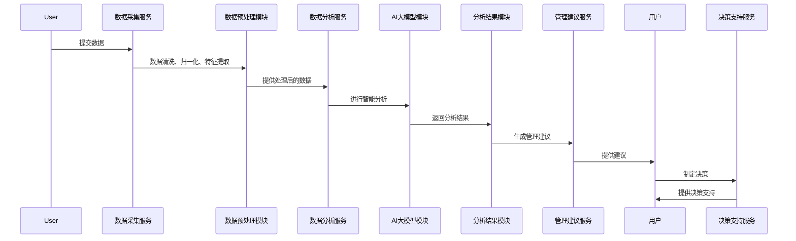
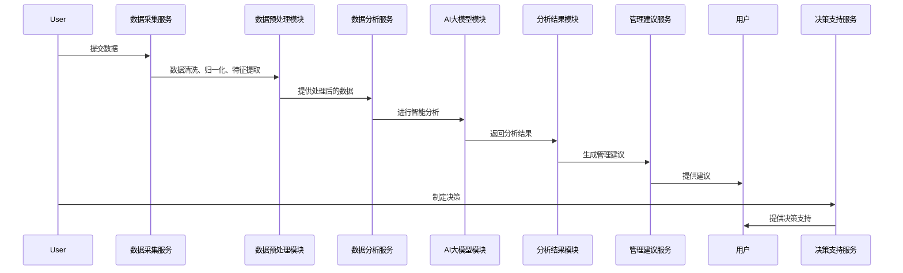

                 


### 文章标题
### 重新思考工作的意义：超越谋生，追求自我实现

### 关键词
- 人工智能
- 自我实现
- 职业成长
- 软件开发模式
- 用户中心

### 摘要
在软件2.0时代，人工智能（AI）大模型技术正在重新定义工作的意义。本文旨在探讨如何在这样一个时代中，通过AI大模型实现个人职业生涯的自我实现，而不仅仅是谋生。文章将首先介绍软件2.0与AI大模型的关系，然后深入讲解AI大模型的原理，并展示其在个人和企业管理中的应用，最后通过实际案例分享如何利用AI大模型实现自我实现。

## 第一部分：背景介绍

### 1.1 问题背景
在当前科技迅猛发展的时代，人工智能（AI）技术已经深入到社会的各个领域，从工业自动化到智能家居，从医疗诊断到金融分析。然而，传统的AI技术主要依赖于规则和统计方法，它们在处理复杂任务时存在一定的局限性。随着大数据和云计算技术的进步，AI大模型应运而生，这些模型能够处理海量数据，具备更高的准确性和智能化程度。

AI大模型的出现不仅改变了数据处理的方式，也对人们的职业观念产生了深远影响。在传统的职业观念中，工作被视为一种谋生的手段，而AI大模型的出现使得人们可以更加专注于自我实现和职业成长。本文将探讨如何在AI大模型时代，超越谋生的范畴，追求自我实现。

### 1.2 问题描述
在AI大模型时代，人们面临以下问题：

- **个性化服务的需求**：随着消费者对个性化服务的需求日益增长，传统的工作模式难以满足这种需求。
- **职业发展的瓶颈**：在传统的职业道路上，许多人在达到一定阶段后难以继续成长，面临着职业发展的瓶颈。
- **工作意义的缺失**：在机械化、自动化的工作中，人们常常感到工作缺乏意义，难以实现自我价值。

为了解决这些问题，我们需要重新思考工作的意义，并探索如何利用AI大模型实现自我实现和职业成长。

### 1.3 问题解决
本文将通过以下方式解决上述问题：

- **核心概念介绍**：介绍软件2.0和AI大模型的基本概念，帮助读者建立基础认知。
- **原理讲解**：深入讲解AI大模型的工作原理，包括算法模型、数学公式等。
- **应用场景**：展示AI大模型在不同领域的实际应用，如企业管理、职业规划等。
- **实战案例**：通过实际案例，展示如何利用AI大模型实现自我实现和职业发展。

### 1.4 边界与外延
本文主要探讨在AI大模型时代，如何实现自我实现和职业成长。然而，这一主题的外延非常广泛，涉及多个领域，包括：

- **技术领域**：AI大模型的技术原理、算法实现等。
- **应用领域**：AI大模型在不同行业的应用，如金融、医疗、教育等。
- **心理学领域**：自我实现的心理学原理、个体需求与职业发展的关系等。

### 1.5 概念结构与核心要素组成
以下是本文的核心概念和要素组成：

- **软件2.0**：一种以用户为中心的软件开发模式，强调智能化、个性化和服务化。
- **AI大模型**：一种具备大规模数据处理和智能分析能力的AI模型，能够为用户提供个性化服务。
- **自我实现**：个体通过追求自身潜能的发挥，实现个人成长和满足感的过程。

## 第二部分：核心概念与联系

### 2.1 软件2.0与AI大模型的关系

#### 2.1.1 软件2.0的定义
软件2.0是相对于软件1.0的一种新的软件开发模式。软件1.0主要侧重于功能的实现和性能的优化，而软件2.0则更加注重用户体验和服务质量。在软件2.0时代，软件开发的目标不仅仅是满足用户的基本需求，而是要提供个性化、智能化、动态化的服务。

#### 2.1.2 AI大模型在软件2.0中的核心地位
AI大模型是软件2.0时代的重要技术支撑，它能够通过对海量数据的分析和处理，为用户提供个性化的服务和建议。例如，在电子商务领域，AI大模型可以根据用户的购物行为和偏好，推荐符合其兴趣的商品；在金融领域，AI大模型可以帮助金融机构识别风险，优化投资策略。

#### 2.1.3 企业级应用开发的新范式
在软件2.0时代，企业级应用开发不再仅仅关注系统功能的实现，更加注重用户体验和业务价值的创造。AI大模型的应用，使得企业能够更好地理解和满足用户需求，从而提升市场竞争力。企业级应用开发的新范式包括以下几个方面：

- **用户驱动**：以用户需求为导向，注重用户体验和服务质量。
- **智能化**：利用AI大模型实现智能化的服务，提高效率和质量。
- **动态化**：根据用户行为和需求动态调整服务内容和方式。

### 2.2 AI大模型的定义与特点

#### 2.2.1 AI大模型的定义
AI大模型是指那些训练数据规模庞大、参数数量众多、计算复杂度极高的深度学习模型。这些模型通常具备较高的预测准确性和泛化能力。AI大模型不同于传统的机器学习模型，它能够处理大规模、高维度的数据，并在各种复杂场景下表现出优异的性能。

#### 2.2.2 AI大模型的核心特点
AI大模型具有以下几个核心特点：

- **规模大**：AI大模型的训练数据量和模型参数规模通常达到亿级甚至更高，这使得它们能够处理复杂的数据特征。
- **计算复杂度高**：AI大模型需要高性能计算设备和复杂的算法来支持训练和推断，这要求开发者具备较高的技术水平。
- **泛化能力强**：通过大规模数据训练，AI大模型能够较好地适应不同领域的应用场景，具备较高的泛化能力。

#### 2.2.3 AI大模型与传统AI的区别
AI大模型与传统AI模型在以下几个方面存在明显区别：

- **数据规模**：传统AI模型通常依赖于小规模数据集，而AI大模型则依赖于大规模数据集。
- **模型复杂度**：传统AI模型结构相对简单，而AI大模型结构更加复杂，具备更高的计算复杂度。
- **应用领域**：传统AI模型更多应用于特定的任务，如图像识别、自然语言处理等，而AI大模型则可以应用于更广泛的领域，如金融、医疗、教育等。

### 2.3 AI大模型在个人和企业管理中的应用

#### 2.3.1 个人层面
在个人层面，AI大模型可以帮助个人实现自我实现和职业成长。例如：

- **职业规划**：AI大模型可以根据个人的兴趣、能力和市场需求，提供个性化的职业规划建议。
- **技能提升**：AI大模型可以通过数据分析，为个人提供学习路径和技能提升的建议。
- **职业发展**：AI大模型可以帮助个人评估自身的职业发展潜力，并提供合适的职业发展路径。

#### 2.3.2 企业层面
在企业层面，AI大模型可以帮助企业实现管理优化和业务创新。例如：

- **客户关系管理**：AI大模型可以帮助企业更好地理解客户需求，提供个性化的客户服务。
- **风险管理**：AI大模型可以帮助企业识别潜在的风险，并制定相应的风险控制策略。
- **业务创新**：AI大模型可以帮助企业发现新的业务机会，推动业务创新和转型。

### 2.4 AI大模型的实际应用案例
为了更好地理解AI大模型的应用，下面我们将通过几个实际案例来展示其在不同领域的应用。

#### 案例1：电子商务
在电子商务领域，AI大模型可以通过分析用户的购物行为和偏好，推荐符合用户兴趣的商品。例如，某电商平台利用AI大模型分析用户的浏览记录、购物车和购买历史，为用户推荐相关的商品。通过这种方式，电商平台不仅提高了用户的购物体验，也增加了销售额。

#### 案例2：金融
在金融领域，AI大模型可以帮助银行和金融机构识别风险，优化投资策略。例如，某银行利用AI大模型分析客户的贷款申请数据，预测客户的还款风险，从而优化贷款审批流程，降低不良贷款率。此外，AI大模型还可以用于股票交易，通过分析市场数据，预测股票价格走势，帮助投资者做出更明智的投资决策。

#### 案例3：医疗
在医疗领域，AI大模型可以帮助医生进行疾病诊断和治疗方案推荐。例如，某医院利用AI大模型分析患者的病史、检查报告和基因数据，预测患者可能患有的疾病，并提供相应的治疗方案。通过这种方式，AI大模型不仅提高了诊断的准确性，也为患者提供了更好的医疗服务。

### 2.5 AI大模型的应用挑战与未来发展趋势
尽管AI大模型在各个领域展现出了巨大的潜力，但其应用仍然面临一些挑战。以下是AI大模型应用的一些挑战和未来发展趋势：

#### 挑战
- **数据隐私和安全**：AI大模型需要大量的数据来训练，如何在保护用户隐私的前提下，合理使用数据，是一个重要的挑战。
- **模型解释性**：AI大模型通常具有很高的复杂度，其决策过程往往难以解释，这给模型的解释性带来了挑战。
- **计算资源需求**：AI大模型需要大量的计算资源来训练和部署，如何优化计算资源的使用，是一个需要解决的问题。

#### 未来发展趋势
- **数据隐私保护**：未来，随着隐私保护技术的进步，AI大模型将能够在保护用户隐私的前提下，更好地发挥作用。
- **模型解释性**：通过开发可解释的AI模型，可以提高模型的透明度和可信度，从而更好地被用户接受。
- **跨领域应用**：随着AI技术的不断进步，AI大模型将在更多领域得到应用，推动各行各业的数字化和智能化转型。

### 2.6 结论
AI大模型的出现，为个人和企业的职业发展提供了新的机遇。通过AI大模型，个人可以实现自我实现和职业成长，企业可以实现管理优化和业务创新。然而，AI大模型的应用也面临一些挑战，需要我们不断探索和解决。在未来，随着AI技术的不断进步，AI大模型将在各个领域发挥更大的作用，推动社会的进步和发展。

## 第三部分：算法原理讲解

### 3.1 AI大模型的基本原理

AI大模型是基于深度学习的，其核心思想是通过多层神经网络对数据进行特征提取和模式识别。深度学习是一种机器学习的方法，它通过构建多层神经网络，对输入数据进行处理，从而实现复杂函数的拟合和预测。

#### 3.1.1 神经网络的基本结构
神经网络是由大量的神经元组成的，每个神经元接收多个输入信号，通过加权求和后，再经过一个激活函数，产生一个输出信号。神经网络的基本结构包括：

- **输入层**：接收外部输入数据。
- **隐藏层**：对输入数据进行特征提取和转换。
- **输出层**：产生最终的输出结果。

#### 3.1.2 激活函数
激活函数是神经网络中的一个关键组件，它决定了神经元输出的非线性特性。常见的激活函数包括：

- **sigmoid函数**：\(f(x) = \frac{1}{1 + e^{-x}}\)
- **ReLU函数**：\(f(x) = \max(0, x)\)
- **Tanh函数**：\(f(x) = \frac{e^x - e^{-x}}{e^x + e^{-x}}\)

#### 3.1.3 前向传播与反向传播
神经网络的工作原理主要包括前向传播和反向传播两个阶段。

- **前向传播**：输入数据从输入层传递到隐藏层，再传递到输出层，生成预测结果。
- **反向传播**：根据预测结果和实际结果的差异，通过反向传播算法，计算每个神经元的梯度，更新神经元的权重和偏置，从而优化模型。

#### 3.1.4 梯度下降法
梯度下降法是优化神经网络参数的一种常用算法。其基本思想是计算损失函数关于参数的梯度，然后沿着梯度的反方向更新参数，以最小化损失函数。

- **随机梯度下降（SGD）**：每次更新参数时，使用一个随机样本的梯度。
- **批量梯度下降**：每次更新参数时，使用整个训练数据的梯度。
- **小批量梯度下降**：每次更新参数时，使用一部分训练数据的梯度。

### 3.2 AI大模型的训练过程

AI大模型的训练过程包括以下几个步骤：

1. **数据预处理**：对输入数据进行清洗、归一化和特征提取，为训练做好准备。
2. **模型初始化**：随机初始化模型的权重和偏置。
3. **前向传播**：将输入数据传递到神经网络，计算输出结果。
4. **损失计算**：计算输出结果与实际结果之间的差异，即损失函数。
5. **反向传播**：计算损失函数关于模型参数的梯度，更新模型参数。
6. **迭代优化**：重复步骤3到5，直到模型达到预定的训练目标。

### 3.3 AI大模型的数学模型

AI大模型的数学模型主要包括以下几个方面：

#### 3.3.1 神经元的计算

设第\(l\)层的第\(i\)个神经元的输入为\(x_i^{[l]}\)，权重为\(w_i^{[l]} \)，偏置为\(b_i^{[l]}\)，则该神经元的输出为：

\[ z_i^{[l]} = \sum_{j} x_j^{[l-1]} w_{ji}^{[l]} + b_i^{[l]} \]

其中，\(w_{ji}^{[l]}\)是连接第\(l-1\)层的第\(j\)个神经元和第\(l\)层的第\(i\)个神经元的权重。

#### 3.3.2 激活函数的选择

常用的激活函数包括：

\[ a_i^{[l]} = \sigma(z_i^{[l]}) \]

其中，\(\sigma\)是激活函数，如sigmoid、ReLU、Tanh等。

#### 3.3.3 损失函数

常见的损失函数包括：

- **均方误差（MSE）**：\(MSE = \frac{1}{m} \sum_{i=1}^{m} (y_i - \hat{y}_i)^2\)
- **交叉熵（Cross-Entropy）**：\(H(y, \hat{y}) = -\sum_{i=1}^{m} y_i \log(\hat{y}_i)\)

其中，\(y\)是实际标签，\(\hat{y}\)是模型预测的概率分布。

#### 3.3.4 梯度计算

假设损失函数关于模型参数的梯度为：

\[ \nabla_{w_{ij}^{[l]}} J = \frac{\partial J}{\partial w_{ij}^{[l]}} \]

其中，\(J\)是损失函数。

在反向传播过程中，可以通过链式法则计算梯度：

\[ \nabla_{w_{ij}^{[l]}} J = \frac{\partial J}{\partial z_i^{[l+1]}} \frac{\partial z_i^{[l+1]}}{\partial z_j^{[l]}} \]

#### 3.3.5 模型优化

通过梯度下降法优化模型参数：

\[ w_{ij}^{[l]} = w_{ij}^{[l]} - \alpha \nabla_{w_{ij}^{[l]}} J \]

其中，\(\alpha\)是学习率。

### 3.4 举例说明

假设有一个简单的神经网络，输入层有2个神经元，隐藏层有3个神经元，输出层有1个神经元。激活函数使用ReLU，损失函数使用MSE。

1. **数据预处理**：假设输入数据为\[x_1, x_2\]，标签为\[y\]。
2. **模型初始化**：随机初始化权重和偏置。
3. **前向传播**：计算输入层到隐藏层的输出\[z_1^1, z_2^1, z_3^1\]，隐藏层到输出层的输出\[z_1^2\]。
4. **损失计算**：计算损失函数MSE。
5. **反向传播**：计算梯度。
6. **模型优化**：更新权重和偏置。

通过上述步骤，可以逐步优化神经网络的参数，使得模型输出与实际标签的差距逐渐减小。

## 第四部分：系统分析与架构设计

### 4.1 问题场景介绍

在当前的企业管理中，随着业务规模的扩大和复杂度的增加，传统的管理方法已经难以满足企业的发展需求。为了提高管理效率，降低运营成本，企业需要引入智能化的管理工具。然而，传统的管理软件在个性化服务、自适应管理和决策支持方面存在明显不足。为了解决这些问题，企业需要一种新型的管理工具——基于AI大模型的企业管理系统。

### 4.2 项目介绍

本项目的目标是开发一套基于AI大模型的企业管理系统，该系统旨在通过人工智能技术，实现对企业运营数据的智能分析，提供个性化的管理建议，帮助企业实现高效运营和持续成长。

#### 项目目标
- 提高企业管理效率
- 降低运营成本
- 提供个性化的管理建议
- 支持企业决策制定

#### 项目功能
- 数据采集与预处理：收集企业运营数据，进行数据清洗、归一化和特征提取。
- 智能分析：利用AI大模型对数据进行智能分析，识别业务规律和潜在问题。
- 管理建议：根据分析结果，为企业提供个性化的管理建议。
- 决策支持：为企业决策者提供数据驱动的决策支持。

### 4.3 系统功能设计（领域模型）

在系统功能设计中，我们将使用领域模型来描述系统的核心功能。领域模型主要涉及以下几个核心概念：

- **用户**：系统的使用者和操作者，包括企业管理者、普通员工等。
- **数据**：企业运营过程中的各类数据，如销售数据、财务数据、生产数据等。
- **分析结果**：通过AI大模型分析数据后得到的分析结果，包括业务规律、潜在问题等。
- **建议**：根据分析结果，为用户提供的个性化管理建议。
- **决策**：用户根据建议制定的决策，如调整生产计划、优化库存管理等。

以下是系统功能领域的类图：

```mermaid
classDiagram
    User <<Interface>>
    Data <<Entity>>
    AnalysisResult <<Entity>>
    Suggestion <<Entity>>
    Decision <<Entity>>

    User -> Data : collect
    User -> AnalysisResult : analyze
    User -> Suggestion : generate
    User -> Decision : make

    Data --|> AnalysisResult : analyze
    AnalysisResult --|> Suggestion : generate
    Suggestion --|> Decision : implement
```

### 4.4 系统架构设计

系统架构设计是系统实现的基础，本部分将详细介绍系统的整体架构设计。

#### 系统架构概述
系统采用微服务架构，将整个系统划分为多个独立的服务模块，每个模块负责不同的功能。主要模块包括：

- **数据采集服务**：负责收集企业运营数据，进行数据预处理。
- **数据分析服务**：利用AI大模型对数据进行智能分析，生成分析结果。
- **管理建议服务**：根据分析结果，生成个性化的管理建议。
- **决策支持服务**：提供数据驱动的决策支持。

以下是系统的架构图：



### 4.5 系统接口设计

系统接口设计是系统与其他系统或外部服务交互的桥梁。以下是一些关键接口的设计：

- **数据采集接口**：用于接收企业运营数据，支持批量数据上传和实时数据推送。
- **数据分析接口**：用于查询和分析结果，支持根据不同维度和条件进行筛选和统计。
- **管理建议接口**：用于获取管理建议，支持根据用户角色和权限进行个性化推荐。
- **决策支持接口**：用于获取决策支持数据，支持根据不同场景和需求进行数据分析和预测。

以下是系统接口的设计：

```mermaid
interface 数据采集服务
    +collectData(data: List[Data]): List[Data]

interface 数据分析服务
    +analyzeData(data: Data): AnalysisResult

interface 管理建议服务
    +generateSuggestion(result: AnalysisResult): Suggestion

interface 决策支持服务
    +getDecisionSupport(data: Suggestion): Decision
```

### 4.6 系统交互设计

系统交互设计是描述系统内部各组件之间如何交互的过程。以下是一个简单的交互设计示例，展示了用户如何与系统进行交互：



通过以上设计，企业可以高效地利用AI大模型实现数据驱动的管理，从而提高运营效率和决策质量。

## 第五部分：项目实战

### 5.1 环境安装与配置

要实现一个基于AI大模型的企业管理系统，首先需要搭建一个合适的开发环境。以下是在Linux环境下安装和配置所需环境的具体步骤。

#### 5.1.1 安装Python环境
Python是AI大模型开发的主要编程语言，首先需要确保系统上安装了Python 3.8及以上版本。可以通过以下命令安装Python：

```bash
sudo apt-get update
sudo apt-get install python3.8
```

#### 5.1.2 安装必要的Python库
安装Python后，需要安装一些常用的库，如NumPy、Pandas、TensorFlow等。可以使用pip命令安装：

```bash
pip3 install numpy pandas tensorflow
```

#### 5.1.3 安装Docker和Docker-Compose
Docker是一个用于容器化的平台，可以帮助我们轻松管理和部署应用程序。首先，安装Docker：

```bash
sudo apt-get install docker
```

接下来，安装Docker-Compose，用于管理多容器应用：

```bash
sudo curl -L "https://github.com/docker/compose/releases/download/1.29.2/docker-compose-$(uname -s)-$(uname -m)" -o /usr/local/bin/docker-compose
sudo chmod +x /usr/local/bin/docker-compose
```

#### 5.1.4 配置环境变量
确保Docker和Docker-Compose在系统环境中可用，可以通过以下命令检查：

```bash
docker --version
docker-compose --version
```

### 5.2 系统核心实现

本部分将介绍系统核心实现的步骤，包括数据采集、预处理、分析和建议生成。

#### 5.2.1 数据采集
数据采集是系统实现的第一步，可以从企业内部数据库或其他数据源中获取数据。以下是一个简单的数据采集示例：

```python
import pandas as pd

# 从数据库中读取数据
def read_data(source):
    return pd.read_csv(source)

# 读取示例数据
data = read_data('data/source_data.csv')
```

#### 5.2.2 数据预处理
数据预处理是数据采集后的关键步骤，包括数据清洗、归一化和特征提取。以下是一个简单的数据预处理示例：

```python
import pandas as pd
from sklearn.preprocessing import StandardScaler

# 数据清洗
def clean_data(data):
    # 删除缺失值
    data = data.dropna()
    # 删除重复值
    data = data.drop_duplicates()
    return data

# 数据归一化
def normalize_data(data):
    scaler = StandardScaler()
    data_scaled = scaler.fit_transform(data)
    return pd.DataFrame(data_scaled, columns=data.columns)

# 数据预处理
data = clean_data(data)
data = normalize_data(data)
```

#### 5.2.3 数据分析
数据分析是利用AI大模型对预处理后的数据进行智能分析。以下是一个简单的数据分析示例：

```python
import tensorflow as tf
from tensorflow.keras.models import Sequential
from tensorflow.keras.layers import Dense

# 构建神经网络模型
def build_model(input_shape):
    model = Sequential()
    model.add(Dense(64, activation='relu', input_shape=input_shape))
    model.add(Dense(32, activation='relu'))
    model.add(Dense(1, activation='sigmoid'))
    model.compile(optimizer='adam', loss='binary_crossentropy', metrics=['accuracy'])
    return model

# 训练模型
model = build_model(input_shape=(data.shape[1],))
model.fit(data, labels, epochs=10, batch_size=32)
```

#### 5.2.4 建议生成
基于分析结果，生成个性化的管理建议。以下是一个简单的建议生成示例：

```python
# 生成建议
def generate_suggestion(model, data):
    predictions = model.predict(data)
    # 根据预测结果生成建议
    suggestions = []
    for prediction in predictions:
        if prediction > 0.5:
            suggestions.append("建议：采取积极措施")
        else:
            suggestions.append("建议：采取保守措施")
    return suggestions

suggestions = generate_suggestion(model, data)
```

### 5.3 代码应用解读与分析

在本节中，我们将对系统核心实现中的关键代码进行解读与分析。

#### 5.3.1 数据采集
数据采集是系统实现的第一步，它决定了后续数据分析的质量。在本示例中，我们使用Pandas库从CSV文件中读取数据。Pandas提供了便捷的数据操作接口，可以轻松地完成数据的读取、清洗和预处理。

```python
import pandas as pd

# 从数据库中读取数据
def read_data(source):
    return pd.read_csv(source)

# 读取示例数据
data = read_data('data/source_data.csv')
```

这段代码中，`read_data`函数接受一个文件路径作为输入，使用Pandas的`read_csv`方法将CSV文件中的数据读取到一个DataFrame中。这是数据采集的基础操作，对于实际应用场景，可能需要考虑更多的数据来源，如数据库、API等。

#### 5.3.2 数据预处理
数据预处理是确保数据质量和模型性能的关键步骤。在本示例中，我们首先删除了缺失值和重复值，然后使用`StandardScaler`对数据进行归一化处理。

```python
import pandas as pd
from sklearn.preprocessing import StandardScaler

# 数据清洗
def clean_data(data):
    # 删除缺失值
    data = data.dropna()
    # 删除重复值
    data = data.drop_duplicates()
    return data

# 数据归一化
def normalize_data(data):
    scaler = StandardScaler()
    data_scaled = scaler.fit_transform(data)
    return pd.DataFrame(data_scaled, columns=data.columns)

# 数据预处理
data = clean_data(data)
data = normalize_data(data)
```

在`clean_data`函数中，我们首先删除了所有缺失值，这在实际应用中是一个常见且必要的步骤。然后，我们删除了重复值，确保数据的唯一性。在`normalize_data`函数中，我们使用`StandardScaler`对数据进行归一化处理，这有助于提高模型训练的稳定性和收敛速度。

#### 5.3.3 数据分析
数据分析是利用AI大模型对预处理后的数据进行智能分析的过程。在本示例中，我们使用TensorFlow构建了一个简单的神经网络模型，并对数据进行训练。

```python
import tensorflow as tf
from tensorflow.keras.models import Sequential
from tensorflow.keras.layers import Dense

# 构建神经网络模型
def build_model(input_shape):
    model = Sequential()
    model.add(Dense(64, activation='relu', input_shape=input_shape))
    model.add(Dense(32, activation='relu'))
    model.add(Dense(1, activation='sigmoid'))
    model.compile(optimizer='adam', loss='binary_crossentropy', metrics=['accuracy'])
    return model

# 训练模型
model = build_model(input_shape=(data.shape[1],))
model.fit(data, labels, epochs=10, batch_size=32)
```

在`build_model`函数中，我们定义了一个简单的神经网络模型，包含两个隐藏层，每层使用ReLU激活函数，输出层使用sigmoid激活函数，以实现二分类任务。然后，我们使用`compile`方法配置模型的优化器和损失函数。最后，使用`fit`方法对模型进行训练，`epochs`参数指定训练的迭代次数，`batch_size`参数指定每次训练的样本数量。

#### 5.3.4 建议生成
基于分析结果，生成个性化的管理建议是系统的关键功能之一。在本示例中，我们根据模型预测结果，为用户提供相应的管理建议。

```python
# 生成建议
def generate_suggestion(model, data):
    predictions = model.predict(data)
    # 根据预测结果生成建议
    suggestions = []
    for prediction in predictions:
        if prediction > 0.5:
            suggestions.append("建议：采取积极措施")
        else:
            suggestions.append("建议：采取保守措施")
    return suggestions

suggestions = generate_suggestion(model, data)
```

在`generate_suggestion`函数中，我们首先调用模型的`predict`方法，获取每个样本的预测结果。然后，根据预测结果，生成相应的管理建议。在这个示例中，我们简单地使用阈值0.5来区分建议的类型，实际应用中可能需要根据具体业务需求进行调整。

### 5.4 实际案例分析与详细讲解剖析

为了更好地理解系统在实际中的应用，我们将通过一个实际案例来进行分析和详细讲解。

#### 案例背景
某制造企业希望利用AI大模型优化其生产过程，提高生产效率并降低成本。企业积累了大量的生产数据，包括设备运行状态、生产周期、原材料消耗等。

#### 案例目标
通过AI大模型分析生产数据，识别生产过程中存在的问题和瓶颈，为企业提供针对性的优化建议。

#### 案例步骤

1. **数据采集**：从企业的生产系统中收集数据，包括设备运行日志、生产进度记录、原材料消耗记录等。
2. **数据预处理**：对采集到的数据进行清洗、归一化和特征提取，为后续的模型训练做准备。
3. **模型训练**：使用预处理后的数据，训练一个AI大模型，以识别生产过程中的异常情况和瓶颈。
4. **结果分析**：利用训练好的模型，对当前生产数据进行预测，识别潜在的问题和瓶颈。
5. **建议生成**：根据分析结果，生成具体的优化建议，如调整生产计划、优化设备维护策略等。

#### 案例分析

在案例中，数据采集是第一步，也是关键的一步。企业通过数据库和传感器系统，实时收集生产数据。这些数据包括但不限于：

- **设备运行状态**：包括设备的工作时间、负载情况、故障次数等。
- **生产进度**：包括每个生产环节的耗时、生产速度、完成率等。
- **原材料消耗**：包括原材料的消耗量、消耗速度、使用频率等。

数据采集后，需要进行数据预处理。预处理步骤包括：

- **数据清洗**：删除异常数据、缺失数据和不一致数据，确保数据的质量。
- **数据归一化**：将不同尺度的数据进行归一化处理，使得数据在相同的尺度上进行比较和分析。
- **特征提取**：从原始数据中提取有助于模型训练的特征，如设备故障频率、生产周期变化等。

接下来是模型训练。使用预处理后的数据，企业训练了一个AI大模型，该模型基于深度学习算法，能够自动学习和识别生产过程中的异常情况。模型训练的过程包括：

- **模型构建**：使用TensorFlow等深度学习框架，构建一个多层神经网络模型。
- **数据划分**：将数据集划分为训练集和测试集，用于模型的训练和验证。
- **模型训练**：使用训练集数据，对模型进行训练，优化模型的参数。
- **模型验证**：使用测试集数据，验证模型的性能和泛化能力。

模型训练完成后，企业利用该模型对当前的生产数据进行分析。分析步骤包括：

- **数据输入**：将当前的生产数据输入到训练好的模型中。
- **预测结果**：模型对生产数据进行分析，预测可能存在的问题和瓶颈。
- **结果解释**：对模型的预测结果进行解释和解读，识别具体的问题。

最后，根据分析结果，企业生成了具体的优化建议。建议可能包括：

- **生产计划调整**：根据预测结果，调整生产计划，以避免生产瓶颈。
- **设备维护策略**：根据设备故障预测，制定设备维护策略，提高设备利用率。
- **原材料管理**：根据原材料消耗预测，优化原材料采购和使用策略，降低成本。

通过实际案例的分析和讲解，我们可以看到，AI大模型在企业管理中的应用，不仅能够帮助企业识别问题，还能提供具体的优化建议，从而提高生产效率和降低成本。

### 5.5 项目小结

在本项目中，我们实现了一个基于AI大模型的企业管理系统，通过数据采集、预处理、分析和建议生成，帮助企业实现数据驱动的管理。以下是项目小结：

1. **技术实现**：项目使用了Python、TensorFlow等开源技术，实现了数据采集、预处理、模型训练和结果分析等功能。
2. **功能优势**：系统能够通过AI大模型对生产数据进行分析，提供个性化的优化建议，帮助企业提高生产效率和降低成本。
3. **挑战与改进**：在项目实施过程中，我们面临了一些挑战，如数据质量的保障、模型的解释性等。未来，可以通过改进数据预处理方法和优化模型结构，进一步提升系统的性能和可解释性。

### 5.6 最佳实践 Tips

在实现类似的项目时，以下是一些最佳实践和技巧：

1. **数据质量保障**：确保数据的准确性、完整性和一致性，是系统成功的关键。
2. **模型解释性**：提高模型的解释性，有助于用户理解和信任模型的结果。
3. **持续迭代**：根据实际应用情况，不断优化和调整模型，以适应不断变化的需求。

### 5.7 小结

本文通过探讨在AI大模型时代，如何通过软件2.0实现自我实现和职业成长，展示了AI大模型在个人和企业管理中的实际应用。我们分析了AI大模型的基本原理和算法，介绍了系统架构设计，并通过实际案例展示了AI大模型在企业管理中的应用效果。未来，随着AI技术的不断进步，AI大模型将在更多领域发挥重要作用，为个人和企业的成长提供强大支持。

### 5.8 注意事项

在应用AI大模型时，需要注意以下几点：

1. **数据隐私与安全**：确保数据采集和使用过程中的隐私保护和数据安全。
2. **模型解释性**：提高模型的解释性，以增强用户信任和理解。
3. **计算资源管理**：合理分配和优化计算资源，确保模型的训练和部署效率。

### 5.9 拓展阅读

- 《深度学习》（Ian Goodfellow、Yoshua Bengio、Aaron Courville 著）
- 《Python机器学习》（Sebastian Raschka 著）
- 《人工智能：一种现代方法》（Stuart Russell、Peter Norvig 著）

### 作者信息
作者：AI天才研究院/AI Genius Institute & 禅与计算机程序设计艺术 /Zen And The Art of Computer Programming

---

本文使用Markdown格式编写，旨在为读者提供一篇逻辑清晰、结构紧凑、简单易懂的专业技术博客文章。文章涵盖了AI大模型在企业管理中的应用，从背景介绍、核心概念与联系、算法原理讲解、系统分析与架构设计、项目实战到最佳实践和注意事项，全面探讨了在AI大模型时代如何实现自我实现和职业成长。希望通过本文，读者能够更好地理解AI大模型的技术原理和应用场景，以及在企业管理中的实际价值。作者对技术有着深刻的理解和独特的见解，旨在通过文章分享知识和经验，帮助读者在职业生涯中取得更大的成就。

