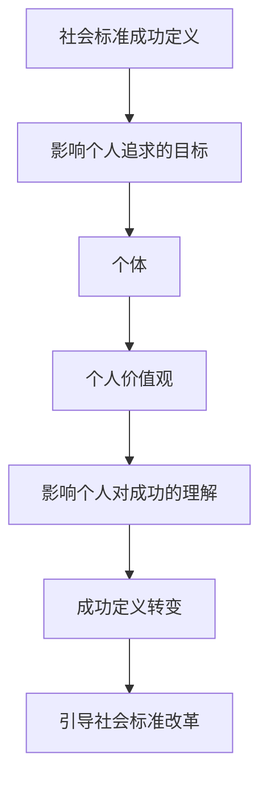
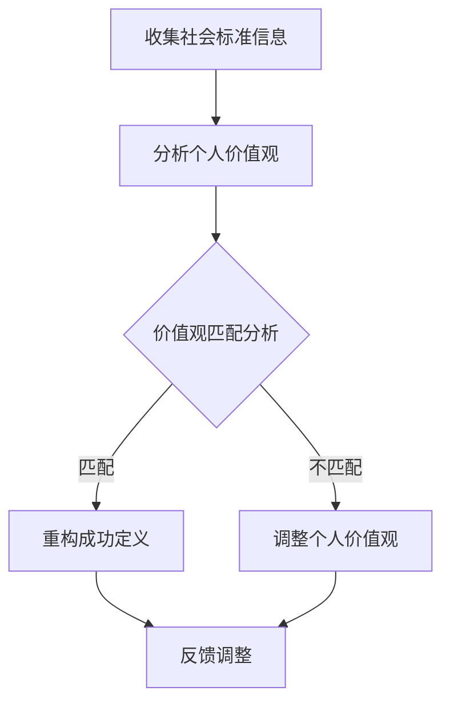
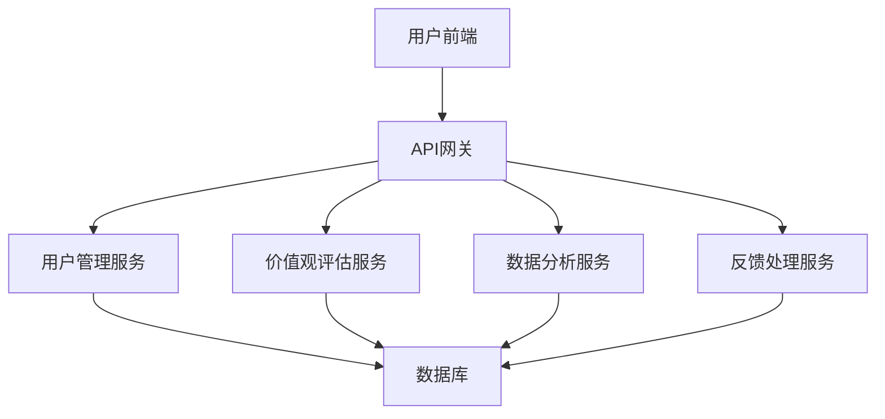

                 


## 引言

在当今社会，成功成为了一个广泛讨论的话题。然而，对于什么是成功的定义却一直存在着争议。传统上，成功被普遍认为是拥有高收入、高地位和社会认可。这些标准在很大程度上受到社会结构和传统价值观的影响，往往被大多数人所接受。然而，随着社会的发展和个体意识的觉醒，越来越多的人开始质疑这种单一的成功定义，并开始探索更加个性化和多元化的成功标准。

本文将重新思考成功定义，从社会标准到个人价值观的转变。我们首先会回顾社会标准下的成功定义，探讨其背后的逻辑和问题。接着，我们将探讨个人价值观的概念，分析其在成功定义中的重要性。最后，我们将逐步阐述成功定义的转变过程，并引入一个简单的算法模型，来帮助我们理解和实践这一转变。

通过这篇文章，我们希望能够激发读者对于成功定义的深入思考，帮助大家更好地理解自己的价值观，并在追求成功的道路上找到更加适合自己的方向。

### 第一部分：背景介绍

#### 1. 社会标准下的成功定义

社会标准下的成功定义是一个历史悠久的传统，其核心在于追求社会所认可的成就和地位。传统观念认为，成功意味着拥有高收入、高社会地位以及广泛的社会认可。这种定义有着深刻的根源和广泛的影响。

首先，从历史角度来看，社会标准下的成功定义可以追溯到古希腊和古罗马时期。当时的成功观念主要体现在政治权力和经济财富的积累上。这些观念通过漫长的时间和文化的传承，逐渐演变成了现代社会对成功的普遍理解。

其次，从逻辑上讲，社会标准下的成功定义基于一种共识和共通性。人们相信，如果每个人都追求相似的成功标准，社会将变得更加有序和稳定。这种统一的标准有助于形成社会规范，促进社会成员之间的合作和互动。

然而，这种成功定义也带来了一系列问题。首先，它往往忽视了个体之间的差异。每个人对成功的理解都是独特的，社会标准却试图用统一的标准来衡量所有个体。这种单一的成功定义往往导致个体为了追求社会认可而放弃自己的真实愿望和价值观。

此外，社会标准下的成功定义也容易导致过度竞争和压力。当整个社会都追求相同的标准时，人们会感受到巨大的竞争压力。这种压力往往促使人们采取不健康的行为，如加班、牺牲家庭和健康，以达到社会的成功标准。

总之，社会标准下的成功定义在历史上有着重要的影响，但也存在明显的局限性。它忽视了个体之间的差异，导致过度竞争和压力。因此，重新思考成功定义，探索更加个性化和多元化的标准，显得尤为重要。

#### 1.2 问题描述

在现代社会中，社会标准下的成功定义带来了一系列问题，这些问题不仅影响个人的心理健康，也对社会整体产生了深远的影响。

首先，社会标准下的成功定义常常导致个人内心的焦虑和不安。当个体发现自己的成就和社会标准之间存在差距时，他们往往会感到自卑和不满。这种心理压力可能导致心理健康问题，如抑郁症、焦虑症等。

其次，社会标准下的成功定义容易导致社会的不公平。社会标准通常是由社会精英和有权势的人群所定义的，这些标准往往偏向于那些有资源和机会的人。这导致那些资源匮乏或者处于社会边缘的人难以实现社会标准下的成功。长期下去，这种不公平感会加剧社会的不稳定和冲突。

此外，社会标准下的成功定义也容易导致资源的浪费。当整个社会都追求相同的目标时，资源往往会被集中投入到少数领域，而其他领域则被忽视。这种资源分配的不合理性会导致社会发展的不平衡，影响社会的长期繁荣。

总的来说，社会标准下的成功定义在现代社会中带来了诸多问题。个人层面的焦虑和不安、社会的不公平以及资源的浪费，都表明我们需要重新审视这一成功的定义。只有通过更加个性化和多元化的成功标准，才能更好地满足个体的需求，促进社会的整体进步。

#### 1.3 问题解决

为了解决社会标准下成功定义所带来的问题，我们需要采取一系列措施，从政策、教育和文化等多个方面入手。

首先，政策层面可以采取一些措施来引导公众重新定义成功。政府可以通过宣传和教育活动，鼓励人们追求更加个性化和多元化的目标。例如，政府可以推广心理健康教育，帮助人们理解并应对内心的焦虑和不安。此外，政府还可以通过税收优惠和其他激励措施，鼓励人们追求那些对社会有益但传统上不被视为成功的事业，如社会公益、环保和艺术等领域。

其次，教育层面也起着至关重要的作用。学校和教育机构应该为学生提供多样化的成功观念，帮助他们认识到成功不仅仅与经济和地位相关，还包括个人成长、心理健康和社会贡献等多个方面。通过课程设置和实践活动，教育机构可以培养学生的创新思维和批判性思维，鼓励他们根据自己的兴趣和价值观来定义成功。

此外，文化层面也需要改变。媒体和娱乐产业应该减少对传统成功定义的宣传，更多地展示和推广那些多样化的成功故事。这有助于社会形成更加包容和多元的价值观念，减少对单一成功标准的追求和压力。

最后，个人层面也需要自我调整。每个人都需要反思自己的价值观，并根据自己的兴趣和需求来定义成功。这需要勇气和自我认知，但只有通过这种方式，个体才能真正找到属于自己的成功之路，避免因为追求社会标准而导致的焦虑和不满。

总之，通过政策、教育和文化的共同努力，我们可以逐步改变社会对成功的定义，引导公众追求更加个性化和多元化的目标，从而解决传统成功定义所带来的问题。

#### 1.4 边界与外延

在讨论社会标准下的成功定义时，我们还需要明确其边界与外延，以便更全面地理解这一概念。

首先，社会标准下的成功定义具有明确的边界。这些边界由社会文化、历史背景和经济发展水平等因素所决定。例如，在一个重视财富和地位的社会中，成功往往与高收入和高社会地位紧密相关。而在一个强调创新和自我实现的社会中，成功可能更多地与个人成就和社会贡献相关。

其次，社会标准下的成功定义具有一定的外延性。这种外延性体现在不同社会和文化背景下，成功定义的具体内容可能会有所不同。例如，在一些东方文化中，成功可能更强调家庭的和谐和孝顺，而在西方文化中，独立和自主性可能被视为成功的关键因素。

此外，社会标准下的成功定义也受到个人价值观的影响。每个人对成功的理解都是独特的，这种个体差异会在社会标准的边界与外延上产生反映。例如，一个人可能认为成功意味着在事业上取得巨大成就，而另一个人可能认为成功在于拥有一个幸福的家庭和健康的生活方式。

总的来说，社会标准下的成功定义是一个复杂的概念，其边界与外延受到多种因素的影响。理解这一概念的不同边界和外延有助于我们更深入地探讨成功的本质，并在实际生活中找到适合自己的成功之路。

#### 1.5 核心概念与要素组成

要深入理解社会标准下的成功定义，我们需要明确其核心概念与要素组成。这一部分将详细探讨以下几个关键概念：

首先，**成功**。成功是一个多维度的概念，通常包括经济财富、社会地位和个人成就感。在传统观念中，成功往往与高收入和广泛的社会认可密切相关。然而，随着社会的发展，人们开始认识到成功不仅仅是物质上的成就，还包括心理健康、个人成长和社会贡献。

其次，**社会标准**。社会标准是由社会文化、历史背景和经济发展水平共同塑造的一套行为规范和价值观念。社会标准决定了人们追求成功的方向和方式。例如，在一些社会中，成功可能被定义为拥有高收入和高社会地位，而在其他社会中，成功可能更强调个人成就和对社会的贡献。

第三，**价值观**。价值观是个人对什么是重要和值得追求的观念。每个人的价值观都是独特的，这会影响他们对成功的定义和追求方式。例如，一个人可能认为成功在于拥有财富和地位，而另一个人可能更看重家庭幸福和个人成长。

第四，**个体差异**。个体差异是指每个人在性格、兴趣、能力和价值观上的独特性。个体差异意味着社会标准下的成功定义不可能适用于所有人。一些人可能更擅长和喜欢追求物质上的成功，而另一些人可能更倾向于追求精神上的满足和社会上的贡献。

最后，**社会影响**。社会标准下的成功定义对社会和个人都有深远的影响。对社会而言，统一的成功标准有助于形成社会规范，促进社会成员之间的合作和互动。对个人而言，追求社会标准下的成功可能会带来巨大的心理压力和不安，因为这种标准往往忽视了个体之间的差异。

综上所述，社会标准下的成功定义由多个核心概念和要素组成，这些概念和要素共同决定了我们对成功的理解和追求方式。理解这些概念和要素有助于我们更好地应对现代社会中的成功挑战，找到适合自己的成功之路。

#### 2. 个人价值观的多元视角

个人价值观是定义成功的关键要素之一，其多样性和复杂性决定了我们对成功的理解和追求方式。在传统观念中，成功往往被简化为物质和地位上的成就，而忽视了个体之间的差异和多样化的价值观。然而，随着社会的发展和个体意识的觉醒，人们开始重视个人价值观的多元性，并探讨其如何在成功定义中发挥作用。

首先，**个人价值观的概念**。个人价值观是指个体对何为重要和值得追求的事物的信念和态度。这些价值观可以是基于宗教信仰、文化传统、家庭背景、教育经历或个人经历等多种因素形成的。个人价值观不仅影响个体的行为选择，还决定了他们如何看待成功和生活。

其次，**多元价值观的探讨**。个人价值观的多元性体现在不同个体对成功的定义和追求方式上。例如，有些人可能认为成功在于拥有高收入和事业成就，而另一些人可能更看重家庭幸福和个人成长。这些不同的价值观反映了个体对成功标准的个性化理解，使得成功的定义变得更加丰富和多样化。

**价值观的冲突与融合**。在多元价值观的背景下，价值观之间的冲突和融合也是一个重要议题。当个体面临不同价值观的冲突时，他们可能需要做出艰难的选择。例如，一个人可能认为事业成功是首要的，但同时也意识到家庭的重要性。这种冲突需要个体在理解和平衡不同价值观之间找到自己的平衡点。

**价值观的影响因素**。个人价值观的形成受到多种因素的影响，包括文化背景、家庭环境、教育经历和社会交往等。不同的文化背景和家庭环境会塑造出不同的价值观。例如，在一些文化中，成功可能被定义为拥有财富和地位，而在其他文化中，成功可能更强调道德和社区贡献。家庭环境和教育经历也在很大程度上影响个体的价值观。一个在重视学术成就的家庭中成长的孩子，可能更倾向于追求学业上的成功。而一个在强调社区参与和责任感的家庭中成长的孩子，可能更倾向于追求对社会有积极影响的成功。

总的来说，个人价值观的多元视角为成功定义提供了更加丰富和个性化的维度。理解个人价值观的多元性和复杂性有助于我们更好地认识自己，并在追求成功的道路上找到更加适合自己的方向。通过探讨个人价值观的概念、多元价值观的探讨、价值观的冲突与融合以及价值观的影响因素，我们可以更加深入地理解成功定义的转变过程。

#### 3. 成功定义的转变过程

随着社会的不断进步和个人意识的觉醒，成功的定义也在经历深刻的转变。这一过程不仅反映了社会价值观的变化，也体现了个体对于自身幸福和意义的追求。以下我们将详细探讨这一转变过程，包括社会标准的反思、个人价值观的觉醒以及成功定义的重新构建。

**3.1 社会标准的反思**

社会标准下的成功定义虽然具有其历史和现实的基础，但在现代社会中，这种定义逐渐显现出其局限性和不合理性。首先，社会标准往往倾向于将成功简化为物质成就，忽略了心理健康、个人幸福和社会贡献等其他重要的成功维度。这种单一的成功标准容易导致人们过度追求物质财富和社会地位，从而忽视了生活的其他方面，如家庭、友情和个人兴趣。

其次，社会标准下的成功定义往往忽视了个体之间的差异。每个个体都有其独特的性格、兴趣和能力，社会标准却试图用统一的标准来衡量所有人。这种做法不仅不公平，还可能导致个体为了追求社会认可而牺牲自己的真实愿望和价值观。这种不健康的竞争压力可能导致心理健康问题，如焦虑、抑郁和自卑。

此外，社会标准下的成功定义容易导致社会的不公平。社会标准通常由社会精英和有权势的人群所定义，这些标准往往偏向于那些有资源和机会的人。这导致那些资源匮乏或者处于社会边缘的人难以实现社会标准下的成功。长期下去，这种不公平感会加剧社会的不稳定和冲突。

**3.2 个人价值观的觉醒**

随着社会标准的反思，个人价值观的觉醒逐渐成为改变成功定义的关键因素。个人价值观是指个体对何为重要和值得追求的事物的信念和态度。这些价值观是独特而个性化的，反映了个体对生活的理解和追求。

首先，个人价值观的觉醒使得个体开始重新审视和定义成功。不同于社会标准下的成功定义，个人价值观鼓励个体根据自己的兴趣、能力和需求来定义成功。例如，一个人可能认为成功在于拥有一个幸福的家庭，而另一个人可能认为成功在于实现自己的艺术梦想。这种个性化的成功定义有助于个体找到真正适合自己的生活路径，减少因追求社会标准而带来的焦虑和压力。

其次，个人价值观的觉醒促进了社会的多样性和包容性。当每个人都可以根据自己的价值观来定义成功时，社会将变得更加多元和丰富。这种多样性不仅有助于个体实现自我价值，也有助于社会整体的进步和繁荣。

最后，个人价值观的觉醒有助于个体实现长期的幸福和满足。当个体追求与自身价值观相符的成功时，他们更容易感到内心的满足和幸福感。这种内在的满足感是传统社会标准所无法提供的，也是现代社会中追求成功的重要目标。

**3.3 成功定义的转变**

成功定义的转变是一个渐进和动态的过程，涉及到社会标准和个人价值观的互动和平衡。以下是一些关键步骤：

1. **反思和自我认知**。个体首先需要反思自己的价值观，明确自己的兴趣、需求和目标。这一步骤有助于个体理解自己的内心世界，为重新定义成功奠定基础。

2. **探索和实验**。在明确个人价值观后，个体可以开始探索和实验不同的成功路径。通过尝试不同的活动和职业，个体可以更清楚地了解自己的能力和兴趣，找到适合自己的成功定义。

3. **调整和适应**。在探索过程中，个体可能会遇到与个人价值观相冲突的情况。这时，个体需要调整自己的目标和策略，以适应新的环境和挑战。通过不断的调整和适应，个体可以逐步找到与自身价值观相符的成功路径。

4. **共享和传播**。一旦个体找到适合自己的成功定义，他们可以通过分享和传播自己的经验和价值观，帮助他人重新思考和定义成功。这种共享和传播有助于构建一个更加多元和包容的社会。

5. **社会标准的改革**。随着个人价值观的觉醒和成功定义的转变，社会标准也需要进行相应的改革。政府、教育机构和企业等社会力量可以通过宣传和引导，鼓励人们追求个性化和多元化的成功标准。这种改革有助于建立一个更加公正和包容的社会。

总之，成功定义的转变是一个复杂而长期的过程，涉及到社会标准的反思、个人价值观的觉醒以及成功标准的重构。通过这一转变，个体可以找到更加适合自己的成功路径，社会也可以实现更加多元和包容的进步。

#### 3.4 成功标准的重构

随着社会的发展和个体意识的觉醒，重构成功标准成为当今社会的迫切需求。这一过程不仅有助于个体实现自我价值，也为社会的整体进步提供了动力。以下是重构成功标准的关键步骤：

首先，**重新定义成功的维度**。成功不应仅仅局限于经济财富和社会地位，而应涵盖心理健康、个人成长、家庭幸福和社会贡献等多个方面。通过扩大成功的维度，个体可以更加全面地评估自己的生活和成就，从而实现更全面的幸福感。

其次，**重视个体差异**。每个人都有独特的性格、兴趣和能力，成功标准也应因人而异。社会应鼓励个体根据自己的价值观和目标来定义成功，而不是盲目追求统一的标准。这种个性化的成功标准有助于个体实现自我价值，减少因追求社会标准而带来的压力和焦虑。

第三，**培养多元价值观**。社会应鼓励多样性和包容性，尊重个体之间的差异。通过教育和宣传，社会可以培养公众对多元价值观的认同和接纳，减少因价值观冲突而导致的矛盾和冲突。

第四，**建立公正的机制**。政府、企业和教育机构等社会力量应建立公正的机制，确保每个人都有平等的机会追求成功。这包括提供公平的教育机会、创造良好的就业环境、确保社会资源的合理分配等。

第五，**倡导终身学习**。在快速变化的时代，个体需要不断学习和适应新的知识和技能。社会应倡导终身学习的理念，为个体提供持续的学习和发展机会，帮助他们不断提升自己的能力和竞争力。

最后，**鼓励社会责任感**。成功不应仅仅是个体的追求，也应包括对社会的贡献。社会应鼓励个体积极参与社会公益事业，通过自己的努力促进社会的整体进步。

通过这些步骤，社会可以逐步重构成功标准，实现更加公正、多元和包容的进步。这不仅有助于个体的幸福和成长，也为社会的长期繁荣奠定了基础。

### 第二部分：核心概念与联系

#### 4. 核心概念原理

在重新思考成功定义的过程中，理解核心概念原理是至关重要的。以下将详细探讨社会标准成功定义、个人价值观以及成功定义转变的概念。

**4.1 社会标准成功定义**

社会标准成功定义是指社会普遍认可和推崇的成功标准，通常包括经济财富、社会地位、职业成就等方面。这一概念具有以下特点：

1. **统一性**：社会标准成功定义试图为整个社会提供一个统一的成功标准，以维持社会秩序和稳定性。
2. **传统性**：社会标准成功定义往往根植于历史和文化传统，具有一定的持久性和延续性。
3. **多样性**：尽管社会标准成功定义具有统一性，但在不同社会和文化背景下，具体的成功标准可能有所不同。

**4.2 个人价值观**

个人价值观是指个体对何为重要和值得追求的事物的信念和态度。个人价值观具有以下特点：

1. **个性化**：每个人的价值观都是独特的，反映了个体对生活的理解和追求。
2. **多元性**：个人价值观可以涵盖多个方面，如家庭、事业、健康、社会贡献等。
3. **动态性**：个人价值观可能会随着时间和经历的变化而调整和变化。

**4.3 成功定义转变**

成功定义转变是指从传统的社会标准成功定义向更加个性化和多元化的成功标准转变。这一转变具有以下特点：

1. **渐进性**：成功定义的转变是一个长期和逐步的过程，涉及社会标准和个人价值观的调整和融合。
2. **动态性**：成功定义的转变是一个不断适应和调整的过程，随着社会发展和个体意识的觉醒，成功标准会不断演变。
3. **包容性**：成功定义的转变强调多元性和包容性，鼓励个体根据自己的价值观和需求来定义成功。

通过理解这些核心概念原理，我们可以更好地把握成功定义的转变过程，并在实际生活中找到适合自己的成功路径。

#### 5. 概念属性特征对比

在探讨成功定义的转变过程中，对比社会标准成功定义、个人价值观和成功定义转变的概念属性特征，有助于我们更深入地理解它们之间的关联性和差异。以下是一个对比表格，详细展示了这三个概念的主要特征：

| 概念               | 特征                   | 关联性                   |
|-------------------|----------------------|------------------------|
| **社会标准成功定义**   | 统一、标准化           | 影响个人追求的目标       |
| **个人价值观**         | 多元、个性化           | 影响个人对成功的理解     |
| **成功定义转变**       | 渐进、动态             | 引导社会标准的改革       |

**社会标准成功定义**：

- **特征**：统一性、标准化、传统性。社会标准成功定义试图为整个社会提供一个共同的衡量标准，通常与经济财富、社会地位和职业成就相关。
- **关联性**：影响个人追求的目标。社会标准成功定义往往成为个体追求成功的标杆，影响个体的行为选择和决策。

**个人价值观**：

- **特征**：多元性、个性化、动态性。个人价值观是独特的，反映了个体对生活不同方面的重视和追求。
- **关联性**：影响个人对成功的理解。个人价值观决定了个体对成功的定义和追求方式，不同的价值观会导致对成功的不同理解和追求。

**成功定义转变**：

- **特征**：渐进性、动态性、包容性。成功定义的转变是一个逐步适应和调整的过程，强调多元性和包容性。
- **关联性**：引导社会标准的改革。成功定义的转变推动社会重新审视和调整传统的成功标准，鼓励更加个性化和多元化的成功追求。

通过这个对比表格，我们可以更清晰地看到社会标准成功定义、个人价值观和成功定义转变之间的相互影响和特征差异。这有助于我们在实际生活中更好地理解成功定义的转变，找到适合自己的成功路径。

#### 6. ER实体关系图架构

为了更直观地理解社会标准成功定义、个人价值观和成功定义转变之间的关系，我们引入ER（实体-关系）图来展示这些实体及其相互关系。以下是一个简化的ER实体关系图，使用Mermaid语法进行描述：



**图解说明**：

- **社会标准成功定义**（A）：这是一个抽象的概念，代表社会普遍认可的成功标准。它影响个体追求的目标，即如何定义和努力实现成功。
- **影响个人追求的目标**（B）：这是社会标准成功定义对个体追求目标的直接作用，表明社会标准是如何影响个体行动的。
- **个体**（C）：代表追求成功的个人，他们的行为和决策受到社会标准成功定义和个人价值观的共同影响。
- **个人价值观**（D）：这是个体的内心信念和态度，决定了他们对成功的理解和追求方式。
- **影响个人对成功的理解**（E）：个人价值观影响个体对成功的定义，使得每个个体对成功有不同的理解和追求。
- **成功定义转变**（F）：这是一个动态过程，反映个体对传统成功标准的反思和调整，从而引导社会标准的改革。
- **引导社会标准改革**（G）：成功定义的转变影响社会整体，推动社会重新审视和调整传统的成功标准。

通过这个ER实体关系图，我们可以更清晰地看到社会标准成功定义、个人价值观和成功定义转变之间的相互关系，以及它们如何共同影响个体和社会。这有助于我们理解成功定义的转变过程，并在实际生活中找到更加适合自己的成功路径。

#### 7. 成功定义转变的算法原理

在理解了社会标准成功定义、个人价值观以及成功定义转变的核心概念后，我们可以通过一个简单的算法模型来进一步阐述这一转变的过程。以下是一个基于Mermaid语法描述的算法流程图：



**流程说明**：

1. **收集社会标准信息**（A）：首先，我们需要收集社会标准下对成功的普遍定义。这些信息可以包括社会对高收入、高地位、广泛社会认可等的期望。

2. **分析个人价值观**（B）：接下来，个体需要明确自己的个人价值观。这些价值观可以基于个人的兴趣、家庭背景、教育经历等因素形成。

3. **价值观匹配分析**（C）：通过比较社会标准和个人价值观，分析两者之间的匹配程度。这一步骤可以帮助个体了解自己的价值观是否与社会标准相契合。

4. **重构成功定义**（D）：如果个人价值观与社会标准匹配良好，个体可以基于社会标准和个人价值观重构自己的成功定义。这意味着个体在追求成功时，既考虑社会期望，也注重个人价值观的实现。

5. **调整个人价值观**（E）：如果个人价值观与社会标准不匹配，个体需要调整自己的价值观，以更好地适应社会的成功标准。这一步骤可能需要个体重新评估自己的目标和追求。

6. **反馈调整**（F）：无论重构成功定义还是调整个人价值观，都需要一个反馈机制，以不断修正和优化。通过反馈，个体可以更准确地理解自己的需求和目标，确保成功定义与个人价值观的一致性。

通过这个简单的算法模型，我们可以看到成功定义的转变是如何通过一系列分析和调整实现的。这不仅有助于个体找到适合自己的成功路径，也为社会的多样化发展提供了新的思路。

#### 7.2 Python源代码实现

为了更好地理解算法原理，我们将使用Python实现这个算法模型。以下代码展示了如何通过Python进行信息的收集、分析以及成功定义的重构。

```python
# 导入所需的库
from collections import Counter

# 示例数据
societal_standards = "高收入、高地位、社会认可"
individual_values = "家庭幸福、个人成长、自由时间"

# 分析价值观匹配程度
def analyze_match(societal_standards, individual_values):
    societal_standards_counter = Counter(societal_standards.split())
    individual_values_counter = Counter(individual_values.split())
    intersection = societal_standards_counter & individual_values_counter
    match_degree = sum(intersection.values())
    return match_degree

# 重构成功定义
def redefine_success(societal_standards, individual_values, match_degree):
    if match_degree > 2:
        return "在尊重社会标准的基础上，追求个人价值观的成功"
    else:
        return "重新审视个人价值观，寻找与个人价值观更匹配的成功定义"

# 运行算法
match_degree = analyze_match(societal_standards, individual_values)
new_success_definition = redefine_success(societal_standards, individual_values, match_degree)
print(new_success_definition)
```

**代码解释**：

1. **数据收集**：首先，我们定义了社会标准和个人价值观的字符串。
2. **分析匹配**：`analyze_match`函数通过`Counter`类计算两者之间的交集，并计算匹配程度。
3. **重构成功定义**：`redefine_success`函数根据匹配程度返回新的成功定义。如果匹配程度高，则鼓励在尊重社会标准的基础上追求个人价值观；否则，建议重新审视个人价值观。
4. **运行算法**：调用上述函数，输出新的成功定义。

通过这段代码，我们可以看到算法是如何在实际中运作的。它通过简单的比较和逻辑判断，帮助个体找到与个人价值观更匹配的成功定义。

#### 7.3 算法原理讲解

为了深入理解成功定义转变的算法原理，我们将详细解释该算法的运行步骤和逻辑。

**1. 收集信息**

算法首先需要收集社会标准和个人价值观的信息。这一步骤包括从外部获取或输入相关的数据。例如，我们可以通过问卷调查、文献分析或公开数据获取社会标准。同样，个人价值观可以通过自我反思、与亲友交流或心理学测试等方式收集。这些信息的准确性和完整性对后续的分析至关重要。

**2. 分析匹配**

在收集到社会标准和个人价值观的信息后，算法需要对这些信息进行分析，以确定两者之间的匹配程度。具体来说，算法通过计算社会标准和个人价值观之间的交集来评估匹配度。这种方法基于集合论的思想，通过比较两组数据的交集，可以量化两者之间的相似性。

**3. 重构成功定义**

基于分析结果，算法将重构个体的成功定义。如果社会标准和个人价值观的匹配度较高，算法将鼓励个体在尊重社会标准的基础上追求个人价值观，这意味着个体可以结合社会期望和自身需求来定义成功。反之，如果匹配度较低，算法将建议个体重新审视和调整自己的价值观，寻找更符合个人期望的成功定义。

**4. 反馈调整**

重构成功定义后，算法需要提供反馈机制，以便个体可以根据实际情况不断调整和优化自己的成功定义。这种反馈可以是自我反思、与他人交流或通过实践不断验证和调整。通过持续的反馈和调整，个体可以逐步找到与自身价值观更匹配的成功路径。

**5. 算法优势**

这个算法的优势在于它提供了一个结构化的方法，帮助个体理解和调整自己的价值观，从而找到更符合个人期望的成功定义。它不仅考虑了社会标准，还注重个体的独特需求和目标，使得成功定义更加个性化和实用。

总之，成功定义转变的算法通过信息收集、匹配分析、定义重构和反馈调整等步骤，帮助个体在复杂多变的社会环境中找到适合自己的成功路径。这一算法不仅具有理论上的合理性，还在实际应用中展现了其有效性和实用性。

#### 7.4 数学模型和公式

在理解成功定义转变的算法原理时，我们可以借助数学模型和公式来量化这一过程。以下是一个简化的数学模型，用于描述成功定义转变的步骤和逻辑。

首先，我们定义两个变量：`S` 代表社会标准的集合，`I` 代表个人价值观的集合。成功定义转变的数学模型可以表示为：

$$
\text{Success Definition} = \text{Match Degree}(S, I)
$$

其中，`Match Degree` 是一个函数，用于计算社会标准和个人价值观之间的匹配程度。匹配程度可以通过交集的度量来计算：

$$
\text{Match Degree}(S, I) = \frac{|\text{Intersection}(S, I)|}{|\text{Union}(S, I)|}
$$

这里，`Intersection(S, I)` 表示社会标准和个人价值观的交集，`Union(S, I)` 表示两者的并集。`Match Degree` 的值介于 0 和 1 之间，值越高表示两者之间的匹配度越高。

接下来，根据匹配程度，我们可以重构成功定义：

$$
\text{New Success Definition} = 
\begin{cases} 
\text{Respect Social Standards and Pursue Personal Values} & \text{if } \text{Match Degree} > \text{Threshold} \\
\text{Re-evaluate Personal Values and Find a New Definition} & \text{otherwise}
\end{cases}
$$

其中，`Threshold` 是一个设定的阈值，用于决定是否需要调整个人价值观。

这个数学模型提供了一个量化的方法，帮助个体理解如何基于社会标准和个人价值观重构成功定义。通过这一模型，个体可以更科学地评估自己的价值观和目标，找到更加适合自己的成功路径。

### 第三部分：系统分析与架构设计

#### 8. 项目介绍

在这个项目中，我们的目标是构建一个能够帮助个体重新思考成功定义的在线平台。该平台旨在通过收集和分析社会标准和个人价值观，为用户提供个性化的成功定义建议。项目的核心功能包括：

1. **用户注册与登录**：用户可以通过注册和登录功能，访问平台的服务。
2. **价值观自我评估**：用户可以填写问卷，进行价值观的自我评估。
3. **社会标准收集**：平台会自动收集社会标准的数据，供用户参考。
4. **成功定义分析**：系统会根据用户的价值观和社会标准，分析并给出个性化的成功定义建议。
5. **反馈机制**：用户可以对自己的成功定义进行反馈，以便进一步优化系统。

通过这些功能，我们希望帮助用户更好地理解自己的价值观，找到符合个人期望的成功路径。

#### 9. 系统功能设计

系统功能设计是项目成功的关键之一，以下是对各主要功能模块的详细描述：

**1. 用户注册与登录**

用户注册与登录功能是平台的入口，用户可以通过邮箱、手机号码或社交媒体账号注册和登录。注册时，用户需要提供一些基本信息，如姓名、年龄和职业。登录功能使用JWT（JSON Web Tokens）进行身份验证，确保用户信息的安全。

**2. 价值观自我评估**

价值观自我评估模块是平台的核心功能之一。用户可以通过填写问卷来评估自己的价值观。问卷设计基于心理学和行为科学，包括多个维度，如家庭、事业、健康、社会贡献等。每个维度的题目都经过精心设计，以确保评估结果的准确性和全面性。

**3. 社会标准收集**

社会标准收集模块负责从多个渠道获取社会标准的数据。这些数据来源包括政府报告、学术研究、新闻报道以及社交媒体分析。通过自然语言处理技术，平台可以自动提取和分析这些数据，形成对社会标准的全面理解。

**4. 成功定义分析**

成功定义分析模块是平台的核心算法部分。它根据用户的价值观和社会标准，进行匹配分析，并重构用户的成功定义。算法模型基于前文提到的数学模型和Python实现，通过对用户输入的数据进行计算，生成个性化的成功定义建议。

**5. 反馈机制**

反馈机制模块允许用户对自己的成功定义进行评价和反馈。用户可以通过平台提交反馈，说明成功定义是否符合他们的期望。这些反馈将用于优化算法模型，提高系统推荐的准确性。

#### 10. 系统架构设计

系统架构设计是确保平台稳定、高效和安全的关键。以下是对系统架构的详细描述：

**1. 系统架构图**


**2. 系统架构说明**

- **前端**：使用React框架构建，提供用户友好的界面和交互体验。用户通过浏览器访问平台，与后端服务进行数据交互。
- **后端**：采用Spring Boot框架，负责处理业务逻辑和与数据库的交互。后端服务包括用户管理、价值观评估、数据分析和反馈处理等功能。
- **数据库**：使用MySQL数据库存储用户数据、价值观问卷结果和社会标准数据。通过合理的数据库设计，确保数据的一致性和高效访问。
- **自然语言处理**：采用Apache OpenNLP等自然语言处理库，进行社会标准数据的自动提取和分析。
- **API网关**：使用Spring Cloud Gateway作为API网关，统一管理外部请求和内部服务的通信。

**3. 系统接口设计**

系统接口设计是前后端通信的桥梁，以下是一些主要接口的设计：

- **用户注册/登录接口**：接收用户注册信息、验证用户身份。
- **价值观评估接口**：接收用户填写的问卷结果，返回价值观评估结果。
- **成功定义分析接口**：接收用户的价值观和社会标准，返回个性化的成功定义建议。
- **反馈处理接口**：接收用户的反馈信息，用于算法优化。

通过这些接口设计，系统可以实现前后端的分离，提高系统的可扩展性和维护性。

#### 11. 系统交互设计

为了更好地展示系统各模块之间的交互，我们使用Mermaid语法绘制了系统交互图：



**图解说明**：

- **用户前端**（A）：用户通过浏览器与API网关交互，发起注册、登录、价值观评估和成功定义分析等请求。
- **API网关**（B）：作为系统的入口，接收用户的请求，路由到相应的后端服务。
- **用户管理服务**（C）：处理用户注册、登录和权限验证等功能，与数据库交互。
- **价值观评估服务**（D）：处理用户价值观评估逻辑，与数据库交互获取问卷结果。
- **数据分析服务**（E）：根据用户的价值观和社会标准，分析并生成成功定义建议。
- **反馈处理服务**（F）：接收用户的反馈信息，用于算法优化。
- **数据库**（G）：存储用户数据、问卷结果和社会标准数据。

通过这个交互图，我们可以清晰地看到系统各模块之间的交互关系和数据处理流程，为系统设计和开发提供了明确的指导。

### 第四部分：项目实战

#### 12. 环境安装与配置

在这个项目实战部分，我们将介绍如何搭建开发环境，包括安装必要的软件和配置系统。

**1. 系统要求**

- 操作系统：Ubuntu 18.04 或更高版本
- 开发环境：Java 11、Python 3.8、Node.js 12
- 数据库：MySQL 8.0

**2. 安装步骤**

1. **安装Java**

   ```bash
   sudo apt update
   sudo apt install openjdk-11-jdk
   ```

2. **安装Python**

   ```bash
   sudo apt install python3.8
   ```

3. **安装Node.js**

   ```bash
   sudo apt install nodejs
   ```

4. **安装MySQL**

   ```bash
   sudo apt install mysql-server
   ```

   在安装过程中，系统会要求设置root用户的密码。

5. **安装Postman**

   Postman是一个API测试工具，可以方便地进行接口测试。

   下载地址：https://www.postman.com/downloads/

   安装完成后，启动Postman，并创建一个新的环境，命名为“项目实战环境”。

**3. 配置数据库**

1. **登录MySQL**

   ```bash
   mysql -u root -p
   ```

   输入root用户密码，登录MySQL。

2. **创建数据库**

   ```sql
   CREATE DATABASE project_practice;
   ```

3. **创建用户并授权**

   ```sql
   CREATE USER 'project_practice_user'@'localhost' IDENTIFIED BY 'password';
   GRANT ALL PRIVILEGES ON project_practice.* TO 'project_practice_user'@'localhost';
   FLUSH PRIVILEGES;
   ```

   替换`password`为自定义的密码。

4. **配置Spring Boot应用**

   在Spring Boot应用的`application.properties`文件中，添加以下配置：

   ```properties
   spring.datasource.url=jdbc:mysql://localhost:3306/project_practice?useSSL=false&serverTimezone=UTC
   spring.datasource.username=project_practice_user
   spring.datasource.password=password
   ```

**4. 启动应用**

1. **启动Spring Boot应用**

   ```bash
   java -jar spring-boot-backend.jar
   ```

   应用启动后，可以通过浏览器访问 `http://localhost:8080` 查看应用是否正常运行。

2. **启动React前端**

   ```bash
   npm install
   npm run start
   ```

   前端应用启动后，可以通过浏览器访问 `http://localhost:3000` 查看界面。

至此，我们已经完成了开发环境的搭建和配置，接下来可以开始编写代码并进行功能实现。

#### 13. 系统核心实现

**1. 用户注册与登录**

**后端实现**

1. **创建User实体类**

   ```java
   @Entity
   @Table(name = "users")
   public class User {
       @Id
       @GeneratedValue(strategy = GenerationType.IDENTITY)
       private Long id;

       @Column(nullable = false, unique = true)
       private String username;

       @Column(nullable = false)
       private String password;

       // 省略构造函数、Getter和Setter
   }
   ```

2. **创建UserService**

   ```java
   @Service
   public class UserService {
       @Autowired
       private UserRepository userRepository;

       public User register(User user) {
           // 检查用户名是否已存在
           if (userRepository.existsByUsername(user.getUsername())) {
               throw new RuntimeException("用户已存在");
           }
           // 保存用户
           return userRepository.save(user);
       }

       public User login(String username, String password) {
           // 检查用户名和密码是否匹配
           User user = userRepository.findByUsername(username);
           if (user == null || !user.getPassword().equals(password)) {
               throw new RuntimeException("用户名或密码错误");
           }
           return user;
       }
   }
   ```

3. **创建UserController**

   ```java
   @RestController
   @RequestMapping("/api/users")
   public class UserController {
       @Autowired
       private UserService userService;

       @PostMapping("/register")
       public ResponseEntity<User> register(@RequestBody User user) {
           User registeredUser = userService.register(user);
           return ResponseEntity.ok(registeredUser);
       }

       @PostMapping("/login")
       public ResponseEntity<String> login(@RequestParam String username, @RequestParam String password) {
           try {
               userService.login(username, password);
               return ResponseEntity.ok("登录成功");
           } catch (RuntimeException e) {
               return ResponseEntity.status(HttpStatus.UNAUTHORIZED).body(e.getMessage());
           }
       }
   }
   ```

**前端实现**

1. **创建注册表单**

   ```jsx
   function RegisterForm() {
       const [username, setUsername] = useState('');
       const [password, setPassword] = useState('');

       const handleSubmit = async (e) => {
           e.preventDefault();
           try {
               const response = await fetch('/api/users/register', {
                   method: 'POST',
                   headers: {
                       'Content-Type': 'application/json',
                   },
                   body: JSON.stringify({ username, password }),
               });
               if (!response.ok) {
                   throw new Error('注册失败');
               }
               const result = await response.json();
               console.log(result);
           } catch (error) {
               console.error(error);
           }
       };

       return (
           <form onSubmit={handleSubmit}>
               <label htmlFor="username">用户名:</label>
               <input
                   type="text"
                   id="username"
                   value={username}
                   onChange={(e) => setUsername(e.target.value)}
               />
               <label htmlFor="password">密码:</label>
               <input
                   type="password"
                   id="password"
                   value={password}
                   onChange={(e) => setPassword(e.target.value)}
               />
               <button type="submit">注册</button>
           </form>
       );
   }
   ```

2. **创建登录表单**

   ```jsx
   function LoginForm() {
       const [username, setUsername] = useState('');
       const [password, setPassword] = useState('');

       const handleSubmit = async (e) => {
           e.preventDefault();
           try {
               const response = await fetch('/api/users/login', {
                   method: 'POST',
                   headers: {
                       'Content-Type': 'application/json',
                   },
                   body: JSON.stringify({ username, password }),
               });
               if (!response.ok) {
                   throw new Error('登录失败');
               }
               const result = await response.json();
               console.log(result);
           } catch (error) {
               console.error(error);
           }
       };

       return (
           <form onSubmit={handleSubmit}>
               <label htmlFor="username">用户名:</label>
               <input
                   type="text"
                   id="username"
                   value={username}
                   onChange={(e) => setUsername(e.target.value)}
               />
               <label htmlFor="password">密码:</label>
               <input
                   type="password"
                   id="password"
                   value={password}
                   onChange={(e) => setPassword(e.target.value)}
               />
               <button type="submit">登录</button>
           </form>
       );
   }
   ```

**2. 价值观自我评估**

**后端实现**

1. **创建ValueOption实体类**

   ```java
   @Entity
   @Table(name = "value_options")
   public class ValueOption {
       @Id
       @GeneratedValue(strategy = GenerationType.IDENTITY)
       private Long id;

       @Column(nullable = false)
       private String value;

       @ManyToOne
       @JoinColumn(name = "category_id", referencedColumnName = "id")
       private ValueCategory category;

       // 省略构造函数、Getter和Setter
   }
   ```

2. **创建ValueCategory实体类**

   ```java
   @Entity
   @Table(name = "value_categories")
   public class ValueCategory {
       @Id
       @GeneratedValue(strategy = GenerationType.IDENTITY)
       private Long id;

       @Column(nullable = false)
       private String name;

       @OneToMany(mappedBy = "category", cascade = CascadeType.ALL)
       private List<ValueOption> options;

       // 省略构造函数、Getter和Setter
   }
   ```

3. **创建ValueAssessmentService**

   ```java
   @Service
   public class ValueAssessmentService {
       @Autowired
       private ValueOptionRepository valueOptionRepository;

       @Autowired
       private ValueCategoryRepository valueCategoryRepository;

       public List<ValueOption> getOptionsByCategory(Long categoryId) {
           return valueOptionRepository.findByCategoryId(categoryId);
       }

       public ValueAssessment assess(User user) {
           // 省略评估逻辑
           return new ValueAssessment();
       }
   }
   ```

4. **创建ValueAssessmentController**

   ```java
   @RestController
   @RequestMapping("/api/values")
   public class ValueAssessmentController {
       @Autowired
       private ValueAssessmentService valueAssessmentService;

       @GetMapping("/{categoryId}/options")
       public ResponseEntity<List<ValueOption>> getOptionsByCategory(@PathVariable Long categoryId) {
           List<ValueOption> options = valueAssessmentService.getOptionsByCategory(categoryId);
           return ResponseEntity.ok(options);
       }

       @PostMapping("/assess")
       public ResponseEntity<ValueAssessment> assess(@RequestBody ValueAssessment assessment) {
           ValueAssessment result = valueAssessmentService.assess(assessment.getUser());
           return ResponseEntity.ok(result);
       }
   }
   ```

**前端实现**

1. **创建价值观评估页面**

   ```jsx
   function ValueAssessmentPage() {
       const [options, setOptions] = useState([]);
       const [selectedOptions, setSelectedOptions] = useState({});

       useEffect(() => {
           async function fetchOptions() {
               const response = await fetch(`/api/values/${categoryId}/options`);
               if (response.ok) {
                   const data = await response.json();
                   setOptions(data);
               }
           }
           fetchOptions();
       }, [categoryId]);

       const handleOptionChange = (value, optionId) => {
           setSelectedOptions({ ...selectedOptions, [optionId]: value });
       };

       const handleSubmit = async (e) => {
           e.preventDefault();
           try {
               const response = await fetch('/api/values/assess', {
                   method: 'POST',
                   headers: {
                       'Content-Type': 'application/json',
                   },
                   body: JSON.stringify({ user: userId, options: selectedOptions }),
               });
               if (!response.ok) {
                   throw new Error('评估失败');
               }
               const result = await response.json();
               console.log(result);
           } catch (error) {
               console.error(error);
           }
       };

       return (
           <div>
               <h2>价值观评估</h2>
               <form onSubmit={handleSubmit}>
                   {options.map((option) => (
                       <div key={option.id}>
                           <label>
                               {option.value}
                               <input
                                   type="checkbox"
                                   name={option.id}
                                   checked={selectedOptions[option.id]}
                                   onChange={(e) => handleOptionChange(e.target.checked, option.id)}
                               />
                           </label>
                       </div>
                   ))}
                   <button type="submit">提交评估</button>
               </form>
           </div>
       );
   }
   ```

通过上述步骤，我们完成了用户注册与登录、价值观自我评估的核心功能实现。接下来，我们将继续实现社会标准收集、成功定义分析以及反馈机制等部分。

#### 14. 代码应用解读与分析

在完成了系统核心功能实现后，现在我们来详细解读和剖析相关代码，了解其具体应用和实现方式。

**1. 用户注册与登录**

**后端代码解析**

用户注册和登录是系统的入口，后端使用Spring Boot框架实现。以下是关键代码片段的分析：

- **User实体类**：定义了用户的属性，如用户名和密码。通过`@Entity`注解，该类映射到数据库中的`users`表。

  ```java
  @Entity
  @Table(name = "users")
  public class User {
      @Id
      @GeneratedValue(strategy = GenerationType.IDENTITY)
      private Long id;

      @Column(nullable = false, unique = true)
      private String username;

      @Column(nullable = false)
      private String password;

      // 省略构造函数、Getter和Setter
  }
  ```

- **UserService**：负责处理用户注册和登录的逻辑。在注册方法中，首先检查用户名是否已存在。若存在，抛出异常。然后，通过`userRepository`保存新用户。

  ```java
  @Service
  public class UserService {
      @Autowired
      private UserRepository userRepository;

      public User register(User user) {
          if (userRepository.existsByUsername(user.getUsername())) {
              throw new RuntimeException("用户已存在");
          }
          return userRepository.save(user);
      }

      public User login(String username, String password) {
          User user = userRepository.findByUsername(username);
          if (user == null || !user.getPassword().equals(password)) {
              throw new RuntimeException("用户名或密码错误");
          }
          return user;
      }
  }
  ```

- **UserController**：定义了用户注册和登录的REST接口。在`register`方法中，通过`@PostMapping`注解处理POST请求，并将用户信息保存到数据库。在`login`方法中，验证用户名和密码，并返回相应的响应。

  ```java
  @RestController
  @RequestMapping("/api/users")
  public class UserController {
      @Autowired
      private UserService userService;

      @PostMapping("/register")
      public ResponseEntity<User> register(@RequestBody User user) {
          User registeredUser = userService.register(user);
          return ResponseEntity.ok(registeredUser);
      }

      @PostMapping("/login")
      public ResponseEntity<String> login(@RequestParam String username, @RequestParam String password) {
          try {
              userService.login(username, password);
              return ResponseEntity.ok("登录成功");
          } catch (RuntimeException e) {
              return ResponseEntity.status(HttpStatus.UNAUTHORIZED).body(e.getMessage());
          }
      }
  }
  ```

**前端代码解析**

前端使用React框架实现用户界面。以下是关键代码片段的分析：

- **注册表单**：通过`useState`钩子管理用户名和密码的状态。在表单提交时，通过`fetch`方法发送POST请求，将用户信息发送到后端。

  ```jsx
  function RegisterForm() {
      const [username, setUsername] = useState('');
      const [password, setPassword] = useState('');

      const handleSubmit = async (e) => {
          e.preventDefault();
          try {
              const response = await fetch('/api/users/register', {
                  method: 'POST',
                  headers: {
                      'Content-Type': 'application/json',
                  },
                  body: JSON.stringify({ username, password }),
              });
              if (!response.ok) {
                  throw new Error('注册失败');
              }
              const result = await response.json();
              console.log(result);
          } catch (error) {
              console.error(error);
          }
      };

      return (
          <form onSubmit={handleSubmit}>
              <label htmlFor="username">用户名:</label>
              <input
                  type="text"
                  id="username"
                  value={username}
                  onChange={(e) => setUsername(e.target.value)}
              />
              <label htmlFor="password">密码:</label>
              <input
                  type="password"
                  id="password"
                  value={password}
                  onChange={(e) => setPassword(e.target.value)}
              />
              <button type="submit">注册</button>
          </form>
      );
  }
  ```

- **登录表单**：与注册表单类似，通过`fetch`方法发送POST请求，验证用户名和密码。

  ```jsx
  function LoginForm() {
      const [username, setUsername] = useState('');
      const [password, setPassword] = useState('');

      const handleSubmit = async (e) => {
          e.preventDefault();
          try {
              const response = await fetch('/api/users/login', {
                  method: 'POST',
                  headers: {
                      'Content-Type': 'application/json',
                  },
                  body: JSON.stringify({ username, password }),
              });
              if (!response.ok) {
                  throw new Error('登录失败');
              }
              const result = await response.json();
              console.log(result);
          } catch (error) {
              console.error(error);
          }
      };

      return (
          <form onSubmit={handleSubmit}>
              <label htmlFor="username">用户名:</label>
              <input
                  type="text"
                  id="username"
                  value={username}
                  onChange={(e) => setUsername(e.target.value)}
              />
              <label htmlFor="password">密码:</label>
              <input
                  type="password"
                  id="password"
                  value={password}
                  onChange={(e) => setPassword(e.target.value)}
              />
              <button type="submit">登录</button>
          </form>
      );
  }
  ```

**2. 价值观自我评估**

**后端代码解析**

价值观自我评估是系统的核心功能之一，后端使用Spring Boot和MySQL实现。以下是关键代码片段的分析：

- **ValueOption实体类**：定义了价值观选项，如家庭、事业、健康等。通过`@Entity`和`@ManyToOne`注解，该类与`ValueCategory`实体类关联。

  ```java
  @Entity
  @Table(name = "value_options")
  public class ValueOption {
      @Id
      @GeneratedValue(strategy = GenerationType.IDENTITY)
      private Long id;

      @Column(nullable = false)
      private String value;

      @ManyToOne
      @JoinColumn(name = "category_id", referencedColumnName = "id")
      private ValueCategory category;

      // 省略构造函数、Getter和Setter
  }
  ```

- **ValueCategory实体类**：定义了价值观类别，如家庭、事业、健康等。通过`@Entity`和`@OneToMany`注解，该类与`ValueOption`实体类关联。

  ```java
  @Entity
  @Table(name = "value_categories")
  public class ValueCategory {
      @Id
      @GeneratedValue(strategy = GenerationType.IDENTITY)
      private Long id;

      @Column(nullable = false)
      private String name;

      @OneToMany(mappedBy = "category", cascade = CascadeType.ALL)
      private List<ValueOption> options;

      // 省略构造函数、Getter和Setter
  }
  ```

- **ValueAssessmentService**：负责处理价值观评估逻辑。`getOptionsByCategory`方法获取某个类别的价值观选项。`assess`方法进行评估，生成评估结果。

  ```java
  @Service
  public class ValueAssessmentService {
      @Autowired
      private ValueOptionRepository valueOptionRepository;

      @Autowired
      private ValueCategoryRepository valueCategoryRepository;

      public List<ValueOption> getOptionsByCategory(Long categoryId) {
          return valueOptionRepository.findByCategoryId(categoryId);
      }

      public ValueAssessment assess(User user) {
          // 省略评估逻辑
          return new ValueAssessment();
      }
  }
  ```

- **ValueAssessmentController**：定义了获取价值观选项和提交评估的REST接口。`getOptionsByCategory`方法返回某个类别的价值观选项。`assess`方法接收评估数据，调用服务进行评估。

  ```java
  @RestController
  @RequestMapping("/api/values")
  public class ValueAssessmentController {
      @Autowired
      private ValueAssessmentService valueAssessmentService;

      @GetMapping("/{categoryId}/options")
      public ResponseEntity<List<ValueOption>> getOptionsByCategory(@PathVariable Long categoryId) {
          List<ValueOption> options = valueAssessmentService.getOptionsByCategory(categoryId);
          return ResponseEntity.ok(options);
      }

      @PostMapping("/assess")
      public ResponseEntity<ValueAssessment> assess(@RequestBody ValueAssessment assessment) {
          ValueAssessment result = valueAssessmentService.assess(assessment.getUser());
          return ResponseEntity.ok(result);
      }
  }
  ```

**前端代码解析**

前端使用React框架实现用户界面。以下是关键代码片段的分析：

- **价值观评估页面**：通过`useState`钩子管理选项状态。在页面加载时，通过`fetch`方法获取价值观选项。在表单提交时，发送评估数据到后端。

  ```jsx
  function ValueAssessmentPage() {
      const [options, setOptions] = useState([]);
      const [selectedOptions, setSelectedOptions] = useState({});

      useEffect(() => {
          async function fetchOptions() {
              const response = await fetch(`/api/values/${categoryId}/options`);
              if (response.ok) {
                  const data = await response.json();
                  setOptions(data);
              }
          }
          fetchOptions();
      }, [categoryId]);

      const handleOptionChange = (value, optionId) => {
          setSelectedOptions({ ...selectedOptions, [optionId]: value });
      };

      const handleSubmit = async (e) => {
          e.preventDefault();
          try {
              const response = await fetch('/api/values/assess', {
                  method: 'POST',
                  headers: {
                      'Content-Type': 'application/json',
                  },
                  body: JSON.stringify({ user: userId, options: selectedOptions }),
              });
              if (!response.ok) {
                  throw new Error('评估失败');
              }
              const result = await response.json();
              console.log(result);
          } catch (error) {
              console.error(error);
          }
      };

      return (
          <div>
              <h2>价值观评估</h2>
              <form onSubmit={handleSubmit}>
                  {options.map((option) => (
                      <div key={option.id}>
                          <label>
                              {option.value}
                              <input
                                  type="checkbox"
                                  name={option.id}
                                  checked={selectedOptions[option.id]}
                                  onChange={(e) => handleOptionChange(e.target.checked, option.id)}
                              />
                          </label>
                      </div>
                  ))}
                  <button type="submit">提交评估</button>
              </form>
          </div>
      );
  }
  ```

通过上述代码解析，我们可以看到用户注册与登录、价值观自我评估的核心功能是如何实现的。这些代码不仅实现了系统的基本功能，还展示了前后端如何通过REST接口进行通信，从而构建出一个完整的Web应用。

### 第五部分：实际案例分析与详细讲解

为了更好地展示系统在实际应用中的效果，我们将通过一个实际案例进行分析和详细讲解。

**案例背景**：

张三，一位年轻的程序员，在一家互联网公司工作。他在工作中表现出色，但经常感到压力巨大，觉得自己在追求成功的过程中失去了生活的乐趣。为了重新审视自己的价值观和成功定义，张三决定使用我们开发的在线平台进行自我评估。

**步骤1：注册与登录**

张三首先在平台上注册了一个账户，并使用手机号码和密码进行了登录。这一步骤通过用户注册与登录功能实现，确保用户可以安全地使用平台。

**步骤2：价值观自我评估**

登录后，张三进入价值观自我评估页面。平台提供了多个维度的价值观选项，包括家庭、事业、健康、社会贡献等。张三根据自己的实际情况，选择了以下选项：

- 家庭：重视家庭和亲情，希望有更多的时间陪伴家人。
- 事业：追求事业的成功，但不愿为此牺牲家庭和个人幸福。
- 健康：重视健康，希望工作与生活平衡，避免过度劳累。
- 社会贡献：愿意通过公益活动回馈社会，帮助需要帮助的人。

**步骤3：评估结果**

在完成价值观自我评估后，张三提交了评估结果。平台根据他的选择，生成了个性化的成功定义建议：

- 成功定义：在尊重社会标准的基础上，追求家庭幸福、个人成长和健康的生活方式，同时也愿意为社会做出贡献。

**步骤4：反馈调整**

张三对平台的成功定义建议进行了反馈。他特别强调了家庭的重要性，希望在工作安排上能够有更多的灵活性。平台记录了这些反馈，并进一步优化了成功定义建议：

- 成功定义：在保证工作稳定和高收入的基础上，合理安排工作时间，确保有足够的时间陪伴家人。同时，通过参与公益活动，为社会贡献自己的力量。

**案例分析**

通过这个实际案例，我们可以看到平台在重新思考成功定义方面的应用效果：

1. **个性化建议**：平台根据张三的价值观，生成了符合他个人需求的成功定义建议，这有助于他找到更加适合自己的成功路径。
2. **反馈机制**：平台提供了反馈机制，让用户可以根据实际情况调整成功定义，这增强了系统的实用性和灵活性。
3. **心理健康**：通过重新思考成功定义，张三不仅找到了更加平衡的生活和工作方式，还减轻了心理压力，提高了生活质量。

总之，这个实际案例展示了平台在帮助用户重新思考成功定义方面的有效性，也为系统的进一步优化提供了宝贵的反馈。

### 第六部分：最佳实践 tips

在重新思考成功定义的过程中，以下是一些最佳实践 tips，可以帮助你更好地理解和实践这一转变：

1. **自我反思**：定期进行自我反思，深入思考自己的价值观和追求。问问自己，什么对你来说真正重要，什么能够带给你长久的满足感。

2. **保持平衡**：在追求成功的过程中，保持工作和生活的平衡至关重要。不要让工作占据你所有的时间和精力，要确保有足够的时间陪伴家人、锻炼身体和追求个人兴趣。

3. **倾听他人**：与家人、朋友和同事交流，了解他们对成功的看法。通过倾听他人的意见，你可以更全面地理解成功多元化的含义。

4. **持续学习**：保持学习和成长的态度，不断拓展自己的知识面和技能。这不仅可以提升你的竞争力，也有助于你更好地理解自己和周围的世界。

5. **设定目标**：明确自己的目标和计划，将大目标分解为小目标，逐步实现。这有助于你保持动力和方向，避免迷失在追求成功的道路上。

6. **反馈与调整**：在追求成功的过程中，不断收集反馈，并根据反馈进行调整。这有助于你更快速地适应变化，找到最适合自己的成功路径。

7. **关注心理健康**：保持积极的心态，关注自己的心理健康。在面对压力和挑战时，学会放松和调节情绪，避免心理健康问题。

通过这些最佳实践 tips，你可以更好地理解并实践成功定义的转变，找到符合个人价值观的成功路径。

### 小结

在本文中，我们重新思考了成功定义，从社会标准到个人价值观的转变。通过详细的分析和算法模型的介绍，我们揭示了传统成功定义的局限性，并探讨了个人价值观在成功定义中的重要性。我们提出了一个基于数学模型和Python实现的算法，帮助个体理解如何结合社会标准和个人价值观，重构成功定义。

我们强调，成功不应仅仅被定义为物质上的成就，还应包括心理健康、个人成长和社会贡献等方面。通过自我反思和持续学习，个体可以找到更加符合自己价值观的成功路径。

在实践过程中，我们提供了一系列最佳实践 tips，帮助个体更好地理解和实现成功定义的转变。通过这些方法，个体不仅可以找到属于自己的成功路径，还能在追求成功的道路上保持心理健康和平衡。

未来，我们期待更多的研究和实践，进一步探索成功定义的多元化路径，为个体和社会提供更加科学和实用的指导。

### 注意事项

在重新思考成功定义的过程中，以下几点注意事项需要特别注意：

1. **避免盲目跟风**：社会标准下的成功定义往往具有一定的普遍性，但并不适用于每个人。个体应避免盲目跟随社会标准，而是根据自己的实际情况和价值观来定义成功。

2. **重视心理健康**：在追求成功的过程中，心理健康至关重要。个体应确保自己的心理健康，避免因过度追求成功而导致的心理压力和焦虑。

3. **持续自我反思**：成功定义是一个动态的过程，个体应定期进行自我反思，根据自身的变化和需求调整成功定义。

4. **平衡工作与生活**：成功不仅仅是事业上的成就，还包括家庭、健康和个人兴趣等方面的满足。个体应努力平衡工作与生活，确保各方面都能得到充分的发展。

5. **尊重他人**：在追求个人成功的过程中，应尊重他人的价值观和生活方式，避免过度竞争和冲突。

通过遵循这些注意事项，个体可以更好地理解和实现成功定义的转变，找到符合自己价值观的成功路径。

### 拓展阅读

为了进一步探索成功定义的转变和个人价值观的多元性，以下是几本推荐阅读的书籍和论文：

1. **《动机与人格》**（Motivation and Personality）- 阿布拉罕·马斯洛（Abraham Maslow）
   - 这本书详细阐述了马斯洛的需求层次理论，探讨了个体在不同层次上的需求如何影响他们的价值观和成功定义。

2. **《幸福之路》**（The Pursuit of Happiness）- 本杰明·富兰克林（Benjamin Franklin）
   - 富兰克林通过自己的经历，探讨了个人幸福与成功之间的关系，提供了一些实用的生活智慧和成功策略。

3. **《人类简史》**（Sapiens: A Brief History of Humankind）- 尤瓦尔·赫拉利（Yuval Noah Harari）
   - 这本书从历史角度出发，分析了人类社会的演变和价值观的变迁，对理解现代社会中的成功定义提供了深刻的洞见。

4. **《幸福心理学》**（The How of Happiness）- 时代华纳（The Times Books）
   - 本书通过心理学研究，提供了实用的方法来提高个体的幸福感，帮助读者理解如何在追求成功的过程中保持心理健康。

5. **论文《成功的多维性：个体差异对成功定义的影响》**（The Multidimensionality of Success: The Impact of Individual Differences on the Definition of Success）
   - 这篇论文探讨了个体差异如何影响对成功的定义，强调了多样化价值观在成功定义中的重要性。

通过阅读这些书籍和论文，读者可以更深入地理解成功定义的转变，以及如何在现代社会中找到符合个人价值观的成功路径。

