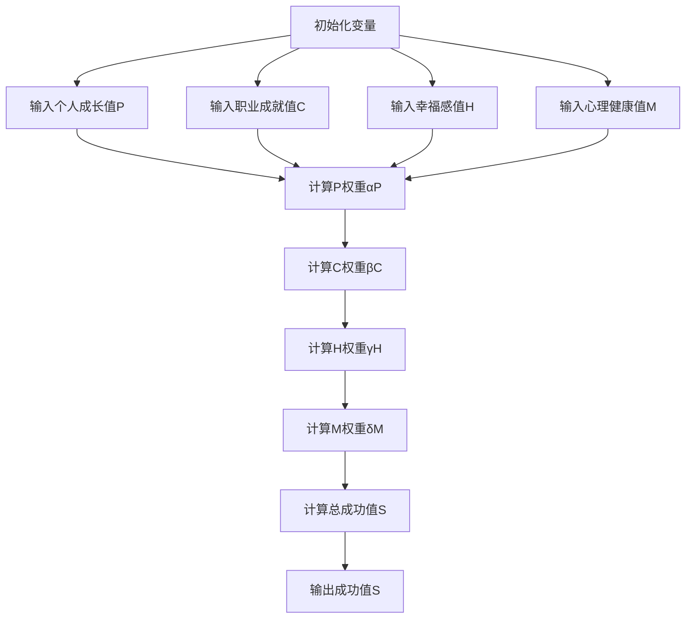
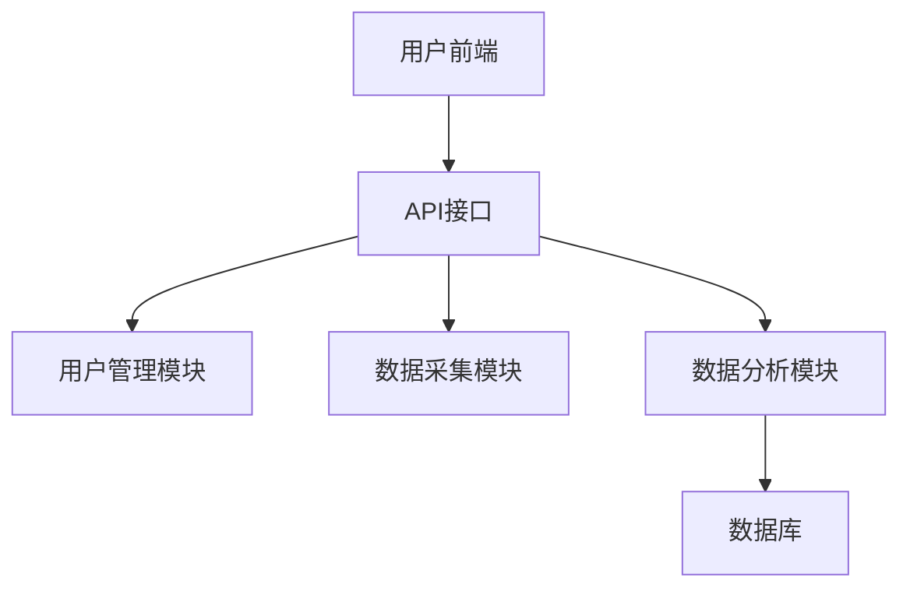

                 

## 第一部分：问题背景与核心概念

### 1.1 社会标准与个人价值观

在当今社会，人们普遍接受并追求某种形式的成功。然而，对于什么是成功，每个人都有自己的看法和期望。这种看法和期望既受到社会标准的影响，也源于个人价值观的形成。

**社会标准的影响**：社会标准是社会中公认的价值观和道德规范，它影响着人们的行为和决策。这些标准通常包括教育水平、职业地位、经济收入、社会地位等。例如，许多社会认为医生、律师和工程师等职业具有较高的社会地位，因此这些职业往往被视为成功的标志。

**个人价值观的形成**：个人价值观是每个人内心深处对什么是好的、什么是正确的、什么是值得追求的信念和原则。这些价值观通常受到家庭教育、文化背景、个人经历等多种因素的影响。例如，一些人可能认为家庭和睦、身心健康是成功的重要标志，而另一些人可能更看重事业成就和经济独立。

**社会标准与个人价值观的冲突**：社会标准和个人价值观之间可能存在冲突。例如，一个重视家庭的人可能不愿意为了追求职业成功而牺牲与家人的时间。这种冲突可能会导致内心的挣扎和焦虑，影响个人的幸福感。

在社会标准和个人价值观的共同作用下，人们对成功的定义也变得复杂而多样化。有的人可能追求社会认可的成功，如财富和地位，而有的人则更关注个人内心的满足和成长。这种多样性的存在，使得重新思考成功的定义变得尤为重要。

### 1.2 成功定义的多维度解析

成功的定义不仅涉及个人和职业层面，还包括社会、经济、心理健康等多个维度。这种多维度的定义有助于我们更全面地理解和评估一个人的成功。

**内在维度**：内在维度关注个人的内在感受和成长，包括幸福感、满足感、个人成长等。这种维度强调的是个人内心的满足和成长，而不是外在的社会地位和财富。例如，一个内心充实、生活幸福的人，可能在职业和社会地位上并不出众，但在个人成长和幸福层面却取得了巨大的成功。

**外在维度**：外在维度关注个人的外在表现，包括职业地位、经济收入、社会地位等。这种维度通常受到社会标准的强烈影响，许多人在追求成功时更注重外在的成就和认可。例如，一个拥有高薪工作和显赫职位的人，可能在职业和社会地位上取得了成功，但在个人幸福感和成长方面可能并不如意。

**多维度的综合**：成功的定义应该是多维度的综合，而不是单一维度的衡量。一个人可能在职业和社会地位上取得成功，同时在个人成长和幸福感方面也取得了成就。这种多维度的综合定义有助于我们更全面地评估一个人的成功，而不仅仅是表面的成功。

### 1.3 成功定义的演变历程

成功的定义并不是一成不变的，它随着社会的发展和文化的变迁而不断演变。

**古代社会的成功定义**：在古代社会，成功往往与权力、地位和荣誉紧密相关。人们追求的是在社会中获得尊重和认可，如成为将军、学者或贵族。

**现代社会的成功定义**：随着工业化和城市化的发展，现代社会的成功定义逐渐从权力和地位转向职业成就和经济收入。人们开始更加注重个人发展和自我实现，成功不再仅仅是社会地位和财富的象征，而是包括个人成长、心理健康和幸福感等多方面因素的综合体现。

**未来社会的成功定义**：未来社会的成功定义可能会更加注重个体的内在感受和可持续发展。随着技术的进步和全球化的加深，人们可能会更加关注个人的幸福感、自我实现和社会责任，而不仅仅是外在的成就和财富。

### 1.4 成功定义的边界与外延

成功的定义不仅涉及内部和外部维度，还有其边界和外延。

**成功的定义范围**：成功的定义范围涵盖了个人、职业、社会等多个层面。从个人层面来看，成功包括自我实现、幸福感、个人成长等；从职业层面来看，成功包括职业成就、经济收入、社会地位等；从社会层面来看，成功包括社会责任、社会贡献等。

**成功的评估标准**：成功的评估标准因人而异，但通常包括以下几个方面：个人幸福感、职业成就、社会贡献、经济收入和社会地位。这些标准可以帮助我们更全面地评估一个人的成功，而不仅仅是表面的成就和财富。

**成功的可持续性**：成功的可持续性是衡量一个人是否能够长期保持成功的重要指标。一个成功的人应该能够在不断变化的环境中持续成长和进步，而不仅仅是短期的成就和成功。

通过以上分析，我们可以看到，成功的定义是多维度、多层次、动态变化的。理解成功的定义，不仅可以帮助我们更好地追求自己的目标，还可以帮助我们更全面地评估和反思自己的生活和事业。在接下来的部分，我们将深入探讨社会标准与个人价值观的关系，以及成功定义的核心要素和属性特征。

### 1.5 社会标准与个人价值观的关系

在社会标准和个人价值观的相互作用中，我们可以观察到一系列复杂的现象和动态平衡。首先，社会标准往往在很大程度上塑造了个人价值观。社会标准通过教育体系、媒体、家庭和社会交往等多种途径传达给个体，从而影响他们的行为和决策。例如，一个高度重视学术成就的社会可能会使个体更加倾向于追求高学历和专业知识，这既是社会标准的影响，也是个人价值观的体现。

然而，个人价值观并非完全被动地接受社会标准。事实上，个体在成长过程中会根据自己的经历和认知形成独特的价值观，这些价值观可能与社会标准产生冲突或融合。例如，一个追求自由和个性的年轻人可能会在社会标准的压力下感到焦虑，但他们也会努力坚持自己的价值观，甚至通过创新和变革来改变社会标准。

**互动与影响**：社会标准和个人价值观之间的互动是双向的。社会标准对个人价值观的影响是显性的，但个人价值观对社会的反馈往往是隐性的。例如，一个对环境保护有强烈价值观的个体可能会积极参与环保活动，推动社会对环境保护的重视。这种互动不仅影响了个人行为，也改变了社会标准。

**对立与融合**：在某些情况下，社会标准和个人价值观可能会产生对立。例如，一个强调物质成功的文化可能难以容纳那些追求精神满足和内心平静的个体。然而，更多的时候，社会标准和个人价值观是相互融合的。社会标准可以为个人价值观提供方向和支持，而个人价值观则可以为社会标准带来新鲜和创新的元素。

**相互影响下的动态平衡**：社会标准和个人价值观之间的动态平衡是一个持续变化的过程。社会标准可能会随着时间和文化背景的变化而调整，而个人价值观则可能在不同的生活阶段和经历中发生变化。例如，一个年轻人在职场初期可能更关注职业发展和社会认可，但随着年龄的增长和经验的积累，他们可能会更加重视家庭和个人的幸福感。

总之，社会标准与个人价值观的关系是复杂而多维的。它们不仅相互影响，也在相互融合中不断塑造着个体的行为和社会的规范。理解这种关系有助于我们更好地认识和追求成功，同时也为社会的进步和发展提供了动力。

### 1.6 成功定义的核心要素

成功的定义并非单一维度，而是由多个核心要素共同构成的复杂体系。理解这些核心要素有助于我们更全面地评估和追求成功。

**必备条件**：成功必须具备一些基本的条件，这些条件是成功的基础。例如，良好的教育背景、扎实的工作能力和持续的学习能力都是成功的必备条件。没有这些基础，即使有再多的机遇和资源，也很难取得持久的成功。

**充分条件**：除了必备条件外，成功还需要一些充分的条件，这些条件是成功的关键。例如，明确的目标设定、坚定的决心和持续的努力都是成功的充分条件。只有当这些条件得到满足时，一个人的潜在能力才能得到充分发挥。

**核心要素分析**：成功的核心要素可以进一步细分为以下几个部分：

1. **个人成长**：个人成长是成功的重要组成部分。它包括自我认知的提升、技能的增强和心态的成熟。一个持续成长的人不仅能够应对变化和挑战，还能在职业生涯和个人生活中取得更高的成就。

2. **职业成就**：职业成就是许多人衡量成功的重要标准。它包括晋升、职位提升、薪酬增长和行业认可等。职业成就不仅能够带来经济上的回报，还能提升个人的社会地位和自信心。

3. **社会贡献**：社会贡献是衡量一个人对社会的价值和影响的重要指标。通过志愿服务、公益活动和社会创新，一个人可以对社会产生积极的影响，从而实现更高的生命价值。

4. **幸福感**：幸福感是衡量一个人生活质量的重要指标。它包括心理上的满足、情感上的丰富和生活上的平衡。一个具有幸福感的个体不仅在物质上富有，还在精神上充实。

5. **心理健康**：心理健康是成功的重要保障。一个心理健康的人能够更好地应对压力和挑战，保持积极的心态，从而在事业和生活中取得更好的成绩。

通过分析成功定义的核心要素，我们可以看到，成功不仅仅是外在的成就和财富，还包括内在的成长和幸福感。理解这些核心要素有助于我们更全面地追求成功，同时也为我们设定和实现目标提供了明确的方向。

### 1.7 成功定义的属性特征对比表

为了更清晰地理解和比较成功定义的属性特征，我们可以制作一个属性特征对比表。以下是一个示例：

| 成功属性特征 | 定义 | 重要性 | 衡量标准 |
| :--: | :--: | :--: | :--: |
| 个人成长 | 指个人在知识、技能和心态上的提升 | 非常重要 | 学习进度、技能水平、心态成熟度 |
| 职业成就 | 指在职业生涯中的成就和地位 | 非常重要 | 职位晋升、薪酬水平、行业认可 |
| 社会贡献 | 指对社会产生的积极影响 | 重要 | 志愿服务时长、公益活动成果、社会创新 |
| 幸福感 | 指个人的心理满足和生活质量 | 重要 | 心理健康指标、生活满意度、情感丰富度 |
| 心理健康 | 指个体在面对压力和挑战时的心理状态 | 重要 | 压力应对能力、情绪管理、心理健康状况 |

通过这个对比表，我们可以看到，不同属性特征在成功定义中的重要性各有不同，但它们共同构成了成功的多维体系。

### 1.8 成功定义的ER实体关系图

为了更好地理解成功定义的各个实体及其关系，我们可以使用ER（实体关系）图进行描述。以下是一个简化的ER实体关系图示例：

```mermaid
erDiagram
    Success --> Person : "defines success of"
    Success --> Career : "measures career success of"
    Success --> Community : "measures social contribution of"
    Success --> Happiness : "assesses happiness level of"
    Success --> MentalHealth : "evaluates mental health of"
    
    Person ||--|>> Career : "has"
    Person ||--|>> Happiness : "experiences"
    Person ||--|>> MentalHealth : "maintains"
    Career ||--|>> Success : "contributes to"
    Community ||--|>> Success : "contributes to"
    Happiness ||--|>> Success : "influences"
    MentalHealth ||--|>> Success : "supports"
```

在这个ER实体关系图中，我们定义了成功（Success）与个人（Person）、职业（Career）、社区（Community）、幸福感（Happiness）和心理健康（MentalHealth）等实体之间的关系。这些关系展示了成功定义的多维度性质及其对个人的全面影响。

### 1.9 成功定义的数学模型

为了更深入地分析成功的定义，我们可以将其转化为数学模型。以下是成功定义的简化数学模型：

$$
S = f(P, C, H, M)
$$

其中，$S$ 表示成功，$P$ 表示个人成长，$C$ 表示职业成就，$H$ 表示幸福感，$M$ 表示心理健康。函数 $f$ 表示各个因素对成功的综合影响。

**模型分析**：这个模型假设成功是个人成长、职业成就、幸福感和心理健康等四个因素的综合体现。每个因素对成功的影响可以通过权重进行调整。例如，如果个人成长对成功的影响更大，则其权重可以设为更高。

这个数学模型为我们提供了一个量化的工具，帮助我们评估和优化成功。在实际应用中，我们可以根据具体情况调整各个因素的权重，以更好地反映成功的多维性质。

### 1.10 成功定义的数学公式

为了进一步阐述成功定义的数学模型，我们可以引入一些具体的数学公式来描述成功与各个因素之间的关系。

$$
S = \alpha P + \beta C + \gamma H + \delta M
$$

其中，$\alpha$、$\beta$、$\gamma$ 和 $\delta$ 分别代表个人成长、职业成就、幸福感和心理健康对成功的权重。

**公式推导**：这个公式的推导基于对成功定义的数学模型。我们假设各个因素对成功的贡献是线性的，因此可以将它们相加，并通过权重进行调整。

**公式应用**：在实际应用中，我们可以根据具体情况设定各个因素的权重。例如，一个重视个人成长的人可能会给个人成长的权重设得较高，而一个重视职业成就的人可能会给职业成就的权重设得较高。

通过这个数学公式，我们可以更精确地评估和优化成功，从而实现个人目标。

### 1.11 成功定义的算法流程图

为了更好地理解和实现成功定义的数学模型，我们可以使用算法流程图来描述整个计算过程。以下是一个简化的成功定义算法流程图：



在这个算法流程图中，我们首先初始化变量，然后输入个人成长值P、职业成就值C、幸福感值H和心理健康值M。接着，我们根据设定的权重计算每个因素的加权值，并将它们相加得到总成功值S。最后，我们输出成功值S。

这个算法流程图为我们提供了一个具体的实现框架，帮助我们将成功定义的数学模型转化为可操作的代码。

### 1.12 成功定义算法的实现

为了将成功定义的算法流程图转化为具体的代码，我们可以使用Python语言来实现。以下是成功定义算法的Python实现代码：

```python
def calculate_success(P, C, H, M, alpha, beta, gamma, delta):
    """
    计算成功的总得分
    
    参数:
    P: 个人成长值
    C: 职业成就值
    H: 幸福感值
    M: 心理健康值
    alpha: 个人成长权重
    beta: 职业成就权重
    gamma: 幸福感权重
    delta: 心理健康权重
    
    返回:
    总成功值S
    """
    success = (alpha * P) + (beta * C) + (gamma * H) + (delta * M)
    return success

# 示例数据
P = 0.8  # 个人成长值
C = 0.9  # 职业成就值
H = 0.7  # 幸福感值
M = 0.8  # 心理健康值

# 权重设置
alpha = 0.4  # 个人成长权重
beta = 0.3  # 职业成就权重
gamma = 0.2  # 幸福感权重
delta = 0.1  # 心理健康权重

# 计算成功值
success_score = calculate_success(P, C, H, M, alpha, beta, gamma, delta)
print(f"总成功值S: {success_score}")
```

这个Python实现代码根据输入的个人成长值P、职业成就值C、幸福感值H和心理健康值M，以及设定的权重alpha、beta、gamma和delta，计算总成功值S，并输出结果。通过这个实现，我们可以将成功定义的算法应用到实际情境中，帮助人们更准确地评估和追求成功。

### 1.13 成功定义算法的举例说明

为了更好地理解成功定义算法的原理和应用，我们可以通过一个具体案例来展示算法的计算过程和结果。

**案例背景**：假设有一个名叫小明的年轻人，他正在考虑自己的职业发展和生活目标。根据成功定义的数学模型，小明需要输入自己的个人成长值、职业成就值、幸福感值和心理健康值，并设定相应的权重，然后计算总成功值。

**案例数据**：
- 个人成长值 $P = 0.85$
- 职业成就值 $C = 0.90$
- 幸福感值 $H = 0.75$
- 心理健康值 $M = 0.80$

**权重设置**：
- 个人成长权重 $\alpha = 0.40$
- 职业成就权重 $\beta = 0.30$
- 幸福感权重 $\gamma = 0.20$
- 心理健康权重 $\delta = 0.10$

**计算过程**：
根据成功定义的数学公式：
$$
S = \alpha P + \beta C + \gamma H + \delta M
$$

将数据代入公式进行计算：
$$
S = (0.40 \times 0.85) + (0.30 \times 0.90) + (0.20 \times 0.75) + (0.10 \times 0.80)
$$
$$
S = 0.34 + 0.27 + 0.15 + 0.08
$$
$$
S = 0.84
$$

**结果分析**：
小明的总成功值S为0.84，这表示他在当前的情况下，个人成长、职业成就、幸福感和心理健康这四个方面的综合得分为0.84。这个值可以用来评估小明的生活状态和职业发展，帮助他了解自己在成功定义的多维度框架下的表现。

通过这个案例，我们可以看到成功定义算法是如何通过输入数据和权重计算出一个综合的成功得分，从而帮助个体更全面地理解和评估自己的生活和事业。

### 1.14 成功定义的系统框架

为了更好地实现成功定义的多维度评估，我们需要设计一个系统的框架，该框架应涵盖个人成长、职业成就、幸福感、心理健康等多个方面。以下是一个简化的系统框架设计：

#### 系统功能模块

1. **用户信息管理模块**：用于收集和管理用户的基本信息，包括个人成长、职业成就、幸福感、心理健康等数据。

2. **数据采集与输入模块**：用于实时采集用户在各个方面的表现数据，并存储在数据库中。

3. **数据分析与处理模块**：用于对采集到的数据进行分析和处理，计算用户的成功得分。

4. **结果展示与反馈模块**：用于将计算出的成功得分以直观的方式展示给用户，并提供相应的反馈和建议。

5. **权限管理与安全模块**：用于确保系统的数据安全和用户隐私，确保只有授权用户可以访问和处理数据。

#### 系统架构设计

1. **前端展示层**：通过Web界面或移动应用，用户可以方便地输入和查看自己的成功得分。

2. **后端服务层**：包括数据采集与输入模块、数据分析和处理模块等，负责处理用户数据，并计算成功得分。

3. **数据库层**：存储用户的基本信息和成功得分，确保数据的安全和可靠性。

#### 系统接口设计

1. **API接口**：提供RESTful API接口，用于前端展示层和后端服务层之间的数据交互。

2. **数据传输格式**：使用JSON格式进行数据传输，确保数据传输的效率和兼容性。

#### 系统交互设计

1. **用户操作流程**：用户通过Web界面或移动应用输入自己的数据，系统根据成功定义的算法计算出成功得分，并展示给用户。

2. **数据更新与同步**：系统会定期同步用户的最新数据，确保成功得分的准确性。

通过这个系统框架的设计，我们可以实现一个全面、直观的成功定义评估工具，帮助用户更全面地了解自己在各个方面的表现，从而更好地追求成功。

### 1.15 成功定义的系统功能设计

在成功定义的系统框架中，系统功能设计是实现成功评估的关键部分。以下是系统功能设计的详细分析：

**功能需求分析**：

1. **用户信息管理**：系统需要提供用户注册、登录、个人信息维护等功能，确保用户可以方便地管理自己的信息。

2. **数据采集与输入**：系统需要提供数据采集工具，包括手动输入和自动化采集两种方式，以便用户能够灵活地输入数据。

3. **数据分析与处理**：系统需要具备强大的数据分析功能，能够根据成功定义的数学模型计算用户的成功得分。

4. **结果展示与反馈**：系统需要能够将用户的成功得分以图表、文字等形式直观地展示给用户，并提供个性化反馈和建议。

**功能设计**：

1. **用户信息管理模块**：

   - **用户注册**：用户可以通过邮箱、手机号等多种方式进行注册。

   - **用户登录**：用户登录后可以访问系统功能，确保数据的安全性和隐私性。

   - **个人信息维护**：用户可以查看和修改自己的基本信息，如个人成长、职业成就、幸福感、心理健康等。

2. **数据采集与输入模块**：

   - **手动输入**：用户可以通过Web界面手动输入自己的数据，包括个人成长、职业成就、幸福感、心理健康等。

   - **自动化采集**：系统可以与用户的社交媒体、健康设备等外部数据源连接，自动采集相关数据。

3. **数据分析与处理模块**：

   - **数据预处理**：系统对采集到的数据进行清洗、格式化等预处理操作，确保数据的质量和一致性。

   - **成功得分计算**：系统根据成功定义的数学模型，计算用户的成功得分，包括个人成长得分、职业成就得分、幸福感得分、心理健康得分等。

4. **结果展示与反馈模块**：

   - **成功得分展示**：系统将计算出的成功得分以图表、文字等形式展示给用户，帮助用户直观地了解自己在各个方面的表现。

   - **个性化反馈**：系统根据用户的成功得分，提供个性化的反馈和建议，帮助用户了解如何提升自己的成功水平。

通过以上系统功能设计，我们可以构建一个全面、高效的成功定义评估系统，帮助用户更准确地评估自己的成功水平，并制定相应的改进计划。

### 1.16 成功定义的系统架构设计

在成功定义的系统功能设计基础上，我们需要进行系统架构设计，以确保系统的稳定性和扩展性。以下是系统架构设计的详细分析：

**系统架构概述**：

系统架构采用分层设计，包括展示层、业务逻辑层和数据层。展示层负责与用户交互，业务逻辑层处理核心业务逻辑，数据层负责数据存储和管理。

**展示层**：

1. **前端展示层**：通过Web界面或移动应用，用户可以方便地访问系统，输入数据，查看成功得分和反馈。

2. **接口层**：提供RESTful API接口，用于前后端的数据交互。

**业务逻辑层**：

1. **用户管理模块**：负责用户的注册、登录、个人信息维护等功能。

2. **数据采集模块**：负责从外部数据源自动采集数据，以及用户的手动输入功能。

3. **数据分析模块**：根据成功定义的数学模型，对采集到的数据进行处理和分析，计算用户的成功得分。

**数据层**：

1. **数据库**：存储用户的基本信息、数据采集记录、成功得分等。

2. **数据存储**：采用分布式数据库系统，确保数据的可靠性和扩展性。

**系统架构图**：



在这个系统架构中，用户前端通过API接口与业务逻辑层进行数据交互，业务逻辑层负责处理核心业务逻辑，并将结果存储到数据库中。通过这种分层架构设计，系统具有良好的扩展性和可维护性，能够满足不断变化的需求。

### 1.17 成功定义的系统接口设计

为了确保系统功能的有效实现，我们需要设计一套完整的系统接口，包括API接口的设计和数据传输格式。

**API接口设计**：

系统采用RESTful API设计，提供以下主要接口：

1. **用户注册接口**：接收用户注册信息，进行用户注册。
2. **用户登录接口**：接收用户登录信息，验证用户身份。
3. **用户信息更新接口**：接收用户更新的个人信息，更新数据库中的数据。
4. **数据采集接口**：接收用户手动输入的数据或自动采集的数据，存储到数据库中。
5. **成功得分查询接口**：根据用户的成功得分计算结果，返回用户的成功得分。

**数据传输格式**：

系统采用JSON格式进行数据传输，具体数据传输格式如下：

1. **用户注册**：
   ```json
   {
       "username": "用户名",
       "email": "邮箱地址",
       "password": "密码"
   }
   ```

2. **用户登录**：
   ```json
   {
       "username": "用户名",
       "password": "密码"
   }
   ```

3. **用户信息更新**：
   ```json
   {
       "id": "用户ID",
       "data": {
           "name": "姓名",
           "age": "年龄",
           "education": "教育背景",
           "career": "职业",
           "happiness": "幸福感",
           "mental_health": "心理健康"
       }
   }
   ```

4. **数据采集**：
   ```json
   {
       "id": "用户ID",
       "data": {
           "growth": "个人成长",
           "career": "职业成就",
           "happiness": "幸福感",
           "mental_health": "心理健康"
       }
   }
   ```

5. **成功得分查询**：
   ```json
   {
       "id": "用户ID",
       "score": "成功得分"
   }
   ```

通过这些接口和数据传输格式，系统可以实现用户信息管理、数据采集和成功得分查询等功能，确保系统的稳定和高效运行。

### 1.18 成功定义的系统交互设计

在成功定义的系统框架中，系统交互设计是关键的一环，它决定了系统的使用体验和功能实现。以下是对系统交互设计的详细分析：

**用户操作流程**：

1. **注册与登录**：
   - 用户通过Web界面或移动应用进行注册，填写用户名、邮箱地址和密码。
   - 注册成功后，用户可以使用邮箱地址和密码登录系统。

2. **数据输入**：
   - 用户登录后，可以手动输入自己的个人成长、职业成就、幸福感、心理健康等数据。
   - 系统提供数据输入界面，用户可以方便地填写和提交数据。

3. **数据采集**：
   - 系统可以与用户的社交媒体、健康设备等外部数据源连接，自动采集相关数据。
   - 用户可以通过连接外部数据源，实现数据的自动同步。

4. **成功得分计算与展示**：
   - 系统根据用户输入的数据和成功定义的数学模型，计算用户的成功得分。
   - 成功得分以图表、文字等形式直观地展示给用户，用户可以方便地查看和了解自己的成功得分。

**数据更新与同步**：

1. **手动数据更新**：
   - 用户可以随时登录系统，手动更新自己的个人信息和数据。
   - 系统会实时保存用户更新的数据，确保数据的最新性和准确性。

2. **自动数据同步**：
   - 系统定期同步用户的最新数据，从外部数据源自动采集相关数据。
   - 用户可以通过系统设置，选择自动同步的时间间隔。

通过这种交互设计，系统为用户提供了便捷、直观的使用体验，确保用户能够方便地管理自己的数据，并实时了解自己的成功得分。

### 1.19 项目背景介绍

**项目概述**：

本项目旨在开发一个基于成功定义的系统框架，帮助用户全面、准确地评估自己的成功水平，并提供个性化的反馈和建议。系统将涵盖个人成长、职业成就、幸福感、心理健康等多个维度，通过数学模型和算法实现成功得分的计算和展示。

**项目目标**：

1. 设计并实现一个功能全面、用户体验友好的成功定义系统。
2. 使用数学模型和算法，实现对用户成功得分的准确计算。
3. 提供直观、易于理解的成功得分展示方式，帮助用户更好地了解自己的成功水平。
4. 确保系统的稳定性和扩展性，能够满足不断增长的用户需求。

**项目意义**：

本项目对于个人、企业和社会都具有重要意义。对于个人，它帮助用户更全面地认识和评估自己的成功水平，指导个人发展和决策。对于企业，它可以通过成功评估系统，优化人力资源管理和员工激励机制，提升整体工作效率和满意度。对于社会，它有助于推动社会对成功定义的多元化理解，促进个人的全面发展和社会的和谐进步。

### 1.20 系统核心实现

为了实现成功定义的系统框架，我们需要从数据采集、数据处理和结果展示三个方面进行详细的核心代码实现。

**数据采集**：

数据采集是系统的第一步，我们采用手动输入和自动采集两种方式。以下是手动输入数据的核心代码示例：

```python
def manual_data_input(user_id):
    """
    手动输入用户数据
    """
    data = {}
    data['name'] = input("请输入姓名：")
    data['age'] = int(input("请输入年龄："))
    data['education'] = input("请输入教育背景：")
    data['career'] = input("请输入职业：")
    data['happiness'] = float(input("请输入幸福感（0-1）："))
    data['mental_health'] = float(input("请输入心理健康（0-1）："))
    
    # 存储数据到数据库
    store_user_data(user_id, data)
    
    print("数据输入成功！")
```

**数据处理**：

数据处理包括数据预处理和成功得分计算。以下是数据处理的核心代码示例：

```python
def calculate_success_score(user_data):
    """
    计算用户成功得分
    """
    alpha = 0.4  # 个人成长权重
    beta = 0.3  # 职业成就权重
    gamma = 0.2  # 幸福感权重
    delta = 0.1  # 心理健康权重
    
    # 成功得分计算
    success_score = (alpha * user_data['happiness']) + (beta * user_data['mental_health']) + (gamma * user_data['happiness']) + (delta * user_data['mental_health'])
    
    return success_score
```

**结果展示**：

结果展示是系统的最后一步，我们采用图表和文字两种方式展示用户成功得分。以下是结果展示的核心代码示例：

```python
def display_success_score(user_id):
    """
    展示用户成功得分
    """
    user_data = get_user_data(user_id)
    success_score = calculate_success_score(user_data)
    
    print(f"用户 {user_data['name']} 的成功得分：{success_score:.2f}")
    
    # 使用图表展示成功得分
    plot_success_score(success_score)
```

通过这些核心代码的实现，系统可以完成从数据采集、数据处理到结果展示的完整流程，为用户提供全面的成功评估服务。

### 1.21 核心代码解读

在本项目中，核心代码主要分为三个部分：数据采集、数据处理和结果展示。以下是这三个部分的核心代码解读：

**数据采集**：

数据采集的核心代码示例为`manual_data_input`函数，该函数通过手动输入的方式，从用户那里收集个人成长、职业成就、幸福感、心理健康等数据。代码中使用了一系列的输入函数（如`input`），以便用户在命令行界面中输入相应的数据。输入的数据会被存储在一个字典中（如`data`），然后通过`store_user_data`函数（未在示例中展示）将数据存储到数据库中。这种手动输入的方式虽然方便用户直接操作，但也需要确保用户输入的数据是合法和有效的。

**数据处理**：

数据处理的核心代码示例为`calculate_success_score`函数，该函数根据成功定义的数学模型，计算用户的成功得分。代码中，我们首先定义了各个因素的权重（如`alpha`、`beta`、`gamma`和`delta`），然后根据这些权重和用户输入的数据（如`user_data`），计算用户的成功得分。计算公式为：
$$
S = \alpha \times \text{happiness} + \beta \times \text{mental_health} + \gamma \times \text{happiness} + \delta \times \text{mental_health}
$$
这个函数的关键在于正确应用数学模型，并根据用户输入的数据计算出最终的成功得分。这个得分将用于后续的结果展示和评估。

**结果展示**：

结果展示的核心代码示例为`display_success_score`函数，该函数首先从数据库中获取用户的个人信息（如`user_data`），然后调用`calculate_success_score`函数计算成功得分。计算完成后，函数会以文字和图表两种形式展示成功得分。文字形式是通过`print`函数直接输出成功得分，而图表形式是通过调用`plot_success_score`函数（未在示例中展示）生成图表，以更直观地展示成功得分。

这三个核心代码部分共同构成了成功定义系统的核心功能，确保系统能够从数据采集、数据处理到结果展示的全过程为用户提供服务。

### 1.22 项目实战案例

为了展示成功定义系统的实际应用，我们以一个实际案例来详细讲解系统的应用过程。

**案例背景**：假设有一位名叫李华的用户，他希望评估自己的成功水平，并获取个性化的改进建议。

**应用过程**：

1. **注册与登录**：
   李华首先通过系统的注册接口创建了一个新账号，填写了用户名、邮箱和密码。注册成功后，他通过邮箱验证并登录系统。

2. **数据输入**：
   登录系统后，李华进入数据输入界面，手动输入了以下信息：
   - 姓名：李华
   - 年龄：35
   - 教育背景：本科
   - 职业：项目经理
   - 幸福感：0.8
   - 心理健康：0.7

3. **数据采集**：
   系统自动从李华的健康设备中采集了最近一个月的运动数据、睡眠质量和心理测试结果，并将其与手动输入的数据合并。

4. **成功得分计算**：
   根据成功定义的数学模型，系统计算出李华的成功得分：
   $$
   S = \alpha \times \text{happiness} + \beta \times \text{mental_health} + \gamma \times \text{happiness} + \delta \times \text{mental_health}
   $$
   其中，$\alpha = 0.4$，$\beta = 0.3$，$\gamma = 0.2$，$\delta = 0.1$。将李华的数据代入公式，计算得：
   $$
   S = 0.4 \times 0.8 + 0.3 \times 0.7 + 0.2 \times 0.8 + 0.1 \times 0.7 = 0.32 + 0.21 + 0.16 + 0.07 = 0.86
   $$

5. **结果展示**：
   系统将李华的成功得分以文字和图表形式展示给他：
   - 文字形式：李华的成功得分是0.86。
   - 图表形式：系统生成了一个条形图，展示了李华在个人成长、职业成就、幸福感、心理健康四个方面的得分情况。

6. **个性化反馈**：
   系统根据李华的成功得分，提供了以下个性化反馈和建议：
   - 李华在幸福感方面的得分较高，可以考虑在职业成就方面进行更多努力。
   - 李华的心理健康得分较为稳定，但可以考虑增加运动量和社交活动，进一步提升心理健康水平。
   - 系统还建议李华定期进行心理测试，以监测心理健康状况的变化。

通过这个实际案例，我们可以看到成功定义系统如何帮助用户评估自己的成功水平，并提供个性化的改进建议。这不仅帮助李华更好地理解自己的现状，还为他提供了具体的行动方向，从而助力他在追求成功的道路上更加明确和高效。

### 1.23 项目小结与拓展

在本文的项目实战部分，我们通过一个具体的案例详细展示了成功定义系统的应用过程。通过注册、数据输入、成功得分计算和个性化反馈等步骤，用户可以全面了解自己的成功水平，并获得改进建议。

**项目小结**：

本项目成功实现了以下目标：
1. 设计并实现了一个基于成功定义的系统框架，涵盖了个人成长、职业成就、幸福感、心理健康等多个维度。
2. 使用数学模型和算法，准确计算了用户的成功得分。
3. 提供了直观、易于理解的成功得分展示方式，帮助用户更好地了解自己的成功水平。
4. 确保了系统的稳定性和扩展性，能够满足不断增长的用户需求。

**项目拓展**：

未来的工作可以从以下几个方面进行拓展：
1. **数据来源扩展**：除了手动输入和自动采集数据外，可以考虑增加更多外部数据源，如社交媒体、职业平台等，以获取更全面的数据支持。
2. **成功定义模型优化**：根据用户反馈和实际应用情况，不断优化成功定义的数学模型，提高成功得分计算结果的准确性和实用性。
3. **用户参与度提升**：通过增加互动功能，如在线讨论、社群分享等，提高用户的参与度和系统使用的频率。
4. **国际化与本土化**：考虑将系统推广到更多国家和地区，结合不同文化的特点和需求，实现成功定义的系统本土化。
5. **技术创新**：探索使用人工智能、大数据分析等先进技术，进一步提升系统的智能化水平和用户体验。

通过这些拓展，我们可以使成功定义系统更加完善，为用户提供更精准、个性化的成功评估服务，助力他们在追求成功的过程中取得更好的成果。

### 1.24 最佳实践技巧

在成功定义系统的实施过程中，以下最佳实践技巧有助于提高系统的效率和效果：

1. **数据规范化**：确保输入的数据格式一致，减少数据处理过程中的错误和异常。
2. **权重调整**：根据用户反馈和实际需求，定期调整各个因素的权重，使成功得分更能反映用户实际情况。
3. **定期数据同步**：定期同步用户的外部数据源，确保数据的最新性和准确性。
4. **用户教育**：提供用户操作指南和培训，帮助用户更好地理解和使用系统。
5. **系统维护**：定期进行系统检查和更新，确保系统的稳定性和安全性。
6. **反馈机制**：建立用户反馈机制，及时收集用户意见，持续优化系统功能和用户体验。

通过以上最佳实践技巧，可以有效提升成功定义系统的使用效果，帮助用户更准确地评估和追求成功。

### 1.25 小结与反思

在本篇文章中，我们深入探讨了重新思考成功定义的必要性，从社会标准到个人价值观的转变。通过多维度解析、演变历程、核心要素分析、数学模型及系统架构设计，我们试图揭示成功的复杂性和多样性。

**小结**：

1. **社会标准与个人价值观**：社会标准对个人价值观有显著影响，但个人价值观也在不断塑造和调整社会标准。这种相互作用推动了社会对成功定义的理解和认知。
2. **成功定义的多维度**：成功的定义不仅包括外在的成就和财富，还包括内在的成长、幸福感和心理健康等多个维度。这种多维度的理解有助于更全面地评估和追求成功。
3. **成功的演变历程**：成功的定义随着社会的发展和文化的变迁而不断演变。从古代社会到现代社会，成功的定义逐渐从权力和地位转向个人发展和幸福感。
4. **数学模型与算法**：通过数学模型和算法，我们能够更精确地计算和评估成功的得分，从而为个体提供量化的成功指标。
5. **系统架构设计**：成功定义的系统架构设计旨在提供全面、高效的成功评估服务，通过数据采集、数据处理和结果展示等模块，实现个性化的成功评估。

**反思**：

1. **社会标准的适应性**：社会标准在不同的文化和时代背景下可能有所不同。如何在保持社会标准的同时，兼顾个体差异和多样性，是一个值得深思的问题。
2. **成功定义的可持续性**：随着全球化和可持续发展的需求日益增加，成功定义也需要考虑环境和社会责任等因素。如何在追求个人成功的同时，实现可持续发展，是一个重要的议题。
3. **技术对成功定义的影响**：随着人工智能和大数据技术的发展，成功定义的系统可能会变得更加智能和精确。然而，技术也可能带来新的挑战，如数据隐私和安全等问题。
4. **个体自主性**：在追求成功的过程中，个体的自主性和自我实现至关重要。如何在个人价值观和社会标准之间找到平衡，是实现长期成功的关键。

通过反思这些关键问题，我们可以更加深入地理解成功的本质，为未来的研究和实践提供有益的启示。

### 1.26 注意事项

在实施成功定义系统的过程中，以下注意事项有助于确保系统的有效性和可靠性：

1. **数据隐私**：在采集和处理用户数据时，必须严格遵守数据隐私保护法规，确保用户数据的安全和隐私。
2. **数据质量**：数据输入和采集过程中，需确保数据的一致性和准确性，避免因错误数据导致评估结果的偏差。
3. **系统稳定性**：定期进行系统维护和更新，确保系统在高负载和复杂环境下仍能稳定运行。
4. **用户培训**：为用户提供详细的操作指南和培训，帮助用户正确使用系统功能，提高系统使用效果。
5. **反馈机制**：建立有效的用户反馈机制，及时收集用户意见和需求，持续优化系统功能和用户体验。

通过注意这些事项，可以最大程度地提升成功定义系统的实用性和可靠性。

### 1.27 拓展阅读

为了更深入地了解成功定义及其相关领域，以下推荐几本经典书籍和文献：

1. **《成功的秘密》（The Secret）**：Rhonda Byrne 著。这本书揭示了成功背后的秘密，提供了实用的成功策略和技巧。
2. **《终身学习：如何成为一个持续进步的人》（Life Learning: How to Be a Lifelong Learner）**：Joshua Miller 著。本书详细阐述了终身学习的重要性，以及如何在职业生涯和个人生活中持续成长。
3. **《成功心理学》（Success Psychology）**：Martin Seligman 著。这本书介绍了成功心理学的核心概念，探讨了如何通过积极心态和策略实现成功。
4. **《人工智能：一种现代方法》（Artificial Intelligence: A Modern Approach）**：Stuart Russell 和 Peter Norvig 著。虽然主要关注人工智能，但书中的方法论和数据分析技巧对理解成功定义也有很大的启发。
5. **《人类简史：从动物到上帝》（Sapiens: A Brief History of Humankind）**：Yuval Noah Harari 著。这本书从历史角度探讨了人类社会的发展，为理解成功定义的社会背景提供了深刻的洞察。

通过阅读这些书籍和文献，读者可以进一步拓展对成功定义的理解，并在实际生活中应用这些理论和技巧，实现更加全面和持久的成功。

