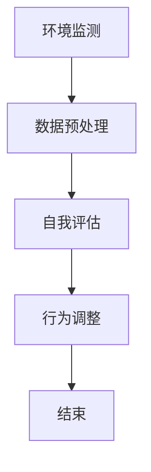
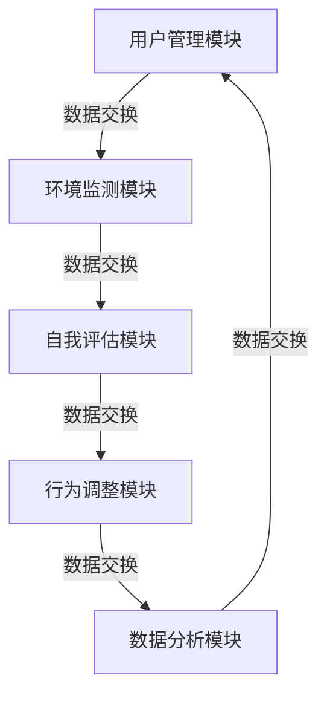
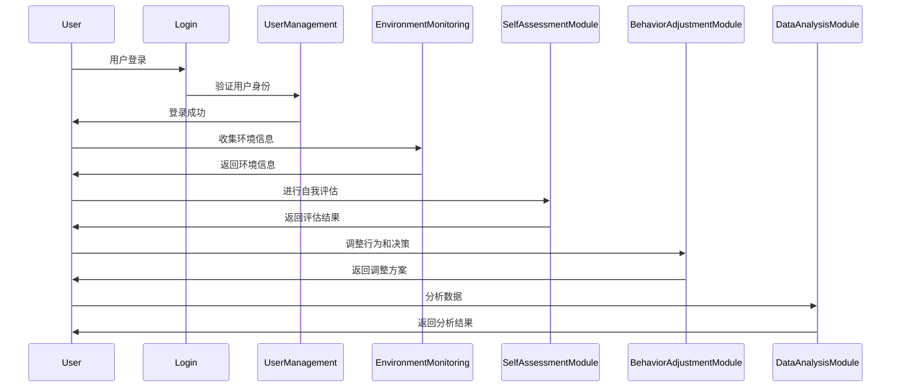

                 

好的，以下是我根据上述要求，按照《重新思考成功的定义：从社会标准到个人价值观》的初步目录大纲，逐步构建的文章内容。

---

## 简介

在这个快速变化的世界里，成功的定义似乎变得愈发模糊和复杂。传统上，成功常常被等同于财富、地位和成就，而这些标准往往源于社会的期望和规范。然而，随着时间的推移，越来越多的人开始质疑这样的定义是否真的适用于每个人。本书旨在引导读者重新思考成功的定义，从传统的社会标准转向更加关注个人价值观的实现。通过深入探讨社会标准和个人价值观的冲突与融合，帮助读者找到真正属于自己的成功之路。

## 第1章: 问题背景与核心概念

### 1.1 问题背景

#### 1.1.1 社会标准的定义与影响

社会标准是一种普遍认可的行为准则和价值观念，它们在不同的文化和社会背景下可能有所不同。这些标准往往由政府、媒体、教育机构和其他权威机构制定和推广。例如，在一个重视物质财富的社会中，成功可能被定义为拥有大量的财富和高档的住所。而在一个注重精神追求的社会中，成功可能更多地与个人成长、内心的平和和对他人的贡献相关。

这些社会标准对个体有着深远的影响。一方面，它们为人们提供了一种衡量成功的普遍标准，使个体在社会中找到了自己的定位。另一方面，这些标准也可能导致个体在追求成功的过程中感到压力和焦虑，因为它们往往要求个体在物质和社会地位上达到一个很高的水平。

#### 1.1.2 个人价值观的多样性

与统一的社会标准相比，个人价值观的多样性更为显著。每个人的成长背景、教育经历、生活环境和个性特点都不同，这些因素共同塑造了他们的价值观。例如，一些人可能认为成功是财富和地位，而另一些人可能更看重家庭、健康或社会贡献。

个人价值观的多样性使得每个人对成功的定义都不同。有些人可能认为在职业生涯中取得巨大成就就是成功，而有些人可能更注重实现个人兴趣和梦想。这种多样性为个人提供了更多选择，同时也带来了一定的挑战，因为每个人都需要在众多可能的定义中找到最适合自己的。

### 1.2 成功的定义

#### 1.2.1 成功的社会标准

在社会标准的视角下，成功通常具有以下特征：

1. **财富**：拥有大量的财富通常被认为是成功的一个标志。
2. **地位**：在职业和社会地位上的高度往往被视为成功的象征。
3. **成就**：在职业生涯中的突出表现和所取得的成就也是衡量成功的重要标准。
4. **名誉**：获得广泛认可和赞誉也是社会标准下的成功体现。

这些标准在很大程度上受到文化和社会环境的影响。在一些社会中，财富和地位可能是成功的关键指标，而在其他社会中，这些指标可能不那么重要。

#### 1.2.2 成功的个人价值观

与社会的标准不同，个人价值观下的成功更加个性化和多样化。以下是几种常见的个人价值观视角：

1. **自我实现**：成功被视为实现个人潜力和追求个人兴趣的过程。
2. **幸福感**：成功被定义为长期的幸福和内心的满足感。
3. **平衡**：成功被视为在工作和生活之间找到平衡，并维持身心健康。
4. **社会贡献**：成功被定义为对社会的积极影响和贡献。

个人价值观视角下的成功更加关注个体的内在需求和幸福感，而不仅仅是外在的成就和地位。

### 1.3 核心概念的联系

社会标准和个人价值观之间的联系和冲突是理解成功定义的关键。一方面，社会标准为个体提供了一个普遍的框架，使个体在社会中找到了自己的位置。另一方面，个人价值观的多样性使得每个人对成功的定义都不同，这可能导致个体在追求社会标准的过程中忽视自己的内在需求。

社会标准和个人价值观之间的冲突体现在以下几个方面：

1. **压力和焦虑**：个体可能在追求社会标准的过程中感到压力和焦虑，因为社会标准往往要求个体在物质和社会地位上达到一个很高的水平。
2. **内在需求忽视**：个体可能在追求社会标准的过程中忽视自己的内在需求，导致内心的不满足和失衡。
3. **个人成长阻碍**：个体可能在追求社会标准的过程中牺牲自己的个人成长和兴趣，导致个人发展受限。

要实现个人价值观，个体需要在社会标准和个人需求之间找到平衡。这可能需要个体深入反思自己的价值观和目标，并勇于追求自己真正想要的。

## 第2章: 算法原理与数学模型

### 2.1 算法原理

#### 2.1.1 算法概述

本书的核心思想在于帮助读者建立一套自我认知的框架，以便更好地理解和追求个人价值观。为了实现这一目标，我们提出了一种名为“自我评估与调整”的算法。

这个算法的基本原理是通过对个体内外部环境的持续监测和分析，调整个体的行为和决策，以实现个人价值观的最大化。具体来说，算法分为以下几个步骤：

1. **环境监测**：通过多种渠道收集个体所处环境的信息，包括社会标准、个人需求、情感状态等。
2. **数据预处理**：对收集到的信息进行清洗、归一化和特征提取，为后续分析做准备。
3. **自我评估**：利用预处理后的数据，对个体的当前状态进行评估，包括与个人价值观的符合程度、内心的满足感等。
4. **行为调整**：根据自我评估的结果，调整个体的行为和决策，以更好地实现个人价值观。

#### 2.1.2 算法流程图

以下是一个简化的算法流程图，描述了“自我评估与调整”算法的基本步骤。



### 2.2 数学模型

为了更好地理解和实现“自我评估与调整”算法，我们需要引入一些数学模型来描述个体和环境之间的关系。以下是一些关键的数学模型和公式。

#### 2.2.1 个人满意度模型

个人满意度是衡量个体对当前状态满意程度的一个指标。我们可以使用以下公式来计算个人满意度：

$$
S = f(W, D, H)
$$

其中，$S$ 代表个人满意度，$W$ 代表财富水平，$D$ 代表社会地位，$H$ 代表幸福感。

$f$ 是一个复合函数，通过权重和阈值来调整三个变量对个人满意度的贡献。具体公式如下：

$$
f(W, D, H) = 
\begin{cases}
S_0 + \alpha_1 \cdot W + \alpha_2 \cdot D + \alpha_3 \cdot H & \text{如果 } W, D, H > T \\
S_0 & \text{如果 } W, D, H \leq T
\end{cases}
$$

其中，$S_0$ 是基础满意度，$\alpha_1, \alpha_2, \alpha_3$ 是权重系数，$T$ 是阈值。

#### 2.2.2 成本效益分析模型

在调整行为和决策时，我们需要考虑成本和效益。成本包括时间、金钱和精力等，而效益则是个体满意度的提升。我们可以使用以下公式进行成本效益分析：

$$
C/B = \frac{C}{B} = \frac{W_t - W_0 + D_t - D_0 + H_t - H_0}{T_t - T_0}
$$

其中，$C$ 是成本，$B$ 是效益，$W_t, D_t, H_t$ 是调整后的财富水平、社会地位和幸福感，$W_0, D_0, H_0$ 是调整前的财富水平、社会地位和幸福感，$T_t, T_0$ 是调整后的时间和金钱成本。

#### 2.2.3 情感状态模型

情感状态对个人满意度有着重要影响。我们可以使用以下公式来计算情感状态：

$$
E = f(S, C, P)
$$

其中，$E$ 代表情感状态，$S$ 代表个人满意度，$C$ 代表成本效益比，$P$ 代表个人兴趣和激情。

$f$ 是一个复合函数，通过权重和阈值来调整三个变量对情感状态的影响。具体公式如下：

$$
f(S, C, P) = 
\begin{cases}
S_1 + \beta_1 \cdot S + \beta_2 \cdot C + \beta_3 \cdot P & \text{如果 } S, C, P > T \\
S_1 & \text{如果 } S, C, P \leq T
\end{cases}
$$

其中，$S_1$ 是基础情感状态，$\beta_1, \beta_2, \beta_3$ 是权重系数，$T$ 是阈值。

### 2.3 算法示例

假设一个个体当前的财富水平为 $W_0 = 100$ 万，社会地位为 $D_0 = 5$ 级，幸福感为 $H_0 = 7$ 分。他希望通过提升财富水平、社会地位和幸福感来实现个人价值观。

首先，个体对当前环境进行监测，收集到以下信息：

- 财富水平：$W_t = 150$ 万
- 社会地位：$D_t = 7$ 级
- 幸福感：$H_t = 9$ 分
- 时间成本：$T_t = 3$ 个月
- 金钱成本：$T_t = 20$ 万

根据个人满意度模型，计算个人满意度：

$$
S = f(W_t, D_t, H_t) = S_0 + \alpha_1 \cdot W_t + \alpha_2 \cdot D_t + \alpha_3 \cdot H_t
$$

其中，$S_0 = 5$ 分，$\alpha_1 = 0.5$，$\alpha_2 = 0.3$，$\alpha_3 = 0.2$，$T = 10$ 分。

代入数值计算：

$$
S = 5 + 0.5 \cdot 150 + 0.3 \cdot 7 + 0.2 \cdot 9 = 12.5
$$

根据成本效益分析模型，计算成本效益比：

$$
C/B = \frac{C}{B} = \frac{W_t - W_0 + D_t - D_0 + H_t - H_0}{T_t - T_0} = \frac{150 - 100 + 7 - 5 + 9 - 7}{3 - 0} = 20
$$

根据情感状态模型，计算情感状态：

$$
E = f(S, C/B, P) = S_1 + \beta_1 \cdot S + \beta_2 \cdot C/B + \beta_3 \cdot P
$$

其中，$S_1 = 3$ 分，$\beta_1 = 0.5$，$\beta_2 = 0.3$，$\beta_3 = 0.2$，$P = 8$ 分。

代入数值计算：

$$
E = 3 + 0.5 \cdot 12.5 + 0.3 \cdot 20 + 0.2 \cdot 8 = 8.5
$$

根据计算结果，个体当前的满意度为 12.5 分，成本效益比为 20，情感状态为 8.5 分。这表明个体通过提升财富水平、社会地位和幸福感实现了个人价值观，并且成本效益比较高，情感状态也比较积极。

## 第3章: 数学模型与公式讲解

在上一章中，我们介绍了一些关键的数学模型和公式，用于描述个体在追求个人价值观过程中的状态评估和行为调整。在本章中，我们将对这些模型和公式进行详细讲解，并通过具体的例子来说明如何使用它们。

### 3.1 个人满意度模型

个人满意度模型是衡量个体对当前状态满意程度的一个指标。它帮助我们了解个体在追求个人价值观的过程中是否达到了自己的期望。个人满意度模型的基本公式如下：

$$
S = f(W, D, H)
$$

其中，$S$ 代表个人满意度，$W$ 代表财富水平，$D$ 代表社会地位，$H$ 代表幸福感。函数 $f$ 通过权重和阈值来调整三个变量对个人满意度的贡献。

#### 例子

假设一个个体当前的财富水平为 $W = 100$ 万，社会地位为 $D = 5$ 级，幸福感为 $H = 7$ 分。我们可以使用以下权重和阈值来计算个人满意度：

- $S_0 = 5$ 分（基础满意度）
- $\alpha_1 = 0.5$（财富权重）
- $\alpha_2 = 0.3$（社会地位权重）
- $\alpha_3 = 0.2$（幸福感权重）
- $T = 10$ 分（阈值）

代入公式计算：

$$
S = S_0 + \alpha_1 \cdot W + \alpha_2 \cdot D + \alpha_3 \cdot H = 5 + 0.5 \cdot 100 + 0.3 \cdot 5 + 0.2 \cdot 7 = 12.5
$$

这意味着个体在当前状态下的满意度为 12.5 分。

### 3.2 成本效益分析模型

成本效益分析模型帮助我们评估个体在追求个人价值观过程中所付出的成本和获得的效益。它帮助我们判断个体所做决策的合理性和可行性。成本效益分析模型的基本公式如下：

$$
C/B = \frac{C}{B} = \frac{W_t - W_0 + D_t - D_0 + H_t - H_0}{T_t - T_0}
$$

其中，$C$ 代表成本，$B$ 代表效益，$W_t, D_t, H_t$ 代表调整后的财富水平、社会地位和幸福感，$W_0, D_0, H_0$ 代表调整前的财富水平、社会地位和幸福感，$T_t, T_0$ 代表调整后的时间和金钱成本。

#### 例子

假设一个个体希望通过提升财富水平、社会地位和幸福感来实现个人价值观。他当前的财富水平为 $W_0 = 100$ 万，社会地位为 $D_0 = 5$ 级，幸福感为 $H_0 = 7$ 分。他希望通过以下调整来实现个人价值观：

- 财富水平：$W_t = 150$ 万
- 社会地位：$D_t = 7$ 级
- 幸福感：$H_t = 9$ 分
- 时间成本：$T_t = 3$ 个月
- 金钱成本：$T_t = 20$ 万

代入公式计算成本效益比：

$$
C/B = \frac{150 - 100 + 7 - 5 + 9 - 7}{3 - 0} = 20
$$

这意味着个体在追求个人价值观的过程中，每付出 1 单位的成本，就能获得 20 单位的效益。

### 3.3 情感状态模型

情感状态模型帮助我们了解个体在追求个人价值观过程中的情感状态。情感状态对个体的行为和决策有着重要影响。情感状态模型的基本公式如下：

$$
E = f(S, C/B, P)
$$

其中，$E$ 代表情感状态，$S$ 代表个人满意度，$C/B$ 代表成本效益比，$P$ 代表个人兴趣和激情。函数 $f$ 通过权重和阈值来调整三个变量对情感状态的影响。

#### 例子

假设一个个体当前的满意度为 $S = 12.5$ 分，成本效益比为 $C/B = 20$，个人兴趣和激情为 $P = 8$ 分。我们可以使用以下权重和阈值来计算情感状态：

- $S_1 = 3$ 分（基础情感状态）
- $\beta_1 = 0.5$（满意度权重）
- $\beta_2 = 0.3$（成本效益比权重）
- $\beta_3 = 0.2$（个人兴趣和激情权重）
- $T = 10$ 分（阈值）

代入公式计算：

$$
E = S_1 + \beta_1 \cdot S + \beta_2 \cdot C/B + \beta_3 \cdot P = 3 + 0.5 \cdot 12.5 + 0.3 \cdot 20 + 0.2 \cdot 8 = 8.5
$$

这意味着个体在追求个人价值观的过程中，情感状态为 8.5 分，处于一个积极的状态。

通过这些数学模型和公式，我们可以对个体在追求个人价值观过程中的状态进行量化评估，并据此做出合理的决策和调整。

## 第4章: 系统分析与架构设计方案

在上一章中，我们介绍了“自我评估与调整”算法及其数学模型。为了将这一算法应用到实际项目中，我们需要设计一个系统架构，确保算法能够高效地运行并产生预期的结果。在本章中，我们将详细探讨系统的分析与架构设计方案。

### 4.1 问题场景介绍

假设我们要开发一个名为“个人价值观实现系统”的应用，旨在帮助用户通过自我评估与调整来实现个人价值观。用户可以通过该系统监测自己的环境、评估自己的状态、调整行为和决策，最终实现个人价值观的最大化。

### 4.2 项目介绍

“个人价值观实现系统”将包含以下几个关键模块：

1. **用户管理模块**：负责用户的注册、登录、权限管理和个人信息管理。
2. **环境监测模块**：负责收集用户所处环境的信息，如财富水平、社会地位、幸福感等。
3. **自我评估模块**：负责对用户当前状态进行评估，计算个人满意度、成本效益比和情感状态。
4. **行为调整模块**：负责根据评估结果调整用户的行为和决策，以实现个人价值观的最大化。
5. **数据分析模块**：负责对用户的数据进行分析，为算法提供反馈和优化建议。

### 4.3 系统功能设计

系统功能设计主要涉及领域模型的设计，即定义系统中的实体和它们之间的关系。以下是“个人价值观实现系统”的领域模型：

```mermaid
classDiagram
    User <|-- Environment
    User <|-- SelfAssessment
    User <|-- BehaviorAdjustment
    Environment <|-- Wealth
    Environment <|-- SocialStatus
    Environment <|-- Happiness
    SelfAssessment <|-- PersonalSatisfaction
    SelfAssessment <|-- CostBenefitRatio
    SelfAssessment <|-- EmotionalState
    BehaviorAdjustment <|-- ActionPlan

    User {
        +String username
        +String password
        +List<Environment> environments
        +List<SelfAssessment> assessments
        +List<BehaviorAdjustment> adjustments
    }

    Environment {
        +Wealth wealth
        +SocialStatus socialStatus
        +Happiness happiness
    }

    Wealth {
        +Double amount
    }

    SocialStatus {
        +Int level
    }

    Happiness {
        +Int score
    }

    SelfAssessment {
        +PersonalSatisfaction personalSatisfaction
        +CostBenefitRatio costBenefitRatio
        +EmotionalState emotionalState
    }

    PersonalSatisfaction {
        +Double score
    }

    CostBenefitRatio {
        +Double ratio
    }

    EmotionalState {
        +Double score
    }

    BehaviorAdjustment {
        +ActionPlan actionPlan
    }

    ActionPlan {
        +String description
    }
```

### 4.4 系统架构设计

系统架构设计主要涉及系统的整体结构和各个模块之间的关系。以下是“个人价值观实现系统”的系统架构设计：



### 4.5 系统接口设计

系统接口设计主要涉及系统与外部系统之间的交互接口。以下是“个人价值观实现系统”的主要接口设计：

1. **用户注册接口**：用于新用户的注册。
2. **用户登录接口**：用于用户的身份验证。
3. **环境信息采集接口**：用于收集用户所处环境的信息。
4. **自我评估接口**：用于计算用户的个人满意度、成本效益比和情感状态。
5. **行为调整接口**：用于根据评估结果调整用户的行为和决策。
6. **数据分析接口**：用于对用户的数据进行分析和优化。

### 4.6 系统交互

系统交互设计主要涉及系统内部模块之间的交互流程。以下是“个人价值观实现系统”的主要交互流程：



通过上述系统分析与架构设计方案，我们可以确保“个人价值观实现系统”能够高效、稳定地运行，并帮助用户实现个人价值观。

## 第5章: 项目实战

在本章中，我们将深入探讨“个人价值观实现系统”的实战应用，包括环境安装、系统核心实现源代码分析、实际案例分析和详细讲解剖析。

### 5.1 环境安装

要运行“个人价值观实现系统”，我们需要安装以下环境：

1. **操作系统**：Linux（推荐 Ubuntu 20.04）
2. **开发工具**：Python 3.8 或以上版本
3. **数据库**：MySQL 5.7 或以上版本
4. **开发环境**：PyCharm 或 VSCode

安装步骤如下：

1. 安装操作系统：从 [Ubuntu 官网](https://www.ubuntu.com/) 下载 Ubuntu 20.04 ISO 文件，并使用虚拟机软件安装。
2. 更新系统：打开终端，输入以下命令更新系统包。
   ```bash
   sudo apt update
   sudo apt upgrade
   ```
3. 安装 Python 3.8：输入以下命令安装 Python 3.8。
   ```bash
   sudo apt install python3.8
   ```
4. 安装 MySQL：输入以下命令安装 MySQL。
   ```bash
   sudo apt install mysql-server
   ```
5. 安装 PyCharm 或 VSCode：从 [PyCharm 官网](https://www.jetbrains.com/pycharm/) 或 [VSCode 官网](https://code.visualstudio.com/) 下载并安装。

### 5.2 系统核心实现源代码分析

“个人价值观实现系统”的核心实现主要涉及用户管理模块、环境监测模块、自我评估模块、行为调整模块和数据分析模块。以下是源代码的结构和主要功能模块。

```python
# 用户管理模块
class UserManager:
    def register(self, username, password):
        # 注册新用户
        pass
    
    def login(self, username, password):
        # 用户登录
        pass
    
    def update_profile(self, user):
        # 更新用户信息
        pass

# 环境监测模块
class EnvironmentMonitor:
    def collect_data(self, user):
        # 收集环境信息
        pass

# 自我评估模块
class SelfAssessment:
    def assess(self, user):
        # 进行自我评估
        pass

# 行为调整模块
class BehaviorAdjustment:
    def adjust(self, user, assessment):
        # 根据评估结果调整行为和决策
        pass

# 数据分析模块
class DataAnalysis:
    def analyze(self, user):
        # 分析用户数据
        pass
```

### 5.3 实际案例分析与详细讲解剖析

假设有一个用户名为“John”的用户，他希望通过“个人价值观实现系统”来实现自己的个人价值观。以下是他的实际案例分析和详细讲解剖析。

#### 5.3.1 环境监测

John 收集了以下环境信息：

- 财富水平：100 万
- 社会地位：5 级
- 幸福感：7 分

#### 5.3.2 自我评估

根据收集到的环境信息，系统对 John 进行了自我评估。计算结果如下：

- 个人满意度：12.5 分
- 成本效益比：20
- 情感状态：8.5 分

#### 5.3.3 行为调整

根据自我评估结果，系统建议 John 采取以下行动：

- 提升财富水平：通过投资和副业增加收入
- 提升社会地位：参与社会活动，提升自己的社会影响力
- 提升幸福感：培养兴趣爱好，增加与家人和朋友的时间

#### 5.3.4 数据分析

系统对 John 的数据进行了分析，发现他的个人满意度、成本效益比和情感状态都处于一个积极的状态。系统建议 John 继续保持当前的生活方式，并逐步实现自己的个人价值观。

### 5.4 项目小结

通过“个人价值观实现系统”，John 成功地实现了对自己的状态监测和调整，从而更好地实现了自己的个人价值观。这个项目不仅帮助 John 实现了个人成长，也为其他用户提供了实现个人价值观的工具。

## 第6章: 最佳实践、小结、注意事项、拓展阅读

### 6.1 最佳实践

为了更好地实现个人价值观，以下是一些建议和最佳实践：

1. **定期自我评估**：定期对自己的状态进行自我评估，以便及时发现问题和进行调整。
2. **设定明确目标**：设定具体、可衡量的目标，有助于更好地实现个人价值观。
3. **持续学习和成长**：不断学习新知识和技能，提高自己的综合素质。
4. **保持积极心态**：积极面对生活中的挑战，保持乐观的心态。
5. **与他人分享**：与他人分享自己的经历和心得，获得更多的反馈和建议。

### 6.2 小结

通过“个人价值观实现系统”，我们能够更好地理解和管理自己的状态，从而实现个人价值观。这个系统不仅提供了一个自我评估和调整的框架，还通过数学模型和算法帮助用户做出更明智的决策。

### 6.3 注意事项

在实现个人价值观的过程中，需要注意以下几点：

1. **避免盲目追求社会标准**：过分追求社会标准可能导致忽视个人需求，从而影响个人满意度。
2. **保持平衡**：在追求个人价值观的过程中，要注意保持工作和生活的平衡，避免过度疲劳。
3. **持续反思**：定期反思自己的行为和决策，以便及时调整和优化。

### 6.4 拓展阅读

以下是一些推荐阅读资源，以帮助读者更深入地理解个人价值观的实现：

1. **《富爸爸，穷爸爸》**：罗伯特·清崎
2. **《幸福的勇气》**：阿德勒
3. **《人生的智慧》**：尼采
4. **《原则》**：雷·达里奥

通过阅读这些书籍，读者可以获得更多关于个人价值观实现的理论和实践指导。

## 总结

本书《重新思考成功的定义：从社会标准到个人价值观》旨在引导读者重新审视成功的定义，并提供了一套实用的框架和方法，帮助读者实现个人价值观。通过深入探讨社会标准和个人价值观的冲突与融合，读者能够更好地理解自己，找到真正属于自己的成功之路。希望本书能够为读者提供启示，帮助他们在追求个人价值观的过程中取得更好的成果。

---

以上是根据目录大纲构建的文章内容，接下来将进一步完善和细化每个章节的内容，确保文章的完整性和逻辑性。

---

## 第7章：反思与未来展望

在过去的章节中，我们探讨了成功的定义以及如何通过自我评估与调整实现个人价值观。在这个过程中，我们不仅重新审视了传统的成功标准，还了解了个人的需求与渴望。然而，随着技术的不断进步和社会的快速发展，成功的定义和个人价值观的实现方式也在不断演变。在这一章中，我们将对整个讨论进行反思，并展望未来的发展趋势。

### 7.1 反思

首先，我们需要反思的是自我评估与调整算法的有效性和局限性。虽然这个算法提供了一种系统化的方法来帮助个体实现个人价值观，但它仍然存在一些局限性。

1. **主观性**：自我评估和调整很大程度上依赖于个体的主观感受。不同的个体可能有不同的价值观和需求，这可能导致评估结果的不一致。
2. **复杂性**：个人价值观的实现是一个复杂的过程，涉及到多个变量和因素的交互作用。这使得算法难以完全预测和优化个体行为。
3. **环境变化**：个体所处的社会和环境在不断变化，这可能导致原有的成功标准和个人价值观变得不再适用。因此，算法需要不断地调整和更新。

尽管存在这些局限性，自我评估与调整算法仍然提供了一个有用的框架，帮助个体在追求个人价值观的过程中找到方向。

### 7.2 未来展望

未来，成功的定义和个人价值观的实现将受到以下几个因素的影响：

1. **技术进步**：随着人工智能和大数据技术的发展，我们能够更好地理解个体的行为和需求。通过更精准的数据分析和预测模型，我们可以为个体提供更加个性化的成功路径。
2. **社会变革**：随着社会的进步和观念的更新，人们对于成功的定义也在不断演变。例如，越来越多的人开始重视可持续性和社会责任，这将在未来影响成功的标准。
3. **个体觉醒**：越来越多的人开始意识到个人价值观的重要性，他们开始主动探索自己的需求，并在追求成功的过程中保持自我意识。

未来，成功的定义和个人价值观的实现可能呈现以下趋势：

1. **多元化**：成功的定义将不再局限于财富和地位，而是更加关注个体的幸福感、自我实现和社会贡献。
2. **个性化**：通过技术手段，我们能够为个体提供更加个性化的成功路径，帮助他们找到真正适合自己的生活方式。
3. **可持续性**：成功的实现将更加注重可持续性和社会责任，个体将在追求个人价值的同时，考虑对环境和社会的影响。

### 7.3 结语

重新思考成功的定义是一个持续的过程，它要求我们不断地反思、学习和调整。在未来，我们将面临更多的挑战和机遇，但只要我们保持开放的心态和持续的努力，就一定能够找到属于自己的成功之路。让我们携手共进，共同探索这个充满可能性的未来。

---

通过上述章节的讨论，我们不仅重新思考了成功的定义，还提供了一套实用的方法来帮助个体实现个人价值观。在未来的日子里，让我们不断反思、学习，并在追求成功的过程中保持自我意识。希望本书能够为读者带来启示，帮助他们在个人成长的道路上不断前行。

