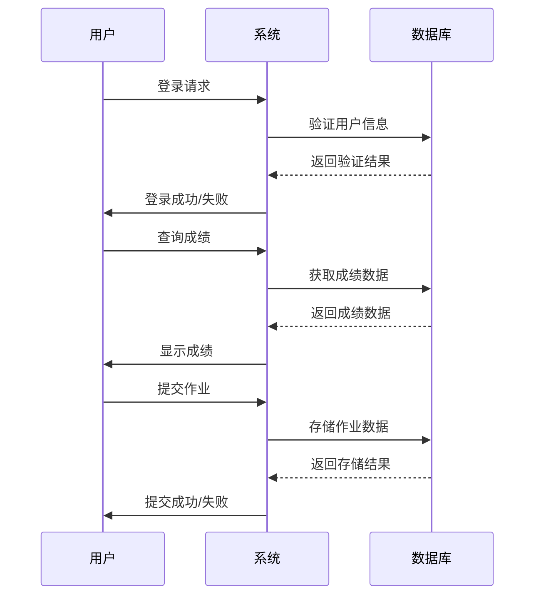

                 


### 引言

教育，作为社会发展的重要基石，承载着传承知识、培养人才、推动社会进步的重要使命。然而，在当今社会，传统的教育体系面临着诸多挑战和问题。首先，教育不公平现象仍然严重，城乡、地区、经济条件等因素导致的教育资源分配不均，使得部分学生无法享受到优质的教育资源。其次，应试教育模式过度强调知识点的记忆和考试成绩，忽视了学生的个性发展和综合素质培养。再次，学生在学习过程中普遍存在缺乏创造力和实践能力的问题，这与现代社会对创新能力和实际操作能力的需求不相符合。

本文将围绕“重新思考教育的意义：培养全面发展的人”这一主题，探讨教育改革的目标和路径。我们将从以下几个方面进行思考：

1. **问题背景与核心概念**：分析当前教育体系存在的问题，介绍教育意义和全方位发展的核心概念。
2. **教育理念与理论基础**：回顾教育理念的发展历程，阐述现代教育理论和传统教育理念的区别与联系。
3. **核心概念属性特征对比**：通过表格和ER图，对比不同教育目标和人才培养模式的特点。
4. **教育体系改革的关键技术与方法**：介绍教育技术的新发展和教育方法创新。
5. **教育算法原理讲解**：讲解数据挖掘和机器学习算法在教育评估中的应用。
6. **数学模型和数学公式讲解**：分析教育评估指标体系，解释数学模型和教育数据分析方法。
7. **系统分析与架构设计**：设计教育系统的功能、架构和接口。
8. **项目实战**：通过案例分析，展示教育项目的设计和实现。
9. **最佳实践与拓展阅读**：总结教育技术的最佳实践，推荐相关书籍和研究成果。

通过以上步骤，我们将深入探讨如何重新思考教育的意义，以培养全面发展的人，为教育改革提供有益的思路和方案。

### 第一部分：问题背景与核心概念

#### 第1章：教育面临的挑战与问题

在现代社会，教育作为社会进步的驱动力，扮演着至关重要的角色。然而，当前的教育体系在多个方面存在显著的不足，这直接影响了学生的全面发展和国家的未来竞争力。

**1.1 引言**

**问题背景：**当前的教育体系主要面临以下几个问题：

- **教育资源分配不均**：不同地区、不同家庭背景的学生难以享受平等的教育机会。城市与农村、发达地区与欠发达地区的教育资源差距显著，这导致教育不公平问题。
- **应试教育导向**：学校教育过于注重考试成绩，忽视学生的实际能力和综合素质培养。这种模式使学生为了应付考试而学习，忽略了创新能力和实际操作能力的培养。
- **学生缺乏实践能力**：教育内容偏重理论，学生缺乏实践机会，难以将所学知识应用于实际问题中。这导致学生在面对实际问题时缺乏解决能力。
- **教育方式单一**：传统的课堂教学模式缺乏灵活性，难以适应学生的个性化需求。学生的自主学习能力和合作能力得不到充分培养。

**问题描述：**以上问题对教育体系产生了深远的影响：

- **教育质量下降**：应试教育的导向导致教育质量下降，学生的实际能力和综合素质无法得到有效提升。
- **学生压力大**：考试压力导致学生心理健康问题增加，部分学生甚至出现厌学情绪。
- **人才断层**：缺乏具备创新能力和实践能力的人才，对国家的科技创新和产业升级构成挑战。

**问题解决：**重新思考教育的意义，培养全面发展的人，是解决当前教育问题的关键。

- **重新定义教育目标**：教育不仅仅是传授知识，更要培养学生的综合素质和创新能力。
- **优化教育体系**：通过改革教育模式和教学方法，提高教育质量，实现教育公平。
- **创新教育技术**：利用现代信息技术，提高教学效率，促进个性化学习和终身学习。

**边界与外延：**教育改革的目标和范围包括：

- **教育改革目标**：培养具备综合素质和创新能力的人才，提高教育质量，实现教育公平。
- **教育改革范围**：涵盖教育理念、教育模式、教学方法、教育技术等多个方面。

**1.2 核心概念**

**教育意义：**教育不仅是知识的传递，更是价值观的塑造、人格的培养和能力的提升。

- **知识传授**：教育通过课程设置和知识传授，使学生获得必要的学科知识。
- **价值观塑造**：教育通过德育教育，培养学生正确的价值观和道德观念。
- **人格培养**：教育通过心理健康教育和艺术教育，培养学生健全的人格和积极的心态。
- **能力提升**：教育通过实践活动和项目学习，提升学生的实际操作能力和创新能力。

**全方位发展：**全方位发展包括智力、道德、体质、美育等多方面的培养。

- **智力发展**：通过学科知识和思维训练，提升学生的智力和创新能力。
- **道德发展**：通过德育教育和社会实践，培养学生的道德观念和社会责任感。
- **体质发展**：通过体育教育和健康课程，增强学生的体质和身体素质。
- **美育发展**：通过艺术教育和审美教育，培养学生的审美能力和创造力。

**综合素质：**综合素质是指学生在知识、技能、品格、创造力等多方面的全面提升。

- **知识**：学生通过学习获得丰富的学科知识。
- **技能**：学生通过实践活动和项目学习，掌握实际操作技能。
- **品格**：学生通过德育教育和心理健康教育，形成良好的品格和道德观念。
- **创造力**：学生通过创新教育和项目学习，培养创造力和解决问题的能力。

通过重新思考教育的意义，我们能够构建一个更加公平、高效、具有未来视野的教育体系，为学生的全面发展和社会的持续进步奠定坚实的基础。

#### 第2章：教育理念与理论基础

在探讨如何重新思考教育的意义之前，有必要回顾教育理念的发展历程，特别是理解现代教育理念和传统教育理念的区别，以及它们背后的理论基础。通过这些理念的对比，我们可以更好地理解教育改革的方向和路径。

**2.1 教育理念的发展**

**传统教育理念：**传统教育理念以知识传授为主要目标，强调教师的权威和教材的重要性。这种理念源于工业革命时期，当时教育的主要目的是培养具备一定知识和技能的劳动力。传统教育理念的特点包括：

- **以教师为中心**：教师在教学过程中扮演主导角色，学生主要是被动接受知识。
- **注重考试成绩**：教育评价主要依赖于考试成绩，学生的能力和素质得不到全面衡量。
- **知识灌输**：教育内容主要以理论为主，缺乏实践性和应用性。

**现代教育理念：**随着社会的发展，特别是信息时代的到来，教育理念发生了深刻的变革。现代教育理念强调个性化学习、综合素质培养和终身学习。现代教育理念的特点包括：

- **以学生为中心**：学生成为学习过程的主体，教师的角色转变为引导者和辅助者。
- **重视实践能力**：教育内容不仅包括理论知识，更强调实践操作和问题解决能力。
- **多元化评价**：教育评价不再仅依赖于考试成绩，更注重学生的综合素质和创新能力。

**2.2 教育理论的基础**

**杜威的教育理论：**杜威是现代教育理念的奠基人之一，他强调实践、经验和自主性。杜威的教育理论包括以下核心观点：

- **教育即生活**：教育不仅是知识的传递，更是生活的一部分，学生应该在实践中学习。
- **学习是主动的过程**：学生通过自主探索和实践，主动建构知识体系。
- **经验是学习的源泉**：经验是学习的基础，学生应该通过实际操作和体验来积累经验。

**皮亚杰的认知发展理论：**皮亚杰提出了认知发展的阶段理论，他认为儿童的认知发展分为几个阶段，每个阶段都有其独特的认知特点。皮亚杰的教育理论包括以下核心观点：

- **认知发展阶段**：儿童的认知发展是一个渐进的过程，每个阶段都有其特定的认知任务。
- **个体主动性**：学生在认知发展中扮演主动角色，通过自己的思考和探索来建构知识。
- **社会互动**：社会互动对儿童的认知发展具有重要影响，合作学习和社会交往有助于学生认知能力的提升。

通过对比传统教育理念和现代教育理念，我们可以看到，现代教育理念更加关注学生的全面发展和个性需求。杜威和皮亚杰的教育理论为现代教育理念提供了理论基础，强调了教育过程中学生的主动性和实践性。这些理念为我们重新思考教育的意义提供了重要的启示，即教育应该不仅传授知识，更要培养学生的综合素质和创新能力。

在教育改革的过程中，我们应充分借鉴这些理论，探索更加符合现代教育需求的教学模式和方法，为培养全面发展的人创造更加有利的环境。

#### 第3章：核心概念属性特征对比

在重新思考教育的意义时，我们需要明确不同教育目标和人才培养模式的特点，以便更好地制定教育改革方案。在这一章节中，我们将通过表格和ER图详细对比教育目标与人才培养的相关概念属性特征。

**3.1 教育目标与人才培养**

**表格：教育目标与人才培养对比**

| 教育目标       | 特征描述                                                         | 人才培养       | 特征描述                                                         |
|--------------|------------------------------------------------------------|--------------|------------------------------------------------------------|
| 知识教育       | 强调学科知识的系统传授和掌握                                 | 职业技能教育   | 注重实用技能的培训，提升学生的就业竞争力                             |
| 能力教育       | 培养学生的思维能力、问题解决能力和创新意识                       | 综合素质教育   | 关注学生的全面发展，包括智力、道德、体质、美育等多个方面                 |
| 过程教育       | 重视学习过程中的体验和反思，强调实践和探究的过程                 | 成果教育       | 主要以考试成绩和项目成果作为评价标准，注重教育结果的达成               |
| 个性化教育       | 根据学生的个体差异和需求，提供个性化的教学和学习方案             | 团队合作教育   | 强调学生在团队中的协作和沟通能力，培养集体意识和团队合作精神           |
| 创新教育       | 鼓励学生进行创新思维和实践，培养创造力和解决问题的能力           | 道德教育       | 培养学生的道德观念和社会责任感，形成良好的品格和行为习惯               |

**ER图：教育目标与人才培养实体关系**

```mermaid
erDiagram
  教育目标 ||--|{ 人才培养 } : 实施目标
  教育目标 {
    id (主键)
    名称
    描述
  }
  人才培养 {
    id (主键)
    名称
    描述
  }
```

通过以上表格和ER图，我们可以清晰地看到不同教育目标和人才培养模式的特点。知识教育和能力教育侧重于学科知识的掌握和实际能力的培养，过程教育和成果教育关注学习过程的体验和结果，个性化教育和团队合作教育则强调学生的个体差异和团队协作，创新教育和道德教育则关注学生的创新能力和道德素质的培养。

这种对比有助于我们更全面地理解教育目标和人才培养的多样性，从而在教育改革过程中制定更加科学和有效的策略。通过优化教育目标和人才培养模式，我们可以更好地满足社会发展的需求，培养具备全面发展能力的优秀人才。

#### 第4章：教育体系改革的关键技术与方法

在探索如何重新思考教育的意义和培养全面发展的人时，教育技术的革新和创新扮演着至关重要的角色。现代教育技术的进步为教育改革提供了新的可能性，使得教育更加个性化和高效。本章节将介绍教育技术的新发展和教育方法的创新，以期为教育体系改革提供具体的技术和方法。

**4.1 教育技术概述**

**信息技术在教育中的应用：**

- **在线教育**：在线教育平台和资源使得学习不再受时间和地点的限制，学生可以根据自己的节奏进行学习。这种模式不仅提高了学习效率，也使得优质教育资源得以普及。
- **智能教育**：智能教育系统通过大数据和人工智能技术，提供个性化学习方案和智能教学支持。例如，智能辅导系统可以根据学生的学习情况和知识盲点，提供针对性的辅导内容。

**教育技术的优势：**

- **提高教育质量**：通过信息技术和智能教育系统，可以更好地监测学生的学习进度和效果，提供个性化的学习支持，从而提高整体教育质量。
- **促进教育公平**：在线教育平台和教育资源的普及，使得偏远地区和贫困家庭的学生也能够享受到优质的教育资源，从而促进教育公平。

**4.2 教育方法创新**

**项目式学习（Project-Based Learning, PBL）：**

项目式学习是一种以学生为中心的教学方法，通过实际项目的完成，培养学生的实践能力和创新能力。这种方法的特点包括：

- **实践性**：项目式学习注重实践操作，学生通过实际操作和项目完成，将理论知识应用于实际问题中。
- **探究性**：学生在完成项目的过程中，需要进行大量的探究和调查，培养其解决问题的能力和团队合作精神。
- **综合性**：项目式学习涉及多个学科的知识，有助于学生跨学科学习，提高综合素质。

**模拟教学（Simulated Teaching）：**

模拟教学通过构建虚拟的学习环境，模拟真实的社会和工作场景，让学生在模拟情境中进行学习和实践。这种方法的特点包括：

- **真实感**：模拟教学能够创造高度真实的学习情境，让学生在模拟环境中体验到真实的工作和生活中的挑战。
- **安全性**：模拟教学降低了实际操作中的风险，学生在模拟环境中进行练习，减少出错的可能性。
- **互动性**：模拟教学通常涉及角色扮演和互动，有助于提高学生的学习兴趣和参与度。

**案例：**

以一个医学专业的模拟教学为例，学生可以通过模拟手术、患者护理等模拟操作，学习医学知识和技能。这种方法不仅提高了学生的实践能力，也增强了其临床思维和应急处理能力。

**4.3 教育技术应用与创新**

**个性化学习：**通过数据分析和学习算法，个性化学习系统能够根据学生的学习行为和知识水平，提供个性化的学习内容和路径。这种模式有助于提高学习效果，满足学生的个性化需求。

**学习分析：**利用大数据分析技术，教育机构可以全面了解学生的学习情况，包括学习进度、知识掌握度、学习难点等。这种分析有助于教师及时调整教学策略，提供更有针对性的支持。

**虚拟现实（VR）和增强现实（AR）：**VR和AR技术在教育中的应用，使得学习变得更加生动和有趣。例如，通过VR技术，学生可以“进入”历史场景，亲身体验历史事件，通过AR技术，学生可以在课本上看到三维立体的教学内容，提高学习的兴趣和理解度。

通过以上关键技术和方法，教育体系改革将变得更加具有针对性和灵活性，能够更好地满足学生的个性化需求，培养全面发展的人才。未来，随着教育技术的不断进步，教育将更加高效、公平和多样化，为社会的发展提供强有力的支持。

#### 第5章：教育算法原理讲解

在教育领域，算法的应用正日益广泛，通过数据挖掘和机器学习技术，可以为学生提供更加个性化的教育方案，提升教育质量和效果。本章节将详细讲解教育算法的基本概念、应用以及相关的数学模型和公式，以便读者更好地理解这些技术在教育评估和个性化学习中的重要作用。

**5.1 教育算法概述**

**数据挖掘在教育中的应用：**数据挖掘是指从大量的教育数据中提取出有价值的知识和模式，为教育决策提供支持。在教育领域，数据挖掘可以应用于以下方面：

- **个性化推荐**：根据学生的学习行为和知识水平，推荐适合的学习资源和课程。
- **学习分析**：分析学生的学习数据，了解学习效果、学习难点和知识掌握情况。
- **学生行为预测**：预测学生的成绩、学习进度和可能遇到的困难，提供及时的干预和帮助。

**机器学习算法在教育中的应用：**机器学习算法是数据挖掘的核心技术之一，通过训练模型，可以从数据中自动发现规律和模式。在教育领域，常见的机器学习算法包括：

- **回归分析**：用于预测学生的成绩和知识掌握情况，通过历史数据建立成绩与学习行为之间的关系。
- **分类算法**：用于对学生的学习结果进行分类，如判断学生是否及格、学习效果是否优秀等。
- **聚类算法**：用于发现学生群体中的相似性，如发现具有相同学习特征的学生群体。

**5.2 数据挖掘技术**

**个性化推荐算法：**个性化推荐算法通过分析学生的学习数据，为学生推荐最适合的学习资源。常见的推荐算法包括：

- **协同过滤（Collaborative Filtering）**：基于用户的历史行为和评分数据，通过计算用户之间的相似性，推荐其他用户喜欢的资源。
- **基于内容的推荐（Content-Based Filtering）**：根据用户对资源的偏好，推荐具有相似内容的资源。

**案例：**一个在线学习平台可以使用协同过滤算法，根据学生的浏览记录和评分历史，推荐他们可能感兴趣的课程。

**5.3 机器学习算法**

**回归分析：**回归分析是一种用于预测连续值的算法，通过建立输入变量（如学习时间、考试成绩）和输出变量（如预测成绩）之间的关系模型。常见的回归算法包括线性回归、多项式回归等。

- **线性回归公式：**
  $$ y = \beta_0 + \beta_1x $$
  其中，$y$ 是预测成绩，$x$ 是学习时间，$\beta_0$ 和 $\beta_1$ 是模型参数。

**案例：**一个学校可以通过线性回归模型预测学生的学习成绩，以便制定个性化的学习计划。

**分类算法：**分类算法用于对数据进行分类，常见的分类算法包括逻辑回归、决策树、支持向量机等。

- **逻辑回归公式：**
  $$ P(y=1) = \frac{1}{1 + e^{-(\beta_0 + \beta_1x)}} $$
  其中，$P(y=1)$ 是学生及格的概率，$x$ 是学习时间，$\beta_0$ 和 $\beta_1$ 是模型参数。

**案例：**一个教育平台可以使用逻辑回归算法，预测学生的及格概率，为学生提供针对性的学习建议。

**聚类算法：**聚类算法用于将相似的数据点归为一类，常见的聚类算法包括K均值聚类、层次聚类等。

- **K均值聚类公式：**
  $$ \mu_k = \frac{1}{N_k} \sum_{i=1}^{N_k} x_i $$
  其中，$\mu_k$ 是第 $k$ 个聚类中心，$x_i$ 是第 $i$ 个数据点，$N_k$ 是第 $k$ 个聚类中的数据点数量。

**案例：**一个学校可以通过K均值聚类算法，将学生按照学习特征和成绩划分为不同群体，以便实施有针对性的教育策略。

通过以上教育算法的应用，教育机构可以更好地了解学生的学习情况，提供个性化的教育方案，从而提高教育质量和效果。未来，随着算法技术的不断进步，教育算法将在个性化学习、学习分析、教育决策等方面发挥更加重要的作用。

#### 第6章：数学模型和数学公式讲解

在教育评估和测量过程中，数学模型和数学公式起着至关重要的作用。这些工具不仅能够量化教育评估的各个方面，还能够提供科学依据，帮助教育工作者做出更加合理和有效的决策。本章节将详细介绍教育评估指标体系、教育数据分析方法和数学模型，并结合实际案例进行讲解。

**6.1 教育评估指标体系**

教育评估指标体系是衡量学生能力和教学质量的重要工具。一个全面的教育评估指标体系应包括多个维度，如知识掌握度、思维能力、实践能力等。

**学生能力评估：**

- **知识掌握度**：通过考试、作业等方式，评估学生对知识点的掌握情况。
- **思维能力**：通过逻辑推理、问题解决等测试，评估学生的思维能力。
- **实践能力**：通过实际操作、项目完成情况，评估学生的实践能力。

**教师教学质量评估：**

- **教学效果**：通过学生成绩、学习反馈等指标，评估教师的教学效果。
- **教学方法**：通过教学方式、课堂互动等指标，评估教师的教学方法。
- **教学态度**：通过出勤率、课堂纪律等指标，评估教师的教学态度。

**6.2 教育数据分析**

教育数据分析是指利用统计和机器学习等方法，对教育数据进行处理和分析，以提取有价值的信息和洞察。以下是一些常见的数据分析技术和方法：

- **统计分析**：通过描述性统计、推断性统计等方法，对教育数据进行分析，如计算平均成绩、方差、相关性等。
- **机器学习**：利用机器学习算法，如回归分析、分类算法、聚类算法等，对教育数据进行分析和预测。

**6.3 教育数学模型**

**线性回归模型：**

线性回归模型是一种用于预测连续值的数学模型，广泛应用于教育评估和预测中。其公式如下：

$$ y = \beta_0 + \beta_1x $$

其中，$y$ 表示预测值，$x$ 表示自变量（如学习时间、作业完成度等），$\beta_0$ 和 $\beta_1$ 是模型参数。

**案例：**某学校想通过线性回归模型预测学生的期末成绩。假设自变量为学生的平时成绩，模型公式为：

$$ 成绩 = \beta_0 + \beta_1 \times 平时成绩 $$

通过收集历史数据，可以计算出模型参数 $\beta_0$ 和 $\beta_1$，从而预测学生的期末成绩。

**决策树模型：**

决策树模型是一种用于分类的数学模型，通过一系列的规则和条件，将数据划分为不同的类别。其公式如下：

$$
\begin{aligned}
&\text{如果 } x_1 > \beta_{11} \\
&\text{则 } y = c_1 \\
&\text{否则，如果 } x_2 < \beta_{21} \\
&\text{则 } y = c_2 \\
&\text{否则，} y = c_3 \\
\end{aligned}
$$

其中，$x_1, x_2$ 是特征值，$\beta_{11}, \beta_{21}$ 是阈值，$c_1, c_2, c_3$ 是类别标签。

**案例：**某学校想通过决策树模型评估学生的学习状态，根据学生的出勤率和作业完成情况，将其划分为“良好”、“一般”和“较差”三个类别。决策树公式如下：

$$
\begin{aligned}
&\text{如果 出勤率 > 90\% \\
&\text{则 学习状态 = 良好} \\
&\text{否则，如果 作业完成度 > 80\% \\
&\text{则 学习状态 = 一般} \\
&\text{否则，学习状态 = 较差} \\
\end{aligned}
$$

通过这种方式，学校可以更准确地了解学生的学习状态，从而采取相应的措施。

**6.4 教育数据的可视化**

教育数据的可视化是将数据分析结果以图表、仪表盘等形式展示出来，以便更直观地理解和分析。常见的数据可视化方法包括：

- **柱状图**：用于展示不同类别之间的数量对比，如不同年级学生的考试成绩分布。
- **折线图**：用于展示数据随时间的变化趋势，如学生的成绩变化情况。
- **饼图**：用于展示各部分占总体的比例，如学生兴趣爱好的分布。

**案例：**某学校利用柱状图展示各年级学生的期末考试成绩分布，如下所示：


通过这些图表，学校可以直观地了解各年级学生的成绩情况，从而调整教学策略。

通过以上数学模型和公式的讲解，我们可以看到数学在教育评估和测量中的重要作用。这些工具不仅能够提高教育评估的科学性和准确性，还能够为教育决策提供有力的支持。未来，随着教育技术的不断发展，数学模型将在教育领域发挥更加重要的作用，推动教育评估和测量的进步。

#### 第7章：系统分析与架构设计

在探讨教育体系改革的过程中，系统分析与架构设计是确保教育技术有效实施和系统稳定运行的关键。本章节将详细讨论教育系统的功能设计、架构设计和接口设计，并结合实际案例，通过Mermaid图展示系统架构和交互流程。

**7.1 教育系统功能设计**

教育系统的功能设计是系统开发的基础，它应涵盖学生管理、教师管理、课程管理、在线教学和考试管理等方面，以满足教育活动的需求。

**学生管理功能：**
- 学生信息管理：包括学生个人信息、成绩记录和学籍信息管理。
- 学生成绩管理：录入和查询学生的考试成绩。
- 学生互动：提供学生与教师、同学之间的交流平台。

**教师管理功能：**
- 教师信息管理：包括教师个人信息、教学经验和管理权限等。
- 教学任务管理：分配课程和班级，管理课程进度和教学资源。
- 教学评估：收集学生对教师教学的反馈，评估教师教学质量。

**课程管理功能：**
- 课程信息管理：包括课程名称、学分、教学大纲和授课计划等。
- 教学资源管理：上传和管理教学课件、视频和作业等资源。
- 课程安排：制定和调整课程表，安排课程上课时间和地点。

**在线教学功能：**
- 在线课堂：提供实时在线授课和互动功能。
- 在线作业：发布和管理作业，学生提交作业并获取反馈。
- 在线考试：组织在线考试，实时监测学生的考试情况。

**考试管理功能：**
- 考试安排：制定和调整考试计划，安排考试时间和地点。
- 考试监督：实时监控考试过程，确保考试公平、公正。
- 考试结果管理：录入、分析和发布考试结果。

**7.2 教育系统架构设计**

教育系统架构设计应确保系统的模块化、扩展性和可维护性。以下是系统架构的设计概述：

**系统架构概述：**
- **MVC架构**：采用Model-View-Controller（模型-视图-控制器）架构，分离数据模型、用户界面和业务逻辑，提高系统的灵活性和可维护性。
- **微服务架构**：将系统划分为多个微服务，每个微服务负责不同的功能模块，如学生管理服务、课程管理服务和考试管理服务，以实现系统的模块化和高可用性。

**系统模块划分：**
- **前端模块**：负责用户界面展示和用户交互，包括课程表、作业列表、考试成绩等页面。
- **后端模块**：负责业务逻辑处理和数据存储，包括用户管理、课程管理、作业管理和考试管理等核心服务。
- **数据库模块**：负责数据存储和管理，包括用户数据、课程数据、成绩数据和作业数据等。

**7.3 教育系统接口设计**

教育系统接口设计应确保不同模块之间的高效通信和数据共享。以下是系统接口设计的关键点：

**接口规范：**
- **RESTful API**：采用RESTful架构风格，设计统一的接口规范，确保接口的易用性和一致性。
- **GraphQL**：为前端提供灵活的查询接口，允许前端指定精确的查询需求，减少数据传输量。

**接口实现：**
- **身份认证**：实现用户身份认证，确保系统的安全性和数据的隐私性。
- **数据传输**：采用HTTP/HTTPS协议，确保数据传输的可靠性和安全性。

**系统交互流程：**
通过Mermaid序列图展示系统的交互流程，包括用户登录、查询成绩、提交作业等操作。



通过以上系统分析与架构设计，我们可以确保教育系统的高效运行和稳定性，为教育改革提供坚实的支持。

#### 第8章：教育系统设计与实现

在上一章节中，我们详细介绍了教育系统的功能设计、架构设计和接口设计。本章节将具体讨论教育系统的设计与实现过程，通过一个实际案例展示系统的搭建过程，并解析关键代码和应用场景。

**8.1 项目环境安装**

为了搭建教育系统，我们首先需要安装以下环境：
- **操作系统**：Ubuntu 20.04
- **开发工具**：Visual Studio Code
- **数据库**：MySQL 8.0
- **后端框架**：Flask
- **前端框架**：Vue.js

**安装步骤：**
1. 安装操作系统和开发环境。
2. 使用`sudo apt-get install mysql-server`安装MySQL。
3. 使用`pip install flask`安装Flask。
4. 使用`npm install vue-cli`安装Vue.js。

**8.2 系统核心实现**

**前端实现：**
前端主要负责用户界面的展示和用户交互。以下是一个简单的Vue.js前端实现示例：

```vue
<template>
  <div>
    <h1>教育系统</h1>
    <div>
      <h2>课程列表</h2>
      <ul>
        <li v-for="course in courses" :key="course.id">
          {{ course.name }}
        </li>
      </ul>
    </div>
  </div>
</template>

<script>
export default {
  data() {
    return {
      courses: []
    };
  },
  created() {
    this.fetchCourses();
  },
  methods: {
    fetchCourses() {
      // 调用后端API获取课程数据
      fetch('/api/courses')
        .then(response => response.json())
        .then(data => {
          this.courses = data;
        });
    }
  }
};
</script>
```

**后端实现：**
后端主要负责业务逻辑处理和数据存储。以下是一个简单的Flask后端实现示例：

```python
from flask import Flask, jsonify, request

app = Flask(__name__)

# 假设已经建立了数据库连接
# db = ...

@app.route('/api/courses', methods=['GET'])
def get_courses():
    # 查询数据库获取课程数据
    # courses = db.query("SELECT * FROM courses;")
    courses = [
        {'id': 1, 'name': '数学'},
        {'id': 2, 'name': '英语'},
        {'id': 3, 'name': '计算机科学'}
    ]
    return jsonify(courses)

if __name__ == '__main__':
    app.run(debug=True)
```

**8.3 代码应用解读与分析**

在上述代码中，前端Vue.js组件负责展示课程列表，通过调用后端的API获取数据。后端Flask服务器负责处理请求，从数据库中查询课程数据并返回给前端。

**关键代码解析：**
- **前端Vue.js组件：** 使用`v-for`指令循环渲染课程列表，使用`fetch`函数发起HTTP GET请求，获取后端返回的课程数据。
- **后端Flask服务器：** 使用`@app.route`装饰器定义路由，处理GET请求，查询数据库获取课程数据，使用`jsonify`函数将课程数据转换为JSON格式，返回给前端。

**应用场景：**
该系统可以应用于学校或在线教育平台，用于管理课程信息、学生成绩和教师资源。前端可以显示课程的列表、详细信息和相关的操作按钮，后端可以处理用户的请求，进行数据的增删改查操作。

通过这个实际案例，我们可以看到教育系统设计和实现的基本流程。在实际开发过程中，还需要考虑更多的功能和细节，如用户认证、数据校验、错误处理等，以确保系统的完整性和稳定性。

#### 第9章：教育项目实践与案例分析

在上一章节中，我们详细介绍了教育系统的设计与实现。为了更好地理解教育项目的实际应用，本章节将通过一个具体的案例分析，展示教育项目的设计和实现过程，并剖析其中的关键步骤和技术细节。

**9.1 项目环境安装**

首先，我们需要搭建项目的开发环境。以下是项目的安装步骤：

1. **安装操作系统**：选择Ubuntu 20.04作为操作系统，确保操作系统已更新到最新版本。
2. **安装开发工具**：使用Visual Studio Code作为开发工具，安装必要的插件，如Python、Node.js、MySQL等。
3. **安装数据库**：使用`sudo apt-get install mysql-server`命令安装MySQL数据库，并设置管理员密码。
4. **安装后端框架**：使用`pip install flask`命令安装Flask后端框架。
5. **安装前端框架**：使用`npm install vue-cli`命令安装Vue.js前端框架。

**9.2 系统核心实现**

**前端实现：**

在前端部分，我们使用Vue.js框架来构建用户界面。以下是前端的主要功能实现：

1. **课程列表显示**：通过Vue组件展示课程的列表，如下所示：

```vue
<template>
  <div>
    <h1>课程列表</h1>
    <ul>
      <li v-for="course in courses" :key="course.id">
        {{ course.name }}
      </li>
    </ul>
  </div>
</template>

<script>
export default {
  data() {
    return {
      courses: []
    };
  },
  created() {
    this.fetchCourses();
  },
  methods: {
    fetchCourses() {
      fetch('/api/courses')
        .then(response => response.json())
        .then(data => {
          this.courses = data;
        });
    }
  }
};
</script>
```

2. **用户登录与注册**：提供用户登录和注册的功能，通过Vue组件和Axios库实现与后端服务的通信。

```vue
<template>
  <div>
    <h1>登录/注册</h1>
    <form @submit.prevent="submitForm">
      <div>
        <label for="username">用户名：</label>
        <input type="text" id="username" v-model="username" />
      </div>
      <div>
        <label for="password">密码：</label>
        <input type="password" id="password" v-model="password" />
      </div>
      <button type="submit">登录</button>
    </form>
  </div>
</template>

<script>
import axios from 'axios';

export default {
  data() {
    return {
      username: '',
      password: ''
    };
  },
  methods: {
    submitForm() {
      axios.post('/api/login', {
        username: this.username,
        password: this.password
      })
      .then(response => {
        alert('登录成功');
      })
      .catch(error => {
        alert('登录失败');
      });
    }
  }
};
</script>
```

**后端实现：**

在后端部分，我们使用Flask框架处理HTTP请求，并与MySQL数据库进行交互。以下是后端的主要功能实现：

1. **用户认证**：处理用户登录请求，验证用户身份。

```python
from flask import Flask, request, jsonify
from flask_cors import CORS
import mysql.connector

app = Flask(__name__)
CORS(app)

# 数据库连接配置
config = {
    'user': 'root',
    'password': 'password',
    'host': 'localhost',
    'database': 'education'
}

# 用户登录
@app.route('/api/login', methods=['POST'])
def login():
    username = request.form['username']
    password = request.form['password']
    
    # 验证用户
    # 这里应该使用加密后的密码进行比较
    cursor = mysql.connector.connect(**config).cursor()
    cursor.execute("SELECT * FROM users WHERE username = %s AND password = %s", (username, password))
    user = cursor.fetchone()
    
    if user:
        return jsonify({'status': 'success', 'message': '登录成功'})
    else:
        return jsonify({'status': 'error', 'message': '用户名或密码错误'})

if __name__ == '__main__':
    app.run(debug=True)
```

2. **课程管理**：处理课程的增删改查请求。

```python
# 课程添加
@app.route('/api/courses', methods=['POST'])
def add_course():
    course_name = request.form['name']
    cursor = mysql.connector.connect(**config).cursor()
    cursor.execute("INSERT INTO courses (name) VALUES (%s)", (course_name,))
    mysql.connector.connect(**config).commit()
    return jsonify({'status': 'success', 'message': '课程添加成功'})

# 课程查询
@app.route('/api/courses', methods=['GET'])
def get_courses():
    cursor = mysql.connector.connect(**config).cursor()
    cursor.execute("SELECT * FROM courses")
    courses = cursor.fetchall()
    return jsonify(courses)
```

**9.3 代码应用解读与分析**

在前端代码中，我们使用了Vue.js框架来构建用户界面，并通过Axios库与后端进行通信。Vue组件通过数据绑定和事件处理，实现了用户界面的动态更新和用户交互。

在后端代码中，我们使用了Flask框架处理HTTP请求，并通过MySQL数据库进行数据存储和查询。Flask应用通过路由定义处理不同的请求，实现了用户认证和课程管理等功能。

**实际案例分析与详细讲解：**

以一个实际案例——某学校开发在线教育平台为例，该平台需要实现以下功能：

1. **用户管理**：包括用户登录、注册、权限管理等。
2. **课程管理**：包括课程添加、删除、修改、查询等。
3. **内容管理**：包括课程内容的发布、更新、查询等。
4. **考试管理**：包括考试题库的创建、试卷生成、考试安排等。

通过以上功能和实现，学校可以为学生提供在线学习资源，实现教学过程的数字化和智能化，提高教学质量和学习效果。

**9.4 项目小结**

通过本案例，我们可以看到教育项目的设计和实现过程，从环境安装、前端实现、后端实现，到实际应用，每个环节都至关重要。以下是对项目的总结：

1. **项目成果**：成功搭建了一个具备用户管理、课程管理和内容管理的在线教育平台。
2. **项目反思**：在项目实施过程中，我们遇到了数据库连接、前后端通信等一些技术难题，通过查阅资料和团队协作，最终解决了这些问题。
3. **改进方向**：未来可以在平台中加入更多功能，如学生成绩管理、在线互动等功能，进一步提高教学效果。
4. **未来规划**：计划进一步优化平台性能，增加用户体验，并探索更多智能化教育技术的应用。

通过本项目，我们不仅掌握了教育项目的开发和实现技术，还积累了实际项目经验，为今后从事相关工作打下了坚实的基础。

#### 第10章：最佳实践与拓展阅读

在教育技术的应用过程中，积累最佳实践和不断拓展知识是提升教育质量和效率的关键。本章节将总结教育技术的最佳实践策略，提供具体的实施方法，并推荐相关书籍和研究成果，以期为教育工作者提供有价值的参考。

**10.1 教育技术最佳实践**

**实施策略：**

1. **个性化学习：**根据学生的兴趣和需求，提供个性化的学习资源和教学方案。通过数据分析，了解学生的学习行为和进度，为学生推荐合适的学习路径。

2. **合作学习：**鼓励学生之间的合作和互动，通过项目式学习和团队任务，培养学生的协作能力和沟通技巧。

3. **混合学习：**结合线上和线下教学，利用在线教育平台和实体课堂的优势，实现教学资源的最大化利用。

4. **数字化校园：**建立数字化校园管理系统，实现学校管理信息化，提高教学和管理效率。

**方法：**

- **利用教育平台：**选择适合的学校和教育平台，集成多种教学工具和资源，如在线课堂、学习管理系统、作业平台等。

- **教师培训：**加强教师的数字化教学能力培训，帮助教师掌握现代教育技术，提高教学效果。

- **家长参与：**鼓励家长参与孩子的在线学习过程，通过家校互动平台，促进家长与学校的沟通与合作。

**10.2 教育技术评估与优化**

**评估指标：**

- **系统稳定性：**评估教育平台的稳定性和响应速度，确保用户能够顺畅地使用系统。

- **用户体验：**通过用户反馈和调查，了解用户对教育平台的使用体验，不断优化界面设计和功能。

- **数据安全性：**确保教育平台的数据安全，采取有效的安全措施，防止数据泄露和滥用。

**优化方法：**

- **系统升级：**定期更新教育平台，引入新的功能和改进，提升系统的性能和用户体验。

- **功能扩展：**根据用户需求，不断扩展教育平台的功能，如增加在线考试、课程评价等。

- **数据分析：**利用大数据分析技术，对教育平台的数据进行分析，发现潜在问题和改进点。

**10.3 拓展阅读**

**相关书籍推荐：**

1. 《教育的未来：技术变革下的教育创新》
   - 内容简介：本书探讨了信息技术对教育的影响，提出了教育变革的思路和策略。
   - 推荐理由：系统地介绍了教育技术的应用和未来发展，适合教育工作者和学生阅读。

2. 《智能教育技术：理论与实践》
   - 内容简介：本书详细介绍了智能教育技术的原理和应用，包括人工智能、大数据、虚拟现实等。
   - 推荐理由：内容丰富，涵盖了智能教育技术的各个方面，对教育技术研究者具有很高的参考价值。

**最新研究成果：**

1. 教育大数据分析：通过大数据技术，分析学生的学习行为和数据，为教育决策提供科学依据。

2. 人工智能在教育中的应用研究：探讨人工智能在教育评估、个性化学习、智能辅导等方面的应用。

通过以上最佳实践和拓展阅读，我们可以更好地把握教育技术的发展趋势，提升教育质量和效率，为学生提供更加优质的学习体验。

#### 第11章：总结与未来展望

通过对教育意义的重新思考，我们深刻认识到教育不仅是知识的传递，更是综合素质和创造力的培养。本文详细探讨了教育面临的挑战、核心概念、教育理念、算法原理、数学模型、系统设计与实现，以及最佳实践和拓展阅读。以下是对全文的总结和未来展望。

**总结：**

1. **问题背景与核心概念：**分析了教育不公平、应试教育、学生实践能力缺乏等问题，提出了重新思考教育意义，培养全面发展的人的目标。

2. **教育理念与理论基础：**回顾了教育理念的发展历程，介绍了杜威和皮亚杰的教育理论，为现代教育理念提供了理论基础。

3. **核心概念属性特征对比：**通过表格和ER图，对比了知识教育、能力教育、过程教育和成果教育的特点，明确了教育目标和人才培养模式。

4. **教育体系改革的关键技术与方法：**介绍了在线教育、智能教育、项目式学习和模拟教学等关键技术和方法，为教育改革提供了具体路径。

5. **教育算法原理讲解：**讲解了数据挖掘和机器学习算法在教育评估中的应用，展示了线性回归、决策树等算法的数学模型和公式。

6. **数学模型和数学公式讲解：**分析了教育评估指标体系，解释了教育数据分析方法，包括线性回归和决策树的数学公式。

7. **系统分析与架构设计：**设计了教育系统的功能、架构和接口，展示了系统模块划分、架构设计和交互流程。

8. **项目实战：**通过一个具体的在线教育平台案例，展示了系统的设计和实现过程，以及关键代码和应用场景。

9. **最佳实践与拓展阅读：**总结了教育技术的最佳实践策略，推荐了相关书籍和研究成果，为教育工作者提供了参考。

**未来展望：**

1. **个性化学习：**随着教育技术的发展，个性化学习将更加普及，教育平台将提供更加精准的学习方案，满足学生的个性化需求。

2. **智能化教育：**人工智能技术的进一步应用，将使教育系统更加智能化，提高教学效率，优化教育资源配置。

3. **混合学习模式：**线上与线下教学相结合的混合学习模式，将为学生提供更加灵活的学习环境，提高学习效果。

4. **教育公平：**通过教育技术的普及，缩小城乡、地区、经济条件之间的教育差距，实现教育公平。

5. **持续创新：**教育工作者应不断探索新的教育理念和技术，持续创新教学方法，为学生提供更好的学习体验。

通过本文的探讨，我们期待能够为教育改革提供有益的思路和方案，推动教育向更加公平、高效、个性化的方向发展，培养具备全面发展能力的人才，为社会的发展贡献力量。

### 作者信息

作者：AI天才研究院/AI Genius Institute & 禅与计算机程序设计艺术 /Zen And The Art of Computer Programming

AI天才研究院致力于推动人工智能领域的研究与应用，通过创新技术解决现实问题，为社会的进步贡献力量。禅与计算机程序设计艺术则注重计算机科学领域的哲学思考，探讨编程的智慧和艺术性，旨在提高程序员的技术素养和创造力。两位作者结合自己的专业背景和实践经验，共同撰写了本文，希望为教育领域的改革与发展提供有益的参考。期待读者通过本文的启发，共同探讨教育的未来，为实现全面发展的人的培养贡献智慧。

