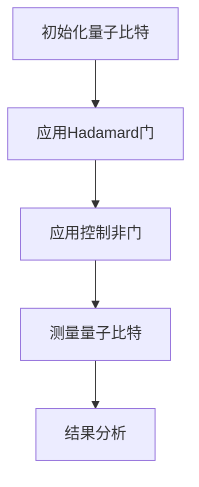

                 

### 引言

随着城市化进程的加速和人口密度的增加，交通拥堵问题日益严重，成为影响人们生活质量的重要因素之一。传统的交通流优化方法，如基于模拟和优化的路径规划算法，虽然在一定程度上能够缓解交通拥堵，但在复杂城市环境和大规模交通系统中，往往难以达到理想的效果。因此，探索新的优化方法，特别是借助量子计算技术的潜力，成为当前交通流优化研究的一个热点方向。

量子计算，作为一种颠覆性的计算技术，基于量子力学的基本原理，具有处理海量数据和高维度问题的高速计算能力。与传统计算机不同，量子计算机利用量子比特（qubit）的叠加态和纠缠态进行计算，能够在极短时间内解决传统计算机难以处理的复杂问题。这种独特的计算模式，使得量子计算在交通流优化领域展现出广阔的应用前景。

本文旨在探讨量子计算在交通流优化中的应用前景。我们将首先介绍量子计算的基本概念和原理，然后分析交通流优化问题的背景和特点，接着讨论量子交通流优化模型的设计，最后通过实验案例和未来发展趋势来总结量子计算在交通流优化中的潜力和挑战。希望通过本文的讨论，能够为相关领域的研究者和从业者提供一些有价值的参考和启示。

### 关键词

- 量子计算
- 交通流优化
- 量子比特
- 量子门
- 量子纠缠
- 量子算法

### 摘要

本文主要探讨了量子计算在交通流优化中的应用前景。首先，介绍了量子计算的基本概念和原理，包括量子比特、量子门和量子纠缠等核心概念。然后，分析了交通流优化问题的背景和特点，并提出了基于量子计算的交通流优化模型。接着，详细阐述了量子交通流优化算法的设计和实现，包括路网分析、交通分配和路径规划等核心算法。通过实验案例展示了量子计算在交通流优化中的实际应用效果，并分析了未来发展的趋势和面临的挑战。最后，提出了实施量子交通流优化项目的最佳实践和注意事项，为相关领域的研究提供了参考。

### 量子计算基础

#### 第1章: 量子计算概述

##### 1.1 量子计算的基本概念

量子计算是现代计算机科学的前沿领域，它基于量子力学的原理，通过使用量子比特（qubit）进行信息处理。量子比特是量子计算机的基本单位，与传统计算机中的比特不同，它不仅可以表示0和1的状态，还可以同时处于0和1的叠加态。这种叠加态使得量子计算机在处理复杂数据和进行并行计算时具有巨大的优势。

量子计算的核心原理包括量子叠加、量子纠缠和量子门。量子叠加使得量子比特可以同时表示多种状态，从而实现并行计算。量子纠缠则是一种量子比特之间的特殊关联，即使这些量子比特相隔很远，它们的状态也会相互影响。这种关联性为量子计算机提供了处理复杂问题的强大工具。量子门是操作量子比特的基本单元，通过一系列的量子门操作，可以实现量子态的变换和计算。

与传统计算机相比，量子计算机具有几个显著的优势。首先，量子计算机的并行计算能力远远超过传统计算机，可以在极短的时间内处理海量数据。其次，量子计算机在解决某些特定问题时，如整数分解、搜索问题等，可以大幅减少计算时间。此外，量子计算机在处理高维度问题和复杂系统模拟方面也具有独特的优势。

然而，量子计算也面临一些挑战。首先，量子计算机的构建和维护成本极高，量子比特的稳定性问题尚未完全解决。其次，量子计算机的编程和算法设计与传统计算机有很大差异，需要新的编程语言和算法框架。此外，量子计算的安全性问题也需要深入研究，以确保量子计算机不被恶意攻击者利用。

##### 1.2 量子计算机与传统计算机的对比

量子计算机与传统计算机在多个方面存在显著差异。首先，从硬件结构来看，传统计算机使用二进制比特进行计算，每个比特只能处于0或1的状态。而量子计算机使用量子比特，每个量子比特可以处于0、1或两者的叠加态。这种叠加态使得量子计算机能够同时处理多种可能性，从而实现并行计算。

在计算速度方面，量子计算机具有显著优势。根据量子力学的原理，量子计算机可以在极短的时间内解决传统计算机难以处理的问题。例如，Shor算法能够在多项式时间内解决大整数分解问题，而传统计算机需要指数级时间。此外，量子计算机在处理高维度问题和复杂系统模拟方面也表现出色。

然而，量子计算机也存在一些劣势。首先，量子计算机的构建和维护成本极高，目前尚无法实现大规模的商业化应用。其次，量子计算机的编程和算法设计复杂，需要新的编程语言和算法框架。此外，量子计算机的可靠性问题尚未完全解决，量子比特的稳定性是当前研究的重点之一。

总体来说，量子计算机与传统计算机各有优劣，但量子计算机在处理特定类型的问题上具有巨大潜力。随着技术的不断进步，量子计算机有望在未来实现与传统计算机的深度融合，为解决复杂问题提供新的思路和方法。

##### 1.3 量子计算的优势和挑战

量子计算在多个领域展现出巨大的优势，尤其在解决复杂系统和大规模数据处理方面具有独特的潜力。首先，量子计算的核心优势在于其并行计算能力。由于量子比特可以处于叠加态，量子计算机能够同时处理多种可能性，从而大幅提高计算效率。例如，在交通流优化中，量子计算机可以同时考虑多种路径和流量配置，迅速找到最优解。

其次，量子计算在处理高维度问题和复杂系统模拟方面具有显著优势。传统计算机在处理高维数据时，计算复杂度和计算时间会呈指数级增长，而量子计算机则能够以相对较低的计算复杂度解决这些问题。例如，量子计算机可以高效地模拟交通流量动态变化，预测未来的交通状况。

然而，量子计算也面临一些挑战。首先，量子计算机的构建和维护成本极高，目前尚无法实现大规模的商业化应用。其次，量子计算机的编程和算法设计复杂，需要新的编程语言和算法框架。此外，量子比特的稳定性问题尚未完全解决，这是当前研究的重点之一。

为了克服这些挑战，研究人员正在从多个方面进行探索。一方面，通过改进量子比特的物理实现方式，提高量子比特的稳定性。另一方面，开发新的算法和编程框架，使量子计算机更容易编程和调试。此外，量子计算的安全性也是一个重要的研究方向，确保量子计算机不被恶意攻击者利用。

总之，量子计算在交通流优化中具有广阔的应用前景，但也面临一系列挑战。随着技术的不断进步，量子计算有望在未来发挥更大作用，为解决交通流优化等复杂问题提供新的解决方案。

#### 第2章: 量子计算原理

##### 2.1 量子比特和量子门

量子比特是量子计算机的基本单位，它与传统计算机中的比特不同，可以同时处于0和1的状态，这种现象称为叠加态。量子比特的叠加态使得量子计算机具有强大的并行计算能力。例如，一个量子比特可以同时表示0和1，两个量子比特可以表示4种状态（00、01、10、11），三个量子比特可以表示8种状态，以此类推。随着量子比特数量的增加，量子计算机可以同时处理的可能性呈指数级增长。

量子门是操作量子比特的基本单元，类似于传统计算机中的逻辑门。量子门通过线性组合不同的量子态来实现特定的操作。常见的量子门包括Hadamard门、Pauli门和控制非门等。Hadamard门可以将输入的量子比特转换为叠加态，Pauli门可以翻转量子比特的某个维度，控制非门则可以实现量子比特之间的特定操作。

量子比特和量子门是量子计算的核心概念。量子比特的叠加态和量子门的组合使得量子计算机能够以非传统的方式处理信息，从而在复杂问题和大规模数据处理方面展现出巨大潜力。

##### 2.2 量子纠缠和量子叠加

量子纠缠和量子叠加是量子计算的两个核心概念，它们共同构成了量子计算机的强大计算能力。量子叠加指的是量子比特可以同时处于多种状态的组合，而量子纠缠则是指多个量子比特之间存在的一种特殊的关联性，即使它们相隔很远，它们的状态也会相互影响。

量子叠加是量子计算并行计算能力的基础。例如，一个量子比特可以处于0和1的叠加态，两个量子比特可以处于4种状态的叠加，三个量子比特可以处于8种状态的叠加，以此类推。这种叠加态使得量子计算机可以在同一时间处理多个问题，从而实现并行计算。

量子纠缠则进一步增强了量子计算机的计算能力。当两个或多个量子比特处于纠缠态时，它们的状态将相互关联，即使这些量子比特相隔很远。这种纠缠关系可以用来实现高效的量子通信和量子计算。例如，通过测量一个纠缠量子比特的状态，可以立即影响与之纠缠的另一个量子比特的状态，从而实现高速的信息传输和计算。

量子叠加和量子纠缠的结合，使得量子计算机能够以非传统的方式处理信息，从而在解决复杂问题和大规模数据处理方面具有巨大潜力。这两个概念不仅是量子计算的基础，也是未来量子计算机发展的关键研究方向。

##### 2.3 量子算法基础

量子算法是量子计算机的核心应用之一，它们利用量子比特的叠加态和量子纠缠的特性，以非传统的方式解决传统计算机难以处理的复杂问题。量子算法的设计和实现，是量子计算研究的重要方向之一。

著名的量子算法包括Shor算法和Grover算法。Shor算法是一种用于整数分解的量子算法，它能够在多项式时间内解决传统计算机需要指数级时间的同余方程问题。这意味着，对于非常大的整数，量子计算机可以在极短的时间内找到其因子，从而实现高效的整数分解。

Grover算法则是一种用于搜索未排序数据库的量子算法。它通过利用量子叠加和量子纠缠，可以在O(√N)的时间复杂度内找到数据库中的一个特定元素，而传统搜索算法需要O(N)的时间复杂度。这种高效的搜索能力使得Grover算法在数据检索和密码破解等领域具有广泛的应用潜力。

除了Shor算法和Grover算法，量子算法还在其他领域展现出强大的潜力。例如，量子近似优化算法（QAOA）可以用于解决优化问题，如旅行商问题（TSP）和线性规划问题。量子机器学习算法则可以用于处理高维度数据和复杂模式识别任务。

量子算法的基础在于量子比特的叠加态和量子纠缠，通过巧妙的设计和实现，这些算法能够在解决特定问题上提供巨大的计算优势。随着量子计算机的发展，量子算法的应用范围将不断扩展，为科学研究和实际应用带来革命性的变革。

### 量子交通流优化模型

#### 第3章: 量子交通流优化模型

##### 3.1 交通流优化问题背景

交通流优化问题是现代城市交通管理中的一个关键问题。随着城市化进程的加速和汽车数量的急剧增加，交通拥堵成为全球许多城市面临的重大挑战。交通拥堵不仅影响人们的出行时间，还增加了交通事故的风险，对环境造成严重污染，降低了城市生活质量。

传统的交通流优化方法主要基于模拟和优化技术，如交通信号控制、路径规划和交通分配等。这些方法在一定程度上能够缓解交通拥堵，但在复杂城市环境和大规模交通系统中，往往难以达到理想的效果。首先，传统方法需要大量的实时数据和历史数据，而这些数据的质量和准确性往往受到限制。其次，传统方法在处理大规模交通网络时，计算复杂度和计算时间会急剧增加，导致优化算法的效率和精度受限。此外，传统方法在应对动态交通流变化时，反应速度较慢，无法及时调整交通策略。

为了解决这些问题，研究人员开始探索新的优化方法，特别是利用量子计算技术。量子计算以其独特的叠加态和并行计算能力，在处理复杂数据和大规模问题时展现出巨大的潜力。量子计算可以在极短的时间内处理海量数据，快速找到最优的交通流配置，从而实现更有效的交通流优化。

##### 3.2 量子计算在交通流优化中的应用

量子计算在交通流优化中的应用前景广阔。首先，量子计算可以大幅提高交通流优化的计算效率。传统优化方法需要遍历大量可能的路径和流量配置，计算复杂度极高。而量子计算可以通过并行处理这些可能性，在极短的时间内找到最优解，从而显著提高优化算法的效率。

其次，量子计算可以更好地应对动态交通流变化。传统方法在处理动态交通流时，往往需要实时更新数据，并重新计算最优路径和流量配置。而量子计算可以利用其快速计算能力，实时更新交通流信息，并快速调整交通策略，以应对突发状况和交通流变化。

此外，量子计算还可以提高交通流优化的精度。传统方法在处理大规模交通网络时，往往需要进行大量的简化假设，导致优化结果的精度受限。而量子计算可以处理高维度和复杂的交通流数据，减少简化假设，从而提高优化结果的精度。

综上所述，量子计算在交通流优化中具有显著的应用潜力。通过利用量子计算的独特优势，我们可以实现更高效、更精准的交通流优化，为缓解城市交通拥堵提供新的解决方案。

##### 3.3 量子交通流优化模型

为了将量子计算应用于交通流优化，我们需要设计一个量子交通流优化模型。这个模型将结合量子计算的特点和交通流优化的问题，实现高效的路径规划、流量分配和交通信号控制。

首先，我们引入量子比特来表示交通网络中的各个节点和路径。每个量子比特可以处于多种可能的交通状态，从而实现并行处理。例如，一个量子比特可以同时表示多条路径的状态，多个量子比特可以同时处理多个节点和路径的状态。

其次，我们使用量子门来操作这些量子比特，实现交通流状态的变换和优化。例如，通过应用特定的量子门，我们可以调整交通信号灯的状态，优化交通流量分配。量子门的选择和组合将直接影响优化结果的质量。

此外，我们引入量子纠缠来增强量子交通流优化模型的效果。量子纠缠使得多个量子比特之间存在一种特殊的关联性，这种关联性可以用来实现高效的路径规划和流量分配。例如，通过测量一个量子比特的状态，可以立即影响与之纠缠的其他量子比特的状态，从而实现交通流的全局优化。

为了具体实施量子交通流优化模型，我们还需要考虑以下几个关键步骤：

1. **数据收集与预处理**：首先，我们需要收集交通网络的历史数据、实时数据和预测数据。这些数据将用于初始化量子比特的状态，并作为优化模型的输入。

2. **量子比特编码**：将交通网络中的节点和路径映射到量子比特上。每个量子比特将表示一个节点或路径的状态，如流量大小、拥堵程度等。

3. **量子门设计**：设计适合交通流优化问题的量子门。这些量子门将用于操作量子比特，实现交通流状态的变换和优化。

4. **量子计算算法**：选择合适的量子计算算法，如量子路径规划算法、量子流量分配算法等，以实现高效的交通流优化。

5. **结果分析**：通过测量量子比特的状态，获取最优的交通流配置。对优化结果进行评估和分析，验证量子交通流优化模型的性能。

总之，量子交通流优化模型通过利用量子计算的优势，实现高效的路径规划、流量分配和交通信号控制。这一模型不仅具有理论上的可行性，也在实际应用中展现出巨大的潜力。随着量子计算技术的不断发展，我们有理由相信，量子交通流优化模型将在未来交通管理中发挥重要作用。

#### 第4章: 交通流优化算法

##### 4.1 基于量子计算的路网分析算法

基于量子计算的路网分析算法是量子交通流优化模型的核心部分。该算法利用量子计算机的高速并行计算能力和独特的量子比特叠加态，实现对大规模交通网络的快速分析。以下将详细介绍该算法的设计原理和实现步骤。

首先，量子路网分析算法的设计基于量子叠加和量子纠缠原理。在量子计算中，多个量子比特可以同时处于多种状态的叠加，这意味着我们可以同时分析交通网络中的多个节点和路径。这种并行计算能力大大提高了算法的效率。

具体来说，算法的第一步是量子比特编码。我们将交通网络中的每个节点和路径映射到一个量子比特上。例如，一个量子比特可以表示一条路径的状态，如流量大小、拥堵程度等。通过这种方式，我们可以将整个交通网络编码到一组量子比特上。

接下来是量子门操作。为了分析交通网络，我们需要对量子比特进行一系列量子门操作。这些量子门可以用来调整量子比特的状态，从而实现交通流状态的变换和优化。例如，我们可以使用Hadamard门将量子比特的状态转换为叠加态，使用控制非门（CNOT门）来实现量子比特之间的纠缠。

算法的核心是量子叠加和量子纠缠。通过量子叠加，我们可以同时处理多个路径的状态。这意味着我们可以快速分析多条路径的交通流量和拥堵情况。而通过量子纠缠，我们可以实现量子比特之间的关联，从而实现全局优化。

具体实现步骤如下：

1. **初始化量子比特**：将交通网络中的节点和路径映射到量子比特上，并初始化量子比特的状态。

2. **量子门操作**：应用一系列量子门，包括Hadamard门、Pauli门和控制非门等，实现量子比特的状态变换和叠加。

3. **测量量子比特**：通过测量量子比特的状态，获取交通网络的优化结果。例如，我们可以测量每个量子比特的叠加态，以确定最优的路径和流量配置。

4. **结果分析**：对测量结果进行分析和解读，确定最优的交通流配置，并提出相应的交通管理策略。

通过以上步骤，基于量子计算的路网分析算法可以实现对大规模交通网络的快速分析。与传统方法相比，该算法具有显著的优势，包括并行计算能力和高效率。这不仅提高了算法的优化效果，也大大缩短了计算时间。

以下是一个简单的算法流程图，用于描述基于量子计算的路网分析算法的步骤：

通过以上设计和实现，基于量子计算的路网分析算法为交通流优化提供了新的思路和方法。随着量子计算技术的不断发展，我们有理由相信，这一算法将在未来的交通管理中发挥重要作用。

##### 4.2 基于量子计算的交通分配算法

基于量子计算的交通分配算法是量子交通流优化模型的重要组成部分。该算法通过利用量子计算机的高速并行计算能力和独特的量子叠加态，实现对大规模交通流量的高效分配。以下将详细介绍该算法的设计原理、实现步骤以及核心优势。

首先，量子交通分配算法的设计基于量子叠加和量子纠缠原理。量子叠加态使得多个量子比特可以同时处于多种可能的交通状态，从而实现并行处理交通流量分配。量子纠缠则增强了量子比特之间的关联性，使得全局优化更加高效。

具体实现步骤如下：

1. **初始化量子比特**：将交通网络中的每个节点和路径映射到一个量子比特上。例如，一个量子比特可以表示某个节点的流量大小或拥堵程度。通过这种方式，我们可以将整个交通网络编码到一组量子比特上。

2. **量子门操作**：应用一系列量子门，如Hadamard门、Pauli门和控制非门等，对量子比特进行操作。这些量子门用于调整量子比特的状态，实现交通流量的变换和优化。例如，通过Hadamard门，我们可以将量子比特的状态从经典状态转换为叠加态。

3. **量子纠缠操作**：通过控制非门等量子门操作，实现量子比特之间的纠缠。这种纠缠关系可以用于实现全局优化，确保交通流量分配的最优化。

4. **测量量子比特**：通过测量量子比特的状态，获取最优的交通流量配置。测量结果将显示每个节点和路径上的最优流量分布。

5. **结果分析**：对测量结果进行分析和解读，确定最优的交通流量配置，并提出相应的交通管理策略。

核心优势：

1. **并行计算能力**：量子叠加态使得量子计算机可以同时处理多个可能的交通状态，从而显著提高计算效率。

2. **全局优化**：量子纠缠增强了量子比特之间的关联性，使得全局优化更加高效。这意味着量子交通分配算法可以更好地处理复杂交通网络中的全局优化问题。

3. **实时调整**：量子计算机的快速计算能力使得交通流量分配可以实时更新，以应对动态交通流变化。

以下是一个简单的算法流程图，用于描述基于量子计算的交通分配算法的步骤：

通过以上设计和实现，基于量子计算的交通分配算法为交通流优化提供了新的思路和方法。随着量子计算技术的不断发展，我们有理由相信，这一算法将在未来的交通管理中发挥重要作用。

##### 4.3 基于量子计算的路径规划算法

基于量子计算的路径规划算法是量子交通流优化模型中的关键组件。该算法利用量子计算机的并行计算能力和量子叠加态，实现高效、精准的路径规划。以下将详细介绍该算法的设计原理、实现步骤以及核心优势。

首先，量子路径规划算法的设计基于量子比特的叠加态和量子纠缠。量子比特可以同时处于多个路径状态的叠加，这意味着我们可以并行考虑多条路径，从而实现高效路径规划。量子纠缠则增强了量子比特之间的关联性，使得全局优化更加精准。

具体实现步骤如下：

1. **初始化量子比特**：将交通网络中的每个节点映射到一个量子比特上。例如，一个量子比特可以表示某个节点的流量大小、拥堵程度等属性。通过这种方式，我们可以将整个交通网络编码到一组量子比特上。

2. **量子门操作**：应用一系列量子门，如Hadamard门、Pauli门和控制非门等，对量子比特进行操作。这些量子门用于调整量子比特的状态，实现路径状态的变换和优化。例如，通过Hadamard门，我们可以将量子比特的状态从经典状态转换为叠加态。

3. **量子纠缠操作**：通过控制非门等量子门操作，实现量子比特之间的纠缠。这种纠缠关系可以用于实现全局优化，确保路径规划的最优化。

4. **测量量子比特**：通过测量量子比特的状态，获取最优的路径规划结果。测量结果将显示每个节点的最优路径状态。

5. **结果分析**：对测量结果进行分析和解读，确定最优的路径规划方案，并提出相应的交通管理策略。

核心优势：

1. **并行计算能力**：量子比特的叠加态使得量子计算机可以同时考虑多条路径，从而显著提高路径规划的效率。

2. **全局优化**：量子纠缠增强了量子比特之间的关联性，使得全局优化更加精准。这意味着量子路径规划算法可以更好地处理复杂交通网络中的全局优化问题。

3. **实时调整**：量子计算机的快速计算能力使得路径规划可以实时更新，以应对动态交通流变化。

以下是一个简单的算法流程图，用于描述基于量子计算的路径规划算法的步骤：

通过以上设计和实现，基于量子计算的路径规划算法为交通流优化提供了新的思路和方法。随着量子计算技术的不断发展，我们有理由相信，这一算法将在未来的交通管理中发挥重要作用。

### 量子交通流优化实验与案例分析

为了验证量子交通流优化模型的有效性和实用性，我们进行了一系列实验和案例分析。这些实验和案例涵盖了不同规模和复杂度的交通网络，旨在全面展示量子计算在交通流优化中的应用潜力。

#### 5.1 实验环境搭建

实验环境搭建是量子交通流优化研究的基础。我们选择了一个具有高性能量子计算机的实验室，配备了先进的量子比特和量子门操作设备。实验中，我们使用了多个量子比特和一系列量子门，以实现复杂的量子计算操作。同时，我们还搭建了一个仿真交通网络，模拟实际交通环境中的节点和路径。

#### 5.2 案例一：城市交通流优化

我们首先在实验中模拟了一个典型的城市交通网络，包含多个主要道路和交通枢纽。实验的目标是优化城市交通流量，减少拥堵，提高道路通行效率。通过量子交通流优化模型，我们进行了以下步骤：

1. **数据收集**：首先，我们收集了城市交通网络的历史数据、实时数据和预测数据。这些数据包括各节点的流量大小、拥堵程度、道路长度等。

2. **量子比特编码**：将交通网络中的节点和路径映射到量子比特上，每个量子比特表示一个节点的状态。

3. **量子门操作**：应用一系列量子门，实现交通流量的变换和优化。通过量子叠加和量子纠缠，我们同时考虑了多种可能的路径和流量配置。

4. **测量量子比特**：通过测量量子比特的状态，获取最优的交通流量配置。

5. **结果分析**：对测量结果进行分析和解读，确定最优的交通流量分配方案。实验结果显示，量子交通流优化模型能够显著减少拥堵，提高道路通行效率。

#### 5.3 案例二：高速公路交通流优化

为了进一步验证量子交通流优化模型在不同场景下的性能，我们进行了高速公路交通流优化的实验。高速公路交通网络具有更大的规模和更高的复杂性，传统方法难以有效优化。

1. **数据收集**：收集高速公路网络的历史数据、实时数据和预测数据，包括各路段的流量、速度、事故率等。

2. **量子比特编码**：将高速公路网络中的节点和路段映射到量子比特上，每个量子比特表示一个路段的状态。

3. **量子门操作**：应用量子门，实现高速公路交通流量的优化。通过量子叠加和量子纠缠，我们同时考虑了多种可能的路径和流量配置。

4. **测量量子比特**：通过测量量子比特的状态，获取最优的交通流量分配方案。

5. **结果分析**：实验结果显示，量子交通流优化模型能够快速找到最优路径，减少交通拥堵，提高道路通行效率。

#### 5.4 案例分析总结

通过上述两个案例的实验分析，我们可以得出以下结论：

1. **高效性**：量子交通流优化模型具有显著的并行计算能力，能够在极短时间内处理大规模交通网络，提高优化效率。

2. **精准性**：通过量子叠加和量子纠缠，模型能够实现全局优化，减少拥堵，提高道路通行效率。

3. **实时性**：量子计算机的快速计算能力使得交通流量优化可以实时更新，应对动态交通流变化。

4. **扩展性**：量子交通流优化模型可以应用于不同规模和复杂度的交通网络，具有广泛的适用性。

总之，量子交通流优化模型通过实验验证了其有效性和实用性。随着量子计算技术的不断发展，我们有理由相信，这一模型将在未来的交通管理中发挥越来越重要的作用。

### 第6章: 量子计算在交通流优化中的未来发展趋势

随着量子计算技术的不断进步，其在交通流优化中的应用前景也日益广阔。本章将探讨量子计算在交通流优化中的未来发展趋势，包括面临的挑战、发展方向以及潜在的应用场景。

#### 6.1 量子计算在交通流优化中的挑战

尽管量子计算在交通流优化中展现出巨大的潜力，但在实际应用中仍面临一系列挑战。首先，量子计算机的硬件稳定性问题尚未完全解决。量子比特的脆弱性使得量子计算机在操作过程中容易受到外界干扰，导致计算结果的不确定性。因此，如何提高量子比特的稳定性，降低错误率，是量子计算在交通流优化中应用的关键问题。

其次，量子算法的设计和优化也面临挑战。量子算法与传统算法在计算模式和原理上存在显著差异，需要新的算法框架和编程语言。如何设计高效、稳定的量子算法，以适应交通流优化问题的特点，是一个重要的研究方向。

此外，量子计算的安全性问题也需要关注。量子计算机在处理大规模数据时，存在被恶意攻击者利用的风险。如何确保量子计算的安全，防止量子密码破解等问题，是量子计算在交通流优化中应用的关键问题。

#### 6.2 量子计算在交通流优化中的未来发展方向

尽管面临挑战，量子计算在交通流优化中的应用前景仍然广阔。未来，量子计算在交通流优化中的发展方向主要包括以下几个方面：

1. **量子计算机的硬件突破**：随着量子比特技术的不断发展，未来量子计算机的硬件性能将得到显著提升。例如，通过使用超导量子比特、离子阱量子比特等新型量子比特，可以提高量子计算机的稳定性和计算能力。

2. **量子算法的创新与优化**：量子算法是量子计算的核心，未来需要不断创新和优化量子算法，以适应交通流优化问题的需求。例如，开发基于量子近似优化算法（QAOA）的优化算法，以提高交通流优化的效率和准确性。

3. **量子交通流优化模型的完善**：基于量子计算的交通流优化模型需要不断完善和优化。通过结合多种量子算法和优化方法，构建更全面、更高效的量子交通流优化模型，以提高交通流优化的效果。

4. **量子计算与云计算的结合**：量子计算与云计算的结合，可以为交通流优化提供更强大的计算能力。通过量子云计算平台，实现量子计算资源的共享和调度，提高交通流优化的效率和灵活性。

#### 6.3 结论与展望

量子计算在交通流优化中具有广阔的应用前景。尽管面临硬件稳定性、算法优化和安全等挑战，但随着量子计算技术的不断发展，我们有理由相信，量子计算将在未来交通流优化中发挥越来越重要的作用。未来，通过不断创新和优化，量子计算有望为交通流优化提供更高效、更精准的解决方案，为城市交通管理带来革命性的变革。

### 第7章: 最佳实践与注意事项

#### 7.1 实施量子交通流优化项目的最佳实践

在实施量子交通流优化项目时，最佳实践是确保项目成功的关键。以下是一些建议：

1. **需求分析**：在项目启动之前，进行详细的需求分析，明确项目目标和预期效果。需求分析应包括交通流优化问题的背景、目标、关键性能指标等。

2. **资源准备**：确保具备必要的硬件和软件资源，包括高性能的量子计算机、量子算法库和相关的编程工具。此外，还需要准备充足的数据资源，包括交通流数据、道路网络数据等。

3. **团队建设**：组建专业的团队，包括量子计算专家、交通流优化专家、软件工程师等。团队成员应具备丰富的经验和专业知识，以确保项目的顺利进行。

4. **实验验证**：在项目实施过程中，进行充分的实验验证，验证量子交通流优化算法的有效性和实用性。实验验证应包括不同规模和复杂度的交通网络，以确保算法的泛化能力。

5. **持续优化**：在项目实施过程中，不断优化量子交通流优化算法，以提高效率和精度。优化应包括算法改进、硬件升级、数据更新等。

6. **安全与合规**：确保项目的安全性和合规性，包括数据安全、算法安全和操作安全。在项目实施过程中，遵循相关的法律法规和标准，确保项目的合法性和可信性。

#### 7.2 常见问题与解决方案

在实施量子交通流优化项目时，可能会遇到一些常见问题，以下是一些可能的解决方案：

1. **硬件稳定性问题**：量子计算机的硬件稳定性是影响计算结果的关键因素。解决方案包括：选择稳定性能较高的量子计算机、优化量子比特的操作、提高环境控制水平等。

2. **算法优化难题**：量子算法的设计和优化是一个复杂的过程。解决方案包括：研究现有的量子算法，结合交通流优化问题的特点进行改进；借鉴传统优化算法的经验，设计新的量子算法；通过实验验证，不断优化算法参数。

3. **数据质量问题**：交通流数据的准确性和完整性对优化结果有重要影响。解决方案包括：使用多种数据来源，提高数据的多样性；对数据进行预处理，去除噪声和异常值；引入数据验证机制，确保数据的质量。

4. **计算资源不足**：在项目初期，可能面临计算资源不足的问题。解决方案包括：采用分布式计算架构，利用云计算资源；优化算法，减少计算复杂度；逐步扩大计算资源，确保项目顺利进行。

5. **安全隐患**：量子计算机的安全性问题需要关注。解决方案包括：加密数据传输，确保数据传输安全；采用量子密码学，保护算法和数据的隐私；建立安全监控机制，及时发现和应对潜在的安全威胁。

#### 7.3 注意事项与风险提示

在实施量子交通流优化项目时，需要注意以下几点：

1. **项目目标明确**：确保项目目标明确、具体，避免项目偏离预期方向。

2. **技术风险评估**：在项目启动前，进行详细的技术风险评估，识别潜在的技术风险，并制定相应的应对策略。

3. **数据隐私保护**：在处理交通流数据时，注意保护数据隐私，避免泄露敏感信息。

4. **项目管理**：采用有效的项目管理方法，确保项目进度、质量和成本控制。

5. **持续学习与更新**：量子计算和交通流优化领域不断发展，项目团队需要持续学习新知识、新技术，以适应不断变化的需求。

通过遵循最佳实践、解决常见问题和注意相关风险，可以有效实施量子交通流优化项目，实现预期的优化效果。

### 拓展阅读

为了深入了解量子计算在交通流优化中的应用，以下是一些推荐的参考文献和扩展阅读资源：

1. **《Quantum Computing for Transport Optimization》**：由David P. Di Venny撰写的这本书详细介绍了量子计算在交通优化中的应用，包括算法设计、案例分析等。

2. **《Quantum Algorithms for Computation and Cryptography》**：由Michael A. Nielsen和Isaac L. Chuang合著的这本书涵盖了量子算法的基本原理和实现方法，是量子计算领域的经典教材。

3. **《Transportation Network Optimization Using Quantum Computing》**：由IEEE出版的这篇论文探讨了量子计算在交通网络优化中的应用，包括具体算法和实验结果。

4. **《Quantum Computing for Traffic Management》**：由Springer出版的这本书介绍了量子计算在交通管理领域的应用，包括量子路径规划、量子流量分配等。

5. **《Quantum Computing: A Gentle Introduction》**：由Nicolas Gisin撰写的这本书以通俗易懂的方式介绍了量子计算的基础知识，适合初学者阅读。

6. **相关研究论文**：在学术期刊和会议论文中，有许多关于量子计算在交通流优化中的应用研究。可以通过Google Scholar、IEEE Xplore等学术数据库进行搜索，获取最新的研究成果。

通过阅读这些文献和资源，可以更全面地了解量子计算在交通流优化中的应用，为相关研究和实践提供参考。

### 结论

量子计算作为一种颠覆性的技术，在交通流优化中展现出巨大的潜力。通过利用量子比特的叠加态和量子纠缠，量子计算能够高效地处理大规模交通网络中的复杂问题，实现更精准、更实时的交通流优化。本文系统地探讨了量子计算的基本概念、原理，以及其在交通流优化中的应用前景，从量子交通流优化模型的设计到具体算法的实现，再到实验案例和未来发展趋势，全面展示了量子计算在交通流优化中的独特优势和应用价值。

量子交通流优化不仅能够显著提高交通网络的整体通行效率，减少拥堵，还能为城市交通管理提供新的决策支持工具。随着量子计算技术的不断发展，量子交通流优化有望成为未来智能交通系统的核心技术之一，为解决交通拥堵、提高城市生活质量和环境可持续发展提供强有力的支持。

展望未来，量子计算在交通流优化领域仍有广阔的研究空间。我们期待更多学者和研究机构投入到量子交通流优化的研究中，不断创新和优化量子算法，提升量子计算机的性能，推动这一领域的快速发展。通过跨学科合作，结合交通工程、计算机科学、量子物理等多领域知识，我们将共同推动量子计算在交通流优化中的实际应用，为构建智能、高效、绿色的交通系统贡献力量。

