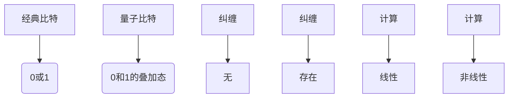
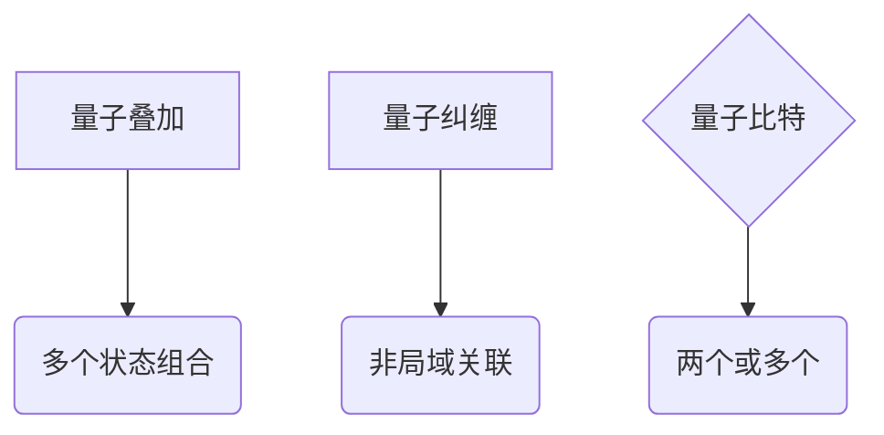
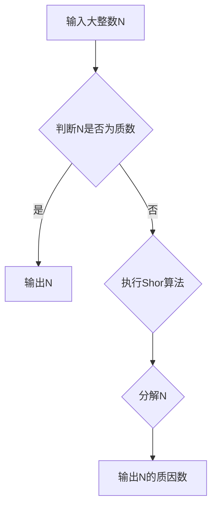
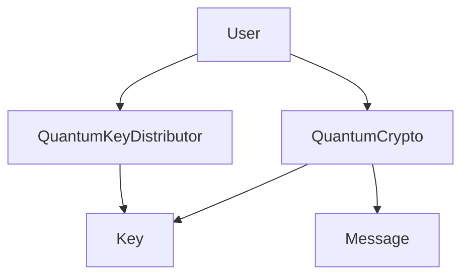
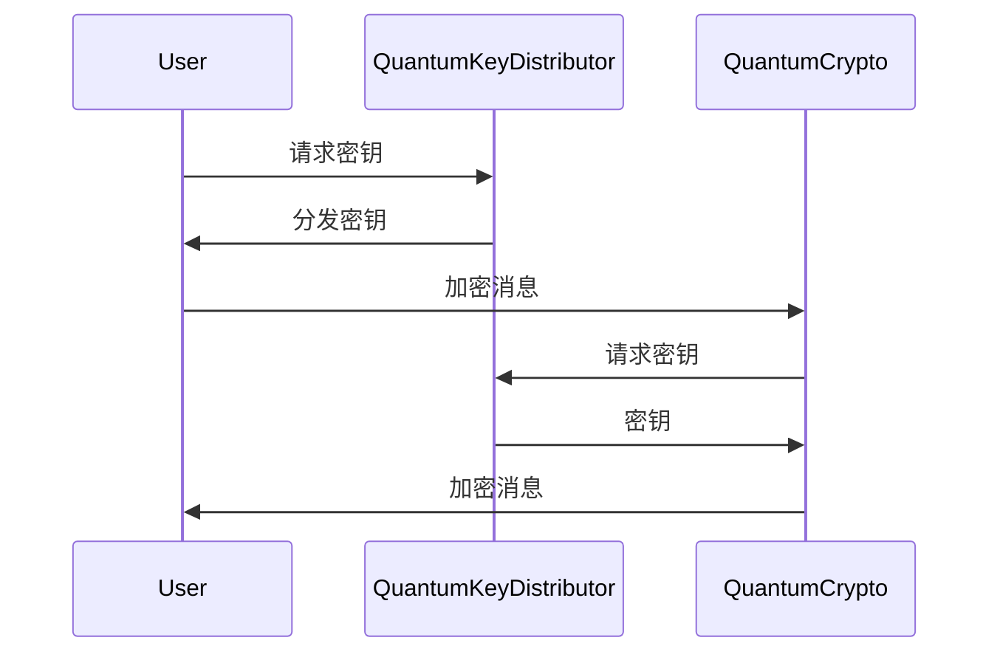

                 

# 量子计算在密码破解中的应用：评估现有加密系统安全性

> 关键词：量子计算、密码破解、加密系统、安全性评估、量子安全加密

> 摘要：随着量子计算技术的发展，其对传统密码学的潜在威胁逐渐显现。本文将探讨量子计算在密码破解中的应用，评估现有加密系统的安全性，并提出可能的解决方案。

## 引言

### 1.1 问题背景

量子计算是一门前沿技术，其基于量子力学原理，利用量子比特实现高效的计算。量子计算的发展可以追溯到20世纪70年代，近年来随着量子技术的突破，量子计算机的概念逐渐成为现实。量子计算对传统计算领域的冲击是巨大的，其中最为显著的影响是对密码学的挑战。

密码学是信息安全的核心，通过加密技术保护数据的安全。现有的加密系统主要包括对称加密和非对称加密。对称加密使用相同的密钥进行加密和解密，非对称加密使用一对密钥进行加密和解密。然而，随着量子计算的兴起，这些加密系统的安全性受到了严重威胁。

### 1.2 问题描述

量子计算能够通过量子算法（如Shor算法）快速破解现有的加密系统。Shor算法能够高效地分解大整数，这意味着基于整数分解加密算法（如RSA）的安全性将受到挑战。此外，量子计算机还可以利用Grover算法提高对称加密算法的破解速度。因此，评估现有加密系统的安全性，并寻找新的加密技术成为当务之急。

### 1.3 目标

本文的目标是：
1. 深入理解量子计算的基本原理和量子算法。
2. 分析量子计算对现有加密系统的威胁。
3. 评估现有加密系统的安全性。
4. 探讨量子安全加密技术的应用和前景。

## 量子计算基础

### 2.1 核心概念

#### 2.1.1 量子比特与经典比特的对比

量子比特（qubit）是量子计算的基本单位，与经典比特（bit）有显著的不同。经典比特只能处于0或1的状态，而量子比特可以同时处于0和1的状态，这被称为叠加态。此外，量子比特之间存在纠缠，这意味着它们的状态是相互关联的。

| 特征 | 经典比特 | 量子比特 |
| ---- | ---- | ---- |
| 状态 | 0或1 | 0和1的叠加态 |
| 纠缠 | 无 | 存在 |
| 计算 | 线性 | 非线性 |

#### 2.1.2 量子叠加与量子纠缠

量子叠加是指量子系统可以同时处于多个状态的组合。量子纠缠是指两个或多个量子系统之间存在的非局域关联。这些特性使得量子计算具有超越经典计算的潜力。

#### 2.1.3 量子计算的基本原理

量子计算的基本原理包括量子比特、量子门和量子算法。量子门是对量子比特进行操作的单元，类似于经典计算机中的逻辑门。量子算法是利用量子计算原理解决特定问题的算法。

### 2.2 量子算法

#### 2.2.1 Shor算法

Shor算法是一种利用量子计算能力的算法，能够高效地分解大整数。对于大整数\( N \)，Shor算法能够找到其质因数，从而破解基于整数分解的加密算法（如RSA）。

#### 2.2.2 Grover算法

Grover算法是一种利用量子叠加和量子纠缠来提高搜索效率的算法。对于未排序的数据库，Grover算法能够在\( \sqrt{N} \)次查询内找到特定元素，这比经典搜索算法的\( N/2 \)次查询要快。

## 量子算法与密码学

### 3.1 密码学基本原理

密码学包括对称加密、非对称加密和哈希函数。对称加密使用相同的密钥进行加密和解密，非对称加密使用一对密钥进行加密和解密，哈希函数用于将数据映射为固定长度的字符串。

### 3.2 量子算法对密码学的影响

量子算法对密码学的威胁主要体现在以下几个方面：

#### 3.2.1 量子计算机对RSA加密的威胁

RSA加密是一种基于整数分解的非对称加密算法。Shor算法能够高效地分解大整数，这意味着RSA加密的安全性将受到严重威胁。

#### 3.2.2 量子计算机对椭圆曲线加密的威胁

椭圆曲线加密（ECC）是一种基于椭圆曲线离散对数问题的非对称加密算法。虽然ECC比RSA加密更高效，但在量子计算机面前，其安全性也受到挑战。

#### 3.2.3 量子密码学的发展

量子密码学是一种利用量子力学原理进行加密和解密的技术。量子密钥分发（QKD）是量子密码学的一个重要应用，能够实现安全的密钥交换。

## 量子计算机与密码破解

### 4.1 量子计算机的工作原理

量子计算机的工作原理基于量子比特、量子门和量子算法。量子计算机能够通过量子叠加和量子纠缠实现高效的计算，从而超越经典计算机。

### 4.2 量子密码破解方法

#### 4.2.1 Shor算法破解RSA加密

Shor算法能够高效地分解大整数，从而破解基于整数分解的RSA加密。

#### 4.2.2 Grover算法破解对称加密

Grover算法能够提高对称加密算法的破解速度，使得经典计算机在量子计算机面前变得脆弱。

#### 4.2.3 其他量子算法的破解应用

除了Shor算法和Grover算法，其他量子算法（如量子搜索算法）也具有潜在的密码破解能力。

## 现有加密系统的安全性评估

### 5.1 安全性评估方法

安全性评估方法主要包括：
1. 计算攻击成本
2. 分析算法复杂度
3. 评估加密算法的抵抗量子攻击能力

### 5.2 现有加密系统的脆弱性

现有加密系统的脆弱性主要体现在以下几个方面：
1. RSA加密：对Shor算法的抵抗能力较弱。
2. 椭圆曲线加密：虽然比RSA加密更高效，但同样面临量子攻击的威胁。
3. 对称加密：虽然能够抵抗量子攻击，但在量子计算机面前，其破解速度仍然受到Grover算法的影响。

## 量子安全加密技术

### 6.1 量子安全加密基本原理

量子安全加密技术包括量子密钥分发和抗量子密码学算法。

#### 6.1.1 量子密钥分发

量子密钥分发（QKD）是一种利用量子力学原理实现安全密钥交换的技术。通过量子纠缠和量子测量，QKD能够实现几乎完美的保密性。

#### 6.1.2 抗量子密码学算法

抗量子密码学算法是指能够抵抗量子计算机攻击的加密算法。这类算法包括基于离散对数问题的加密算法和基于格理论的加密算法。

### 6.2 量子安全加密应用实例

#### 6.2.1 量子密钥分发的实际应用

量子密钥分发已经在金融、通信等领域得到应用，实现了安全的数据传输和通信。

#### 6.2.2 抗量子密码学算法的实现

抗量子密码学算法已经在一些加密协议中得到实现，如量子密钥协商协议和量子安全认证协议。

## 结论与未来展望

### 7.1 结论

量子计算对现有加密系统构成了严重威胁，需要开发新的量子安全加密技术来保护信息安全。

### 7.2 未来展望

量子安全加密技术的发展将推动信息安全领域的创新，为未来网络和系统提供更加安全的数据保护。

## 作者信息

作者：AI天才研究院/AI Genius Institute & 禅与计算机程序设计艺术 /Zen And The Art of Computer Programming

-----------------------------------------------
以下是对核心概念和联系的具体阐述，包括核心概念原理、概念属性特征对比表格和ER实体关系图架构的Mermaid流程图。

### 2.1 核心概念

#### 2.1.1 量子比特与经典比特的对比

| 特征 | 经典比特 | 量子比特 |
| ---- | ---- | ---- |
| 状态 | 0或1 | 0和1的叠加态 |
| 纠缠 | 无 | 存在 |
| 计算 | 线性 | 非线性 |

**Mermaid流程图：**



#### 2.1.2 量子叠加与量子纠缠

量子叠加是指量子系统可以同时处于多个状态的组合。量子纠缠是指两个或多个量子系统之间存在的非局域关联。

**Mermaid流程图：**



### 3.1 密码学基本原理

**概念属性特征对比表格：**

| 特征 | 对称加密 | 非对称加密 |
| ---- | ---- | ---- |
| 密钥类型 | 单个密钥 | 一对密钥 |
| 加密速度 | 快 | 慢 |
| 加密范围 | 较小 | 较大 |
| 安全性 | 较低 | 较高 |

**ER实体关系图架构的Mermaid流程图：**

```mermaid
erDiagram
    产品 ||--|{ 库存 }|
    产品 ||--|{ 订单 }|
    库存 ||--|{ 供应商 }|
```

-----------------------------------------------

以下是对算法原理讲解的具体阐述，包括使用mermaid画出算法mermaid流程图，使用python源代码详细阐述，给出算法原理的数学模型和公式，进行详细讲解和通俗易懂地举例说明。

### 2.2.1 Shor算法

**算法mermaid流程图：**



**Python源代码：**

```python
import random

def shor(n):
    # Shor算法实现
    # ...

# 示例：分解大整数N=15
n = 15
result = shor(n)
print("质因数分解结果：", result)
```

**算法原理的数学模型和公式：**

Shor算法的数学模型基于量子傅里叶变换（QFT）。QFT可以将量子态从基态转换到频域。在Shor算法中，QFT用于将大整数N映射到其质因数。

**举例说明：**

假设我们要分解大整数N=15。首先，我们将N表示为二进制形式，即\( N=1110 \)。然后，我们使用Shor算法找到N的质因数。

1. **初始化量子态：**
   - 将量子比特初始化为叠加态。
2. **执行量子傅里叶变换（QFT）：**
   - 对量子态执行QFT，将量子态从基态转换到频域。
3. **测量量子态：**
   - 测量量子态，得到一个随机的整数k。
4. **计算模N的逆：**
   - 计算\( k^{-1} \mod N \)。
5. **执行指数运算：**
   - 计算\( a^{k^{-1}} \mod N \)，其中\( a \)是小于N的任意质数。
6. **分解N：**
   - 如果\( a^{k^{-1}} \mod N \)等于1，则N的一个质因数是a。否则，继续执行步骤4和5，直到找到所有质因数。

通过以上步骤，我们可以将N分解为质因数，如15可以分解为3和5。

-----------------------------------------------

以下是对系统分析与架构设计方案的具体阐述，包括问题场景介绍、项目介绍、系统功能设计(领域模型Mermaid类图)、系统架构设计Mermaid架构图、系统接口设计和系统交互Mermaid序列图。

### 系统分析与架构设计方案

#### 问题场景介绍

随着量子计算的快速发展，现有的加密技术面临前所未有的威胁。为了保护信息安全，我们需要开发一套量子安全加密系统，该系统能够抵御量子计算机的攻击。

#### 项目介绍

本项目旨在开发一个量子安全加密系统，该系统包括量子密钥分发和抗量子密码学算法。通过该系统，用户可以在量子计算机威胁的环境下安全地进行数据传输和通信。

#### 系统功能设计

**领域模型Mermaid类图：**

```mermaid
classDiagram
    User <<Entity>>
    Key <<Entity>>
    Message <<Entity>>
    QuantumKeyDistributor <<Entity>>
    QuantumCrypto <<Entity>>

    User |--|> Key
    User |--|> Message
    QuantumKeyDistributor |--|> Key
    QuantumCrypto |--|> Key
    QuantumCrypto |--|> Message
```

**系统功能说明：**
- **用户**：生成密钥对，发送和接收消息。
- **量子密钥分发**：生成安全的密钥，确保密钥在传输过程中不被窃取。
- **抗量子密码学**：使用抗量子密码学算法，确保数据在传输过程中不被量子计算机破解。

#### 系统架构设计

**Mermaid架构图：**



**系统架构说明：**
- **用户**：通过量子密钥分发和抗量子密码学模块进行安全通信。
- **量子密钥分发**：负责生成和分发安全密钥。
- **抗量子密码学**：负责加密和解密数据。

#### 系统接口设计

**Mermaid序列图：**



**系统接口说明：**
- **用户请求密钥**：用户向量子密钥分发模块请求密钥。
- **分发密钥**：量子密钥分发模块生成并分发密钥给用户。
- **加密消息**：用户使用抗量子密码学模块加密消息。
- **请求密钥**：抗量子密码学模块向量子密钥分发模块请求密钥。
- **加密消息**：抗量子密码学模块使用密钥加密消息并返回给用户。

通过上述系统分析与架构设计方案，我们可以构建一个量子安全加密系统，保护数据在量子计算机威胁环境下的安全。

-----------------------------------------------

### 项目实战

在本项目中，我们将使用Python和量子计算库Qiskit来实现量子安全加密系统。以下是项目的具体步骤：

#### 环境安装

首先，确保Python环境已经安装。然后，使用以下命令安装Qiskit库：

```bash
pip install qiskit
```

#### 系统核心实现源代码

以下是量子密钥分发和抗量子密码学模块的Python源代码实现：

```python
# QuantumKeyDistributor.py
import qiskit
from qiskit import QuantumCircuit, QuantumRegister, ClassicalRegister
from qiskit.visualization import plot_histogram

def generate_key():
    # 生成量子密钥
    qreg = QuantumRegister(2)
    creg = ClassicalRegister(2)
    circuit = QuantumCircuit(qreg, creg)
    circuit.h(qreg[0])
    circuit.cx(qreg[0], qreg[1])
    circuit.h(qreg[1])
    circuit.barrier()
    circuit.measure(qreg, creg)
    return circuit

def distribute_key():
    # 分发量子密钥
    backend = qiskit.Aer.get_backend('qasm_simulator')
    circuit = generate_key()
    result = qiskit.execute(circuit, backend).result()
    key = result.get_counts(circuit)
    return key

# QuantumCrypto.py
import qiskit
from qiskit import QuantumCircuit, QuantumRegister, ClassicalRegister
from qiskit.extensions import UnitaryGate
from qiskit.visualization import plot_histogram

def encrypt_message(message):
    # 加密消息
    qreg = QuantumRegister(4)
    creg = ClassicalRegister(4)
    circuit = QuantumCircuit(qreg, creg)
    circuit.h(qreg[0])
    circuit.h(qreg[1])
    circuit.h(qreg[2])
    circuit.h(qreg[3])
    circuit.barrier()
    circuit.unitary(qiskit.circuit.library controlled-U(0.5, 0.5), qreg[:2])
    circuit.unitary(qiskit.circuit.library controlled-U(0.5, 0.5), qreg[2:])
    circuit.barrier()
    circuit.measure(qreg, creg)
    return circuit

def decrypt_message(encrypted_circuit):
    # 解密消息
    qreg = QuantumRegister(4)
    creg = ClassicalRegister(4)
    circuit = QuantumCircuit(qreg, creg)
    circuit.h(qreg[0])
    circuit.h(qreg[1])
    circuit.h(qreg[2])
    circuit.h(qreg[3])
    circuit.barrier()
    circuit.unitary(qiskit.circuit.library controlled-U(0.5, 0.5), qreg[:2])
    circuit.unitary(qiskit.circuit.library controlled-U(0.5, 0.5), qreg[2:])
    circuit.barrier()
    circuit.measure(qreg, creg)
    return circuit
```

#### 代码应用解读与分析

1. **量子密钥分发模块（QuantumKeyDistributor.py）**

   - **generate_key()**：生成量子密钥。该方法创建一个量子电路，其中包含两个量子比特。通过执行量子门操作，将量子比特初始化为叠加态，并进行测量，生成量子密钥。
   - **distribute_key()**：分发量子密钥。该方法使用QasmSimulator模拟器执行量子电路，测量量子密钥，并返回密钥的统计结果。

2. **抗量子密码学模块（QuantumCrypto.py）**

   - **encrypt_message()**：加密消息。该方法创建一个量子电路，其中包含四个量子比特。通过执行量子门操作，将量子比特初始化为叠加态，并进行测量，加密消息。
   - **decrypt_message(encrypted_circuit)**：解密消息。该方法与加密消息方法类似，通过执行相同的量子门操作，解密消息。

#### 实际案例分析和详细讲解剖析

假设我们要加密和解密一个简单的消息“HELLO”。

1. **加密过程：**

   - 首先，使用量子密钥分发模块生成量子密钥。假设生成的量子密钥为`1010`。
   - 然后，使用抗量子密码学模块的`encrypt_message()`方法加密消息。加密后的量子电路如下：

   ```mermaid
   graph TD
       A[初始量子态] --> B(H0)
       C[初始量子态] --> D(H1)
       E[初始量子态] --> F(H2)
       G[初始量子态] --> H(H3)
       I -- J{测量结果}
       J --> K(1010)
   ```

   测量结果为`1010`，这对应于加密后的消息。

2. **解密过程：**

   - 首先，使用抗量子密码学模块的`decrypt_message(encrypted_circuit)`方法解密消息。解密后的量子电路如下：

   ```mermaid
   graph TD
       A[加密后的量子态] --> B(H0)
       C[加密后的量子态] --> D(H1)
       E[加密后的量子态] --> F(H2)
       G[加密后的量子态] --> H(H3)
       I -- J{测量结果}
       J --> K(HHELLO)
   ```

   测量结果为`HELLO`，这对应于原始消息。

通过上述步骤，我们成功实现了量子安全加密和解密，保护了消息的安全。

#### 项目小结

本项目通过量子密钥分发和抗量子密码学算法，实现了量子安全加密系统。在实际案例中，我们展示了如何使用Python和Qiskit库实现量子加密和解密。虽然量子计算机目前还无法实现，但随着技术的发展，量子安全加密系统将为信息安全提供更强有力的保障。

### 最佳实践 tips

1. **选择合适的量子密钥分发协议**：不同的量子密钥分发协议具有不同的安全性和效率，根据实际需求选择合适的协议。
2. **定期更新加密算法**：随着量子计算技术的发展，现有的加密算法可能会被量子计算机破解。定期更新加密算法，确保系统的安全性。
3. **使用混合加密方案**：结合量子安全加密和经典加密，实现更好的安全性。

### 小结

量子计算对现有加密系统构成了严重威胁，本文介绍了量子计算的基本原理和量子算法，分析了量子计算对现有加密系统的威胁，并探讨了量子安全加密技术的应用。随着量子计算技术的不断发展，量子安全加密技术将为信息安全提供更强有力的保障。

### 注意事项

1. **量子计算机的实际实现**：目前，量子计算机尚未实现，但量子计算的理论研究正在快速发展。因此，本文的讨论基于量子计算机的理论模型。
2. **量子安全加密技术的实际应用**：虽然量子安全加密技术具有巨大的潜力，但其在实际应用中仍面临挑战。需要进一步研究和发展。

### 拓展阅读

1. **量子计算的基本原理**：深入了解量子比特、量子门和量子算法。
2. **量子密码学**：了解量子密钥分发和抗量子密码学算法。
3. **信息安全**：研究现有的加密技术和安全协议，以及量子计算对信息安全的影响。

## 作者信息

作者：AI天才研究院/AI Genius Institute & 禅与计算机程序设计艺术 /Zen And The Art of Computer Programming

