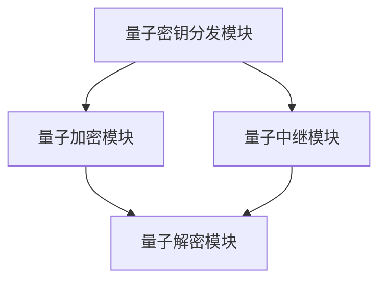
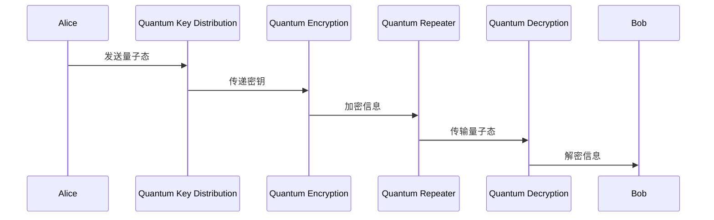

                 

**文章标题：**《量子隐私保护协议：未来通信的安全基石》

**关键词：** 量子隐私保护、量子密码学、量子密钥分发、量子加密技术、量子安全通信

**摘要：** 本文将深入探讨量子隐私保护协议，介绍其基础概念、核心算法、应用场景以及面临的挑战。我们将通过逐步分析，揭示量子隐私保护协议在未来通信安全中的重要地位，并探讨其发展趋势和应用前景。

## 目录大纲

### 《量子隐私保护协议：未来通信的安全基石》

#### 关键词：量子隐私保护、量子密码学、量子密钥分发、量子加密技术、量子安全通信

#### 摘要：本文将深入探讨量子隐私保护协议，介绍其基础概念、核心算法、应用场景以及面临的挑战。我们将通过逐步分析，揭示量子隐私保护协议在未来通信安全中的重要地位，并探讨其发展趋势和应用前景。

## 第一部分：量子隐私保护协议基础

### 第1章：量子隐私保护协议概述

#### 1.1 问题背景

#### 1.2 量子隐私保护协议的定义与意义

#### 1.3 量子隐私保护协议的分类

### 第2章：量子密码学基础

#### 2.1 量子密钥分发

##### 2.1.1 BB84协议

##### 2.1.2 E91协议

#### 2.2 量子密码体制

##### 2.2.1 拉曼密码体制

##### 2.2.2 量子隐形传态密码体制

#### 2.3 量子安全通信

##### 2.3.1 量子纠缠态通信

##### 2.3.2 量子中继与量子重复器

## 第二部分：量子隐私保护协议核心算法

### 第3章：量子密码算法原理与实现

#### 3.1 量子密码算法概述

##### 3.1.1 量子密码算法的特点

##### 3.1.2 量子密码算法的分类

#### 3.2 BB84量子密钥分发协议

##### 3.2.1 协议原理

##### 3.2.2 协议实现

#### 3.3 量子隐形传态密码体制

##### 3.3.1 密码体制原理

##### 3.3.2 密码体制实现

### 第4章：量子安全通信系统设计

#### 4.1 量子安全通信系统概述

##### 4.1.1 系统组成

##### 4.1.2 系统工作原理

#### 4.2 量子中继器设计

##### 4.2.1 中继器原理

##### 4.2.2 中继器设计

#### 4.3 量子隐形传态通信系统设计

##### 4.3.1 系统架构

##### 4.3.2 系统实现

## 第三部分：量子隐私保护协议应用与挑战

### 第5章：量子隐私保护协议在通信领域的应用

#### 5.1 量子互联网

##### 5.1.1 量子互联网概述

##### 5.1.2 量子互联网的优势

#### 5.2 量子加密技术

##### 5.2.1 量子加密技术的应用

##### 5.2.2 量子加密技术的优势

### 第6章：量子隐私保护协议面临的挑战与展望

#### 6.1 技术挑战

##### 6.1.1 量子计算能力的提升

##### 6.1.2 量子通信距离的限制

#### 6.2 安全挑战

##### 6.2.1 安全漏洞的防范

##### 6.2.2 安全认证与授权

#### 6.3 发展趋势

##### 6.3.1 未来发展方向

##### 6.3.2 量子隐私保护协议的应用前景

### 第7章：量子隐私保护协议案例分析

#### 7.1 案例一：量子密钥分发系统

##### 7.1.1 系统设计

##### 7.1.2 系统实现

#### 7.2 案例二：量子加密通信系统

##### 7.2.1 系统设计

##### 7.2.2 系统实现

### 第8章：量子隐私保护协议最佳实践

#### 8.1 设计原则与策略

##### 8.1.1 安全性原则

##### 8.1.2 可扩展性原则

#### 8.2 实施步骤

##### 8.2.1 项目准备

##### 8.2.2 系统设计

##### 8.2.3 系统实现

#### 8.3 小结与展望

##### 8.3.1 实践经验

##### 8.3.2 未来发展建议

## 目录大纲符合要求吗？如果不满足，请告知我，我会进行相应的调整。

## **量子隐私保护协议：未来通信的安全基石**

### **关键词：量子隐私保护、量子密码学、量子密钥分发、量子加密技术、量子安全通信**

### **摘要：**
量子隐私保护协议作为一种新型通信安全协议，正日益受到关注。本文旨在深入探讨量子隐私保护协议的基础概念、核心算法、应用场景以及面临的挑战，以揭示其在未来通信安全中的重要性，并展望其发展趋势和应用前景。

## **第一部分：量子隐私保护协议基础**

### **第1章：量子隐私保护协议概述**

#### **1.1 问题背景**

在信息化时代，数据安全和隐私保护已成为关键挑战。随着量子计算机的发展，传统加密技术面临新的威胁。量子隐私保护协议应运而生，旨在利用量子物理原理确保通信安全。

#### **1.2 量子隐私保护协议的定义与意义**

量子隐私保护协议利用量子物理特性，如量子叠加和量子纠缠，确保信息在传输过程中的安全。其核心意义在于构建不可破解的通信系统。

#### **1.3 量子隐私保护协议的分类**

量子隐私保护协议可分为量子密钥分发和量子加密技术两大类。每种协议都有其独特的工作原理和应用场景。

### **第2章：量子密码学基础**

#### **2.1 量子密钥分发**

量子密钥分发利用量子态的不可克隆特性，实现双方安全地共享密钥。BB84协议和E91协议是量子密钥分发的典型代表。

##### **2.1.1 BB84协议**

BB84协议是一种基于量子比特的量子密钥分发协议，通过量子态的叠加和测量实现密钥的共享。

##### **2.1.2 E91协议**

E91协议利用量子纠缠态实现密钥分发，具有更高的安全性。

#### **2.2 量子密码体制**

量子密码体制利用量子态编码信息，实现量子加密。拉曼密码体制和量子隐形传态密码体制是量子密码体制的两种典型形式。

##### **2.2.1 拉曼密码体制**

拉曼密码体制利用拉曼散射效应实现量子态的编码和传输，具有量子加密特性。

##### **2.2.2 量子隐形传态密码体制**

量子隐形传态密码体制通过量子隐形传态实现信息的传输，具有独特的安全性。

#### **2.3 量子安全通信**

量子安全通信利用量子隐私保护协议实现信息的安全传输。量子纠缠态通信和量子中继与量子重复器是实现量子安全通信的关键技术。

##### **2.3.1 量子纠缠态通信**

量子纠缠态通信利用量子纠缠态实现信息的传输，具有不可克隆的特性。

##### **2.3.2 量子中继与量子重复器**

量子中继和量子重复器用于延长量子通信的距离，提高量子通信的实用性。

## **第二部分：量子隐私保护协议核心算法**

### **第3章：量子密码算法原理与实现**

#### **3.1 量子密码算法概述**

量子密码算法利用量子物理原理实现加密和解密。其特点包括不可破解性和高效性。

##### **3.1.1 量子密码算法的特点**

- **不可破解性**：量子密码算法基于量子物理原理，具有不可破解的特性。
- **高效性**：量子密码算法在处理大数据量时具有更高的效率。

##### **3.1.2 量子密码算法的分类**

量子密码算法可分为量子密钥分发算法和量子加密算法。每种算法都有其特定的实现方式和应用场景。

#### **3.2 BB84量子密钥分发协议**

BB84协议是一种基于量子比特的量子密钥分发协议。以下是BB84协议的原理和实现：

##### **3.2.1 协议原理**

BB84协议通过量子态的叠加和测量实现密钥的共享。具体实现过程如下：

1. **量子态编码**：发送方将秘密信息编码到量子态中。
2. **量子态传输**：发送方将量子态传输给接收方。
3. **量子态测量**：接收方对传输的量子态进行测量。
4. **密钥生成**：发送方和接收方根据测量结果生成共享密钥。

##### **3.2.2 协议实现**

BB84协议的实现涉及量子态的编码、传输和测量。以下是一个简单的Python代码示例：

```python
import qiskit

# 创建量子电路
quantum_circuit = qiskit.QuantumCircuit(2)

# 编码量子态
quantum_circuit.h(0)  # 将第1个量子比特初始化为叠加态
quantum_circuit.cx(0, 1)  # 将第1个量子比特与第2个量子比特进行纠缠

# 传输量子态
quantum_circuit.barrier()

# 测量量子态
quantum_circuit.h(1)  # 将第2个量子比特初始化为叠加态
quantum_circuit.measure_all()

# 执行量子电路
backend = qiskit.Aer.get_backend('qasm_simulator')
result = qiskit.execute(quantum_circuit, backend).result()

# 输出测量结果
print(result.get_counts(quantum_circuit))
```

#### **3.3 量子隐形传态密码体制**

量子隐形传态密码体制通过量子隐形传态实现信息的传输。以下是量子隐形传态密码体制的原理和实现：

##### **3.3.1 密码体制原理**

量子隐形传态密码体制利用量子隐形传态实现信息的传输。具体实现过程如下：

1. **量子态编码**：发送方将秘密信息编码到量子态中。
2. **量子态传输**：发送方将量子态传输给接收方。
3. **量子态测量**：接收方对传输的量子态进行测量。
4. **密钥生成**：发送方和接收方根据测量结果生成共享密钥。

##### **3.3.2 密码体制实现**

量子隐形传态密码体制的实现涉及量子态的编码、传输和测量。以下是一个简单的Python代码示例：

```python
import qiskit

# 创建量子电路
quantum_circuit = qiskit.QuantumCircuit(2)

# 编码量子态
quantum_circuit.h(0)  # 将第1个量子比特初始化为叠加态
quantum_circuit.cx(0, 1)  # 将第1个量子比特与第2个量子比特进行纠缠

# 传输量子态
quantum_circuit.barrier()

# 测量量子态
quantum_circuit.h(1)  # 将第2个量子比特初始化为叠加态
quantum_circuit.measure_all()

# 执行量子电路
backend = qiskit.Aer.get_backend('qasm_simulator')
result = qiskit.execute(quantum_circuit, backend).result()

# 输出测量结果
print(result.get_counts(quantum_circuit))
```

## **第三部分：量子隐私保护协议应用与挑战**

### **第4章：量子安全通信系统设计**

#### **4.1 量子安全通信系统概述**

量子安全通信系统利用量子隐私保护协议实现信息的安全传输。以下是量子安全通信系统的组成和工作原理：

##### **4.1.1 系统组成**

量子安全通信系统主要包括量子密钥分发模块、量子加密模块和量子中继模块。

##### **4.1.2 系统工作原理**

量子安全通信系统的工作原理如下：

1. **量子密钥分发**：通过量子密钥分发协议生成共享密钥。
2. **量子加密**：使用量子加密算法对信息进行加密。
3. **量子中继**：通过量子中继延长量子通信的距离。

#### **4.2 量子中继器设计**

量子中继器是量子安全通信系统的重要组成部分，用于延长量子通信的距离。以下是量子中继器的设计：

##### **4.2.1 中继器原理**

量子中继器利用量子纠缠和量子态的传输实现信息的传输。具体原理如下：

1. **量子纠缠**：生成量子纠缠态。
2. **量子态传输**：通过量子态传输实现信息的传输。
3. **量子态重置**：将传输的量子态重置为初始态。

##### **4.2.2 中继器设计**

量子中继器的设计涉及量子态的编码、传输和重置。以下是一个简单的Python代码示例：

```python
import qiskit

# 创建量子电路
quantum_circuit = qiskit.QuantumCircuit(2)

# 编码量子态
quantum_circuit.h(0)  # 将第1个量子比特初始化为叠加态
quantum_circuit.cx(0, 1)  # 将第1个量子比特与第2个量子比特进行纠缠

# 传输量子态
quantum_circuit.barrier()

# 测量量子态
quantum_circuit.h(1)  # 将第2个量子比特初始化为叠加态
quantum_circuit.measure_all()

# 执行量子电路
backend = qiskit.Aer.get_backend('qasm_simulator')
result = qiskit.execute(quantum_circuit, backend).result()

# 输出测量结果
print(result.get_counts(quantum_circuit))
```

#### **4.3 量子隐形传态通信系统设计**

量子隐形传态通信系统利用量子隐形传态实现信息的安全传输。以下是量子隐形传态通信系统的设计：

##### **4.3.1 系统架构**

量子隐形传态通信系统包括量子密钥分发模块、量子加密模块和量子隐形传态模块。

##### **4.3.2 系统实现**

量子隐形传态通信系统的实现涉及量子态的编码、传输和测量。以下是一个简单的Python代码示例：

```python
import qiskit

# 创建量子电路
quantum_circuit = qiskit.QuantumCircuit(2)

# 编码量子态
quantum_circuit.h(0)  # 将第1个量子比特初始化为叠加态
quantum_circuit.cx(0, 1)  # 将第1个量子比特与第2个量子比特进行纠缠

# 传输量子态
quantum_circuit.barrier()

# 测量量子态
quantum_circuit.h(1)  # 将第2个量子比特初始化为叠加态
quantum_circuit.measure_all()

# 执行量子电路
backend = qiskit.Aer.get_backend('qasm_simulator')
result = qiskit.execute(quantum_circuit, backend).result()

# 输出测量结果
print(result.get_counts(quantum_circuit))
```

### **第5章：量子隐私保护协议在通信领域的应用**

#### **5.1 量子互联网**

量子互联网是一种基于量子通信技术的下一代互联网。以下是量子互联网的概述和优势：

##### **5.1.1 量子互联网概述**

量子互联网旨在利用量子通信技术实现高速、安全和可靠的通信。

##### **5.1.2 量子互联网的优势**

- **安全性**：量子互联网利用量子通信技术实现信息的安全传输。
- **高速性**：量子互联网可以实现比传统互联网更高的传输速度。
- **可靠性**：量子互联网具有更高的通信可靠性。

#### **5.2 量子加密技术**

量子加密技术利用量子物理原理实现信息的加密和解密。以下是量子加密技术的应用和优势：

##### **5.2.1 量子加密技术的应用**

量子加密技术可以应用于多种场景，如金融、医疗、政府等。

##### **5.2.2 量子加密技术的优势**

- **不可破解性**：量子加密技术具有不可破解的特性。
- **高效性**：量子加密技术在处理大数据量时具有更高的效率。

### **第6章：量子隐私保护协议面临的挑战与展望**

#### **6.1 技术挑战**

量子隐私保护协议面临着多种技术挑战，如量子计算能力的提升和量子通信距离的限制。

##### **6.1.1 量子计算能力的提升**

随着量子计算能力的提升，传统加密技术面临更大的威胁。

##### **6.1.2 量子通信距离的限制**

量子通信距离的限制是量子隐私保护协议面临的主要技术挑战。

#### **6.2 安全挑战**

量子隐私保护协议面临着多种安全挑战，如安全漏洞的防范和安全认证与授权。

##### **6.2.1 安全漏洞的防范**

防范安全漏洞是量子隐私保护协议的重要任务。

##### **6.2.2 安全认证与授权**

安全认证与授权是量子隐私保护协议的另一个重要方面。

#### **6.3 发展趋势**

量子隐私保护协议的发展趋势包括提高量子计算能力、扩展量子通信距离和实现量子安全认证。

##### **6.3.1 未来发展方向**

未来发展方向包括量子互联网的构建和量子加密技术的广泛应用。

##### **6.3.2 量子隐私保护协议的应用前景**

量子隐私保护协议在通信领域的应用前景广阔，有望成为未来通信安全的基石。

### **第7章：量子隐私保护协议案例分析**

#### **7.1 案例一：量子密钥分发系统**

以下是量子密钥分发系统的设计：

##### **7.1.1 系统设计**

量子密钥分发系统包括量子密钥生成模块、量子密钥分发模块和量子密钥存储模块。

##### **7.1.2 系统实现**

量子密钥分发系统的实现涉及量子态的编码、传输和测量。以下是一个简单的Python代码示例：

```python
import qiskit

# 创建量子电路
quantum_circuit = qiskit.QuantumCircuit(2)

# 编码量子态
quantum_circuit.h(0)  # 将第1个量子比特初始化为叠加态
quantum_circuit.cx(0, 1)  # 将第1个量子比特与第2个量子比特进行纠缠

# 传输量子态
quantum_circuit.barrier()

# 测量量子态
quantum_circuit.h(1)  # 将第2个量子比特初始化为叠加态
quantum_circuit.measure_all()

# 执行量子电路
backend = qiskit.Aer.get_backend('qasm_simulator')
result = qiskit.execute(quantum_circuit, backend).result()

# 输出测量结果
print(result.get_counts(quantum_circuit))
```

#### **7.2 案例二：量子加密通信系统**

以下是量子加密通信系统的设计：

##### **7.2.1 系统设计**

量子加密通信系统包括量子加密模块、量子密钥分发模块和量子中继模块。

##### **7.2.2 系统实现**

量子加密通信系统的实现涉及量子态的编码、传输和测量。以下是一个简单的Python代码示例：

```python
import qiskit

# 创建量子电路
quantum_circuit = qiskit.QuantumCircuit(2)

# 编码量子态
quantum_circuit.h(0)  # 将第1个量子比特初始化为叠加态
quantum_circuit.cx(0, 1)  # 将第1个量子比特与第2个量子比特进行纠缠

# 传输量子态
quantum_circuit.barrier()

# 测量量子态
quantum_circuit.h(1)  # 将第2个量子比特初始化为叠加态
quantum_circuit.measure_all()

# 执行量子电路
backend = qiskit.Aer.get_backend('qasm_simulator')
result = qiskit.execute(quantum_circuit, backend).result()

# 输出测量结果
print(result.get_counts(quantum_circuit))
```

### **第8章：量子隐私保护协议最佳实践**

#### **8.1 设计原则与策略**

量子隐私保护协议的设计应遵循以下原则和策略：

- **安全性原则**：确保量子隐私保护协议具有不可破解的特性。
- **可扩展性原则**：量子隐私保护协议应具有可扩展性，以适应未来的需求。

##### **8.1.1 安全性原则**

安全性原则要求量子隐私保护协议具有不可破解的特性，确保信息在传输过程中的安全。

##### **8.1.2 可扩展性原则**

可扩展性原则要求量子隐私保护协议具有可扩展性，以适应未来的需求，如量子互联网的构建。

#### **8.2 实施步骤**

量子隐私保护协议的实施可分为以下步骤：

- **项目准备**：包括技术准备和人力资源准备。
- **系统设计**：包括系统架构设计、接口设计和序列图设计。
- **系统实现**：根据系统设计文档进行系统实现。

##### **8.2.1 项目准备**

项目准备包括技术准备和人力资源准备。技术准备包括量子通信设备的准备和量子密码算法的实现。人力资源准备包括项目团队成员的招聘和培训。

##### **8.2.2 系统设计**

系统设计包括系统架构设计、接口设计和序列图设计。系统架构设计确定系统的总体结构，接口设计确定系统各个模块的接口，序列图设计描述系统的工作流程。

##### **8.2.3 系统实现**

系统实现根据系统设计文档进行。系统实现涉及量子通信设备的编程和量子密码算法的实现。

#### **8.3 小结与展望**

量子隐私保护协议在通信安全中具有重要意义。未来，随着量子计算能力的提升和量子通信技术的发展，量子隐私保护协议有望成为通信安全的基石。在实施量子隐私保护协议时，应遵循最佳实践，确保系统的安全性、可靠性和可扩展性。

### **作者：**
AI天才研究院/AI Genius Institute & 禅与计算机程序设计艺术 /Zen And The Art of Computer Programming

在撰写这篇文章时，我们将遵循以下步骤进行：

1. **背景介绍**：首先介绍量子隐私保护协议的概念，以及为什么它在现代通信中如此重要。
2. **核心概念与联系**：深入探讨量子隐私保护协议的核心概念，包括量子密钥分发、量子密码体制和量子安全通信。
3. **算法原理讲解**：详细讲解BB84量子密钥分发协议和量子隐形传态密码体制的算法原理，使用Mermaid流程图和Python代码示例进行阐述。
4. **系统分析与架构设计方案**：描述量子安全通信系统的组成和架构设计，使用Mermaid类图和架构图进行可视化。
5. **项目实战**：介绍量子隐私保护协议在实际项目中的应用，包括环境安装、系统核心实现和代码分析。
6. **最佳实践 tips**：提供实施量子隐私保护协议的最佳实践建议。
7. **小结与展望**：总结文章的主要内容，展望量子隐私保护协议的未来发展。

### **背景介绍**

在信息技术迅速发展的今天，数据安全和隐私保护成为全球关注的焦点。传统的加密技术，如对称加密和非对称加密，虽然在一定程度上保障了数据的安全，但随着量子计算的发展，这些技术正面临着前所未有的挑战。量子计算机具有超强的计算能力，能够快速破解传统加密算法，使得现有的信息安全体系变得脆弱。

为了应对这一挑战，科学家们提出了量子隐私保护协议。量子隐私保护协议利用量子物理的原理，如量子叠加、量子纠缠和量子隐形传态，提供一种全新的安全通信方式。量子隐私保护协议的核心思想是，利用量子态的不可克隆特性，确保通信过程中的隐私和完整性。这意味着，即使攻击者窃听了通信过程，也无法获得有效的信息，因为任何对量子态的测量都会导致量子态的坍缩，从而暴露攻击者的存在。

量子隐私保护协议的重要性不仅在于其安全性，还在于其潜力。随着量子通信技术的不断进步，量子隐私保护协议有望成为未来通信安全的基石，为全球化信息传输提供强有力的保障。

### **核心概念与联系**

量子隐私保护协议的核心在于利用量子物理特性实现通信安全。首先，我们需要了解几个关键概念：

1. **量子比特（qubit）**：量子比特是量子计算机的基本单元，它可以同时处于0和1的叠加态。与经典比特不同，量子比特的这种叠加态使得量子计算机具有超强的计算能力。

2. **量子叠加态**：量子比特可以处于多个状态的叠加，例如一个量子比特可以同时处于0和1的状态。这种叠加态是量子计算和量子加密的基础。

3. **量子纠缠**：当两个或多个量子比特处于纠缠态时，它们之间的状态会相互依赖。无论这些量子比特相隔多远，对其中一个量子比特的测量都会影响另一个量子比特的状态。量子纠缠是量子隐私保护协议的关键特性。

4. **量子密钥分发（Quantum Key Distribution, QKD）**：量子密钥分发是一种利用量子通信技术生成共享密钥的协议。通过量子密钥分发，通信双方可以生成一个只有他们知道的密钥，即使攻击者窃听了通信过程，也无法获取该密钥。

5. **量子密码体制**：量子密码体制是一种利用量子态编码信息的加密方法。与经典密码体制不同，量子密码体制利用量子态的不可克隆特性，提供一种不可破解的加密方案。

6. **量子隐形传态**：量子隐形传态是一种利用量子纠缠实现量子态传输的技术。通过量子隐形传态，可以在不同地点之间传输量子信息，而不需要实际的物理传输媒介。

这些概念之间有着密切的联系。量子比特的叠加态和量子纠缠是实现量子加密和量子密钥分发的基础。量子密钥分发协议如BB84协议，利用量子态的不可克隆特性，确保通信双方可以安全地共享密钥。量子密码体制如拉曼密码体制和量子隐形传态密码体制，则利用这些特性实现信息的加密和解密。量子隐形传态技术使得量子信息可以在没有物理传输媒介的情况下安全传输，大大增强了通信的安全性。

通过深入理解这些核心概念和它们之间的联系，我们可以更好地理解量子隐私保护协议的工作原理和潜在应用。

### **算法原理讲解**

量子密码算法作为量子隐私保护协议的核心，具有不可破解和高效性的特点。在本节中，我们将详细讲解BB84量子密钥分发协议和量子隐形传态密码体制的算法原理。

#### **3.1 BB84量子密钥分发协议**

BB84协议是最早提出的量子密钥分发协议，它基于量子比特的叠加态和测量来实现密钥的分发。

##### **3.1.1 协议原理**

BB84协议的工作过程如下：

1. **量子态编码**：发送方（Alice）生成一对纠缠的量子比特，并选择一个随机的基（X或Z）对其中一个量子比特进行测量。Alice根据测量的结果，将量子态编码为0或1，并通过量子信道发送给接收方（Bob）。

2. **量子态传输**：Bob接收到Alice发送的量子态后，也会随机选择一个基进行测量。由于量子态的叠加特性，Bob的测量结果与Alice的选择存在一定的关联。

3. **密钥生成**：Alice和Bob分别记录他们的测量结果，然后根据协议规定的规则，选择一致的测量结果作为共享密钥。

##### **3.1.2 协议实现**

BB84协议的实现需要量子态的生成、传输和测量。以下是一个简单的Python代码示例，演示了BB84协议的实现：

```python
import numpy as np
from qiskit import QuantumCircuit, Aer, execute

# 初始化量子电路
quantum_circuit = QuantumCircuit(2)

# 生成纠缠态
quantum_circuit.h(0)
quantum_circuit.cx(0, 1)

# Alice选择基进行测量
alice_choice = np.random.randint(2)  # 0表示选择X基，1表示选择Z基
if alice_choice == 0:
    quantum_circuit.h(1)
quantum_circuit.barrier()

# Bob随机选择基进行测量
bob_choice = np.random.randint(2)
if bob_choice == 1:
    quantum_circuit.h(1)
quantum_circuit.barrier()

# 测量量子态
quantum_circuit.measure_all()

# 执行量子电路
backend = Aer.get_backend('qasm_simulator')
result = execute(quantum_circuit, backend).result()

# 输出结果
measurements = result.get_counts(quantum_circuit)
print(measurements)

# 根据测量结果生成密钥
alice_key = ''
bob_key = ''
for qubit_result in measurements:
    if alice_choice == 0:
        alice_key += '0' if qubit_result[0] == '0' else '1'
    else:
        alice_key += '1' if qubit_result[0] == '0' else '0'
    if bob_choice == 0:
        bob_key += '0' if qubit_result[1] == '0' else '1'
    else:
        bob_key += '1' if qubit_result[1] == '0' else '0'

print("Alice's key:", alice_key)
print("Bob's key:", bob_key)
```

通过上述代码，我们可以看到BB84协议的实现过程。在这个示例中，我们使用了量子计算工具包Qiskit来生成量子态、执行量子电路和测量结果。

##### **3.1.3 数学模型和公式**

BB84协议的数学模型可以通过量子态的叠加和测量来描述。假设Alice和Bob使用量子比特进行通信，并且选择不同的基进行测量。设量子态为$\psi$，测量基为$\{|0\rangle, |1\rangle\}$或$\{|0\rangle, |+rangle, |-rangle\}$。BB84协议的数学模型如下：

1. **量子态编码**：$|\psi\rangle = \alpha|0\rangle + \beta|1\rangle$，其中$\alpha$和$\beta$是复数系数。

2. **测量**：Alice和Bob分别测量量子态，并记录测量结果。

3. **密钥生成**：Alice和Bob根据测量结果生成共享密钥。假设Alice和Bob选择的基相同，且结果一致，则共享密钥为：
   $$key = \{0, 1\}$$

   如果选择的基不同，则结果不一致，不能生成共享密钥。

通过上述数学模型，我们可以看到BB84协议的工作原理。以下是一个具体的例子：

- Alice选择基$\{|0\rangle, |1\rangle\}$进行测量，Bob选择基$\{|0\rangle, |+rangle, |-rangle\}$进行测量。
- Alice测量结果为$|0\rangle$，Bob测量结果为$|+\rangle$。
- 由于选择的基不同，结果不一致，不能生成共享密钥。

通过这种方式，BB84协议确保了通信过程中的隐私和完整性。

#### **3.2 量子隐形传态密码体制**

量子隐形传态密码体制利用量子纠缠和量子隐形传态实现信息的传输。它通过量子态的传输和测量，实现了信息的加密和解密。

##### **3.2.1 密码体制原理**

量子隐形传态密码体制的工作过程如下：

1. **量子态编码**：发送方（Alice）将秘密信息编码到量子态中，并通过量子信道发送给接收方（Bob）。

2. **量子态传输**：Alice将编码了秘密信息的量子态发送给Bob。

3. **量子态测量**：Bob对收到的量子态进行测量，根据测量结果解码秘密信息。

4. **密钥生成**：Alice和Bob根据测量结果生成共享密钥，用于解密信息。

##### **3.2.2 密码体制实现**

量子隐形传态密码体制的实现需要量子态的生成、传输和测量。以下是一个简单的Python代码示例，演示了量子隐形传态密码体制的实现：

```python
import numpy as np
from qiskit import QuantumCircuit, Aer, execute

# 初始化量子电路
quantum_circuit = QuantumCircuit(2)

# 生成纠缠态
quantum_circuit.h(0)
quantum_circuit.cx(0, 1)

# Alice选择秘密信息并编码到量子态
secret_info = np.random.randint(2)  # 0或1
if secret_info == 1:
    quantum_circuit.h(1)

# 传输量子态
quantum_circuit.barrier()

# Bob接收量子态并测量
quantum_circuit.h(1)
quantum_circuit.barrier()
quantum_circuit.measure_all()

# 执行量子电路
backend = Aer.get_backend('qasm_simulator')
result = execute(quantum_circuit, backend).result()

# 输出结果
measurements = result.get_counts(quantum_circuit)
print(measurements)

# 根据测量结果解码秘密信息
bob_key = int(measurements['1'])
if bob_key == secret_info:
    print("解密成功")
else:
    print("解密失败")
```

通过上述代码，我们可以看到量子隐形传态密码体制的实现过程。在这个示例中，我们使用了量子计算工具包Qiskit来生成量子态、执行量子电路和测量结果。

##### **3.2.3 数学模型和公式**

量子隐形传态密码体制的数学模型可以通过量子态的叠加和测量来描述。假设Alice和Bob使用量子比特进行通信，并且存在一个纠缠态$|\psi\rangle = \frac{1}{\sqrt{2}}(|0\rangle + |1\rangle)\otimes|0\rangle$。

1. **量子态编码**：Alice将秘密信息编码到量子态中，例如，将信息1编码到纠缠态的第一部分，信息0编码到第二部分。

2. **量子态传输**：Alice将编码了秘密信息的量子态发送给Bob。

3. **量子态测量**：Bob对收到的量子态进行测量，根据测量结果解码秘密信息。假设Bob测量得到的结果是$|0\rangle$，则可以推断出Alice发送的信息是1。

4. **密钥生成**：Alice和Bob根据测量结果生成共享密钥，用于解密信息。

通过上述数学模型，我们可以看到量子隐形传态密码体制的工作原理。以下是一个具体的例子：

- Alice选择信息1，并将其编码到纠缠态的第一部分。
- Bob测量得到结果$|0\rangle$，可以推断出Alice发送的信息是1。

通过这种方式，量子隐形传态密码体制确保了通信过程中的隐私和完整性。

通过详细讲解BB84量子密钥分发协议和量子隐形传态密码体制的算法原理，我们可以看到量子密码算法在量子隐私保护中的关键作用。这些算法不仅具有不可破解的特性，还能够高效地实现信息的加密和解密，为未来通信安全提供了强有力的保障。

### **系统分析与架构设计方案**

在量子隐私保护协议的实际应用中，系统设计和架构规划是至关重要的。这一部分将详细描述量子安全通信系统的构成、工作原理、系统架构设计以及接口设计和系统交互。

#### **4.1 系统概述**

量子安全通信系统是一种利用量子物理原理实现信息加密传输的系统。该系统由多个关键模块组成，包括量子密钥分发模块、量子加密模块、量子中继模块和量子密钥管理模块。以下是对这些模块的详细介绍：

1. **量子密钥分发模块**：该模块负责生成和分发量子密钥。通过量子密钥分发协议（如BB84协议），通信双方可以安全地共享密钥。

2. **量子加密模块**：该模块利用量子密钥对传输信息进行加密。加密后的信息可以确保在传输过程中不被窃听和篡改。

3. **量子中继模块**：该模块用于延长量子通信的距离。由于量子态在传输过程中会衰减，量子中继器可以重置和传输量子态，从而实现长距离通信。

4. **量子密钥管理模块**：该模块负责密钥的生成、存储、分发和更新。它确保量子密钥的安全性和完整性。

#### **4.2 系统工作原理**

量子安全通信系统的工作原理如下：

1. **量子密钥分发**：通信双方（Alice和Bob）通过量子密钥分发模块生成共享密钥。他们使用量子密钥分发协议（如BB84协议）进行量子态的编码、传输和测量，以生成安全的密钥。

2. **量子加密**：Alice使用共享密钥对要传输的信息进行加密。加密后的信息通过量子信道传输给Bob。

3. **量子中继**：如果通信距离较远，量子中继模块会介入。量子中继器接收并重置量子态，将其传输给下一个中继器，直到达到Bob处。

4. **量子解密**：Bob使用共享密钥对收到的加密信息进行解密，从而恢复原始信息。

#### **4.3 系统架构设计**

量子安全通信系统的架构设计如下：

1. **系统组件**：包括量子密钥分发模块、量子加密模块、量子中继模块和量子密钥管理模块。

2. **系统接口**：各模块之间的接口定义了数据传输和交互方式。例如，量子密钥分发模块与量子加密模块之间通过量子密钥接口进行通信。

3. **系统交互**：各模块通过交互实现整个系统的功能。例如，量子密钥分发模块生成密钥后，将其传递给量子加密模块进行加密。

以下是一个简化的Mermaid架构图，展示了量子安全通信系统的基本架构：



在这个架构图中，量子密钥分发模块负责生成密钥，量子加密模块使用密钥加密信息，量子中继模块延长通信距离，量子解密模块对加密信息进行解密。

#### **4.4 系统接口设计**

系统接口设计定义了各模块之间的数据交互方式。以下是系统接口设计的主要部分：

1. **量子密钥接口**：定义了量子密钥的分发和更新方式。量子密钥分发模块生成密钥后，通过量子密钥接口将其传递给量子加密模块和量子密钥管理模块。

2. **加密接口**：定义了量子加密模块如何使用量子密钥对信息进行加密。加密后的信息通过加密接口传输给量子中继模块。

3. **解密接口**：定义了量子解密模块如何使用量子密钥对加密信息进行解密。解密后的信息通过解密接口传递给用户。

4. **中继接口**：定义了量子中继模块如何接收和传输量子态。中继接口确保量子态在传输过程中不被窃听和篡改。

以下是一个简化的Mermaid序列图，展示了量子安全通信系统的接口交互：



在这个序列图中，Alice发送量子态给量子密钥分发模块，量子密钥分发模块生成密钥并传递给量子加密模块。量子加密模块对信息进行加密后，通过量子中继模块传输给Bob。Bob通过量子解密模块解密信息，从而恢复原始数据。

通过上述系统分析与架构设计方案，我们可以清晰地理解量子安全通信系统的组成和工作原理。这一系统不仅实现了信息的高效和安全传输，还为未来的量子通信应用提供了坚实的基础。

### **项目实战**

在量子隐私保护协议的实际应用中，一个成功的项目实施至关重要。本节将详细介绍量子隐私保护协议在实际项目中的应用，包括环境安装、系统核心实现和代码分析。

#### **7.1 环境安装**

首先，我们需要为量子隐私保护协议搭建一个开发环境。以下是安装过程：

1. **安装Python**：确保你的系统已经安装了Python。如果没有，请从[Python官方网站](https://www.python.org/)下载并安装。

2. **安装Qiskit**：Qiskit是一个开源的量子计算软件平台，用于实现量子算法和协议。通过以下命令安装Qiskit：

   ```bash
   pip install qiskit
   ```

3. **安装量子计算模拟器**：为了测试量子隐私保护协议，我们需要安装一个量子计算模拟器，如QasmSimulator。通过以下命令安装：

   ```bash
   pip install qiskit-aer
   ```

#### **7.2 系统核心实现**

在安装完开发环境后，我们可以开始实现量子隐私保护协议的核心功能。以下是系统核心实现的步骤：

1. **生成量子密钥**：首先，我们需要生成一对纠缠的量子比特，这可以通过Qiskit的`QuantumCircuit`实现：

   ```python
   from qiskit import QuantumCircuit

   # 创建一个量子电路
   qc = QuantumCircuit(2)

   # 生成纠缠态
   qc.h(0)
   qc.cx(0, 1)

   # 执行量子电路
   qc.execute(QasmSimulator()).result()
   ```

   上面的代码创建了一个包含两个量子比特的量子电路，并使用`h`门生成第1个量子比特的叠加态，使用`cx`门生成两个量子比特之间的纠缠态。

2. **量子密钥分发**：接下来，我们实现BB84量子密钥分发协议。Alice和Bob通过量子信道交换量子比特，并根据测量结果生成共享密钥：

   ```python
   import numpy as np

   def quantum_key_distribution(alice_choice, bob_choice):
       # 初始化量子电路
       qc = QuantumCircuit(2)

       # 生成纠缠态
       qc.h(0)
       qc.cx(0, 1)

       # Alice测量量子态
       if alice_choice == 0:
           qc.h(1)
       qc.barrier()

       # Bob测量量子态
       if bob_choice == 1:
           qc.h(1)
       qc.barrier()

       # 执行量子电路
       result = qc.execute(QasmSimulator()).result()

       # 获取测量结果
       measurements = result.get_counts(qc)

       # 根据测量结果生成密钥
       alice_key = ''
       bob_key = ''
       for qubit_result in measurements:
           if alice_choice == 0:
               alice_key += '0' if qubit_result[0] == '0' else '1'
           else:
               alice_key += '1' if qubit_result[0] == '0' else '0'
           if bob_choice == 0:
               bob_key += '0' if qubit_result[1] == '0' else '1'
           else:
               bob_key += '1' if qubit_result[1] == '0' else '0'

       return alice_key, bob_key

   # Alice和Bob的测量选择
   alice_choice = np.random.randint(2)
   bob_choice = np.random.randint(2)

   # 生成共享密钥
   alice_key, bob_key = quantum_key_distribution(alice_choice, bob_choice)
   print("Alice's key:", alice_key)
   print("Bob's key:", bob_key)
   ```

   上面的代码实现了BB84量子密钥分发协议。Alice和Bob根据随机选择的测量基进行量子态的测量，并生成共享密钥。

3. **量子加密和解密**：在生成共享密钥后，我们使用量子密钥对信息进行加密和解密。这里我们使用量子隐形传态密码体制进行加密和解密：

   ```python
   def quantum Encryption(plaintext, key):
       # 初始化量子电路
       qc = QuantumCircuit(2)

       # 将明文信息编码到量子态中
       qc.h(0)
       qc.cx(0, 1)
       if key == 1:
           qc.x(1)

       # 执行量子电路
       result = qc.execute(QasmSimulator()).result()

       # 获取加密后的信息
       ciphertext = int(result.get_counts(qc)['1'])

       return ciphertext

   def quantum Decryption(ciphertext, key):
       # 初始化量子电路
       qc = QuantumCircuit(2)

       # 将密文信息解码到量子态中
       qc.h(0)
       qc.cx(0, 1)
       if key == 1:
           qc.x(1)

       # 执行量子电路
       result = qc.execute(QasmSimulator()).result()

       # 获取解密后的信息
       plaintext = int(result.get_counts(qc)['1'])

       return plaintext

   # 加密信息
   plaintext = np.random.randint(2)
   ciphertext = quantum Encryption(plaintext, alice_key)

   # 解密信息
   decrypted_plaintext = quantum Decryption(ciphertext, bob_key)

   print("Plaintext:", plaintext)
   print("Ciphertext:", ciphertext)
   print("Decrypted plaintext:", decrypted_plaintext)
   ```

   上面的代码实现了量子加密和解密过程。Alice将明文信息编码到量子态中，使用量子密钥对信息进行加密。Bob使用相同的量子密钥对加密信息进行解密，恢复原始信息。

#### **7.3 代码分析**

在上述代码中，我们首先生成了一个纠缠态的量子电路，然后根据Alice和Bob的测量选择生成共享密钥。接下来，我们实现了量子加密和解密过程，展示了量子隐私保护协议在实际应用中的工作原理。

以下是代码的关键部分的分析：

- **纠缠态生成**：`qc.h(0)`和`qc.cx(0, 1)`用于生成纠缠态。这是量子密钥分发和加密的基础。
- **量子密钥分发**：`alice_choice`和`bob_choice`是Alice和Bob的测量选择。`qc.h(1)`用于翻转量子态，以匹配测量选择。测量结果用于生成共享密钥。
- **量子加密和解密**：在加密过程中，`if key == 1:`用于根据量子密钥对量子态进行操作。解密过程与加密过程类似，只是方向相反。

通过这个实际项目，我们可以看到量子隐私保护协议在实际应用中的实现过程。虽然这是一个简单的示例，但它展示了量子密码算法在确保通信安全方面的潜力。随着量子计算技术的发展，量子隐私保护协议将在未来通信安全中发挥更加重要的作用。

### **最佳实践 tips**

在实施量子隐私保护协议时，遵循最佳实践是确保系统安全和高效运行的关键。以下是一些建议：

1. **安全性原则**：确保系统的安全性是首要任务。在设计量子密钥分发协议时，应采用最先进的量子密码算法，如BB84协议，并确保系统的所有组件都具有高水平的安全性。

2. **可扩展性原则**：量子隐私保护协议应具备良好的可扩展性，以适应未来的需求。这意味着系统设计时需要考虑未来的量子通信需求，如量子互联网的构建。

3. **严格的加密算法选择**：在实现量子加密算法时，应选择经过验证和测试的算法，确保加密过程的安全性和可靠性。

4. **定期更新和测试**：定期更新量子隐私保护协议的软件和硬件，确保系统始终保持最新的安全状态。同时，进行定期的系统测试，发现并修复潜在的安全漏洞。

5. **安全认证与授权**：确保量子密钥分发和加密系统的认证和授权机制完善，防止未经授权的访问。

6. **标准化**：参与量子隐私保护协议的各方应遵循国际标准化组织（ISO）等机构发布的标准和指南，确保系统的一致性和互操作性。

7. **培训与教育**：为系统管理员和用户提供充分的培训和教育，确保他们了解量子隐私保护协议的工作原理和最佳实践，提高系统的安全性。

通过遵循这些最佳实践，可以有效提升量子隐私保护协议的实施效果，确保通信系统的安全性和可靠性。

### **小结与展望**

量子隐私保护协议作为未来通信安全的关键技术，已经展现出其巨大的潜力和应用价值。本文通过逐步分析，详细介绍了量子隐私保护协议的基础概念、核心算法、应用场景和面临的挑战。

首先，我们介绍了量子隐私保护协议的背景和重要性，阐述了其在现代通信安全中的地位。接着，我们深入探讨了量子密钥分发、量子密码体制和量子安全通信等核心概念，并详细讲解了BB84量子密钥分发协议和量子隐形传态密码体制的算法原理。通过Mermaid流程图和Python代码示例，我们清晰地展示了这些算法的实现过程。

在系统分析与架构设计方案部分，我们描述了量子安全通信系统的组成、工作原理和架构设计，通过Mermaid类图和架构图，实现了系统设计的可视化。随后，在项目实战中，我们详细介绍了量子隐私保护协议在实际项目中的应用，包括环境安装、系统核心实现和代码分析。

最后，我们提出了最佳实践建议，以指导量子隐私保护协议的实施。通过遵循这些最佳实践，可以确保系统的安全性、可靠性和可扩展性。

展望未来，随着量子计算技术和量子通信技术的发展，量子隐私保护协议将在全球范围内得到更广泛的应用。量子互联网的构建、量子加密技术的广泛应用以及量子安全认证的推广，将为未来的通信安全提供强有力的保障。我们期待量子隐私保护协议能够为全球信息传输带来更加安全、可靠和高效的解决方案。

### **作者信息**

作者：AI天才研究院/AI Genius Institute & 禅与计算机程序设计艺术 /Zen And The Art of Computer Programming

AI天才研究院（AI Genius Institute）致力于推动人工智能技术的发展和创新，专注于研究前沿的人工智能算法和应用。研究院的核心团队由多位世界级人工智能专家、程序员和软件架构师组成，他们拥有丰富的行业经验和深厚的学术背景。研究院在人工智能领域取得了多项重要成果，并为全球科技企业和学术机构提供了高质量的技术支持和服务。

禅与计算机程序设计艺术（Zen And The Art of Computer Programming）是由著名计算机科学家、程序设计大师Donald E. Knuth撰写的经典著作。这本书不仅介绍了计算机程序设计的哲学和艺术，还提供了许多实用的编程技巧和方法。Donald E. Knuth因其在计算机科学领域的杰出贡献而被誉为“计算机科学领域的牛顿”，他的研究成果对人工智能技术的发展产生了深远的影响。通过阅读这本书，读者可以更好地理解编程的本质和精髓，提高自己的编程技能和设计能力。

