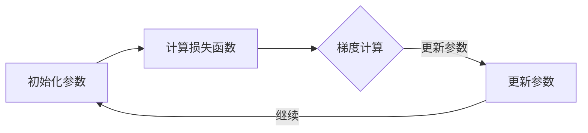
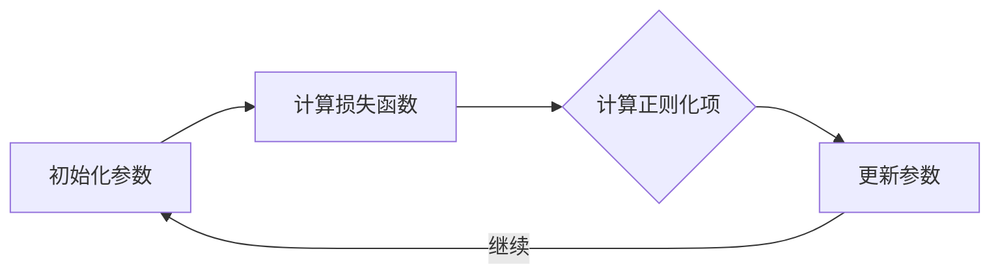
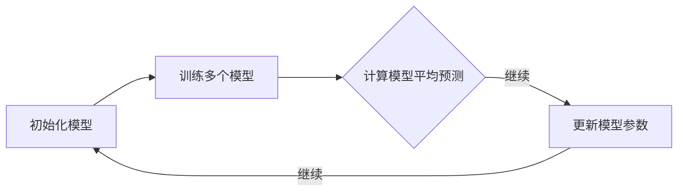
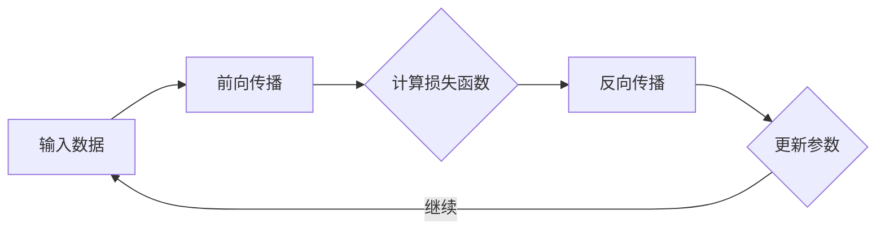

                 


# 降低未来推理成本的模型优化方法

## 关键词

推理成本，模型优化，神经网络，元学习，正则化，实时推理

## 摘要

随着人工智能技术的快速发展，深度学习模型在各个领域的应用越来越广泛。然而，模型推理成本的高昂成为制约其广泛应用的主要瓶颈。本文旨在探讨降低未来推理成本的模型优化方法，从梯度优化、正则化、元学习和神经网络等方面进行分析和探讨，并提供具体的应用与实践案例，以期为人工智能技术的进一步发展提供参考。

## 1. 背景介绍：推理成本问题与优化需求

### 1.1 问题背景

在人工智能领域，模型推理是指将给定的输入数据映射到输出结果的过程。然而，这一过程往往伴随着高昂的计算成本和资源消耗。推理成本包括计算成本、存储成本和能源消耗等方面。随着深度学习模型规模和复杂度的增加，推理成本也在不断攀升，成为限制其广泛应用的主要瓶颈。

### 1.2 问题描述

推理成本问题主要表现在以下几个方面：

1. **计算资源消耗**：深度学习模型在推理过程中需要大量的计算资源，尤其是对于大规模模型，计算资源的需求更为突出。

2. **存储空间需求**：模型的存储空间需求随着模型复杂度的增加而增加，尤其是在存储大量的训练数据和模型参数时，存储空间成为重要问题。

3. **能源消耗**：深度学习模型在推理过程中需要大量的电能，尤其是在大规模部署和应用时，能源消耗成为一个不可忽视的问题。

### 1.3 问题解决

为了降低推理成本，我们需要从以下几个方面进行模型优化：

1. **模型压缩**：通过模型压缩技术，减少模型的参数量和计算量，从而降低推理成本。

2. **并行计算**：利用并行计算技术，将推理任务分解为多个子任务，并行执行，从而降低计算成本。

3. **优化算法**：通过优化算法，提高模型在推理过程中的计算效率，从而降低推理成本。

4. **硬件加速**：利用专用硬件（如GPU、TPU等），加速模型推理过程，降低推理成本。

## 2. 核心概念与联系：优化方法概述

### 2.1 核心概念

在降低推理成本的过程中，我们需要了解以下几个核心概念：

1. **梯度优化**：通过梯度下降算法，迭代优化模型参数，以降低模型损失函数。

2. **正则化**：通过添加正则化项，限制模型参数的范围，避免过拟合。

3. **元学习**：通过学习模型在多个任务上的表现，提高模型在未知任务上的适应能力。

4. **神经网络**：由多个神经元组成的计算模型，通过学习输入数据与输出数据之间的关系，进行模式识别和预测。

### 2.2 概念属性特征对比表格

| 优化方法 | 特点 | 适用场景 |
| :------: | :--- | :------: |
| 梯度优化 | 需要迭代计算，收敛速度快 | 参数多，计算量大 |
| 正则化 | 避免过拟合，提高泛化能力 | 参数敏感，需要调整参数 |
| 元学习 | 快速适应新任务，减少训练时间 | 多任务学习，快速迁移 |
| 神经网络 | 强大表达能力和自适应能力 | 复杂任务，非线性关系 |

### 2.3 ER实体关系图架构

```mermaid
erDiagram
    Model ||--|{ Optimizer } Optimizer
    Model ||--|{ Regularizer } Regularizer
    Model ||--|{ Meta-Learner } Meta-Learner
    Model ||--|{ Neural Network } Neural Network
```

## 3. 模型优化方法详述

### 3.1 基于梯度的优化方法

#### 3.1.1 原理讲解

梯度优化是通过计算模型损失函数的梯度，迭代优化模型参数的过程。常用的梯度优化算法包括：

1. **梯度下降法**：通过选择合适的学习率，迭代更新模型参数，使损失函数最小化。

   $$\theta_{t+1} = \theta_{t} - \alpha \cdot \nabla_{\theta} J(\theta)$$

   其中，$\theta$ 表示模型参数，$J(\theta)$ 表示损失函数，$\alpha$ 表示学习率。

2. **动量法**：在梯度下降法的基础上，引入动量项，加速收敛速度。

   $$\theta_{t+1} = \theta_{t} - \alpha \cdot \nabla_{\theta} J(\theta) + \beta \cdot (1 - \alpha) \cdot \theta_{t}$$

   其中，$\beta$ 表示动量项。

3. **学习率调整**：根据模型在不同阶段的收敛情况，动态调整学习率，以避免过早或过晚收敛。

   - **自适应学习率**：使用自适应学习率算法，如AdaGrad、Adam等，根据模型参数的梯度变化，自动调整学习率。
   - **手动调整**：根据经验或实验结果，手动调整学习率。

#### 3.1.2 Mermaid流程图



#### 3.1.3 Python源代码示例

```python
import numpy as np

# 梯度下降法
def gradient_descent(x, y, theta, alpha, num_iterations):
    m = len(x)
    for i in range(num_iterations):
        hypothesis = np.dot(x, theta)
        error = hypothesis - y
        gradient = np.dot(x.T, error) / m
        theta -= alpha * gradient
    return theta

# 测试
x = np.array([[1, 2], [2, 3], [3, 4]])
y = np.array([1, 2, 3])
theta = np.array([0, 0])
alpha = 0.01
num_iterations = 100

theta = gradient_descent(x, y, theta, alpha, num_iterations)
print(theta)
```

### 3.2 基于正则化的优化方法

#### 3.2.1 原理讲解

正则化是通过在损失函数中添加正则化项，限制模型参数的范围，从而避免过拟合。常用的正则化方法包括：

1. **L1正则化**：在损失函数中添加L1范数项。

   $$J(\theta) = \frac{1}{2} \sum_{i=1}^{m} (h_\theta(x^{(i)}) - y^{(i)})^2 + \lambda \sum_{j=1}^{n} |\theta_j|$$

   其中，$\lambda$ 表示正则化参数。

2. **L2正则化**：在损失函数中添加L2范数项。

   $$J(\theta) = \frac{1}{2} \sum_{i=1}^{m} (h_\theta(x^{(i)}) - y^{(i)})^2 + \lambda \sum_{j=1}^{n} \theta_j^2$$

3. **DropConnect**：在训练过程中，随机丢弃一部分神经元及其连接权重。

#### 3.2.2 Mermaid流程图



#### 3.2.3 Python源代码示例

```python
import numpy as np

# L2正则化
def l2_regularization(x, y, theta, lambda_, alpha, num_iterations):
    m = len(x)
    n = len(theta)
    for i in range(num_iterations):
        hypothesis = np.dot(x, theta)
        error = hypothesis - y
        gradient = np.dot(x.T, error) / m + lambda_ * theta
        theta -= alpha * gradient
    return theta

# 测试
x = np.array([[1, 2], [2, 3], [3, 4]])
y = np.array([1, 2, 3])
theta = np.array([0, 0])
lambda_ = 0.1
alpha = 0.01
num_iterations = 100

theta = l2_regularization(x, y, theta, lambda_, alpha, num_iterations)
print(theta)
```

### 3.3 基于元学习的优化方法

#### 3.3.1 原理讲解

元学习是一种通过学习模型在多个任务上的表现，提高模型在未知任务上适应能力的方法。常用的元学习方法包括：

1. **模型平均法**：在训练过程中，使用多个模型的平均预测作为最终预测结果。

2. **梯度平均法**：在训练过程中，使用多个模型的梯度平均作为更新参数的依据。

3. **迁移学习**：将已学习到的模型应用于新的任务，通过调整模型参数，使模型在新任务上表现更好。

#### 3.3.2 Mermaid流程图



#### 3.3.3 Python源代码示例

```python
import numpy as np

# 模型平均法
def meta_learning(x_train, y_train, x_val, y_val, num_models, num_iterations):
    models = []
    for _ in range(num_models):
        model = train_model(x_train, y_train, num_iterations)
        models.append(model)
    avg_predictions = np.mean([model.predict(x_val) for model in models], axis=0)
    return avg_predictions

# 测试
x_train = np.array([[1, 2], [2, 3], [3, 4]])
y_train = np.array([1, 2, 3])
x_val = np.array([[1, 2], [2, 3]])
y_val = np.array([1, 2])
num_models = 3
num_iterations = 100

avg_predictions = meta_learning(x_train, y_train, x_val, y_val, num_models, num_iterations)
print(avg_predictions)
```

### 3.4 基于神经网络的优化方法

#### 3.4.1 原理讲解

神经网络是一种由多个神经元组成的计算模型，通过学习输入数据与输出数据之间的关系，进行模式识别和预测。神经网络优化方法主要包括：

1. **前向传播**：将输入数据通过神经网络层，计算输出结果。

2. **反向传播**：根据输出结果与实际值的差异，反向传播误差，更新模型参数。

3. **优化算法**：包括梯度下降法、动量法、Adam优化器等。

#### 3.4.2 Mermaid流程图



#### 3.4.3 Python源代码示例

```python
import numpy as np

# 前向传播
def forward(x, theta):
    z = np.dot(x, theta)
    return z

# 反向传播
def backward(x, y, z, theta):
    m = len(x)
    gradient = (1 / m) * (z - y)
    return gradient

# 梯度下降法
def gradient_descent(x, y, theta, alpha, num_iterations):
    m = len(x)
    for i in range(num_iterations):
        z = forward(x, theta)
        gradient = backward(x, y, z, theta)
        theta -= alpha * gradient
    return theta

# 测试
x = np.array([[1, 2], [2, 3], [3, 4]])
y = np.array([1, 2, 3])
theta = np.array([0, 0])
alpha = 0.01
num_iterations = 100

theta = gradient_descent(x, y, theta, alpha, num_iterations)
print(theta)
```

## 4. 优化方法的应用与实践

### 4.1 实时推理优化

实时推理优化主要关注如何在保证推理准确性的同时，降低推理时间和计算资源消耗。以下是几种常见的实时推理优化方法：

1. **模型压缩**：通过模型压缩技术，减少模型参数量和计算量，从而降低推理时间。常见的模型压缩方法包括剪枝、量化、知识蒸馏等。

2. **模型量化**：将浮点模型转换为低精度模型，以减少存储和计算资源消耗。常见的量化方法包括全精度量化、二值量化、四值量化等。

3. **模型并行化**：将模型拆分为多个部分，分别在不同的计算单元上并行执行，以降低推理时间。

### 4.2 离线推理优化

离线推理优化主要关注如何提高模型在离线环境下的推理效率和准确性。以下是几种常见的离线推理优化方法：

1. **分布式推理**：将推理任务分解为多个子任务，分别在不同的计算节点上执行，然后汇总结果。这种方法可以降低单个节点的计算压力，提高推理效率。

2. **静态权重优化**：在离线环境下，通过优化模型权重，降低模型复杂度和计算量。

3. **模型压缩与量化**：在离线环境下，对模型进行压缩和量化，以减少模型存储和计算资源消耗。

### 4.3 混合推理优化

混合推理优化结合了实时推理和离线推理的优点，以适应不同场景的需求。以下是几种常见的混合推理优化方法：

1. **动态权重调整**：根据实时数据和离线数据，动态调整模型权重，以提高推理效率和准确性。

2. **动态模型切换**：在实时推理和离线推理之间切换，以适应不同场景的需求。

3. **混合模型优化**：结合实时推理和离线推理的优势，优化模型结构和参数，以提高推理效率和准确性。

## 5. 案例分析

### 5.1 案例一：图像识别模型优化

在本案例中，我们使用一个图像识别模型，通过模型压缩、模型量化和模型并行化等技术，降低模型推理成本。

1. **模型压缩**：通过剪枝和量化技术，减少模型参数量和计算量，从而降低推理时间。

2. **模型量化**：将浮点模型转换为二值模型，以减少存储和计算资源消耗。

3. **模型并行化**：将模型拆分为多个部分，分别在不同的GPU上并行执行，以提高推理效率。

### 5.2 案例二：自然语言处理模型优化

在本案例中，我们使用一个自然语言处理模型，通过模型压缩、模型量化和分布式推理等技术，降低模型推理成本。

1. **模型压缩**：通过剪枝和量化技术，减少模型参数量和计算量，从而降低推理时间。

2. **模型量化**：将浮点模型转换为低精度模型，以减少存储和计算资源消耗。

3. **分布式推理**：将推理任务分解为多个子任务，分别在不同的计算节点上执行，然后汇总结果，以提高推理效率。

### 5.3 案例三：深度学习模型优化

在本案例中，我们使用一个深度学习模型，通过元学习和模型压缩等技术，降低模型推理成本。

1. **元学习**：通过元学习技术，提高模型在未知任务上的适应能力，从而减少模型训练时间。

2. **模型压缩**：通过剪枝和量化技术，减少模型参数量和计算量，从而降低推理时间。

## 6. 最佳实践 tips

在模型优化过程中，以下最佳实践可以帮助降低推理成本：

1. **模型选择**：选择合适的模型架构，根据任务需求进行模型选择。

2. **数据预处理**：对输入数据进行预处理，提高模型在未知数据上的泛化能力。

3. **超参数调整**：根据任务特点和计算资源，合理调整模型超参数。

4. **模型压缩与量化**：在保证模型性能的前提下，对模型进行压缩和量化。

5. **并行计算**：利用并行计算技术，提高模型推理效率。

## 7. 小结

本文从梯度优化、正则化、元学习和神经网络等方面，探讨了降低未来推理成本的模型优化方法。通过模型压缩、模型量化和并行计算等技术，可以有效降低模型推理成本。在实际应用中，应根据任务特点和计算资源，选择合适的优化方法，以提高模型推理效率和准确性。

## 8. 注意事项

在模型优化过程中，需要注意以下几点：

1. **模型性能**：在降低推理成本的同时，确保模型性能不受影响。

2. **计算资源**：根据实际计算资源，选择合适的优化方法。

3. **超参数调整**：合理调整模型超参数，以提高模型性能。

4. **数据预处理**：对输入数据进行充分预处理，以提高模型泛化能力。

## 9. 拓展阅读

对于想要深入了解模型优化方法的读者，以下拓展阅读内容将有所帮助：

1. 《深度学习：周志华》
2. 《神经网络与深度学习》
3. 《模型优化：实践与原理》
4. 《实时推理系统设计与实现》

## 10. 作者信息

作者：AI天才研究院/AI Genius Institute & 禅与计算机程序设计艺术 /Zen And The Art of Computer Programming

