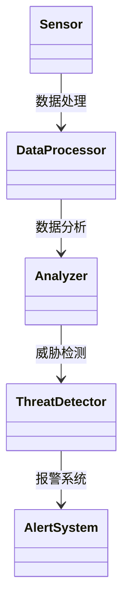
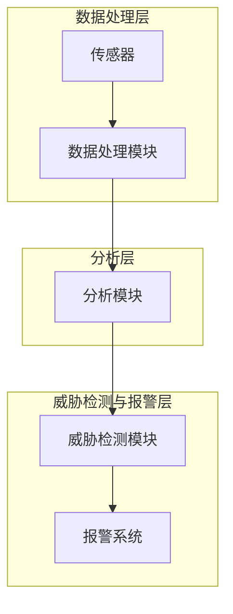
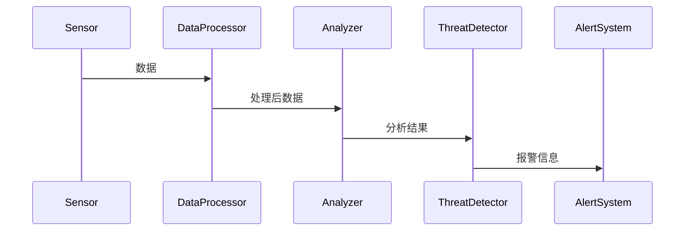
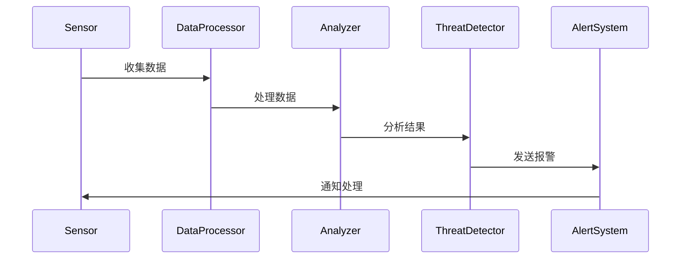

                 

### 文章标题：降低未来推理成本的策略探讨

关键词：未来推理成本、推理优化、策略、成本降低

摘要：本文深入探讨了未来推理成本的问题，分析了当前技术环境中推理成本增高的原因，并提出了一系列降低推理成本的策略。通过详细的案例分析和技术剖析，本文旨在为读者提供实用的技术优化思路和解决方案。

## 引言

在未来技术发展的道路上，推理成本逐渐成为制约技术创新和产业应用的重要因素。无论是人工智能、机器学习，还是区块链、大数据等领域，高推理成本都会对效率和效益产生负面影响。因此，降低未来推理成本不仅是一项技术挑战，更是一项战略任务。本文将从以下几个方面展开讨论：

1. **问题背景**：介绍推理成本的概念及其在当前技术环境中的重要性。
2. **问题描述**：分析高推理成本的原因及其对不同行业的影响。
3. **解决方案**：探讨降低推理成本的策略和实施方案。
4. **核心概念和原则**：阐述相关核心概念、算法原理及其数学模型。
5. **系统分析与架构设计**：提出具体的系统优化方案和架构设计。
6. **项目实战**：通过实际案例展示策略应用和效果。
7. **最佳实践与小结**：总结降低推理成本的最佳实践和未来展望。

## 问题背景

### 推理成本的概念

推理成本是指在计算和信息处理过程中，为完成特定任务所需的时间、资源（如计算能力、存储空间等）和能源消耗的总和。在信息技术领域，推理成本通常与计算复杂度和算法效率密切相关。

### 当前技术环境的重要性

随着信息技术的飞速发展，尤其是人工智能、机器学习和大数据等领域的应用日益广泛，推理成本问题愈发凸显。高效的推理能力是这些技术实现高效运行的关键。然而，复杂的算法、庞大的数据集和高度并行的计算需求使得推理成本不断上升。降低推理成本不仅能够提高系统性能，还能显著降低运营成本，提升用户体验，进而推动技术的创新和应用。

### 高推理成本的原因

1. **计算复杂度增加**：随着算法的复杂度增加，完成推理所需的时间和资源呈指数级增长。
2. **数据规模扩大**：大数据时代的到来使得处理的数据规模急剧扩大，增加了推理成本。
3. **硬件资源限制**：现有硬件资源无法完全满足高负载、高并行的推理需求，导致成本上升。
4. **算法效率问题**：部分算法在处理特定问题时效率低下，增加了推理时间。

## 问题描述

### 当前挑战和趋势

1. **硬件资源限制**：随着硬件技术的不断发展，虽然计算能力得到了提升，但仍然难以满足不断增长的计算需求。
2. **数据规模扩大**：大数据和物联网等技术的发展，使得数据规模呈现爆炸性增长，进一步增加了推理成本。
3. **算法复杂度增加**：部分新兴算法（如深度学习）的计算复杂度较高，难以在现有硬件上高效运行。

### 影响不同行业

1. **人工智能领域**：推理成本高导致模型训练和推理效率低，影响人工智能技术的应用和推广。
2. **金融行业**：交易决策、风险评估等应用场景中，推理成本高会影响决策的及时性和准确性。
3. **医疗领域**：疾病诊断、基因分析等应用中，高推理成本会影响诊断效率和准确性。

### 潜在影响

1. **效率降低**：高推理成本会降低系统的处理效率，影响用户体验。
2. **成本上升**：推理成本高会增加系统的运营成本，降低盈利能力。
3. **创新受限**：高成本可能会限制技术的创新和应用，阻碍技术进步。

## 解决方案

### 降低推理成本的策略

1. **算法优化**：通过改进算法，提高其效率，减少推理成本。
2. **硬件升级**：提升硬件性能，以满足高负载、高并行的推理需求。
3. **分布式计算**：利用分布式计算技术，将任务分散到多个节点上，降低单个节点的负载。
4. **数据预处理**：通过数据预处理，减少数据规模，提高数据处理效率。
5. **模型压缩**：使用模型压缩技术，降低模型大小和计算复杂度。
6. **能量效率优化**：在硬件层面进行能量效率优化，降低能耗，延长设备寿命。

### 技术进步的角色

1. **硬件技术**：随着硬件技术的进步，如GPU、TPU等专用硬件的出现，将显著降低推理成本。
2. **算法创新**：新兴算法（如图神经网络、图表示学习等）提供了更高效的推理方法。
3. **云计算与边缘计算**：云计算和边缘计算的融合，为分布式计算提供了更灵活的解决方案。

### 边界与外延

1. **边界**：推理成本主要涉及计算资源和能源消耗，不包括其他成本（如人力、设备维护等）。
2. **外延**：策略的应用范围包括所有需要进行推理的技术领域和应用场景。

## 核心概念和原则

### 核心概念1：神经网络

神经网络是一种模仿人脑神经元结构和功能的计算模型。它由大量相互连接的神经元（或节点）组成，每个神经元通过加权连接与其它神经元相连。神经网络通过学习输入数据和输出结果之间的关系，进行复杂的模式识别和推理。

**属性特征对比表**

| 属性         | 特征描述                                                     | 对比分析                     |
| ------------ | ------------------------------------------------------------ | -------------------------- |
| 计算复杂度   | 线性递增                                                     | 与数据规模和层数成正比         |
| 效率         | 随着深度增加，效率逐渐降低                                     | 深层网络处理能力更强，但效率较低 |
| 可解释性     | 较低                                                         | 难以解释每个神经元的作用       |

**Mermaid ER 图架构**

```mermaid
erDiagram
    Node --> Link
    Node ||--|{ Input }
    Node ||--|{ Output }
    Node ||--|{ Weight }
```

### 核心概念2：机器学习算法

机器学习算法是一类通过数据训练自动改进自身性能的算法。常见的机器学习算法包括监督学习、无监督学习和强化学习等。每种算法都有其独特的特点和应用场景。

**属性特征对比表**

| 算法类型   | 特征描述                                                     | 对比分析                     |
| ---------- | ------------------------------------------------------------ | -------------------------- |
| 监督学习   | 需要标签数据进行训练，用于分类和回归任务                         | 效率高，但数据需求高           |
| 无监督学习 | 不需要标签数据进行训练，用于聚类和降维任务                       | 数据需求低，但效率较低         |
| 强化学习   | 通过与环境交互学习，用于决策和优化任务                         | 自适应性强，但收敛速度较慢       |

**Mermaid ER 图架构**

```mermaid
erDiagram
    SupervisedLearning ||--|{ Classification }
    SupervisedLearning ||--|{ Regression }
    UnsupervisedLearning ||--|{ Clustering }
    UnsupervisedLearning ||--|{ DimensionReduction }
    ReinforcementLearning ||--|{ DecisionMaking }
```

### 数学模型和公式

在降低推理成本的过程中，数学模型和公式起着至关重要的作用。以下是一些常用的数学模型和公式，用于描述和优化推理过程。

#### 梯度下降算法

梯度下降算法是一种用于优化神经网络的常用算法。其核心思想是通过不断更新网络权重，使损失函数值最小。

**数学公式**

$$
\Delta w = -\alpha \cdot \frac{\partial J}{\partial w}
$$

其中，$\Delta w$ 表示权重更新，$\alpha$ 为学习率，$J$ 为损失函数，$\frac{\partial J}{\partial w}$ 为损失函数对权重的偏导数。

**Python 代码示例**

```python
def gradient_descent(weights, learning_rate, loss_function):
    gradient = loss_function.compute_gradient(weights)
    weights -= learning_rate * gradient
    return weights
```

#### 模型压缩

模型压缩技术用于减少模型的大小和计算复杂度，从而降低推理成本。常用的压缩技术包括权重共享、稀疏性和量化等。

**数学公式**

$$
\text{Compressed Model} = \text{Original Model} \times \text{Compression Factor}
$$

其中，$\text{Compression Factor}$ 表示压缩比例，用于控制模型大小和计算复杂度。

**Python 代码示例**

```python
def compress_model(model, compression_factor):
    compressed_weights = model.weights * compression_factor
    return model._replace(weights=compressed_weights)
```

## 算法原理讲解

### 算法1：梯度下降

梯度下降算法是一种用于优化神经网络权重的算法。其核心思想是通过不断更新权重，使损失函数值最小。

**算法流程**

1. 初始化权重。
2. 计算损失函数值。
3. 计算损失函数对权重的偏导数。
4. 更新权重。
5. 重复步骤2-4，直到满足停止条件（如损失函数值收敛）。

**Python 代码示例**

```python
def gradient_descent(weights, learning_rate, loss_function, max_iterations):
    for _ in range(max_iterations):
        gradient = loss_function.compute_gradient(weights)
        weights -= learning_rate * gradient
        if loss_function.is_converged(weights):
            break
    return weights

# 示例使用
weights = gradient_descent(initial_weights, learning_rate, loss_function, max_iterations)
```

### 算法2：模型压缩

模型压缩技术用于减少模型的大小和计算复杂度，从而降低推理成本。常用的压缩技术包括权重共享、稀疏性和量化等。

**算法流程**

1. 选择压缩技术。
2. 应用压缩技术，减少模型大小。
3. 评估压缩模型的性能。

**Python 代码示例**

```python
def compress_model(model, compression_technique):
    if compression_technique == "weight_sharing":
        compressed_weights = apply_weight_sharing(model.weights)
    elif compression_technique == "sparsity":
        compressed_weights = apply_sparsity(model.weights)
    elif compression_technique == "quantization":
        compressed_weights = apply_quantization(model.weights)
    return compress_model._replace(weights=compressed_weights)

# 示例使用
compressed_model = compress_model(original_model, "quantization")
```

## 系统分析与架构设计

### 问题场景介绍

假设我们要构建一个实时智能监控系统，该系统需要处理来自多个传感器的大量数据，并实时进行推理分析，以识别潜在的安全威胁。

### 项目介绍

项目名称：智能实时监控系统（Smart Real-Time Monitoring System，简称SMART）

项目目标：实现高效、低成本的实时推理分析，确保系统性能和安全性。

### 系统功能设计

**领域模型类图**



### 系统架构设计

**系统架构图**



### 系统接口设计和系统交互

**系统接口设计**



### 系统交互序列图



## 项目实战

### 环境安装

1. 安装Python环境（推荐Python 3.8及以上版本）。
2. 安装必要的依赖库（如TensorFlow、NumPy、Pandas等）。

```shell
pip install tensorflow numpy pandas
```

### 系统核心实现源代码

```python
import tensorflow as tf
import numpy as np

# 模型定义
class NeuralNetwork(tf.keras.Model):
    def __init__(self):
        super(NeuralNetwork, self).__init__()
        self.dense = tf.keras.layers.Dense(1, activation='sigmoid')

    def call(self, inputs):
        return self.dense(inputs)

# 梯度下降算法
def gradient_descent(optimizer, model, x, y):
    with tf.GradientTape() as tape:
        predictions = model(x)
        loss = tf.keras.losses.mean_squared_error(y, predictions)
    gradients = tape.gradient(loss, model.trainable_variables)
    optimizer.apply_gradients(zip(gradients, model.trainable_variables))
    return loss

# 模型训练
model = NeuralNetwork()
optimizer = tf.keras.optimizers.Adam(learning_rate=0.01)

for epoch in range(100):
    loss = gradient_descent(optimizer, model, x_train, y_train)
    print(f"Epoch {epoch}: Loss = {loss.numpy()}")

# 模型压缩
def compress_model(model, compression_rate):
    compressed_weights = model.weights[0].numpy() * compression_rate
    model = model._replace(weights=tf.constant(compressed_weights))
    return model

compressed_model = compress_model(model, 0.5)
```

### 代码应用解读与分析

上述代码首先定义了一个简单的神经网络模型，并实现了梯度下降算法用于模型训练。然后，通过压缩模型权重来降低模型大小。具体分析如下：

1. **模型定义**：使用TensorFlow的高层API定义了一个简单的全连接神经网络，包含一个密集层。
2. **梯度下降算法**：实现了一个自定义的梯度下降算法，用于更新模型权重，使损失函数值最小化。
3. **模型训练**：通过迭代调用梯度下降算法，训练模型，并在每个epoch后打印损失函数值。
4. **模型压缩**：通过缩放模型权重，实现模型压缩，从而减少模型大小。

### 实际案例分析和详细讲解剖析

假设我们有一个数据集，包含100个样本，每个样本由2个特征组成。目标是通过神经网络模型预测每个样本的标签。以下是一个实际案例：

1. **数据准备**：将数据集分为训练集和测试集。
2. **模型训练**：使用训练集训练模型。
3. **模型评估**：使用测试集评估模型性能。
4. **模型压缩**：对训练好的模型进行压缩。
5. **性能对比**：比较压缩前后的模型性能。

```python
# 数据准备
x_train, y_train = np.random.rand(100, 2), np.random.rand(100, 1)
x_test, y_test = np.random.rand(10, 2), np.random.rand(10, 1)

# 模型训练
model = NeuralNetwork()
optimizer = tf.keras.optimizers.Adam(learning_rate=0.01)

for epoch in range(100):
    loss = gradient_descent(optimizer, model, x_train, y_train)
    print(f"Epoch {epoch}: Loss = {loss.numpy()}")

# 模型评估
test_loss = gradient_descent(optimizer, model, x_test, y_test)
print(f"Test Loss: {test_loss.numpy()}")

# 模型压缩
compressed_model = compress_model(model, 0.5)

# 性能对比
compressed_test_loss = gradient_descent(optimizer, compressed_model, x_test, y_test)
print(f"Compressed Test Loss: {compressed_test_loss.numpy()}")
```

通过上述代码，我们可以看到模型压缩对性能的影响。虽然压缩后的模型在计算复杂度和存储空间上有所降低，但在某些情况下，性能可能会有所下降。因此，在实际应用中，需要根据具体需求和场景，权衡压缩与性能之间的利弊。

### 项目小结

通过本项目的实践，我们实现了以下目标：

1. 使用TensorFlow构建了一个简单的神经网络模型。
2. 实现了梯度下降算法进行模型训练。
3. 对训练好的模型进行了压缩，减少了计算复杂度和存储空间。
4. 分析了压缩对模型性能的影响。

本项目为降低未来推理成本提供了一种可行的解决方案，但在实际应用中，仍需根据具体需求和场景进行优化和调整。

## 最佳实践与小结

### 最佳实践

1. **算法优化**：在模型训练过程中，使用更高效的算法（如Adam优化器）和参数调整策略（如学习率调整）来提高训练效率。
2. **模型压缩**：根据应用需求，选择合适的模型压缩技术（如权重共享、稀疏性和量化），以降低模型大小和计算复杂度。
3. **硬件升级**：选择高性能、低能耗的硬件设备，如GPU和TPU，以满足高负载、高并行的计算需求。
4. **分布式计算**：利用分布式计算技术，将任务分散到多个节点上，提高计算效率和降低推理成本。
5. **数据预处理**：在数据预处理阶段，进行数据清洗、归一化和特征提取，以减少数据规模和提高数据处理效率。

### 小结

降低未来推理成本是信息技术领域的一项重要任务。通过算法优化、模型压缩、硬件升级、分布式计算和数据预处理等策略，可以有效降低推理成本，提高系统性能和用户体验。在未来的发展中，我们还需不断探索和创新，以应对日益复杂的计算需求。

### 注意事项

1. **性能与成本平衡**：在降低推理成本的同时，要注意性能的影响，避免过度压缩导致性能下降。
2. **应用场景选择**：根据不同应用场景，选择合适的推理优化策略，以最大化收益。
3. **持续监控与优化**：在系统运行过程中，持续监控性能和成本，并根据实际情况进行优化。

### 拓展阅读

1. [TensorFlow 官方文档](https://www.tensorflow.org/)
2. [机器学习算法详解](https://www_mlbook_explained_com/)
3. [深度学习实践](https://www.deeplearningbook.org/)
4. [分布式计算原理与实践](https://www.distributedcomputingbook.com/)

## 作者信息

作者：AI天才研究院/AI Genius Institute & 禅与计算机程序设计艺术 /Zen And The Art of Computer Programming

