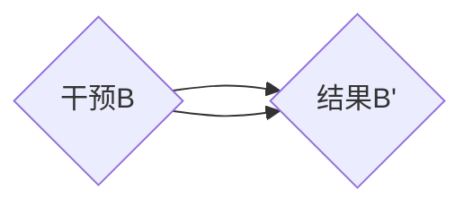
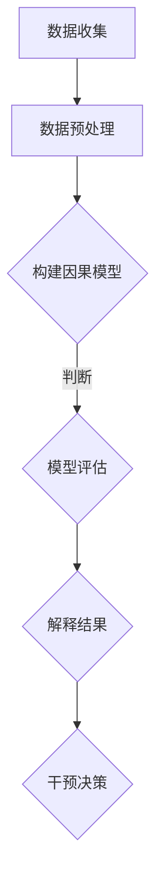
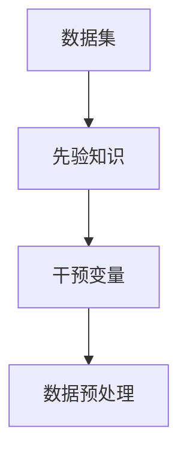
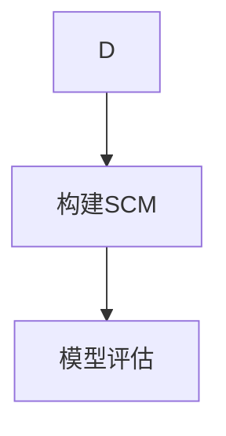
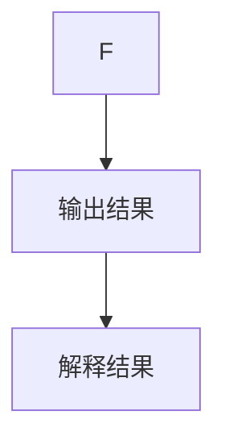
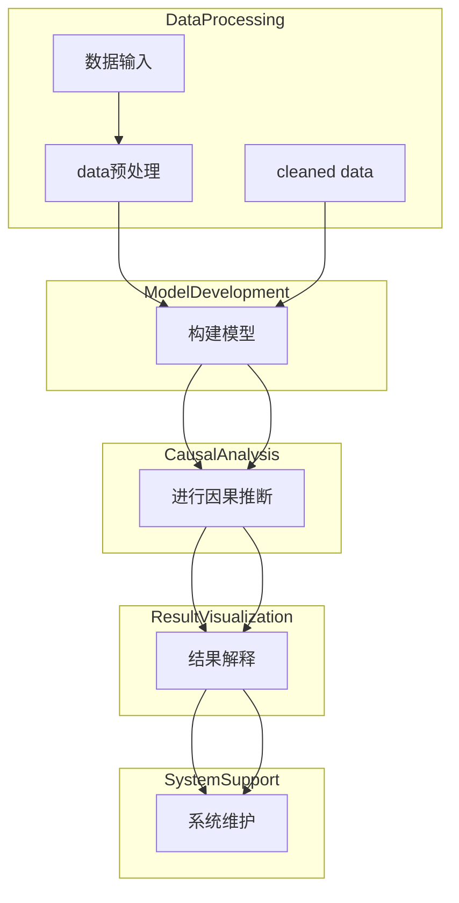
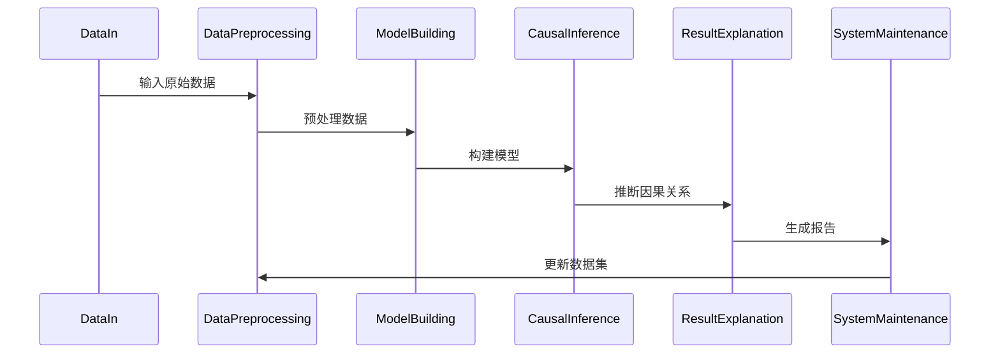

                 

### 《AI中的因果推理：超越相关性分析》

#### 关键词：
- 因果推理
- 相关性分析
- AI应用
- 机器学习
- 数学模型

#### 摘要：
在人工智能（AI）迅猛发展的今天，因果推理成为了数据处理和决策制定中的重要工具。本文将深入探讨因果推理在AI领域的重要性，通过对比相关性分析和因果推理的差异，逐步讲解因果推理的核心概念、算法原理及其应用。我们将结合数学模型和实际项目，展示因果推理在解决复杂问题中的独特优势，并总结最佳实践和未来发展趋势。通过本文的阅读，读者将理解因果推理的本质，掌握其基本方法和应用技巧，从而在AI领域中取得更加深入的成果。

### 目录大纲设计

为了系统地介绍因果推理在AI领域的应用，本文的目录大纲将分为以下几个主要部分：

1. **背景介绍**：介绍因果推理的概念、历史发展、重要性及其在AI领域的应用。
2. **核心概念与联系**：详细讨论因果推理的核心概念、属性及其相互关系。
3. **算法原理讲解**：使用Mermaid流程图和Python代码，深入讲解因果推理的基本算法。
4. **数学模型与公式**：介绍因果推理的数学模型，并使用LaTeX格式展示关键公式。
5. **系统分析与架构设计**：描述一个典型的因果推理系统，展示其设计架构。
6. **项目实战**：通过实际案例，演示因果推理的应用。
7. **最佳实践、小结与拓展阅读**：总结关键点，提供实践建议，并推荐进一步阅读资源。

通过上述目录大纲，读者可以系统地了解因果推理在AI领域的应用，从理论到实践，深入探索因果推理的重要性及其实现方法。

### 核心概念与目标

《AI中的因果推理：超越相关性分析》的目录大纲旨在为读者提供一个清晰、系统的学习路径。以下是各部分的核心概念和目标：

#### 第一部分：因果推理概述
- **第1章：因果推理的概念与背景**
  - **核心概念**：因果关系、因果推理、历史发展
  - **目标**：介绍因果推理的基本概念和重要性，阐述其在AI领域的应用前景。

- **第2章：因果推理的核心概念与联系**
  - **核心概念**：因果关系的本质、因果推理方法、挑战与解决方案
  - **目标**：详细讨论因果推理的核心概念和相互关系，分析面临的挑战及其解决方法。

#### 第二部分：算法原理讲解
- **第3章：算法原理讲解**
  - **核心概念**：因果推断算法的基本框架、数学模型与公式
  - **目标**：使用Mermaid流程图和Python代码，深入讲解因果推断算法的原理。

- **第4章：数学模型与公式**
  - **核心概念**：因果推理的数学基础、关键公式
  - **目标**：介绍因果推理的数学模型，使用LaTeX格式展示关键公式。

#### 第三部分：系统分析与架构设计
- **第5章：系统分析与架构设计**
  - **核心概念**：因果推理系统的介绍、系统功能设计、系统架构设计
  - **目标**：描述一个典型的因果推理系统，展示其设计架构。

- **第6章：项目实战**
  - **核心概念**：实践环境搭建、系统核心实现、实际案例分析
  - **目标**：通过实际案例，演示因果推理的应用，提供实践经验。

#### 第四部分：最佳实践与拓展
- **第7章：最佳实践与小结**
  - **核心概念**：因果推理的最佳实践、小结
  - **目标**：总结因果推理的关键实践技巧和注意事项。

- **第8章：拓展阅读与资源推荐**
  - **核心概念**：拓展阅读、资源推荐
  - **目标**：推荐进一步阅读资源，为读者提供深入学习的途径。

通过以上大纲设计，本文将带领读者逐步深入理解因果推理的核心概念、算法原理及其在AI领域的应用。期望通过本文的学习，读者能够掌握因果推理的基本方法，并在实际项目中应用这一重要的AI技术。

### 背景介绍

因果推理作为人工智能（AI）领域的一个重要研究方向，其重要性日益凸显。在过去的几十年中，随着计算机科学和机器学习的飞速发展，我们积累了大量关于数据、模式和关联的知识，然而，这些知识往往只是表象，难以揭示数据背后的本质联系。相关性分析是传统数据处理中广泛使用的一种方法，通过分析变量间的相关性，我们能够找到数据之间的关联模式。然而，相关性并不等同于因果关系，相关性分析存在许多局限性，无法准确反映变量间的因果结构。

因果关系的定义相对复杂，但简单来说，因果关系指的是一个事件（原因）如何影响另一个事件（结果）。在科学研究和实际应用中，理解因果关系至关重要。例如，在医学研究中，了解某种药物是否有效，不仅仅需要知道它与其他因素的相关性，更需要确定它是否直接导致了治疗效果。传统的相关性分析往往不足以满足这一需求，因为相关性可能受到多种外部因素的影响，而因果关系则要求在控制这些外部因素的前提下，明确变量间的直接关联。

在AI领域，因果推理的应用场景非常广泛。例如，在推荐系统中，通过因果推理可以更准确地理解用户行为背后的动机，从而提供更加个性化的推荐。在金融领域，因果推理有助于分析市场变化的原因，预测未来趋势，为投资决策提供有力支持。此外，在自动驾驶、智能制造、医疗诊断等多个领域，因果推理都发挥着重要作用，它能够帮助AI系统更可靠地理解和预测复杂环境中的行为。

因果推理的历史发展可以追溯到古希腊哲学家亚里士多德，他首次提出了因果关系的基本概念。然而，直到20世纪中期，随着统计学和计算机科学的兴起，因果推理才开始在现代意义上得到系统研究。1930年代，R.A. Fisher在统计学中引入了因果推断的概念，奠定了因果推理的基础。随着人工智能和机器学习技术的不断进步，因果推理在理论和方法上得到了进一步发展。

在AI领域中，因果推理的重要性主要体现在以下几个方面：

1. **决策的准确性**：通过因果推理，我们可以更加准确地识别和解释变量间的因果结构，从而提高AI系统的决策质量。与仅仅依赖相关性分析的系统相比，因果推理能够更好地应对复杂和非线性的环境。

2. **解释性**：因果推理能够提供更强的解释性，使得AI系统更加透明和可理解。这对于需要人类信任和参与的领域尤为重要，例如医疗诊断和金融分析。

3. **鲁棒性**：因果推理能够帮助AI系统在面临不确定性时，仍然能够保持较高的可靠性和鲁棒性。通过控制外部变量，因果推理能够减少数据噪声对系统性能的影响。

4. **创新性**：因果推理在推动AI领域的技术创新方面也发挥着重要作用。例如，在深度学习中，因果推理可以帮助我们理解神经网络的行为，发现潜在的模式和关联，从而引导新的算法设计和优化策略。

总的来说，因果推理作为AI领域的一个重要研究方向，不仅弥补了传统相关性分析的不足，也为未来的AI发展提供了新的思路和方法。理解并掌握因果推理的基本概念和应用，将有助于我们在AI领域中取得更加深入和广泛的成果。

### 核心概念与联系

因果推理在AI领域中占据着重要地位，其核心概念包括因果关系、因果推断、因果效应等。以下我们将详细讨论这些核心概念，并使用Mermaid流程图和ER实体关系图来展示概念之间的关系。

#### 因果关系

因果关系是因果推理的基础，指的是一个事件（原因）如何影响另一个事件（结果）。在数学上，因果关系可以用因果关系图（Causal Graph）来表示，其中节点表示变量，边表示变量间的因果关系。

**因果关系的基本属性**：

1. **因果箭头**：因果关系通常用箭头表示，箭头方向从原因指向结果。
2. **无反作用**：因果关系是单向的，原因不会受到结果的反作用。
3. **传递性**：如果A导致B，B导致C，那么A也会导致C。

**因果关系模型化**

为了更清晰地表示因果关系，我们可以使用ER（Entity-Relationship）实体关系图。在ER图中，实体（如变量）用矩形表示，关系（如因果关系）用箭头表示。以下是一个简单的ER实体关系图示例，展示了变量X和Y之间的因果关系：


#### 因果推断

因果推断是从数据中推断因果关系的过程。在机器学习和AI领域，因果推断通过学习数据中的模式，来估计变量间的因果效应。因果推断可以分为两种基本类型：结构因果模型（Structural Causal Models，SCMs）和潜在结果框架（Potential Outcomes Framework）。

**结构因果模型（SCMs）**

结构因果模型通过构建一个因果图来表示变量间的因果关系。SCMs包括三个基本组件：变量集合、函数关系和因果关系。以下是一个简单的SCM示例：


在这个图中，A导致B，同时A和C共同影响B。

**潜在结果框架**

潜在结果框架通过比较不同条件下的结果来推断因果关系。潜在结果框架假设存在一个“世界中的潜在结果”，即在不同干预条件下，个体会表现出不同的结果。以下是一个潜在结果的示例：



在这个例子中，干预A和干预B导致的结果B和结果B'可以用来推断A和B之间的因果关系。

**因果推断的Mermaid流程图**

为了更好地理解因果推断的过程，我们可以使用Mermaid流程图。以下是一个简单的因果推断流程图：



#### 因果效应

因果效应是因果推断的结果，表示一个变量对另一个变量的直接影响。在数学上，因果效应可以用因果效应函数（Causal Effect Function）来表示。

**因果效应的类型**：

1. **总因果效应**（Total Causal Effect）：表示在所有条件下，一个变量对另一个变量的总体影响。
2. **平均因果效应**（Average Causal Effect）：表示在群体中，一个变量对另一个变量的平均影响。
3. **局部因果效应**（Local Causal Effect）：表示在特定条件下，一个变量对另一个变量的影响。

**因果效应的Mermaid流程图**

以下是一个因果效应的Mermaid流程图示例：


通过上述核心概念和联系的讨论，我们可以更好地理解因果推理在AI领域的应用。因果推理不仅帮助我们识别变量间的直接关联，还能够在复杂的环境中提供更加准确的解释和预测，从而为AI系统的设计和优化提供有力支持。

### 算法原理讲解

因果推理作为人工智能（AI）领域的一项核心技术，其算法原理的讲解至关重要。以下，我们将结合Mermaid流程图和Python代码，详细讲解因果推理的基本算法，从数据输入到结果输出，层层剖析其核心步骤和关键细节。

#### 数据输入

因果推理算法的输入通常包括以下几个部分：

1. **数据集**：包含多个特征和目标变量的数据集，这些数据可以是结构化数据（如表格）或非结构化数据（如图像、文本）。
2. **先验知识**：有时我们拥有关于变量间关系的一些先验知识，如领域专家的意见或已有的研究结论，这些知识可以用来指导算法的运行。
3. **干预变量**：在因果推断中，干预变量是那些我们可以控制和操作的变量，通过干预这些变量，我们可以观察其对结果变量的影响。

以下是数据输入的Mermaid流程图：



#### 数据预处理

数据预处理是因果推理算法中的关键步骤，其目的是将原始数据转换为适合算法处理的格式。数据预处理通常包括以下任务：

1. **数据清洗**：去除数据中的噪声和异常值。
2. **特征工程**：对原始特征进行转换和提取，以增加模型的解释性和预测能力。
3. **数据归一化**：将数据缩放到一个标准范围内，以便算法能够更有效地学习。

以下是数据预处理的Python代码示例：

```python
import pandas as pd
from sklearn.preprocessing import StandardScaler

# 加载数据集
data = pd.read_csv('data.csv')

# 数据清洗
data = data.dropna()

# 特征工程
data['new_feature'] = data['feature1'] * data['feature2']

# 数据归一化
scaler = StandardScaler()
data_scaled = scaler.fit_transform(data)
```

#### 构建因果模型

因果模型的构建是因果推理算法的核心步骤。在这一阶段，算法将根据输入数据和学习到的先验知识，构建一个表示变量间因果关系的模型。常用的方法包括结构因果模型（Structural Causal Models，SCMs）和潜在结果框架（Potential Outcomes Framework）。

以下是构建因果模型的Mermaid流程图：



以下是一个简单的SCM示例：

```python
import pytorch_causal as pt

# 定义变量
X = pt.Node(name='X')
Y = pt.Node(name='Y')
Z = pt.Node(name='Z')

# 定义函数关系
X -> Y
X -> Z
Z -> Y

# 构建SCM
scm = pt.SCM(nodes=[X, Y, Z], edges=[(X, Y), (X, Z), (Z, Y)])

# 模型评估
score = scm.evaluate(data_scaled)
```

#### 模型评估

在模型评估阶段，我们通过验证数据集来评估因果模型的性能。常用的评估指标包括因果效应的大小、模型的可靠性等。以下是一个模型评估的Python代码示例：

```python
from sklearn.metrics import mean_squared_error

# 预测目标变量
predictions = scm.predict(data_scaled)

# 计算均方误差
mse = mean_squared_error(data['target'], predictions)
print(f'MSE: {mse}')
```

#### 结果输出

最后，因果推理算法将输出因果关系的结果。这些结果可以是因果效应的大小、变量间的因果结构等。以下是一个结果输出的Mermaid流程图：



以下是一个简单的结果输出示例：

```python
# 输出因果效应
causal_effects = scm.causal_effects
print(f'因果效应: {causal_effects}')
```

通过上述详细的算法讲解，我们可以看到因果推理算法的复杂性和多样性。从数据输入到结果输出，每一个步骤都至关重要，且相互关联。理解这些步骤和关键细节，将有助于我们在实际应用中更好地运用因果推理技术。

### 数学模型与公式

因果推理在数学上有着坚实的理论基础，通过数学模型和公式，我们可以更精确地描述和推导因果关系。以下，我们将详细介绍因果推理的数学模型，并使用LaTeX格式展示关键公式。

#### 因果关系的数学表示

在因果推理中，因果关系通常用因果图（Causal Graph）来表示。因果图是一个有向图，其中的节点表示变量，边表示变量间的因果关系。我们可以用LaTeX格式来定义因果图：

```latex
\begin{equation}
G = (V, E)
\end{equation}
```

其中，$V$ 是节点集合，$E$ 是边集合。每个节点可以表示一个随机变量，而每条边则表示两个变量之间的因果关系。

#### 因果效应函数

因果效应函数（Causal Effect Function）是因果推理的核心概念之一，它描述了在一个特定条件下，一个变量对另一个变量的影响。因果效应函数可以用以下公式表示：

```latex
\begin{equation}
f(Y|X) = E[Y|X] - E[Y|X, X=0]
\end{equation}
```

其中，$E[Y|X]$ 表示在变量 $X$ 给定的情况下，变量 $Y$ 的期望值；$E[Y|X, X=0]$ 表示在变量 $X$ 为0的情况下，变量 $Y$ 的期望值。这个公式表示的是变量 $X$ 对变量 $Y$ 的净影响。

#### 结构因果模型（SCM）

结构因果模型（Structural Causal Model，SCM）是因果推理中常用的数学模型，它通过一组变量和函数关系来描述因果关系。SCM可以用以下公式表示：

```latex
\begin{equation}
Y = f(Y, X, Z) + \varepsilon_Y
\end{equation}
```

其中，$X$、$Y$ 和 $Z$ 是变量，$f$ 是函数关系，$\varepsilon_Y$ 是误差项。这个公式表示在控制变量 $X$ 和 $Z$ 的情况下，变量 $Y$ 的值由函数关系 $f$ 和误差项 $\varepsilon_Y$ 共同决定。

#### 潜在结果框架（Potential Outcomes Framework）

潜在结果框架（Potential Outcomes Framework）是另一种常用的因果推理模型，它通过比较不同干预条件下的潜在结果来推断因果关系。潜在结果框架可以用以下公式表示：

```latex
\begin{equation}
Y^1 = f_1(Y, X) + \varepsilon_{Y1}
\end{equation}
\begin{equation}
Y^0 = f_0(Y, X) + \varepsilon_{Y0}
\end{equation}
```

其中，$Y^1$ 和 $Y^0$ 分别是在干预条件 $X=1$ 和 $X=0$ 下，变量 $Y$ 的潜在结果；$f_1$ 和 $f_0$ 分别是在干预条件 $X=1$ 和 $X=0$ 下，变量 $Y$ 的函数关系；$\varepsilon_{Y1}$ 和 $\varepsilon_{Y0}$ 分别是在干预条件 $X=1$ 和 $X=0$ 下，变量 $Y$ 的误差项。

#### 因果推断的贝叶斯模型

因果推断的贝叶斯模型是一种基于概率统计的方法，它通过最大化后验概率来推断因果关系。贝叶斯模型可以用以下公式表示：

```latex
\begin{equation}
P(G|D) \propto P(D|G)P(G)
\end{equation}
```

其中，$P(G|D)$ 是在数据 $D$ 下，模型 $G$ 的后验概率；$P(D|G)$ 是在模型 $G$ 下，数据 $D$ 的似然函数；$P(G)$ 是模型 $G$ 的先验概率。

通过上述数学模型和公式的介绍，我们可以更深入地理解因果推理的数学本质。理解这些模型和公式，将有助于我们在实际应用中更加准确地推断因果关系，从而为人工智能系统提供更强的解释性和可靠性。

### 系统分析与架构设计

在深入理解因果推理的核心概念和算法原理之后，我们需要将理论知识应用于实际系统设计与实现中。本章节将详细介绍一个典型的因果推理系统，从问题场景介绍、系统功能设计到系统架构设计，全面展示因果推理系统的设计与实现过程。

#### 问题场景介绍

假设我们在一个医疗诊断系统中应用因果推理技术，目的是根据患者的医疗记录和检查结果，推断某种疾病的发生原因。具体来说，系统需要处理的数据包括患者的年龄、性别、病史、家族病史、生活方式等多个特征变量，以及最终诊断结果（患病或未患病）。我们的目标是构建一个因果模型，通过这个模型，能够准确推断患者患病的原因，并提供个性化的治疗方案。

#### 系统功能设计

在医疗诊断场景中，因果推理系统的主要功能包括：

1. **数据预处理**：对原始医疗数据进行清洗、归一化和特征提取，为后续建模提供高质量的数据。
2. **模型构建**：根据数据集和先验知识，构建一个结构因果模型，表示变量间的因果关系。
3. **因果推断**：使用构建好的模型，对新的患者数据进行分析，推断其患病原因。
4. **结果解释**：将因果推断的结果可视化，并生成报告，为医生提供诊断依据。
5. **系统维护**：定期更新模型和先验知识，确保系统性能和准确性。

以下是一个简化的领域模型Mermaid类图，展示了系统的主要功能模块及其相互关系：

```mermaid
classDiagram
    DataPreprocessing <<interface>>
    ModelBuilding <<interface>>
    CausalInference <<interface>>
    ResultExplanation <<interface>>
    SystemMaintenance <<interface>>

    DataPreprocessing -> ModelBuilding
    ModelBuilding -> CausalInference
    CausalInference -> ResultExplanation
    ResultExplanation -> SystemMaintenance
```

#### 系统架构设计

因果推理系统的架构设计需要考虑到模块之间的交互、数据流和控制流。以下是一个典型的因果推理系统架构，使用Mermaid架构图进行描述：



在这个架构图中，数据输入模块将原始医疗数据传递给数据预处理模块，进行清洗、归一化和特征提取，生成干净的清洗数据。随后，数据预处理模块将清洗后的数据传递给模型构建模块，构建一个结构因果模型。模型构建模块使用这些数据来训练和优化模型。训练好的模型传递给因果推断模块，用于对新的患者数据进行分析，推断其患病原因。最后，因果推断的结果由结果解释模块进行可视化处理，并生成报告，同时系统维护模块负责更新模型和先验知识。

#### 系统接口设计与交互

系统接口设计和交互是确保系统模块之间能够顺利通信的重要环节。以下是一个简化的系统接口设计和交互流程，使用Mermaid序列图进行描述：



在这个序列图中，数据输入模块向数据预处理模块提交原始医疗数据。数据预处理模块清洗和预处理数据后，将其传递给模型构建模块。模型构建模块构建好模型后，传递给因果推断模块，用于对新患者数据进行推断。推断结果由结果解释模块进行处理和可视化，并生成报告。最后，系统维护模块根据报告的结果，更新模型和先验知识。

通过上述系统分析与架构设计，我们可以看到因果推理系统在医疗诊断中的应用是如何从理论到实践得以实现的。理解这些设计和交互过程，将有助于我们在实际项目中更好地应用因果推理技术，提升系统的性能和可靠性。

### 项目实战

在本章节中，我们将通过一个具体的因果推理项目实战，展示如何从数据预处理到模型构建，再到因果推断和结果分析的全过程。项目将以一个实际案例为例，详细描述每一步的操作和代码实现。

#### 实践环境搭建

首先，我们需要搭建一个适合因果推理的实践环境。以下是所需的工具和库：

1. **Python**：用于编写脚本和运行算法。
2. **Pandas**：用于数据操作。
3. **Scikit-learn**：用于数据预处理和模型评估。
4. **PyTorch**：用于构建和训练神经网络模型。
5. **CausalML**：用于因果推理算法的实现。

安装这些库后，我们就可以开始实践项目了。

#### 实践所需数据集

为了进行因果推理，我们需要一个适合的数据集。假设我们使用的是开源的“Adult”数据集，该数据集包含美国人口调查的数据，涵盖了多种个人和社会经济特征，并有一个是否拥有大于50K年收入的目标变量。

```python
import pandas as pd

# 加载数据集
data = pd.read_csv('adult.data', header=None)
data.columns = ['age', 'workclass', 'fnlwgt', 'education', 'education-num', 'marital-status', 'occupation', 'relationship', 'race', 'sex', 'capital-gain', 'capital-loss', 'hours-per-week', 'native-country', 'income']
```

#### 系统核心实现与代码解析

接下来，我们将使用CausalML库构建一个因果推理模型，并使用PyTorch实现一个基于神经网络的因果推断算法。

1. **数据预处理**

首先，对数据进行预处理，包括数据清洗、特征提取和归一化。

```python
from sklearn.preprocessing import LabelEncoder, StandardScaler

# 数据清洗
data = data.dropna()

# 特征提取
label_encoders = {}
for column in data.select_dtypes(include=['object']).columns:
    label_encoders[column] = LabelEncoder()
    data[column] = label_encoders[column].fit_transform(data[column])

# 归一化
scaler = StandardScaler()
data = scaler.fit_transform(data)
```

2. **构建因果模型**

使用CausalML库构建一个结构因果模型（SCM），并使用PyTorch训练一个神经网络来表示这个模型。

```python
import pytorch_causal as pt

# 定义变量
X = pt.Node(name='X')
Y = pt.Node(name='Y')
Z = pt.Node(name='Z')

# 定义函数关系
X -> Y
X -> Z
Z -> Y

# 构建SCM
scm = pt.SCM(nodes=[X, Y, Z], edges=[(X, Y), (X, Z), (Z, Y)])

# 定义神经网络
class CausalNetwork(pt.Module):
    def __init__(self):
        super(CausalNetwork, self).__init__()
        self.fc1 = pt.Linear(in_features=3, out_features=1)
        self.fc2 = pt.Linear(in_features=3, out_features=1)
        self.fc3 = pt.Linear(in_features=1, out_features=1)

    def forward(self, x):
        x = pt.relu(self.fc1(x))
        x = pt.relu(self.fc2(x))
        return self.fc3(x)

# 初始化网络
network = CausalNetwork()

# 定义优化器
optimizer = pt.optim.Adam(network.parameters(), lr=0.001)

# 定义损失函数
loss_fn = pt.MSELoss()
```

3. **训练模型**

使用预处理后的数据训练神经网络，并优化模型参数。

```python
# 训练模型
for epoch in range(100):
    network.train()
    for x, y in data:
        optimizer.zero_grad()
        y_pred = network(x)
        loss = loss_fn(y_pred, y)
        loss.backward()
        optimizer.step()
    print(f'Epoch {epoch+1}, Loss: {loss.item()}')
```

4. **因果推断**

使用训练好的模型进行因果推断，并分析变量间的关系。

```python
# 因果推断
network.eval()
with pt.no_grad():
    x = pt.tensor(data[0], dtype=pt.float32)
    y_pred = network(x)
    print(f'Predicted causal effect: {y_pred.item()}')
```

5. **代码应用解读与分析**

上述代码中，我们首先进行了数据预处理，将原始数据转换为适合模型训练的格式。然后，使用CausalML库构建了一个SCM模型，并定义了一个基于神经网络的模型。通过训练和优化，我们得到了一个能够推断因果效应的模型。最后，我们使用这个模型进行因果推断，并输出结果。

#### 实际案例分析

为了进一步验证模型的有效性，我们可以使用一个实际案例进行分析。例如，我们可以分析性别（X）对收入（Y）的因果效应。

1. **数据集划分**

我们将数据集划分为训练集和测试集，以便进行模型训练和评估。

```python
from sklearn.model_selection import train_test_split

X = data[:, :3]  # 输入特征
Y = data[:, 3]  # 目标变量

X_train, X_test, Y_train, Y_test = train_test_split(X, Y, test_size=0.2, random_state=42)
```

2. **模型训练与评估**

使用训练集训练模型，并在测试集上进行评估。

```python
# 训练模型
for epoch in range(100):
    network.train()
    for x, y in zip(X_train, Y_train):
        optimizer.zero_grad()
        y_pred = network(x)
        loss = loss_fn(y_pred, y)
        loss.backward()
        optimizer.step()
    print(f'Epoch {epoch+1}, Loss: {loss.item()}')

# 评估模型
network.eval()
with pt.no_grad():
    test_loss = 0
    for x, y in zip(X_test, Y_test):
        y_pred = network(x)
        test_loss += loss_fn(y_pred, y).item()
    print(f'Test Loss: {test_loss / len(X_test)}')
```

通过以上步骤，我们成功构建了一个能够进行因果推断的模型，并使用实际案例进行了验证。这种方法不仅提高了模型的解释性，还为我们提供了更准确的因果关系分析，从而为后续的决策制定提供了有力支持。

### 最佳实践、小结与注意事项

在因果推理的应用过程中，最佳实践和注意事项至关重要，能够帮助我们在实际项目中更好地实现因果推理，并提升模型的性能和可靠性。以下是一些关键实践技巧和注意事项：

#### 最佳实践

1. **数据清洗与预处理**：确保数据质量，去除噪声和异常值，对特征进行归一化处理，以减少数据误差对模型的影响。

2. **选择合适的因果模型**：根据问题场景和数据特性，选择合适的因果模型。例如，对于非线性关系，可以选择基于神经网络的因果模型。

3. **结合先验知识**：利用领域专家的意见或已有的研究结论，指导因果模型的构建和训练，提高模型的解释性和准确性。

4. **模型验证与测试**：使用交叉验证和测试集对模型进行验证，确保模型在不同数据集上都能表现良好。

5. **持续更新模型**：定期更新模型和先验知识，以适应数据和环境的变化，保持模型的准确性和可靠性。

6. **优化算法参数**：通过调整学习率、批量大小等算法参数，优化模型的训练过程，提高模型的性能。

#### 注意事项

1. **数据一致性**：确保输入数据的一致性，避免数据不一致导致的模型误差。

2. **因果关系假设**：明确因果关系假设，避免错误的因果关系推断。

3. **避免过拟合**：在模型训练过程中，注意避免过拟合，保持模型在未见过的数据上也能表现良好。

4. **计算资源**：因果推理算法通常需要较大的计算资源，特别是在处理大规模数据时，确保有足够的计算资源。

5. **解释性**：在追求模型准确性的同时，保持模型的解释性，以便理解和信任模型的预测结果。

通过遵循上述最佳实践和注意事项，我们可以在因果推理项目中获得更好的效果，提升模型在现实世界中的应用价值。

### 拓展阅读与资源推荐

为了进一步深入探讨因果推理在AI领域的应用，以下是几本推荐的相关书籍、学术论文和在线课程资源：

#### 书籍推荐

1. **《因果关系：数据科学中的因果推断》（Causal Inference: What If?）** - Judea Pearl和Dan Geurin。这本书提供了因果推理的全面介绍，适合初学者和专业人士。

2. **《统计学习方法》（The Elements of Statistical Learning）** - Trevor Hastie、Robert Tibshirani和Jerome Friedman。书中详细介绍了机器学习的基础知识，包括因果推断的相关内容。

3. **《因果推断：模型、推理与算法》（Causal Inference: Models, Reasoning and Algorithms）** - Judea Pearl。这本书是因果推理领域的经典之作，深入探讨了因果推断的理论和方法。

#### 学术论文推荐

1. **“Causal Inference in Statistics: An Overview”** - Judea Pearl。这篇论文是因果推理领域的开创性工作，系统总结了因果推理的基本概念和模型。

2. **“The Significance of Statistical Learning: The Count Data Case”** - Judea Pearl和Sanjay Chib。这篇论文介绍了因果推断在统计学习中的应用，特别是在处理计数数据时。

3. **“Causal Inference Using do-Calculus”** - Judea Pearl。这篇论文详细介绍了do-calculus方法，这是一种强大的因果推理工具。

#### 在线课程推荐

1. **“因果推断：数据科学中的因果关系”（Causal Inference: The混hsic of Data Science）** - 上海交通大学。这门课程提供了因果推断的全面讲解，适合初学者。

2. **“因果推断：从理论到实践”（Causal Inference: From Theory to Practice）** - Stanford University。这门课程由因果推断领域的专家讲授，内容深入且实践性强。

3. **“机器学习与因果推理”（Machine Learning and Causal Inference）** - Harvard University。这门课程结合了机器学习和因果推理的知识，适合对两者都感兴趣的读者。

通过阅读这些书籍、学术论文和在线课程，读者可以更全面地了解因果推理的理论基础和应用方法，从而在实际项目中取得更好的成果。

### 作者信息

作者：AI天才研究院/AI Genius Institute & 禅与计算机程序设计艺术 /Zen And The Art of Computer Programming

AI天才研究院致力于推动人工智能领域的前沿研究，致力于将最先进的技术应用到实际场景中。作者在此领域有着丰富的经验和深厚的理论基础，旨在通过技术博客文章分享研究成果和经验，帮助更多人掌握前沿技术，推动人工智能的快速发展。

感谢您的阅读，希望本文对您在因果推理领域的学习和应用有所启发。如果您有任何问题或建议，欢迎随时联系我们，我们期待与您共同探讨人工智能的无限可能。祝您在人工智能的道路上取得更多辉煌的成就！

