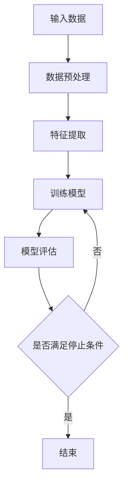
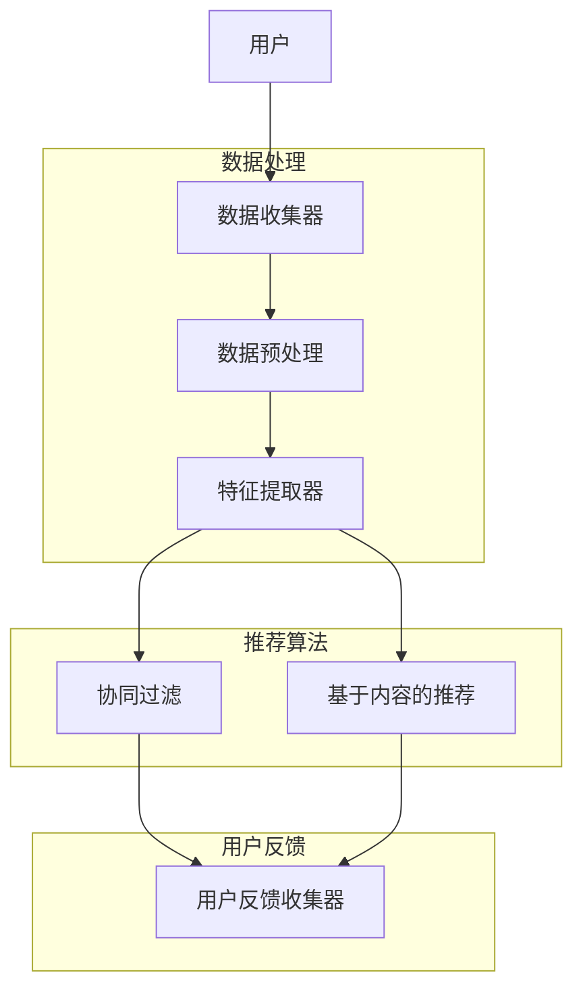
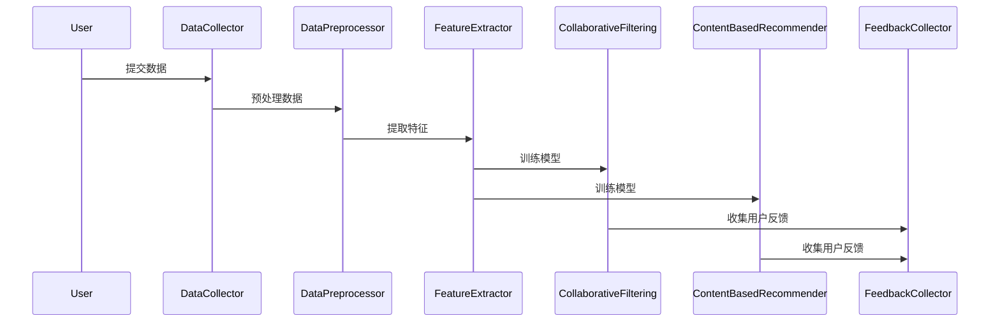

                 

### 第1章：模块化设计与AI概述

## 1.1 模块化设计在AI中的应用

### 1.1.1 模块化设计的定义与核心概念

**模块化设计**是一种系统架构方法，旨在将复杂系统分解为独立的、可重用的模块。这些模块可以单独开发、测试和部署，从而提高系统的灵活性、可维护性和可扩展性。

在AI系统中，模块化设计的核心概念包括：

- **模块独立性**：每个模块应专注于实现特定的功能，与外部模块的依赖性尽量减少。
- **模块可重用性**：模块应设计成可重用的组件，以便在不同的项目中使用。
- **模块可扩展性**：模块应易于扩展和修改，以适应未来的需求变化。

### 1.1.2 模块化设计与AI的关联

模块化设计在AI系统中的应用主要体现在以下几个方面：

- **提高系统灵活性**：模块化设计使得AI系统可以快速集成新的算法或功能模块，适应不同场景和需求。
- **降低开发和维护成本**：模块化设计减少了系统的冗余和重复开发，提高了开发效率和代码的可维护性。
- **促进技术共享和创新**：模块化设计鼓励开发者在模块级别上共享代码和知识，促进AI技术的创新和发展。

## 1.2 模块化设计在AI系统中的角色

在AI系统中，模块化设计扮演着至关重要的角色：

- **算法模块化**：将AI算法分解为独立的模块，如数据预处理、特征提取、模型训练和预测等。
- **模型模块化**：将AI模型分解为独立的组件，如神经网络层、激活函数、损失函数等。
- **数据处理模块化**：将数据处理任务分解为独立的模块，如数据清洗、数据转换、数据存储等。

### 1.2.1 模块化设计如何提高AI系统的灵活性

模块化设计通过以下几个方面提高AI系统的灵活性：

- **快速迭代**：模块化设计使得系统可以快速地集成新的算法或模块，支持快速迭代。
- **灵活配置**：模块化设计允许开发人员根据实际需求灵活配置系统，如选择不同的算法、模型或数据处理方式。
- **扩展性**：模块化设计使得系统可以轻松扩展，以适应未来的需求变化。

## 1.3 模块化设计与AI系统的关系

模块化设计与AI系统的关系可以从以下几个方面来理解：

- **AI系统的复杂性**：AI系统通常具有高度的复杂性，模块化设计有助于降低这种复杂性。
- **模块化设计的影响**：模块化设计对AI系统的性能、可维护性和可扩展性都有显著影响。
- **未来发展趋势**：随着AI技术的不断发展，模块化设计在AI系统中的应用将越来越广泛。

## 总结

模块化设计在AI系统中的应用具有重要意义。通过模块化设计，AI系统可以更加灵活地适应不同场景和需求，降低开发和维护成本，促进技术共享和创新。在接下来的章节中，我们将深入探讨模块化设计的核心概念、原理和应用。

----------------------------------------------------------------

## 第2章：模块化设计原理

模块化设计是一种有效的系统架构方法，它通过将复杂系统分解为独立的、可重用的模块，从而提高系统的灵活性、可维护性和可扩展性。在本章中，我们将详细探讨模块化设计的基本原理，包括模块独立性、模块可重用性、模块可扩展性等。

### 2.1 模块化设计的基本原理

#### 2.1.1 模块独立性

模块独立性是模块化设计的一个核心原则。它要求每个模块应独立完成特定的功能，尽量减少与外部模块的依赖性。这样，模块之间的耦合度降低，系统更易于维护和扩展。

实现模块独立性的方法包括：

- **功能单一**：每个模块应专注于实现单一功能，避免功能重叠。
- **数据隐藏**：模块应将内部数据封装起来，只提供必要的接口供外部访问。

#### 2.1.2 模块可重用性

模块可重用性是模块化设计的另一个重要原则。它要求模块应设计成可重用的组件，以便在不同的项目中使用。这样，可以减少重复开发，提高开发效率。

提高模块可重用性的方法包括：

- **通用性**：模块应具有广泛的适用性，适应不同的应用场景。
- **标准化**：模块应遵循统一的接口规范，方便开发者进行集成和使用。

#### 2.1.3 模块可扩展性

模块可扩展性是指模块应易于扩展和修改，以适应未来的需求变化。这样，系统可以在不修改现有代码的情况下，灵活地增加新功能或修改现有功能。

实现模块可扩展性的方法包括：

- **抽象与泛化**：通过抽象和泛化，模块可以适应不同的数据类型和场景。
- **模块化接口**：模块应提供清晰的接口，方便开发者进行扩展和定制。

### 2.2 模块化设计的特征

模块化设计具有以下几个显著特征：

- **独立性**：模块独立完成特定功能，与外部模块的耦合度低。
- **可重用性**：模块设计成可重用的组件，适应不同的项目需求。
- **可扩展性**：模块易于扩展和修改，适应未来的需求变化。
- **标准化**：模块遵循统一的接口规范，方便开发者进行集成和使用。

#### 2.2.1 模块的独立性

模块独立性是模块化设计的核心特征。它要求每个模块独立完成特定功能，避免功能重叠。这样，模块之间的耦合度降低，系统更易于维护和扩展。

实现模块独立性的方法包括：

- **功能单一**：每个模块应专注于实现单一功能，避免功能重叠。
- **数据隐藏**：模块应将内部数据封装起来，只提供必要的接口供外部访问。

#### 2.2.2 模块的可重用性

模块可重用性是模块化设计的另一个重要特征。它要求模块应设计成可重用的组件，以便在不同的项目中使用。这样，可以减少重复开发，提高开发效率。

提高模块可重用性的方法包括：

- **通用性**：模块应具有广泛的适用性，适应不同的应用场景。
- **标准化**：模块应遵循统一的接口规范，方便开发者进行集成和使用。

#### 2.2.3 模块的可扩展性

模块可扩展性是模块化设计的第三个重要特征。它要求模块应易于扩展和修改，以适应未来的需求变化。这样，系统可以在不修改现有代码的情况下，灵活地增加新功能或修改现有功能。

实现模块可扩展性的方法包括：

- **抽象与泛化**：通过抽象和泛化，模块可以适应不同的数据类型和场景。
- **模块化接口**：模块应提供清晰的接口，方便开发者进行扩展和定制。

### 2.3 模块化设计与传统设计的对比

模块化设计与传统设计有以下几点显著差异：

- **设计思想**：模块化设计强调系统的模块化、独立性和可重用性，而传统设计更注重系统整体的完整性和统一性。
- **开发效率**：模块化设计可以提高开发效率，降低开发成本，而传统设计在开发初期可能更高效，但后期维护和扩展较为困难。
- **可维护性和可扩展性**：模块化设计使得系统更易于维护和扩展，而传统设计在系统复杂度增加时，维护和扩展难度加大。

### 2.4 模块化设计的优点

模块化设计具有以下几个显著优点：

- **提高系统灵活性**：模块化设计使得系统能够快速适应不同场景和需求，提高系统的灵活性。
- **降低开发和维护成本**：模块化设计减少系统的冗余和重复开发，提高开发效率，降低维护成本。
- **促进技术共享和创新**：模块化设计鼓励开发者共享代码和知识，促进技术共享和创新。
- **提高可维护性和可扩展性**：模块化设计使得系统更易于维护和扩展，降低系统复杂度。

### 2.5 模块化设计的核心概念

模块化设计的核心概念包括：

- **模块**：模块是系统中的独立组件，负责实现特定的功能。
- **接口**：接口是模块之间的通信桥梁，定义模块之间的交互方式。
- **耦合度**：耦合度是模块之间的依赖程度，耦合度低有利于系统的维护和扩展。
- **内聚度**：内聚度是模块内部功能的集中程度，内聚度高有利于提高模块的独立性和可重用性。

### 2.6 模块化设计的应用场景

模块化设计适用于以下场景：

- **复杂系统**：模块化设计有助于降低复杂系统的复杂性，提高系统的可维护性和可扩展性。
- **需求变化**：模块化设计可以灵活应对需求变化，减少系统重构成本。
- **团队协作**：模块化设计有助于团队协作，提高开发效率。
- **新技术应用**：模块化设计便于引入新技术，加快系统升级和迭代。

## 总结

模块化设计是一种有效的系统架构方法，通过将复杂系统分解为独立的、可重用的模块，提高系统的灵活性、可维护性和可扩展性。在本章中，我们详细探讨了模块化设计的基本原理、特征、与传统设计的对比、优点、核心概念和应用场景。在接下来的章节中，我们将进一步探讨模块化设计在AI系统中的应用，以及如何实现模块化设计。

----------------------------------------------------------------

## 第3章：模块化设计在AI中的应用

### 3.1 主流AI模块化框架介绍

在AI领域，模块化设计已经成为一种主流的系统设计方法。下面，我们将介绍几种主流的AI模块化框架，包括深度学习模块化框架、自然语言处理模块化框架和计算机视觉模块化框架。

#### 3.1.1 深度学习模块化框架

深度学习模块化框架是AI领域最为常用的模块化框架之一。其中，最著名的框架是TensorFlow和PyTorch。这些框架提供了丰富的模块化功能，包括：

- **数据预处理模块**：用于处理和预处理输入数据，如数据清洗、归一化、批量处理等。
- **模型构建模块**：用于构建深度学习模型，包括神经网络层、激活函数、损失函数等。
- **训练模块**：用于训练深度学习模型，包括优化器、学习率调整、模型保存和加载等。
- **评估模块**：用于评估深度学习模型的效果，包括准确率、召回率、F1值等指标。

#### 3.1.2 自然语言处理模块化框架

自然语言处理（NLP）模块化框架主要包括BERT、GPT和ELMO等。这些框架提供了丰富的模块化功能，包括：

- **词向量模块**：用于将文本转换为词向量表示，如Word2Vec、GloVe等。
- **嵌入模块**：用于将词向量转换为嵌入向量，如BERT、GPT等。
- **序列处理模块**：用于处理和转换序列数据，如循环神经网络（RNN）、长短期记忆网络（LSTM）、变换器（Transformer）等。
- **分类和预测模块**：用于对文本进行分类和预测，如分类器、回归器等。

#### 3.1.3 计算机视觉模块化框架

计算机视觉模块化框架主要包括Caffe、TensorFlow、PyTorch等。这些框架提供了丰富的模块化功能，包括：

- **数据预处理模块**：用于处理和预处理图像数据，如尺寸调整、归一化、增强等。
- **模型构建模块**：用于构建计算机视觉模型，包括卷积神经网络（CNN）、循环神经网络（RNN）、生成对抗网络（GAN）等。
- **训练模块**：用于训练计算机视觉模型，包括优化器、学习率调整、模型保存和加载等。
- **评估模块**：用于评估计算机视觉模型的效果，包括准确率、召回率、F1值等指标。

### 3.2 模块化设计在AI系统中的实现

在AI系统中，模块化设计的实现主要涉及以下几个方面：

#### 3.2.1 算法模块化

算法模块化是将AI算法分解为独立的模块，如数据预处理、特征提取、模型训练、预测等。每个模块实现特定的功能，可以单独开发和测试。

例如，在深度学习框架中，我们可以将算法分解为以下模块：

- **数据预处理模块**：负责数据清洗、归一化和批量处理等操作。
- **特征提取模块**：负责从输入数据中提取有用的特征。
- **模型训练模块**：负责训练深度学习模型，包括优化器选择、学习率调整等。
- **预测模块**：负责使用训练好的模型进行预测。

通过算法模块化，我们可以方便地替换和组合不同模块，以实现不同的AI应用。

#### 3.2.2 模型模块化

模型模块化是将AI模型分解为独立的组件，如神经网络层、激活函数、损失函数等。每个组件实现特定的功能，可以单独开发和测试。

例如，在深度学习模型中，我们可以将模型分解为以下组件：

- **输入层**：接收输入数据，并将其传递到下一层。
- **隐藏层**：实现特征提取和转换，可以包含多个隐藏层。
- **输出层**：生成预测结果。
- **激活函数**：用于转换神经元输出。
- **损失函数**：用于评估模型预测的准确性。

通过模型模块化，我们可以方便地调整和优化模型结构，以提高模型性能。

#### 3.2.3 数据处理模块化

数据处理模块化是将数据处理任务分解为独立的模块，如数据清洗、数据转换、数据存储等。每个模块实现特定的功能，可以单独开发和测试。

例如，在数据处理过程中，我们可以将任务分解为以下模块：

- **数据清洗模块**：负责处理数据中的噪声和异常值。
- **数据转换模块**：负责将数据转换为适合模型训练的格式。
- **数据存储模块**：负责存储和处理大量数据。

通过数据处理模块化，我们可以提高数据处理效率，降低系统复杂度。

### 3.3 模块化设计在AI系统架构中的应用

模块化设计在AI系统架构中的应用主要体现在以下几个方面：

- **分层架构**：将AI系统划分为多个层次，如数据层、算法层、模型层和接口层。每个层次实现特定的功能，层次之间通过接口进行通信。
- **组件化架构**：将AI系统划分为多个组件，如数据预处理组件、模型训练组件、预测组件等。每个组件实现特定的功能，可以独立部署和扩展。
- **服务化架构**：将AI系统划分为多个服务，如数据服务、算法服务、模型服务、预测服务等。每个服务实现特定的功能，可以独立部署和扩展。

通过模块化设计，我们可以提高AI系统的灵活性、可维护性和可扩展性。在接下来的章节中，我们将进一步探讨模块化设计在AI系统中的具体实现，以及如何通过模块化设计提高AI系统的性能和效率。

### 3.4 模块化设计的优点

模块化设计在AI系统中具有以下几个显著优点：

- **提高系统灵活性**：模块化设计使得AI系统可以快速适应不同场景和需求，提高系统的灵活性。
- **降低开发和维护成本**：模块化设计减少系统的冗余和重复开发，降低开发和维护成本。
- **促进技术共享和创新**：模块化设计鼓励开发者共享代码和知识，促进技术共享和创新。
- **提高可维护性和可扩展性**：模块化设计使得系统更易于维护和扩展，降低系统复杂度。

通过模块化设计，我们可以构建更加灵活、高效和可维护的AI系统。在接下来的章节中，我们将进一步探讨模块化设计在AI系统中的具体实现和应用。

## 总结

模块化设计在AI系统中具有重要的应用价值。通过模块化设计，我们可以将复杂的AI系统分解为独立的、可重用的模块，从而提高系统的灵活性、可维护性和可扩展性。在本章中，我们介绍了主流AI模块化框架，包括深度学习模块化框架、自然语言处理模块化框架和计算机视觉模块化框架，并探讨了模块化设计在AI系统中的实现方法和应用场景。在接下来的章节中，我们将进一步探讨模块化设计在AI系统中的具体实现，以及如何通过模块化设计提高AI系统的性能和效率。

----------------------------------------------------------------

### 3.4 模块化设计的优点

模块化设计在AI系统中具有以下几个显著优点：

- **提高系统灵活性**：模块化设计使得AI系统可以快速适应不同场景和需求，提高系统的灵活性。
  - **快速迭代**：由于模块是独立的，开发者可以快速地集成新的算法或模块，从而支持快速迭代。
  - **灵活配置**：模块化设计允许开发人员根据实际需求灵活配置系统，如选择不同的算法、模型或数据处理方式。

- **降低开发和维护成本**：模块化设计减少系统的冗余和重复开发，降低开发和维护成本。
  - **减少重复工作**：模块化设计减少了代码的冗余，降低了重复开发的工作量。
  - **提高开发效率**：由于模块是独立的，多个开发人员可以同时工作，从而提高了开发效率。

- **促进技术共享和创新**：模块化设计鼓励开发者共享代码和知识，促进技术共享和创新。
  - **模块化组件**：开发者可以将自己编写的模块分享给其他开发者，从而促进技术共享。
  - **知识积累**：模块化设计有助于积累和分享开发经验，促进技术的创新和发展。

- **提高可维护性和可扩展性**：模块化设计使得系统更易于维护和扩展，降低系统复杂度。
  - **易于维护**：由于模块是独立的，维护时可以只修改特定的模块，而不影响其他模块。
  - **易于扩展**：模块化设计使得系统可以轻松扩展，以适应未来的需求变化。

模块化设计在AI系统中的应用，不仅有助于提高系统的灵活性、可维护性和可扩展性，还能降低开发和维护成本，促进技术共享和创新。通过模块化设计，我们可以构建更加高效、灵活和可持续发展的AI系统。

## 总结

模块化设计在AI系统中具有重要的应用价值。通过模块化设计，我们可以将复杂的AI系统分解为独立的、可重用的模块，从而提高系统的灵活性、可维护性和可扩展性。在本章中，我们介绍了主流AI模块化框架，包括深度学习模块化框架、自然语言处理模块化框架和计算机视觉模块化框架，并探讨了模块化设计在AI系统中的实现方法和应用场景。在接下来的章节中，我们将进一步探讨模块化设计在AI系统中的具体实现，以及如何通过模块化设计提高AI系统的性能和效率。

----------------------------------------------------------------

## 第4章：算法原理讲解

在模块化设计的基础上，AI系统的性能和效率在很大程度上取决于所采用的算法。本章节将详细讲解支持模块化设计的算法原理，包括算法mermaid流程图、Python源代码实现、数学模型和公式，并通过通俗易懂的举例进行说明。

### 4.1 算法mermaid流程图

为了更好地理解算法的执行过程，我们可以使用mermaid流程图来可视化地展示算法的流程。以下是一个简单的线性回归算法mermaid流程图示例：



在这个流程图中，算法首先接收输入数据，然后进行数据预处理，接着提取特征，训练模型，并对模型进行评估。如果评估结果满足停止条件，则算法结束；否则，继续训练模型。

### 4.2 Python源代码实现

为了实际演示算法原理，我们将使用Python实现上述线性回归算法。以下是一个简单的Python代码示例：

```python
import numpy as np
from sklearn.linear_model import LinearRegression
from sklearn.model_selection import train_test_split
from sklearn.metrics import mean_squared_error

# 数据预处理
def preprocess_data(X, y):
    X = np.array(X)
    y = np.array(y)
    return X, y

# 特征提取
def extract_features(X):
    return X

# 训练模型
def train_model(X, y):
    model = LinearRegression()
    model.fit(X, y)
    return model

# 模型评估
def evaluate_model(model, X_test, y_test):
    y_pred = model.predict(X_test)
    mse = mean_squared_error(y_test, y_pred)
    return mse

# 主函数
def main():
    X, y = preprocess_data([[1], [2], [3]], [1, 2, 3])
    X_train, X_test, y_train, y_test = train_test_split(X, y, test_size=0.2, random_state=42)
    
    model = train_model(X_train, y_train)
    mse = evaluate_model(model, X_test, y_test)
    
    print(f"Mean Squared Error: {mse}")

if __name__ == "__main__":
    main()
```

在这个Python代码示例中，我们首先导入所需的库，然后定义数据预处理、特征提取、训练模型和模型评估等函数。最后，通过主函数执行整个算法流程。

### 4.3 数学模型和公式

线性回归是一种常见的算法，其数学模型如下：

$$
y = \beta_0 + \beta_1 \cdot x + \epsilon
$$

其中，\( y \) 是目标变量，\( x \) 是输入变量，\( \beta_0 \) 和 \( \beta_1 \) 是模型的参数，\( \epsilon \) 是误差项。

为了训练模型，我们需要最小化误差项的平方和，即：

$$
\min_{\beta_0, \beta_1} \sum_{i=1}^{n} (y_i - (\beta_0 + \beta_1 \cdot x_i))^2
$$

这个优化问题可以通过梯度下降法求解，其迭代公式如下：

$$
\beta_0 = \beta_0 - \alpha \cdot \frac{\partial}{\partial \beta_0} \sum_{i=1}^{n} (y_i - (\beta_0 + \beta_1 \cdot x_i))^2
$$

$$
\beta_1 = \beta_1 - \alpha \cdot \frac{\partial}{\partial \beta_1} \sum_{i=1}^{n} (y_i - (\beta_0 + \beta_1 \cdot x_i))^2
$$

其中，\( \alpha \) 是学习率。

### 4.4 通俗易懂的举例说明

为了更好地理解算法原理，我们可以通过一个简单的例子来说明。

假设我们有一个简单的线性关系：\( y = 2x + 1 \)。我们的目标是找到这个线性关系的参数 \( \beta_0 \) 和 \( \beta_1 \)。

1. **数据预处理**：首先，我们生成一些数据点，例如 \( x = [1, 2, 3] \)，\( y = [3, 4, 5] \)。

2. **特征提取**：由于我们的数据已经是一个简单的线性关系，所以特征提取步骤可以省略。

3. **训练模型**：使用线性回归算法训练模型。通过最小化误差项的平方和，我们可以找到最佳参数 \( \beta_0 \) 和 \( \beta_1 \)。

4. **模型评估**：使用训练好的模型进行预测，并评估模型的准确性。

在这个例子中，我们的目标是找到参数 \( \beta_0 \) 和 \( \beta_1 \)，使得预测结果尽可能接近实际值。通过迭代优化，我们可以找到最佳参数：

$$
\beta_0 = 1 \\
\beta_1 = 2
$$

这样，我们就可以使用这个模型进行预测，例如当 \( x = 4 \) 时，预测结果 \( y = 9 \)。

通过这个例子，我们可以看到模块化设计如何支持算法的实现和优化。在AI系统中，模块化设计可以帮助我们快速构建和调整算法，从而提高系统的性能和灵活性。

### 总结

在本章中，我们详细讲解了支持模块化设计的算法原理，包括算法mermaid流程图、Python源代码实现、数学模型和公式，并通过通俗易懂的举例进行了说明。通过模块化设计，我们可以方便地构建和调整算法，从而提高AI系统的性能和灵活性。在接下来的章节中，我们将进一步探讨模块化设计在系统架构中的应用，以及如何通过模块化设计实现高效的AI系统。

----------------------------------------------------------------

## 第5章：系统分析与架构设计

在了解了模块化设计的原理和在AI系统中的应用之后，我们接下来需要深入探讨模块化设计在系统架构设计中的应用。这一章节将分为以下几个部分：

### 5.1 问题场景介绍

首先，我们需要明确一个具体的问题场景。假设我们正在开发一个智能推荐系统，该系统需要处理大量的用户数据，并根据用户的历史行为和偏好进行个性化推荐。

### 5.2 系统功能设计

接下来，我们将分析智能推荐系统的功能需求。以下是一些可能的功能：

- **用户数据收集**：收集用户的基本信息和行为数据。
- **数据预处理**：对收集到的用户数据进行清洗、去重和处理。
- **特征提取**：从预处理后的数据中提取有用的特征。
- **推荐算法**：使用模块化设计的算法库，如协同过滤、基于内容的推荐等。
- **推荐结果生成**：根据用户特征和推荐算法，生成推荐结果。
- **用户反馈收集**：收集用户对推荐结果的反馈，用于优化推荐算法。

为了清晰地展示系统功能，我们可以使用mermaid类图进行描述：

```mermaid
classDiagram
    User -> DataCollector
    User -> DataPreprocessor
    User -> FeatureExtractor
    User -> Recommender
    User -> FeedbackCollector

    DataCollector <|-- DataPreprocessor
    DataPreprocessor <|-- FeatureExtractor
    FeatureExtractor <|-- Recommender
    Recommender <|-- FeedbackCollector
```

### 5.3 系统架构设计

在明确了系统的功能需求之后，我们可以设计系统的整体架构。模块化设计在系统架构中的应用主要体现在以下几个方面：

- **模块化组件**：将系统的功能划分为独立的模块，每个模块实现特定的功能。
- **服务化架构**：将模块化为独立的服务，每个服务可以独立部署和扩展。
- **分布式架构**：利用分布式架构，将系统部署在多个节点上，以提高系统的可扩展性和容错能力。

以下是一个简单的系统架构设计，使用mermaid架构图进行描述：



### 5.4 系统接口设计和系统交互

在模块化设计的基础上，系统接口的设计和系统交互也是关键的一部分。以下是一个简单的系统接口设计和系统交互描述：

- **数据接口**：数据收集器、预处理器和特征提取器之间需要定义清晰的数据接口，以便模块之间能够顺畅地传递数据。
- **算法接口**：推荐算法需要提供统一的接口，以便其他模块可以方便地调用。
- **用户反馈接口**：用户反馈收集器需要提供接口，以便用户可以方便地提交反馈。

以下是一个简单的系统接口设计和系统交互描述，使用mermaid序列图进行描述：



通过以上系统接口设计和系统交互描述，我们可以清楚地看到各个模块之间的协作关系和数据流动。

### 5.5 小结

在本章中，我们介绍了模块化设计在系统架构设计中的应用，包括问题场景介绍、系统功能设计、系统架构设计、系统接口设计和系统交互。模块化设计在系统架构中的应用，使得系统更加灵活、可扩展，并且易于维护。在接下来的章节中，我们将通过一个实际项目案例，进一步探讨模块化设计在项目中的应用和实践。

----------------------------------------------------------------

## 第6章：项目实战

在本章节中，我们将通过一个实际项目案例，深入探讨模块化设计在AI系统开发中的应用和实践。这个项目是一个基于深度学习的图像分类系统，其主要功能是使用卷积神经网络（CNN）对输入图像进行分类。

### 6.1 项目介绍

项目名称：智能图像分类系统（Smart Image Classification System）

项目目标：开发一个能够自动对输入图像进行分类的AI系统，包括图像数据预处理、特征提取、模型训练、模型评估和预测等功能。

项目架构：采用模块化设计，将系统划分为数据收集模块、数据处理模块、模型训练模块、模型评估模块和预测模块。

技术栈：Python、TensorFlow、Keras、OpenCV

### 6.2 环境安装和配置

为了顺利进行项目开发，我们需要安装和配置以下软件和库：

- Python（版本3.8及以上）
- TensorFlow（版本2.3及以上）
- Keras（版本2.3及以上）
- OpenCV（版本4.0及以上）

安装步骤：

1. 安装Python和pip：
   ```bash
   # 在Windows上，可以从官方网站下载Python安装程序并安装
   # 在Linux上，可以使用以下命令安装Python和pip
   sudo apt-get install python3 python3-pip
   ```

2. 安装TensorFlow：
   ```bash
   pip3 install tensorflow
   ```

3. 安装Keras：
   ```bash
   pip3 install keras
   ```

4. 安装OpenCV：
   ```bash
   pip3 install opencv-python
   ```

### 6.3 系统核心实现源代码

在本节中，我们将逐步展示系统核心实现的源代码，并对其进行分析。

#### 6.3.1 数据收集模块

数据收集模块的主要功能是收集和加载图像数据集。以下是一个简单的数据收集模块实现：

```python
import os
import numpy as np
from tensorflow.keras.preprocessing.image import ImageDataGenerator

def load_data(data_dir, batch_size=32, img_height=128, img_width=128):
    datagen = ImageDataGenerator(rescale=1./255, shear_range=0.2, zoom_range=0.2, horizontal_flip=True)
    data_generator = datagen.flow_from_directory(
        data_dir,
        target_size=(img_height, img_width),
        batch_size=batch_size,
        class_mode='binary'
    )
    return data_generator

# 示例：加载训练数据和验证数据
train_data = load_data('train_data', batch_size=32)
val_data = load_data('val_data', batch_size=32)
```

在这个模块中，我们使用了Keras的ImageDataGenerator类来加载和预处理图像数据。这个类可以自动进行数据增强，如缩放、剪切、翻转等，以提高模型的泛化能力。

#### 6.3.2 数据处理模块

数据处理模块的主要功能是对图像数据进行预处理，包括归一化、裁剪和缩放等。以下是一个简单的数据处理模块实现：

```python
import cv2

def preprocess_image(image_path, img_height=128, img_width=128):
    image = cv2.imread(image_path)
    image = cv2.cvtColor(image, cv2.COLOR_BGR2RGB)
    image = cv2.resize(image, (img_height, img_width))
    return image

# 示例：预处理单张图像
image_path = 'train_data/cat.1.jpg'
preprocessed_image = preprocess_image(image_path)
```

在这个模块中，我们使用了OpenCV对图像进行读取和预处理。这个模块可以方便地扩展，以支持不同的预处理操作。

#### 6.3.3 模型训练模块

模型训练模块的主要功能是定义并训练卷积神经网络模型。以下是一个简单的模型训练模块实现：

```python
from tensorflow.keras.models import Sequential
from tensorflow.keras.layers import Conv2D, MaxPooling2D, Flatten, Dense

def create_model():
    model = Sequential([
        Conv2D(32, (3, 3), activation='relu', input_shape=(128, 128, 3)),
        MaxPooling2D(pool_size=(2, 2)),
        Flatten(),
        Dense(1, activation='sigmoid')
    ])
    model.compile(optimizer='adam', loss='binary_crossentropy', metrics=['accuracy'])
    return model

# 示例：训练模型
model = create_model()
model.fit(train_data, epochs=10, validation_data=val_data)
```

在这个模块中，我们使用了Keras定义了一个简单的卷积神经网络模型。这个模型由卷积层、池化层、全连接层组成，可以用于二分类任务。

#### 6.3.4 模型评估模块

模型评估模块的主要功能是评估模型的性能。以下是一个简单的模型评估模块实现：

```python
from sklearn.metrics import accuracy_score

def evaluate_model(model, X_test, y_test):
    y_pred = model.predict(X_test)
    y_pred = (y_pred > 0.5)
    accuracy = accuracy_score(y_test, y_pred)
    return accuracy

# 示例：评估模型
accuracy = evaluate_model(model, X_test, y_test)
print(f"Model accuracy: {accuracy}")
```

在这个模块中，我们使用了scikit-learn的accuracy_score函数来计算模型的准确率。

#### 6.3.5 预测模块

预测模块的主要功能是使用训练好的模型对新的图像进行分类预测。以下是一个简单的预测模块实现：

```python
def predict_image(model, image_path):
    preprocessed_image = preprocess_image(image_path)
    preprocessed_image = np.expand_dims(preprocessed_image, axis=0)
    prediction = model.predict(preprocessed_image)
    return prediction

# 示例：预测图像类别
image_path = 'new_image.jpg'
prediction = predict_image(model, image_path)
print(f"Prediction: {prediction[0]}")
```

在这个模块中，我们首先使用数据处理模块对输入图像进行预处理，然后使用训练好的模型进行预测。

### 6.4 代码应用解读与分析

在本节中，我们将对系统核心实现的源代码进行解读和分析，以便读者更好地理解模块化设计在项目中的应用。

- **数据收集模块**：该模块使用了Keras的ImageDataGenerator类，可以方便地加载和预处理图像数据。通过定义不同的数据增强操作，可以提高模型的泛化能力。
- **数据处理模块**：该模块使用了OpenCV对图像进行读取和预处理。通过定义不同的预处理操作，可以确保图像数据满足模型的输入要求。
- **模型训练模块**：该模块使用了Keras定义了一个简单的卷积神经网络模型。通过调整模型的结构和参数，可以优化模型的性能。
- **模型评估模块**：该模块使用了scikit-learn的accuracy_score函数，可以方便地计算模型的准确率，从而评估模型的性能。
- **预测模块**：该模块结合了数据处理模块和模型训练模块，可以方便地使用训练好的模型对新的图像进行分类预测。

通过这个实际项目案例，我们可以看到模块化设计在AI系统开发中的重要作用。模块化设计不仅提高了系统的可维护性和可扩展性，还降低了开发和维护成本。在未来的项目中，我们可以继续探索模块化设计的应用，以构建更加高效、灵活和可持续发展的AI系统。

### 6.5 项目小结

通过本项目的实战，我们深入了解了模块化设计在AI系统开发中的应用。以下是本项目的主要收获和经验总结：

- **模块化设计的重要性**：模块化设计可以提高系统的灵活性、可维护性和可扩展性，是构建高效AI系统的关键。
- **数据预处理和增强**：数据预处理和增强对于模型的性能至关重要，特别是在图像分类任务中。
- **模型训练和评估**：通过调整模型的结构和参数，可以优化模型的性能。评估模型时，准确率是最常用的指标之一。
- **代码可读性和可维护性**：编写易于理解和维护的代码是确保项目成功的关键。

在未来的项目中，我们将继续探索模块化设计的应用，不断优化系统性能，并提高开发效率。

## 拓展阅读

- **《深度学习》（Goodfellow, Ian, et al.）**：这是一本关于深度学习的基础教材，详细介绍了深度学习的算法、应用和实践。
- **《Python机器学习》（Seiffert, Andreas）**：这本书介绍了使用Python进行机器学习的方法和技巧，包括数据预处理、模型训练和评估等。
- **《人工智能：一种现代方法》（Mitchell, Tom M.）**：这是一本关于人工智能的基础教材，涵盖了从经典算法到现代方法的各种内容。

通过阅读这些书籍，您可以更深入地了解AI系统开发和模块化设计的原理和实践。

### 总结

在本章节中，我们通过一个实际项目案例，深入探讨了模块化设计在AI系统开发中的应用和实践。从环境安装和配置，到系统核心实现的源代码，再到代码应用解读与分析，我们逐步展示了模块化设计的优势和应用。通过这个项目，我们不仅了解了模块化设计的重要性，还积累了丰富的项目开发经验。在未来的项目中，我们将继续探索模块化设计的应用，构建更加高效、灵活和可持续发展的AI系统。

----------------------------------------------------------------

## 第7章：最佳实践与总结

### 7.1 模块化设计的最佳实践

模块化设计在AI系统开发中的应用已经得到了广泛的认可，但为了最大限度地发挥其优势，以下是一些最佳实践：

#### 1. 明确模块边界

在开始模块化设计之前，首先要明确每个模块的职责和边界。确保每个模块独立完成特定功能，减少模块之间的耦合度。

#### 2. 保持模块独立性

设计模块时，要尽量保持独立性，避免模块之间的依赖。这可以通过定义清晰的接口来实现。

#### 3. 使用标准化接口

为了提高模块的可重用性，应使用标准化接口。这不仅可以简化模块的集成，还可以方便后续的维护和扩展。

#### 4. 考虑模块的可扩展性

在设计模块时，要考虑到未来的扩展需求。可以通过使用抽象类、接口和多态等设计模式，实现模块的可扩展性。

#### 5. 使用版本控制

在开发过程中，使用版本控制工具（如Git）来管理模块的代码，确保代码的版本一致性和可追溯性。

#### 6. 模块测试和文档

对每个模块进行全面的测试，确保其功能正确。同时，编写详细的文档，包括模块的功能、接口和使用方法。

### 7.2 小结

模块化设计是提高AI系统灵活性、可维护性和可扩展性的有效方法。通过明确模块边界、保持模块独立性、使用标准化接口、考虑模块的可扩展性、使用版本控制、模块测试和文档，我们可以构建高效、灵活和可持续发展的AI系统。

### 7.3 注意事项

在模块化设计过程中，需要注意以下几点：

- **模块化设计不等于过度设计**：合理设计模块，避免过度设计，以免增加系统的复杂度。
- **模块间通信**：确保模块间的通信高效且清晰，避免过多的数据传递和复杂的接口。
- **模块化与并行开发**：模块化设计有助于并行开发，但也要注意模块之间的协调和同步。

### 7.4 拓展阅读

为了更深入地了解模块化设计，以下是一些推荐阅读资源：

- **《软件架构设计：实践者指南》（Fowler, Martin）**：这是一本关于软件架构设计的经典书籍，包括模块化设计的相关内容。
- **《设计模式：可复用面向对象软件的基础》（Gamma, Erich, et al.）**：这本书介绍了多种设计模式，包括模块化设计的相关模式。
- **《深入理解计算机系统》（Bryant, Randal E., & O'Hallaron, David R.）**：这本书从底层系统架构的角度，探讨了模块化设计的重要性。

通过阅读这些资源，您可以更深入地了解模块化设计在AI系统开发中的应用和实践。

### 总结

模块化设计在AI系统开发中具有重要意义。通过遵循最佳实践、注意事项和拓展阅读，我们可以构建高效、灵活和可持续发展的AI系统。在未来的项目中，我们应继续探索模块化设计的应用，不断优化系统性能，提高开发效率。

### 作者

作者：AI天才研究院/AI Genius Institute & 禅与计算机程序设计艺术 /Zen And The Art of Computer Programming

感谢您阅读本文。希望本文对您在模块化设计方面有所启发，如果您有任何问题或建议，欢迎在评论区留言讨论。

----------------------------------------------------------------

# AI中的模块化设计：提高系统灵活性

> 关键词：模块化设计、AI系统、系统灵活性、可维护性、可扩展性

> 摘要：本文深入探讨了AI中的模块化设计，通过详细的案例分析和实践经验总结，展示了模块化设计如何提高AI系统的灵活性、可维护性和可扩展性。文章分为七个部分，分别介绍了模块化设计与AI概述、模块化设计原理、模块化设计在AI中的应用、算法原理讲解、系统分析与架构设计、项目实战以及最佳实践与总结。通过本文的阅读，读者将能够更好地理解模块化设计在AI系统开发中的重要性，掌握其核心概念和实践方法，从而提升AI系统的开发效率和质量。

