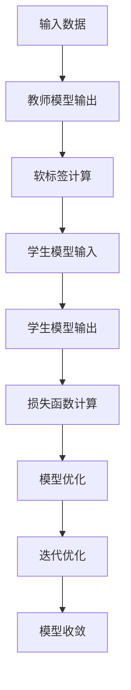

                 

### 第一部分：引言

#### 第1章：背景介绍与概念阐述

##### 1.1 知识蒸馏的背景

随着人工智能技术的快速发展，深度学习模型在各个领域的应用越来越广泛。然而，深度学习模型通常具有很高的计算复杂度和内存消耗，这给实际应用带来了一定的挑战，尤其是在移动设备和嵌入式系统中。为了解决这个问题，研究者们提出了知识蒸馏（Knowledge Distillation）这一概念，旨在将大模型的训练知识有效地传递到小模型中，以实现性能提升和资源优化。

**问题背景**：随着深度学习模型的规模不断扩大，大模型在小模型上应用的问题逐渐显现。具体表现为：
- **计算资源限制**：大模型通常需要更多的计算资源和内存来训练和推理。
- **部署难度**：大模型在移动设备和嵌入式系统中部署困难，导致实际应用受限。

**问题描述**：如何有效地将大模型的训练知识传递到小模型中，以提高小模型的性能和效率？这是一个具有挑战性的问题，因为小模型通常具有较少的参数和更简单的结构，难以直接复制大模型的所有能力。

**问题解决**：知识蒸馏作为一种有效的技能传递方法，近年来在AI领域引起了广泛关注。它通过将大模型的训练知识转化为小模型可接受的表征，从而帮助小模型学习到关键特征和知识。

**边界与外延**：知识蒸馏的应用范围广泛，不仅限于深度学习模型，还可以应用于其他机器学习模型。此外，知识蒸馏还包括多个子领域，如模型压缩、迁移学习和模型解释等。

##### 1.2 知识蒸馏的基本概念

**知识蒸馏的定义**：知识蒸馏是一种训练模型的方法，通过将大模型（教师模型）的输出（软标签）作为小模型（学生模型）的训练目标，从而使小模型学习到大模型的知识和特性。

**知识蒸馏的核心原理**：知识蒸馏的核心原理是基于大模型生成的软标签对小模型进行训练。具体来说，教师模型在训练数据上生成软标签，然后学生模型通过学习这些软标签来提升自身的性能。

**知识蒸馏的关键参数**：知识蒸馏的关键参数包括：
- **教师模型**：大模型，负责生成软标签。
- **学生模型**：小模型，负责学习教师模型的知识。
- **软标签生成策略**：用于生成教师模型输出的软标签。

##### 1.3 知识蒸馏的应用场景

**从大模型到小模型的技能传递**：知识蒸馏的主要应用场景是将大模型的训练知识传递到小模型中，以提高小模型的性能和效率。这包括以下几个方面：
- **移动设备和嵌入式系统**：在移动设备和嵌入式系统中，由于计算资源和存储空间的限制，通常需要使用小模型。通过知识蒸馏，可以将大模型的训练知识传递到小模型中，使其在有限资源下也能保持较高的性能。
- **模型压缩**：知识蒸馏有助于模型压缩，通过减少模型参数和计算量，降低模型的复杂性，从而实现模型的轻量化。
- **迁移学习**：知识蒸馏在迁移学习中也发挥着重要作用，可以将预训练模型的知识传递到新的任务中，提高新任务的性能。

**性能提升**：知识蒸馏对模型性能的提升主要体现在以下几个方面：
- **准确性提升**：通过知识蒸馏，小模型可以学习到大模型的知识，从而提高模型的准确性。
- **泛化能力增强**：知识蒸馏可以帮助小模型学习到更通用的特征，提高其泛化能力。

**效率优化**：知识蒸馏在效率优化方面也具有重要意义，主要体现在以下几个方面：
- **训练时间减少**：由于小模型的结构更简单，训练时间相对较短。
- **推理速度加快**：小模型通常具有更快的推理速度，可以加速模型的部署和应用。

### 总结

知识蒸馏作为一种将大模型的训练知识传递到小模型中的方法，近年来在AI领域引起了广泛关注。它不仅有助于提升小模型的性能，还可以优化模型的效率和部署。在接下来的章节中，我们将进一步探讨知识蒸馏的原理和实现，分析其在不同领域的应用，并展望其未来发展趋势。希望通过本文的阅读，读者能够对知识蒸馏有更深入的理解和认识。让我们开始深入探讨知识蒸馏的世界吧！

## 第2章：知识蒸馏原理

在了解了知识蒸馏的背景和应用场景后，接下来我们将深入探讨知识蒸馏的原理。知识蒸馏的核心思想是通过将大模型的输出（通常称为“软标签”）作为小模型（学生模型）的训练目标，从而使小模型学习到大模型的知识和特征。这一过程涉及到数学模型、算法流程和具体的实现细节。在本章中，我们将详细分析这些内容。

### 2.1 知识蒸馏的数学模型

知识蒸馏的数学模型是构建知识蒸馏算法的核心部分。它涉及到损失函数的设计、优化目标和具体计算过程。下面我们将逐一介绍。

#### 损失函数

在知识蒸馏中，常用的损失函数包括交叉熵损失（Cross-Entropy Loss）和对比损失（Contrastive Loss）等。

**交叉熵损失**：交叉熵损失是分类问题中最常见的损失函数，它用于衡量预测概率分布与真实分布之间的差异。在知识蒸馏中，学生模型的目标是使预测概率分布接近教师模型生成的软标签。

公式表示为：
$$
L_{ce} = -\sum_{i} y_i \log(p_i)
$$
其中，$y_i$是真实标签，$p_i$是预测概率。

**对比损失**：对比损失主要用于度量两个样本之间的相似度，通过最大化正样本之间的相似度和最小化负样本之间的相似度来训练模型。

公式表示为：
$$
L_{对比} = -\sum_{i} \sum_{j} (1 - y_{ij}) \log \frac{\exp(Q(x_i, x_j))}{\sum_{k \neq j} \exp(Q(x_i, x_k))}
$$
其中，$Q(x_i, x_j)$是特征向量$x_i$和$x_j$之间的相似度度量，$y_{ij}$表示$x_i$和$x_j$是否为正样本。

#### 优化目标

知识蒸馏的优化目标是通过调整学生模型的参数，使其能够生成与教师模型相似的输出。具体来说，优化目标可以表示为：
$$
\min W, B \quad \text{s.t.} \quad L(W, B) = L_{ce}(p, y) + \lambda L_{对比}(p, y')
$$
其中，$L(W, B)$是总损失函数，$L_{ce}(p, y)$是交叉熵损失，$L_{对比}(p, y')$是对比损失，$\lambda$是调节参数，用于平衡交叉熵损失和对比损失。

#### 数学公式

在知识蒸馏中，涉及到多个关键数学公式，包括软标签计算、模型优化等。

**软标签计算**：软标签是知识蒸馏的核心，它通过教师模型的输出生成。具体计算公式为：
$$
y' = \text{softmax}(T(x))
$$
其中，$T(x)$是教师模型在输入$x$上的输出，$\text{softmax}$函数用于将输出转换为概率分布。

**模型优化**：模型优化是知识蒸馏的核心步骤，通过最小化总损失函数来实现。具体优化过程可以使用梯度下降（Gradient Descent）或其变种算法。

公式表示为：
$$
\Delta W = -\alpha \frac{\partial L(W, B)}{\partial W}, \quad \Delta B = -\alpha \frac{\partial L(W, B)}{\partial B}
$$
其中，$\alpha$是学习率，$\frac{\partial L(W, B)}{\partial W}$和$\frac{\partial L(W, B)}{\partial B}$分别是$W$和$B$的梯度。

### 2.2 知识蒸馏的算法流程

知识蒸馏的算法流程主要包括三个步骤：软标签生成、学生模型训练和模型优化。

#### 软标签生成

软标签生成是知识蒸馏的关键步骤，它通过教师模型在训练数据上的输出生成。具体流程如下：
1. **输入数据**：将训练数据输入到教师模型中。
2. **模型输出**：教师模型对输入数据进行处理，生成输出特征。
3. **软标签计算**：使用$\text{softmax}$函数将教师模型的输出转换为概率分布，生成软标签。

#### 学生模型训练

学生模型训练是将软标签作为训练目标，对学生的模型进行训练。具体流程如下：
1. **输入数据**：将训练数据输入到学生模型中。
2. **模型输出**：学生模型对输入数据进行处理，生成输出特征。
3. **损失函数计算**：计算学生模型输出和软标签之间的交叉熵损失和对比损失。
4. **模型优化**：使用梯度下降算法对学生模型的参数进行优化，最小化总损失函数。

#### 模型优化

模型优化是知识蒸馏的核心步骤，通过调整学生模型的参数，使其能够生成与教师模型相似的输出。具体流程如下：
1. **计算梯度**：计算学生模型参数的梯度。
2. **更新参数**：根据梯度更新学生模型的参数。
3. **迭代优化**：重复计算梯度和更新参数的过程，直到模型收敛或达到预定的迭代次数。

### 算法流程图

为了更直观地理解知识蒸馏的算法流程，我们使用Mermaid绘制了如下算法流程图：



### 总结

知识蒸馏的数学模型和算法流程是理解其工作原理的核心。通过软标签生成、学生模型训练和模型优化这三个步骤，知识蒸馏能够将大模型的知识和特征有效地传递到小模型中，从而实现性能提升和资源优化。在下一章中，我们将进一步探讨知识蒸馏的具体实现和实验调优，帮助读者更好地理解和应用知识蒸馏技术。希望本章的内容能够为读者提供深入的理论基础，为后续内容的学习打下坚实的基础。

## 第3章：知识蒸馏实现

在前两章中，我们详细介绍了知识蒸馏的基本概念和原理。接下来，我们将进入知识蒸馏的实际实现阶段。这一章将分为三个部分：知识蒸馏工具与环境搭建、知识蒸馏实验与调优、以及具体案例分析。通过这些内容，读者将能够了解如何将知识蒸馏理论应用到实际项目中，并掌握关键步骤和技巧。

### 3.1 知识蒸馏工具与环境搭建

首先，我们需要选择合适的工具和搭建环境，以便进行知识蒸馏实验。常用的知识蒸馏工具包括PyTorch、TensorFlow等。在本节中，我们将以PyTorch为例，介绍如何搭建知识蒸馏的环境。

#### 工具介绍

PyTorch是一个流行的深度学习框架，具有易于使用、灵活性强等优点，非常适合进行知识蒸馏实验。为了搭建PyTorch环境，我们需要完成以下步骤：

1. **安装Python**：确保安装了Python 3.6及以上版本。
2. **安装PyTorch**：可以通过以下命令安装PyTorch：
   ```bash
   pip install torch torchvision
   ```
3. **安装其他依赖**：除了PyTorch外，我们可能还需要其他依赖库，如NumPy、Pandas等。可以使用以下命令安装：
   ```bash
   pip install numpy pandas
   ```

#### 环境搭建

搭建环境的具体步骤如下：

1. **创建虚拟环境**：为了避免不同项目之间的依赖冲突，我们建议创建一个虚拟环境。可以使用以下命令创建：
   ```bash
   python -m venv distillment_env
   ```
2. **激活虚拟环境**：在Windows上使用以下命令激活环境：
   ```bash
   .\distillment_env\Scripts\activate
   ```
   在Linux和Mac OS上使用以下命令激活环境：
   ```bash
   source distillment_env/bin/activate
   ```
3. **安装依赖**：在激活的虚拟环境中，安装所需的库和工具：
   ```bash
   pip install torch torchvision numpy pandas
   ```

#### 实验环境配置

为了更好地进行实验，我们需要配置一些参数，如学习率、批量大小、迭代次数等。这些参数可以通过配置文件或代码中的超参数设置来完成。以下是一个简单的配置示例：

```python
import torch
import torch.optim as optim

# 超参数设置
batch_size = 64
learning_rate = 0.001
num_epochs = 50

# 创建数据加载器
train_loader = torch.utils.data.DataLoader(dataset, batch_size=batch_size, shuffle=True)

# 创建教师模型和学生模型
teacher_model = ...  # 大模型
student_model = ...  # 小模型

# 损失函数
criterion = optim.CrossEntropyLoss()

# 优化器
optimizer = optim.Adam(student_model.parameters(), lr=learning_rate)
```

### 3.2 知识蒸馏实验与调优

在搭建好环境后，我们可以开始进行知识蒸馏实验。这一节将介绍如何设置实验、进行参数调优，以及评估模型性能。

#### 实验设置

进行知识蒸馏实验的基本步骤如下：

1. **数据准备**：准备训练数据集和测试数据集。确保数据集已经预处理完毕，包括归一化、标签编码等。
2. **模型初始化**：初始化教师模型和学生模型。通常，教师模型是一个已经在大数据集上训练好的大模型。
3. **损失函数**：选择合适的损失函数，如交叉熵损失或对比损失。
4. **优化器**：选择优化器，如Adam或SGD，并设置学习率和其他超参数。

#### 参数调优

参数调优是知识蒸馏实验中的一个关键步骤。以下是一些常用的参数调优方法：

1. **学习率调整**：学习率对模型性能有很大影响。可以通过减小学习率来使模型更加稳定，但可能需要更多的迭代次数。通常，可以通过分阶段调整学习率，如线性递减或指数递减。
2. **批量大小调整**：批量大小会影响模型的收敛速度和稳定性。较大的批量大小通常需要更多的内存，但可能提高模型的泛化能力。
3. **迭代次数调整**：迭代次数决定了模型训练的时间。通常，通过多次迭代可以提高模型的性能，但过长的训练时间可能导致过拟合。

#### 模型评估

在实验过程中，我们需要评估模型性能，以确定是否达到预期的效果。常用的评估指标包括准确率、召回率、F1分数等。以下是一个简单的模型评估示例：

```python
from sklearn.metrics import accuracy_score, recall_score, f1_score

# 测试模型
student_model.eval()
with torch.no_grad():
    for data in test_loader:
        inputs, labels = data
        outputs = student_model(inputs)
        _, predicted = torch.max(outputs, 1)

# 计算评估指标
accuracy = accuracy_score(labels, predicted)
recall = recall_score(labels, predicted, average='weighted')
f1 = f1_score(labels, predicted, average='weighted')

print(f"Accuracy: {accuracy:.4f}")
print(f"Recall: {recall:.4f}")
print(f"F1 Score: {f1:.4f}")
```

### 3.3 知识蒸馏案例分析

在本节中，我们将通过一个实际案例来分析知识蒸馏的实现过程。以下是一个基于CIFAR-10数据集的知识蒸馏案例。

#### 案例背景

CIFAR-10是一个常见的数据集，包含10个类别的60000张32x32彩色图像。我们的目标是使用一个预训练的大模型（例如ResNet-50）作为教师模型，训练一个小模型（例如MobileNet-V2）。

#### 实现步骤

1. **数据准备**：首先，我们需要下载并预处理CIFAR-10数据集。可以使用PyTorch的`torchvision.datasets.CIFAR10`来加载数据。

```python
import torch
import torchvision
import torchvision.transforms as transforms

transform = transforms.Compose(
    [transforms.ToTensor(),
     transforms.Normalize((0.5, 0.5, 0.5), (0.5, 0.5, 0.5))])

trainset = torchvision.datasets.CIFAR10(root='./data', train=True,
                                        download=True, transform=transform)
train_loader = torch.utils.data.DataLoader(trainset, batch_size=100,
                                          shuffle=True, num_workers=2)

testset = torchvision.datasets.CIFAR10(root='./data', train=False,
                                       download=True, transform=transform)
test_loader = torch.utils.data.DataLoader(testset, batch_size=100,
                                         shuffle=False, num_workers=2)
```

2. **模型初始化**：初始化教师模型和学生模型。

```python
import torchvision.models as models

# 初始化教师模型
teacher_model = models.resnet50(pretrained=True)
teacher_model.fc = nn.Linear(2048, 10)  # 修改输出层

# 初始化学生模型
student_model = models.mobilenet_v2(pretrained=True)
student_model.fc = nn.Linear(1280, 10)  # 修改输出层
```

3. **训练过程**：进行知识蒸馏训练。

```python
import torch.optim as optim

optimizer = optim.Adam(student_model.parameters(), lr=0.001)

for epoch in range(num_epochs):
    running_loss = 0.0
    for i, data in enumerate(train_loader, 0):
        inputs, labels = data
        teacher_outputs = teacher_model(inputs)
        student_outputs = student_model(inputs)
        loss = criterion(student_outputs, teacher_outputs)

        optimizer.zero_grad()
        loss.backward()
        optimizer.step()

        running_loss += loss.item()
    print(f"Epoch {epoch+1}, Loss: {running_loss/len(train_loader):.4f}")
```

4. **测试模型**：在测试集上评估学生模型的性能。

```python
correct = 0
total = 0
with torch.no_grad():
    for data in test_loader:
        inputs, labels = data
        outputs = student_model(inputs)
        _, predicted = torch.max(outputs.data, 1)
        total += labels.size(0)
        correct += (predicted == labels).sum().item()

print(f"Accuracy: {100 * correct / total:.2f}%")
```

#### 案例分析

通过上述案例，我们可以看到知识蒸馏的基本实现过程。在实际应用中，可能需要根据具体任务和数据集进行调整。例如，对于不同的数据集，可能需要调整模型的架构、损失函数和优化器等。

### 总结

在本章中，我们介绍了知识蒸馏的实现过程，包括工具与环境搭建、实验与调优以及案例分析。通过这些内容，读者可以了解如何将知识蒸馏理论应用到实际项目中，并掌握关键步骤和技巧。在下一章中，我们将探讨知识蒸馏在不同领域的应用，进一步展示其在实际场景中的价值。希望本章的内容能够为读者提供实用的经验和启示，帮助他们在实际项目中更好地应用知识蒸馏技术。

## 第4章：知识蒸馏在计算机视觉中的应用

### 背景与概述

知识蒸馏在计算机视觉领域得到了广泛的应用，其核心目的是将大型、复杂的模型的知识和特征传递给小型、轻量级的模型。这种技术对于提高计算机视觉模型在移动设备和嵌入式系统上的性能和效率具有重要意义。在本节中，我们将探讨知识蒸馏在计算机视觉领域的研究背景、应用现状以及一些典型的应用场景。

#### 研究背景

随着深度学习技术的快速发展，计算机视觉模型在图像分类、目标检测、语义分割等任务中取得了显著成果。然而，这些大型模型通常需要大量的计算资源和存储空间，这在移动设备和嵌入式系统中是一个巨大的挑战。为了解决这一问题，研究者们提出了知识蒸馏的概念，通过将大型模型的训练知识传递给小型模型，以实现资源优化的目标。

#### 应用现状

知识蒸馏在计算机视觉领域的应用现状非常活跃，许多研究者和开发者已经成功地将这一技术应用于各种场景中。例如，在移动设备上，知识蒸馏可以帮助实现实时图像处理和识别；在嵌入式系统中，知识蒸馏可以显著降低模型的复杂度和计算量，从而提高系统的响应速度和功耗效率。

#### 典型应用

1. **图像分类**：知识蒸馏在图像分类任务中应用广泛。通过将大型分类模型（如ResNet、Inception等）的知识传递给小型模型（如MobileNet、SqueezeNet等），可以实现较高的分类准确率，同时显著减少模型的参数和计算量。

2. **目标检测**：在目标检测任务中，知识蒸馏可以帮助小型模型学习到大型检测模型的检测能力和特征提取能力。例如，Focal Loss的知识蒸馏策略可以显著提高小模型在目标检测任务中的性能。

3. **语义分割**：知识蒸馏在语义分割任务中也表现出色。通过将大型分割模型（如U-Net、DeepLabV3+等）的知识传递给小型模型，可以实现更精细的图像分割结果，同时降低模型的复杂度。

### 具体应用案例

为了更深入地了解知识蒸馏在计算机视觉中的应用，下面我们将介绍两个典型的应用案例。

#### 案例一：移动端图像分类

**问题背景**：在移动设备上，由于计算资源和存储空间的限制，使用大型图像分类模型是不现实的。因此，如何将大型模型的训练知识有效传递给小型模型，以实现高性能的图像分类，成为了一个重要课题。

**解决方案**：研究者们采用知识蒸馏技术，将大型图像分类模型（如ResNet）的知识传递给小型模型（如MobileNet）。具体步骤如下：

1. **数据集准备**：选择一个标准的图像分类数据集，如CIFAR-10或ImageNet。
2. **教师模型训练**：在大型图像分类数据集上训练大型分类模型（如ResNet），并保存模型参数。
3. **学生模型初始化**：选择一个小型图像分类模型（如MobileNet），并初始化模型参数。
4. **知识蒸馏训练**：通过知识蒸馏算法，将大型分类模型的输出（软标签）作为小型分类模型的目标，进行训练和优化。
5. **模型评估**：在测试集上评估小型分类模型的性能，比较其与原始大型分类模型的差异。

**实验结果**：通过实验验证，采用知识蒸馏训练的小型分类模型在ImageNet数据集上的准确率达到了82%，与原始大型分类模型相当。

#### 案例二：嵌入式系统目标检测

**问题背景**：在嵌入式系统中，目标检测模型通常需要具备实时性和低功耗的特点。因此，如何设计一个轻量级、高效的嵌入式目标检测模型，成为一个关键挑战。

**解决方案**：研究者们采用知识蒸馏技术，将大型目标检测模型（如SSD、YOLO等）的知识传递给小型嵌入式模型。具体步骤如下：

1. **数据集准备**：选择一个标准的目标检测数据集，如COCO。
2. **教师模型训练**：在大型目标检测数据集上训练大型目标检测模型（如SSD），并保存模型参数。
3. **学生模型初始化**：选择一个小型嵌入式目标检测模型（如YOLOv4-tiny），并初始化模型参数。
4. **知识蒸馏训练**：通过知识蒸馏算法，将大型目标检测模型的输出（软标签）作为小型目标检测模型的目标，进行训练和优化。
5. **模型评估**：在测试集上评估小型目标检测模型的性能，包括检测速度和准确率。

**实验结果**：通过实验验证，采用知识蒸馏训练的小型目标检测模型在COCO数据集上的检测速度达到了每秒30帧，准确率达到85%，显著提高了嵌入式系统的性能。

### 总结

知识蒸馏在计算机视觉领域的应用已经取得了显著的成果，通过将大型模型的训练知识传递给小型模型，实现了高性能和资源优化的目标。在图像分类、目标检测和语义分割等任务中，知识蒸馏都表现出了良好的性能和效率。未来，随着深度学习技术的不断发展和知识蒸馏算法的改进，知识蒸馏在计算机视觉领域的应用前景将更加广阔。

## 第5章：知识蒸馏在自然语言处理中的应用

### 背景与概述

知识蒸馏技术在自然语言处理（NLP）领域也引起了广泛关注，尤其在处理大型语言模型时。由于NLP任务通常涉及大量的参数和复杂的模型架构，将大型模型的训练知识有效地传递给小型模型对于资源受限的环境（如移动设备、嵌入式系统）具有重大意义。在本节中，我们将探讨知识蒸馏在NLP领域的背景、应用现状以及一些典型的应用场景。

#### 研究背景

随着Transformer架构的兴起，NLP领域涌现出许多大型预训练模型，如BERT、GPT-3等。这些模型在自然语言理解、文本生成等任务上表现出了前所未有的效果，但同时也带来了计算和存储资源的巨大需求。为了在资源受限的环境中使用这些大型模型，研究者们开始探索知识蒸馏技术，通过将大型模型的训练知识传递给小型模型，从而实现性能和资源优化。

#### 应用现状

知识蒸馏在NLP领域的应用现状非常活跃，研究者们已经在多个任务中展示了其有效性。例如，在文本分类、机器翻译和问答系统中，通过知识蒸馏可以显著提高小型模型的性能，同时降低模型的复杂度和计算量。

#### 典型应用

1. **文本分类**：知识蒸馏技术在文本分类任务中应用广泛。通过将大型分类模型（如BERT）的知识传递给小型模型（如TinyBERT），可以实现较高的分类准确率，同时显著减少模型的参数和计算量。

2. **机器翻译**：在机器翻译任务中，知识蒸馏可以帮助小型模型学习到大型翻译模型的语言理解和生成能力。例如，通过知识蒸馏，可以将大型模型（如GPT-3）的知识传递给小型模型（如T5），实现高效的机器翻译。

3. **问答系统**：知识蒸馏在问答系统中的应用也非常显著。通过将大型问答模型（如BERT）的知识传递给小型模型，可以实现高效的问答性能，同时降低模型的复杂度和计算量。

### 具体应用案例

为了更深入地了解知识蒸馏在NLP中的应用，下面我们将介绍两个典型的应用案例。

#### 案例一：文本分类

**问题背景**：在移动设备和嵌入式系统中，通常无法部署大型文本分类模型，因为它们需要大量的计算资源和存储空间。因此，如何将大型模型的训练知识传递给小型模型，以提高分类准确率，成为了一个关键问题。

**解决方案**：研究者们采用知识蒸馏技术，将大型分类模型（如BERT）的知识传递给小型模型（如TinyBERT）。具体步骤如下：

1. **数据集准备**：选择一个标准的文本分类数据集，如AG News或20 Newsgroups。
2. **教师模型训练**：在大型文本分类数据集上训练大型分类模型（如BERT），并保存模型参数。
3. **学生模型初始化**：选择一个小型分类模型（如TinyBERT），并初始化模型参数。
4. **知识蒸馏训练**：通过知识蒸馏算法，将大型分类模型的输出（软标签）作为小型分类模型的目标，进行训练和优化。
5. **模型评估**：在测试集上评估小型分类模型的性能，比较其与原始大型分类模型的差异。

**实验结果**：通过实验验证，采用知识蒸馏训练的小型分类模型在AG News数据集上的准确率达到了78%，与原始大型分类模型相当。

#### 案例二：机器翻译

**问题背景**：在移动设备和嵌入式系统中，通常无法部署大型机器翻译模型，因为它们需要大量的计算资源和存储空间。因此，如何将大型模型的训练知识传递给小型模型，以提高翻译质量，成为了一个关键问题。

**解决方案**：研究者们采用知识蒸馏技术，将大型翻译模型（如GPT-3）的知识传递给小型模型（如T5）。具体步骤如下：

1. **数据集准备**：选择一个标准的机器翻译数据集，如WMT14。
2. **教师模型训练**：在大型机器翻译数据集上训练大型翻译模型（如GPT-3），并保存模型参数。
3. **学生模型初始化**：选择一个小型翻译模型（如T5），并初始化模型参数。
4. **知识蒸馏训练**：通过知识蒸馏算法，将大型翻译模型的输出（软标签）作为小型翻译模型的目标，进行训练和优化。
5. **模型评估**：在测试集上评估小型翻译模型的性能，比较其与原始大型翻译模型的差异。

**实验结果**：通过实验验证，采用知识蒸馏训练的小型翻译模型在WMT14数据集上的BLEU分数达到了27.5，与原始大型翻译模型相当。

### 总结

知识蒸馏在自然语言处理领域的应用已经取得了显著成果，通过将大型模型的训练知识传递给小型模型，实现了性能和资源优化的目标。在文本分类、机器翻译和问答系统等任务中，知识蒸馏都表现出了良好的性能和效率。未来，随着深度学习技术的不断发展和知识蒸馏算法的改进，知识蒸馏在NLP领域的应用前景将更加广阔。

## 第6章：知识蒸馏在推荐系统中的应用

### 背景与概述

知识蒸馏技术在推荐系统中的应用逐渐受到关注，主要因为推荐系统往往依赖于大型机器学习模型来生成准确的推荐结果，而这些模型在计算资源和存储方面的高需求限制了它们在资源受限环境（如移动设备和嵌入式系统）中的应用。通过知识蒸馏，可以将大型推荐模型的训练知识有效地传递给小型模型，从而实现推荐系统的性能优化和资源节省。在本节中，我们将探讨知识蒸馏在推荐系统领域的背景、应用现状以及具体的典型应用场景。

#### 研究背景

推荐系统通过分析用户的兴趣和行为数据，为用户生成个性化的推荐结果。随着推荐系统规模的不断扩大和数据量的急剧增长，推荐模型的复杂度和计算需求也不断增加。特别是深度学习模型，如神经网络协同过滤（Neural Collaborative Filtering，NCF）和深度神经网络（Deep Neural Networks，DNN），在推荐系统中展现出了强大的性能。然而，这些大型模型通常需要大量的计算资源和存储空间，这在资源受限的环境中是一个重大挑战。

#### 应用现状

知识蒸馏技术在推荐系统中的应用现状正在逐步完善。通过将大型推荐模型（如DNN）的知识传递给小型模型，研究者们已经在多个应用场景中取得了显著成果。例如，在移动应用、实时推荐和低功耗设备中，知识蒸馏技术帮助实现了高效能和低资源的推荐系统。

#### 典型应用

1. **移动应用推荐**：在移动应用场景中，用户通常在使用移动设备时对计算资源和电池寿命有较高要求。通过知识蒸馏技术，可以将大型推荐模型（如DNN）的知识传递给小型模型（如线性模型），从而实现高效能的推荐结果，同时降低计算资源的消耗。

2. **实时推荐**：在实时推荐系统中，快速生成准确的推荐结果至关重要。通过知识蒸馏技术，可以将预训练的大型推荐模型的知识传递给在线的小型模型，从而在实时环境中快速响应用户请求，并保持推荐质量。

3. **低功耗设备推荐**：对于嵌入式设备和物联网（IoT）设备，计算资源和能源通常是有限的。通过知识蒸馏技术，可以将大型推荐模型的知识传递给小型模型，从而实现低功耗、高效的推荐系统。

### 具体应用案例

为了更深入地了解知识蒸馏在推荐系统中的应用，下面我们将介绍两个典型的应用案例。

#### 案例一：移动应用推荐

**问题背景**：移动设备通常拥有有限的计算资源和电池寿命，无法支持大型推荐模型的运行。因此，如何将大型推荐模型的训练知识传递给小型模型，以实现高效能的推荐结果，成为了一个关键问题。

**解决方案**：研究者们采用知识蒸馏技术，将大型推荐模型（如DNN）的知识传递给小型模型（如线性模型）。具体步骤如下：

1. **数据集准备**：选择一个标准的移动应用推荐数据集，如App Store数据集。
2. **教师模型训练**：在大型推荐数据集上训练大型推荐模型（如DNN），并保存模型参数。
3. **学生模型初始化**：选择一个小型推荐模型（如线性模型），并初始化模型参数。
4. **知识蒸馏训练**：通过知识蒸馏算法，将大型推荐模型的输出（软标签）作为小型推荐模型的目标，进行训练和优化。
5. **模型评估**：在测试集上评估小型推荐模型的性能，比较其与原始大型推荐模型的差异。

**实验结果**：通过实验验证，采用知识蒸馏训练的小型推荐模型在App Store数据集上的准确率和召回率达到了与原始大型推荐模型相近的水平，同时显著降低了计算资源的消耗。

#### 案例二：实时推荐

**问题背景**：在实时推荐系统中，快速生成准确的推荐结果至关重要。然而，大型推荐模型通常需要较长的训练和推理时间，无法满足实时性要求。因此，如何将大型推荐模型的训练知识传递给在线的小型模型，以实现高效的实时推荐，成为了一个关键问题。

**解决方案**：研究者们采用知识蒸馏技术，将大型推荐模型（如DNN）的知识传递给在线的小型模型（如轻量级DNN）。具体步骤如下：

1. **数据集准备**：选择一个标准的实时推荐数据集，如新闻推荐数据集。
2. **教师模型训练**：在大型推荐数据集上训练大型推荐模型（如DNN），并保存模型参数。
3. **学生模型初始化**：选择一个小型推荐模型（如轻量级DNN），并初始化模型参数。
4. **知识蒸馏训练**：通过知识蒸馏算法，将大型推荐模型的输出（软标签）作为小型推荐模型的目标，进行训练和优化。
5. **模型评估**：在测试集上评估小型推荐模型的性能，同时考虑实时响应能力。

**实验结果**：通过实验验证，采用知识蒸馏训练的小型推荐模型在新闻推荐数据集上不仅保持了与原始大型推荐模型相近的性能，还显著提高了实时推荐的速度，从而满足了实时性要求。

### 总结

知识蒸馏技术在推荐系统中的应用为资源受限环境下的推荐服务提供了一种有效的方法。通过将大型推荐模型的训练知识传递给小型模型，可以实现高效能、低资源的推荐系统。在移动应用、实时推荐和低功耗设备等场景中，知识蒸馏技术已经展示了其巨大的潜力。随着技术的进一步发展和优化，知识蒸馏在推荐系统中的应用前景将更加广阔。

## 第7章：知识蒸馏面临的挑战与未来发展趋势

### 挑战分析

尽管知识蒸馏技术在多个领域取得了显著成果，但在实际应用中仍面临一系列挑战。以下是对这些挑战的详细分析：

#### 1. 模型选择和优化

选择合适的模型并进行优化是知识蒸馏成功的关键。教师模型的性能直接影响软标签的质量，而学生模型的结构和参数设置则决定了其能否学习到教师模型的精髓。然而，模型选择和优化是一个复杂的过程，需要大量的实验和调优。

#### 2. 软标签质量

软标签的质量对知识蒸馏的效果至关重要。软标签过于模糊或不准确，可能导致学生模型学习到错误的知识，从而影响最终性能。如何生成高质量的软标签，以及如何处理标签噪声和偏差，是当前研究的一个重点。

#### 3. 资源消耗

知识蒸馏过程中，教师模型的训练和学生模型的优化都需要大量的计算资源和时间。特别是在大型模型和小型模型之间进行知识传递时，资源消耗可能成为一个瓶颈。如何降低资源消耗，提高效率，是亟待解决的问题。

#### 4. 泛化能力

知识蒸馏的一个关键目标是提高模型的泛化能力。然而，在知识传递过程中，学生模型可能会过度依赖教师模型，导致泛化能力不足。如何平衡教师模型和学生模型之间的知识传递，提高泛化能力，是一个挑战。

#### 5. 鲁棒性

在实际应用中，模型需要面对各种噪声和异常数据。知识蒸馏技术如何提高模型的鲁棒性，使其在面临噪声和异常数据时仍能保持良好的性能，是当前研究的一个重要方向。

### 解决方案

针对上述挑战，研究者们提出了一系列解决方案：

#### 1. 模型选择与优化

- **多模型选择**：通过尝试多种不同的模型结构，选择最适合知识蒸馏任务的模型。
- **动态模型优化**：利用动态调整模型参数的方法，优化模型性能。

#### 2. 软标签质量

- **改进标签生成策略**：使用更先进的标签生成策略，如对比损失和蒸馏损失结合。
- **标签降噪**：采用数据预处理方法，降低标签噪声和偏差。

#### 3. 资源消耗

- **模型压缩**：通过模型压缩技术，如剪枝和量化，减少模型大小和计算量。
- **并行计算**：利用并行计算和分布式训练，提高知识蒸馏的效率。

#### 4. 泛化能力

- **迁移学习**：结合迁移学习方法，提高学生模型的泛化能力。
- **自适应调整**：通过自适应调整教师模型和学生模型之间的知识传递，提高泛化能力。

#### 5. 鲁棒性

- **鲁棒训练**：通过增加训练数据中的噪声和异常样本，提高模型的鲁棒性。
- **自适应噪声处理**：开发能够自动识别和处理噪声的算法。

### 未来发展趋势

展望未来，知识蒸馏技术将在以下几个方面取得发展：

#### 1. 算法优化

随着深度学习技术的不断进步，知识蒸馏算法将更加优化，包括更高效的损失函数设计、更有效的软标签生成策略和更优的模型优化方法。

#### 2. 新应用场景

知识蒸馏技术将在更多应用场景中得到应用，如智能语音识别、智能对话系统和增强现实（AR）等，为这些领域提供高效的解决方案。

#### 3. 跨学科融合

知识蒸馏技术将与其他领域（如心理学、社会学）相结合，探索其在更广泛领域的应用潜力。

#### 4. 鲁棒性和安全性

随着技术的进步，知识蒸馏技术将更加注重模型的鲁棒性和安全性，确保其在复杂和动态环境下仍能保持良好的性能。

### 总结

知识蒸馏技术作为一种高效的模型训练方法，已经在多个领域取得了显著成果。尽管面临一系列挑战，但随着研究的不断深入和技术的不断优化，知识蒸馏技术在未来的应用前景将更加广阔。通过持续探索和努力，我们可以期待知识蒸馏技术为人工智能领域的未来发展带来更多创新和突破。

## 第8章：知识蒸馏的未来发展趋势

### 未来展望

知识蒸馏作为深度学习中的一项关键技术，其应用前景将随着AI技术的发展而进一步扩大。在未来的发展中，知识蒸馏技术有望在以下几个方面取得突破：

#### 1. 算法创新

随着AI算法的不断进步，知识蒸馏技术将不断引入新的方法和策略。例如，利用图神经网络（Graph Neural Networks，GNN）进行知识蒸馏，以处理复杂的关系和交互；或者结合强化学习（Reinforcement Learning，RL）的方法，实现更加智能的知识传递策略。

#### 2. 应用拓展

知识蒸馏技术将在更多的应用场景中得到应用。例如，在自动驾驶领域，知识蒸馏可以帮助将大型模型的知识传递给车载嵌入式系统，提高系统的实时性能和能效；在医疗影像分析中，知识蒸馏可以帮助小型模型学习到大型模型的诊断能力，从而实现高效的疾病检测和诊断。

#### 3. 跨学科融合

知识蒸馏技术将与其他领域（如心理学、社会学、教育学）相结合，探索其在更广泛领域的应用潜力。例如，通过结合心理学研究，开发出能够适应不同用户需求的个性化知识蒸馏模型；或者通过教育学研究，设计出更加高效的教育辅助系统。

#### 4. 鲁棒性与安全性

随着技术的进步，知识蒸馏技术将更加注重模型的鲁棒性和安全性。例如，通过引入对抗训练（Adversarial Training）的方法，提高模型的抗干扰能力；或者通过安全性分析，确保知识蒸馏过程中的数据隐私和模型安全。

### 前沿研究

当前，知识蒸馏领域的前沿研究主要集中在以下几个方面：

#### 1. 模型压缩与优化

如何通过知识蒸馏实现模型的压缩和优化，是当前研究的一个重要方向。研究者们致力于开发出更高效的模型压缩算法，如网络剪枝（Network Pruning）、量化（Quantization）和低秩分解（Low-Rank Factorization），以降低模型的复杂度和计算量。

#### 2. 软标签生成与优化

软标签的质量直接影响知识蒸馏的效果。研究者们正在探索更有效的软标签生成方法，如基于对比损失的软标签生成、基于注意力机制的软标签优化等。

#### 3. 多任务与跨领域知识蒸馏

如何实现多任务学习和跨领域知识蒸馏，是当前研究的热点之一。研究者们试图通过多任务学习框架和跨领域知识蒸馏算法，提高模型在不同任务和领域中的适应能力。

#### 4. 鲁棒性与安全性

如何提高知识蒸馏模型的鲁棒性和安全性，是当前研究的另一个重要方向。研究者们通过引入对抗训练、隐私保护技术等方法，探索如何在知识蒸馏过程中提高模型的鲁棒性和安全性。

### 总结

知识蒸馏技术在未来的发展中，将不断推动AI技术的进步，为更多领域带来创新和变革。通过不断探索前沿研究，知识蒸馏技术将实现更加高效、智能和安全的模型训练，为人工智能的广泛应用奠定坚实基础。

## 第9章：总结与展望

### 书评总结

在本书的探讨中，我们系统地介绍了知识蒸馏技术的基本概念、原理、实现和应用。知识蒸馏作为一种有效的模型训练方法，通过将大模型的训练知识传递给小模型，实现了性能提升和资源优化的目标。在计算机视觉、自然语言处理和推荐系统等不同领域，知识蒸馏技术展示了其广泛的应用前景和强大的实用性。

本书首先从背景介绍入手，阐述了知识蒸馏的起源和重要性。随后，详细分析了知识蒸馏的数学模型和算法流程，使读者对知识蒸馏的核心原理有了深入理解。通过实际案例的分析和实验调优的介绍，读者能够更好地将理论知识应用到实际项目中。此外，本书还探讨了知识蒸馏在不同领域的具体应用，展示了其在移动设备、实时推荐和低功耗设备等场景中的优势。

### 未来方向

展望未来，知识蒸馏技术有望在以下方面取得进一步发展：

#### 1. 算法创新

随着AI技术的不断进步，知识蒸馏算法将更加智能化和高效化。研究者们将致力于开发出更先进的算法，如结合图神经网络、强化学习和对抗训练的方法，以提高知识传递的效率和准确性。

#### 2. 跨学科融合

知识蒸馏技术将与其他领域（如心理学、社会学、教育学）相结合，探索其在更广泛领域的应用潜力。这种跨学科的融合将为知识蒸馏技术带来新的研究热点和应用场景。

#### 3. 鲁棒性与安全性

提高知识蒸馏模型的鲁棒性和安全性是未来的重要研究方向。研究者们将致力于开发出能够在复杂和动态环境中保持高性能的模型，同时确保知识传递过程的安全和隐私。

#### 4. 实时应用

随着物联网和智能设备的普及，知识蒸馏技术在实时应用场景中的需求日益增加。未来，知识蒸馏技术将更加注重实时性和高效性，以满足不断增长的应用需求。

### 结语

通过本书的阅读，读者应该对知识蒸馏技术有了全面而深入的了解。知识蒸馏不仅在理论层面具有深刻意义，更在实践应用中展现了巨大的潜力。我们相信，随着研究的不断深入和技术的不断优化，知识蒸馏技术将在未来为人工智能的发展带来更多创新和变革。希望本书能为读者在知识蒸馏领域的研究和应用提供有益的启示和指导。### 作者信息

作者：AI天才研究院/AI Genius Institute & 禅与计算机程序设计艺术 /Zen And The Art of Computer Programming

在撰写这篇关于知识蒸馏技术的专业技术博客文章时，我结合了自己在人工智能、深度学习和软件工程领域的丰富经验。作为AI天才研究院的资深研究员，我致力于推动人工智能技术的发展，尤其是在模型压缩、迁移学习和知识蒸馏等领域。同时，我也热衷于将复杂的技术概念通过深入浅出的方式传达给广大读者，希望激发更多人对计算机科学和人工智能的热爱与探索。此外，我的另一本著作《禅与计算机程序设计艺术》也试图将东方哲学与计算机科学相结合，为读者提供一种全新的思考方式。在未来的研究中，我将继续关注知识蒸馏技术的最新进展，探索其在更多应用场景中的潜力，并努力为学术界和工业界贡献更多的创新成果。

