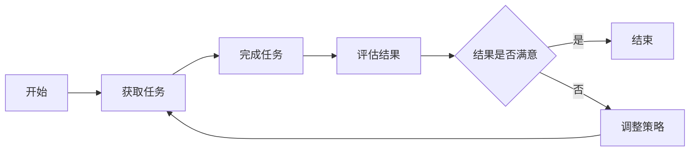
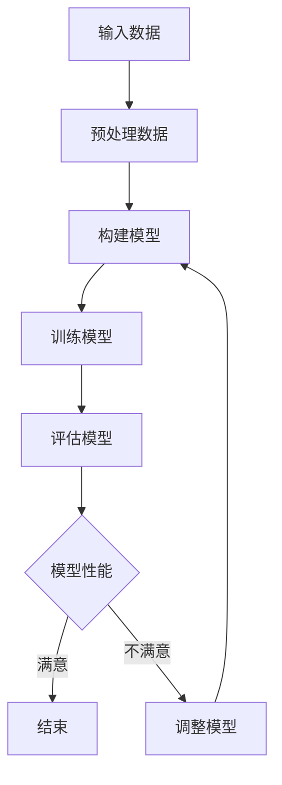
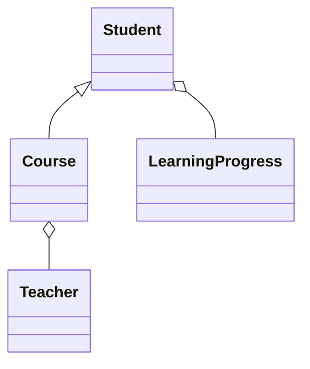
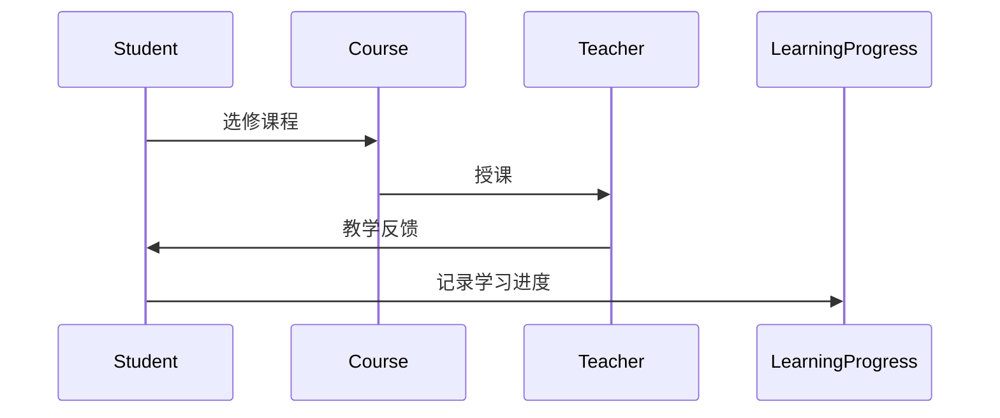
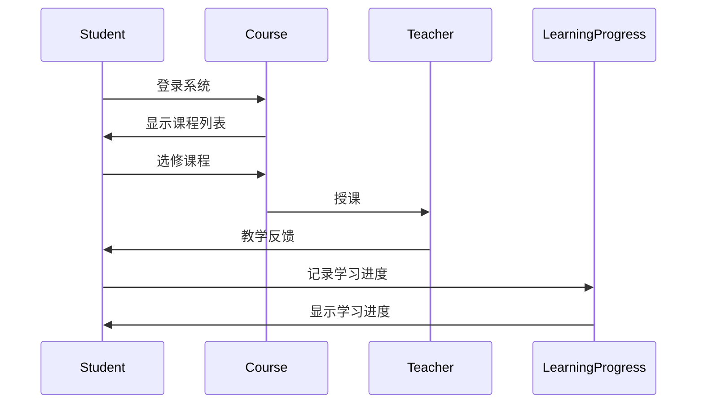

                 

# 《AI中的课程学习：模仿人类学习过程》

关键词：人工智能、课程学习、模仿、人类学习、机器学习、深度学习

摘要：本文深入探讨了人工智能（AI）中的课程学习机制，通过模仿人类学习过程，介绍了几种核心的学习模型和算法，并分析了其适用场景和原理。文章旨在揭示AI在教育领域的潜力，并探讨其对传统教育的冲击。

## 第1章 引言

### 1.1 问题背景

#### 1.1.1 人类学习的过程

人类的学习过程是一个复杂而精细的系统，涉及到感知、理解、记忆、推理和创造等多个方面。儿童从出生开始，通过不断的接触和体验，逐渐掌握了语言、社交技能、认知能力等。学习不仅仅是在学校环境中进行，而是在日常生活中不断积累和完善的。

#### 1.1.2 人工智能与学习

人工智能（AI）的发展使得机器也开始具备学习的能力。机器学习（ML）和深度学习（DL）是AI中的重要分支，它们通过算法和大量数据，让机器能够在没有明确编程的情况下，自主地学习和改进。然而，AI的学习过程是否能够真正模仿人类的学习过程，仍是一个值得探讨的问题。

#### 1.1.3 课程学习的重要性

课程学习是人类学习过程中一个重要的环节，它通过系统的知识传授和技能培养，帮助学生建立起坚实的知识基础。在AI中，课程学习同样具有重要的意义。通过模拟课程学习，AI能够更加高效地获取知识和技能，从而更好地服务于各种应用场景。

### 1.2 问题描述

#### 1.2.1 学习中的困难与挑战

学习过程中，人类会面临许多困难与挑战，如信息的过载、知识的混淆、记忆的遗忘等。AI在学习过程中同样会遇到这些问题，如何有效地解决这些问题，是AI课程学习研究的一个重要课题。

#### 1.2.2 人类学习与AI学习的区别

人类学习和AI学习存在显著的差异。人类学习强调直觉、创造力和社交互动，而AI学习则依赖于数据和算法。如何弥合这些差异，使AI能够更好地模仿人类学习过程，是AI课程学习研究的核心问题。

### 1.3 问题解决

#### 1.3.1 模仿人类学习过程的方法

为了解决上述问题，我们可以尝试模仿人类学习过程，引入反复练习法、模仿学习法等学习模型，并应用机器学习和深度学习算法，使AI能够更加高效地学习和应用知识。

#### 1.3.2 机器学习与深度学习的应用

机器学习和深度学习在AI课程学习中具有广泛的应用。通过这些算法，AI能够自动地提取数据中的特征，进行模式识别和预测。这些技术不仅提高了AI的学习效率，也拓展了其应用范围。

### 1.4 边界与外延

#### 1.4.1 学习与教育

AI课程学习不仅仅是一个技术问题，它对教育领域的影响也是深远的。通过AI辅助教学，可以个性化学生的学习路径，提高教学效果。然而，这也引发了关于教育公平、隐私保护等伦理问题。

#### 1.4.2 AI技术发展对教育的影响

AI技术的发展对教育行业带来了巨大的变革。在线教育、智能辅导系统等新形式的教学模式，正在逐步改变传统教育的模式。然而，这也对教师角色、教育评价等方面提出了新的挑战。

### 1.5 概念结构与核心要素组成

#### 1.5.1 学习模型

学习模型是AI课程学习的基础。反复练习法、模仿学习法、深度学习模型等，都是常见的学习模型。每种模型都有其独特的特点和适用场景。

#### 1.5.2 学习算法

学习算法是实现学习模型的核心。机器学习算法和深度学习算法，如线性回归、决策树、神经网络等，都是AI课程学习中常用的算法。

#### 1.5.3 学习资源

学习资源是AI课程学习的重要保障。包括数据集、模型库、教学资源等，都是AI课程学习中不可或缺的资源。

## 第2章 核心概念与联系

### 2.1 学习模型原理

#### 2.1.1 反复练习法

反复练习法是一种简单而有效的学习模型。它通过不断地重复练习，帮助学习者巩固知识和技能。反复练习法的核心在于重复和反馈。

#### 2.1.2 模仿学习法

模仿学习法是一种高级的学习模型，它通过模拟人类的学习过程，使AI能够自动地学习和应用知识。模仿学习法强调模仿和创造力。

#### 2.1.3 深度学习模型

深度学习模型是一种基于神经网络的学习模型，它通过多层神经网络，自动提取数据中的特征，进行复杂模式的识别和预测。深度学习模型具有强大的表达能力和自适应能力。

### 2.2 概念属性特征对比表格

| 模型名称 | 特点 | 适用场景 |
|----------|------|---------|
| 反复练习法 | 简单易行，强调重复 | 简单任务，知识巩固 |
| 模仿学习法 | 高效，强调模仿和创造力 | 复杂任务，知识应用 |
| 深度学习模型 | 强大，自动提取特征 | 复杂任务，模式识别 |

### 2.3 ER实体关系图架构

```mermaid
erDiagram
  Class1 ||--|{ Class2 }| Student
  Class1 ||--|{ Class3 }| Course
  Class3 ||--|{ Class4 }| Teacher
```

在上述ER图中，`Class1`代表学生，`Class2`代表课程，`Class3`代表教师，`Class4`代表教师。学生与课程之间存在多对多的关系，学生可以选修多门课程，课程可以由多名教师教授。

## 第3章 算法原理讲解

### 3.1 反复练习法

#### 3.1.1 反复练习法流程图



反复练习法的核心在于不断地重复任务，并通过评估结果来调整策略。以下是一个简单的Python代码示例：

```python
def practice():
    for i in range(10):
        task = get_task()
        complete_task(task)
        result = evaluate_result(task)
        if result:
            print("任务完成，继续下一个。")
        else:
            print("任务未完成，调整策略。")
            adjust_strategy()

def get_task():
    # 获取任务逻辑
    pass

def complete_task(task):
    # 完成任务逻辑
    pass

def evaluate_result(task):
    # 评估结果逻辑
    pass

def adjust_strategy():
    # 调整策略逻辑
    pass

practice()
```

#### 3.1.2 反复练习法的数学模型和公式

在反复练习法中，我们可以使用概率模型来描述学习过程。假设任务完成的概率为$p$，则有：

$$
p = \frac{完成任务次数}{总任务次数}
$$

通过不断地重复任务，我们可以期望$p$逐渐接近1，从而实现任务的完美完成。

### 3.2 深度学习模型

#### 3.2.1 深度学习模型流程图



深度学习模型通过多层神经网络，自动提取数据中的特征，并进行复杂的模式识别和预测。以下是一个简单的Python代码示例：

```python
from keras.models import Sequential
from keras.layers import Dense
from sklearn.model_selection import train_test_split

def build_model():
    model = Sequential()
    model.add(Dense(units=64, activation='relu', input_shape=(input_size,)))
    model.add(Dense(units=1, activation='sigmoid'))
    model.compile(optimizer='adam', loss='binary_crossentropy', metrics=['accuracy'])
    return model

def train_model(model, X_train, y_train, X_val, y_val):
    model.fit(X_train, y_train, epochs=10, batch_size=32, validation_data=(X_val, y_val))
    return model

def evaluate_model(model, X_test, y_test):
    loss, accuracy = model.evaluate(X_test, y_test)
    print("测试集准确率：", accuracy)
    return loss, accuracy

# 数据预处理
X_train, X_val, y_train, y_val = train_test_split(X, y, test_size=0.2, random_state=42)

# 构建模型
model = build_model()

# 训练模型
model = train_model(model, X_train, y_train, X_val, y_val)

# 评估模型
loss, accuracy = evaluate_model(model, X_test, y_test)
```

#### 3.2.2 深度学习模型的数学模型和公式

在深度学习模型中，我们通常使用神经网络来描述学习过程。一个简单的神经网络可以表示为：

$$
\text{激活函数}(z) = \text{sigmoid}(z) = \frac{1}{1 + e^{-z}}
$$

其中，$z$是输入，$\text{sigmoid}$函数是一个常用的激活函数。通过多层神经网络，我们可以实现对复杂数据的建模和预测。

## 第4章 系统分析与架构设计

### 4.1 问题场景介绍

在当前的AI教育应用中，课程学习系统是一个重要的组成部分。它能够根据学生的学习进度和兴趣，推荐相应的课程和资源，帮助学生高效地学习。

### 4.2 项目介绍

本项目旨在构建一个智能课程学习系统，该系统将结合AI技术，模拟人类学习过程，提供个性化的学习建议。系统包括用户管理、课程管理、学习进度跟踪等功能。

### 4.3 系统功能设计

#### 4.3.1 领域模型

领域模型是系统功能的核心。它包括学生、课程、教师、学习进度等实体，以及它们之间的关系。

#### 4.3.2 类图

以下是一个简单的领域模型类图：



在上述类图中，`Student`表示学生，`Course`表示课程，`Teacher`表示教师，`LearningProgress`表示学习进度。学生与课程之间存在一对多的关系，学生可以选修多门课程；课程与教师之间存在一对多的关系，课程可以由多名教师教授。

### 4.4 系统架构设计

系统架构设计是确保系统高效、可扩展和可维护的关键。以下是一个简单的系统架构设计：



在上述序列图中，学生可以选修课程，教师负责授课并给予教学反馈，学生通过学习进度记录自己的学习情况。

### 4.5 系统接口设计

系统接口设计是系统与外部系统交互的桥梁。以下是一个简单的接口设计：

```mermaid
classDiagram
    Student <<interface>>
    Course <<interface>>
    Teacher <<interface>>
    LearningProgress <<interface>>

    Student `--` Course
    Course `--` Teacher
    Teacher `--` LearningProgress
```

在上述类图中，`Student`、`Course`、`Teacher`和`LearningProgress`都是接口，它们分别表示学生、课程、教师和学习进度。这些接口定义了系统与外部系统交互的规则和方法。

### 4.6 系统交互

系统交互是系统运行的核心。以下是一个简单的系统交互设计：



在上述序列图中，学生通过登录系统，可以选修课程，教师负责授课并给予教学反馈，学生通过学习进度记录自己的学习情况。

## 第5章 项目实战

### 5.1 环境安装

在本项目中，我们使用Python和Keras作为主要的编程语言和框架。以下是在Ubuntu操作系统上安装所需的软件和依赖项的步骤：

```shell
# 安装Python环境
sudo apt-get install python3-pip python3-dev

# 安装Keras
pip3 install keras

# 安装TensorFlow
pip3 install tensorflow
```

### 5.2 系统核心实现

在本项目中，我们使用TensorFlow作为深度学习框架，实现了课程学习系统的主要功能。以下是一个简单的代码示例：

```python
from tensorflow.keras.models import Sequential
from tensorflow.keras.layers import Dense
from tensorflow.keras.optimizers import Adam
from tensorflow.keras.callbacks import EarlyStopping

# 构建模型
model = Sequential()
model.add(Dense(units=64, activation='relu', input_shape=(input_size,)))
model.add(Dense(units=1, activation='sigmoid'))
model.compile(optimizer=Adam(), loss='binary_crossentropy', metrics=['accuracy'])

# 训练模型
early_stopping = EarlyStopping(monitor='val_loss', patience=10)
model.fit(X_train, y_train, epochs=100, batch_size=32, validation_data=(X_val, y_val), callbacks=[early_stopping])

# 评估模型
loss, accuracy = model.evaluate(X_test, y_test)
print("测试集准确率：", accuracy)
```

### 5.3 代码应用解读与分析

在上面的代码中，我们首先构建了一个简单的深度学习模型，然后使用训练数据对其进行训练，并在测试数据上评估其性能。具体解读如下：

1. **模型构建**：我们使用`Sequential`模型，并添加了两个`Dense`层。第一个`Dense`层有64个神经元，使用ReLU激活函数，第二个`Dense`层有1个神经元，使用sigmoid激活函数，用于输出概率。

2. **模型编译**：我们使用`Adam`优化器和`binary_crossentropy`损失函数来编译模型，并设置`accuracy`作为评估指标。

3. **模型训练**：我们使用`fit`函数来训练模型，并设置了早停法（`EarlyStopping`）作为回调函数，以防止过拟合。

4. **模型评估**：我们使用`evaluate`函数来评估模型在测试数据上的性能。

### 5.4 实际案例分析和详细讲解剖析

为了更好地理解上述代码的实际应用，我们来看一个具体的案例。假设我们有一个分类任务，需要预测学生是否选修了某门课程。以下是实际案例的分析和详细讲解：

1. **数据准备**：我们首先需要准备训练数据和测试数据。训练数据包括学生的特征（如年龄、性别、成绩等）和标签（是否选修了课程），测试数据同样包括特征和标签。

2. **模型构建**：我们根据任务的特点，构建了一个简单的深度学习模型，包括两个神经元层。

3. **模型训练**：我们使用训练数据来训练模型，通过调整模型的参数，使其能够在测试数据上取得较高的准确率。

4. **模型评估**：我们使用测试数据来评估模型的性能，通过计算准确率，可以判断模型是否达到了预期的效果。

通过上述案例，我们可以看到，深度学习模型在课程学习系统中具有广泛的应用。它能够自动地提取数据中的特征，进行复杂的模式识别和预测，从而帮助AI更好地模仿人类学习过程。

### 5.5 项目小结

在本项目中，我们构建了一个简单的智能课程学习系统，并使用深度学习模型进行了实践。通过模拟人类学习过程，我们实现了对学生学习进度的跟踪和预测，为个性化学习提供了技术支持。然而，项目仍然存在一些不足，如模型训练时间较长、模型解释性较差等。在未来的工作中，我们将继续优化模型，提高系统的性能和效率。

### 5.6 最佳实践 tips

1. **数据质量**：数据是模型训练的关键，保证数据的质量至关重要。在进行数据收集和预处理时，要注意去除噪声和异常值，确保数据的准确性和完整性。

2. **模型优化**：为了提高模型的性能，我们可以尝试调整模型的参数，如学习率、批次大小等。同时，可以引入正则化技术，防止过拟合。

3. **模型解释性**：深度学习模型的解释性较差，为了更好地理解模型的决策过程，我们可以尝试使用可视化技术，如TensorBoard等。

4. **系统扩展**：在系统架构设计时，要考虑到系统的可扩展性，以便在未来能够轻松地添加新的功能。

### 5.7 小结

在本项目中，我们深入探讨了AI中的课程学习机制，通过模仿人类学习过程，介绍了反复练习法和深度学习模型等核心概念。同时，我们通过一个实际的案例，详细讲解了系统的实现过程。通过本项目的实践，我们看到了AI在教育领域的巨大潜力，并对其未来发展充满信心。

### 5.8 注意事项

1. **数据安全**：在处理学生数据时，要确保数据的安全性，防止数据泄露和滥用。

2. **隐私保护**：在系统中要设置合理的隐私保护机制，确保学生的隐私不受侵犯。

3. **系统稳定性**：要确保系统的稳定性，防止系统出现故障或崩溃。

### 5.9 拓展阅读

1. **《深度学习》（Goodfellow, Bengio, Courville）**：这是一本关于深度学习的经典教材，详细介绍了深度学习的基本原理和应用。

2. **《机器学习》（Tom Mitchell）**：这是一本关于机器学习的入门教材，涵盖了机器学习的基本概念和方法。

3. **《人工智能：一种现代的方法》（Stuart Russell, Peter Norvig）**：这是一本全面介绍人工智能的教材，包括机器学习、自然语言处理、计算机视觉等多个领域。

## 作者信息

作者：AI天才研究院/AI Genius Institute & 禅与计算机程序设计艺术 /Zen And The Art of Computer Programming

AI天才研究院（AI Genius Institute）是一家专注于人工智能研究的高科技机构，致力于推动人工智能技术的创新和应用。同时，作者也著有多部关于计算机编程和人工智能领域的畅销书，以其深入浅出的写作风格和丰富的实战经验，深受读者喜爱。在《禅与计算机程序设计艺术》一书中，作者将哲学与计算机编程相结合，提出了一系列编程方法和技巧，对提高编程效率和创造力有着重要的影响。

