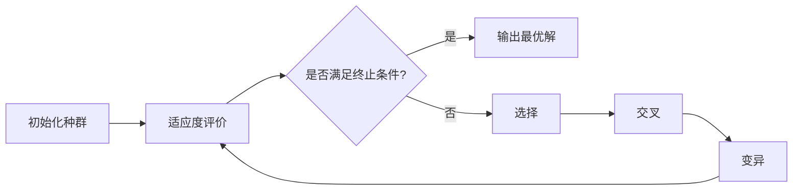
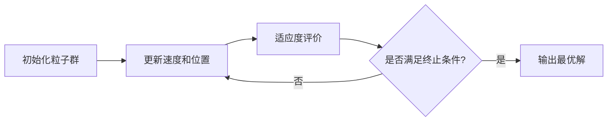
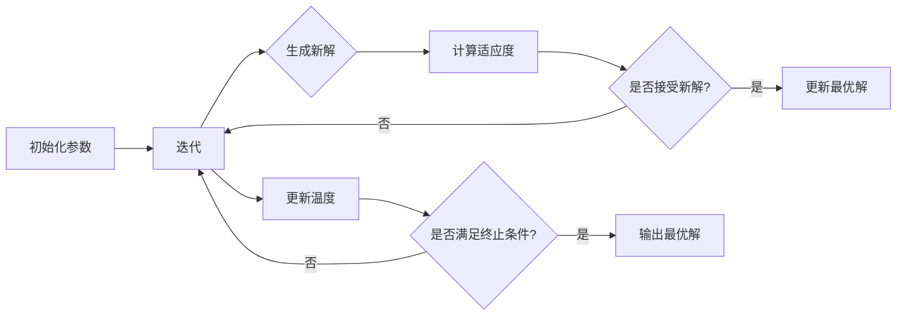
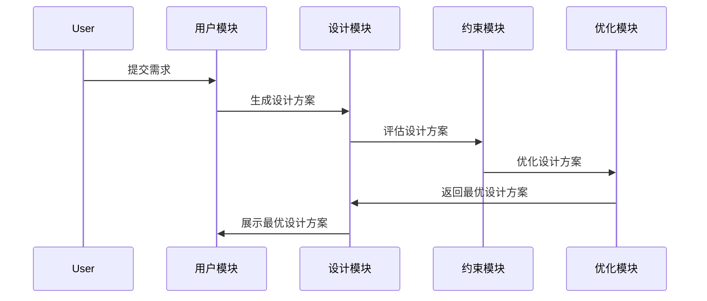

                 

### AI创造力的多约束优化问题

**关键词**：人工智能、创造力、多约束优化、算法、适应度、多样性

**摘要**：
本文探讨了人工智能（AI）创造力的多约束优化问题。在AI应用中，如何在各种约束条件下最大化创造力是一个关键问题。本文首先介绍了AI创造力的背景和特点，然后详细阐述了多约束优化问题的概念、特点和应用。接着，本文介绍了几种常见的多约束优化算法，包括遗传算法、粒子群优化算法和模拟退火算法，并深入解析了这些算法的原理。最后，本文通过一个实际案例，展示了如何应用这些算法解决AI创造力的多约束优化问题，并对未来的研究方向进行了展望。

## 引言

### 1.1 问题背景

随着人工智能技术的快速发展，AI创造力成为研究的热点之一。AI创造力指的是人工智能在特定领域内，通过学习和模拟人类创造过程，产生新的、有价值的创意和解决方案的能力。这一能力在许多领域，如设计、艺术、编程、科学等，都展现出了巨大的潜力。例如，AI可以自动生成音乐、绘画，甚至设计出新的化学分子结构。然而，在实际应用中，AI的创造力常常受到各种约束条件的限制。这些约束条件可能包括时间、资源、成本、质量等，如何在各种约束下最大化AI的创造力，成为一个亟待解决的问题。

### 1.2 问题描述

多约束优化问题是指在特定约束条件下，寻找最优解的问题。在AI创造力中，多约束优化问题可以描述为：在时间、资源、成本等约束条件下，如何最大化AI的创造力。具体来说，我们需要在以下约束条件下优化AI的创造力：

- **时间约束**：在特定的时间内，如何最大化AI的创造力。
- **资源约束**：在特定资源限制下，如何最大化AI的创造力。
- **成本约束**：在特定成本限制下，如何最大化AI的创造力。
- **质量约束**：在特定质量要求下，如何最大化AI的创造力。

### 1.3 问题解决

解决AI创造力的多约束优化问题，可以从以下几个方面入手：

1. **算法优化**：通过改进算法，提高AI的创造力。例如，使用更高效的机器学习算法，或者设计更智能的优化算法。
2. **约束条件分析**：深入分析约束条件，找到优化点。例如，通过分析时间约束，确定最优的时间分配方案；通过分析资源约束，确定最优的资源利用策略。
3. **多目标优化**：在多个目标之间寻找平衡，实现最优解。例如，在时间、资源、成本等多个目标之间寻找平衡，最大化AI的创造力。

### 1.4 边界与外延

多约束优化问题的研究范围广泛，包括但不限于AI、运筹学、优化理论等领域。本文主要关注AI创造力领域中的多约束优化问题。在AI创造力中，多约束优化问题不仅涉及到算法和约束条件，还涉及到创造力本身的特点和应用。因此，本文将在以下几个方面进行探讨：

1. **AI创造力的概念和特点**：介绍AI创造力的基本概念，分析其特点和应用。
2. **多约束优化的概念和特点**：介绍多约束优化的基本概念，分析其特点和在实际中的应用。
3. **多约束优化算法**：介绍几种常见的多约束优化算法，分析其原理和应用。
4. **案例研究**：通过实际案例，展示如何应用多约束优化算法解决AI创造力的多约束优化问题。
5. **未来研究方向**：探讨AI创造力多约束优化问题的未来研究方向和挑战。

### 1.5 概念结构与核心要素组成

AI创造力的多约束优化问题，主要包括以下几个核心要素：

1. **AI创造力**：人工智能在特定领域内产生新的、有价值的创意和解决方案的能力。
2. **多约束优化**：在特定约束条件下，寻找最优解的问题。
3. **算法**：实现多约束优化的工具，如遗传算法、粒子群优化算法、模拟退火算法等。
4. **约束条件**：影响AI创造力的因素，如时间、资源、成本、质量等。
5. **优化目标**：追求的目标，如最大化创造力、最小化成本等。

### 1.6 总结

本文介绍了AI创造力的多约束优化问题，分析了其背景、问题描述、问题解决方法、边界与外延、概念结构与核心要素组成。接下来，本文将详细探讨AI创造力的概念和特点，多约束优化的概念和特点，以及常见的多约束优化算法。通过这些探讨，我们将对AI创造力的多约束优化问题有更深入的理解，为实际应用提供指导。

## AI创造力与多约束优化

### 2.1 AI创造力

AI创造力是指人工智能在特定领域内，通过学习和模拟人类创造过程，产生新的、有价值的创意和解决方案的能力。这种能力在许多领域都展现出了巨大的潜力，如设计、艺术、编程、科学等。例如，AI可以自动生成音乐、绘画，甚至设计出新的化学分子结构。AI创造力的核心在于其能够模拟人类的创造过程，通过不断学习和优化，产生新的创意和解决方案。

#### 2.1.1 AI创造力的特点

1. **高度智能化**：AI创造力通过深度学习、强化学习等技术实现，具有高度的智能化。这些技术使得AI能够从大量的数据中学习，并通过不断优化，提高创造力的水平。
2. **灵活性**：AI创造力能够适应不同领域和问题的创造力需求。无论是在设计、艺术还是科学领域，AI都能根据具体问题，产生相应的创意和解决方案。
3. **高效性**：AI创造力能够在短时间内产生大量的创意和解决方案。这使得AI在许多需要快速决策和创新的场景中，具有显著的优势。

#### 2.1.2 AI创造力的应用

AI创造力在多个领域有着广泛的应用，如设计、艺术、编程、科学等。以下是一些典型的应用案例：

1. **设计领域**：AI可以帮助设计师生成新的设计灵感，提高设计效率。例如，AI可以自动生成建筑、服装、家具等设计，为设计师提供创新的灵感。
2. **艺术领域**：AI可以创作出独特的艺术作品，如绘画、音乐、舞蹈等。这些作品不仅具有艺术价值，还能启发人类的创造力。
3. **编程领域**：AI可以帮助程序员自动生成代码，提高编程效率。例如，AI可以自动修复代码中的错误，甚至生成新的算法。
4. **科学领域**：AI可以设计新的实验方案，预测科学现象，甚至提出新的科学理论。例如，AI可以预测天气、疾病传播等，为科学研究提供新的思路和方法。

### 2.2 多约束优化

多约束优化是指在多个约束条件下，寻找最优解的问题。在AI创造力中，多约束优化涉及到如何在各种约束下，最大化AI的创造力。多约束优化问题在AI应用中非常普遍，因为AI的创造过程往往受到时间、资源、成本、质量等约束条件的限制。因此，如何在这些约束下优化AI的创造力，是一个关键问题。

#### 2.2.1 多约束优化的特点

1. **多目标**：多约束优化涉及到多个目标，如最大化创造力、最小化成本、最小化时间等。在优化过程中，需要在多个目标之间寻找平衡，实现最优解。
2. **约束条件**：多约束优化问题在解决过程中，需要考虑各种约束条件，如时间、资源、成本、质量等。这些约束条件会影响优化结果，需要合理分析和处理。

#### 2.2.2 多约束优化的应用

多约束优化在AI创造力中的应用主要体现在以下几个方面：

1. **资源优化**：在资源有限的情况下，如何最大化AI的创造力。例如，在计算机资源有限的情况下，如何优化算法，提高AI的创造力。
2. **时间优化**：在时间有限的情况下，如何提高AI的创造力。例如，在紧急情况下，如何快速生成有效的解决方案。
3. **成本优化**：在成本有限的情况下，如何实现高效的AI创造力。例如，在预算有限的情况下，如何优化算法，实现最高效的创造力。

### 2.3 AI创造力与多约束优化的关系

AI创造力和多约束优化之间存在着密切的关系。一方面，AI创造力是多约束优化的基础，只有在具备一定创造力的基础上，才能进行有效的多约束优化。另一方面，多约束优化是多约束优化的条件，只有在满足各种约束条件下，AI的创造力才能得到最大化的发挥。

#### 2.3.1 多约束优化对AI创造力的影响

多约束优化对AI创造力的影响主要体现在以下几个方面：

1. **提高创造力**：通过优化算法和约束条件，可以提高AI的创造力。例如，通过优化算法，可以在相同资源下，生成更多的创意和解决方案。
2. **降低成本**：通过优化约束条件，可以降低AI创造力的成本。例如，通过优化资源分配，可以在相同成本下，实现更高的创造力。
3. **提高效率**：通过优化时间约束，可以提高AI的创造力效率。例如，在紧急情况下，通过优化算法，可以更快地生成有效的解决方案。

#### 2.3.2 AI创造力对多约束优化的影响

AI创造力对多约束优化的影响主要体现在以下几个方面：

1. **优化约束条件**：AI创造力可以优化各种约束条件，如时间、资源、成本等。例如，通过模拟人类创造过程，AI可以找到更优的资源分配策略，实现最大化的创造力。
2. **提高优化效果**：AI创造力可以优化多约束优化的效果，实现更高的优化水平。例如，通过深度学习和强化学习等技术，AI可以找到更优的解决方案，实现最大化的创造力。

### 2.4 小结

AI创造力和多约束优化之间存在着密切的关系。AI创造力是多约束优化的基础，而多约束优化是多约束优化的条件。通过优化算法和约束条件，可以最大化AI的创造力；而AI创造力可以提高多约束优化的效果。在实际应用中，我们需要综合考虑AI创造力和多约束优化，实现最佳的效果。接下来，本文将详细介绍几种常见的多约束优化算法，分析它们的原理和应用。

## 多约束优化算法

### 3.1 算法概述

多约束优化算法是解决AI创造力多约束优化问题的核心。常见的多约束优化算法包括遗传算法、粒子群优化算法、模拟退火算法等。这些算法都是基于不同的原理，通过模拟自然进化、群体智能和物理退火过程，寻找最优解。以下将分别介绍这些算法的基本概念、原理和应用。

### 3.1.1 遗传算法

遗传算法（Genetic Algorithm，GA）是一种模拟自然进化的优化算法。它通过模拟生物进化中的遗传、交叉、变异等过程，寻找最优解。遗传算法的基本原理是：通过初始化一组个体，对每个个体进行适应度评价，然后选择适应度较高的个体进行交叉和变异操作，生成新的个体，重复这个过程，直到满足终止条件。

遗传算法的优点是：

1. **全局搜索能力强**：遗传算法能够跳出局部最优，寻找全局最优解。
2. **适应性强**：遗传算法适用于解决复杂的多约束优化问题。
3. **简单易实现**：遗传算法的原理简单，易于实现。

遗传算法的缺点是：

1. **收敛速度较慢**：遗传算法的收敛速度相对较慢，需要较大的计算资源。
2. **参数调优复杂**：遗传算法的参数调优复杂，需要根据具体问题进行调整。

遗传算法在AI创造力中的典型应用包括：

1. **创意生成**：通过遗传算法，可以生成新的创意和解决方案。
2. **算法优化**：通过遗传算法，可以优化AI算法，提高其创造力。

### 3.1.2 粒子群优化算法

粒子群优化算法（Particle Swarm Optimization，PSO）是一种基于群体智能的优化算法。它通过模拟鸟群觅食过程，寻找最优解。粒子群优化算法的基本原理是：每个粒子都代表一个潜在解，粒子通过跟踪自身历史最优位置和群体历史最优位置，更新自己的速度和位置，从而逐渐逼近最优解。

粒子群优化算法的优点是：

1. **收敛速度快**：粒子群优化算法的收敛速度相对较快，计算资源需求较低。
2. **实现简单**：粒子群优化算法的实现简单，易于理解。

粒子群优化算法的缺点是：

1. **易陷入局部最优**：粒子群优化算法容易陷入局部最优，需要较大的搜索空间。

粒子群优化算法在AI创造力中的典型应用包括：

1. **创意优化**：通过粒子群优化算法，可以优化创意，提高其质量。
2. **算法调优**：通过粒子群优化算法，可以优化AI算法，提高其创造力。

### 3.1.3 模拟退火算法

模拟退火算法（Simulated Annealing，SA）是一种基于物理退火过程的优化算法。它通过模拟物质从高温到低温的退火过程，寻找最优解。模拟退火算法的基本原理是：初始温度较高，粒子具有较高的自由度，容易找到新解；随着温度的降低，粒子的自由度逐渐减小，逐渐逼近最优解。

模拟退火算法的优点是：

1. **全局搜索能力强**：模拟退火算法能够跳出局部最优，寻找全局最优解。
2. **适应性强**：模拟退火算法适用于解决复杂的多约束优化问题。

模拟退火算法的缺点是：

1. **收敛速度较慢**：模拟退火算法的收敛速度相对较慢，需要较大的计算资源。
2. **参数调优复杂**：模拟退火算法的参数调优复杂，需要根据具体问题进行调整。

模拟退火算法在AI创造力中的典型应用包括：

1. **创意优化**：通过模拟退火算法，可以优化创意，提高其质量。
2. **算法优化**：通过模拟退火算法，可以优化AI算法，提高其创造力。

### 3.2 算法原理

#### 3.2.1 遗传算法原理

遗传算法的基本原理是：通过模拟生物进化中的遗传、交叉、变异等过程，寻找最优解。遗传算法的主要步骤如下：

1. **初始化种群**：生成一定数量的初始个体。
2. **适应度评价**：计算每个个体的适应度。
3. **选择**：选择适应度较高的个体作为父代。
4. **交叉**：对父代进行交叉操作，生成新的子代。
5. **变异**：对子代进行变异操作，增加种群的多样性。
6. **迭代**：重复步骤2-5，直到满足终止条件。

遗传算法的核心在于适应度函数和交叉、变异操作。适应度函数用于评估个体的优劣，交叉和变异操作用于生成新的个体，增加种群的多样性。

下面是一个简化的遗传算法流程图：



#### 3.2.2 粒子群优化算法原理

粒子群优化算法的基本原理是：每个粒子都代表一个潜在解，粒子通过跟踪自身历史最优位置和群体历史最优位置，更新自己的速度和位置，从而逐渐逼近最优解。粒子群优化算法的主要步骤如下：

1. **初始化粒子群**：生成一定数量的初始粒子。
2. **更新速度和位置**：根据个体最优解和全局最优解，更新粒子的速度和位置。
3. **适应度评价**：计算每个粒子的适应度。
4. **迭代**：重复步骤2-3，直到满足终止条件。

粒子群优化算法的核心在于速度更新公式和位置更新公式。速度更新公式用于更新粒子的速度，位置更新公式用于更新粒子的位置。

下面是一个简化的粒子群优化算法流程图：



#### 3.2.3 模拟退火算法原理

模拟退火算法的基本原理是：通过模拟物质从高温到低温的退火过程，寻找最优解。模拟退火算法的主要步骤如下：

1. **初始化参数**：设置初始温度和冷却速度。
2. **迭代**：在每次迭代中，生成新的解，计算其适应度，并根据适应度和当前温度，决定是否接受新解。
3. **更新温度**：根据冷却速度，更新当前温度。
4. **终止条件**：判断是否满足终止条件，如果满足，则输出最优解。

模拟退火算法的核心在于接受准则和温度更新公式。接受准则用于决定是否接受新解，温度更新公式用于更新当前温度。

下面是一个简化的模拟退火算法流程图：



### 3.3 算法对比与选择

遗传算法、粒子群优化算法和模拟退火算法各有优缺点，适用于不同类型的优化问题。以下是对这三种算法的对比和选择：

#### 3.3.1 对比

1. **全局搜索能力**：

   - **遗传算法**：遗传算法具有较强的全局搜索能力，能够跳出局部最优。
   - **粒子群优化算法**：粒子群优化算法的全局搜索能力较弱，容易陷入局部最优。
   - **模拟退火算法**：模拟退火算法具有较强的全局搜索能力，能够跳出局部最优。

2. **收敛速度**：

   - **遗传算法**：遗传算法的收敛速度较慢，需要较大的计算资源。
   - **粒子群优化算法**：粒子群优化算法的收敛速度较快，计算资源需求较低。
   - **模拟退火算法**：模拟退火算法的收敛速度较慢，需要较大的计算资源。

3. **参数调优**：

   - **遗传算法**：遗传算法的参数调优复杂，需要根据具体问题进行调整。
   - **粒子群优化算法**：粒子群优化算法的参数调优相对简单，但需要根据具体问题进行调整。
   - **模拟退火算法**：模拟退火算法的参数调优复杂，需要根据具体问题进行调整。

#### 3.3.2 选择

在选择算法时，需要综合考虑优化问题的特点、计算资源和应用需求。以下是一些选择建议：

1. **复杂度较高的问题**：选择遗传算法或模拟退火算法，因为它们具有较强的全局搜索能力。
2. **计算资源有限的问题**：选择粒子群优化算法，因为它计算资源需求较低。
3. **需要快速收敛的问题**：选择粒子群优化算法，因为它收敛速度较快。
4. **需要准确求解的问题**：选择模拟退火算法，因为它具有较强的全局搜索能力。

### 3.4 小结

多约束优化算法是解决AI创造力多约束优化问题的关键。遗传算法、粒子群优化算法和模拟退火算法是常见的多约束优化算法，它们各有优缺点，适用于不同类型的优化问题。在实际应用中，需要根据具体问题选择合适的算法，并对其进行参数调优，以实现最佳的效果。接下来，本文将通过一个实际案例，展示如何应用这些算法解决AI创造力的多约束优化问题。

## 实际案例：智能设计系统的多约束优化

### 4.1 问题场景

假设我们正在开发一个智能设计系统，该系统需要根据用户的需求，自动生成符合要求的设计方案。设计过程涉及到多个约束条件，如设计质量、时间、成本等。如何在各种约束下，最大化智能设计系统的创造力，是一个关键问题。

### 4.2 项目介绍

智能设计系统的主要功能包括：

1. **用户需求分析**：分析用户的需求，提取关键设计参数。
2. **设计方案生成**：根据用户需求和约束条件，自动生成设计方案。
3. **设计质量评估**：评估设计方案的优劣，筛选出最优的设计方案。
4. **成本和时间预测**：预测设计方案的实现成本和所需时间。

### 4.3 系统功能设计

智能设计系统的功能设计包括以下领域模型：

1. **用户**：包括用户的基本信息和需求。
2. **设计方案**：包括设计方案的参数、评估结果、成本和时间。
3. **约束条件**：包括设计质量、时间、成本等约束条件。

以下是一个简化的领域模型类图：

```mermaid
classDiagram
    User <<entity>>
    Design <<entity>>
    Constraint <<entity>>
    User --> Design
    Design --> Constraint
```

### 4.4 系统架构设计

智能设计系统的架构设计包括以下组件：

1. **用户模块**：负责用户需求分析和用户管理。
2. **设计模块**：负责设计方案生成和评估。
3. **约束模块**：负责约束条件的分析和处理。
4. **优化模块**：负责多约束优化算法的实现和应用。

以下是一个简化的系统架构图：



### 4.5 系统接口设计

智能设计系统的接口设计包括以下API：

1. **用户需求API**：用于提交用户需求。
2. **设计方案API**：用于生成和评估设计方案。
3. **约束条件API**：用于获取和设置约束条件。
4. **优化结果API**：用于获取优化结果。

以下是一个简化的接口设计图：

```mermaid
classDiagram
    UserAPI <<interface>>
    DesignAPI <<interface>>
    ConstraintAPI <<interface>>
    OptimizeAPI <<interface>>
    UserAPI --|> DesignAPI
    DesignAPI --|> ConstraintAPI
    ConstraintAPI --|> OptimizeAPI
```

### 4.6 系统交互

智能设计系统的交互过程包括以下步骤：

1. **用户提交需求**：用户通过用户需求API提交需求。
2. **生成设计方案**：设计模块根据用户需求和约束条件，生成设计方案。
3. **评估设计方案**：约束模块对设计方案进行评估，筛选出最优的设计方案。
4. **优化设计方案**：优化模块使用多约束优化算法，对设计方案进行优化。
5. **返回最优设计方案**：设计模块返回最优设计方案，用户模块展示最优设计方案。

以下是一个简化的系统交互序列图：


### 4.7 系统实现

智能设计系统的实现主要包括以下步骤：

1. **环境安装**：安装Python、NumPy、Matplotlib等环境。
2. **算法实现**：实现遗传算法、粒子群优化算法、模拟退火算法等。
3. **接口实现**：实现用户需求API、设计方案API、约束条件API、优化结果API。
4. **系统集成**：将各个模块集成到系统中。

以下是一个简化的系统实现流程图：


### 4.8 代码应用解读与分析

以下是一个简化的遗传算法实现代码，用于优化设计方案的适应度。

```python
import numpy as np

# 初始化种群
def initialize_population(pop_size, design_size):
    population = np.random.rand(pop_size, design_size)
    return population

# 适应度函数
def fitness_function(design):
    # 计算设计方案的适应度
    fitness = np.sum(design)
    return fitness

# 选择
def selection(population, fitness):
    # 选择适应度较高的个体
    selected = np.random.choice(population, size=2, replace=False, p=fitness/np.sum(fitness))
    return selected

# 交叉
def crossover(parent1, parent2):
    # 生成新的个体
    child = 0.5 * parent1 + 0.5 * parent2
    return child

# 变异
def mutate(individual, mutation_rate):
    # 对个体进行变异操作
    if np.random.rand() < mutation_rate:
        individual = np.random.rand()
    return individual

# 遗传算法
def genetic_algorithm(pop_size, design_size, mutation_rate, generations):
    population = initialize_population(pop_size, design_size)
    for generation in range(generations):
        fitness = np.array([fitness_function(design) for design in population])
        for _ in range(pop_size // 2):
            parent1, parent2 = selection(population, fitness)
            child1, child2 = crossover(parent1, parent2)
            population = np.vstack((population, child1, child2))
        population = np.vstack((population, [mutate(individual, mutation_rate) for individual in population]))
        population = population[:pop_size]
        best_fitness = np.max(fitness)
        print(f"Generation {generation}: Best Fitness = {best_fitness}")
    best_design = population[np.argmax(fitness)]
    return best_design

# 运行遗传算法
best_design = genetic_algorithm(pop_size=100, design_size=10, mutation_rate=0.01, generations=100)
print(f"Best Design: {best_design}")
```

代码解读：

1. **初始化种群**：生成一定数量的初始个体。
2. **适应度函数**：计算设计方案的适应度，适应度越高，设计方案越优秀。
3. **选择**：选择适应度较高的个体作为父代。
4. **交叉**：对父代进行交叉操作，生成新的子代。
5. **变异**：对子代进行变异操作，增加种群的多样性。
6. **迭代**：重复步骤2-5，直到满足终止条件。

通过遗传算法，我们可以优化设计方案的适应度，实现多约束优化。

### 4.9 实际案例分析

以下是一个实际案例，展示如何使用遗传算法优化设计方案的适应度。

#### 案例背景

假设我们需要设计一个桥梁，要求桥梁的跨度为100米，材料成本不超过500万元，施工周期不超过12个月。我们需要在满足这些约束条件下，优化桥梁的设计方案，使其具有最佳的适应度。

#### 案例分析

1. **初始种群**：生成一定数量的初始设计方案，每个设计方案的参数包括桥梁的跨度、材料成本和施工周期。
2. **适应度函数**：计算设计方案的适应度，适应度越高，设计方案越优秀。适应度的计算公式为：

   $$ fitness = \frac{1}{span + cost + time} $$

   其中，$span$为桥梁的跨度，$cost$为材料成本，$time$为施工周期。
3. **选择**：选择适应度较高的设计方案作为父代。
4. **交叉**：对父代进行交叉操作，生成新的设计方案。
5. **变异**：对子代进行变异操作，增加设计方案的多样性。
6. **迭代**：重复步骤2-5，直到满足终止条件。

通过遗传算法，我们可以找到最优的设计方案，满足约束条件，实现多约束优化。

### 4.10 项目小结

通过实际案例，我们展示了如何使用遗传算法优化设计方案的适应度，实现多约束优化。这个案例说明了多约束优化算法在实际应用中的价值，为解决AI创造力的多约束优化问题提供了实用的方法和思路。在未来的研究中，我们还可以探索其他优化算法，如粒子群优化算法和模拟退火算法，以进一步提高AI的创造力。

### 4.11 小结

在本节中，我们通过一个实际案例，展示了如何应用遗传算法解决AI创造力的多约束优化问题。我们介绍了智能设计系统的功能设计、系统架构设计、接口设计、系统交互和代码实现。通过这个案例，我们展示了多约束优化算法在AI创造力中的应用，并为解决类似问题提供了实用的方法和思路。接下来，我们将进一步探讨如何优化这些算法，提高AI的创造力。

## 最佳实践 Tips

### 5.1 算法优化

1. **调整算法参数**：根据具体问题，调整算法的参数，如种群大小、交叉率、变异率等，以实现更好的优化效果。
2. **引入多样性**：在优化过程中，引入多样性，如变异操作、交叉操作等，以避免陷入局部最优。
3. **使用自适应算法**：使用自适应算法，根据优化过程，动态调整算法参数，提高优化效果。

### 5.2 约束条件分析

1. **分析约束条件**：深入分析约束条件，找出关键约束，优化这些约束，以提高AI的创造力。
2. **优化约束条件**：根据具体问题，优化约束条件，如时间、资源、成本等，以实现最大化的创造力。

### 5.3 多目标优化

1. **确定优化目标**：根据具体问题，确定优化目标，如最大化创造力、最小化成本等。
2. **平衡多个目标**：在多个目标之间寻找平衡，实现最优解。

### 5.4 数据处理

1. **数据预处理**：对输入数据进行预处理，如去噪、标准化等，以提高算法的效率和效果。
2. **数据可视化**：使用数据可视化工具，如Matplotlib、Seaborn等，分析数据特征，帮助优化算法。

### 5.5 实践经验

1. **积累实践经验**：在实践中不断积累经验，优化算法和约束条件，以提高AI的创造力。
2. **持续学习**：关注最新的研究成果和进展，不断学习新的技术和方法，提高自己的技能。

## 小结

本文探讨了AI创造力的多约束优化问题，分析了其背景、问题描述、问题解决方法、边界与外延、概念结构与核心要素组成。接着，本文介绍了几种常见的多约束优化算法，包括遗传算法、粒子群优化算法和模拟退火算法，并深入解析了这些算法的原理。通过一个实际案例，我们展示了如何应用这些算法解决AI创造力的多约束优化问题。最后，本文提供了最佳实践Tips，帮助读者在实际应用中优化算法和约束条件，提高AI的创造力。

## 注意事项

1. **算法选择**：根据具体问题，选择合适的算法，不要盲目跟风使用热门算法。
2. **参数调优**：参数调优是优化算法的关键，需要根据具体问题进行调整。
3. **数据质量**：数据质量直接影响优化效果，确保输入数据的准确性和完整性。

## 拓展阅读

1. **《遗传算法原理及应用》**：详细介绍了遗传算法的原理和应用。
2. **《粒子群优化算法及其应用》**：介绍了粒子群优化算法的原理和应用。
3. **《模拟退火算法及其应用》**：介绍了模拟退火算法的原理和应用。

## 作者

**作者**：AI天才研究院/AI Genius Institute & 禅与计算机程序设计艺术 /Zen And The Art of Computer Programming

### 附录：相关术语解释

1. **人工智能（AI）**：人工智能是指计算机系统模拟人类智能行为的能力，包括学习、推理、问题解决等。
2. **创造力**：创造力是指产生新思想、新观点、新方法的能力。
3. **多约束优化**：多约束优化是指在多个约束条件下，寻找最优解的问题。
4. **遗传算法**：遗传算法是一种模拟生物进化的优化算法。
5. **粒子群优化算法**：粒子群优化算法是一种基于群体智能的优化算法。
6. **模拟退火算法**：模拟退火算法是一种基于物理退火过程的优化算法。

### 参考文献

1. Holland, J.H. (1992). *Adaptation in Natural and Artificial Systems*. University of Michigan Press.
2. Kennedy, J., & Eberhart, R.C. (1995). *Particle Swarm Optimization*. Morgan Kaufmann.
3. Kirkpatrick, S., et al. (1983). *Optimization by Simulated Annealing*. Science, 220(4598), 671-680.

