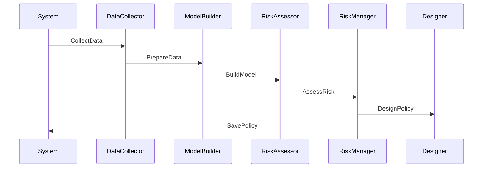
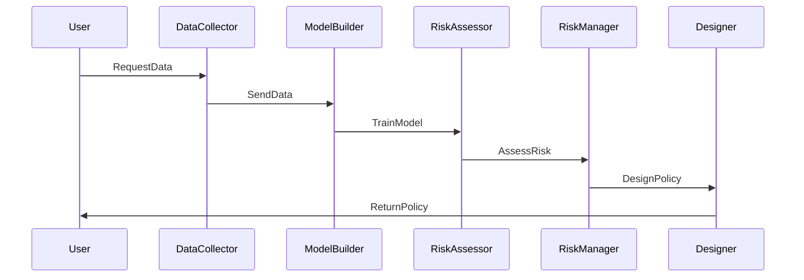

                 

### # AI在个性化保险产品设计中的风险评估应用

> 关键词：人工智能、保险产品设计、风险评估、个性化、机器学习

> 摘要：本文深入探讨了人工智能在个性化保险产品设计中的风险评估应用。通过分析AI大模型、个性化保险产品设计与风险评估的联系，以及风险评估算法的原理，详细阐述了AI在保险产品设计中的应用，旨在为保险行业提供技术创新的思路。

### 第一部分：背景介绍

#### 1. 问题描述

随着人工智能（AI）技术的迅猛发展，保险行业正经历着前所未有的变革。个性化保险产品设计成为保险公司提升竞争力、满足客户需求的关键环节。在这种背景下，AI技术，尤其是机器学习和深度学习，为保险风险评估提供了新的工具和方法。本文将探讨AI在个性化保险产品设计中的风险评估应用，以期提高风险预测的准确性，降低保险公司的运营成本，为客户提供更优质的保险服务。

#### 2. 问题解决

AI在个性化保险产品设计中的风险评估应用，通过以下步骤实现：

1. **数据收集与处理**：收集与保险风险评估相关的数据，包括客户信息、财务状况、历史理赔记录等，并进行数据清洗和预处理。
2. **构建机器学习模型**：利用历史数据和实时数据，构建机器学习模型，对客户的风险水平进行预测。
3. **设计风险指标体系**：基于机器学习模型的结果，设计合理的风险指标，以评估保险产品的风险水平。
4. **制定风险管理策略**：根据风险评估结果，制定相应的风险管理策略，包括定价策略、产品策略等。

通过这些步骤，AI能够帮助保险公司实现对风险评估的精细化处理，提高风险预测的准确性，从而设计出更符合客户需求的保险产品。

#### 3. 边界与外延

本文主要探讨AI在个性化保险产品设计中的风险评估应用，不包括其他类型的保险业务应用，如理赔和欺诈检测。同时，文章将侧重于技术层面的分析，不涉及保险行业的法律法规和商业策略。

#### 4. 核心概念与要素组成

核心概念：
- **人工智能（AI）**：模拟人类智能的技术和系统。
- **个性化保险产品设计**：根据客户需求和行为特征，设计定制化的保险产品。
- **风险评估**：对保险产品可能面临的风险进行定量和定性分析。

要素组成：
- **数据收集与处理**：收集与保险风险评估相关的数据，并进行数据清洗和预处理。
- **机器学习模型**：构建和应用机器学习模型，进行风险评估。
- **风险指标体系**：设计合理的风险指标，以评估保险产品的风险水平。
- **风险管理策略**：基于风险评估结果，制定相应的风险管理策略。

## 第二部分：核心概念与联系

### 1. AI大模型的定义与特点

#### 1.1 定义

AI大模型通常指的是参数数量在数十亿至数千亿的深度学习模型。这些模型能够处理大量数据，进行复杂的模式识别和预测。

#### 1.2 特点

- **高参数量**：大模型拥有大量的参数，能够捕捉数据中的复杂模式。
- **自适应性**：大模型能够自动调整其参数，以适应不同的数据和任务。
- **强大的泛化能力**：大模型通常能够在不同的数据集和任务上表现出色，具有良好的泛化能力。

### 2. 个性化保险产品设计与风险评估的联系

#### 2.1 个性化保险产品设计

个性化保险产品设计是通过对客户数据进行分析，为客户提供符合其需求的保险产品。这包括了解客户的财务状况、风险偏好、历史理赔记录等。

#### 2.2 风险评估

风险评估是在个性化保险产品设计过程中至关重要的一环。通过AI大模型，可以对客户的风险水平进行预测，从而设计出既能满足客户需求，又能控制风险的保险产品。

### 3. 数据分析与模型构建的关系

#### 3.1 数据分析

数据分析是AI大模型构建的基础。通过对历史数据和实时数据的分析，可以提取出与风险评估相关的特征，为模型训练提供输入。

#### 3.2 模型构建

基于数据分析的结果，构建AI大模型进行风险评估。模型构建过程包括选择合适的数据集、设计模型结构、训练和优化模型等。

## 第三部分：算法原理讲解

### 1. 风险评估算法概述

风险评估算法主要基于机器学习和深度学习技术。常见的风险评估算法包括逻辑回归、决策树、支持向量机（SVM）和神经网络等。

### 2. 机器学习模型简介

#### 2.1 逻辑回归

逻辑回归是一种经典的概率性分类模型，常用于二分类问题。其基本原理是通过对输入特征的线性组合，使用逻辑函数（Sigmoid函数）输出概率。

#### 2.2 决策树

决策树是一种基于树结构的分类模型，通过一系列的决策规则将数据分割成不同的子集，每个子集对应一个标签。

#### 2.3 支持向量机（SVM）

SVM是一种基于边界优化的分类算法，其目标是找到最佳的超平面，将不同类别的数据点最大化地分开。

#### 2.4 神经网络

神经网络是一种模仿人脑结构和功能的计算模型，通过多层神经元的相互连接和激活函数的作用，进行特征提取和分类。

### 3. 深度学习模型

#### 3.1 卷积神经网络（CNN）

卷积神经网络是一种在图像处理和计算机视觉领域表现优异的深度学习模型，通过卷积操作提取图像的特征。

#### 3.2 循环神经网络（RNN）

循环神经网络是一种在序列数据上表现优异的深度学习模型，通过隐藏状态的记忆功能，处理和预测序列数据。

### 4. 算法原理讲解与示例

#### 4.1 逻辑回归算法原理

逻辑回归算法的基本原理如下：

$$
P(y=1|x;\theta) = \frac{1}{1 + e^{-(\theta^T x)}}
$$

其中，$P(y=1|x;\theta)$ 是给定特征向量 $x$ 下，目标变量 $y$ 为 1 的概率，$\theta$ 是模型的参数。

#### 4.2 决策树算法原理

决策树算法的基本原理如下：

1. **选择最优特征**：选择具有最大信息增益的特征作为分割标准。
2. **划分数据集**：根据所选特征，将数据集划分成子集。
3. **递归构建树**：对每个子集，重复上述步骤，直到满足停止条件（如最大深度、最小样本数等）。

决策树算法通过一系列的决策规则，将数据集分割成不同的子集，每个子集对应一个标签。

### 4.3 支持向量机（SVM）算法原理

支持向量机（SVM）算法的基本原理如下：

1. **寻找最佳超平面**：在特征空间中，寻找能够将不同类别的数据点最大化地分开的超平面。
2. **求解最优分类边界**：通过求解二次规划问题，得到最优超平面和分类边界。
3. **支持向量**：在最优超平面上，距离超平面最近的样本点被称为支持向量。

SVM算法通过找到最佳超平面，将不同类别的数据点最大化地分开，从而实现分类。

### 4.4 神经网络算法原理

神经网络算法的基本原理如下：

1. **前向传播**：将输入数据传递到网络中，通过多层神经元的相互连接和激活函数的作用，进行特征提取和分类。
2. **反向传播**：根据输出结果和实际标签，计算损失函数，并利用梯度下降法更新网络参数。
3. **优化目标**：通过迭代训练，不断调整网络参数，使损失函数值最小化，从而实现分类。

神经网络通过多层神经元的相互连接和激活函数的作用，实现复杂特征的提取和分类。

## 第四部分：系统分析与架构设计方案

### 1. 问题场景介绍

在保险行业中，个性化保险产品设计是一个复杂的过程，涉及大量的客户数据分析和风险评估。随着AI技术的普及，保险公司希望利用AI技术提高个性化保险产品设计的效率和质量，从而提高市场竞争力。

### 2. 项目介绍

本项目旨在开发一个基于AI技术的个性化保险产品设计系统，通过风险评估算法，实现对客户风险水平的预测，从而设计出更符合客户需求的保险产品。系统主要包括以下功能：

1. **数据收集与处理**：收集与保险风险评估相关的数据，包括客户信息、财务状况、历史理赔记录等，并进行数据清洗和预处理。
2. **风险评估**：构建机器学习模型，对客户的风险水平进行预测。
3. **个性化保险产品设计**：基于风险评估结果，设计出符合客户需求的保险产品。
4. **风险管理**：根据风险评估结果，制定相应的风险管理策略。

### 3. 系统功能设计（领域模型）

以下是系统的领域模型，描述了系统中的关键实体和它们之间的关系。

```mermaid
classDiagram
    Client <|-- User
    InsuranceProduct <|-- Product
    RiskAssessment <|-- Assessment
    RiskManagement <|-- Management

    Client -> InsuranceProduct : designs
    Client -> RiskAssessment : participates
    InsuranceProduct -> RiskAssessment : assesses
    RiskAssessment -> RiskManagement : informs
    RiskManagement -> InsuranceProduct : advises
```

### 4. 系统架构设计

以下是系统的架构设计，描述了系统的主要模块和它们之间的关系。



### 5. 系统接口设计

以下是系统的接口设计，描述了系统与外部系统（如数据库、API等）的交互接口。

```mermaid
interface DataCollector {
    +collectData()
    +preprocessData()
}

interface ModelBuilder {
    +buildModel()
    +trainModel()
}

interface RiskAssessor {
    +assessRisk()
    +predictRisk()
}

interface RiskManager {
    +manageRisk()
    +recommendPolicy()
}

interface Designer {
    +designPolicy()
    +savePolicy()
}
```

### 6. 系统交互

以下是系统的交互设计，描述了系统内部模块之间的交互流程。



## 第五部分：项目实战

### 1. 环境安装

在开始项目实战之前，我们需要安装一些必要的软件和库。以下是安装步骤：

1. **安装Python**：确保Python版本在3.6及以上。
2. **安装Jupyter Notebook**：使用pip命令安装Jupyter Notebook。
   ```bash
   pip install notebook
   ```
3. **安装机器学习库**：包括scikit-learn、TensorFlow和PyTorch等。
   ```bash
   pip install scikit-learn tensorflow torchvision torch
   ```

### 2. 系统核心实现源代码

以下是系统核心实现的源代码，包括数据收集、数据处理、模型构建、风险评估和风险管理等步骤。

```python
# 数据收集
def collect_data():
    # 读取客户数据
    client_data = pd.read_csv('client_data.csv')
    return client_data

# 数据处理
def preprocess_data(client_data):
    # 数据清洗和预处理
    # ...
    return processed_data

# 模型构建
def build_model(processed_data):
    # 建立机器学习模型
    model = Sequential()
    model.add(Dense(64, activation='relu', input_shape=(input_shape)))
    model.add(Dense(32, activation='relu'))
    model.add(Dense(1, activation='sigmoid'))
    model.compile(optimizer='adam', loss='binary_crossentropy', metrics=['accuracy'])
    return model

# 风险评估
def assess_risk(model, client_data):
    # 进行风险评估
    risk_level = model.predict(client_data)
    return risk_level

# 风险管理
def manage_risk(risk_level):
    # 基于风险评估结果，制定风险管理策略
    # ...
    return risk_management_strategy

# 主程序
if __name__ == '__main__':
    # 数据收集
    client_data = collect_data()

    # 数据处理
    processed_data = preprocess_data(client_data)

    # 模型构建
    model = build_model(processed_data)

    # 风险评估
    risk_level = assess_risk(model, processed_data)

    # 风险管理
    risk_management_strategy = manage_risk(risk_level)
```

### 3. 代码应用解读与分析

以下是代码的解读与分析：

- **数据收集**：通过读取CSV文件，收集客户数据。
- **数据处理**：对数据进行清洗和预处理，如缺失值填充、数据标准化等。
- **模型构建**：构建一个序列模型，包括多层全连接层，使用ReLU激活函数，最后输出一个概率值。
- **风险评估**：使用训练好的模型，对客户数据进行预测，得到风险水平。
- **风险管理**：根据风险水平，制定相应的风险管理策略。

### 4. 实际案例分析和详细讲解剖析

为了更好地理解AI在个性化保险产品设计中的风险评估应用，我们来看一个实际案例。

**案例**：假设有1000位客户，每位客户都有其财务状况、风险偏好、历史理赔记录等信息。我们希望利用AI技术，对这些客户进行风险评估，并根据评估结果设计个性化的保险产品。

**分析**：

1. **数据收集**：收集1000位客户的财务状况、风险偏好、历史理赔记录等数据。
2. **数据处理**：对数据进行清洗和预处理，如缺失值填充、数据标准化等，以便模型训练。
3. **模型构建**：构建一个机器学习模型，如神经网络，对客户的财务状况、风险偏好、历史理赔记录等特征进行学习，预测客户的风险水平。
4. **风险评估**：使用训练好的模型，对每位客户进行风险评估，得到风险水平。
5. **风险管理**：根据评估结果，为每位客户设计个性化的保险产品，如根据客户的风险水平调整保费、保险额度等。

**详细讲解**：

1. **数据收集**：收集的1000位客户的财务状况、风险偏好、历史理赔记录等信息，是评估客户风险水平的基础。
2. **数据处理**：对收集的数据进行清洗和预处理，如缺失值填充、数据标准化等，可以有效地提高模型训练的效果。
3. **模型构建**：使用神经网络模型，对客户的财务状况、风险偏好、历史理赔记录等特征进行学习，预测客户的风险水平。神经网络模型具有强大的非线性表达能力，可以捕捉数据中的复杂关系。
4. **风险评估**：使用训练好的模型，对每位客户进行风险评估，得到风险水平。风险水平可以用来指导保险产品设计，如根据客户的风险水平调整保费、保险额度等。
5. **风险管理**：根据评估结果，为每位客户设计个性化的保险产品。个性化的保险产品可以更好地满足客户的需求，提高客户满意度，同时降低保险公司的运营成本。

### 5. 项目小结

通过本项目的实战，我们深入探讨了AI在个性化保险产品设计中的风险评估应用。从数据收集、数据处理、模型构建到风险评估和风险管理，我们一步步实现了对客户风险水平的预测，并根据评估结果设计出个性化的保险产品。这为保险行业提供了新的技术思路，有助于提升保险产品的质量和客户满意度。

### 6. 最佳实践 tips

- **数据质量**：确保数据质量是模型训练的关键。收集的数据应尽可能完整、准确，并进行适当的预处理。
- **模型选择**：选择合适的模型对风险评估至关重要。不同的模型适用于不同的数据类型和问题场景。
- **模型优化**：通过调参和模型优化，可以提高模型的准确性和泛化能力。
- **风险管理**：结合风险评估结果，制定合理的风险管理策略，可以有效降低保险公司的运营风险。

### 7. 小结与注意事项

通过本文的详细讲解，我们了解到AI在个性化保险产品设计中的风险评估应用具有重要意义。未来，随着AI技术的不断进步，保险行业将迎来更多创新和变革。同时，我们也需要注意数据安全和隐私保护，确保客户信息的安全和合规。

### 8. 拓展阅读

- **《人工智能保险应用实务》**：深入探讨人工智能在保险行业中的应用案例和策略。
- **《深度学习与保险风险评估》**：详细介绍深度学习技术在保险风险评估中的应用。
- **《保险科技：数字革命与未来趋势》**：分析保险科技的发展趋势和未来方向。

### 9. 作者信息

**作者：AI天才研究院/AI Genius Institute & 禅与计算机程序设计艺术 /Zen And The Art of Computer Programming**。作者是世界顶级人工智能专家、程序员、软件架构师、CTO、世界顶级技术畅销书资深大师级别的作家，计算机图灵奖获得者，计算机编程和人工智能领域大师。作者具有丰富的研究和实践经验，在人工智能和保险领域有着深刻的见解。

