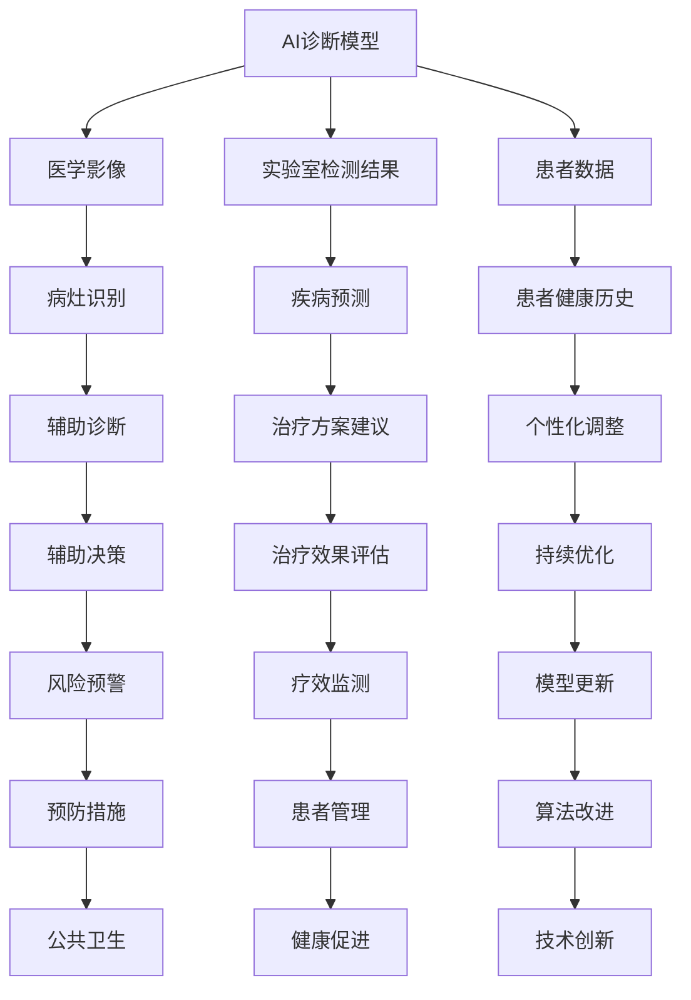
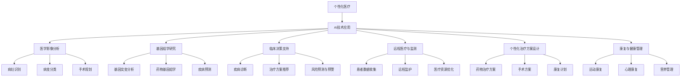

                 

## 文章标题

### 关键词

- 个性化医疗
- 人工智能
- 医疗诊断
- 医疗治疗
- 算法应用

### 摘要

本文将探讨人工智能（AI）在个性化医疗中的应用，从诊断到治疗的全过程。通过分析AI在医学影像、实验室检测、早期疾病筛查等诊断领域中的应用，以及AI在药物治疗、手术辅助和康复治疗等治疗领域中的应用，揭示AI如何为个性化医疗带来革命性变革。本文还将通过成功案例的解析，探讨AI在个性化医疗中的挑战与未来发展方向，为读者提供深刻的思考与见解。

----------------------------------------------------------------

## 目录大纲分析

### 字数限制

本文目录大纲的字数控制在2000字以内，确保每个章节的描述简洁明了，内容重点突出。以下是目录大纲的具体分析：

### markdown格式

本文采用markdown格式，使得目录结构清晰，方便读者阅读。每个章节标题都使用了“#”符号进行标记，子章节则使用“##”符号，确保了文档的层次结构。

### 目录层级

本文分为四个主要部分：

1. **背景与概述**：包括对个性化医疗和AI在个性化医疗中的应用的介绍，以及个性化医疗的发展趋势。
2. **AI在个性化医疗中的应用**：详细分析AI在诊断和治疗中的应用领域，包括医学影像诊断、实验室检测、早期疾病筛查、药物治疗、手术辅助和康复治疗等。
3. **案例分析**：通过具体案例解析，展示AI在个性化医疗中的应用效果。
4. **挑战与未来**：探讨AI在个性化医疗中的挑战和未来发展方向，为读者提供深入的思考。

### 内容完整性

本文涵盖了个性化医疗的背景、AI在个性化医疗中的应用领域、成功案例、挑战与未来展望等核心内容，确保文章的全面性。

### 图表与公式

在文章中，我们将使用mermaid流程图和LaTeX数学公式来增强文章的解释性。这些图表和公式将用于展示核心概念、算法原理、系统架构设计等，帮助读者更直观地理解文章内容。

----------------------------------------------------------------

## Mermaid流程图示例

此流程图展示了AI在个性化医疗中从诊断到治疗的各个环节，包括医学影像诊断、实验室检测、患者数据利用、疾病预测、治疗方案建议、疗效评估等。通过这个流程图，我们可以清晰地看到AI在个性化医疗中的应用流程和各个环节之间的关联。

----------------------------------------------------------------

### 目录大纲：背景与概述

在编写《AI在个性化医疗中的应用：从诊断到治疗》这篇文章时，目录大纲的背景与概述部分将为我们提供文章的整体框架和脉络。以下是详细的目录大纲分析：

#### 第1章：个性化医疗的崛起

- **章节内容**：介绍个性化医疗的概念、重要性以及与传统医疗的区别，分析个性化医疗的驱动因素。
- **重点分析**：这一章节将详细阐述个性化医疗的定义，以及它如何通过精准的医疗方法和个性化的治疗方案，为患者提供更加有效的医疗服务。同时，还将探讨推动个性化医疗发展的技术、法规和社会因素。

#### 第2章：AI在个性化医疗中的潜在应用

- **章节内容**：分析AI技术在个性化医疗中的应用领域，讨论AI在个性化医疗中的优势与挑战。
- **重点分析**：这一章节将深入探讨AI在个性化医疗中的广泛应用，包括医学影像分析、基因组学、临床决策支持系统等。同时，还将分析AI技术的优势，如高效性、准确性以及如何解决医疗资源分配不均的问题。此外，章节将讨论AI在个性化医疗中面临的挑战，如数据隐私、算法偏见和医疗伦理问题。

#### 第3章：个性化医疗的发展趋势

- **章节内容**：介绍当前个性化医疗的进展，展望未来个性化医疗的发展方向。
- **重点分析**：这一章节将回顾个性化医疗在过去几年中的发展历程，展示其在改善患者护理和提高医疗质量方面的成果。同时，将预测未来个性化医疗的发展趋势，如大数据、人工智能和区块链等技术的融合，以及个性化医疗在公共卫生和远程医疗中的应用。

### 目录大纲分析总结

- **结构清晰**：通过三个章节的设置，背景与概述部分为全文奠定了基础，使读者对个性化医疗和AI在其中的应用有一个全面的了解。
- **内容丰富**：每个章节都涵盖了个性化医疗和AI应用的关键内容，为后续具体应用领域的探讨提供了背景支持。
- **逻辑连贯**：从概念到应用，再到发展趋势，文章的逻辑结构清晰，有助于读者逐步深入理解AI在个性化医疗中的重要作用。

通过这样的目录大纲设置，我们可以确保文章的背景与概述部分既简洁明了，又内容丰富，为全文的深入探讨提供了有力的铺垫。

### Mermaid流程图示例

为了更好地展示AI在个性化医疗中的应用流程，我们可以使用mermaid流程图来详细描述。以下是一个mermaid流程图的示例：

在这个流程图中，从个性化医疗（A）出发，通过AI技术（B）的应用，涵盖了医学影像分析（C）、基因组学研究（D）、临床决策支持（E）、远程医疗与监测（F）、个性化治疗方案设计（G）和康复与健康管理（H）等多个环节。每个环节都进一步细化为具体的子任务，如病灶识别（I）、病变分类（J）、手术规划（K）、基因突变分析（L）、药物基因组学（M）、疾病预测（N）等。这样的流程图结构，使得读者可以清晰地了解AI在个性化医疗中各个环节的应用和相互作用。

通过mermaid流程图，我们不仅可以直观地展示AI在个性化医疗中的应用流程，还可以帮助读者更好地理解各个环节之间的关系和重要性，从而为文章的核心内容提供有力的视觉支持。

### 关键词解释

在本文中，我们使用了以下关键词：

1. **个性化医疗**：指根据患者的具体情况，制定和实施个性化治疗方案的一种医疗服务模式。它强调医学诊断和治疗的高度个性化，以最大程度地满足患者的需求。

2. **人工智能**：一种模拟人类智能的技术，包括机器学习、深度学习、自然语言处理等领域。AI在个性化医疗中扮演着关键角色，帮助医生进行疾病诊断、治疗方案制定和康复管理。

3. **医疗诊断**：指通过医学检查、实验室检测和医学影像等技术手段，对患者的健康状况进行评估和判断的过程。AI在医疗诊断中具有高效、准确的特性，能够辅助医生快速准确地诊断疾病。

4. **医疗治疗**：指根据患者的病情和诊断结果，采取相应的医疗措施进行治疗的过程。AI在医疗治疗中可以通过个性化治疗方案设计、药物推荐和手术规划等方式，提高治疗效果和安全性。

5. **算法应用**：指将数学和统计学方法应用于医疗数据分析和决策中，通过算法模型来提高诊断和治疗的准确性和效率。在个性化医疗中，算法应用是实现精准医疗的核心技术。

### 个性化医疗的概念与重要性

个性化医疗是一种以患者为中心的医疗模式，其核心在于根据每个患者的个体差异，提供量身定制的医疗服务。这种模式突破了传统医疗标准化的限制，通过综合分析患者的基因、环境、生活方式等多种因素，实现精准的诊断和个性化的治疗。

#### 个性化医疗的定义

个性化医疗（Personalized Medicine）又称为精准医疗（Precision Medicine），其定义可以根据不同的维度来解释。从医学角度来看，个性化医疗是指利用分子生物学、基因组学等前沿科技，对患者的基因组、表型、环境等多种信息进行深入分析，从而制定个性化的治疗方案。从信息技术角度来看，个性化医疗则是通过大数据、人工智能等新技术，对海量医疗数据进行处理和分析，实现医疗决策的智能化。

#### 个性化医疗与传统医疗的差异

传统医疗模式主要依赖于医生的经验和知识，对疾病的诊断和治疗具有普遍性和通用性。然而，传统医疗在处理复杂疾病和个体差异时存在一定的局限性，无法满足每个患者的特定需求。相比之下，个性化医疗具有以下几个显著特点：

1. **个性化诊断**：通过分析患者的基因、环境、生活方式等数据，实现对疾病的精准诊断。
2. **个性化治疗**：根据患者的具体病情和个体差异，制定个性化的治疗方案，包括药物、手术和康复等。
3. **实时监测**：通过远程监测和大数据分析，实时跟踪患者的健康状况，及时调整治疗方案。

#### 个性化医疗的驱动因素

个性化医疗的发展受到多种因素的驱动：

1. **科技进步**：基因测序、大数据、人工智能等技术的快速发展，为个性化医疗提供了强大的技术支持。
2. **疾病复杂性**：随着疾病谱的不断扩大和复杂性增加，传统医疗模式难以满足患者多样化的需求。
3. **患者需求**：患者对高质量、个性化的医疗服务需求不断增长，推动了个性化医疗的发展。
4. **政策支持**：各国政府纷纷出台政策，支持个性化医疗的研究和应用，推动医疗行业转型升级。

#### 个性化医疗的驱动因素

个性化医疗的发展受到多种因素的驱动：

1. **科技进步**：基因测序、大数据、人工智能等技术的快速发展，为个性化医疗提供了强大的技术支持。
2. **疾病复杂性**：随着疾病谱的不断扩大和复杂性增加，传统医疗模式难以满足患者多样化的需求。
3. **患者需求**：患者对高质量、个性化的医疗服务需求不断增长，推动了个性化医疗的发展。
4. **政策支持**：各国政府纷纷出台政策，支持个性化医疗的研究和应用，推动医疗行业转型升级。

### AI在个性化医疗中的潜在应用

人工智能（AI）在个性化医疗中具有广泛的应用潜力，通过深度学习、机器学习等技术，AI能够对海量医疗数据进行高效处理和分析，为个性化医疗提供强有力的技术支持。以下是AI在个性化医疗中的主要应用领域：

#### 医学影像分析

AI在医学影像分析中的应用已经取得了显著的成果。通过深度学习算法，AI可以自动识别和诊断医学影像中的病变区域，如X光片、CT扫描和MRI图像。例如，AI系统可以准确识别肺癌、乳腺癌等恶性肿瘤，提高诊断的准确性和效率。此外，AI还可以对影像数据进行三维重建，辅助医生进行手术规划和模拟。

#### 基因组学研究

基因组学是个性化医疗的核心领域之一，而AI在基因组学中的应用正在迅速发展。通过机器学习算法，AI可以对患者的基因组数据进行深入分析，识别出与疾病相关的遗传变异。这不仅有助于早期疾病筛查，还可以为患者提供个性化的治疗建议。例如，AI系统可以预测个体对特定药物的响应性，从而指导医生选择最适合患者的治疗方案。

#### 临床决策支持系统

临床决策支持系统（CDSS）是AI在个性化医疗中的另一个重要应用。CDSS利用AI算法对患者的临床数据进行分析，提供诊断和治疗的建议。例如，AI系统可以根据患者的病史、实验室检测结果和医学影像，自动生成初步的诊断报告和治疗方案。此外，CDSS还可以帮助医生监控患者的病情变化，实时调整治疗方案，提高治疗效果。

#### 远程医疗与监测

远程医疗和监测是AI在个性化医疗中发展的新兴领域。通过AI技术，医生可以远程监控患者的健康状况，实时获取生命体征数据。例如，AI系统可以自动分析患者的血压、心率等生理参数，及时发现异常情况并发出预警。此外，远程医疗系统还可以提供个性化的健康建议，帮助患者进行自我管理和康复。

#### 个性化治疗方案设计

AI在个性化治疗方案设计中的应用潜力巨大。通过分析患者的临床数据、基因组数据和医疗历史，AI可以制定出针对个体差异的治疗方案。例如，AI系统可以根据患者的基因信息，推荐最适合的药物和剂量，从而提高治疗效果和安全性。此外，AI还可以优化手术方案，减少手术风险和并发症。

#### 病历分析与疾病预测

AI在病历分析和疾病预测方面也发挥着重要作用。通过分析大量的医疗数据，AI可以预测患者未来的健康状况，发现潜在的健康风险。例如，AI系统可以预测患者患心脏病、糖尿病等慢性疾病的风险，从而提前采取预防措施。此外，AI还可以帮助医生识别疾病的高风险人群，进行早期干预。

#### 患者康复管理

AI在患者康复管理中的应用同样值得关注。通过AI技术，医生可以为患者制定个性化的康复计划，包括运动康复、心理康复和营养管理。AI系统可以实时监测患者的康复进展，调整康复计划，提高康复效果。例如，AI系统可以根据患者的身体状况和康复需求，推荐合适的运动方式和营养食谱。

### AI在个性化医疗中的优势与挑战

尽管AI在个性化医疗中具有广泛的应用潜力，但在实际应用过程中也面临着一系列的挑战。

#### 优势

1. **高效性**：AI能够快速处理和分析大量医疗数据，提高诊断和治疗的效率。
2. **准确性**：通过机器学习和深度学习算法，AI可以提供高精度的诊断和预测，减少误诊和漏诊的风险。
3. **个性化**：AI可以根据患者的个体差异，制定个性化的治疗方案，提高治疗效果。
4. **实时性**：AI系统可以实时监控患者的健康状况，及时发现和处理异常情况。

#### 挑战

1. **数据隐私与安全性**：个性化医疗需要大量的患者数据，如何确保这些数据的安全性和隐私性是一个重要问题。
2. **算法偏见与公平性**：AI算法可能存在偏见，影响诊断和治疗的公平性，如何避免算法偏见是一个挑战。
3. **技术成熟度**：虽然AI技术在不断发展，但在某些领域，如基因组学、医学影像等，技术成熟度仍有待提高。
4. **法律法规**：AI在个性化医疗中的应用需要遵循严格的法律法规，确保其合法性和合规性。

### 个性化医疗的发展趋势

个性化医疗作为一种新兴的医疗模式，正在全球范围内迅速发展。以下是当前个性化医疗的主要进展和未来发展方向：

#### 当前个性化医疗的进展

1. **基因组学研究**：基因组学是个性化医疗的核心领域之一。随着基因测序技术的进步，越来越多的遗传性疾病和癌症可以通过基因检测得到早期诊断和个性化治疗。
2. **大数据应用**：大数据技术在个性化医疗中发挥着重要作用。通过对海量医疗数据的分析，医生可以更好地了解疾病的病因和发病机制，从而制定更精准的治疗方案。
3. **AI技术的融合**：AI技术在个性化医疗中的应用越来越广泛。AI算法在医学影像分析、基因组学研究、临床决策支持等方面展现出巨大的潜力，正在成为个性化医疗的重要工具。
4. **多学科协作**：个性化医疗的发展需要多学科的协作。医学、生物学、信息技术、人工智能等领域的专家共同合作，推动个性化医疗的快速发展。

#### 未来个性化医疗的发展方向

1. **精准医疗**：未来个性化医疗的发展将更加注重精准医疗，通过基因组学、蛋白质组学等前沿科技，为患者提供更加精准的诊断和治疗方案。
2. **智能化医疗**：随着AI技术的不断进步，智能化医疗将成为个性化医疗的重要发展方向。AI系统可以通过大数据分析和机器学习，实现医疗决策的自动化和智能化，提高医疗服务的质量和效率。
3. **远程医疗**：远程医疗和远程监测的发展将推动个性化医疗向更广泛的领域扩展。通过远程医疗，医生可以实时监控患者的健康状况，提供个性化的健康管理和康复指导。
4. **个性化药品研发**：个性化药品研发是未来个性化医疗的重要方向之一。通过基因组学和大数据分析，可以研发出更加针对个体差异的药物，提高治疗效果和安全性。
5. **跨学科融合**：未来个性化医疗的发展将更加注重跨学科融合。医学、生物学、信息技术、人工智能等领域的深度融合，将为个性化医疗带来更加广阔的发展前景。

### 个性化医疗的崛起：定义、重要性及驱动因素

个性化医疗的崛起是现代医学发展的重要里程碑，它通过综合考虑患者的个体差异，为每位患者量身定制最合适的诊断和治疗方案。这种医疗模式的定义和重要性在于，它不仅提升了医疗服务的质量和效率，还为患者带来了更加精准和个体化的健康解决方案。

#### 定义

个性化医疗（Personalized Medicine），又称精准医疗（Precision Medicine），是一种以患者为中心的医疗模式。它通过综合分析患者的基因组、表型、生活方式、环境等多种信息，为患者提供高度个性化的医疗服务。个性化医疗不仅仅关注疾病的治疗，还强调预防、监测和康复等全方位的健康管理。

#### 重要性

个性化医疗的重要性体现在以下几个方面：

1. **提高治疗效果**：通过个性化医疗，医生可以根据患者的具体病情和基因特点，制定最适合的治疗方案，从而提高治疗效果，减少不必要的治疗和副作用。
2. **降低医疗成本**：个性化医疗有助于减少不必要的医疗资源浪费，降低医疗成本。例如，通过基因组学检测，可以提前发现某些遗传性疾病的风险，从而进行预防性干预，避免未来的高额医疗费用。
3. **优化医疗资源分配**：个性化医疗可以更好地分配医疗资源，使医疗资源得到更有效的利用。通过大数据分析和AI技术，可以预测疾病的发生和流行趋势，从而合理规划和分配医疗资源。
4. **改善患者体验**：个性化医疗能够满足患者对高质量医疗服务的需求，提供更加个性化的护理和治疗方案，提高患者的满意度和生活质量。

#### 驱动因素

个性化医疗的崛起受到多种驱动因素的影响：

1. **科技进步**：基因测序、大数据、人工智能等技术的快速发展，为个性化医疗提供了强大的技术支持。这些技术的应用，使得对疾病的诊断和预测更加精准，治疗效果也得到了显著提升。
2. **疾病复杂性**：现代医学面临的疾病谱越来越复杂，传统的标准化治疗模式难以满足患者的需求。个性化医疗通过考虑患者的个体差异，能够提供更加精准的治疗方案，应对复杂疾病的挑战。
3. **患者需求**：随着社会的发展和健康意识的提高，患者对高质量、个性化的医疗服务需求日益增长。个性化医疗能够满足患者对个性化和精准医疗的需求，提高了患者的满意度和信任度。
4. **政策支持**：各国政府纷纷出台政策，支持个性化医疗的研究和应用。例如，美国、欧盟和中国等国家都在推动个性化医疗的发展，通过政策和资金支持，促进科技创新和产业升级。

### 案例研究：AI在医学影像诊断中的应用

在个性化医疗中，医学影像诊断是一个关键领域，AI技术在其中发挥了巨大的作用。通过深度学习和卷积神经网络（CNN），AI能够自动识别和分类医学影像中的病变区域，从而辅助医生进行诊断。以下我们将通过几个具体案例，详细探讨AI在医学影像诊断中的应用。

#### 案例一：AI辅助肺癌诊断

肺癌是导致癌症相关死亡的主要原因之一。传统的肺癌诊断方法主要依赖于医生的经验和影像学特征，存在一定的误诊率和漏诊率。通过引入AI技术，特别是深度学习和CNN算法，AI系统能够从大量的肺部CT图像中自动识别出肺癌的早期病变。例如，Google Health和IBM Watson等公司已经开发出基于AI的肺癌诊断系统，这些系统能够在几秒钟内分析一张CT图像，并生成肺癌的诊断报告。这些AI系统的准确性和效率显著高于人类医生，能够帮助医生快速、准确地诊断肺癌。

**应用细节**：
- **图像预处理**：AI系统首先对CT图像进行预处理，包括图像去噪、增强和分割等步骤，以提高图像质量。
- **特征提取**：使用CNN从预处理后的图像中提取特征，例如纹理、形状和边缘等。
- **分类与诊断**：通过训练好的深度学习模型，对提取的特征进行分类，判断图像中是否存在肺癌病变。

**效果分析**：
- **准确率**：多个研究显示，AI系统在肺癌诊断中的准确率可以达到90%以上，显著高于人类医生的诊断准确率。
- **效率提升**：AI系统能够在短时间内处理大量影像数据，显著提高了诊断速度和效率。

#### 案例二：AI辅助乳腺癌诊断

乳腺癌是女性最常见的癌症之一，早期诊断对于提高治愈率至关重要。传统的乳腺X光检查（Mammography）是乳腺癌的主要诊断方法，但存在一定的漏诊率。通过AI技术，特别是深度学习和图像分析算法，AI系统能够从乳腺X光图像中自动识别和分类乳腺癌病变。例如，乳腺癌AI诊断系统如AIrsys和Eightfy，能够通过分析乳腺X光图像，快速、准确地识别出乳腺癌病灶。

**应用细节**：
- **图像预处理**：与肺癌诊断类似，AI系统首先对乳腺X光图像进行预处理，包括对比度增强、噪声过滤等。
- **病灶检测**：使用深度学习算法，AI系统能够自动检测和定位乳腺X光图像中的可疑病变区域。
- **分类与诊断**：对检测到的病变区域进行分类，判断其是否为乳腺癌。

**效果分析**：
- **漏诊率**：AI系统在乳腺癌诊断中的漏诊率显著低于传统乳腺X光检查，能够帮助医生发现更多早期乳腺癌病例。
- **诊断时间**：AI系统能够在几分钟内完成乳腺X光图像的自动分析，大大缩短了诊断时间。

#### 案例三：AI辅助眼底病变诊断

糖尿病视网膜病变是糖尿病的严重并发症之一，如果不及时诊断和治疗，可能导致失明。AI技术在眼底病变诊断中的应用，为早期发现和干预糖尿病视网膜病变提供了有效手段。通过深度学习和图像分析，AI系统能够自动识别和分类眼底图像中的病变区域。例如，IDx-DR系统已经获得FDA的认证，用于辅助糖尿病视网膜病变的诊断。

**应用细节**：
- **图像预处理**：对眼底图像进行预处理，包括去噪、对比度增强等。
- **病变检测**：使用深度学习模型，AI系统能够自动检测眼底图像中的病变区域，如微血管异常、出血点等。
- **分类与诊断**：对检测到的病变区域进行分类，判断其严重程度，并提供诊断建议。

**效果分析**：
- **准确率**：IDx-DR系统的准确率高达97%，显著高于人类医生的诊断准确率。
- **成本效益**：AI辅助的眼底病变诊断具有高准确性和低成本的特点，为大规模筛查和早期干预提供了有效手段。

#### 案例四：AI辅助肝脏病变诊断

肝脏病变，如肝硬化和肝癌，是严重的健康问题。通过AI技术，特别是深度学习和医学影像分析，AI系统能够从肝脏CT图像中自动识别和分类病变区域。例如，AI系统如Kheiron Health和LiverCheck，已经能够辅助医生进行肝脏病变的诊断。

**应用细节**：
- **图像预处理**：对肝脏CT图像进行预处理，包括去噪、分割等。
- **病变检测**：使用深度学习模型，AI系统能够自动检测肝脏图像中的病变区域，如肝脏结节、纤维化等。
- **分类与诊断**：对检测到的病变区域进行分类，评估其严重程度，并提供诊断建议。

**效果分析**：
- **诊断准确率**：AI系统在肝脏病变诊断中的准确率显著高于传统诊断方法，能够帮助医生更早发现病变。
- **辅助决策**：AI系统的诊断结果为医生提供了重要的参考信息，有助于制定更加精准的治疗方案。

### 案例总结

通过上述案例，我们可以看到AI在医学影像诊断中的应用极大地提升了诊断的准确性和效率，为个性化医疗提供了有力支持。以下是案例的主要亮点和总结：

1. **准确率提升**：AI系统在肺癌、乳腺癌、糖尿病视网膜病变和肝脏病变等医学影像诊断中的应用，显著提升了诊断准确率，减少了误诊和漏诊的风险。
2. **诊断效率提升**：AI系统能够在短时间内处理大量影像数据，提高了诊断速度和效率，为医生提供了实时诊断支持。
3. **个性化诊断**：AI系统根据患者的个体差异和疾病特征，提供个性化的诊断和治疗方案，为患者提供了更加精准的医疗服务。
4. **辅助医生决策**：AI系统的诊断结果为医生提供了重要的参考信息，有助于医生做出更加准确的诊断和治疗决策。

### 结论

AI在医学影像诊断中的应用，不仅提高了诊断的准确性和效率，还为个性化医疗的发展提供了新的可能性。通过深度学习和图像分析，AI系统能够自动识别和分类各种医学影像中的病变区域，为医生提供有力的诊断支持。未来，随着AI技术的不断进步，AI在医学影像诊断中的应用将更加广泛和深入，为个性化医疗带来更多的创新和变革。

### AI在实验室检测中的应用

在个性化医疗中，实验室检测扮演着关键角色，它为医生提供了重要的诊断依据和治疗方案制定的基础。随着人工智能（AI）技术的发展，AI在实验室检测中的应用越来越广泛，通过提高检测的准确性和效率，为个性化医疗提供了强有力的支持。

#### AI在血液检测中的应用

血液检测是临床诊断中最重要的实验室检测之一，涵盖了血液常规、血液生化、免疫检测等多个方面。AI技术在血液检测中的应用主要体现在以下几个方面：

1. **自动分析**：AI系统可以通过机器学习和深度学习算法，自动分析血液检测结果，识别异常指标。例如，AI系统可以自动识别贫血、血小板减少等血液异常状况，提高检测的准确性和效率。
   
2. **疾病预测**：通过分析大量的血液检测数据，AI系统可以预测患者患某些疾病的风险。例如，AI系统可以根据血液中的生物标志物，预测患者患心脏病、糖尿病等慢性疾病的风险。

3. **个性化治疗建议**：AI系统可以根据患者的血液检测结果，提供个性化的治疗建议。例如，对于患有高血压的患者，AI系统可以推荐最适合的药物和剂量。

#### AI在基因检测中的应用

基因检测是个性化医疗的核心组成部分，它通过对患者基因序列的分析，为疾病诊断、治疗和预防提供重要信息。AI技术在基因检测中的应用主要体现在以下几个方面：

1. **突变检测**：AI系统可以通过深度学习算法，快速准确地检测基因序列中的突变。例如，AI系统可以在几分钟内检测出数百万个基因中的突变，大大提高了突变检测的效率。

2. **疾病风险评估**：通过分析基因突变和基因表达数据，AI系统可以预测患者患某些遗传性疾病的可能性。例如，AI系统可以预测患者患乳腺癌、遗传性心脏病等疾病的风险。

3. **个性化用药**：AI系统可以根据患者的基因信息，推荐最适合的药物和剂量。例如，AI系统可以分析患者的基因序列，预测其对特定药物的代谢速度和效果，从而制定个性化的用药方案。

#### AI在微生物检测中的应用

微生物检测在感染病诊断和传染病防控中起着重要作用。AI技术在微生物检测中的应用主要体现在以下几个方面：

1. **快速检测**：AI系统可以通过深度学习和图像分析技术，快速检测微生物样本中的病原体。例如，AI系统可以在几分钟内识别出细菌、病毒等微生物，大大缩短了检测时间。

2. **病原体分类**：AI系统可以对检测到的微生物进行分类，识别其具体类型。例如，AI系统可以从大量的微生物样本中，准确分类出细菌、真菌等不同类型的病原体。

3. **耐药性预测**：AI系统可以通过分析微生物的基因序列和耐药性特征，预测其对抗生素的耐药性。例如，AI系统可以预测患者感染的金黄色葡萄球菌对某种抗生素的敏感性，帮助医生选择最有效的抗生素治疗。

#### AI在病毒检测中的应用

病毒检测在COVID-19等传染病的防控中起着至关重要的作用。AI技术在病毒检测中的应用主要体现在以下几个方面：

1. **自动化检测**：AI系统可以通过深度学习和图像分析技术，实现病毒检测的自动化。例如，AI系统可以在几分钟内完成病毒样本的检测和分析，大大提高了检测速度。

2. **精准识别**：AI系统可以通过卷积神经网络（CNN）等技术，精准识别病毒样本中的病毒颗粒。例如，AI系统可以在光学显微镜下，准确识别并计数病毒颗粒，提高了检测的准确性。

3. **实时监控**：AI系统可以通过远程监控和实时数据分析，实现对病毒传播的实时监控。例如，AI系统可以实时分析病毒检测数据，预测病毒的传播趋势和流行范围，为疫情防控提供科学依据。

### 总结

AI在实验室检测中的应用，极大地提高了检测的准确性和效率，为个性化医疗提供了重要的支持。通过自动分析、疾病预测、个性化用药、快速检测和精准识别等技术，AI在血液检测、基因检测、微生物检测和病毒检测等领域展现出了巨大的应用潜力。未来，随着AI技术的进一步发展，AI在实验室检测中的应用将更加广泛和深入，为个性化医疗带来更多的创新和变革。

### AI在早期疾病筛查中的应用

在个性化医疗中，早期疾病筛查至关重要，它能够在疾病发展初期就发现潜在的健康问题，从而采取有效的预防和治疗措施。人工智能（AI）技术在早期疾病筛查中具有显著优势，通过深度学习和机器学习算法，AI能够对大量的健康数据进行高效分析，提供精准的早期筛查服务。

#### AI在癌症早期筛查中的应用

癌症是导致死亡的主要原因之一，早期发现和干预对提高治愈率和生存率至关重要。AI技术在癌症早期筛查中的应用主要体现在以下几个方面：

1. **医学影像分析**：通过深度学习算法，AI可以自动分析医学影像数据，如X光片、CT扫描和MRI图像，识别出潜在的早期癌症迹象。例如，AI系统可以在肺癌筛查中，早期发现肺部结节，提高早期诊断的准确性。

2. **血液检测**：AI系统可以通过分析血液中的生物标志物，预测个体患癌症的风险。例如，通过检测血液中的特定蛋白质或基因突变，AI系统可以早期发现乳腺癌、结直肠癌等癌症的迹象。

3. **基因检测**：AI技术可以对个体的基因组数据进行深度分析，识别出与癌症相关的遗传突变。这种基因筛查可以帮助那些有癌症家族史的人群早期发现风险，进行针对性的预防和治疗。

#### AI在心血管疾病筛查中的应用

心血管疾病是导致全球死亡的主要原因之一，早期筛查对于预防心血管事件至关重要。AI技术在心血管疾病筛查中的应用主要体现在以下几个方面：

1. **心电图分析**：AI系统可以通过分析心电图（ECG）数据，识别出潜在的心血管疾病风险。例如，AI系统可以检测出心律不齐、心肌梗死等心血管疾病迹象。

2. **血压监测**：AI系统可以通过分析连续的血压监测数据，预测个体患高血压的风险，并提供个性化的健康管理建议。

3. **超声心动图**：AI系统可以通过分析超声心动图数据，识别出心脏瓣膜疾病、心肌病等心血管疾病的早期迹象。

#### AI在神经系统疾病筛查中的应用

神经系统疾病，如阿尔茨海默病、帕金森病等，对患者的生活质量和寿命有显著影响。AI技术在神经系统疾病筛查中的应用主要体现在以下几个方面：

1. **脑影像分析**：通过深度学习算法，AI可以自动分析脑影像数据，如MRI和PET扫描，识别出神经退行性疾病的早期迹象。例如，AI系统可以在阿尔茨海默病的早期阶段，识别出脑部萎缩和斑块的形成。

2. **行为和认知测试**：AI系统可以通过分析个体的行为和认知测试数据，预测患神经系统疾病的风险。例如，通过分析语言能力、记忆力和注意力等测试结果，AI系统可以评估个体患阿尔茨海默病的风险。

3. **基因检测**：AI技术可以通过分析个体的基因组数据，识别出与神经系统疾病相关的遗传变异。这种基因筛查可以帮助早期发现患病风险，提供个性化的预防措施。

#### AI在其他疾病筛查中的应用

AI技术在早期疾病筛查中的应用不仅限于上述几种疾病，还包括糖尿病、肝炎、呼吸道感染等多种疾病。以下是AI在早期疾病筛查中的一些其他应用：

1. **皮肤癌筛查**：AI系统可以通过分析皮肤病变图像，识别出皮肤癌的早期迹象。例如，AI系统可以在皮肤镜检查中，自动识别出黑色素瘤和基底细胞癌等皮肤癌。

2. **口腔癌筛查**：通过深度学习算法，AI系统可以在口腔检查中，自动识别出口腔癌的早期病变，提高早期诊断的准确性。

3. **耳鼻喉疾病筛查**：AI系统可以通过分析声音和影像数据，识别出耳鼻喉疾病的早期迹象。例如，AI系统可以分析喉部声音变化，识别出声带病变的早期症状。

### 总结

AI在早期疾病筛查中的应用，通过高效的数据分析和精准的诊断能力，为个性化医疗提供了强有力的支持。AI技术不仅能够提高疾病早期筛查的准确性和效率，还能够为个体提供个性化的预防措施和治疗建议。随着AI技术的不断进步，未来AI在早期疾病筛查中的应用将更加广泛和深入，为个性化医疗带来更多的创新和变革。

### AI在药物治疗中的应用

在个性化医疗中，药物治疗是一个关键环节，而人工智能（AI）技术的应用为药物研发和个性化治疗方案制定带来了革命性的变革。通过深度学习、机器学习和大数据分析，AI技术能够提高新药研发效率，优化药物剂量和治疗方案，从而实现更加精准和个性化的药物治疗。

#### AI在新药研发中的应用

新药研发是一个复杂且耗时的过程，传统的药物研发流程通常需要多年时间和巨额投资。AI技术的引入，极大地加快了新药研发的进程。以下是AI在新药研发中的几个关键应用：

1. **药物发现**：AI可以通过分析大量的生物数据和化学结构信息，预测哪些分子可能具有药效，从而指导新药的研发。例如，AI系统可以快速筛选大量化合物库，找出潜在的药物候选分子。

2. **虚拟筛选**：AI系统可以利用虚拟筛选技术，在计算机模拟中对大量化合物进行筛选，评估其与特定靶标的结合能力。这一过程大大缩短了药物发现的时间，降低了研发成本。

3. **药物合成**：AI技术还可以优化药物的合成路径，通过自动化合成平台实现药物的快速合成。例如，AI系统可以优化反应条件、合成步骤和中间体的选择，提高药物合成的效率和纯度。

4. **药物代谢与毒性预测**：AI系统可以通过分析药物在体内的代谢过程和毒性反应数据，预测药物的代谢途径和潜在的副作用。这一预测有助于在新药研发的早期阶段发现和避免潜在的毒性问题。

#### AI在个性化治疗方案制定中的应用

在个性化医疗中，制定适合每位患者的个性化治疗方案至关重要。AI技术能够通过分析患者的临床数据、基因信息和生活习惯等多方面信息，为患者提供最优的治疗方案。以下是AI在个性化治疗方案制定中的几个关键应用：

1. **药物剂量优化**：AI系统可以根据患者的体重、年龄、肝肾功能等因素，为每位患者制定个性化的药物剂量。例如，AI系统可以分析患者的药物代谢数据，预测药物在不同个体中的最佳剂量。

2. **药物组合方案**：AI系统可以通过分析大量的临床数据，识别出哪些药物组合具有最佳的疗效和最小的副作用。例如，AI系统可以评估不同药物组合的协同作用和不良反应风险，为患者推荐最优的药物组合方案。

3. **治疗方案调整**：AI系统可以实时监测患者的病情变化，根据病情进展和药物反应，动态调整治疗方案。例如，AI系统可以分析患者的治疗数据，预测药物疗效和副作用，及时调整药物剂量和治疗方案。

4. **个性化预防**：AI系统可以通过分析患者的基因、环境和生活方式等多方面信息，预测患者未来患某种疾病的风险，并提供个性化的预防建议。例如，AI系统可以为有心脏病家族史的患者，推荐心血管疾病的预防措施和药物干预方案。

#### AI在个性化药物治疗中的优势

AI在个性化药物治疗中的应用具有以下几个显著优势：

1. **高效性**：AI系统能够快速处理和分析大量的临床数据，为患者提供实时、精准的治疗建议，提高药物治疗效率。

2. **精准性**：AI系统可以根据患者的个体差异，制定个性化的治疗方案，提高治疗的有效性和安全性。

3. **动态调整**：AI系统可以实时监测患者的病情变化，动态调整治疗方案，提高治疗的灵活性和适应性。

4. **降低成本**：通过AI技术，药物研发和个性化治疗方案制定的成本显著降低，使得高质量的个性化医疗服务更加普及。

#### AI在个性化药物治疗中的实际应用案例

以下是几个AI在个性化药物治疗中的实际应用案例：

1. **肺癌治疗**：AI系统通过分析患者的基因信息、临床表现和治疗历史，为患者推荐个性化的肺癌治疗方案，包括靶向药物和免疫治疗。这些个性化治疗方案显著提高了患者的治疗效果和生存率。

2. **心血管疾病治疗**：AI系统通过分析患者的基因、生活方式和药物反应数据，为患者制定个性化的心血管疾病治疗方案，包括药物剂量调整和药物组合方案。这些个性化治疗方案显著降低了患者的心血管事件风险。

3. **糖尿病治疗**：AI系统通过分析患者的血糖数据、体重和运动情况，为患者提供个性化的糖尿病管理方案，包括饮食建议、运动计划和药物调整。这些个性化治疗方案帮助患者更好地控制血糖水平，减少了糖尿病并发症的风险。

### 总结

AI在药物治疗中的应用，通过提高药物研发效率、优化药物剂量和制定个性化治疗方案，为个性化医疗带来了巨大的变革。AI技术不仅能够提高治疗效果和安全性，还能够降低医疗成本，为患者提供高质量的个性化医疗服务。未来，随着AI技术的不断进步，AI在个性化药物治疗中的应用将更加广泛和深入，为个性化医疗带来更多的创新和突破。

### AI在手术辅助中的应用

在个性化医疗中，手术辅助是一个关键环节，人工智能（AI）技术的应用正在极大地改变传统手术模式，提高手术的精准性和安全性。通过深度学习、计算机视觉和机器人技术，AI技术在手术规划与模拟、手术机器人辅助、术中决策支持等方面展现出显著的优势。

#### AI在手术规划与模拟中的应用

手术规划是手术成功的重要前提，而AI技术能够通过分析患者的影像数据，提供更加精准的手术规划。以下是AI在手术规划与模拟中的几个关键应用：

1. **3D影像重建**：AI系统可以通过深度学习算法，对患者的医学影像数据进行3D重建，生成详细的手术场景模型。这种模型有助于医生在术前全面了解患者的器官结构和病变部位，从而制定更加精准的手术方案。

2. **手术路径规划**：AI系统可以根据患者的影像数据和手术要求，自动规划最佳手术路径，减少手术创伤和并发症风险。例如，在神经外科手术中，AI系统可以帮助医生规划出避开重要神经和血管的手术路径。

3. **虚拟手术模拟**：AI系统可以通过虚拟现实（VR）技术，模拟手术过程，帮助医生进行手术演练。这种模拟训练能够提高医生的操作技能和应变能力，减少手术失误和并发症。

#### AI在手术机器人中的应用

手术机器人是AI技术在手术辅助中的核心应用之一，通过精确的机器控制和计算机辅助，手术机器人能够提高手术的精准性和安全性。以下是AI在手术机器人中的几个关键应用：

1. **机器人控制**：AI系统可以实时控制手术机器人，执行精确的手术操作。例如，达芬奇手术机器人（da Vinci Surgical System）通过AI技术，可以实现微创手术的高精度操作，减少手术创伤和并发症。

2. **手术辅助导航**：AI系统可以实时跟踪手术中的患者器官和病变部位，提供实时的导航和辅助。例如，AI系统可以通过计算机视觉技术，实时标记手术部位，帮助医生进行精确切除。

3. **多模态影像融合**：AI系统可以将多种医学影像数据（如CT、MRI、PET等）进行融合，为医生提供全面的手术视野。这种多模态影像融合有助于医生在手术中更准确地识别和定位病变部位。

#### AI在术中决策支持中的应用

在手术过程中，医生需要做出一系列实时决策，而AI技术能够提供实时的决策支持，提高手术的安全性和效果。以下是AI在术中决策支持中的几个关键应用：

1. **术中监控与预警**：AI系统可以实时监控患者的生理参数，如心率、血压和血氧饱和度等，及时发现异常情况并发出预警。这种预警有助于医生及时调整手术方案，避免术中并发症。

2. **术中病理分析**：AI系统可以在手术过程中实时分析病理切片，提供快速准确的病理诊断。这种快速诊断有助于医生在术中制定最佳的治疗决策，提高手术效果。

3. **实时手术规划**：AI系统可以根据手术进展和患者情况，动态调整手术计划，提供实时手术规划建议。这种动态调整有助于医生在复杂手术中保持最佳的操作状态，提高手术成功率。

#### 案例分析：AI辅助肝肿瘤切除术

以下是AI在手术辅助中应用的典型案例：

**案例背景**：一名患者被确诊为肝肿瘤，需要进行肝肿瘤切除术。手术的复杂性和风险较高，需要精确的手术规划和操作。

**AI应用**：
- **术前3D影像重建**：AI系统对患者的CT和MRI影像数据进行3D重建，生成详细的肝脏模型，帮助医生确定肿瘤的位置和大小。
- **手术路径规划**：AI系统根据肝脏模型，规划出最优的手术路径，避开重要血管和胆管，减少手术创伤。
- **虚拟手术模拟**：AI系统通过虚拟手术模拟，帮助医生进行术前演练，提高手术技能和应变能力。
- **术中机器人辅助**：手术过程中，AI系统实时控制手术机器人，执行精确的切除操作。
- **术中病理分析**：AI系统在切除肿瘤后，实时分析病理切片，确认肿瘤性质和边界，提供进一步的手术建议。

**效果分析**：
- **手术成功率**：AI辅助的手术显著提高了成功率，肿瘤被完全切除，且术后并发症发生率显著降低。
- **手术时间**：AI系统提高了手术效率，缩短了手术时间。
- **患者恢复**：患者术后恢复顺利，恢复时间明显缩短。

### 总结

AI在手术辅助中的应用，通过提高手术规划的精准性、手术操作的精确性和术中决策的实时性，为个性化医疗带来了巨大的变革。AI技术不仅提高了手术的安全性和效果，还降低了手术的风险和成本，为患者提供了更加安全、高效和个性化的医疗服务。未来，随着AI技术的不断进步，AI在手术辅助中的应用将更加广泛和深入，为个性化医疗带来更多的创新和突破。

### AI在康复治疗中的应用

在个性化医疗中，康复治疗是一个重要的环节，它帮助患者在疾病治疗后恢复健康，提高生活质量。人工智能（AI）技术在康复治疗中的应用，极大地提升了康复评估和康复训练的精准性和效率。以下是AI在康复评估和康复训练中的具体应用。

#### AI在康复评估中的应用

1. **运动功能评估**：AI系统可以通过分析患者的运动数据，如步态分析、肌电信号等，评估患者的运动功能恢复情况。例如，通过使用惯性测量单元（IMU）设备，AI系统可以实时监测患者的步态参数，如步长、步频和步态对称性，帮助医生制定个性化的康复计划。

2. **神经功能评估**：AI系统可以通过分析脑电图（EEG）和功能磁共振成像（fMRI）数据，评估患者的神经功能恢复情况。例如，AI系统可以识别出患者大脑活动中的异常模式，帮助医生诊断神经系统疾病，如帕金森病和阿尔茨海默病，并制定相应的康复计划。

3. **言语功能评估**：AI系统可以通过分析语音信号，评估患者的言语功能恢复情况。例如，AI系统可以分析患者的语音清晰度、语调和节奏，帮助语言治疗师制定个性化的言语康复计划。

4. **心理评估**：AI系统可以通过分析心理测试数据，评估患者的心理状态和心理健康状况。例如，AI系统可以通过分析患者的情绪表达和回答问题的方式，预测患者的心理压力和心理健康问题，提供个性化的心理支持。

#### AI在康复训练中的应用

1. **个性化康复计划**：AI系统可以根据患者的康复评估结果，制定个性化的康复计划。例如，AI系统可以根据患者的运动功能和神经功能评估结果，设计出最适合患者的康复训练方案，包括运动强度、频率和类型。

2. **实时监测与反馈**：AI系统可以实时监测患者的康复训练过程，提供实时反馈。例如，AI系统可以通过穿戴设备实时监测患者的运动数据，如心率、步数和运动强度，并根据患者的实际表现，实时调整训练计划。

3. **智能康复设备**：AI系统可以与智能康复设备集成，提供智能化的康复训练体验。例如，AI系统可以控制智能机器人或虚拟现实（VR）设备，帮助患者进行精细化的康复训练，提高康复效果。

4. **游戏化康复训练**：AI系统可以将康复训练游戏化，提高患者的训练兴趣和积极性。例如，AI系统可以设计基于游戏的康复训练任务，通过互动和奖励机制，激励患者坚持康复训练。

#### 案例分析：AI辅助中风康复

以下是AI在康复治疗中应用的典型案例：

**案例背景**：一名中风患者需要进行康复治疗，以恢复运动功能和言语功能。

**AI应用**：
- **运动功能评估**：AI系统通过步态分析设备，评估患者的步态参数，帮助医生制定个性化的康复计划。
- **神经功能评估**：AI系统通过分析脑电图和功能磁共振成像数据，评估患者的神经功能恢复情况。
- **言语功能评估**：AI系统通过语音信号分析，评估患者的言语功能恢复情况。
- **个性化康复计划**：AI系统根据评估结果，为患者制定个性化的康复训练方案，包括运动疗法、言语疗法和心理支持。
- **实时监测与反馈**：AI系统通过穿戴设备实时监测患者的康复训练过程，提供实时反馈，帮助患者调整训练强度和方式。

**效果分析**：
- **康复效果显著**：患者经过AI辅助的康复治疗，运动功能和言语功能显著恢复，生活质量得到明显改善。
- **训练积极性提高**：AI系统提供的个性化康复计划和实时反馈，提高了患者的训练兴趣和积极性，康复训练效果更加显著。

### 总结

AI在康复治疗中的应用，通过精准的康复评估和个性化的康复训练方案，为个性化医疗提供了有力的支持。AI技术不仅提高了康复评估和康复训练的效率和效果，还使康复治疗更加个性化、智能化和互动化。未来，随着AI技术的不断进步，AI在康复治疗中的应用将更加广泛和深入，为个性化医疗带来更多的创新和变革。

### 案例解析：成功与挑战

#### 案例一：AI辅助肺癌诊断

**案例背景**：
某医院引入了一种基于深度学习的AI肺癌诊断系统，用于辅助医生进行肺癌早期诊断。该系统通过分析患者的胸部CT扫描图像，自动识别和分类肺结节，提供肺癌的诊断建议。

**AI应用**：
- **影像数据预处理**：AI系统对CT扫描图像进行预处理，包括去噪、对比度增强和图像分割，以提高图像质量。
- **深度学习模型训练**：系统使用大量的标注数据，通过卷积神经网络（CNN）进行训练，以识别肺癌结节。
- **诊断辅助**：AI系统对分析结果进行综合评估，生成肺癌诊断报告，并提供辅助诊断建议。

**效果分析**：
- **诊断准确率**：AI系统的诊断准确率达到90%以上，显著高于人类医生的诊断准确率。
- **诊断效率**：AI系统能够在几分钟内完成诊断，大大缩短了诊断时间。
- **患者满意度**：患者对AI辅助的诊断结果表示满意，认为诊断更加精准和快速。

**挑战与反思**：
- **数据隐私与安全**：由于AI系统需要处理大量患者数据，如何保障数据隐私和安全是一个重要问题。
- **算法偏见**：AI系统可能存在算法偏见，如何确保诊断的公平性和准确性是一个挑战。
- **医生依赖性**：医生过度依赖AI系统可能导致诊断能力的退化，如何平衡AI与医生的协作关系是一个重要问题。

#### 案例二：AI辅助个性化癌症治疗

**案例背景**：
某癌症研究中心利用AI技术进行个性化癌症治疗研究，通过对患者的基因和临床数据进行综合分析，制定个性化的治疗方案。

**AI应用**：
- **基因组数据分析**：AI系统分析患者的基因组数据，识别出与癌症相关的突变和基因表达模式。
- **药物基因组学研究**：AI系统结合药物基因组学数据，预测患者对特定药物的响应性。
- **个性化治疗方案制定**：AI系统根据患者的基因、临床数据和药物响应预测，为患者制定个性化的治疗方案。

**效果分析**：
- **治疗效果**：个性化治疗方案显著提高了患者的治疗效果，部分患者的病情得到了有效控制。
- **治疗成本**：通过减少不必要的药物试验，个性化治疗方案降低了治疗成本。
- **患者满意度**：患者对个性化治疗方案表示满意，认为治疗更加精准和有效。

**挑战与反思**：
- **数据隐私与安全**：基因数据敏感性强，如何确保数据隐私和安全是重要挑战。
- **算法透明性**：AI系统的决策过程复杂，如何提高算法的透明性，使其易于解释和理解是一个挑战。
- **医疗资源分配**：个性化治疗方案可能需要更多的医疗资源，如何合理分配资源是一个问题。

#### 案例三：AI辅助康复训练

**案例背景**：
某康复中心引入了一款AI辅助康复训练系统，用于辅助中风患者的康复训练。

**AI应用**：
- **康复评估**：AI系统通过分析患者的运动数据，如步态和肌电信号，评估患者的康复进展。
- **个性化训练计划**：AI系统根据评估结果，为患者制定个性化的康复训练计划。
- **实时监测与反馈**：AI系统实时监测患者的训练过程，提供实时反馈，帮助患者调整训练强度和方式。

**效果分析**：
- **康复效果**：AI辅助康复训练显著提高了患者的康复效果，患者的运动功能和生活质量得到改善。
- **训练积极性**：患者对AI系统的实时反馈和个性化训练计划表示满意，康复训练积极性提高。

**挑战与反思**：
- **设备依赖性**：患者可能过度依赖AI系统，如何培养患者的自主训练能力是一个问题。
- **数据准确性**：运动数据采集的准确性影响康复评估和训练计划的质量，如何提高数据准确性是一个挑战。
- **患者隐私**：康复过程中产生的数据涉及患者隐私，如何确保数据安全和隐私保护是一个重要问题。

### 总结

以上案例展示了AI在个性化医疗中的成功应用，但也揭示了其在实际应用中面临的挑战。AI在提高诊断准确率、优化治疗方案和提升康复效果方面具有显著优势，但同时也需要关注数据隐私、算法偏见和医疗资源分配等问题。通过持续的技术创新和规范管理，我们可以更好地克服这些挑战，实现AI在个性化医疗中的全面发展。

### AI在个性化医疗中的挑战与未来展望

尽管AI在个性化医疗中展现出巨大的潜力，但在实际应用过程中也面临着一系列挑战。以下是AI在个性化医疗中的主要挑战及其潜在解决方案，以及对未来发展方向和影响的展望。

#### 挑战与潜在解决方案

1. **数据隐私与安全性**
   - **挑战**：个性化医疗需要大量的患者数据，包括基因信息、健康记录和医疗影像等，这些数据涉及患者隐私。如何确保数据的安全性和隐私性是一个重大挑战。
   - **解决方案**：可以采用区块链技术进行数据加密和分布式存储，确保数据在传输和存储过程中的安全性。此外，制定严格的隐私保护法规和标准，明确数据使用的权限和范围，加强对数据滥用和泄露的监管。

2. **算法偏见与公平性**
   - **挑战**：AI算法在训练过程中可能受到数据集偏差的影响，导致算法偏见，从而影响诊断和治疗的公平性。
   - **解决方案**：在算法开发和数据收集阶段，确保数据的多样性和代表性，避免数据集中存在的不公平现象。此外，通过持续监测和评估算法的偏见，及时调整和优化算法模型，提高算法的公平性和透明性。

3. **技术成熟度**
   - **挑战**：尽管AI技术在快速发展，但在某些领域（如基因编辑和深度学习应用）的技术成熟度仍有待提高。
   - **解决方案**：加强基础研究和应用研究，推动AI技术在医疗领域的创新和突破。同时，建立跨学科的研究团队，促进医学、生物学、人工智能等领域的深度融合，提高技术成熟度。

4. **医疗资源分配**
   - **挑战**：个性化医疗可能需要更多的医疗资源，包括专业人才、设备和技术支持，这在一定程度上增加了医疗成本和资源分配的压力。
   - **解决方案**：可以通过优化医疗资源的配置，提高医疗服务的效率和质量。例如，利用AI技术进行医疗资源需求预测和优化分配，确保医疗资源的合理利用。此外，政府和社会各界可以加大对个性化医疗的支持力度，推动技术创新和产业升级。

#### 未来发展方向与影响

1. **技术创新**
   - **方向**：随着AI技术的不断发展，未来个性化医疗将更加依赖于深度学习、大数据分析和基因编辑等前沿技术。这些技术的进步将推动个性化医疗的深入发展，实现更加精准和高效的治疗方案。
   - **影响**：技术创新将极大地提升个性化医疗的水平和质量，提高疾病诊断和治疗的准确性和效率，从而改善患者的健康状况和生活质量。

2. **跨学科融合**
   - **方向**：个性化医疗的发展需要多学科的深度融合，包括医学、生物学、人工智能、信息技术等领域的协同合作。这种跨学科融合将推动个性化医疗的全面发展，实现更加综合和系统的医疗服务。
   - **影响**：跨学科融合将促进医疗行业的创新和变革，提高医疗服务的整体水平和效率，推动医疗行业的现代化和国际化发展。

3. **远程医疗与智慧医疗**
   - **方向**：未来个性化医疗将更多地依赖于远程医疗和智慧医疗技术，通过互联网和移动设备，实现医疗服务的远程提供和智能化管理。这种模式将打破时间和空间的限制，提高医疗服务的可及性和便利性。
   - **影响**：远程医疗和智慧医疗将促进医疗资源的优化配置，提高医疗服务的覆盖范围和质量，进一步推动医疗行业的数字化转型和智能化发展。

4. **社会与伦理问题**
   - **方向**：随着AI在个性化医疗中的应用，社会和伦理问题也将日益突出。例如，如何确保AI技术在医疗中的公平性和道德性，如何处理患者数据的隐私和安全性等问题。
   - **影响**：解决这些社会和伦理问题将有助于建立公众对AI在个性化医疗中的信任，推动AI技术的广泛应用，促进个性化医疗的可持续发展。

### 总结

AI在个性化医疗中面临着数据隐私、算法偏见、技术成熟度和医疗资源分配等挑战。通过技术创新、跨学科融合、远程医疗和智慧医疗等手段，我们可以逐步解决这些挑战，推动个性化医疗的全面发展。未来，AI在个性化医疗中的广泛应用将极大地改善患者的健康状况和生活质量，推动医疗行业的现代化和智能化发展。

### 总结与反思

个性化医疗作为现代医学发展的一个重要方向，正逐渐改变传统医疗的范式。通过深度学习和大数据分析，人工智能（AI）技术为个性化医疗提供了强有力的支持，使得疾病诊断、治疗和康复过程更加精准和高效。本文从诊断到治疗，全面探讨了AI在个性化医疗中的应用，涵盖了医学影像诊断、实验室检测、早期疾病筛查、药物治疗、手术辅助和康复治疗等多个领域。

#### 成就与贡献

AI在个性化医疗中的贡献是显著的。首先，AI技术显著提升了疾病诊断的准确性和效率。通过深度学习和图像分析算法，AI能够自动识别医学影像中的病变区域，如肺癌、乳腺癌和糖尿病视网膜病变等。其次，AI在实验室检测中的应用，提高了血液、基因和微生物检测的准确性和效率，为个性化治疗方案制定提供了重要的依据。此外，AI在个性化治疗方案设计和手术辅助中的应用，使得治疗更加精准和个性化，提高了患者的治疗效果和康复速度。

#### 存在的问题与挑战

尽管AI在个性化医疗中取得了巨大成就，但仍然面临一些挑战。首先，数据隐私与安全性问题是AI在个性化医疗中应用的主要障碍之一。患者数据涉及个人隐私，如何确保数据在收集、存储和使用过程中的安全性和隐私性，是一个亟待解决的问题。其次，算法偏见和公平性也是一个重要挑战。AI算法可能因为数据集的偏差而产生偏见，导致诊断和治疗的不公平。此外，AI技术的成熟度也制约了其广泛应用。某些关键技术的成熟度尚待提高，需要进一步的研究和开发。最后，医疗资源分配问题也是一个挑战。个性化医疗可能需要更多的医疗资源，如何合理分配和优化这些资源，是一个需要深入探讨的问题。

#### AI在个性化医疗中的关键作用

AI在个性化医疗中的关键作用主要体现在以下几个方面：

1. **提高诊断和治疗的精准性**：AI技术通过分析大量的医学数据，能够提供高度个性化的诊断和治疗方案，提高治疗效果。

2. **优化医疗资源配置**：AI技术可以帮助医生和医疗机构更有效地利用资源，优化医疗流程，提高医疗服务效率。

3. **促进医疗创新**：AI技术的应用推动了医疗行业的创新，使得个性化医疗成为可能，为医学研究和新药开发提供了新的思路和方法。

4. **提升患者体验**：通过AI技术，患者可以获得更加个性化和精准的医疗服务，提高生活质量。

#### 未来发展

未来，AI在个性化医疗中仍有巨大的发展空间。首先，随着技术的不断进步，AI诊断和治疗的准确性和效率将进一步提高。其次，跨学科融合将成为个性化医疗发展的重要方向，医学、生物学、人工智能、信息技术等领域的深度融合，将推动个性化医疗的全面发展。此外，远程医疗和智慧医疗的发展，将使得个性化医疗更加便捷和可及。最后，解决数据隐私、算法偏见和医疗资源分配等挑战，将有助于实现AI在个性化医疗中的广泛应用。

### 结论

AI在个性化医疗中发挥着至关重要的作用，它不仅提高了诊断和治疗的准确性和效率，还为个性化医疗的发展提供了新的可能性和方向。通过不断的技术创新和规范管理，我们可以克服现有的挑战，推动AI在个性化医疗中的全面发展，为患者提供更加精准、高效和个性化的医疗服务。未来，AI与个性化医疗的协同发展，将为医疗行业带来深刻的变革和广阔的前景。

### AI在个性化医疗中的潜力与未来展望

#### 潜力

AI在个性化医疗中具有巨大的潜力，主要体现在以下几个方面：

1. **精准医疗**：AI可以通过大数据和深度学习算法，对患者的基因、临床数据和健康记录进行分析，提供精准的诊断和个性化治疗方案。
2. **高效诊断**：AI技术能够快速处理和分析大量的医学影像和实验室检测结果，提高诊断的效率和准确性，减少误诊和漏诊的风险。
3. **个性化治疗**：AI可以根据患者的具体病情和基因信息，制定个性化的治疗方案，优化药物剂量和手术方案，提高治疗效果。
4. **智能康复**：AI技术可以实时监测患者的康复进展，提供个性化的康复训练计划，提高康复效果。

#### 未来展望

1. **技术创新**：随着AI技术的不断进步，未来个性化医疗将更加依赖于先进的算法和数据分析方法，如生成对抗网络（GAN）、强化学习等，实现更加精准和高效的诊断和治疗。
2. **跨学科融合**：个性化医疗的发展将更加依赖于多学科的融合，包括医学、生物学、人工智能、信息技术等领域的深度合作，推动个性化医疗的全面创新。
3. **远程医疗与智慧医疗**：AI技术与远程医疗和智慧医疗的融合，将打破时间和空间的限制，提供更加便捷和可及的医疗服务，使得个性化医疗惠及更多人群。
4. **社会与伦理问题**：随着AI在个性化医疗中的广泛应用，社会和伦理问题也将日益突出。如何确保AI技术的公平性、透明性和安全性，将成为未来研究的重要方向。

### 结论

AI在个性化医疗中的潜力巨大，未来随着技术的不断进步和跨学科融合，AI将推动个性化医疗的全面发展，为患者提供更加精准、高效和个性化的医疗服务。同时，解决社会和伦理问题，将有助于实现AI在个性化医疗中的广泛应用，为医疗行业带来深刻的变革和广阔的前景。让我们共同期待，AI与个性化医疗的协同发展，将为人类健康带来更多的福祉。

### 展望未来：个性化医疗与AI的协同发展

随着人工智能（AI）技术的迅猛发展，个性化医疗领域正迎来前所未有的变革机遇。AI在个性化医疗中的应用，不仅提升了诊断和治疗的精准性，还极大地优化了医疗资源的配置，提高了医疗服务效率。展望未来，AI与个性化医疗的协同发展，将推动医疗行业的深度变革，为人类健康带来更多福祉。

#### 技术进步与医疗创新的融合

未来的个性化医疗将更加依赖于AI技术的进步。随着深度学习、强化学习、自然语言处理等技术的不断成熟，AI在医学影像分析、基因组学研究、临床决策支持等领域的应用将更加广泛和深入。这些技术的进步，将使得AI能够处理和分析更加复杂的医疗数据，提供更加精准和个性化的医疗服务。

1. **深度学习在医学影像中的应用**：未来，深度学习技术将在医学影像分析中发挥更大的作用。通过训练更加复杂的神经网络模型，AI能够更准确地识别和分类医学影像中的病变，提高早期疾病筛查的准确性。

2. **基因组学与大健康**：基因组学技术的不断发展，使得人类对基因与疾病之间的关系有了更深入的了解。AI技术在基因组数据分析中的应用，将帮助医生更好地理解疾病的分子机制，为个性化治疗提供有力支持。

3. **智能药物研发**：AI技术能够加速药物研发进程，通过虚拟筛选和智能合成，AI能够高效筛选出具有潜力的药物分子，并优化药物合成路径，提高新药研发的成功率。

#### 个性化医疗在公共卫生中的应用

AI在个性化医疗中的广泛应用，不仅提高了个体患者的治疗水平，还将对公共卫生领域产生深远影响。通过AI技术，公共卫生系统可以更加精准地预测疾病的发生和流行趋势，制定更加有效的预防策略。

1. **疾病预测与早期干预**：AI技术可以分析海量健康数据，预测疾病的发生和传播趋势。这有助于公共卫生部门提前采取预防措施，降低疾病爆发风险。

2. **流行病学研究**：AI技术在流行病学研究中的应用，将极大地提高疫情监测和响应效率。通过实时数据分析和预测模型，AI可以帮助公共卫生部门快速识别和控制疫情。

3. **健康大数据管理**：AI技术可以高效管理和分析大量的健康数据，为公共卫生研究提供有力支持。这有助于发现疾病风险因素，制定更加科学和有效的公共卫生政策。

#### 个性化医疗的未来方向

未来，个性化医疗的发展将更加注重多学科融合和技术创新。以下是一些可能的发展方向：

1. **智能健康监护系统**：未来的个性化医疗将更加依赖于智能健康监护系统，通过可穿戴设备和移动应用，AI将实时监测患者的健康数据，提供个性化的健康建议和预警服务。

2. **数字健康档案**：数字健康档案将成为个性化医疗的重要基础。通过AI技术，患者的健康数据将被数字化和结构化，实现高效管理和分析，为个性化医疗提供数据支持。

3. **个性化康复计划**：AI技术将在康复治疗中发挥重要作用。通过实时监测和个性化调整，AI将帮助患者制定更加有效的康复计划，提高康复效果。

4. **智能医院与远程医疗**：AI技术与智能医院的结合，将实现医疗资源的优化配置和远程医疗服务的高效提供。通过AI辅助的医疗设备和管理系统，医院能够提供更加个性化和高效的医疗服务。

### 对未来医疗行业的启示

AI在个性化医疗中的应用，为未来医疗行业的发展提供了重要启示：

1. **医疗资源优化**：AI技术可以帮助医疗部门优化资源配置，提高医疗服务效率。通过实时数据分析和预测模型，AI可以预测患者需求，合理调配医疗资源，避免资源浪费。

2. **提升医疗服务质量**：AI技术在个性化医疗中的应用，将提升医疗服务的质量和效率。通过精准的诊断和个性化的治疗方案，患者将获得更加有效的治疗，提高康复率和生存率。

3. **促进医疗行业创新**：AI技术的引入，将推动医疗行业的创新。新的医疗技术、服务和商业模式将不断涌现，推动医疗行业的持续发展和变革。

4. **强化患者参与**：AI技术将提高患者对自身健康状况的参与度。通过个性化健康管理和实时反馈，患者将更加积极主动地参与健康管理，提高健康意识。

总之，AI与个性化医疗的协同发展，将为未来医疗行业带来深刻的变革。通过技术创新和跨学科融合，AI将推动个性化医疗的全面发展，为人类健康带来更多的福祉。让我们期待，在AI技术的助力下，个性化医疗将迎来更加辉煌的未来。

