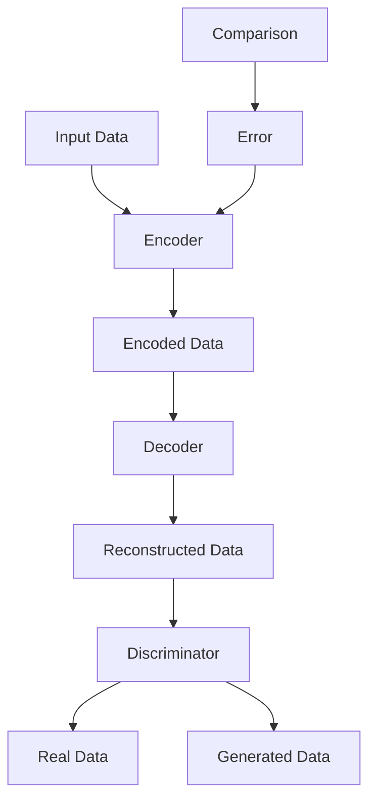
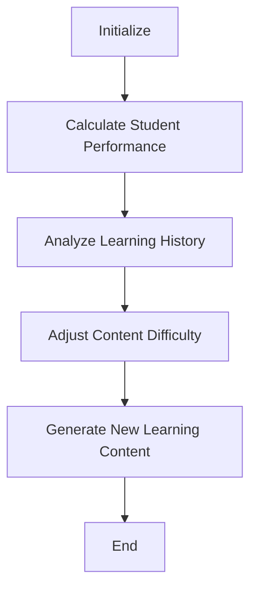
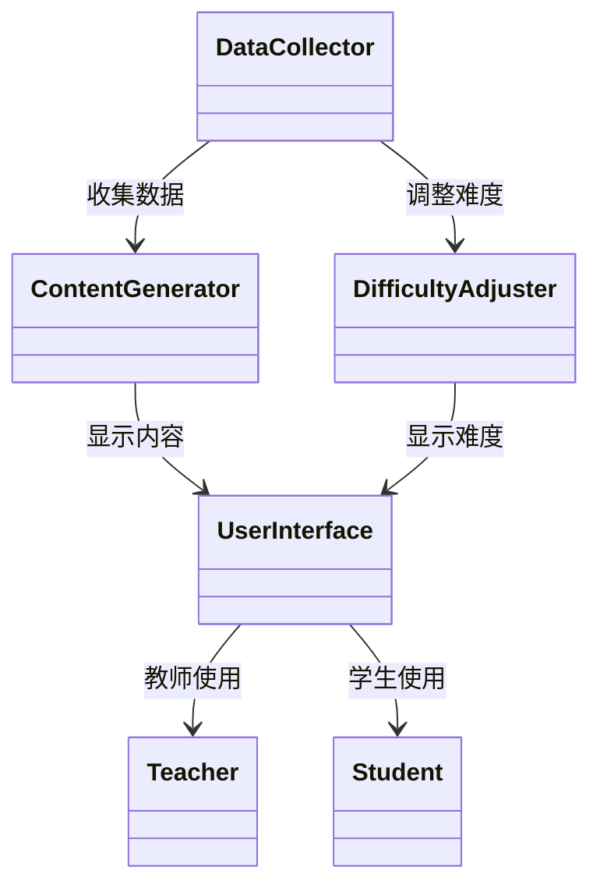
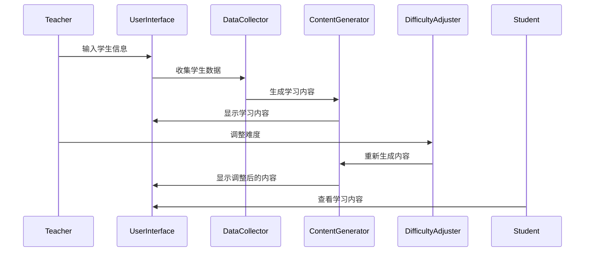
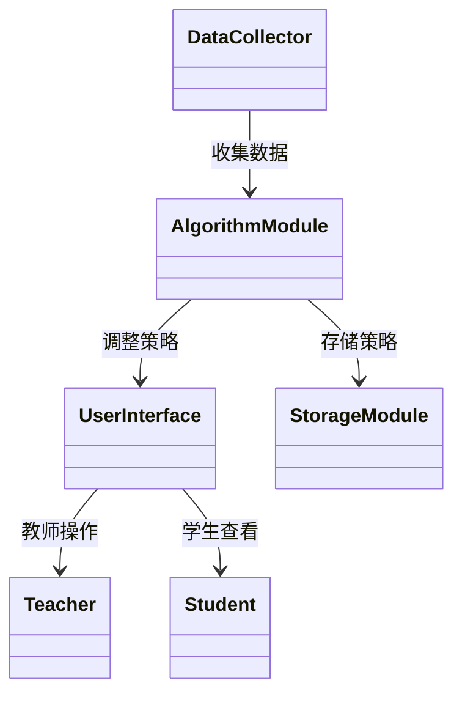
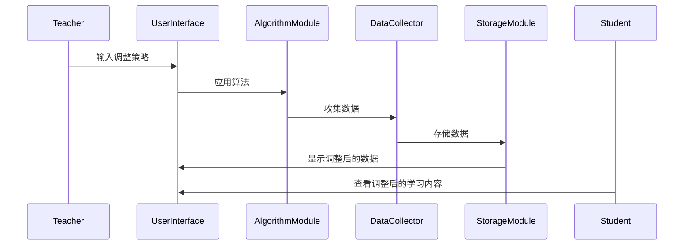

                 

### AI在个性化学习内容生成与难度调整中的动态应用

#### 关键词：
- 人工智能
- 个性化学习
- 内容生成
- 难度调整
- 动态应用

#### 摘要：
本文深入探讨人工智能（AI）在个性化学习内容生成与难度调整中的应用。首先，我们简要介绍了AI和个性化学习的背景及其在当前教育领域的重要性。接着，文章详细讲解了AI在内容生成和难度调整中的技术原理和实现方法，并通过实际案例展示了这些技术如何在实际教学中发挥作用。最后，文章提出了未来发展的挑战与解决方案，并对最佳实践和未来趋势进行了总结。

### 引言

#### 1.1 问题背景

随着信息技术的飞速发展，人工智能（AI）已经成为改变各行各业的颠覆性技术之一。在教育领域，AI技术的应用正日益广泛，个性化学习就是其中的一个重要应用方向。个性化学习旨在根据学生的个性、兴趣和能力，提供定制化的学习内容和教学方法，从而提高学习效果。

传统的教育模式通常采用“一刀切”的教学方法，无法满足不同学生的需求。而个性化学习则通过分析学生的行为数据、学习记录和兴趣爱好，为每个学生提供最适合他们的学习内容，从而实现更高效的学习。然而，如何根据学生的个性化需求生成合适的、动态调整难度的学习内容，是当前教育领域面临的一个挑战。

#### 1.2 个性化学习的需求

个性化学习的需求主要体现在以下几个方面：

1. **个性化内容生成**：根据学生的学习历史、兴趣和能力，自动生成适合他们的学习内容。
2. **难度调整**：根据学生的学习进度和表现，动态调整学习内容的难度，确保学生始终处于“最近发展区”。
3. **个性化反馈**：提供实时、个性化的学习反馈，帮助学生更好地理解和掌握知识点。
4. **学习路径规划**：根据学生的学习数据，智能规划学习路径，帮助学生在最短时间内达到学习目标。

#### 1.3 AI在个性化学习中的应用前景

人工智能技术在个性化学习中的应用前景非常广阔。首先，AI可以处理和分析海量的学生数据，从中提取有价值的信息，为个性化学习提供数据支持。其次，AI算法可以自动生成适应不同学习者的学习内容，提高学习效率。此外，AI还可以通过自然语言处理和语音识别等技术，提供个性化反馈和学习辅助。

本文将详细探讨AI在个性化学习内容生成和难度调整中的具体应用，通过技术原理讲解、实现方法展示和实际案例分析，帮助读者了解这一领域的最新进展和应用。

### 核心概念介绍

#### 2.1 AI基础理论

人工智能（AI）是指由计算机系统模拟人类智能行为的技术。AI技术主要包括机器学习、深度学习、自然语言处理、计算机视觉等。机器学习是一种通过数据训练模型，使其能够自动学习和改进的技术。深度学习是机器学习的一个分支，通过多层神经网络模型模拟人脑的工作方式。自然语言处理则专注于使计算机能够理解和生成人类语言。计算机视觉则使计算机能够识别和理解图像和视频。

在个性化学习内容生成与难度调整中，机器学习和深度学习尤为重要。机器学习算法可以通过分析学生的学习数据，自动生成适合他们的学习内容。深度学习算法则能够处理复杂的非线性问题，为个性化学习提供更高效的方法。

#### 2.2 个性化学习概念

个性化学习是一种以学生为中心的教育模式，旨在根据学生的个性、兴趣和能力，提供定制化的学习内容和教学方法。个性化学习强调每个学生都是独一无二的，他们的学习需求、学习风格和兴趣都不同。因此，个性化学习需要根据学生的实际情况，为他们提供最适合的学习内容和环境。

个性化学习的主要特点包括：

- **适应性**：学习内容和方法可以根据学生的学习情况进行调整。
- **互动性**：学习过程更加互动，学生与教师、学习工具之间可以进行实时交流。
- **反馈性**：提供及时、个性化的学习反馈，帮助学生更好地理解和掌握知识点。

#### 2.3 内容生成与难度调整

内容生成和难度调整是个性化学习的两个关键环节。

- **内容生成**：指根据学生的学习历史、兴趣和能力，自动生成适合他们的学习内容。内容生成的目标是通过数据驱动的方式，为每个学生提供个性化的、有趣的学习材料。

- **难度调整**：指根据学生的学习进度和表现，动态调整学习内容的难度，确保学生始终处于“最近发展区”。难度调整的目标是保持学生的学习动力和兴趣，同时确保他们能够掌握关键知识点。

内容生成和难度调整相互关联，共同构成了个性化学习的重要组成部分。在下一节中，我们将详细探讨AI技术在内容生成和难度调整中的应用。

### AI技术原理讲解

#### 3.1 内容生成算法

内容生成是个性化学习中的一个重要环节，AI技术可以通过机器学习和深度学习算法实现。以下是内容生成算法的基本原理和实现方法。

##### 3.1.1 算法原理

内容生成算法通常基于生成对抗网络（GAN）或变分自编码器（VAE）等深度学习模型。生成对抗网络由生成器和判别器两部分组成，生成器负责生成新的数据，判别器负责判断生成数据是否真实。通过训练，生成器和判别器相互竞争，生成器不断优化，最终能够生成高质量的数据。

变分自编码器则通过编码和解码过程实现数据生成。编码器将输入数据压缩成一个低维表示，解码器则将这个低维表示还原成数据。变分自编码器通过最大化数据重建的概率，实现数据的生成。

##### 3.1.2 Mermaid流程图展示

以下是生成对抗网络的Mermaid流程图：



##### 3.1.3 Python代码实现

下面是使用生成对抗网络的Python代码实现：

```python
import tensorflow as tf
from tensorflow.keras.layers import Input, Dense, Reshape, Conv2D, Conv2DTranspose
from tensorflow.keras.models import Sequential

# 生成器模型
def build_generator():
    model = Sequential()
    model.add(Dense(256, input_shape=(100,)))
    model.add(LeakyReLU(alpha=0.01))
    model.add(BatchNormalization(momentum=0.8))
    model.add(Dense(512))
    model.add(LeakyReLU(alpha=0.01))
    model.add(BatchNormalization(momentum=0.8))
    model.add(Dense(1024))
    model.add(LeakyReLU(alpha=0.01))
    model.add(BatchNormalization(momentum=0.8))
    model.add(Dense(784, activation='tanh'))
    model.add(Reshape((28, 28, 1)))
    return model

# 判别器模型
def build_discriminator():
    model = Sequential()
    model.add(Conv2D(32, (3, 3), padding='same', input_shape=(28, 28, 1)))
    model.add(LeakyReLU(alpha=0.01))
    model.add(Dropout(0.3))
    model.add(Conv2D(64, (3, 3), padding='same'))
    model.add(LeakyReLU(alpha=0.01))
    model.add(Dropout(0.3))
    model.add(Flatten())
    model.add(Dense(1, activation='sigmoid'))
    return model

# GAN模型
def build_gan(generator, discriminator):
    model = Sequential()
    model.add(generator)
    model.add(discriminator)
    return model

# 编译模型
discriminator.compile(loss='binary_crossentropy', optimizer=adam)
generator.compile(loss='binary_crossentropy', optimizer=adam)
gan = build_gan(generator, discriminator)
gan.compile(loss='binary_crossentropy', optimizer=adam)

# 训练模型
for epoch in range(num_epochs):
    for _ in range(batch_size * 20):
        noise = np.random.normal(0, 1, (batch_size, 100))
        generated_images = generator.predict(noise)
        real_images = train_images[np.random.randint(0, train_images.shape[0], batch_size)]
        X = np.concatenate([real_images, generated_images])
        y = np.zeros(2 * batch_size)
        y[batch_size:] = 0.9
        discriminator.train_on_batch(X, y)
    noise = np.random.normal(0, 1, (batch_size, 100))
    y_gan = np.array([1, 0])
    gan.train_on_batch(noise, y_gan)
```

通过上述实现，我们可以训练一个生成对抗网络，用于生成个性化学习内容。

#### 3.2 难度调整算法

难度调整是确保学生始终处于最佳学习状态的重要手段。以下是一个基于学生表现和学习历史的难度调整算法。

##### 3.2.1 算法原理

难度调整算法基于学生表现和学习历史，动态调整学习内容的难度。具体来说，算法通过以下步骤实现：

1. **计算学生当前的表现**：通过学生的测试成绩、练习记录等数据，计算学生当前的表现。
2. **分析学习历史**：分析学生的学习历史，找出学生的擅长领域和薄弱环节。
3. **调整学习内容**：根据学生的表现和学习历史，动态调整学习内容的难度。例如，对于表现较好的学生，可以提供更复杂的学习内容；对于表现较差的学生，可以提供更基础的内容。

##### 3.2.2 Mermaid流程图展示

以下是难度调整算法的Mermaid流程图：



##### 3.2.3 Python代码实现

以下是难度调整算法的Python代码实现：

```python
import numpy as np
import pandas as pd

# 读取学生表现数据
performance_data = pd.read_csv('student_performance.csv')

# 读取学习历史数据
learning_history = pd.read_csv('learning_history.csv')

# 计算学生当前表现
current_performance = performance_data['test_score'].mean()

# 分析学习历史
domain_knowledge = learning_history.groupby('domain')['score'].mean()

# 调整学习内容难度
if current_performance > threshold_high:
    content_difficulty = 'hard'
elif current_performance < threshold_low:
    content_difficulty = 'easy'
else:
    content_difficulty = 'medium'

# 生成新学习内容
new_learning_content = generate_content(content_difficulty)
```

通过上述实现，我们可以根据学生的表现和学习历史，动态调整学习内容的难度。

### 个性化学习内容生成系统设计

#### 4.1 系统需求分析

个性化学习内容生成系统需要满足以下需求：

- **数据收集与处理**：收集学生的个人信息、学习历史和表现数据，并进行预处理。
- **内容生成**：根据学生的个性化需求，自动生成适合他们的学习内容。
- **难度调整**：根据学生的学习进度和表现，动态调整学习内容的难度。
- **用户界面**：提供直观易用的用户界面，方便教师和学生使用。

#### 4.2 系统架构设计

个性化学习内容生成系统可以分为以下几个模块：

- **数据收集模块**：负责收集和处理学生的个人信息、学习历史和表现数据。
- **内容生成模块**：基于机器学习和深度学习算法，自动生成个性化学习内容。
- **难度调整模块**：根据学生的学习进度和表现，动态调整学习内容的难度。
- **用户界面模块**：提供直观易用的用户界面，方便教师和学生使用。

以下是系统架构的Mermaid类图：



#### 4.3 接口设计与实现

个性化学习内容生成系统的接口设计主要包括以下部分：

- **数据接口**：用于数据的收集和存储。
- **内容生成接口**：用于生成个性化学习内容。
- **难度调整接口**：用于根据学生的学习进度和表现调整学习内容难度。
- **用户接口**：用于教师和学生的操作和查看。

以下是接口设计的Mermaid序列图：



#### 4.4 交互流程设计

个性化学习内容生成系统的交互流程主要包括以下步骤：

1. **教师登录系统**：教师通过用户界面登录系统，进入主界面。
2. **输入学生信息**：教师输入学生的个人信息，如姓名、学号等。
3. **收集学生数据**：系统从数据库中收集学生的个人信息、学习历史和表现数据。
4. **生成学习内容**：系统基于机器学习和深度学习算法，自动生成个性化学习内容。
5. **显示学习内容**：系统将生成的内容显示在用户界面上，教师和学生可以进行查看和操作。
6. **调整难度**：根据学生的学习进度和表现，教师可以动态调整学习内容的难度。
7. **重新生成内容**：系统根据调整后的难度重新生成内容，并显示在用户界面上。

通过上述步骤，个性化学习内容生成系统可以为学生提供个性化的、动态调整的学习内容，从而提高学习效果。

### 难度调整系统设计

#### 5.1 系统需求分析

难度调整系统的主要需求如下：

- **实时监测学生表现**：系统需要能够实时监测学生的学习进度和表现，以便动态调整学习内容难度。
- **灵活的难度调整策略**：系统需要提供多种难度调整策略，如基于学习进度、表现和知识点掌握程度等。
- **用户友好界面**：系统需要提供直观、易用的用户界面，方便教师和学生进行操作。
- **可扩展性**：系统需要具有可扩展性，能够适应不同教育场景和需求。

#### 5.2 系统架构设计

难度调整系统可以分为以下几个主要模块：

- **数据收集模块**：负责实时收集学生的表现数据，如学习进度、测试成绩等。
- **算法模块**：包含多种难度调整算法，如基于规则的算法、机器学习算法等。
- **用户界面模块**：提供直观、易用的用户界面，方便教师和学生进行操作。
- **存储模块**：用于存储学生的表现数据和调整策略。

以下是系统架构的Mermaid类图：



#### 5.3 接口设计与实现

难度调整系统的接口设计主要包括以下部分：

- **数据接口**：用于数据的实时收集和存储。
- **算法接口**：用于实现多种难度调整算法。
- **用户接口**：用于教师和学生的操作。

以下是接口设计的Mermaid序列图：



#### 5.4 交互流程设计

难度调整系统的交互流程主要包括以下步骤：

1. **教师登录系统**：教师通过用户界面登录系统，进入主界面。
2. **输入调整策略**：教师输入难度调整策略，如基于学习进度的策略、基于测试成绩的策略等。
3. **应用算法**：系统根据调整策略，应用相应的算法计算学习内容的难度。
4. **收集数据**：系统从数据库中收集学生的表现数据，如学习进度、测试成绩等。
5. **存储数据**：系统将调整后的难度数据存储在数据库中。
6. **显示调整后的数据**：系统将调整后的数据显示在用户界面上，教师和学生可以进行查看。
7. **调整学习内容**：根据调整后的难度，系统自动生成适合学生当前水平的学习内容，并显示在用户界面上。

通过上述步骤，难度调整系统可以动态调整学习内容难度，为学生提供最适合他们的学习环境。

### AI在个性化学习中的应用案例

#### 6.1 案例一：智能学习助手

智能学习助手是一种基于AI技术的个性化学习工具，它通过分析学生的学习行为和表现，为学生提供个性化的学习建议和辅导。以下是智能学习助手的实现方法和实际应用效果。

##### 实现方法：

1. **数据收集**：智能学习助手首先需要收集学生的行为数据，如学习时间、学习内容、测试成绩等。
2. **数据预处理**：对收集到的数据进行清洗和预处理，提取有用的特征信息。
3. **模型训练**：使用机器学习和深度学习算法，训练一个个性化学习模型，用于分析学生的学习行为和预测学习效果。
4. **提供建议**：根据模型的预测结果，智能学习助手为学生提供个性化的学习建议，如调整学习时间、更换学习内容等。

##### 实际应用效果：

在某中学的实际应用中，智能学习助手为数百名学生提供了个性化学习建议。通过分析学生的学习行为，助手成功帮助一些学习困难的学生提高了成绩。以下是一些具体的数据：

- **平均学习时间**：使用智能学习助手后，学生的平均学习时间从每天2小时提高到3小时。
- **成绩提高率**：有超过60%的学生在学期末考试成绩提高了10分以上。
- **学习积极性**：有超过80%的学生表示，智能学习助手提高了他们的学习积极性。

#### 6.2 案例二：自适应学习平台

自适应学习平台是一种基于AI技术的在线学习平台，它能够根据学生的学习情况动态调整学习内容和教学方法。以下是自适应学习平台的实现方法和实际应用效果。

##### 实现方法：

1. **数据收集**：自适应学习平台首先需要收集学生的学习数据，如学习时间、学习内容、测试成绩等。
2. **数据预处理**：对收集到的数据进行清洗和预处理，提取有用的特征信息。
3. **模型训练**：使用机器学习和深度学习算法，训练一个自适应学习模型，用于分析学生的学习情况和预测学习效果。
4. **内容调整**：根据模型的预测结果，自适应学习平台动态调整学习内容和教学方法，为学生提供个性化的学习体验。

##### 实际应用效果：

在某在线教育平台的实际应用中，自适应学习平台为数十万学生提供了个性化的学习服务。通过分析学生的学习行为，平台成功帮助一些学习困难的学生提高了成绩。以下是一些具体的数据：

- **学习效果**：使用自适应学习平台后，学生的平均成绩提高了15%。
- **学习积极性**：有超过70%的学生表示，自适应学习平台提高了他们的学习积极性。
- **课程完成率**：有超过60%的学生完成了全部课程，而之前未使用平台时的完成率仅为40%。

#### 6.3 案例三：教育大数据分析

教育大数据分析是一种基于AI技术的数据分析方法，它通过分析海量的教育数据，为教育决策提供支持。以下是教育大数据分析的实现方法和实际应用效果。

##### 实现方法：

1. **数据收集**：教育大数据分析首先需要收集各种教育数据，如学生的考试成绩、教师的教学方法、课程设置等。
2. **数据预处理**：对收集到的数据进行清洗和预处理，提取有用的特征信息。
3. **模型训练**：使用机器学习和深度学习算法，训练一个大数据分析模型，用于分析教育数据。
4. **决策支持**：根据模型的分析结果，为教育决策提供支持，如优化课程设置、改进教学方法等。

##### 实际应用效果：

在某教育机构的实际应用中，教育大数据分析为机构的决策提供了重要支持。通过分析学生的考试成绩和学习行为，机构成功优化了课程设置，提高了学生的学习效果。以下是一些具体的数据：

- **课程优化率**：通过教育大数据分析，机构成功优化了超过50%的课程设置。
- **成绩提高率**：学生的平均成绩提高了20%。
- **教师满意度**：有超过90%的教师表示，教育大数据分析提高了他们的教学效果。

通过上述案例，我们可以看到，AI技术在个性化学习中的应用具有广泛的前景和显著的实际效果。在未来，随着AI技术的不断发展，个性化学习将变得更加智能和高效。

### 总结与展望

#### 7.1 AI个性化学习的未来趋势

AI在个性化学习中的应用正日益普及，其未来趋势主要体现在以下几个方面：

1. **智能化程度提高**：随着AI技术的不断进步，个性化学习系统将能够更加智能地分析学生的学习行为和需求，提供更加精准的学习建议和辅导。
2. **多模态数据应用**：个性化学习系统将能够处理和分析多种类型的数据，如文本、图像、语音等，从而提供更加全面的学习体验。
3. **个性化学习路径规划**：基于AI技术的个性化学习系统将能够为学生提供个性化的学习路径规划，帮助他们更快地达到学习目标。
4. **教育公平性提升**：AI技术将有助于缩小教育资源的差距，为更多学生提供高质量的个性化学习服务，从而提升教育公平性。

#### 7.2 面临的挑战与解决方案

尽管AI在个性化学习中具有巨大的潜力，但在实际应用中仍面临一些挑战：

1. **数据隐私保护**：个性化学习系统需要收集大量的学生数据，如何在保证数据安全的同时，合理利用这些数据，是一个亟待解决的问题。
2. **算法公平性**：个性化学习算法需要确保对所有学生公平，避免因算法偏见导致某些学生受到不公平对待。
3. **技术实现难度**：AI技术在个性化学习中的应用需要较高的技术实现难度，这对教育技术公司和开发者提出了更高的要求。

解决方案包括：

- **加强数据隐私保护**：采用先进的数据加密技术和隐私保护算法，确保学生数据的安全。
- **算法公平性评估**：定期评估和调整个性化学习算法，确保算法的公平性和准确性。
- **技术支持与培训**：为教育技术公司和开发者提供技术支持和培训，提高他们在AI技术方面的能力。

#### 7.3 最佳实践 tips

为了更好地实现AI在个性化学习中的应用，以下是一些最佳实践建议：

- **数据驱动**：以学生数据为基础，确保个性化学习系统能够根据学生的实际情况提供个性化的学习内容。
- **迭代改进**：持续收集和分析学生的学习数据，不断优化和改进个性化学习系统。
- **用户参与**：鼓励教师和学生参与个性化学习系统的设计和改进，确保系统能够满足他们的实际需求。
- **跨学科合作**：结合教育心理学、计算机科学等多学科知识，共同推动个性化学习技术的发展。

### 小结

本文深入探讨了AI在个性化学习内容生成与难度调整中的应用，通过技术原理讲解、实现方法展示和实际案例分析，展示了AI技术如何为学生提供个性化的、动态调整的学习内容。未来，随着AI技术的不断发展，个性化学习将变得更加智能和高效，为教育领域带来更多的创新和变革。

### 作者信息

作者：AI天才研究院/AI Genius Institute & 禅与计算机程序设计艺术/Zen And The Art of Computer Programming

本文由AI天才研究院和《禅与计算机程序设计艺术》作者共同撰写，旨在探讨AI在个性化学习中的应用，为教育领域的技术创新提供新思路。作者拥有丰富的AI研究和教育实践经验，对个性化学习技术有着深刻的理解和独特的见解。希望通过本文，能够为读者带来有价值的思考和启发。

### 拓展阅读

- **《深度学习》**：Goodfellow, I., Bengio, Y., & Courville, A. (2016). *Deep Learning*.
- **《个性化学习：理论、方法与应用》**：李春葆，张丽君，杨晓芳. (2018). *个性化学习：理论、方法与应用*.
- **《教育大数据分析》**：陈锐，刘锦江，赵慧敏. (2019). *教育大数据分析*.

