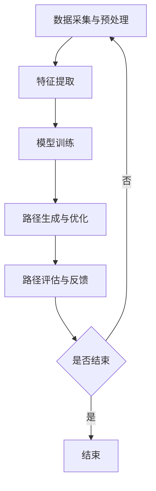

                 

### 文章标题

# AI在个性化学习路径规划中的应用

关键词：个性化学习路径规划、AI、算法、数学模型、系统架构

摘要：本文探讨了AI在个性化学习路径规划中的应用，从背景介绍、核心概念、AI与个性化学习路径规划的关联、数学模型、算法原理、实践应用等方面进行了详细阐述，旨在为教育领域提供一种基于AI的个性化学习解决方案，提高学习效率和质量。

---

### 目录大纲

----------------------------------------------------------------

# 第一部分：背景介绍

## 第1章 问题背景与核心概念

### 1.1.1 问题背景

- 个性化学习路径规划的需求与挑战

### 1.1.2 问题描述

- 个性化学习路径规划的核心问题

### 1.1.3 问题解决

- AI在个性化学习路径规划中的作用

### 1.1.4 边界与外延

- 个性化学习路径规划的相关概念

### 1.1.5 概念结构与核心要素组成

- 个性化学习路径规划的核心概念与结构

## 第2章 AI与个性化学习路径规划

### 2.1.1 AI的定义与特点

- AI的定义与基本特点

### 2.1.2 个性化学习路径规划的定义

- 个性化学习路径规划的定义与目的

### 2.1.3 AI在个性化学习路径规划中的应用

- AI在个性化学习路径规划中的应用场景

## 第3章 个性化学习路径规划的数学模型

### 3.1.1 数学模型的基本概念

- 数学模型的基本概念与构建方法

### 3.1.2 数学模型在个性化学习路径规划中的应用

- 数学模型在个性化学习路径规划中的应用

## 第4章 个性化学习路径规划的算法原理

### 4.1.1 算法原理概述

- 个性化学习路径规划的算法原理概述

### 4.1.2 算法原理详细讲解

- 个性化学习路径规划算法原理的详细讲解

### 4.1.3 算法mermaid流程图

- 个性化学习路径规划算法的mermaid流程图

## 第5章 个性化学习路径规划的实践应用

### 5.1.1 系统架构设计

- 个性化学习路径规划系统的架构设计

### 5.1.2 系统功能设计

- 个性化学习路径规划系统的功能设计

### 5.1.3 实践应用案例

- 个性化学习路径规划的实践应用案例

## 第6章 AI在个性化学习路径规划中的挑战与机遇

### 6.1.1 挑战

- AI在个性化学习路径规划中面临的挑战

### 6.1.2 机遇

- AI在个性化学习路径规划中面临的机遇

## 第7章 总结与展望

### 7.1.1 总结

- 个性化学习路径规划在AI领域的现状与展望

### 7.1.2 拓展阅读

- 个性化学习路径规划相关的拓展阅读材料

----------------------------------------------------------------

### 第一部分：背景介绍

## 第1章 问题背景与核心概念

### 1.1.1 问题背景

随着教育技术的不断进步，现代教育越来越注重个性化学习。传统的“一刀切”教学模式已经无法满足学生多样化的学习需求。个性化学习路径规划作为现代教育的一个重要研究方向，旨在通过分析学生的个人特征、学习需求和学习效果，为学生设计出最适合其学习风格和发展需求的个性化学习方案。然而，在现实应用中，个性化学习路径规划面临着诸多挑战。

首先，个性化学习路径规划需要全面、准确地获取学生的各种特征数据，如学习兴趣、学习能力、学习态度等。这些数据的获取不仅需要精细的测量和评估方法，还需要大量的时间和资源。其次，个性化学习路径规划需要基于这些数据，生成科学、有效的学习方案。这涉及到复杂的算法设计和优化问题。最后，个性化学习路径规划需要将这些方案付诸实践，这又涉及到学习资源的管理和分配、教学活动的组织与协调等问题。

### 1.1.2 问题描述

个性化学习路径规划的核心问题是：如何根据学生的个人特征和学习需求，为其设计出科学、合理、有效的学习方案？具体来说，这个问题可以分解为以下几个子问题：

1. 数据采集与处理：如何准确、高效地获取和整合学生的各类特征数据？
2. 模型构建与优化：如何基于这些数据构建有效的学习模型，并对模型进行优化和调整？
3. 方案生成与评估：如何根据学习模型生成个性化的学习方案，并对其进行评估和调整？
4. 方案实施与反馈：如何将个性化学习方案付诸实践，并收集学生的反馈信息，以进一步优化方案？

### 1.1.3 问题解决

AI技术的发展为个性化学习路径规划提供了新的解决方案。具体来说，AI在个性化学习路径规划中的作用主要体现在以下几个方面：

1. 数据采集与处理：AI技术可以借助自然语言处理、图像识别等技术，自动采集和处理学生的特征数据，提高数据获取的精度和效率。
2. 模型构建与优化：AI技术可以运用机器学习、深度学习等技术，构建和优化个性化学习模型，提高模型的预测准确性和适应性。
3. 方案生成与评估：AI技术可以根据学习模型，自动生成个性化的学习方案，并对方案进行实时评估和调整，提高方案的可行性和有效性。
4. 方案实施与反馈：AI技术可以通过智能推荐、智能监控等技术，将个性化学习方案付诸实践，并实时收集学生的反馈信息，以进一步优化方案。

通过AI技术的应用，个性化学习路径规划可以从以下三个方面得到提升：

1. 提高个性化水平：AI技术可以更准确地识别和把握学生的个性化需求，从而设计出更加个性化的学习方案。
2. 提高学习效率：AI技术可以帮助学生更快地找到适合自己的学习路径，从而提高学习效率。
3. 提高教学质量：AI技术可以辅助教师更好地了解学生的学习状况，从而提供更有针对性的教学服务。

### 1.1.4 边界与外延

个性化学习路径规划的相关概念包括：个性化学习、学习路径规划、数据采集与处理、模型构建与优化、方案生成与评估、方案实施与反馈等。

个性化学习是指根据学生的个人特征、学习需求和兴趣，为其设计出适合其发展需求的学习方案。学习路径规划是指根据个性化学习需求，为学生设计出科学、合理、有效的学习路径。数据采集与处理是指通过各种技术手段，获取和整合学生的各类特征数据。模型构建与优化是指基于数据，构建和优化个性化学习模型。方案生成与评估是指根据学习模型，生成个性化的学习方案，并对其进行评估和调整。方案实施与反馈是指将个性化学习方案付诸实践，并收集学生的反馈信息，以进一步优化方案。

### 1.1.5 概念结构与核心要素组成

个性化学习路径规划的核心概念与结构包括以下几个方面：

1. 学生特征数据：包括学习兴趣、学习能力、学习态度等。
2. 学习模型：基于学生特征数据构建的，用于预测和优化学习路径的数学模型。
3. 学习方案：根据学习模型生成的，适合学生个性化需求的学习路径。
4. 数据采集与处理：用于获取和整合学生特征数据的技术手段。
5. 模型构建与优化：用于构建和优化学习模型的方法和技术。
6. 方案生成与评估：用于生成和评估学习方案的方法和技术。
7. 方案实施与反馈：用于将学习方案付诸实践，并收集反馈信息的技术手段。

通过上述核心概念与结构的阐述，我们可以更清晰地理解个性化学习路径规划的概念及其在AI领域中的应用。

## 第2章 AI与个性化学习路径规划

### 2.1.1 AI的定义与特点

AI（人工智能）是计算机科学的一个分支，旨在使计算机具备模拟、延伸和扩展人类智能的能力。AI的定义可以从多个角度进行理解，但通常可以概括为：使计算机能够执行需要人类智能才能完成的任务。

AI的基本特点包括：

1. **智能模拟**：AI试图模拟人类的思维过程，包括感知、理解、推理、学习和决策。
2. **自主性**：AI系统能够在没有人类干预的情况下，自主执行任务和做出决策。
3. **学习能力**：AI系统可以通过学习算法，从数据中学习并改进性能。
4. **自适应能力**：AI系统能够根据环境变化和反馈，自动调整其行为和策略。

### 2.1.2 个性化学习路径规划的定义

个性化学习路径规划是指根据学生的个体差异，利用AI技术为学生设计一条最符合其学习风格、兴趣和能力的学习路线。其核心目标是通过个性化的学习方案，提高学生的学习效果和兴趣。

个性化学习路径规划的定义可以从以下几个方面进行阐述：

1. **个体差异分析**：通过分析学生的兴趣、学习能力、学习风格等个体差异，了解学生的个性化需求。
2. **路径规划**：基于个体差异分析结果，利用算法和模型为学生设计个性化的学习路径。
3. **学习反馈**：通过收集学生的学习反馈，不断调整和优化学习路径，确保其适应性和有效性。

### 2.1.3 AI在个性化学习路径规划中的应用

AI在个性化学习路径规划中的应用场景非常广泛，主要包括以下几个方面：

1. **数据采集与分析**：
   - **自然语言处理（NLP）**：利用NLP技术从学生的文字描述中提取学习需求和兴趣。
   - **图像识别**：通过图像识别技术分析学生的学习行为和偏好。
   - **行为分析**：通过分析学生的学习行为数据，如学习时间、学习频率、学习状态等，了解其学习习惯和偏好。

2. **学习模型构建**：
   - **机器学习**：利用机器学习算法，如决策树、支持向量机（SVM）、神经网络等，构建能够预测学生未来学习效果和学习路径的模型。
   - **深度学习**：通过深度学习模型，如卷积神经网络（CNN）、循环神经网络（RNN）等，对大量学习数据进行训练，以提高模型的预测准确性。

3. **路径规划与优化**：
   - **优化算法**：利用遗传算法、模拟退火算法等优化算法，对学习路径进行优化，确保其符合学生的个性化需求。
   - **推荐系统**：基于学生特征和学习历史，利用推荐系统算法，为学生推荐合适的学习资源和课程。

4. **学习效果评估**：
   - **实时反馈**：通过实时监控系统，收集学生的学习状态和表现，为路径的调整提供依据。
   - **效果评估模型**：利用评估模型，对学生的学习效果进行量化评估，以验证个性化学习路径的有效性。

通过AI技术的应用，个性化学习路径规划可以从多个维度提升学习体验和效果，为教育行业带来深远的变革。

### 2.1.4 AI在个性化学习路径规划中的应用案例

为了更好地理解AI在个性化学习路径规划中的应用，以下将介绍一些实际案例。

#### 案例一：Knewton

Knewton是一家利用AI技术提供个性化学习服务的公司。它通过分析学生的学习行为数据，为学生提供定制化的学习内容。Knewton的AI系统能够实时跟踪学生的学习进度和表现，并根据这些数据动态调整学习路径，确保学生能够获得最适合自己的学习资源。

**应用分析**：
- **数据采集**：Knewton利用自然语言处理技术，从学生的回答和作业中提取学习需求和知识点掌握情况。
- **学习模型**：基于学生的历史数据和实时反馈，Knewton构建了能够预测学生未来学习效果和路径的模型。
- **路径规划**：Knewton通过优化算法，为学生设计个性化的学习路径，确保其学习内容符合学生的个性化需求。

#### 案例二：DreamBox

DreamBox是一款针对K-12学生的个性化学习平台，利用AI技术为学生提供个性化的数学学习方案。DreamBox通过分析学生的回答、行为和进度，实时调整学习路径，确保每个学生都能以自己的节奏进行学习。

**应用分析**：
- **数据采集**：DreamBox通过实时监控系统，收集学生的回答、学习时间和学习状态等数据。
- **学习模型**：DreamBox利用机器学习算法，构建了能够预测学生未来学习效果和学习路径的模型。
- **路径规划**：DreamBox通过优化算法，为学生设计个性化的学习路径，并根据学生的反馈进行动态调整。

#### 案例三：Coursera

Coursera是一个在线教育平台，它利用AI技术为学生提供个性化的学习体验。Coursera通过分析学生的学习历史和行为，推荐最适合他们的课程和资源。

**应用分析**：
- **数据采集**：Coursera利用自然语言处理技术，从学生的讨论和反馈中提取学习需求和兴趣。
- **学习模型**：Coursera利用机器学习算法，构建了能够预测学生未来学习效果和学习路径的模型。
- **路径规划**：Coursera通过推荐系统算法，为学生推荐最适合他们的课程和资源。

这些案例展示了AI在个性化学习路径规划中的多种应用方式，通过数据采集、学习模型构建、路径规划与优化等技术手段，实现了对学生个性化需求的精准把握和学习效果的显著提升。

### 2.1.5 个性化学习路径规划与AI技术的关联性分析

AI技术在个性化学习路径规划中的应用，不仅解决了传统教育模式中的许多问题，还极大地提升了教育的个性化水平和效率。以下是AI技术与个性化学习路径规划之间关联性的详细分析：

1. **数据驱动的个性化分析**：
   - **数据采集**：AI技术，如自然语言处理（NLP）、图像识别和行为分析，可以高效地收集和分析学生的特征数据。这些数据包括学生的兴趣、学习能力、学习风格和进度等。
   - **数据分析**：通过数据挖掘和机器学习算法，AI技术可以从大量数据中提取有价值的信息，帮助教育者更好地理解学生的个性化需求。

2. **智能化的学习路径规划**：
   - **学习模型构建**：AI技术可以基于学生特征数据构建学习模型，这些模型能够预测学生的学习效果和路径。例如，利用决策树、神经网络和深度学习算法，可以构建出能够适应个体差异的学习模型。
   - **路径优化**：通过优化算法，如遗传算法、模拟退火算法和动态规划，AI技术可以为学生设计出最优的学习路径，确保学习过程高效且符合个性化需求。

3. **动态反馈与调整**：
   - **实时监控**：AI技术可以实时监控学生的学习行为和效果，通过分析实时数据，为教育者提供即时的反馈。
   - **动态调整**：基于学生的实时反馈和学习效果，AI技术可以动态调整学习路径，确保学习内容始终与学生的当前需求和水平相匹配。

4. **个性化资源推荐**：
   - **推荐系统**：AI技术可以根据学生的学习历史和兴趣，推荐最适合他们的学习资源。这些资源可以是课程、教材、习题集等，有助于提高学习效率。
   - **内容定制**：通过自然语言处理和内容分析，AI技术可以为学生定制化地提供学习内容，使其更加贴近个人需求和兴趣。

5. **跨平台集成**：
   - **多终端支持**：AI技术可以集成到各种教育平台和工具中，如在线教育平台、移动应用和虚拟现实（VR）教学系统，为学生提供一致且个性化的学习体验。
   - **跨学科应用**：AI技术不仅适用于单一学科的教学，还可以跨学科应用，为学生提供综合性、个性化的学习方案。

总之，AI技术在个性化学习路径规划中的应用，通过数据驱动、智能规划、动态反馈和跨平台集成等手段，实现了对学生个性化需求的精准把握和高效满足，为现代教育注入了新的活力和变革动力。

### 2.1.6 个性化学习路径规划的关键步骤与方法

个性化学习路径规划是一个复杂的过程，涉及多个关键步骤和方法。以下是这一过程的详细解析：

#### 1. 学生特征数据采集

学生特征数据的采集是个性化学习路径规划的基础。这些数据可以包括：

- **学习行为数据**：如学习时间、学习频率、学习状态等。
- **知识水平数据**：如学生的学科知识掌握程度、薄弱环节等。
- **兴趣与偏好数据**：如学生对不同学科或主题的兴趣、学习风格等。
- **个性特征数据**：如学生的性格、动机、自我效能感等。

采集这些数据的方法包括：

- **在线问卷与调查**：通过在线问卷或调查工具，收集学生的基本信息和个性化需求。
- **学习平台记录**：利用学习平台或系统自动记录学生的行为数据，如学习进度、回答情况等。
- **面对面访谈**：通过与学生的面对面交流，深入了解其学习兴趣和需求。

#### 2. 学生特征数据分析

在采集到学生特征数据后，需要对这些数据进行清洗、整合和分析，提取出有价值的信息。数据分析的方法包括：

- **数据挖掘**：利用数据挖掘算法，如关联规则挖掘、聚类分析等，发现数据中的潜在模式。
- **机器学习**：通过机器学习算法，如决策树、支持向量机（SVM）、神经网络等，建立预测模型，分析学生的个性化需求和学习路径。
- **自然语言处理（NLP）**：利用NLP技术，从文本数据中提取情感、兴趣等信息。

#### 3. 个性化学习路径规划模型构建

基于分析结果，构建个性化学习路径规划模型。这个模型需要能够预测学生的学习效果和路径，并具备以下特点：

- **适应性**：模型能够根据学生的实时反馈和学习效果进行调整。
- **动态性**：模型能够随着学习进程的推进，动态更新和优化。
- **预测性**：模型能够预测学生的学习趋势和效果，为路径规划提供依据。

模型构建的方法包括：

- **决策树**：通过构建决策树模型，将学生特征映射到不同的学习路径。
- **支持向量机（SVM）**：利用SVM分类算法，确定学生应该选择的学习路径。
- **神经网络**：通过构建多层感知机（MLP）或其他神经网络模型，实现对学习路径的动态调整。

#### 4. 个性化学习路径生成

根据构建的模型，生成个性化的学习路径。这一过程需要考虑以下因素：

- **学习目标**：确保学习路径能够帮助学生实现既定的学习目标。
- **学习资源**：为学生提供最合适的教材、课程和习题。
- **学习节奏**：根据学生的能力和兴趣，设定合适的学习节奏。
- **学习环境**：考虑学生的个性特征和学习风格，提供适宜的学习环境。

生成个性化学习路径的方法包括：

- **推荐系统**：通过推荐算法，为学生推荐最适合的学习资源。
- **优化算法**：利用优化算法，如遗传算法、模拟退火算法等，寻找最优的学习路径。

#### 5. 个性化学习路径评估与调整

生成个性化学习路径后，需要对其进行评估和调整，确保其有效性和适应性。评估与调整的方法包括：

- **实时监控**：通过监控系统，实时跟踪学生的学习进度和效果。
- **反馈机制**：收集学生的反馈信息，分析其学习效果，为路径调整提供依据。
- **迭代优化**：根据评估结果，不断调整和优化学习路径，确保其与学生的当前需求和水平相匹配。

通过上述关键步骤和方法的实施，个性化学习路径规划能够有效满足学生的个性化需求，提高学习效果和兴趣。

### 2.1.7 个性化学习路径规划中面临的挑战与应对策略

尽管个性化学习路径规划具有巨大的潜力，但其实际应用中仍然面临诸多挑战。以下是这些挑战及其应对策略的详细分析：

#### 1. 数据隐私与安全性

**挑战**：个性化学习路径规划需要收集和分析大量学生的个人数据，这些数据包括学习行为、知识水平、兴趣和个性特征等。如何保护这些数据的隐私和安全，避免数据泄露和滥用，是首要问题。

**应对策略**：

- **数据加密**：对收集到的数据进行加密处理，确保数据在传输和存储过程中不会被非法访问。
- **隐私保护机制**：在数据采集和处理过程中，遵循隐私保护原则，对敏感数据进行脱敏处理，减少隐私泄露的风险。
- **安全审计**：建立完善的安全审计机制，定期对系统的安全性和数据保护措施进行评估，及时发现和解决潜在的安全问题。

#### 2. 数据采集的准确性

**挑战**：个性化学习路径规划依赖于准确的学生特征数据。然而，在实际操作中，数据采集的准确性可能受到多种因素影响，如数据噪声、数据缺失和不一致等。

**应对策略**：

- **数据清洗**：对收集到的数据进行清洗和预处理，去除重复、噪声和不一致的数据，确保数据的准确性。
- **数据整合**：整合来自不同来源和格式的数据，建立统一的数据模型，便于后续分析和处理。
- **多源数据验证**：利用多种数据源和验证方法，交叉验证数据的准确性，提高数据的可信度。

#### 3. 模型适应性

**挑战**：个性化学习路径规划需要模型具备良好的适应性，能够根据学生的实时反馈和学习效果进行动态调整。然而，模型可能存在过度拟合、泛化能力不足等问题，导致适应性下降。

**应对策略**：

- **模型优化**：通过调整模型参数和结构，提高模型的泛化能力和适应性。例如，利用正则化方法防止过拟合，采用自适应学习算法提高模型的动态调整能力。
- **多模型融合**：结合多种机器学习模型和算法，构建多模型融合系统，提高模型的预测准确性和适应性。
- **模型评估与反馈**：建立模型评估机制，定期对模型的性能进行评估和调整，根据评估结果和用户反馈，动态更新和优化模型。

#### 4. 技术复杂性与维护成本

**挑战**：个性化学习路径规划涉及多种复杂的技术，包括数据采集、处理、存储、分析和模型构建等。这些技术的维护和更新需要大量的资源投入，增加了系统的维护成本。

**应对策略**：

- **模块化设计**：采用模块化设计理念，将系统划分为多个功能模块，降低系统的复杂度，便于维护和更新。
- **开源技术**：利用开源技术框架和工具，降低系统的开发和维护成本。例如，使用Hadoop、Spark等大数据处理框架，降低数据处理的技术门槛。
- **自动化运维**：采用自动化运维工具，实现系统的自动化部署、监控和故障排除，提高系统的稳定性和可靠性。

#### 5. 教育者的接受与适应

**挑战**：个性化学习路径规划需要教育者具备一定的技术素养和适应能力，才能有效利用系统进行教学。然而，一些教育者可能对新技术存在抵触情绪，难以迅速适应和接受。

**应对策略**：

- **培训与支持**：为教育者提供专业的技术培训和支持，帮助他们了解和掌握个性化学习路径规划系统的使用方法。
- **用户友好的界面**：设计用户友好的系统界面，简化操作流程，降低教育者的学习成本。
- **持续反馈与改进**：通过收集教育者的反馈意见，不断改进系统的功能和用户体验，提高教育者的接受度和使用满意度。

通过上述应对策略的实施，个性化学习路径规划能够在克服挑战的同时，实现其应有的价值，推动教育行业的创新发展。

### 3. 个性化学习路径规划的数学模型

在个性化学习路径规划中，数学模型起着关键作用。这些模型不仅能够量化学生的特征和学习需求，还可以预测学生的学习效果，并优化学习路径。以下将详细介绍个性化学习路径规划中常用的数学模型及其应用。

#### 3.1 数学模型的基本概念

数学模型是一种用于描述和分析现实问题的数学结构，通常由一组变量、方程和约束条件组成。在个性化学习路径规划中，数学模型可以帮助我们理解和预测学生的学习行为和效果，从而设计出最优的学习方案。

常见的数学模型包括：

- **线性回归模型**：用于分析学生特征和成绩之间的关系。
- **决策树模型**：用于分类学生并推荐相应的学习路径。
- **神经网络模型**：用于模拟学习过程并预测学习效果。
- **优化模型**：用于优化学习路径和资源分配。

#### 3.2 数学模型在个性化学习路径规划中的应用

数学模型在个性化学习路径规划中的应用主要体现在以下几个方面：

1. **学生特征建模**：通过构建学生特征模型，量化学生的兴趣、学习能力、学习风格等特征。例如，可以使用线性回归模型分析学生的历史成绩和当前学习状态，预测其未来的学习表现。

2. **学习路径优化**：利用优化模型，根据学生的特征和学习需求，设计最优的学习路径。例如，可以使用遗传算法优化学习路径，确保路径符合学生的个性化需求，并最大限度地提高学习效果。

3. **学习效果预测**：通过构建学习效果预测模型，预测学生在不同学习路径上的表现。例如，可以使用神经网络模型预测学生在完成某项任务后的知识掌握程度，为学习路径的调整提供依据。

4. **资源分配优化**：利用优化模型，根据学生的个性化需求和学习效果，优化学习资源的分配。例如，可以使用线性规划模型确定最佳的学习资源分配方案，确保资源的高效利用。

#### 3.3 数学模型示例

为了更好地理解数学模型在个性化学习路径规划中的应用，以下将给出一个具体的数学模型示例。

##### 示例：线性回归模型

假设我们想要构建一个模型，预测学生在数学课程中的成绩（Y）与其学习时间（X）之间的关系。我们可以使用线性回归模型来描述这种关系：

$$
Y = \beta_0 + \beta_1 X + \epsilon
$$

其中，$\beta_0$是截距，$\beta_1$是斜率，$\epsilon$是误差项。

为了训练这个模型，我们需要收集一组学生的学习时间和成绩数据，并使用最小二乘法求解$\beta_0$和$\beta_1$的值。求解后的模型可以用来预测新学生的数学成绩。

##### 示例：决策树模型

假设我们想要根据学生的数学成绩（Y）和英语成绩（X）来推荐适合他们的学习路径。我们可以使用决策树模型来构建这个分类器。

首先，我们需要收集学生成绩数据，并使用决策树算法构建分类器。决策树模型将数据集划分为若干个区域，每个区域对应一个特定的学习路径。

例如，我们可以使用Gini不纯度或信息增益作为划分标准，构建一个决策树模型，如下所示：

$$
\text{Gini}(\text{node}) = 1 - \sum_{i=1}^k \left( \frac{n_i}{N} \right)^2
$$

其中，$k$是当前节点的类别数，$n_i$是第$i$类别的样本数量，$N$是当前节点的总样本数量。

通过训练决策树模型，我们可以为每个学生推荐最适合他们的学习路径。例如，如果学生的数学成绩高于80分，则推荐他们深入学习数学；如果英语成绩低于60分，则推荐他们加强英语学习。

##### 示例：神经网络模型

假设我们想要构建一个神经网络模型，预测学生在完成一个学习任务后的知识掌握程度。我们可以使用多层感知机（MLP）作为神经网络模型。

首先，我们需要收集学生完成学习任务前后的知识测试数据，并使用反向传播算法训练神经网络模型。训练后的模型可以用来预测新学生完成学习任务后的知识掌握程度。

神经网络模型的一般形式如下：

$$
Y = \sigma(\text{ReLU}(W_2 \cdot \sigma(W_1 \cdot X + b_1) + b_2))
$$

其中，$X$是输入特征，$Y$是输出预测，$W_1$和$W_2$是权重矩阵，$b_1$和$b_2$是偏置项，$\sigma$是激活函数（如Sigmoid函数或ReLU函数）。

通过训练神经网络模型，我们可以为每个学生预测其完成学习任务后的知识掌握程度。例如，如果预测值大于0.5，则认为学生掌握了相关知识；否则，认为学生需要进一步学习。

这些数学模型在个性化学习路径规划中发挥着重要作用，通过量化学生的特征和学习需求，预测学习效果，优化学习路径，帮助教育者和学生实现个性化学习目标。

### 4. 个性化学习路径规划的算法原理

个性化学习路径规划的算法原理是整个系统的核心，决定了能否准确、高效地为学生设计出适合其需求的学习方案。以下将从算法原理的概述、详细讲解和算法mermaid流程图三个方面进行深入探讨。

#### 4.1 算法原理概述

个性化学习路径规划的算法原理主要包括以下几个关键步骤：

1. **数据采集与预处理**：收集学生的个人信息、学习行为、知识水平等数据，并进行预处理，包括数据清洗、归一化等。

2. **特征提取**：从预处理后的数据中提取对个性化学习路径规划有用的特征，如学习兴趣、学习风格、知识点掌握程度等。

3. **模型训练**：利用机器学习算法对提取的特征进行训练，构建能够预测学生未来学习效果和路径的模型。

4. **路径生成与优化**：根据训练好的模型，生成个性化学习路径，并通过优化算法不断调整路径，使其更符合学生的个性化需求。

5. **路径评估与反馈**：对生成的学习路径进行评估，根据学生的反馈和实际学习效果进行动态调整。

#### 4.2 算法原理详细讲解

以下将详细讲解个性化学习路径规划中的关键算法原理：

##### 1. 数据采集与预处理

数据采集与预处理是算法的基础。采集的数据通常包括学生的个人基本信息、学习行为数据、考试成绩、课堂参与情况等。预处理过程包括以下步骤：

- **数据清洗**：去除重复、错误或缺失的数据，确保数据的准确性。
- **数据归一化**：将不同特征的数据进行归一化处理，使其具有相同的量纲，便于后续分析。
- **特征选择**：选择对个性化学习路径规划最有影响力的特征，剔除冗余特征。

##### 2. 特征提取

特征提取是从原始数据中提取对模型训练有用的特征。常用的特征提取方法包括：

- **基于规则的提取**：通过专家经验或统计方法，提取具有显著影响的关键特征。
- **基于机器学习的提取**：使用聚类、降维等方法，从原始数据中提取出重要的特征。

##### 3. 模型训练

模型训练是利用已提取的特征构建能够预测学生未来学习效果和路径的模型。常用的机器学习算法包括：

- **线性回归**：用于预测学生的成绩或知识掌握程度。
- **决策树**：用于分类学生并推荐适合的学习路径。
- **神经网络**：用于构建复杂的非线性模型，能够捕捉学生特征和学习效果之间的复杂关系。

##### 4. 路径生成与优化

路径生成与优化是根据训练好的模型，生成个性化学习路径，并通过优化算法不断调整路径，使其更符合学生的个性化需求。常用的优化算法包括：

- **遗传算法**：通过模拟生物进化过程，搜索最优的学习路径。
- **模拟退火算法**：通过模拟固体退火过程，寻找全局最优解。
- **蚁群算法**：通过模拟蚂蚁觅食行为，优化学习路径。

##### 5. 路径评估与反馈

路径评估与反馈是对生成的学习路径进行评估，并根据学生的反馈和实际学习效果进行动态调整。常用的评估方法包括：

- **交叉验证**：通过将数据集划分为训练集和测试集，评估模型的预测准确性。
- **学习效果评估**：通过考试、作业等手段，评估学生在不同学习路径上的学习效果。
- **反馈机制**：收集学生的反馈信息，根据反馈调整学习路径，使其更符合学生的实际需求。

#### 4.3 算法mermaid流程图

为了更直观地展示个性化学习路径规划算法的原理，以下使用mermaid流程图对其进行描述：

这个mermaid流程图展示了个性化学习路径规划的核心算法步骤，包括数据采集与预处理、特征提取、模型训练、路径生成与优化以及路径评估与反馈。通过这个流程图，可以清晰地理解个性化学习路径规划的整体流程和关键环节。

### 5. 个性化学习路径规划的实践应用

#### 5.1 系统架构设计

个性化学习路径规划系统的设计需要综合考虑数据采集、处理、存储、分析和展示等多个方面。以下是一个典型的系统架构设计：

##### 1. 数据采集模块

- **用户数据**：通过用户注册、登录等操作，采集用户的基本信息。
- **学习行为数据**：通过学习平台或应用程序，采集用户的学习行为数据，如学习时间、学习频率、学习状态等。
- **知识评估数据**：通过考试、作业、测试等方式，采集学生的知识水平数据。

##### 2. 数据处理模块

- **数据清洗**：去除重复、错误或缺失的数据，确保数据的准确性。
- **数据归一化**：对不同特征的数据进行归一化处理，便于后续分析。
- **特征提取**：从原始数据中提取对个性化学习路径规划有用的特征，如学习兴趣、学习风格、知识点掌握程度等。

##### 3. 数据存储模块

- **关系型数据库**：存储用户的基本信息和历史学习数据。
- **分布式存储**：存储大规模的学习行为数据，如日志数据、传感器数据等。

##### 4. 数据分析模块

- **机器学习模型训练**：利用机器学习算法，如决策树、神经网络等，训练个性化学习路径规划模型。
- **数据挖掘**：通过数据挖掘技术，提取学生特征数据中的潜在模式。
- **可视化分析**：利用可视化工具，展示学生的个性化学习路径和效果评估结果。

##### 5. 系统功能模块

- **个性化学习路径规划**：根据学生的特征数据和学习需求，生成个性化的学习路径。
- **学习资源推荐**：根据学生的学习路径和兴趣，推荐适合的学习资源。
- **学习效果评估**：对学生的学习效果进行实时评估，并根据评估结果调整学习路径。

#### 5.2 系统功能设计

个性化学习路径规划系统的功能设计需要满足以下几个核心需求：

##### 1. 用户管理

- **用户注册与登录**：提供用户注册、登录等功能，确保系统安全。
- **用户信息管理**：允许用户查看和管理个人信息。

##### 2. 学习行为记录

- **学习行为跟踪**：实时记录用户的学习行为，如学习时间、学习频率、学习状态等。
- **学习日志分析**：分析学习日志，提取有价值的信息，用于个性化学习路径规划。

##### 3. 个性化学习路径规划

- **路径生成**：根据用户特征和学习需求，生成个性化的学习路径。
- **路径调整**：根据学生的学习效果和反馈，动态调整学习路径。

##### 4. 学习资源推荐

- **资源推荐**：根据用户的学习路径和兴趣，推荐适合的学习资源。
- **资源管理**：提供学习资源的分类、标签和搜索功能，便于用户查找和浏览。

##### 5. 学习效果评估

- **学习效果评估**：对学生的学习效果进行实时评估，提供评估报告。
- **反馈机制**：收集用户的反馈信息，用于优化学习路径和推荐系统。

#### 5.3 实践应用案例

以下是一个个性化学习路径规划的实际应用案例：

**项目名称**：智慧校园学习平台

**项目背景**：某高校为了提高学生的学习效果和兴趣，决定开发一款智慧校园学习平台，提供个性化学习路径规划服务。

**系统架构设计**：

1. **数据采集模块**：通过学习平台和校园卡系统，采集学生的基本信息和学习行为数据。
2. **数据处理模块**：使用Python和Spark等工具，对采集到的数据进行分析和处理，提取有用的特征。
3. **数据分析模块**：使用机器学习算法，如决策树和神经网络，训练个性化学习路径规划模型。
4. **系统功能模块**：提供用户管理、学习行为记录、个性化学习路径规划、学习资源推荐和学习效果评估等功能。

**系统功能设计**：

1. **用户管理**：学生可以注册登录系统，查看和管理个人信息。
2. **学习行为记录**：系统实时记录学生的学习行为，如登录时间、学习时长、学习频率等。
3. **个性化学习路径规划**：系统根据学生的特征数据和学习需求，生成个性化的学习路径。
4. **学习资源推荐**：系统根据学生的学习路径和兴趣，推荐相关的学习资源。
5. **学习效果评估**：系统对学生的学习效果进行实时评估，提供评估报告。

**实际应用效果**：

通过实际应用，智慧校园学习平台显著提高了学生的学习效果和兴趣。学生可以根据自己的需求和兴趣，自主选择学习路径，提高了学习自主性和积极性。同时，教师可以通过平台了解学生的学习情况，提供有针对性的辅导和帮助，提高了教学质量。

### 6. AI在个性化学习路径规划中的挑战与机遇

#### 6.1 挑战

尽管AI在个性化学习路径规划中具有巨大的潜力，但其在实际应用中仍然面临诸多挑战。

1. **数据隐私与安全**：个性化学习路径规划需要收集大量学生的个人信息和学习数据，如何保护这些数据的隐私和安全，避免数据泄露和滥用，是亟待解决的问题。
2. **数据质量和准确性**：数据的质量和准确性直接影响个性化学习路径规划的效果。如何确保数据的真实性和可靠性，是另一个重要挑战。
3. **模型适应性**：个性化学习路径规划模型需要具备良好的适应性，能够根据学生的实时反馈和学习效果进行动态调整。然而，现有模型可能存在过度拟合、泛化能力不足等问题，导致适应性下降。
4. **技术复杂性与维护成本**：个性化学习路径规划涉及多种复杂的技术，如数据采集、处理、存储、分析和模型构建等。这些技术的维护和更新需要大量的资源投入，增加了系统的维护成本。
5. **教育者的接受与适应**：个性化学习路径规划需要教育者具备一定的技术素养和适应能力，但一些教育者可能对新技术存在抵触情绪，难以迅速适应和接受。

#### 6.2 机遇

尽管面临诸多挑战，AI在个性化学习路径规划中也存在巨大的机遇。

1. **数据驱动的个性化分析**：随着大数据技术的发展，我们可以收集和整合更多学生的特征数据，利用机器学习算法进行深度分析，为个性化学习路径规划提供更加精准的数据支持。
2. **智能化的路径规划与优化**：通过引入更加先进的算法和优化技术，如深度学习、强化学习等，可以提高个性化学习路径规划模型的预测准确性和适应性，实现更高效、更智能的路径规划。
3. **跨平台集成与协作**：随着移动互联网和物联网的发展，个性化学习路径规划可以与各种教育平台和应用无缝集成，实现跨平台协作和资源共享，为学生提供更加丰富和多样化的学习体验。
4. **学习资源的智能化推荐**：基于学生特征和学习需求，AI技术可以为学生推荐最适合的学习资源，提高学习效率和质量。
5. **教育公平与普及**：个性化学习路径规划可以帮助学生更好地适应其个性化需求，提高学习效果和兴趣，从而促进教育公平和普及。

通过应对挑战和把握机遇，AI在个性化学习路径规划中的应用将不断深化，为教育行业带来更多的创新和变革。

### 7. 总结与展望

#### 7.1 总结

本文详细探讨了AI在个性化学习路径规划中的应用，从背景介绍、核心概念、AI与个性化学习路径规划的关联、数学模型、算法原理、实践应用等方面进行了系统阐述。主要结论如下：

1. **背景介绍**：个性化学习路径规划是现代教育的重要研究方向，旨在通过分析学生的个人特征和学习需求，为其设计出最适合其学习风格和发展需求的个性化学习方案。
2. **AI与个性化学习路径规划**：AI技术为个性化学习路径规划提供了强大的支持，包括数据采集与处理、学习模型构建、路径规划与优化、学习效果评估等方面。
3. **数学模型**：个性化学习路径规划中的数学模型包括线性回归、决策树、神经网络等，这些模型在路径规划中发挥着重要作用。
4. **算法原理**：个性化学习路径规划的核心算法原理包括数据采集与预处理、特征提取、模型训练、路径生成与优化、路径评估与反馈等。
5. **实践应用**：通过实际案例，展示了AI在个性化学习路径规划中的应用效果，证明了其在提高学习效果和效率方面的潜力。
6. **挑战与机遇**：尽管AI在个性化学习路径规划中面临数据隐私、模型适应性、技术复杂性和教育者接受度等挑战，但同时也存在数据驱动的个性化分析、智能化路径规划与优化、跨平台集成与协作、智能化资源推荐和教育公平与普及等机遇。

#### 7.2 拓展阅读

为了进一步了解AI在个性化学习路径规划中的应用，读者可以参考以下拓展阅读材料：

1. **《人工智能教育应用指南》**：详细介绍了AI在教育领域的应用，包括个性化学习、智能推荐、学习分析等。
2. **《深度学习与教育技术》**：探讨了深度学习技术在教育中的应用，包括个性化学习路径规划、智能辅导等。
3. **《个性化学习路径规划研究综述》**：系统总结了个性化学习路径规划的相关理论和实践成果，包括数据采集、模型构建、路径规划等方面。
4. **《教育大数据技术与应用》**：详细介绍了大数据技术在教育领域的应用，包括学习行为分析、个性化推荐等。
5. **《教育技术与智能系统》**：探讨了教育技术与智能系统的融合，包括智能教学、智能评估等。

通过阅读这些文献，读者可以更全面、深入地了解AI在个性化学习路径规划中的应用和发展趋势。

### 最佳实践 Tips

在实施AI个性化学习路径规划时，以下最佳实践可以帮助您提高项目的成功率和效果：

1. **数据质量是关键**：确保数据收集的准确性和完整性，对数据进行严格的清洗和预处理，以避免模型偏差和误导性结论。
2. **模型选择要合适**：根据实际需求和数据特点，选择合适的机器学习算法和模型。对于非线性关系较强的数据，可以考虑使用深度学习模型。
3. **持续优化模型**：定期对模型进行评估和调整，根据学生的反馈和学习效果，不断优化模型，以提高预测准确性和适应性。
4. **用户体验优先**：设计用户友好的界面和交互体验，简化操作流程，降低教育者和学生的使用门槛。
5. **跨学科合作**：引入教育专家、心理学家和技术专家的合作，确保个性化学习路径规划方案的科学性和实用性。
6. **安全与隐私保护**：在数据采集、处理和存储过程中，严格遵守相关法律法规和隐私保护原则，确保学生数据的安全和隐私。

### 小结

本文系统地阐述了AI在个性化学习路径规划中的应用，从背景介绍、核心概念、AI与个性化学习路径规划的关联、数学模型、算法原理、实践应用等方面进行了详细探讨。通过本文，读者可以了解到AI在个性化学习路径规划中的重要作用和实际应用效果，认识到其在教育行业中的广阔前景。然而，AI在个性化学习路径规划中仍然面临诸多挑战，需要我们在实践中不断探索和优化。希望本文能为读者提供有益的参考和启示，推动AI在教育领域的进一步发展。

### 注意事项

在实施AI个性化学习路径规划时，需要注意以下几点：

1. **合规性**：确保系统的设计和实施符合相关法律法规，特别是涉及学生数据隐私和安全的规定。
2. **数据安全**：采取严格的数据加密和访问控制措施，确保学生数据的机密性和完整性。
3. **用户反馈**：定期收集和分析用户反馈，根据反馈优化系统功能和用户体验。
4. **持续学习**：随着教育技术和学生需求的变化，系统需要不断更新和优化，以保持其适应性和有效性。
5. **培训和支持**：为教育者和学生提供必要的培训和支持，帮助他们熟悉和有效使用个性化学习路径规划系统。

### 拓展阅读

对于希望深入了解AI在个性化学习路径规划中应用的读者，以下文献和资源将提供更多有价值的见解：

1. **《个性化学习路径规划：理论与实践》**：详细介绍了个性化学习路径规划的理论基础和实践方法。
2. **《基于AI的个性化学习路径规划研究》**：探讨了AI技术在个性化学习路径规划中的应用和实现。
3. **《教育大数据分析与应用》**：介绍了如何利用大数据技术进行教育数据分析，包括个性化学习路径规划。
4. **《智能教育：从理论到实践》**：探讨了智能教育的发展现状和未来趋势，包括AI在教育中的应用。
5. **《教育技术期刊》（Journal of Educational Technology）**：该期刊发表了大量关于教育技术的最新研究成果，包括AI在教育中的应用。

通过阅读这些文献和资源，读者可以更深入地了解AI在个性化学习路径规划中的研究进展和实践成果。

