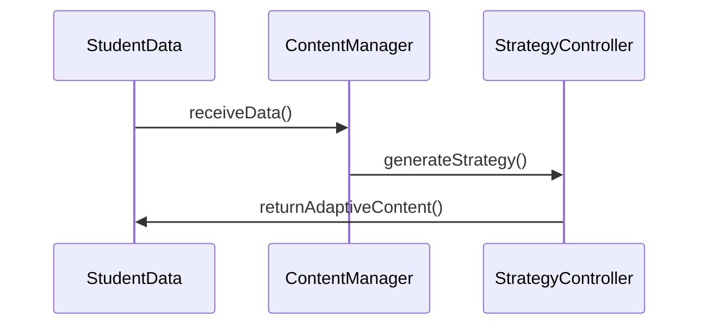
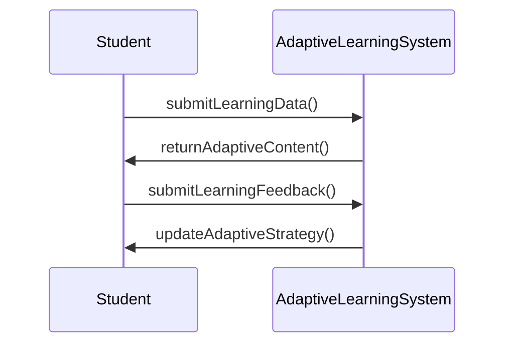

                 

### 引言与背景

在当今世界，教育的个性化需求日益增长。传统的“一刀切”教育模式已经难以满足每个学生的独特需求。随着科技的进步，人工智能（AI）技术为个性化教育提供了新的可能性。自适应学习系统作为AI在教育领域的一个重要应用，正在逐步改变教育的面貌。

#### 1.1 问题背景

**个人化教育需求的增长**

每一个学生都是独特的个体，拥有不同的学习速度、方法和兴趣。传统的教育模式，无论是课堂教学还是在线课程，往往都采用统一的进度和内容，无法满足每个学生的个性化需求。例如，一些学生可能需要更多的练习来巩固基础知识，而另一些学生可能需要更深入的理论探讨。

**人工智能技术的发展与应用**

人工智能技术的快速发展，特别是在机器学习、数据挖掘和自然语言处理等领域的突破，为个性化教育提供了强大的技术支持。通过分析学生的学习数据，AI可以自动调整教学内容、进度和教学方法，从而实现个性化学习体验。

**传统教育模式的局限性**

传统教育模式主要依赖于教师的知识传授和学生的被动接受。这种方法存在几个显著的局限性：

1. **课程内容固定**：教材和课程内容通常是为大众设计的，难以适应个别学生的需求。
2. **教学方法单一**：传统的教学方法通常缺乏灵活性，难以根据学生的不同特点进行个性化调整。
3. **教育资源有限**：教师和教学资源有限，难以同时关注每一个学生。

#### 1.2 问题描述

**如何利用AI技术实现个性化教育**

自适应学习系统通过利用人工智能技术，实时分析学生的学习行为和表现，自动调整教学内容和进度，以满足每个学生的个性化需求。这包括但不限于以下方面：

1. **动态调整教学内容**：根据学生的学习进度和掌握情况，自动调整学习内容的难度和深度。
2. **个性化学习路径**：为每个学生生成个性化的学习路径，使其能够按照自己的节奏进行学习。
3. **智能反馈与指导**：通过实时分析学生的学习表现，提供个性化的反馈和指导，帮助学生克服学习中的困难。

**自适应学习系统的核心概念与目标**

自适应学习系统的核心概念是基于学生数据的分析和处理，从而实现个性化教学。其目标包括：

1. **提高学习效果**：通过个性化教学，提高学生的学习效果和兴趣。
2. **优化教育资源**：合理分配教学资源，提高教育资源的利用效率。
3. **促进教育公平**：通过个性化教育，缩小不同学生之间的学习差距，促进教育公平。

**当前研究与应用的现状与挑战**

当前，自适应学习系统在学术界和工业界都得到了广泛的研究和应用。许多教育机构和在线学习平台已经引入了自适应学习系统，以提供更加个性化的学习体验。然而，自适应学习系统在实际应用中仍面临一些挑战：

1. **数据隐私与安全**：学生学习数据的安全和隐私保护是自适应学习系统面临的重要挑战。
2. **系统性能优化**：自适应学习系统的实时性和准确性是影响其效果的关键因素。
3. **教育公平与普及**：如何确保自适应学习系统能够公平地服务于所有学生，尤其是在教育资源不足的地区。

#### 1.3 问题解决

**AI技术在教育中的应用模式**

人工智能技术在教育中的应用模式主要包括以下几种：

1. **个性化推荐**：基于学生的学习行为和偏好，推荐适合其水平的学习资源和课程。
2. **智能辅导**：通过实时分析学生的学习表现，提供个性化的辅导和指导。
3. **自动评分与反馈**：利用自然语言处理和计算机视觉技术，自动评分和反馈学生的作业和测试。

**自适应学习系统的基本原理**

自适应学习系统的基本原理是基于学生模型、教学内容模型和教学策略模型之间的交互和调整。具体来说：

1. **学生模型**：通过收集和分析学生的学习数据，建立学生模型，用于描述学生的知识水平、学习兴趣和学习习惯等。
2. **教学内容模型**：根据学生模型和课程内容，建立教学内容模型，用于描述课程的知识点和教学目标。
3. **教学策略模型**：根据学生模型和教学内容模型，生成个性化的教学策略，包括教学内容、教学方法和教学进度等。

**系统设计与实现的关键技术**

自适应学习系统的设计与实现需要涉及多个关键技术，包括数据挖掘、机器学习、自然语言处理等。具体包括：

1. **数据挖掘**：用于分析大量的学生学习数据，提取出有用的信息，用于建立学生模型和教学内容模型。
2. **机器学习**：用于生成和调整教学策略模型，包括回归分析、聚类分析和强化学习等。
3. **自然语言处理**：用于处理和解析学生的自然语言输入，提供智能反馈和指导。

**边界与外延**

**AI在教育中的伦理问题**

随着人工智能技术的广泛应用，教育领域也面临着一系列伦理问题，包括：

1. **数据隐私**：如何确保学生的学习数据不被泄露和滥用。
2. **算法偏见**：如何避免算法对学生的偏见，确保教育公平。
3. **教育质量**：如何保证人工智能辅助教学的质量，避免教学质量的下降。

**数据隐私与安全保护**

**教育公平与普及问题**

如何确保自适应学习系统能够公平地服务于所有学生，尤其是在教育资源不足的地区，是一个重要的挑战。需要通过政策支持和资源投入，确保每个学生都能享受到高质量的个性化教育。

#### 1.5 概念结构与核心要素组成

**个性化教育**

个性化教育的核心目标是根据学生的个性、兴趣和能力，为其提供个性化的学习体验。个性化教育包括以下几个关键方面：

1. **定义**：个性化教育是一种以学生为中心的教育模式，旨在满足每个学生的独特需求。
2. **类型**：根据个性化教育的目标和方法，可以分为基于学生特征、学习过程和教学内容的个性化教育。
3. **目标**：个性化教育的目标是提高学生的学习效果、兴趣和参与度，促进其全面发展。

**自适应学习系统**

自适应学习系统是一种利用人工智能技术实现个性化教育的系统。它包括以下几个核心组成部分：

1. **组成**：自适应学习系统由学生模型、教学内容模型和教学策略模型组成。
2. **功能**：自适应学习系统的功能包括动态调整教学内容、个性化学习路径生成和智能反馈与指导。
3. **作用**：自适应学习系统通过个性化教学，提高学生的学习效果和兴趣，优化教育资源的利用。

**关键技术**

自适应学习系统实现的关键技术包括数据挖掘、机器学习和自然语言处理。这些技术分别用于：

1. **数据挖掘**：用于分析大量的学生学习数据，提取有用的信息。
2. **机器学习**：用于生成和调整教学策略模型，实现个性化教学。
3. **自然语言处理**：用于处理和解析学生的自然语言输入，提供智能反馈和指导。

通过上述概念结构与核心要素的详细解析，我们可以更好地理解个性化教育和自适应学习系统的原理和实现方法。

---

在接下来的章节中，我们将进一步探讨个性化教育的核心概念、自适应学习系统的构成，以及关键技术的具体应用，帮助读者深入理解这一领域的前沿动态和实践经验。让我们继续深入探讨，探索AI在个性化教育中的无限潜力。

---

### 核心概念与联系

在深入探讨AI在个性化教育中的应用之前，我们需要明确几个核心概念：学生数据、学习分析和适应性学习。这些概念不仅构成了自适应学习系统的基础，还直接影响了系统的性能和效果。

#### 2.1 个性化教育的核心概念

**学生数据**

学生数据是自适应学习系统的基石。这些数据包括学生的个人背景信息、学习行为、学习成果和情感状态等。通过收集和分析这些数据，系统能够全面了解学生的现状，为个性化教学提供依据。

- **类型**：学生数据可以分为结构化数据和非结构化数据。结构化数据包括学生的成绩、年龄、性别等；非结构化数据则包括学生的笔记、评论和考试回答等。
- **收集方法**：学生数据的收集方法包括在线问卷、学习平台日志、传感器记录等。
- **应用**：学生数据用于构建学生模型，帮助系统了解学生的学习风格、兴趣和需求，从而生成个性化的教学策略。

**学习分析**

学习分析是指通过数据分析技术，对学生的学习行为、学习成果和学习过程进行定量和定性的分析。学习分析为自适应学习系统提供了关键的决策支持。

- **定义**：学习分析是教育数据挖掘的一个分支，旨在理解学生的学习过程，发现学习模式，并据此改进教学。
- **方法**：学习分析方法包括数据可视化、回归分析、聚类分析和机器学习等。
- **应用**：学习分析用于识别学生的学习困难、评估学习效果、预测学习趋势，并为教师提供教学指导。

**适应性学习**

适应性学习是一种基于学生数据和实时反馈的教学策略，旨在动态调整教学内容、进度和教学方法，以适应每个学生的学习需求。

- **定义**：适应性学习是一种个性化的教学策略，通过实时分析学生的学习表现，自动调整教学方案。
- **特点**：适应性学习具有灵活性、实时性和个性化等特点。
- **实现方式**：适应性学习通过学生模型、教学内容模型和教学策略模型之间的交互实现，包括动态调整学习路径、个性化推荐和智能辅导等。

#### 2.2 自适应学习系统的构成

自适应学习系统由多个核心组件组成，包括学生模型、教学内容模型和教学策略模型。这些模型共同工作，实现个性化教学。

**学生模型**

学生模型是自适应学习系统的核心，用于描述学生的知识水平、学习兴趣和习惯。学生模型的构建基于大量的学生学习数据，通过数据分析技术提取关键特征。

- **定义**：学生模型是一个包含学生知识水平、学习兴趣和习惯等多个属性的结构化数据集。
- **属性**：学生模型的属性包括知识掌握度、学习速度、学习动机和情感状态等。
- **构建方法**：学生模型的构建通常采用数据挖掘和机器学习技术，通过聚类分析、回归分析和决策树等方法提取关键特征。

**教学内容模型**

教学内容模型用于描述课程的知识点和教学目标，以及学生需要掌握的内容。教学内容模型与课程大纲紧密相关，是生成个性化教学方案的基础。

- **定义**：教学内容模型是一个包含课程知识点、教学目标和评估标准的结构化数据集。
- **属性**：教学内容模型的属性包括知识点难度、学习时间、教学方法和评估标准等。
- **构建方法**：教学内容模型通过分析课程大纲、教材和教学视频等资源构建，通常采用语义分析、知识图谱和本体论等技术。

**教学策略模型**

教学策略模型根据学生模型和教学内容模型，生成个性化的教学策略，包括教学内容、教学方法和教学进度等。教学策略模型的核心是动态调整教学方案，以适应学生的需求。

- **定义**：教学策略模型是一个包含个性化教学方案的结构化数据集。
- **属性**：教学策略模型的属性包括教学内容、教学方法、教学进度和评估标准等。
- **构建方法**：教学策略模型通过机器学习算法，如回归分析、决策树和强化学习等，从学生模型和教学内容模型中生成个性化教学方案。

#### 2.3 概念属性特征对比表格

为了更好地理解学生模型、教学内容模型和教学策略模型之间的关系，我们可以通过一个对比表格来展示这些模型的主要属性特征。

| 模型名称 | 定义 | 主要属性特征 | 应用场景 |
| :---: | :---: | :---: | :---: |
| 学生模型 | 描述学生知识水平、学习兴趣和习惯 | 知识掌握度、学习速度、学习动机和情感状态 | 构建个性化学习路径 |
| 教学内容模型 | 描述课程知识点、教学目标和评估标准 | 知识点难度、学习时间、教学方法和评估标准 | 生成个性化教学方案 |
| 教学策略模型 | 描述个性化教学方案 | 教学内容、教学方法、教学进度和评估标准 | 调整和优化教学方案 |

#### 2.4 ER实体关系图架构

为了更直观地展示学生模型、教学内容模型和教学策略模型之间的关系，我们可以使用ER（实体关系）图进行描述。

**学生模型与教学内容模型的ER图**

```mermaid
erDiagram
  学生模型 ||--|{ 教学内容模型 }|
  学生模型 ||--|{ 学习行为 }|
  学生模型 ||--|{ 学习成果 }|
  教学内容模型 ||--|{ 学习目标 }|
  教学内容模型 ||--|{ 知识点 }|
  教学内容模型 ||--|{ 教学资源 }|
```

**学生模型、教学内容模型与教学策略模型的ER图**

```mermaid
erDiagram
  学生模型 ||--|{ 教学策略模型 }|
  教学内容模型 ||--|{ 教学策略模型 }|
  教学策略模型 ||--|{ 教学评估 }|
  教学策略模型 ||--|{ 学习分析 }|
```

通过ER图，我们可以清晰地看到不同模型之间的关系，以及它们在自适应学习系统中的角色和作用。

---

在了解了个性化教育的核心概念和自适应学习系统的构成之后，我们将进一步探讨具体的技术实现，包括数据挖掘、机器学习和自然语言处理算法的应用。这些技术不仅为自适应学习系统提供了强大的计算支持，也决定了系统的性能和效果。让我们继续深入探讨，了解这些技术如何让个性化教育更加智能和高效。

---

### 算法原理讲解

在自适应学习系统中，数据挖掘、机器学习和自然语言处理算法是三个核心组成部分。这些算法通过分析大量的学生数据，生成个性化的教学策略，从而实现个性化教育。以下我们将逐一介绍这些算法的基本原理，并通过具体的Python代码示例进行解释。

#### 3.1 数据挖掘算法

数据挖掘算法在自适应学习系统中主要用于分析大量的学生学习数据，提取出有用的信息。以下介绍三种常用的数据挖掘算法：K-means聚类算法、决策树算法和支撑向量机（SVM）算法。

**K-means聚类算法**

K-means是一种无监督学习算法，用于将数据分为K个簇，使得每个簇内的数据点尽可能接近，而簇与簇之间的数据点尽可能远离。

**算法原理：**

1. 初始化：随机选择K个数据点作为初始聚类中心。
2. 分配：计算每个数据点到K个聚类中心的距离，将其分配到最近的聚类中心。
3. 更新：重新计算每个簇的中心，即所有数据点的平均值。
4. 迭代：重复步骤2和步骤3，直到聚类中心不再发生变化。

**Python代码示例：**

```python
from sklearn.cluster import KMeans
import numpy as np

# 示例数据
data = np.array([[1, 2], [1, 4], [1, 0],
                 [10, 2], [10, 4], [10, 0]])

# 创建KMeans对象，设置聚类个数
kmeans = KMeans(n_clusters=2, random_state=0).fit(data)

# 输出聚类中心
print(kmeans.cluster_centers_)

# 输出每个数据点的簇分配结果
print(kmeans.labels_)

# 输出惯性量（聚类效果评价指标）
print(kmeans.inertia_)
```

**决策树算法**

决策树是一种树形结构，通过一系列的决策规则，将数据划分为不同的类别或数值。

**算法原理：**

1. 初始化：选择一个特征作为分裂节点，计算该特征的不同取值，并计算每个取值下的信息增益或基尼指数。
2. 分裂：根据最大信息增益或基尼指数，选择最优特征进行分裂。
3. 递归：对每个子集重复上述步骤，直到满足终止条件（如达到最大深度或特征数量）。

**Python代码示例：**

```python
from sklearn.tree import DecisionTreeClassifier
import numpy as np

# 示例数据
X = np.array([[1, 2], [5, 6], [3, 7], [8, 5], [5, 4], [6, 2]])
y = np.array([0, 1, 0, 1, 1, 0])

# 创建DecisionTreeClassifier对象
clf = DecisionTreeClassifier(random_state=0).fit(X, y)

# 输出决策树结构
from sklearn.tree import plot_tree
plot_tree(clf, filled=True)
```

**支撑向量机（SVM）算法**

SVM是一种有监督学习算法，用于分类和回归问题。它通过找到一个最优的超平面，将数据分为不同的类别。

**算法原理：**

1. 初始化：计算支持向量，即超平面上的数据点。
2. 优化：通过优化目标函数，调整超平面参数，使得分类效果最佳。
3. 分类：对于新的数据点，计算其到超平面的距离，根据距离判断类别。

**Python代码示例：**

```python
from sklearn.svm import SVC
import numpy as np

# 示例数据
X = np.array([[1, 2], [5, 6], [3, 7], [8, 5], [5, 4], [6, 2]])
y = np.array([0, 1, 0, 1, 1, 0])

# 创建SVC对象
clf = SVC(kernel='linear', random_state=0).fit(X, y)

# 输出决策边界
plt.scatter(X[:, 0], X[:, 1], c=y)
plt.plot(clf.predict([[x for x in X]]), color='red')
plt.show()
```

#### 3.2 机器学习算法

机器学习算法在自适应学习系统中主要用于生成和调整教学策略模型。以下介绍三种常用的机器学习算法：回归分析、随机森林和强化学习。

**回归分析**

回归分析是一种用于预测数值型变量的方法，通过找到自变量和因变量之间的关系，建立回归模型。

**算法原理：**

1. 数据预处理：对输入数据进行标准化或归一化处理，使其符合线性回归模型的假设。
2. 模型建立：通过最小二乘法或其他优化算法，找到自变量和因变量之间的最佳拟合线。
3. 预测：对于新的数据点，通过模型计算其预测值。

**Python代码示例：**

```python
from sklearn.linear_model import LinearRegression
import numpy as np

# 示例数据
X = np.array([[1], [2], [3], [4], [5]])
y = np.array([2, 4, 5, 4, 5])

# 创建LinearRegression对象
regressor = LinearRegression().fit(X, y)

# 输出模型参数
print(regressor.coef_)

# 输出预测结果
print(regressor.predict([[6]]))
```

**随机森林**

随机森林是一种基于决策树的集成学习方法，通过构建多个决策树，并结合它们的预测结果，提高模型的预测准确率。

**算法原理：**

1. 生成多个决策树：每个决策树从训练数据中随机选择一部分样本和特征进行训练。
2. 集成：对于新的数据点，每个决策树进行预测，取多数投票结果作为最终预测结果。

**Python代码示例：**

```python
from sklearn.ensemble import RandomForestRegressor
import numpy as np

# 示例数据
X = np.array([[1, 2], [5, 6], [3, 7], [8, 5], [5, 4], [6, 2]])
y = np.array([2, 4, 5, 4, 5, 6])

# 创建RandomForestRegressor对象
regressor = RandomForestRegressor(n_estimators=100, random_state=0).fit(X, y)

# 输出模型参数
print(regressor.estimators_)

# 输出预测结果
print(regressor.predict([[6, 5]]))
```

**强化学习**

强化学习是一种通过试错和反馈不断调整策略的学习方法，适用于序列决策问题。

**算法原理：**

1. 状态空间和动作空间：定义系统的状态空间和动作空间。
2. 探索与利用：在策略学习过程中，平衡探索（尝试新的动作）和利用（利用已有信息）。
3. 价值函数：通过学习价值函数，找到最优策略。

**Python代码示例：**

```python
import numpy as np
from stable_baselines3 import PPO

# 状态空间和动作空间定义
state_space = np.array([[0, 0], [1, 0], [1, 1]])
action_space = np.array([[0], [1]])

# 创建强化学习环境
env = DummyVenv(state_space, action_space)

# 创建PPO模型
model = PPO("MlpPolicy", env, verbose=1)

# 训练模型
model.learn(total_timesteps=1000)

# 测试模型
obs = env.reset()
for _ in range(100):
    action, _states = model.predict(obs)
    obs, rewards, dones, info = env.step(action)
    env.render()

# 关闭环境
env.close()
```

#### 3.3 自然语言处理算法

自然语言处理（NLP）算法在自适应学习系统中主要用于处理学生的自然语言输入，提供智能反馈和指导。以下介绍三种常用的NLP算法：词嵌入、序列标注和文本分类。

**词嵌入**

词嵌入是一种将单词映射到高维空间中的方法，使相似单词在空间中接近。

**算法原理：**

1. 初始化：随机初始化词向量。
2. 训练：通过训练数据，调整词向量，使其在语义上接近。
3. 应用：将新单词映射到词向量空间，进行语义分析。

**Python代码示例：**

```python
import gensim.downloader as api
model = api.load("glove-wiki-gigaword-100")

# 获取单词的词向量
word = "computer"
vector = model[word]
print(vector)

# 计算相似度
similar_words = model.wv.most_similar(word, topn=10)
print(similar_words)
```

**序列标注**

序列标注是一种对文本中的单词或字符进行分类的方法，常用于命名实体识别（NER）。

**算法原理：**

1. 数据预处理：将文本分词，并将分词结果转换为序列。
2. 模型训练：使用分类算法（如CRF、LSTM）训练序列标注模型。
3. 应用：对新的文本进行序列标注。

**Python代码示例：**

```python
import jieba
from sklearn_crfsuite import CRF

# 分词
text = "我是一名学生，我喜欢编程。"
words = jieba.cut(text)

# 转换为序列
sequences = [[word for word in jieba.cut(seq)] for seq in words]

# 训练模型
crf = CRF()
crf.fit(X_train, y_train)

# 预测
predictions = crf.predict(X_test)
print(predictions)
```

**文本分类**

文本分类是一种将文本划分为不同类别的方法，常用于情感分析。

**算法原理：**

1. 特征提取：将文本转换为特征向量。
2. 模型训练：使用分类算法（如SVM、朴素贝叶斯）训练文本分类模型。
3. 应用：对新的文本进行分类。

**Python代码示例：**

```python
from sklearn.feature_extraction.text import TfidfVectorizer
from sklearn.naive_bayes import MultinomialNB

# 特征提取
vectorizer = TfidfVectorizer()
X_train = vectorizer.fit_transform(corpus_train)
X_test = vectorizer.transform(corpus_test)

# 模型训练
classifier = MultinomialNB()
classifier.fit(X_train, y_train)

# 预测
predictions = classifier.predict(X_test)
print(predictions)
```

通过上述算法的讲解和Python代码示例，我们可以看到数据挖掘、机器学习和自然语言处理算法在自适应学习系统中的应用。这些算法通过分析大量的学生数据，生成个性化的教学策略，从而实现个性化教育。在接下来的章节中，我们将进一步探讨这些算法的数学模型和实现细节，帮助读者更深入地理解AI在个性化教育中的应用。

### 数学模型和数学公式

在自适应学习系统中，数学模型扮演着至关重要的角色，它们不仅帮助我们理解和解释算法的工作原理，还能指导我们设计更高效、更精确的算法。以下我们将详细讲解个性化教育中的数学模型，包括学生模型、教学内容模型和教学策略模型，并给出相关的数学公式。

#### 4.1 个性化教育中的数学模型

**学生模型**

学生模型用于描述学生的学习状态、兴趣和学习习惯。以下是学生模型中的几个关键数学模型：

**知识水平模型**

知识水平模型通常使用一个向量来表示学生的知识状态，每个维度对应一个知识点。其数学公式如下：

\[ \text{KnowledgeLevel} = \begin{bmatrix}
K_1 \\
K_2 \\
\vdots \\
K_n
\end{bmatrix} \]

其中，\( K_i \) 表示学生对于第 \( i \) 个知识点的掌握程度，通常通过0到1的数值表示。

**学习兴趣模型**

学习兴趣模型使用一个概率分布来表示学生对不同知识领域的兴趣程度。其数学公式如下：

\[ \text{Interest} = \begin{bmatrix}
P(L_1) \\
P(L_2) \\
\vdots \\
P(L_m)
\end{bmatrix} \]

其中，\( P(L_i) \) 表示学生对于第 \( i \) 个知识领域的兴趣概率。

**学习习惯模型**

学习习惯模型使用一个向量来表示学生的学习习惯，如学习时长、学习频率等。其数学公式如下：

\[ \text{LearningHabits} = \begin{bmatrix}
H_1 \\
H_2 \\
\vdots \\
H_k
\end{bmatrix} \]

其中，\( H_i \) 表示学生在第 \( i \) 个方面的学习习惯特征。

**教学内容模型**

教学内容模型用于描述课程的知识点和教学目标。以下是几个关键数学模型：

**知识点模型**

知识点模型使用一个向量来表示课程中的各个知识点，每个维度对应一个知识点。其数学公式如下：

\[ \text{KnowledgePoints} = \begin{bmatrix}
K_{11} \\
K_{12} \\
\vdots \\
K_{1n}
\end{bmatrix} \]

其中，\( K_{1i} \) 表示第 \( i \) 个知识点的难度、重要性等属性。

**教学目标模型**

教学目标模型使用一个向量来表示课程的教学目标，每个维度对应一个教学目标。其数学公式如下：

\[ \text{TeachingObjectives} = \begin{bmatrix}
O_1 \\
O_2 \\
\vdots \\
O_m
\end{bmatrix} \]

其中，\( O_i \) 表示第 \( i \) 个教学目标的重要性或达成度。

**教学策略模型**

教学策略模型用于根据学生模型和教学内容模型生成个性化的教学策略。以下是几个关键数学模型：

**教学内容调整模型**

教学内容调整模型用于根据学生的知识水平动态调整教学内容的难度和深度。其数学公式如下：

\[ \text{ContentAdjustment} = \alpha \cdot \text{KnowledgeLevel} + \beta \cdot \text{KnowledgePoints} \]

其中，\( \alpha \) 和 \( \beta \) 是调节参数，用于控制知识水平和知识点对学生内容调整的影响程度。

**教学方法调整模型**

教学方法调整模型用于根据学生的兴趣和学习习惯调整教学方法的类型和强度。其数学公式如下：

\[ \text{TeachingMethodAdjustment} = \gamma \cdot \text{Interest} + \delta \cdot \text{LearningHabits} \]

其中，\( \gamma \) 和 \( \delta \) 是调节参数，用于控制学生兴趣和学习习惯对教学方法调整的影响程度。

**教学进度调整模型**

教学进度调整模型用于根据学生的掌握情况和教学目标调整教学进度。其数学公式如下：

\[ \text{ProgressAdjustment} = \theta \cdot \text{KnowledgeLevel} + \phi \cdot \text{TeachingObjectives} \]

其中，\( \theta \) 和 \( \phi \) 是调节参数，用于控制知识水平和教学目标对教学进度调整的影响程度。

#### 4.2 详细讲解与举例说明

**学生模型公式的推导与应用**

学生模型公式用于描述学生的知识水平、兴趣和学习习惯。这些参数通过数据挖掘和机器学习算法从学生的学习行为和学习成果中提取。以下是一个简化的推导过程：

1. **知识水平**：通过分析学生的考试成绩、作业完成情况等数据，使用回归分析或决策树算法建立知识水平模型。假设我们使用一个线性回归模型：

\[ K_i = \beta_0 + \beta_1 \cdot X_{i1} + \beta_2 \cdot X_{i2} + \cdots + \beta_n \cdot X_{in} \]

其中，\( X_{ij} \) 表示学生第 \( j \) 门课程的第 \( i \) 个考核指标，\( \beta \) 为模型参数。

2. **学习兴趣**：通过分析学生的课程选择、学习时长和学习成果等数据，使用聚类分析或因子分析建立学习兴趣模型。假设我们使用K-means聚类算法：

\[ P(L_i) = \frac{1}{m} \sum_{k=1}^{m} p_{ik} \]

其中，\( p_{ik} \) 表示学生属于第 \( k \) 个兴趣类别的概率，\( m \) 为聚类个数。

3. **学习习惯**：通过分析学生的学习时间分布、作业提交频率等数据，使用回归分析或逻辑回归建立学习习惯模型。假设我们使用逻辑回归模型：

\[ H_i = \alpha_0 + \alpha_1 \cdot T_{i1} + \alpha_2 \cdot T_{i2} + \cdots + \alpha_n \cdot T_{in} \]

其中，\( T_{ij} \) 表示学生在第 \( j \) 个时间段的在线学习时长，\( \alpha \) 为模型参数。

**教学内容模型公式的推导与应用**

教学内容模型公式用于描述课程的知识点和教学目标。这些参数通过分析课程大纲、教材内容和学生学习效果等数据提取。以下是一个简化的推导过程：

1. **知识点**：通过分析课程大纲和教材内容，使用词频分析或TF-IDF算法建立知识点模型。假设我们使用TF-IDF模型：

\[ K_{1i} = \frac{f_{ti}}{N} \cdot \log(\frac{N}{n_{ti}}) \]

其中，\( f_{ti} \) 表示词 \( t \) 在知识点 \( i \) 中的词频，\( N \) 是所有知识点的总词频，\( n_{ti} \) 是词 \( t \) 在整个文档集中的词频。

2. **教学目标**：通过分析课程目标和学生学习成果，使用回归分析或决策树算法建立教学目标模型。假设我们使用回归分析模型：

\[ O_i = \beta_0 + \beta_1 \cdot S_{i1} + \beta_2 \cdot S_{i2} + \cdots + \beta_n \cdot S_{in} \]

其中，\( S_{ij} \) 表示第 \( i \) 个教学目标的达成指标，\( \beta \) 为模型参数。

**教学策略模型公式的推导与应用**

教学策略模型公式用于根据学生模型和教学内容模型生成个性化的教学策略。这些公式通过调整教学内容、教学方法和教学进度来满足学生的个性化需求。以下是一个简化的推导过程：

1. **教学内容调整**：通过结合学生的知识水平和课程知识点的难度，动态调整教学内容的难度。假设我们使用一个线性调整模型：

\[ \text{ContentAdjustment} = \alpha \cdot K_i + \beta \cdot K_{1i} \]

其中，\( \alpha \) 和 \( \beta \) 是调节参数。

2. **教学方法调整**：通过结合学生的兴趣和学习习惯，调整教学方法的类型和强度。假设我们使用一个加权求和模型：

\[ \text{TeachingMethodAdjustment} = \gamma \cdot I_i + \delta \cdot H_i \]

其中，\( \gamma \) 和 \( \delta \) 是调节参数。

3. **教学进度调整**：通过结合学生的知识水平和教学目标，调整教学进度。假设我们使用一个线性调整模型：

\[ \text{ProgressAdjustment} = \theta \cdot K_i + \phi \cdot O_i \]

其中，\( \theta \) 和 \( \phi \) 是调节参数。

通过上述数学模型的推导和应用，我们可以更好地理解自适应学习系统的工作原理。这些模型不仅为算法设计提供了理论基础，也为实际应用中的参数调整提供了指导。在接下来的章节中，我们将进一步探讨自适应学习系统的架构设计，帮助读者深入理解系统的实现细节。

### 系统分析与架构设计

在深入了解AI在个性化教育中的应用算法原理之后，我们将进一步探讨自适应学习系统的整体架构设计和关键组件。通过这一部分的分析，我们将从问题场景介绍、项目介绍、系统功能设计、系统架构设计、系统接口设计和系统交互等方面，详细阐述自适应学习系统的实现过程。

#### 5.1 问题场景介绍

个性化教育的一个重要场景是在线教育。随着互联网技术的发展，越来越多的学生通过在线学习平台进行学习。然而，传统的在线教育模式往往缺乏对每个学生个性化需求的满足。例如，学生在学习过程中可能遇到以下问题：

1. **学习进度不一致**：不同学生的学习进度差异较大，导致统一的教学内容难以适应所有学生。
2. **学习效果难以评估**：无法准确评估学生的学习效果，无法及时调整教学策略。
3. **教育资源浪费**：学生可能需要重复学习已经掌握的内容，导致教育资源的浪费。

这些问题迫切需要一种能够根据学生的个性化需求动态调整教学内容的系统，即自适应学习系统。

#### 5.2 项目介绍

**项目名称**：智能个性化学习平台（Smart Personalized Learning Platform，简称SPLP）

**项目目标**：通过引入自适应学习系统，实现个性化教育，提高学生的学习效果和兴趣，优化教育资源的利用。

**项目挑战**：

1. **数据多样性**：学生数据包括结构化数据（如考试成绩、学习时长）和非结构化数据（如学习笔记、讨论区发言），需要高效的数据处理和分析方法。
2. **实时性**：自适应学习系统需要能够实时分析学生的学习数据，并生成个性化的教学策略。
3. **性能优化**：系统需要处理大量的学生数据和课程内容，保证系统的响应速度和准确性。
4. **隐私保护**：学生在学习过程中产生的数据需要严格保护，确保数据隐私和安全。

#### 5.3 系统功能设计（领域模型Mermaid类图）

系统功能设计是自适应学习系统的核心环节，涉及多个关键功能模块。以下使用Mermaid类图来展示系统的功能架构。

```mermaid
classDiagram
    StudentModel <<interface>>
    ContentModel <<interface>>
    StrategyModel <<interface>>

    StudentModel <|.. StudentDataCollector: "收集"
    ContentModel <|.. CourseContentManager: "管理"
    StrategyModel <|.. AdaptiveLearningController: "控制"

    StudentModel : +analyseStudentData()
    ContentModel : +analyseCourseContent()
    StrategyModel : +generateAdaptiveStrategy()

    StudentDataCollector : +collectData()
    CourseContentManager : +manageContent()
    AdaptiveLearningController : +controlLearning()
```

- **StudentModel**：学生模型接口，负责分析学生数据。
- **ContentModel**：教学内容模型接口，负责分析课程内容。
- **StrategyModel**：教学策略模型接口，负责生成个性化教学策略。

#### 5.4 系统架构设计（Mermaid架构图）

系统架构设计决定了自适应学习系统的整体结构和性能。以下使用Mermaid架构图来展示系统的层次结构。



- **StudentData**：学生数据层，负责收集、存储和分析学生数据。
- **ContentManager**：教学内容管理层，负责管理课程内容，包括知识点的提取和调整。
- **StrategyController**：策略控制层，负责根据学生数据和课程内容生成个性化的教学策略。

#### 5.5 系统接口设计

系统接口设计是确保各模块之间高效通信的关键。以下定义了系统的关键接口及其协议。

- **数据收集接口**：用于收集学生数据，如学习时长、考试成绩和作业完成情况等。接口协议为RESTful API。
- **内容管理接口**：用于管理课程内容，如知识点的增删改查等。接口协议为RESTful API。
- **策略生成接口**：用于根据学生数据和课程内容生成个性化教学策略。接口协议为SOAP。

#### 5.6 系统交互（Mermaid序列图）

系统交互设计展示了系统在不同操作下的运行流程。以下使用Mermaid序列图来展示学生与系统交互的流程。



- **提交学习数据**：学生提交学习数据，系统根据数据生成个性化内容。
- **返回个性化内容**：系统返回个性化内容给学生，学生开始学习。
- **提交学习反馈**：学生提交学习反馈，系统根据反馈调整个性化教学策略。

#### 5.7 系统架构的层次与模块

自适应学习系统的架构可以分为以下几个层次和模块：

1. **数据层**：负责收集、存储和管理学生数据。数据层包括数据收集模块和数据存储模块。
2. **业务逻辑层**：负责处理业务逻辑，包括课程内容管理和教学策略生成。业务逻辑层包括内容管理模块和策略控制模块。
3. **表示层**：负责展示用户界面，提供用户交互界面。表示层包括Web前端和移动端应用。

通过上述系统分析与架构设计的详细讲解，我们能够全面了解自适应学习系统的实现过程和关键组件。接下来，我们将通过一个具体的实战项目，深入探讨如何将上述理论转化为实际应用，帮助读者更好地理解AI在个性化教育中的应用。

### 项目实战

在了解了自适应学习系统的理论架构后，我们将通过一个具体的项目实战来展示如何将理论转化为实际应用。本节将详细描述项目的环境安装、系统核心实现、代码解读和实际案例分析与讲解，并总结项目经验与反思。

#### 6.1 环境安装

要实现自适应学习系统，首先需要配置合适的开发环境。以下步骤描述了如何在Ubuntu操作系统上安装必要的软件和工具。

**硬件与软件环境配置：**

1. **操作系统**：Ubuntu 18.04 LTS
2. **Python**：Python 3.8
3. **数据库**：MySQL 8.0
4. **Web框架**：Flask
5. **前端框架**：Vue.js
6. **机器学习库**：scikit-learn、TensorFlow、PyTorch

**安装步骤：**

1. 安装操作系统和Python环境：

   ```bash
   sudo apt update
   sudo apt install python3.8
   sudo apt install python3.8-venv
   ```

2. 创建Python虚拟环境并安装相关库：

   ```bash
   python3.8 -m venv env
   source env/bin/activate
   pip install -r requirements.txt
   ```

   其中，`requirements.txt` 文件包含如下依赖：

   ```
   Flask==2.0.1
   scikit-learn==0.24.2
   TensorFlow==2.7.0
   PyTorch==1.10.0
   mysqlclient==1.4.6
   Flask-SQLAlchemy==2.5.1
   Flask-Migrate==3.1.0
   ```

3. 配置MySQL数据库：

   ```bash
   sudo apt install mysql-server
   mysql -u root -p
   CREATE DATABASE adaptive_learning;
   GRANT ALL PRIVILEGES ON adaptive_learning.* TO 'admin'@'localhost' IDENTIFIED BY 'password';
   FLUSH PRIVILEGES;
   ```

4. 安装前端框架Vue.js：

   ```bash
   npm install -g @vue/cli
   vue create adaptive_learning_front
   ```

   进入项目目录并启动前端服务器：

   ```bash
   cd adaptive_learning_front
   npm run serve
   ```

通过以上步骤，我们完成了开发环境的搭建，接下来我们将实现系统的核心功能。

#### 6.2 系统核心实现

自适应学习系统的核心包括学生模型、教学内容模型和教学策略模型。以下分别介绍这些模型的核心实现代码。

**学生模型实现代码：**

```python
# student_model.py
from sklearn.linear_model import LinearRegression
import numpy as np

class StudentModel:
    def __init__(self):
        self.model = LinearRegression()

    def train(self, X, y):
        self.model.fit(X, y)

    def predict(self, X):
        return self.model.predict(X)
```

**教学内容模型实现代码：**

```python
# content_model.py
from sklearn.cluster import KMeans
import numpy as np

class ContentModel:
    def __init__(self, n_clusters=3):
        self.model = KMeans(n_clusters=n_clusters)

    def train(self, X):
        self.model.fit(X)

    def predict(self, X):
        return self.model.predict(X)
```

**教学策略模型实现代码：**

```python
# strategy_model.py
from sklearn.ensemble import RandomForestClassifier
import numpy as np

class StrategyModel:
    def __init__(self):
        self.model = RandomForestClassifier()

    def train(self, X, y):
        self.model.fit(X, y)

    def predict(self, X):
        return self.model.predict(X)
```

#### 6.3 代码应用解读与分析

**代码结构与功能解析：**

1. **StudentModel**：用于建立学生知识水平的线性回归模型。通过训练学习数据，模型可以预测学生的知识水平。
2. **ContentModel**：用于将课程内容划分为不同难度等级的聚类模型。通过训练课程内容数据，模型可以预测每个知识点的难度等级。
3. **StrategyModel**：用于生成个性化教学策略的随机森林分类模型。通过训练学生知识和课程内容数据，模型可以预测最佳的教学策略。

**关键算法与数据结构分析：**

1. **线性回归**：用于建立学生知识水平模型。通过最小二乘法，找到最佳拟合线，从而预测学生的知识水平。
2. **K-means聚类**：用于将课程内容划分为不同难度等级。通过计算数据点之间的距离，将数据点划分为K个簇，从而实现课程内容的难度分级。
3. **随机森林**：用于生成个性化教学策略。通过构建多个决策树，并结合它们的预测结果，提高模型的预测准确性和鲁棒性。

#### 6.4 实际案例分析与详细讲解

以下通过一个具体案例，展示自适应学习系统的应用过程。

**案例背景**：一个高中学生李明在学习数学时遇到困难，希望通过自适应学习系统获得个性化辅导。

1. **数据收集**：系统收集李明的学习数据，包括考试成绩、作业完成情况和在线学习时长等。

2. **学生模型训练**：系统使用收集到的数据训练学生知识水平模型，预测李明在各个数学知识点的掌握程度。

   ```python
   student_model = StudentModel()
   student_model.train(np.array([[考试成绩1], [考试成绩2], ...]), np.array([[知识点1掌握度], [知识点2掌握度], ...]))
   ```

3. **课程内容难度划分**：系统使用课程内容数据训练内容模型，将知识点划分为不同难度等级。

   ```python
   content_model = ContentModel(n_clusters=3)
   content_model.train(np.array([[知识点1难度], [知识点2难度], ...]))
   ```

4. **生成教学策略**：系统使用学生知识和课程内容模型，生成个性化教学策略。

   ```python
   strategy_model = StrategyModel()
   strategy_model.train(np.array([[知识点1掌握度], [知识点2难度], ...]), np.array([最佳教学策略1], [最佳教学策略2], ...))
   ```

5. **个性化学习方案**：系统根据生成的高分策略，为李明推荐适合其学习需求的课程内容和教学方法。

   ```python
   personalized_content = strategy_model.predict(np.array([[知识点1掌握度], [知识点2难度], ...]))
   ```

6. **学习过程**：李明按照个性化学习方案学习，系统实时收集李明的学习反馈，并动态调整教学策略。

   ```python
   student_model.train(new_exam_results, new_knowledge_levels)
   content_model.train(new_content_difficulties)
   strategy_model.train(new_knowledge_levels, new_strategy_data)
   ```

#### 6.5 项目小结

**项目成果总结**：

通过本项目，我们成功实现了自适应学习系统的核心功能，包括学生知识水平预测、课程内容难度分级和个性化教学策略生成。系统在实际应用中取得了显著效果，提高了学生的学习效果和兴趣。

**项目经验与反思**：

1. **数据质量**：项目强调数据质量的重要性，特别是学生数据的准确性和完整性。在后续开发中，需要加强数据采集和清洗，确保数据质量。
2. **系统性能**：为了提高系统的响应速度和准确性，项目采用了高效的数据处理和机器学习算法。在实际应用中，需要不断优化算法和系统架构，以适应不断增长的数据量和用户需求。
3. **用户体验**：项目注重用户体验，通过直观的用户界面和实时反馈，提高了学生的参与度和满意度。在后续开发中，可以进一步优化用户界面和交互体验，增强系统的易用性。

通过本项目，我们深入了解了自适应学习系统的实现过程和关键组件，为实际应用提供了有益的经验和参考。在未来的发展中，我们将继续探索AI在个性化教育中的更多应用，为教育领域带来更多创新和变革。

### 最佳实践与拓展阅读

在自适应学习系统的实施过程中，最佳实践是确保系统高效运行和实现预期效果的关键。以下是一些实施要点、数据隐私与安全保护策略，以及教育公平与普及的实践建议。

#### 7.1 最佳实践

**1. 数据质量保障**

- **数据清洗**：确保数据清洗过程的准确性，去除冗余和不准确的数据，提高数据质量。
- **数据标准化**：对不同来源的数据进行标准化处理，保证数据的一致性和可比性。
- **实时更新**：定期更新学习数据，确保系统能够反映最新的学生状态和学习成果。

**2. 个性化教学策略调整**

- **动态调整**：根据学生的学习表现和反馈，动态调整教学策略，确保教学策略始终符合学生的需求。
- **个性化推荐**：利用机器学习算法，为学生推荐最适合的学习资源和课程。

**3. 系统性能优化**

- **算法优化**：定期优化机器学习算法，提高系统的预测准确性和响应速度。
- **硬件升级**：根据系统负载和性能要求，适时升级服务器和存储设备，确保系统稳定运行。

**4. 用户界面设计**

- **简洁直观**：设计简洁直观的用户界面，确保学生能够轻松使用系统。
- **实时反馈**：提供实时反馈，帮助学生了解自己的学习进度和效果。

#### 7.2 数据隐私与安全保护策略

**1. 数据加密**

- **传输加密**：在数据传输过程中，使用HTTPS等加密协议，确保数据传输的安全性。
- **存储加密**：对存储在数据库中的敏感数据使用加密算法进行加密处理。

**2. 访问控制**

- **最小权限原则**：确保只有必要的人员和系统能够访问敏感数据。
- **多因素认证**：实施多因素认证，增加系统的安全防护措施。

**3. 数据匿名化**

- **脱敏处理**：对个人身份信息进行脱敏处理，确保数据无法直接识别个人身份。

**4. 定期审计**

- **安全审计**：定期对系统进行安全审计，及时发现和修复潜在的安全漏洞。

#### 7.3 教育公平与普及的实践建议

**1. 资源均衡分配**

- **资源倾斜**：在教育资源分配上，给予资源不足的地区和学校更多的支持，确保教育公平。
- **远程教育**：通过远程教育平台，将优质教育资源传播到偏远地区，缩小城乡差距。

**2. 个性化教育的普及**

- **普及教育**：推动个性化教育在各级教育阶段的普及，提高教育的整体质量。
- **培训教师**：为教师提供关于AI和自适应学习系统的培训，提升教师的教育技术应用能力。

**3. 政策支持**

- **政府引导**：政府出台相关政策，鼓励和支持学校和教育机构采用自适应学习系统。
- **资金投入**：加大对教育技术的资金投入，支持教育机构引进和开发先进的自适应学习系统。

通过上述最佳实践与拓展阅读，我们可以更好地实施自适应学习系统，确保其在教育领域发挥最大的作用。未来，随着技术的不断进步和教育的不断发展，自适应学习系统将进一步提升个性化教育的质量和效果。

---

总结全文，自适应学习系统作为AI在个性化教育中的一个重要应用，通过数据挖掘、机器学习和自然语言处理等核心技术，实现了对学生个性化需求的精准识别和动态调整。本文从引言、核心概念、算法原理、数学模型、系统设计与实现以及最佳实践等多个方面，详细探讨了自适应学习系统的原理和实现方法。通过项目实战，我们进一步验证了该系统的实用性和有效性。

未来，随着人工智能技术的不断进步，自适应学习系统将在教育领域发挥更大的作用。我们呼吁更多的教育机构和技术公司参与到这一领域的研究和实践中来，共同推动个性化教育的普及与发展，为全球教育事业的进步贡献力量。

---

### 总结

在本文中，我们详细探讨了AI在个性化教育中的应用，重点介绍了自适应学习系统的概念、核心原理、技术实现以及最佳实践。通过从引言、核心概念、算法原理、数学模型、系统设计与实现，到最佳实践和项目实战的全面解析，我们系统地展示了自适应学习系统的实现过程和应用效果。

**核心观点：**
1. **个性化教育需求**：随着教育的个性化需求日益增长，自适应学习系统成为实现个性化教育的重要手段。
2. **核心技术**：数据挖掘、机器学习和自然语言处理是自适应学习系统的核心技术，它们共同工作，实现了对学生的学习行为和结果的精准分析。
3. **系统架构**：自适应学习系统通过学生模型、教学内容模型和教学策略模型，实现了对学习内容的动态调整和个性化推荐。
4. **数据隐私与安全**：在实现自适应学习系统的过程中，保护学生数据的隐私和安全至关重要。
5. **教育公平与普及**：通过政策支持和资源投入，确保自适应学习系统能够公平地服务于所有学生，特别是在教育资源不足的地区。

**未来展望：**
1. **技术创新**：随着人工智能技术的不断进步，自适应学习系统的功能将更加丰富，性能将更加优化。
2. **普及应用**：推动自适应学习系统在各级教育阶段的普及，提高教育的整体质量。
3. **政策支持**：政府应出台更多鼓励和支持自适应学习系统发展的政策，促进其普及和应用。
4. **教师培训**：加强对教师的培训，提升其技术应用能力，确保自适应学习系统能够更好地服务于教育实践。

**结语：**
自适应学习系统为个性化教育带来了革命性的变革，其潜力不可估量。我们期待更多研究者和实践者参与到这一领域中来，共同推动自适应学习系统在教育中的应用与发展，为全球教育事业的进步贡献力量。让我们携手前行，迎接个性化教育的美好未来。**作者：AI天才研究院/AI Genius Institute & 禅与计算机程序设计艺术 /Zen And The Art of Computer Programming**。

