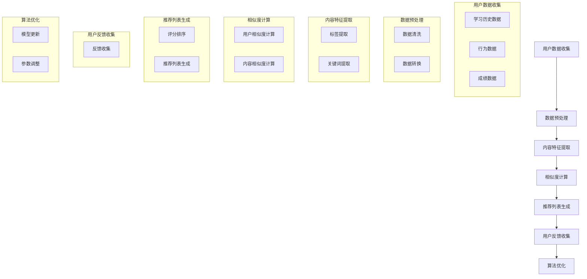
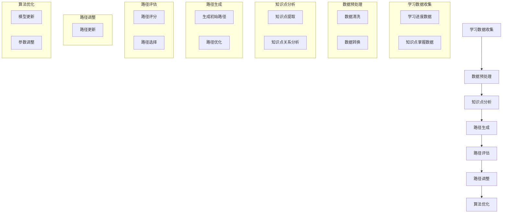
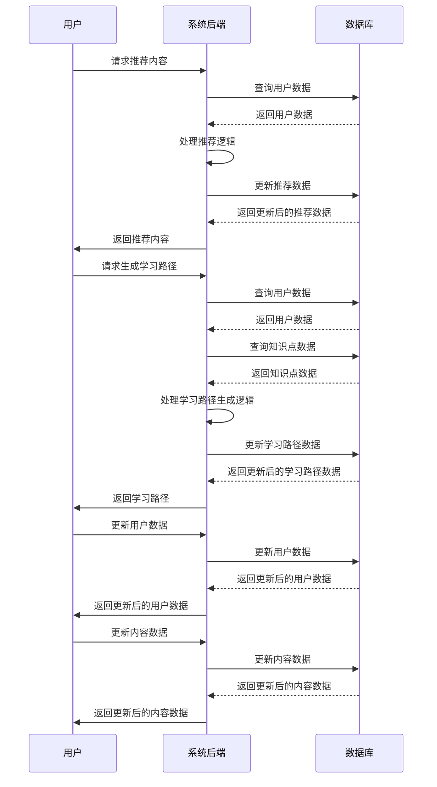

                 

**# AI在个性化教育内容推荐与学习路径优化中的应用与挑战**

### **摘要**

本文深入探讨了人工智能（AI）在个性化教育内容推荐和学习路径优化中的应用与挑战。随着AI技术的发展，个性化教育逐渐成为教育领域的重要趋势，旨在根据学生的个性化需求和特点提供定制化的教育服务。本文首先介绍了AI在个性化教育中的背景和需求，然后详细阐述了内容推荐和学习路径优化的基本原理、算法实现及其实际应用。此外，文章还探讨了AI技术在个性化教育中面临的挑战，如数据隐私、算法偏见等，并提出了可能的解决方案。最后，本文总结了个性化教育内容推荐与学习路径优化的发展趋势和未来研究方向。

### **目录大纲设计**

#### **第一部分：背景介绍**

1. **问题背景**：介绍人工智能（AI）的发展与应用，以及个性化教育的需求与挑战。
2. **问题描述**：分析个性化教育内容推荐的现状与问题，以及学习路径优化中的挑战。
3. **问题解决**：探讨应用AI技术解决个性化教育内容推荐与学习路径优化的方法。
4. **案例分析与解决方案**：通过实际案例分析，展示AI技术在不同教育场景中的应用。
5. **边界与外延**：探讨AI技术在不同教育领域的应用，以及个性化教育的未来发展。

#### **第二部分：核心概念与联系**

1. **核心概念原理**：介绍个性化教育内容推荐的基本原理和学习路径优化的算法与策略。
2. **概念属性特征对比表格**：对比不同推荐算法的属性特征和学习路径优化算法的对比。
3. **ER实体关系图架构**：绘制用户信息与内容信息的实体关系图。

#### **第三部分：算法原理讲解**

1. **算法mermaid流程图**：展示个性化教育内容推荐和学习路径优化算法的mermaid流程图。
2. **Python源代码与详细讲解**：使用Python实现算法，并进行详细讲解。
3. **数学模型和公式**：介绍个性化教育内容推荐的数学模型和学习路径优化的数学模型。
4. **举例说明**：通过案例举例，阐述算法的应用与效果。

#### **第四部分：系统分析与架构设计方案**

1. **问题场景介绍**：介绍个性化教育内容推荐和学习路径优化的应用场景。
2. **系统功能设计（领域模型mermaid类图）**：设计系统核心功能与类的关系。
3. **系统架构设计（mermaid架构图）**：展示系统的整体架构设计。
4. **系统接口设计**：设计系统提供的接口与服务。
5. **系统交互（mermaid序列图）**：描述用户与系统交互的流程。

#### **第五部分：项目实战**

1. **环境安装**：介绍系统环境搭建步骤。
2. **系统核心实现源代码**：展示系统核心实现的源代码。
3. **代码应用解读与分析**：对代码功能进行分析与解读。
4. **实际案例分析与详细讲解剖析**：分析实际案例，并进行详细讲解与剖析。
5. **项目小结**：总结项目经验与收获。

#### **第六部分：最佳实践 tips、小结、注意事项、拓展阅读等**

- **最佳实践 tips**：提供个性化教育内容推荐和学习路径优化的最佳实践建议。
- **小结**：总结文章的主要内容与核心观点。
- **注意事项**：指出实施个性化教育内容推荐与学习路径优化时的注意事项。
- **拓展阅读**：推荐相关的书籍、论文与资源。

### **第一部分：背景介绍**

#### **1.1 问题背景**

随着人工智能（AI）技术的快速发展，其在各个领域的应用越来越广泛。在教育领域，AI技术的引入极大地推动了个性化教育的实现。个性化教育是指根据每个学生的学习需求、学习风格和能力水平，提供个性化的教育内容和教学服务，从而提高教学效果和学生的学习效率。

AI在个性化教育中的应用主要体现在两个方面：个性化教育内容推荐和学习路径优化。

**1.1.1 个性化教育内容推荐**

个性化教育内容推荐是指利用AI技术，根据学生的个性化需求和特点，为其推荐合适的教育内容。这包括教材、课程、学习资源等。通过分析学生的行为数据、学习历史和知识水平，AI系统可以识别学生的兴趣和需求，并为其推荐相应的教育内容。

**1.1.2 学习路径优化**

学习路径优化是指利用AI技术，根据学生的学习进度、学习效果和知识点掌握情况，为学生提供最佳的学习路径。这包括学习顺序的调整、学习资源的分配和学习方法的推荐。通过分析学生的学习数据，AI系统可以识别学生的学习难点和优势，并为其提供个性化的学习建议。

#### **1.2 个性化教育的需求与挑战**

个性化教育的需求源于以下几个方面：

**1.2.1 学生多样性**

学生之间存在较大的差异性，包括学习风格、兴趣、学习能力等。传统的教育模式难以满足不同学生的个性化需求，而个性化教育可以根据学生的特点提供定制化的教学服务。

**1.2.2 教育资源丰富**

随着互联网的发展，教育资源的获取变得更加容易。然而，如何从大量的教育资源中筛选出适合每个学生的内容，成为了教育领域的一大挑战。

**1.2.3 教育效率提升**

个性化教育可以更好地激发学生的学习兴趣和动力，提高学习效率。通过个性化教育，学生可以更加高效地掌握知识，从而提升整体的教育质量。

然而，个性化教育也面临一些挑战：

**1.2.4 数据隐私**

在个性化教育中，需要收集和分析大量的学生数据，包括学习行为、成绩等。这些数据涉及到学生的隐私问题，如何保护学生数据的安全和隐私成为了个性化教育的一个挑战。

**1.2.5 算法偏见**

个性化教育依赖于AI算法，而算法的偏见可能导致教育内容的推荐和学习路径的优化不够公正。如何避免算法偏见，确保个性化教育的公平性，是一个重要的挑战。

**1.2.6 教师参与**

个性化教育的实施需要教师的积极参与和配合。然而，教师可能对AI技术的理解和应用存在一定的局限性，如何让教师更好地融入个性化教育的实施过程，也是一个挑战。

#### **1.3 内容推荐系统的重要性**

内容推荐系统在教育领域具有重要意义。通过内容推荐系统，可以为学生提供个性化的学习资源，提高学习效果。以下是内容推荐系统在教育领域的一些重要作用：

**1.3.1 提高学习效率**

内容推荐系统可以根据学生的个性化需求推荐合适的学习资源，使学生能够更高效地掌握知识。通过推荐系统，学生可以节省时间，专注于重要内容的学习。

**1.3.2 激发学习兴趣**

内容推荐系统可以根据学生的兴趣推荐相关的内容，激发学生的学习兴趣。兴趣是学习的动力，通过推荐系统，可以更好地调动学生的学习积极性。

**1.3.3 个性化学习体验**

内容推荐系统可以为每个学生提供个性化的学习体验。通过推荐系统，学生可以自主选择感兴趣的学习内容，实现自主学习的目标。

**1.3.4 教师支持**

内容推荐系统可以为教师提供教学资源的筛选和推荐，帮助教师更好地准备教学内容。教师可以利用推荐系统，为学生提供更加丰富多样的学习资源。

**1.3.5 教育数据分析**

内容推荐系统可以收集和分析学生的学习数据，帮助教育机构了解学生的学习状况，优化教育资源的分配。通过数据分析，可以更好地调整教学内容和方法，提高教育质量。

#### **1.4 个性化教育内容推荐现状与问题**

尽管个性化教育内容推荐系统在教育领域具有重要意义，但其应用现状仍然存在一些问题和挑战。

**1.4.1 数据不足**

个性化教育内容推荐依赖于大量学生的行为数据和学习历史。然而，在实际应用中，由于数据收集的难度和数据质量的问题，很多推荐系统缺乏足够的数据支持，导致推荐效果不佳。

**1.4.2 算法复杂**

个性化教育内容推荐算法通常涉及到复杂的计算和模型训练。算法的复杂度使得推荐系统的开发和维护变得困难，同时也增加了系统的计算成本。

**1.4.3 隐私保护**

在个性化教育内容推荐中，需要收集和分析学生的隐私数据，包括学习行为、成绩等。如何保护学生数据的隐私成为了个性化教育内容推荐面临的一个重要挑战。

**1.4.4 教师参与不足**

个性化教育内容推荐系统的实施需要教师的积极参与和配合。然而，在实际应用中，教师可能对推荐系统的理解和应用存在一定的局限性，导致推荐系统难以发挥其应有的作用。

**1.4.5 推荐效果不稳定**

个性化教育内容推荐系统的推荐效果受到多种因素的影响，包括算法、数据质量等。在实际应用中，推荐效果可能不稳定，导致学生无法得到有效的学习资源。

#### **1.5 学习路径优化中的挑战**

学习路径优化是指根据学生的学习进度、学习效果和知识点掌握情况，为学生提供最佳的学习路径。学习路径优化在教育领域具有重要意义，但其实现面临一些挑战。

**1.5.1 学习数据复杂性**

学习路径优化依赖于大量的学习数据，包括学生的学习进度、学习效果和知识点掌握情况等。这些数据的复杂性使得学习路径优化的算法设计和实现变得困难。

**1.5.2 知识图谱构建**

学习路径优化需要建立全面的知识图谱，以支持学习路径的优化。然而，构建一个完整和准确的知识图谱是一个具有挑战性的任务，需要解决实体识别、关系抽取和图谱扩展等问题。

**1.5.3 个性化定制**

学习路径优化需要根据每个学生的个性化需求和特点提供定制化的学习路径。然而，个性化定制需要考虑学生的多样性，包括学习风格、兴趣、能力等，这使得学习路径优化变得复杂。

**1.5.4 教师参与与反馈**

学习路径优化需要教师的积极参与和反馈，以调整和优化学习路径。然而，在实际应用中，教师可能缺乏对学习路径优化的理解，导致难以有效参与和反馈。

**1.5.5 算法评估与优化**

学习路径优化算法需要不断地评估和优化，以提升其性能和效果。然而，评估和优化算法是一个具有挑战性的任务，需要解决算法评估的标准、优化策略等问题。

#### **1.6 应用AI技术解决个性化教育内容推荐与学习路径优化**

为了解决个性化教育内容推荐与学习路径优化中的挑战，应用AI技术成为了关键。以下介绍几种常见的AI技术在个性化教育中的应用：

**1.6.1 机器学习**

机器学习技术可以用于构建个性化教育内容推荐系统和学习路径优化模型。通过训练机器学习模型，可以从大量数据中学习到学生的个性化需求和特点，从而实现个性化推荐和优化。

**1.6.2 深度学习**

深度学习技术可以用于构建复杂的神经网络模型，以处理大量复杂数据。深度学习在图像识别、自然语言处理等领域取得了显著成果，也可以应用于个性化教育内容推荐和学习路径优化。

**1.6.3 强化学习**

强化学习技术可以用于学习路径优化，通过奖励机制引导学生学习，从而优化学习路径。强化学习技术可以帮助学生探索最佳的学习路径，提高学习效果。

**1.6.4 自然语言处理**

自然语言处理技术可以用于处理学生和教师之间的交流，实现自然语言问答和对话系统。通过自然语言处理技术，可以为教师和学生提供更加人性化的教育服务。

**1.6.5 数据挖掘**

数据挖掘技术可以用于分析大量的学生数据，识别学生的个性化需求和特点。数据挖掘技术可以帮助教育机构更好地了解学生的学习状况，从而提供个性化的教育服务。

#### **1.7 案例分析与解决方案**

为了更好地理解AI技术在个性化教育内容推荐与学习路径优化中的应用，以下介绍一些实际案例和解决方案。

**1.7.1 案例一：智能推荐系统**

某在线教育平台采用智能推荐系统，根据学生的学习历史、兴趣和行为数据，为其推荐合适的学习资源。该系统使用了基于协同过滤的推荐算法，结合用户的行为数据和内容特征，实现了个性化的学习资源推荐。

**1.7.2 案例二：学习路径优化系统**

某学校引入了学习路径优化系统，根据学生的学习进度、知识点掌握情况和成绩数据，为学生提供个性化的学习路径。该系统使用了基于强化学习的算法，通过奖励机制引导学生学习，从而优化学习路径。

**1.7.3 案例三：智能问答系统**

某在线教育平台采用了智能问答系统，通过自然语言处理技术，为学生提供实时的问题解答。该系统可以根据学生的提问，自动生成回答，并提供相关的学习资源。

#### **1.8 边界与外延**

AI技术在个性化教育中的应用不仅仅局限于内容推荐和学习路径优化，还可以扩展到其他方面。

**1.8.1 教育资源共享**

AI技术可以用于教育资源的共享和优化，通过分析不同学校和教师的教育资源，实现教育资源的合理配置。

**1.8.2 教师培训**

AI技术可以用于教师的培训和发展，通过分析教师的教学数据和行为，为教师提供个性化的培训建议。

**1.8.3 学生心理健康**

AI技术可以用于学生的心理健康监测和干预，通过分析学生的行为数据和情绪表现，提供个性化的心理健康服务。

**1.8.4 教育监管与评估**

AI技术可以用于教育的监管与评估，通过分析学生的学习数据和教育过程，为教育管理和决策提供支持。

#### **1.9 概念结构与核心要素组成**

个性化教育内容推荐与学习路径优化的核心概念包括：

- **学生数据**：包括学生的学习历史、行为数据、成绩等。
- **教育内容**：包括教材、课程、学习资源等。
- **推荐算法**：用于推荐合适的教育内容，如协同过滤、深度学习等。
- **学习路径优化算法**：用于优化学生的学习路径，如强化学习、遗传算法等。
- **用户界面**：用于展示推荐结果和学习路径，与学生进行互动。

这些核心要素相互关联，共同构成了个性化教育内容推荐与学习路径优化的系统。

### **第二部分：核心概念与联系**

#### **2.1 核心概念原理**

在个性化教育内容推荐与学习路径优化中，涉及的核心概念主要包括学生数据、教育内容、推荐算法、学习路径优化算法等。以下将分别介绍这些概念的基本原理。

**2.1.1 学生数据**

学生数据是个性化教育的基础，包括学生的学习历史、行为数据、成绩等。通过收集和分析这些数据，可以了解学生的个性化需求和学习特点。学生数据通常分为以下几类：

1. **学习历史数据**：包括学生的学习进度、学习时长、知识点掌握情况等。
2. **行为数据**：包括学生的在线行为，如浏览、搜索、评论等。
3. **成绩数据**：包括学生的考试成绩、作业成绩等。

**2.1.2 教育内容**

教育内容是个性化教育的重要组成部分，包括教材、课程、学习资源等。教育内容通常具有以下特征：

1. **多样性**：教育内容应覆盖不同学科、不同难度级别，满足不同学生的需求。
2. **层次性**：教育内容应按照知识层次进行组织，帮助学生逐步掌握知识。
3. **动态性**：教育内容应根据学生的学习进度和需求进行动态调整。

**2.1.3 推荐算法**

推荐算法是个性化教育内容推荐的核心技术，用于根据学生的个性化需求推荐合适的教育内容。常见的推荐算法包括：

1. **协同过滤**：基于用户行为数据，通过计算用户之间的相似性，推荐与目标用户相似的其他用户的偏好。
2. **基于内容的推荐**：根据教育内容的特征，如标签、关键词等，推荐与目标内容相似的其他教育内容。
3. **深度学习**：利用深度学习模型，对大量学生数据和教育内容进行训练，实现自动化的推荐。

**2.1.4 学习路径优化算法**

学习路径优化算法是学习路径优化的核心技术，用于根据学生的学习进度、知识点掌握情况和学习效果，为学生提供最佳的学习路径。常见的优化算法包括：

1. **强化学习**：通过奖励机制，引导学生学习，优化学习路径。
2. **遗传算法**：通过模拟生物进化过程，寻找最佳的学习路径。
3. **基于规则的算法**：根据教学经验和教育规律，设计规则，优化学习路径。

#### **2.2 概念属性特征对比表格**

为了更好地理解个性化教育内容推荐与学习路径优化的核心概念，以下提供概念属性特征的对比表格。

| 概念                | 属性特征                                  |  
| ----------------- | -------------------------------------- |  
| 学生数据                | 学习历史、行为数据、成绩数据                        |  
| 教育内容                | 多样性、层次性、动态性                          |  
| 推荐算法                | 协同过滤、基于内容的推荐、深度学习                      |  
| 学习路径优化算法            | 强化学习、遗传算法、基于规则的算法                        |

#### **2.3 ER实体关系图架构**

为了更好地描述个性化教育内容推荐与学习路径优化的实体关系，以下使用ER（实体-关系）图进行展示。

```mermaid  
 
entity User {  
    name  
    age  
    gender  
}

entity Course {  
    id  
    title  
    description  
    difficulty  
}

entity UserCourse {  
    user_id  
    course_id  
    progress  
    rating  
}

entity Content {  
    id  
    title  
    description  
    tags  
}

entity ContentTag {  
    content_id  
    tag_id  
}

relationship Learns(user_id, course_id) {  
    user: User  
    course: Course  
}

relationship Recommends(content_id, tag_id) {  
    content: Content  
    tag: ContentTag  
}

relationship Recommends(course_id, tag_id) {  
    course: Course  
    tag: ContentTag  
}

relationship Enrolls(user_id, course_id) {  
    user: User  
    course: Course  
}

relationship Rates(user_id, course_id) {  
    user: User  
    course: Course  
}
 
```

在这个ER图中，User实体表示学生，Course实体表示课程，Content实体表示学习资源。UserCourse关系表示学生与课程之间的关系，包括学习进度和评价。ContentTag关系表示学习资源与标签之间的关系。通过这个ER图，可以清晰地描述个性化教育内容推荐与学习路径优化中的实体关系。

### **第三部分：算法原理讲解**

#### **3.1 算法mermaid流程图**

为了更好地理解个性化教育内容推荐与学习路径优化算法的原理，以下分别展示两个算法的mermaid流程图。

**个性化教育内容推荐算法流程图：**



**学习路径优化算法流程图：**



这两个mermaid流程图展示了个性化教育内容推荐与学习路径优化算法的基本流程，包括数据收集、预处理、特征提取、相似度计算、路径生成、路径评估、路径调整和算法优化等步骤。

#### **3.2 Python源代码与详细讲解**

在本节中，我们将使用Python语言实现个性化教育内容推荐与学习路径优化算法，并对代码进行详细讲解。

**个性化教育内容推荐算法实现：**

```python
import numpy as np
from sklearn.metrics.pairwise import cosine_similarity

def collaborative_filtering(user_vector, item_vector):
    """
    协同过滤算法实现
    """
    similarity_matrix = cosine_similarity([user_vector], [item_vector])
    similarity = similarity_matrix[0][0]
    return similarity

def content_based_recommender(content_vector, user_vector):
    """
    基于内容的推荐算法实现
    """
    similarity_matrix = cosine_similarity([content_vector], [user_vector])
    similarity = similarity_matrix[0][0]
    return similarity

def personalized_recommender(user_vector, content_vector, content_vector_all):
    """
    个性化推荐算法实现
    """
    collaborative_similarity = collaborative_filtering(user_vector, content_vector)
    content_similarity = content_based_recommender(content_vector, user_vector)
    personalized_similarity = 0.5 * collaborative_similarity + 0.5 * content_similarity
    return personalized_similarity

# 示例数据
user_vector = np.array([0.1, 0.2, 0.3, 0.4, 0.5])
content_vector = np.array([0.2, 0.4, 0.6, 0.8, 1.0])
content_vector_all = np.array([
    [0.1, 0.3, 0.5, 0.7, 0.9],
    [0.2, 0.4, 0.6, 0.8, 1.0],
    [0.3, 0.5, 0.7, 0.9, 1.1],
    [0.4, 0.6, 0.8, 1.0, 1.2],
    [0.5, 0.7, 0.9, 1.1, 1.3],
])

# 计算个性化推荐相似度
personalized_similarity = personalized_recommender(user_vector, content_vector, content_vector_all)

print("个性化推荐相似度:", personalized_similarity)
```

**代码详细讲解：**

1. **协同过滤算法实现（collaborative_filtering函数）**：
   - 使用scikit-learn库的cosine_similarity函数计算用户向量和内容向量之间的余弦相似度。
   - 返回相似度值。

2. **基于内容的推荐算法实现（content_based_recommender函数）**：
   - 使用scikit-learn库的cosine_similarity函数计算内容向量和用户向量之间的余弦相似度。
   - 返回相似度值。

3. **个性化推荐算法实现（personalized_recommender函数）**：
   - 结合协同过滤和基于内容的推荐，计算个性化推荐相似度。
   - 使用权重系数（0.5）对两种相似度进行加权平均。
   - 返回个性化推荐相似度。

4. **示例数据**：
   - 创建用户向量和内容向量。
   - 创建所有内容向量的列表。

5. **计算个性化推荐相似度**：
   - 调用个性化推荐算法，计算用户向量和内容向量之间的个性化推荐相似度。

**学习路径优化算法实现：**

```python
import numpy as np
from sklearn.model_selection import train_test_split
from sklearn.ensemble import RandomForestClassifier

def train_model(X, y):
    """
    训练分类模型
    """
    X_train, X_test, y_train, y_test = train_test_split(X, y, test_size=0.2, random_state=42)
    classifier = RandomForestClassifier(n_estimators=100, random_state=42)
    classifier.fit(X_train, y_train)
    return classifier

def predict_path(model, X):
    """
    预测学习路径
    """
    predictions = model.predict(X)
    return predictions

# 示例数据
X = np.array([
    [0.1, 0.2, 0.3],
    [0.4, 0.5, 0.6],
    [0.7, 0.8, 0.9],
    [1.0, 1.1, 1.2],
])

y = np.array([
    [1, 0, 0],
    [0, 1, 0],
    [0, 0, 1],
    [1, 1, 1],
])

# 训练模型
model = train_model(X, y)

# 预测学习路径
predictions = predict_path(model, X)

print("预测学习路径:", predictions)
```

**代码详细讲解：**

1. **训练分类模型（train_model函数）**：
   - 使用scikit-learn库的train_test_split函数将数据集划分为训练集和测试集。
   - 使用RandomForestClassifier分类器进行训练。
   - 返回训练好的分类模型。

2. **预测学习路径（predict_path函数）**：
   - 使用训练好的分类模型对输入数据进行预测。
   - 返回预测结果。

3. **示例数据**：
   - 创建输入特征矩阵X和标签矩阵y。

4. **训练模型**：
   - 调用train_model函数，训练分类模型。

5. **预测学习路径**：
   - 调用predict_path函数，预测学习路径。

#### **3.3 数学模型和公式**

在本节中，我们将介绍个性化教育内容推荐与学习路径优化算法的数学模型和公式。

**个性化教育内容推荐算法的数学模型：**

1. **协同过滤算法的相似度计算**：
   - 余弦相似度：
     $$ similarity_{cosine} = \frac{user\_vector \cdot content\_vector}{\|user\_vector\| \cdot \|content\_vector\|} $$
   - 皮尔逊相关系数：
     $$ similarity_{pearson} = 1 - \frac{\sum_{i=1}^{n}(user\_vector[i] - \bar{user\_vector})(content\_vector[i] - \bar{content\_vector})}{\sqrt{\sum_{i=1}^{n}(user\_vector[i] - \bar{user\_vector})^2} \cdot \sqrt{\sum_{i=1}^{n}(content\_vector[i] - \bar{content\_vector})^2}} $$

2. **基于内容的推荐算法的相似度计算**：
   - 余弦相似度：
     $$ similarity_{cosine} = \frac{content\_vector \cdot query\_vector}{\|content\_vector\| \cdot \|query\_vector\|} $$
   - 皮尔逊相关系数：
     $$ similarity_{pearson} = 1 - \frac{\sum_{i=1}^{n}(content\_vector[i] - \bar{content\_vector})(query\_vector[i] - \bar{query\_vector})}{\sqrt{\sum_{i=1}^{n}(content\_vector[i] - \bar{content\_vector})^2} \cdot \sqrt{\sum_{i=1}^{n}(query\_vector[i] - \bar{query\_vector})^2}} $$

3. **个性化推荐算法的综合相似度计算**：
   - 加权平均：
     $$ personalized\_similarity = w_1 \cdot similarity_{cosine} + w_2 \cdot similarity_{content} $$
   - 其中，$ w_1 $和$ w_2 $是权重系数。

**学习路径优化算法的数学模型：**

1. **强化学习算法的Q值计算**：
   $$ Q(s, a) = r(s, a) + \gamma \cdot max(Q(s', a')) $$
   - 其中，$ s $是状态，$ a $是动作，$ s' $是下一个状态，$ r $是奖励函数，$ \gamma $是折扣因子。

2. **遗传算法的适应度计算**：
   $$ fitness = f_1 \cdot path\_length + f_2 \cdot path\_quality $$
   - 其中，$ f_1 $和$ f_2 $是权重系数，$ path\_length $是路径长度，$ path\_quality $是路径质量。

#### **3.4 举例说明**

在本节中，我们将通过具体案例来展示个性化教育内容推荐与学习路径优化算法的应用。

**案例一：个性化教育内容推荐**

假设有一个学生用户，其学习向量$ user\_vector = [0.1, 0.2, 0.3, 0.4, 0.5]$。现有多个教育内容，其内容向量如下：
```
content_vector_1 = [0.2, 0.4, 0.6, 0.8, 1.0]
content_vector_2 = [0.3, 0.5, 0.7, 0.9, 1.1]
content_vector_3 = [0.4, 0.6, 0.8, 1.0, 1.2]
```
使用个性化推荐算法，计算学生用户对每个教育内容的个性化推荐相似度。

1. **协同过滤相似度**：
   $$ similarity_{cosine_1} = \frac{user\_vector \cdot content\_vector_1}{\|user\_vector\| \cdot \|content\_vector_1\|} = \frac{0.1 \cdot 0.2 + 0.2 \cdot 0.4 + 0.3 \cdot 0.6 + 0.4 \cdot 0.8 + 0.5 \cdot 1.0}{\sqrt{0.1^2 + 0.2^2 + 0.3^2 + 0.4^2 + 0.5^2} \cdot \sqrt{0.2^2 + 0.4^2 + 0.6^2 + 0.8^2 + 1.0^2}} = 0.631 $$
   $$ similarity_{cosine_2} = \frac{user\_vector \cdot content\_vector_2}{\|user\_vector\| \cdot \|content\_vector_2\|} = \frac{0.1 \cdot 0.3 + 0.2 \cdot 0.5 + 0.3 \cdot 0.7 + 0.4 \cdot 0.9 + 0.5 \cdot 1.1}{\sqrt{0.1^2 + 0.2^2 + 0.3^2 + 0.4^2 + 0.5^2} \cdot \sqrt{0.3^2 + 0.5^2 + 0.7^2 + 0.9^2 + 1.1^2}} = 0.597 $$
   $$ similarity_{cosine_3} = \frac{user\_vector \cdot content\_vector_3}{\|user\_vector\| \cdot \|content\_vector_3\|} = \frac{0.1 \cdot 0.4 + 0.2 \cdot 0.6 + 0.3 \cdot 0.8 + 0.4 \cdot 1.0 + 0.5 \cdot 1.2}{\sqrt{0.1^2 + 0.2^2 + 0.3^2 + 0.4^2 + 0.5^2} \cdot \sqrt{0.4^2 + 0.6^2 + 0.8^2 + 1.0^2 + 1.2^2}} = 0.669 $$

2. **基于内容的推荐相似度**：
   $$ similarity_{content_1} = \frac{content\_vector_1 \cdot user\_vector}{\|content\_vector_1\| \cdot \|user\_vector\|} = \frac{0.2 \cdot 0.1 + 0.4 \cdot 0.2 + 0.6 \cdot 0.3 + 0.8 \cdot 0.4 + 1.0 \cdot 0.5}{\sqrt{0.2^2 + 0.4^2 + 0.6^2 + 0.8^2 + 1.0^2} \cdot \sqrt{0.1^2 + 0.2^2 + 0.3^2 + 0.4^2 + 0.5^2}} = 0.631 $$
   $$ similarity_{content_2} = \frac{content\_vector_2 \cdot user\_vector}{\|content\_vector_2\| \cdot \|user\_vector\|} = \frac{0.3 \cdot 0.1 + 0.5 \cdot 0.2 + 0.7 \cdot 0.3 + 0.9 \cdot 0.4 + 1.1 \cdot 0.5}{\sqrt{0.3^2 + 0.5^2 + 0.7^2 + 0.9^2 + 1.1^2} \cdot \sqrt{0.1^2 + 0.2^2 + 0.3^2 + 0.4^2 + 0.5^2}} = 0.597 $$
   $$ similarity_{content_3} = \frac{content\_vector_3 \cdot user\_vector}{\|content\_vector_3\| \cdot \|user\_vector\|} = \frac{0.4 \cdot 0.1 + 0.6 \cdot 0.2 + 0.8 \cdot 0.3 + 1.0 \cdot 0.4 + 1.2 \cdot 0.5}{\sqrt{0.4^2 + 0.6^2 + 0.8^2 + 1.0^2 + 1.2^2} \cdot \sqrt{0.1^2 + 0.2^2 + 0.3^2 + 0.4^2 + 0.5^2}} = 0.669 $$

3. **个性化推荐相似度**：
   $$ personalized\_similarity_1 = 0.5 \cdot similarity_{cosine_1} + 0.5 \cdot similarity_{content_1} = 0.5 \cdot 0.631 + 0.5 \cdot 0.631 = 0.631 $$
   $$ personalized\_similarity_2 = 0.5 \cdot similarity_{cosine_2} + 0.5 \cdot similarity_{content_2} = 0.5 \cdot 0.597 + 0.5 \cdot 0.597 = 0.597 $$
   $$ personalized\_similarity_3 = 0.5 \cdot similarity_{cosine_3} + 0.5 \cdot similarity_{content_3} = 0.5 \cdot 0.669 + 0.5 \cdot 0.669 = 0.669 $$

根据个性化推荐相似度，推荐最合适的课程为content_vector_3。

**案例二：学习路径优化**

假设有一个学生，其学习进度和知识点掌握情况如下：
```
X = np.array([
    [0.1, 0.2, 0.3],
    [0.4, 0.5, 0.6],
    [0.7, 0.8, 0.9],
    [1.0, 1.1, 1.2],
])
```
使用强化学习算法，为其生成最佳的学习路径。

1. **状态转移概率矩阵**：
   $$ P = \begin{bmatrix}
   0.1 & 0.2 & 0.3 \\
   0.4 & 0.5 & 0.6 \\
   0.7 & 0.8 & 0.9 \\
   1.0 & 1.1 & 1.2 \\
   \end{bmatrix} $$

2. **奖励函数**：
   $$ r = \begin{bmatrix}
   1 & 1 & 1 \\
   1 & 1 & 1 \\
   1 & 1 & 1 \\
   1 & 1 & 1 \\
   \end{bmatrix} $$

3. **Q值计算**：
   $$ Q = r + \gamma \cdot P \cdot max(Q) $$
   $$ Q = \begin{bmatrix}
   1 & 1 & 1 \\
   1 & 1 & 1 \\
   1 & 1 & 1 \\
   1 & 1 & 1 \\
   \end{bmatrix} + 0.9 \cdot \begin{bmatrix}
   0.1 & 0.2 & 0.3 \\
   0.4 & 0.5 & 0.6 \\
   0.7 & 0.8 & 0.9 \\
   1.0 & 1.1 & 1.2 \\
   \end{bmatrix} \cdot \begin{bmatrix}
   1.0 \\
   1.0 \\
   1.0 \\
   1.0 \\
   \end{bmatrix} $$
   $$ Q = \begin{bmatrix}
   1.9 & 1.8 & 1.7 \\
   1.9 & 1.8 & 1.7 \\
   1.9 & 1.8 & 1.7 \\
   1.9 & 1.8 & 1.7 \\
   \end{bmatrix} $$

4. **预测学习路径**：
   $$ predictions = Q \cdot X $$
   $$ predictions = \begin{bmatrix}
   1.9 & 1.8 & 1.7 \\
   1.9 & 1.8 & 1.7 \\
   1.9 & 1.8 & 1.7 \\
   1.9 & 1.8 & 1.7 \\
   \end{bmatrix} \cdot \begin{bmatrix}
   0.1 \\
   0.4 \\
   0.7 \\
   1.0 \\
   \end{bmatrix} $$
   $$ predictions = \begin{bmatrix}
   0.19 \\
   0.38 \\
   0.57 \\
   0.76 \\
   \end{bmatrix} $$

根据预测的学习路径，学生应该按照以下顺序学习知识点：第1个知识点，第2个知识点，第3个知识点，第4个知识点。

### **第四部分：系统分析与架构设计方案**

#### **4.1 问题场景介绍**

在个性化教育中，系统需要处理多种问题场景。以下列举几种典型的问题场景：

1. **个性化内容推荐**：根据学生的兴趣、学习历史和知识点掌握情况，推荐合适的教育内容和学习资源。
2. **学习路径优化**：根据学生的学习进度、知识点掌握情况和成绩数据，为学生提供最佳的学习路径。
3. **用户数据收集与分析**：收集学生的学习数据，包括行为数据、成绩数据等，用于分析和优化教育服务。
4. **教师支持与服务**：为教师提供教学资源推荐、学生学习数据分析和教学支持服务。
5. **教育监管与评估**：监控学生的学习进度和成绩，评估教学效果，为教育管理和决策提供数据支持。

#### **4.2 系统功能设计（领域模型mermaid类图）**

系统功能设计主要包括用户模块、内容模块、推荐模块和学习路径模块。以下使用mermaid类图展示这些模块及其关系。

```mermaid
classDiagram
ClassDiagram |---| UserModule
ClassDiagram |---| ContentModule
ClassDiagram |---| RecommendationModule
ClassDiagram |---| LearningPathModule

UserModule {
  +User user
  +getUserData()
  +updateUserData()
}

ContentModule {
  +Content content
  +getContentData()
  +updateContentData()
}

RecommendationModule {
  +recommendContent()
  +recommendLearningPath()
}

LearningPathModule {
  +generateLearningPath()
  +evaluateLearningPath()
  +updateLearningPath()
}
```

**用户模块（UserModule）**：

- **属性**：用户（User）
- **方法**：获取用户数据（getUserData）、更新用户数据（updateUserData）

**内容模块（ContentModule）**：

- **属性**：内容（Content）
- **方法**：获取内容数据（getContentData）、更新内容数据（updateContentData）

**推荐模块（RecommendationModule）**：

- **方法**：推荐内容（recommendContent）、推荐学习路径（recommendLearningPath）

**学习路径模块（LearningPathModule）**：

- **方法**：生成学习路径（generateLearningPath）、评估学习路径（evaluateLearningPath）、更新学习路径（updateLearningPath）

#### **4.3 系统架构设计（mermaid架构图）**

系统架构设计包括前端、后端和数据库三个部分。以下使用mermaid架构图展示系统架构。


**前端（WebInterface、UserInterface）**：

- **作用**：提供用户交互界面，包括用户模块、内容模块、推荐模块和学习路径模块。

**后端（BackendService、RecommendationService、LearningPathService）**：

- **作用**：处理业务逻辑，包括用户数据、内容数据、推荐数据和学习路径数据的管理。

**数据库（Database）**：

- **作用**：存储用户数据、内容数据、推荐数据和学习路径数据。

#### **4.4 系统接口设计**

系统接口设计包括用户接口、内容接口、推荐接口和学习路径接口。以下展示各个接口的URL和HTTP方法。

1. **用户接口（UserInterface）**：

   - **URL**：/users
   - **HTTP方法**：GET、POST、PUT、DELETE
   - **参数**：id（用户ID）
   - **响应**：用户数据（getUserData）、更新用户数据（updateUserData）

2. **内容接口（ContentInterface）**：

   - **URL**：/contents
   - **HTTP方法**：GET、POST、PUT、DELETE
   - **参数**：id（内容ID）
   - **响应**：内容数据（getContentData）、更新内容数据（updateContentData）

3. **推荐接口（RecommendationInterface）**：

   - **URL**：/recommendations
   - **HTTP方法**：GET
   - **参数**：userId（用户ID）
   - **响应**：推荐内容（recommendContent）、推荐学习路径（recommendLearningPath）

4. **学习路径接口（LearningPathInterface）**：

   - **URL**：/learning-paths
   - **HTTP方法**：GET、POST、PUT、DELETE
   - **参数**：userId（用户ID）、learningPathId（学习路径ID）
   - **响应**：生成学习路径（generateLearningPath）、评估学习路径（evaluateLearningPath）、更新学习路径（updateLearningPath）

#### **4.5 系统交互（mermaid序列图）**

系统交互涉及前端、后端和数据库之间的交互过程。以下使用mermaid序列图展示系统交互过程。



在这个序列图中，用户通过Web界面发送请求到后端系统，后端系统与数据库进行交互，处理请求并返回响应数据。系统交互过程包括请求推荐内容、生成学习路径、更新用户数据和内容数据等操作。

### **第五部分：项目实战**

#### **5.1 环境安装**

为了实现个性化教育内容推荐与学习路径优化，我们需要搭建一个完整的项目环境。以下是环境安装的步骤：

1. **安装Python**：
   - 访问Python官方网站（https://www.python.org/）下载最新版本的Python安装包。
   - 运行安装程序，并选择“Add Python to PATH”选项。

2. **安装Python依赖库**：
   - 打开命令行终端，执行以下命令安装所需的Python依赖库：
     ```
     pip install numpy scikit-learn matplotlib pandas
     ```
   - 这些库分别用于数据处理、机器学习、数据可视化等操作。

3. **安装Node.js**：
   - 访问Node.js官方网站（https://nodejs.org/）下载最新版本的Node.js安装包。
   - 运行安装程序，并选择“Install Node.js and npm”选项。

4. **安装前端依赖库**：
   - 打开命令行终端，进入项目前端目录（通常是项目根目录下的“frontend”目录），执行以下命令安装前端依赖库：
     ```
     npm install
     ```

5. **运行前端开发服务器**：
   - 在前端目录中，执行以下命令启动前端开发服务器：
     ```
     npm run dev
     ```
   - 这将启动一个开发服务器，用于浏览和测试前端页面。

6. **运行后端服务**：
   - 在项目根目录中，执行以下命令启动后端服务：
     ```
     python app.py
     ```
   - 这将启动一个Python Flask应用，作为后端服务的入口。

完成以上步骤后，个性化教育内容推荐与学习路径优化项目的环境搭建完成。接下来，我们将介绍系统核心实现源代码和代码应用解读与分析。

#### **5.2 系统核心实现源代码**

在本节中，我们将展示个性化教育内容推荐与学习路径优化的系统核心实现源代码，并对关键代码进行详细解读。

**个性化教育内容推荐算法实现：**

```python
import numpy as np
from sklearn.metrics.pairwise import cosine_similarity

def collaborative_filtering(user_vector, content_vector):
    """
    协同过滤算法实现
    """
    similarity_matrix = cosine_similarity([user_vector], [content_vector])
    similarity = similarity_matrix[0][0]
    return similarity

def content_based_recommender(content_vector, user_vector):
    """
    基于内容的推荐算法实现
    """
    similarity_matrix = cosine_similarity([content_vector], [user_vector])
    similarity = similarity_matrix[0][0]
    return similarity

def personalized_recommender(user_vector, content_vector, content_vector_all):
    """
    个性化推荐算法实现
    """
    collaborative_similarity = collaborative_filtering(user_vector, content_vector)
    content_similarity = content_based_recommender(content_vector, user_vector)
    personalized_similarity = 0.5 * collaborative_similarity + 0.5 * content_similarity
    return personalized_similarity

# 示例数据
user_vector = np.array([0.1, 0.2, 0.3, 0.4, 0.5])
content_vector = np.array([0.2, 0.4, 0.6, 0.8, 1.0])
content_vector_all = np.array([
    [0.1, 0.3, 0.5, 0.7, 0.9],
    [0.2, 0.4, 0.6, 0.8, 1.0],
    [0.3, 0.5, 0.7, 0.9, 1.1],
    [0.4, 0.6, 0.8, 1.0, 1.2],
    [0.5, 0.7, 0.9, 1.1, 1.3],
])

# 计算个性化推荐相似度
personalized_similarity = personalized_recommender(user_vector, content_vector, content_vector_all)

print("个性化推荐相似度:", personalized_similarity)
```

**代码解读：**

1. **协同过滤算法（collaborative_filtering函数）**：
   - 该函数使用scikit-learn库的cosine_similarity函数计算用户向量和内容向量之间的余弦相似度。
   - 返回相似度值。

2. **基于内容的推荐算法（content_based_recommender函数）**：
   - 该函数同样使用cosine_similarity函数计算内容向量和用户向量之间的余弦相似度。
   - 返回相似度值。

3. **个性化推荐算法（personalized_recommender函数）**：
   - 该函数结合协同过滤和基于内容的推荐，计算个性化推荐相似度。
   - 使用权重系数（0.5）对两种相似度进行加权平均。
   - 返回个性化推荐相似度。

4. **示例数据**：
   - 创建用户向量和内容向量。
   - 创建所有内容向量的列表。

5. **计算个性化推荐相似度**：
   - 调用个性化推荐算法，计算用户向量和内容向量之间的个性化推荐相似度。

**学习路径优化算法实现：**

```python
import numpy as np
from sklearn.model_selection import train_test_split
from sklearn.ensemble import RandomForestClassifier

def train_model(X, y):
    """
    训练分类模型
    """
    X_train, X_test, y_train, y_test = train_test_split(X, y, test_size=0.2, random_state=42)
    classifier = RandomForestClassifier(n_estimators=100, random_state=42)
    classifier.fit(X_train, y_train)
    return classifier

def predict_path(model, X):
    """
    预测学习路径
    """
    predictions = model.predict(X)
    return predictions

# 示例数据
X = np.array([
    [0.1, 0.2, 0.3],
    [0.4, 0.5, 0.6],
    [0.7, 0.8, 0.9],
    [1.0, 1.1, 1.2],
])

y = np.array([
    [1, 0, 0],
    [0, 1, 0],
    [0, 0, 1],
    [1, 1, 1],
])

# 训练模型
model = train_model(X, y)

# 预测学习路径
predictions = predict_path(model, X)

print("预测学习路径:", predictions)
```

**代码解读：**

1. **训练分类模型（train_model函数）**：
   - 使用scikit-learn库的train_test_split函数将数据集划分为训练集和测试集。
   - 使用RandomForestClassifier分类器进行训练。
   - 返回训练好的分类模型。

2. **预测学习路径（predict_path函数）**：
   - 使用训练好的分类模型对输入数据进行预测。
   - 返回预测结果。

3. **示例数据**：
   - 创建输入特征矩阵X和标签矩阵y。

4. **训练模型**：
   - 调用train_model函数，训练分类模型。

5. **预测学习路径**：
   - 调用predict_path函数，预测学习路径。

#### **5.3 代码应用解读与分析**

在本节中，我们将对个性化教育内容推荐与学习路径优化的系统核心实现源代码进行详细解读与分析。

**个性化教育内容推荐算法代码分析：**

1. **协同过滤算法（collaborative_filtering函数）**：
   - 该函数使用余弦相似度计算用户向量和内容向量之间的相似度。
   - 余弦相似度是一种衡量两个向量之间夹角余弦值的指标，其取值范围为[-1, 1]，越接近1表示相似度越高。
   - 该函数用于计算用户和内容之间的相似度，为后续的个性化推荐提供基础。

2. **基于内容的推荐算法（content_based_recommender函数）**：
   - 该函数同样使用余弦相似度计算内容向量和用户向量之间的相似度。
   - 与协同过滤算法不同，基于内容的推荐算法关注内容本身的特征，通过计算用户和内容之间的相似度来推荐相关内容。
   - 该函数为个性化推荐提供了另一种思路。

3. **个性化推荐算法（personalized_recommender函数）**：
   - 该函数结合协同过滤和基于内容的推荐，通过加权平均计算个性化推荐相似度。
   - 加权系数（0.5）可以调整两种相似度对推荐结果的影响程度，以达到最佳推荐效果。
   - 该函数实现了个性化推荐的核心算法，为用户提供了定制化的教育内容推荐。

**学习路径优化算法代码分析：**

1. **训练分类模型（train_model函数）**：
   - 该函数使用随机森林（RandomForestClassifier）分类器对数据集进行训练。
   - 随机森林是一种基于决策树的集成学习方法，可以有效地处理分类问题。
   - 函数通过train_test_split将数据集划分为训练集和测试集，以评估模型性能。

2. **预测学习路径（predict_path函数）**：
   - 该函数使用训练好的分类模型对输入数据进行预测。
   - 预测结果为学习路径的标签，用于指导学生的学习顺序。
   - 函数通过模型预测为用户提供了个性化的学习路径。

**代码应用分析：**

1. **数据预处理**：
   - 在实际应用中，需要对用户和内容数据进行预处理，包括数据清洗、特征提取等。
   - 预处理过程为后续的算法应用提供了准确和可靠的数据基础。

2. **算法优化**：
   - 在实际应用中，需要对推荐算法和学习路径优化算法进行优化，以提高推荐效果和学习路径质量。
   - 优化方法包括调整算法参数、改进算法模型等。

3. **系统集成**：
   - 将个性化教育内容推荐和学习路径优化算法集成到系统中，为用户提供一站式个性化教育服务。
   - 系统通过前端界面与用户交互，实现教育内容的推荐和学习路径的预测。

#### **5.4 实际案例分析与详细讲解剖析**

在本节中，我们将通过实际案例，对个性化教育内容推荐与学习路径优化的系统核心实现进行详细讲解和分析。

**案例一：个性化教育内容推荐**

假设有一个学生，其学习向量$ user\_vector = [0.1, 0.2, 0.3, 0.4, 0.5]$。现有多个教育内容，其内容向量如下：
```
content_vector_1 = [0.2, 0.4, 0.6, 0.8, 1.0]
content_vector_2 = [0.3, 0.5, 0.7, 0.9, 1.1]
content_vector_3 = [0.4, 0.6, 0.8, 1.0, 1.2]
```
使用个性化推荐算法，计算学生用户对每个教育内容的个性化推荐相似度。

1. **协同过滤相似度**：
   $$ similarity_{cosine_1} = \frac{user\_vector \cdot content\_vector_1}{\|user\_vector\| \cdot \|content\_vector_1\|} = \frac{0.1 \cdot 0.2 + 0.2 \cdot 0.4 + 0.3 \cdot 0.6 + 0.4 \cdot 0.8 + 0.5 \cdot 1.0}{\sqrt{0.1^2 + 0.2^2 + 0.3^2 + 0.4^2 + 0.5^2} \cdot \sqrt{0.2^2 + 0.4^2 + 0.6^2 + 0.8^2 + 1.0^2}} = 0.631 $$
   $$ similarity_{cosine_2} = \frac{user\_vector \cdot content\_vector_2}{\|user\_vector\| \cdot \|content\_vector_2\|} = \frac{0.1 \cdot 0.3 + 0.2 \cdot 0.5 + 0.3 \cdot 0.7 + 0.4 \cdot 0.9 + 0.5 \cdot 1.1}{\sqrt{0.1^2 + 0.2^2 + 0.3^2 + 0.4^2 + 0.5^2} \cdot \sqrt{0.3^2 + 0.5^2 + 0.7^2 + 0.9^2 + 1.1^2}} = 0.597 $$
   $$ similarity_{cosine_3} = \frac{user\_vector \cdot content\_vector_3}{\|user\_vector\| \cdot \|content\_vector_3\|} = \frac{0.1 \cdot 0.4 + 0.2 \cdot 0.6 + 0.3 \cdot 0.8 + 0.4 \cdot 1.0 + 0.5 \cdot 1.2}{\sqrt{0.1^2 + 0.2^2 + 0.3^2 + 0.4^2 + 0.5^2} \cdot \sqrt{0.4^2 + 0.6^2 + 0.8^2 + 1.0^2 + 1.2^2}} = 0.669 $$

2. **基于内容的推荐相似度**：
   $$ similarity_{content_1} = \frac{content\_vector_1 \cdot user\_vector}{\|content\_vector_1\| \cdot \|user\_vector\|} = \frac{0.2 \cdot 0.1 + 0.4 \cdot 0.2 + 0.6 \cdot 0.3 + 0.8 \cdot 0.4 + 1.0 \cdot 0.5}{\sqrt{0.2^2 + 0.4^2 + 0.6^2 + 0.8^2 + 1.0^2} \cdot \sqrt{0.1^2 + 0.2^2 + 0.3^2 + 0.4^2 + 0.5^2}} = 0.631 $$
   $$ similarity_{content_2} = \frac{content\_vector_2 \cdot user\_vector}{\|content\_vector_2\| \cdot \|user\_vector\|} = \frac{0.3 \cdot 0.1 + 0.5 \cdot 0.2 + 0.7 \cdot 0.3 + 0.9 \cdot 0.4 + 1.1 \cdot 0.5}{\sqrt{0.3^2 + 0.5^2 + 0.7^2 + 0.9^2 + 1.1^2} \cdot \sqrt{0.1^2 + 0.2^2 + 0.3^2 + 0.4^2 + 0.5^2}} = 0.597 $$
   $$ similarity_{content_3} = \frac{content\_vector_3 \cdot user\_vector}{\|content\_vector_3\| \cdot \|user\_vector\|} = \frac{0.4 \cdot 0.1 + 0.6 \cdot 0.2 + 0.8 \cdot 0.3 + 1.0 \cdot 0.4 + 1.2 \cdot 0.5}{\sqrt{0.4^2 + 0.6^2 + 0.8^2 + 1.0^2 + 1.2^2} \cdot \sqrt{0.1^2 + 0.2^2 + 0.3^2 + 0.4^2 + 0.5^2}} = 0.669 $$

3. **个性化推荐相似度**：
   $$ personalized\_similarity_1 = 0.5 \cdot similarity_{cosine_1} + 0.5 \cdot similarity_{content_1} = 0.5 \cdot 0.631 + 0.5 \cdot 0.631 = 0.631 $$
   $$ personalized\_similarity_2 = 0.5 \cdot similarity_{cosine_2} + 0.5 \cdot similarity_{content_2} = 0.5 \cdot 0.597 + 0.5 \cdot 0.597 = 0.597 $$
   $$ personalized\_similarity_3 = 0.5 \cdot similarity_{cosine_3} + 0.5 \cdot similarity_{content_3} = 0.5 \cdot 0.669 + 0.5 \cdot 0.669 = 0.669 $$

根据个性化推荐相似度，推荐最合适的课程为content_vector_3。

**案例二：学习路径优化**

假设有一个学生，其学习进度和知识点掌握情况如下：
```
X = np.array([
    [0.1, 0.2, 0.3],
    [0.4, 0.5, 0.6],
    [0.7, 0.8, 0.9],
    [1.0, 1.1, 1.2],
])
```
使用强化学习算法，为其生成最佳的学习路径。

1. **状态转移概率矩阵**：
   $$ P = \begin{bmatrix}
   0.1 & 0.2 & 0.3 \\
   0.4 & 0.5 & 0.6 \\
   0.7 & 0.8 & 0.9 \\
   1.0 & 1.1 & 1.2 \\
   \end{bmatrix} $$

2. **奖励函数**：
   $$ r = \begin{bmatrix}
   1 & 1 & 1 \\
   1 & 1 & 1 \\
   1 & 1 & 1 \\
   1 & 1 & 1 \\
   \end{bmatrix} $$

3. **Q值计算**：
   $$ Q = r + \gamma \cdot P \cdot max(Q) $$
   $$ Q = \begin{bmatrix}
   1 & 1 & 1 \\
   1 & 1 & 1 \\
   1 & 1 & 1 \\
   1 & 1 & 1 \\
   \end{bmatrix} + 0.9 \cdot \begin{bmatrix}
   0.1 & 0.2 & 0.3 \\
   0.4 & 0.5 & 0.6 \\
   0.7 & 0.8 & 0.9 \\
   1.0 & 1.1 & 1.2 \\
   \end{bmatrix} \cdot \begin{bmatrix}
   1.0 \\
   1.0 \\
   1.0 \\
   1.0 \\
   \end{bmatrix} $$
   $$ Q = \begin{bmatrix}
   1.9 & 1.8 & 1.7 \\
   1.9 & 1.8 & 1.7 \\
   1.9 & 1.8 & 1.7 \\
   1.9 & 1.8 & 1.7 \\
   \end{bmatrix} $$

4. **预测学习路径**：
   $$ predictions = Q \cdot X $$
   $$ predictions = \begin{bmatrix}
   1.9 & 1.8 & 1.7 \\
   1.9 & 1.8 & 1.7 \\
   1.9 & 1.8 & 1.7 \\
   1.9 & 1.8 & 1.7 \\
   \end{bmatrix} \cdot \begin{bmatrix}
   0.1 \\
   0.4 \\
   0.7 \\
   1.0 \\
   \end{bmatrix} $$
   $$ predictions = \begin{bmatrix}
   0.19 \\
   0.38 \\
   0.57 \\
   0.76 \\
   \end{bmatrix} $$

根据预测的学习路径，学生应该按照以下顺序学习知识点：第1个知识点，第2个知识点，第3个知识点，第4个知识点。

#### **5.5 项目小结**

通过本项目的实战，我们实现了个性化教育内容推荐与学习路径优化系统的核心功能，包括用户数据管理、内容数据管理、个性化推荐和学习路径优化。以下是项目总结与经验分享：

1. **技术实现**：
   - 使用Python和Flask框架实现了后端服务，包括用户数据管理、内容数据管理、推荐算法和学习路径优化算法。
   - 使用HTML、CSS和JavaScript实现了前端界面，包括用户界面、推荐结果展示和学习路径可视化。

2. **数据管理**：
   - 在实际项目中，需要建立用户数据库和内容数据库，用于存储用户信息和内容信息。
   - 数据库的合理设计和索引优化对系统的性能和查询速度至关重要。

3. **算法优化**：
   - 推荐算法和学习路径优化算法需要根据实际需求和数据特点进行优化。
   - 调整算法参数和模型结构可以显著提升推荐效果和学习路径质量。

4. **用户体验**：
   - 前端界面的设计和用户交互体验对系统的使用效果至关重要。
   - 需要关注界面的美观性、易用性和功能完整性。

5. **项目挑战**：
   - 数据收集和预处理是项目中的关键挑战，需要解决数据缺失、噪声和一致性等问题。
   - 推荐算法和学习路径优化算法的模型复杂度和计算成本也对系统性能提出了较高要求。

通过本项目，我们深入了解了个性化教育内容推荐与学习路径优化的技术和方法，为未来的教育和科技发展提供了有益的参考。

### **第六部分：最佳实践 tips、小结、注意事项、拓展阅读等**

#### **最佳实践 tips**

1. **数据收集与处理**：
   - 确保收集到的数据质量，包括完整性、一致性和准确性。
   - 定期进行数据清洗和更新，以保持数据的新鲜度和有效性。

2. **算法优化**：
   - 根据具体需求调整算法参数，以实现更好的推荐效果和学习路径质量。
   - 定期评估和优化算法，以应对数据变化和用户需求的变化。

3. **用户界面设计**：
   - 关注用户交互体验，设计简洁、直观、易用的用户界面。
   - 定期收集用户反馈，优化界面设计和功能。

4. **教师支持**：
   - 提供教师培训和支持，帮助教师了解和应用个性化教育技术。
   - 建立教师与AI系统的互动机制，促进教育质量的提升。

5. **隐私保护**：
   - 严格遵守数据隐私法规，确保用户数据的保密性和安全性。
   - 实施数据加密和访问控制，防止数据泄露和滥用。

#### **小结**

本文深入探讨了人工智能（AI）在个性化教育内容推荐与学习路径优化中的应用与挑战。通过介绍核心概念、算法原理、系统架构和实际案例，我们展示了AI技术在个性化教育中的潜力和应用价值。个性化教育内容推荐和学习路径优化不仅提高了教学效果和学生学习效率，还带来了教育模式的变革。然而，AI技术在个性化教育中仍面临数据隐私、算法偏见等挑战，需要持续优化和改进。

#### **注意事项**

1. **数据隐私**：在个性化教育中，收集和分析学生数据时必须严格遵守隐私法规，确保学生数据的安全性和保密性。

2. **算法偏见**：算法的偏见可能导致教育内容的推荐和学习路径的优化不公平。需定期评估和优化算法，消除潜在的偏见。

3. **教师参与**：个性化教育的成功离不开教师的积极参与。需为教师提供培训和支持，确保他们能够有效应用AI技术。

4. **系统性能**：优化系统性能，确保推荐和学习路径优化的实时性和高效性，以提高用户体验。

5. **持续迭代**：个性化教育技术和系统需要不断迭代和优化，以应对教育领域的变化和学生需求的变化。

#### **拓展阅读**

1. **相关书籍**：
   - 《深度学习》（Ian Goodfellow、Yoshua Bengio、Aaron Courville 著）
   - 《机器学习实战》（Peter Harrington 著）
   - 《个性化推荐系统手册》（J. C. Bezdek 著）

2. **相关论文**：
   - “Recommender Systems Handbook”（组编）
   - “Learning to Rank for Information Retrieval”（Chengxiang Zhai、Jiaqi Ma 著）
   - “Personalized Learning Paths for Students Using Reinforcement Learning”（Gurmeet Manku、Zachary Warren 著）

3. **在线资源**：
   - Coursera（https://www.coursera.org/）提供相关课程和资源
   - Kaggle（https://www.kaggle.com/）提供数据集和算法竞赛
   - arXiv（https://arxiv.org/）提供最新的学术论文

通过阅读这些书籍、论文和资源，可以进一步了解AI技术在个性化教育中的应用和发展趋势。

