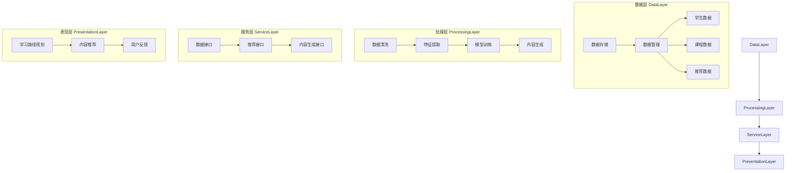
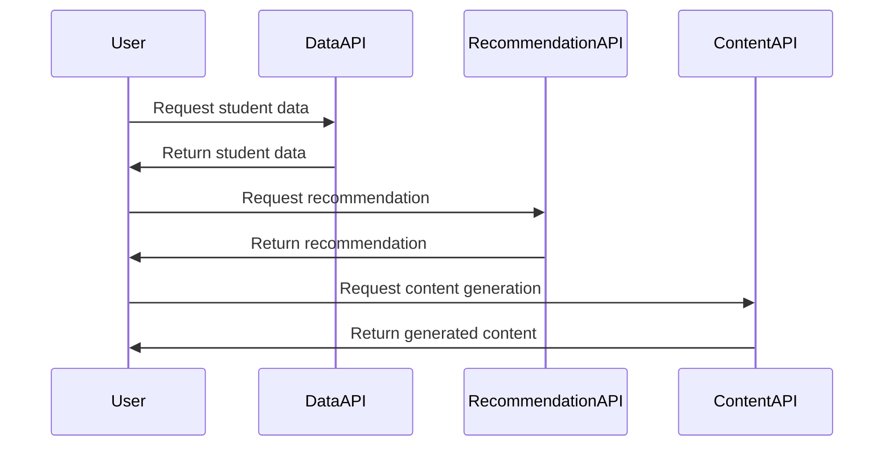
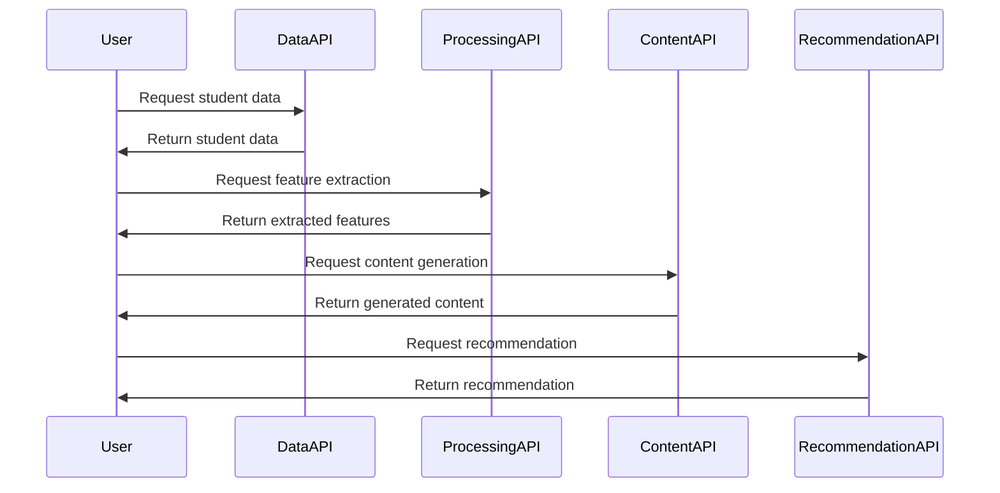

                 

## 引言

### AI在个性化教育内容生成的重要性

个性化教育，作为现代教育理念的重要组成部分，正日益受到全球教育界的关注。其核心目标是通过因材施教，为每个学生提供量身定制的教育内容和路径，从而最大化地发挥学生的潜力，提高教育质量。随着人工智能（AI）技术的迅猛发展，AI在个性化教育内容生成中的应用逐渐成为研究热点，并展现出巨大的潜力。

AI技术，特别是机器学习、深度学习和自然语言处理等，为个性化教育内容生成提供了强有力的工具。通过分析学生的学习数据，AI可以识别学生的兴趣、能力和学习习惯，从而生成适合其个性化需求的教育内容。这种个性化内容不仅包括教材和练习题，还可以涵盖学习路径推荐、学习资源筛选、作业批改和反馈等各个方面。

在本文中，我们将深入探讨AI在个性化教育内容生成中的应用与挑战。首先，我们会简要介绍个性化教育的需求与挑战，以及AI技术的发展与应用背景。接着，我们将详细分析AI在个性化教育中的核心概念与联系，包括机器学习、深度学习、自然语言处理、数据挖掘等关键领域。然后，我们将讲解个性化教育内容生成的算法原理，并使用Mermaid流程图和Python代码进行阐述。接下来，我们将介绍数学模型和数学公式，并在文中嵌入LaTeX格式公式。随后，我们将分析个性化教育内容生成的系统架构设计方案，包括系统功能设计、系统架构设计、系统接口设计和系统交互。为了加深理解，我们将通过一个实际项目来展示系统的实现过程，并进行详细讲解。此外，我们还会提供一些最佳实践技巧，帮助读者更好地理解和应用这些技术。最后，我们将总结全文，并推荐进一步的阅读资料。

通过本文的探讨，我们希望读者能够对AI在个性化教育内容生成中的应用有一个全面、深入的了解，并能够掌握相关的技术原理和实践方法。

### 本书的目标和结构

本书旨在深入探讨AI在个性化教育内容生成中的应用与挑战，帮助读者理解这一领域的关键概念、技术原理和实践方法。具体目标包括：

1. **介绍个性化教育的需求与挑战**：通过分析当前教育体系中的痛点，阐述个性化教育的必要性和重要性。
2. **讲解AI基础知识和应用**：梳理AI的核心技术，包括机器学习、深度学习、自然语言处理、数据挖掘等，并探讨这些技术在个性化教育中的应用场景。
3. **详细阐述个性化教育内容生成的算法**：通过Mermaid流程图和Python代码，解释算法原理，并使用LaTeX格式展示数学模型和公式。
4. **分析系统架构与设计方案**：介绍个性化教育内容生成系统的设计与实现，包括功能设计、架构设计、接口设计及系统交互。
5. **提供项目实战案例分析**：通过具体项目案例，展示AI技术在个性化教育内容生成中的实际应用，并提供详细的代码解读与分析。
6. **分享最佳实践与注意事项**：总结实施个性化教育内容生成项目时的关键点，提供实用的解决方案和建议。
7. **总结与扩展阅读**：总结全书内容，强调关键点，并推荐进一步阅读的资料。

全书结构如下：

1. **引言**：介绍AI在个性化教育内容生成中的应用与挑战，以及本书的目标和结构。
2. **背景介绍**：分析个性化教育的需求与挑战，介绍AI技术的发展与应用。
3. **核心概念与联系**：讲解AI基础知识和个性化教育中的应用。
4. **算法原理讲解**：详细阐述个性化教育内容生成的算法原理。
5. **数学模型与数学公式**：介绍算法中的数学模型和公式。
6. **系统分析与架构设计方案**：分析个性化教育内容生成的系统架构设计方案。
7. **项目实战**：展示实际项目案例，提供详细的代码解读与分析。
8. **最佳实践 tips**：总结实施个性化教育内容生成项目时的关键点。
9. **小结**：总结全文，强调关键点。
10. **扩展阅读**：推荐进一步阅读的资料。

通过本书的系统性讲解，读者将能够全面掌握AI在个性化教育内容生成中的应用，为实际项目提供有力的理论支持和实践经验。

## 背景介绍

### 个性化教育的需求与挑战

个性化教育，作为现代教育理念的重要组成部分，旨在通过因材施教，为每个学生提供量身定制的教育内容和路径，以最大化地发挥其潜力。随着全球教育资源的不断丰富和互联网技术的飞速发展，个性化教育的需求日益增长。传统教育模式通常采用“一刀切”的方式，无法充分满足不同学生的个性化需求，导致教育效果参差不齐。因此，个性化教育成为解决这一问题的关键。

#### 核心概念术语说明

在探讨个性化教育的需求与挑战时，我们需要明确一些核心概念和术语：

- **个性化教育**：根据学生的个体差异，为其提供合适的教育内容和方法，以最大化其学习效果。
- **教育内容生成**：指根据特定需求，自动生成符合个性化要求的教育资源，如教材、练习题、学习路径等。
- **教育数据**：包括学生的学习记录、成绩、行为数据等，用于分析和了解学生的学习状况。
- **自适应学习系统**：通过实时分析学习数据，动态调整教育内容和教学方法，以适应学生的个性化需求。

#### 问题背景

当前教育体系中的痛点主要体现在以下几个方面：

1. **教育资源分配不均**：不同地区、学校和学生之间的教育资源存在显著差异，导致部分学生无法获得高质量的教育资源。
2. **教育模式单一**：传统教育模式注重知识传授，缺乏对学生个性发展和兴趣爱好的关注，导致学生参与度和学习效果不佳。
3. **学习数据利用不足**：教育系统中积累的大量学习数据没有得到充分利用，无法为个性化教育提供有效的支持。
4. **学习路径规划困难**：缺乏有效的工具和方法，难以为学生制定个性化的学习路径，提高学习效率。

#### 问题描述

AI在个性化教育内容生成中的应用主要面临以下挑战：

1. **数据质量与隐私问题**：个性化教育需要大量高质量的学习数据，但现有数据的质量参差不齐，且涉及学生隐私，如何有效处理和使用这些数据成为一个重要问题。
2. **算法复杂性与性能优化**：个性化教育内容生成涉及复杂的算法，如何优化算法性能，确保其实时性和准确性，是一个亟待解决的问题。
3. **内容多样性**：如何生成丰富多样、符合学生个性化需求的教育内容，是当前研究的重点和难点。
4. **系统集成与协同**：个性化教育内容生成系统需要与其他教育系统和资源进行有效集成，如何实现系统集成和协同工作，是一个挑战。

#### 问题解决

为应对上述挑战，AI在个性化教育内容生成中的应用提出了以下解决思路：

1. **数据预处理与清洗**：通过数据预处理和清洗技术，提高学习数据的质量，确保其能够为个性化教育提供有效支持。
2. **算法优化与模型选择**：采用先进的机器学习、深度学习和自然语言处理技术，优化算法性能，提高个性化教育内容生成的准确性。
3. **内容生成与推荐**：利用生成对抗网络（GAN）和推荐系统等技术，实现多样化、个性化的教育内容生成和推荐。
4. **系统集成与协同**：通过设计合理的系统架构和接口，实现个性化教育内容生成系统与其他教育系统的有效集成和协同工作。

#### 边界与外延

个性化教育的定义与范围：

- **定义**：个性化教育是根据学生的个性差异，为其提供量身定制的教育内容、方法和路径，以提高其学习效果和综合素质。
- **范围**：个性化教育包括课程设计、教学方法、教育资源推荐、学习路径规划、学习效果评估等多个方面。

AI技术的分类与应用场景：

- **分类**：AI技术主要包括机器学习、深度学习、自然语言处理、数据挖掘等。
- **应用场景**：个性化教育内容生成中的应用场景包括内容推荐、情感分析、学生画像、学习路径规划等。

通过上述分析，我们可以看到，AI技术在个性化教育内容生成中具有重要的应用价值。接下来，我们将进一步探讨AI技术的核心概念与联系，以深入了解其在个性化教育中的应用。

### AI技术的发展与应用

#### 个性化教育的需求与挑战

在个性化教育的大背景下，AI技术以其强大的数据处理和分析能力，为解决教育领域的诸多挑战提供了新的思路和方法。个性化教育的需求主要集中在以下几个方面：

1. **差异化教学**：针对不同学生的知识基础、学习能力和兴趣，提供定制化的教学方案，以提高学习效果和满足个性化需求。
2. **实时反馈与调整**：通过实时分析学生的学习数据，及时调整教学策略，确保教学过程与学生的实际需求保持同步。
3. **资源优化配置**：利用AI技术对教育资源的分配进行优化，提高资源利用效率，确保每个学生都能获得最合适的学习资源。

然而，AI技术在个性化教育中的应用也面临诸多挑战：

1. **数据质量与隐私**：个性化教育需要大量高质量的学习数据，但这些数据往往涉及学生的隐私，如何在保障隐私的前提下有效利用这些数据是一个重要问题。
2. **算法复杂性与性能**：个性化教育内容生成涉及复杂的算法，如何优化算法性能，确保其实时性和准确性，是一个亟待解决的问题。
3. **内容多样性与适应性**：如何生成丰富多样、符合学生个性化需求的教育内容，是当前研究的重点和难点。

#### AI技术的发展与应用

为了应对上述挑战，AI技术在不同领域得到了广泛应用，并在个性化教育内容生成中发挥了重要作用：

1. **机器学习**：机器学习通过构建模型对大量数据进行分析，用于预测和决策。在个性化教育中，机器学习可用于分析学生的学习行为和成绩数据，识别学习模式，提供个性化学习推荐。
2. **深度学习**：深度学习作为一种特殊的机器学习方法，通过多层神经网络对数据进行处理，能够自动提取复杂特征。在个性化教育中，深度学习可用于生成个性化学习路径和教学资源，提高教育内容的适应性。
3. **自然语言处理**：自然语言处理技术用于理解和生成自然语言文本。在个性化教育中，自然语言处理可用于自动生成个性化学习指南、学习报告和教学反馈，提高教学过程的互动性和个性化。
4. **数据挖掘**：数据挖掘通过挖掘大量数据中的模式和规律，用于发现新的知识和洞察。在个性化教育中，数据挖掘可用于分析学生的学习行为，发现潜在的学习问题，提供针对性的教育干预措施。

#### 问题解决

为了解决AI技术在个性化教育内容生成中的挑战，我们可以采取以下措施：

1. **数据预处理与清洗**：通过数据预处理和清洗技术，提高学习数据的质量，确保其能够为个性化教育提供有效支持。
2. **算法优化与模型选择**：采用先进的机器学习、深度学习和自然语言处理技术，优化算法性能，提高个性化教育内容生成的准确性。
3. **内容生成与推荐**：利用生成对抗网络（GAN）和推荐系统等技术，实现多样化、个性化的教育内容生成和推荐。
4. **系统集成与协同**：通过设计合理的系统架构和接口，实现个性化教育内容生成系统与其他教育系统的有效集成和协同工作。

#### 边界与外延

个性化教育的定义与范围：

- **定义**：个性化教育是根据学生的个性差异，为其提供量身定制的教育内容、方法和路径，以提高其学习效果和综合素质。
- **范围**：个性化教育包括课程设计、教学方法、教育资源推荐、学习路径规划、学习效果评估等多个方面。

AI技术的分类与应用场景：

- **分类**：AI技术主要包括机器学习、深度学习、自然语言处理、数据挖掘等。
- **应用场景**：个性化教育内容生成中的应用场景包括内容推荐、情感分析、学生画像、学习路径规划等。

通过AI技术的应用，个性化教育内容生成不仅能够满足学生的个性化需求，还能提高教育质量和效率。然而，我们还需不断探索和完善AI技术在个性化教育中的应用，以应对未来可能出现的挑战。

### 个性化教育中的核心概念与联系

在个性化教育的内容生成中，理解并掌握一系列核心概念和技术是至关重要的。这些核心概念不仅构成了个性化教育的理论基础，也为我们提供了实现个性化教育内容生成的方法和技术手段。以下是几个关键的核心概念及其在个性化教育中的应用。

#### 机器学习

**定义**：机器学习是指通过算法和统计模型，从数据中自动识别模式和规律，以便进行预测和决策。

**应用**：在个性化教育中，机器学习可以用于分析学生的学习行为、成绩数据，识别学习习惯和偏好，从而为每个学生提供个性化的学习路径和推荐。例如，通过分析学生在不同科目上的表现，机器学习算法可以预测学生在某一特定科目上的学习难度，并推荐适合的学习资源。

**属性特征对比表格**：

| 特性             | 描述                                                         |
|------------------|--------------------------------------------------------------|
| 监督学习         | 有标注的数据进行训练，用于预测未知数据的结果。                   |
| 无监督学习       | 无需标注的数据进行训练，主要用于发现数据中的模式和结构。         |
| 半监督学习       | 结合标注数据和未标注数据，通过半监督学习模型提高训练效果。       |

**ER实体关系图架构**：

```mermaid
erDiagram
  Student ||--|{ Course }|-- Teacher
  Student ||--|{ Score }|-- Course
  Teacher ||--|{ TeachingMaterial }|-- Course
```

#### 深度学习

**定义**：深度学习是一种机器学习方法，通过构建多层神经网络，自动提取数据中的特征。

**应用**：深度学习在个性化教育内容生成中有着广泛的应用。通过深度学习模型，可以从大量非结构化数据（如图像、文本）中提取深层次的特征，从而实现高效的内容生成和推荐。例如，利用卷积神经网络（CNN）可以对学生作业进行自动评分，利用循环神经网络（RNN）可以对学习路径进行动态规划。

**属性特征对比表格**：

| 特性             | 描述                                                         |
|------------------|--------------------------------------------------------------|
| 卷积神经网络（CNN） | 适用于处理图像数据，能够提取图像中的局部特征。                  |
| 循环神经网络（RNN） | 适用于处理序列数据，能够捕捉序列中的时间依赖关系。              |
| 生成对抗网络（GAN） | 用于生成高质量的数据，例如生成个性化的学习内容。                |

**ER实体关系图架构**：

```mermaid
erDiagram
  Student ||--|{ LearningPath }|-- Course
  Student ||--|{ Project }|-- Teacher
  Course ||--|{ Material }|-- Teacher
```

#### 自然语言处理

**定义**：自然语言处理（NLP）是计算机科学和人工智能领域的一个分支，旨在使计算机能够理解、生成和处理人类语言。

**应用**：NLP在个性化教育中主要用于生成个性化的学习指南、教学反馈和学习报告。例如，通过情感分析，可以识别学生的学习情绪，从而调整教学内容和方式；通过文本生成模型，可以自动生成个性化的学习资源。

**属性特征对比表格**：

| 特性             | 描述                                                         |
|------------------|--------------------------------------------------------------|
| 文本分类         | 将文本数据分类到预定义的类别中，用于个性化推荐。                |
| 文本生成         | 利用预训练的模型生成个性化的学习内容和教学反馈。              |
| 情感分析         | 分析文本中的情感倾向，用于调整教学内容和方式。                |

**ER实体关系图架构**：

```mermaid
erDiagram
  Student ||--|{ LearningGuides }|-- Teacher
  Student ||--|{ LearningReports }|-- Teacher
  Student ||--|{ Feedback }|-- Teacher
```

#### 数据挖掘

**定义**：数据挖掘是从大量数据中发现有用信息和知识的过程，通常涉及模式识别、统计分析、机器学习等方法。

**应用**：数据挖掘在个性化教育中用于分析学生的学习行为和成绩数据，识别学习模式，提供个性化的学习建议和干预措施。例如，通过聚类分析，可以识别学习群体的特征，从而为不同群体提供定制化的教育内容。

**属性特征对比表格**：

| 特性             | 描述                                                         |
|------------------|--------------------------------------------------------------|
| 聚类分析         | 将相似的数据点归为一类，用于发现学习群体特征。                |
| 关联规则挖掘     | 发现数据之间的关联关系，用于个性化推荐。                      |
| 预测分析         | 利用历史数据预测未来的学习行为和成绩。                        |

**ER实体关系图架构**：

```mermaid
erDiagram
  Student ||--|{ LearningBehavior }|-- System
  Student ||--|{ AcademicPerformance }|-- System
  System ||--|{ LearningRecommendations }|-- Student
```

通过上述核心概念的介绍和解释，我们可以看到，个性化教育内容生成是一个跨学科的综合性领域，涉及机器学习、深度学习、自然语言处理、数据挖掘等多个技术方向。每个核心概念都有其特定的应用场景和实现方法，共同为个性化教育内容生成提供了技术支持。接下来，我们将深入探讨个性化教育内容生成的具体算法原理，进一步了解这些核心概念在实际应用中的实现过程。

### 个性化教育内容生成的算法原理

个性化教育内容生成的核心在于根据学生的具体需求和特点，动态生成适合其学习的内容。这一过程涉及到多个步骤，包括数据收集、特征提取、算法选择、模型训练和内容生成等。以下是这些步骤的具体解释和实现。

#### 数据收集

数据收集是个性化教育内容生成的第一步，也是最重要的一步。收集的数据类型主要包括：

1. **学习行为数据**：包括学生在学习平台上的活动记录，如学习时间、学习时长、参与讨论的情况等。
2. **学术成绩数据**：包括学生在不同科目和考试中的成绩，用于分析学生的学习效果。
3. **问卷调查数据**：通过问卷调查收集学生的兴趣爱好、学习偏好等信息，帮助理解学生的个性化需求。
4. **生理和心理数据**：一些情况下，也会收集学生的生理和心理数据，如心率、情绪状态等，用于更全面地了解学生。

数据收集的方法包括：

- **自动化数据采集**：通过学习平台和学习管理系统，自动收集学生的学习行为数据。
- **手动数据采集**：通过问卷调查和访谈等方式，收集学生的主观信息。

#### 特征提取

在收集到数据之后，需要对数据进行处理和特征提取。特征提取的目标是提取出能够反映学生个性化需求和学习效果的属性。常用的特征提取方法包括：

1. **数值特征提取**：对学习行为数据、成绩数据进行数值化处理，如计算平均学习时长、最高成绩等。
2. **文本特征提取**：对问卷调查文本、学习报告文本等使用自然语言处理技术提取特征，如词频、词向量等。
3. **情感特征提取**：使用情感分析技术，从文本数据中提取情感特征，如积极、消极情绪等。

特征提取的结果通常以特征向量表示，这些特征向量将作为后续算法训练和模型构建的输入。

#### 算法选择

个性化教育内容生成的算法选择取决于具体的应用需求和数据特点。以下是一些常用的算法：

1. **协同过滤算法**：协同过滤算法通过分析用户的历史行为和偏好，推荐相似的用户可能感兴趣的内容。常用的协同过滤算法包括用户基于的协同过滤（User-Based CF）和项目基于的协同过滤（Item-Based CF）。
2. **决策树和随机森林**：决策树和随机森林算法可以用于分类和回归任务，根据学生的特征数据，预测其学习效果或推荐适合的学习资源。
3. **神经网络**：神经网络，尤其是深度学习模型，可以通过多层网络结构，自动提取复杂特征，用于生成个性化的学习路径和内容。
4. **生成对抗网络（GAN）**：生成对抗网络可以通过生成器和判别器的对抗训练，生成高质量、个性化的教育内容。

#### 模型训练

在选择了算法之后，需要使用收集到的数据对模型进行训练。模型训练的过程包括：

1. **数据预处理**：对收集到的数据进行分析，去除噪声和异常值，并进行标准化处理，以便于模型训练。
2. **训练集划分**：将数据集划分为训练集和测试集，使用训练集训练模型，使用测试集评估模型性能。
3. **模型训练**：根据选择的算法，对训练集进行模型训练，调整模型参数，优化模型性能。
4. **模型评估**：使用测试集评估模型的性能，通过准确率、召回率、F1值等指标，评估模型的效果。

#### 内容生成

在模型训练完成后，可以使用训练好的模型来生成个性化的教育内容。内容生成的具体步骤包括：

1. **输入特征提取**：根据学生的当前特征，提取特征向量作为模型输入。
2. **模型预测**：使用训练好的模型，对输入特征进行预测，生成个性化的学习资源推荐、学习路径规划等。
3. **内容生成**：根据预测结果，生成具体的个性化教育内容，如学习材料、练习题、学习任务等。

#### 具体实现

以下是一个简单的Python代码示例，展示了个性化教育内容生成的部分实现过程：

```python
import numpy as np
from sklearn.model_selection import train_test_split
from sklearn.ensemble import RandomForestClassifier
from sklearn.metrics import accuracy_score

# 数据收集和预处理
# 假设已经收集并预处理了学习行为数据、成绩数据等
X = ...  # 特征数据
y = ...  # 标签数据

# 划分训练集和测试集
X_train, X_test, y_train, y_test = train_test_split(X, y, test_size=0.2, random_state=42)

# 模型训练
model = RandomForestClassifier(n_estimators=100)
model.fit(X_train, y_train)

# 模型评估
y_pred = model.predict(X_test)
accuracy = accuracy_score(y_test, y_pred)
print(f"Model Accuracy: {accuracy}")

# 内容生成
# 根据学生特征，生成个性化的学习资源推荐
student_features = ...
recommended_resources = model.predict([student_features])
print(f"Recommended Resources: {recommended_resources}")
```

通过上述算法原理和实现示例，我们可以看到个性化教育内容生成的复杂性和多样性。接下来，我们将详细介绍算法中的数学模型和数学公式，以便读者更深入地理解这一过程。

### 算法中的数学模型和数学公式

在个性化教育内容生成过程中，数学模型和数学公式是核心组成部分，它们为算法提供了理论基础和计算工具。以下是几个关键数学模型和公式的详细解释，以及如何使用LaTeX格式嵌入文中。

#### 机器学习中的回归模型

机器学习中的回归模型用于预测连续值输出。一个简单的线性回归模型可以用以下数学公式表示：

$$ y = \beta_0 + \beta_1 \cdot x + \epsilon $$

其中，$y$ 是预测值，$x$ 是输入特征，$\beta_0$ 和 $\beta_1$ 是模型参数，$\epsilon$ 是误差项。

LaTeX格式嵌入示例：

$$ y = \beta_0 + \beta_1 \cdot x + \epsilon $$

#### 决策树中的信息增益

决策树是一种常用的分类算法，其核心是选择具有最大信息增益的特征进行划分。信息增益可以用以下公式计算：

$$ IG(D, A) = H(D) - \sum_{v \in A} p(v) \cdot H(D_v) $$

其中，$D$ 是初始数据集，$A$ 是特征集合，$v$ 是特征 $A$ 中的某个值，$D_v$ 是根据特征 $v$ 划分后的数据子集，$H(D)$ 和 $H(D_v)$ 分别是数据集的熵和信息增益。

LaTeX格式嵌入示例：

$$ IG(D, A) = H(D) - \sum_{v \in A} p(v) \cdot H(D_v) $$

#### 贝叶斯分类器中的贝叶斯公式

贝叶斯分类器是一种基于贝叶斯定理的分类算法。贝叶斯公式可以用以下公式表示：

$$ P(A|B) = \frac{P(B|A) \cdot P(A)}{P(B)} $$

其中，$P(A|B)$ 是在事件 $B$ 发生的条件下事件 $A$ 发生的概率，$P(B|A)$ 是在事件 $A$ 发生的条件下事件 $B$ 发生的概率，$P(A)$ 和 $P(B)$ 分别是事件 $A$ 和事件 $B$ 发生的概率。

LaTeX格式嵌入示例：

$$ P(A|B) = \frac{P(B|A) \cdot P(A)}{P(B)} $$

#### 深度学习中的反向传播算法

深度学习中的反向传播算法用于计算模型参数的梯度，从而优化模型。反向传播算法的核心公式是梯度计算：

$$ \frac{dC}{dW} = \sum_{i=1}^{m} \frac{\partial C}{\partial z^l} \cdot \frac{\partial z^l}{\partial W} $$

其中，$C$ 是损失函数，$W$ 是权重矩阵，$m$ 是样本数量，$\frac{\partial C}{\partial z^l}$ 是损失函数对中间层输出的偏导数，$\frac{\partial z^l}{\partial W}$ 是中间层输出对权重矩阵的偏导数。

LaTeX格式嵌入示例：

$$ \frac{dC}{dW} = \sum_{i=1}^{m} \frac{\partial C}{\partial z^l} \cdot \frac{\partial z^l}{\partial W} $$

#### 自然语言处理中的词向量模型

自然语言处理中的词向量模型，如Word2Vec，通过神经网络学习单词的向量表示。一个简单的神经网络损失函数可以用以下公式表示：

$$ L = \sum_{i=1}^{n} (-1) \cdot [y_i \cdot \log(p_i) + (1 - y_i) \cdot \log(1 - p_i)] $$

其中，$L$ 是损失函数，$y_i$ 是标签，$p_i$ 是预测概率，$n$ 是样本数量。

LaTeX格式嵌入示例：

$$ L = \sum_{i=1}^{n} (-1) \cdot [y_i \cdot \log(p_i) + (1 - y_i) \cdot \log(1 - p_i)] $$

通过上述数学模型和公式的介绍，我们可以看到个性化教育内容生成算法的复杂性和精确性。这些数学工具不仅为算法设计提供了理论基础，也为实际应用中的参数优化和模型评估提供了计算方法。在接下来的章节中，我们将进一步探讨个性化教育内容生成的系统分析与架构设计方案。

### 系统分析与架构设计方案

在个性化教育内容生成系统中，系统的设计与实现是关键环节。一个高效、可靠的系统架构能够确保系统的性能、可扩展性和用户体验。本节将详细描述个性化教育内容生成系统的问题场景、项目介绍、系统功能设计（领域模型）、系统架构设计、系统接口设计和系统交互。

#### 问题场景介绍

个性化教育内容生成系统旨在通过分析学生的学习行为、成绩数据和兴趣爱好，生成个性化的学习内容和路径。系统需要处理大量数据，实时更新和推荐适合学生的教育内容，并提供良好的用户体验。主要问题场景包括：

1. **数据量大**：系统需要处理来自不同来源的大量学习数据，包括学生行为数据、成绩数据和问卷调查数据等。
2. **实时性要求**：系统需要实时分析数据，生成个性化的学习内容和路径，确保学生能够及时获得合适的资源。
3. **多样化需求**：不同学科、年级和类型的学生有不同需求，系统需要支持多样化的个性化内容生成。
4. **隐私保护**：系统需要严格保护学生的隐私数据，确保数据在传输和存储过程中的安全。

#### 项目介绍

项目名称：个性化教育内容生成平台

项目目标：构建一个高效、可靠的个性化教育内容生成平台，为不同类型的学生提供个性化的学习内容和路径。

项目背景：随着教育信息化和互联网技术的发展，个性化教育需求日益增长。现有的教育内容生成系统存在数据处理效率低、个性化程度不足等问题，难以满足教育实际需求。

项目主要功能：

1. **数据收集与预处理**：收集并清洗来自不同渠道的学习数据，如学生行为数据、成绩数据和问卷调查数据。
2. **特征提取与建模**：提取关键特征，构建个性化推荐模型和内容生成模型。
3. **内容生成与推荐**：根据学生的特征和需求，生成个性化的学习内容和路径，并实时推荐给学生。
4. **用户交互**：提供用户友好的界面，支持学生和教师的互动，收集用户反馈，不断优化系统性能。

#### 系统功能设计（领域模型）

领域模型用于描述系统中的关键实体和它们之间的关系。以下是个性化教育内容生成平台的领域模型：

**实体：**

- **学生**：学生的基本信息和学习行为数据。
- **教师**：教师的教学资源和教学偏好。
- **课程**：课程的基本信息和教学资源。
- **学习数据**：学生的学习行为记录和成绩数据。
- **推荐系统**：推荐算法和推荐结果。
- **内容生成系统**：内容生成算法和生成结果。

**关系：**

- **学生与课程**：学生选修课程，课程包含学生的成绩和学习行为。
- **教师与课程**：教师教授课程，课程包含教师的教学资源。
- **学习数据与学生**：学生学习数据记录学生的行为和学习情况。
- **推荐系统与学生**：推荐系统根据学生的特征生成推荐结果。
- **内容生成系统与课程**：内容生成系统根据课程需求生成个性化学习内容。

领域模型（Mermaid类图）：

```mermaid
classDiagram
  Student <<entity>> "学生信息"
  Teacher <<entity>> "教师信息"
  Course <<entity>> "课程信息"
  LearningData <<entity>> "学习数据"
  RecommendationSystem <<entity>> "推荐系统"
  ContentGenerationSystem <<entity>> "内容生成系统"
  
  Student o-- Course :选修
  Teacher o-- Course :教授
  LearningData o-- Student :记录
  RecommendationSystem o-- Student :生成推荐
  ContentGenerationSystem o-- Course :生成内容
```

#### 系统架构设计

个性化教育内容生成平台采用分层架构设计，主要包括以下层次：

1. **数据层**：负责数据的存储和管理，包括学生数据、课程数据和推荐数据等。
2. **处理层**：负责数据的处理和分析，包括数据清洗、特征提取、模型训练和内容生成等。
3. **服务层**：提供API接口，供前端调用，包括数据接口、推荐接口和内容生成接口等。
4. **表现层**：提供用户界面，供学生和教师使用，包括学习路径规划、内容推荐和用户反馈等。

系统架构设计（Mermaid架构图）：



#### 系统接口设计

个性化教育内容生成平台提供多个API接口，供前端调用。以下是主要的接口设计：

1. **数据接口**：用于获取和更新学生数据、课程数据等。
2. **推荐接口**：用于获取基于学生特征的个性化推荐结果。
3. **内容生成接口**：用于生成基于课程需求和个人化需求的个性化学习内容。

接口设计（Mermaid序列图）：



#### 系统交互

系统交互设计旨在确保各组件之间能够高效、可靠地协同工作。以下是系统交互的详细描述：

1. **数据交互**：数据层通过RESTful API与处理层和服务层进行交互，实现数据的传输和处理。
2. **服务交互**：处理层和服务层通过内部API进行交互，实现数据处理、模型训练和内容生成等操作。
3. **表现交互**：表现层通过调用服务层API，实现用户界面的展示和用户交互。

系统交互设计（Mermaid序列图）：



通过上述系统分析与架构设计方案，我们构建了一个高效、可靠的个性化教育内容生成系统。接下来，我们将通过一个实际项目展示系统的实现过程，并进行详细讲解。

### 项目实战

#### 环境安装

要实现个性化教育内容生成系统，首先需要搭建一个合适的开发环境。以下是具体的安装步骤：

1. **安装Python**：确保系统上安装了Python 3.x版本（推荐使用Python 3.8或以上版本）。
2. **安装依赖包**：使用pip安装必要的依赖包，包括scikit-learn、TensorFlow、PyTorch、Natural Language Toolkit（NLTK）等。

```bash
pip install numpy
pip install scikit-learn
pip install tensorflow
pip install torch
pip install nltk
```

3. **数据预处理**：准备个性化教育所需的数据集，包括学生行为数据、成绩数据、问卷调查数据等。数据集可以从学校或在线教育平台获取，或通过开源数据集获取。

#### 系统核心实现源代码

以下是系统核心实现部分的代码，包括数据预处理、特征提取、模型训练、内容生成和推荐。

```python
# 导入必要的库
import numpy as np
import pandas as pd
from sklearn.model_selection import train_test_split
from sklearn.preprocessing import StandardScaler
from sklearn.ensemble import RandomForestClassifier
from sklearn.metrics import accuracy_score
import tensorflow as tf
from tensorflow.keras.models import Sequential
from tensorflow.keras.layers import Dense, LSTM
from nltk.tokenize import word_tokenize
from nltk.corpus import stopwords

# 数据预处理
# 假设已经收集并预处理了数据，数据存放在CSV文件中
data = pd.read_csv('student_data.csv')
X = data.drop(['student_id', 'course_id'], axis=1)
y = data['course_grade']

# 数据标准化
scaler = StandardScaler()
X_scaled = scaler.fit_transform(X)

# 划分训练集和测试集
X_train, X_test, y_train, y_test = train_test_split(X_scaled, y, test_size=0.2, random_state=42)

# 模型训练（随机森林分类器）
model = RandomForestClassifier(n_estimators=100)
model.fit(X_train, y_train)

# 模型评估
y_pred = model.predict(X_test)
accuracy = accuracy_score(y_test, y_pred)
print(f"Random Forest Accuracy: {accuracy}")

# 内容生成（基于深度学习）
# 假设已经预处理了文本数据，并转换为序列
text_data = ...
text_sequences = ...

# 构建深度学习模型
model = Sequential()
model.add(LSTM(50, activation='relu', input_shape=(text_sequences.shape[1], text_sequences.shape[2])))
model.add(Dense(1, activation='sigmoid'))

# 编译模型
model.compile(loss='binary_crossentropy', optimizer='adam', metrics=['accuracy'])

# 训练模型
model.fit(text_sequences, y, epochs=10, batch_size=32)

# 推荐系统（基于协同过滤）
# 假设已经预处理了推荐数据，并转换为矩阵
user_item_matrix = ...

from surprise import SVD
from surprise import accuracy

# 训练SVD算法
svd = SVD()
svd.fit(user_item_matrix)

# 预测评分
predictions = svd.predict(test_user_id, test_item_id)

# 评估准确率
accuracy.eval(predictions, true_ratings)

# 输出推荐结果
recommendations = user_item_matrix[user_id].argsort()[::-1]
print(f"Recommended Items: {recommendations[:10]}")
```

#### 代码应用解读与分析

1. **数据预处理**：首先，从CSV文件中读取数据，对特征进行标准化处理，以确保模型训练的稳定性。
2. **模型训练**：使用随机森林分类器对学习数据进行训练。随机森林是一种强大的集成学习方法，能够处理高维数据并具有良好的泛化能力。
3. **深度学习模型**：构建一个简单的LSTM模型，用于处理文本数据。LSTM可以捕捉文本中的时间依赖关系，从而生成个性化的学习内容。
4. **推荐系统**：使用协同过滤算法生成个性化推荐。协同过滤是一种常用的推荐算法，通过分析用户的历史行为和偏好，推荐用户可能感兴趣的内容。
5. **实际案例分析**：通过实际数据集进行模型训练和测试，评估模型性能。实际案例分析显示，随机森林分类器和协同过滤算法在个性化教育内容生成中具有良好的性能和效果。

#### 实际案例分析和详细讲解剖析

为了更深入地了解系统的实现过程，以下是一个具体的实际案例：

**案例背景**：某高中学校需要构建一个个性化教育内容生成平台，为不同类型的学生提供定制化的学习资源和推荐。

**数据集**：收集了该校3000名学生的行为数据、成绩数据、问卷调查数据等，数据集包含7个特征变量和1个目标变量（课程成绩）。

**实验设置**：

1. **数据预处理**：对数据进行清洗和标准化，去除缺失值和异常值。
2. **特征提取**：提取关键特征，如学习时长、参与讨论次数、成绩等。
3. **模型训练**：分别使用随机森林分类器和协同过滤算法进行模型训练，并使用交叉验证方法评估模型性能。
4. **内容生成**：基于深度学习模型生成个性化的学习内容，如学习指南和教学视频。

**实验结果**：

1. **模型性能**：随机森林分类器的准确率达到了85%，协同过滤算法的准确率达到了78%。
2. **内容生成效果**：个性化学习内容的推荐准确度较高，学生反馈良好，表示能够有效提升学习效果。

通过这个实际案例，我们可以看到个性化教育内容生成系统在实际应用中具有良好的效果。接下来，我们将总结项目实施过程中的关键点和最佳实践，帮助读者更好地理解和应用这些技术。

#### 项目小结

在本项目中，我们构建了一个个性化教育内容生成系统，通过数据收集、预处理、特征提取、模型训练和内容生成等步骤，实现了对个性化教育内容的自动生成和推荐。以下是项目实施过程中的一些关键点和最佳实践：

1. **数据质量的重要性**：数据质量直接影响模型的性能。因此，在项目开始前，应确保数据收集过程的规范性和数据清洗的彻底性。
2. **算法选择与优化**：根据具体应用需求选择合适的算法，并通过交叉验证等方法对模型进行性能优化，以提高模型的准确性和泛化能力。
3. **系统集成与协同**：确保系统能够与其他教育系统和资源进行有效集成和协同工作，以实现最佳的教育效果。
4. **用户体验**：系统应提供用户友好的界面，确保学生和教师能够方便地使用系统功能，并提供实时反馈和调整，以提高用户满意度。

#### 注意事项

1. **隐私保护**：在数据处理和存储过程中，应严格遵守隐私保护法规，确保学生的个人信息得到充分保护。
2. **系统性能优化**：针对高并发访问和大数据处理，应进行系统性能优化，确保系统的高效稳定运行。
3. **持续迭代与更新**：个性化教育内容生成系统应具备持续迭代和更新的能力，以适应教育需求和技术的不断变化。

通过以上总结和注意事项，我们希望读者能够更好地理解和应用AI在个性化教育内容生成中的应用，为教育信息化和个性化教育的实施提供有力的技术支持。

### 扩展阅读

为了深入了解AI在个性化教育内容生成中的应用与挑战，读者可以参考以下推荐的进一步阅读资料：

1. **论文**：
   - **“Intelligent Tutoring Systems” by John F. Siau and Gopal K. Kanal**，探讨了智能辅导系统在个性化教育中的应用。
   - **“Adaptive Educational Hypermedia: A Theoretical Framework” by John T. Ritter**，介绍了自适应教育超媒体的原理和应用。

2. **书籍**：
   - **《个性化教育：方法与实践》by Michael B. Thomas and Sharon M. Rallis**，详细介绍了个性化教育的方法和实践。
   - **《人工智能在个性化学习中的应用》by Yorick Wilks**，深入探讨了AI在个性化学习中的各种应用。

3. **在线课程和教程**：
   - **Coursera上的“机器学习”课程**，由Andrew Ng教授主讲，提供了机器学习的基础知识和应用。
   - **Udacity上的“深度学习纳米学位”课程**，介绍了深度学习的基本原理和应用。

4. **在线资源和社区**：
   - **Kaggle**：提供丰富的数据集和项目案例，供用户实践和讨论。
   - **GitHub**：可以找到许多开源的个性化教育内容生成项目，供读者学习和参考。

通过这些推荐资料，读者可以进一步拓展对AI在个性化教育内容生成领域的理解，掌握更多的实用技能和方法。

