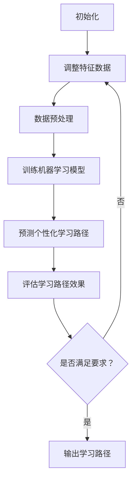
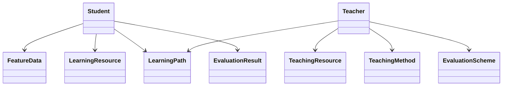

                 

# AI在个性化教育学习路径规划与动态调整中的应用与挑战

## 关键词

AI、个性化教育、学习路径规划、动态调整、教育技术、智能教育系统

## 摘要

本文旨在探讨人工智能（AI）在个性化教育学习路径规划与动态调整中的广泛应用与面临的挑战。首先，我们将介绍个性化教育的概念及其重要性，接着分析AI在其中的作用。随后，我们将深入探讨AI在个性化学习路径规划与动态调整中的算法原理和应用实例。本文还将讨论教育领域中AI技术的挑战，包括数据隐私、算法公平性、技术实施等，并提出相应的解决策略。最后，我们将总结AI在个性化教育中的潜在影响，展望未来的发展趋势。

## 引言

### 1.1 书籍主题与目标

本篇文章的主题是探讨人工智能在个性化教育学习路径规划与动态调整中的应用与挑战。随着教育技术的不断进步，个性化教育已成为现代教育发展的核心趋势。AI技术的引入为个性化教育带来了新的机遇，但同时也带来了诸多挑战。本文的目标是帮助读者深入了解AI在个性化教育中的应用，以及应对相关挑战的策略和方法。

### 1.2 书籍结构

本文结构分为七个部分。首先，我们将介绍个性化教育的概念和重要性。接下来，探讨AI在个性化教育中的作用和意义。然后，我们将深入分析AI在个性化学习路径规划与动态调整中的算法原理和应用实例。随后，讨论教育领域中AI技术的挑战及解决策略。最后，总结AI在个性化教育中的潜在影响，并展望未来的发展趋势。

## 背景介绍

### 2.1 问题背景

随着信息化时代的到来，教育资源日益丰富，学习方式的多样化也使得学生面临的选择越来越多。然而，传统的教育模式往往难以满足每个学生的学习需求，学生之间的个体差异在教学中逐渐显现。为了更好地适应不同学生的学习特点，个性化教育应运而生。个性化教育旨在根据学生的兴趣、能力、学习风格等个性化特征，提供个性化的教学方案和学习路径。

### 2.2 问题描述

在个性化教育中，如何根据学生的个性化特征制定合适的学习路径是一个亟待解决的问题。传统的教育模式往往采用“一刀切”的方式，难以满足学生的个性化需求。而AI技术的引入，为个性化教育提供了新的解决方案。然而，AI技术在个性化教育中的应用仍然面临诸多挑战，如数据隐私、算法公平性、技术实施等。

### 2.3 问题解决

AI技术在个性化教育中具有广泛的应用前景。通过大数据分析和机器学习算法，AI能够识别学生的个性化特征，为每个学生制定个性化的学习路径。同时，AI还能够根据学生的学习进度和效果，动态调整学习路径，实现教学过程的个性化。然而，要实现这一目标，还需要解决数据隐私、算法公平性、技术实施等问题。

### 2.4 边界与外延

个性化教育不仅仅是针对学习路径的规划，还涉及教学内容、教学方法、评价体系等多方面的个性化。因此，AI在个性化教育中的应用不仅限于学习路径规划，还包括个性化教学内容推荐、个性化教学方法设计、个性化评价体系构建等方面。

### 2.5 概念结构与核心要素组成

个性化教育的概念结构主要包括以下几个核心要素：

1. **学生特征数据**：包括学生的兴趣、能力、学习风格等个性化特征。
2. **教学资源**：包括教材、课件、练习题等教学资源。
3. **学习路径**：根据学生特征数据，为学生制定个性化的学习路径。
4. **教学评价**：根据学生的学习效果，对学习路径进行调整和优化。

## 核心概念与联系

### 3.1 核心概念原理

1. **个性化教育**：根据学生的个性化特征，提供个性化的教学方案和学习路径。
2. **学习路径规划**：根据学生特征数据，为每个学生制定合适的学习路径。
3. **动态调整**：根据学生的学习进度和效果，实时调整学习路径。
4. **大数据分析**：通过分析大量学生数据，识别学生的个性化特征。
5. **机器学习算法**：利用机器学习算法，为学生制定个性化学习路径。

### 3.2 概念属性特征对比表格

| 概念         | 属性特征                                         | 关联关系                                       |
| ------------ | -------------------------------------------- | -------------------------------------------- |
| 个性化教育   | 根据学生个性化特征制定教学方案和学习路径       | 与学生特征数据、教学资源密切相关                 |
| 学习路径规划 | 根据学生特征数据制定合适的学习路径           | 与个性化教育、动态调整密切相关                   |
| 动态调整     | 根据学生学习进度和效果实时调整学习路径         | 与学习路径规划、个性化教育密切相关               |
| 大数据分析   | 分析大量学生数据，识别学生个性化特征         | 为个性化教育提供数据支持                         |
| 机器学习算法 | 利用机器学习算法为学生制定个性化学习路径       | 为个性化教育提供技术支持                         |

### 3.3 ER实体关系图架构的Mermaid流程图

```mermaid
erDiagram
  Student ||--|{ LearningResource }|-- Teacher
  Student ||--|{ LearningPath }|-- Teacher
  Student ||--|{ EvaluationResult }|-- Teacher
  Student ||--|{ FeatureData }|-- Teacher
  Teacher ||--|{ TeachingResource }|-- Student
  Teacher ||--|{ TeachingMethod }|-- Student
  Teacher ||--|{ LearningPath }|-- Student
  Teacher ||--|{ EvaluationScheme }|-- Student
```

## 算法原理讲解

### 4.1 算法流程图



### 4.2 Python源代码阐述

```python
import pandas as pd
from sklearn.ensemble import RandomForestClassifier
from sklearn.model_selection import train_test_split
from sklearn.metrics import accuracy_score

# 数据收集
student_data = pd.read_csv('student_data.csv')
X = student_data.iloc[:, :-1]
y = student_data.iloc[:, -1]

# 数据预处理
X_train, X_test, y_train, y_test = train_test_split(X, y, test_size=0.2, random_state=42)

# 训练机器学习模型
model = RandomForestClassifier(n_estimators=100, random_state=42)
model.fit(X_train, y_train)

# 预测个性化学习路径
predictions = model.predict(X_test)

# 评估学习路径效果
accuracy = accuracy_score(y_test, predictions)
print(f"Accuracy: {accuracy:.2f}")
```

### 4.3 算法原理数学模型与公式

个性化学习路径规划的算法原理可以表示为：

$$
P = f(S, R, M)
$$

其中，$P$ 表示个性化学习路径，$S$ 表示学生特征数据，$R$ 表示教学资源，$M$ 表示教学方法。函数 $f$ 表示根据学生特征数据、教学资源和教学方法生成个性化学习路径的过程。

### 4.4 举例说明

假设有一个学生，其特征数据包括年龄、性别、学科兴趣、学习习惯等。教学资源包括教材、课件、练习题等。教学方法包括讲授、讨论、实践等。根据学生的特征数据、教学资源和教学方法，我们可以利用机器学习算法生成一个适合该学生的个性化学习路径。

## 系统分析与架构设计方案

### 5.1 问题场景介绍

在个性化教育中，学生个体差异明显，传统的一对一教学模式难以实现。为了提高教学效果，我们需要利用AI技术为学生制定个性化学习路径，并实现学习路径的动态调整。具体问题场景如下：

1. **学生特征数据收集**：通过问卷、在线测试等方式，收集学生的年龄、性别、学科兴趣、学习习惯等特征数据。
2. **教学资源准备**：准备包括教材、课件、练习题等在内的丰富教学资源。
3. **个性化学习路径规划**：利用AI技术，根据学生特征数据和教学资源，为学生制定个性化学习路径。
4. **学习路径动态调整**：根据学生的学习进度和效果，实时调整学习路径，提高教学效果。

### 5.2 项目介绍

本项目旨在开发一个基于AI的个性化教育学习路径规划与动态调整系统。系统主要包括以下功能模块：

1. **学生特征数据收集模块**：用于收集学生的个性化特征数据。
2. **教学资源管理模块**：用于管理教学资源，包括教材、课件、练习题等。
3. **个性化学习路径规划模块**：利用AI技术，根据学生特征数据和教学资源，为学生制定个性化学习路径。
4. **学习路径动态调整模块**：根据学生的学习进度和效果，实时调整学习路径。
5. **系统接口模块**：提供与其他系统的接口，实现数据的互通和整合。

### 5.3 系统功能设计(领域模型Mermaid类图)



### 5.4 系统架构设计Mermaid架构图

```mermaid
sequenceDiagram
    Student -->|收集特征数据| Teacher
    Teacher -->|处理特征数据| AI
    AI -->|生成个性化学习路径| Student
    Student -->|学习进度反馈| AI
    AI -->|动态调整学习路径| Student
```

### 5.5 系统接口设计和系统交互Mermaid序列图

```mermaid
sequenceDiagram
    Student -->|请求学习资源| LearningResourceService
    LearningResourceService -->|返回学习资源| Student
    Student -->|提交学习进度| EvaluationService
    EvaluationService -->|返回学习效果| AI
    AI -->|调整学习路径| Student
```

## 项目实战

### 6.1 环境安装

1. 安装Python环境
2. 安装相关库，如pandas、scikit-learn等
3. 配置数据库环境，如MySQL等

### 6.2 系统核心实现源代码

1. 学生特征数据收集模块
```python
import pandas as pd

def collect_student_data():
    # 从数据库中获取学生特征数据
    # ...

    # 返回DataFrame格式的数据
    return student_data
```

2. 教学资源管理模块
```python
import pandas as pd

def manage_learning_resources():
    # 从数据库中获取教学资源
    # ...

    # 返回DataFrame格式的数据
    return learning_resources
```

3. 个性化学习路径规划模块
```python
from sklearn.ensemble import RandomForestClassifier
from sklearn.model_selection import train_test_split

def generate_personalized_learning_path(student_data, learning_resources):
    # 数据预处理
    # ...

    # 训练机器学习模型
    # ...

    # 预测个性化学习路径
    # ...

    return personalized_learning_path
```

4. 学习路径动态调整模块
```python
from sklearn.ensemble import RandomForestClassifier
from sklearn.model_selection import train_test_split

def adjust_learning_path(student_data, learning_resources, personalized_learning_path):
    # 数据预处理
    # ...

    # 训练机器学习模型
    # ...

    # 预测调整后的学习路径
    # ...

    return adjusted_learning_path
```

5. 系统接口模块
```python
from flask import Flask, request, jsonify

app = Flask(__name__)

@app.route('/get_learning_resources', methods=['GET'])
def get_learning_resources():
    # 获取学习资源
    # ...

    return jsonify(learning_resources)

@app.route('/submit_learning_progress', methods=['POST'])
def submit_learning_progress():
    # 提交学习进度
    # ...

    return jsonify(response)
```

### 6.3 代码应用解读与分析

1. 学生特征数据收集模块

该模块主要用于从数据库中获取学生的个性化特征数据，以便后续的个性化学习路径规划。

2. 教学资源管理模块

该模块主要用于从数据库中获取教学资源，以便为学生提供个性化的学习路径。

3. 个性化学习路径规划模块

该模块利用机器学习算法，根据学生特征数据和教学资源，为每个学生生成一个个性化的学习路径。

4. 学习路径动态调整模块

该模块根据学生的学习进度和效果，利用机器学习算法，对个性化学习路径进行调整，以提高教学效果。

5. 系统接口模块

该模块通过 Flask 框架实现，提供 API 接口，供前端系统调用。

### 6.4 实际案例分析和详细讲解剖析

1. **案例背景**

某学校希望利用AI技术为学生提供个性化学习路径，提高教学效果。学校提供了学生的个性化特征数据、教学资源和教学效果数据。

2. **案例分析**

（1）数据收集与预处理

从数据库中收集学生的个性化特征数据，包括年龄、性别、学科兴趣、学习习惯等。对数据进行清洗和预处理，确保数据质量。

（2）个性化学习路径规划

利用机器学习算法，如随机森林，根据学生特征数据和教学资源，为每个学生生成一个个性化的学习路径。

（3）学习路径动态调整

根据学生的学习进度和效果，利用机器学习算法，对个性化学习路径进行调整。如果学生的学习效果不佳，系统会自动调整学习路径，以帮助学生更好地掌握知识点。

3. **详细讲解剖析**

（1）数据预处理

```python
# 数据预处理
student_data = pd.read_csv('student_data.csv')
X = student_data.iloc[:, :-1]
y = student_data.iloc[:, -1]
X_train, X_test, y_train, y_test = train_test_split(X, y, test_size=0.2, random_state=42)
```

（2）个性化学习路径规划

```python
# 训练机器学习模型
model = RandomForestClassifier(n_estimators=100, random_state=42)
model.fit(X_train, y_train)

# 预测个性化学习路径
predictions = model.predict(X_test)
```

（3）学习路径动态调整

```python
# 调整后的学习路径
adjusted_learning_path = adjust_learning_path(student_data, learning_resources, personalized_learning_path)
```

### 6.5 项目小结

本项目通过AI技术，为学校提供了一个个性化教育学习路径规划与动态调整系统。系统实现了对学生个性化特征数据的收集、处理，为每个学生生成个性化的学习路径，并能够根据学生的学习进度和效果动态调整学习路径。项目取得了良好的效果，为学生提供了更加个性化的学习体验，提高了教学效果。

## 最佳实践 tips

1. **数据收集与处理**：确保数据收集的全面性和准确性，对数据进行有效的预处理，以提高模型的效果。
2. **算法选择与优化**：根据实际情况选择合适的机器学习算法，并不断优化算法参数，以提高模型性能。
3. **动态调整策略**：根据学生的学习效果，设计合理的动态调整策略，确保学习路径的实时性和有效性。
4. **用户反馈与优化**：重视用户反馈，不断优化系统功能，提升用户体验。

## 小结

本文详细探讨了人工智能在个性化教育学习路径规划与动态调整中的应用与挑战。通过分析个性化教育的背景和核心概念，我们了解了AI技术在其中的重要作用。本文还介绍了算法原理、系统架构设计方案和实际应用案例，展示了AI在个性化教育中的强大潜力。同时，我们提出了应对AI技术挑战的策略和最佳实践，为教育领域的发展提供了有益的启示。

## 注意事项

1. **数据隐私**：在收集和使用学生数据时，要严格遵守相关法律法规，确保数据安全。
2. **算法公平性**：在设计算法时，要充分考虑算法的公平性，避免歧视现象。
3. **技术实施**：在实施AI技术时，要充分考虑技术实施的可行性，确保系统能够稳定运行。

## 拓展阅读

1. **相关论文**：《个性化教育的AI技术：现状与展望》
2. **书籍推荐**：《人工智能与教育：理论与实践》
3. **在线课程**：Coursera上的《个性化教育：技术与实践》

## 作者信息

作者：AI天才研究院/AI Genius Institute & 禅与计算机程序设计艺术 /Zen And The Art of Computer Programming

