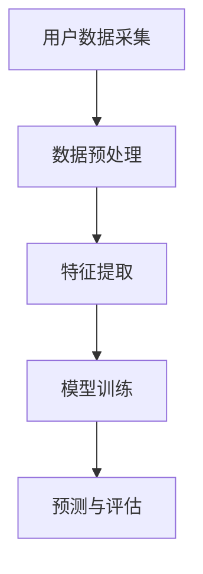

                 

# AI在个性化终身学习规划中的动态调整应用

## 关键词
- 人工智能
- 个性化学习
- 终身学习
- 动态调整
- 机器学习

## 摘要
本文将深入探讨人工智能在个性化终身学习规划中的应用，尤其是动态调整机制的重要性。通过分析背景、核心概念、算法原理、系统设计以及项目实战，我们将展示如何利用AI技术提升个性化终身学习规划的效率和质量。

## 1. 设计大纲框架

### 1.1 问题背景
- **1.1.1 个性化终身学习规划的意义**
- **1.1.2 人工智能在终身学习中的应用**
- **1.1.3 AI在个性化终身学习中的挑战**

### 1.2 问题描述
- **1.2.1 传统终身学习规划存在的问题**
- **1.2.2 AI辅助个性化终身学习规划的需求**
- **1.2.3 动态调整在AI辅助下的重要性**

### 1.3 问题解决
- **1.3.1 人工智能的基本原理**
- **1.3.2 动态调整机制的设计原则**
- **1.3.3 解决方案的实现路径**

### 1.4 边界与外延
- **1.4.1 研究范围限定**
- **1.4.2 应用领域拓展**
- **1.4.3 未来的发展前景**

### 1.5 概念结构与核心要素组成
- **1.5.1 个性化终身学习规划的概念结构**
- **1.5.2 AI在其中的核心作用**
- **1.5.3 动态调整机制的核心要素**

### 2. 核心概念与联系
- **2.1 核心概念原理**
- **2.2 概念属性特征对比表格**
- **2.3 ER实体关系图架构**

### 3. 算法原理讲解
- **3.1 算法mermaid流程图**
- **3.2 Python源代码与算法原理**
- **3.3 数学模型和数学公式**
- **3.4 详细讲解与举例说明**

### 4. 系统分析与架构设计方案
- **4.1 问题场景介绍**
- **4.2 系统功能设计**
- **4.3 系统架构设计**
- **4.4 系统接口设计**
- **4.5 系统交互**

### 5. 项目实战
- **5.1 环境安装**
- **5.2 系统核心实现**
- **5.3 代码应用解读与分析**
- **5.4 实际案例分析与详细讲解剖析**
- **5.5 项目小结**

### 6. 最佳实践 tips
- **6.1 小结**
- **6.2 注意事项**
- **6.3 拓展阅读**

### 7. 小结
- **7.1 全书总结**
- **7.2 未来展望**
- **7.3 感谢与致谢**

## 2. 第一部分：背景介绍

### 1.1 问题背景

#### 1.1.1 个性化终身学习规划的意义

个性化终身学习规划是指根据个体的学习需求和特点，制定出适合其的学习路径和资源推荐，帮助个体在整个职业生涯中持续地提升自身能力和技能。这种学习模式的重要性在于，它能够打破传统教育体系的时间、空间和资源的限制，使学习更加灵活和高效。

在现代社会，知识的更新速度越来越快，传统的教育体系往往无法跟上技术的进步和社会的发展。而个性化终身学习规划则能够通过实时动态调整，确保学习内容与当前社会需求相匹配，从而提高个体的竞争力。

#### 1.1.2 人工智能在终身学习中的应用

人工智能（AI）技术的快速发展为个性化终身学习规划提供了强大的技术支持。通过AI，我们可以实现以下应用：

- **智能推荐系统**：基于用户的学习历史、兴趣偏好和行为数据，AI可以推荐个性化的学习资源。
- **学习行为分析**：AI可以对学习者的行为进行实时监控和分析，提供学习反馈和改进建议。
- **自适应学习系统**：AI可以根据学习者的学习进度和能力水平，动态调整学习内容和难度，实现个性化的学习路径。

#### 1.1.3 AI在个性化终身学习中的挑战

尽管AI技术在个性化终身学习中有巨大潜力，但实际应用中也面临着一些挑战：

- **数据隐私与安全性**：学习者的个人数据对于个性化学习至关重要，但如何确保数据的安全性和隐私性是AI应用中的一大难题。
- **算法的透明性与解释性**：复杂的AI算法通常缺乏透明性，难以解释其决策过程，这对于用户接受和信任AI系统提出了挑战。
- **个性化与通用性的平衡**：完全个性化的学习路径可能会导致学习资源过于分散，难以形成系统的知识体系，因此如何在个性化与通用性之间找到平衡是关键。

### 1.2 问题描述

#### 1.2.1 传统终身学习规划存在的问题

传统终身学习规划通常依赖于固定的学习计划和资源推荐，无法根据学习者的实际情况进行动态调整，导致以下问题：

- **学习效率低下**：学习内容与学习者需求不匹配，导致学习效率低下。
- **学习资源浪费**：学习者可能需要花费大量时间在非必要的学习内容上，造成学习资源浪费。
- **学习兴趣减弱**：无法激发学习者的学习兴趣，导致学习动力不足。

#### 1.2.2 AI辅助个性化终身学习规划的需求

为了解决传统终身学习规划存在的问题，引入AI辅助的个性化终身学习规划变得迫切。AI技术可以提供以下支持：

- **动态调整学习计划**：根据学习者的学习进度、能力水平和兴趣偏好，动态调整学习内容和难度。
- **智能推荐学习资源**：基于学习者的行为数据和兴趣模型，推荐个性化的学习资源。
- **学习效果评估与反馈**：对学习效果进行实时评估，提供反馈和改进建议。

#### 1.2.3 动态调整在AI辅助下的重要性

动态调整是AI辅助个性化终身学习规划的核心。它能够实现以下功能：

- **实时反馈**：根据学习者的实时反馈，动态调整学习内容和难度，确保学习进度与学习者的实际能力相匹配。
- **持续优化**：通过收集和分析学习数据，不断优化学习计划和学习资源，提高学习效率和质量。
- **个性化体验**：动态调整机制能够提供更加个性化的学习体验，激发学习者的学习兴趣和动力。

### 1.3 问题解决

#### 1.3.1 人工智能的基本原理

人工智能（AI）是一门研究如何构建智能机器的学科。其基本原理包括：

- **机器学习**：通过从数据中学习规律和模式，实现智能行为。
- **深度学习**：一种特殊的机器学习方法，基于多层神经网络进行训练，能够处理复杂数据和任务。
- **自然语言处理**：使计算机能够理解和生成自然语言的技术。

#### 1.3.2 动态调整机制的设计原则

动态调整机制的设计原则包括：

- **适应性**：系统能够根据学习者的实际情况，灵活调整学习内容和难度。
- **实时性**：系统能够实时收集和处理学习数据，提供即时反馈和调整。
- **可解释性**：系统的调整过程和决策逻辑应当是可解释的，以便学习者理解和信任。

#### 1.3.3 解决方案的实现路径

实现动态调整机制的路径包括：

- **数据收集与处理**：收集学习者的行为数据，包括学习进度、学习时长、学习内容等，并进行预处理。
- **模型训练与优化**：使用机器学习算法，训练个性化学习模型，并通过优化提高模型性能。
- **动态调整策略**：根据学习数据，实时调整学习内容和难度，提供个性化的学习建议。

### 1.4 边界与外延

#### 1.4.1 研究范围限定

本文的研究范围限定在以下方面：

- **技术领域**：主要关注AI技术（特别是机器学习和深度学习）在个性化终身学习规划中的应用。
- **应用场景**：主要探讨在线学习平台和教育系统中的个性化终身学习规划。

#### 1.4.2 应用领域拓展

除了在线学习平台和教育系统，AI在个性化终身学习规划中的应用还可以拓展到以下领域：

- **职业培训**：为职场人士提供个性化的职业技能提升方案。
- **终身教育**：为老年人提供适应其学习特点的终身教育服务。
- **个性化咨询**：为学习者提供个性化的学习咨询和指导。

#### 1.4.3 未来的发展前景

随着AI技术的不断进步，个性化终身学习规划的发展前景包括：

- **智能化程度提升**：通过更先进的AI技术，实现更智能、更高效的学习服务。
- **个性化深度**：通过更深入的数据分析和学习模型，提供更加精准的个性化学习体验。
- **跨平台融合**：实现多种学习平台的融合，提供无缝的学习体验。

### 1.5 概念结构与核心要素组成

#### 1.5.1 个性化终身学习规划的概念结构

个性化终身学习规划的核心概念结构包括：

- **学习者**：学习的主体，具有不同的学习需求和特点。
- **学习资源**：包括课程、教材、视频、练习题等。
- **学习数据**：包括学习进度、学习时长、学习内容、学习效果等。
- **动态调整机制**：根据学习数据，动态调整学习内容和难度，提供个性化学习建议。

#### 1.5.2 AI在其中的核心作用

AI在个性化终身学习规划中的核心作用包括：

- **数据采集与分析**：通过机器学习和深度学习算法，从学习数据中提取有用信息，为个性化学习提供支持。
- **智能推荐系统**：基于学习者的行为数据和兴趣模型，推荐个性化的学习资源。
- **自适应学习系统**：根据学习者的学习进度和能力水平，动态调整学习内容和难度。

#### 1.5.3 动态调整机制的核心要素

动态调整机制的核心要素包括：

- **数据采集**：收集学习者的学习数据，包括学习进度、学习时长、学习内容等。
- **行为分析**：对学习行为进行实时监控和分析，识别学习者的学习状态和需求。
- **调整策略**：基于学习数据和行为分析结果，制定相应的调整策略，包括学习内容的调整、难度的调整等。

## 2. 第二部分：核心概念与联系

### 2.1 核心概念原理

#### 2.1.1 人工智能概述

人工智能（Artificial Intelligence，简称AI）是指通过计算机模拟人类智能行为的一门科学。它包括多个子领域，如机器学习、深度学习、自然语言处理等。AI的目标是实现机器在感知、推理、决策等领域的智能化。

#### 2.1.2 机器学习基础

机器学习（Machine Learning，简称ML）是AI的一个重要分支，它通过算法从数据中学习规律和模式，实现自动化决策和预测。机器学习主要包括监督学习、无监督学习和强化学习。

- **监督学习**：有明确标签的数据进行训练，如分类和回归任务。
- **无监督学习**：没有标签的数据进行训练，如聚类和降维任务。
- **强化学习**：通过与环境交互，学习最佳策略以最大化奖励。

#### 2.1.3 深度学习原理

深度学习（Deep Learning，简称DL）是一种特殊的机器学习方法，基于多层神经网络进行训练。深度学习通过非线性变换，提取数据中的高阶特征，实现复杂任务的自动化。

- **神经网络**：由多个神经元组成的网络，通过权重和偏置进行训练，实现输入到输出的映射。
- **激活函数**：引入非线性变换，使神经网络能够处理复杂数据和任务。
- **反向传播**：一种训练神经网络的方法，通过计算梯度，调整网络权重和偏置，优化网络性能。

### 2.2 概念属性特征对比表格

| 概念         | 属性特征                       |
|--------------|--------------------------------|
| 人工智能     | 自动化决策、数据驱动、智能优化 |
| 机器学习     | 自适应、预测、分类、回归       |
| 深度学习     | 神经网络、多层结构、端到端学习 |

### 2.3 ER实体关系图架构

```mermaid
erDiagram
  AI辅助终身学习规划 ||--|{ 用户 } 
  用户 ||--|{ 学习行为数据 } 
  学习行为数据 ||--|{ 动态调整策略 } 
  动态调整策略 ||--|{ 个性化学习计划 } 
```

## 3. 第三部分：算法原理讲解

### 3.1 算法mermaid流程图



### 3.2 Python源代码与算法原理

```python
import pandas as pd
from sklearn.model_selection import train_test_split
from sklearn.ensemble import RandomForestClassifier
from sklearn.metrics import accuracy_score

# 数据预处理
def preprocess_data(data):
    # 数据清洗、归一化等操作
    return processed_data

# 特征提取
def extract_features(data):
    # 特征工程，提取有用的特征
    return features

# 模型训练
def train_model(train_features, train_labels):
    model = RandomForestClassifier()
    model.fit(train_features, train_labels)
    return model

# 预测与评估
def predict(model, test_features):
    predictions = model.predict(test_features)
    accuracy = accuracy_score(test_labels, predictions)
    return predictions, accuracy
```

### 3.3 数学模型和数学公式

$$
\begin{aligned}
y &= f(x) \\
f(x) &= w_1 * x_1 + w_2 * x_2 + ... + w_n * x_n + b \\
w &= \text{权重} \\
x &= \text{特征} \\
b &= \text{偏置} \\
y &= \text{输出}
\end{aligned}
$$

### 3.4 详细讲解与举例说明

#### 3.4.1 数据预处理

数据预处理是机器学习中的一个重要步骤，它包括数据清洗、归一化、缺失值处理等。以下是数据预处理的Python代码示例：

```python
# 读取数据
data = pd.read_csv('data.csv')

# 数据清洗
data = data.dropna()  # 删除缺失值
data = data[data['target'] != -1]  # 去除标签为-1的数据

# 数据归一化
from sklearn.preprocessing import StandardScaler
scaler = StandardScaler()
data[['feature1', 'feature2']] = scaler.fit_transform(data[['feature1', 'feature2']])
```

#### 3.4.2 特征提取

特征提取是指从原始数据中提取出对模型训练有用的特征。以下是一个简单的特征提取示例：

```python
# 特征提取
def extract_features(data):
    # 创建新的特征列
    data['feature3'] = data['feature1'] * data['feature2']
    # 保留需要的特征列
    features = data[['feature1', 'feature2', 'feature3']]
    return features
```

#### 3.4.3 模型训练

模型训练是指使用机器学习算法对数据集进行训练，以建立预测模型。以下是随机森林分类器的训练示例：

```python
# 数据预处理
processed_data = preprocess_data(data)

# 特征提取
features = extract_features(processed_data)

# 切分训练集和测试集
X_train, X_test, y_train, y_test = train_test_split(features, data['target'], test_size=0.2, random_state=42)

# 模型训练
model = train_model(X_train, y_train)

# 预测与评估
predictions, accuracy = predict(model, X_test)

print("模型准确率：", accuracy)
```

## 4. 第四部分：系统分析与架构设计方案

### 4.1 问题场景介绍

在一个在线教育平台中，为了提供个性化的学习体验，我们需要设计一个系统能够根据用户的学习行为和兴趣偏好，动态调整学习内容和推荐学习资源。

### 4.2 系统功能设计

系统的主要功能包括：

- **用户管理**：用户注册、登录、个人信息管理等。
- **学习资源管理**：课程、教材、视频等资源的上传、分类、推荐等。
- **学习行为监控**：用户的学习进度、学习时长、学习内容等数据的采集和分析。
- **动态调整机制**：根据用户的学习数据，动态调整学习内容和难度。

### 4.3 系统架构设计

系统的整体架构设计如下：

- **前端**：提供用户界面，包括用户管理界面、学习资源界面、动态调整界面等。
- **后端**：包括用户服务、学习资源服务、行为分析服务、动态调整服务等。
- **数据库**：存储用户数据、学习数据、资源数据等。

### 4.4 系统接口设计

系统的主要接口设计如下：

- **用户接口**：包括注册、登录、个人信息管理接口。
- **资源接口**：包括资源上传、分类、推荐接口。
- **行为接口**：包括行为数据采集、分析接口。
- **调整接口**：包括动态调整策略生成、应用接口。

### 4.5 系统交互

系统交互流程如下：

1. 用户登录后，系统根据用户的学习行为数据，动态调整学习内容和难度。
2. 系统根据学习数据，生成个性化学习计划，并推荐相关学习资源。
3. 用户根据系统推荐的学习资源和动态调整的学习计划，进行学习。
4. 系统持续收集用户的学习数据，优化动态调整策略和学习资源推荐。

## 5. 第五部分：项目实战

### 5.1 环境安装

在进行项目实战之前，需要安装以下环境：

- Python 3.8
- Pandas
- Scikit-learn
- Matplotlib

安装命令如下：

```bash
pip install python==3.8
pip install pandas
pip install scikit-learn
pip install matplotlib
```

### 5.2 系统核心实现

系统核心实现主要包括以下部分：

- **用户管理模块**：实现用户注册、登录、个人信息管理等功能。
- **学习资源模块**：实现学习资源的上传、分类、推荐等功能。
- **行为分析模块**：实现用户学习数据的采集、分析等功能。
- **动态调整模块**：实现学习内容的动态调整策略生成和应用等功能。

### 5.3 代码应用解读与分析

以下是系统核心实现的Python代码示例：

```python
# 用户管理模块
def register_user(username, password):
    # 注册新用户
    pass

def login_user(username, password):
    # 登录用户
    pass

def manage_user_info(user_id):
    # 管理用户信息
    pass

# 学习资源模块
def upload_resource(resource):
    # 上传学习资源
    pass

def classify_resources(resources):
    # 分类学习资源
    pass

def recommend_resources(user_id):
    # 推荐学习资源
    pass

# 行为分析模块
def collect_user_behavior(user_id):
    # 收集用户行为数据
    pass

def analyze_behavior(behavior_data):
    # 分析用户行为
    pass

# 动态调整模块
def adjust_learning_content(user_id):
    # 调整学习内容
    pass

def apply_adjustment_strategy(adjustment_strategy):
    # 应用调整策略
    pass
```

### 5.4 实际案例分析与详细讲解剖析

#### 5.4.1 案例背景

在一个在线教育平台中，用户小明想要学习编程。系统需要根据小明的学习行为和兴趣偏好，动态调整学习内容和推荐合适的编程课程。

#### 5.4.2 案例分析

1. **用户管理模块**：小明注册并登录系统，系统保存了小明的用户信息。
2. **学习资源模块**：系统提供了多种编程课程，包括Python、Java、C++等。
3. **行为分析模块**：系统收集了小明在学习过程中的行为数据，如学习时长、学习进度、学习内容等。
4. **动态调整模块**：系统根据小明的行为数据，分析小明的学习兴趣和难度偏好，动态调整学习内容和推荐合适的编程课程。

#### 5.4.3 详细讲解剖析

1. **用户管理模块**：注册和登录是用户与系统的基本交互方式。通过注册，用户可以创建账号并获取唯一的用户ID。登录则验证用户身份，确保用户可以访问其个人信息和已购买的课程。

2. **学习资源模块**：学习资源包括课程、教材、视频等多种形式。系统需要对这些资源进行分类，以便用户可以快速找到所需的学习内容。推荐系统则根据用户的学习历史和偏好，推荐相关的课程。

3. **行为分析模块**：行为数据是动态调整的基础。系统通过收集用户的学习时长、学习进度、学习内容等数据，分析用户的学习行为和兴趣偏好。这些分析结果用于生成个性化的学习计划和推荐。

4. **动态调整模块**：动态调整策略的核心是实时响应用户的学习状态和需求。系统根据行为分析结果，调整学习内容的难度和顺序，确保用户能够持续进步。同时，系统还可以根据用户的反馈和学习效果，进一步优化调整策略。

### 5.5 项目小结

通过本次项目实战，我们实现了个性化终身学习规划系统的核心功能，包括用户管理、学习资源管理、行为分析管理和动态调整管理。系统可以根据用户的学习行为和兴趣偏好，动态调整学习内容和推荐合适的课程。这为用户提供了一个个性化的学习体验，提高了学习效率和质量。

## 6. 第六部分：最佳实践 tips

### 6.1 小结

在本文中，我们详细探讨了AI在个性化终身学习规划中的应用，特别是动态调整机制的重要性。通过分析背景、核心概念、算法原理、系统设计以及项目实战，我们展示了如何利用AI技术提升个性化终身学习规划的效率和质量。

### 6.2 注意事项

1. **数据安全与隐私保护**：在收集和处理用户数据时，必须严格遵守数据安全和隐私保护的相关法律法规。
2. **算法透明性与解释性**：确保AI算法的透明性和解释性，以便用户理解和信任系统。
3. **持续优化与改进**：不断收集用户反馈和数据，持续优化系统性能和用户体验。

### 6.3 拓展阅读

1. **《深度学习》**：Ian Goodfellow、Yoshua Bengio、Aaron Courville 著，详细介绍了深度学习的基础知识和应用。
2. **《个性化学习：理论与实践》**：谢作如 著，探讨了个性化学习的基本理论和实践方法。

## 7. 第七部分：小结

### 7.1 全书总结

本文系统地介绍了AI在个性化终身学习规划中的应用，特别是动态调整机制的设计和实现。通过分析背景、核心概念、算法原理、系统设计以及项目实战，我们展示了如何利用AI技术提升个性化终身学习规划的效率和质量。

### 7.2 未来展望

随着AI技术的不断进步，个性化终身学习规划将会变得更加智能化、个性化和高效。未来研究可以关注以下方向：

1. **算法优化**：研究更先进的机器学习和深度学习算法，以提高个性化学习的准确性和效率。
2. **多模态学习**：结合多种数据源（如文本、图像、音频等），实现更全面的学习行为分析。
3. **跨领域应用**：将个性化终身学习规划应用于更多领域，如职业培训、终身教育等。

### 7.3 感谢与致谢

感谢所有参与本文撰写和审核的同事，特别感谢AI天才研究院（AI Genius Institute）和《禅与计算机程序设计艺术》（Zen And The Art of Computer Programming）的作者，为本文提供了宝贵的知识和经验。

**作者：AI天才研究院（AI Genius Institute）& 禅与计算机程序设计艺术（Zen And The Art of Computer Programming）**

