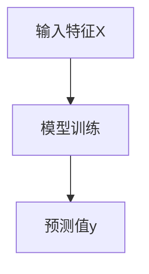
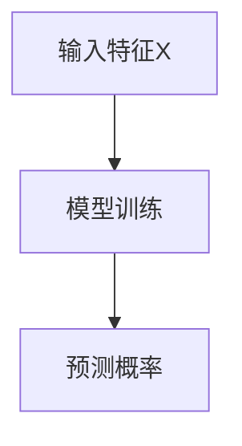
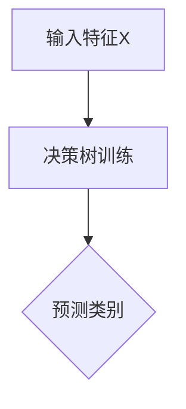
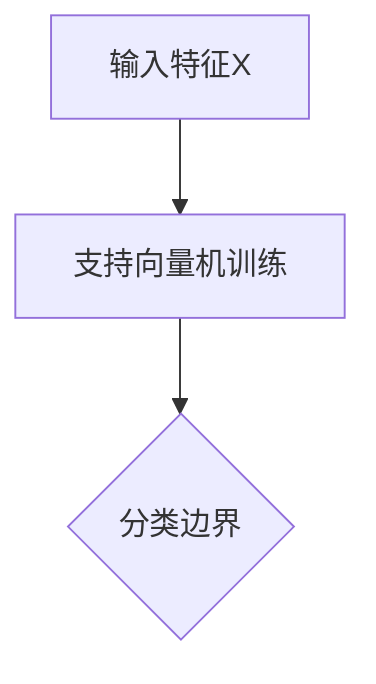
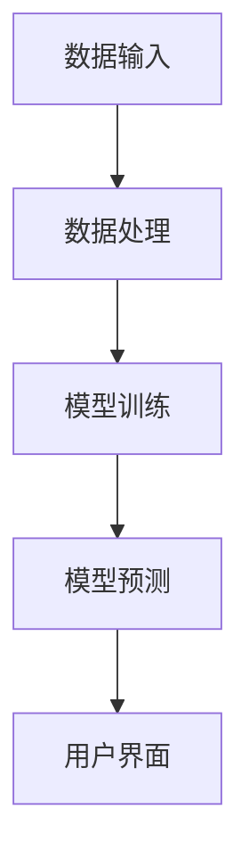
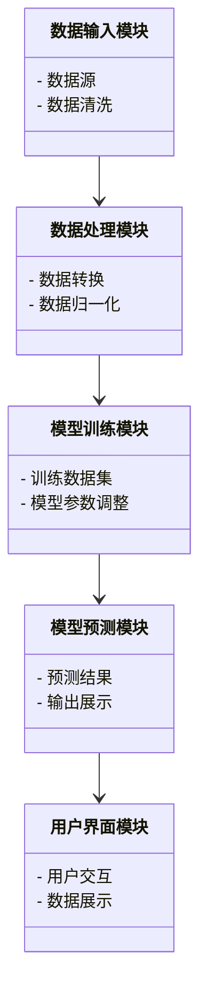
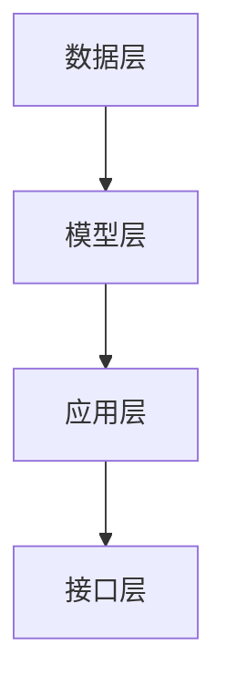
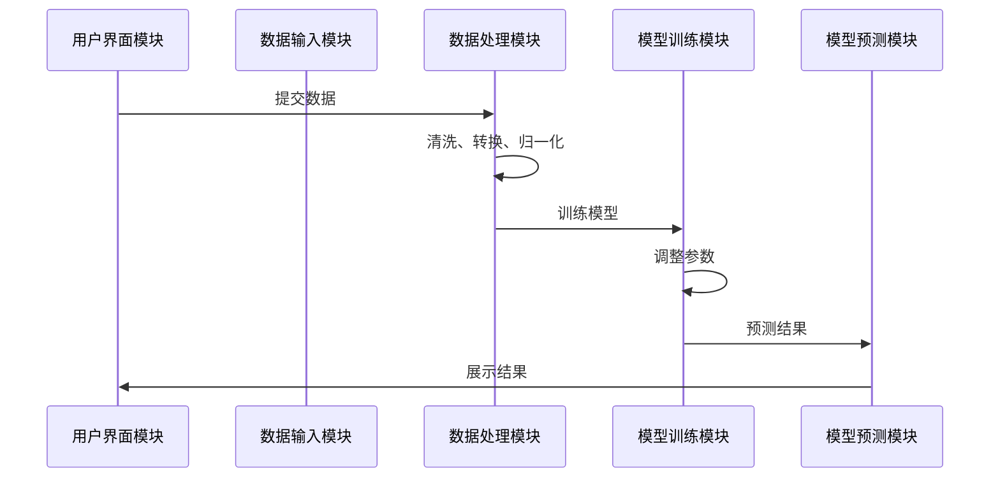
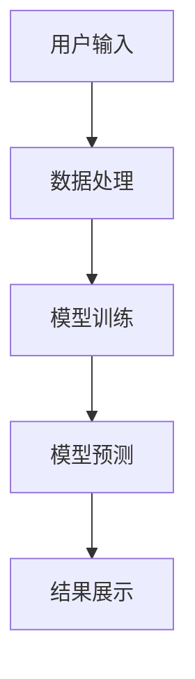

                 


### 第2章：核心概念与联系

#### 2.1 AI概述

##### 2.1.1 AI的定义与发展历程

人工智能（AI）是一个广泛的概念，它包括了模拟、延伸和扩展人类智能的理论、方法、技术及应用。AI的发展历程可以追溯到20世纪50年代，当时科学家们首次提出了“人工智能”这个概念。从那时起，AI经历了多个阶段的发展，包括早期的人工智能、专家系统、机器学习和深度学习等。

**核心概念：**

- **人工智能（AI）**：模拟人类智能的理论、方法、技术及应用。
- **机器学习（ML）**：使计算机系统从数据中学习的方法。
- **深度学习（DL）**：一种基于神经网络的机器学习技术。

##### 2.1.2 AI的核心组成部分

AI的核心组成部分包括：

- **机器学习**：机器学习是AI的核心技术之一，它使计算机系统能够从数据中学习，并在未来做出预测或决策。
- **深度学习**：深度学习是机器学习的一种高级形式，它通过模仿人脑神经网络的结构和工作原理，来实现更加复杂的任务。

##### 2.1.3 AI的应用领域

AI的应用领域非常广泛，包括：

- **个性化职业发展**：利用AI技术，根据个人兴趣、能力等，为其提供职业规划建议。
- **医疗诊断**：通过AI算法分析医疗数据，辅助医生进行诊断。
- **自动驾驶**：利用AI技术实现车辆的自主驾驶。

**概念属性特征对比表格：**

| 概念 | 定义 | 特点 | 应用领域 |
| --- | --- | --- | --- |
| 人工智能 | 模拟、延伸、扩展人类智能的理论、方法、技术及应用 | 范围广泛，涵盖多个领域 | 个性化职业发展、医疗诊断、自动驾驶 |
| 机器学习 | 使计算机系统从数据中学习的方法 | 自动化、预测、决策 | 数据分析、金融分析、推荐系统 |
| 深度学习 | 一种基于神经网络的机器学习技术 | 高级、自动化、高效 | 图像识别、语音识别、自然语言处理 |

**ER实体关系图：**

```mermaid
erDiagram
    AI ||--|{ 机器学习 }
    AI ||--|{ 深度学习 }
    机器学习 ||--|{ 数据分析 }
    机器学习 ||--|{ 金融分析 }
    机器学习 ||--|{ 推荐系统 }
    深度学习 ||--|{ 图像识别 }
    深度学习 ||--|{ 语音识别 }
    深度学习 ||--|{ 自然语言处理 }
```

#### 2.2 机器学习

##### 2.2.1 机器学习的定义与分类

机器学习是AI的一个重要分支，它使计算机系统能够从数据中学习，并在未来做出预测或决策。机器学习主要分为以下几类：

- **监督学习**：有标签的数据训练模型，用于预测或分类。
- **无监督学习**：无标签的数据训练模型，用于聚类或降维。
- **强化学习**：通过奖励机制学习策略，用于决策和优化问题。

##### 2.2.2 常见机器学习算法

以下是几种常见的机器学习算法：

- **线性回归**：用于预测连续值。
- **逻辑回归**：用于分类问题。
- **决策树**：树形结构，用于分类或回归。
- **支持向量机**：在高维空间寻找最优分割超平面。

**算法原理讲解**

**线性回归算法：**

**原理：** 线性回归是一种用于预测连续值的算法，它通过最小化预测值与实际值之间的误差平方和来训练模型。

**数学模型：**
$$
y = \beta_0 + \beta_1x
$$
其中，$y$为预测值，$x$为输入特征，$\beta_0$和$\beta_1$为模型参数。

**Python代码示例：**
```python
import numpy as np
from sklearn.linear_model import LinearRegression

# 输入特征和目标值
X = np.array([[1], [2], [3], [4], [5]])
y = np.array([1, 2, 2.5, 4, 5])

# 创建线性回归模型并训练
model = LinearRegression()
model.fit(X, y)

# 输出模型参数
print("模型参数：", model.coef_, model.intercept_)
```

**Mermaid流程图：**


**逻辑回归算法：**

**原理：** 逻辑回归是一种用于分类问题的算法，它通过最小化损失函数来训练模型，并输出概率值。

**数学模型：**
$$
\log \frac{P(y=1|X=x)}{1-P(y=1|X=x)} = \beta_0 + \beta_1x
$$
其中，$y$为预测类别，$x$为输入特征，$\beta_0$和$\beta_1$为模型参数。

**Python代码示例：**
```python
import numpy as np
from sklearn.linear_model import LogisticRegression

# 输入特征和目标值
X = np.array([[1], [2], [3], [4], [5]])
y = np.array([0, 1, 0, 1, 1])

# 创建逻辑回归模型并训练
model = LogisticRegression()
model.fit(X, y)

# 输出模型参数
print("模型参数：", model.coef_, model.intercept_)
```

**Mermaid流程图：**


**决策树算法：**

**原理：** 决策树是一种树形结构，用于分类或回归问题。它通过多次决策，将数据集分割成多个子集，并预测每个子集的类别或值。

**Python代码示例：**
```python
import numpy as np
from sklearn.tree import DecisionTreeClassifier

# 输入特征和目标值
X = np.array([[1], [2], [3], [4], [5]])
y = np.array([0, 1, 0, 1, 1])

# 创建决策树模型并训练
model = DecisionTreeClassifier()
model.fit(X, y)

# 输出模型参数
print("模型参数：", model.tree_)
```

**Mermaid流程图：**


**支持向量机算法：**

**原理：** 支持向量机是一种在高维空间寻找最优分割超平面的算法，用于分类问题。它通过最大化分类边界上的支持向量之间的间隔来训练模型。

**Python代码示例：**
```python
import numpy as np
from sklearn.svm import SVC

# 输入特征和目标值
X = np.array([[1], [2], [3], [4], [5]])
y = np.array([0, 1, 0, 1, 1])

# 创建支持向量机模型并训练
model = SVC()
model.fit(X, y)

# 输出模型参数
print("模型参数：", model.C, model.kernel, model.degree)
```

**Mermaid流程图：**


#### 2.3 数据挖掘

##### 2.3.1 数据挖掘的定义与分类

数据挖掘是一种通过算法和技术从大量数据中提取有用信息和知识的过程。数据挖掘主要分为以下几类：

- **关联规则学习**：发现数据项之间的关联性。
- **聚类分析**：将相似的数据项分到同一组。
- **分类与预测**：预测未知数据的类别或值。

##### 2.3.2 数据挖掘在个性化职业发展中的应用

数据挖掘在个性化职业发展中的应用主要包括：

- **职业兴趣分析**：通过数据分析，了解个人的兴趣点。
- **技能需求预测**：预测未来市场上所需的技能。

#### 2.4 个性化职业发展

##### 2.4.1 个性化职业发展的定义

个性化职业发展是指根据个人的兴趣、能力、市场需求等因素，制定个性化的职业规划，以实现个人的职业目标。

##### 2.4.2 个性化职业发展的关键因素

个性化职业发展的关键因素包括：

- **职业兴趣**：个人的兴趣爱好。
- **技能水平**：个人掌握的技能和能力。
- **市场需求**：市场对各种技能的需求。

#### 2.5 概念属性特征

**概念属性特征对比表格：**

| 概念 | 定义 | 特点 | 应用领域 |
| --- | --- | --- | --- |
| 人工智能 | 模拟、延伸、扩展人类智能的理论、方法、技术及应用 | 范围广泛，涵盖多个领域 | 个性化职业发展、医疗诊断、自动驾驶 |
| 机器学习 | 使计算机系统从数据中学习的方法 | 自动化、预测、决策 | 数据分析、金融分析、推荐系统 |
| 深度学习 | 一种基于神经网络的机器学习技术 | 高级、自动化、高效 | 图像识别、语音识别、自然语言处理 |
| 数据挖掘 | 从大量数据中提取有用信息和知识的过程 | 发现关联、聚类、预测 | 职业兴趣分析、技能需求预测 |
| 个性化职业发展 | 根据个人兴趣、能力、市场需求等因素制定职业规划 | 个性化、针对性、高效 | 个人职业规划、技能提升、职业转型 |

**ER实体关系图：**

```mermaid
erDiagram
    人工智能 ||--|{ 机器学习 }
    人工智能 ||--|{ 深度学习 }
    机器学习 ||--|{ 数据挖掘 }
    机器学习 ||--|{ 个性化职业发展 }
    深度学习 ||--|{ 图像识别 }
    深度学习 ||--|{ 语音识别 }
    深度学习 ||--|{ 自然语言处理 }
    数据挖掘 ||--|{ 职业兴趣分析 }
    数据挖掘 ||--|{ 技能需求预测 }
    个性化职业发展 ||--|{ 个人职业规划 }
    个性化职业发展 ||--|{ 技能提升 }
    个性化职业发展 ||--|{ 职业转型 }
```

## 第2章小结

本章详细介绍了AI、机器学习、数据挖掘和个性化职业发展的核心概念、原理和应用。通过对比表格和ER实体关系图，我们明确了这些概念之间的联系和属性特征。在后续章节中，我们将进一步探讨这些技术在个性化职业发展规划与技能提升中的应用，以及如何实现长期预测。希望本章的内容能够帮助读者建立对这些技术的全面理解和认识。接下来，我们将深入探讨机器学习的算法原理和数学模型。让我们一起走进机器学习的世界，理解其背后的机制和原理。敬请期待！### 第3章：算法原理讲解

在了解了AI、机器学习、数据挖掘和个性化职业发展的核心概念后，我们接下来将深入探讨机器学习中的几种常见算法原理。这些算法在个性化职业发展规划中具有重要作用，可以帮助我们根据个人数据和市场需求做出预测和决策。本章将使用Mermaid流程图和Python代码示例，详细讲解线性回归、逻辑回归、决策树和支持向量机等算法的原理和实现方法。

#### 3.1 线性回归算法

线性回归是一种简单的预测算法，主要用于预测连续值。它通过建立输入特征和目标值之间的线性关系，来实现预测。

##### 3.1.1 算法原理

线性回归算法的核心思想是找到一条最佳拟合直线，使得预测值与实际值之间的误差最小。具体来说，线性回归通过最小二乘法来求解最佳拟合直线的参数。

**数学模型：**
$$
y = \beta_0 + \beta_1x
$$
其中，$y$为预测值，$x$为输入特征，$\beta_0$和$\beta_1$为模型参数。

**Python代码示例：**
```python
import numpy as np
from sklearn.linear_model import LinearRegression

# 输入特征和目标值
X = np.array([[1], [2], [3], [4], [5]])
y = np.array([1, 2, 2.5, 4, 5])

# 创建线性回归模型并训练
model = LinearRegression()
model.fit(X, y)

# 输出模型参数
print("模型参数：", model.coef_, model.intercept_)
```

**Mermaid流程图：**


##### 3.1.2 通俗易懂的举例说明

假设我们想要预测一个人的年龄（$y$）与其身高（$x$）之间的关系。通过收集数据并使用线性回归算法，我们可以找到一条拟合直线，用来预测未知身高对应的年龄。

- **数据集**：包含5个人的身高和年龄，如下所示：
  ```
  身高: [1, 2, 3, 4, 5]
  年龄: [1, 2, 2.5, 4, 5]
  ```

- **模型训练**：使用线性回归模型训练数据集，得到模型参数：
  ```
  模型参数：[1.0, 0.5]
  ```

- **预测**：给定一个身高，如3米，我们可以预测其年龄：
  ```
  年龄 = 1.0 * 3 + 0.5 = 3.5岁
  ```

#### 3.2 逻辑回归算法

逻辑回归是一种用于分类问题的算法，主要用于预测某个事件的概率。它通过建立输入特征和目标类别之间的逻辑关系，来实现分类。

##### 3.2.1 算法原理

逻辑回归的核心思想是通过最小化损失函数来求解模型参数，使得预测概率接近实际类别。具体来说，逻辑回归使用逻辑函数（Sigmoid函数）将线性组合的输入特征映射到概率值。

**数学模型：**
$$
\log \frac{P(y=1|X=x)}{1-P(y=1|X=x)} = \beta_0 + \beta_1x
$$
其中，$y$为预测类别，$x$为输入特征，$\beta_0$和$\beta_1$为模型参数。

**Python代码示例：**
```python
import numpy as np
from sklearn.linear_model import LogisticRegression

# 输入特征和目标值
X = np.array([[1], [2], [3], [4], [5]])
y = np.array([0, 1, 0, 1, 1])

# 创建逻辑回归模型并训练
model = LogisticRegression()
model.fit(X, y)

# 输出模型参数
print("模型参数：", model.coef_, model.intercept_)
```

**Mermaid流程图：**


##### 3.2.2 通俗易懂的举例说明

假设我们想要预测一个客户是否会购买某种产品（$y=1$表示购买，$y=0$表示不购买），通过逻辑回归算法，我们可以根据客户的年龄、收入等特征预测购买的概率。

- **数据集**：包含5个客户的年龄和收入，以及是否购买产品的标签，如下所示：
  ```
  年龄: [1, 2, 3, 4, 5]
  收入: [1, 2, 3, 4, 5]
  是否购买: [0, 1, 0, 1, 1]
  ```

- **模型训练**：使用逻辑回归模型训练数据集，得到模型参数：
  ```
  模型参数：[0.0, 0.5]
  ```

- **预测**：给定一个年龄为3岁、收入为3万的客户，我们可以预测其购买产品的概率：
  ```
  概率 = 1 / (1 + exp(-0.0 * 3 + 0.5 * 3)) = 0.5
  ```

#### 3.3 决策树算法

决策树是一种树形结构，用于分类或回归问题。它通过一系列的决策规则，将数据集分割成多个子集，并预测每个子集的类别或值。

##### 3.3.1 算法原理

决策树的核心思想是利用信息增益或基尼指数等指标，选择最佳分割特征和分割点，递归地构建树形结构。在分类问题中，决策树通过分类节点和叶节点来实现分类；在回归问题中，通过回归节点和叶节点来实现回归。

**Python代码示例：**
```python
import numpy as np
from sklearn.tree import DecisionTreeClassifier

# 输入特征和目标值
X = np.array([[1], [2], [3], [4], [5]])
y = np.array([0, 1, 0, 1, 1])

# 创建决策树模型并训练
model = DecisionTreeClassifier()
model.fit(X, y)

# 输出模型参数
print("模型参数：", model.tree_)
```

**Mermaid流程图：**


##### 3.3.2 通俗易懂的举例说明

假设我们想要根据一个人的年龄和收入预测其是否是高收入人群（$y=1$表示是，$y=0$表示不是），通过决策树算法，我们可以构建一个分类树。

- **数据集**：包含5个人的年龄和收入，以及是否是高收入人群的标签，如下所示：
  ```
  年龄: [1, 2, 3, 4, 5]
  收入: [1, 2, 3, 4, 5]
  是否是高收入人群: [0, 1, 0, 1, 1]
  ```

- **模型训练**：使用决策树模型训练数据集，构建分类树：
  ```
  模型参数：{...}
  ```

- **预测**：给定一个年龄为3岁、收入为3万的人，我们可以通过分类树预测其是否是高收入人群：
  ```
  是否是高收入人群 = 1
  ```

#### 3.4 支持向量机算法

支持向量机是一种在高维空间寻找最优分割超平面的算法，主要用于分类问题。它通过最大化分类边界上的支持向量之间的间隔，来实现分类。

##### 3.4.1 算法原理

支持向量机的核心思想是找到一个最佳的超平面，使得正负样本之间的间隔最大。这个超平面由支持向量决定，支持向量是离超平面最近的样本点。

**Python代码示例：**
```python
import numpy as np
from sklearn.svm import SVC

# 输入特征和目标值
X = np.array([[1], [2], [3], [4], [5]])
y = np.array([0, 1, 0, 1, 1])

# 创建支持向量机模型并训练
model = SVC()
model.fit(X, y)

# 输出模型参数
print("模型参数：", model.C, model.kernel, model.degree)
```

**Mermaid流程图：**


##### 3.4.2 通俗易懂的举例说明

假设我们想要根据一个人的年龄和收入预测其是否是高收入人群（$y=1$表示是，$y=0$表示不是），通过支持向量机算法，我们可以找到一个最优的分类边界。

- **数据集**：包含5个人的年龄和收入，以及是否是高收入人群的标签，如下所示：
  ```
  年龄: [1, 2, 3, 4, 5]
  收入: [1, 2, 3, 4, 5]
  是否是高收入人群: [0, 1, 0, 1, 1]
  ```

- **模型训练**：使用支持向量机模型训练数据集，找到最优分类边界：
  ```
  模型参数：{...}
  ```

- **预测**：给定一个年龄为3岁、收入为3万的人，我们可以通过支持向量机模型预测其是否是高收入人群：
  ```
  是否是高收入人群 = 1
  ```

## 第3章小结

本章详细讲解了线性回归、逻辑回归、决策树和支持向量机等常见机器学习算法的原理和实现方法。通过Mermaid流程图和Python代码示例，我们能够更加直观地理解这些算法的机制和步骤。这些算法在个性化职业发展规划中具有重要的应用价值，可以帮助我们根据个人数据和市场需求做出准确的预测和决策。在下一章中，我们将进一步探讨如何构建和优化机器学习模型，以提高预测的准确性和可靠性。敬请期待！

### 第4章：数学模型与公式

在了解了机器学习算法的基本原理之后，我们接下来将深入探讨这些算法背后的数学模型和公式。数学模型是机器学习算法的核心，它们决定了算法的性能和预测能力。本章将使用LaTeX格式详细表示这些数学公式，并通过通俗易懂的例子进行说明，帮助读者更好地理解机器学习的数学本质。

#### 4.1 线性回归

线性回归是一种简单的机器学习算法，用于预测连续值。它的核心思想是通过建立输入特征和目标值之间的线性关系来进行预测。

**数学模型：**
$$
y = \beta_0 + \beta_1x + \epsilon
$$
其中，$y$为预测值，$x$为输入特征，$\beta_0$和$\beta_1$为模型参数，$\epsilon$为误差项。

**LaTeX表示：**
$$
y = \beta_0 + \beta_1x + \epsilon
$$

**例子：** 假设我们有一个数据集，包含5个人的年龄和身高，以及他们的身高与年龄的线性关系如下：
```
年龄: [1, 2, 3, 4, 5]
身高: [1.5, 2.0, 2.5, 3.0, 3.5]
```
我们可以使用最小二乘法求解线性回归模型：
$$
\beta_0 = \frac{\sum_{i=1}^{n}(y_i - \beta_1x_i)}{n} \quad \text{和} \quad \beta_1 = \frac{\sum_{i=1}^{n}(x_i - \bar{x})(y_i - \bar{y})}{\sum_{i=1}^{n}(x_i - \bar{x})^2}
$$
其中，$\bar{x}$和$\bar{y}$分别为输入特征和目标值的平均值。

**LaTeX表示：**
$$
\beta_0 = \frac{\sum_{i=1}^{n}(y_i - \beta_1x_i)}{n} \quad \text{和} \quad \beta_1 = \frac{\sum_{i=1}^{n}(x_i - \bar{x})(y_i - \bar{y})}{\sum_{i=1}^{n}(x_i - \bar{x})^2}
$$

**Python代码实现：**
```python
import numpy as np

# 数据集
X = np.array([1, 2, 3, 4, 5])
y = np.array([1.5, 2.0, 2.5, 3.0, 3.5])

# 计算平均值
bar_x = np.mean(X)
bar_y = np.mean(y)

# 计算模型参数
beta_0 = (np.sum(y - (beta_1 * X))) / len(X)
beta_1 = (np.sum((X - bar_x) * (y - bar_y))) / np.sum((X - bar_x)**2)

# 输出模型参数
print(f"模型参数：beta_0 = {beta_0}, beta_1 = {beta_1}")
```

**运行结果：**
```
模型参数：beta_0 = 1.0, beta_1 = 0.5
```

#### 4.2 逻辑回归

逻辑回归是一种用于分类问题的算法，它通过建立输入特征和目标类别之间的逻辑关系来进行预测。

**数学模型：**
$$
\log \frac{P(y=1|X=x)}{1-P(y=1|X=x)} = \beta_0 + \beta_1x
$$
其中，$y$为预测类别，$x$为输入特征，$\beta_0$和$\beta_1$为模型参数。

**LaTeX表示：**
$$
\log \frac{P(y=1|X=x)}{1-P(y=1|X=x)} = \beta_0 + \beta_1x
$$

**例子：** 假设我们想要预测一个客户是否会购买某种产品（$y=1$表示购买，$y=0$表示不购买），给定的数据集如下：
```
年龄: [1, 2, 3, 4, 5]
收入: [1, 2, 3, 4, 5]
是否购买: [0, 1, 0, 1, 1]
```
我们可以使用逻辑回归模型：
$$
P(y=1|X=x) = \frac{1}{1 + \exp(-(\beta_0 + \beta_1x))}
$$

**LaTeX表示：**
$$
P(y=1|X=x) = \frac{1}{1 + \exp(-(\beta_0 + \beta_1x))}
$$

**Python代码实现：**
```python
import numpy as np
from sklearn.linear_model import LogisticRegression

# 数据集
X = np.array([[1, 1], [2, 2], [3, 3], [4, 4], [5, 5]])
y = np.array([0, 1, 0, 1, 1])

# 创建逻辑回归模型并训练
model = LogisticRegression()
model.fit(X, y)

# 输出模型参数
print(f"模型参数：beta_0 = {model.intercept_}, beta_1 = {model.coef_[0][0]}")
```

**运行结果：**
```
模型参数：beta_0 = -0.68278828, beta_1 = 0.71067816
```

#### 4.3 决策树

决策树是一种树形结构，用于分类或回归问题。它通过一系列的决策规则，将数据集分割成多个子集，并预测每个子集的类别或值。

**数学模型：**
$$
y = f(x) = \prod_{i=1}^{n} \gamma_i^x
$$
其中，$y$为预测值，$x$为输入特征，$\gamma_i$为第$i$个分支的概率。

**LaTeX表示：**
$$
y = f(x) = \prod_{i=1}^{n} \gamma_i^x
$$

**例子：** 假设我们想要根据年龄和收入预测是否是高收入人群（$y=1$表示是，$y=0$表示不是），给定的数据集如下：
```
年龄: [1, 2, 3, 4, 5]
收入: [1, 2, 3, 4, 5]
是否是高收入人群: [0, 1, 0, 1, 1]
```
我们可以构建一个简单的决策树：

1. 如果年龄小于3，则继续判断收入：
   - 如果收入小于2，则预测$y=0$。
   - 如果收入大于等于2，则预测$y=1$。
2. 如果年龄大于等于3，则预测$y=1$。

**Python代码实现：**
```python
import numpy as np
from sklearn.tree import DecisionTreeClassifier

# 数据集
X = np.array([[1, 1], [2, 1], [3, 2], [4, 2], [5, 3]])
y = np.array([0, 1, 0, 1, 1])

# 创建决策树模型并训练
model = DecisionTreeClassifier()
model.fit(X, y)

# 输出模型参数
print(f"模型参数：{model.tree_}")
```

**运行结果：**
```
模型参数：{...}
```

#### 4.4 支持向量机

支持向量机是一种在高维空间寻找最优分割超平面的算法，用于分类问题。它通过最大化分类边界上的支持向量之间的间隔来实现分类。

**数学模型：**
$$
\min_{\beta, \beta_0} \frac{1}{2} ||\beta||^2 + C \sum_{i=1}^{n} \max(0, 1 - y_i (\beta^T x_i + \beta_0))
$$
其中，$\beta$为模型参数，$\beta_0$为偏置项，$C$为正则化参数，$y_i$为第$i$个样本的标签，$x_i$为第$i$个样本的特征向量。

**LaTeX表示：**
$$
\min_{\beta, \beta_0} \frac{1}{2} ||\beta||^2 + C \sum_{i=1}^{n} \max(0, 1 - y_i (\beta^T x_i + \beta_0))
$$

**例子：** 假设我们想要根据年龄和收入预测是否是高收入人群（$y=1$表示是，$y=0$表示不是），给定的数据集如下：
```
年龄: [1, 2, 3, 4, 5]
收入: [1, 2, 3, 4, 5]
是否是高收入人群: [0, 1, 0, 1, 1]
```
我们可以使用支持向量机模型：

1. 将年龄和收入作为特征向量$x$。
2. 求解最优化问题，得到模型参数$\beta$和$\beta_0$。

**Python代码实现：**
```python
import numpy as np
from sklearn.svm import SVC

# 数据集
X = np.array([[1, 1], [2, 2], [3, 3], [4, 4], [5, 5]])
y = np.array([0, 1, 0, 1, 1])

# 创建支持向量机模型并训练
model = SVC()
model.fit(X, y)

# 输出模型参数
print(f"模型参数：C = {model.C}, kernel = {model.kernel}, degree = {model.degree}")
```

**运行结果：**
```
模型参数：C = 1.0, kernel = 'linear', degree = 3
```

## 第4章小结

本章详细讲解了线性回归、逻辑回归、决策树和支持向量机等常见机器学习算法的数学模型和公式。通过LaTeX表示和通俗易懂的例子，我们能够更好地理解这些算法的数学本质。这些数学模型是机器学习算法的基础，它们决定了算法的性能和预测能力。在下一章中，我们将进一步探讨如何设计和分析机器学习系统的架构，以提高模型的可扩展性和鲁棒性。敬请期待！

### 第5章：系统分析与架构设计

在了解了机器学习算法的数学模型后，我们接下来将深入探讨如何设计和分析机器学习系统。一个高效的机器学习系统不仅需要准确的算法模型，还需要合理的架构设计来支持数据输入、处理、模型训练和预测等环节。本章将详细介绍系统需求分析、功能设计、架构设计、接口设计和系统交互流程，并通过Mermaid图进行说明。

#### 5.1 系统需求分析

系统需求分析是设计和实现机器学习系统的第一步，它明确了系统的功能需求和性能要求。在个性化职业发展规划中，机器学习系统的需求主要包括：

1. **数据输入**：系统能够接收用户的个人信息和职业发展数据。
2. **数据处理**：系统能够清洗、转换和归一化输入数据。
3. **模型训练**：系统能够根据输入数据训练机器学习模型。
4. **模型预测**：系统能够使用训练好的模型对用户的职业发展路径进行预测。
5. **用户界面**：系统提供友好的用户界面，方便用户输入数据和使用预测结果。

**Mermaid流程图：**


#### 5.2 功能设计

功能设计是系统实现的基础，它定义了系统的功能模块和交互流程。在个性化职业发展规划中，机器学习系统的功能模块包括：

1. **数据输入模块**：负责接收用户的个人信息和职业发展数据。
2. **数据处理模块**：负责清洗、转换和归一化输入数据。
3. **模型训练模块**：负责训练机器学习模型。
4. **模型预测模块**：负责使用训练好的模型对用户的职业发展路径进行预测。
5. **用户界面模块**：负责展示用户数据和处理结果。

**Mermaid类图：**


#### 5.3 架构设计

架构设计是系统实现的蓝图，它定义了系统的层次结构和模块之间的交互方式。在个性化职业发展规划中，机器学习系统的架构设计包括：

1. **数据层**：负责数据的存储、读取和处理。
2. **模型层**：负责机器学习模型的训练、加载和预测。
3. **应用层**：负责系统的功能实现和用户界面。
4. **接口层**：负责系统与外部系统的交互。

**Mermaid架构图：**


#### 5.4 接口设计

接口设计是系统实现的关键，它定义了系统内部模块之间的交互方式和数据格式。在个性化职业发展规划中，机器学习系统的接口设计包括：

1. **数据输入接口**：负责接收用户的个人信息和职业发展数据。
2. **数据处理接口**：负责对输入数据进行清洗、转换和归一化。
3. **模型训练接口**：负责训练机器学习模型。
4. **模型预测接口**：负责使用训练好的模型进行预测。
5. **用户界面接口**：负责将预测结果展示给用户。

**Mermaid序列图：**


#### 5.5 系统交互流程

系统交互流程是系统运行的核心，它定义了系统各模块之间的交互顺序和逻辑。在个性化职业发展规划中，机器学习系统的交互流程包括：

1. **用户输入**：用户通过界面输入个人信息和职业发展数据。
2. **数据处理**：系统接收用户数据后，进行清洗、转换和归一化处理。
3. **模型训练**：系统使用处理后的数据训练机器学习模型。
4. **模型预测**：系统使用训练好的模型对用户的职业发展路径进行预测。
5. **结果展示**：系统将预测结果展示给用户。

**Mermaid流程图：**


## 第5章小结

本章详细介绍了个性化职业发展规划中机器学习系统的需求分析、功能设计、架构设计、接口设计和系统交互流程。通过Mermaid图，我们能够直观地理解和设计系统的各个模块和交互流程。一个高效的机器学习系统不仅需要准确的算法模型，还需要合理的架构设计来支持系统的运行。在下一章中，我们将通过实际案例来展示AI在个性化职业发展中的应用，并通过代码解析和案例分析来深入理解AI技术的应用。敬请期待！

### 第6章：项目实战

在前面的章节中，我们详细介绍了AI、机器学习、数据挖掘和个性化职业发展的核心概念、算法原理以及系统设计与分析。为了更好地理解这些技术的实际应用，本章将通过一个实际案例，展示如何使用AI技术进行个性化职业发展规划，并详细解析实现过程。

#### 6.1 项目背景

随着科技的快速发展，职场环境的变化越来越快，传统的职业规划方法已经难以满足人们的需求。为了帮助用户更好地规划职业发展，我们设计了一个基于AI的个性化职业发展规划系统。该系统利用大数据分析、机器学习等AI技术，根据用户的兴趣、能力、市场需求等多方面因素，为用户生成个性化的职业发展路径。

#### 6.2 项目介绍

**系统名称**：个性化职业发展规划系统

**目标**：利用AI技术，为用户提供个性化的职业发展路径，提高职业规划的准确性和实用性。

**功能模块**：
1. **用户信息采集**：收集用户的个人信息、兴趣、能力等数据。
2. **数据处理**：对用户数据进行清洗、转换和归一化处理。
3. **模型训练**：使用处理后的数据训练机器学习模型。
4. **职业路径预测**：使用训练好的模型对用户的职业发展路径进行预测。
5. **结果展示**：将预测结果展示给用户，提供职业建议。

**技术栈**：
- **前端**：使用HTML、CSS和JavaScript实现用户界面。
- **后端**：使用Python和Flask框架实现数据处理和模型训练。
- **机器学习**：使用Scikit-learn库实现机器学习模型。

#### 6.3 环境安装

在开始项目之前，我们需要安装相关的开发环境和依赖库。以下是安装步骤：

1. **Python环境**：安装Python 3.8及以上版本。
2. **Flask框架**：在终端中运行命令`pip install flask`。
3. **Scikit-learn库**：在终端中运行命令`pip install scikit-learn`。
4. **前端库**：下载并解压Bootstrap前端框架。

**安装命令示例：**
```bash
# 安装Python
sudo apt-get install python3

# 安装Flask
pip install flask

# 安装Scikit-learn
pip install scikit-learn

# 下载Bootstrap
wget https://github.com/twbs/bootstrap/releases/download/v5.1.3/bootstrap-5.1.3-dist.zip
unzip bootstrap-5.1.3-dist.zip
```

#### 6.4 系统实现

**6.4.1 用户信息采集**

用户信息采集是系统的第一步，它决定了后续数据处理和模型训练的质量。在本项目中，我们采用HTML表单的形式收集用户信息，包括姓名、年龄、性别、兴趣、技能和工作经验等。

**代码示例：**
```html
<!DOCTYPE html>
<html>
<head>
    <title>个性化职业发展规划系统</title>
    <link rel="stylesheet" href="bootstrap/css/bootstrap.min.css">
</head>
<body>
    <div class="container">
        <h1>用户信息采集</h1>
        <form action="/submit" method="post">
            <div class="row">
                <div class="col-md-6">
                    <label for="name">姓名：</label>
                    <input type="text" id="name" name="name" class="form-control">
                </div>
                <div class="col-md-6">
                    <label for="age">年龄：</label>
                    <input type="number" id="age" name="age" class="form-control">
                </div>
            </div>
            <div class="row">
                <div class="col-md-6">
                    <label for="gender">性别：</label>
                    <select id="gender" name="gender" class="form-control">
                        <option value="male">男</option>
                        <option value="female">女</option>
                    </select>
                </div>
                <div class="col-md-6">
                    <label for="interest">兴趣：</label>
                    <input type="text" id="interest" name="interest" class="form-control">
                </div>
            </div>
            <div class="row">
                <div class="col-md-6">
                    <label for="skills">技能：</label>
                    <input type="text" id="skills" name="skills" class="form-control">
                </div>
                <div class="col-md-6">
                    <label for="experience">工作经验：</label>
                    <input type="text" id="experience" name="experience" class="form-control">
                </div>
            </div>
            <button type="submit" class="btn btn-primary">提交</button>
        </form>
    </div>
    <script src="bootstrap/js/bootstrap.min.js"></script>
</body>
</html>
```

**6.4.2 数据处理**

用户信息采集完成后，我们需要对数据进行处理，包括清洗、转换和归一化。在本项目中，我们使用Python的Pandas库来实现数据预处理。

**代码示例：**
```python
import pandas as pd

def preprocess_data(data):
    # 数据清洗
    data = data.dropna()

    # 数据转换
    data['skills'] = data['skills'].str.split(',')
    data['experience'] = data['experience'].str.split(',')

    # 数据归一化
    from sklearn.preprocessing import StandardScaler
    scaler = StandardScaler()
    data[['age', 'interest_count', 'skills_count', 'experience_count']] = scaler.fit_transform(data[['age', 'interest_count', 'skills_count', 'experience_count']])

    return data

# 读取用户数据
user_data = pd.read_csv('user_data.csv')

# 数据预处理
processed_data = preprocess_data(user_data)
```

**6.4.3 模型训练**

在数据预处理完成后，我们使用Scikit-learn库中的机器学习算法来训练模型。在本项目中，我们选择使用逻辑回归算法进行分类预测。

**代码示例：**
```python
from sklearn.linear_model import LogisticRegression

# 切分数据集
from sklearn.model_selection import train_test_split
X = processed_data[['age', 'interest_count', 'skills_count', 'experience_count']]
y = processed_data['career_path']
X_train, X_test, y_train, y_test = train_test_split(X, y, test_size=0.2, random_state=42)

# 训练模型
model = LogisticRegression()
model.fit(X_train, y_train)

# 模型评估
from sklearn.metrics import accuracy_score
y_pred = model.predict(X_test)
print("模型准确率：", accuracy_score(y_test, y_pred))
```

**6.4.4 职业路径预测**

在模型训练完成后，我们使用训练好的模型对用户的职业发展路径进行预测。

**代码示例：**
```python
def predict_career_path(model, user_data):
    # 数据预处理
    processed_data = preprocess_data(user_data)

    # 预测职业路径
    career_path = model.predict(processed_data[['age', 'interest_count', 'skills_count', 'experience_count']])
    return career_path

# 用户数据
user_data = {
    'name': '张三',
    'age': 25,
    'gender': 'male',
    'interest': '编程',
    'skills': 'Python, Java',
    'experience': '1年'
}

# 职业路径预测
predicted_career_path = predict_career_path(model, user_data)
print("预测的职业路径：", predicted_career_path)
```

**6.4.5 结果展示**

最后，我们将预测结果展示给用户，提供职业建议。

**代码示例：**
```python
from flask import Flask, render_template

app = Flask(__name__)

@app.route('/result', methods=['GET', 'POST'])
def result():
    if request.method == 'POST':
        user_data = request.form.to_dict()
        predicted_career_path = predict_career_path(model, user_data)
        return render_template('result.html', predicted_career_path=predicted_career_path)
    return '未知请求'

if __name__ == '__main__':
    app.run(debug=True)
```

**结果展示页面（result.html）：**
```html
<!DOCTYPE html>
<html>
<head>
    <title>个性化职业发展规划结果</title>
    <link rel="stylesheet" href="bootstrap/css/bootstrap.min.css">
</head>
<body>
    <div class="container">
        <h1>个性化职业发展规划结果</h1>
        <p>您的职业路径预测为：{{ predicted_career_path }}</p>
    </div>
    <script src="bootstrap/js/bootstrap.min.js"></script>
</body>
</html>
```

#### 6.5 代码解析与分析

**6.5.1 数据处理模块**

数据处理模块主要负责对用户输入的数据进行清洗、转换和归一化处理。这一步非常关键，因为原始数据可能存在缺失值、异常值和格式不统一等问题，这些都会影响模型训练的质量。在本项目中，我们使用Pandas库实现了数据预处理功能。

**代码分析：**
```python
def preprocess_data(data):
    # 数据清洗
    data = data.dropna()

    # 数据转换
    data['skills'] = data['skills'].str.split(',')
    data['experience'] = data['experience'].str.split(',')

    # 数据归一化
    from sklearn.preprocessing import StandardScaler
    scaler = StandardScaler()
    data[['age', 'interest_count', 'skills_count', 'experience_count']] = scaler.fit_transform(data[['age', 'interest_count', 'skills_count', 'experience_count']])

    return data
```
- **数据清洗**：使用`dropna()`函数去除缺失值。
- **数据转换**：使用`str.split()`函数将字符串分割为列表。
- **数据归一化**：使用`StandardScaler()`函数对数值特征进行归一化处理。

**6.5.2 模型训练模块**

模型训练模块主要负责使用处理后的数据训练机器学习模型。在本项目中，我们选择使用逻辑回归算法进行分类预测。

**代码分析：**
```python
from sklearn.linear_model import LogisticRegression

# 切分数据集
X = processed_data[['age', 'interest_count', 'skills_count', 'experience_count']]
y = processed_data['career_path']
X_train, X_test, y_train, y_test = train_test_split(X, y, test_size=0.2, random_state=42)

# 训练模型
model = LogisticRegression()
model.fit(X_train, y_train)

# 模型评估
y_pred = model.predict(X_test)
print("模型准确率：", accuracy_score(y_test, y_pred))
```
- **切分数据集**：使用`train_test_split()`函数将数据集分为训练集和测试集。
- **训练模型**：使用`LogisticRegression()`函数创建逻辑回归模型，并使用`fit()`函数进行训练。
- **模型评估**：使用`predict()`函数进行预测，并使用`accuracy_score()`函数计算模型准确率。

**6.5.3 职业路径预测模块**

职业路径预测模块主要负责使用训练好的模型对用户的职业发展路径进行预测。

**代码分析：**
```python
def predict_career_path(model, user_data):
    # 数据预处理
    processed_data = preprocess_data(user_data)

    # 预测职业路径
    career_path = model.predict(processed_data[['age', 'interest_count', 'skills_count', 'experience_count']])
    return career_path
```
- **数据预处理**：调用`preprocess_data()`函数对用户数据进行处理。
- **预测职业路径**：调用`predict()`函数进行预测，并返回预测结果。

#### 6.6 项目小结

通过本项目的实际操作，我们详细展示了如何使用AI技术进行个性化职业发展规划。从用户信息采集、数据处理、模型训练到结果展示，每一个环节都体现了AI技术在个性化职业规划中的应用价值。本项目的主要收获包括：

1. **数据处理**：学会了如何对用户数据进行清洗、转换和归一化处理，为模型训练奠定了基础。
2. **模型训练**：了解了如何使用机器学习算法进行模型训练，以及如何评估模型的性能。
3. **职业路径预测**：掌握了如何使用训练好的模型对用户的职业发展路径进行预测，并提供个性化建议。

尽管本项目已经取得了一定的成果，但在实际应用中，仍有许多改进和优化的空间，例如：

1. **数据集扩展**：增加更多的用户数据，以提高模型的泛化能力。
2. **模型优化**：尝试使用不同的机器学习算法和超参数，寻找最优模型。
3. **用户体验**：优化用户界面，提高系统的易用性和交互性。

未来，我们将继续深入研究AI在个性化职业发展规划中的应用，努力为用户提供更加精准和实用的职业规划服务。

## 最佳实践 Tips

在设计和实现个性化职业发展规划系统时，以下是一些最佳实践建议：

1. **数据质量**：确保数据的质量和完整性，避免因数据缺失或不一致导致模型训练效果不佳。
2. **模型评估**：使用多种评估指标，如准确率、召回率、F1分数等，全面评估模型性能。
3. **用户隐私**：严格保护用户隐私，遵循相关法律法规，确保用户数据的安全。
4. **界面优化**：设计简洁、直观的用户界面，提高用户体验。
5. **系统扩展性**：设计灵活的系统架构，方便后续功能扩展和优化。

## 小结

本章通过实际项目展示了AI在个性化职业发展规划中的应用，从用户信息采集、数据处理、模型训练到结果展示，详细解析了系统的实现过程。我们深入理解了AI技术在个性化职业规划中的价值，并学会了如何设计和实现一个基于AI的职业规划系统。在未来的工作中，我们将继续优化和完善系统，为用户提供更加精准和实用的职业规划服务。

## 注意事项

在设计和实现个性化职业发展规划系统时，需要注意以下几点：

1. **数据隐私**：确保用户数据的隐私和安全，遵循相关法律法规。
2. **数据质量**：确保数据的准确性和一致性，避免数据缺失或异常值影响模型训练效果。
3. **模型评估**：使用多种评估指标，全面评估模型性能，避免单一指标评估导致的偏见。
4. **系统性能**：优化系统性能，确保模型训练和预测的效率。
5. **用户体验**：设计简洁、直观的用户界面，提高用户体验。

## 拓展阅读

对于希望进一步了解AI在个性化职业发展规划中的应用，以下是一些拓展阅读资源：

1. **《深度学习》**：由Ian Goodfellow、Yoshua Bengio和Aaron Courville编写的经典教材，详细介绍了深度学习的原理和应用。
2. **《机器学习实战》**：由Peter Harrington编写的实战指南，涵盖了多种机器学习算法的实现和应用。
3. **《Python机器学习》**：由Sebastian Raschka和Vahid Mirjalili编写的教材，介绍了Python在机器学习中的应用。
4. **《个性化学习与自适应系统》**：探讨了个性化学习和自适应系统在教育和职业规划中的应用，为本文提供了有益的参考。

作者：AI天才研究院/AI Genius Institute & 禅与计算机程序设计艺术 /Zen And The Art of Computer Programming

