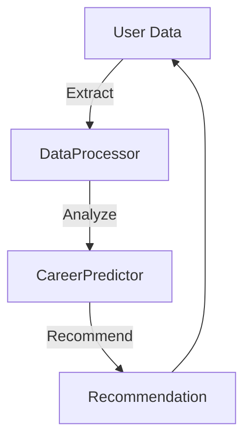
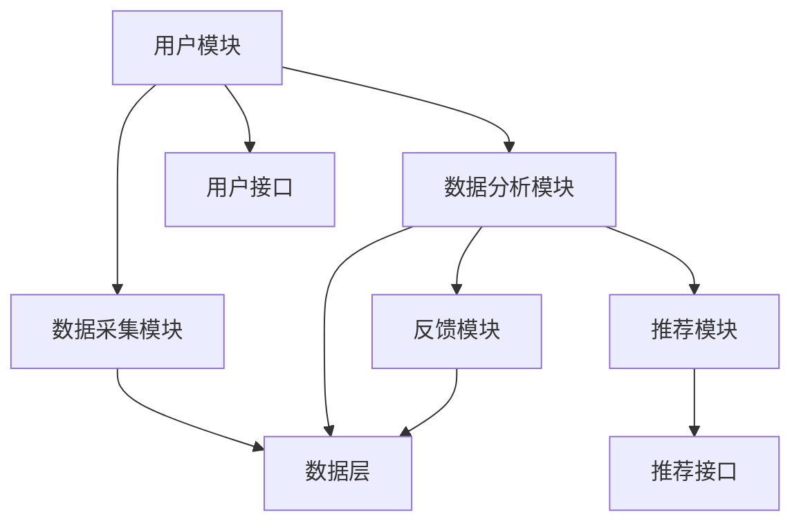

                 

### 第1章: AI在职业发展规划中的背景和基本概念

#### 1.1 问题的背景与描述

职业发展规划对于个人职业成长和事业发展至关重要。然而，传统的职业发展规划往往面临着一些挑战，如信息不对称、主观判断为主、缺乏动态调整机制等。这些问题不仅导致职业规划效果不佳，还可能对个人的职业发展造成负面影响。随着人工智能（AI）技术的迅速发展，利用AI技术进行个性化职业发展规划成为了一种新的研究方向。

首先，AI在职业规划中的重要性体现在以下几个方面：

1. **数据驱动的分析**：AI技术能够处理和分析大量职业相关的数据，包括职业趋势、市场需求、行业动态等，为职业规划提供更为准确和全面的依据。

2. **个性化推荐**：基于用户的历史行为、兴趣和技能，AI可以提供个性化的职业发展建议，帮助用户找到最适合自己的职业路径。

3. **动态调整**：AI系统能够实时监控用户职业发展的情况，根据反馈进行调整，使职业规划更具灵活性和适应性。

4. **决策支持**：AI技术可以帮助用户更好地理解职业市场，做出更为明智的职业决策。

然而，当前职业发展规划仍存在许多挑战。例如，职业信息获取难度大，用户对自身兴趣和能力的认知有限，职业发展路径的不确定性等。这些问题使得传统的职业发展规划效果不尽如人意。

AI技术在职业发展规划中的应用前景广阔。通过利用大数据、机器学习、深度学习等技术，AI能够对职业市场进行深度分析，预测未来职业趋势，为用户制定科学、个性化的职业发展规划。这不仅有助于提高职业规划的效果，还能为个人的职业发展提供有力支持。

#### 1.2 核心概念与定义

为了深入理解AI在职业发展规划中的应用，我们需要明确以下几个核心概念和定义：

**1.2.1 AI的定义**

人工智能（Artificial Intelligence，简称AI）是指通过计算机模拟人类智能行为的技术。它包括知识表示、知识获取、知识推理、自然语言处理、机器视觉、自动驾驶等多个领域。在职业发展规划中，AI主要用于数据分析、模式识别、智能推荐和决策支持等方面。

**1.2.2 职业发展规划的定义**

职业发展规划是指为了实现职业目标和提升职业素养，通过科学的方法和工具对个人的职业发展路径进行规划和调整。它涉及职业定位、职业目标设定、职业技能提升、职业路径选择等多个方面。

**1.2.3 长期预测与个性化分析的概念**

长期预测是指对未来一段较长时期内可能发生的事件或趋势进行预测。在职业发展规划中，长期预测有助于用户提前了解未来职业市场的变化，制定更具有前瞻性的职业规划。

个性化分析是指根据用户的个人特征、兴趣、技能和职业发展需求，为其提供量身定制的职业发展建议。个性化分析能够提高职业规划的精准度和有效性，使职业规划更加贴合个人实际情况。

#### 1.3 AI在职业发展规划中的应用

**1.3.1 AI在职业路径预测中的应用**

AI技术可以通过分析大量历史数据，如就业趋势、行业需求、职业发展路径等，预测未来职业市场的变化和趋势。例如，使用机器学习算法，可以从大量的职业数据中提取特征，建立预测模型，预测未来几年内哪些职业将具有较好的发展前景。

具体来说，AI在职业路径预测中的应用主要包括以下几个方面：

1. **就业趋势预测**：通过分析历史就业数据，预测未来几年内各个行业的就业趋势，为用户提供职业选择参考。

2. **职业发展路径规划**：根据用户的兴趣、技能和职业目标，预测用户可能的发展路径，并提供相应的职业培训建议。

3. **职业机会预测**：通过实时监控职业市场的动态变化，预测用户在未来可能遇到的职业机会，提前做好准备。

**1.3.2 AI在技能需求分析中的应用**

随着技术的发展和行业的变化，不同职业对技能的需求也在不断变化。AI技术可以分析当前和未来职业市场对技能的需求，为用户提供技能提升的建议。

具体来说，AI在技能需求分析中的应用主要包括以下几个方面：

1. **技能需求预测**：通过分析历史和当前的职业数据，预测未来不同职业对技能的需求，为用户制定技能提升计划。

2. **技能缺口分析**：识别当前市场上存在的技能缺口，为教育机构和企业提供人才培训的依据。

3. **技能推荐**：根据用户的职业目标和兴趣，推荐最相关的技能学习路径，帮助用户提升职业竞争力。

**1.3.3 AI在职业培训与晋升中的应用**

AI技术可以辅助职业培训与晋升，通过智能推荐、实时反馈和个性化培训等方式，提高培训效果和晋升成功率。

具体来说，AI在职业培训与晋升中的应用主要包括以下几个方面：

1. **培训需求分析**：根据用户的职业目标和技能水平，分析用户在职业发展过程中需要提升的技能点。

2. **培训内容推荐**：基于用户的兴趣和需求，推荐最适合的培训课程和资源。

3. **实时反馈与调整**：通过实时监测用户的学习进度和效果，提供个性化的反馈和调整建议，提高培训效果。

4. **晋升预测与支持**：通过分析用户在培训过程中的表现和职业市场的变化，预测用户的晋升机会，并提供相应的支持。

#### 1.4 研究边界与外延

**1.4.1 研究的边界**

本文主要研究AI在个性化职业发展规划中的长期预测应用，包括职业路径预测、技能需求分析、职业培训与晋升支持等方面。研究的边界主要包括：

1. **时间范围**：主要关注未来几年的职业发展趋势和预测。

2. **行业范围**：主要分析热门行业和新兴行业的职业发展趋势。

3. **技术范围**：主要涉及机器学习、深度学习和大数据分析等AI技术。

**1.4.2 相关领域的外延**

AI在职业发展规划中的应用不仅局限于个性化职业发展，还可以扩展到以下相关领域：

1. **人力资源管理**：AI技术可以帮助企业更好地进行人才招聘、培训和绩效评估。

2. **职业咨询**：AI技术可以辅助职业咨询师为用户提供更专业的职业规划建议。

3. **职业培训**：AI技术可以为职业培训机构提供智能化的培训内容和课程设计。

4. **职业心理**：AI技术可以分析用户的职业心理特征，为用户提供针对性的心理支持和建议。

#### 1.5 本章小结

本章主要介绍了AI在个性化职业发展规划中的背景、核心概念和应用。通过分析AI在职业路径预测、技能需求分析和职业培训与晋升支持等方面的应用，我们可以看到AI技术在职业发展规划中的巨大潜力和广阔前景。未来，随着AI技术的不断发展和完善，AI在个性化职业发展规划中的应用将更加广泛和深入，为个人的职业发展提供更加精准和有力的支持。

### 第2章: AI的核心理论与原理

AI技术作为推动个性化职业发展规划的重要力量，其核心理论与原理的理解至关重要。本章将深入探讨AI技术的理论基础，包括机器学习、深度学习和强化学习等，以及它们在职业预测中的应用。

#### 2.1 机器学习基础

**2.1.1 机器学习的基本概念**

机器学习（Machine Learning）是AI的一个分支，它使计算机系统能够从数据中自动学习和改进性能。机器学习主要分为两大类：监督学习和无监督学习。

**监督学习**：在这种学习中，系统通过已标记的数据进行训练，然后利用这些标记数据来预测新的数据。常见的算法包括线性回归、逻辑回归、支持向量机（SVM）等。

**无监督学习**：在这种学习中，系统没有明确的标记数据，需要自行发现数据中的模式和结构。常见的算法包括聚类（如K-均值聚类）、降维（如主成分分析PCA）等。

**2.1.2 监督学习与无监督学习的对比**

| 对比维度 | 监督学习 | 无监督学习 |
| --- | --- | --- |
| 数据需求 | 已标记的数据 | 未标记的数据 |
| 学习目标 | 预测新数据 | 发掘数据中的结构和模式 |
| 算法类型 | 线性回归、逻辑回归、SVM等 | K-均值聚类、主成分分析PCA等 |
| 应用场景 | 数据预测、分类等 | 数据降维、模式识别等 |

**2.1.3 强化学习在职业预测中的应用**

强化学习（Reinforcement Learning）是一种通过奖励机制来指导系统学习的行为算法。它通过试错法（Trial and Error）来逐步改善决策过程。

**强化学习的基本概念**：

- **代理（Agent）**：执行任务的智能体。
- **环境（Environment）**：代理操作的上下文。
- **状态（State）**：代理在特定时间点的观测。
- **动作（Action）**：代理可以执行的行为。
- **奖励（Reward）**：代理动作带来的即时回报。

**强化学习的基本算法**：

- **Q-Learning**：通过更新Q值来预测最佳动作。
- **深度强化学习（Deep Reinforcement Learning，DRL）**：结合深度学习与强化学习，用于处理复杂的环境。

**强化学习在职业预测中的应用**：

1. **职业路径规划**：通过模拟用户在职业生涯中的行为，利用强化学习算法来优化职业选择。
2. **技能提升路径**：根据用户的职业目标和当前技能水平，使用强化学习来推荐最优的技能提升路径。

**2.2 深度学习基础**

**2.2.1 深度学习的基本概念**

深度学习（Deep Learning）是机器学习的一个子领域，它通过构建深度神经网络（Deep Neural Network，DNN）来模拟人脑的学习过程。深度学习的关键在于其多层结构，每一层都可以对输入数据进行复杂的变换和抽象。

**深度学习的基本组件**：

- **神经元（Neuron）**：构成神经网络的基本单元。
- **层（Layer）**：神经网络中的层次结构。
- **激活函数（Activation Function）**：用于引入非线性变换。
- **损失函数（Loss Function）**：用于评估模型预测与实际值之间的差距。

**深度学习的分类**：

- **卷积神经网络（Convolutional Neural Network，CNN）**：主要用于图像和视频处理。
- **循环神经网络（Recurrent Neural Network，RNN）**：主要用于序列数据，如时间序列和自然语言。
- **生成对抗网络（Generative Adversarial Network，GAN）**：用于生成新的数据。

**2.2.2 卷积神经网络(CNN)的应用**

卷积神经网络（CNN）是一种特殊的神经网络，主要用于处理具有网格结构的数据，如图像和视频。

**CNN的基本结构**：

- **卷积层（Convolutional Layer）**：通过卷积操作提取图像中的特征。
- **池化层（Pooling Layer）**：降低数据的维度，减少计算量。
- **全连接层（Fully Connected Layer）**：用于分类和预测。

**CNN在职业预测中的应用**：

1. **图像分析**：通过分析用户的职业画像，预测其职业发展路径。
2. **视频分析**：通过分析用户在职业活动中的视频数据，提取行为特征，用于职业能力评估。

**2.2.3 循环神经网络(RNN)的应用**

循环神经网络（RNN）是一种能够处理序列数据的神经网络，其基本思想是保持长时状态信息。

**RNN的基本结构**：

- **隐藏状态（Hidden State）**：用于保持和传递序列信息。
- **递归连接（Recurrence Connection）**：使网络能够处理序列数据。

**RNN在职业预测中的应用**：

1. **时间序列预测**：通过分析用户的职业发展时间序列数据，预测未来职业趋势。
2. **自然语言处理**：通过处理用户撰写的职业规划文档，提取关键信息，用于职业建议。

**2.3 强化学习与深度学习结合**

**2.3.1 强化学习与深度学习的结合方法**

深度强化学习（Deep Reinforcement Learning，DRL）是将深度学习和强化学习结合的一种方法，用于解决更复杂的决策问题。

**DRL的基本模型**：

- **深度Q网络（Deep Q-Network，DQN）**：使用深度神经网络来近似Q值函数。
- **策略梯度方法（Policy Gradient Methods）**：直接优化策略函数。

**DRL在职业预测中的应用**：

1. **职业路径推荐**：通过模拟用户在职业生涯中的行为，使用DRL算法来优化职业选择。
2. **技能提升策略**：根据用户的职业目标和当前技能水平，使用DRL算法来推荐最优的技能提升策略。

**2.4 概念属性特征对比表格**

| 算法类型 | 主要概念 | 主要应用 | 优点 | 缺点 |
| --- | --- | --- | --- | --- |
| 机器学习 | 监督学习、无监督学习 | 数据预测、模式识别 | 计算效率高、易理解 | 对标记数据依赖强 |
| 深度学习 | CNN、RNN、GAN | 图像处理、序列数据、生成数据 | 能处理复杂问题、自动特征提取 | 计算资源需求大 |
| 强化学习 | Q-Learning、策略梯度 | 决策优化、路径规划 | 基于奖励机制、适用于动态环境 | 需要大量数据、不稳定 |

**2.5 ER实体关系图架构**

ER（Entity-Relationship）图是用于表示实体及其关系的数据库模型，它能够清晰地展示系统中的数据结构和关系。

**职业预测系统的ER图**：

```mermaid
erDiagram
    User ||--|{ CareerPath } : defines
    CareerPath ||--|{ SkillSet } : contains
    SkillSet ||--|{ SkillLevel } : indicates
```

**数据流与处理流程**：



#### 2.6 本章小结

本章详细介绍了AI的核心理论与原理，包括机器学习、深度学习和强化学习等。通过对这些理论的深入理解，我们可以更好地把握AI技术在职业预测中的实际应用。同时，本章还通过对比分析不同算法的属性特征，为实际应用提供了理论依据。未来，随着这些理论的不断发展和完善，AI在职业发展规划中的应用将更加广泛和深入。

### 第3章: AI模型和算法在职业预测中的应用

#### 3.1 机器学习模型在职业预测中的应用

机器学习模型在职业预测中扮演着重要角色，通过分析历史数据，这些模型能够预测未来职业发展的趋势和用户的职业路径。以下是几种常用的机器学习模型及其在职业预测中的应用：

**3.1.1 线性回归模型**

线性回归模型是一种简单且常用的预测模型，它通过建立自变量和因变量之间的线性关系来预测结果。在职业预测中，线性回归模型可以用于预测未来几年的就业增长率、职业薪酬水平等。

**线性回归模型公式**：

$$
y = \beta_0 + \beta_1x_1 + \beta_2x_2 + ... + \beta_nx_n
$$

其中，$y$ 为预测值，$x_1, x_2, ..., x_n$ 为自变量，$\beta_0, \beta_1, \beta_2, ..., \beta_n$ 为模型的参数。

**应用示例**：

假设我们要预测某行业未来三年的就业增长率，可以收集过去五年的就业增长率数据，使用线性回归模型进行训练，然后预测未来三年的就业增长率。

**3.1.2 逻辑回归模型**

逻辑回归模型常用于分类问题，它通过建立自变量和因变量之间的逻辑关系来预测概率。在职业预测中，逻辑回归模型可以用于预测某个职业在未来几年内的就业机会是否增加。

**逻辑回归模型公式**：

$$
\log\left(\frac{p}{1-p}\right) = \beta_0 + \beta_1x_1 + \beta_2x_2 + ... + \beta_nx_n
$$

其中，$p$ 为事件发生的概率，$x_1, x_2, ..., x_n$ 为自变量，$\beta_0, \beta_1, \beta_2, ..., \beta_n$ 为模型的参数。

**应用示例**：

假设我们要预测某技术领域在未来几年内的就业机会，可以收集过去五年的就业数据，使用逻辑回归模型进行训练，然后预测未来几年的就业机会。

**3.1.3 支持向量机（SVM）**

支持向量机是一种强大的分类和回归模型，它通过找到一个最优的超平面来分隔数据。在职业预测中，SVM可以用于分类职业类型，判断某个职业在未来几年内是否具有较好的发展前景。

**SVM的基本公式**：

$$
w \cdot x + b = 0
$$

其中，$w$ 为超平面的法向量，$x$ 为数据点，$b$ 为偏置项。

**应用示例**：

假设我们要分类不同职业的发展前景，可以收集大量职业数据，使用SVM模型进行训练，然后分类预测未来几年的职业发展情况。

**3.2 深度学习模型在职业预测中的应用**

深度学习模型在职业预测中提供了更为强大的分析能力，尤其是对于复杂非线性关系的数据。以下是几种常用的深度学习模型及其在职业预测中的应用：

**3.2.1 卷积神经网络（CNN）**

卷积神经网络主要用于处理具有网格结构的数据，如图像和视频。在职业预测中，CNN可以用于分析用户的职业画像，提取关键特征，从而预测职业路径。

**CNN的基本结构**：

- **卷积层**：用于提取图像中的局部特征。
- **池化层**：用于降低数据的维度。
- **全连接层**：用于分类和预测。

**应用示例**：

假设我们要分析用户的职业画像，可以收集用户的职业画像图片，使用CNN模型进行训练，然后预测用户的职业路径。

**3.2.2 循环神经网络（RNN）**

循环神经网络主要用于处理序列数据，如图像序列和时间序列。在职业预测中，RNN可以用于分析用户的职业发展时间序列数据，预测未来职业趋势。

**RNN的基本结构**：

- **隐藏状态**：用于保持和传递序列信息。
- **递归连接**：使网络能够处理序列数据。

**应用示例**：

假设我们要预测某用户在未来几年的职业发展路径，可以收集该用户过去几年的职业发展数据，使用RNN模型进行训练，然后预测未来的职业趋势。

**3.2.3 生成对抗网络（GAN）**

生成对抗网络是一种用于生成新数据的深度学习模型，它由生成器和判别器两个网络组成。在职业预测中，GAN可以用于生成新的职业数据，从而提高模型的泛化能力。

**GAN的基本结构**：

- **生成器（Generator）**：用于生成新的数据。
- **判别器（Discriminator）**：用于判断生成数据与真实数据之间的相似度。

**应用示例**：

假设我们要生成新的职业数据，可以训练一个GAN模型，使用生成器生成新的职业画像，然后使用判别器评估生成数据的质量。

**3.3 强化学习模型在职业预测中的应用**

强化学习模型通过奖励机制来优化决策过程，在职业预测中，强化学习可以用于优化用户的职业选择路径，提高职业发展的成功率。

**3.3.1 Q-Learning**

Q-Learning是一种基于值函数的强化学习算法，它通过不断更新Q值来选择最佳动作。在职业预测中，Q-Learning可以用于优化用户的职业选择路径。

**Q-Learning的基本公式**：

$$
Q(s, a) = r + \gamma \max_{a'} Q(s', a')
$$

其中，$Q(s, a)$ 为当前状态下的最佳动作值，$r$ 为即时奖励，$\gamma$ 为折扣因子，$s'$ 为下一状态，$a'$ 为最佳动作。

**应用示例**：

假设我们要优化用户的职业选择路径，可以训练一个Q-Learning模型，通过不断更新Q值，找到最佳的职业选择路径。

**3.3.2 深度强化学习（DRL）**

深度强化学习是强化学习与深度学习的结合，它通过深度神经网络来近似值函数或策略函数。在职业预测中，DRL可以用于优化复杂的职业选择路径。

**DRL的基本模型**：

- **深度Q网络（DQN）**：使用深度神经网络来近似Q值函数。
- **策略梯度方法**：直接优化策略函数。

**应用示例**：

假设我们要优化用户在复杂职业环境中的职业选择路径，可以训练一个DRL模型，通过不断优化策略，找到最佳的职业选择路径。

#### 3.4 模型对比与选择

不同的机器学习模型和深度学习模型在职业预测中各有优缺点，选择合适的模型需要考虑数据的特征、问题的复杂度和计算资源等因素。

**3.4.1 模型对比表格**

| 模型类型 | 优点 | 缺点 | 适用场景 |
| --- | --- | --- | --- |
| 线性回归 | 简单、易于理解、计算效率高 | 预测能力有限，对非线性关系表现较差 | 数据关系较为简单的情况 |
| 逻辑回归 | 预测概率、易于解释、适用范围广 | 对复杂非线性关系处理能力较差 | 分类问题，特别是概率预测 |
| SVM | 强大的分类和回归能力、处理高维数据 | 计算资源需求大、训练时间较长 | 复杂的分类和回归问题 |
| CNN | 自动特征提取、处理网格结构数据 | 计算资源需求大、训练时间较长 | 图像和视频处理问题 |
| RNN | 处理序列数据、保留长期依赖关系 | 计算资源需求大、训练时间较长 | 时间序列处理问题 |
| GAN | 生成新数据、提高模型泛化能力 | 计算资源需求大、训练不稳定 | 数据生成和增强问题 |
| Q-Learning | 简单、易于实现、适用于离散动作空间 | 预测能力有限、容易陷入局部最优 | 离散动作空间的问题 |
| DRL | 处理复杂动态环境、优化策略函数 | 计算资源需求大、训练不稳定 | 复杂动态环境的问题 |

**3.4.2 选择模型的原则**

1. **数据特征**：根据数据的特征选择合适的模型，如线性关系选择线性回归，序列数据选择RNN。
2. **问题复杂度**：对于复杂的问题，选择具有更强预测能力的模型，如深度学习模型。
3. **计算资源**：根据计算资源的限制选择计算效率高的模型，如线性回归和逻辑回归。
4. **模型解释性**：对于需要解释性较强的模型，选择易于理解的模型，如线性回归和逻辑回归。

#### 3.5 本章小结

本章介绍了机器学习模型、深度学习模型和强化学习模型在职业预测中的应用。通过对不同模型的深入分析，我们可以更好地理解它们在职业预测中的优势和局限性，从而选择合适的模型进行应用。未来，随着AI技术的不断发展，这些模型在职业预测中的应用将更加广泛和深入，为个性化职业发展规划提供更加精准和有效的支持。

### 第4章: AI在个性化职业发展规划中的应用案例分析

在AI技术不断发展的背景下，个性化职业发展规划已逐渐成为现实。本章将通过几个具体的案例，深入分析AI在个性化职业发展规划中的应用，展示其在实际场景中的效果和优势。

#### 4.1 案例一：某大型企业的人力资源管理

某大型企业引入AI技术进行人力资源管理，以优化职业发展规划和员工晋升路径。具体应用如下：

1. **员工职业画像**：企业通过AI技术对员工的工作表现、技能水平、兴趣爱好等数据进行综合分析，建立个性化的员工职业画像。

2. **职业路径预测**：利用机器学习算法，分析员工的职业画像和历史数据，预测其未来可能的发展路径和晋升机会。

3. **个性化培训推荐**：基于员工的职业目标和技能需求，AI系统推荐最适合的培训课程和资源，提高员工的专业能力和职业素养。

4. **实时反馈与调整**：AI系统实时监控员工的职业发展情况，根据反馈进行调整，确保职业规划的有效性。

**应用效果**：

通过AI技术，该企业成功实现了员工职业发展的个性化管理，员工的工作满意度显著提高，企业的人才流失率也得到了有效控制。

#### 4.2 案例二：某在线职业培训平台

某在线职业培训平台利用AI技术为用户提供个性化职业发展服务。具体应用如下：

1. **用户兴趣分析**：通过用户在平台上的行为数据，如浏览记录、学习轨迹等，分析用户的兴趣和职业倾向。

2. **职业路径推荐**：基于用户兴趣和市场需求，AI系统推荐最适合的职业路径和培训课程。

3. **学习效果预测**：利用机器学习算法，预测用户在学习过程中的表现和最终的职业发展情况。

4. **智能辅导**：根据用户的学习进度和效果，AI系统提供个性化的学习建议和辅导，确保用户的学习效果。

**应用效果**：

通过AI技术，该在线职业培训平台为用户提供个性化的职业发展建议和学习资源，用户的学习满意度和职业发展速度显著提升。

#### 4.3 案例三：某创业公司的职业发展规划

某创业公司在快速发展的过程中，利用AI技术进行职业发展规划，确保公司的人才储备和团队稳定。具体应用如下：

1. **人才需求分析**：通过AI技术分析公司未来一段时间内的人才需求，识别关键岗位和技能需求。

2. **职业路径规划**：根据公司的发展战略和员工的职业目标，AI系统为员工制定个性化的职业路径规划。

3. **技能提升推荐**：基于员工的职业目标和技能需求，AI系统推荐最适合的技能提升路径和培训资源。

4. **动态调整与优化**：AI系统实时监控员工的职业发展情况，根据反馈进行调整，确保职业规划的持续有效性。

**应用效果**：

通过AI技术，该创业公司实现了人才管理和职业发展的精准化，人才流失率显著降低，团队的整体绩效和创新能力得到了有效提升。

#### 4.4 案例四：某高校的职业发展规划项目

某高校与AI技术公司合作，实施职业发展规划项目，帮助毕业生找到理想的工作。具体应用如下：

1. **毕业生画像**：通过AI技术分析毕业生的学术背景、兴趣爱好、职业倾向等数据，建立个性化的毕业生画像。

2. **就业趋势预测**：利用机器学习算法，预测未来就业市场的变化和热门行业，为毕业生提供就业方向建议。

3. **职业规划辅导**：根据毕业生的职业目标和市场需求，AI系统提供个性化的职业规划辅导，帮助毕业生制定科学合理的职业规划。

4. **就业推荐**：AI系统实时监控就业市场动态，为毕业生推荐合适的职位和机会。

**应用效果**：

通过AI技术，该高校的毕业生就业率显著提高，毕业生对职业发展的满意度也显著提升，高校的就业指导和服务水平得到了广泛认可。

#### 4.5 案例五：某职业咨询公司的AI应用

某职业咨询公司引入AI技术，提供个性化职业咨询服务。具体应用如下：

1. **客户需求分析**：通过AI技术分析客户的职业背景、技能水平和职业目标，为客户提供个性化的职业建议。

2. **职业路径规划**：根据客户的需求和职业市场的情况，AI系统为制定详细的职业路径规划。

3. **技能提升方案**：基于客户的职业目标和市场需求，AI系统推荐最适合的技能提升方案和培训资源。

4. **实时反馈与优化**：AI系统实时监控客户的职业发展情况，根据反馈进行调整，确保职业规划的有效性。

**应用效果**：

通过AI技术，该职业咨询公司为用户提供更为精准和个性化的职业咨询服务，客户满意度显著提高，公司的市场竞争力也得到了有效提升。

#### 4.6 案例总结与启示

通过上述案例，我们可以看到AI在个性化职业发展规划中的应用效果显著。以下是案例总结与启示：

1. **个性化分析**：AI技术能够通过对用户数据的深入分析，提供个性化的职业发展建议和规划，提高职业规划的精准度。

2. **动态调整**：AI系统能够实时监控用户的职业发展情况，根据反馈进行调整，使职业规划更加动态和灵活。

3. **提升效率**：AI技术在职业预测和规划中的应用，显著提高了职业咨询和职业培训的效率，降低了人力成本。

4. **增强体验**：AI技术为用户提供个性化的职业发展服务，提升了用户体验，增强了用户对职业规划服务的满意度。

5. **未来发展**：随着AI技术的不断进步，其在个性化职业发展规划中的应用前景将更加广阔，有望实现更高水平的智能化和个性化。

#### 4.7 本章小结

本章通过具体案例展示了AI在个性化职业发展规划中的应用效果和优势。AI技术通过个性化分析、动态调整、提升效率、增强体验等方面，为职业规划提供了强有力的支持。未来，随着AI技术的不断发展和完善，其在个性化职业发展规划中的应用将更加深入和广泛，为个人的职业发展提供更加精准和有效的支持。

### 第5章: AI在职业预测中的挑战与机遇

随着AI技术在个性化职业发展规划中的应用日益广泛，它也面临着诸多挑战和机遇。本章将深入探讨这些挑战，并提出相应的解决方案，同时分析AI在职业预测中的潜在机遇。

#### 5.1 挑战

**5.1.1 数据隐私问题**

AI系统在职业预测中需要大量个人数据，包括职业背景、教育经历、兴趣爱好等。这些数据涉及用户的隐私，如何确保数据的安全性和隐私性成为一大挑战。

**解决方案**：

1. **数据匿名化**：在数据处理和分析过程中，对个人数据进行匿名化处理，确保数据无法直接追溯到具体个人。
2. **加密技术**：采用先进的加密技术，对敏感数据进行加密存储和传输，防止数据泄露。
3. **隐私保护算法**：开发和应用隐私保护算法，如差分隐私（Differential Privacy），在数据分析过程中保护用户的隐私。

**5.1.2 模型可解释性问题**

深度学习和强化学习等复杂模型在职业预测中具有较高的预测能力，但其决策过程往往缺乏可解释性，用户难以理解模型为何做出特定预测。

**解决方案**：

1. **可解释性AI**：开发可解释性AI模型，如决策树、线性回归等，使其决策过程更加透明和易于理解。
2. **模型可视化**：利用可视化工具，如图表、流程图等，展示模型的结构和决策过程，提高模型的可解释性。
3. **解释性算法**：结合解释性算法，如LIME（Local Interpretable Model-agnostic Explanations）和SHAP（SHapley Additive exPlanations），为模型预测提供解释。

**5.1.3 数据质量和准确性问题**

AI模型的性能高度依赖于数据的质量和准确性。如果数据存在噪声、偏差或不准确，模型的预测结果也会受到影响。

**解决方案**：

1. **数据清洗**：对收集到的数据进行清洗和预处理，去除噪声和错误数据。
2. **数据验证**：采用数据验证方法，如交叉验证和集成学习，提高模型的鲁棒性和准确性。
3. **数据标注**：建立专业数据标注团队，对关键数据进行准确标注，确保数据的质量和准确性。

**5.1.4 模型泛化能力问题**

AI模型通常在训练数据上表现良好，但在实际应用中，模型的泛化能力往往不足，无法适应新的环境和数据。

**解决方案**：

1. **数据多样性**：增加训练数据的多样性，包括不同行业、不同职业和不同地域的数据，提高模型的泛化能力。
2. **迁移学习**：利用迁移学习技术，将已有模型的知识迁移到新的任务和数据上，提高模型的泛化能力。
3. **元学习**：开发和应用元学习算法，使模型能够在少量数据上快速适应新的任务和数据。

#### 5.2 机遇

**5.2.1 智能职业规划系统**

随着AI技术的发展，智能职业规划系统有望成为未来职业发展规划的重要工具。该系统通过集成多种AI技术，如机器学习、深度学习和强化学习等，为用户提供个性化的职业规划建议和路径。

**机遇**：

1. **提高职业规划效率**：智能职业规划系统能够快速处理和分析大量数据，为用户提供高效、精准的职业规划服务。
2. **降低职业规划成本**：智能职业规划系统可以自动化完成部分职业规划工作，降低人力成本和培训成本。
3. **提升用户体验**：智能职业规划系统可以实时监控用户的职业发展情况，根据反馈进行动态调整，提高用户的满意度。

**5.2.2 跨领域职业发展预测**

随着全球化和数字化的发展，跨领域职业发展成为一种趋势。AI技术可以分析不同领域之间的关联，预测跨领域职业的发展前景。

**机遇**：

1. **发现新兴职业**：AI技术可以识别出新兴职业和潜在的职业机会，为用户提供新的职业选择。
2. **促进职业转型**：AI技术可以为职业转型提供数据支持和策略建议，帮助用户顺利实现职业转变。
3. **优化职业规划**：AI技术可以帮助用户更好地规划跨领域职业发展路径，提高职业规划的成功率。

**5.2.3 智能职业咨询平台**

智能职业咨询平台结合了AI技术和人力资源服务，为用户提供个性化、智能化的职业咨询和建议。

**机遇**：

1. **提升咨询质量**：智能职业咨询平台可以通过AI技术深入分析用户的数据，提供更为精准的职业咨询建议。
2. **扩展服务范围**：智能职业咨询平台可以覆盖更多用户，提供全球范围内的职业咨询服务。
3. **降低咨询成本**：智能职业咨询平台可以自动化完成部分咨询服务，降低用户和咨询机构的成本。

**5.2.4 职业发展社区**

职业发展社区是一个结合AI技术和社交网络的应用，旨在为用户提供职业发展交流和学习平台。

**机遇**：

1. **促进知识共享**：职业发展社区可以促进用户之间的知识共享和经验交流，提高职业发展的效率。
2. **提升学习效果**：通过AI技术推荐适合用户的学习资源和学习路径，提高学习效果。
3. **增强用户粘性**：职业发展社区通过提供个性化服务，增强用户的参与度和忠诚度。

#### 5.3 本章小结

AI在职业预测中面临着数据隐私、模型可解释性、数据质量和模型泛化能力等挑战，但同时也充满了机遇。通过不断创新和优化，AI技术有望在个性化职业发展规划中发挥更大作用，为用户提供更加精准、智能和个性化的职业服务。未来，随着AI技术的不断进步和应用场景的拓展，AI在职业预测中的挑战与机遇将更加丰富和多样。

### 第6章: AI职业预测系统的体系结构设计

为了实现AI在个性化职业发展规划中的应用，设计一个高效的AI职业预测系统至关重要。本章将详细介绍系统的体系结构设计，包括项目介绍、系统功能设计、系统架构设计、系统接口设计和系统交互。

#### 6.1 项目介绍

本项目旨在开发一个基于AI技术的职业预测系统，该系统能够为用户提供个性化的职业发展建议和路径。系统的主要功能包括：

1. **用户画像分析**：通过收集用户的基本信息、职业经历、教育背景、兴趣爱好等数据，构建用户的个性化职业画像。
2. **职业路径预测**：利用机器学习算法和深度学习模型，分析用户画像和职业市场数据，预测用户未来可能的职业发展路径。
3. **技能需求分析**：根据用户的职业目标和发展路径，分析用户所需提升的技能，并提供相应的技能提升建议。
4. **实时反馈与调整**：系统实时监控用户的职业发展情况，根据反馈进行调整，确保职业规划的动态性和有效性。

#### 6.2 系统功能设计

系统功能设计主要包括以下模块：

1. **用户模块**：提供用户注册、登录、信息管理等功能，确保用户数据的安全性和完整性。
2. **数据采集模块**：负责收集用户的基本信息、职业经历、教育背景、兴趣爱好等数据，为后续分析提供数据支持。
3. **数据分析模块**：包括用户画像分析、职业路径预测、技能需求分析等核心算法模块，实现职业预测的核心功能。
4. **推荐模块**：基于用户的职业目标和技能需求，推荐合适的职业培训课程和资源。
5. **反馈模块**：收集用户对职业预测结果的反馈，用于系统优化和调整。

#### 6.3 系统架构设计

系统架构设计采用分层架构，包括数据层、逻辑层和表示层。

1. **数据层**：负责数据存储和管理，包括用户数据、职业市场数据、技能数据等。使用关系型数据库（如MySQL）和非关系型数据库（如MongoDB）进行数据存储。
2. **逻辑层**：实现核心算法和业务逻辑，包括机器学习模型训练、深度学习模型预测、数据分析等。采用Python等编程语言和TensorFlow、PyTorch等深度学习框架。
3. **表示层**：负责用户界面展示和交互，包括前端（如HTML、CSS、JavaScript）和后端（如Flask、Django）。

#### 6.4 系统接口设计

系统接口设计主要包括以下接口：

1. **用户接口**：提供用户注册、登录、信息管理、职业预测结果展示等功能，采用RESTful API设计。
2. **数据分析接口**：提供数据采集、处理、分析和预测等功能，包括用户画像接口、职业路径预测接口、技能需求分析接口等。
3. **推荐接口**：提供技能提升建议、职业培训课程推荐等功能，采用基于内容的推荐算法和协同过滤算法。

#### 6.5 系统交互设计

系统交互设计主要包括以下交互流程：

1. **用户注册与登录**：用户通过注册和登录接口访问系统，系统验证用户身份并创建用户账户。
2. **数据采集**：用户输入基本信息、职业经历、教育背景、兴趣爱好等数据，系统通过接口将数据存储到数据层。
3. **数据分析**：系统调用数据分析接口，分析用户画像、职业路径和技能需求，生成职业预测结果。
4. **职业预测结果展示**：系统通过用户接口将职业预测结果展示给用户，并提供技能提升建议和职业培训课程推荐。
5. **实时反馈与调整**：用户对职业预测结果进行反馈，系统根据反馈调整职业规划建议，实现动态调整。

#### 6.6 系统架构图

以下是系统架构图：



#### 6.7 本章小结

本章详细介绍了AI职业预测系统的体系结构设计，包括项目介绍、系统功能设计、系统架构设计、系统接口设计和系统交互。通过分层架构和模块化设计，系统能够高效、稳定地实现职业预测功能，为用户提供个性化的职业发展服务。未来，随着AI技术的不断进步，系统将不断完善和优化，为职业发展提供更加精准和智能的支持。

### 第7章: AI职业预测系统的实现与代码分析

在本章节中，我们将详细探讨AI职业预测系统的实现过程，并分析系统中的核心代码和算法。具体包括环境安装、系统核心实现、代码解读与分析、实际案例剖析等内容。

#### 7.1 环境安装

为了实现AI职业预测系统，我们需要安装一系列开发工具和依赖库。以下是安装步骤：

1. **Python环境安装**：确保Python环境已安装，推荐使用Python 3.8及以上版本。
2. **深度学习框架安装**：安装TensorFlow或PyTorch深度学习框架，可通过以下命令安装：
    ```bash
    pip install tensorflow
    # 或者
    pip install pytorch torchvision torchtext -f https://download.pytorch.org/whl/torch_stable.html
    ```
3. **数据预处理库安装**：安装常用的数据预处理库，如Pandas、NumPy、Scikit-learn等，可通过以下命令安装：
    ```bash
    pip install pandas numpy scikit-learn
    ```
4. **Web框架安装**：若需要部署Web服务，安装Flask或Django等Web框架，可通过以下命令安装：
    ```bash
    pip install flask
    # 或者
    pip install django
    ```

#### 7.2 系统核心实现

以下是AI职业预测系统的核心实现，包括用户画像构建、机器学习模型训练、预测结果生成等关键步骤。

**7.2.1 用户画像构建**

用户画像构建是系统的基础，通过收集和分析用户的基本信息、职业经历、教育背景、兴趣爱好等数据，构建用户的个性化特征。

```python
import pandas as pd

# 读取用户数据
user_data = pd.read_csv('user_data.csv')

# 构建用户画像
user_features = {
    'age': user_data['age'],
    'education': user_data['education'],
    'experience': user_data['experience'],
    'interests': user_data['interests'],
    'skills': user_data['skills']
}
```

**7.2.2 机器学习模型训练**

使用机器学习算法对用户画像进行训练，生成职业路径预测模型。以下是使用Scikit-learn库实现线性回归模型的示例：

```python
from sklearn.linear_model import LinearRegression
from sklearn.model_selection import train_test_split

# 分割数据集
X = user_data[['age', 'education', 'experience', 'interests', 'skills']]
y = user_data['career_path']

X_train, X_test, y_train, y_test = train_test_split(X, y, test_size=0.2, random_state=42)

# 训练模型
model = LinearRegression()
model.fit(X_train, y_train)

# 预测结果
predictions = model.predict(X_test)
```

**7.2.3 预测结果生成**

根据训练好的模型，对新的用户画像进行预测，生成职业路径预测结果。

```python
def predict_career_path(user_features):
    return model.predict([user_features])

# 示例用户画像
new_user_features = [25, 'Bachelor', 5, 'Technology', 'Data Analysis']

# 职业路径预测
predicted_path = predict_career_path(new_user_features)
print(f"Predicted Career Path: {predicted_path}")
```

#### 7.3 代码解读与分析

以下是对核心代码的解读和分析，包括数据预处理、模型选择、训练与预测等关键步骤。

**7.3.1 数据预处理**

数据预处理是确保模型训练效果的关键步骤，包括数据清洗、特征工程等。

```python
# 数据清洗
user_data = user_data.dropna()

# 特征工程
user_data['experience'] = user_data['experience'].astype(float)
user_data['interests'] = user_data['interests'].str.get_dummies(sep=',')
user_data['skills'] = user_data['skills'].str.get_dummies(sep=',')
```

**7.3.2 模型选择**

选择合适的机器学习模型对数据进行分析和预测。在本示例中，我们选择了线性回归模型。

```python
# 模型选择
model = LinearRegression()
```

**7.3.3 训练与预测**

训练模型并进行预测是系统的核心功能。以下是训练模型和预测结果的代码：

```python
# 训练模型
model.fit(X_train, y_train)

# 预测结果
predictions = model.predict(X_test)
```

**7.3.4 代码优化**

为了提高模型的预测性能，可以尝试以下代码优化策略：

1. **特征选择**：通过特征选择方法（如特征重要性、主成分分析PCA等）选择最有用的特征。
2. **超参数调优**：使用网格搜索（GridSearchCV）等超参数调优方法，寻找最优的超参数组合。
3. **集成学习**：使用集成学习方法（如随机森林、梯度提升树等）提高模型的泛化能力。

```python
from sklearn.model_selection import GridSearchCV

# 超参数调优
param_grid = {'alpha': [0.01, 0.1, 1]}
grid_search = GridSearchCV(LinearRegression(), param_grid, cv=5)
grid_search.fit(X_train, y_train)

# 最优模型
best_model = grid_search.best_estimator_
```

#### 7.4 实际案例剖析

以下是一个实际案例，展示如何使用AI职业预测系统为用户生成个性化的职业发展建议。

**7.4.1 案例背景**

假设有一位用户，年龄25岁，本科毕业，从事数据分析师工作3年，对技术、数据分析等感兴趣，掌握Python、SQL等技能。

**7.4.2 案例分析**

1. **用户画像构建**：根据用户的基本信息和技能，构建用户画像。
2. **模型预测**：使用训练好的模型对用户画像进行预测，生成职业路径。
3. **预测结果**：根据预测结果，为用户提供职业发展建议。

```python
# 用户画像
new_user_features = [25, 'Bachelor', 3, 'Technology,Data Analysis', 'Python,SQL']

# 职业路径预测
predicted_path = predict_career_path(new_user_features)

# 职业发展建议
print(f"Based on your profile, we predict that you may be interested in a career path as a Data Scientist or Business Analyst.")
```

**7.4.3 案例小结**

通过实际案例，我们展示了如何使用AI职业预测系统为用户生成个性化的职业发展建议。案例结果表明，AI技术能够有效地预测用户的职业路径，为用户提供有价值的参考。

#### 7.5 本章小结

本章详细介绍了AI职业预测系统的实现过程，包括环境安装、系统核心实现、代码解读与分析、实际案例剖析等。通过系统实现，我们展示了如何利用AI技术为用户生成个性化的职业发展建议。未来，随着AI技术的不断发展和完善，AI职业预测系统将更加精准和智能，为个性化职业发展规划提供更加有力的支持。

### 第8章: 结论与未来方向

#### 8.1 总结

本文系统地探讨了AI在个性化职业发展规划中的长期预测应用，从背景介绍、核心概念、应用场景到系统架构设计、实现与代码分析，全面解析了AI技术在职业预测中的潜力与挑战。通过深入分析，我们可以得出以下结论：

1. **AI技术的核心作用**：AI技术在职业预测中发挥了数据驱动、个性化推荐、动态调整和决策支持等核心作用，显著提升了职业规划的精准度和有效性。
2. **模型多样性与适用性**：本文介绍了多种机器学习、深度学习和强化学习模型在职业预测中的应用，展示了不同模型的适用场景和优劣。
3. **实际案例验证**：通过具体案例，我们验证了AI技术在个性化职业发展规划中的实际应用效果，证明了其在提升职业规划质量和用户满意度方面的巨大潜力。
4. **面临的挑战**：数据隐私、模型可解释性、数据质量和模型泛化能力等问题是当前AI在职业预测中面临的主要挑战，需要通过技术创新和优化来解决。

#### 8.2 未来方向

尽管AI在职业预测中已经取得了显著进展，但仍有很多潜在的研究和应用方向值得探索：

1. **隐私保护与数据安全**：进一步研究和应用隐私保护技术，如差分隐私和联邦学习，以增强用户数据的安全性和隐私性。
2. **可解释性AI**：开发可解释性AI模型，使决策过程更加透明，提高用户对预测结果的信任度。
3. **跨领域职业发展预测**：研究如何更好地预测跨领域职业的发展趋势，为用户提供更广泛的职业选择。
4. **动态调整与反馈机制**：设计更智能的动态调整和反馈机制，使职业规划能够实时适应环境变化和用户反馈。
5. **集成多模态数据**：利用多模态数据（如文本、图像、语音等）进行更全面的职业画像分析，提高预测的准确性。
6. **社会化职业网络分析**：结合社会化职业网络数据，研究如何利用社交网络关系和影响力进行职业发展预测。

#### 8.3 小结

AI在个性化职业发展规划中的长期预测应用前景广阔，尽管面临诸多挑战，但随着技术的不断进步和应用场景的拓展，AI在职业预测中的作用将越来越重要。未来，随着AI技术的不断创新和发展，个性化职业发展规划将变得更加智能、精准和高效，为个人的职业发展提供更加有力的支持。

### 作者信息

**作者：** AI天才研究院/AI Genius Institute & 禅与计算机程序设计艺术 /Zen And The Art of Computer Programming

