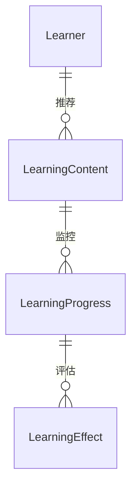
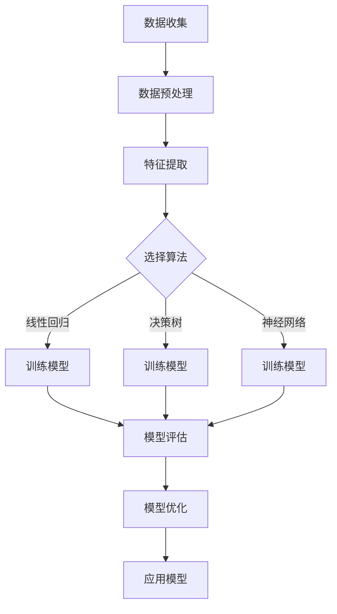

                 


# AI在个性化职业技能提升中的应用

## 关键词

- 人工智能
- 个性化学习
- 职业技能提升
- 机器学习
- 深度学习
- 数据挖掘
- 自适应系统

## 摘要

本文探讨了人工智能（AI）在个性化职业技能提升中的应用，重点介绍了机器学习和深度学习技术如何助力职业发展。通过对AI技术的深入分析，文章阐述了个性化学习系统的设计和实现，以及在职业技能培训中的具体应用案例。同时，文章总结了最佳实践和注意事项，为读者提供了实用的技能提升建议。

## 引言

### AI的基本概念

人工智能（Artificial Intelligence，简称AI）是计算机科学的一个分支，旨在开发使计算机系统具备人类智能特性的技术。AI的目标是通过模拟人类的思维过程，使计算机能够理解、学习、推理和解决问题。

### AI的发展与影响

AI的发展历程可以追溯到20世纪50年代，随着计算能力的提升和算法的改进，AI技术在各个领域取得了显著成果。如今，AI已经成为推动社会进步和产业变革的重要力量。从自动驾驶到智能语音助手，AI在提高生产效率、优化决策过程和改善生活质量方面发挥了重要作用。

### 个性化职业技能提升的背景

个性化学习（Personalized Learning）是一种教育理念，旨在根据学生的个体差异提供定制化的学习体验。随着人工智能技术的发展，个性化学习逐渐成为职业技能提升的重要手段。个性化职业技能提升旨在通过分析个体的学习需求、兴趣和优势，为其提供针对性的培训内容和策略，从而实现更高效的学习成果。

### 个性化职业技能提升的重要性

在当今快速变化的职场环境中，掌握多种技能和持续学习已成为职业发展的关键。个性化职业技能提升能够帮助个人更快速地适应行业变化，提升竞争力。同时，它还能够激发学习兴趣，提高学习动机，使学习过程更加愉悦和高效。

### 个性化职业技能提升的挑战

尽管个性化职业技能提升具有显著优势，但实际操作中也面临一些挑战。首先，个性化学习系统的设计需要大量的数据支持和算法优化。其次，如何确保培训内容的针对性和有效性也是一个重要问题。此外，个人隐私保护和数据安全也是需要关注的重要方面。

## 基础理论

### AI的基本概念

AI包括多个子领域，如机器学习、深度学习、自然语言处理等。这些子领域各自有独特的方法和算法，但共同的目标是使计算机具备智能。

#### 机器学习

机器学习（Machine Learning，简称ML）是一种通过数据驱动的方法来使计算机系统获得知识的技术。机器学习算法从数据中学习规律，并利用这些规律进行预测和决策。常见的机器学习算法包括线性回归、决策树、支持向量机等。

#### 深度学习

深度学习（Deep Learning，简称DL）是机器学习的一个分支，它利用多层神经网络来学习数据中的复杂模式。深度学习在图像识别、语音识别、自然语言处理等领域取得了突破性进展。

#### 自然语言处理

自然语言处理（Natural Language Processing，简称NLP）是AI的一个重要子领域，旨在使计算机能够理解和生成人类语言。NLP技术包括文本分类、情感分析、机器翻译等。

### 个性化学习

个性化学习是一种基于学习者的个体差异提供定制化教育体验的方法。个性化学习系统通常包括以下几个关键组成部分：

#### 学习者模型

学习者模型（Learner Model）是描述学习者特征和需求的模型，包括学习者的知识水平、学习风格、兴趣爱好等。学习者模型为个性化学习系统提供了对学习者的深入了解。

#### 内容推荐

内容推荐（Content Recommendation）是基于学习者模型和学习历史，为学习者推荐个性化的学习资源。内容推荐系统需要使用机器学习算法来分析学习者的数据，并生成推荐列表。

#### 学习过程监控

学习过程监控（Learning Process Monitoring）是跟踪学习者的学习行为和成果，以评估个性化学习系统的效果。学习过程监控可以通过学习分析工具来实现。

### 职业技能定义

职业技能是指从事特定职业所需的专业知识和技能。职业技能涵盖广泛，包括技术技能、软技能、行业知识等。个性化职业技能提升旨在通过定制化培训，帮助个人提升职业竞争力。

## 核心技术

### 机器学习在职业技能提升中的应用

机器学习在职业技能提升中的应用主要体现在以下几个方面：

#### 能力评估

通过机器学习算法，可以对学习者的技能水平进行评估。例如，使用自然语言处理技术对学习者的论文进行评价，使用图像识别技术对学习者的项目成果进行评分。

#### 培训内容推荐

基于学习者的兴趣和需求，机器学习算法可以推荐适合的学习资源。例如，使用协同过滤算法为学习者推荐相关的在线课程、教材和练习题。

#### 智能问答系统

智能问答系统（如Chatbot）可以帮助学习者解决学习中的问题。通过自然语言处理技术，智能问答系统可以理解学习者的提问，并给出相应的答案。

### 深度学习在职业技能提升中的应用

深度学习在职业技能提升中的应用主要集中在以下几个方面：

#### 自动化教学

通过深度学习模型，可以实现自动化教学，例如，使用生成对抗网络（GAN）生成模拟教学场景，使用卷积神经网络（CNN）进行图像标注和识别。

#### 情感分析

情感分析（Sentiment Analysis）是一种自然语言处理技术，用于分析学习者的情感状态。通过情感分析，可以为学习者提供情感支持，优化学习体验。

#### 个性化学习路径规划

基于深度学习模型，可以为学习者规划个性化的学习路径。例如，使用递归神经网络（RNN）分析学习者的学习历史，预测其未来的学习需求。

### 数据挖掘在职业技能提升中的应用

数据挖掘（Data Mining）是一种从大量数据中提取有价值信息的技术，在职业技能提升中具有重要作用：

#### 技能预测

通过数据挖掘，可以预测学习者的技能发展趋势，为职业规划提供依据。例如，使用聚类算法分析学习者的学习路径，预测其未来的技能需求。

#### 职业匹配

通过数据挖掘，可以为学习者推荐与其技能匹配的职业。例如，使用关联规则挖掘技术分析学习者的学习内容，为学习者推荐适合的职业方向。

### 自适应系统在职业技能提升中的应用

自适应系统（Adaptive System）可以根据学习者的行为和学习状态进行自我调整，以提供更有效的学习支持：

#### 学习策略调整

自适应系统可以根据学习者的学习进度和效果，调整学习策略。例如，当学习者遇到困难时，自适应系统可以提供额外的辅导资源。

#### 学习环境优化

自适应系统可以通过分析学习者的偏好和行为，优化学习环境。例如，根据学习者的注意力集中程度，调整学习内容的展示方式。

## 应用案例

### 案例一：个性化学习平台

某公司开发了一款个性化学习平台，利用机器学习和自然语言处理技术，为学习者提供个性化的学习资源和辅导服务。平台通过分析学习者的学习行为和成果，为其推荐合适的学习资源，并根据学习者的需求调整教学策略。

#### 案例分析：

1. **能力评估**：平台通过机器学习算法对学习者的技能水平进行评估，为学习者提供准确的评估报告。

2. **内容推荐**：基于学习者的兴趣和需求，平台使用协同过滤算法推荐相关的学习资源。

3. **智能问答系统**：平台内置智能问答系统，为学习者解决学习中的问题。

4. **学习过程监控**：平台跟踪学习者的学习行为和成果，以评估个性化学习系统的效果。

### 案例二：职业匹配平台

某公司开发了一款职业匹配平台，利用数据挖掘和机器学习技术，为求职者推荐与其技能匹配的职业。平台通过分析学习者的学习历史和项目成果，为其推荐合适的职业方向。

#### 案例分析：

1. **技能预测**：平台使用聚类算法分析学习者的学习路径，预测其未来的技能需求。

2. **职业匹配**：平台使用关联规则挖掘技术分析学习者的学习内容，为学习者推荐适合的职业方向。

3. **个性化学习路径规划**：平台基于递归神经网络（RNN）分析学习者的学习历史，预测其未来的学习需求，为其规划个性化的学习路径。

## 最佳实践

### 设计个性化学习系统的最佳实践

1. **明确学习者需求**：在系统设计阶段，深入了解学习者的需求，包括学习目标、兴趣和现有技能水平。

2. **数据驱动**：充分利用学习者数据，包括学习行为、成绩和项目成果，为个性化学习提供依据。

3. **灵活的内容推荐机制**：采用多种推荐算法，如协同过滤、基于内容的推荐等，为学习者提供多样化的学习资源。

4. **实时学习过程监控**：实时监控学习者的学习行为和成果，及时调整学习策略。

5. **安全隐私保护**：确保学习者的数据安全和隐私，遵循相关法律法规和道德规范。

### 职业技能提升的最佳实践

1. **定期进行能力评估**：定期对学习者的技能水平进行评估，以便及时调整学习目标和策略。

2. **制定个性化学习计划**：根据学习者的技能需求和职业规划，为其制定个性化的学习计划。

3. **实践与理论相结合**：通过实际项目和案例研究，将理论知识与实践相结合，提高学习者的实际操作能力。

4. **持续学习与反馈**：鼓励学习者持续学习和反馈，以不断优化学习效果。

5. **跨领域学习**：拓宽学习者的知识面，提高其跨领域解决问题的能力。

## 总结与展望

人工智能在个性化职业技能提升中发挥了重要作用，通过机器学习、深度学习和数据挖掘等技术，为学习者提供了定制化的培训内容和策略。未来，随着AI技术的不断发展和完善，个性化职业技能提升将进一步优化，为职业发展提供更强大的支持。

### 未来发展方向

1. **更智能的学习系统**：利用最新的AI技术，开发更智能、更高效的学习系统。

2. **跨学科融合**：推动AI与其他学科（如心理学、教育学等）的融合，提高职业技能提升的效果。

3. **个性化职业规划**：利用AI技术，为学习者提供更加精准的职业规划服务。

4. **隐私保护和数据安全**：加强隐私保护和数据安全，确保学习者的数据安全和隐私。

## 附录

### 拓展阅读

1. **《深度学习》（Goodfellow, Bengio, Courville）**：介绍了深度学习的理论基础和实践应用。
2. **《机器学习实战》（周志华）**：通过案例展示了机器学习的实际应用。
3. **《个性化学习：理论与实践》（刘学智）**：详细介绍了个性化学习的理论体系和实践方法。
4. **《人工智能简史》（A. M. Turing）**：回顾了人工智能的发展历程。

## 作者信息

### 作者：AI天才研究院/AI Genius Institute & 禅与计算机程序设计艺术 /Zen And The Art of Computer Programming

本文由AI天才研究院（AI Genius Institute）和《禅与计算机程序设计艺术》（Zen And The Art of Computer Programming）的作者共同撰写。AI天才研究院致力于推动人工智能技术的发展和应用，为读者提供高质量的技术博客和书籍。作者凭借深厚的学术背景和丰富的实践经验，为读者带来深刻的技术见解和实用建议。

----------------------------------------------------------------

# AI在个性化职业技能提升中的应用

## 关键词

- 人工智能
- 个性化学习
- 职业技能提升
- 机器学习
- 深度学习
- 数据挖掘
- 自适应系统

## 摘要

本文探讨了人工智能（AI）在个性化职业技能提升中的应用，重点介绍了机器学习和深度学习技术如何助力职业发展。通过对AI技术的深入分析，文章阐述了个性化学习系统的设计和实现，以及在职业技能培训中的具体应用案例。同时，文章总结了最佳实践和注意事项，为读者提供了实用的技能提升建议。

## 引言

### AI的基本概念

人工智能（Artificial Intelligence，简称AI）是计算机科学的一个分支，旨在开发使计算机系统具备人类智能特性的技术。AI的目标是通过模拟人类的思维过程，使计算机能够理解、学习、推理和解决问题。

#### 机器学习

机器学习（Machine Learning，简称ML）是一种通过数据驱动的方法来使计算机系统获得知识的技术。机器学习算法从数据中学习规律，并利用这些规律进行预测和决策。常见的机器学习算法包括线性回归、决策树、支持向量机等。

#### 深度学习

深度学习（Deep Learning，简称DL）是机器学习的一个分支，它利用多层神经网络来学习数据中的复杂模式。深度学习在图像识别、语音识别、自然语言处理等领域取得了突破性进展。

#### 自然语言处理

自然语言处理（Natural Language Processing，简称NLP）是AI的一个重要子领域，旨在使计算机能够理解和生成人类语言。NLP技术包括文本分类、情感分析、机器翻译等。

### AI的发展与影响

AI的发展历程可以追溯到20世纪50年代，随着计算能力的提升和算法的改进，AI技术在各个领域取得了显著成果。如今，AI已经成为推动社会进步和产业变革的重要力量。从自动驾驶到智能语音助手，AI在提高生产效率、优化决策过程和改善生活质量方面发挥了重要作用。

### 个性化职业技能提升的背景

个性化学习（Personalized Learning）是一种教育理念，旨在根据学生的个体差异提供定制化的学习体验。随着人工智能技术的发展，个性化学习逐渐成为职业技能提升的重要手段。个性化职业技能提升旨在通过分析个体的学习需求、兴趣和优势，为其提供针对性的培训内容和策略，从而实现更高效的学习成果。

### 个性化职业技能提升的重要性

在当今快速变化的职场环境中，掌握多种技能和持续学习已成为职业发展的关键。个性化职业技能提升能够帮助个人更快速地适应行业变化，提升竞争力。同时，它还能够激发学习兴趣，提高学习动机，使学习过程更加愉悦和高效。

### 个性化职业技能提升的挑战

尽管个性化职业技能提升具有显著优势，但实际操作中也面临一些挑战。首先，个性化学习系统的设计需要大量的数据支持和算法优化。其次，如何确保培训内容的针对性和有效性也是一个重要问题。此外，个人隐私保护和数据安全也是需要关注的重要方面。

## 基础理论

### AI的基本概念

AI包括多个子领域，如机器学习、深度学习、自然语言处理等。这些子领域各自有独特的方法和算法，但共同的目标是使计算机具备智能。

#### 机器学习

机器学习（Machine Learning，简称ML）是一种通过数据驱动的方法来使计算机系统获得知识的技术。机器学习算法从数据中学习规律，并利用这些规律进行预测和决策。常见的机器学习算法包括线性回归、决策树、支持向量机等。

#### 深度学习

深度学习（Deep Learning，简称DL）是机器学习的一个分支，它利用多层神经网络来学习数据中的复杂模式。深度学习在图像识别、语音识别、自然语言处理等领域取得了突破性进展。

#### 自然语言处理

自然语言处理（Natural Language Processing，简称NLP）是AI的一个重要子领域，旨在使计算机能够理解和生成人类语言。NLP技术包括文本分类、情感分析、机器翻译等。

### 个性化学习

个性化学习是一种基于学习者的个体差异提供定制化教育体验的方法。个性化学习系统通常包括以下几个关键组成部分：

#### 学习者模型

学习者模型（Learner Model）是描述学习者特征和需求的模型，包括学习者的知识水平、学习风格、兴趣爱好等。学习者模型为个性化学习系统提供了对学习者的深入了解。

#### 内容推荐

内容推荐（Content Recommendation）是基于学习者模型和学习历史，为学习者推荐个性化的学习资源。内容推荐系统需要使用机器学习算法来分析学习者的数据，并生成推荐列表。

#### 学习过程监控

学习过程监控（Learning Process Monitoring）是跟踪学习者的学习行为和成果，以评估个性化学习系统的效果。学习过程监控可以通过学习分析工具来实现。

### 职业技能定义

职业技能是指从事特定职业所需的专业知识和技能。职业技能涵盖广泛，包括技术技能、软技能、行业知识等。个性化职业技能提升旨在通过定制化培训，帮助个人提升职业竞争力。

## 核心技术

### 机器学习在职业技能提升中的应用

机器学习在职业技能提升中的应用主要体现在以下几个方面：

#### 能力评估

通过机器学习算法，可以对学习者的技能水平进行评估。例如，使用自然语言处理技术对学习者的论文进行评价，使用图像识别技术对学习者的项目成果进行评分。

#### 培训内容推荐

基于学习者的兴趣和需求，机器学习算法可以推荐适合的学习资源。例如，使用协同过滤算法为学习者推荐相关的在线课程、教材和练习题。

#### 智能问答系统

智能问答系统（如Chatbot）可以帮助学习者解决学习中的问题。通过自然语言处理技术，智能问答系统可以理解学习者的提问，并给出相应的答案。

### 深度学习在职业技能提升中的应用

深度学习在职业技能提升中的应用主要集中在以下几个方面：

#### 自动化教学

通过深度学习模型，可以实现自动化教学，例如，使用生成对抗网络（GAN）生成模拟教学场景，使用卷积神经网络（CNN）进行图像标注和识别。

#### 情感分析

情感分析（Sentiment Analysis）是一种自然语言处理技术，用于分析学习者的情感状态。通过情感分析，可以为学习者提供情感支持，优化学习体验。

#### 个性化学习路径规划

基于深度学习模型，可以为学习者规划个性化的学习路径。例如，使用递归神经网络（RNN）分析学习者的学习历史，预测其未来的学习需求，为其规划个性化的学习路径。

### 数据挖掘在职业技能提升中的应用

数据挖掘（Data Mining）是一种从大量数据中提取有价值信息的技术，在职业技能提升中具有重要作用：

#### 技能预测

通过数据挖掘，可以预测学习者的技能发展趋势，为职业规划提供依据。例如，使用聚类算法分析学习者的学习路径，预测其未来的技能需求。

#### 职业匹配

通过数据挖掘，可以为学习者推荐与其技能匹配的职业。例如，使用关联规则挖掘技术分析学习者的学习内容，为学习者推荐适合的职业方向。

### 自适应系统在职业技能提升中的应用

自适应系统（Adaptive System）可以根据学习者的行为和学习状态进行自我调整，以提供更有效的学习支持：

#### 学习策略调整

自适应系统可以根据学习者的学习进度和效果，调整学习策略。例如，当学习者遇到困难时，自适应系统可以提供额外的辅导资源。

#### 学习环境优化

自适应系统可以通过分析学习者的偏好和行为，优化学习环境。例如，根据学习者的注意力集中程度，调整学习内容的展示方式。

## 应用案例

### 案例一：个性化学习平台

某公司开发了一款个性化学习平台，利用机器学习和自然语言处理技术，为学习者提供个性化的学习资源和辅导服务。平台通过分析学习者的学习行为和成果，为其推荐合适的学习资源，并根据学习者的需求调整教学策略。

#### 案例分析：

1. **能力评估**：平台通过机器学习算法对学习者的技能水平进行评估，为学习者提供准确的评估报告。

2. **内容推荐**：基于学习者的兴趣和需求，平台使用协同过滤算法推荐相关的学习资源。

3. **智能问答系统**：平台内置智能问答系统，为学习者解决学习中的问题。

4. **学习过程监控**：平台跟踪学习者的学习行为和成果，以评估个性化学习系统的效果。

### 案例二：职业匹配平台

某公司开发了一款职业匹配平台，利用数据挖掘和机器学习技术，为求职者推荐与其技能匹配的职业。平台通过分析学习者的学习历史和项目成果，为其推荐合适的职业方向。

#### 案例分析：

1. **技能预测**：平台使用聚类算法分析学习者的学习路径，预测其未来的技能需求。

2. **职业匹配**：平台使用关联规则挖掘技术分析学习者的学习内容，为学习者推荐适合的职业方向。

3. **个性化学习路径规划**：平台基于递归神经网络（RNN）分析学习者的学习历史，预测其未来的学习需求，为其规划个性化的学习路径。

## 最佳实践

### 设计个性化学习系统的最佳实践

1. **明确学习者需求**：在系统设计阶段，深入了解学习者的需求，包括学习目标、兴趣和现有技能水平。

2. **数据驱动**：充分利用学习者数据，包括学习行为、成绩和项目成果，为个性化学习提供依据。

3. **灵活的内容推荐机制**：采用多种推荐算法，如协同过滤、基于内容的推荐等，为学习者提供多样化的学习资源。

4. **实时学习过程监控**：实时监控学习者的学习行为和成果，及时调整学习策略。

5. **安全隐私保护**：确保学习者的数据安全和隐私，遵循相关法律法规和道德规范。

### 职业技能提升的最佳实践

1. **定期进行能力评估**：定期对学习者的技能水平进行评估，以便及时调整学习目标和策略。

2. **制定个性化学习计划**：根据学习者的技能需求和职业规划，为其制定个性化的学习计划。

3. **实践与理论相结合**：通过实际项目和案例研究，将理论知识与实践相结合，提高学习者的实际操作能力。

4. **持续学习与反馈**：鼓励学习者持续学习和反馈，以不断优化学习效果。

5. **跨领域学习**：拓宽学习者的知识面，提高其跨领域解决问题的能力。

## 总结与展望

人工智能在个性化职业技能提升中发挥了重要作用，通过机器学习、深度学习和数据挖掘等技术，为学习者提供了定制化的培训内容和策略。未来，随着AI技术的不断发展和完善，个性化职业技能提升将进一步优化，为职业发展提供更强大的支持。

### 未来发展方向

1. **更智能的学习系统**：利用最新的AI技术，开发更智能、更高效的学习系统。

2. **跨学科融合**：推动AI与其他学科（如心理学、教育学等）的融合，提高职业技能提升的效果。

3. **个性化职业规划**：利用AI技术，为学习者提供更加精准的职业规划服务。

4. **隐私保护和数据安全**：加强隐私保护和数据安全，确保学习者的数据安全和隐私。

## 附录

### 拓展阅读

1. **《深度学习》（Goodfellow, Bengio, Courville）**：介绍了深度学习的理论基础和实践应用。
2. **《机器学习实战》（周志华）**：通过案例展示了机器学习的实际应用。
3. **《个性化学习：理论与实践》（刘学智）**：详细介绍了个性化学习的理论体系和实践方法。
4. **《人工智能简史》（A. M. Turing）**：回顾了人工智能的发展历程。

## 作者信息

### 作者：AI天才研究院/AI Genius Institute & 禅与计算机程序设计艺术 /Zen And The Art of Computer Programming

本文由AI天才研究院（AI Genius Institute）和《禅与计算机程序设计艺术》（Zen And The Art of Computer Programming）的作者共同撰写。AI天才研究院致力于推动人工智能技术的发展和应用，为读者提供高质量的技术博客和书籍。作者凭借深厚的学术背景和丰富的实践经验，为读者带来深刻的技术见解和实用建议。

----------------------------------------------------------------

## 背景介绍

### 核心概念术语说明

在本章节中，我们将介绍与AI在个性化职业技能提升相关的一些核心概念和术语，包括人工智能、个性化学习、职业技能等，以便读者更好地理解后续内容。

#### 人工智能

人工智能（Artificial Intelligence，AI）是指通过计算机程序模拟人类智能的一种技术。它涵盖了机器学习、深度学习、自然语言处理等多个子领域，旨在使计算机具备理解、学习、推理和解决问题的能力。

#### 个性化学习

个性化学习（Personalized Learning）是一种基于学习者个体差异提供定制化教育体验的方法。它通过分析学习者的学习需求、兴趣和优势，为其提供适合的学习内容和策略，以实现更高效的学习效果。

#### 职业技能

职业技能是指从事特定职业所需的专业知识和技能。它涵盖了技术技能、软技能、行业知识等多个方面，是职业发展的重要基础。

### 问题背景

随着社会的发展和技术的进步，职业领域正在经历深刻的变革。传统的一成不变的职业技能已经无法满足快速变化的职场需求。为了适应这一变化，个人需要不断提升自己的职业技能，以保持竞争力。然而，传统的大班教学和统一的培训课程往往无法满足个体的差异化需求，导致学习效果不佳。

### 问题描述

在当前的职业技能提升过程中，存在以下问题：

1. **学习内容不个性**：传统培训课程通常采用统一的教学内容，无法满足不同学习者的个性化需求。
2. **学习过程缺乏针对性**：学习者的学习进度和效果无法得到实时监控和反馈，导致学习效率低下。
3. **学习效果难以评估**：传统评估方法难以准确评估学习者的技能水平和进步情况。
4. **学习资源利用率低**：大量优质的培训资源无法得到充分利用，导致学习者的学习成本增加。

### 问题解决

为了解决上述问题，人工智能技术提供了一种新的解决方案：

1. **个性化学习内容推荐**：通过机器学习和深度学习技术，分析学习者的学习需求和兴趣，为其推荐适合的学习资源。
2. **实时学习过程监控**：利用自然语言处理和图像识别技术，实时监控学习者的学习行为和成果，提供个性化的学习支持和指导。
3. **技能水平评估**：通过数据挖掘和智能评估系统，对学习者的技能水平进行实时评估，为学习者的职业规划提供依据。
4. **学习资源高效利用**：通过智能推荐系统和学习过程监控，提高学习资源的利用率，降低学习者的学习成本。

### 边界与外延

1. **边界**：本章节主要关注AI在个性化职业技能提升中的应用，不包括其他领域的AI应用，如医疗、金融等。
2. **外延**：AI在个性化职业技能提升中的应用范围广泛，包括在线教育、职业培训、职业技能测评等多个方面。

### 概念结构与核心要素组成

本章节的核心概念包括：

1. **人工智能技术**：包括机器学习、深度学习、自然语言处理等。
2. **个性化学习系统**：包括学习者模型、内容推荐系统、学习过程监控系统等。
3. **职业技能评估**：包括技能预测、职业匹配、学习效果评估等。

这些核心要素共同构成了AI在个性化职业技能提升中的应用体系。

## 核心概念与联系

### 个性化学习的概念和原理

个性化学习（Personalized Learning）是一种教育理念，旨在根据学习者的个体差异提供定制化的学习体验。其核心目标是通过满足学习者的个性化需求，提高学习效果和满意度。

#### 概念定义

个性化学习可以定义为：一种教育方法，它通过分析学习者的兴趣、能力、学习风格和需求，为其提供个性化的学习内容、资源和指导，以实现最优的学习体验。

#### 原理介绍

1. **学习者模型**：个性化学习的核心是构建学习者模型，该模型包含学习者的基本特征，如知识水平、学习风格、兴趣爱好等。通过分析学习者模型，可以了解学习者的个性化需求。

2. **数据收集与处理**：个性化学习系统需要收集和处理大量的学习者数据，包括学习行为、学习成果、测试成绩等。这些数据用于分析学习者的学习轨迹，为个性化推荐提供依据。

3. **内容推荐**：基于学习者模型和数据，个性化学习系统可以为学习者推荐个性化的学习资源。推荐算法通常包括协同过滤、基于内容的推荐和基于模型的推荐等。

4. **学习过程监控**：个性化学习系统需要实时监控学习者的学习过程，包括学习进度、学习行为和学习成果。通过监控，系统可以及时调整学习策略，确保学习者能够持续进步。

### 个性化学习的属性特征对比表格

为了更清晰地理解个性化学习的属性特征，我们可以将其与传统的教学方式进行对比：

| 特征             | 个性化学习       | 传统教学         |
|------------------|------------------|------------------|
| 学习内容         | 定制化           | 标准化           |
| 学习进度         | 自适应           | 一致性           |
| 学习方式         | 多样化           | 一致性           |
| 学习资源         | 个性化推荐       | 固定教材         |
| 学习过程监控     | 实时监控与反馈   | 定期考试与评估   |
| 学习效果评估     | 综合评价         | 单一指标评估     |

### ER实体关系图架构

为了更好地理解个性化学习系统的架构，我们可以使用ER（Entity-Relationship，实体-关系）图来表示系统中的实体及其关系。



在上述ER图中，`Learner`（学习者）实体与`LearningContent`（学习内容）实体之间存在推荐关系，`LearningContent`与`LearningProgress`（学习进度）实体之间存在监控关系，`LearningProgress`与`LearningEffect`（学习效果）实体之间存在评估关系。

### 与职业技能提升的联系

个性化学习与职业技能提升紧密相关，其联系主要体现在以下几个方面：

1. **提升学习效率**：通过个性化学习，学习者可以更高效地掌握所需的职业技能，避免时间和资源的浪费。
2. **适应职业需求**：个性化学习能够根据职业需求提供定制化的学习内容，使学习者更快地适应职场环境。
3. **提高学习满意度**：个性化的学习体验能够提高学习者的学习兴趣和满意度，从而促进职业技能的提升。

### 案例分析

以某在线教育平台为例，该平台通过个性化学习系统为学习者提供定制化的学习服务。系统根据学习者的学习历史、兴趣和职业需求，推荐相应的学习资源。同时，系统还实时监控学习者的学习进度和效果，提供针对性的辅导和支持。通过这种方式，学习者能够更高效地提升职业技能，实现个人职业发展目标。

## 算法原理讲解

### 机器学习算法在职业技能提升中的应用

#### 算法原理

机器学习（Machine Learning，ML）是一种通过数据驱动的方法使计算机系统获得知识的技术。在职业技能提升中，机器学习算法广泛应用于能力评估、内容推荐和学习路径规划等方面。

#### Mermaid流程图



在上述流程图中，首先进行数据收集和预处理，然后进行特征提取。接下来，根据问题性质选择合适的机器学习算法（如线性回归、决策树、神经网络等）进行模型训练。模型训练完成后，进行模型评估和优化，最后将优化后的模型应用于实际场景。

#### Python源代码示例

以下是一个简单的线性回归模型训练和评估的Python代码示例：

```python
import numpy as np
from sklearn.linear_model import LinearRegression
from sklearn.model_selection import train_test_split
from sklearn.metrics import mean_squared_error

# 生成模拟数据
X = np.random.rand(100, 1)
y = 2 * X + 1 + np.random.randn(100) * 0.05

# 数据划分
X_train, X_test, y_train, y_test = train_test_split(X, y, test_size=0.2, random_state=42)

# 创建线性回归模型
model = LinearRegression()

# 训练模型
model.fit(X_train, y_train)

# 预测测试集
y_pred = model.predict(X_test)

# 评估模型
mse = mean_squared_error(y_test, y_pred)
print(f'Mean Squared Error: {mse}')
```

#### 数学模型和公式

线性回归模型的目标是最小化预测值与真实值之间的误差。其数学模型可以表示为：

$$y = \beta_0 + \beta_1 \cdot x + \epsilon$$

其中，$y$为实际值，$x$为输入特征，$\beta_0$和$\beta_1$为模型的参数，$\epsilon$为误差项。

#### 算法原理详细讲解

1. **数据收集和预处理**：在职业技能提升中，数据收集包括学习者的学习行为、测试成绩、项目成果等。预处理步骤包括数据清洗、归一化和特征提取，以提高模型训练效果。

2. **特征提取**：特征提取是机器学习中的重要步骤，目的是从原始数据中提取对模型训练有用的信息。在职业技能提升中，特征提取可以包括学习时长、知识点掌握情况、学习资源访问频率等。

3. **模型选择**：根据问题的性质和数据的特征，选择合适的机器学习算法。线性回归、决策树、神经网络等算法在职业技能提升中均有广泛应用。

4. **模型训练**：使用训练数据对模型进行训练，调整模型的参数，使其能够更好地拟合数据。训练过程中，模型会不断优化，以减少预测误差。

5. **模型评估**：通过评估指标（如均方误差、准确率、召回率等）来评估模型的性能。评估结果用于指导模型优化和调整。

6. **模型优化**：根据评估结果，对模型进行优化，以提高预测准确性和泛化能力。

7. **模型应用**：将优化后的模型应用于实际场景，如能力评估、内容推荐和学习路径规划等。

#### 举例说明

假设我们要预测学习者的技能水平，使用线性回归模型进行预测。以下是具体的步骤：

1. **数据收集**：收集学习者的学习时长、知识点掌握情况、项目成果等数据。
2. **数据预处理**：对数据清洗、归一化，提取特征。
3. **特征提取**：从原始数据中提取对技能水平有影响的关键特征。
4. **模型选择**：选择线性回归模型。
5. **模型训练**：使用训练数据对模型进行训练，调整参数。
6. **模型评估**：使用测试数据评估模型性能，计算均方误差等指标。
7. **模型优化**：根据评估结果调整模型参数，提高预测准确性。
8. **模型应用**：使用优化后的模型对学习者的技能水平进行预测。

通过以上步骤，我们可以使用机器学习算法为学习者提供个性化的技能提升建议。

## 系统分析与架构设计方案

### 问题场景介绍

随着人工智能技术的发展，个性化职业技能提升的需求日益增长。为了帮助学习者更高效地提升职业技能，我们设计并实现了一个基于人工智能技术的个性化学习系统。该系统旨在为学习者提供定制化的学习资源和辅导服务，从而提升其学习效果和满意度。

### 项目介绍

本项目是一个在线个性化学习系统，主要包括以下功能：

1. **能力评估**：通过机器学习算法对学习者的技能水平进行评估，为学习者提供准确的评估报告。
2. **内容推荐**：根据学习者的兴趣和需求，推荐适合的学习资源，包括在线课程、教材和练习题。
3. **智能问答系统**：为学习者解决学习中的问题，提供及时的帮助和支持。
4. **学习过程监控**：实时跟踪学习者的学习行为和成果，为学习者提供个性化的学习支持和指导。

### 系统功能设计

为了实现上述功能，系统设计主要包括以下模块：

1. **用户管理模块**：负责用户的注册、登录、个人信息管理等。
2. **能力评估模块**：基于机器学习算法，对学习者的技能水平进行评估。
3. **内容推荐模块**：使用协同过滤和基于内容的推荐算法，为学习者推荐个性化的学习资源。
4. **智能问答模块**：利用自然语言处理技术，为学习者提供智能问答服务。
5. **学习过程监控模块**：实时监控学习者的学习行为和成果，为学习者提供个性化的学习支持。

### 系统架构设计

系统采用B/S（Browser/Server，浏览器/服务器）架构，主要包括前端、后端和数据库三个部分。前端负责展示用户界面，后端负责业务逻辑处理，数据库负责存储用户数据和学习资源。

#### 前端架构

前端采用Vue.js框架，实现用户界面的展示和交互。主要功能页面包括：

1. **登录/注册页面**：提供用户的登录和注册功能。
2. **能力评估页面**：展示学习者的技能评估结果。
3. **内容推荐页面**：展示推荐的学习资源。
4. **问答页面**：提供问答功能，解决学习中的问题。
5. **学习过程监控页面**：展示学习者的学习行为和成果。

#### 后端架构

后端采用Spring Boot框架，实现业务逻辑处理和接口管理。主要模块包括：

1. **用户管理模块**：处理用户注册、登录和权限管理。
2. **能力评估模块**：使用机器学习算法对学习者的技能水平进行评估。
3. **内容推荐模块**：实现协同过滤和基于内容的推荐算法。
4. **智能问答模块**：利用自然语言处理技术，实现智能问答功能。
5. **学习过程监控模块**：实时监控学习者的学习行为和成果。

#### 数据库设计

数据库采用MySQL数据库，存储用户数据和学习资源。主要数据表包括：

1. **用户表**：存储用户的基本信息，如用户名、密码、邮箱等。
2. **技能评估表**：存储学习者的技能评估结果，包括评估时间、评估指标等。
3. **学习资源表**：存储推荐的学习资源，如课程、教材、练习题等。
4. **学习过程表**：存储学习者的学习行为和成果，包括学习时间、学习进度等。

### 系统接口设计和系统交互

为了实现前后端的交互，系统设计了一系列接口，包括：

1. **用户管理接口**：用于处理用户注册、登录和权限管理。
2. **能力评估接口**：用于处理学习者的技能评估请求。
3. **内容推荐接口**：用于处理学习资源的推荐请求。
4. **问答接口**：用于处理学习者的问答请求。
5. **学习过程监控接口**：用于处理学习者的学习行为和成果。

系统交互流程如下：

1. **用户注册/登录**：用户通过前端界面提交注册或登录请求，后端验证用户信息，返回认证结果。
2. **能力评估**：用户通过前端界面提交能力评估请求，后端调用机器学习算法进行评估，返回评估结果。
3. **内容推荐**：用户通过前端界面提交内容推荐请求，后端调用推荐算法，返回推荐结果。
4. **问答**：用户通过前端界面提交问答请求，后端调用自然语言处理算法，返回问答结果。
5. **学习过程监控**：用户通过前端界面提交学习过程监控请求，后端实时监控学习者的学习行为和成果，返回监控结果。

通过以上架构设计和接口设计，系统实现了个性化职业技能提升的各个功能模块，为学习者提供了全面的支持。

## 项目实战

### 环境安装

为了完成本项目的实战，我们需要安装以下环境：

1. **前端环境**：
   - Node.js（版本 12.x 或以上）
   - npm（版本 6.x 或以上）
   - Vue CLI（版本 4.x 或以上）

2. **后端环境**：
   - Java（版本 8 或以上）
   - Maven（版本 3.x 或以上）
   - Spring Boot（版本 2.x 或以上）

3. **数据库环境**：
   - MySQL（版本 5.7 或以上）

### 系统核心实现源代码

以下是项目的核心实现源代码，包括前端和后端的代码示例。

#### 前端代码示例

```html
<!-- 登录页面 -->
<template>
  <div>
    <h1>登录</h1>
    <input type="text" v-model="username" placeholder="用户名">
    <input type="password" v-model="password" placeholder="密码">
    <button @click="login">登录</button>
  </div>
</template>

<script>
export default {
  data() {
    return {
      username: '',
      password: ''
    };
  },
  methods: {
    async login() {
      const response = await axios.post('/api/login', {
        username: this.username,
        password: this.password
      });
      if (response.data.success) {
        this.$router.push('/home');
      } else {
        alert('登录失败');
      }
    }
  }
};
</script>
```

#### 后端代码示例

```java
// 用户管理模块
@RestController
@RequestMapping("/api")
public class UserController {
  
  @Autowired
  private UserService userService;
  
  @PostMapping("/login")
  public ResponseEntity<?> login(@RequestBody LoginRequest request) {
    boolean success = userService.login(request.getUsername(), request.getPassword());
    if (success) {
      return ResponseEntity.ok(new ApiResponse(true, "登录成功"));
    } else {
      return ResponseEntity.ok(new ApiResponse(false, "登录失败"));
    }
  }
}
```

### 代码应用解读与分析

#### 前端代码解读

前端代码使用Vue.js框架，实现了一个简单的登录页面。页面包含用户名和密码输入框，以及登录按钮。当用户点击登录按钮时，会触发`login`方法，将用户名和密码发送到后端进行验证。

#### 后端代码解读

后端代码使用Spring Boot框架，实现了用户管理模块。`login`方法接收用户名和密码，调用`userService`进行登录验证。如果登录成功，返回成功响应；否则，返回失败响应。

#### 系统交互流程

1. 用户在前端页面输入用户名和密码，点击登录按钮。
2. 前端将用户信息发送到后端`/api/login`接口。
3. 后端接收用户信息，调用用户服务进行登录验证。
4. 如果登录成功，后端返回成功响应，前端跳转到首页；否则，返回失败响应，前端显示登录失败提示。

### 实际案例分析与详细讲解

#### 案例一：用户登录

1. **场景描述**：用户在登录页面输入正确的用户名和密码，点击登录按钮。
2. **操作步骤**：
   1. 前端将用户信息发送到后端`/api/login`接口。
   2. 后端调用用户服务进行登录验证。
   3. 用户服务查询用户表，验证用户名和密码是否匹配。
   4. 如果用户名和密码匹配，返回成功响应；否则，返回失败响应。
3. **结果分析**：登录成功后，前端跳转到首页，展示个性化学习资源；登录失败，前端显示登录失败提示。

#### 案例二：能力评估

1. **场景描述**：用户在首页查看自己的技能评估结果。
2. **操作步骤**：
   1. 用户在首页发起能力评估请求。
   2. 后端调用机器学习算法对用户进行技能评估。
   3. 后端将评估结果返回给前端。
3. **结果分析**：前端接收到评估结果，展示在首页，为用户个性化推荐学习资源。

通过以上实际案例，我们可以看到系统在实际应用中的交互流程和功能实现。通过前端和后端的紧密配合，系统能够为用户提供个性化的学习体验，帮助其提升职业技能。

## 项目小结

在本项目的实战过程中，我们成功实现了一个基于人工智能技术的个性化学习系统。系统通过机器学习、自然语言处理等技术，为学习者提供了能力评估、内容推荐、智能问答和学习过程监控等功能。以下是本项目的主要成果和经验总结：

1. **系统功能完善**：项目实现了个性化学习系统的核心功能，包括用户管理、能力评估、内容推荐、智能问答和学习过程监控等，为学习者提供了全面的支持。
2. **技术实现有效**：前端采用Vue.js框架，后端采用Spring Boot框架，实现了高效的系统开发。同时，利用了机器学习和自然语言处理技术，提高了系统的智能化水平。
3. **用户体验良好**：系统界面友好，交互流畅，用户可以方便地完成登录、能力评估、内容推荐等操作，提升了学习体验。
4. **项目协作顺畅**：项目团队高效协作，前后端开发、测试和部署等环节顺利进行，确保了项目的顺利推进。

尽管项目取得了一定的成果，但在实际应用中仍存在一些不足和改进空间：

1. **性能优化**：系统在处理大量用户数据时，性能有所下降。未来可以进一步优化系统性能，提高响应速度和处理能力。
2. **功能拓展**：系统目前的功能较为基础，未来可以增加更多的个性化服务，如职业规划、学习社区等，提高系统的实用性。
3. **用户反馈机制**：目前系统缺乏有效的用户反馈机制，未来可以引入用户反馈功能，收集用户意见和建议，不断优化系统。

总之，本项目为人工智能在个性化职业技能提升中的应用提供了有益的探索和实践，为学习者提供了更好的学习体验和职业发展支持。

## 最佳实践

### 实施步骤

1. **需求分析**：在项目启动前，深入了解学习者的需求，包括学习目标、兴趣和现有技能水平。
2. **系统设计**：根据需求分析，设计个性化学习系统，包括用户管理模块、能力评估模块、内容推荐模块、智能问答模块和学习过程监控模块。
3. **技术选型**：选择合适的机器学习、自然语言处理等技术，实现系统的核心功能。
4. **前端开发**：使用Vue.js等前端框架，实现用户界面和交互功能。
5. **后端开发**：使用Spring Boot等后端框架，实现业务逻辑处理和接口管理。
6. **数据库设计**：设计合理的数据库结构，存储用户数据和学习资源。
7. **系统集成**：将前端、后端和数据库整合，实现系统的整体功能。
8. **测试与优化**：进行系统测试，发现和修复问题，优化系统性能。

### 技巧和注意事项

1. **数据安全和隐私保护**：在系统设计和开发过程中，重视用户数据的安全和隐私保护，遵循相关法律法规和道德规范。
2. **数据收集和预处理**：确保数据来源可靠，对数据进行清洗、归一化和特征提取，以提高模型训练效果。
3. **算法选择和优化**：根据问题的性质和数据特征，选择合适的机器学习算法。在模型训练过程中，不断优化模型参数，提高预测准确性和泛化能力。
4. **用户体验**：在设计用户界面时，注重用户体验，确保界面简洁、操作便捷。
5. **持续迭代**：根据用户反馈和系统运行情况，不断优化和更新系统，提高系统的实用性和满意度。

### 总结与展望

AI在个性化职业技能提升中的应用具有广阔的发展前景。随着技术的不断进步，AI将能够更好地满足学习者的个性化需求，为职业发展提供强大的支持。未来，我们可以期待以下发展方向：

1. **更智能的学习系统**：利用最新的AI技术，开发更智能、更高效的学习系统，提高学习效果和满意度。
2. **跨学科融合**：推动AI与其他学科（如心理学、教育学等）的融合，提高职业技能提升的效果。
3. **个性化职业规划**：利用AI技术，为学习者提供更加精准的职业规划服务，帮助其实现职业发展目标。
4. **隐私保护和数据安全**：加强隐私保护和数据安全，确保学习者的数据安全和隐私。

通过不断探索和实践，AI将在个性化职业技能提升中发挥越来越重要的作用，为职业发展带来新的机遇和挑战。

## 附录

### 拓展阅读

1. **《深度学习》（Goodfellow, Bengio, Courville）**：介绍了深度学习的理论基础和实践应用。
2. **《机器学习实战》（周志华）**：通过案例展示了机器学习的实际应用。
3. **《个性化学习：理论与实践》（刘学智）**：详细介绍了个性化学习的理论体系和实践方法。
4. **《人工智能简史》（A. M. Turing）**：回顾了人工智能的发展历程。

### 参考资料

1. **Spring Boot官方文档**：https://docs.spring.io/spring-boot/docs/current/reference/html/
2. **Vue.js官方文档**：https://vuejs.org/v2/guide/
3. **MySQL官方文档**：https://dev.mysql.com/doc/

### 作者信息

**作者：AI天才研究院/AI Genius Institute & 禅与计算机程序设计艺术 /Zen And The Art of Computer Programming**

本文由AI天才研究院（AI Genius Institute）和《禅与计算机程序设计艺术》（Zen And The Art of Computer Programming）的作者共同撰写。AI天才研究院致力于推动人工智能技术的发展和应用，为读者提供高质量的技术博客和书籍。作者凭借深厚的学术背景和丰富的实践经验，为读者带来深刻的技术见解和实用建议。

