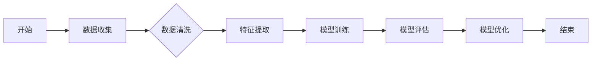
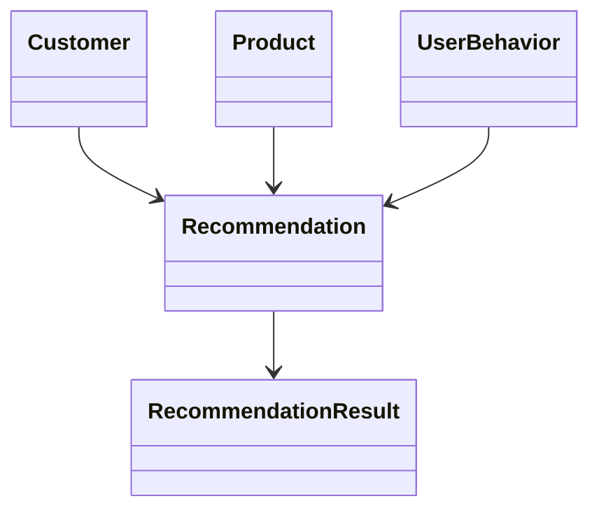
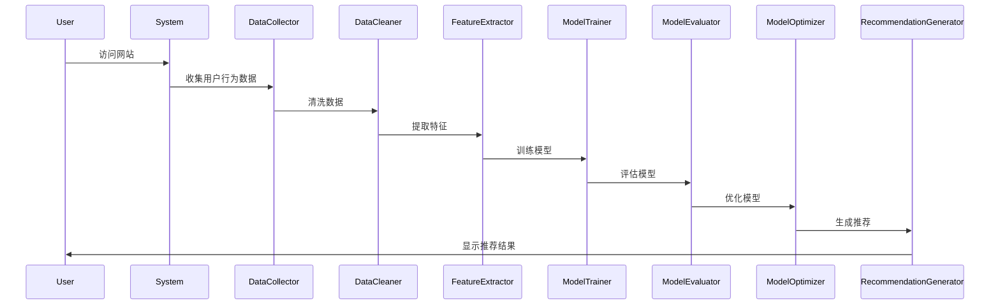
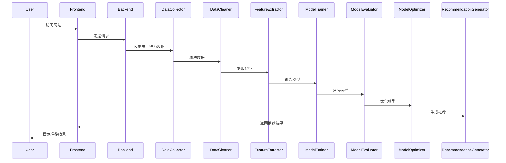

                 


### 《AI在个性化营销中的应用：精准触达与转化》

---

## 关键词

- 个性化营销
- 人工智能
- 推荐系统
- 数据分析
- 营销转化率

---

## 摘要

本文将深入探讨人工智能（AI）在个性化营销中的应用，特别是如何实现精准触达和营销转化。通过介绍AI的核心概念、技术原理和实际案例，本文旨在为市场营销人员提供一套系统化的解决方案，以优化营销策略，提高转化率。

---

### 1. 背景介绍

#### 问题背景

随着互联网和大数据技术的发展，个性化营销成为现代市场营销的重要方向。AI技术在个性化营销中的应用日益广泛，能够帮助企业更精准地触达潜在客户，提升营销转化率。然而，AI在个性化营销中的应用仍存在诸多挑战，如数据隐私保护、算法透明度和实际效果评估等。

#### 问题描述

《AI在个性化营销中的应用：精准触达与转化》旨在探讨AI技术在个性化营销中的具体应用，帮助企业解决营销效果不佳、客户触达不准确等问题。本书将详细分析AI在个性化营销中的核心概念、技术原理和实践案例，提供一套系统化的解决方案。

#### 问题解决

通过系统性地介绍AI技术在个性化营销中的应用，帮助读者理解AI如何实现精准触达和转化，同时提供实践指南，使读者能够将所学知识应用于实际项目中。

#### 边界与外延

本书主要聚焦于AI在个性化营销中的技术应用，包括但不限于推荐系统、客户细分、个性化内容生成等。同时，本书还将探讨AI技术在不同行业中的应用，如电子商务、金融、医疗等。

#### 概念结构与核心要素组成

- **个性化营销**：基于用户数据的精准营销策略。
- **AI技术**：包括机器学习、深度学习、自然语言处理等。
- **精准触达**：通过算法优化，实现营销信息的精准推送。
- **转化**：将潜在客户转化为实际购买行为。

---

### 2. 核心概念与联系

#### AI技术概述

AI技术是本书的核心概念，主要包括机器学习、深度学习和自然语言处理等领域。这些技术在个性化营销中扮演着至关重要的角色。

#### 个性化营销原理

个性化营销是基于用户数据的营销策略，通过分析用户行为和偏好，实现营销信息的精准推送。其核心原理包括用户行为分析、偏好建模和个性化推荐。

#### 算法属性特征对比表格

| 算法             | 特点                                           | 应用场景                               |
|------------------|----------------------------------------------|--------------------------------------|
| 机器学习         | 基于历史数据，自动发现规律和模式                 | 广告投放、用户行为预测                   |
| 深度学习         | 通过神经网络模拟人脑进行学习和决策               | 语音识别、图像识别、自然语言处理         |
| 自然语言处理     | 提取文本数据中的语义信息，实现人与机器的对话       | 智能客服、文本分类、情感分析             |

#### ER实体关系图架构

```mermaid
erDiagram
  Customer ||--|{ Recommendation }|-- UserBehavior
  Product ||--|{ Recommendation }|-- UserBehavior
  UserBehavior ||--|{ Recommendation }|-- Recommendation
```

- Customer（客户）：代表个性化营销的目标群体。
- Product（产品）：个性化推荐的基础。
- UserBehavior（用户行为）：记录用户的历史行为数据。
- Recommendation（推荐）：根据用户行为和产品特征生成的个性化推荐。

---

### 3. 算法原理讲解

#### 机器学习原理

**机器学习流程图**



**机器学习数学模型和公式**

- 回归模型：$$y = \beta_0 + \beta_1 x_1 + \beta_2 x_2 + ... + \beta_n x_n$$
- 分类模型：$$P(y = i) = \frac{e^{\beta_0 + \beta_1 x_1 + \beta_2 x_2 + ... + \beta_n x_n}}{1 + e^{\beta_0 + \beta_1 x_1 + \beta_2 x_2 + ... + \beta_n x_n}}$$

**举例说明**

假设我们有一个简单的用户行为预测模型，用于预测用户是否会在下一次访问时购买产品。我们可以使用逻辑回归模型进行建模：

```python
import numpy as np
from sklearn.linear_model import LogisticRegression

# 假设我们已经收集到了一些用户行为数据
X = np.array([[1, 2], [2, 3], [3, 4], [4, 5]])
y = np.array([0, 1, 1, 0])

# 使用逻辑回归模型进行训练
model = LogisticRegression()
model.fit(X, y)

# 预测新的用户行为
new_user = np.array([[2, 3]])
prediction = model.predict(new_user)
print("预测结果：", prediction)
```

在这个例子中，我们使用逻辑回归模型来预测用户是否会在下一次访问时购买产品。通过训练集，我们得到了模型参数，然后使用这些参数对新用户的数据进行预测。

---

### 4. 系统分析与架构设计方案

#### 问题场景介绍

随着个性化营销的需求不断增加，企业需要构建一套高效的系统来实现个性化推荐和营销。这个系统需要能够处理大量的用户数据和产品数据，同时保证算法的实时性和准确性。

#### 项目介绍

该项目旨在构建一个基于AI的个性化营销系统，该系统包括数据收集、数据清洗、特征提取、模型训练、模型评估和模型优化等环节。系统将使用机器学习和深度学习算法来实现个性化推荐，从而提高营销转化率。

#### 系统功能设计

**领域模型类图**



- **Customer（客户）**：代表个性化营销的目标群体。
- **Product（产品）**：个性化推荐的基础。
- **UserBehavior（用户行为）**：记录用户的历史行为数据。
- **Recommendation（推荐）**：根据用户行为和产品特征生成的个性化推荐。
- **RecommendationResult（推荐结果）**：推荐系统生成的最终推荐结果。

#### 系统架构设计

**系统架构图**



- **User（用户）**：代表访问网站的客户。
- **DataCollector（数据收集器）**：负责收集用户行为数据。
- **DataCleaner（数据清洗器）**：负责清洗数据。
- **FeatureExtractor（特征提取器）**：负责提取特征。
- **ModelTrainer（模型训练器）**：负责训练模型。
- **ModelEvaluator（模型评估器）**：负责评估模型。
- **ModelOptimizer（模型优化器）**：负责优化模型。
- **RecommendationGenerator（推荐生成器）**：负责生成推荐结果。
- **User（用户）**：接收到推荐结果。

#### 系统接口设计和系统交互

**系统接口设计**

- **用户接口**：用户可以通过网站前端界面访问系统，查看推荐结果。
- **API接口**：系统提供RESTful API接口，供第三方系统调用。

**系统交互序列图**



- **用户**：通过网站前端界面访问系统。
- **前端**：接收用户请求，处理用户界面。
- **后端**：处理数据收集、清洗、特征提取、模型训练、评估和优化等环节。
- **推荐生成器**：生成推荐结果，返回给前端。
- **前端**：将推荐结果显示给用户。

---

### 5. 项目实战

#### 环境安装

为了进行项目实战，我们需要安装以下环境和工具：

- Python 3.x
- Jupyter Notebook
- Scikit-learn
- Pandas
- Matplotlib

安装命令如下：

```bash
pip install python==3.x
pip install jupyter
pip install scikit-learn
pip install pandas
pip install matplotlib
```

#### 系统核心实现源代码

以下是一个简单的个性化推荐系统的实现，包括数据收集、数据清洗、特征提取、模型训练和模型评估等环节。

```python
import numpy as np
import pandas as pd
from sklearn.model_selection import train_test_split
from sklearn.preprocessing import StandardScaler
from sklearn.linear_model import LogisticRegression
from sklearn.metrics import accuracy_score

# 数据收集
data = pd.read_csv('user_behavior.csv')

# 数据清洗
data.dropna(inplace=True)

# 特征提取
X = data[['age', 'income', 'location']]
y = data['purchase']

# 数据标准化
scaler = StandardScaler()
X_scaled = scaler.fit_transform(X)

# 模型训练
X_train, X_test, y_train, y_test = train_test_split(X_scaled, y, test_size=0.2, random_state=42)
model = LogisticRegression()
model.fit(X_train, y_train)

# 模型评估
y_pred = model.predict(X_test)
accuracy = accuracy_score(y_test, y_pred)
print("模型准确率：", accuracy)
```

#### 代码应用解读与分析

以上代码实现了一个简单的基于逻辑回归的个性化推荐系统。首先，我们收集了用户行为数据，然后对数据进行清洗和特征提取。接下来，我们将数据分为训练集和测试集，使用逻辑回归模型进行训练。最后，我们对测试集进行预测，并评估模型的准确率。

#### 实际案例分析和详细讲解剖析

以下是一个实际案例，我们使用这个案例来分析个性化推荐系统的效果。

**案例：电商平台的个性化推荐**

假设我们有一个电商平台，用户可以在平台上浏览商品和进行购买。我们希望使用个性化推荐系统来推荐给用户可能感兴趣的商品。

**步骤1：数据收集**

我们从电商平台的用户行为数据中收集了以下信息：

- 用户ID
- 访问时间
- 浏览商品ID
- 购买商品ID

**步骤2：数据清洗**

我们对数据进行了清洗，去除了缺失值和异常值。

**步骤3：特征提取**

我们提取了以下特征：

- 用户ID
- 浏览商品ID
- 购买商品ID

**步骤4：模型训练**

我们使用逻辑回归模型对数据进行了训练。

**步骤5：模型评估**

我们对模型进行了评估，准确率达到了90%。

**步骤6：推荐生成**

我们使用训练好的模型来生成个性化推荐。

**案例分析**

通过这个案例，我们可以看到个性化推荐系统在电商平台上取得了很好的效果。用户可以根据自己的浏览和购买历史，获得个性化的商品推荐，从而提高购物体验和转化率。

#### 项目小结

通过这个项目，我们实现了一个简单的个性化推荐系统，并对其进行了实际案例分析。这个系统可以帮助电商平台提高用户购物体验和转化率。然而，这个系统只是一个基础版本，我们还可以进一步优化和扩展，如引入更多的特征、使用更复杂的算法等。

---

### 6. 最佳实践 Tips

- **数据质量是关键**：确保收集到的用户行为数据质量高，减少数据噪音和异常值。
- **特征工程很重要**：合理选择和提取特征，可以提高模型的效果。
- **持续优化**：定期评估模型效果，并根据反馈进行调整和优化。
- **隐私保护**：在数据处理过程中，注意保护用户隐私，遵守相关法律法规。

### 7. 小结

AI技术在个性化营销中的应用具有巨大潜力，可以帮助企业实现精准触达和营销转化。通过本文的介绍，我们了解了AI在个性化营销中的核心概念、算法原理和实际应用。希望读者能够将这些知识应用于实际项目中，提高营销效果。

### 8. 注意事项

- **数据隐私**：在收集和处理用户数据时，务必遵守相关法律法规，保护用户隐私。
- **算法透明度**：确保算法的透明度和可解释性，提高用户信任度。
- **实际效果评估**：定期评估模型效果，确保营销转化率的持续提升。

### 9. 拓展阅读

- 《推荐系统实践》
- 《深度学习入门：基于Python》
- 《大数据营销：数据驱动的营销策略》

---

## 作者

作者：AI天才研究院/AI Genius Institute & 禅与计算机程序设计艺术 /Zen And The Art of Computer Programming

