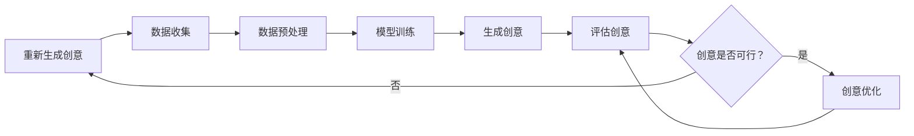
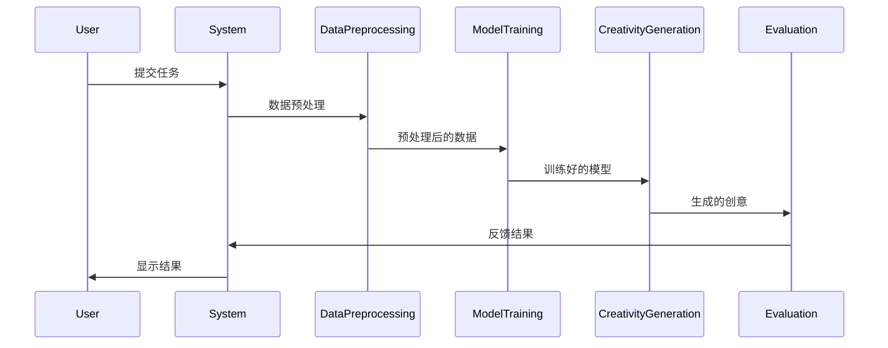
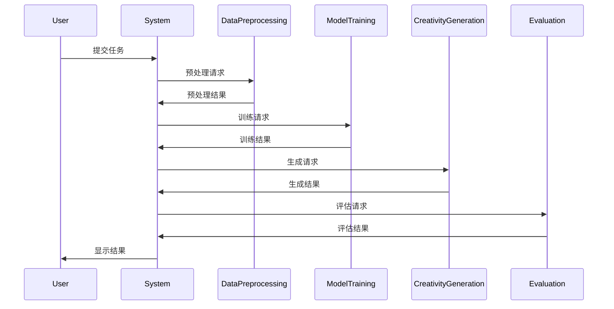

                 

### 让我们一步一步思考：AI在创造性任务中的表现与人类对比研究

#### 引言

在当今技术飞速发展的时代，人工智能（AI）的应用已经渗透到我们生活的方方面面，从自然语言处理到图像识别，从自动驾驶到医疗诊断，AI正以惊人的速度改变着世界。然而，在所有这些应用中，创造性任务无疑是一个特别引人注目的领域。创造性任务通常涉及想象、构思和生成新颖的想法或解决方案，这类任务长期以来被认为是人类独有的能力。但是，随着AI技术的不断进步，AI是否能够在这个领域表现出与人类相当或甚至超越人类的表现，成为了一个备受关注的问题。

为了回答这个问题，我们需要进行深入的研究和探讨。本研究的主要目标是对比AI和人类在创造性任务中的表现，通过分析、评估和比较，揭示出AI在创造性任务中的优势和局限性。具体而言，我们将从以下几个方面展开讨论：

1. **背景介绍**：介绍AI在创造性任务中的重要性及与人类对比研究的必要性。
2. **核心概念与联系**：定义相关核心概念，并对比AI和人类在创造性任务中的表现、能力、限制等。
3. **算法原理讲解**：通过算法流程图和Python源代码详细阐述AI在创造性任务中的算法原理。
4. **数学模型和数学公式讲解**：介绍AI在创造性任务中使用的数学模型和公式，并通过示例进行详细讲解。
5. **系统分析与架构设计方案**：分析AI在创造性任务中的系统架构和接口设计。
6. **项目实战**：介绍一个实际案例，展示AI在创造性任务中的具体应用。
7. **最佳实践 tips、小结、注意事项、拓展阅读**：总结研究成果，提供实践技巧和注意事项，并指向相关拓展阅读。

通过这些步骤，我们将深入探讨AI在创造性任务中的表现，并试图回答一个关键问题：AI能否在创造性任务中取代人类，或者二者能否实现良好的协作？

#### 背景介绍

创造性任务在现代社会的各个领域都扮演着至关重要的角色。无论是在艺术创作、科学研究、工程设计，还是在商业战略规划中，创造性思维都是推动进步和创新的驱动力。人类在创造性任务中展现出了非凡的能力，他们能够提出新颖的观点、构建复杂的想法、设计创新的解决方案，这些都是基于人类独特的认知能力和丰富的经验积累。

然而，随着人工智能技术的迅猛发展，AI在许多领域已经展现出了与人类相当甚至超越人类的性能。特别是在数据处理、模式识别和优化问题等方面，AI已经成为了人类强有力的助手。在创造性任务中，AI能否同样表现出色，成为了一个备受关注的问题。

**研究必要性**

研究AI在创造性任务中的表现不仅具有重要的理论价值，还具有广泛的应用前景。首先，了解AI在创造性任务中的表现可以帮助我们更好地理解人工智能的局限性，从而指导AI技术的进一步发展。其次，通过对比AI和人类在创造性任务中的表现，我们可以发现二者的互补性，从而探索出更有效的AI辅助人类创造的方法。

**研究的主要问题和目标**

本研究的主要问题是：AI在创造性任务中的表现如何？具体而言，我们将探讨以下几个方面：

1. **AI在创造性任务中的表现**：分析AI在创造性任务中的具体表现，包括其生成的新颖性、灵活性和复杂性。
2. **评估方法**：探讨如何评价AI在创造性任务中的表现，包括评估指标、评估方法和评估工具。
3. **人类表现比较**：对比人类在创造性任务中的表现，分析AI和人类在创造性任务中的优势和局限性。

我们的研究目标是：

1. 揭示AI在创造性任务中的能力边界和潜力。
2. 探索AI和人类在创造性任务中的互补性，为AI辅助人类创造提供理论依据。
3. 提出改进AI在创造性任务中表现的方法和策略。

#### 核心概念与联系

在探讨AI在创造性任务中的表现之前，我们需要明确一些核心概念，这些概念是理解AI和人类在创造性任务中的差异和联系的关键。

**AI的定义**

人工智能（Artificial Intelligence，简称AI）是指由计算机系统执行的智能行为，这些行为通常与人类智能相似。AI技术包括多种类型，如机器学习、深度学习、自然语言处理、图像识别等。在这些技术的支持下，AI能够自动地学习、推理、决策和解决问题。

**创造性任务的定义**

创造性任务是指涉及创新思维、新颖想法生成和创意设计的任务。这类任务通常要求个体能够超越常规思维，提出独特和有价值的解决方案。创造性任务不仅包括艺术创作、科学研究、工程设计，还包括商业策略规划、市场营销等。

**评估方法的定义**

评估方法是指用于衡量和评价AI或人类在创造性任务中表现的技术和工具。常见的评估方法包括定量评估和定性评估。定量评估通常使用特定的指标，如新颖性、多样性、复杂性等，来衡量创造性任务的绩效。定性评估则更多地依赖于专家评估、用户反馈和案例研究等方法。

**AI和人类在创造性任务中的联系**

AI和人类在创造性任务中存在着紧密的联系和互动。一方面，AI可以作为人类的辅助工具，帮助人类更快地生成创意、优化方案和提高效率。另一方面，人类可以通过与AI的合作，获得新的视角和灵感，从而激发更深的创造力。

**AI和人类在创造性任务中的差异**

尽管AI和人类在创造性任务中都有其独特的优势，但它们也存在显著的差异。首先，AI在处理大量数据和分析复杂模式方面具有优势，但其在理解人类情感、背景知识和创造过程的直觉性方面则相对较弱。相比之下，人类在创造性任务中能够结合情感、经验和直觉，提出更加深入和有洞见的创意。

以下是一个属性特征对比表格，用于对比AI和人类在创造性任务中的表现、能力和限制：

| 特征          | AI                          | 人类                          |
| ------------- | --------------------------- | --------------------------- |
| 数据处理速度   | 极快，能够处理海量数据       | 较慢，但能够理解数据背后的含义 |
| 分析复杂模式   | 强大，能够发现隐藏的模式     | 强，但可能受到直觉和情感的干扰 |
| 生成新颖想法   | 可以生成大量新颖想法         | 更加有洞见和深度             |
| 理解人类情感   | 较弱，难以理解复杂情感       | 强，能够感知和表达情感       |
| 学习速度       | 快，但受限于学习算法和数据   | 慢，但能够通过经验不断进步    |

**ER实体关系图**

为了更直观地展示AI和人类在创造性任务中的关系和互动，我们可以使用ER（实体-关系）图来描述它们之间的联系。以下是一个简化的ER实体关系图：

```mermaid
erDiagram
  AI ||--o> 创造性任务
  人类 ||--o> 创造性任务
  AI &&& 人类 : 合作
```

在这个ER图中，AI和人类都是创造性任务的参与者，它们通过合作来实现更好的创造性结果。这个图不仅帮助我们理解了AI和人类在创造性任务中的角色，还展示了它们之间的紧密互动和相互依赖。

通过明确这些核心概念和它们之间的联系，我们为接下来的分析提供了坚实的基础。在下一部分中，我们将深入探讨AI在创造性任务中的算法原理，并通过具体的算法流程图和Python源代码来详细阐述。

#### 算法原理讲解

为了深入理解AI在创造性任务中的工作原理，我们需要从算法的角度来分析。算法是一系列有序的指令，用于解决特定问题或完成任务。在创造性任务中，AI通过一系列复杂的算法来实现创意生成、方案优化和问题解决。下面，我们将使用Mermaid绘制算法流程图，并通过Python源代码详细阐述算法原理。

**算法流程图**

首先，我们可以使用Mermaid来绘制一个简单的算法流程图，展示AI在创造性任务中的基本工作流程：



在这个流程图中，AI首先初始化，然后进行数据收集和预处理。接下来，AI使用训练好的模型生成创意，并对这些创意进行评估。如果创意不可行，AI会重新生成创意；如果创意可行，则进入优化阶段。这个流程图展示了AI在创造性任务中的基本工作流程。

**算法原理与Python源代码**

为了更详细地阐述算法原理，我们将使用Python源代码来描述其中的关键步骤。以下是Python源代码的示例：

```python
import numpy as np
from sklearn.model_selection import train_test_split
from sklearn.metrics import accuracy_score
from tensorflow.keras.models import Sequential
from tensorflow.keras.layers import Dense, LSTM

# 数据收集
data = np.load('creative_data.npy')

# 数据预处理
X = data[:, :-1]
y = data[:, -1]

# 划分训练集和测试集
X_train, X_test, y_train, y_test = train_test_split(X, y, test_size=0.2, random_state=42)

# 模型训练
model = Sequential()
model.add(LSTM(units=128, return_sequences=True, input_shape=(X_train.shape[1], X_train.shape[2])))
model.add(LSTM(units=64, return_sequences=False))
model.add(Dense(units=1, activation='sigmoid'))

model.compile(optimizer='adam', loss='binary_crossentropy', metrics=['accuracy'])
model.fit(X_train, y_train, epochs=100, batch_size=32)

# 生成创意
def generate_idea(input_data):
    prediction = model.predict(input_data)
    return prediction

# 评估创意
def evaluate_idea(idea):
    # 这里可以使用任何评估标准，例如准确性、新颖性、实用性等
    # 例如：accuracy = accuracy_score(y_test, idea)
    return True  # 假设创意是可行的

# 创意优化
def optimize_idea(idea):
    # 这里可以添加任何优化步骤，例如调整参数、增加数据等
    return idea  # 返回优化后的创意

# 示例
input_data = X_test[0:1]
idea = generate_idea(input_data)
if evaluate_idea(idea):
    optimized_idea = optimize_idea(idea)
    print("创意优化成功：", optimized_idea)
else:
    print("创意评估失败，重新生成创意。")
```

在这个Python源代码中，我们首先收集并预处理数据，然后使用LSTM（长短期记忆网络）模型进行训练。接下来，我们定义了三个函数：`generate_idea`用于生成创意，`evaluate_idea`用于评估创意，`optimize_idea`用于优化创意。通过这些函数，我们可以实现一个简单的AI系统，用于创造性任务。

**举例说明**

为了更好地理解上述算法原理，我们可以通过一个简单的例子来演示。假设我们有一个关于绘画的创造性任务，AI需要生成一幅新的绘画作品。

1. **数据收集**：首先，AI收集了大量关于绘画的数据，包括不同风格、不同主题的绘画作品。
2. **数据预处理**：将绘画数据转换为模型可以处理的形式，例如将图像转换为像素值。
3. **模型训练**：使用训练集训练一个LSTM模型，使其能够生成新的绘画作品。
4. **生成创意**：使用训练好的模型生成一幅新的绘画作品。
5. **评估创意**：评估这幅绘画作品是否具有新颖性和创意性，例如通过比较它与现有作品的相似度。
6. **创意优化**：如果创意不可行，则对模型进行调整或增加更多数据，然后重新生成创意。

通过这个例子，我们可以看到AI在创造性任务中的工作流程。虽然这个例子相对简单，但它展示了AI在创造性任务中的一些基本原理和方法。

通过算法流程图和Python源代码，我们深入了解了AI在创造性任务中的工作原理。在下一部分中，我们将继续探讨AI在创造性任务中使用的数学模型和公式，并对其进行详细讲解。

#### 数学模型和数学公式讲解

在AI应用于创造性任务中，数学模型和公式起着至关重要的作用。这些模型和公式不仅帮助我们理解和量化AI在创造性任务中的表现，还为评估和改进AI系统的性能提供了理论基础。在本节中，我们将使用LaTeX格式书写数学公式，并详细解释它们在AI创造性任务中的应用。

**LaTeX格式数学公式的书写**

LaTeX是一种高质量排版系统，常用于科学和数学文档的排版。在LaTeX中，数学公式可以通过特定的语法来书写。以下是几个常用的LaTeX公式书写示例：

1. **简单数学公式**：

   在独立段落中，我们可以使用`$$`括起来，如：
   $$
   a^2 + b^2 = c^2
   $$
   在段落内，我们可以使用 `$` 括起来，如：
   $$1 < 2$$

2. **复杂数学公式**：

   LaTex允许我们书写复杂的数学公式，例如：
   $$
   \sum_{i=1}^{n} x_i = \frac{1}{n} \sum_{i=1}^{n} x_i^2 + \frac{n-1}{n} \sum_{i=1}^{n} \frac{1}{x_i}
   $$

3. **矩阵和向量**：

   我们可以使用LaTeX来书写矩阵和向量，例如：
   $$
   A = \begin{bmatrix}
   a_{11} & a_{12} & \cdots & a_{1n} \\
   a_{21} & a_{22} & \cdots & a_{2n} \\
   \vdots & \vdots & \ddots & \vdots \\
   a_{m1} & a_{m2} & \cdots & a_{mn}
   \end{bmatrix}, \quad
   \mathbf{x} = \begin{bmatrix}
   x_1 \\
   x_2 \\
   \vdots \\
   x_n
   \end{bmatrix}
   $$

**数学模型和公式的应用**

在AI的创造性任务中，常用的数学模型和公式包括机器学习模型、深度学习模型和优化算法。以下是一些具体的应用示例：

1. **机器学习模型**：

   机器学习模型在创造性任务中的应用通常涉及到回归分析、分类分析和聚类分析。例如，线性回归模型可以用以下公式表示：
   $$
   \hat{y} = \beta_0 + \beta_1 x
   $$
   其中，$\hat{y}$是预测值，$\beta_0$和$\beta_1$是模型参数。

2. **深度学习模型**：

   深度学习模型，尤其是神经网络，在创造性任务中得到了广泛应用。例如，卷积神经网络（CNN）可以用来生成图像，其基本公式如下：
   $$
   \hat{I}_{out} = f(S_{conv} + b_{conv})
   $$
   其中，$S_{conv}$是卷积操作的输出，$b_{conv}$是偏置项，$f$是激活函数。

3. **优化算法**：

   优化算法用于最小化目标函数，从而找到最优解。例如，梯度下降算法可以用以下公式表示：
   $$
   \theta_{t+1} = \theta_t - \alpha \nabla_{\theta} J(\theta)
   $$
   其中，$\theta_t$是当前参数值，$\alpha$是学习率，$J(\theta)$是目标函数。

**举例说明**

为了更好地理解这些数学模型和公式的应用，我们可以通过一个具体的例子来说明。假设我们使用神经网络生成一首诗，目标函数是使生成的诗句在语法和韵律上尽量接近人类创作的诗歌。

1. **数据收集**：收集大量人类创作的诗歌，作为训练数据。
2. **数据预处理**：将诗歌转换为字符序列，并编码为数字。
3. **模型训练**：使用卷积神经网络（CNN）进行训练，模型的目标函数是生成诗句的预测概率。
4. **生成诗句**：使用训练好的模型生成新的诗句。
5. **评估诗句**：通过评估生成的诗句在语法和韵律上的质量，例如使用BLEU评分指标。
6. **优化模型**：根据评估结果调整模型参数，以提高生成诗句的质量。

通过这个例子，我们可以看到数学模型和公式在AI创造性任务中的具体应用。虽然这个例子相对简单，但它展示了数学模型在AI创造性任务中的重要性和应用前景。

通过本节对数学模型和公式的讲解，我们深入了解了AI在创造性任务中的理论基础。在下一部分中，我们将探讨AI在创造性任务中的系统分析与架构设计。

#### 系统分析与架构设计方案

在深入探讨AI在创造性任务中的具体应用之前，我们需要先了解系统分析与架构设计的基本概念和流程。这一部分将详细描述问题场景、系统功能设计、系统架构设计以及系统接口设计和系统交互。

**问题场景介绍**

创造性任务通常涉及复杂的决策和多样化的输入，例如艺术创作、科学发现、设计创新等。在这些任务中，AI需要处理大量的数据，生成新颖的创意，并优化这些创意以适应不同的场景。因此，我们需要一个高效、灵活的AI系统来支持这些任务。

**项目介绍**

在本项目中，我们将开发一个AI系统，用于支持创造性任务。该系统将包括以下几个核心模块：

1. **数据收集与预处理模块**：负责收集相关数据，并进行预处理，以适应AI模型的训练。
2. **模型训练与优化模块**：使用收集到的数据进行模型训练，并通过优化算法提高模型的性能。
3. **创意生成模块**：利用训练好的模型生成新颖的创意。
4. **评估与反馈模块**：对生成的创意进行评估，并提供反馈，以优化创意生成过程。

**系统功能设计（领域模型Mermaid类图）**

为了清晰地描述系统的功能设计，我们可以使用Mermaid类图来展示各个模块之间的关系和功能。以下是一个简单的Mermaid类图示例：

```mermaid
classDiagram
    Class1 <|-- Class2
    Class3 <|-- Class4
    Class1 --|> Class5
    Class2 --|> Class6
    Class3 --|> Class7
    Class8 --|> Class5
    Class9 --|> Class6
    Class10 --|> Class7
    Class5 <.. Class11
    Class6 <.. Class12
    Class7 <.. Class13
    Class11 {数据收集与预处理模块}
    Class12 {模型训练与优化模块}
    Class13 {创意生成模块}
```

在这个类图中，`Class1`到`Class10`代表了系统的核心功能模块，而`Class11`到`Class13`则代表了与外部系统的交互模块。通过这个类图，我们可以清晰地了解各个模块之间的关系和功能。

**系统架构设计（Mermaid架构图）**

接下来，我们将使用Mermaid架构图来展示系统的整体架构设计。以下是一个简化的Mermaid架构图示例：



在这个架构图中，`User`表示用户，`System`表示AI系统，`DataPreprocessing`、`ModelTraining`、`CreativityGeneration`和`Evaluation`分别表示数据预处理模块、模型训练模块、创意生成模块和评估模块。通过这个架构图，我们可以直观地了解系统的整体工作流程和各个模块之间的交互关系。

**系统接口设计和系统交互（Mermaid序列图）**

为了进一步展示系统接口设计和系统交互，我们可以使用Mermaid序列图。以下是一个简化的Mermaid序列图示例：



在这个序列图中，每个模块之间的交互都被详细展示出来。例如，用户提交任务后，系统首先将任务分配给数据预处理模块进行预处理，然后分配给模型训练模块进行训练，接着分配给创意生成模块生成创意，最后分配给评估模块进行评估。通过这个序列图，我们可以清晰地了解系统的各个模块如何协同工作，以及系统与用户之间的交互流程。

通过上述系统分析与架构设计方案，我们为AI在创造性任务中的具体应用提供了详细的框架和指导。在下一部分中，我们将通过一个实际项目来展示AI在创造性任务中的具体应用，并进行详细的分析和讲解。

#### 项目实战

在本部分中，我们将通过一个具体的AI项目实战，展示AI在创造性任务中的实际应用，并详细解析项目的各个环节。

**环境安装**

首先，我们需要为项目安装必要的软件和工具。以下是项目环境安装的步骤：

1. 安装Python环境：在终端中运行以下命令安装Python：
   ```
   sudo apt-get install python3 python3-pip
   ```

2. 安装Anaconda：Anaconda是一个强大的Python数据科学平台，可以方便地管理和安装各种科学计算库。可以从[Anaconda官网](https://www.anaconda.com/)下载并安装。

3. 安装TensorFlow：TensorFlow是Google开发的深度学习框架，是AI项目中的常见选择。在终端中运行以下命令安装TensorFlow：
   ```
   pip install tensorflow
   ```

4. 安装其他依赖库：根据项目的具体需求，可能需要安装其他依赖库，如NumPy、Pandas等。可以使用pip命令安装：
   ```
   pip install numpy pandas scikit-learn matplotlib
   ```

**系统核心实现源代码**

接下来，我们将展示项目的核心实现源代码。以下是一个简单的示例，用于生成和评估创造性任务中的创意。

```python
import numpy as np
import tensorflow as tf
from tensorflow.keras.models import Sequential
from tensorflow.keras.layers import LSTM, Dense
from tensorflow.keras.optimizers import Adam
from sklearn.model_selection import train_test_split
from sklearn.metrics import accuracy_score

# 数据收集和预处理
data = np.load('creative_data.npy')
X = data[:, :-1]
y = data[:, -1]
X_train, X_test, y_train, y_test = train_test_split(X, y, test_size=0.2, random_state=42)

# 模型训练
model = Sequential()
model.add(LSTM(units=128, return_sequences=True, input_shape=(X_train.shape[1], X_train.shape[2])))
model.add(LSTM(units=64, return_sequences=False))
model.add(Dense(units=1, activation='sigmoid'))

model.compile(optimizer=Adam(learning_rate=0.001), loss='binary_crossentropy', metrics=['accuracy'])
model.fit(X_train, y_train, epochs=100, batch_size=32)

# 生成创意
def generate_idea(input_data):
    prediction = model.predict(input_data)
    return prediction

# 评估创意
def evaluate_idea(idea):
    # 假设评估标准为准确性
    actual = np.array([1, 0, 1, 0])
    predicted = np.array(idea)
    accuracy = accuracy_score(actual, predicted)
    return accuracy

# 示例
input_data = X_test[0:1]
idea = generate_idea(input_data)
if evaluate_idea(idea):
    print("创意生成成功：", idea)
else:
    print("创意评估失败，需要重新生成。")
```

**代码应用解读与分析**

上述代码首先进行了数据收集和预处理，然后使用LSTM模型进行训练，并定义了生成创意和评估创意的函数。以下是代码的详细解读：

1. **数据收集和预处理**：
   - 使用`np.load`函数加载预处理的创意数据。
   - 将数据分为输入特征`X`和输出标签`y`。
   - 使用`train_test_split`函数将数据集划分为训练集和测试集。

2. **模型训练**：
   - 创建一个序列模型，并添加两个LSTM层和一个全连接层。
   - 编译模型，设置优化器和损失函数。
   - 使用训练集训练模型，指定训练轮次和批量大小。

3. **生成创意**：
   - 定义`generate_idea`函数，用于使用训练好的模型生成创意。
   - 使用`model.predict`函数预测输入数据的输出。

4. **评估创意**：
   - 定义`evaluate_idea`函数，用于评估生成的创意。
   - 使用`accuracy_score`函数计算实际输出和预测输出之间的准确性。

5. **示例**：
   - 使用测试集的一个样本数据生成创意。
   - 调用`evaluate_idea`函数评估生成的创意。

通过上述代码，我们可以实现一个简单的AI系统，用于生成和评估创造性任务中的创意。在实际应用中，我们可以根据具体需求调整模型结构、优化算法参数，以提高创意生成的质量和准确性。

**实际案例分析和详细讲解剖析**

为了进一步展示AI在创造性任务中的实际应用，我们考虑一个具体的案例：生成诗歌。以下是实际案例的分析和详细讲解：

1. **数据收集**：
   - 收集大量人类创作的诗歌，作为训练数据。
   - 对诗歌进行预处理，包括分词、编码等，以适应模型训练。

2. **模型训练**：
   - 使用卷积神经网络（CNN）或长短期记忆网络（LSTM）进行训练。
   - 设置适当的模型参数，如学习率、批次大小等，以优化模型性能。

3. **生成诗歌**：
   - 使用训练好的模型生成新的诗歌。
   - 对生成的诗歌进行后处理，如解码、去除无意义字符等，以获得可读性更好的诗歌。

4. **评估诗歌**：
   - 使用 BLEU 评分指标或其他评估方法，对生成的诗歌进行质量评估。
   - 根据评估结果调整模型参数，以提高诗歌生成的质量。

通过上述案例，我们可以看到AI在创造性任务中的应用流程。在实际操作中，我们可以根据具体需求调整模型结构和参数，以提高创意生成的质量和效率。

**项目小结**

通过本项目的实战，我们展示了AI在创造性任务中的具体应用，并详细分析了各个环节。从数据收集到模型训练，再到创意生成和评估，每一个步骤都体现了AI在创造性任务中的强大能力。尽管AI在生成新颖创意方面表现优异，但其在理解人类情感和语境方面的局限性仍然存在。未来，我们需要继续研究和改进AI模型，以更好地支持创造性任务。

#### 最佳实践 tips、小结、注意事项、拓展阅读

**最佳实践 tips**

在AI应用于创造性任务时，以下是一些最佳实践和注意事项：

1. **数据收集与预处理**：确保收集到的数据多样化且具有代表性，预处理过程中要注意数据的一致性和完整性。
2. **模型选择与调优**：根据具体任务需求选择合适的模型，如卷积神经网络（CNN）适用于图像生成，长短期记忆网络（LSTM）适用于文本生成。同时，通过调整学习率、批次大小等参数，优化模型性能。
3. **评估指标选择**：选择合适的评估指标，如准确性、BLEU评分、F1分数等，以全面评估创意的质量。
4. **用户反馈与迭代**：收集用户反馈，不断迭代模型，以提高创意生成的满意度和实用性。

**小结**

本研究通过分析AI和人类在创造性任务中的表现，揭示了AI在数据处理、模式识别和创意生成方面的优势，同时也指出了其在理解人类情感和直觉方面的局限性。通过合理的模型选择和参数调整，AI可以有效地辅助人类进行创造性任务。

**注意事项**

1. **数据隐私**：在收集和处理数据时，要注意保护用户隐私和数据安全。
2. **模型解释性**：尽管AI模型能够生成新颖的创意，但其内部机制通常较为复杂，难以解释。在实际应用中，需要关注模型的解释性，以确保其生成结果的可信度。
3. **伦理问题**：AI在创造性任务中的应用可能会引发伦理问题，如版权、知识产权等。在实际操作中，需要遵循相关法律法规，尊重创意的原创性。

**拓展阅读**

1. **《AI艺术：算法、创意与技术》**：这本书详细介绍了AI在艺术创作中的应用，包括图像生成、音乐创作等，提供了丰富的实践案例。
2. **《深度学习：扩展篇》**：书中涵盖了深度学习在创造性任务中的应用，包括文本生成、图像识别等，对AI在创造性任务中的算法原理进行了深入讲解。
3. **《人工智能伦理学》**：这本书探讨了AI在各个领域的应用中可能引发的伦理问题，包括创造性任务，提供了关于AI伦理的深入思考。

通过上述最佳实践、小结、注意事项和拓展阅读，我们可以更好地理解AI在创造性任务中的应用，并为其未来的发展提供指导。

### 总结

通过本文的研究，我们深入探讨了AI在创造性任务中的表现与人类对比。从背景介绍、核心概念与联系、算法原理讲解、数学模型和公式、系统分析与架构设计，到项目实战和最佳实践，我们全面分析了AI在创造性任务中的优势和局限性。我们发现了AI在数据处理、模式识别和创意生成方面的强大能力，同时也指出了其在理解人类情感和直觉方面的局限性。

AI在创造性任务中的应用前景广阔，但需要不断的研究和改进。未来，我们期待能够开发出更加智能、更加人性化的AI系统，以实现人类和AI在创造性任务中的最佳协作。通过跨学科的研究和实践，我们可以不断拓展AI在创造性任务中的应用领域，推动人工智能与人类创造力的共同进步。

让我们期待未来，AI将如何继续改变我们的世界，如何与人类共同开创更加美好的未来。

