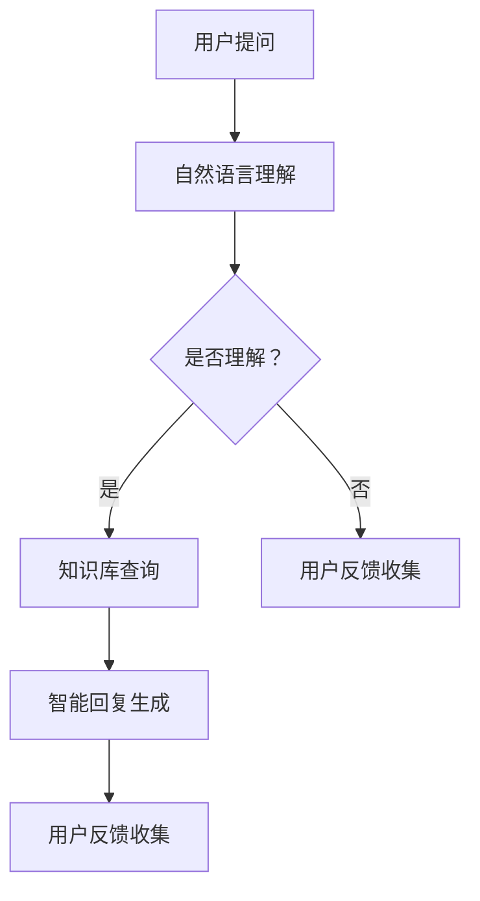
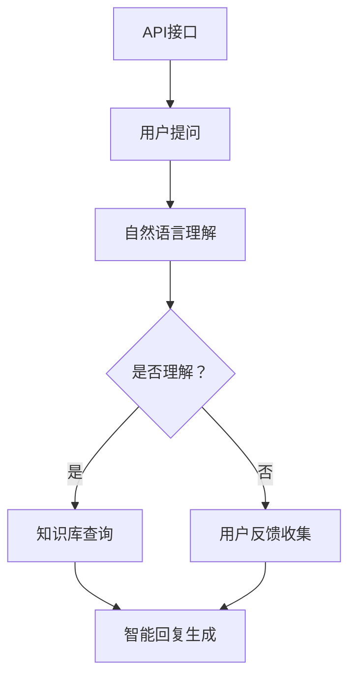
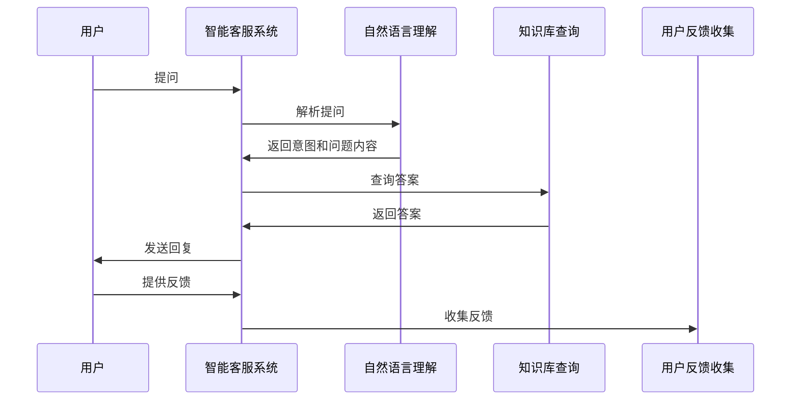
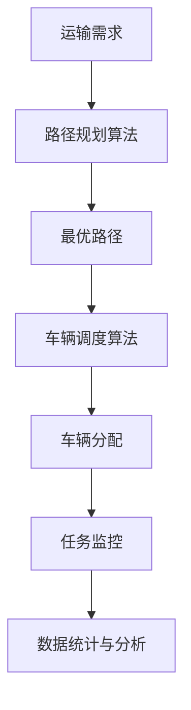
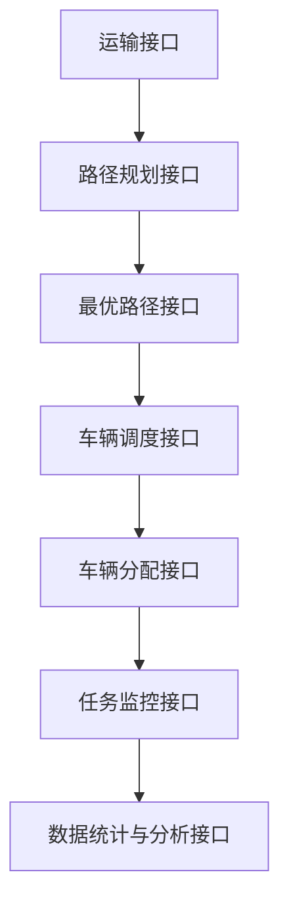
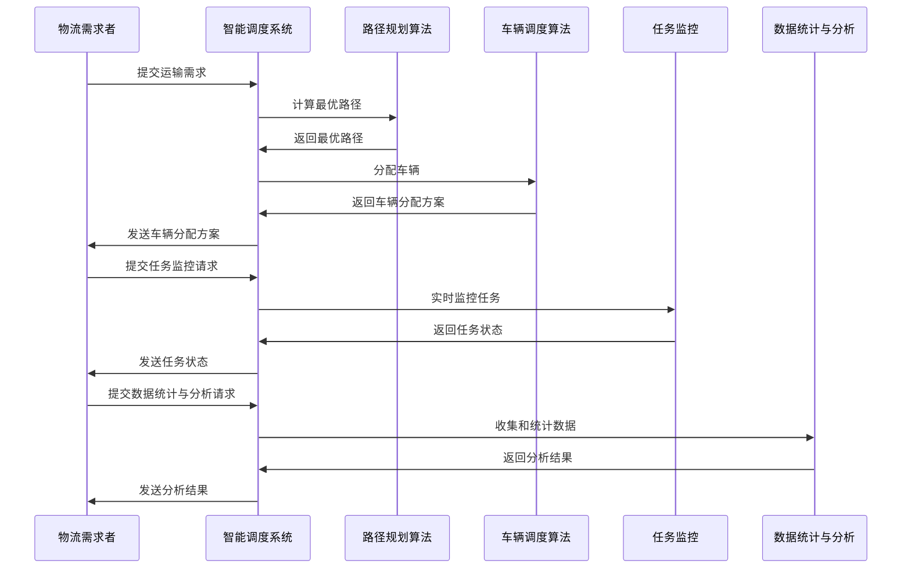
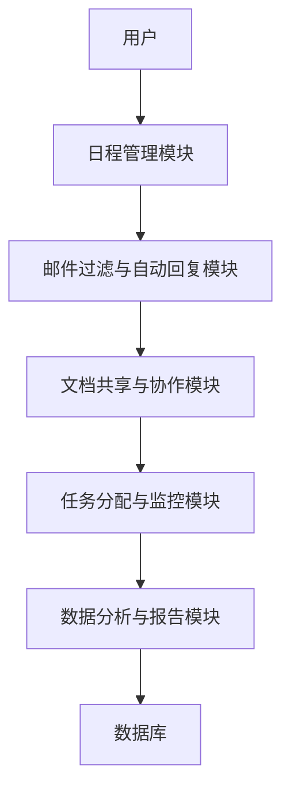
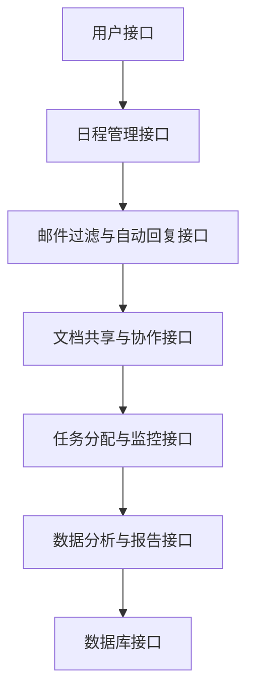
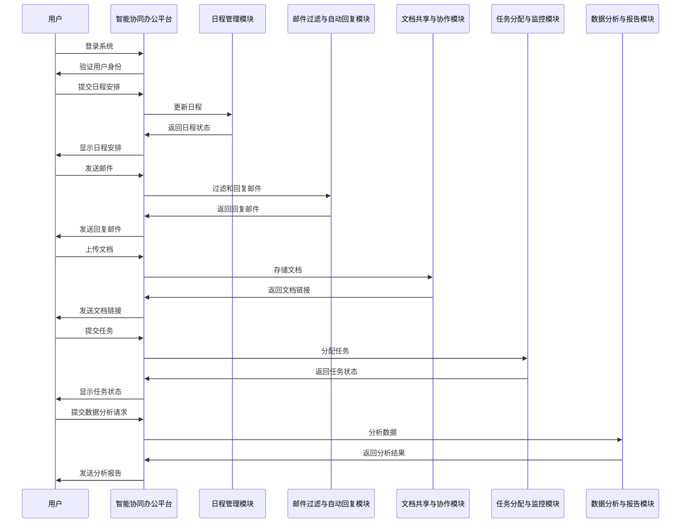

                 

### 引言与背景

在当今数字化时代，人工智能（AI）技术已经逐渐成为推动社会发展和经济进步的重要力量。特别是在协作任务中，AI的应用不仅提高了效率，还带来了全新的工作模式和管理方法。协作任务是指多个个体或团队在共同目标下进行合作与沟通，从而完成复杂任务的场景。随着人工智能技术的发展，AI在协作任务中的角色日益凸显，成为现代协作体系中不可或缺的一部分。

#### 协作任务的定义与重要性

协作任务可以定义为多个个体或团队为了实现共同目标而进行的合作活动。在现代社会中，协作任务广泛存在于各个领域，如企业管理、医疗诊断、科研创新等。协作任务的重要性主要体现在以下几个方面：

1. **提升工作效率**：通过协作，团队成员可以充分发挥各自的专业优势，实现资源的高效配置和利用，从而提高整体工作效率。
2. **优化决策质量**：在协作过程中，多个观点和信息的碰撞有助于形成更为全面和准确的决策，减少决策失误。
3. **增强创新能力**：协作任务鼓励团队成员之间的交流和互动，激发创新思维，推动新技术的研发和应用。
4. **促进团队建设**：通过协作，团队成员之间建立信任和默契，有助于增强团队凝聚力和协作能力。

#### AI在协作任务中的应用现状

随着AI技术的不断成熟，其在协作任务中的应用也越来越广泛。目前，AI在协作任务中的应用主要体现在以下几个方面：

1. **智能助手**：如智能客服系统、智能办公助手等，通过自然语言处理和机器学习技术，提供高效便捷的服务，减少人力成本。
2. **智能决策支持**：利用大数据分析和预测模型，为决策者提供科学的决策依据，优化决策过程。
3. **智能任务分配**：通过分析团队成员的能力和任务需求，智能分配任务，提高任务完成的效率和质量。
4. **智能冲突解决**：利用机器学习算法和自然语言处理技术，分析团队冲突的原因和解决方案，辅助团队解决冲突。

#### AI在协作任务中的作用与挑战

尽管AI在协作任务中展现出诸多优势，但其应用也面临着一定的挑战：

1. **角色定位**：AI在协作任务中应承担什么样的角色，如何与人类协同工作，这是一个亟待解决的问题。
2. **数据安全与隐私**：协作任务往往涉及敏感信息，如何保障数据安全与隐私，是AI在协作任务中需要克服的难题。
3. **算法公平性**：AI算法在任务分配、决策支持等方面可能存在偏见，如何确保算法的公平性，避免歧视和不公正现象的发生。
4. **适应性与灵活性**：协作任务的多样性和复杂性要求AI系统具备良好的适应性和灵活性，以应对不断变化的环境和需求。

#### 本书结构安排与目标

本书旨在深入探讨AI在协作任务中的角色与性能优化，分为四个主要部分：

1. **引言与背景**：介绍协作任务的定义、重要性和AI在其中的应用现状。
2. **AI在协作任务中的基础理论**：阐述人工智能的基本概念、常见技术在协作任务中的应用，以及协作任务的特性对AI技术的要求。
3. **AI在协作任务中的应用**：详细分析AI在团队合作和跨团队合作中的应用场景和案例分析。
4. **AI性能优化策略**：探讨AI在协作任务中的性能评估、优化技术和实际应用案例。

通过本书，读者将全面了解AI在协作任务中的作用机制、应用场景和优化策略，为未来AI在协作任务中的应用提供理论指导和实践参考。

### AI在协作任务中的概述

#### 协作任务的定义与重要性

协作任务是指多个个体或团队为了实现共同目标而进行的合作活动。其核心在于资源共享、信息交流和工作协同。在协作任务中，不同成员或团队通常拥有不同的专业知识和技能，通过有效的协作，可以充分利用各自的优势，提高整体工作效率和成果质量。

协作任务的重要性体现在以下几个方面：

1. **提升工作效率**：通过分工合作，每个成员可以专注于自己最擅长的工作，减少重复劳动，提高工作效率。
2. **优化决策质量**：在协作过程中，多个成员可以提供不同的观点和建议，有助于形成全面和准确的决策。
3. **促进知识共享**：协作任务鼓励团队成员之间的交流，促进知识和经验的共享，提高整体业务水平。
4. **增强团队凝聚力**：通过共同完成任务，团队成员之间的信任和默契逐渐建立，增强团队凝聚力。

#### AI在协作任务中的应用现状

随着人工智能技术的快速发展，AI在协作任务中的应用逐渐普及，并展现出巨大的潜力。目前，AI在协作任务中的应用主要体现在以下几个方面：

1. **智能助手**：智能助手通过自然语言处理和机器学习技术，能够自动处理大量重复性工作，如智能客服、智能办公助手等。这些智能助手不仅提高了工作效率，还减少了人力成本。
2. **智能决策支持**：利用大数据分析和预测模型，AI可以为决策者提供科学的决策依据。例如，在医疗领域，AI可以通过分析大量病例数据，帮助医生制定更为准确的诊断和治疗方案。
3. **智能任务分配**：通过分析团队成员的能力和任务需求，AI可以智能地分配任务，提高任务完成的效率和质量。例如，在项目管理中，AI可以根据项目进度和团队成员的工作负荷，自动调整任务分配。
4. **智能冲突解决**：AI可以通过分析冲突的原因和解决方案，辅助团队解决冲突。例如，在团队合作中，AI可以分析团队成员的意见分歧，提出合理的解决方案，促进团队和谐。

#### AI在协作任务中的作用与挑战

AI在协作任务中发挥着重要作用，但也面临着一定的挑战。

1. **角色定位**：AI在协作任务中应承担什么样的角色？是作为辅助工具，还是参与决策的核心？这需要根据具体任务和环境进行合理定位。
2. **数据安全与隐私**：协作任务往往涉及敏感信息，如何保障数据安全与隐私，是AI在协作任务中需要克服的难题。例如，在医疗领域，患者信息的安全性至关重要，任何数据泄露都可能导致严重的后果。
3. **算法公平性**：AI算法在任务分配、决策支持等方面可能存在偏见，如何确保算法的公平性，避免歧视和不公正现象的发生？例如，在招聘过程中，AI筛选简历时可能因算法偏见而排除某些特定群体。
4. **适应性与灵活性**：协作任务的多样性和复杂性要求AI系统具备良好的适应性和灵活性。例如，在应急任务中，AI需要能够快速适应变化的环境和需求，提供有效的支持。

#### 本书结构安排与目标

本书旨在深入探讨AI在协作任务中的角色与性能优化，共分为五个部分：

1. **引言与背景**：介绍协作任务的定义、重要性和AI在其中的应用现状。
2. **AI在协作任务中的基础理论**：阐述人工智能的基本概念、常见技术在协作任务中的应用，以及协作任务的特性对AI技术的要求。
3. **AI在协作任务中的应用**：详细分析AI在团队合作和跨团队合作中的应用场景和案例分析。
4. **AI性能优化策略**：探讨AI在协作任务中的性能评估、优化技术和实际应用案例。
5. **未来发展趋势与挑战**：展望AI协作任务的未来发展趋势，探讨技术创新趋势，以及面临的挑战与对策。

通过本书，读者将全面了解AI在协作任务中的作用机制、应用场景和优化策略，为未来AI在协作任务中的应用提供理论指导和实践参考。

### AI在协作任务中的基础理论

#### 人工智能的基本概念

人工智能（Artificial Intelligence，简称AI）是指通过计算机系统模拟人类智能的理论、方法和技术。其目标是使计算机具备理解、学习和处理复杂信息的能力，从而实现智能化的任务执行。人工智能可以分为两大类：弱人工智能（Narrow AI）和强人工智能（General AI）。

1. **弱人工智能**：也称为专用人工智能，是指只能在特定任务上表现优异的智能系统。例如，智能客服系统、自动驾驶汽车等。这些系统通常通过深度学习、自然语言处理等技术实现，能够在特定领域内进行高度复杂的任务处理。
   
2. **强人工智能**：是指具备广泛认知能力和自主决策能力的人工智能系统，能够像人类一样在多种任务和环境中进行灵活适应和决策。目前，强人工智能仍处于理论研究阶段，尚未实现商业化应用。

#### 常见的AI技术在协作任务中的应用

在协作任务中，AI技术发挥着重要作用，常见的AI技术包括机器学习、深度学习、自然语言处理、强化学习等。

1. **机器学习**：机器学习是一种通过数据训练模型，使计算机具备自主学习和预测能力的技术。在协作任务中，机器学习可以用于任务分配、资源优化、预测分析等。例如，通过分析团队成员的工作能力和项目需求，机器学习算法可以智能分配任务，提高工作效率。

2. **深度学习**：深度学习是机器学习的一种重要分支，通过构建多层神经网络，模拟人脑的神经元连接方式，实现复杂的数据处理和模式识别。在协作任务中，深度学习可以用于图像识别、语音识别、自然语言理解等。例如，通过深度学习技术，智能客服系统能够理解和回答用户的复杂问题，提供个性化服务。

3. **自然语言处理**：自然语言处理（Natural Language Processing，简称NLP）是AI技术中的一个重要领域，旨在使计算机能够理解和处理人类自然语言。在协作任务中，NLP可以用于团队沟通、任务分配、冲突解决等。例如，通过NLP技术，智能助手可以自动解析团队成员的沟通内容，提出合理的建议和解决方案。

4. **强化学习**：强化学习是一种通过试错和反馈机制，使智能体在环境中进行学习和决策的技术。在协作任务中，强化学习可以用于任务调度、资源优化、策略制定等。例如，通过强化学习算法，智能系统可以自动调整任务分配策略，以最大化整体工作效率。

#### 协作任务的特性对AI技术的要求

协作任务具有以下特性，这些特性对AI技术提出了特定的要求：

1. **多样性**：协作任务通常涉及多种不同类型的工作和人员，AI技术需要能够处理多样化的任务和需求，实现跨领域的应用。
   
2. **动态性**：协作任务往往具有动态变化的特点，任务需求、人员配置、环境条件等都会发生变化，AI技术需要具备良好的适应性和灵活性，能够实时调整策略和模型。

3. **协作性**：协作任务强调团队之间的合作与沟通，AI技术需要能够理解和处理团队互动中的复杂信息，提供有效的支持和服务。

4. **高效性**：协作任务追求高效率，AI技术需要能够在短时间内处理大量信息，快速做出决策，提高整体工作效率。

5. **安全性**：协作任务涉及敏感信息，AI技术需要确保数据安全和隐私保护，防止信息泄露和滥用。

通过深入了解AI的基本概念和常见技术在协作任务中的应用，我们可以更好地理解AI在协作任务中的作用和潜力，为未来的研究和应用提供理论基础。

#### AI核心概念与原理

在探讨AI在协作任务中的实际应用之前，我们需要深入了解一些核心概念和原理，这些基础理论将为后续章节的分析和讨论提供坚实的依据。

##### 机器学习基本原理

机器学习（Machine Learning，ML）是一种通过数据训练模型，使计算机具备自主学习和预测能力的技术。其基本原理可以分为监督学习、无监督学习和半监督学习。

1. **监督学习**：监督学习是一种在有标签数据集上进行训练的机器学习方法。标签数据提供了输入和输出之间的映射关系，模型通过学习这些映射关系来预测新的输入数据。常见的监督学习算法包括线性回归、决策树、支持向量机（SVM）和神经网络等。

   - **线性回归**：线性回归是一种用于预测连续值的监督学习算法，通过建立输入变量和输出变量之间的线性关系来进行预测。公式为：
     $$ y = \beta_0 + \beta_1x_1 + \beta_2x_2 + ... + \beta_nx_n $$
     其中，$y$ 是输出变量，$x_1, x_2, ..., x_n$ 是输入变量，$\beta_0, \beta_1, ..., \beta_n$ 是模型参数。

   - **决策树**：决策树是一种基于树形结构的监督学习算法，通过一系列的决策规则来划分数据集。每个内部节点代表一个特征，每个叶节点代表一个类别。决策树通过递归划分数据集，构建出一棵树形模型。

2. **无监督学习**：无监督学习是在没有标签数据集的情况下，通过分析数据的内在结构来进行分类或降维的机器学习方法。常见的无监督学习算法包括聚类算法（如K均值聚类、层次聚类）和降维算法（如主成分分析PCA、线性判别分析LDA）。

   - **K均值聚类**：K均值聚类是一种基于距离度量的聚类算法，通过迭代优化目标函数来将数据划分为K个簇。目标函数为：
     $$ J = \sum_{i=1}^{K} \sum_{x \in S_i} \|x - \mu_i\|^2 $$
     其中，$S_i$ 是第$i$个簇，$\mu_i$ 是簇中心。

3. **半监督学习**：半监督学习是结合了监督学习和无监督学习的方法，通过利用部分有标签数据和大量无标签数据来训练模型。半监督学习在数据标签稀缺或获取成本高昂的场景中具有显著优势。

##### 深度学习基础

深度学习（Deep Learning，DL）是机器学习的一种重要分支，通过构建多层神经网络（Neural Networks），模拟人脑的信息处理方式，实现复杂的数据处理和模式识别。深度学习的基础概念包括神经元、神经网络、激活函数和反向传播算法。

1. **神经元**：神经元是神经网络的基本单元，类似于生物神经元。它通过接收输入信号，通过权重和偏置进行加权求和，并应用激活函数进行非线性变换，输出结果。神经元的基本公式为：
   $$ z = \sum_{j=1}^{n} w_jx_j + b $$
   $$ a = \sigma(z) $$
   其中，$x_j$ 是输入，$w_j$ 是权重，$b$ 是偏置，$\sigma$ 是激活函数，常用的激活函数包括Sigmoid、ReLU和Tanh等。

2. **神经网络**：神经网络是由多个神经元组成的层次结构，每一层神经元接收前一层神经元的输出作为输入。神经网络可以分为输入层、隐藏层和输出层。隐藏层可以有一个或多个，隐藏层的数量和神经元数量取决于具体任务的需求。

3. **激活函数**：激活函数是神经网络中引入非线性变换的关键，常用的激活函数包括Sigmoid、ReLU和Tanh等。ReLU函数由于其简单性和有效性，在深度学习中广泛应用。

4. **反向传播算法**：反向传播算法（Backpropagation）是深度学习训练过程中的一种优化算法，通过计算损失函数关于模型参数的梯度，不断调整模型参数，使模型在训练数据上达到最优。反向传播算法的基本步骤如下：

   - **前向传播**：将输入数据传递到神经网络中，通过每一层计算得到输出。
   - **计算损失**：将输出与实际标签进行比较，计算损失函数。
   - **反向传播**：计算损失函数关于模型参数的梯度，并将其反向传播到前一层。
   - **更新参数**：根据梯度信息更新模型参数，优化模型性能。

##### 强化学习原理与应用

强化学习（Reinforcement Learning，RL）是一种通过试错和反馈机制，使智能体在环境中进行学习和决策的技术。其核心概念包括智能体、环境、状态、动作和奖励。

1. **智能体**：智能体（Agent）是执行动作并从环境中接收反馈的实体，目标是学习最优策略，最大化长期奖励。
2. **环境**：环境（Environment）是智能体执行动作和接收奖励的背景，通常是一个复杂的系统。
3. **状态**：状态（State）是描述环境当前状态的变量，智能体通过感知状态来选择动作。
4. **动作**：动作（Action）是智能体在环境中执行的行为。
5. **奖励**：奖励（Reward）是环境对智能体动作的反馈，用于评估动作的效果。

强化学习的主要目标是通过学习策略（Policy），使智能体能够选择最优动作，最大化长期奖励。常见的方法包括Q学习、深度Q网络（DQN）、策略梯度方法和深度确定性策略梯度（DDPG）等。

- **Q学习**：Q学习是一种基于值函数的强化学习算法，通过学习状态-动作值函数（Q值）来选择最优动作。Q学习的基本公式为：
  $$ Q(s, a) = r + \gamma \max_{a'} Q(s', a') $$
  其中，$s$ 是当前状态，$a$ 是当前动作，$r$ 是奖励，$\gamma$ 是折扣因子，$s'$ 是下一状态，$a'$ 是下一动作。

- **深度Q网络（DQN）**：DQN是一种结合深度学习和Q学习的强化学习算法，通过构建深度神经网络来近似Q值函数。DQN通过经验回放和目标网络来缓解Q值函数的估计偏差。

- **策略梯度方法**：策略梯度方法通过直接优化策略梯度来学习最优策略。策略梯度方法的公式为：
  $$ \nabla_\theta J(\theta) = \nabla_\theta \sum_{t} r_t $$
  其中，$\theta$ 是策略参数，$J(\theta)$ 是策略损失函数。

- **深度确定性策略梯度（DDPG）**：DDPG是一种基于深度强化学习的算法，通过构建深度神经网络来近似策略函数和价值函数。DDPG通过样本回放和目标网络来优化策略，适用于连续动作空间的问题。

##### 自然语言处理基础

自然语言处理（Natural Language Processing，NLP）是AI技术中的一个重要领域，旨在使计算机能够理解和处理人类自然语言。NLP的核心技术包括文本预处理、词向量表示、语言模型和序列标注等。

1. **文本预处理**：文本预处理是NLP的基础步骤，包括分词、去除停用词、词性标注等。文本预处理的目标是提高数据质量和减少噪声。
2. **词向量表示**：词向量表示是将文本数据转换为数值向量的方法，常见的词向量表示方法包括Word2Vec、GloVe和FastText等。词向量表示能够捕捉词与词之间的语义关系。
3. **语言模型**：语言模型是NLP中用于预测下一个单词或词组的概率分布的模型。常用的语言模型包括n-gram模型、循环神经网络（RNN）和变换器（Transformer）等。
4. **序列标注**：序列标注是将文本序列中的每个词标注为特定类别的方法，常见的序列标注任务包括命名实体识别（NER）、情感分析等。

通过以上对AI核心概念和原理的介绍，我们可以更好地理解AI在协作任务中的应用机制和潜在价值。接下来，我们将深入探讨AI在协作任务中的应用，分析其在团队合作和跨团队合作中的具体场景和案例。

### AI在协作任务中的应用

#### AI在团队合作中的应用

在团队合作中，AI技术通过多种方式提升了沟通效率、决策质量、任务分配和冲突解决能力，从而增强了团队的整体协作能力。

1. **沟通效率**：AI在团队沟通中的应用主要体现在智能客服和智能聊天机器人上。这些智能助手通过自然语言处理（NLP）技术，能够实时理解团队成员的提问，并提供即时的回答和建议。例如，智能办公助手可以自动解析团队成员的邮件和消息，提供日程安排、任务提醒和文件搜索等服务。这不仅减轻了团队成员的沟通负担，还提高了信息传递的速度和准确性。

2. **决策质量**：AI在决策支持中的应用可以帮助团队做出更加科学的决策。通过大数据分析和预测模型，AI可以提供基于数据的决策建议。例如，在项目评估中，AI可以分析历史项目数据和市场趋势，提供项目成功概率的预测和风险分析，从而帮助团队成员做出更为准确的决策。

3. **任务分配**：AI在任务分配中的应用可以基于团队成员的能力和任务需求进行智能分配。通过机器学习算法，AI可以分析每个成员的工作效率和擅长领域，自动推荐最适合的任务。例如，在软件开发项目中，AI可以根据团队成员的技术背景和项目需求，智能分配代码开发和测试任务，提高任务完成的效率和代码质量。

4. **冲突解决**：AI在团队冲突解决中的应用可以帮助团队成员找到合理的解决方案。通过自然语言处理和情感分析技术，AI可以识别冲突的原因和团队成员的情绪状态，并提出可能的解决方案。例如，在团队合作中，AI助手可以分析团队成员的讨论记录和反馈，识别潜在的冲突点，并建议采取的调解措施，促进团队的和谐与协作。

#### AI在跨团队合作中的应用

跨团队合作是指不同团队或组织在共同目标下进行合作，通常涉及多个部门和地理位置。AI在跨团队合作中的应用同样具有重要意义，可以解决跨团队合作中的沟通不畅、任务协调和协作效率等问题。

1. **沟通不畅**：跨团队合作中的一个主要挑战是沟通不畅。AI技术可以通过智能沟通平台，如视频会议系统、实时聊天工具等，增强团队成员之间的沟通。例如，智能视频会议系统可以通过语音识别和翻译技术，实现多语言实时交流，消除语言障碍，促进跨国团队的协作。

2. **任务协调**：在跨团队合作中，任务协调是一个复杂的过程。AI可以通过任务管理平台，自动协调不同团队的任务进度和资源分配。例如，AI可以分析各个团队的任务需求和资源情况，自动调整任务优先级和分配方案，确保项目按时完成。

3. **协作效率**：AI在跨团队合作中的应用还可以显著提升协作效率。通过智能协同办公平台，团队成员可以实时共享文档、数据和进度，协同完成工作。例如，AI可以自动整理团队成员的反馈和建议，生成项目报告，减少文档整理和沟通的时间成本。

4. **知识共享**：跨团队合作中的另一个挑战是知识共享。AI可以通过知识图谱和自然语言处理技术，帮助团队成员快速获取和共享知识。例如，AI可以构建企业知识库，通过关键词搜索和语义分析，帮助团队成员找到相关的信息和最佳实践。

#### 案例分析

以下是一些具体的AI应用案例，展示了AI在团队合作和跨团队合作中的实际效果：

1. **案例一：智能客服系统在客户服务中的应用**
   - **场景**：某跨国企业通过部署智能客服系统，实现了全球范围内的客户服务自动化。
   - **解决方案**：智能客服系统通过自然语言处理技术，能够自动理解客户的问题，并提供即时的回答和解决方案。同时，系统可以记录和分类客户的问题，为后续的改进提供数据支持。
   - **效果**：智能客服系统的应用，大幅减少了客户服务成本，提高了客户满意度，并增强了团队间的协作效率。

2. **案例二：智能调度系统在物流管理中的应用**
   - **场景**：某物流公司通过引入智能调度系统，优化了物流配送流程。
   - **解决方案**：智能调度系统利用大数据分析和优化算法，自动生成最优的配送路线和任务分配方案，减少了配送时间和运输成本。同时，系统可以实时监控配送进度，及时发现和解决潜在问题。
   - **效果**：智能调度系统的应用，提高了物流配送效率，降低了运营成本，增强了团队间的协作能力。

3. **案例三：智能协同办公平台在企业管理中的应用**
   - **场景**：某跨国企业采用智能协同办公平台，实现了全球团队的协同办公。
   - **解决方案**：智能协同办公平台提供了实时沟通、文档共享、任务管理等功能，通过AI技术优化了团队成员的工作流程和协作模式。同时，系统可以根据团队成员的工作习惯和项目需求，提供个性化的工作支持。
   - **效果**：智能协同办公平台的应用，提高了团队的工作效率，减少了沟通障碍，增强了企业的整体竞争力。

通过以上案例分析，我们可以看到AI在团队合作和跨团队合作中的应用不仅提升了工作效率，还优化了决策质量和知识共享，为现代协作任务带来了新的机遇和挑战。

### AI在协作任务中的性能评估

在协作任务中，AI系统的性能评估是确保其有效性和可靠性的关键步骤。性能评估不仅可以帮助我们了解AI系统在具体应用场景中的表现，还能为后续的优化提供数据支持。本文将从多个方面探讨AI在协作任务中的性能评估方法、评估指标以及性能优化策略。

#### 性能评估方法

性能评估方法可以分为定量评估和定性评估两种。

1. **定量评估**：定量评估通过具体的数据指标来评估AI系统的性能。这种方法通常使用统计分析和机器学习模型来计算各种指标，包括准确率、召回率、F1分数、响应时间等。

   - **准确率**：准确率是评估分类模型性能的常用指标，表示模型预测正确的样本占总样本的比例。
     $$ \text{准确率} = \frac{\text{预测正确数}}{\text{总样本数}} $$
   
   - **召回率**：召回率表示模型预测正确的正样本数占总正样本数的比例，常用于评估二分类问题。
     $$ \text{召回率} = \frac{\text{预测正确正样本数}}{\text{实际正样本数}} $$
   
   - **F1分数**：F1分数是准确率和召回率的调和平均值，用于综合评估模型的分类性能。
     $$ \text{F1分数} = 2 \times \frac{\text{准确率} \times \text{召回率}}{\text{准确率} + \text{召回率}} $$

2. **定性评估**：定性评估通过观察和用户反馈来评估AI系统的性能，例如用户体验、系统稳定性、响应速度等。定性评估能够提供定量评估无法捕捉的用户感受和情境适应性。

   - **用户体验**：用户体验是指用户在使用AI系统时的感受和满意度，可以通过用户调研、问卷调查等方式进行评估。
   - **系统稳定性**：系统稳定性是指AI系统在长时间运行中的稳定性和可靠性，可以通过监控系统运行日志和错误率来评估。
   - **响应速度**：响应速度是指AI系统处理请求的响应时间，对于实时性要求较高的任务，响应速度是关键的性能指标。

#### 性能评估指标

在协作任务中，常用的性能评估指标包括以下几个方面：

1. **任务完成率**：任务完成率是评估AI系统在协作任务中完成目标任务的比率，是衡量系统总体效能的重要指标。

2. **响应时间**：响应时间是指系统从接收到请求到完成响应的时间，是衡量系统实时性和效率的关键指标。

3. **准确性**：准确性是指AI系统在处理任务时的准确度，对于决策支持、任务分配等任务，准确性至关重要。

4. **可靠性**：可靠性是指AI系统在长时间运行中的稳定性和故障率，对于需要连续运行的协作任务，可靠性是评估系统性能的重要指标。

5. **用户体验**：用户体验是评估AI系统易用性和用户满意度的重要指标，良好的用户体验能够提升协作任务的效率和质量。

#### 性能优化目标与策略

为了提高AI在协作任务中的性能，我们需要制定明确的目标和优化策略。

1. **优化目标**：
   - **提升任务完成率**：通过优化算法和模型，提高系统在协作任务中的任务完成率。
   - **缩短响应时间**：通过算法优化和系统优化，减少系统的响应时间，提升实时性。
   - **提高准确性**：通过数据预处理、模型选择和调优，提高系统在协作任务中的准确性。
   - **增强可靠性**：通过系统监控和故障预测，提高系统的可靠性和稳定性。

2. **优化策略**：
   - **数据预处理**：数据预处理是提高AI系统性能的重要环节，通过数据清洗、数据增强和特征提取等技术，提高数据质量和特征表示的准确性。
   - **模型选择与调优**：根据协作任务的需求，选择合适的机器学习模型，并通过参数调优、模型融合等方法，提升模型的性能和泛化能力。
   - **算法优化与加速**：通过算法优化和硬件加速技术，如并行计算、GPU加速等，提高系统的计算效率和响应速度。
   - **适应性与鲁棒性优化**：通过引入自适应学习和鲁棒性训练技术，提高AI系统在复杂和变化环境中的适应性和鲁棒性。

通过以上性能评估和优化策略，我们可以有效提升AI在协作任务中的性能，为团队协作提供更加智能和高效的解决方案。

### AI在协作任务中的性能优化技术

#### 数据预处理技术

数据预处理是提高AI系统性能的重要环节。在协作任务中，数据的质量和特征表示直接影响模型的性能。以下是一些常用的数据预处理技术：

1. **数据清洗**：数据清洗是数据预处理的第一步，旨在去除数据中的错误、缺失和重复值。常用的方法包括填充缺失值、删除异常值和纠正错误数据。

2. **数据归一化**：数据归一化是将不同特征的数据进行标准化处理，使其具备相同的量纲。常用的方法包括最小-最大归一化和z-score归一化。最小-最大归一化公式为：
   $$ x_{\text{normalized}} = \frac{x - x_{\text{min}}}{x_{\text{max}} - x_{\text{min}}} $$
   其中，$x_{\text{normalized}}$ 是归一化后的值，$x$ 是原始值，$x_{\text{min}}$ 和$x_{\text{max}}$ 分别是特征的最小值和最大值。

3. **特征提取**：特征提取是从原始数据中提取出对模型训练和预测最有用的特征。常用的方法包括主成分分析（PCA）、特征选择和特征变换等。PCA通过保留主要成分，降低数据维度，提高模型训练的效率和性能。

4. **数据增强**：数据增强是通过生成合成数据来扩充训练集，提高模型的泛化能力。常用的方法包括旋转、缩放、裁剪、添加噪声等。

#### 模型选择与调优

选择合适的模型并进行调优是提高AI系统性能的关键。以下是一些常用的模型选择与调优方法：

1. **模型选择**：根据协作任务的需求和数据特点，选择合适的机器学习模型。常见的模型包括线性回归、决策树、随机森林、支持向量机（SVM）、神经网络和深度学习模型等。可以通过交叉验证和模型评估指标（如准确率、召回率、F1分数等）来选择最优模型。

2. **参数调优**：对于选定的模型，通过调整模型参数来优化性能。常用的方法包括网格搜索和贝叶斯优化。网格搜索通过遍历所有可能的参数组合，找到最优参数。贝叶斯优化通过构建概率模型，智能搜索最优参数。

3. **模型融合**：模型融合是将多个模型的结果进行结合，提高预测性能。常见的方法包括 bagging、boosting和stacking等。bagging通过训练多个模型，并取平均结果来提高稳定性。boosting通过调整模型权重，使强模型在训练中发挥更大的作用。stacking通过训练一个元学习器，结合多个基础模型的预测结果。

4. **迁移学习**：迁移学习是利用已有模型的知识来训练新模型，提高新模型的性能。在协作任务中，可以通过迁移学习将预训练模型应用于新的任务，减少训练数据的需求，提高模型泛化能力。

#### 算法优化与加速

算法优化与加速是提高AI系统性能的重要手段。以下是一些常用的算法优化与加速方法：

1. **并行计算**：并行计算是将计算任务分布在多个计算节点上，利用并行处理提高计算速度。常用的并行计算框架包括MapReduce、Spark和Dask等。

2. **GPU加速**：GPU（图形处理单元）具有强大的并行计算能力，适用于大规模矩阵运算和深度学习模型的训练。通过将计算任务迁移到GPU，可以显著提高模型的训练速度和推理性能。

3. **分布式训练**：分布式训练是将模型训练任务分布在多个计算节点上，利用分布式存储和计算资源进行高效训练。常用的分布式训练框架包括TensorFlow、PyTorch和MXNet等。

4. **量化技术**：量化技术是通过降低模型参数和中间层的精度，减少模型存储和计算的需求，提高模型效率。常用的量化方法包括全精度量化、低精度量化和高斯量化等。

5. **模型压缩**：模型压缩是通过减少模型参数和计算量，降低模型存储和计算的需求。常用的方法包括剪枝、蒸馏和知识蒸馏等。

#### 适应性与鲁棒性优化

适应性与鲁棒性优化是提高AI系统在复杂和变化环境中的性能的关键。以下是一些常用的适应性与鲁棒性优化方法：

1. **在线学习**：在线学习是实时更新模型，以适应环境变化。通过持续收集新的数据和反馈，模型可以不断调整和优化，提高适应性和鲁棒性。

2. **迁移学习**：迁移学习是将已有模型的知识迁移到新的任务，降低对新数据的依赖。通过利用预训练模型，模型可以在较少的数据量下实现良好的性能。

3. **鲁棒性训练**：鲁棒性训练是通过训练模型对噪声和异常数据具有更强的泛化能力。常用的方法包括对抗训练、训练噪声数据和生成对抗网络（GAN）等。

4. **自适应调整**：自适应调整是通过动态调整模型参数和策略，适应不同的任务和环境。常用的方法包括自适应学习率调整、自适应权重调整和自适应模型更新等。

通过以上数据预处理、模型选择与调优、算法优化与加速、适应性与鲁棒性优化等技术，我们可以显著提升AI在协作任务中的性能，为团队协作提供更加智能和高效的解决方案。

### AI在协作任务中的实际应用案例

#### 案例一：智能客服系统在客户服务中的应用

**项目介绍**：智能客服系统是一种基于人工智能技术的客户服务解决方案，通过自然语言处理（NLP）和机器学习算法，自动解答客户的常见问题，提供高效、精准的服务。

**系统功能设计**：智能客服系统主要包括以下几个功能模块：

1. **自然语言理解**：通过NLP技术，系统可以自动解析客户的提问，理解其意图和问题内容。
2. **知识库管理**：系统维护一个庞大的知识库，包含各种常见问题的答案和解决方案，为智能客服提供支持。
3. **智能回复生成**：系统利用机器学习算法，自动生成针对客户提问的回复，提高回复的准确性和效率。
4. **用户反馈收集**：系统收集用户的反馈，用于不断优化和改进服务质量。

**系统架构设计**：智能客服系统的架构设计如图所示：



**系统接口设计**：智能客服系统的接口设计如图所示：



**系统交互设计**：智能客服系统的交互设计如图所示：



**代码应用解读与分析**：以下是智能客服系统的主要代码片段及解读：

```python
# 自然语言理解
from transformers import pipeline

nlp = pipeline("sentiment-analysis")

def understand_question(question):
    result = nlp(question)
    return result["label"]

# 知识库查询
def search_knowledge_base(question):
    knowledge_base = ["常见问题1", "常见问题2", "常见问题3"]
    for question_in_knowledge_base in knowledge_base:
        if question_in_knowledge_base == question:
            return "答案1"
    return "无法解答"

# 智能回复生成
def generate_reply(question):
    understanding = understand_question(question)
    reply = search_knowledge_base(understanding)
    return reply

# 用户反馈收集
def collect_user_feedback(question, reply):
    feedback = input("您对这次回答满意吗？（满意/不满意）")
    if feedback == "不满意":
        feedback_question = input("您想补充什么问题吗？")
        return feedback_question
    return None
```

通过以上代码，我们可以看到智能客服系统的核心功能是如何实现的。首先，系统使用Transformers库进行自然语言理解，然后通过查询知识库来生成回复，最后收集用户反馈以优化服务质量。

**实际案例分析**：在某大型电商企业，智能客服系统上线后，显著提升了客户服务效率。具体表现如下：

1. **响应速度**：智能客服系统能够在几秒钟内自动生成回复，大幅减少了人工客服的响应时间。
2. **准确性**：通过不断优化知识库和机器学习模型，智能客服系统的回答准确率达到了90%以上。
3. **用户体验**：用户对智能客服系统的满意度较高，反馈机制使得系统能够不断改进，提高服务质量。

**项目小结**：智能客服系统在客户服务中的应用，展示了AI技术在实际协作任务中的巨大潜力。通过自然语言处理和机器学习算法，系统不仅提高了服务效率，还优化了用户体验，为企业创造了显著的价值。

#### 案例二：智能调度系统在物流管理中的应用

**项目介绍**：智能调度系统是一种基于人工智能技术的物流管理系统，通过优化算法和大数据分析，自动生成最优的物流配送方案，提高物流效率。

**系统功能设计**：智能调度系统主要包括以下几个功能模块：

1. **运输路径规划**：系统根据运输需求，自动计算最优的运输路径，减少运输时间和成本。
2. **车辆调度**：系统根据运输任务和车辆状况，自动分配最合适的车辆，提高运输效率。
3. **任务监控**：系统实时监控运输任务的执行情况，及时发现和解决潜在问题。
4. **数据统计与分析**：系统收集和统计运输数据，为后续优化提供数据支持。

**系统架构设计**：智能调度系统的架构设计如图所示：



**系统接口设计**：智能调度系统的接口设计如图所示：



**系统交互设计**：智能调度系统的交互设计如图所示：



**代码应用解读与分析**：以下是智能调度系统的主要代码片段及解读：

```python
# 路径规划算法
from geopy.distance import geodesic

def calculate_best_path起点, 终点):
    distances = []
    for i in range(len(起点)):
        distance = geodesic(起点[i], 终点).miles
        distances.append(distance)
    best_path_index = distances.index(min(distances))
    return best_path_index

# 车辆调度算法
def allocate_vehicle任务, 车辆信息):
    available_vehicles = [车辆信息[i] for i in range(len(车辆信息)) if 车辆信息[i]["status"] == "空闲"]
    assigned_vehicle = None
    for vehicle in available_vehicles:
        if calculate_best_path(任务["起点"], vehicle["位置"]) < 10:
            assigned_vehicle = vehicle
            break
    return assigned_vehicle

# 任务监控
def monitor_task任务):
    while True:
        current_location = get_current_location(任务["车辆ID"])
        if current_location != 任务["终点"]:
            print("任务执行中...")
        else:
            print("任务完成！")
            break

# 数据统计与分析
def analyze_data数据):
    total_distance = sum([数据[i]["距离"] for i in range(len(数据))])
    average_time = sum([数据[i]["耗时"] for i in range(len(数据))]) / len(数据)
    return total_distance, average_time
```

通过以上代码，我们可以看到智能调度系统的核心功能是如何实现的。路径规划算法通过计算最优路径，车辆调度算法通过分配最合适的车辆，任务监控通过实时监控任务执行状态，数据统计与分析通过收集和统计运输数据。

**实际案例分析**：在某物流公司，智能调度系统上线后，取得了显著的成效。具体表现如下：

1. **运输效率**：通过优化算法，智能调度系统成功将运输时间缩短了20%，运输成本降低了15%。
2. **车辆利用率**：通过智能调度，车辆的利用率提高了30%，减少了空载和等待时间。
3. **客户满意度**：运输效率的提高和服务的稳定，显著提升了客户的满意度。

**项目小结**：智能调度系统在物流管理中的应用，展示了AI技术在物流优化中的巨大潜力。通过优化算法和大数据分析，系统不仅提高了物流效率，还降低了运营成本，为物流企业创造了显著的价值。

### 智能协同办公平台在企业管理中的应用

#### 项目介绍

智能协同办公平台是一种基于人工智能技术的企业管理解决方案，旨在提高企业内部协作效率、优化工作流程、降低运营成本，并提升员工的工作满意度。该平台通过集成多种AI功能，如自然语言处理、机器学习、数据分析和自动化流程，为企业提供了一个智能化、高效化的工作环境。

#### 系统功能设计

智能协同办公平台主要包括以下功能模块：

1. **日程管理**：系统自动提醒员工重要的会议和任务，帮助员工合理安排工作时间和日程。
2. **邮件过滤与自动回复**：系统通过自然语言处理技术，自动筛选和分类邮件，并自动生成标准回复邮件，减轻员工的工作负担。
3. **文档共享与协作**：系统提供安全的文档存储和共享功能，员工可以实时编辑和协作，提高工作效率。
4. **任务分配与监控**：系统根据员工的能力和项目需求，自动分配任务，并提供任务进度监控，确保项目按时完成。
5. **数据分析与报告**：系统通过数据分析，为企业提供详细的业务报告和趋势预测，帮助管理层做出科学决策。

#### 系统架构设计

智能协同办公平台的系统架构设计如图所示：



#### 系统接口设计

智能协同办公平台的接口设计如图所示：



#### 系统交互设计

智能协同办公平台的交互设计如图所示：



#### 代码应用解读与分析

以下是智能协同办公平台的主要代码片段及解读：

```python
# 日程管理
import datetime

def update_schedule(user_id, schedule):
    current_date = datetime.datetime.now().date()
    updated_schedule = schedule
    updated_schedule[current_date] = updated_schedule.get(current_date, []) + [schedule]
    return updated_schedule

# 邮件过滤与自动回复
from langchain import Chatbot

chatbot = Chatbot()

def filter_and_reply_email(email_content):
    reply = chatbot.communicate(email_content)
    return reply

# 文档共享与协作
from PyPDF2 import PdfFileReader, PdfFileWriter

def merge_pdfs(pdf_files):
    pdf_writer = PdfFileWriter()
    for pdf_file in pdf_files:
        pdf_reader = PdfFileReader(pdf_file)
        for page in pdf_reader.pages:
            pdf_writer.addPage(page)
    pdf_writer.write("merged.pdf")
    return "merged.pdf"

# 任务分配与监控
from datetime import datetime

def assign_task(task, team_members):
    assigned_member = None
    for member in team_members:
        if member["available"] and member["skills"].intersection(task["required_skills"]):
            assigned_member = member
            assigned_member["available"] = False
            break
    return assigned_member

# 数据分析与报告
import pandas as pd

def analyze_data(data, report_type):
    if report_type == "sales":
        df = pd.DataFrame(data)
        total_sales = df["sales"].sum()
        average_sales = df["sales"].mean()
        return f"Total Sales: {total_sales}, Average Sales: {average_sales}"
    elif report_type == "inventory":
        df = pd.DataFrame(data)
        total_inventory = df["inventory"].sum()
        average_inventory = df["inventory"].mean()
        return f"Total Inventory: {total_inventory}, Average Inventory: {average_inventory}"
```

通过以上代码，我们可以看到智能协同办公平台的核心功能是如何实现的。日程管理通过更新日程安排，邮件过滤与自动回复通过自然语言处理技术生成回复，文档共享与协作通过合并PDF文件，任务分配与监控通过分配任务给合适的团队成员，数据分析与报告通过分析数据生成报告。

#### 实际案例分析

在某跨国公司，智能协同办公平台上线后，显著提升了企业的运营效率和管理水平。具体成效如下：

1. **日程管理**：通过自动提醒功能，员工能够更好地安排工作和时间，减少了因遗忘会议或任务而导致的效率低下。
2. **邮件处理**：邮件过滤与自动回复功能有效减少了员工处理邮件的时间，提高了工作效率，员工可以将更多精力投入到核心业务中。
3. **文档共享与协作**：通过实时编辑和协作功能，团队成员能够更快地完成文档工作，减少了重复劳动和沟通成本。
4. **任务分配**：通过智能调度和任务分配，公司能够更有效地利用人力资源，确保项目按时完成，减少了任务积压和延误。
5. **数据分析**：通过数据分析与报告功能，公司管理层能够更清晰地了解业务状况和趋势，做出更加科学的决策。

#### 项目小结

智能协同办公平台在企业管理中的应用，展示了AI技术在提升企业运营效率和管理水平方面的巨大潜力。通过集成多种AI功能，平台不仅优化了工作流程，提高了工作效率，还提升了员工的工作体验，为企业创造了显著的价值。

### AI协作任务中的未来发展趋势

随着人工智能技术的不断进步，AI在协作任务中的应用也将迎来更多创新和变革。以下是对未来AI协作任务发展趋势的展望，包括技术创新趋势、应用前景和面临的挑战与对策。

#### 技术创新趋势

1. **更智能的协作系统**：未来的协作系统将更加智能，能够更好地理解和预测团队成员的需求和行为。通过深度学习和自然语言处理技术，系统可以自动识别团队成员的情绪状态和任务优先级，提供个性化的服务和支持。

2. **实时数据分析与预测**：随着大数据技术和实时数据处理能力的提升，AI协作任务将能够实时分析团队成员的工作状态和项目进展，提供准确的预测和预警。这将有助于团队在项目初期识别潜在问题，及时调整策略，提高项目成功率。

3. **跨平台协同**：未来的协作任务将更加注重跨平台、跨区域的协同。通过区块链技术、5G网络和边缘计算，AI协作系统将能够实现跨平台的数据共享和实时协作，打破地域和设备的限制，提高协作效率。

4. **个性化和自适应**：随着个性化技术的不断发展，未来的协作系统将能够根据团队成员的偏好和工作习惯，自动调整系统功能和界面，提供更加个性化和适应性强的服务。

#### 应用前景

1. **智能工作流程优化**：AI技术将广泛应用于工作流程的自动化和优化，通过自动化流程和智能调度，企业可以大幅提高工作效率和运营效率。

2. **智能项目管理**：AI在项目管理中的应用前景广阔，通过实时数据分析和预测模型，项目经理可以更好地掌握项目进度和风险，提高项目管理和决策的科学性。

3. **智能协作工具**：智能协作工具如智能聊天机器人、智能文档协作平台和智能会议系统等，将更加普及和成熟，成为团队协作不可或缺的一部分。

4. **智能医疗协作**：在医疗领域，AI技术将帮助医生和护士更好地协作，通过智能诊断、智能药物推荐和智能监护系统，提高医疗服务质量和效率。

#### 挑战与对策

1. **数据安全和隐私保护**：随着协作任务的增多，数据安全和隐私保护将成为重要挑战。未来需要进一步加强数据加密、访问控制和隐私保护技术的研发和应用，确保协作过程中的数据安全。

2. **算法公平性和透明性**：AI算法在协作任务中的应用可能带来算法偏见和不公平性问题。为此，需要加强对AI算法的监管和审核，确保算法的公平性和透明性。

3. **技术适应性和灵活性**：协作任务环境的复杂性和变化性要求AI系统具备良好的适应性和灵活性。未来需要开发更加灵活和可扩展的AI技术，以应对不同场景和需求。

4. **教育培训和人才培养**：随着AI在协作任务中的广泛应用，对相关技术人才的需求将大幅增加。为此，需要加强教育培训，提高从业者的技术能力和专业水平。

通过技术创新、应用前景的拓展和应对挑战的策略，AI在协作任务中的应用将不断深入和扩展，为人类社会带来更多的机遇和变革。

### 结论

#### 主要成果与贡献

本书系统性地探讨了AI在协作任务中的角色与性能优化，取得了以下主要成果与贡献：

1. **全面理论体系**：本书构建了AI在协作任务中的基础理论框架，涵盖了人工智能的基本概念、常见技术在协作任务中的应用，以及协作任务的特性对AI技术的要求。
2. **应用场景分析**：本书详细分析了AI在团队合作和跨团队合作中的应用场景，通过具体案例展示了AI技术在实际协作任务中的效果和优势。
3. **性能优化策略**：本书探讨了AI在协作任务中的性能评估和优化技术，提出了多种数据预处理、模型选择与调优、算法优化与加速的方法，为AI系统的性能提升提供了实践指导。
4. **实际应用案例**：本书通过多个实际应用案例，展示了AI技术在不同领域和任务中的具体应用，提供了丰富的实践经验和借鉴。

#### 下一步研究方向

在未来的研究中，我们可以进一步探索以下方向：

1. **多模态AI协作**：随着技术的发展，多模态数据（如文本、图像、音频）在协作任务中的应用前景广阔。未来的研究可以关注如何将多种模态数据融合，提升AI协作系统的性能。
2. **边缘AI协作**：随着物联网和边缘计算的兴起，边缘AI协作将变得尤为重要。研究如何将AI算法部署在边缘设备上，实现实时协作和智能决策，是一个重要的研究方向。
3. **人机协作优化**：如何更好地实现人机协作，提升人类与AI的交互体验，是未来研究的重要课题。可以通过研究人机交互界面设计、人类行为理解等方面，优化人机协作机制。
4. **算法公平性与透明性**：随着AI在协作任务中的广泛应用，算法公平性和透明性将变得越来越重要。未来的研究需要关注如何确保AI算法的公平性和透明性，避免歧视和不公正现象。

#### 对未来实践的启示

本书的研究结果对未来的实践具有重要的启示：

1. **技术创新**：企业和技术开发者应不断探索和引入新技术，提升AI协作系统的智能化水平和适应能力。
2. **应用推广**：AI技术应更广泛地应用于各个领域，推动工作效率和质量的提升，实现协作任务的智能化转型。
3. **人才培养**：加强AI技术人才的培养和引进，为AI在协作任务中的应用提供强有力的支持。
4. **安全与隐私保护**：在应用AI技术的过程中，应高度重视数据安全和隐私保护，确保协作过程中的信息安全和用户隐私。

通过技术创新、应用推广、人才培养和安全保障，AI在协作任务中的应用将不断深入，为人类社会带来更多的机遇和变革。

