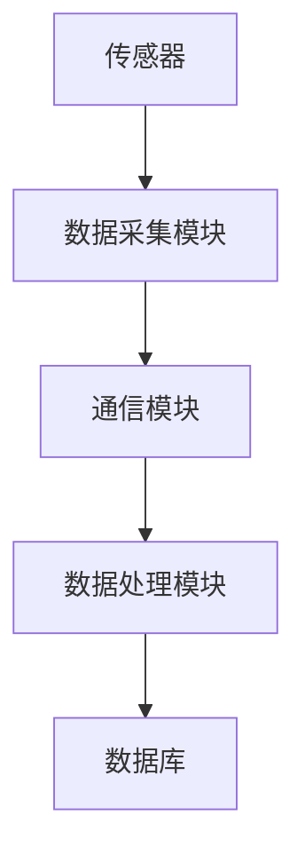

                 

### 引言

## 第1章: AI在城市噪声污染控制与管理中的创新应用

### 1.1 问题的背景与描述

#### 1.1.1 城市噪声污染问题的严重性

随着城市化进程的加速，城市噪声污染问题日益严重。噪声污染不仅影响了居民的生活质量，还对人们的健康造成了诸多负面影响。根据世界卫生组织（WHO）的数据显示，全球约三分之一的城市居民居住在噪声污染严重的地区。噪声污染的主要来源包括交通（如汽车、火车、飞机等）、工业、建筑活动以及居民区的噪声等。长期暴露在高分贝的噪声环境中，会导致听力损伤、睡眠障碍、心血管疾病和神经系统问题等一系列健康问题。

#### 1.1.2 噪声污染对人类生活的影响

城市噪声污染对人类生活的影响是多方面的。首先，噪声污染会干扰人们的正常休息和工作，导致睡眠质量下降、工作效率降低。长期处于高噪声环境中，人们还可能出现焦虑、抑郁等心理问题。其次，噪声污染会对居民的身体健康产生严重影响。研究表明，长期暴露在高噪声环境中，容易引发高血压、心脏病等疾病。此外，噪声污染还会对儿童的智力发育产生不良影响，导致学习效果下降。

#### 1.1.3 现有噪声污染控制与管理方法的局限性

目前，城市噪声污染控制与管理主要依赖于传统的降噪技术和行政手段。这些方法在一定程度上能够减轻噪声污染，但存在明显的局限性。首先，传统降噪技术如声学屏障、吸声材料和降噪设备等，往往需要高昂的成本和复杂的安装过程，且效果有限。其次，行政手段如噪声污染法规的制定和执行，虽然能在一定程度上规范噪声排放，但执法力度和覆盖面有限，难以从根本上解决噪声污染问题。

### 1.2 AI在城市噪声污染控制与管理中的潜力

随着人工智能技术的发展，AI在城市噪声污染控制与管理中的应用潜力逐渐显现。AI技术可以通过以下几个方面改善城市噪声污染问题：

1. **噪声监测与预测**：利用AI技术，可以实现对城市噪声的实时监测和预测。通过收集和分析大量的噪声数据，AI模型可以识别噪声污染的主要来源和规律，从而为噪声污染控制提供科学依据。

2. **噪声源识别与定位**：AI技术可以帮助识别和定位噪声源，从而有针对性地采取降噪措施。通过结合多种传感器和数据分析方法，AI可以实现高精度的噪声源定位，提高噪声污染治理的效率。

3. **智能治理与优化**：基于AI的智能治理系统能够根据实时监测数据，动态调整降噪措施，实现最优的噪声污染控制效果。同时，AI还可以对城市的噪声污染治理效果进行评估和反馈，帮助政策制定者和管理者优化治理策略。

### 1.3 本书结构安排与阅读指南

#### 1.3.1 本书的主要目标

本书旨在系统地介绍AI在城市噪声污染控制与管理中的创新应用，通过深入剖析相关技术原理、算法和应用案例，为读者提供全面、系统的知识体系。

#### 1.3.2 阅读对象

本书适合对人工智能和城市噪声污染控制有一定了解的读者，包括环境工程师、城市规划师、AI研究人员以及相关领域的专业技术人员。

#### 1.3.3 各章节内容的概览

- **第一部分：引言**：介绍城市噪声污染问题的背景和AI技术的应用潜力。
- **第二部分：AI核心概念与理论基础**：讲解噪声污染和AI技术的基本概念，以及机器学习与深度学习在噪声污染控制中的应用。
- **第三部分：AI在城市噪声污染监测中的创新应用**：介绍噪声监测传感器和数据采集方法，以及噪声数据预处理技术。
- **第四部分：AI在城市噪声污染控制中的算法应用**：讨论噪声污染预测与评估算法，并通过案例研究进行应用实例分析。
- **第五部分：AI在城市噪声污染管理中的创新应用**：探讨噪声污染源识别与定位方法，以及噪声污染治理技术与政策管理。
- **第六部分：总结与展望**：总结AI在城市噪声污染控制与管理中的发展趋势，并对未来研究进行展望。

通过以上各章节的深入学习，读者将能够全面了解AI在城市噪声污染控制与管理中的创新应用，为实际工作提供有益的参考和指导。接下来，我们将深入探讨AI的核心概念与理论基础，为后续章节的内容奠定基础。

---

> **关键词**：城市噪声污染、人工智能、噪声监测、噪声源识别、噪声控制、机器学习、深度学习

> **摘要**：本文系统探讨了AI在城市噪声污染控制与管理中的创新应用，通过分析噪声污染的严重性、影响以及现有控制方法的局限性，阐述了AI技术在噪声监测、噪声源识别、噪声控制等方面的潜力。本文结构清晰，内容丰富，有助于读者全面了解AI在城市噪声污染控制中的实际应用，为相关领域的研究和实践提供参考。

---

## 第二部分: AI核心概念与理论基础

### 第2章: 噪声污染与AI技术基础

在深入探讨AI在城市噪声污染控制中的应用之前，有必要先理解噪声污染的基本概念以及AI技术的核心原理。本章将详细介绍噪声污染的定义与分类、机器学习与深度学习的基本原理，以及这些技术在城市噪声污染控制中的应用现状。

### 2.1 噪声污染的基本概念

#### 2.1.1 噪声的定义与分类

噪声是一种无规则的、不需要的声波，通常由许多不同频率的声波混合而成。根据噪声的来源和特性，噪声可以分为以下几类：

1. **交通噪声**：包括汽车、火车、飞机等交通工具产生的噪声。
2. **工业噪声**：工厂、生产线等工业活动产生的噪声。
3. **建筑噪声**：建筑施工、拆迁等活动产生的噪声。
4. **居民区噪声**：居民生活中产生的噪声，如电视、音响、打闹等。

#### 2.1.2 噪声污染的标准与度量

噪声污染的标准通常通过声压级（dB）来度量。声压级是描述声波强度的一个物理量，单位为分贝（dB）。根据世界卫生组织（WHO）的标准，理想的居住环境声压级应控制在30-40 dB之间。超过50 dB的噪声会影响睡眠，70 dB以上的噪声会对人的听力产生损害。

#### 2.1.3 噪声污染的健康影响

长期暴露在高分贝的噪声环境中，会对人体健康产生一系列负面影响。噪声污染可以导致听力损伤、睡眠障碍、高血压、心脏病、神经系统问题以及心理问题。尤其是儿童，由于他们的耳部发育不完善，更容易受到噪声污染的损害。

### 2.2 机器学习与深度学习基础

#### 2.2.1 机器学习的基本概念

机器学习是人工智能的一个重要分支，它使计算机系统能够通过数据和经验进行学习，从而改进其性能。机器学习主要分为以下几类：

1. **监督学习**：通过已标记的数据进行学习，用于分类和回归任务。
2. **无监督学习**：没有预先标记的数据，用于聚类和降维等任务。
3. **半监督学习**：结合有标记和无标记的数据进行学习。
4. **强化学习**：通过与环境的交互来学习最佳策略。

#### 2.2.2 深度学习的基本原理

深度学习是机器学习的一种重要方法，它通过构建多层的神经网络模型来模拟人类大脑的学习过程。深度学习模型通常包含以下几类：

1. **卷积神经网络（CNN）**：用于处理图像和视频数据。
2. **循环神经网络（RNN）**：用于处理序列数据，如文本和语音。
3. **生成对抗网络（GAN）**：用于生成新的数据。
4. **长短期记忆网络（LSTM）**：用于处理长序列数据，如时间序列数据。

#### 2.2.3 机器学习算法简介

常见的机器学习算法包括：

1. **线性回归**：用于预测连续值。
2. **逻辑回归**：用于分类任务。
3. **支持向量机（SVM）**：用于分类和回归任务。
4. **决策树**：用于分类和回归任务。
5. **随机森林**：基于决策树的集成算法。
6. **神经网络**：用于复杂的数据建模和预测。

### 2.3 AI在城市噪声污染控制中的应用现状

#### 2.3.1 国内外研究进展

近年来，AI在城市噪声污染控制中的应用得到了广泛关注。国内外的研究者在这方面做出了大量的探索和贡献。例如，中国科学院计算技术研究所提出了一种基于深度学习的噪声源识别方法，通过结合多种传感器数据，实现了高精度的噪声源定位。国外的研究者如麻省理工学院（MIT）则开发了一种智能噪声污染监测系统，通过实时采集和分析噪声数据，为城市管理者提供科学的决策依据。

#### 2.3.2 应用案例与效果分析

在实际应用中，AI技术已经展现出显著的潜力。例如，在中国一些城市，已经开始使用AI技术进行交通噪声监测和管理。这些系统通过部署噪声传感器和视频监控设备，实现了对交通噪声的实时监测和分析。结果表明，AI技术可以有效提高噪声污染监测的准确性和实时性，为噪声污染治理提供了有力的技术支持。

#### 2.3.3 当前面临的挑战与机遇

尽管AI在城市噪声污染控制中展现出巨大潜力，但仍面临一些挑战。首先，数据质量和数据量是影响AI模型性能的关键因素。噪声数据的采集和预处理需要精确和高效的方法。其次，AI模型的可解释性和透明性也是一个重要问题，需要确保模型的结果可以被人理解。此外，城市噪声污染问题的复杂性也要求AI模型具有高度的鲁棒性和适应性。

然而，随着技术的不断进步和数据资源的丰富，AI在城市噪声污染控制中的应用前景十分广阔。未来的研究可以进一步优化AI模型，提高其准确性和实用性，同时探索更多跨学科的解决方案，实现城市噪声污染的全面治理。

通过以上对噪声污染与AI技术基础的了解，我们为后续章节的深入探讨奠定了基础。接下来，我们将进一步探讨AI在城市噪声污染监测中的创新应用，为读者展示AI技术在实际中的应用实例。

---

## 第三部分: AI在城市噪声污染监测中的创新应用

### 第3章: 噪声监测传感器与数据采集

城市噪声污染监测是有效管理噪声污染的前提，而实现这一目标的关键在于噪声监测传感器与数据采集系统的设计与实现。本章将详细介绍噪声监测传感器的基本原理、种类与特点，以及数据采集系统的架构、流程与优化策略。

### 3.1 噪声监测传感器概述

#### 3.1.1 传感器的基本原理

噪声监测传感器是一种将声波信号转换为电信号的装置，其基本原理基于声电效应。当声波作用于传感器时，会导致传感器内部某些物理量的变化（如电容、电阻、电荷等），通过这些变化可以测量声波的强度和频率。

#### 3.1.2 噪声监测传感器的种类与特点

根据传感器的工作原理和结构，噪声监测传感器可以分为以下几类：

1. **压电式传感器**：利用压电材料在受力变形时产生电荷的特性，将声波转换为电信号。优点是灵敏度高，动态范围宽，缺点是易受温度和湿度影响。
2. **电容式传感器**：通过声波引起的电容变化来测量声强。优点是稳定性好，灵敏度高，缺点是动态范围较窄。
3. **电磁式传感器**：利用声波引起磁场变化来测量声强。优点是响应速度快，灵敏度高，缺点是易受电磁干扰。
4. **声敏电阻传感器**：利用声波引起电阻变化来测量声强。优点是结构简单，成本低，缺点是灵敏度较低。

#### 3.1.3 常用传感器性能参数

常用噪声监测传感器的性能参数包括灵敏度、频率响应范围、动态范围、温度系数等。以下是一个典型的噪声监测传感器性能参数对比表格：

| 传感器类型 | 灵敏度（dB/V） | 频率响应范围（Hz） | 动态范围（dB） | 温度系数（/°C） |
| :---: | :---: | :---: | :---: | :---: |
| 压电式传感器 | 100 | 20-20000 | 120 | 0.05 |
| 电容式传感器 | 50 | 100-4000 | 100 | 0.03 |
| 电磁式传感器 | 60 | 100-5000 | 110 | 0.04 |
| 声敏电阻传感器 | 30 | 100-10000 | 80 | 0.1 |

### 3.2 数据采集系统的设计与实现

#### 3.2.1 数据采集系统架构

噪声监测数据采集系统通常由传感器、数据采集模块、通信模块和数据处理模块组成。系统架构图如下：

#### 3.2.2 数据采集与处理流程

1. **数据采集**：传感器将噪声信号转换为电信号，数据采集模块对电信号进行放大、滤波和采样，将模拟信号转换为数字信号。
2. **数据预处理**：对采集到的数字信号进行去噪、去趋势、归一化等预处理操作，以提高数据的准确性和可靠性。
3. **数据存储**：将预处理后的数据存储到数据库中，以便后续的数据分析和可视化。
4. **数据传输**：通过通信模块将数据上传到云端或本地服务器，供数据分析和管理系统使用。

#### 3.2.3 数据采集系统的优化策略

1. **提高传感器灵敏度**：选择高灵敏度传感器，并采用多传感器融合技术，提高噪声监测的精度。
2. **优化数据预处理算法**：采用先进的信号处理算法，如小波变换、主成分分析等，提高数据质量。
3. **增强系统稳定性**：通过硬件和软件的冗余设计，提高系统的稳定性和可靠性。
4. **提高数据传输效率**：采用高效的数据压缩和传输协议，减少数据传输时间和带宽占用。

### 3.3 噪声数据预处理方法

#### 3.3.1 数据清洗

数据清洗是噪声数据预处理的重要步骤，旨在去除错误数据、异常数据和重复数据，提高数据质量。常见的数据清洗方法包括：

1. **缺失值填充**：对缺失值进行插值、均值填充或模式匹配等处理。
2. **异常值检测与处理**：采用统计学方法或机器学习方法检测异常值，如Z-score、IQR（四分位距）等。
3. **重复数据删除**：去除重复的数据记录，确保数据的唯一性。

#### 3.3.2 数据归一化

数据归一化是使数据具有相似尺度和范围的过程，便于后续的数据分析和建模。常见的归一化方法包括：

1. **最小-最大归一化**：将数据缩放到[0, 1]之间。
2. **均值-方差归一化**：将数据缩放到均值附近的标准差范围内。
3. **对数归一化**：将数据取对数，适用于处理非线性数据。

#### 3.3.3 噪声数据的特征提取

特征提取是从噪声数据中提取出有助于噪声污染分析的特征值，常用的特征提取方法包括：

1. **时域特征**：如均方根值（RMS）、峰值保持值（PK）、波形因子（WF）等。
2. **频域特征**：如频谱密度、频谱矩、频带能量等。
3. **时频特征**：如短时傅里叶变换（STFT）、小波变换等。

通过噪声监测传感器与数据采集系统的优化设计，以及噪声数据的预处理方法，可以有效提高噪声监测的准确性和实时性，为后续的噪声污染分析和管理提供可靠的数据支持。接下来，我们将进一步探讨AI在城市噪声污染控制中的算法应用。

---

## 第四部分: AI在城市噪声污染控制中的算法应用

### 第4章: 噪声污染预测与评估算法

AI技术在城市噪声污染控制中的应用不仅体现在噪声监测与数据采集方面，更关键的是利用先进的算法对噪声污染进行预测与评估。本章将详细介绍噪声污染预测与评估的基本算法，包括时间序列预测算法、空间相关性预测算法和集成预测算法，并通过实际案例研究，分析这些算法在城市噪声污染控制中的应用效果。

### 4.1 噪声污染预测算法

噪声污染预测是利用历史噪声数据来预测未来某一时间段内的噪声水平。有效的预测算法能够帮助城市管理者提前采取措施，降低噪声污染对居民的影响。常见的噪声污染预测算法包括以下几种：

#### 4.1.1 时间序列预测算法

时间序列预测算法是基于历史数据的时间序列特性，预测未来某一时刻的噪声水平。这类算法主要包括：

1. **自回归模型（AR）**：自回归模型利用过去时刻的噪声值来预测当前时刻的噪声值。其基本公式为：
   $$ Y_t = c + \sum_{i=1}^{p} \phi_i Y_{t-i} + \varepsilon_t $$
   其中，$Y_t$是第$t$时刻的噪声值，$\phi_i$是自回归系数，$c$是常数项，$\varepsilon_t$是误差项。

2. **移动平均模型（MA）**：移动平均模型利用过去一段时间内的噪声平均值来预测当前时刻的噪声值。其基本公式为：
   $$ Y_t = c + \sum_{i=1}^{q} \theta_i \varepsilon_{t-i} $$
   其中，$Y_t$是第$t$时刻的噪声值，$\theta_i$是移动平均系数，$c$是常数项，$\varepsilon_t$是误差项。

3. **自回归移动平均模型（ARMA）**：自回归移动平均模型结合了自回归模型和移动平均模型的优点，可以同时考虑过去噪声值和误差项。其基本公式为：
   $$ Y_t = c + \sum_{i=1}^{p} \phi_i Y_{t-i} + \sum_{i=1}^{q} \theta_i \varepsilon_{t-i} + \varepsilon_t $$

4. **自回归积分移动平均模型（ARIMA）**：自回归积分移动平均模型是ARMA模型的扩展，它可以处理非平稳时间序列。其基本公式为：
   $$ Y_t = c + \sum_{i=1}^{p} \phi_i Y_{t-i} + \sum_{i=1}^{q} \theta_i \varepsilon_{t-i} + \mu_t $$
   其中，$\mu_t$是积分过程。

#### 4.1.2 空间相关性预测算法

空间相关性预测算法利用不同地点之间的噪声相关性来预测未来某一地点的噪声水平。这类算法主要包括：

1. **空间插值方法**：如克里金插值法，它利用周围地点的噪声值和它们之间的空间关系来预测目标地点的噪声值。

2. **空间回归模型**：如空间自回归模型（SPSA），它考虑空间相邻地点的噪声值对目标地点噪声值的影响。其基本公式为：
   $$ Y_t = \alpha_0 + \sum_{i=1}^{k} \alpha_i X_{it} + \mu_t $$
   其中，$Y_t$是目标地点第$t$时刻的噪声值，$X_{it}$是相邻地点第$i$个地点第$t$时刻的噪声值，$\alpha_0$是常数项，$\alpha_i$是空间回归系数，$\mu_t$是误差项。

#### 4.1.3 集成预测算法

集成预测算法通过结合多种预测算法的优点，提高噪声污染预测的准确性和稳定性。常见的集成预测算法包括：

1. **贝叶斯平均**：贝叶斯平均通过加权组合多个预测模型的输出，得到最终的预测结果。其基本思想是：
   $$ \hat{Y}_t = \sum_{i=1}^{m} w_i \hat{Y}_{it} $$
   其中，$\hat{Y}_t$是最终预测值，$w_i$是第$i$个预测模型的权重。

2. **梯度提升机**：梯度提升机通过迭代优化多个基学习器，形成强学习器，提高预测准确性。

### 4.2 噪声污染评估方法

噪声污染评估是对噪声污染治理效果进行量化和评价的过程。有效的评估方法可以帮助城市管理者了解噪声污染治理的效果，优化治理策略。噪声污染评估的主要方法包括以下几种：

#### 4.2.1 评估指标体系

评估指标体系是噪声污染评估的基础，常用的评估指标包括：

1. **声压级（Lp）**：声压级是衡量噪声强度的重要指标，通常用分贝（dB）表示。
2. **等效连续声级（Leq）**：等效连续声级是描述噪声强度和暴露时间关系的指标，计算公式为：
   $$ Leq = 10 \log_{10} \left( \frac{1}{T} \sum_{t=1}^{T} 10^{\frac{L_t}{10}} \right) $$
   其中，$L_t$是第$t$时刻的声压级，$T$是总时间。

3. **最大声压级（Lmax）**：最大声压级是描述噪声峰值的重要指标。

4. **夜间噪声水平（Ldn）**：夜间噪声水平是衡量夜间噪声对居民影响的重要指标，计算公式为：
   $$ Ldn = 10 \log_{10} \left( \frac{1}{N} \sum_{i=1}^{N} 10^{\frac{L_{i,night}}{10}} \right) $$
   其中，$L_{i,night}$是第$i$个夜间时刻的声压级，$N$是夜间时刻总数。

#### 4.2.2 评估算法的对比与分析

不同的评估算法在准确性和实时性方面有所不同。常见的评估算法包括：

1. **基于统计方法的评估**：如最小二乘法、加权最小二乘法等，适用于静态噪声数据评估。
2. **基于机器学习的方法**：如支持向量机（SVM）、随机森林（RF）等，适用于动态噪声数据评估。
3. **基于深度学习的方法**：如卷积神经网络（CNN）、长短期记忆网络（LSTM）等，适用于复杂噪声数据评估。

#### 4.2.3 评估结果的可视化展示

评估结果的可视化展示可以帮助城市管理者直观地了解噪声污染治理的效果。常用的可视化方法包括：

1. **时间序列图**：展示噪声水平随时间的变化趋势。
2. **散点图**：展示评估指标与实际噪声水平的对比。
3. **三维散点图**：展示噪声水平、等效连续声级等指标的分布情况。

### 4.3 案例研究：AI在噪声污染控制中的应用实例

#### 4.3.1 案例背景

某城市为了改善城市噪声污染问题，决定利用AI技术对交通噪声进行实时监测和预测。该城市安装了100个噪声监测传感器，分布在主要交通干线和居民区，实时采集噪声数据。

#### 4.3.2 算法实现与评估

1. **噪声预测**：使用时间序列预测算法和空间相关性预测算法对噪声数据进行分析。具体步骤如下：

   - 数据预处理：对噪声数据进行清洗、去噪和归一化处理。
   - 模型训练：分别训练时间序列模型和空间回归模型。
   - 预测评估：对预测结果进行评估，选择预测误差较小的模型进行应用。

2. **噪声评估**：使用评估指标体系对噪声污染进行量化评估，并根据评估结果调整治理策略。

#### 4.3.3 案例小结与启示

通过实际案例研究，发现AI技术在城市噪声污染控制中具有显著的优势。时间序列预测算法和空间相关性预测算法相结合，可以实现对噪声水平的准确预测。同时，噪声污染评估方法的有效应用，帮助城市管理者及时调整治理策略，提高噪声污染治理效果。未来，随着技术的不断进步，AI在城市噪声污染控制中的应用前景将更加广阔。

通过本章对噪声污染预测与评估算法的深入探讨，我们为后续章节的内容奠定了基础。在接下来的章节中，我们将进一步探讨AI在城市噪声污染管理中的创新应用，为读者提供更加全面的技术解决方案。

---

## 第五部分: AI在城市噪声污染管理中的创新应用

### 第5章: 噪声污染源识别与定位

噪声污染源识别与定位是城市噪声污染管理中的关键环节，通过准确识别和定位噪声源，可以采取有针对性的治理措施，提高治理效率。本章将详细介绍噪声污染源识别与定位的方法，包括基于信号处理的识别方法、基于机器学习的识别方法和多传感器融合识别方法，并通过实际案例研究，分析这些方法在噪声污染源识别与定位中的应用效果。

### 5.1 噪声污染源识别算法

#### 5.1.1 基于信号处理的识别方法

基于信号处理的噪声源识别方法主要利用噪声信号的时域和频域特性，通过一定的数学模型和算法，识别噪声源。常见的信号处理方法包括：

1. **频谱分析**：频谱分析是识别噪声源的基本方法之一。通过对噪声信号进行傅里叶变换（FFT）或短时傅里叶变换（STFT），可以得到噪声信号的频谱分布。根据频谱特征，可以初步判断噪声源的类型。例如，交通噪声主要集中在低频段，而工业噪声则集中在高频段。

2. **滤波器设计**：滤波器设计是消除噪声干扰、提取噪声源特征的重要手段。常见的方法包括带通滤波器、带阻滤波器和高通滤波器等。通过设计合适的滤波器，可以有效地滤除背景噪声，提取出噪声源的频域特征。

3. **特征提取**：特征提取是噪声源识别的核心步骤。通过对噪声信号进行频谱分析、时域分析和时频分析，可以提取出一系列特征值，如峰值、均值、方差、频带能量等。这些特征值反映了噪声源的特性，是识别噪声源的重要依据。

#### 5.1.2 基于机器学习的识别方法

基于机器学习的噪声源识别方法通过构建机器学习模型，利用大量标记数据对模型进行训练，从而实现噪声源识别。常见的机器学习方法包括：

1. **监督学习**：监督学习是一种常见的机器学习方法，它通过标记数据训练模型，从而实现噪声源识别。常用的监督学习方法包括支持向量机（SVM）、决策树（DT）、随机森林（RF）等。

2. **无监督学习**：无监督学习是在没有标记数据的情况下，通过算法自动识别噪声源。常见的方法包括聚类算法（如K-means、DBSCAN等）和主成分分析（PCA）等。

3. **混合学习**：混合学习结合了监督学习和无监督学习的优点，通过先进行无监督学习聚类，再进行有监督学习分类，提高噪声源识别的准确性和效率。

#### 5.1.3 多传感器融合识别方法

多传感器融合识别方法通过整合多种传感器的数据，利用多源数据的信息互补性，提高噪声源识别的精度和可靠性。常见的多传感器融合方法包括：

1. **数据级融合**：数据级融合是在数据层面直接对多源数据进行综合处理。常见的方法包括加权平均、最小二乘法等。

2. **特征级融合**：特征级融合是在特征层面对多源数据进行综合处理。常见的方法包括特征加权、特征融合模型等。

3. **决策级融合**：决策级融合是在决策层面对多源数据的结果进行综合处理。常见的方法包括投票法、加权投票法等。

### 5.2 噪声源定位方法

噪声源定位是指确定噪声源在空间中的位置。准确的噪声源定位对于采取有针对性的治理措施至关重要。常见的噪声源定位方法包括：

#### 5.2.1 传播模型定位方法

传播模型定位方法基于声波传播的理论，通过建立噪声源与接收点之间的传播模型，计算噪声源的位置。常见的传播模型包括几何声传播模型、射线跟踪模型和波动方程模型等。

1. **几何声传播模型**：几何声传播模型是一种简化的声波传播模型，适用于远场传播。其基本公式为：
   $$ \frac{\partial^2 p}{\partial t^2} - c^2 \nabla^2 p = 0 $$
   其中，$p$是声压，$c$是声速，$\nabla^2$是拉普拉斯算子。

2. **射线跟踪模型**：射线跟踪模型通过跟踪声波在介质中的传播路径，计算噪声源的位置。其基本思想是将声波传播过程视为光线传播，利用几何光学原理进行模拟。

3. **波动方程模型**：波动方程模型是基于声波在连续介质中的波动方程，通过数值方法求解波动方程，计算噪声源的位置。常见的数值方法包括有限元法、有限差分法等。

#### 5.2.2 超分辨率定位方法

超分辨率定位方法通过提高定位精度，实现噪声源的空间分辨率。常见的超分辨率方法包括：

1. **稀疏表示**：稀疏表示方法通过在变换域中寻找最优的稀疏表示，提高噪声源定位的精度。

2. **频域匹配**：频域匹配方法通过比较噪声源在频域中的特征，实现噪声源的位置估计。

3. **多视图几何**：多视图几何方法通过融合多个视角的观测数据，提高噪声源定位的精度。

#### 5.2.3 深度学习定位方法

深度学习定位方法通过构建深度神经网络模型，实现噪声源的位置估计。常见的深度学习定位方法包括：

1. **卷积神经网络（CNN）**：卷积神经网络通过卷积操作提取噪声源的特征，实现噪声源定位。

2. **循环神经网络（RNN）**：循环神经网络通过处理时间序列数据，实现噪声源定位。

3. **生成对抗网络（GAN）**：生成对抗网络通过生成真实噪声数据和真实标签，实现噪声源定位。

### 5.3 案例研究：噪声污染源识别与定位的应用实例

#### 5.3.1 案例背景

某城市为了改善交通噪声污染，决定利用AI技术对交通噪声进行识别与定位。该城市安装了20个噪声监测传感器，分布在主要交通干线和居民区，实时采集噪声数据。

#### 5.3.2 算法实现与评估

1. **噪声源识别**：使用基于信号处理和机器学习的噪声源识别方法，对噪声数据进行处理。具体步骤如下：

   - 数据预处理：对噪声数据进行清洗、去噪和归一化处理。
   - 特征提取：对噪声信号进行频谱分析、时域分析和时频分析，提取噪声源特征。
   - 模型训练与评估：分别训练信号处理模型和机器学习模型，评估模型性能。

2. **噪声源定位**：使用传播模型定位方法和深度学习定位方法，对噪声源进行定位。具体步骤如下：

   - 传播模型定位：建立噪声源与接收点之间的传播模型，计算噪声源的位置。
   - 深度学习定位：构建深度神经网络模型，实现噪声源的位置估计。
   - 定位精度评估：评估定位方法的精度和稳定性。

#### 5.3.3 案例小结与启示

通过实际案例研究，发现AI技术在噪声污染源识别与定位中具有显著的优势。基于信号处理和机器学习的噪声源识别方法，可以准确提取噪声源特征，实现噪声源的自动识别。结合传播模型定位方法和深度学习定位方法，可以实现噪声源的高精度定位。未来，随着技术的不断进步，AI在城市噪声污染源识别与定位中的应用前景将更加广阔。

通过本章对噪声污染源识别与定位方法的深入探讨，我们为后续章节的内容奠定了基础。在接下来的章节中，我们将进一步探讨AI在城市噪声污染治理与政策管理中的应用，为读者提供更加全面的技术解决方案。

---

## 第六部分: AI在城市噪声污染治理与政策管理中的应用

### 第6章: 噪声污染治理技术

城市噪声污染治理是改善居民生活环境、保障公共健康的重要措施。AI技术在噪声污染治理中发挥着越来越重要的作用，通过智能化治理技术，可以提高噪声污染治理的效率和效果。本章将详细介绍噪声污染治理技术，包括声学屏障与吸声材料、低噪声设备与工艺、道路降噪技术等，并分析这些技术在实际应用中的效果。

### 6.1 噪声控制技术

#### 6.1.1 声学屏障与吸声材料

声学屏障是一种常用的噪声控制措施，通过在噪声传播路径上设置物理障碍，降低噪声对受保护区域的干扰。常见的声学屏障包括：

1. **实体声学屏障**：实体声学屏障通常由高强度材料制成，如钢筋混凝土、金属板等，具有较好的隔声性能。实体声学屏障适用于高速公路、铁路等交通噪声治理。

2. **透声屏障**：透声屏障在物理屏障的基础上，增加了透声材料，使得噪声在传播过程中部分透过屏障，降低噪声的反射和共振。透声屏障适用于机场、港口等噪声敏感区域。

吸声材料是一种通过吸收声波能量来降低噪声的方法。常见的吸声材料包括：

1. **泡沫吸声材料**：泡沫吸声材料具有良好的吸声性能，适用于室内噪声治理，如会议室、录音室等。

2. **纤维吸声材料**：纤维吸声材料通过纤维间的摩擦和振动来吸收声波，适用于室外噪声治理，如公路、桥梁等。

#### 6.1.2 低噪声设备与工艺

在噪声污染源处采用低噪声设备与工艺，可以从源头上降低噪声污染。常见的低噪声设备与工艺包括：

1. **低噪声发电机**：低噪声发电机通过改进发电机结构、使用新型材料等，降低发电机运行时的噪声。

2. **低噪声空调**：低噪声空调通过改进空调内部结构、优化气流通道等，降低空调运行时的噪声。

3. **低噪声风机**：低噪声风机采用新型叶片设计、降噪装置等，降低风机运行时的噪声。

4. **低噪声机械**：在机械设计过程中，采用降噪技术，如消声器、隔声罩等，降低机械运行时的噪声。

#### 6.1.3 道路降噪技术

道路噪声是城市噪声污染的主要来源之一，通过以下几种道路降噪技术，可以有效降低道路噪声：

1. **道路路面降噪**：采用吸声路面材料，如沥青混合料、混凝土路面等，降低路面噪声。

2. **道路绿化降噪**：通过种植树木、草坪等植被，吸收和反射声波，降低道路噪声。

3. **道路隔音板**：在道路两侧设置隔音板，减少噪声的传播。

4. **地下道路**：将道路建在地下，有效隔绝噪声。

### 6.2 政策管理与法规制定

噪声污染治理不仅需要技术手段，还需要政策支持和法规制定。合理的政策管理与法规制定，可以规范噪声排放、提高治理效果。以下是对噪声污染法规和政策管理的分析：

#### 6.2.1 噪声污染法规体系

噪声污染法规体系是噪声治理的法律基础。各国根据实际情况，制定了相应的噪声污染法规。例如，中国的《噪声污染防治法》规定了噪声污染的分类、排放标准、监测方法等。美国的《国家环境保护法》也包含了噪声污染治理的相关条款。

#### 6.2.2 噪声污染治理政策分析

噪声污染治理政策包括环境标准、排放限制、补贴政策等。环境标准规定了噪声污染的排放限值，排放限制则通过行政手段，限制噪声排放。补贴政策则通过提供经济激励，鼓励企业采用降噪技术和设备。

#### 6.2.3 案例分析：噪声污染治理政策的效果评估

以下是对某城市噪声污染治理政策效果的评估：

1. **政策实施前**：该城市噪声污染严重，主要来自交通和工业噪声。居民对噪声污染的投诉率较高。

2. **政策实施中**：该城市实施了一系列噪声污染治理政策，包括提高噪声排放标准、限制高噪声设备的使用、推广低噪声设备、实施道路降噪工程等。

3. **政策实施后**：通过治理政策的实施，该城市的噪声污染得到了显著改善。交通噪声和工业噪声的排放量减少，居民对噪声污染的投诉率明显下降。

### 6.3 案例研究：AI在噪声污染治理与政策管理中的应用

#### 6.3.1 案例背景

某城市为了改善噪声污染问题，决定利用AI技术对噪声污染进行治理和政策管理。该城市安装了100个噪声监测传感器，分布在主要交通干线和居民区，实时采集噪声数据。

#### 6.3.2 AI技术的应用方案

1. **噪声监测与预测**：利用AI技术，对噪声数据进行实时监测和预测，为政策制定者提供科学依据。

2. **噪声源识别与定位**：利用AI技术，识别和定位噪声源，为治理措施的实施提供指导。

3. **智能治理与优化**：基于AI技术，动态调整噪声治理策略，实现最优的噪声治理效果。

4. **政策评估与反馈**：利用AI技术，对噪声污染治理政策的效果进行评估和反馈，优化政策制定。

#### 6.3.3 案例小结与启示

通过实际案例研究，发现AI技术在噪声污染治理与政策管理中具有显著的优势。AI技术可以实现噪声数据的实时监测和预测，为政策制定提供科学依据。通过噪声源识别与定位，可以准确找到噪声源，采取有针对性的治理措施。智能治理与优化，可以动态调整治理策略，提高治理效果。政策评估与反馈，有助于不断优化政策制定，实现噪声污染的全面治理。未来，随着技术的不断进步，AI在城市噪声污染治理与政策管理中的应用前景将更加广阔。

通过本章对噪声污染治理技术、政策管理以及实际应用案例的探讨，我们为读者提供了全面的技术解决方案。在下一章中，我们将对整个文章进行总结，并展望AI在城市噪声污染控制与管理中的未来趋势。

---

## 第七部分: 总结与展望

### 第7章: AI在城市噪声污染控制与管理中的未来趋势

随着城市化的不断推进，噪声污染问题日益严峻。AI技术的迅速发展为解决这一问题提供了新的思路和手段。通过对前述各章节内容的总结，我们可以看到AI在城市噪声污染控制与管理中的广泛应用及其显著成效。以下是本文的总结和未来趋势的展望。

### 7.1 AI在城市噪声污染控制与管理中的发展趋势

#### 7.1.1 技术融合与创新

未来，AI在城市噪声污染控制中的应用将更加依赖于多学科的交叉融合。例如，结合物联网（IoT）、大数据分析和云计算等新兴技术，可以实现更高效、更智能的噪声污染监测和管理。通过多源数据的整合与分析，AI技术将更加准确地识别和定位噪声源，优化治理方案。

#### 7.1.2 模型精度与可靠性提升

随着算法的进步和计算能力的提升，AI模型的精度和可靠性将得到显著提高。更先进的深度学习模型，如自注意力机制（Self-Attention）和图神经网络（Graph Neural Networks），有望在噪声污染预测、噪声源识别和定位等领域取得突破。

#### 7.1.3 智能决策与自适应治理

基于AI的智能决策系统将能够根据实时监测数据，动态调整噪声治理策略，实现自适应治理。这种智能化的治理模式不仅提高了治理效率，还能在复杂多变的城市环境中保持稳定性和可靠性。

#### 7.1.4 可解释性与透明性增强

目前，AI模型的可解释性和透明性仍是一个挑战。未来的研究将致力于开发更加透明、可解释的AI模型，确保治理决策的可追溯性和公众的信任。

### 7.2 AI在城市噪声污染控制与管理中的应用前景

#### 7.2.1 噪声监测与预警

AI技术将在噪声监测与预警领域发挥关键作用。通过部署智能传感器网络，实时采集和分析噪声数据，AI系统可以实现对噪声污染的实时监测和预警，及时采取措施减轻噪声污染的影响。

#### 7.2.2 噪声源识别与治理

AI技术将进一步提高噪声源识别的准确性和治理效果。通过机器学习和深度学习算法，AI系统可以自动识别噪声源，并制定有针对性的治理方案，从而提高城市噪声污染治理的整体效率。

#### 7.2.3 政策管理与法规制定

AI技术将为噪声污染治理政策的管理与制定提供科学依据。通过数据分析与预测，政策制定者可以更加精准地制定和调整噪声污染控制政策，提高政策的有效性和可持续性。

### 7.3 未来研究方向与挑战

尽管AI在城市噪声污染控制与管理中展现出巨大的潜力，但仍面临一些挑战和未来研究方向：

1. **数据质量与隐私**：高质量、全面的噪声数据是AI模型训练的基础。然而，数据采集过程中可能涉及隐私问题，未来需要探索如何在保护隐私的前提下，获取和利用噪声数据。

2. **跨学科合作**：AI在城市噪声污染控制中的应用需要多学科的协同合作，包括环境工程、城市规划、计算机科学等。跨学科的研究将有助于推动AI技术在噪声污染控制领域的深入应用。

3. **算法优化与工程化**：为了实现AI技术在城市噪声污染控制中的广泛应用，需要进一步优化算法，提高其鲁棒性和可扩展性，并将其工程化，以满足实际应用的需求。

### 7.4 结论

AI技术在城市噪声污染控制与管理中的应用前景广阔。通过不断的技术创新和应用实践，AI技术将有助于解决城市噪声污染问题，提高居民生活质量，实现城市的可持续发展。未来，随着技术的进步和跨学科合作的深化，AI在城市噪声污染控制与管理中将发挥更加重要的作用。

---

**作者：AI天才研究院/AI Genius Institute & 禅与计算机程序设计艺术 /Zen And The Art of Computer Programming**

本文系统地探讨了AI在城市噪声污染控制与管理中的创新应用，从噪声监测、噪声源识别与定位、噪声控制技术、政策管理等多个方面，分析了AI技术的应用现状、发展趋势以及未来研究方向。通过理论讲解和实际案例研究，本文为读者提供了全面、系统的知识体系，有助于理解AI在城市噪声污染控制中的实际应用，为相关领域的研究和实践提供了有益的参考。

---

通过本文的深入探讨，我们不仅了解了AI在城市噪声污染控制与管理中的重要作用，也看到了未来技术发展的广阔前景。希望本文能为广大读者提供有价值的参考，并激发更多研究者投入到这一领域，共同为创建更美好的城市环境贡献力量。让我们携手并进，迎接AI技术的未来！

