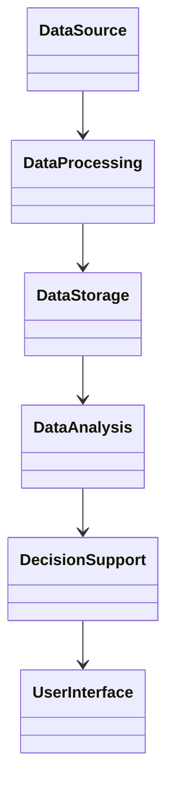
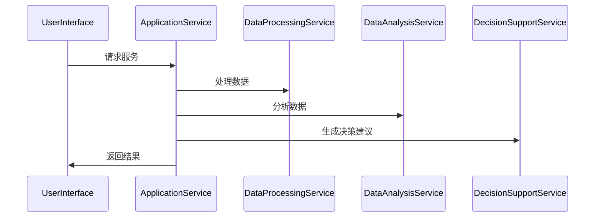
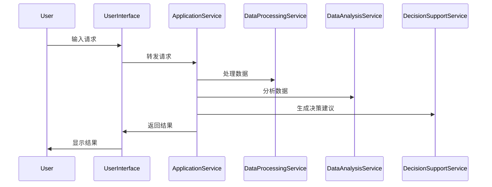

                 

### 引言

AI在复杂决策支持系统中的角色定位

> 关键词：人工智能，决策支持系统，复杂系统，算法，机器学习，神经网络，数据分析，系统设计，架构，实施，挑战，伦理，未来趋势

**摘要**：

本文旨在深入探讨人工智能（AI）在复杂决策支持系统中的角色定位。首先，我们将介绍AI和决策支持系统的基本概念及其重要性。接着，通过案例研究，分析AI在不同行业中的应用。然后，我们将讨论AI在决策支持系统中的设计、实施和面临的挑战，并探讨其伦理影响。最后，文章将展望AI在决策支持系统中的未来趋势，为读者提供有价值的见解和指导。

----------------------------------------------------------------

# 第一部分: 引言

## 第1章: 书籍概述

### 1.1 问题背景与重要性

在当今快速发展的科技时代，信息量的爆炸性增长和复杂性的提升对决策者提出了更高的要求。传统的决策支持系统（DSS）虽然在一定程度上提高了决策效率，但在面对高度复杂、动态变化的环境时，往往显得力不从心。此时，人工智能（AI）技术的引入为复杂决策支持系统带来了新的可能性。

### 1.2 问题描述与目标

本文将探讨AI在复杂决策支持系统中的角色定位，具体问题描述如下：

1. **理解复杂决策环境的本质**：识别和分析复杂决策支持系统中涉及的关键因素，理解这些因素如何相互作用和影响决策过程。
2. **评估AI技术的适用性**：分析不同AI技术在复杂决策支持系统中的应用潜力，评估其在处理复杂性和不确定性方面的有效性。
3. **设计高效决策支持系统**：结合AI技术和决策理论，设计出既符合实际需求又具备高效性能的复杂决策支持系统。

我们的目标是通过本文的探讨，为决策者提供一套科学的、实用的AI在复杂决策支持系统中的应用指南。

### 1.3 边界与外延

本文的研究边界主要涉及以下方面：

1. **技术范围**：聚焦于机器学习、神经网络、数据挖掘等AI技术，探讨其在复杂决策支持系统中的应用。
2. **应用领域**：涵盖金融、医疗、物流等多个行业，分析AI技术在其中的实际应用案例。
3. **研究方法**：采用案例分析、系统设计、算法原理讲解等多种方法，全面阐述AI在复杂决策支持系统中的角色定位。

### 1.4 概念结构与核心要素组成

为了更好地理解本文的内容，以下是本文的核心概念结构及其组成要素：

1. **AI技术**：包括机器学习、神经网络、数据挖掘等，每种技术都有其特定的原理和适用场景。
2. **决策支持系统**：由数据收集、处理、分析、决策建议等模块组成，旨在辅助决策者做出明智的决策。
3. **复杂系统**：指由多个相互作用的元素构成，具有高度复杂性和不确定性的系统。
4. **应用案例**：通过具体的行业案例，展示AI在复杂决策支持系统中的实际应用效果。
5. **系统设计**：从架构设计、算法实现到性能优化，全面介绍复杂决策支持系统的构建过程。

通过上述章节的逐步分析，我们将深入探讨AI在复杂决策支持系统中的角色定位，为读者提供有价值的理论和实践参考。

----------------------------------------------------------------

## 第2章: AI与决策支持系统基础

### 2.1 AI概述

人工智能（AI）是指由人制造出来的系统能够表现出与人类智能相似的智能行为，能够完成特定任务的学习、推理、规划、感知和理解。AI的发展历程可以追溯到20世纪50年代，当时基于符号推理和规则系统的早期AI尝试取得了一些初步的成功。然而，随着计算能力的限制和缺乏有效的数据来源，AI的发展在20世纪80年代遭遇了“AI寒冬”。进入21世纪，随着计算机硬件性能的提升和大数据、云计算等新技术的应用，AI迎来了新的发展机遇，特别是深度学习和强化学习等技术的突破，使得AI在图像识别、自然语言处理、自动驾驶等多个领域取得了显著的进展。

AI的核心技术包括：

1. **机器学习**：通过算法从数据中自动学习和改进，以实现特定任务。机器学习分为监督学习、无监督学习和半监督学习。
2. **深度学习**：基于人工神经网络的一种机器学习方法，能够通过多层神经元的堆叠自动学习数据中的复杂模式。
3. **自然语言处理**（NLP）：使计算机能够理解、解释和生成人类语言，包括语音识别、文本分析、机器翻译等任务。
4. **计算机视觉**：让计算机能够从图像或视频中提取信息，包括图像分类、目标检测、图像生成等任务。
5. **强化学习**：通过与环境互动来学习如何完成特定任务，适用于需要长期规划和策略优化的复杂系统。

### 2.2 决策支持系统

决策支持系统（DSS）是一种基于信息技术和数据分析的软件系统，旨在辅助决策者做出更加科学和合理的决策。DSS的主要功能包括数据收集、数据预处理、数据分析、模型构建、决策建议等环节，通过提供全面、准确、及时的信息支持，帮助决策者更好地理解问题、分析数据、生成决策方案并进行评估。

DSS的发展历程可以概括为以下几个阶段：

1. **早期DSS**：主要依赖于电子表格和简单的统计分析工具，以辅助简单的决策问题。
2. **传统DSS**：引入了模型构建和优化技术，如线性规划、整数规划等，以解决更为复杂的决策问题。
3. **现代DSS**：结合了人工智能、大数据、云计算等新技术，能够处理大规模数据、提供实时决策支持。

DSS的关键组成部分包括：

1. **用户界面**：提供用户与系统交互的界面，使得决策者能够方便地输入数据、查看结果和生成报告。
2. **数据仓库**：存储和管理来自各种数据源的大量数据，为DSS提供数据支持。
3. **模型库**：包含了各种决策模型和算法，用于分析和优化决策问题。
4. **知识库**：存储领域专家的知识和经验，为DSS提供额外的决策支持。
5. **分析工具**：用于对数据进行分析和处理的软件工具，包括数据挖掘、机器学习算法等。

### 2.3 AI在决策支持系统中的应用

AI技术在决策支持系统中有着广泛的应用，以下是几个关键领域：

1. **数据预处理**：利用机器学习和深度学习技术对原始数据进行清洗、去噪和特征提取，提高数据质量，为后续分析打下基础。
2. **模型构建**：通过机器学习算法自动构建预测模型和优化模型，提高决策的准确性和效率。
3. **自然语言处理**：用于处理非结构化数据，如文本、语音等，将它们转换为结构化数据，为决策提供信息支持。
4. **计算机视觉**：用于处理图像和视频数据，如监控安防、图像识别等，为决策提供实时监控和预警。
5. **智能推荐**：通过分析用户行为数据，为决策者提供个性化的决策建议，如推荐产品、投资策略等。

总之，AI技术的引入极大地提升了决策支持系统的能力和效率，使得决策者能够在更为复杂和动态的环境中做出更加科学和合理的决策。接下来，我们将通过具体案例深入探讨AI在复杂决策支持系统中的实际应用。

----------------------------------------------------------------

## 第3章: AI技术在决策支持系统中的应用

### 3.1 机器学习

机器学习是AI技术的核心组成部分，它通过从数据中学习规律和模式，实现自动化决策。在决策支持系统中，机器学习技术的应用主要包括以下几个方面：

1. **预测分析**：通过历史数据建立预测模型，对未来的趋势和变化进行预测，帮助决策者提前做好准备。
2. **分类和聚类**：对大量数据进行分类和聚类，识别数据中的模式和行为，为决策提供依据。
3. **优化决策**：利用优化算法，如线性规划、整数规划等，自动搜索最佳决策方案。

**案例**：在金融领域，机器学习技术被广泛应用于风险评估、市场预测和投资组合优化。例如，银行可以通过机器学习模型预测客户的信用风险，从而制定更加精准的贷款策略。基金公司则可以利用机器学习模型分析市场趋势，优化投资组合，提高收益。

### 3.2 神经网络

神经网络是一种模拟人脑神经元连接方式的计算模型，具有强大的学习和泛化能力。在决策支持系统中，神经网络的应用主要包括：

1. **图像识别**：通过卷积神经网络（CNN）对图像进行分类和识别，如人脸识别、医疗影像分析等。
2. **自然语言处理**：通过循环神经网络（RNN）和长短期记忆网络（LSTM）对文本数据进行处理和分析，如情感分析、语言翻译等。
3. **时序预测**：通过时序神经网络（TSN）对时间序列数据进行预测，如股票市场预测、气象预测等。

**案例**：在医疗领域，神经网络被广泛应用于疾病诊断和预测。例如，通过深度学习模型对患者的电子健康记录进行分析，可以提前预测患者可能出现的疾病风险，帮助医生制定更加个性化的治疗方案。在物流领域，神经网络模型可以预测货物的运输时间，优化运输路线，提高物流效率。

### 3.3 数据挖掘

数据挖掘是一种从大量数据中挖掘出有价值信息的过程，它通过统计方法、机器学习和人工智能技术实现。在决策支持系统中，数据挖掘技术主要用于以下几个方面：

1. **关联规则挖掘**：通过挖掘数据中的关联关系，发现不同变量之间的联系，为决策提供参考。
2. **聚类分析**：通过将数据分为不同的集群，识别数据中的异质性和模式，为决策提供支持。
3. **分类和回归分析**：通过建立分类和回归模型，对数据进行预测和分类，辅助决策者做出正确的决策。

**案例**：在零售行业，数据挖掘技术被广泛应用于客户行为分析、需求预测和库存管理。例如，通过分析客户购买历史数据，可以发现客户的偏好和需求，从而制定更加精准的营销策略。在供应链管理中，数据挖掘技术可以分析库存数据，预测市场需求，优化库存水平，减少库存成本。

### 3.4 机器学习与其他技术的融合

在复杂决策支持系统中，单一技术的应用往往难以满足需求。为了提高决策的准确性和效率，机器学习与其他AI技术（如神经网络、数据挖掘等）的融合成为一种趋势。

1. **多模态学习**：通过结合不同类型的数据（如图像、文本、声音等），实现更全面的信息融合和分析。
2. **增强学习**：结合环境反馈和机器学习，实现自主学习和决策，适用于需要动态调整的决策场景。
3. **迁移学习**：通过在不同任务和数据集之间共享知识，提高模型的泛化能力和效率。

**案例**：在自动驾驶领域，多模态学习技术被广泛应用于环境感知和决策。通过结合图像、激光雷达和GPS数据，自动驾驶系统能够更准确地感知周围环境，做出实时决策。在金融风控领域，增强学习技术被用于动态调整风险控制策略，提高风险预测的准确性。

总之，AI技术在决策支持系统中的应用正在不断扩展和深化，通过融合多种技术手段，决策支持系统在应对复杂性和不确定性方面表现出越来越强的能力。未来，随着AI技术的进一步发展，决策支持系统将更加智能化和高效化，为决策者提供更加有力的支持。

----------------------------------------------------------------

## 第4章: 案例研究与分析

### 4.1 金融行业：智能投顾

在金融行业，人工智能已经广泛应用于投资决策、风险管理、客户服务等领域。其中，智能投顾（Robo-Advisor）是AI在决策支持系统中的一个典型应用案例。智能投顾通过分析用户的财务状况、投资偏好和风险承受能力，提供个性化的投资建议。

**案例研究**：

以知名智能投顾平台Wealthfront为例，其使用机器学习算法和大数据分析技术，根据用户的财务数据、投资目标和市场走势，生成个性化的投资组合建议。具体步骤如下：

1. **数据收集**：收集用户的财务数据，包括收入、支出、资产和负债情况。
2. **数据分析**：使用机器学习算法，分析用户的投资偏好和风险承受能力。
3. **投资组合构建**：根据用户的财务状况和风险偏好，构建最优的投资组合。
4. **实时调整**：根据市场走势和用户行为变化，动态调整投资组合。

**分析**：

智能投顾的应用显著提高了投资决策的效率和准确性。通过机器学习和大数据分析，智能投顾能够处理海量的数据，快速生成投资建议，减少了人为决策的时间和成本。此外，智能投顾能够根据市场变化和用户行为动态调整投资策略，提高了投资组合的灵活性和适应性。

### 4.2 医疗领域：疾病预测与诊断

在医疗领域，人工智能被广泛应用于疾病预测、诊断和治疗建议。通过大数据和机器学习技术，AI能够分析患者的健康数据，提供个性化的诊断和治疗建议。

**案例研究**：

以IBM的Watson for Oncology为例，该系统通过分析海量的医学文献和临床数据，为医生提供精准的诊断和治疗建议。具体步骤如下：

1. **数据收集**：收集患者的医疗记录、诊断报告、治疗方案等数据。
2. **数据预处理**：对数据进行清洗、去噪和标准化处理，为后续分析打下基础。
3. **模型训练**：使用机器学习算法，构建疾病预测和诊断模型。
4. **诊断建议**：根据患者的数据，生成个性化的诊断和治疗建议。

**分析**：

Watson for Oncology的应用显著提高了医疗诊断的准确性和效率。通过大数据和机器学习技术，系统能够处理海量的医学信息，快速生成准确的诊断结果。此外，Watson for Oncology能够根据最新的医学研究动态，不断更新和优化诊断模型，提高了诊断的准确性和适应性。

### 4.3 物流行业：智能调度与路径优化

在物流行业，人工智能被广泛应用于运输调度、路径优化和库存管理，以提高运输效率和降低成本。

**案例研究**：

以DHL的智能物流系统为例，该系统通过机器学习和优化算法，实现运输调度和路径优化。具体步骤如下：

1. **数据收集**：收集运输路线、车辆状况、交通状况等数据。
2. **数据分析**：使用机器学习算法，分析运输数据，识别运输瓶颈和优化潜力。
3. **路径优化**：根据数据分析结果，生成最优的运输路径和调度方案。
4. **实时调整**：根据实时交通状况和运输需求，动态调整运输方案。

**分析**：

智能物流系统的应用显著提高了物流效率和服务质量。通过机器学习和优化算法，系统能够处理大量的运输数据，快速生成最优的运输路径和调度方案。此外，智能物流系统能够根据实时交通状况和运输需求动态调整方案，提高了运输的灵活性和响应速度。

### 4.4 零售行业：个性化推荐

在零售行业，人工智能被广泛应用于客户行为分析、需求预测和个性化推荐，以提高销售额和客户满意度。

**案例研究**：

以Amazon为例，其利用机器学习和数据挖掘技术，实现个性化的商品推荐。具体步骤如下：

1. **数据收集**：收集客户的购买历史、浏览记录等数据。
2. **数据预处理**：对数据进行清洗、去噪和标准化处理。
3. **推荐算法**：使用协同过滤、基于内容的推荐等算法，生成个性化的商品推荐。
4. **推荐结果**：根据推荐算法，生成个性化的商品推荐列表。

**分析**：

个性化推荐系统的应用显著提高了销售额和客户满意度。通过机器学习和数据挖掘技术，系统能够处理大量的客户数据，快速生成个性化的商品推荐。此外，个性化推荐系统能够根据客户的购买行为和偏好，动态调整推荐策略，提高了推荐的相关性和客户满意度。

### 4.5 智能交通：实时路况预测与调度

在智能交通领域，人工智能被广泛应用于实时路况预测、交通调度和事故预警，以提高交通效率和安全性。

**案例研究**：

以北京的智能交通系统为例，该系统利用机器学习和大数据分析技术，实现实时路况预测和交通调度。具体步骤如下：

1. **数据收集**：收集道路流量、速度、交通信号状态等数据。
2. **数据预处理**：对数据进行清洗、去噪和标准化处理。
3. **模型训练**：使用机器学习算法，训练实时路况预测模型。
4. **交通调度**：根据路况预测结果，生成最优的交通调度方案。

**分析**：

智能交通系统的应用显著提高了交通效率和安全性。通过机器学习和大数据分析技术，系统能够实时预测路况变化，为交通调度提供依据。此外，智能交通系统能够根据实时交通状况，动态调整交通信号，提高交通流畅度，减少交通事故的发生。

### 总结

通过上述案例研究，我们可以看到，人工智能技术在复杂决策支持系统中的应用已经取得了显著的成果。无论是在金融、医疗、物流、零售还是智能交通领域，AI技术都为决策者提供了更高效、更准确的决策支持。未来，随着AI技术的进一步发展，其应用范围将更加广泛，为各个行业带来更多的创新和发展机遇。

----------------------------------------------------------------

## 第5章: 系统设计与实施

### 5.1 系统功能设计

在复杂决策支持系统的设计与实施过程中，系统功能设计是关键的一步。系统功能设计的目标是确保系统能够满足用户的需求，实现数据收集、处理、分析和决策建议等功能。

#### 5.1.1 领域模型

领域模型是系统功能设计的核心，它定义了系统的核心概念和关系。在复杂决策支持系统中，领域模型通常包括以下几个方面：

1. **数据源**：包括内部数据库、外部API、传感器等，用于收集各类数据。
2. **数据处理模块**：包括数据清洗、去噪、转换等功能，确保数据的准确性和一致性。
3. **数据存储模块**：包括数据仓库、数据湖等，用于存储和管理大规模数据。
4. **数据分析模块**：包括数据挖掘、机器学习、统计分析等功能，用于提取数据中的价值信息。
5. **决策支持模块**：包括预测模型、优化模型、推荐算法等，用于生成决策建议。

#### 5.1.2 类图

领域模型的直观表示形式是类图，它展示了系统中各类对象的属性和关系。以下是一个简化的类图示例：

### 5.2 系统架构设计

系统架构设计是决定系统性能、可扩展性和维护性的关键。在复杂决策支持系统中，系统架构通常采用分层设计，包括数据层、应用层和表示层。

#### 5.2.1 数据层

数据层负责数据的存储和管理，通常包括数据库和数据仓库。数据层的关键设计点如下：

1. **数据模型**：选择合适的数据模型（如关系型数据库、NoSQL数据库等）。
2. **数据存储策略**：根据数据特性选择合适的存储策略（如数据压缩、分片、复制等）。
3. **数据安全**：确保数据的安全性和隐私性，包括数据加密、访问控制等。

#### 5.2.2 应用层

应用层负责业务逻辑的实现，包括数据处理、分析和决策支持等功能。应用层的关键设计点如下：

1. **模块化设计**：将系统功能划分为多个模块，便于开发和维护。
2. **服务化设计**：将功能模块化为服务，提高系统的可扩展性和灵活性。
3. **接口设计**：定义清晰的服务接口，确保模块之间的松耦合。

以下是一个简化的应用层架构图：

#### 5.2.3 表示层

表示层负责用户界面的设计和实现，包括前端界面和用户交互逻辑。表示层的关键设计点如下：

1. **前端技术选型**：选择合适的前端技术栈（如React、Vue等）。
2. **用户体验设计**：设计直观、易用的用户界面，提高用户体验。
3. **响应式设计**：确保系统在不同设备和屏幕尺寸上都能良好运行。

### 5.3 系统接口设计与交互

系统接口设计是确保系统各模块之间能够有效通信的关键。在复杂决策支持系统中，系统接口设计通常包括以下方面：

1. **API设计**：定义清晰的API规范，包括接口名称、参数、返回值等。
2. **消息队列**：采用消息队列（如Kafka、RabbitMQ等）实现异步通信，提高系统的并发能力和可靠性。
3. **服务注册与发现**：使用服务注册与发现机制（如Eureka、Consul等），实现服务的动态注册和发现。

以下是一个简化的系统接口交互图：

### 5.4 系统实施过程

系统实施过程是将设计转化为实际运行系统的过程，包括以下步骤：

1. **需求分析**：明确系统需求，确定系统功能和性能要求。
2. **系统设计**：根据需求分析结果，进行系统设计和架构设计。
3. **开发与测试**：按照设计文档进行开发，并进行单元测试、集成测试和系统测试。
4. **部署与运维**：将系统部署到生产环境，并进行日常运维和监控。

### 5.5 系统性能优化

系统性能优化是确保系统高效运行的关键。在复杂决策支持系统中，性能优化通常包括以下方面：

1. **数据库优化**：包括索引优化、查询优化、缓存策略等。
2. **服务优化**：包括负载均衡、服务降级、缓存策略等。
3. **网络优化**：包括网络拓扑优化、带宽优化、延迟优化等。

### 5.6 系统安全性设计

系统安全性设计是确保系统免受外部攻击和数据泄露的关键。在复杂决策支持系统中，安全性设计通常包括以下方面：

1. **身份认证与授权**：包括用户身份验证、权限管理、安全审计等。
2. **数据加密**：包括数据传输加密、数据存储加密等。
3. **安全防护**：包括防火墙、入侵检测、DDoS防护等。

通过上述系统设计与实施过程，我们可以构建一个高效、可靠且安全的复杂决策支持系统，为决策者提供有力支持。

----------------------------------------------------------------

## 第6章: 挑战与伦理考虑

### 6.1 技术挑战

尽管AI技术在复杂决策支持系统中展现出巨大的潜力，但在实际应用中仍面临一系列技术挑战。

#### 6.1.1 数据质量与完整性

数据是AI算法的基础，数据质量直接影响到决策的准确性。数据质量问题包括缺失值、异常值、噪声和重复数据等。确保数据完整性是一项艰巨的任务，需要采用数据清洗和预处理技术。

**解决方案**：建立数据质量控制流程，包括数据清洗、去噪、标准化等步骤。采用数据可视化工具，帮助识别和分析数据中的问题。

#### 6.1.2 算法偏差与公平性

AI算法可能存在偏差，导致决策结果不公平。这种偏差可能来源于数据本身的不均衡、训练数据的选择偏差或算法设计问题。

**解决方案**：采用算法偏差检测和校正技术，如偏差识别、偏差校正、公平性评估等。确保训练数据具有代表性，减少数据偏见。

#### 6.1.3 模型解释性与可解释性

AI模型的黑箱特性使得决策过程难以解释，这对需要透明性和可解释性的决策支持系统提出了挑战。

**解决方案**：采用可解释性技术，如LIME（Local Interpretable Model-agnostic Explanations）、SHAP（SHapley Additive exPlanations）等，提高模型的解释性。

### 6.2 伦理考虑

AI在决策支持系统中的应用引发了广泛的伦理讨论，主要集中在隐私保护、责任归属和公平性等方面。

#### 6.2.1 隐私保护

AI系统需要处理大量敏感数据，如个人健康信息、财务状况等，保护用户隐私至关重要。

**解决方案**：遵循数据保护法规，如GDPR、CCPA等，确保数据处理合法、透明。采用数据加密、匿名化等技术，保护用户隐私。

#### 6.2.2 责任归属

在AI驱动的决策支持系统中，当决策出现错误或导致损失时，责任归属问题变得复杂。是AI系统本身、开发者、用户还是其他方面承担责任？

**解决方案**：建立清晰的伦理框架和责任分配机制，明确各方的责任和义务。采用可解释性技术，提高决策过程的透明度。

#### 6.2.3 公平性

AI系统可能放大社会中的不公平现象，例如，基于历史数据的算法可能继承并放大偏见。

**解决方案**：采用公平性评估方法，如公平性指标（如公平性差异、群体公平性等），确保算法公平。定期审查和更新算法，以消除潜在偏见。

通过应对这些技术和伦理挑战，我们能够构建出既高效又伦理的AI决策支持系统，为未来的发展奠定坚实基础。

----------------------------------------------------------------

## 第7章: 未来趋势与方向

### 7.1 技术进步与AI融合

未来，随着技术的不断进步，AI将在决策支持系统中发挥更加重要的作用。深度学习、强化学习等先进算法的持续发展，将使AI在处理复杂性和不确定性方面更加出色。此外，AI与其他技术的融合，如物联网、区块链等，将为决策支持系统带来新的可能性。例如，通过物联网收集实时数据，结合区块链确保数据真实性，可以构建出更加智能和可信的决策支持系统。

### 7.2 个性化与自适应决策

未来的决策支持系统将更加注重个性化与自适应。通过深入分析用户行为和数据，系统能够提供高度个性化的决策建议。例如，在医疗领域，个性化治疗计划可以根据患者的基因信息、生活习惯等，提供最优的治疗方案。在金融领域，个性化投资组合可以根据投资者的风险偏好和市场动态，实时调整投资策略。

### 7.3 模型可解释性与透明性

随着AI在决策支持系统中应用范围的扩大，模型的可解释性和透明性将变得至关重要。用户需要理解决策背后的逻辑和依据，以增强对系统的信任。因此，未来将出现更多可解释性技术，如可解释的深度学习模型、可视化工具等，帮助用户更好地理解和接受AI的决策。

### 7.4 跨领域协作与集成

未来的决策支持系统将不仅限于单一领域，而是实现跨领域的协作与集成。通过整合不同领域的知识和数据，系统能够提供更加全面和综合的决策支持。例如，在智慧城市领域，通过整合交通、环境、能源等多方面的数据，系统能够提供实时优化建议，提高城市管理效率。

### 7.5 伦理与法规遵循

随着AI在决策支持系统中的应用日益广泛，伦理和法规问题将更加突出。未来，需要建立更加完善的伦理框架和法规体系，确保AI的应用符合道德和法律规定。这不仅包括数据隐私保护、责任归属等问题，还包括对算法偏见和歧视的防范。

### 7.6 持续迭代与优化

未来的决策支持系统将是一个持续迭代和优化的过程。通过收集用户反馈、分析决策结果，系统可以不断学习和改进，提高决策的准确性和效率。这种持续迭代机制将确保决策支持系统能够适应不断变化的环境和需求。

综上所述，AI在复杂决策支持系统中的未来发展趋势将充满机遇与挑战。通过技术创新、个性化应用、跨领域协作和伦理法规的遵循，决策支持系统将变得更加智能、高效和可信，为决策者提供更加有力的支持。

----------------------------------------------------------------

### 结语

在本文中，我们深入探讨了人工智能（AI）在复杂决策支持系统中的角色定位。从基础概念到实际应用，再到挑战与未来趋势，我们逐步分析了AI技术在决策支持系统中的重要作用和面临的挑战。AI不仅提升了决策的准确性和效率，还为决策者提供了更加全面和个性化的支持。

未来的发展前景充满机遇，但也面临诸多挑战。我们呼吁读者关注以下几个方面的研究和实践：

1. **技术创新**：持续关注AI技术的最新进展，探索新的算法和应用场景，推动AI技术在决策支持系统中的深入应用。
2. **跨领域融合**：鼓励跨学科、跨领域的合作，通过整合不同领域的知识和数据，实现更加综合和高效的决策支持。
3. **伦理与法规**：重视AI伦理和法规问题，建立完善的伦理框架和法规体系，确保AI技术的合理、合规应用。
4. **持续迭代**：推动决策支持系统的持续迭代和优化，通过不断学习和改进，提高系统的适应性和可靠性。

最后，感谢读者对本文的关注，期待与您在AI与决策支持系统领域的交流与合作。让我们共同推动这一领域的发展，为人类社会的进步贡献力量。

**作者：AI天才研究院/AI Genius Institute & 禅与计算机程序设计艺术 /Zen And The Art of Computer Programming** 

---

### 拓展阅读

1. **《深度学习》**：Goodfellow, I., Bengio, Y., & Courville, A. (2016). *Deep Learning*. MIT Press.
2. **《机器学习实战》**：Hastie, T., Tibshirani, R., & Friedman, J. (2009). *The Elements of Statistical Learning: Data Mining, Inference, and Prediction*. Springer.
3. **《大数据决策：AI与商业决策的深度融合》**：Lohse, M., Füller, M., & Krumeich, J. (2015). *Big Data Analytics for Business Intelligence: A Step-by-Step Guide Using SAS.** Springer.
4. **《决策支持系统》**：Gallarza, M. E., Machuca, M. A., & Sanchez, F. J. (2011). *Decision Support Systems: Definition, Processes, Methods and Technologies*. Springer.
5. **《智能交通系统》**：Li, Z., & Fung, R. (2011). *Smart Traffic Systems: Technologies, Applications, and Challenges*. CRC Press.

