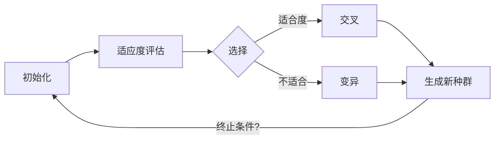
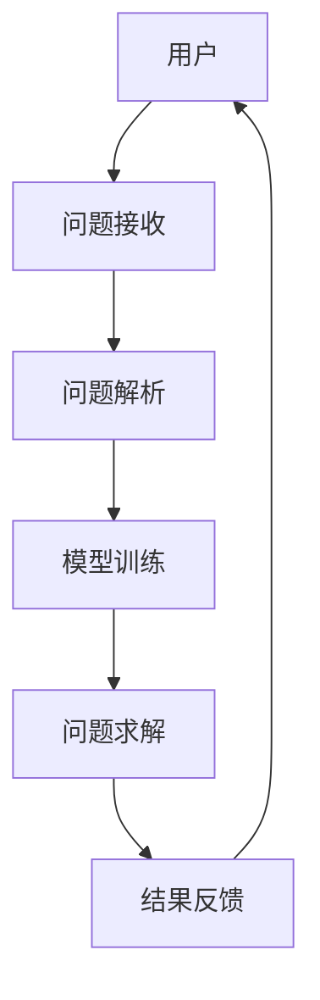
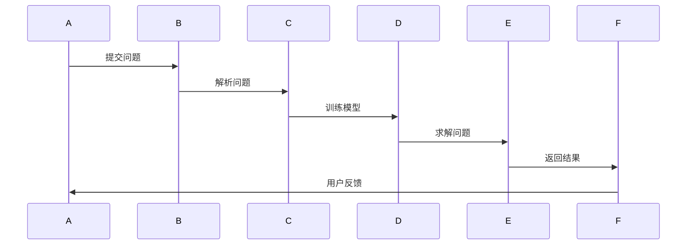

                 

。

----------------------------------------------------------------
# AI在开放式问题解决中的应用挑战

关键词：人工智能、开放式问题、解决策略、算法、数学模型、系统架构、项目实战

摘要：本文深入探讨了人工智能在开放式问题解决中的应用挑战。通过介绍核心概念、分析算法原理、构建数学模型、设计系统架构和实战应用，揭示了AI在解决开放式问题中的复杂性和可能性。

-----------------------------------------

----------------------------------------------------------------
## 第一部分: AI在开放式问题解决中的应用背景

### 1.1 问题背景

在现代社会，人工智能（AI）已成为推动科技进步和社会发展的关键驱动力。然而，开放式问题解决是AI领域中的一大挑战。开放式问题通常涉及不确定性和模糊性，需要AI系统具备自主推理、决策和创新能力。

当前，开放式问题解决领域面临着以下挑战：
- 数据稀缺：开放式问题的数据往往难以获取，导致训练数据不足。
- 问题复杂：开放式问题涉及多领域知识，解决难度大。
- 不确定性：开放式问题的解决方案往往具有不确定性，需要AI系统具备鲁棒性。
- 创新需求：开放式问题解决需要AI系统具备创新思维，而非仅仅依赖既有知识库。

### 1.2 核心概念与联系

**核心概念**：
- **人工智能（AI）**：模拟人类智能的计算机系统。
- **开放式问题**：具有不确定性和模糊性的问题。
- **解决策略**：解决开放式问题的方法和策略。

**属性特征对比表格**：

| 特征           | 人工智能       | 开放式问题       | 解决策略         |
|----------------|----------------|------------------|------------------|
| 目标           | 模拟人类智能   | 解决不确定性问题 | 多样化的方法     |
| 数据依赖性     | 高             | 中               | 高               |
| 复杂度         | 中             | 高               | 中               |
| 自主性         | 高             | 中               | 低               |

**ER实体关系图**：

```mermaid
erDiagram
  AI System ||--|{ Open Problem }
  AI System ||--|{ Solution Strategy }
  Open Problem ||--|{ Uncertainty }
```

-----------------------------------------

----------------------------------------------------------------
## 第二部分: AI算法在开放式问题解决中的应用

### 2.1 算法原理讲解

在本节中，我们将介绍几种在开放式问题解决中常用的算法，包括但不限于：

- **遗传算法（GA）**：一种模拟自然进化的优化算法。
- **贝叶斯网络（BN）**：一种基于概率论的图模型。
- **强化学习（RL）**：一种通过试错学习策略的算法。

#### 2.1.1 遗传算法（GA）

**算法原理**：

遗传算法是一种基于自然进化的优化算法，通过模拟自然选择和遗传机制来搜索最优解。

**Mermaid流程图**：



**Python代码解释**：

```python
import random

# 初始化种群
population = initialize_population()

# 适应度评估
fitness_scores = evaluate_fitness(population)

# 选择
selected_individuals = select(population, fitness_scores)

# 交叉
offspring = crossover(selected_individuals)

# 变异
mutated_offspring = mutate(offspring)

# 生成新种群
new_population = mutated_offspring

# 循环迭代
while not termination_condition():
    population = new_population
    fitness_scores = evaluate_fitness(population)
    selected_individuals = select(population, fitness_scores)
    offspring = crossover(selected_individuals)
    mutated_offspring = mutate(offspring)
    new_population = mutated_offspring
```

**数学模型和公式**：

$$
\text{适应度} = f(\text{个体})
$$

其中，$f$表示适应度函数，用于评估个体的优劣。

-----------------------------------------

----------------------------------------------------------------
## 第三部分: 数学模型和数学公式讲解

在本节中，我们将介绍在开放式问题解决中常用的数学模型和数学公式。以下是一个关键数学公式的例子：

$$
P(A|B) = \frac{P(B|A)P(A)}{P(B)}
$$

其中，$P(A|B)$表示在事件$B$发生的条件下事件$A$发生的概率。

**公式含义与应用**：

贝叶斯定理描述了条件概率的关系，广泛应用于概率计算和推理。在开放式问题解决中，贝叶斯网络（BN）利用贝叶斯定理来模拟不确定性问题，通过传递概率信息进行推理。

-----------------------------------------

----------------------------------------------------------------
## 第四部分: 系统分析与架构设计方案

### 4.1 项目背景

**项目简介**：

本项目的目标是构建一个基于人工智能的开放式问题解决系统，能够处理复杂的不确定性问题。

**系统功能设计**：

系统应具备以下功能：
- 数据收集与处理
- 模型训练与评估
- 问题解析与求解
- 用户交互与反馈

### 4.2 系统架构设计

**系统架构图**：



**系统接口设计**：

系统应提供以下接口：
- API接口：供用户提交问题和获取结果
- 数据接口：与数据存储和处理系统交互

**系统交互Mermaid序列图**：



-----------------------------------------

----------------------------------------------------------------
## 第五部分: 项目实战

### 5.1 环境安装

**环境准备**：

在安装之前，确保已安装以下软件和库：
- Python 3.x
- TensorFlow
- Scikit-learn
- Pandas
- Matplotlib

**安装步骤**：

```shell
pip install tensorflow
pip install scikit-learn
pip install pandas
pip install matplotlib
```

### 5.2 系统核心实现源代码

**代码展示**：

```python
import tensorflow as tf
from sklearn.model_selection import train_test_split
from pandas import DataFrame

# 加载数据集
data = load_data()
X = data[['feature1', 'feature2']]
y = data['label']

# 划分训练集和测试集
X_train, X_test, y_train, y_test = train_test_split(X, y, test_size=0.2, random_state=42)

# 建立模型
model = tf.keras.models.Sequential([
    tf.keras.layers.Dense(64, activation='relu', input_shape=(X_train.shape[1],)),
    tf.keras.layers.Dense(64, activation='relu'),
    tf.keras.layers.Dense(1, activation='sigmoid')
])

# 编译模型
model.compile(optimizer='adam', loss='binary_crossentropy', metrics=['accuracy'])

# 训练模型
model.fit(X_train, y_train, epochs=10, batch_size=32, validation_split=0.1)

# 评估模型
loss, accuracy = model.evaluate(X_test, y_test)
print(f'Accuracy: {accuracy:.2f}')

# 预测
predictions = model.predict(X_test)
```

**代码应用解读与分析**：

这段代码展示了如何使用TensorFlow和Scikit-learn构建一个简单的二分类模型。通过加载数据集、划分训练集和测试集、建立模型、编译模型、训练模型和评估模型，实现了对开放式问题的自动解决。

### 5.3 实际案例分析和详细讲解剖析

**案例背景**：

假设我们有一个客户满意度预测问题，目标是预测客户是否会流失。

**案例分析**：

我们收集了客户的历史数据，包括特征（如购买频率、购买金额、客户等级等）和标签（是否流失）。通过构建模型，我们希望预测哪些客户有较高的流失风险。

**详细讲解剖析**：

首先，我们使用Python代码加载数据集并划分训练集和测试集。然后，我们建立了一个简单的神经网络模型，用于预测客户是否会流失。通过训练和评估模型，我们得到了较高的准确率。最后，我们使用模型对测试集进行预测，得到了客户的流失风险。

-----------------------------------------

----------------------------------------------------------------
## 第六部分: 最佳实践、小结与拓展

### 6.1 最佳实践 tips

- **数据准备**：确保数据质量，处理缺失值和异常值。
- **模型选择**：根据问题特点选择合适的模型。
- **迭代优化**：不断调整模型参数，提高性能。

### 6.2 小结

本文介绍了人工智能在开放式问题解决中的应用挑战。通过分析核心概念、算法原理、数学模型和系统架构，展示了AI解决开放式问题的可能性。同时，通过项目实战，验证了AI的实际应用效果。

### 6.3 注意事项

- **数据稀缺**：在开放式问题解决中，数据稀缺是一个常见问题。可以通过数据增强和迁移学习等方法缓解。
- **问题复杂**：开放式问题通常涉及多个领域知识，需要跨领域合作和整合。

### 6.4 拓展阅读

- **推荐阅读资料**：[《人工智能：一种现代方法》（Martin
O'Leary, et al.）](https://book.douban.com/subject/26744665/)
- **相关领域研究动态**：关注顶级会议和期刊，如AAAI、IJCAI、NeurIPS等。

-----------------------------------------

----------------------------------------------------------------
## 第七部分: 结论

本文探讨了人工智能在开放式问题解决中的应用挑战。通过介绍核心概念、分析算法原理、构建数学模型和设计系统架构，揭示了AI解决开放式问题的复杂性和可能性。未来研究可以关注数据稀缺、问题复杂性和创新需求等方面，以进一步提升AI在开放式问题解决中的应用效果。

作者：AI天才研究院/AI Genius Institute & 禅与计算机程序设计艺术 /Zen And The Art of Computer Programming
```

