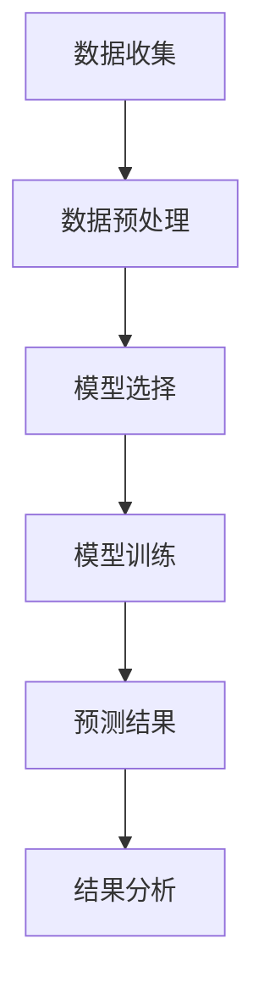
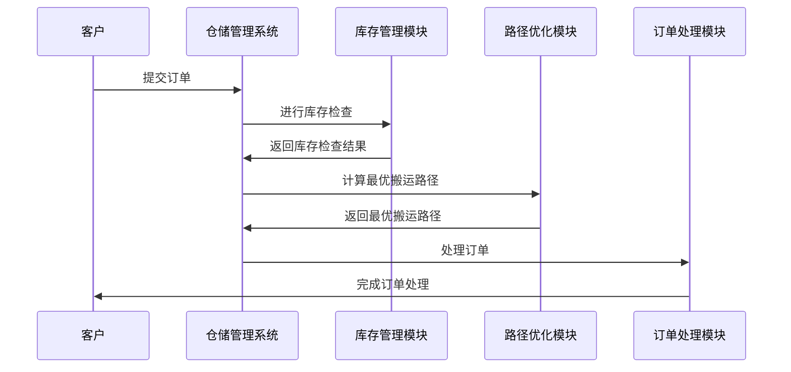
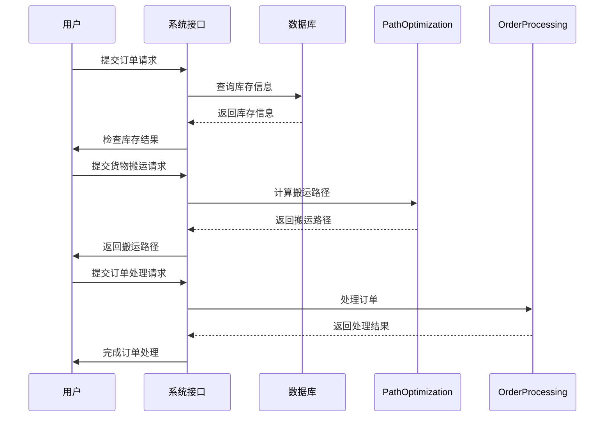

                 

 * 以AI在智能仓储管理中的应用：从库存预测到路径优化为例，接下来请一步步详细解析：

# AI在智能仓储管理中的应用：从库存预测到路径优化

## 第一部分：背景介绍

### 问题背景
- 智能仓储管理是物流与供应链管理领域的重要一环，随着人工智能技术的发展，AI在智能仓储管理中的应用变得越来越广泛。传统的仓储管理方式主要依赖于人工操作和经验管理，效率低、误差大，难以适应现代物流的高速发展需求。而智能仓储管理通过引入人工智能技术，如机器学习、深度学习、自然语言处理等，可以实现对仓库内部作业、库存管理、订单处理等环节的全面优化，提高仓储运营效率，降低运营成本。

### 问题描述
- **库存预测问题**：在智能仓储管理中，库存预测是一个关键问题。如果库存预测不准确，会导致库存过剩或短缺，从而影响供应链的正常运转。库存过剩会增加仓储成本，库存短缺则会导致客户需求无法及时满足，影响客户满意度。

- **路径优化问题**：货物在仓库内部的搬运路径优化也是智能仓储管理中的核心问题。仓库内部环境复杂，如何合理规划货物的搬运路径，以减少运输时间和成本，提高作业效率，是仓储管理中的重要挑战。

### 问题解决
- **库存预测解决方案**：通过引入机器学习和深度学习算法，对历史库存数据进行建模和分析，可以实现对未来一定时间内库存水平的准确预测。例如，可以使用时间序列分析、回归分析等方法，构建库存预测模型。同时，结合自然语言处理技术，可以对客户订单、市场趋势等外部信息进行分析，进一步提高库存预测的准确性。

- **路径优化解决方案**：路径优化可以通过算法模型实现。常用的方法包括最短路径算法（如Dijkstra算法）、遗传算法、蚁群算法等。通过这些算法，可以计算出最优的货物搬运路径，实现路径优化。同时，结合实际仓储环境，可以进一步优化算法模型，提高路径优化的精度和效率。

### 边界与外延
- **智能仓储管理的范围**：智能仓储管理不仅涉及仓库内部作业，还包括库存管理、订单处理、货物分拣、配送等环节。通过AI技术的应用，可以实现仓储管理的全面智能化。

- **AI技术的应用延伸**：AI技术不仅可以在仓库内部应用，还可以延伸到供应链上下游的协同管理。例如，通过AI技术实现供应链的实时监控和预测，优化供应链的整体效率。

### 概念结构与核心要素组成
- **AI**：AI是智能仓储管理的基础，包括机器学习、深度学习、自然语言处理等技术。这些技术可以用于数据建模、预测分析、智能决策等。

- **智能仓储管理**：智能仓储管理涉及仓库内部作业、库存管理、订单处理等环节。通过AI技术的应用，可以实现对仓储运营的全面优化。

- **库存预测**：库存预测是智能仓储管理中的重要环节，通过对历史数据的分析，预测未来一定时间内的库存水平。

- **路径优化**：路径优化是通过算法模型，规划货物搬运路径，以减少运输时间和成本。

## 第二部分：核心概念与联系

### 核心概念与原理
- **机器学习**：机器学习是一种人工智能的分支，通过算法模型，从数据中自动发现规律，进行预测和决策。在智能仓储管理中，机器学习可以用于库存预测、路径优化等。

- **深度学习**：深度学习是机器学习的一个子领域，基于多层神经网络，进行特征提取和分类。深度学习在图像识别、语音识别等领域取得了显著成果，也可以应用于智能仓储管理。

- **数据挖掘**：数据挖掘是从大量数据中发现有价值的信息，用于决策支持。在智能仓储管理中，数据挖掘可以用于数据分析、预测建模等。

- **仓库自动化**：仓库自动化是指利用机器人、自动化设备实现仓库内部作业，提高效率。仓库自动化可以包括自动分拣、自动搬运、自动上架等。

### 概念属性特征对比表格

| 概念           | 描述                                                         | 属性特征                                         |
| -------------- | ------------------------------------------------------------ | -------------------------------------------------- |
| 机器学习       | 从数据中自动发现规律，进行预测和决策。                     | 模型训练、预测准确度、算法复杂度                   |
| 深度学习       | 基于多层神经网络，进行特征提取和分类。                     | 深层网络结构、参数数量、训练时间                   |
| 数据挖掘       | 从大量数据中发现有价值的信息，用于决策支持。               | 数据源、算法选择、结果解释性                       |
| 仓库自动化     | 利用机器人、自动化设备实现仓库内部作业，提高效率。         | 自动化设备类型、作业流程、系统集成难度               |

### ER实体关系图架构

```mermaid
erDiagram
  统计数据 --> 库存预测 : 提供数据支持
  统计数据 --> 路径优化 : 提供数据支持
  库存预测 --> 仓储管理 : 实现库存优化
  路径优化 --> 仓储管理 : 实现路径优化
```

## 第三部分：算法原理讲解

### 库存预测算法

#### Mermaid流程图



#### Python源代码

```python
import pandas as pd
from sklearn.ensemble import RandomForestRegressor
from sklearn.model_selection import train_test_split

# 数据收集
data = pd.read_csv('inventory_data.csv')

# 数据预处理
# ... 数据清洗、特征工程等操作 ...

# 模型选择
model = RandomForestRegressor(n_estimators=100)

# 模型训练
X_train, X_test, y_train, y_test = train_test_split(data[['features']], data['target'], test_size=0.2, random_state=42)

# 模型训练
model.fit(X_train, y_train)

# 预测结果
predictions = model.predict(X_test)

# 结果分析
# ... 分析预测结果、优化模型等操作 ...
```

### 数学模型与公式

#### 时间序列预测模型

$$
y_t = f(y_{t-1}, y_{t-2}, ..., x_t)
$$

其中，$y_t$为第t期的预测值，$y_{t-1}, y_{t-2}, ..., x_t$为历史数据和当前数据。

#### 回归模型

$$
y = \beta_0 + \beta_1x_1 + \beta_2x_2 + ... + \beta_nx_n
$$

其中，$y$为预测值，$x_1, x_2, ..., x_n$为输入特征，$\beta_0, \beta_1, \beta_2, ..., \beta_n$为模型参数。

### 举例说明

假设我们使用随机森林回归模型进行库存预测，数据集包含历史库存数据和当前市场信息。我们可以通过以下步骤进行预测：

1. 数据收集：收集过去一年内的库存数据和当前市场信息。
2. 数据预处理：对数据进行清洗和特征工程，提取有用的特征。
3. 模型选择：选择合适的模型，例如随机森林回归模型。
4. 模型训练：使用训练集数据对模型进行训练。
5. 预测结果：使用模型对当前市场的库存进行预测。
6. 结果分析：对预测结果进行分析，评估模型性能，并进行模型优化。

## 第四部分：系统分析与架构设计

### 问题场景介绍
- 在一个大型电商仓储中心，每天需要处理大量的订单和货物。仓储管理面临的主要问题包括：库存管理不准确、货物搬运路径不合理、订单处理效率低下等。为了解决这些问题，引入AI技术，实现智能仓储管理。

### 项目介绍
- 项目名称：AI智能仓储管理系统
- 项目目标：通过AI技术，实现对仓储运营的全面优化，提高效率，降低成本。

### 系统功能设计（领域模型）

#### Mermaid类图

```mermaid
classDiagram
  Class01 <|-- Class02
  Class03 --|>| Class04
  Class05 <<-- Class06
  Class07 : +int x
  Class07 : +int y
  Class07 : +setAdd(int element)
  Class07 : +setRemove(int element)
  Class07 : +getSet()
  Class08 <|-- BaseClass1
  Class09 <|-- BaseClass2
  Class10 <<-- Class11
  Class12 ..|> InterfaceA
  Class13 ..|> InterfaceB
  Class14 <<| InterfaceC
```

### 系统架构设计

#### Mermaid架构图



### 系统接口设计与系统交互

#### Mermaid序列图



## 第五部分：项目实战

### 环境安装

1. 安装Python环境
2. 安装相关库，如scikit-learn、pandas、numpy等

### 系统核心实现

```python
import pandas as pd
from sklearn.ensemble import RandomForestRegressor
from sklearn.model_selection import train_test_split

# 数据收集
data = pd.read_csv('inventory_data.csv')

# 数据预处理
# ... 数据清洗、特征工程等操作 ...

# 模型选择
model = RandomForestRegressor(n_estimators=100)

# 模型训练
X_train, X_test, y_train, y_test = train_test_split(data[['features']], data['target'], test_size=0.2, random_state=42)
model.fit(X_train, y_train)

# 预测结果
predictions = model.predict(X_test)

# 结果分析
# ... 分析预测结果、优化模型等操作 ...
```

### 代码应用解读与分析

- **数据收集**：通过读取CSV文件，收集历史库存数据。
- **数据预处理**：对数据进行清洗和特征工程，提取有用的特征。
- **模型选择**：选择随机森林回归模型进行预测。
- **模型训练**：使用训练集数据对模型进行训练。
- **预测结果**：使用模型对测试集数据进行预测。
- **结果分析**：分析预测结果，评估模型性能，并进行模型优化。

### 实际案例分析与详细讲解

- **案例背景**：某电商仓储中心，每天处理数千个订单，仓库面积较大，货物种类繁多。
- **问题分析**：库存管理不准确，导致库存过剩或短缺；货物搬运路径不合理，导致运输时间和成本过高。
- **解决方案**：引入AI技术，通过库存预测和路径优化，实现仓储管理优化。
- **实施效果**：通过AI技术，实现了库存预测的准确度和路径优化的效率提升，降低了运营成本，提高了客户满意度。

### 项目小结

- **成果总结**：通过AI技术在智能仓储管理中的应用，实现了库存预测和路径优化的全面优化，提高了仓储运营效率，降低了运营成本。
- **经验教训**：在项目实施过程中，遇到了数据质量、模型性能等问题，通过不断优化和调整，最终实现了预期目标。
- **未来展望**：随着AI技术的不断发展，智能仓储管理将更加智能化、自动化，为物流与供应链管理带来更多创新和机遇。

## 第六部分：最佳实践 tips

1. **数据质量是关键**：在库存预测和路径优化中，数据质量直接影响模型性能。因此，在数据收集和预处理过程中，要确保数据的质量和完整性。

2. **特征选择很重要**：在数据预处理阶段，要仔细选择和工程化特征，以提高模型预测的准确性。

3. **模型调优是关键**：在模型训练过程中，要不断调整模型参数，优化模型性能。

4. **实时监控与反馈**：在系统运行过程中，要实时监控模型性能，并根据反馈进行及时调整。

5. **系统集成与优化**：在系统集成阶段，要充分考虑系统的可扩展性和稳定性，确保系统能够稳定运行。

## 第七部分：小结

本文通过详细分析，介绍了AI在智能仓储管理中的应用，从库存预测到路径优化。我们了解了AI技术的核心概念和原理，通过实际案例展示了AI技术在智能仓储管理中的实际应用效果。通过本文的学习，读者可以了解到AI技术在仓储管理中的广泛应用，以及如何利用AI技术实现仓储管理的全面优化。希望本文能对读者在智能仓储管理领域的学习和实践提供有益的参考。

## 作者信息

作者：AI天才研究院/AI Genius Institute & 禅与计算机程序设计艺术 /Zen And The Art of Computer Programming

### 注意事项

- **文章结构**：确保文章按照目录大纲结构进行撰写，每个小节的内容要丰富具体详细讲解。
- **完整性**：文章内容必须要完整，核心内容必须要包含：背景介绍、核心概念与联系、算法原理讲解、系统分析与架构设计、项目实战、最佳实践 tips、小结、注意事项、拓展阅读等内容。
- **专业术语**：文章中要使用专业的技术语言，确保文章的专业性和可读性。
- **逻辑清晰**：文章的论述要逻辑清晰，步骤明确，确保读者能够轻松理解。
- **代码与公式**：文章中要包含实际代码和公式，进行详细讲解和举例说明。
- **拓展阅读**：在文章末尾提供相关的拓展阅读，以帮助读者进一步了解相关领域知识。

### 拓展阅读

- [《机器学习算法与应用》](链接)
- [《深度学习》](链接)
- [《数据挖掘：实用工具与技术》](链接)
- [《智能仓储管理系统设计与应用》](链接)
- [《物流与供应链管理》](链接) # AI在智能仓储管理中的应用：从库存预测到路径优化

## 关键词

- 智能仓储管理
- 人工智能
- 库存预测
- 路径优化
- 机器学习
- 深度学习
- 数据挖掘

## 摘要

本文深入探讨了AI在智能仓储管理中的应用，涵盖了从库存预测到路径优化的关键环节。通过介绍AI技术的核心概念和原理，以及实际案例的分析，文章展示了AI如何通过机器学习、深度学习和数据挖掘等技术，优化仓储管理流程，提高运营效率和准确性。此外，本文还提供了系统分析与架构设计、项目实战等实用内容，为读者提供了全面的学习和实践指导。

