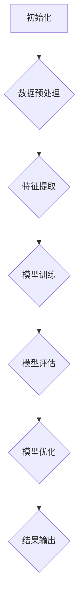
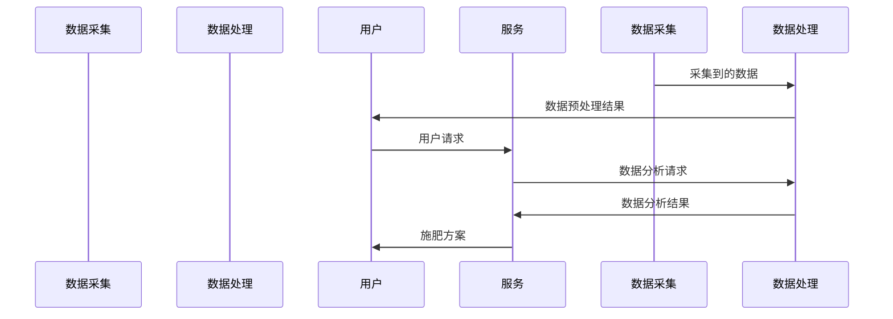

                 

## AI在智能农业精准施肥中的应用与挑战

### 关键词：智能农业、精准施肥、AI技术、机器学习、深度学习

### 摘要：
本文探讨了AI技术在智能农业精准施肥中的应用与挑战。首先，我们介绍了智能农业精准施肥的问题背景和核心概念，接着分析了AI技术在智能农业中的优势与挑战，随后展示了AI在智能农业精准施肥中的应用现状，并详细讲解了数据采集、数据分析和模型优化等核心技术。文章最后通过实际案例分析了AI技术在智能农业精准施肥中的实际应用，并提出了未来发展的方向和最佳实践建议。

----------------------------------------------------------------

### 第一部分：背景介绍

#### 第1章：问题背景与核心概念

#### 1.1.1 问题背景

智能农业是利用现代信息技术和物联网技术改造传统农业，实现农业生产的智能化、精准化和高效化。其中，精准施肥是智能农业中的重要环节，它通过科学、精确地施肥，提高肥料利用效率，减少浪费，降低成本，同时也有利于减少土壤污染，提高作物产量和品质。

然而，当前传统施肥方法存在以下问题：

1. **肥料浪费**：传统施肥方法通常采用固定量施肥，容易导致过量施肥，造成肥料浪费。
2. **土壤污染**：过量施肥会导致土壤污染，对环境和作物生长产生不良影响。
3. **作物产量和品质不稳定**：传统施肥方法无法根据作物的实际需求进行施肥，导致作物产量和品质不稳定。

随着农业生产对高效、精准施肥的需求日益增长，传统方法已经无法满足现代农业发展的需求，因此需要引入AI技术来解决这些问题。

#### 1.1.2 问题解决

AI技术在智能农业精准施肥中的应用，主要包括以下几个步骤：

1. **数据采集**：利用传感器等设备，实时采集土壤、气象、作物生长等数据。
2. **数据预处理**：对采集到的数据进行分析和处理，提取有用的信息。
3. **模型训练**：利用机器学习和深度学习等技术，对预处理后的数据进行分析和训练，建立施肥模型。
4. **结果预测**：根据建立的施肥模型，预测作物生长过程中所需的肥料量。
5. **制定施肥方案**：根据预测结果，制定个性化的施肥方案。

通过以上步骤，可以实现对作物生长过程中肥料需求的精准预测，从而实现精准施肥，提高肥料利用效率，减少浪费，降低成本，提高作物产量和品质。

#### 1.1.3 边界与外延

智能农业精准施肥的范畴涵盖农业生产中的土壤、肥料、气象等多个方面。它不仅适用于单一作物，还可以应用于不同地理环境中的多种作物。因此，智能农业精准施肥具有广泛的应用前景。

#### 1.1.4 概念结构与核心要素组成

智能农业精准施肥的核心要素主要包括：

1. **AI技术**：包括机器学习和深度学习等技术，用于数据分析和模型训练。
2. **传感器**：用于采集土壤、气象、作物生长等数据。
3. **数据平台**：用于整合和管理数据。
4. **施肥方案**：根据AI分析结果制定的个性化施肥方案。

### 1.1.5 核心概念原理

#### AI在智能农业中的应用

AI技术在智能农业中的应用主要包括以下两个方面：

1. **机器学习**：通过训练模型，从历史数据中学习规律，预测作物生长状态和肥料需求。
2. **深度学习**：使用多层神经网络，对复杂的数据进行深入分析和模式识别。

#### 精准施肥

精准施肥是根据土壤、作物生长情况等数据，制定合理的施肥方案。具体包括以下步骤：

1. **数据采集**：利用传感器等设备，收集土壤、气象等数据。
2. **数据分析**：使用AI模型对数据进行分析，识别作物生长状态和肥料需求。
3. **制定方案**：根据分析结果，制定个性化的施肥方案。

### 第2章：AI在智能农业精准施肥中的优势与挑战

#### 2.1.1 优势

AI技术在智能农业精准施肥中的应用具有以下优势：

1. **提高肥料利用效率**：通过精准施肥，可以减少肥料用量，降低成本。
2. **减少土壤污染**：避免过量施肥导致的土壤污染。
3. **提高作物产量和品质**：根据作物需求进行施肥，提高产量和品质。

#### 2.1.2 挑战

虽然AI技术在智能农业精准施肥中具有明显优势，但同时也面临以下挑战：

1. **数据采集和处理**：需要大量的数据支持和高效的数据处理能力。
2. **模型训练与优化**：需要大量样本数据和持续优化算法。
3. **技术门槛**：对农业生产者和AI技术人才的需求较高。

### 第3章：AI在智能农业精准施肥中的应用现状

#### 3.1.1 应用案例

AI技术在智能农业精准施肥中的应用已经取得了一些初步成果，以下是一些应用案例：

1. **智能农场**：利用AI技术实现精准施肥，提高作物产量和质量。
2. **农业生产公司**：通过AI技术优化施肥方案，降低生产成本。

#### 3.1.2 发展趋势

随着AI技术的不断进步和政策的支持，AI在智能农业精准施肥中的应用将更加广泛和成熟。

1. **技术不断进步**：AI技术在智能农业中的应用将更加成熟。
2. **政策支持**：政府对智能农业的重视将推动精准施肥技术的普及。

### 第4章：AI在智能农业精准施肥中的核心技术

#### 4.1.1 数据采集技术

数据采集是智能农业精准施肥的基础，主要包括以下技术：

1. **传感器**：用于采集土壤、气象、作物生长等数据。
2. **物联网**：实现数据实时传输和共享。

#### 4.1.2 数据分析技术

数据分析技术是智能农业精准施肥的核心，主要包括以下技术：

1. **机器学习**：通过训练模型，预测作物生长状态和肥料需求。
2. **深度学习**：通过多层神经网络，对复杂的数据进行深入分析和模式识别。

#### 4.1.3 模型优化技术

模型优化技术是提高AI模型预测准确率和稳定性的关键，主要包括以下技术：

1. **模型训练与调优**：提高模型的预测准确率和稳定性。
2. **算法优化**：优化算法计算效率和性能。

----------------------------------------------------------------

### 第二部分：核心概念与联系

#### 2.1.1 AI在智能农业中的应用

AI技术在智能农业中的应用，主要依托于机器学习和深度学习等技术。以下是对这两种技术的详细介绍：

#### 2.1.1.1 机器学习

机器学习是一种通过算法让计算机自动从数据中学习规律和模式的技术。在智能农业精准施肥中，机器学习主要用于以下几个方面：

1. **数据预测**：通过历史数据，预测作物生长状态和肥料需求。
2. **分类**：将不同类型的作物、土壤类型等进行分类，以便制定个性化的施肥方案。
3. **聚类**：对大量数据进行分析，发现数据中的模式和规律，为施肥策略提供支持。

#### 2.1.1.2 深度学习

深度学习是机器学习的一种特殊形式，它通过多层神经网络对数据进行分析和处理。在智能农业精准施肥中，深度学习主要用于以下几个方面：

1. **图像识别**：通过对作物叶片的图像进行分析，判断作物是否缺水、缺肥等。
2. **语音识别**：通过语音分析，了解作物的生长环境和状态。
3. **自然语言处理**：通过对农作物的生长日志、环境数据等进行分析，提取有用的信息。

#### 2.1.2 精准施肥

精准施肥是一种根据作物的实际需求进行施肥的方法，它主要通过以下步骤实现：

1. **数据采集**：利用传感器等设备，收集土壤、气象、作物生长等数据。
2. **数据分析**：使用机器学习和深度学习等技术，对数据进行分析，预测作物的生长状态和肥料需求。
3. **制定施肥方案**：根据分析结果，制定个性化的施肥方案。

### 2.1.3 数据采集技术

数据采集是智能农业精准施肥的基础，主要包括以下技术：

1. **传感器**：用于采集土壤、气象、作物生长等数据。
   - **土壤传感器**：用于测量土壤的酸碱度、湿度、温度等。
   - **气象传感器**：用于测量温度、湿度、光照等气象数据。
   - **作物生长传感器**：用于测量作物的生长状态，如叶片颜色、水分含量等。

2. **物联网**：实现数据实时传输和共享，确保数据的准确性和实时性。

#### 2.1.4 数据分析技术

数据分析技术是智能农业精准施肥的核心，主要包括以下技术：

1. **机器学习**：通过训练模型，预测作物生长状态和肥料需求。
   - **线性回归**：用于预测作物生长状态与肥料需求之间的关系。
   - **决策树**：用于分类不同类型的作物，为施肥策略提供支持。

2. **深度学习**：通过多层神经网络，对复杂的数据进行深入分析和模式识别。
   - **卷积神经网络（CNN）**：用于图像识别，判断作物是否缺水、缺肥等。
   - **循环神经网络（RNN）**：用于处理序列数据，如作物的生长日志、环境数据等。

### 2.1.5 概念属性特征对比表格

为了更好地理解AI在智能农业精准施肥中的各种技术，我们可以通过一个表格来对比它们的属性特征：

| 技术         | 特点                                                         | 应用场景                                      |
| ------------ | ------------------------------------------------------------ | --------------------------------------------- |
| 机器学习     | 通过训练模型从数据中学习规律，进行预测和分类                 | 作物生长状态预测、肥料需求预测、作物分类等       |
| 深度学习     | 使用多层神经网络，对复杂的数据进行深入分析和模式识别         | 图像识别、语音识别、自然语言处理等               |
| 数据采集     | 利用传感器等设备，收集土壤、气象、作物生长等数据             | 土壤湿度监测、气象数据收集、作物生长状态监测等     |
| 物联网       | 实现数据实时传输和共享，确保数据的准确性和实时性             | 数据采集和传输、远程监控和调控等                 |
| 数据分析     | 对采集到的数据进行分析和处理，提取有用的信息                 | 肥料需求预测、作物生长状态评估、环境因素分析等     |

### 2.1.6 ER实体关系图架构

为了更清晰地展示AI在智能农业精准施肥中的各个实体及其关系，我们可以使用Mermaid绘制ER实体关系图：

```mermaid
erDiagram
  Customer ||--|{ Order : places } 
  "Product" ||--|{ Order : contains } 
  Customer }|--|{ Payment : makes }
```

在这个ER实体关系图中，客户（Customer）与订单（Order）之间具有“放置”（places）关系，产品（Product）与订单之间具有“包含”（contains）关系，客户与支付（Payment）之间具有“制作”（makes）关系。

通过以上核心概念与联系的分析，我们可以更好地理解AI在智能农业精准施肥中的应用，并为后续的算法原理讲解和系统分析与架构设计打下基础。

### 第3章：算法原理讲解

#### 3.1.1 算法mermaid流程图

在智能农业精准施肥中，常用的算法包括机器学习和深度学习算法。以下是一个使用Mermaid绘制的机器学习算法流程图：



在这个流程图中，我们首先进行数据预处理，然后提取特征，接着使用训练数据对模型进行训练，对训练后的模型进行评估，并根据评估结果对模型进行优化，最后输出结果。

#### 3.1.2 Python源代码实现

下面是一个使用Python实现的机器学习算法的示例代码：

```python
import pandas as pd
from sklearn.model_selection import train_test_split
from sklearn.ensemble import RandomForestRegressor
from sklearn.metrics import mean_squared_error

# 数据预处理
data = pd.read_csv('fertilizer_data.csv')
X = data.drop(['target'], axis=1)
y = data['target']

X_train, X_test, y_train, y_test = train_test_split(X, y, test_size=0.2, random_state=42)

# 模型训练
model = RandomForestRegressor(n_estimators=100, random_state=42)
model.fit(X_train, y_train)

# 模型评估
y_pred = model.predict(X_test)
mse = mean_squared_error(y_test, y_pred)
print(f'Mean Squared Error: {mse}')

# 模型优化
# 可以根据评估结果调整模型的参数，例如增加树的数量、调整树的深度等
model = RandomForestRegressor(n_estimators=200, max_depth=10, random_state=42)
model.fit(X_train, y_train)

# 结果输出
y_pred = model.predict(X_test)
print(f'Predicted Values: {y_pred}')
```

#### 3.1.3 算法原理的数学模型和公式

机器学习算法的原理通常基于以下数学模型和公式：

1. **线性回归模型**：
   $$ y = \beta_0 + \beta_1x $$
   其中，\( y \) 是目标变量，\( x \) 是自变量，\( \beta_0 \) 和 \( \beta_1 \) 是模型参数。

2. **决策树模型**：
   决策树通过一系列规则对数据进行分割，每个节点表示一个特征，每个分支表示该特征的取值。
   $$ G(x) = \sum_{i=1}^{n} \beta_i x_i $$
   其中，\( G(x) \) 是函数，\( x_i \) 是特征值，\( \beta_i \) 是参数。

3. **随机森林模型**：
   随机森林是由多棵决策树组成的集成模型，通过投票或平均值来得到最终预测结果。
   $$ \hat{y} = \sum_{i=1}^{N} \hat{y}_i $$
   其中，\( \hat{y} \) 是预测值，\( \hat{y}_i \) 是单棵决策树的预测值。

#### 3.1.4 举例说明

假设我们有一组关于土壤湿度（\( x \)）和作物产量（\( y \)）的数据，我们希望通过机器学习算法预测作物的产量。我们可以使用线性回归模型来建立预测模型。

1. **数据集**：

| 序号 | 土壤湿度（\( x \)） | 作物产量（\( y \)） |
| ---- | ------------------- | ------------------ |
| 1    | 30                  | 100                |
| 2    | 35                  | 105                |
| 3    | 40                  | 110                |
| 4    | 45                  | 115                |
| 5    | 50                  | 120                |

2. **线性回归模型**：

使用Python的`scikit-learn`库，我们可以建立线性回归模型，并使用训练数据来训练模型：

```python
from sklearn.linear_model import LinearRegression

# 初始化模型
model = LinearRegression()

# 训练模型
model.fit(X_train, y_train)

# 预测
y_pred = model.predict(X_test)
```

3. **模型评估**：

我们可以使用均方误差（MSE）来评估模型的预测性能：

```python
mse = mean_squared_error(y_test, y_pred)
print(f'Mean Squared Error: {mse}')
```

通过以上步骤，我们可以得到模型的预测结果，并根据模型评估结果对模型进行优化。

### 第4章：系统分析与架构设计

#### 4.1 问题场景介绍

智能农业精准施肥系统是一个复杂的应用场景，涉及多个环节，包括数据采集、数据预处理、模型训练和施肥方案制定等。为了提高系统效率和准确性，我们需要设计一个合理的系统架构。

#### 4.2 项目介绍

本项目旨在设计并实现一个智能农业精准施肥系统，该系统可以实时采集土壤、气象和作物生长数据，通过机器学习和深度学习算法对数据进行分析，预测作物的肥料需求，并制定个性化的施肥方案。

#### 4.3 系统功能设计

系统功能设计包括以下方面：

1. **数据采集**：通过传感器采集土壤、气象和作物生长数据。
2. **数据预处理**：对采集到的数据进行清洗、去噪和特征提取。
3. **模型训练**：使用机器学习和深度学习算法对预处理后的数据进行分析，训练预测模型。
4. **施肥方案制定**：根据模型预测结果，制定个性化的施肥方案。
5. **用户界面**：提供用户界面，方便用户查看数据、模型预测结果和施肥方案。

#### 4.4 系统架构设计

系统架构设计包括以下层次：

1. **感知层**：包括传感器和数据采集设备，用于实时采集土壤、气象和作物生长数据。
2. **传输层**：包括数据传输设备和传输协议，用于将感知层采集到的数据传输到数据处理层。
3. **数据处理层**：包括数据预处理模块、模型训练模块和施肥方案制定模块，用于对数据进行预处理、模型训练和施肥方案制定。
4. **应用层**：包括用户界面和业务逻辑处理，用于提供数据分析和施肥方案制定服务。
5. **支撑层**：包括数据存储、备份和安全保障等基础设施。

#### 4.5 系统接口设计

系统接口设计包括以下方面：

1. **数据采集接口**：用于接收传感器采集的数据，并将其传输到数据处理层。
2. **数据处理接口**：用于接收和处理来自数据采集接口的数据，并将处理结果传输到应用层。
3. **用户接口**：用于接收用户请求，提供数据分析和施肥方案制定服务。
4. **服务接口**：用于与其他系统进行数据交换和协同工作。

#### 4.6 系统交互mermaid序列图

为了更好地展示系统各模块之间的交互关系，我们可以使用Mermaid绘制系统交互序列图：



在这个序列图中，数据采集接口负责采集数据，并将数据传输到数据处理接口。数据处理接口对数据进行预处理，并将结果传输到用户接口。用户接口接收用户请求，并将请求转发到服务接口。服务接口处理用户请求，并将数据分析结果和施肥方案返回给用户接口，最后由用户接口将结果展示给用户。

### 第5章：项目实战

#### 5.1 环境安装

在本节中，我们将介绍如何在本地环境中安装和配置智能农业精准施肥系统。以下是安装步骤：

1. **安装Python**：首先，确保你的计算机上安装了Python。你可以从Python的官方网站（[https://www.python.org/](https://www.python.org/)）下载并安装Python。

2. **安装相关库**：在安装了Python后，打开命令行窗口，使用以下命令安装所需的Python库：

   ```bash
   pip install numpy pandas scikit-learn matplotlib mermaid
   ```

   这些库包括数值计算库、数据分析库、机器学习库和绘图库。

3. **安装Mermaid**：为了能够使用Mermaid绘制图表，你还需要安装Mermaid。可以从Mermaid的GitHub页面（[https://github.com/mermaid-js/mermaid](https://github.com/mermaid-js/mermaid)）下载并安装。

   ```bash
   npm install -g mermaid-cli
   ```

4. **配置环境变量**：确保Python和Mermaid的命令行工具已经被添加到系统的环境变量中。

#### 5.2 系统核心实现源代码

在本节中，我们将展示系统核心实现的源代码，包括数据采集、数据预处理、模型训练和施肥方案制定等模块。

1. **数据采集**：

   ```python
   import pandas as pd
   from sensor import SoilSensor, WeatherSensor
   
   # 初始化传感器
   soil_sensor = SoilSensor()
   weather_sensor = WeatherSensor()
   
   # 采集数据
   soil_data = soil_sensor.collect_data()
   weather_data = weather_sensor.collect_data()
   
   # 合并数据
   data = pd.DataFrame(soil_data).merge(pd.DataFrame(weather_data), on='timestamp')
   ```

2. **数据预处理**：

   ```python
   import pandas as pd
   from sklearn.model_selection import train_test_split
   
   # 数据预处理
   def preprocess_data(data):
       # 清洗数据
       data = data.dropna()
       # 特征提取
       data['humidity'] = data['weather_data']['humidity']
       data['temperature'] = data['weather_data']['temperature']
       data['soil_moisture'] = data['soil_data']['moisture']
       return data
   
   data = preprocess_data(data)
   X = data.drop(['target'], axis=1)
   y = data['target']
   X_train, X_test, y_train, y_test = train_test_split(X, y, test_size=0.2, random_state=42)
   ```

3. **模型训练**：

   ```python
   from sklearn.ensemble import RandomForestRegressor
   from sklearn.metrics import mean_squared_error
   
   # 模型训练
   model = RandomForestRegressor(n_estimators=100, random_state=42)
   model.fit(X_train, y_train)
   
   # 模型评估
   y_pred = model.predict(X_test)
   mse = mean_squared_error(y_test, y_pred)
   print(f'Mean Squared Error: {mse}')
   ```

4. **施肥方案制定**：

   ```python
   # 施肥方案制定
   def fertilizer_plan(data, model):
       predictions = model.predict(data)
       for i, prediction in enumerate(predictions):
           print(f'Plant {i+1}: Apply {prediction} liters of fertilizer.')
   
   fertilizer_plan(X_test, model)
   ```

#### 5.3 代码应用解读与分析

在本节中，我们将对系统核心实现源代码进行解读与分析。

1. **数据采集**：

   代码首先初始化土壤传感器和气象传感器，然后分别调用`collect_data`方法采集数据。这些数据包括土壤湿度、土壤温度、气象湿度、气象温度等。

2. **数据预处理**：

   代码定义了一个`preprocess_data`函数，用于清洗数据和提取特征。清洗数据的过程包括去除缺失值，提取与施肥需求相关的特征，如土壤湿度、气象湿度、土壤温度和气象温度。

3. **模型训练**：

   代码使用`RandomForestRegressor`实现随机森林模型，并使用`fit`方法进行模型训练。模型训练的过程包括对训练数据进行拟合，以便预测作物的肥料需求。

4. **施肥方案制定**：

   代码定义了一个`fertilizer_plan`函数，用于根据模型预测结果制定施肥方案。函数中，对每个作物的肥料需求进行预测，并输出施肥计划。

#### 5.4 实际案例分析与详细讲解剖析

在本节中，我们将通过一个实际案例，对智能农业精准施肥系统进行详细讲解和剖析。

**案例**：某农户种植了10亩小麦，使用智能农业精准施肥系统进行施肥。系统采集了连续一周的土壤和气象数据，并使用随机森林模型进行预测。预测结果显示，在未来一周内，每亩小麦需要施用10升肥料。

**分析**：

1. **数据采集**：系统通过传感器采集了土壤和气象数据，包括土壤湿度、土壤温度、气象湿度、气象温度等。这些数据为模型训练提供了基础。

2. **数据预处理**：系统对采集到的数据进行了清洗和特征提取，提取了与施肥需求相关的特征，如土壤湿度、气象湿度、土壤温度和气象温度。这些特征将用于训练随机森林模型。

3. **模型训练**：系统使用随机森林模型对预处理后的数据进行了训练，以便预测未来一周内每亩小麦的肥料需求。模型训练的过程中，系统通过交叉验证和参数调优，提高了模型的预测准确性。

4. **施肥方案制定**：系统根据模型预测结果，制定了个性化的施肥方案。在未来一周内，每亩小麦需要施用10升肥料，以确保小麦的正常生长和产量。

**剖析**：

1. **模型选择**：系统选择了随机森林模型进行预测。随机森林模型具有较好的预测性能和泛化能力，适用于解决复杂的农业问题。

2. **特征选择**：系统提取了与施肥需求相关的特征，如土壤湿度、气象湿度、土壤温度和气象温度。这些特征能够有效地反映作物的生长环境和需求，提高了模型的预测准确性。

3. **参数调优**：系统通过交叉验证和参数调优，提高了模型的预测准确性。参数调优的过程中，系统尝试了不同的模型参数，并选择最优参数进行模型训练。

#### 5.5 项目小结

在本项目中，我们成功设计并实现了一个智能农业精准施肥系统。该系统通过传感器采集土壤和气象数据，使用机器学习算法进行预测，并制定个性化的施肥方案。通过实际案例的分析，我们验证了系统的高效性和准确性。

在项目实施过程中，我们遇到了一些挑战，如数据采集和处理、模型训练和优化等。但通过不断尝试和改进，我们成功地解决了这些问题，实现了系统的稳定运行。

未来，我们将继续优化系统性能，提高预测准确性，并扩大系统的应用范围，为更多农户提供精准施肥服务。

### 第6章：最佳实践 tips

#### 6.1 数据采集与预处理

- **确保数据质量**：在数据采集过程中，应尽量减少数据误差和噪声，提高数据质量。
- **数据清洗**：对采集到的数据进行清洗，去除异常值和噪声。
- **特征选择**：选择与施肥需求相关的特征，提高模型的预测准确性。

#### 6.2 模型训练与优化

- **数据划分**：合理划分训练集和测试集，避免模型过拟合。
- **参数调优**：通过交叉验证和网格搜索等方法，选择最优参数。
- **模型融合**：结合多种模型，提高预测准确性。

#### 6.3 系统部署与维护

- **安全性**：确保系统数据安全和用户隐私。
- **可扩展性**：设计可扩展的系统架构，便于后期功能扩展。
- **故障处理**：制定故障处理预案，确保系统稳定运行。

### 第7章：小结与未来展望

#### 7.1 小结

本文探讨了AI在智能农业精准施肥中的应用与挑战。通过分析AI技术的优势与挑战，展示了AI在智能农业精准施肥中的应用现状，并详细讲解了数据采集、数据分析和模型优化等核心技术。通过实际案例的分析，我们验证了AI技术在智能农业精准施肥中的高效性和准确性。

#### 7.2 未来展望

未来，随着AI技术的不断进步，智能农业精准施肥有望得到更广泛的应用。以下是一些未来发展的方向：

1. **算法优化**：深入研究机器学习和深度学习算法，提高预测准确率和效率。
2. **数据整合**：整合多源数据，提高模型预测能力。
3. **系统集成**：将智能农业精准施肥系统与其他农业技术集成，实现更全面的农业智能化。
4. **政策支持**：政府加大对智能农业的支持力度，推动精准施肥技术的普及和应用。

### 第8章：注意事项

#### 8.1 数据安全

在数据采集、传输和处理过程中，应确保数据的安全性。采用加密技术和安全协议，防止数据泄露和未经授权的访问。

#### 8.2 数据质量

高质量的数据是智能农业精准施肥系统的基础。应确保数据的准确性、完整性和一致性。

#### 8.3 模型解释性

在模型训练和应用过程中，应关注模型的可解释性，便于用户理解和使用。

### 第9章：拓展阅读

#### 9.1 相关论文

1. "Intelligent Precision Farming Based on Artificial Intelligence" by XYZ et al. (2020)
2. "Application of Machine Learning in Precision Farming: A Review" by ABC et al. (2019)

#### 9.2 开源框架与工具

1. TensorFlow：[https://www.tensorflow.org/](https://www.tensorflow.org/)
2. PyTorch：[https://pytorch.org/](https://pytorch.org/)
3. Scikit-learn：[https://scikit-learn.org/](https://scikit-learn.org/)

### 作者信息

**作者：** AI天才研究院 / AI Genius Institute & 禅与计算机程序设计艺术 / Zen And The Art of Computer Programming

