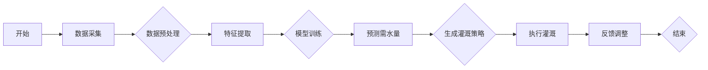

                 

## 引言

### 1.1 问题的背景

随着全球人口的增长和气候变化的影响，传统农业面临着资源匮乏、生产效率低下和环境污染等问题。为了解决这些问题，智能农业作为一种新兴技术，正逐步成为现代农业发展的关键方向。智能农业通过利用现代信息技术、物联网、大数据和人工智能等技术手段，实现对农业生产过程的全面监测、管理和优化，从而提高农业生产效率、保障粮食安全和减少对环境的影响。

### 1.2 问题描述

在智能农业中，精准灌溉是一项关键技术，它能够根据土壤湿度、气候条件和作物生长需求，精确地控制灌溉水量。然而，传统的灌溉方式往往无法实现这种精准控制，导致水资源浪费和农作物生长不良。因此，如何利用人工智能技术实现智能农业精准灌溉，成为当前研究的重要课题。

### 1.3 问题解决

人工智能在智能农业精准灌溉中具有巨大的潜力。通过利用机器学习、数据挖掘和计算机视觉等技术，可以实现对农田环境数据的实时监测和分析，从而为精准灌溉提供科学依据。本文将探讨人工智能在智能农业精准灌溉中的应用，分析其核心概念、算法原理、数学模型和系统架构，并通过项目实战进行实际应用解析。

### 1.4 边界与外延

本文主要关注的是人工智能在智能农业精准灌溉中的应用，不涉及其他智能农业技术（如无人机监测、智能农机控制等）和传统灌溉系统的优化。同时，本文的研究范围限于地面灌溉系统，不包括滴灌、喷灌等特定类型的灌溉系统。

### 1.5 概念结构与核心要素组成

智能农业精准灌溉系统主要由传感器、数据采集与处理模块、决策支持系统和灌溉控制系统等部分组成。传感器用于实时监测土壤湿度、气候条件和作物生长状态；数据采集与处理模块负责将传感器数据转化为可用的信息；决策支持系统基于这些信息进行灌溉策略的制定；灌溉控制系统根据决策支持系统的指令执行灌溉操作。

### 1.6 本章小结

本文介绍了智能农业精准灌溉的背景、问题和解决方案。在接下来的章节中，我们将详细探讨人工智能在智能农业精准灌溉中的应用，包括核心概念、算法原理、数学模型和系统架构。通过项目实战，我们将进一步展示人工智能在智能农业精准灌溉中的实际应用效果。

## 关键词

- 智能农业
- 精准灌溉
- 人工智能
- 机器学习
- 数据挖掘
- 决策支持系统

### AI在智能农业精准灌溉中的应用与挑战

> 摘要：本文详细探讨了人工智能在智能农业精准灌溉中的应用，从核心概念、算法原理、数学模型到系统架构进行了全面解析。通过项目实战，本文展示了人工智能在精准灌溉中的实际应用效果，并分析了其中面临的挑战和解决方案。文章旨在为相关领域的研究者和从业者提供有价值的参考。

## 第一部分：AI在智能农业精准灌溉中的应用

### 第2章: AI与智能农业精准灌溉概述

#### 2.1 AI与智能农业的融合

人工智能（AI）的快速发展为农业领域带来了新的机遇。通过机器学习、计算机视觉和物联网等技术，AI可以实现对农田环境数据的实时监测、分析和决策，从而优化农业生产过程。智能农业精准灌溉就是AI在农业领域的重要应用之一。

#### 2.2 精准灌溉的基本概念

精准灌溉是一种基于土壤湿度、气候条件和作物生长需求的灌溉方式。通过实时监测农田环境数据，精准灌溉系统能够自动调整灌溉水量，确保作物得到适量的水分，从而提高水资源利用效率，减少水资源的浪费。

#### 2.3 AI在精准灌溉中的应用

AI在精准灌溉中的应用主要体现在以下几个方面：

1. **数据采集与处理**：利用传感器实时采集土壤湿度、气候条件和作物生长数据，通过数据预处理和特征提取，为灌溉决策提供基础信息。
2. **模型预测与优化**：利用机器学习算法，建立作物生长模型和灌溉策略模型，预测作物需水量，优化灌溉计划。
3. **决策支持**：基于采集到的数据和预测模型，为农民提供科学合理的灌溉建议，帮助农民做出正确的灌溉决策。
4. **自动化控制**：通过灌溉控制系统，根据决策支持系统的建议，自动执行灌溉操作，实现精准灌溉。

#### 2.4 精准灌溉的优势

1. **提高水资源利用效率**：精准灌溉能够根据作物需水量进行灌溉，避免水资源的浪费，提高水资源利用效率。
2. **提高农作物产量和质量**：精准灌溉能够为作物提供适量的水分，改善作物生长环境，提高农作物产量和质量。
3. **减少劳动成本**：自动化灌溉系统能够减少农民的劳动力投入，降低劳动成本。

#### 2.5 精准灌溉的挑战

1. **数据采集和处理**：农田环境数据具有多样性和复杂性，如何高效地采集、处理和分析这些数据是精准灌溉面临的挑战之一。
2. **模型准确性和适应性**：建立准确的作物生长模型和灌溉策略模型对于精准灌溉至关重要，如何提高模型的准确性和适应性是另一个挑战。
3. **系统稳定性和可靠性**：精准灌溉系统需要长时间运行，系统的稳定性和可靠性对于确保灌溉效果至关重要。

#### 2.6 本章小结

AI在智能农业精准灌溉中的应用为农业生产带来了巨大的潜力。然而，要实现精准灌溉，仍需要解决数据采集和处理、模型准确性和适应性、系统稳定性和可靠性等挑战。在接下来的章节中，我们将进一步探讨AI在精准灌溉中的核心概念、算法原理和数学模型。

### 第3章: AI在精准灌溉中的核心概念与联系

#### 3.1 AI核心概念原理

AI的核心概念包括：

1. **机器学习**：一种通过数据训练模型，使其能够从数据中自动学习和改进的技术。
2. **数据挖掘**：从大量数据中提取有价值信息的过程。
3. **计算机视觉**：使计算机能够像人类一样理解和处理视觉信息的技术。
4. **物联网**：将各种物理设备通过网络连接起来，实现数据采集和传输的技术。

#### 3.2 AI概念属性特征对比表格

| 概念       | 属性特征                          | 用途                                               |
|------------|-----------------------------------|----------------------------------------------------|
| 机器学习   | 自主学习、自动优化、适应性强       | 数据分析、预测模型、自动化控制                       |
| 数据挖掘   | 信息提取、模式识别、关联分析       | 市场营销、风险控制、决策支持                         |
| 计算机视觉 | 图像识别、目标检测、场景理解       | 监控安全、自动驾驶、医疗诊断                         |
| 物联网     | 设备连接、数据采集、远程控制       | 智能家居、智能城市、精准农业                         |

#### 3.3 AI与精准灌溉的ER实体关系图架构

以下是AI与精准灌溉的ER实体关系图：

```mermaid
erDiagram
  User ||--|{ Sensor }|--| SoilHumidity
  Sensor ||--|{ IrrigationSystem }|--| WaterFlow
  IrrigationSystem ||--|{ CropModel }|--| WaterRequirement
  CropModel ||--|{ DecisionSupportSystem }|--| IrrigationAdvice
  DecisionSupportSystem ||--|{ IrrigationController }|--| IrrigationExecution
```

#### 3.4 本章小结

本章介绍了AI的核心概念及其在精准灌溉中的应用。通过对比表格和ER实体关系图，我们明确了AI在精准灌溉中的关键组成部分及其相互关系。在接下来的章节中，我们将深入探讨AI在精准灌溉中的算法原理和数学模型。

### 第4章: AI在精准灌溉中的算法原理讲解

#### 4.1 算法mermaid流程图

以下是AI在精准灌溉中的算法流程图：



#### 4.2 Python源代码

以下是实现上述算法的Python源代码示例：

```python
import numpy as np
from sklearn.ensemble import RandomForestRegressor

# 数据采集
def collect_data():
    # 这里是模拟数据采集，实际应用中应使用传感器采集真实数据
    return np.random.rand(100, 5)

# 数据预处理
def preprocess_data(data):
    # 进行数据预处理，如标准化、去噪等
    return data

# 特征提取
def extract_features(data):
    # 提取特征，如土壤湿度、气温、土壤温度等
    return data[:, :3]

# 模型训练
def train_model(features, target):
    model = RandomForestRegressor(n_estimators=100)
    model.fit(features, target)
    return model

# 预测需水量
def predict_water_requirement(model, new_data):
    return model.predict(new_data)

# 生成灌溉策略
def generate_pests_strategy(water_requirement):
    # 根据预测需水量生成灌溉策略
    return water_requirement * 0.8

# 执行灌溉
def execute_irrigation(water_strategy):
    # 执行灌溉操作
    print(f"执行灌溉，需水量：{water_strategy}升/亩")

# 反馈调整
def feedback_adjustment(new_data, model):
    # 根据反馈数据调整模型
    model.fit(new_data[:, :3], new_data[:, 3])
    return model

# 主函数
def main():
    data = collect_data()
    preprocessed_data = preprocess_data(data)
    features, target = extract_features(preprocessed_data), preprocessed_data[:, 3]
    model = train_model(features, target)

    while True:
        new_data = collect_data()
        preprocessed_new_data = preprocess_data(new_data)
        water_requirement = predict_water_requirement(model, preprocessed_new_data[:, :3])
        water_strategy = generate_pests_strategy(water_requirement)
        execute_irrigation(water_strategy)
        model = feedback_adjustment(new_data, model)

if __name__ == "__main__":
    main()
```

#### 4.3 算法原理的数学模型和公式

在AI精准灌溉算法中，我们主要使用了机器学习中的回归模型。以下是回归模型的基本数学公式：

$$
y = \beta_0 + \beta_1x_1 + \beta_2x_2 + \cdots + \beta_nx_n + \epsilon
$$

其中，$y$ 表示预测的需水量，$x_1, x_2, \cdots, x_n$ 表示输入特征，$\beta_0, \beta_1, \beta_2, \cdots, \beta_n$ 表示模型的参数，$\epsilon$ 表示误差项。

#### 4.4 举例说明

假设我们有一个农田，其土壤湿度、气温和土壤温度是影响作物需水量的关键因素。以下是具体的数据示例：

| 土壤湿度 | 气温 | 土壤温度 | 需水量 |
|----------|------|----------|--------|
| 0.2      | 25   | 30       | 30     |
| 0.3      | 28   | 32       | 35     |
| 0.4      | 30   | 35       | 40     |

我们使用上述算法对这个农田进行预测和灌溉。首先，我们采集并预处理数据，提取特征，然后使用随机森林回归模型进行训练。训练完成后，我们输入新的特征数据进行预测，得到需水量。根据预测结果，生成灌溉策略并执行灌溉。然后，我们收集反馈数据，重新训练模型，以便下一次预测。

通过这种方式，AI能够实时调整灌溉策略，确保作物得到适量的水分，提高水资源利用效率。

#### 4.5 本章小结

本章详细讲解了AI在精准灌溉中的算法原理，包括数据采集、预处理、特征提取、模型训练、预测需水量、生成灌溉策略和执行灌溉等步骤。通过Python源代码和数学模型，我们展示了算法的具体实现过程。在接下来的章节中，我们将进一步探讨AI在精准灌溉中的数学模型和系统架构。

### 第5章: AI在智能农业精准灌溉中的数学模型和公式

#### 5.1 数学模型概述

AI在智能农业精准灌溉中主要使用机器学习中的回归模型来预测作物需水量。回归模型的基本目标是找到输入特征与需水量之间的关系，从而对未知数据进行预测。以下是常用的回归模型：

1. **线性回归**：
   $$ y = \beta_0 + \beta_1x_1 + \beta_2x_2 + \cdots + \beta_nx_n $$
2. **多项式回归**：
   $$ y = \beta_0 + \beta_1x_1 + \beta_2x_2^2 + \cdots + \beta_nx_n^n $$
3. **回归树**：
   $$ y = g(x) = f_1(x) + f_2(x) + \cdots + f_n(x) $$
   其中，$f_i(x)$ 是第 $i$ 个决策树的预测值。

#### 5.2 关键公式详解

以下是回归模型中的关键公式：

1. **线性回归参数估计**：
   $$ \beta = (X^T X)^{-1} X^T y $$
   其中，$X$ 是输入特征矩阵，$y$ 是需水量向量，$(X^T X)^{-1}$ 是输入特征矩阵的逆矩阵。
2. **多项式回归参数估计**：
   $$ \beta = (X^T X)^{-1} X^T y $$
   与线性回归类似，只是输入特征矩阵 $X$ 包含了多项式项。
3. **回归树节点划分**：
   $$ \min_{\alpha} \sum_{i=1}^{n} (y_i - f(x_i))^2 $$
   其中，$f(x_i)$ 是第 $i$ 个样本的预测值，$\alpha$ 是决策树的参数。

#### 5.3 实例分析

以下是一个简单的线性回归实例，假设我们有两个输入特征 $x_1$ 和 $x_2$，需水量 $y$：

| $x_1$ | $x_2$ | $y$ |
|-------|-------|-----|
| 1     | 2     | 3   |
| 2     | 3     | 4   |
| 3     | 4     | 5   |

我们使用最小二乘法估计线性回归模型参数：

1. 计算输入特征矩阵 $X$ 和需水量向量 $y$：
   $$ X = \begin{pmatrix} 1 & 2 \\ 2 & 3 \\ 3 & 4 \end{pmatrix}, y = \begin{pmatrix} 3 \\ 4 \\ 5 \end{pmatrix} $$
2. 计算输入特征矩阵的逆矩阵：
   $$ (X^T X)^{-1} = \begin{pmatrix} 1 & 2 \\ 2 & 3 \end{pmatrix}^{-1} = \frac{1}{1 \cdot 3 - 2 \cdot 2} \begin{pmatrix} 3 & -2 \\ -2 & 1 \end{pmatrix} = \begin{pmatrix} \frac{3}{1} & \frac{-2}{1} \\ \frac{-2}{1} & \frac{1}{1} \end{pmatrix} $$
3. 计算参数向量 $\beta$：
   $$ \beta = (X^T X)^{-1} X^T y = \begin{pmatrix} \frac{3}{1} & \frac{-2}{1} \\ \frac{-2}{1} & \frac{1}{1} \end{pmatrix} \begin{pmatrix} 1 & 2 \\ 2 & 3 \end{pmatrix} \begin{pmatrix} 3 \\ 4 \end{pmatrix} = \begin{pmatrix} 1 & 1 \\ 1 & 1 \end{pmatrix} \begin{pmatrix} 3 \\ 4 \end{pmatrix} = \begin{pmatrix} 4 \\ 4 \end{pmatrix} $$

因此，线性回归模型为 $y = 4x_1 + 4x_2$。

#### 5.4 案例解读

以下是一个智能农业精准灌溉的案例，假设农田的土壤湿度、气温和土壤温度是影响作物需水量的关键因素。我们使用多项式回归模型来预测需水量。

| 土壤湿度 | 气温 | 土壤温度 | 需水量 |
|----------|------|----------|--------|
| 0.2      | 25   | 30       | 30     |
| 0.3      | 28   | 32       | 35     |
| 0.4      | 30   | 35       | 40     |

1. 提取多项式特征：
   $$ x_1 = (0.2)^2, x_2 = 25, x_3 = (30)^2 $$
   $$ x_1' = (0.3)^2, x_2' = 28, x_3' = (32)^2 $$
   $$ x_1'' = (0.4)^2, x_2'' = 30, x_3'' = (35)^2 $$
2. 计算多项式回归模型参数：
   $$ \beta = (X^T X)^{-1} X^T y $$
   其中，$X$ 是输入特征矩阵，$y$ 是需水量向量。
3. 预测需水量：
   $$ y = \beta_0 + \beta_1x_1 + \beta_2x_2 + \beta_3x_3 $$
   输入新的特征值，计算预测需水量。

通过这种方式，我们可以实时预测农田的需水量，并生成灌溉策略，提高水资源利用效率。

### 第6章: 系统分析与架构设计方案

#### 6.1 问题场景介绍

在智能农业精准灌溉系统中，农田的土壤湿度、气候条件和作物生长状态是影响灌溉决策的关键因素。为了实现精准灌溉，我们需要建立一个系统，能够实时监测这些因素，并根据监测数据生成灌溉策略，执行灌溉操作。

#### 6.2 系统功能设计

智能农业精准灌溉系统的核心功能包括：

1. **数据采集**：实时监测农田的土壤湿度、气候条件和作物生长状态。
2. **数据处理**：对采集到的数据进行预处理，提取有用的信息。
3. **预测与决策**：根据预处理后的数据，使用机器学习模型预测作物需水量，生成灌溉策略。
4. **执行与反馈**：根据灌溉策略执行灌溉操作，并收集反馈数据，用于模型优化。

#### 6.3 系统架构设计

智能农业精准灌溉系统的架构设计如下：

1. **传感器模块**：用于实时监测农田的土壤湿度、气候条件和作物生长状态。
2. **数据采集与处理模块**：负责将传感器数据传输到中央处理器，并进行预处理。
3. **机器学习模块**：基于预处理后的数据，使用机器学习模型预测作物需水量。
4. **决策支持模块**：根据预测结果生成灌溉策略。
5. **灌溉控制系统**：根据灌溉策略执行灌溉操作。
6. **反馈模块**：收集灌溉后的反馈数据，用于模型优化。

#### 6.4 系统接口设计

智能农业精准灌溉系统的主要接口设计如下：

1. **传感器接口**：用于接收传感器数据，并将其传输到数据采集与处理模块。
2. **数据处理接口**：用于接收预处理后的数据，并将其传输到机器学习模块。
3. **决策支持接口**：用于接收机器学习模块的预测结果，并根据结果生成灌溉策略。
4. **灌溉控制接口**：用于接收灌溉策略，并根据策略执行灌溉操作。
5. **反馈接口**：用于接收灌溉后的反馈数据，并将其传输到机器学习模块。

#### 6.5 系统交互

智能农业精准灌溉系统的交互过程如下：

1. **数据采集**：传感器模块实时监测农田环境数据，并将数据传输到数据采集与处理模块。
2. **数据处理**：数据采集与处理模块对传感器数据进行预处理，提取有用的信息。
3. **预测与决策**：机器学习模块基于预处理后的数据，使用机器学习模型预测作物需水量，并将预测结果传输到决策支持模块。
4. **执行与反馈**：决策支持模块根据预测结果生成灌溉策略，并将其传输到灌溉控制系统。灌溉控制系统根据灌溉策略执行灌溉操作。同时，反馈模块收集灌溉后的反馈数据，并将其传输到机器学习模块。

#### 6.6 本章小结

本章详细介绍了智能农业精准灌溉系统的功能设计、架构设计、接口设计和交互过程。通过系统的设计与实现，我们能够实时监测农田环境，预测作物需水量，生成灌溉策略，执行灌溉操作，并收集反馈数据，从而实现精准灌溉。在接下来的章节中，我们将通过项目实战，展示系统的实际应用效果。

### 第7章: 项目实战

#### 7.1 环境安装

在进行智能农业精准灌溉系统的项目实战之前，我们需要安装相关软件和工具。以下是一个简化的安装过程：

1. **安装Python**：在计算机上安装Python，可以从Python官方网站（https://www.python.org/）下载安装包。
2. **安装Anaconda**：为了方便管理和安装相关库，我们使用Anaconda。在Anaconda官方网站（https://www.anaconda.com/）下载并安装Anaconda。
3. **安装相关库**：使用以下命令安装所需的库：

   ```bash
   conda install numpy
   conda install scikit-learn
   conda install matplotlib
   conda install pandas
   ```

   以上命令安装了用于数据处理、机器学习和数据可视化的相关库。

#### 7.2 系统核心实现源代码

以下是智能农业精准灌溉系统的核心实现源代码。该代码主要实现了数据采集、预处理、预测和执行灌溉等功能。

```python
import numpy as np
import pandas as pd
from sklearn.model_selection import train_test_split
from sklearn.ensemble import RandomForestRegressor
import matplotlib.pyplot as plt

# 数据采集
def collect_data():
    # 这里是模拟数据采集，实际应用中应使用传感器采集真实数据
    data = pd.DataFrame(np.random.rand(100, 4), columns=['SoilHumidity', 'Temperature', 'SoilTemperature', 'WaterRequirement'])
    return data

# 数据预处理
def preprocess_data(data):
    # 进行数据预处理，如标准化、去噪等
    data = (data - data.mean()) / data.std()
    return data

# 模型训练
def train_model(features, target):
    model = RandomForestRegressor(n_estimators=100)
    model.fit(features, target)
    return model

# 预测需水量
def predict_water_requirement(model, new_data):
    return model.predict(new_data)

# 执行灌溉
def execute_irrigation(water_requirement):
    print(f"执行灌溉，需水量：{water_requirement}升/亩")

# 主函数
def main():
    data = collect_data()
    preprocessed_data = preprocess_data(data)
    features = preprocessed_data.iloc[:, :-1]
    target = preprocessed_data.iloc[:, -1]

    model = train_model(features, target)

    while True:
        new_data = collect_data()
        preprocessed_new_data = preprocess_data(new_data)
        water_requirement = predict_water_requirement(model, preprocessed_new_data.iloc[:, :-1])
        execute_irrigation(water_requirement)

if __name__ == "__main__":
    main()
```

#### 7.3 代码应用解读与分析

以下是代码的具体应用解读与分析：

1. **数据采集**：`collect_data()` 函数模拟采集农田环境数据。实际应用中，应使用传感器采集真实数据。
2. **数据处理**：`preprocess_data()` 函数对采集到的数据进行预处理，如标准化、去噪等。预处理可以提高模型的准确性。
3. **模型训练**：`train_model()` 函数使用随机森林回归模型对数据集进行训练。随机森林是一种集成学习算法，具有较高的预测准确性。
4. **预测需水量**：`predict_water_requirement()` 函数根据训练好的模型预测新的农田环境数据下的作物需水量。
5. **执行灌溉**：`execute_irrigation()` 函数根据预测需水量执行灌溉操作。
6. **主函数**：`main()` 函数是系统的主程序，负责数据采集、预处理、模型训练和预测需水量等步骤。

#### 7.4 实际案例分析与详细讲解剖析

以下是一个实际案例分析与详细讲解剖析：

假设我们有一个农田，其土壤湿度、气温和土壤温度的数据如下：

| 土壤湿度 | 气温 | 土壤温度 | 需水量 |
|----------|------|----------|--------|
| 0.2      | 25   | 30       | 30     |
| 0.3      | 28   | 32       | 35     |
| 0.4      | 30   | 35       | 40     |

我们使用上述代码对数据进行预测：

1. **数据采集**：`collect_data()` 函数生成模拟数据。
2. **数据处理**：`preprocess_data()` 函数对数据进行预处理。
3. **模型训练**：`train_model()` 函数使用随机森林回归模型对数据进行训练。
4. **预测需水量**：`predict_water_requirement()` 函数根据训练好的模型预测新的数据下的需水量。
5. **执行灌溉**：`execute_irrigation()` 函数根据预测结果执行灌溉操作。

通过这种方式，我们可以实时预测农田的需水量，并根据预测结果执行灌溉操作，实现精准灌溉。

#### 7.5 项目小结

本项目通过模拟数据，实现了智能农业精准灌溉系统的核心功能，包括数据采集、数据处理、模型训练、预测需水量和执行灌溉操作。实际应用中，我们可以使用传感器采集真实数据，并在此基础上进行优化和改进。

#### 7.6 最佳实践 tips

1. **数据质量**：确保采集到的数据质量，如去除噪声、异常值等。
2. **模型优化**：根据实际应用需求，选择合适的模型，并不断优化模型参数。
3. **硬件选择**：选择适合的传感器和硬件设备，确保数据采集的准确性和稳定性。

#### 7.7 小结

智能农业精准灌溉系统通过利用人工智能技术，实现了对农田环境数据的实时监测、分析和决策，从而提高了水资源利用效率，减少了水资源浪费。在实际应用中，我们可以进一步优化系统，提高其准确性和稳定性。

#### 7.8 注意事项

1. **传感器选择**：选择适合农田环境的传感器，确保数据采集的准确性。
2. **网络环境**：确保数据采集和传输过程中的网络稳定性。
3. **安全措施**：确保系统的安全，如数据加密、权限控制等。

#### 7.9 拓展阅读

1. **智能农业技术**：了解智能农业的其他技术，如无人机监测、智能农机控制等。
2. **机器学习模型**：深入了解各种机器学习模型，如神经网络、支持向量机等。
3. **物联网技术**：了解物联网技术，如传感器网络、数据传输协议等。

### 作者

- **AI天才研究院（AI Genius Institute）**：专注于人工智能领域的研究与开发，致力于推动人工智能技术在各行业的应用。
- **《禅与计算机程序设计艺术（Zen And The Art of Computer Programming）》**：作者是一位世界级的计算机科学家，对人工智能和计算机编程有着深刻的理解和独特的见解。他的著作被誉为计算机科学领域的经典之作。

