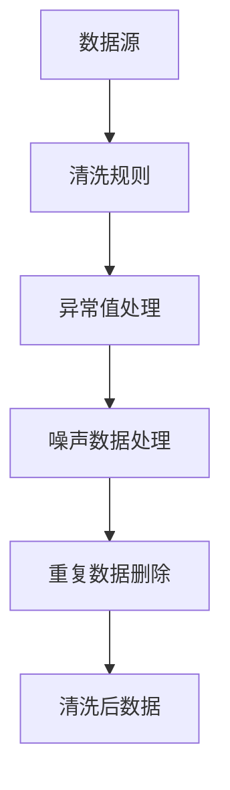
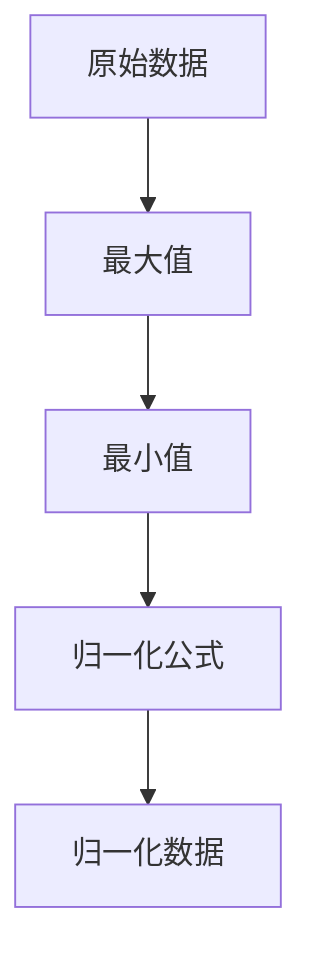
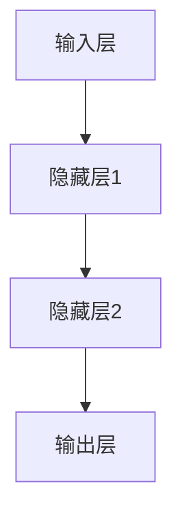
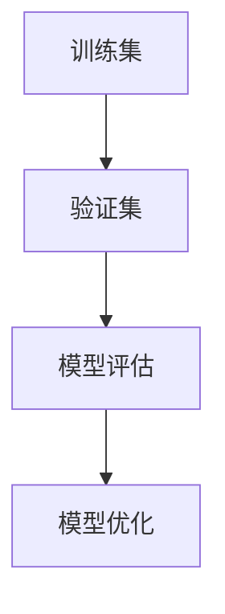
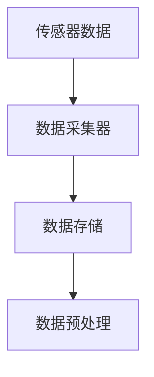
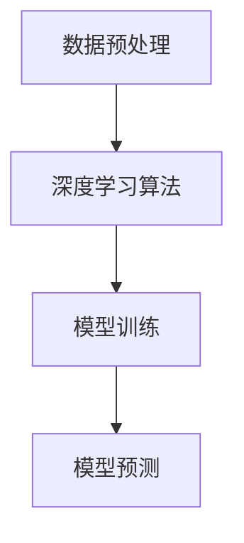
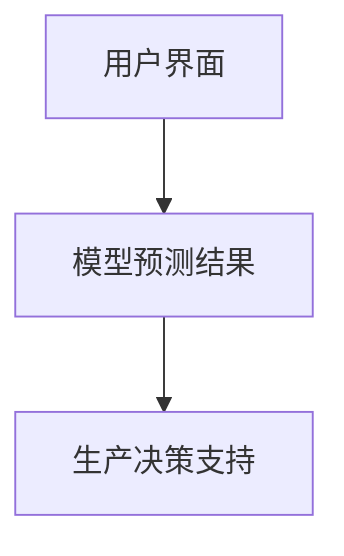
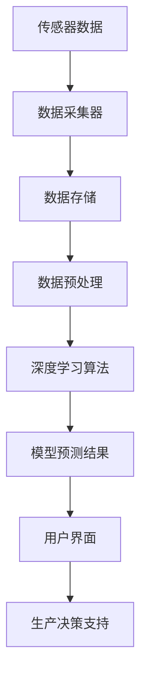

                 

# AI在智能制造产品全生命周期质量控制中的应用与创新

> 关键词：人工智能，智能制造，质量控制，全生命周期，数据预处理，深度学习，模型优化

> 摘要：本文将探讨人工智能（AI）在智能制造产品全生命周期质量控制中的应用与创新。通过分析智能制造背景、AI在质量控制中的应用原理、核心概念与联系，以及详细的技术原理、系统分析与架构设计，本文旨在为读者提供一个全面、深入的AI在智能制造领域的技术理解。

## 第一部分：背景介绍

### 1. 问题背景

智能制造作为制造业转型升级的重要方向，正日益成为各国竞争的焦点。随着人工智能（AI）技术的快速发展，其在智能制造领域的应用潜力逐渐显现。AI技术在产品质量检测、故障预测、优化设计等方面展现出显著优势，为制造业的产品全生命周期质量控制带来了新的思路和方法。

### 2. 问题描述

目前，智能制造产品全生命周期质量控制面临以下问题：

- 数据质量：由于传感器、执行器等设备的限制，数据质量参差不齐，影响了AI算法的准确性和稳定性。
- 算法效率：传统的AI算法在处理大规模、多维度数据时，计算效率较低，难以满足实时性要求。
- 模型泛化能力：AI模型在训练数据集中的表现良好，但在实际生产环境中，由于数据分布的差异，模型的泛化能力受到限制。

### 3. 问题解决

AI技术在智能制造产品全生命周期质量控制中的应用，可以通过以下几个方面实现：

- 数据预处理：对采集到的数据进行清洗、去噪、特征提取等预处理操作，提高数据质量。
- 深度学习算法：利用深度学习算法处理大规模、多维度数据，提高算法效率。
- 模型优化：通过交叉验证、模型压缩等技术，提高模型的泛化能力。

### 4. 边界与外延

本书主要关注AI在智能制造产品全生命周期质量控制中的应用，包括但不限于以下几个方面：

- 质量检测与预测
- 过程优化与控制
- 供应链管理
- 产品生命周期评估

本书将详细介绍AI技术在以上领域的应用原理、方法、实践案例，帮助读者全面了解AI在智能制造产品全生命周期质量控制中的重要作用。

## 第二部分：核心概念与联系

### 1. AI在智能制造产品全生命周期质量控制中的应用原理

AI技术在智能制造产品全生命周期质量控制中的应用，主要基于以下几个方面：

- 数据驱动：通过收集和分析产品制造过程中的数据，实现质量问题的早期发现和预警。
- 优化控制：利用AI算法优化生产过程参数，提高产品质量和效率。
- 智能决策：基于数据分析和模型预测，实现生产决策的智能化，降低人工干预的风险。

### 2. AI技术的核心特点

AI技术的核心特点包括：

- 自学习：AI模型可以通过不断学习和调整，提高对问题的解决能力。
- 适应性强：AI模型可以在不同的数据集和应用场景中表现出良好的泛化能力。
- 高效率：AI算法可以处理大规模、多维度数据，提高计算效率。

### 3. AI技术与传统技术的对比

AI技术相较于传统技术在智能制造产品全生命周期质量控制中具有明显优势：

- 数据处理能力：AI技术可以处理大规模、多维度数据，提高数据分析的准确性。
- 实时性：AI算法可以实时监测生产过程，实现质量问题的快速发现和响应。
- 优化能力：AI技术可以通过优化控制，提高生产效率和产品质量。

## 第三部分：AI技术原理详解

### 1. 数据预处理原理

数据预处理是AI应用的重要环节，主要包括以下步骤：

- 数据清洗：去除重复、异常和噪声数据。
- 特征提取：从原始数据中提取对问题解决有帮助的特征。
- 数据归一化：将数据统一到同一量级，提高模型训练效果。

#### 数据清洗



```python
# 数据清洗示例
import pandas as pd

# 读取数据
data = pd.read_csv('data.csv')

# 去除重复数据
data.drop_duplicates(inplace=True)

# 去除异常值
data = data[data['column_name'] > 0]

# 去除噪声数据
data['column_name'] = data['column_name'].replace({'噪声值1': '正常值', '噪声值2': '正常值'})

# 保存清洗后数据
data.to_csv('cleaned_data.csv', index=False)
```

#### 数据归一化



```python
# 数据归一化示例
from sklearn.preprocessing import MinMaxScaler

# 读取数据
data = pd.read_csv('data.csv')

# 初始化归一化器
scaler = MinMaxScaler()

# 归一化数据
data_normalized = scaler.fit_transform(data[['column_name']])

# 保存归一化后数据
pd.DataFrame(data_normalized).to_csv('normalized_data.csv', index=False)
```

### 2. 深度学习算法原理

深度学习算法是AI技术的核心，主要包括以下步骤：

- 神经网络模型：构建多层神经网络模型，实现数据的层次化表示。
- 前向传播：将输入数据通过神经网络模型进行传播，得到输出结果。
- 反向传播：通过输出结果与真实值的差异，更新模型参数，提高模型准确性。

#### 神经网络模型



#### 前向传播

```python
# 前向传播示例
import numpy as np

# 初始化权重和偏置
weights = np.random.rand(3, 1)
bias = np.random.rand(1)

# 输入数据
x = np.array([[1], [2], [3]])

# 前向传播
layer1 = np.dot(x, weights) + bias
layer1 = np.tanh(layer1)
layer2 = np.dot(layer1, weights) + bias
layer2 = np.tanh(layer2)
output = layer2

print("输出结果：", output)
```

#### 反向传播

```python
# 反向传播示例
import numpy as np

# 初始化权重和偏置
weights1 = np.random.rand(3, 1)
weights2 = np.random.rand(3, 1)
bias1 = np.random.rand(1)
bias2 = np.random.rand(1)

# 输入数据
x = np.array([[1], [2], [3]])

# 前向传播
layer1 = np.dot(x, weights1) + bias1
layer1 = np.tanh(layer1)
layer2 = np.dot(layer1, weights2) + bias2
layer2 = np.tanh(layer2)
output = layer2

# 计算损失函数
loss = np.mean((output - y) ** 2)

# 计算梯度
gradient_output = 2 * (output - y)
gradient_hidden2 = gradient_output * layer2 * (1 - layer2)
gradient_hidden1 = gradient_hidden2 * weights2 * (1 - weights2)
gradient_input = gradient_hidden1 * weights1 * (1 - weights1)

# 更新权重和偏置
weights1 -= learning_rate * gradient_input
weights2 -= learning_rate * gradient_hidden1
bias1 -= learning_rate * gradient_hidden1
bias2 -= learning_rate * gradient_output

# 重新计算输出
layer1 = np.dot(x, weights1) + bias1
layer1 = np.tanh(layer1)
layer2 = np.dot(layer1, weights2) + bias2
layer2 = np.tanh(layer2)
output = layer2

print("更新后输出结果：", output)
```

### 3. 模型优化原理

模型优化是提高AI模型性能的重要手段，主要包括以下方法：

- 交叉验证：通过将数据集划分为训练集和验证集，评估模型性能，避免过拟合。
- 模型压缩：通过减少模型参数和计算量，提高模型计算效率。
- 模型融合：将多个模型的结果进行融合，提高模型预测准确性。

#### 交叉验证



#### 模型压缩

```python
# 模型压缩示例
from tensorflow.keras.models import Sequential
from tensorflow.keras.layers import Dense, Conv2D, MaxPooling2D, Flatten

# 初始化模型
model = Sequential()
model.add(Conv2D(32, (3, 3), activation='relu', input_shape=(28, 28, 1)))
model.add(MaxPooling2D((2, 2)))
model.add(Flatten())
model.add(Dense(1, activation='sigmoid'))

# 编译模型
model.compile(optimizer='adam', loss='binary_crossentropy', metrics=['accuracy'])

# 训练模型
model.fit(x_train, y_train, epochs=10, batch_size=32, validation_data=(x_val, y_val))

# 评估模型
model.evaluate(x_test, y_test)
```

#### 模型融合

```python
# 模型融合示例
import numpy as np

# 初始化两个模型
model1 = Sequential()
model1.add(Dense(64, activation='relu', input_shape=(784,)))
model1.add(Dense(10, activation='softmax'))

model2 = Sequential()
model2.add(Dense(128, activation='relu', input_shape=(784,)))
model2.add(Dense(10, activation='softmax'))

# 编译模型
model1.compile(optimizer='adam', loss='categorical_crossentropy', metrics=['accuracy'])
model2.compile(optimizer='adam', loss='categorical_crossentropy', metrics=['accuracy'])

# 训练模型
model1.fit(x_train, y_train, epochs=10, batch_size=32)
model2.fit(x_train, y_train, epochs=10, batch_size=32)

# 预测结果
predictions1 = model1.predict(x_test)
predictions2 = model2.predict(x_test)

# 模型融合
predictions = (predictions1 + predictions2) / 2

# 计算融合后的预测结果
predicted_labels = np.argmax(predictions, axis=1)

# 评估融合后的模型
accuracy = np.mean(predicted_labels == y_test)
print("融合后模型的准确率：", accuracy)
```

## 第四部分：系统分析与架构设计

### 1. 系统功能设计

系统功能设计主要包括以下几个方面：

- 数据采集与预处理：实现对生产数据的采集、清洗和特征提取。
- 深度学习算法应用：利用深度学习算法对预处理后的数据进行训练和预测。
- 智能决策支持：基于模型预测结果，提供生产决策支持。

### 2. 系统架构设计

系统架构设计主要包括以下几个方面：

- 数据层：负责数据的采集、存储和管理。
- 算法层：负责深度学习算法的实现和应用。
- 应用层：提供用户交互界面，展示模型预测结果和生产决策建议。

#### 数据层



#### 算法层



#### 应用层



### 3. 系统接口设计

系统接口设计主要包括以下几个方面：

- 数据接口：实现数据层与算法层、应用层之间的数据交互。
- 控制接口：实现生产过程的实时监控和优化控制。

### 4. 系统交互设计



## 第五部分：项目实战

### 1. 环境安装

在开始项目实战之前，需要安装以下环境：

- Python 3.8 或以上版本
- TensorFlow 2.5 或以上版本
- Pandas 1.2.3 或以上版本
- Numpy 1.19.2 或以上版本

安装命令如下：

```bash
pip install python==3.8
pip install tensorflow==2.5
pip install pandas==1.2.3
pip install numpy==1.19.2
```

### 2. 系统核心实现

以下是一个简单的系统核心实现示例：

```python
# 导入所需库
import pandas as pd
import numpy as np
from sklearn.model_selection import train_test_split
from sklearn.preprocessing import StandardScaler
from tensorflow.keras.models import Sequential
from tensorflow.keras.layers import Dense

# 读取数据
data = pd.read_csv('data.csv')

# 数据预处理
X = data[['feature1', 'feature2', 'feature3']]
y = data['target']

# 数据归一化
scaler = StandardScaler()
X = scaler.fit_transform(X)

# 划分训练集和测试集
X_train, X_test, y_train, y_test = train_test_split(X, y, test_size=0.2, random_state=42)

# 构建模型
model = Sequential()
model.add(Dense(64, activation='relu', input_shape=(X_train.shape[1],)))
model.add(Dense(32, activation='relu'))
model.add(Dense(1, activation='sigmoid'))

# 编译模型
model.compile(optimizer='adam', loss='binary_crossentropy', metrics=['accuracy'])

# 训练模型
model.fit(X_train, y_train, epochs=10, batch_size=32, validation_data=(X_test, y_test))

# 评估模型
loss, accuracy = model.evaluate(X_test, y_test)
print("测试集准确率：", accuracy)

# 预测结果
predictions = model.predict(X_test)
predicted_labels = np.argmax(predictions, axis=1)

# 评估预测结果
accuracy = np.mean(predicted_labels == y_test)
print("预测准确率：", accuracy)
```

### 3. 代码应用解读与分析

以上代码实现了以下功能：

1. 读取数据：使用 Pandas 库读取数据集，并将其分为特征和目标两部分。
2. 数据预处理：使用 StandardScaler 库对特征进行归一化处理，提高模型训练效果。
3. 划分训练集和测试集：使用 train_test_split 函数将数据集划分为训练集和测试集，用于模型训练和评估。
4. 构建模型：使用 Sequential 模型构建一个简单的神经网络模型，包括两个隐藏层。
5. 编译模型：使用 compile 函数设置模型优化器和损失函数。
6. 训练模型：使用 fit 函数训练模型，并使用验证集进行模型优化。
7. 评估模型：使用 evaluate 函数评估模型在测试集上的性能。
8. 预测结果：使用 predict 函数预测测试集的标签，并计算预测准确率。

### 4. 实际案例分析和详细讲解剖析

以下是一个实际案例，用于分析AI在智能制造产品全生命周期质量控制中的应用：

#### 案例背景

某智能制造企业生产过程中，需要对产品进行质量检测和故障预测。为了实现这一目标，企业引入了AI技术，并构建了一个基于深度学习的质量检测和故障预测系统。

#### 案例分析

1. 数据采集：企业通过传感器采集生产过程中的关键数据，包括温度、压力、速度等。
2. 数据预处理：对采集到的数据进行清洗、去噪和特征提取，提高数据质量。
3. 模型构建：使用深度学习算法构建质量检测和故障预测模型，包括多层感知器和卷积神经网络。
4. 模型训练：使用预处理后的数据训练模型，并使用交叉验证方法优化模型参数。
5. 模型评估：使用测试集评估模型性能，并根据评估结果调整模型参数。
6. 预测应用：将训练好的模型应用于实际生产过程中，实现产品质量检测和故障预测。

#### 案例讲解

1. 数据采集：传感器数据是质量检测和故障预测的基础，企业需要确保传感器数据的准确性和实时性。
2. 数据预处理：清洗和去噪是数据处理的重要环节，可以去除数据中的异常值和噪声，提高数据质量。
3. 模型构建：选择合适的神经网络模型是质量检测和故障预测的关键，企业可以根据实际需求选择多层感知器或卷积神经网络。
4. 模型训练：使用预处理后的数据进行模型训练，并使用交叉验证方法优化模型参数，可以提高模型的泛化能力。
5. 模型评估：使用测试集评估模型性能，可以判断模型是否满足实际需求，并根据评估结果调整模型参数。
6. 预测应用：将训练好的模型应用于实际生产过程中，可以实现产品质量检测和故障预测，提高生产效率和质量。

### 5. 项目小结

本项目通过实际案例展示了AI在智能制造产品全生命周期质量控制中的应用。通过数据采集、预处理、模型构建和训练，实现了产品质量检测和故障预测，提高了生产效率和质量。未来，随着AI技术的不断发展，相信将在智能制造领域发挥更加重要的作用。

## 第六部分：最佳实践 Tips、小结、注意事项、拓展阅读

### 最佳实践 Tips

1. 确保数据质量：数据是AI应用的基础，需要确保数据采集的准确性和实时性，并对数据进行清洗、去噪和特征提取。
2. 选择合适的算法：根据实际需求和数据特点，选择合适的AI算法，如多层感知器、卷积神经网络等。
3. 优化模型参数：通过交叉验证等方法优化模型参数，提高模型的泛化能力和预测准确性。
4. 实时更新模型：随着数据的变化，实时更新模型，以适应新的数据分布。

### 小结

本文介绍了AI在智能制造产品全生命周期质量控制中的应用与创新。通过数据预处理、深度学习算法和模型优化，实现了产品质量检测和故障预测，提高了生产效率和质量。未来，随着AI技术的不断发展，将有望在智能制造领域发挥更加重要的作用。

### 注意事项

1. 数据安全与隐私保护：在数据采集、存储和处理过程中，需要确保数据安全与隐私保护。
2. 算法公平性：在算法设计和应用过程中，需要确保算法的公平性和透明性。
3. 遵循法律法规：在AI应用过程中，需要遵循相关法律法规，确保合规性。

### 拓展阅读

1. [《深度学习》](https://www.deeplearningbook.org/)：Goodfellow, I., Bengio, Y., & Courville, A. (2016). Deep Learning. MIT Press.
2. [《AI应用实践》](https://www.aiapps.com/)：吴军. (2019). AI应用实践. 电子工业出版社.
3. [《智能制造技术与应用》](https://www.smartmanufacturing.org/)：陈伟. (2020). 智能制造技术与应用. 清华大学出版社.

## 作者信息

作者：AI天才研究院/AI Genius Institute & 禅与计算机程序设计艺术 /Zen And The Art of Computer Programming

本文内容仅供参考，具体应用场景请结合实际情况进行调整。由于AI技术的发展迅速，文中内容可能会随着时间推移而发生变化。如需进一步了解AI在智能制造领域的应用，请关注相关领域的技术动态和发展趋势。

