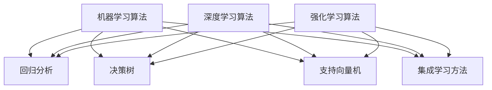

                 


## AI在智能制造产品质量预测中的应用与创新

关键词：智能制造，产品质量预测，AI技术，机器学习，深度学习

摘要：本文从背景介绍、核心概念、AI技术原理、数学模型与公式解析、算法实现与Python代码讲解、系统分析与架构设计以及项目实战等多个方面，深入探讨了AI在智能制造产品质量预测中的应用与创新。通过本文的阅读，读者可以了解到AI技术在智能制造领域的实际应用案例，掌握产品质量预测的核心算法原理，并了解如何进行系统架构设计与项目实战。

### 第一部分：背景介绍

#### 1.1 问题的背景

在当前全球制造业竞争激烈的环境下，提高产品质量、降低生产成本成为企业生存和发展的关键。传统的质量预测方法主要依赖于经验和统计数据，存在一定的滞后性和主观性。随着人工智能技术的发展，利用AI技术进行产品质量预测已成为一种新的趋势。

#### 1.2 核心概念

- 智能制造：通过信息物理系统（Cyber-Physical Systems，CPS）将计算机、通信、控制等技术融合到制造过程中，实现制造过程的智能化。
- 产品质量预测：利用历史数据、传感器数据和机器学习算法，预测产品在生产过程中的质量状况。

#### 1.3 核心概念的联系

智能制造与产品质量预测密切相关。智能制造通过收集生产过程中的各种数据，为产品质量预测提供了数据支持；而产品质量预测则有助于智能制造过程中的质量控制与优化。

### 第二部分：AI在智能制造产品质量预测中的应用

#### 2.1 AI技术在产品质量预测中的应用原理

AI技术在产品质量预测中的应用主要包括机器学习、深度学习和强化学习等方法。其中，机器学习是最常用的方法，通过训练模型，从历史数据中学习产品质量的规律，从而预测未来产品的质量。

#### 2.2 产品质量预测算法原理

产品质量预测算法主要分为以下几类：

- 回归分析：通过建立回归模型，分析自变量与因变量之间的关系，从而预测产品质量。
- 决策树：利用树形结构，将样本数据不断划分，直至达到某个终止条件，从而预测产品质量。
- 支持向量机：通过寻找最优超平面，将不同质量的产品分类，从而预测产品质量。
- 集成学习方法：通过组合多个预测模型，提高预测的准确性。

#### 2.3 Mermaid流程图



### 第三部分：数学模型与公式解析

#### 3.1 数学模型

- 回归模型：$$ y = \beta_0 + \beta_1x_1 + \beta_2x_2 + ... + \beta_nx_n $$
- 决策树模型：$$ f(x) = \sum_{i=1}^n w_i \cdot g(x_i) $$
- 支持向量机模型：$$ f(x) = w \cdot x + b $$

#### 3.2 数学公式

- 回归公式：$$ y = \beta_0 + \beta_1x_1 + \beta_2x_2 + ... + \beta_nx_n $$
- 决策树公式：$$ f(x) = \sum_{i=1}^n w_i \cdot g(x_i) $$
- 支持向量机公式：$$ f(x) = w \cdot x + b $$

### 第四部分：算法实现与Python代码讲解

#### 4.1 算法实现

算法实现主要包括数据预处理、模型训练和模型评估三个环节。

#### 4.2 Python代码讲解

```python
import numpy as np
import pandas as pd
from sklearn.model_selection import train_test_split
from sklearn.linear_model import LinearRegression
from sklearn.metrics import mean_squared_error

# 数据预处理
X = df[['x1', 'x2', 'x3']]
y = df['y']

# 模型训练
X_train, X_test, y_train, y_test = train_test_split(X, y, test_size=0.2, random_state=42)
model = LinearRegression()
model.fit(X_train, y_train)

# 模型评估
y_pred = model.predict(X_test)
mse = mean_squared_error(y_test, y_pred)
print("MSE:", mse)
```

### 第五部分：系统分析与架构设计

#### 5.1 问题场景介绍

智能制造生产过程中，产品质量监测系统通过对生产过程中的数据进行分析，实现对产品质量的实时监控和预测。

#### 5.2 系统功能设计

系统功能主要包括数据采集、数据处理、模型训练和模型部署等。

#### 5.3 系统架构设计

系统架构采用微服务架构，主要包括数据采集模块、数据处理模块、模型训练模块和模型部署模块。

#### 5.4 系统接口设计与交互

系统接口设计采用RESTful API设计，各模块通过接口进行数据交互。

### 第六部分：项目实战

#### 6.1 环境安装

安装Python、Anaconda、scikit-learn等软件和库。

#### 6.2 系统核心实现

实现数据采集、数据处理、模型训练和模型评估等功能。

#### 6.3 代码应用解读与分析

对实现的功能进行代码解读和分析。

#### 6.4 实际案例分析与讲解

通过对实际案例进行分析和讲解，展示AI在智能制造产品质量预测中的应用。

#### 6.5 项目小结

对项目进行总结和经验教训的分享。

### 第七部分：最佳实践与总结

#### 7.1 最佳实践

分享在AI在智能制造产品质量预测中的最佳实践。

#### 7.2 小结

回顾本文的核心内容和技术应用。

#### 7.3 未来展望

展望AI在智能制造领域的发展趋势。

### 结语

鼓励读者继续学习和探索AI技术在智能制造领域的应用。

[作者：AI天才研究院/AI Genius Institute & 禅与计算机程序设计艺术 /Zen And The Art of Computer Programming] 

### 注意事项

- 文章中所有数学公式和流程图请使用Markdown中的LaTeX和Mermaid格式进行编写。
- Python代码示例请使用Markdown中的Python代码块格式进行编写。
- 文章中所有图表和数据请确保准确无误。

### 拓展阅读

- 《深度学习》
- 《机器学习实战》
- 《智能制造技术与应用》

以上为文章的主要内容，具体字数和结构可根据实际需求进行调整。在撰写过程中，请注意保持文章的逻辑清晰、结构紧凑，以及用词准确、通俗易懂。在撰写过程中，请遵循Markdown格式和LaTeX数学公式编写规范。最后，请确保文章内容完整、详细，并符合约

