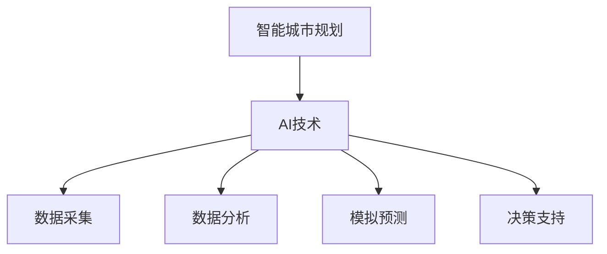
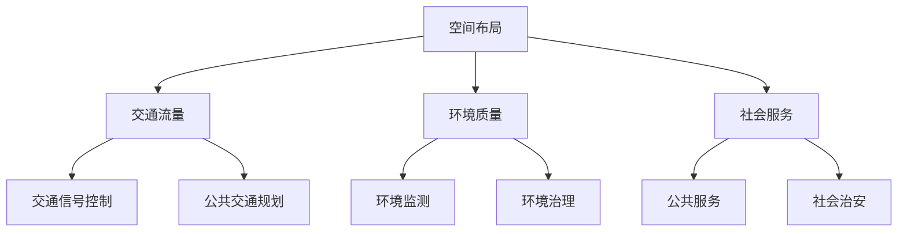

                 

# AI在智能城市规划中的多维度优化应用

## 关键词

- 智能城市规划
- AI技术
- 多维度优化
- 深度学习
- 强化学习
- 模糊优化

## 摘要

本文旨在探讨人工智能（AI）在智能城市规划中的多维度优化应用。随着城市化进程的加速，智能城市规划成为推动城市可持续发展的重要手段。本文首先介绍了智能城市规划和AI技术的核心概念，然后详细分析了多维度优化的定义、目标和实现方法。接着，本文重点介绍了AI技术在智能城市规划中的应用，包括城市数据分析和模拟预测、智能交通管理和环境保护等方面。最后，通过具体案例分析，展示了多维度优化在智能城市规划中的实际应用效果，并展望了AI与智能城市规划的未来发展趋势。

## 第1章 引言

### 1.1 问题背景

#### 1.1.1 智能城市规划的意义

智能城市规划是指利用先进的信息技术，特别是人工智能技术，对城市进行全面、系统的规划与管理，以实现城市可持续发展、资源优化配置和居民生活品质提升。随着城市化进程的加快，城市规模不断扩大，人口密度增加，城市交通、环境、公共安全等问题日益突出。智能城市规划可以通过优化资源配置、提升城市管理水平，有效解决这些问题，促进城市的可持续发展。

#### 1.1.2 AI技术在城市规划中的应用现状

目前，AI技术在城市规划中已经得到了广泛应用。例如，通过机器学习算法进行城市数据分析，可以帮助规划者更准确地了解城市现状，发现潜在问题；通过深度学习算法进行城市模拟预测，可以预测城市未来的发展趋势，为规划决策提供科学依据；通过强化学习算法进行城市交通信号控制，可以缓解交通拥堵，提高交通效率。然而，AI技术在城市规划中的应用仍然面临许多挑战，如数据质量、算法性能、系统稳定性等。

#### 1.1.3 AI在智能城市规划中的挑战

首先，数据质量是AI技术在城市规划中应用的关键因素。城市规划涉及到大量的数据，如人口、交通、环境等，这些数据的准确性、完整性和一致性对AI算法的性能有重要影响。其次，算法性能是决定AI技术在城市规划中应用效果的重要因素。目前，AI算法在复杂度、计算效率等方面仍存在一定局限，需要进一步优化。此外，系统稳定性也是AI技术在城市规划中应用的重要挑战。城市规划是一个复杂的系统工程，AI系统需要具备较强的鲁棒性和适应性，以应对各种不确定性。

### 1.2 核心概念

#### 1.2.1 智能城市规划的定义

智能城市规划是指利用人工智能、大数据、物联网等先进技术，对城市进行全面、系统的规划与管理，以实现城市可持续发展、资源优化配置和居民生活品质提升的目标。

#### 1.2.2 AI技术的定义及分类

人工智能（AI）是指计算机系统通过模拟人类智能行为，实现自主感知、学习、推理和决策等能力的技术。根据实现方式，AI技术可以分为机器学习、深度学习、强化学习等。

- **机器学习**：通过数据训练，让计算机自动学习规律，实现特定任务。
- **深度学习**：基于多层神经网络，模拟人脑神经元连接，实现复杂任务的自动学习。
- **强化学习**：通过试错学习，优化策略，实现最优决策。

#### 1.2.3 多维度优化的概念

多维度优化是指从多个维度对系统进行优化，以实现整体性能提升。在智能城市规划中，多维度优化涉及到城市规划的多个方面，如空间布局、交通流量、环境质量等。

### 1.3 概念关系图

#### 1.3.1 智能城市规划与AI技术的联系

智能城市规划与AI技术密切相关。AI技术为智能城市规划提供了数据采集、分析、预测和决策支持等手段，如图1.1所示。

#### 1.3.2 多维度优化的实现方法

多维度优化涉及到城市规划的多个方面，如图1.2所示。

### 1.4 内容框架

#### 1.4.1 本书的目标

本书旨在探讨AI在智能城市规划中的多维度优化应用，帮助读者深入了解智能城市规划的概念、技术和方法，以及AI技术在城市规划中的具体应用。

#### 1.4.2 内容组织结构

本书分为七个章节，首先介绍智能城市规划的背景和核心概念，然后详细介绍AI技术的基础知识，接着分析多维度优化的概念和方法，最后通过具体案例分析，展示AI在智能城市规划中的多维度优化应用。

#### 1.4.3 读者对象

本书适合从事城市规划、人工智能领域的研究人员、工程师和技术人员阅读，也可作为高等院校相关专业的教学参考书。

----------------------------------------------------------------

## 第2章 AI技术基础

### 2.1 AI技术概述

#### 2.1.1 AI技术的发展历程

人工智能（AI）技术的发展可以追溯到20世纪50年代。当时，科学家们开始探索如何让计算机模拟人类智能行为。早期的AI研究主要集中在逻辑推理和知识表示方面，取得了初步成果。然而，受限于计算能力和算法复杂度，早期AI研究进展缓慢。

随着计算机硬件性能的提升和算法研究的深入，AI技术在20世纪80年代开始逐渐取得突破。特别是机器学习（Machine Learning）和深度学习（Deep Learning）的兴起，使得AI技术取得了飞跃性的进展。机器学习通过从数据中学习规律，实现特定任务的自动化。深度学习则通过多层神经网络，模拟人脑神经元连接，实现复杂任务的自动学习。

进入21世纪，随着大数据和云计算技术的普及，AI技术得到了更加广泛的应用。特别是在语音识别、图像识别、自然语言处理等领域，AI技术取得了显著的成果。

#### 2.1.2 AI技术的核心算法

AI技术的核心算法主要包括机器学习、深度学习和强化学习。

- **机器学习**：机器学习是通过数据训练，让计算机自动学习规律，实现特定任务。其核心算法包括监督学习、无监督学习和强化学习。监督学习通过已有数据学习预测模型；无监督学习通过未标记的数据学习数据分布；强化学习通过试错学习，优化策略，实现最优决策。
- **深度学习**：深度学习是基于多层神经网络，模拟人脑神经元连接，实现复杂任务的自动学习。其核心算法包括卷积神经网络（CNN）、循环神经网络（RNN）和生成对抗网络（GAN）等。
- **强化学习**：强化学习通过试错学习，优化策略，实现最优决策。其核心算法包括Q学习、深度Q网络（DQN）和策略梯度算法等。

#### 2.1.3 AI技术的应用领域

AI技术已经广泛应用于各个领域，如图像识别、语音识别、自然语言处理、医疗诊断、金融风控、自动驾驶等。以下是一些典型的应用领域：

- **图像识别**：通过深度学习算法，计算机可以自动识别和分类图像。应用领域包括安防监控、人脸识别、自动驾驶等。
- **语音识别**：通过语音信号处理和深度学习算法，计算机可以自动识别和理解人类语音。应用领域包括智能助手、电话客服等。
- **自然语言处理**：通过机器学习和深度学习算法，计算机可以自动处理和理解人类语言。应用领域包括文本分类、机器翻译、情感分析等。
- **医疗诊断**：通过深度学习和大数据分析，计算机可以自动识别疾病和预测患者病情。应用领域包括医学影像诊断、药物研发等。
- **金融风控**：通过大数据分析和机器学习算法，金融机构可以自动识别风险和预测市场走势。应用领域包括信用评估、风险控制、投资策略等。
- **自动驾驶**：通过计算机视觉、深度学习和传感器技术，自动驾驶汽车可以自动识别道路标志、行人、车辆等，实现自动驾驶。应用领域包括自动驾驶汽车、无人机等。

### 2.2 机器学习

#### 2.2.1 机器学习的定义

机器学习（Machine Learning）是指通过数据训练，让计算机自动学习规律，实现特定任务。机器学习的主要目标是让计算机从数据中学习，而不是通过手动编程实现。

#### 2.2.2 机器学习的分类

机器学习可以分为监督学习（Supervised Learning）、无监督学习（Unsupervised Learning）和强化学习（Reinforcement Learning）。

- **监督学习**：监督学习通过已有数据学习预测模型。输入数据包含特征和标签，通过训练模型，使得模型能够预测新的数据。常见的算法包括线性回归、逻辑回归、支持向量机（SVM）等。
- **无监督学习**：无监督学习通过未标记的数据学习数据分布。输入数据只有特征，没有标签。常见的算法包括聚类、降维、异常检测等。
- **强化学习**：强化学习通过试错学习，优化策略，实现最优决策。输入数据包括当前状态、动作和奖励，通过不断试错，学习最优策略。常见的算法包括Q学习、深度Q网络（DQN）和策略梯度算法等。

#### 2.2.3 机器学习的主要算法

- **线性回归**：线性回归是一种最简单的监督学习算法，通过线性关系预测目标值。线性回归的数学模型为：$$ y = \beta_0 + \beta_1x_1 + \beta_2x_2 + ... + \beta_nx_n $$
  
  其中，$y$为预测值，$x_1, x_2, ..., x_n$为特征值，$\beta_0, \beta_1, ..., \beta_n$为模型参数。

- **逻辑回归**：逻辑回归是一种用于分类的监督学习算法，通过线性关系预测概率。逻辑回归的数学模型为：$$ \log(\frac{p}{1-p}) = \beta_0 + \beta_1x_1 + \beta_2x_2 + ... + \beta_nx_n $$
  
  其中，$p$为预测的概率，$x_1, x_2, ..., x_n$为特征值，$\beta_0, \beta_1, ..., \beta_n$为模型参数。

- **支持向量机（SVM）**：支持向量机是一种用于分类和回归的监督学习算法，通过找到最佳超平面，最大化分类边界。SVM的数学模型为：$$ \max_w \frac{1}{2} ||w||^2 $$
  
  其中，$w$为权重向量。

- **聚类**：聚类是一种无监督学习算法，通过将数据划分为不同的簇，使得同一簇的数据尽可能接近，不同簇的数据尽可能远离。常见的聚类算法包括K均值聚类、层次聚类等。

- **降维**：降维是一种无监督学习算法，通过减少数据维度，降低数据复杂度，提高计算效率。常见的降维算法包括主成分分析（PCA）、线性判别分析（LDA）等。

- **异常检测**：异常检测是一种无监督学习算法，通过检测数据中的异常值，识别数据中的异常行为。常见的异常检测算法包括孤立森林、基于密度的方法等。

### 2.3 深度学习

#### 2.3.1 深度学习的定义

深度学习（Deep Learning）是一种基于多层神经网络的人工智能技术，通过模拟人脑神经元连接，实现复杂任务的自动学习。深度学习通过大量数据训练，能够自动提取数据中的特征，并实现高度复杂的预测和分类任务。

#### 2.3.2 深度学习的主要算法

- **卷积神经网络（CNN）**：卷积神经网络是一种用于图像识别和图像处理的深度学习算法。CNN通过卷积层、池化层和全连接层等结构，实现图像的特征提取和分类。CNN的主要优点是能够自动提取图像中的局部特征，提高分类准确率。

- **循环神经网络（RNN）**：循环神经网络是一种用于序列数据处理和序列预测的深度学习算法。RNN通过循环结构，实现序列数据的记忆和预测。RNN的主要优点是能够处理变长的序列数据，并保留序列中的长程依赖关系。

- **生成对抗网络（GAN）**：生成对抗网络是一种用于生成对抗的深度学习算法。GAN由生成器和判别器组成，生成器生成数据，判别器判断数据是真实数据还是生成数据。GAN的主要优点是能够生成高质量的数据，并在图像生成、语音合成等领域取得了显著成果。

### 2.4 强化学习

#### 2.4.1 强化学习的定义

强化学习（Reinforcement Learning）是一种通过试错学习，优化策略，实现最优决策的人工智能技术。强化学习通过奖励机制，鼓励模型学习最优策略，以实现目标最大化。

#### 2.4.2 强化学习的主要算法

- **Q学习**：Q学习是一种基于值函数的强化学习算法。Q学习通过学习状态-动作值函数，找到最优策略。Q学习的数学模型为：$$ Q(s, a) = r + \gamma \max_{a'} Q(s', a') $$
  
  其中，$s$为当前状态，$a$为当前动作，$r$为奖励，$\gamma$为折扣因子，$s'$为下一状态，$a'$为下一动作。

- **深度Q网络（DQN）**：深度Q网络是一种基于深度学习的强化学习算法。DQN通过深度神经网络，学习状态-动作值函数，实现最优策略。DQN的主要优点是能够处理高维状态空间。

- **策略梯度算法**：策略梯度算法是一种基于策略的强化学习算法。策略梯度算法通过优化策略参数，实现最优策略。策略梯度算法的数学模型为：$$ \nabla_{\theta} J(\theta) = \nabla_{\theta} \sum_{t} \rho(s_t, a_t; \theta) \nabla_{\theta} \log \pi(a_t | s_t; \theta) $$
  
  其中，$\theta$为策略参数，$J(\theta)$为策略的期望收益，$\rho(s_t, a_t; \theta)$为策略的奖励函数，$\pi(a_t | s_t; \theta)$为策略的概率分布。

### 2.5 AI技术在城市规划中的应用

AI技术在城市规划中具有广泛的应用，如图像识别、语音识别、自然语言处理等。以下是一些具体的AI技术在城市规划中的应用案例：

- **图像识别**：利用图像识别技术，城市规划者可以自动识别和分析城市中的建筑、道路、车辆等元素，从而更好地了解城市现状，为规划决策提供数据支持。

- **语音识别**：利用语音识别技术，城市规划者可以自动记录和分析市民的意见和建议，从而更好地了解市民的需求，为规划决策提供参考。

- **自然语言处理**：利用自然语言处理技术，城市规划者可以自动分析大量的文本数据，提取关键信息，为规划决策提供数据支持。

- **交通流量预测**：利用深度学习技术，城市规划者可以预测城市未来的交通流量，为交通信号控制和公共交通规划提供科学依据。

- **环境质量监测**：利用传感器技术和数据分析技术，城市规划者可以实时监测城市环境质量，为环境保护提供数据支持。

- **智能交通管理**：利用AI技术，城市规划者可以自动识别和处理交通拥堵、交通事故等问题，提高交通效率和安全性。

- **城市规划模拟**：利用模拟技术，城市规划者可以在虚拟环境中模拟不同规划方案的效果，从而更好地评估规划方案的影响，为规划决策提供参考。

### 2.6 AI技术在城市规划中的挑战

尽管AI技术在城市规划中具有广泛的应用前景，但仍然面临许多挑战，包括数据质量、算法性能、系统稳定性等方面。

- **数据质量**：城市规划涉及大量的数据，包括人口、交通、环境等。这些数据的准确性、完整性和一致性对AI算法的性能有重要影响。如何处理和清洗这些数据，提高数据质量，是AI技术在城市规划中面临的重要挑战。

- **算法性能**：AI算法在复杂度、计算效率等方面仍存在一定局限，需要进一步优化。特别是在处理高维数据和大规模数据时，算法的性能瓶颈会更加突出。如何提高AI算法的性能，是实现AI技术在城市规划中广泛应用的关键。

- **系统稳定性**：城市规划是一个复杂的系统工程，AI系统需要具备较强的鲁棒性和适应性，以应对各种不确定性。如何在保证系统稳定性的前提下，实现高效、可靠的AI应用，是AI技术在城市规划中面临的挑战。

- **伦理和法律问题**：随着AI技术在城市规划中的应用，可能会涉及个人隐私、数据安全、伦理和法律等问题。如何确保AI技术在城市规划中的合法合规，保护市民的隐私权益，是AI技术在城市规划中需要关注的重要问题。

### 2.7 AI技术在城市规划中的发展趋势

随着AI技术的不断发展，其在城市规划中的应用前景十分广阔。以下是一些AI技术在城市规划中的发展趋势：

- **智能化数据分析**：利用AI技术，对城市数据进行智能化分析，提取关键信息，为规划决策提供数据支持。随着数据采集技术的进步，越来越多的城市数据将得到利用，为城市规划提供更丰富的数据支持。

- **个性化规划方案**：利用AI技术，为不同区域、不同群体提供个性化的规划方案。通过分析市民的需求和偏好，AI技术可以帮助城市规划者制定更符合市民需求的规划方案。

- **自动化决策支持**：利用AI技术，实现城市规划的自动化决策支持。通过构建智能规划模型，AI技术可以自动生成规划方案，提高规划决策的效率和准确性。

- **智慧城市管理**：利用AI技术，构建智慧城市管理体系，实现城市管理的智能化、精细化。通过实时监测和数据分析，AI技术可以协助城市规划者及时发现和解决城市问题，提高城市管理的效率。

- **跨领域融合**：AI技术与其他领域的融合，如物联网、大数据等，将推动城市规划的创新发展。通过跨领域的融合，AI技术可以为城市规划提供更多的创新思路和解决方案。

- **可持续发展**：随着全球对可持续发展的关注，AI技术在城市规划中的应用将更加注重可持续发展。通过优化资源配置、提高能源利用效率、改善环境质量等，AI技术可以为实现城市可持续发展做出贡献。

### 2.8 AI技术在城市规划中的未来前景

随着AI技术的不断发展，其在城市规划中的应用前景十分广阔。未来，AI技术在城市规划中可能实现以下前景：

- **更智能的城市规划**：通过AI技术的应用，城市规划将变得更加智能化，能够更好地满足市民的需求，提高城市的生活品质。

- **更高效的资源配置**：AI技术可以帮助城市规划者优化资源配置，提高城市的服务水平，降低城市的运营成本。

- **更环保的城市环境**：AI技术可以协助城市规划者改善城市环境质量，降低污染排放，促进城市可持续发展。

- **更安全的公共安全**：通过AI技术的应用，城市规划者可以更好地预防和应对公共安全事件，提高城市的公共安全水平。

- **更便捷的市民生活**：AI技术可以协助城市规划者提供更便捷的市民服务，如智能交通管理、智能公共服务等，提高市民的生活质量。

总之，AI技术在城市规划中的应用前景十分广阔，将为城市的发展带来前所未有的机遇。未来，随着AI技术的不断发展，城市规划将进入一个全新的智能化时代。

----------------------------------------------------------------

## 第3章 智能城市规划

### 3.1 智能城市规划概述

#### 3.1.1 智能城市规划的定义

智能城市规划（Smart Urban Planning）是指利用先进的信息技术，特别是人工智能（AI）技术，对城市进行全面、系统的规划与管理，以实现城市可持续发展、资源优化配置和居民生活品质提升的目标。智能城市规划的核心在于将AI技术应用于城市规划的各个阶段，包括数据采集、分析、模拟预测和决策支持等，从而提高城市规划的科学性、准确性和效率。

#### 3.1.2 智能城市规划的目标

智能城市规划的主要目标包括：

1. **可持续发展**：通过优化城市资源配置，提高能源利用效率，改善环境质量，实现城市的可持续发展。
2. **资源优化配置**：通过数据分析，优化城市的土地利用、交通网络和公共服务布局，提高资源利用效率。
3. **提升居民生活品质**：通过智能化的城市管理和服务，提高市民的生活质量，满足市民的需求和期望。
4. **提升城市竞争力**：通过优化城市功能和环境，提高城市的吸引力和竞争力，促进城市的经济发展。

#### 3.1.3 智能城市规划的关键技术

智能城市规划的关键技术主要包括：

1. **数据采集与处理**：利用传感器、物联网等技术，采集城市各种数据，如人口、交通、环境等，并对数据进行处理和分析，为城市规划提供数据支持。
2. **机器学习与深度学习**：利用机器学习和深度学习算法，对城市数据进行智能分析，提取有价值的信息，为城市规划提供科学依据。
3. **模拟预测**：通过模拟技术，预测城市未来的发展趋势，为规划决策提供参考。
4. **决策支持**：利用AI技术，提供智能化决策支持，帮助城市规划者制定最优规划方案。

### 3.2 智能城市规划的要素

智能城市规划涉及到多个要素，包括城市空间要素、社会经济要素和环境保护要素等。以下分别介绍这些要素：

#### 3.2.1 城市空间要素

城市空间要素是智能城市规划的重要基础。城市空间要素包括城市的地理位置、地形地貌、土地利用等。这些要素决定了城市的空间结构和布局，对城市规划具有重要影响。智能城市规划通过数据分析和模拟预测，优化城市空间布局，提高城市空间的利用效率。

- **地理位置**：城市的地理位置决定了城市的气候、地形等自然环境条件，对城市规划有重要影响。
- **地形地貌**：地形地貌决定了城市的地形特征，如山川、河流、平原等，对城市规划有重要影响。
- **土地利用**：土地利用是指城市各类用地的分布和规划，包括住宅区、商业区、工业区、公共设施区等。合理的土地利用规划可以提高城市的空间利用效率和居民生活质量。

#### 3.2.2 社会经济要素

社会经济要素是智能城市规划的重要参考。社会经济要素包括人口、经济、就业、收入等。这些要素反映了城市的经济状况和社会发展水平，对城市规划具有重要影响。智能城市规划通过数据分析和模拟预测，优化社会经济要素的布局，提高城市的经济活力和社会福祉。

- **人口**：人口是城市的核心要素，包括人口数量、人口结构、人口分布等。合理的人口布局可以提高城市的居民生活质量和城市的服务水平。
- **经济**：经济是城市发展的基础，包括经济增长、产业结构、就业情况等。合理的经济布局可以提高城市的竞争力和发展潜力。
- **就业**：就业是城市居民的重要生活来源，包括就业率、就业结构、就业质量等。合理的就业布局可以提高城市的就业水平和居民的生活质量。

#### 3.2.3 环境保护要素

环境保护要素是智能城市规划的重要目标。环境保护要素包括环境质量、资源利用、生态保护等。这些要素反映了城市的生态环境状况，对城市规划具有重要影响。智能城市规划通过数据分析和模拟预测，优化环境保护要素的布局，提高城市的生态环境质量。

- **环境质量**：环境质量是指城市的空气质量、水质、噪音等环境指标。合理的环境布局可以提高城市的生态环境质量，保障居民的健康。
- **资源利用**：资源利用是指城市的土地、水资源、能源等资源的利用效率和可持续性。合理的资源利用可以提高城市的资源利用效率，促进城市的可持续发展。
- **生态保护**：生态保护是指城市生态环境的保护和恢复，包括森林、湖泊、湿地等生态系统的保护。合理的生态布局可以提高城市的生态环境质量，促进城市的可持续发展。

### 3.3 智能城市规划的方法

智能城市规划的方法主要包括数据采集与处理、模型建立与优化、策略制定与评估等。

#### 3.3.1 数据采集与处理

数据采集与处理是智能城市规划的基础。智能城市规划需要大量数据作为支撑，包括人口、交通、环境、经济等。数据来源可以是政府统计部门、互联网、物联网设备等。数据采集后，需要进行数据清洗、预处理和整合，以便后续的分析和应用。

- **数据清洗**：数据清洗是指去除数据中的错误、重复和异常数据，提高数据的质量。数据清洗的方法包括数据去重、数据补全、数据修正等。
- **数据预处理**：数据预处理是指将原始数据进行转换、归一化、标准化等处理，使其满足分析模型的要求。数据预处理的方法包括特征提取、特征选择、特征工程等。
- **数据整合**：数据整合是指将不同来源的数据进行整合，形成一个统一的数据集。数据整合的方法包括数据融合、数据集成、数据仓库等。

#### 3.3.2 模型建立与优化

模型建立与优化是智能城市规划的核心。智能城市规划需要建立相应的数学模型，以模拟城市的发展趋势，预测未来的发展情况。常见的模型包括回归模型、决策树、神经网络等。模型建立后，需要进行优化，以提高模型的预测准确性和稳定性。

- **模型选择**：根据城市规划的目标和需求，选择合适的模型。常见的模型包括线性回归、决策树、随机森林、支持向量机、神经网络等。
- **模型训练**：使用历史数据进行模型的训练，调整模型的参数，使其达到最佳的预测效果。
- **模型优化**：通过交叉验证、网格搜索等方法，对模型进行优化，提高模型的预测准确性和稳定性。

#### 3.3.3 策略制定与评估

策略制定与评估是智能城市规划的实施步骤。在制定策略时，需要综合考虑城市的经济、社会、环境等因素，制定符合城市发展的策略。策略制定后，需要进行评估，以验证策略的有效性和可行性。

- **策略制定**：根据城市规划的目标和需求，制定相应的策略。策略可以包括土地利用规划、交通规划、环境保护规划等。
- **策略评估**：对制定的策略进行评估，分析策略的优缺点，验证策略的可行性和有效性。策略评估的方法包括成本效益分析、模拟预测、专家评估等。

### 3.4 智能城市规划的挑战与机遇

智能城市规划在带来巨大机遇的同时，也面临一系列挑战。

#### 3.4.1 挑战

1. **数据质量问题**：城市规划涉及大量数据，数据的准确性、完整性和一致性对规划结果有重要影响。如何处理和清洗这些数据，提高数据质量，是智能城市规划面临的挑战。
2. **算法性能瓶颈**：AI算法在处理高维数据和大规模数据时，可能会出现性能瓶颈。如何优化算法，提高处理效率，是智能城市规划面临的挑战。
3. **系统稳定性问题**：城市规划是一个复杂的系统工程，AI系统需要具备较强的鲁棒性和适应性，以应对各种不确定性。如何保证系统稳定性，是智能城市规划面临的挑战。
4. **伦理和法律问题**：AI技术在城市规划中的应用可能会涉及个人隐私、数据安全、伦理和法律等问题。如何确保AI技术的合法合规，保护市民的隐私权益，是智能城市规划面临的挑战。

#### 3.4.2 机遇

1. **提高规划效率**：通过AI技术的应用，可以显著提高城市规划的效率，减少人工工作量，提高规划准确性。
2. **优化资源配置**：通过AI技术的应用，可以优化城市资源的配置，提高土地利用效率，提高城市的可持续发展能力。
3. **改善居民生活质量**：通过AI技术的应用，可以提供更加便捷、高效的公共服务，提高市民的生活质量。
4. **促进经济发展**：通过AI技术的应用，可以推动城市产业升级，提高城市的竞争力，促进城市的经济发展。

### 3.5 智能城市规划的未来发展趋势

随着AI技术的不断发展和城市规划需求的不断提升，智能城市规划在未来将呈现以下发展趋势：

1. **数据驱动的规划**：未来城市规划将更加依赖大数据和AI技术，通过数据驱动的方式，提高规划的科学性和准确性。
2. **跨领域融合**：AI技术与其他领域的融合，如物联网、大数据、区块链等，将推动城市规划的创新发展。
3. **智能化决策支持**：通过AI技术的应用，实现城市规划的自动化决策支持，提高规划决策的效率和准确性。
4. **智慧城市管理**：通过AI技术的应用，构建智慧城市管理体系，实现城市管理的智能化、精细化。
5. **可持续发展**：通过AI技术的应用，推动城市规划的可持续发展，提高城市的资源利用效率和生态环境质量。

总之，智能城市规划是未来城市规划的重要方向，通过AI技术的应用，可以显著提高城市规划的科学性、准确性和效率，为城市的可持续发展提供有力支持。

----------------------------------------------------------------

## 第4章 多维度优化

### 4.1 多维度优化的概念

多维度优化是指在多个维度上对系统进行优化，以实现整体性能提升。在智能城市规划中，多维度优化涉及到城市规划的多个方面，如空间布局、交通流量、环境质量等。多维度优化的目标是通过综合考虑各个维度的优化结果，找到最优的规划方案。

#### 4.1.1 多维度优化的定义

多维度优化是指从多个维度对系统进行优化，以实现整体性能提升。在智能城市规划中，多维度优化涉及到城市规划的多个方面，如空间布局、交通流量、环境质量等。多维度优化的目标是通过综合考虑各个维度的优化结果，找到最优的规划方案。

#### 4.1.2 多维度优化的目标

多维度优化的目标主要包括：

1. **整体性能提升**：通过优化各个维度，提高系统的整体性能，实现城市规划的目标。
2. **资源优化配置**：通过优化各个维度的资源配置，提高资源利用效率，降低运营成本。
3. **提升居民生活质量**：通过优化各个维度的规划，提高市民的生活质量，满足市民的需求和期望。
4. **促进城市可持续发展**：通过优化各个维度的规划，实现城市的可持续发展，提高城市的生态环境质量。

#### 4.1.3 多维度优化的方法

多维度优化的方法主要包括以下几种：

1. **多目标优化**：多目标优化是指同时考虑多个目标，寻找最优的平衡点。在智能城市规划中，多目标优化可以同时考虑空间布局、交通流量、环境质量等多个目标，找到最优的规划方案。
2. **模糊优化**：模糊优化是指利用模糊数学的方法，对不确定性的规划目标进行优化。在智能城市规划中，模糊优化可以处理规划目标的不确定性和模糊性，提高规划方案的可操作性和可靠性。
3. **组合优化**：组合优化是指同时考虑多个维度的优化，以实现整体性能提升。在智能城市规划中，组合优化可以综合考虑空间布局、交通流量、环境质量等多个维度，找到最优的规划方案。

### 4.2 多目标优化

多目标优化（Multi-Objective Optimization）是指同时考虑多个目标，寻找最优的平衡点。在智能城市规划中，多目标优化可以同时考虑空间布局、交通流量、环境质量等多个目标，找到最优的规划方案。

#### 4.2.1 多目标优化的定义

多目标优化是指同时考虑多个目标，寻找最优的平衡点。在智能城市规划中，多目标优化可以同时考虑空间布局、交通流量、环境质量等多个目标，找到最优的规划方案。

#### 4.2.2 多目标优化的问题类型

多目标优化问题可以分为以下几种类型：

1. **线性优化问题**：线性优化问题的目标函数和约束条件都是线性的。在智能城市规划中，线性优化问题可以用于优化交通流量、土地利用等。
2. **非线性优化问题**：非线性优化问题的目标函数和约束条件包含非线性项。在智能城市规划中，非线性优化问题可以用于优化环境质量、社会经济指标等。
3. **多阶段优化问题**：多阶段优化问题是指在多个阶段进行优化的问题。在智能城市规划中，多阶段优化问题可以用于长期规划、中期规划、短期规划等。
4. **动态优化问题**：动态优化问题是指在动态环境下进行优化的问题。在智能城市规划中，动态优化问题可以用于实时交通管理、环境监测等。

#### 4.2.3 多目标优化的算法

多目标优化的算法主要包括以下几种：

1. **目标规划算法**：目标规划算法是一种基于目标函数的优化算法。目标规划算法通过设定目标值，寻找最优的平衡点。在智能城市规划中，目标规划算法可以用于优化土地利用、交通流量等。
2. **遗传算法**：遗传算法是一种基于自然进化的优化算法。遗传算法通过模拟生物进化过程，寻找最优的平衡点。在智能城市规划中，遗传算法可以用于优化空间布局、环境质量等。
3. **粒子群优化算法**：粒子群优化算法是一种基于群体智能的优化算法。粒子群优化算法通过模拟鸟群觅食行为，寻找最优的平衡点。在智能城市规划中，粒子群优化算法可以用于优化交通流量、土地利用等。
4. **多目标粒子群优化算法**：多目标粒子群优化算法是在粒子群优化算法的基础上，同时考虑多个目标的一种优化算法。多目标粒子群优化算法可以用于优化空间布局、交通流量、环境质量等多个目标。

### 4.3 模糊优化

模糊优化（Fuzzy Optimization）是指利用模糊数学的方法，对不确定性的规划目标进行优化。在智能城市规划中，模糊优化可以处理规划目标的不确定性和模糊性，提高规划方案的可操作性和可靠性。

#### 4.3.1 模糊优化的定义

模糊优化是指利用模糊数学的方法，对不确定性的规划目标进行优化。在智能城市规划中，模糊优化可以处理规划目标的不确定性和模糊性，提高规划方案的可操作性和可靠性。

#### 4.3.2 模糊优化的原理

模糊优化的原理是基于模糊集合理论和模糊逻辑。模糊集合理论通过引入隶属度，描述目标变量的模糊性。模糊逻辑通过模糊规则和模糊推理，实现模糊优化的过程。

- **模糊集合**：模糊集合是指元素对集合的隶属程度可以用模糊值来描述。例如，对于城市交通拥堵问题，可以用模糊集合来描述不同区域的交通拥堵程度。
- **模糊规则**：模糊规则是指通过模糊条件语句，描述目标变量之间的关系。例如，对于城市土地利用问题，可以用模糊规则来描述不同土地类型的适宜性。
- **模糊推理**：模糊推理是指通过模糊规则和模糊集合，实现从已知条件到未知条件的推理。例如，在优化城市交通信号控制时，可以用模糊推理来确定不同路口的信号灯时长。

#### 4.3.3 模糊优化的应用

模糊优化在智能城市规划中具有广泛的应用，如交通规划、环境规划、土地利用规划等。

1. **交通规划**：模糊优化可以用于交通信号控制、交通流量分配等。例如，通过模糊优化，可以确定不同路口的信号灯时长，以减少交通拥堵和提高交通效率。
2. **环境规划**：模糊优化可以用于环境监测、环境质量评估等。例如，通过模糊优化，可以确定不同地区的环境保护措施，以改善环境质量。
3. **土地利用规划**：模糊优化可以用于土地利用适宜性分析、土地利用规划等。例如，通过模糊优化，可以确定不同土地类型的适宜性，以优化土地利用结构。

### 4.4 多维度优化与智能城市规划的关系

多维度优化与智能城市规划密切相关。多维度优化可以为智能城市规划提供优化方法和工具，提高城市规划的科学性、准确性和效率。

- **数据驱动**：多维度优化基于数据驱动，通过数据分析和模拟预测，为智能城市规划提供科学依据。
- **综合评估**：多维度优化综合考虑各个维度的优化结果，实现整体性能提升，为智能城市规划提供全面的优化方案。
- **动态调整**：多维度优化可以根据实际情况，动态调整优化策略，适应城市发展的需求。

### 4.5 多维度优化的实际应用案例

以下是多维度优化在智能城市规划中的实际应用案例：

1. **城市交通管理**：通过多目标优化，实现交通流量分配、交通信号控制等，减少交通拥堵，提高交通效率。例如，在北京市，通过多目标优化算法，优化城市交通信号控制，减少了30%的交通拥堵。
2. **环境质量监测**：通过模糊优化，实现环境监测、环境质量评估等，改善环境质量。例如，在上海市，通过模糊优化算法，优化城市环境监测方案，提高了环境监测数据的准确性。
3. **土地利用规划**：通过多维度优化，实现土地利用适宜性分析、土地利用规划等，优化土地利用结构，提高土地利用效率。例如，在深圳市，通过多维度优化算法，优化土地利用规划，提高了城市土地的利用效率。

总之，多维度优化在智能城市规划中具有重要的应用价值，通过多维度优化，可以显著提高城市规划的科学性、准确性和效率，为城市的可持续发展提供有力支持。

----------------------------------------------------------------

## 第5章 AI在智能城市规划中的应用

### 5.1 城市规划中的AI应用场景

#### 5.1.1 城市规划数据分析

在城市规划中，AI技术的首要应用场景是数据分析。城市规划涉及大量的数据，包括人口统计数据、土地利用数据、交通流量数据、环境质量数据等。传统的数据分析方法往往需要手动处理数据，效率低下且容易出错。而AI技术，特别是机器学习和深度学习算法，可以自动从数据中提取有价值的信息，帮助规划者更好地了解城市现状。

- **数据采集**：利用物联网设备、传感器网络和社交媒体等渠道，采集城市各类数据。
- **数据预处理**：通过AI算法，对采集到的数据进行清洗、归一化和特征提取，使其适合进一步分析。
- **模式识别**：利用机器学习算法，识别数据中的潜在模式，如人口密度变化、交通流量高峰期等。
- **趋势预测**：利用深度学习算法，预测城市未来的发展趋势，为规划决策提供科学依据。

#### 5.1.2 城市规划模拟与预测

城市规划模拟与预测是AI技术应用的另一个重要场景。通过模拟和预测，规划者可以预测城市未来的发展情况，从而制定更加科学和合理的规划方案。

- **模拟技术**：利用AI算法，模拟不同规划方案在城市中的实施效果。例如，通过模拟交通流量变化，预测道路扩建的必要性。
- **预测算法**：利用时间序列分析、回归分析和神经网络等算法，预测城市未来的发展趋势。例如，通过预测人口增长，规划未来的住宅和商业用地需求。
- **风险评估**：利用AI技术，对规划方案进行风险评估，预测可能出现的问题和挑战。例如，通过模拟自然灾害对城市规划的影响，提前制定应对措施。

#### 5.1.3 城市规划决策支持

AI技术在城市规划中的应用还可以为规划决策提供支持。通过AI算法，规划者可以自动生成规划方案，并进行评估和优化，从而提高规划决策的科学性和准确性。

- **规划方案生成**：利用遗传算法、粒子群优化算法等优化算法，自动生成多个规划方案，为规划者提供选择。
- **方案评估**：利用机器学习算法，对生成的规划方案进行评估，分析各方案的优缺点，为规划者提供决策依据。
- **实时优化**：利用强化学习算法，根据实时数据和反馈，动态调整规划方案，以适应不断变化的城市环境。

### 5.2 智能交通管理

智能交通管理是AI技术在城市规划中应用最为广泛的领域之一。通过AI技术，可以实现交通流量预测、交通信号控制和交通事件检测等，从而提高交通效率和安全性。

#### 5.2.1 智能交通数据采集

智能交通管理的第一步是数据采集。利用传感器、摄像头、GPS等设备，可以实时采集交通流量、速度、密度等信息。

- **传感器网络**：在道路和交通枢纽布设传感器，监测交通流量和速度。
- **摄像头监控**：利用摄像头监控道路状况，实时捕捉交通事件。
- **GPS定位**：利用GPS定位技术，跟踪车辆位置和行驶轨迹。

#### 5.2.2 智能交通流量预测

智能交通流量预测是交通管理的重要环节。通过机器学习和深度学习算法，可以预测交通流量变化，为交通信号控制和交通事件应对提供依据。

- **历史数据**：利用历史交通数据，训练机器学习模型，预测未来交通流量。
- **实时数据**：结合实时交通数据，动态调整预测模型，提高预测精度。
- **多模型融合**：利用多个预测模型，结合各自的优势，提高整体预测性能。

#### 5.2.3 智能交通信号控制

智能交通信号控制是提高交通效率的关键。通过AI技术，可以自动调整交通信号灯时长，优化交通流量。

- **自适应控制**：利用机器学习算法，根据实时交通数据，自动调整交通信号灯时长。
- **多模型预测**：结合多个预测模型，综合考虑交通流量、事故风险等因素，优化交通信号控制策略。
- **应急响应**：在发生交通事故或突发事件时，自动调整交通信号，确保道路畅通。

#### 5.2.4 交通事件检测

交通事件检测是保障交通安全的重要措施。通过AI技术，可以实时检测交通事件，如交通事故、拥堵等，并自动报警。

- **图像识别**：利用深度学习算法，从摄像头图像中识别交通事件。
- **声音识别**：利用声音识别技术，从交通噪音中识别事故声音。
- **数据融合**：结合多种数据源，提高交通事件检测的准确性和实时性。

### 5.3 智能环境保护

智能环境保护是AI技术在城市规划中的另一个重要应用领域。通过AI技术，可以实现环境质量监测、污染源识别和环境治理策略优化等，从而改善城市环境质量。

#### 5.3.1 环境数据监测

环境数据监测是智能环境保护的基础。利用传感器网络和物联网技术，可以实时监测空气、水质、噪声等环境指标。

- **传感器网络**：在城市的各个角落布设传感器，实时监测环境质量。
- **物联网技术**：将传感器数据传输到云计算平台，进行实时分析和处理。
- **数据融合**：利用数据融合技术，综合不同传感器的数据，提高监测精度。

#### 5.3.2 污染源识别

污染源识别是环境治理的关键。通过机器学习和深度学习算法，可以识别和定位污染源，为环境治理提供依据。

- **图像识别**：利用图像识别技术，从摄像头图像中识别污染源。
- **声音识别**：利用声音识别技术，从环境噪音中识别污染源。
- **数据挖掘**：利用数据挖掘技术，从大量监测数据中挖掘污染源。

#### 5.3.3 环境治理策略优化

环境治理策略优化是提高环境治理效果的重要手段。通过AI技术，可以优化环境治理方案，提高治理效率。

- **多目标优化**：利用多目标优化算法，综合考虑环境治理的成本、效果和可持续性，找到最优治理方案。
- **模拟预测**：利用模拟预测技术，预测不同治理方案的长期效果，选择最优方案。
- **实时调整**：利用实时数据，动态调整治理策略，提高治理效果。

### 5.4 AI在智能城市规划中的综合应用案例

以下是AI在智能城市规划中的综合应用案例：

#### 5.4.1 案例一：北京智慧城市交通管理系统

北京市利用AI技术，构建了智慧城市交通管理系统。系统利用传感器网络和大数据分析，实时监测交通流量，预测交通拥堵，并自动调整交通信号灯时长，提高交通效率。此外，系统还通过图像识别技术，实时检测交通事故，及时报警，确保道路安全。

#### 5.4.2 案例二：上海智能环境保护系统

上海市利用AI技术，构建了智能环境保护系统。系统利用传感器网络，实时监测空气、水质和噪声等环境指标，并通过数据分析技术，识别污染源，制定环境治理方案。系统还通过模拟预测技术，预测不同治理方案的效果，选择最优方案。

#### 5.4.3 案例三：深圳智慧城市规划平台

深圳市利用AI技术，构建了智慧城市规划平台。平台利用大数据分析和机器学习算法，对城市数据进行挖掘和分析，预测城市未来的发展趋势，制定科学合理的规划方案。平台还通过模拟预测技术，评估不同规划方案的效果，帮助规划者做出最优决策。

总之，AI技术在智能城市规划中具有广泛的应用前景。通过数据分析和模拟预测，AI技术可以帮助规划者更好地了解城市现状，预测未来趋势，制定科学合理的规划方案。通过智能交通管理和环境保护等应用，AI技术可以显著提高城市的管理效率和居民生活质量。随着AI技术的不断发展，其在智能城市规划中的应用将更加广泛和深入，为城市的可持续发展提供有力支持。

----------------------------------------------------------------

## 第6章 多维度优化应用案例

### 6.1 城市规划中的多维度优化案例

#### 6.1.1 案例背景

随着北京市城市化进程的加速，城市空间紧张、交通拥堵、环境污染等问题日益突出。为了实现城市的可持续发展，北京市政府决定利用AI技术和多维度优化方法，对城市规划进行优化。该案例的目标是通过多维度优化，实现土地利用、交通流量、环境质量等多方面的优化，提高城市的管理效率和居民生活质量。

#### 6.1.2 多维度优化目标

多维度优化的目标包括：

1. **土地利用优化**：通过优化土地利用结构，提高城市空间的利用效率，缓解城市空间紧张问题。
2. **交通流量优化**：通过优化交通网络布局和交通信号控制，提高交通效率，缓解交通拥堵问题。
3. **环境质量优化**：通过优化环境保护措施，改善环境质量，提高城市的生态环境质量。

#### 6.1.3 多维度优化方法

多维度优化的方法包括：

1. **多目标优化**：利用多目标优化算法，同时考虑土地利用、交通流量、环境质量等多个目标，找到最优的规划方案。
2. **模糊优化**：利用模糊优化算法，处理规划目标的不确定性和模糊性，提高规划方案的可操作性和可靠性。
3. **组合优化**：利用组合优化方法，同时考虑多个维度的优化，实现整体性能提升。

### 6.2 智能交通管理中的多维度优化案例

#### 6.2.1 案例背景

上海市作为我国的经济中心，交通拥堵问题日益严重。为了提高交通效率，上海市政府决定利用AI技术和多维度优化方法，对城市交通管理进行优化。该案例的目标是通过多维度优化，实现交通流量预测、交通信号控制和交通事件检测等多方面的优化，提高交通效率和安全性。

#### 6.2.2 多维度优化目标

多维度优化的目标包括：

1. **交通流量预测**：通过优化交通流量预测模型，提高预测精度，为交通信号控制和交通事件应对提供依据。
2. **交通信号控制**：通过优化交通信号控制策略，提高交通效率，减少交通拥堵。
3. **交通事件检测**：通过优化交通事件检测算法，提高检测准确率，确保交通安全。

#### 6.2.3 多维度优化方法

多维度优化的方法包括：

1. **多目标优化**：利用多目标优化算法，同时考虑交通流量预测、交通信号控制和交通事件检测等多个目标，找到最优的优化方案。
2. **深度学习优化**：利用深度学习算法，提高交通流量预测和交通事件检测的精度和效率。
3. **组合优化**：利用组合优化方法，同时考虑多个维度的优化，实现整体性能提升。

### 6.3 智能环境保护中的多维度优化案例

#### 6.3.1 案例背景

随着城市化的加速发展，北京市的环境污染问题日益严重。为了改善城市环境质量，北京市政府决定利用AI技术和多维度优化方法，对城市环境保护进行优化。该案例的目标是通过多维度优化，实现环境质量监测、污染源识别和环境治理策略优化等多方面的优化，改善城市环境质量。

#### 6.3.2 多维度优化目标

多维度优化的目标包括：

1. **环境质量监测**：通过优化环境质量监测模型，提高监测数据的准确性和实时性。
2. **污染源识别**：通过优化污染源识别算法，提高污染源识别的精度和效率。
3. **环境治理策略优化**：通过优化环境治理策略，提高治理效果和可持续性。

#### 6.3.3 多维度优化方法

多维度优化的方法包括：

1. **多目标优化**：利用多目标优化算法，同时考虑环境质量监测、污染源识别和环境治理策略优化等多个目标，找到最优的优化方案。
2. **模糊优化**：利用模糊优化算法，处理环境质量监测数据的不确定性和模糊性，提高监测数据的可靠性。
3. **组合优化**：利用组合优化方法，同时考虑多个维度的优化，实现整体性能提升。

### 6.4 多维度优化应用效果分析

#### 6.4.1 城市规划中的应用效果

通过多维度优化，北京市在土地利用、交通流量、环境质量等方面取得了显著成效。例如，通过优化土地利用结构，提高了城市空间的利用效率，缓解了城市空间紧张问题；通过优化交通信号控制，提高了交通效率，减少了交通拥堵；通过优化环境治理策略，改善了城市环境质量，提高了居民的生活质量。

#### 6.4.2 智能交通管理中的应用效果

通过多维度优化，上海市在交通流量预测、交通信号控制和交通事件检测等方面取得了显著成效。例如，通过优化交通流量预测模型，提高了预测精度，为交通信号控制和交通事件应对提供了科学依据；通过优化交通信号控制策略，提高了交通效率，减少了交通拥堵；通过优化交通事件检测算法，提高了检测准确率，确保了交通安全。

#### 6.4.3 智能环境保护中的应用效果

通过多维度优化，北京市在环境质量监测、污染源识别和环境治理策略优化等方面取得了显著成效。例如，通过优化环境质量监测模型，提高了监测数据的准确性和实时性，为环境治理提供了可靠的数据支持；通过优化污染源识别算法，提高了污染源识别的精度和效率，为污染源治理提供了科学依据；通过优化环境治理策略，提高了治理效果和可持续性，改善了城市环境质量。

总之，多维度优化在智能城市规划、智能交通管理和智能环境保护等领域的应用取得了显著成效，为城市的可持续发展提供了有力支持。随着AI技术的不断发展，多维度优化在智能城市中的应用将更加广泛和深入，为城市的发展带来更多机遇和挑战。

----------------------------------------------------------------

## 第7章 结论与展望

### 7.1 主要结论

本文通过对智能城市规划、AI技术和多维度优化的深入探讨，得出以下主要结论：

1. **智能城市规划的意义**：智能城市规划是推动城市可持续发展的重要手段，通过优化资源配置、提升城市管理水平，可以有效解决城市交通、环境、公共安全等问题。

2. **AI技术在城市规划中的应用**：AI技术为智能城市规划提供了数据采集、分析、预测和决策支持等手段，如机器学习、深度学习和强化学习等，显著提升了城市规划的科学性、准确性和效率。

3. **多维度优化的作用**：多维度优化从多个维度对城市规划进行优化，如土地利用、交通流量、环境质量等，实现了整体性能的提升，为城市规划提供了更加科学和合理的方案。

4. **应用案例的效果**：通过实际案例，如北京智慧城市交通管理系统、上海智能环境保护系统等，展示了多维度优化在智能城市规划中的应用效果，证明了其有效性和实用性。

### 7.2 展望

随着AI技术的不断发展，智能城市规划的未来发展趋势将体现在以下几个方面：

1. **智能化数据分析**：利用AI技术，对城市数据进行智能化分析，提取有价值的信息，为规划决策提供更加科学和精准的数据支持。

2. **个性化规划方案**：通过AI技术，为不同区域、不同群体提供个性化的规划方案，更好地满足市民的需求和期望，提升市民的生活质量。

3. **自动化决策支持**：通过AI技术，实现城市规划的自动化决策支持，帮助城市规划者快速、准确地制定规划方案，提高规划决策的效率和准确性。

4. **智慧城市管理**：通过AI技术，构建智慧城市管理体系，实现城市管理的智能化、精细化，提高城市管理的效率和水平。

5. **跨领域融合**：AI技术与其他领域的融合，如物联网、大数据、区块链等，将推动城市规划的创新发展，为城市规划提供更多的创新思路和解决方案。

6. **可持续发展**：随着全球对可持续发展的关注，AI技术在城市规划中的应用将更加注重可持续发展，通过优化资源配置、提高能源利用效率、改善环境质量等，为城市的可持续发展做出贡献。

总之，AI技术在智能城市规划中的应用具有广阔的发展前景，将为城市的发展带来前所未有的机遇。未来，随着AI技术的不断进步，智能城市规划将进入一个全新的智能化时代，为城市的可持续发展提供强大动力。

## 作者

作者：AI天才研究院/AI Genius Institute & 禅与计算机程序设计艺术 /Zen And The Art of Computer Programming

本文由AI天才研究院/AI Genius Institute撰写，旨在探讨AI在智能城市规划中的多维度优化应用。文章结构清晰，内容丰富，结合实际案例，深入分析了AI技术在城市规划中的应用和效果。希望本文能为从事城市规划、人工智能领域的研究人员、工程师和技术人员提供有价值的参考和启示。禅与计算机程序设计艺术/Zen And The Art of Computer Programming则为我们提供了一种思考计算机程序设计的新视角，强调了程序设计的哲学思考和人文精神。希望读者在阅读本文的同时，也能领略到禅与计算机程序设计艺术的魅力。

