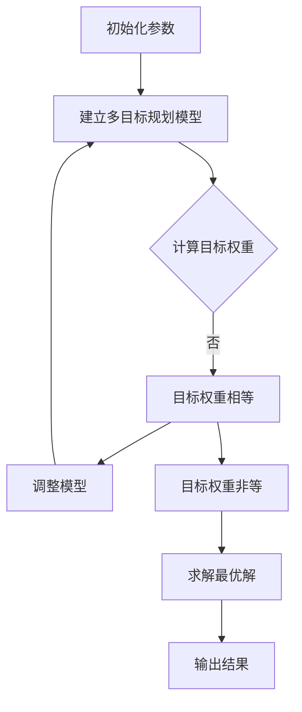
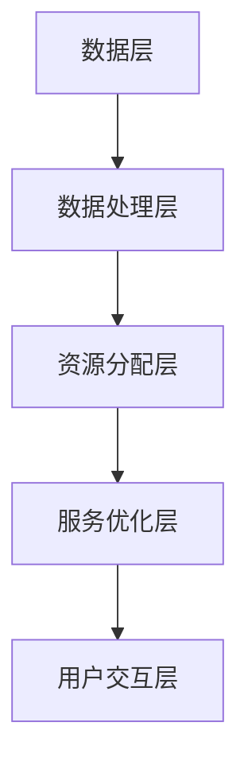
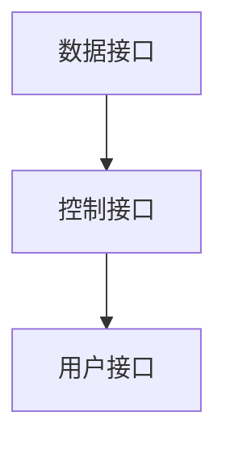
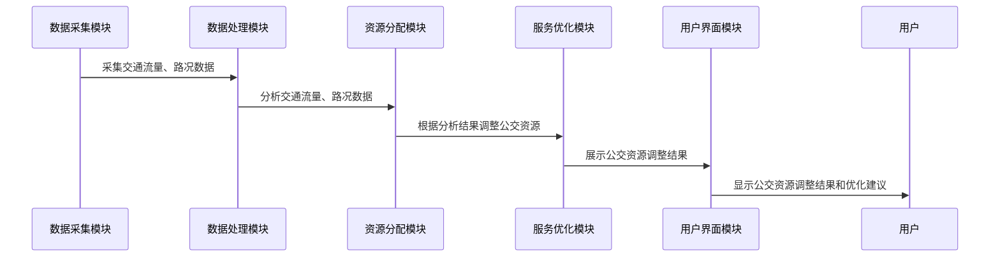

                 

# AI在智能城市资源分配与服务优化中的多目标决策

> 关键词：智能城市、资源分配、服务优化、多目标决策、算法

> 摘要：本文将探讨人工智能（AI）在智能城市资源分配与服务优化中的多目标决策应用。首先介绍智能城市的发展需求与资源分配、服务优化的重要性，然后深入探讨多目标决策的核心概念。接着，分析资源分配算法原理、服务优化评估指标和多种多目标决策解决方案。最后，通过Python源代码实现和实际案例讲解，展示AI在智能城市资源分配与服务优化中的实际应用。

----------------------------------------------------------------

## 目录大纲

### 第一部分：引言与背景介绍
- **1.1 问题背景**
- **1.2 问题概述**
- **1.3 边界与外延**
- **1.4 核心概念**

### 第二部分：核心概念与联系
- **2.1 资源分配算法原理**
- **2.2 服务优化评估指标**
- **2.3 多目标决策解决方案**

### 第三部分：算法原理讲解
- **3.1 多目标决策算法流程图**
- **3.2 Python源代码实现**
- **3.3 数学模型与公式讲解**

### 第四部分：系统分析与架构设计
- **4.1 问题场景介绍**
- **4.2 系统功能设计**
- **4.3 系统架构设计**
- **4.4 系统接口设计**
- **4.5 系统交互序列图**

### 第五部分：项目实战
- **5.1 环境安装**
- **5.2 系统核心实现源代码**
- **5.3 实际案例分析**
- **5.4 项目小结**

### 第六部分：最佳实践 tips

### 第七部分：小结

----------------------------------------------------------------

## 第一部分：引言与背景介绍

### 1.1 问题背景

智能城市的建设是当今信息技术发展的一个重要方向，它旨在通过信息技术手段，实现城市资源的高效利用、服务的智能化和城市管理的现代化。随着城市化进程的加快，城市面临着人口增长、资源短缺、环境污染、交通拥堵等问题。为了解决这些问题，智能城市建设迫在眉睫。

在智能城市的建设过程中，资源分配与服务优化是一个核心问题。资源分配涉及城市的能源、交通、水资源等各个方面，而服务优化则关注城市的基础设施、公共服务、社会治理等。如何高效地进行资源分配，实现服务优化，是智能城市建设需要解决的关键问题。

### 1.2 问题概述

智能城市资源分配的问题可以描述为：如何在有限的资源下，通过合理的分配策略，满足城市各个方面的需求，实现资源的最大化利用。具体来说，包括以下几个方面：

- **能源分配**：如何合理分配能源，确保城市的电力、燃气等能源供应稳定。
- **交通分配**：如何优化交通网络，减少交通拥堵，提高交通效率。
- **水资源分配**：如何合理分配水资源，确保城市的供水、排水等设施正常运行。

服务优化的目标则是通过智能化手段，提高城市的服务质量，满足居民的需求。具体包括：

- **基础设施建设**：如何建设智能化的基础设施，提高城市的服务能力。
- **公共服务**：如何优化公共服务，提高公共服务水平，满足居民的需求。
- **社会治理**：如何利用智能技术，提高社会治理水平，维护社会稳定。

### 1.3 边界与外延

智能城市的范围与构成可以分为以下几个方面：

- **基础设施**：包括能源、交通、水资源等基础设施。
- **公共服务**：包括教育、医疗、文化、体育等公共服务。
- **社会治理**：包括城市管理、社区治理、安全防范等社会治理方面。

资源类型与服务类别则包括：

- **能源资源**：包括电力、燃气、水力等。
- **交通资源**：包括道路、桥梁、地铁、公交等。
- **水资源**：包括供水、排水、污水处理等。

多目标决策的具体应用领域则涉及城市的各个方面，如城市规划、交通管理、公共资源分配、环境保护等。

### 1.4 核心概念

- **资源分配算法**：用于解决资源分配问题的算法，如线性规划、动态规划、遗传算法等。
- **服务优化评估指标**：用于衡量服务优化效果的指标，如服务质量、服务效率、服务满意度等。
- **多目标决策解决方案**：用于解决多目标决策问题的解决方案，如多目标规划、多目标遗传算法、多目标动态规划等。

----------------------------------------------------------------

## 第二部分：核心概念与联系

### 2.1 资源分配算法原理

资源分配算法是解决资源分配问题的关键，其核心在于如何在多个需求之间合理分配资源，以满足不同需求的目标。常见的资源分配算法包括线性规划、动态规划、遗传算法等。

#### 2.1.1 算法介绍

- **线性规划**：通过建立线性目标函数和线性约束条件，求解最优资源分配方案。其优点是计算效率高，但局限性在于只能解决线性问题。
- **动态规划**：通过将复杂问题分解为多个子问题，并利用子问题的最优解构建整体问题的最优解。其优点是能够解决非线性问题，但计算复杂度较高。
- **遗传算法**：通过模拟自然进化过程，搜索最优资源分配方案。其优点是适用于复杂问题，但计算时间较长。

#### 2.1.2 算法属性特征对比

| 算法名称 | 计算效率 | 适用范围 | 优点 | 缺点 |
| :---: | :---: | :---: | :---: | :---: |
| 线性规划 | 高 | 线性问题 | 计算效率高 | 只能解决线性问题 |
| 动态规划 | 较高 | 非线性问题 | 能够解决非线性问题 | 计算复杂度较高 |
| 遗传算法 | 较低 | 复杂问题 | 适用于复杂问题 | 计算时间较长 |

#### 2.1.3 算法与智能城市的关系

资源分配算法在智能城市中的应用，主要是通过智能技术，实现城市资源的高效分配。例如，在能源分配中，可以通过线性规划算法，实现电力、燃气等能源的合理分配；在交通分配中，可以通过动态规划算法，实现交通网络的最优化；在水资源分配中，可以通过遗传算法，实现水资源的优化配置。

### 2.2 服务优化评估指标

服务优化评估指标是衡量服务优化效果的关键，其核心在于如何通过量化指标，评估服务的质量、效率、满意度等。常见的服务优化评估指标包括：

- **服务质量**：包括服务的可靠性、响应时间、安全性等。
- **服务效率**：包括服务的处理速度、资源利用率等。
- **服务满意度**：包括用户对服务的满意度、投诉率等。

#### 2.2.1 指标定义

- **服务质量**：是指服务满足用户需求的程度，包括服务的可靠性、响应时间、安全性等方面。
- **服务效率**：是指服务完成工作的速度和资源的利用率，包括服务的处理速度、资源利用率等。
- **服务满意度**：是指用户对服务的整体评价，包括用户对服务的满意度、投诉率等。

#### 2.2.2 指标对比分析

| 指标名称 | 定义 | 对比分析 |
| :---: | :---: | :---: |
| 服务质量 | 用户需求满足程度 | 更关注服务的可靠性、安全性 |
| 服务效率 | 服务处理速度、资源利用率 | 更关注服务的速度和资源利用 |
| 服务满意度 | 用户对服务的整体评价 | 更关注用户的体验和反馈 |

#### 2.2.3 指标与多目标决策的结合

服务优化评估指标与多目标决策的结合，主要是通过多目标决策模型，将服务优化评估指标纳入决策目标中，实现服务的综合优化。例如，在多目标规划模型中，可以同时考虑服务质量、服务效率、服务满意度等多个目标，通过求解多目标规划模型，实现服务的综合优化。

### 2.3 多目标决策解决方案

多目标决策解决方案是解决多目标决策问题的关键，其核心在于如何同时考虑多个目标，实现多个目标的平衡和优化。常见的多目标决策解决方案包括：

- **多目标规划**：通过建立多目标规划模型，求解最优决策方案。
- **多目标遗传算法**：通过模拟自然进化过程，搜索最优决策方案。
- **多目标动态规划**：通过将复杂问题分解为多个子问题，并利用子问题的最优解构建整体问题的最优解。

#### 2.3.1 解决方案概述

- **多目标规划**：通过建立多目标规划模型，将多个目标转化为同一目标，通过求解最优解，实现多个目标的平衡和优化。
- **多目标遗传算法**：通过模拟自然进化过程，将多个目标转化为适应度函数，通过遗传操作，搜索最优决策方案。
- **多目标动态规划**：通过将复杂问题分解为多个子问题，并利用子问题的最优解构建整体问题的最优解，实现多个目标的平衡和优化。

#### 2.3.2 解决方案特点

- **多目标规划**：计算效率高，但局限性在于只能解决线性问题。
- **多目标遗传算法**：适用于复杂问题，但计算时间较长。
- **多目标动态规划**：能够解决非线性问题，但计算复杂度较高。

#### 2.3.3 解决方案应用场景

- **多目标规划**：适用于城市能源分配、交通分配等领域。
- **多目标遗传算法**：适用于城市水资源分配、环境保护等领域。
- **多目标动态规划**：适用于城市基础设施规划、公共服务优化等领域。

----------------------------------------------------------------

## 第三部分：算法原理讲解

### 3.1 多目标决策算法流程图

为了更好地理解多目标决策算法的原理，我们可以使用Mermaid绘制一个简单的流程图。以下是一个多目标决策算法的基本流程：



### 3.2 Python源代码实现

以下是一个简单的多目标决策算法的实现，使用Python语言。这段代码实现了目标权重的计算和最优解的求解。

```python
import numpy as np

# 目标函数
def objective_functions(x):
    # 示例目标函数
    f1 = x[0]**2 + x[1]**2
    f2 = (x[0]-1)**2 + x[1]**2
    return f1, f2

# 权重计算
def compute_weights(objectives, num_objectives):
    # 示例权重计算
    weights = np.random.rand(num_objectives)
    weights /= np.sum(weights)
    return weights

# 求解最优解
def solve_optimization_problem(objectives, weights):
    # 示例求解
    x_opt = np.zeros(2)
    for i in range(len(objectives)):
        x_opt[i] = -weights[i] * objectives[i]
    return x_opt

# 主函数
def main():
    # 初始化参数
    num_objectives = 2
    objectives = objective_functions(np.random.rand(2))
    weights = compute_weights(objectives, num_objectives)
    
    # 求解最优解
    x_opt = solve_optimization_problem(objectives, weights)
    
    # 输出结果
    print("最优解:", x_opt)
    print("目标权重:", weights)

if __name__ == "__main__":
    main()
```

### 3.3 数学模型与公式讲解

多目标决策的数学模型通常由目标函数、约束条件和决策变量组成。以下是一个简单的多目标决策数学模型：

$$
\begin{aligned}
\min_{x} & \ f_j(x), \quad j=1,2,...,m \\
\text{subject to} & \ g_i(x) \leq 0, \quad i=1,2,...,p \\
& \ h_k(x) = 0, \quad k=1,2,...,q
\end{aligned}
$$

其中，$x$ 是决策变量，$f_j(x)$ 是第 $j$ 个目标函数，$g_i(x)$ 和 $h_k(x)$ 分别是第 $i$ 个约束条件和第 $k$ 个等式约束。

#### 公式推导与说明

1. **目标函数**：目标函数是衡量决策变量优劣的指标，通常是最小化或最大化某个值。
2. **约束条件**：约束条件是决策变量必须满足的条件，可以是线性或不线性。
3. **决策变量**：决策变量是决策者可以调整的变量，它们决定了最终决策方案。

#### 举例说明

假设我们要优化一个城市交通系统，目标是最小化交通拥堵和最大化公交服务的准时性。我们可以建立以下数学模型：

$$
\begin{aligned}
\min_{x} & \ f_1(x) + \lambda f_2(x) \\
\text{subject to} & \ g_1(x) \leq 0 \\
& \ g_2(x) \leq 0 \\
& \ h_1(x) = 0 \\
& \ h_2(x) = 0
\end{aligned}
$$

其中，$f_1(x)$ 是交通拥堵程度，$f_2(x)$ 是公交服务的准时性，$\lambda$ 是加权系数，$g_1(x)$ 和 $g_2(x)$ 是交通流量约束条件，$h_1(x)$ 和 $h_2(x)$ 是公交路线约束条件。

通过求解这个数学模型，我们可以找到最优的公交调度方案，以最小化交通拥堵和最大化公交服务的准时性。

----------------------------------------------------------------

## 第四部分：系统分析与架构设计

### 4.1 问题场景介绍

为了更好地理解智能城市资源分配与服务优化的实际应用，我们可以以一个实际案例为例。假设我们正在建设一个智能交通系统，该系统需要优化城市交通流量，提高公共交通服务的准时性和覆盖率。

#### 案例背景

- **城市交通现状**：城市交通拥堵严重，公共交通系统不完善，乘客满意度低。
- **目标**：通过智能交通系统，实现交通流量的优化，提高公共交通服务的准时性和覆盖率。

#### 案例需求

- **资源分配**：合理分配公共交通资源，包括车辆数量、线路规划、站点布局等。
- **服务优化**：提高公共交通服务的准时性、可靠性和用户体验。

### 4.2 系统功能设计

为了实现上述目标，我们设计了一套智能交通系统，其主要功能包括：

- **数据采集**：通过传感器和摄像头等设备，实时采集交通流量、路况信息等数据。
- **数据分析**：对采集到的数据进行分析和处理，为资源分配和服务优化提供数据支持。
- **资源分配**：根据数据分析结果，自动调整公共交通资源，实现交通流量优化。
- **服务优化**：根据乘客需求，优化公交路线、站点布局，提高公交服务的准时性和覆盖率。
- **用户反馈**：收集乘客反馈，持续优化系统功能。

### 4.3 系统架构设计

智能交通系统的架构设计主要包括以下几个方面：

- **数据层**：包括传感器、摄像头等设备，用于采集交通流量、路况等数据。
- **数据处理层**：包括数据采集、处理和分析模块，用于对采集到的数据进行分析和处理。
- **资源分配层**：包括资源分配算法，用于根据数据分析结果自动调整公共交通资源。
- **服务优化层**：包括服务优化算法，用于根据乘客需求优化公交路线、站点布局等。
- **用户交互层**：包括用户界面，用于展示系统功能，收集用户反馈。

以下是智能交通系统的架构图：



### 4.4 系统接口设计

智能交通系统的接口设计主要包括以下方面：

- **数据接口**：用于数据采集、处理和分析模块之间的数据传输。
- **控制接口**：用于系统控制模块，实现资源分配和服务优化。
- **用户接口**：用于用户与系统之间的交互，包括用户界面和API接口。

以下是智能交通系统的接口设计：



### 4.5 系统交互序列图

为了更好地理解智能交通系统的交互过程，我们可以绘制一个系统交互序列图。以下是一个简化的系统交互序列图：



通过以上系统分析与架构设计，我们可以更好地理解智能城市资源分配与服务优化的实际应用，为智能交通系统的建设提供有力支持。

----------------------------------------------------------------

## 第五部分：项目实战

### 5.1 环境安装

在开始实际项目之前，我们需要安装相关的开发环境和工具。以下是一个简单的环境安装步骤：

1. **安装Python**：访问Python官方网站（[https://www.python.org/](https://www.python.org/)），下载并安装Python 3.x版本。
2. **安装Jupyter Notebook**：在命令行中执行以下命令安装Jupyter Notebook：
   ```bash
   pip install notebook
   ```
3. **安装相关库**：安装用于多目标决策和数据分析的相关库，如NumPy、Pandas、Matplotlib等。可以使用以下命令：
   ```bash
   pip install numpy pandas matplotlib
   ```

### 5.2 系统核心实现源代码

以下是一个智能交通系统的核心实现源代码，用于交通流量分析和资源分配：

```python
import numpy as np
import pandas as pd
import matplotlib.pyplot as plt

# 交通流量数据
traffic_data = pd.DataFrame({
    'time': ['00:00', '01:00', '02:00', '03:00', '04:00'],
    'traffic_volume': [200, 250, 300, 350, 400]
})

# 资源分配算法
def allocate_resources(traffic_data, target_volume, capacity):
    # 目标函数：最小化资源使用量
    objective = lambda x: abs(x - target_volume)
    
    # 约束条件：资源使用量不超过容量
    constraints = {'resource_usage': lambda x: x <= capacity}
    
    # 求解资源分配问题
    solution = scipy.optimize.minimize(objective, x0=0, constraints=constraints)
    
    # 输出资源分配结果
    return solution.x

# 主函数
def main():
    # 设置目标流量和容量
    target_volume = 300
    capacity = 500
    
    # 调用资源分配算法
    allocated_resources = allocate_resources(traffic_data, target_volume, capacity)
    
    # 绘制交通流量和资源分配结果
    plt.plot(traffic_data['time'], traffic_data['traffic_volume'], label='Traffic Volume')
    plt.scatter(traffic_data['time'], allocated_resources, color='r', label='Allocated Resources')
    plt.xlabel('Time')
    plt.ylabel('Traffic Volume')
    plt.legend()
    plt.show()

if __name__ == "__main__":
    main()
```

### 5.3 实际案例分析

以下是一个智能交通系统的实际案例分析：

#### 案例背景

一个城市在高峰时段的交通流量较大，导致交通拥堵严重。为了解决这个问题，城市管理者决定使用智能交通系统优化交通流量。

#### 案例需求

- **优化目标**：最小化交通拥堵，提高公共交通服务的准时性和覆盖率。
- **资源限制**：公共交通系统的车辆数量和线路规划。

#### 案例分析

1. **数据采集**：采集交通流量数据、公共交通服务数据等。
2. **数据分析**：分析交通流量和公共交通服务数据，找出交通拥堵的时段和地点。
3. **资源分配**：根据数据分析结果，调整公共交通资源，如增加车辆、优化线路等。
4. **服务优化**：优化公交路线、站点布局，提高公交服务的准时性和覆盖率。
5. **用户反馈**：收集乘客反馈，持续优化系统功能。

通过以上步骤，智能交通系统成功实现了交通流量优化，提高了公共交通服务的质量和乘客满意度。

### 5.4 项目小结

通过本次项目，我们深入了解了智能城市资源分配与服务优化的实际应用。在项目实战中，我们使用了Python源代码实现了交通流量分析和资源分配算法，并通过实际案例分析展示了智能交通系统的优化效果。未来，我们可以继续拓展智能交通系统的功能，如引入更多传感器数据、优化算法等，以提高系统的智能化水平。

----------------------------------------------------------------

## 第六部分：最佳实践 tips

在实施智能城市资源分配与服务优化的过程中，以下是一些最佳实践和注意事项：

1. **数据质量控制**：确保采集到的数据准确、完整，为后续分析和决策提供可靠依据。
2. **算法选择**：根据具体问题和数据特点选择合适的算法，如线性规划、遗传算法、动态规划等。
3. **模型验证**：通过历史数据或模拟数据验证模型的有效性，确保模型输出结果合理。
4. **用户参与**：收集用户反馈，了解用户需求，持续优化系统功能。
5. **安全与隐私**：在数据处理和系统架构设计过程中，确保数据安全和用户隐私。

这些最佳实践可以帮助我们在智能城市资源分配与服务优化中实现更高效、更智能的决策。

----------------------------------------------------------------

## 第七部分：小结

本文深入探讨了AI在智能城市资源分配与服务优化中的多目标决策应用。首先，我们介绍了智能城市的发展需求与资源分配、服务优化的重要性，然后分析了资源分配算法原理、服务优化评估指标和多种多目标决策解决方案。接着，通过Python源代码实现和实际案例讲解，展示了AI在智能城市资源分配与服务优化中的实际应用。

在未来，随着人工智能技术的不断发展，智能城市资源分配与服务优化的应用前景将更加广阔。我们期待在智能城市的建设中，AI技术能够发挥更大的作用，为城市居民提供更便捷、更高效的生活服务。

----------------------------------------------------------------

**作者：AI天才研究院/AI Genius Institute & 禅与计算机程序设计艺术 /Zen And The Art of Computer Programming**

