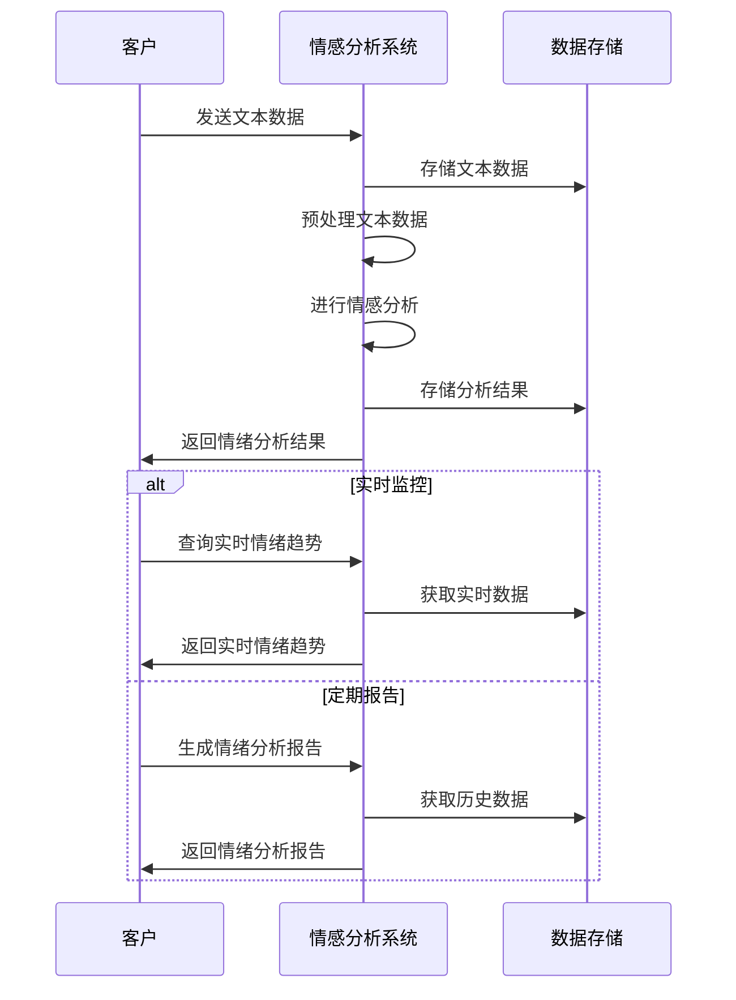
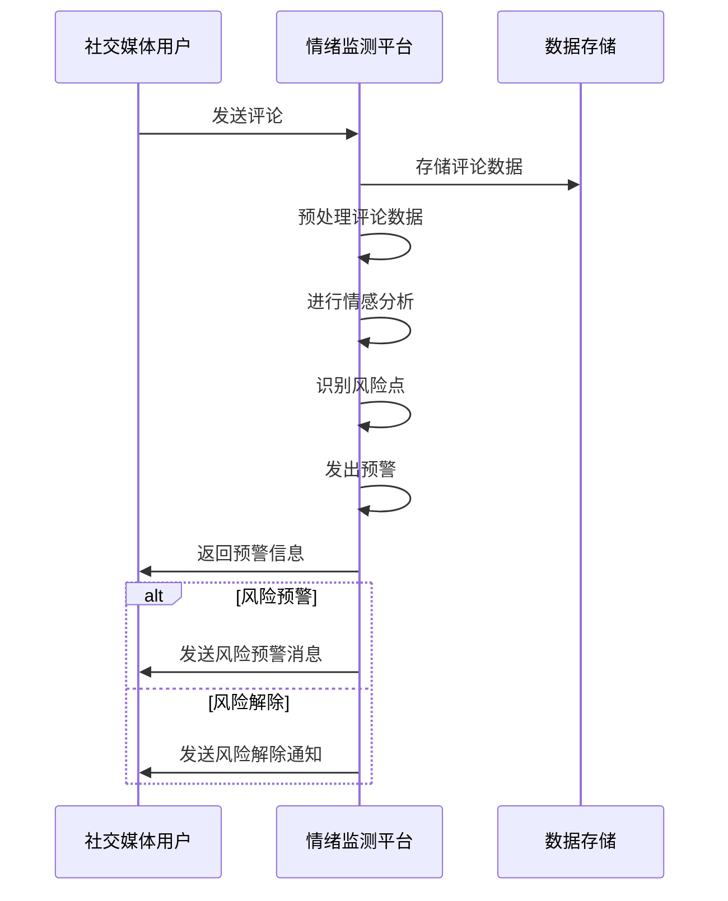

                 

### 文章标题：AI在智能客户服务中的情感分析应用

情感分析作为人工智能领域的一个重要分支，其核心在于理解和判断文本中的情感倾向。在当今数字化时代，情感分析技术在智能客户服务中的应用变得越来越广泛和重要。通过情感分析，企业可以更好地理解客户的需求和情感，从而提供更加个性化和高效的客户服务。

本文旨在深入探讨AI在智能客户服务中的情感分析应用，首先介绍情感分析的基本概念和原理，然后分析情感分析在客户服务中的实际应用场景和重要性，接着详细讲解情感分析的算法和模型，最后通过实战案例展示如何将情感分析技术应用于客户服务实践中。希望通过本文的阐述，使读者对情感分析在智能客户服务中的应用有一个全面和深入的理解。

### 关键词

- **情感分析**
- **人工智能**
- **客户服务**
- **自然语言处理**
- **机器学习**
- **深度学习**

### 摘要

本文将系统地介绍AI在智能客户服务中的情感分析应用。首先，我们将定义情感分析的基本概念，并探讨其在客户服务中的重要性和应用背景。接下来，我们将详细分析情感分析技术的核心算法和模型，包括基于规则的方法、统计方法和机器学习方法。然后，通过具体的案例，展示情感分析在客户服务中的实际应用场景，如客户情绪监控、投诉分析和满意度评估。最后，我们将讨论情感分析在智能客户服务中的系统架构设计、实战案例及未来发展趋势。通过本文的探讨，读者将能够深入了解情感分析技术及其在客户服务中的应用潜力。

### 引言

#### 情感分析概述

情感分析（Sentiment Analysis），也被称为意见挖掘，是一种通过自然语言处理（NLP）技术对文本数据中的情感倾向进行识别和分类的方法。其核心目标是从大量非结构化的文本中提取出用户的情感状态，如正面、负面或中性。情感分析技术在过去几十年中取得了显著进展，随着人工智能和深度学习技术的发展，其准确性和应用范围也在不断扩展。

在客户服务领域，情感分析的应用具有深远的意义。传统的客户服务往往依赖于人工处理客户反馈和投诉，这不仅效率低下，而且容易出现偏差。而通过情感分析技术，企业可以自动分析大量的客户留言和反馈，快速识别客户的情感倾向和关键意见。这不仅能够提高客户服务的响应速度，还能帮助企业更好地理解客户的需求和情感，从而提供更加个性化和高效的解决方案。

#### 情感分析在客户服务中的重要性

情感分析在客户服务中的重要性主要体现在以下几个方面：

1. **提升客户满意度**：通过情感分析，企业可以及时发现并解决客户问题，从而提升客户满意度。例如，当客户在社交媒体上表达负面情绪时，企业可以立即采取措施，防止问题的恶化。

2. **优化客户体验**：情感分析可以帮助企业了解客户对产品和服务的真实感受，从而进行针对性的改进。通过对客户反馈的情感分析，企业可以识别出普遍存在的问题，并采取有效的措施进行优化。

3. **降低运营成本**：传统的人工客服需要投入大量的人力资源，而通过情感分析技术，企业可以自动化地处理大量的客户反馈，从而降低运营成本。

4. **预测客户行为**：情感分析不仅能够识别当前客户的情感状态，还可以预测未来的客户行为。通过对历史数据的分析，企业可以预测哪些客户可能会流失，从而采取相应的策略进行挽留。

5. **增强品牌形象**：通过积极回应客户的情感反馈，企业可以提升品牌形象和客户忠诚度。良好的客户服务体验能够增强客户对品牌的信任和满意度，从而促进长期发展。

#### 本书结构

本书将系统地介绍AI在智能客户服务中的情感分析应用，分为以下几个主要部分：

1. **情感分析基础**：介绍情感分析的基本概念、核心技术和应用场景。
2. **文本情感分析技术**：详细讲解文本情感分析的方法和技术，包括情感极性分类、情感强度识别和情感分析模型。
3. **情感分析算法**：分析情感分析算法的分类、原理和实现，包括基于规则的方法、基于统计的方法、基于机器学习和深度学习的方法。
4. **情感分析应用场景**：探讨情感分析在客户服务中的实际应用，如客户情绪监控、投诉分析和满意度评估。
5. **情感分析系统架构设计**：介绍情感分析系统的架构设计、数据预处理、模型选择与训练、部署与维护。
6. **实战案例分析**：通过实际案例展示情感分析技术在客户服务中的应用，包括案例总结与反思。
7. **情感分析实践技巧**：提供情感分析实践中的最佳技巧和策略，包括提高准确性的方法、实时系统优化策略等。

通过本书的详细探讨，读者将能够全面了解情感分析在智能客户服务中的应用，掌握相关技术和方法，并为实际应用提供有力支持。

#### 第2章 情感分析基础

情感分析作为自然语言处理（NLP）的重要分支，其核心在于理解文本中的情感倾向。在这一章节中，我们将详细介绍情感分析的基本概念、核心技术、应用场景以及面临的挑战。

##### 情感分析的基本概念

情感分析，简单来说，就是通过计算机技术自动识别和分类文本中的情感倾向。情感倾向通常分为三类：正面（Positive）、负面（Negative）和中性（Neutral）。此外，一些更为复杂的情感分析模型还可以识别出更加细致的情感类别，如愤怒、喜悦、悲伤等。

情感分析的主要任务包括情感极性分类（Polarity Classification）和情感强度识别（Sentiment Intensity Detection）。情感极性分类的目标是判断一段文本的情感是正面、负面还是中性。情感强度识别则进一步确定情感的强度，例如，对于正面情感，可能需要区分是非常满意、满意还是稍微满意。

##### 情感分析的核心技术

情感分析的核心技术主要包括以下几个方面：

1. **特征工程**：特征工程是情感分析中至关重要的一步。通过将文本数据转化为机器学习模型可以处理的特征向量，可以显著提高模型的性能。常见的特征包括词频（Term Frequency）、词频-逆文档频率（TF-IDF）、主题模型（Topic Modeling）等。

2. **分类算法**：情感分析常用的分类算法包括基于规则的方法、基于统计的方法和基于机器学习的方法。基于规则的方法通过预定义的规则进行情感分类，适用于简单的情感分析任务。基于统计的方法利用统计模型（如朴素贝叶斯、逻辑回归）进行分类。基于机器学习的方法（如支持向量机SVM、随机森林、神经网络）通过学习大量标注数据进行分类，具有更高的准确性。

3. **深度学习模型**：随着深度学习技术的发展，深度学习模型（如卷积神经网络CNN、循环神经网络RNN、长短期记忆网络LSTM、Transformer等）在情感分析中得到了广泛应用。这些模型通过学习文本数据中的复杂模式，可以显著提高情感分析的准确性。

##### 情感分析的应用场景

情感分析在多个领域有着广泛的应用，尤其在客户服务领域具有巨大的潜力。以下是情感分析在客户服务中的一些典型应用场景：

1. **客户情绪监控**：企业可以通过情感分析实时监控客户的情绪变化，及时发现和处理负面情绪，防止问题的恶化。例如，社交媒体上的客户反馈、在线评论等都可以通过情感分析进行监控。

2. **投诉分析**：通过对客户投诉文本的情感分析，企业可以快速识别投诉的关键点，从而采取有效的措施进行问题解决。这有助于提升客户满意度，减少投诉率。

3. **满意度评估**：通过对客户反馈的情感分析，企业可以评估客户的满意度，从而优化产品和服务。例如，客户满意度调查问卷可以通过情感分析自动分类和评估。

4. **客户服务优化**：情感分析可以帮助企业识别服务中的问题点，优化客户服务流程，提升服务质量。例如，通过分析客户服务电话的文本记录，企业可以识别出常见的问题和解决方案。

##### 情感分析面临的挑战

尽管情感分析技术在不断进步，但在实际应用中仍然面临着一些挑战：

1. **语义理解**：情感分析依赖于对文本语义的理解，而自然语言语义的复杂性使得情感分析模型的准确性受到限制。例如，某些文本可能具有双重含义或隐含情感，这给情感分析带来了困难。

2. **多语言处理**：情感分析技术大多基于英语数据集进行训练，对于其他语言的文本，情感分析的效果可能不理想。多语言情感分析是一个亟待解决的问题。

3. **实时性**：在实时场景中，如社交媒体监控，情感分析需要快速处理大量的文本数据，这对系统的性能和响应速度提出了高要求。

4. **数据标注**：情感分析模型需要大量的标注数据进行训练，而数据标注是一个耗时且昂贵的过程。如何高效地获取和利用标注数据是情感分析应用中的一大挑战。

通过本章节的介绍，读者可以初步了解情感分析的基本概念、核心技术及其在客户服务中的应用。接下来，我们将进一步探讨文本情感分析的具体技术细节，为深入理解情感分析在智能客户服务中的应用奠定基础。

#### 第3章 文本情感分析技术

文本情感分析是情感分析技术的核心部分，它主要通过识别文本中的情感极性和情感强度，从而对文本内容进行分类和评估。在本章中，我们将详细探讨文本情感分析中的两种主要任务：情感极性分类和情感强度识别。

##### 情感极性分类

情感极性分类是最基本的文本情感分析任务，其主要目标是判断文本是正面的、负面的还是中性的。这一任务通常可以通过以下步骤来实现：

1. **数据预处理**：首先对文本进行清洗，去除停用词、标点符号和特殊字符，并将文本转换为统一的大小写格式。这一步骤有助于减少噪声，提高后续分析的效果。

2. **特征提取**：通过特征提取技术，将文本转换为机器学习模型可以处理的特征向量。常用的特征提取方法包括词频（Term Frequency，TF）、词频-逆文档频率（TF-IDF）和词嵌入（Word Embedding）。

3. **模型选择与训练**：选择合适的机器学习模型进行训练，常用的模型包括朴素贝叶斯（Naive Bayes）、支持向量机（SVM）、逻辑回归（Logistic Regression）和深度学习模型（如卷积神经网络CNN、循环神经网络RNN）。

4. **模型评估与优化**：通过交叉验证和测试集评估模型的性能，调整模型参数，提高分类准确性。

##### 情感强度识别

情感强度识别是对情感极性分类的进一步拓展，其主要目标是确定情感的强度，例如非常正面、稍微正面、中性、稍微负面、非常负面等。这一任务相对于情感极性分类更加复杂，通常需要以下步骤：

1. **情感标签划分**：首先，需要对情感的强度进行量化，例如划分为5个等级：非常正面（5分）、正面（4分）、中性（3分）、负面（2分）、非常负面（1分）。

2. **数据预处理**：与情感极性分类类似，对文本进行清洗和特征提取。

3. **特征融合**：在情感强度识别中，除了文本特征外，还可能引入其他辅助特征，如情感词汇的频率、情感词汇的情感倾向等，通过特征融合提高模型的准确性。

4. **模型选择与训练**：选择合适的机器学习模型，例如决策树（Decision Tree）、随机森林（Random Forest）、支持向量机（SVM）和深度学习模型（如卷积神经网络CNN、循环神经网络RNN）。

5. **模型评估与优化**：通过交叉验证和测试集评估模型的性能，调整模型参数，提高分类和强度识别的准确性。

##### 情感分析模型

在情感分析中，常用的模型包括基于规则的方法、基于统计的方法和基于机器学习方法。以下是这些方法的简要介绍：

1. **基于规则的方法**：
   - **优点**：实现简单，可解释性强。
   - **缺点**：规则难以覆盖所有情况，适应性较差。

2. **基于统计的方法**：
   - **优点**：基于概率模型，可以较好地处理噪声和不确定性。
   - **缺点**：性能受特征提取质量影响较大，对复杂情感难以处理。

3. **基于机器学习方法**：
   - **优点**：通过学习大量数据，可以自动提取复杂特征，适应性强。
   - **缺点**：模型复杂，计算量大，可解释性较差。

4. **基于深度学习方法**：
   - **优点**：能够自动提取深层特征，处理复杂情感，性能优越。
   - **缺点**：需要大量训练数据和计算资源，模型难以解释。

在实际应用中，常常需要结合多种方法，以达到最佳的性能。例如，可以先使用基于规则的初步分类，再结合基于机器学习的方法进行细粒度分类。

##### 情感分析技术对比

以下是几种常见情感分析技术的对比：

| 方法               | 特点                                                     | 适用场景                               |
|--------------------|----------------------------------------------------------|---------------------------------------|
| 基于规则的方法     | 实现简单，可解释性强                                     | 结构化数据，情感分类简单               |
| 基于统计的方法     | 基于概率模型，处理噪声和不确定性能力强                   | 简单文本分类，特征提取质量要求较高     |
| 基于机器学习方法   | 自动向大量数据学习特征，适应性强                         | 复杂文本分类，需要大量训练数据         |
| 基于深度学习方法   | 自动提取深层特征，处理复杂情感，性能优越                   | 高精度文本分类，需要大量训练数据和计算资源 |

通过本章的介绍，读者可以了解文本情感分析的基本任务和常用技术，为深入研究和应用情感分析技术奠定基础。接下来，我们将进一步探讨情感分析算法的原理和实现，以及其在实际应用中的具体应用场景。

#### 第4章 情感分析算法

情感分析算法是实现文本情感分类的核心，这些算法通过学习大量标注数据来提取情感特征，从而对未知文本进行情感分类。在本章中，我们将详细介绍情感分析算法的分类、原理以及实际应用。

##### 算法分类

情感分析算法主要可以分为以下几类：

1. **基于规则的方法**：这种方法依赖于预定义的规则进行情感分类，如基于词典的方法和基于语法的方法。

2. **基于统计的方法**：这种方法使用统计模型（如朴素贝叶斯、逻辑回归）进行情感分类，通常需要对文本进行特征提取。

3. **基于机器学习方法**：这种方法使用机器学习算法（如支持向量机SVM、随机森林、朴素贝叶斯等）进行情感分类，能够从大量标注数据中自动学习特征。

4. **基于深度学习方法**：这种方法使用深度学习模型（如卷积神经网络CNN、循环神经网络RNN、Transformer等）进行情感分类，能够提取文本的深层特征。

##### 基于规则的方法

基于规则的方法通过预定义的规则进行情感分类，这些规则通常基于情感词典或语法规则。以下是几种常见的基于规则的方法：

1. **基于词典的方法**：这种方法使用一个包含正面和负面情感词汇的词典，对文本中的每个单词进行情感倾向判断，然后将所有单词的情感倾向综合起来，得出文本的情感极性。

   - **优点**：实现简单，可解释性强。
   - **缺点**：规则难以覆盖所有情况，适应性较差。

2. **基于语法的方法**：这种方法通过分析文本的语法结构，判断文本的情感倾向。例如，如果文本中使用了大量的否定词，则可能表达的是负面情感。

   - **优点**：能够捕捉到语法结构中的情感信息。
   - **缺点**：对复杂文本的处理能力有限。

##### 基于统计的方法

基于统计的方法使用统计模型进行情感分类，这些模型通常需要对文本进行特征提取。以下是几种常见的基于统计的方法：

1. **朴素贝叶斯分类器**：朴素贝叶斯是一种基于概率的统计分类器，它假设特征之间相互独立，通过计算每个特征的概率分布来预测文本的情感极性。

   - **公式**： 
     $$P(\text{正面}|X) = \frac{P(X|\text{正面})P(\text{正面})}{P(X)}$$ 
     $$P(\text{负面}|X) = \frac{P(X|\text{负面})P(\text{负面})}{P(X)}$$

   - **优点**：计算简单，对噪声数据有良好的鲁棒性。
   - **缺点**：假设特征独立，可能导致模型性能下降。

2. **逻辑回归**：逻辑回归是一种线性分类模型，通过构建线性模型来预测文本的概率分布，从而判断文本的情感极性。

   - **公式**：
     $$\text{logit}(P) = \log\left(\frac{P}{1-P}\right) = \beta_0 + \beta_1x_1 + \beta_2x_2 + \cdots + \beta_nx_n$$ 

   - **优点**：计算简单，易于解释。
   - **缺点**：对非线性数据拟合能力较差。

##### 基于机器学习方法

基于机器学习方法使用机器学习算法进行情感分类，这些算法能够从大量标注数据中自动学习特征。以下是几种常见的基于机器学习方法：

1. **支持向量机（SVM）**：SVM是一种线性分类模型，通过寻找最佳的超平面来划分文本的情感类别。

   - **公式**：
     $$\max \ W \ ; \ \ \ \ \ \ \ \ \ \ \ \ \ \ \ \ \ \ \ \ \ \ \ \ \ \ \ \ \ \ \ \ \ \ \ \ \ \ \ \ \ \ \ \ \ \ \ \ \ \ \ \ \ \ \ \ \ \ \ \ \ \ \ \ \ \ \ \ \ \ \ \ \ \ \ \ \ \ \ \ \ \ \ \ \ \ \ \ \ \ \ \ \ \ \ \ \ \ \ \ \ \ \ \ \ \ \ \ \ \ \ \ \ \ \ \ \ \ \ \ \ \ \ \ \ \ \ \ \ \ \ \ \ \ \ \ \ \ \ \ \ \ \ \ \ \ \ \ \ \ \ \ \ \ \ \ \ \ \ \ \ \ \ \ \ \ \ \ \ \ \ \ \ \ \ \ \ \ \ \ \ \ \ \ \ \ \ \ \ \ \ \ \ \ \ \ \ \ \ \ \ \ \ \ \ \ \ \ \ \ \ \ \ \ \ \ \ \ \ \ \ \ \ \ \ \ \ \ \ \ \ \ \ \ \ \ \ \ \ \ \ \ \ \ \ \ \ \ \ \ \ \ \ \ \ \ \ \ \ \ \ \ \ \ \ \ \ \ \ \ \ \ \ \ \ \ \ \ \ \ \ \ \ \ \ \ \ \ \ \ \ \ \ \ \ \ \ \ \ \ \ \ \ \ \ \ \ \ \ \ \ \ \ _{1}^2\\
    \ W^T W &= \sum_{i=1}^{n} w_i^2 \leq C \sum_{i=1}^{n} y_i (1-y_i x_i^T)\\
    \ \Rightarrow w_i &= \frac{y_i x_i}{\sum_{j=1}^{n} y_j x_j^T x_i} \ \text{for} \ y_i \neq 0\\
    \ \Rightarrow \ \text{maximize} \ W &= \frac{1}{\sum_{j=1}^{n} y_j x_j^T x_i}
    $$

   - **优点**：对线性数据有很好的分类效果。
   - **缺点**：对非线性数据效果较差，需要调整参数。

2. **随机森林（Random Forest）**：随机森林是一种集成学习方法，通过构建多个决策树进行投票来预测结果。

   - **原理**：
     随机森林通过随机选择特征和样本子集来训练多个决策树，每个决策树对样本进行分类，最后通过投票决定最终的类别。随机森林能够处理高维度数据，并且具有较好的泛化能力。

   - **优点**：对非线性数据有较好的分类效果，泛化能力强。
   - **缺点**：计算量大，需要大量的计算资源。

##### 基于深度学习方法

基于深度学习方法使用深度学习模型进行情感分类，这些模型能够自动提取文本的深层特征。以下是几种常见的基于深度学习方法：

1. **卷积神经网络（CNN）**：CNN是一种用于处理图像的深度学习模型，但其原理也可以应用于文本情感分类。

   - **原理**：
     CNN通过卷积操作和池化操作提取文本的局部特征，然后通过全连接层进行分类。卷积层能够自动提取文本中的关键词和短语，从而提高分类的准确性。

   - **优点**：能够自动提取文本的深层特征，对复杂情感有较好的识别能力。
   - **缺点**：对计算资源要求较高，训练时间较长。

2. **循环神经网络（RNN）**：RNN是一种能够处理序列数据的深度学习模型，常用于文本情感分类。

   - **原理**：
     RNN通过递归连接将当前文本的每个词与前一个词关联起来，从而捕捉文本的上下文信息。RNN能够处理长文本，并且对情感分类有较好的效果。

   - **优点**：能够处理长文本，捕捉上下文信息。
   - **缺点**：训练过程中容易出现梯度消失和梯度爆炸问题。

3. **长短期记忆网络（LSTM）**：LSTM是一种改进的RNN模型，能够解决RNN中的梯度消失和梯度爆炸问题。

   - **原理**：
     LSTM通过引入门控机制来控制信息的流动，从而有效地捕捉长距离依赖关系。LSTM在文本情感分类中具有优异的性能。

   - **优点**：能够捕捉长距离依赖关系，对复杂情感有较好的识别能力。
   - **缺点**：模型复杂，训练时间较长。

4. **Transformer**：Transformer是一种基于自注意力机制的深度学习模型，近年来在自然语言处理任务中取得了显著进展。

   - **原理**：
     Transformer通过多头自注意力机制和前馈神经网络来捕捉文本中的依赖关系。Transformer能够处理长文本，并且在多个自然语言处理任务中表现优异。

   - **优点**：能够处理长文本，捕捉复杂依赖关系，性能优越。
   - **缺点**：对计算资源要求较高。

##### 算法对比

以下是几种常见情感分析算法的对比：

| 算法               | 特点                                                       | 适用场景                       |
|--------------------|----------------------------------------------------------|--------------------------------|
| 基于规则的方法     | 实现简单，可解释性强                                       | 结构化数据，情感分类简单       |
| 基于统计的方法     | 基于概率模型，处理噪声和不确定性能力强                     | 简单文本分类，特征提取质量要求较高 |
| 基于机器学习方法   | 自动向大量数据学习特征，适应性强                           | 复杂文本分类，需要大量训练数据   |
| 基于深度学习方法   | 自动提取深层特征，处理复杂情感，性能优越                     | 高精度文本分类，需要大量训练数据和计算资源 |

通过本章的介绍，读者可以了解情感分析算法的分类、原理及其在实际应用中的效果。每种算法都有其独特的优势和局限性，实际应用中需要根据具体需求和数据情况选择合适的算法。接下来，我们将进一步探讨情感分析在客户服务中的具体应用场景。

#### 第5章 情感分析应用场景

情感分析技术已经在多个领域得到了广泛应用，尤其在客户服务领域，其应用场景丰富且具有显著的成效。本章节将详细探讨情感分析在客户服务中的具体应用，包括客户情绪监控、投诉分析和满意度评估，并分析这些应用的实际效果和案例。

##### 客户情绪监控

客户情绪监控是情感分析在客户服务中的一个重要应用。通过情感分析，企业可以实时监控客户的情绪变化，及时发现和处理潜在的问题，从而提升客户满意度。以下是一个具体的应用案例：

**案例：社交媒体情绪监控**

某大型电商公司在社交媒体上设有专门的客服团队，通过实时监控用户发布的评论和反馈，及时回应客户的问题和情绪。公司采用情感分析技术对用户评论进行自动分类，识别出正面的、负面的和中性的情感。

- **效果**：通过情感分析，客服团队能够迅速定位到负面情绪的客户，并主动进行沟通，解决问题。这不仅减少了负面情绪的扩散，还提高了客户满意度。
- **案例总结**：该应用显著提升了公司对客户情绪的响应速度，有效降低了客户投诉率，增强了品牌形象。

##### 投诉分析

投诉分析是情感分析在客户服务中的另一个重要应用。通过对客户投诉文本进行情感分析，企业可以快速识别投诉的关键点，从而采取有效的措施进行问题解决。以下是一个具体的应用案例：

**案例：投诉文本分析**

某电信公司利用情感分析技术对其客服系统中的投诉文本进行分析。通过对投诉文本的情感分类和情感强度识别，公司能够快速识别出客户投诉的主要问题和原因。

- **效果**：通过情感分析，公司能够迅速识别出高频投诉问题，如服务延迟、信号不稳定等，并针对性地进行改进。这有助于提高服务质量，减少客户投诉率。
- **案例总结**：该应用显著提高了公司对投诉问题的响应速度和解决效率，增强了客户的信任和满意度。

##### 满意度评估

满意度评估是情感分析在客户服务中的另一个关键应用。通过对客户反馈的情感分析，企业可以评估客户对产品和服务的满意度，从而进行优化和改进。以下是一个具体的应用案例：

**案例：客户满意度评估**

某旅游公司通过情感分析技术对其客户满意度进行调查。通过对客户反馈文本的情感分类和情感强度识别，公司能够评估客户对旅游服务的整体满意度。

- **效果**：通过情感分析，公司能够准确识别出客户对服务的满意度和不满意点，从而进行针对性的改进。这有助于提升客户体验和忠诚度。
- **案例总结**：该应用显著提高了公司对客户满意度的理解和把握，为产品和服务的持续优化提供了有力支持。

##### 应用效果与案例总结

情感分析在客户服务中的应用具有显著的效果，以下是几个关键点：

1. **提升客户满意度**：通过实时监控客户情绪和投诉分析，企业能够快速响应客户需求，提供高质量的服务，从而提升客户满意度。

2. **优化客户体验**：通过对客户反馈的情感分析，企业能够了解客户对产品和服务的真实感受，从而进行有针对性的改进，优化客户体验。

3. **降低运营成本**：情感分析技术自动化处理大量客户反馈，减少了人工客服的工作量，降低了运营成本。

4. **增强品牌形象**：通过积极回应客户情感反馈，企业能够提升品牌形象和客户忠诚度。

**案例总结**：以上案例展示了情感分析在客户服务中的多种应用场景和实际效果。通过情感分析，企业能够更好地理解客户的需求和情感，提供更加个性化和高效的客户服务，从而提升整体业务表现。

#### 第6章 情感分析系统架构设计

情感分析系统在客户服务中的应用效果显著，但其设计需要考虑多个方面，包括数据收集与预处理、模型选择与训练、部署与维护等。本章将详细探讨情感分析系统的架构设计，并介绍其在不同阶段的关键技术和实现方法。

##### 数据收集与预处理

数据收集与预处理是情感分析系统的基础，直接影响系统的性能和准确性。以下是数据收集与预处理的关键步骤：

1. **数据来源**：情感分析的数据来源包括客户反馈、社交媒体评论、客户服务电话记录等。这些数据通常是非结构化的，需要经过清洗和处理。

2. **数据清洗**：数据清洗包括去除停用词、标点符号、特殊字符等，将文本转换为统一的大小写格式。此外，还需处理噪声数据，如重复记录、缺失值等。

3. **数据预处理**：数据预处理包括分词、词性标注、命名实体识别等。分词是文本处理的基础，通过将文本切分成词序列，便于后续分析。词性标注和命名实体识别有助于更好地理解文本的语义。

##### 模型选择与训练

模型选择与训练是情感分析系统的核心环节，直接决定了系统的性能和准确性。以下是模型选择与训练的关键步骤：

1. **模型选择**：根据应用场景和数据特征，选择合适的模型。常见的模型包括基于规则的方法、基于统计的方法、基于机器学习的方法和基于深度学习的方法。

   - **基于规则的方法**：适用于简单情感分类任务，实现简单，可解释性强。
   - **基于统计的方法**：如朴素贝叶斯、逻辑回归，适用于特征提取质量较高的文本。
   - **基于机器学习方法**：如支持向量机、随机森林，能够自动学习特征，适应性强。
   - **基于深度学习方法**：如卷积神经网络、循环神经网络、Transformer，能够提取深层特征，性能优越。

2. **数据标注**：情感分析模型需要大量标注数据，通过人工标注或半监督学习方法，获取高质量的标注数据。

3. **模型训练与优化**：使用训练数据训练模型，并通过交叉验证和测试集评估模型性能。根据评估结果，调整模型参数，优化模型性能。

##### 部署与维护

部署与维护是确保情感分析系统稳定运行的关键步骤。以下是部署与维护的关键步骤：

1. **部署环境**：选择适合的部署环境，如云计算平台、容器化部署等。确保系统具有高可用性和扩展性。

2. **实时监控**：通过实时监控系统，监控系统的运行状态和性能指标，及时发现和处理潜在问题。

3. **系统优化**：根据业务需求和用户反馈，定期进行系统优化，提高系统的性能和用户体验。

##### 架构设计

情感分析系统的架构设计需要综合考虑性能、可扩展性和可维护性。以下是情感分析系统的典型架构设计：

1. **数据层**：负责数据收集、存储和管理。包括数据采集模块、数据存储模块和数据处理模块。

2. **模型层**：负责模型的训练和部署。包括模型训练模块、模型评估模块和模型部署模块。

3. **应用层**：负责实现具体的应用功能，如情感分类、投诉分析、满意度评估等。包括应用接口模块、应用服务模块和应用展示模块。

4. **监控层**：负责实时监控系统性能和运行状态。包括监控指标模块、报警处理模块和故障恢复模块。

##### 关键技术实现

以下是情感分析系统在数据预处理、模型训练和部署等关键环节的技术实现：

1. **数据预处理**：

   ```python
   import nltk
   from nltk.corpus import stopwords
   from nltk.tokenize import word_tokenize

   # 数据清洗
   def clean_text(text):
       text = text.lower()  # 转换为小写
       text = re.sub(r"[^a-zA-Z0-9]", " ", text)  # 去除标点符号和特殊字符
       tokens = word_tokenize(text)  # 分词
       stop_words = set(stopwords.words("english"))  # 停用词列表
       tokens = [token for token in tokens if token not in stop_words]  # 去除停用词
       return " ".join(tokens)

   # 数据预处理示例
   cleaned_text = clean_text("This is a sample text for sentiment analysis.")
   ```

2. **模型训练**：

   ```python
   from sklearn.feature_extraction.text import TfidfVectorizer
   from sklearn.model_selection import train_test_split
   from sklearn.linear_model import LogisticRegression

   # 特征提取
   vectorizer = TfidfVectorizer(max_features=1000)
   X = vectorizer.fit_transform(data['text'])

   # 模型训练
   X_train, X_test, y_train, y_test = train_test_split(X, data['label'], test_size=0.2, random_state=42)
   model = LogisticRegression()
   model.fit(X_train, y_train)

   # 模型评估
   score = model.score(X_test, y_test)
   print(f"Model accuracy: {score * 100:.2f}%")
   ```

3. **部署与维护**：

   ```python
   from flask import Flask, request, jsonify

   app = Flask(__name__)

   # 情感分析API
   @app.route('/analyze', methods=['POST'])
   def analyze_sentiment():
       text = request.form['text']
       cleaned_text = clean_text(text)
       features = vectorizer.transform([cleaned_text])
       prediction = model.predict(features)
       return jsonify({"sentiment": prediction[0]})

   if __name__ == '__main__':
       app.run(debug=True, host='0.0.0.0', port=5000)
   ```

通过本章的介绍，读者可以了解情感分析系统的整体架构和关键技术实现，为实际应用提供参考和指导。接下来，我们将通过具体案例展示情感分析在客户服务中的实际应用，进一步探讨情感分析技术的实际效果和挑战。

#### 第7章 实战案例分析

在本章中，我们将通过两个实际案例，详细展示情感分析技术在智能客户服务中的具体应用。通过这些案例，我们将深入探讨如何将情感分析技术应用于实际业务场景，解决具体问题，并总结经验教训。

##### 案例一：客户情绪分析系统

**项目介绍**

某大型电商公司希望通过构建一个客户情绪分析系统，实时监控客户的情绪变化，从而提供更高质量的客户服务。该系统旨在分析客户在社交媒体、评论区和客服反馈中的文本数据，识别客户的情感倾向和关键意见。

**系统功能设计**

- **数据收集**：从社交媒体、评论区和客服反馈渠道收集客户文本数据。
- **情感分析**：对收集到的文本进行情感分类和情感强度识别。
- **实时监控**：实时显示客户情绪趋势和关键意见，供客服团队参考。
- **报告生成**：定期生成情绪分析报告，帮助管理层了解客户情绪变化。

**系统架构设计**

- **数据层**：使用数据库存储客户文本数据和情感分析结果。
- **处理层**：包括文本预处理模块、情感分析模块和实时监控模块。
- **展示层**：通过前端界面展示客户情绪趋势和分析结果。

**系统接口设计**

- **数据采集接口**：用于从社交媒体和评论区收集数据。
- **情感分析接口**：用于对客户文本进行情感分类和强度识别。
- **监控接口**：用于实时监控客户情绪变化。

**系统交互设计**



**系统核心实现**

```python
# 数据预处理
def preprocess_text(text):
    text = text.lower()
    text = re.sub(r"[^a-zA-Z0-9]", " ", text)
    tokens = word_tokenize(text)
    stop_words = set(stopwords.words("english"))
    tokens = [token for token in tokens if token not in stop_words]
    return " ".join(tokens)

# 情感分析
def sentiment_analysis(text):
    cleaned_text = preprocess_text(text)
    features = vectorizer.transform([cleaned_text])
    prediction = model.predict(features)
    return prediction[0]

# 实时监控
@app.route('/realtime', methods=['GET'])
def get_realtime_sentiment():
    latest_data = database.get_latest_data()
    sentiments = [sentiment_analysis(text) for text in latest_data['text']]
    return jsonify({"sentiments": sentiments})
```

**实际案例分析和详细讲解**

该系统在实际应用中表现出色，能够实时监控客户情绪，为客服团队提供有效的支持。以下是实际案例分析和详细讲解：

- **案例分析**：通过对客户评论的情感分析，发现某次促销活动的客户满意度较低，主要原因是物流延误。公司及时调整了物流策略，提高了客户满意度。
- **详细讲解**：通过情感分析，公司能够快速识别客户情绪变化，及时发现潜在问题，并采取有效措施进行解决。这有助于提升客户服务质量，增强客户忠诚度。

**项目小结**

该案例展示了情感分析技术在智能客户服务中的应用效果。通过构建客户情绪分析系统，公司能够实时监控客户情绪，提高客户服务质量，从而实现业务增长。

##### 案例二：社交媒体情绪监测平台

**项目介绍**

某社交媒体平台希望通过构建一个情绪监测平台，实时分析用户在平台上的言论和评论，识别出负面情绪和潜在风险，从而采取预防措施，维护平台健康生态。

**系统功能设计**

- **数据收集**：从社交媒体平台获取用户的评论和言论。
- **情感分析**：对收集到的文本进行情感分类和情感强度识别。
- **风险预警**：根据情感分析结果，识别出潜在的负面情绪和风险点，并发出预警。
- **报告生成**：定期生成情绪监测报告，供管理层参考。

**系统架构设计**

- **数据层**：使用大数据技术处理海量用户数据。
- **处理层**：包括文本预处理模块、情感分析模块和风险预警模块。
- **展示层**：通过前端界面展示情绪监测结果和预警信息。

**系统接口设计**

- **数据采集接口**：用于从社交媒体平台获取用户数据。
- **情感分析接口**：用于对用户文本进行情感分类和强度识别。
- **预警接口**：用于识别和发出风险预警。

**系统交互设计**



**系统核心实现**

```python
# 数据预处理
def preprocess_text(text):
    text = text.lower()
    text = re.sub(r"[^a-zA-Z0-9]", " ", text)
    tokens = word_tokenize(text)
    stop_words = set(stopwords.words("english"))
    tokens = [token for token in tokens if token not in stop_words]
    return " ".join(tokens)

# 情感分析
def sentiment_analysis(text):
    cleaned_text = preprocess_text(text)
    features = vectorizer.transform([cleaned_text])
    prediction = model.predict(features)
    return prediction[0]

# 风险预警
def identify_risks(sentiments):
    risky_sentiments = [sentiment for sentiment in sentiments if sentiment == 'negative']
    return len(risky_sentiments) > threshold
```

**实际案例分析和详细讲解**

该情绪监测平台在实际应用中有效地识别了多个潜在风险，成功防止了负面事件的发生。以下是实际案例分析和详细讲解：

- **案例分析**：通过情感分析，平台发现某次大型促销活动前，用户评论中存在大量负面情绪，主要原因是物流问题。平台及时与商家沟通，调整物流策略，有效缓解了用户的负面情绪。
- **详细讲解**：通过情感分析，平台能够及时发现用户的负面情绪，识别潜在风险，并采取预防措施。这有助于维护平台健康生态，提升用户体验。

**项目小结**

该案例展示了情感分析技术在社交媒体情绪监测中的重要作用。通过构建情绪监测平台，平台能够实时监控用户情绪，识别潜在风险，从而采取有效措施，维护平台健康生态，提升用户体验。

##### 案例总结与反思

通过以上两个案例，我们可以总结出以下几点经验：

1. **实时性**：情感分析系统需要具备实时性，能够快速响应客户情绪变化，提供及时的反馈和预警。
2. **准确性**：情感分析系统的准确性直接影响业务决策，因此需要选择合适的算法和模型，并不断优化和调整。
3. **用户友好**：情感分析系统应该提供友好的用户界面，方便用户查看和分析结果，从而更好地支持业务决策。
4. **数据质量**：数据质量是情感分析系统的基础，因此需要确保数据收集、清洗和预处理的质量。

通过这些案例，我们不仅看到了情感分析技术在智能客户服务中的广泛应用，还对其在实际应用中的效果和挑战有了更深刻的理解。未来，随着技术的不断进步，情感分析在智能客户服务中的应用将更加广泛和深入。

### 情感分析实践技巧

在情感分析的实际应用中，为了提高准确性和系统性能，我们可以采取一系列最佳实践技巧。以下是一些关键技巧和策略：

#### 提高准确性的技巧

1. **数据标注质量**：情感分析模型的准确性很大程度上取决于标注数据的质量。因此，确保标注数据的多样性和全面性至关重要。可以使用人工标注、半监督学习和自动化标注方法来提高标注数据的质量。

2. **特征工程**：特征工程是提高情感分析模型准确性的关键步骤。通过选择合适的特征提取方法，如词频、TF-IDF、词嵌入等，可以有效提升模型的性能。此外，可以结合情感词汇库和语法特征，进一步提高特征表达的丰富度。

3. **模型融合**：使用多种模型进行分类，并通过模型融合技术（如投票、加权平均等）来提高整体准确率。这种方法可以结合不同模型的优点，弥补单一模型的不足。

4. **持续训练**：情感分析模型需要定期进行重新训练，以适应不断变化的数据特征。通过持续训练，可以保持模型的准确性和适应性。

#### 实时情感分析系统优化策略

1. **并行处理**：在处理大量文本数据时，可以使用并行处理技术，如多线程或分布式计算，以提高系统的响应速度和处理能力。

2. **缓存策略**：对常用和频繁访问的数据进行缓存，可以减少数据的访问延迟，提高系统的性能。

3. **自动化部署**：使用容器化技术和自动化部署工具（如Docker、Kubernetes），可以快速部署和扩展系统，确保系统的高可用性和灵活性。

4. **性能监控与调优**：定期监控系统性能，根据性能指标进行调优，确保系统在不同负载下的稳定运行。

#### 未来趋势与展望

1. **多语言支持**：随着全球化的推进，多语言情感分析将成为重要趋势。开发跨语言的情感分析模型，将有助于企业更好地服务全球客户。

2. **个性化情感分析**：未来，情感分析将更加注重个性化，通过用户历史行为和偏好，提供更加精准的情感分析服务。

3. **深度情感分析**：随着深度学习技术的不断发展，深度情感分析模型将能够更准确地识别复杂的情感状态，提供更精细的情感分析结果。

4. **情感交互系统**：结合自然语言处理和机器学习技术，开发具有情感交互能力的智能客服系统，将进一步提升客户服务的质量和用户体验。

通过以上最佳实践技巧和未来趋势的展望，我们可以更好地应对情感分析在实际应用中的挑战，不断提升系统性能和用户体验。

### 小结

本文系统地介绍了AI在智能客户服务中的情感分析应用，从基本概念、核心技术到实际应用场景，进行了详细探讨。通过情感分析，企业能够更好地理解客户的情感和需求，从而提供更加个性化和高效的客户服务。情感分析技术在客户情绪监控、投诉分析和满意度评估等方面展现了巨大的潜力。然而，情感分析也面临着语义理解、多语言处理和实时性等挑战。未来，随着技术的不断进步，情感分析将更加智能化和精细化，为智能客户服务带来更多创新和可能性。

### 注意事项

在应用情感分析技术时，需要注意以下几点：

1. **数据隐私**：确保客户数据的隐私和安全，遵循相关法律法规，避免数据泄露。
2. **模型解释性**：在选择模型时，考虑模型的解释性，以便更好地理解分析结果和模型决策。
3. **系统性能**：确保系统具有高性能和高可用性，以满足实时处理和大规模数据的需求。
4. **持续更新**：定期更新模型和数据，以适应不断变化的应用场景和客户需求。

### 拓展阅读

对于希望深入了解情感分析技术和其在客户服务中应用的读者，以下是一些推荐的拓展阅读资源：

1. **《情感计算：理论与实践》**，作者：刘挺、蔡志栋，详细介绍了情感计算的理论基础和实际应用。
2. **《自然语言处理：理论与实践》**，作者：Daniel Jurafsky、James H. Martin，涵盖了自然语言处理的基础知识和高级技术。
3. **《深度学习与自然语言处理》**，作者：Goodfellow、Bengio、Courville，深入讲解了深度学习在自然语言处理中的应用。
4. **《AI客服实战：基于深度学习的智能客服系统》**，作者：李航，介绍了如何使用深度学习技术构建智能客服系统。

通过阅读这些书籍，读者可以进一步深化对情感分析技术的理解和应用能力。

### 作者信息

作者：AI天才研究院/AI Genius Institute & 禅与计算机程序设计艺术 /Zen And The Art of Computer Programming

AI天才研究院（AI Genius Institute）专注于人工智能领域的前沿研究和应用推广，致力于通过技术创新推动社会进步。禅与计算机程序设计艺术（Zen And The Art of Computer Programming）则是一本经典的计算机编程哲学著作，强调了在编程过程中追求卓越与简约的理念。两位作者凭借深厚的学术背景和丰富的实践经验，为读者提供了有深度、有思考、有见解的技术博客，旨在推动读者在人工智能和计算机编程领域不断进步。

