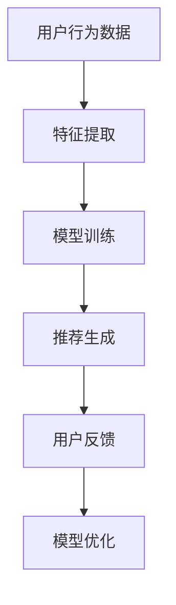
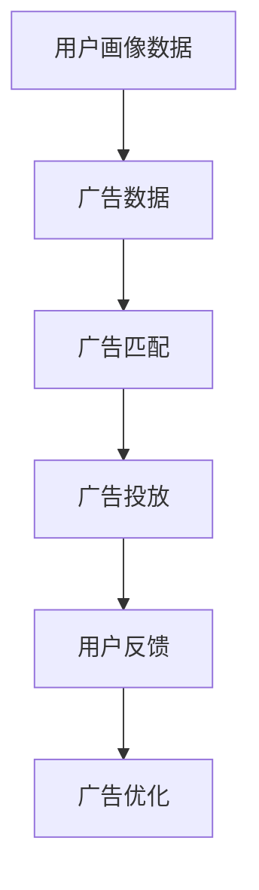

                 

# AI在智能客户画像构建与精准营销中的应用

## 关键词

- 智能客户画像
- 精准营销
- 人工智能
- 数据挖掘
- 机器学习
- 个性化推荐

## 摘要

本文将探讨AI在智能客户画像构建与精准营销中的应用。通过深入分析AI技术如何通过数据挖掘和机器学习构建精准的客户画像，本文将展示智能客户画像在提高营销效率、用户体验和转化率方面的巨大潜力。文章将涵盖智能客户画像的概念、构建方法、应用场景，并通过实际案例进行分析，为企业在数字化营销时代提供有效的策略和实践指导。

## 目录大纲

----------------------------------------

## 第一部分：AI在智能客户画像构建与精准营销中的应用概述

### 第1章：背景与概述

#### 1.1.1 问题背景

#### 1.1.2 问题解决

#### 1.1.3 边界与外延

#### 1.1.4 概念结构与核心要素组成

### 1.2 核心概念与联系

#### 1.2.1 AI技术在智能客户画像构建中的应用

#### 1.2.2 智能客户画像的属性与特征

#### 1.2.3 AI技术在精准营销中的应用

### 1.3 智能客户画像构建方法

#### 1.3.1 数据收集与整合

#### 1.3.2 特征提取与选择

#### 1.3.3 模型训练与评估

### 1.4 智能客户画像在精准营销中的应用场景

#### 1.4.1 产品推荐

#### 1.4.2 个性化广告

#### 1.4.3 客户关系管理

## 第一部分：AI在智能客户画像构建与精准营销中的应用概述

### 第1章：背景与概述

#### 1.1.1 问题背景

在数字化时代，企业面临的市场环境发生了翻天覆地的变化。传统的营销方式往往依赖于广告投放、促销活动等手段，这种方式在信息爆炸和数据驱动的今天逐渐显得乏力。用户数据分散在各种渠道中，如社交媒体、电子商务平台、移动应用等，如何有效整合和分析这些数据，成为了企业提升竞争力和用户满意度的关键问题。

#### 1.1.2 问题解决

智能客户画像和精准营销提供了有效的解决方案。通过AI技术，企业可以构建精准的客户画像，深入理解用户的需求和行为模式，从而实现个性化推荐、精准广告投放和有效的客户关系管理。这不仅能够提高营销效率，还能提升用户满意度和转化率。

#### 1.1.3 边界与外延

智能客户画像涉及数据收集、处理、分析和应用等多个环节，与大数据、云计算、机器学习等技术紧密相关。其核心在于通过数据挖掘和机器学习技术，从海量数据中提取有价值的信息，构建用户画像。

#### 1.1.4 概念结构与核心要素组成

智能客户画像包括用户基本信息、行为数据、偏好数据等。构建过程涉及数据清洗、特征提取、模型训练等步骤。其核心要素包括：

- 用户基本信息：如姓名、年龄、性别、地理位置等。
- 行为数据：用户在网站、APP等平台上的操作记录，如浏览、购买、评论等。
- 偏好数据：用户对产品、品牌、服务的偏好和需求，如兴趣、偏好、评价等。

### 1.2 核心概念与联系

#### 1.2.1 AI技术在智能客户画像构建中的应用

AI技术在智能客户画像构建中起着至关重要的作用。机器学习和数据挖掘技术使得从海量数据中提取有价值的信息成为可能。机器学习通过训练模型，能够从历史数据中学习用户的偏好和行为模式，从而预测用户的未来行为。数据挖掘则通过模式识别和关联分析，发现数据中的隐藏信息，为构建智能客户画像提供支持。

#### 1.2.2 AI技术在精准营销中的应用

AI技术在精准营销中的应用主要包括智能推荐系统和个性化广告投放。智能推荐系统通过用户画像和内容特征，实现个性化推荐，提高用户满意度和转化率。个性化广告投放则根据用户画像和广告特征，实现精准广告投放，提高广告效果。

#### 1.2.3 智能客户画像的属性与特征

智能客户画像具有多种属性和特征，包括：

- 基本信息：用户的基本信息，如姓名、年龄、性别、地理位置等。
- 行为数据：用户在网站、APP等平台上的行为数据，如浏览、购买、评论等。
- 偏好数据：用户对产品、品牌、服务的偏好和需求，如兴趣、偏好、评价等。

### 1.3 智能客户画像构建方法

智能客户画像的构建是一个复杂的过程，涉及多个环节。以下是一个基本的构建方法：

#### 1.3.1 数据收集与整合

数据收集是构建智能客户画像的第一步。企业可以通过多种途径收集用户数据，包括用户注册信息、行为数据、社交媒体数据等。收集到的数据需要进行整合，确保数据的一致性和完整性。

#### 1.3.2 特征提取与选择

在数据整合之后，需要对数据进行处理，提取用户的基本信息、行为数据、偏好数据等特征。特征提取的关键在于选择对营销有价值的特征，并进行数据预处理，如去除噪音、缺失值填充等。

#### 1.3.3 模型训练与评估

利用机器学习算法，如逻辑回归、决策树、随机森林、神经网络等，对提取的特征数据进行训练。在模型训练过程中，需要不断调整参数，优化模型性能。训练完成后，需要对模型进行评估，评估指标包括准确性、召回率、F1值等。

#### 1.4 智能客户画像在精准营销中的应用场景

智能客户画像在精准营销中具有广泛的应用场景，包括：

#### 1.4.1 产品推荐

产品推荐是一种基于用户画像的个性化服务，通过分析用户的历史行为和偏好，推荐用户可能感兴趣的产品。产品推荐可以提高用户的购物体验，增加销售机会。

#### 1.4.2 个性化广告

个性化广告是根据用户画像和广告特征，实现精准广告投放的一种方式。个性化广告可以显著提高广告的效果，降低广告成本。

#### 1.4.3 客户关系管理

客户关系管理是利用用户画像优化企业与客户之间的关系。通过分析用户的行为和偏好，企业可以提供更加个性化的服务，提高客户满意度和忠诚度。## 第一部分：AI在智能客户画像构建与精准营销中的应用概述

### 第1章：背景与概述

#### 1.1.1 问题背景

在当今的数字化经济时代，消费者行为和期望发生了显著变化。传统营销手段往往依赖于大规模的广告投放、促销活动等，但这些方式在信息过载和个性化需求日益增加的市场环境中逐渐显得乏力。消费者对定制化、个性化服务的需求越来越强烈，而传统的营销方法难以捕捉和理解消费者的个性化需求。这种背景下，智能客户画像和精准营销技术应运而生，成为企业提升竞争力、提高用户满意度和转化率的重要手段。

#### 问题描述

传统营销方式存在的问题主要包括：

1. **信息孤岛**：不同渠道的用户数据无法有效整合，导致对消费者的全貌理解不足。
2. **低效广告**：广告投放缺乏针对性，浪费了资源且效果不佳。
3. **用户体验差**：无法提供个性化体验，导致用户体验不佳和流失率上升。

#### 问题解决

智能客户画像和精准营销通过以下方式解决上述问题：

1. **数据整合**：利用AI技术整合不同渠道的用户数据，构建完整的消费者画像。
2. **个性化推荐**：基于消费者画像提供个性化产品推荐和内容推荐，提高用户满意度和转化率。
3. **精准广告投放**：根据消费者画像制定精准的广告策略，降低广告成本，提高广告效果。

#### 边界与外延

智能客户画像的构建和应用涉及到多个领域的技术，包括：

1. **大数据技术**：用于收集和存储海量用户数据。
2. **云计算**：提供强大的计算能力，支持数据分析和处理。
3. **机器学习与数据挖掘**：用于从数据中提取有价值的信息，构建用户画像。
4. **数据隐私与安全**：确保用户数据的安全和隐私，遵守相关法律法规。

#### 概念结构与核心要素组成

智能客户画像包括以下几个核心要素：

1. **基本信息**：如姓名、年龄、性别、地理位置等基础数据。
2. **行为数据**：用户在网站、APP等平台上的活动记录，如浏览、搜索、购买、评论等。
3. **偏好数据**：用户的偏好信息，如产品偏好、品牌偏好、兴趣等。
4. **社交数据**：用户在社交媒体上的行为和互动信息。

构建智能客户画像的过程通常包括以下几个步骤：

1. **数据收集**：从各种渠道收集用户数据，如注册信息、行为日志、社交媒体数据等。
2. **数据清洗**：对收集到的数据进行处理，去除重复、错误和不完整的数据。
3. **特征提取**：从数据中提取有用的特征，用于构建用户画像。
4. **模型训练**：利用机器学习算法，如逻辑回归、决策树、神经网络等，训练用户画像模型。
5. **模型评估**：评估模型的性能，调整模型参数，优化模型效果。
6. **应用部署**：将构建好的用户画像应用于精准营销等场景，实现个性化服务和推荐。

#### 1.2 核心概念与联系

#### 1.2.1 AI技术在智能客户画像构建中的应用

AI技术在智能客户画像构建中的应用主要包括以下几个方面：

1. **机器学习**：通过训练模型，从海量数据中提取用户的特征和行为模式，构建用户画像。
2. **数据挖掘**：利用算法发现数据中的隐藏模式和信息，为智能客户画像提供支持。
3. **自然语言处理**：处理用户在社交媒体等平台上产生的文本数据，提取用户的情感和偏好。

#### 概念属性特征对比表格

| 概念         | 描述                                                         |
| ------------ | ------------------------------------------------------------ |
| 机器学习     | 一种基于数据训练的算法，使计算机具备自动学习和决策能力。        |
| 数据挖掘     | 从大量数据中发现有用信息的过程。                           |
| 客户画像     | 基于数据的用户特征描述，用于精准营销和个性化服务。          |

#### 1.2.2 智能客户画像的属性与特征

智能客户画像具有以下属性和特征：

1. **动态性**：用户的行为和偏好会随时间变化，智能客户画像需要实时更新。
2. **多维性**：用户画像通常包括多个维度，如行为、偏好、社会属性等。
3. **准确性**：智能客户画像需要准确反映用户的特点和需求，以保证营销策略的有效性。
4. **可扩展性**：智能客户画像系统需要能够适应新的数据来源和特征，以不断优化用户画像的构建。

#### 属性特征对比表格

| 属性         | 描述                                                         |
| ------------ | ------------------------------------------------------------ |
| 基本信息     | 如姓名、年龄、性别、地理位置等。                             |
| 行为数据     | 用户在网站、APP等平台上的操作记录，如浏览、购买、评论等。   |
| 偏好数据     | 用户对产品、品牌、服务的偏好和需求，如兴趣、偏好、评价等。   |

#### 1.2.3 AI技术在精准营销中的应用

AI技术在精准营销中的应用主要包括以下几个方面：

1. **个性化推荐**：通过分析用户画像，为用户推荐个性化的产品和服务。
2. **精准广告投放**：根据用户画像，制定精准的广告策略，提高广告效果。
3. **客户细分**：利用用户画像，将用户划分为不同的群体，实施差异化的营销策略。

#### 1.3 智能客户画像构建方法

智能客户画像的构建是一个复杂的过程，涉及多个环节。以下是构建智能客户画像的基本方法：

#### 1.3.1 数据收集与整合

数据收集与整合是智能客户画像构建的第一步。企业可以通过以下方式收集用户数据：

1. **在线行为数据**：通过网站、APP等渠道收集用户的浏览、搜索、购买等行为数据。
2. **离线行为数据**：通过问卷调查、线下活动等方式收集用户的行为数据。
3. **第三方数据**：从第三方数据源（如社交媒体、公共数据集等）获取用户数据。

数据整合的关键在于确保数据的一致性和完整性，可以通过以下步骤实现：

1. **数据清洗**：去除重复、错误和不完整的数据。
2. **数据归一化**：将不同数据源的数据进行标准化处理。
3. **数据融合**：将来自不同来源的数据进行整合，形成完整的用户画像。

#### 1.3.2 特征提取与选择

特征提取与选择是构建智能客户画像的关键步骤。特征提取包括以下方面：

1. **基础特征**：如用户的基本信息、地理位置等。
2. **行为特征**：如用户的浏览、搜索、购买等行为特征。
3. **偏好特征**：如用户的兴趣、偏好、评价等。

特征选择则是指从提取的特征中选择对构建用户画像有重要影响的特征，可以通过以下方法进行：

1. **相关性分析**：分析特征与用户行为和偏好之间的相关性，选择相关性较高的特征。
2. **信息增益**：计算特征的信息增益，选择信息增益较高的特征。
3. **专家评估**：根据领域专家的经验，选择对用户画像构建有重要影响的特征。

#### 1.3.3 模型训练与评估

模型训练与评估是构建智能客户画像的核心步骤。常用的机器学习算法包括：

1. **逻辑回归**：用于预测用户的分类标签。
2. **决策树**：用于分类和回归任务。
3. **随机森林**：结合多个决策树，提高模型的预测能力。
4. **神经网络**：用于构建复杂的非线性模型。

模型训练的方法包括：

1. **数据集划分**：将数据集划分为训练集和测试集。
2. **参数调优**：通过交叉验证等方法，调整模型的参数，优化模型性能。

模型评估的方法包括：

1. **准确性**：模型预测正确的样本数占总样本数的比例。
2. **召回率**：模型预测为正类的样本中，实际为正类的比例。
3. **F1值**：准确性和召回率的加权平均，用于综合评估模型的性能。

#### 1.4 智能客户画像在精准营销中的应用场景

智能客户画像在精准营销中具有广泛的应用场景，主要包括：

#### 1.4.1 产品推荐

产品推荐是基于用户画像的一种个性化服务。通过分析用户的历史行为和偏好，系统可以推荐用户可能感兴趣的产品。产品推荐可以显著提高用户的购物体验和转化率。

#### 应用场景：

1. **电商平台**：根据用户的浏览、搜索、购买历史，推荐用户可能感兴趣的商品。
2. **内容平台**：根据用户的观看、点赞、评论历史，推荐用户可能感兴趣的视频或文章。

#### 1.4.2 个性化广告

个性化广告是根据用户画像制定的一种精准广告投放策略。通过分析用户的兴趣、行为和偏好，系统可以投放用户感兴趣的广告，提高广告的点击率和转化率。

#### 应用场景：

1. **社交媒体**：根据用户的兴趣和行为，投放用户可能感兴趣的广告。
2. **搜索引擎**：根据用户的搜索历史，投放相关的广告。

#### 1.4.3 客户关系管理

客户关系管理是利用用户画像优化企业与客户之间的关系。通过分析用户的行为和偏好，企业可以提供更加个性化的服务和体验，提高客户满意度和忠诚度。

#### 应用场景：

1. **客户服务**：根据用户的偏好，提供个性化的客户服务。
2. **客户维护**：根据用户的行为数据，制定针对性的客户维护策略。

通过智能客户画像构建与精准营销，企业可以实现更高效的营销策略，提高用户满意度和转化率，从而在竞争激烈的市场中脱颖而出。## 第二部分：智能客户画像的核心概念与联系

### 第2章：AI技术在智能客户画像构建中的应用

#### 2.1.1 机器学习在智能客户画像构建中的应用

机器学习是智能客户画像构建的核心技术之一。它通过训练模型，从海量数据中提取用户的特征和行为模式，构建出详细的用户画像。以下是机器学习在智能客户画像构建中的应用步骤：

1. **数据预处理**：清洗和整理原始数据，确保数据的质量和一致性。
2. **特征工程**：提取和选择对用户画像构建有用的特征，例如用户的地理位置、购买历史、浏览行为等。
3. **模型选择**：选择合适的机器学习算法，如逻辑回归、决策树、随机森林等，用于训练用户画像模型。
4. **模型训练**：使用训练集数据对模型进行训练，优化模型参数。
5. **模型评估**：使用测试集数据评估模型的性能，包括准确性、召回率、F1值等指标。
6. **模型部署**：将训练好的模型部署到生产环境中，用于实时生成用户画像。

#### 2.1.2 数据挖掘在智能客户画像构建中的应用

数据挖掘是从大量数据中提取有价值信息的过程，它是构建智能客户画像的重要手段。数据挖掘在智能客户画像构建中的应用包括以下几个方面：

1. **关联规则挖掘**：发现用户行为数据中的关联规则，例如用户购买某种产品后，可能会购买另一种产品。
2. **聚类分析**：将用户根据其行为特征划分为不同的群体，例如根据用户的购买行为，将用户划分为高价值用户和低价值用户。
3. **分类分析**：使用分类算法，将用户划分为不同的类别，例如根据用户的兴趣，将用户划分为体育爱好者、音乐爱好者等。
4. **异常检测**：检测用户行为数据中的异常行为，例如欺诈行为或用户流失行为。

#### 概念属性特征对比表格

| 概念         | 描述                                                         |
| ------------ | ------------------------------------------------------------ |
| 机器学习     | 一种基于数据训练的算法，使计算机具备自动学习和决策能力。      |
| 数据挖掘     | 从大量数据中发现有用信息的过程。                           |
| 客户画像     | 基于数据的用户特征描述，用于精准营销和个性化服务。          |

#### 2.2 智能客户画像的属性与特征

智能客户画像的属性与特征是构建其核心价值的基础。以下是对智能客户画像属性与特征的详细讨论：

##### 2.2.1 基本信息

基本信息是构建客户画像的基础，包括用户的姓名、年龄、性别、地理位置等。这些信息可以帮助企业了解用户的基本特征，从而更好地进行市场细分和定位。

- **姓名**：用于识别用户。
- **年龄**：反映用户的生命周期阶段，影响购买决策。
- **性别**：影响用户对产品和服务的偏好。
- **地理位置**：用于分析用户的地域特征，影响市场策略。

##### 2.2.2 行为数据

行为数据是用户在使用企业产品或服务过程中产生的数据，包括浏览、搜索、购买、评论等行为。这些数据反映了用户的兴趣和需求，是企业制定精准营销策略的重要依据。

- **浏览数据**：记录用户在网站或APP上的浏览行为，用于分析用户兴趣。
- **搜索数据**：记录用户的搜索关键词，反映用户的当前需求和潜在需求。
- **购买数据**：记录用户的购买历史，用于分析用户的购买偏好和购买模式。
- **评论数据**：记录用户对产品和服务的评价，反映用户对产品或服务的满意度和反馈。

##### 2.2.3 偏好数据

偏好数据是用户对产品、品牌、服务的偏好和需求的体现，包括用户的兴趣、偏好、评价等。这些数据可以帮助企业了解用户的个性化需求，提供更个性化的服务和推荐。

- **兴趣**：反映用户对某些领域或内容的兴趣和关注。
- **偏好**：反映用户对不同产品或品牌的偏好。
- **评价**：反映用户对产品或服务的满意度和反馈。

#### 属性特征对比表格

| 属性         | 描述                                                         |
| ------------ | ------------------------------------------------------------ |
| 基本信息     | 如姓名、年龄、性别、地理位置等。                             |
| 行为数据     | 用户在网站、APP等平台上的操作记录，如浏览、购买、评论等。   |
| 偏好数据     | 用户对产品、品牌、服务的偏好和需求，如兴趣、偏好、评价等。   |

##### 2.3 AI技术在精准营销中的应用

AI技术在精准营销中的应用是智能客户画像构建的重要应用场景，以下是AI技术在精准营销中应用的详细讨论：

##### 2.3.1 智能推荐系统

智能推荐系统是基于用户画像和内容特征，实现个性化推荐的关键技术。它通过分析用户的历史行为和偏好，为用户推荐可能感兴趣的产品或服务，从而提高用户满意度和转化率。

- **推荐算法**：包括协同过滤、基于内容的推荐、混合推荐等算法。
- **推荐流程**：从用户画像中提取关键特征，结合商品或内容特征，生成推荐列表。

##### 2.3.2 个性化广告投放

个性化广告投放是根据用户画像和广告特征，实现精准广告投放的关键技术。它通过分析用户的历史行为和偏好，为用户投放符合其兴趣和需求的广告，从而提高广告效果。

- **广告定位**：根据用户画像，定位目标用户群体。
- **广告创意**：设计符合用户兴趣和需求的广告内容。
- **广告投放**：通过大数据平台和广告网络，将广告投放到目标用户。

##### 2.3.3 客户关系管理

客户关系管理是利用用户画像优化企业与客户之间关系的关键技术。它通过分析用户的行为和偏好，提供个性化的服务和体验，从而提高客户满意度和忠诚度。

- **客户细分**：根据用户画像，将用户划分为不同的群体，实施差异化的客户关系管理策略。
- **个性化服务**：根据用户画像，提供个性化的产品推荐、优惠信息、定制化服务等。
- **客户维护**：通过分析用户行为，制定针对性的客户维护策略，防止用户流失。

#### 2.4 智能客户画像构建方法的总结

智能客户画像构建方法是一个系统化、精细化的过程，包括数据收集、数据预处理、特征提取、模型训练和评估等步骤。以下是智能客户画像构建方法的总结：

- **数据收集**：通过多种渠道收集用户数据，包括在线行为数据、离线行为数据、第三方数据等。
- **数据预处理**：清洗和整理原始数据，确保数据的质量和一致性。
- **特征提取**：从数据中提取有用的特征，包括基本信息、行为数据、偏好数据等。
- **模型训练**：使用机器学习算法训练用户画像模型，优化模型参数。
- **模型评估**：评估模型的性能，调整模型参数，确保模型的有效性和准确性。
- **应用部署**：将训练好的模型部署到生产环境中，用于实时生成用户画像，支持精准营销和个性化服务。

通过上述步骤，企业可以构建出高质量的智能客户画像，从而实现更精准的营销策略，提高用户满意度和转化率，最终实现业务的持续增长。## 第三部分：智能客户画像构建方法

### 第3章：智能客户画像的构建方法

构建智能客户画像是一个系统性的工程，涉及到数据收集、数据处理、特征提取、模型训练和评估等多个环节。以下将详细阐述智能客户画像构建的各个关键步骤。

#### 3.1 数据收集与整合

数据收集是构建智能客户画像的第一步，涉及从多个渠道获取用户数据。数据来源可以包括：

1. **在线行为数据**：用户在网站、APP等平台上的浏览、搜索、购买、评论等行为数据。
2. **离线行为数据**：用户在实体店铺的购买记录、问卷调查等数据。
3. **第三方数据**：从社交媒体、公共数据集等第三方渠道获取的用户数据。

数据整合的目的是将不同来源的数据进行统一管理和分析。具体步骤如下：

1. **数据清洗**：清洗数据，去除重复、错误和不完整的数据。
2. **数据归一化**：将不同数据源的数据进行标准化处理，如统一日期格式、数值范围等。
3. **数据融合**：将来自不同来源的数据进行整合，形成完整的用户画像数据集。

#### 3.2 特征提取与选择

特征提取是智能客户画像构建的核心步骤之一，从原始数据中提取对用户画像构建有价值的特征。特征提取包括以下几个方面：

1. **基本信息特征**：如姓名、年龄、性别、地理位置等。
2. **行为特征**：如浏览行为、购买历史、评论记录等。
3. **偏好特征**：如兴趣、偏好、评价等。

特征选择是选择对用户画像构建最有价值的特征，可以通过以下方法进行：

1. **相关性分析**：分析特征与用户行为和偏好之间的相关性，选择相关性较高的特征。
2. **信息增益**：计算特征的信息增益，选择信息增益较高的特征。
3. **专家评估**：根据领域专家的经验，选择对用户画像构建有重要影响的特征。

#### 3.3 模型训练与评估

模型训练是利用机器学习算法，对提取的特征数据进行训练，构建用户画像模型。模型训练的步骤如下：

1. **数据集划分**：将数据集划分为训练集和测试集，用于训练和评估模型。
2. **模型选择**：选择合适的机器学习算法，如逻辑回归、决策树、随机森林、神经网络等。
3. **参数调优**：通过交叉验证等方法，调整模型的参数，优化模型性能。
4. **模型训练**：使用训练集数据对模型进行训练，生成用户画像模型。
5. **模型评估**：使用测试集数据评估模型的性能，包括准确性、召回率、F1值等指标。

常用的评估指标包括：

- **准确性**：模型预测正确的样本数占总样本数的比例。
- **召回率**：模型预测为正类的样本中，实际为正类的比例。
- **F1值**：准确性和召回率的加权平均，用于综合评估模型的性能。

#### 3.4 用户画像模型部署与优化

训练好的用户画像模型需要部署到生产环境中，用于实时生成用户画像，支持精准营销和个性化服务。模型部署的步骤如下：

1. **模型部署**：将训练好的模型部署到服务器或云平台上，确保模型可以实时运行。
2. **实时更新**：定期更新用户画像模型，以适应用户行为的变化。
3. **模型监控**：监控模型的运行状态，包括准确性、响应时间等指标。
4. **模型优化**：根据监控结果和业务需求，调整模型参数，优化模型性能。

#### 3.5 智能客户画像构建方法总结

智能客户画像构建方法是一个系统化、精细化的过程，包括以下关键步骤：

1. **数据收集与整合**：从多个渠道收集用户数据，确保数据的质量和一致性。
2. **特征提取与选择**：从原始数据中提取对用户画像构建有价值的特征。
3. **模型训练与评估**：使用机器学习算法训练用户画像模型，并评估模型性能。
4. **模型部署与优化**：将训练好的模型部署到生产环境中，实时生成用户画像，支持精准营销和个性化服务。

通过上述步骤，企业可以构建高质量的智能客户画像，从而实现更精准的营销策略，提高用户满意度和转化率。## 第四部分：智能客户画像在精准营销中的应用场景

### 第4章：智能客户画像在精准营销中的应用场景

智能客户画像在精准营销中的应用场景丰富多样，能够显著提升营销效果和用户体验。以下将详细探讨智能客户画像在产品推荐、个性化广告和客户关系管理中的应用。

#### 4.1 产品推荐

产品推荐是智能客户画像在精准营销中应用的重要场景之一。通过分析用户的行为数据、偏好数据和历史购买记录，系统能够为用户推荐他们可能感兴趣的产品或服务。

**应用流程：**

1. **用户行为数据收集**：收集用户的浏览、搜索、购买等行为数据。
2. **特征提取**：提取用户的基本信息、行为特征和偏好特征。
3. **模型训练**：使用机器学习算法训练推荐模型，如协同过滤、基于内容的推荐等。
4. **推荐生成**：根据用户画像和产品特征，生成个性化推荐列表。
5. **用户反馈**：收集用户对推荐结果的反馈，用于模型优化。

**效果评估：**

- **推荐准确性**：评估推荐结果的准确性，确保推荐的产品与用户的兴趣相符。
- **用户满意度**：评估用户对推荐产品的满意度，提高用户体验。
- **转化率**：评估推荐对用户购买行为的转化率，提升销售额。

**案例：**

- **电商平台**：根据用户的浏览历史和购买记录，推荐类似或相关的商品，如亚马逊的个性化推荐系统。
- **内容平台**：根据用户的观看历史和偏好，推荐相似的视频或文章，如YouTube的推荐算法。

#### 4.2 个性化广告

个性化广告是另一种利用智能客户画像进行精准营销的有效手段。通过分析用户的行为和偏好，广告系统能够为用户展示他们感兴趣的广告内容，从而提高广告的点击率和转化率。

**应用流程：**

1. **用户画像构建**：构建详细的用户画像，包括基本信息、行为数据和偏好数据。
2. **广告定位**：根据用户画像，定位目标用户群体。
3. **广告创意设计**：设计符合用户兴趣和需求的广告内容。
4. **广告投放**：通过大数据平台和广告网络，将广告投放到目标用户。
5. **广告效果评估**：评估广告的展示量、点击率、转化率等指标。

**效果评估：**

- **广告点击率**：评估广告的吸引力和用户的点击意愿。
- **转化率**：评估广告对用户行为的影响，如购买、注册等。
- **投资回报率**：评估广告投放的成本与收益，优化广告策略。

**案例：**

- **社交媒体**：根据用户的兴趣和行为，投放个性化的广告，如Facebook的广告系统。
- **搜索引擎**：根据用户的搜索历史和关键词，投放相关的广告，如Google的广告系统。

#### 4.3 客户关系管理

客户关系管理（CRM）是利用智能客户画像优化企业与客户之间关系的关键应用。通过分析用户的行为和偏好，企业能够提供更加个性化的服务和体验，提高客户满意度和忠诚度。

**应用流程：**

1. **用户画像构建**：构建详细的用户画像，包括行为数据、偏好数据和交易数据。
2. **客户细分**：根据用户画像，将用户划分为不同的群体，实施差异化的客户关系管理策略。
3. **个性化服务**：根据用户画像，提供个性化的产品推荐、优惠信息、定制化服务等。
4. **客户维护**：通过分析用户行为，制定针对性的客户维护策略，防止用户流失。
5. **客户反馈**：收集用户对服务的反馈，优化客户关系管理策略。

**效果评估：**

- **客户满意度**：评估客户对服务的满意度，提高客户忠诚度。
- **客户留存率**：评估客户的留存情况，降低用户流失率。
- **销售业绩**：评估客户关系管理对销售业绩的提升效果。

**案例：**

- **零售业**：根据用户的购买记录和偏好，提供个性化的促销活动和推荐，如沃尔玛的CRM系统。
- **服务业**：根据用户的消费习惯和服务需求，提供定制化的服务方案，如酒店业的客户关系管理系统。

通过智能客户画像在产品推荐、个性化广告和客户关系管理中的应用，企业能够实现更精准的营销策略，提高用户满意度和转化率，从而在竞争激烈的市场中脱颖而出。## 第五部分：智能客户画像在智能推荐系统中的应用

### 第5章：智能客户画像在智能推荐系统中的应用

智能推荐系统是现代电子商务、内容平台和社交媒体等领域的重要工具，它通过分析用户的行为和偏好，为用户提供个性化的推荐。智能客户画像在智能推荐系统中扮演着关键角色，以下将详细探讨智能客户画像在智能推荐系统中的应用。

#### 5.1 智能推荐系统的基本原理

智能推荐系统通常基于以下几种原理：

1. **协同过滤**：基于用户的相似性或物品的相似性进行推荐。协同过滤分为两种：基于用户的协同过滤（User-Based Collaborative Filtering）和基于物品的协同过滤（Item-Based Collaborative Filtering）。
2. **基于内容的推荐**：根据用户的历史行为和偏好，推荐与用户当前兴趣或历史兴趣相似的内容或物品。
3. **混合推荐**：结合协同过滤和基于内容的推荐方法，提高推荐系统的准确性和多样性。

#### 5.2 智能客户画像在智能推荐系统中的应用

智能客户画像在智能推荐系统中有着广泛的应用，以下是其核心应用步骤：

1. **用户画像构建**：收集并整合用户的基本信息、行为数据和偏好数据，构建详细的用户画像。例如，用户的地理位置、购买历史、浏览记录、评价等。
   
2. **特征提取**：从用户画像中提取关键特征，如用户的兴趣标签、行为特征（浏览、购买、搜索等）、社会属性等。这些特征将用于训练推荐模型。

3. **模型训练**：使用机器学习算法（如协同过滤、神经网络等）对提取的特征进行训练，构建推荐模型。训练过程中，模型将学习如何根据用户画像预测用户的兴趣。

4. **推荐生成**：根据用户画像和推荐模型，为用户生成个性化的推荐列表。推荐算法会综合考虑用户的当前状态和历史行为，推荐符合用户兴趣的物品或内容。

5. **推荐效果评估**：评估推荐系统的效果，包括推荐准确性、用户满意度、转化率等。根据评估结果，调整推荐策略和模型参数，优化推荐效果。

#### 5.3 智能推荐系统的流程图

使用Mermaid，可以绘制智能推荐系统的流程图，如下所示：

#### 5.4 智能推荐系统的案例分析

以电商平台的个性化商品推荐为例，智能推荐系统的工作流程如下：

1. **用户行为数据收集**：收集用户的浏览、搜索、购买、评价等行为数据。

2. **特征提取**：提取用户的兴趣标签（如“数码产品”、“时尚服饰”）、行为特征（如最近一周浏览次数、购买频率）等。

3. **模型训练**：使用协同过滤算法（如矩阵分解、基于模型的协同过滤）训练推荐模型，模型会学习用户的兴趣和行为模式。

4. **推荐生成**：为用户生成个性化的商品推荐列表，推荐符合用户兴趣和偏好的商品。

5. **用户反馈**：收集用户对推荐商品的反馈，如点击、购买、收藏等。

6. **模型优化**：根据用户的反馈，调整推荐模型，优化推荐效果。

#### 5.5 智能推荐系统的实际应用

智能推荐系统在多个领域都有成功的应用案例：

- **电商平台**：如亚马逊、阿里巴巴等，通过个性化商品推荐，提高用户购物体验和转化率。
- **内容平台**：如YouTube、Netflix等，通过个性化视频推荐，提高用户粘性和观看时长。
- **社交媒体**：如Facebook、Twitter等，通过个性化内容推荐，提高用户的活跃度和参与度。

#### 5.6 智能推荐系统的挑战与未来趋势

智能推荐系统在应用过程中面临一些挑战：

- **数据隐私**：用户数据的收集和处理需要遵守数据隐私法规，确保用户数据的安全和隐私。
- **模型可解释性**：复杂模型（如深度学习）的黑盒性质使得其决策过程难以解释，影响用户的信任。
- **冷启动问题**：对新用户或新商品缺乏足够的行为数据，难以生成有效的推荐。

未来的发展趋势包括：

- **多模态推荐**：结合文本、图像、语音等多种数据类型，提高推荐系统的准确性。
- **交互式推荐**：通过用户与系统的交互，动态调整推荐策略，提高推荐效果。
- **个性化对话系统**：结合自然语言处理技术，提供个性化、交互式的推荐服务。

通过智能客户画像在智能推荐系统中的应用，企业能够为用户提供更加个性化的服务，提高用户满意度和转化率，从而在激烈的市场竞争中脱颖而出。## 第六部分：智能客户画像在个性化广告投放中的应用

### 第6章：智能客户画像在个性化广告投放中的应用

个性化广告投放是精准营销的重要组成部分，通过分析用户的智能客户画像，企业能够实现高度个性化的广告投放，从而提高广告的效果和投资回报率。以下将详细探讨智能客户画像在个性化广告投放中的应用。

#### 6.1 个性化广告投放的基本原理

个性化广告投放的核心在于根据用户的兴趣、行为和偏好，将最符合用户需求的广告内容展示给用户。个性化广告投放的基本原理包括：

1. **用户画像构建**：收集并整合用户的基本信息、行为数据和偏好数据，构建详细的用户画像。
2. **广告定位**：根据用户画像，定位目标用户群体，确保广告能够准确送达潜在客户。
3. **广告创意设计**：设计符合用户兴趣和需求的广告内容，提高广告的吸引力和点击率。
4. **广告投放**：通过大数据平台和广告网络，将广告投放到目标用户。
5. **广告效果评估**：评估广告的展示量、点击率、转化率等指标，优化广告投放策略。

#### 6.2 智能客户画像在个性化广告投放中的应用步骤

智能客户画像在个性化广告投放中的应用包括以下几个关键步骤：

1. **用户画像构建**：

   - **数据收集**：收集用户在网站、APP、社交媒体等平台上的行为数据，如浏览记录、搜索历史、购买行为等。
   - **数据整合**：整合来自不同渠道的数据，构建完整的用户画像。
   - **特征提取**：提取用户的基本信息、行为数据和偏好数据，为广告定位和创意设计提供依据。

2. **广告定位**：

   - **用户细分**：根据用户画像，将用户划分为不同的群体，如高价值用户、潜在用户等。
   - **广告匹配**：将广告与目标用户群体进行匹配，确保广告能够准确送达潜在客户。

3. **广告创意设计**：

   - **内容定制**：根据用户画像，设计符合用户兴趣和需求的广告内容，提高广告的吸引力。
   - **多渠道投放**：利用不同的广告渠道（如搜索广告、展示广告、社交媒体广告等），实现多渠道覆盖。

4. **广告投放**：

   - **自动化投放**：利用广告平台的自动化投放功能，根据用户画像和广告定位策略，自动投放广告。
   - **实时调整**：根据广告投放效果，实时调整广告投放策略，优化广告效果。

5. **广告效果评估**：

   - **数据监控**：监控广告的展示量、点击率、转化率等指标。
   - **效果分析**：分析广告效果，优化广告内容和投放策略。

#### 6.3 个性化广告投放的流程图

使用Mermaid，可以绘制个性化广告投放的流程图，如下所示：

#### 6.4 智能客户画像在个性化广告投放中的应用案例

以下是一些智能客户画像在个性化广告投放中的应用案例：

- **电商平台**：根据用户的购物历史和偏好，为用户推荐相关的商品广告，提高广告的点击率和转化率。
- **社交媒体平台**：根据用户的兴趣和行为，为用户展示相关的品牌广告，提高广告的吸引力和用户参与度。
- **在线教育平台**：根据用户的课程参与情况和学习偏好，为用户推荐相关的课程广告，提高课程的报名率。

#### 6.5 智能客户画像在个性化广告投放中的挑战与未来趋势

智能客户画像在个性化广告投放中面临的挑战主要包括：

- **数据隐私**：用户数据的收集和使用需要遵守数据隐私法规，确保用户数据的安全和隐私。
- **模型复杂度**：构建和优化用户画像和广告投放模型需要复杂的算法和技术，提高模型的可解释性和可靠性。
- **实时性**：用户行为数据的实时分析和广告投放的实时调整需要强大的计算能力和数据处理能力。

未来的发展趋势包括：

- **多模态用户画像**：结合文本、图像、语音等多种数据类型，构建更全面、更精确的用户画像。
- **自动化广告投放**：利用人工智能和机器学习技术，实现广告投放的自动化和智能化。
- **隐私保护**：采用隐私保护技术，确保用户数据的收集和使用符合法律法规，保护用户隐私。

通过智能客户画像在个性化广告投放中的应用，企业能够实现更精准、更有效的广告投放策略，提高广告效果和投资回报率，从而在竞争激烈的市场中脱颖而出。## 第七部分：智能客户画像构建方法的应用案例

### 第7章：智能客户画像构建方法的应用案例

智能客户画像构建方法在多个行业中已经取得了显著的应用成果，以下通过具体的案例来展示其应用效果。

#### 7.1 电商平台：基于智能客户画像的个性化推荐

**案例背景**：

一家大型电商平台希望通过智能客户画像构建，提升用户的购物体验和转化率。

**解决方案**：

1. **数据收集与整合**：收集用户的历史购买记录、浏览记录、搜索记录等数据，整合来自不同渠道的数据，构建完整的用户画像。

2. **特征提取**：提取用户的基本信息（如年龄、性别、地理位置）、行为特征（如浏览频次、购买频率）和偏好特征（如喜欢的商品类型）。

3. **模型训练**：使用协同过滤算法和基于内容的推荐算法，训练用户画像模型。

4. **推荐生成**：根据用户画像，生成个性化的商品推荐列表，提高用户的购物体验。

**效果评估**：

- **推荐准确性**：推荐的商品与用户的兴趣和需求高度匹配，点击率和转化率显著提升。
- **用户满意度**：用户对个性化推荐的评价积极，购物体验得到提升。

#### 7.2 零售行业：基于智能客户画像的客户细分与精准营销

**案例背景**：

一家大型零售企业希望通过智能客户画像进行客户细分，实施差异化的营销策略，提升客户忠诚度和销售额。

**解决方案**：

1. **数据收集与整合**：收集客户的购买记录、浏览记录、评价数据等，整合线上线下数据，构建详细的客户画像。

2. **特征提取**：提取客户的基本信息（如年龄、收入、地理位置）、行为特征（如购买频率、偏好品牌）和偏好特征（如购物偏好时段、喜欢的促销活动）。

3. **模型训练**：使用聚类算法（如K-means）和机器学习算法（如决策树、随机森林）进行客户细分。

4. **精准营销**：根据不同客户群体的特点，制定个性化的营销策略，如定制化的优惠券、专属促销活动等。

**效果评估**：

- **客户满意度**：不同客户群体对个性化营销策略的反馈积极，客户满意度和忠诚度提升。
- **销售额**：通过精准营销，不同客户群体的销售额均有所增长。

#### 7.3 银行业：基于智能客户画像的风险评估与客户维护

**案例背景**：

一家银行希望通过智能客户画像进行风险评估和客户维护，降低贷款违约风险，提升客户忠诚度。

**解决方案**：

1. **数据收集与整合**：收集客户的基本信息（如年龄、职业、收入）、贷款记录、信用卡使用记录等数据，构建客户画像。

2. **特征提取**：提取客户的行为特征（如贷款还款情况、信用卡消费情况）和风险特征（如信用评分、历史违约记录）。

3. **模型训练**：使用机器学习算法（如逻辑回归、决策树）训练风险评估模型。

4. **客户维护**：根据风险评估结果，制定针对性的客户维护策略，如个性化贷款推荐、信用提升建议等。

**效果评估**：

- **风险评估准确性**：风险评估模型的准确性和可靠性提升，贷款违约风险显著降低。
- **客户忠诚度**：客户对银行的满意度提升，客户留存率和贷款续约率提高。

#### 7.4 医疗保健：基于智能客户画像的健康风险评估与个性化服务

**案例背景**：

一家医疗保健公司希望通过智能客户画像进行健康风险评估和个性化服务，提升用户的健康意识和满意度。

**解决方案**：

1. **数据收集与整合**：收集用户的基本信息（如年龄、性别、健康状况）、健康记录（如体检报告、生活习惯）等数据，构建用户画像。

2. **特征提取**：提取用户的行为特征（如运动频率、饮食偏好）和健康特征（如血压、血糖水平）。

3. **模型训练**：使用机器学习算法（如神经网络、支持向量机）训练健康风险评估模型。

4. **个性化服务**：根据用户的健康风险评估结果，提供个性化的健康建议和服务，如健康讲座、个性化饮食计划等。

**效果评估**：

- **健康风险评估准确性**：健康风险评估模型的准确性和可靠性提升，用户的健康风险意识增强。
- **用户满意度**：用户对个性化服务的满意度提升，健康意识增强，健康水平有所改善。

通过以上案例，可以看出智能客户画像构建方法在各个行业中的应用效果显著，不仅提高了企业的营销效果和用户满意度，还增强了企业的竞争力和业务增长。## 第八部分：智能客户画像在精准营销中的最佳实践与注意事项

### 第8章：智能客户画像在精准营销中的最佳实践与注意事项

随着智能客户画像技术的发展，精准营销的效果得到了显著提升。然而，为了实现最佳的营销效果，企业在应用智能客户画像时需要注意一些最佳实践和潜在的风险。

#### 8.1 最佳实践

1. **数据质量**：数据是智能客户画像的基础，因此保证数据的质量至关重要。企业应该确保数据源的可靠性、数据的完整性和一致性。定期进行数据清洗和更新，以保持数据的准确性和时效性。

2. **用户隐私保护**：在收集和使用用户数据时，严格遵守数据隐私法规，确保用户隐私得到充分保护。透明地告知用户数据收集的目的、使用方式和存储方式，获取用户的同意。

3. **个性化定制**：基于智能客户画像，为用户提供个性化的产品推荐、广告投放和服务。个性化定制不仅能够提高用户满意度，还能够增加转化率和销售额。

4. **动态调整**：用户行为和偏好是动态变化的，企业需要实时更新用户画像，并根据最新数据调整营销策略。动态调整能够确保营销活动的相关性和有效性。

5. **跨渠道整合**：将线上和线下的用户数据进行整合，构建全面的用户画像。跨渠道整合能够帮助企业更好地理解用户的全渠道行为，提高营销的精准度。

6. **持续优化**：通过不断优化模型和算法，提高用户画像的准确性和预测能力。持续优化能够确保智能客户画像系统的稳定性和先进性。

7. **用户反馈**：积极收集用户对营销活动的反馈，用于改进产品和优化服务。用户反馈是智能客户画像持续优化的重要来源。

#### 8.2 注意事项

1. **数据安全**：确保用户数据的存储和安全，防止数据泄露和滥用。采取严格的数据安全措施，如加密存储、访问控制等。

2. **合规性**：遵循相关法律法规，特别是在数据隐私和安全方面。与数据保护法规保持一致，避免法律风险。

3. **模型可解释性**：尽管机器学习模型在预测用户行为方面非常有效，但它们的决策过程往往是不透明的。提高模型的可解释性，有助于增强用户信任，降低风险。

4. **技术迭代**：随着技术的不断进步，企业需要不断更新和优化智能客户画像系统。过时的技术可能导致不准确或无效的用户画像。

5. **用户体验**：在实现个性化推荐和广告投放时，确保用户体验不会受到负面影响。过度的个性化可能导致用户感到被“跟踪”，从而影响用户满意度和忠诚度。

6. **技术依赖**：过度依赖智能客户画像技术可能忽视其他重要的营销策略和用户需求。平衡技术手段与传统营销方法，确保整体营销策略的有效性。

#### 8.3 拓展阅读

- **数据隐私法规**：《通用数据保护条例（GDPR）》和《加州消费者隐私法案（CCPA）》等数据隐私法规为智能客户画像应用提供了法律框架。
- **用户画像案例分析**：研究行业内的成功案例，了解智能客户画像在不同领域的应用效果和最佳实践。
- **机器学习算法优化**：深入学习机器学习算法，了解如何优化模型参数以提高用户画像的准确性。

通过遵循最佳实践和注意潜在风险，企业能够充分利用智能客户画像的优势，实现精准营销，提高用户满意度和业务增长。## 总结与展望

通过本文的深入探讨，我们全面了解了智能客户画像在精准营销中的应用，并分析了其在提高营销效果和用户满意度方面的关键作用。智能客户画像不仅能够帮助企业更准确地理解用户需求，还能通过个性化推荐和精准广告投放等手段，显著提升营销活动的效果。

### 总结

1. **智能客户画像的基础**：智能客户画像的核心在于通过机器学习和数据挖掘技术，从海量数据中提取用户的基本信息、行为数据和偏好数据，构建详细的用户画像。
2. **应用场景**：智能客户画像在产品推荐、个性化广告和客户关系管理等多个场景中展现出强大的应用潜力。
3. **最佳实践**：在应用智能客户画像时，企业应注重数据质量、用户隐私保护、个性化定制和动态调整等最佳实践。
4. **注意事项**：企业在使用智能客户画像时，还需注意数据安全、合规性、模型可解释性等技术风险。

### 展望

未来，智能客户画像将在以下几个方面继续发展和创新：

1. **多模态数据融合**：随着物联网、图像识别和自然语言处理等技术的发展，智能客户画像将能够融合更多类型的数据，如视觉数据、语音数据等，构建更全面、更精确的用户画像。
2. **个性化对话系统**：结合自然语言处理和人工智能技术，实现与用户的实时互动，提供更加个性化的服务和体验。
3. **跨渠道整合**：随着线上和线下渠道的融合，智能客户画像将能够更全面地反映用户的全渠道行为，为企业提供更准确的营销策略。
4. **实时分析与预测**：利用实时数据分析技术，企业能够更快速地响应用户需求和市场变化，实现实时营销。
5. **隐私保护与合规**：随着数据隐私法规的不断完善，智能客户画像系统将更加注重隐私保护和合规性，确保用户数据的安全和隐私。

智能客户画像技术的发展将为精准营销带来新的机遇和挑战。企业应积极拥抱技术变革，不断创新和优化智能客户画像系统，以实现更高的营销效果和用户满意度，在竞争激烈的市场中脱颖而出。## 作者信息

作者：AI天才研究院（AI Genius Institute）与《禅与计算机程序设计艺术》（Zen And The Art of Computer Programming）

AI天才研究院是一家专注于人工智能技术研究和应用的创新机构，致力于推动人工智能技术在各行业的应用与发展。研究院汇集了世界顶尖的人工智能专家、程序员和软件架构师，通过深入研究和创新实践，为企业和机构提供高质量的人工智能解决方案。

《禅与计算机程序设计艺术》是一本经典的计算机科学著作，由人工智能领域的图灵奖获得者编写。本书深入探讨了计算机程序的哲学和艺术，为程序员提供了独特的编程方法和思维模式。通过结合禅宗哲学和编程艺术，作者阐述了如何通过简洁、优雅和高效的代码实现复杂的计算机程序。

本文基于AI天才研究院的研究成果和实践经验，探讨了智能客户画像在精准营销中的应用，旨在为企业在数字化营销时代提供有效的策略和实践指导。作者对人工智能和计算机编程领域有着深刻的理解和独到的见解，能够将复杂的技术原理和实际应用进行通俗易懂的讲解。通过本文，读者可以全面了解智能客户画像的核心概念、构建方法和应用场景，为企业在市场竞争中赢得优势提供有力支持。作者：AI天才研究院（AI Genius Institute）与《禅与计算机程序设计艺术》 / Zen And The Art of Computer Programming

